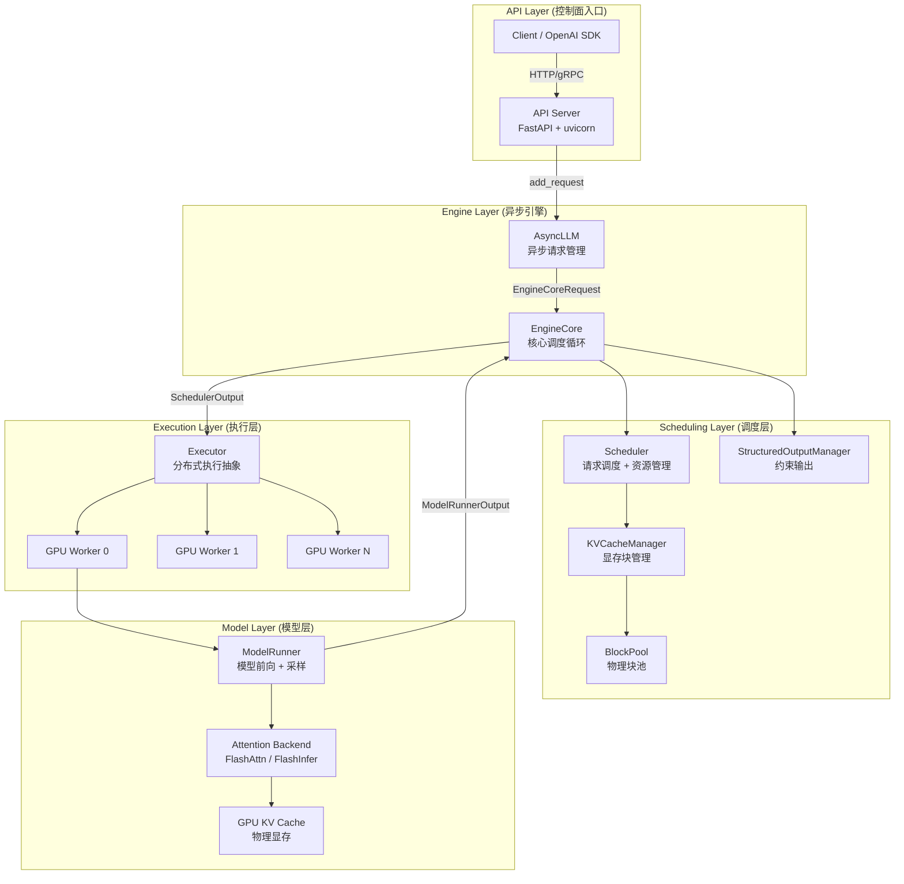
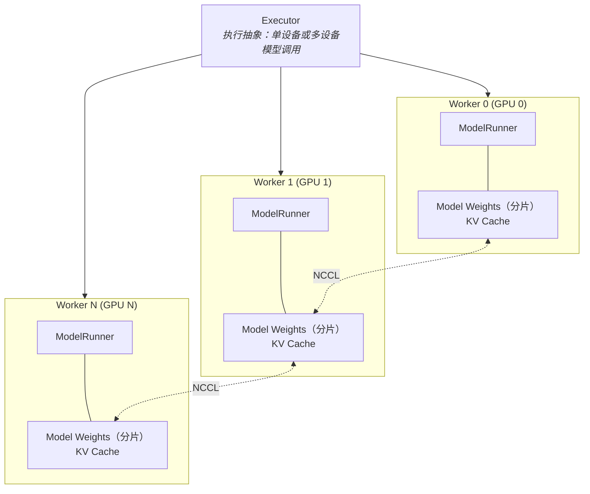
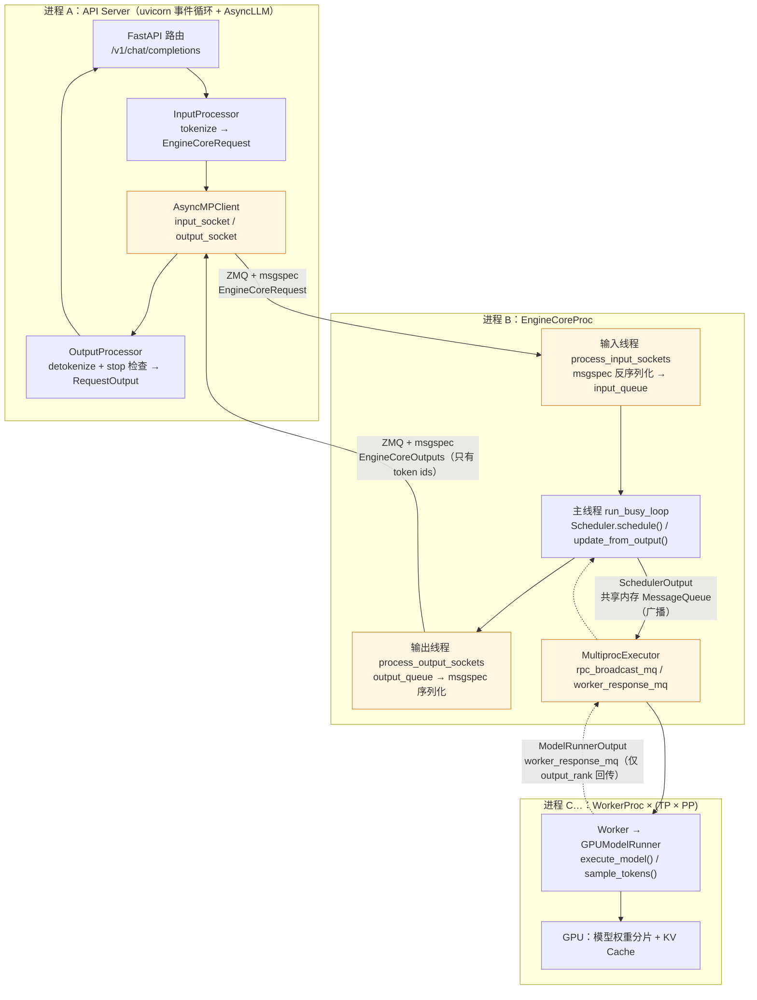
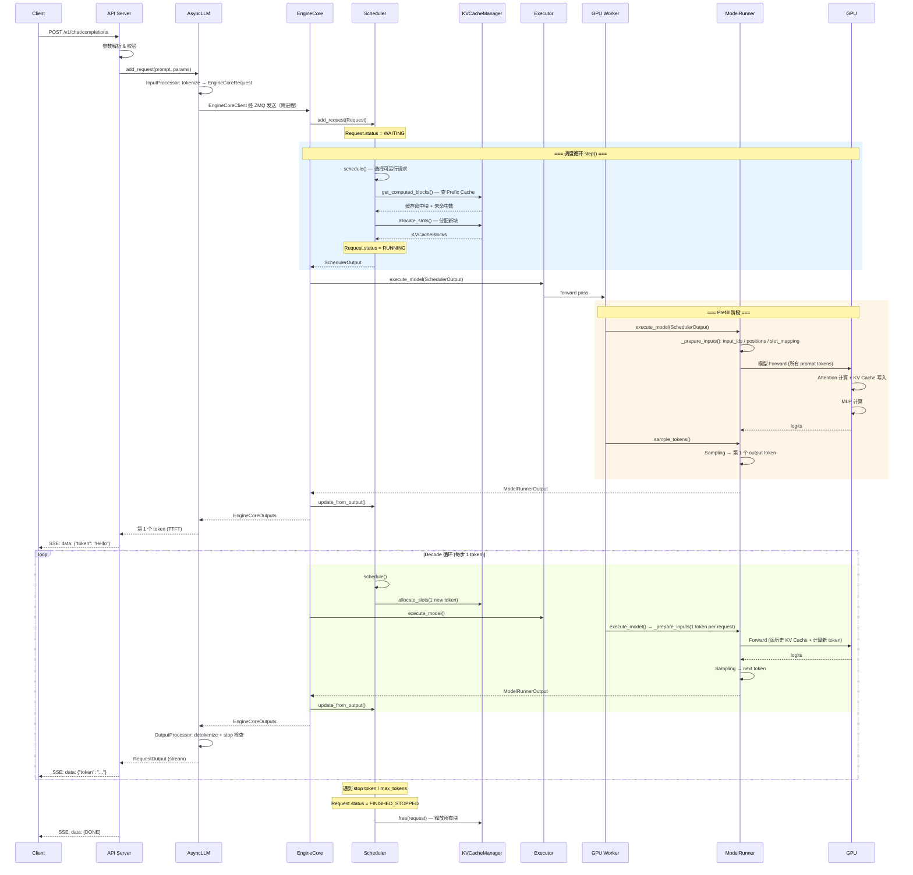
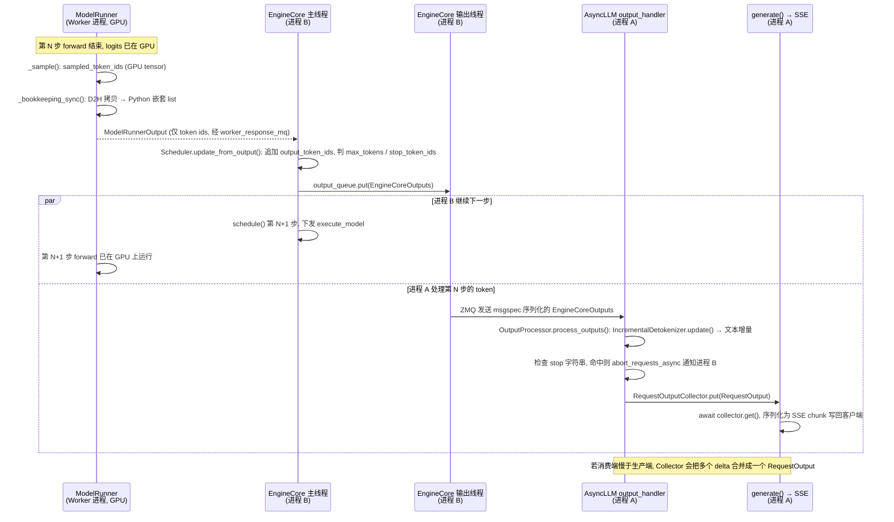

> 本文是[《大模型推理系统揭秘：从 vLLM 看 LLM Serving Infra 核心技术》](/deep-dive-into-vllm.html)系列的第 3 篇（共十四篇）。上一篇：[如何衡量一个 LLM Serving 系统？](/how-to-measure-llm-serving.html)；下一篇：[Scheduler：GPU 这一轮到底给谁用？](/scheduler-batch-and-fairness.html)

> **NOTE** 本文基于 vLLM v0.27.1（tag `6e448d0`, 2026-08-11）源码剖析。文中文件路径、类名和函数名均以该版本为准；vLLM 迭代很快，阅读时请以你手上的版本对照。


前两篇分别定义了问题（LLM Serving 为什么难）和尺子（用什么指标衡量）。在深入调度、KV Cache、GPU 执行等单个战场之前，需要先有一张全景图：一个请求进入 vLLM 之后，会经过哪些模块，以什么形式被传递，最后如何变成 token 返回给用户。

本篇的核心问题是：

> **一个请求如何穿过 vLLM 的整个推理系统——哪个模块负责决策、哪个模块负责执行，它们之间传递的到底是什么？**

## 一、总览：静态拓扑、动态生命周期与数据流

### 1. 三个视角看同一个系统

vLLM V1 的整体架构遵循**控制面/数据面分离**的经典设计哲学。本篇从三个视角鸟瞰它：先自顶向下看**静态系统拓扑**——API Server、AsyncLLM、EngineCore、Scheduler / KVCacheManager、Executor / Worker / ModelRunner 各自负责什么；再沿时间轴看**一次请求的完整生命周期**——从 HTTP 进入到 SSE 返回 `[DONE]` 的每一步交互；最后跟着**数据**走一遍，看文本如何变成 token ids、调度结果、GPU 张量、logits，再变回文本。

三个视角合起来回答的是模块之间的分工：EngineCore 驱动循环，Scheduler 决定这一轮谁跑、跑多少 token，Executor 负责分发，ModelRunner 负责真正调用 GPU 算。

### 2. 本文的章节安排

```text
第二章  静态系统拓扑          自顶向下：API Server 与 AsyncLLM、EngineCore、Scheduler 与 KVCacheManager、Worker 与 Executor
第三章  一次请求的完整生命周期  从 HTTP 请求到 SSE [DONE] 的时序图
第四章  数据流                Token 如何穿过整个 Serving 栈
第五章  本文小结              模块分工，以及与第一篇“四问”的对应
```

## 二、静态系统拓扑（自顶向下）

vLLM V1 的整体架构遵循**控制面/数据面分离**的经典设计哲学。我们自顶向下，逐层解剖其系统拓扑。



从这张图看，从 Client 到 EngineCore 是请求入队路径，传递的是"生成什么"；EngineCore 到 Worker 再到 ModelRunner 是执行路径，携带的是这一轮调度出来的 batch 和 block 布局；而 ModelRunner 返回的只是采样结果，不是下一次 forward 的完整状态。调度状态留在 EngineCore，模型侧负责的是单次前向计算。

### 1. API Server 与 AsyncLLM：异步并发处理的桥头堡

入口位于 `vllm/entrypoints/openai/api_server.py`，基于 FastAPI 构建的 HTTP 服务器，实现了 OpenAI 兼容的 `/v1/chat/completions`、`/v1/completions` 等 REST API。

`AsyncLLM`（`vllm/v1/engine/async_llm.py`）是面向外部的异步引擎接口。它自己不做重活，而是把工作交给三个同目录下的协作者：

- `InputProcessor`（`input_processor.py`）：把文本 / 多模态输入 tokenize、校验采样参数，产出 `EngineCoreRequest`；
- `EngineCoreClient`（`core_client.py`）：与 `EngineCore` 通信的客户端。默认部署下 `EngineCore` 运行在**独立进程**中，两者通过 ZMQ + msgspec 收发 `EngineCoreRequest` / `EngineCoreOutputs`（`AsyncMPClient`）；单进程调试时用 `InprocClient`。这条进程边界是 vLLM V1 让 HTTP 处理、tokenize / detokenize 与 GPU 调度循环互不阻塞的关键；
- `OutputProcessor`（`output_processor.py`）：接收 `EngineCoreOutputs`，做 detokenize、stop 条件检查、logprobs 整理，产出 `RequestOutput` 交给 API 层流式返回。

因此 `AsyncLLM` 的职责是：管理请求的异步生命周期、串起上述三者、支持 SSE 流式响应，以及数据并行（DP）场景下的多引擎协调。

### 2. EngineCore：推理系统的中央调度大脑

`EngineCore`（`vllm/v1/engine/core.py`）是 vLLM V1 引擎的核心，它的 `step()` 方法驱动整个推理循环：

```python
# vllm/v1/engine/core.py (简化)
class EngineCore:
    """Inner loop of vLLM's Engine."""

    def __init__(self, vllm_config, executor_class, ...):
        # 1. 初始化模型执行器
        self.model_executor = executor_class(vllm_config)

        # 2. 初始化 KV Cache
        kv_cache_config = self._initialize_kv_caches(vllm_config)

        # 3. 初始化调度器
        Scheduler = vllm_config.scheduler_config.get_scheduler_cls()
        self.scheduler = Scheduler(
            vllm_config=vllm_config,
            kv_cache_config=kv_cache_config,
            ...
        )
```

### 3. Scheduler 与 KVCacheManager：资源管理双核

`Scheduler`（`vllm/v1/core/sched/scheduler.py`，约 3000 行）是调度的大脑，决定每一轮迭代中哪些请求参与推理、分配多少 token 预算。

`KVCacheManager`（`vllm/v1/core/kv_cache_manager.py`）管理 GPU 显存上的 KV Cache 物理块——分配、释放、前缀缓存复用、驱逐。

### 4. Worker 与 Model Executor：模型执行的设备抽象



常见 GPU 部署中，Executor 会把一次 `execute_model()` 调用分发给一个或多个 Worker；Worker 再调用本地的 `ModelRunner` 执行模型前向、采样和 KV Cache 读写。单卡、同机多进程、Ray 分布式和 external launcher 的进程/设备映射并不完全相同，因此不应把“一个 GPU 固定绑定一个 Worker 进程”写成绝对规则。

每个 Worker 通常负责：
- `GPUModelRunner`（`vllm/v1/worker/gpu_model_runner.py`）：负责输入准备（`_prepare_inputs()`）、模型前向（`execute_model()`）、采样（`sample_tokens()`）。本系列图中简写为 ModelRunner。v0.27.1 另有一份新实现 `vllm/v1/worker/gpu/model_runner.py`，通过 `VLLM_USE_V2_MODEL_RUNNER=1` 启用，文中以默认实现为主线
- 模型权重的分片（Tensor Parallel 下每卡持有一部分）
- KV Cache 物理显存

`Executor`（`vllm/v1/executor/abstract.py`）是模型执行抽象层，负责在一个设备或多个设备上执行模型，而不是 Scheduler 本身。v0.27.1 中可见的主要实现包括：
- `UniProcExecutor`：单进程单卡
- `MultiprocExecutor`：多进程多卡（同机）
- `RayDistributedExecutor`：Ray 分布式（直接继承 `Executor`）
- `RayExecutorV2`：Ray 分布式的新实现，注意它继承的是 `MultiprocExecutor` 而非 `Executor`——即复用同一套 worker 进程管理逻辑，只把进程的**拉起方式**换成 Ray（`RayWorkerProc(WorkerProc)`）
- `ExecutorWithExternalLauncher`：外部 launcher 场景（继承 `UniProcExecutor`）

这条继承链本身就说明了一件事：**"用不用 Ray"是部署方式的差异，不是执行模型的差异。** Executor 这层抽象的价值就在于把"进程怎么起、卡怎么分"和"一轮 batch 怎么执行"彻底分开，所以 V2 才能靠换掉进程拉起方式来复用同机多进程的全部逻辑。

### 5. 进程视角：三类进程与两道 IPC 边界

上面几节按"模块"切分，但真正决定谁会阻塞谁的是**进程边界**。默认的 `vllm serve` + `MultiprocExecutor` 部署下，一个请求要跨越三类进程，中间是两种完全不同的 IPC 机制：



三点值得留意：

- **A ↔ B 走 ZMQ socket + msgspec**（`vllm/v1/engine/core_client.py` → `AsyncMPClient`；`vllm/v1/engine/core.py` → `EngineCoreProc`）。跨越这条边界的是 `EngineCoreRequest`（token ids 已经算好）和 `EngineCoreOutputs`（只有新 token ids，没有文本）——所以 tokenize 和 detokenize 都留在进程 A，GPU 循环所在的进程 B 从不碰字符串。
- **B ↔ C 走共享内存 `MessageQueue`**（`vllm/distributed/device_communicators/shm_broadcast.py`）。`SchedulerOutput` 经 `rpc_broadcast_mq` 一次广播给所有 Worker（TP 各 rank 需要同一份调度结果），而 `ModelRunnerOutput` 默认只由 `output_rank` 那一个 Worker 经自己的 `worker_response_mq` 回传，避免 N 份重复结果。
- 进程 B 内部又分三个线程：输入线程负责反序列化、输出线程负责序列化，主线程只跑 `schedule → execute → update_from_output` 这个 busy loop。这样序列化开销不会插进调度循环的关键路径。`UniProcExecutor` 时进程 C 退化为进程 B 内的一个对象，B ↔ C 边界消失，但 A ↔ B 依旧存在（`InprocClient` 除外）。


## 三、一次请求的完整生命周期



### 1. 流式输出：一个 token 从 GPU 到客户端

上面的时序图把 EngineCore 和 AsyncLLM 之间画成了同步的请求-应答，实际上它们跨进程、各自有独立的循环。下面把 decode 循环中**一个 token 的回程**放大，重点看两件事：detokenize 发生在哪个进程，以及引擎循环为什么不需要等它。



这张图解释了第二章第 5 节那两道进程边界的实际收益：进程 B 的主线程把 `EngineCoreOutputs` 丢进 `output_queue` 后立刻回到 `schedule()`，序列化由输出线程做，detokenize 和 stop 字符串检查由进程 A 的 `output_handler` 协程做，三者互不等待。代价是 stop **字符串**（而非 stop token id）的判定要晚一步——进程 A 检测到后反向发 abort，GPU 可能已经为这个请求多算了一步。另外，`RequestOutputCollector` 在 `DELTA` 模式下会把积压的输出合并，因此客户端收到的一个 SSE chunk 不一定恰好对应一个 decode 步。

## 四、数据流：Token 如何穿过整个 Serving 栈

```
  ┌──────┐     ┌─────────┐     ┌────────┐     ┌───────────┐
  │Client│────▶│API Server│────▶│AsyncLLM│────▶│EngineCore │
  └──────┘     └─────────┘     └────────┘     └─────┬─────┘
  "Hello,       HTTP JSON       add_request     EngineCoreReq
   tell me                      (text)          (token_ids)
   a joke"                         │
                              Tokenizer
                          [15496, 11, 2425,
                           757, 257, 9707]
                                                     │
                                              ┌──────▼──────┐
                                              │  Scheduler   │
                                              │  schedule()  │
                                              └──────┬──────┘
                                              SchedulerOutput
                                              (scheduled_new_reqs[NewRequestData:
                                                 prompt_token_ids, block_ids, ...],
                                               scheduled_cached_reqs[new_block_ids],
                                               num_scheduled_tokens{req_id: n},
                                               finished_req_ids, ...)
                                                     │
                                              ┌──────▼──────┐
                                              │  Executor    │
                                              │  → Worker    │
                                              └──────┬──────┘
                                                     │
                                              ┌──────▼──────┐
                                              │GPUModelRunner│
                                              │_prepare_inputs│
                                              └──────┬──────┘
                                              input_ids, positions,
                                              block_table, slot_mapping
                                                     │
                                              ┌──────▼──────┐
                                              │   GPU       │
                                              │  Forward    │
                                              │  Pass       │
                                              └──────┬──────┘
                                              logits [vocab_size]
                                                     │
                                              ┌──────▼──────┐
                                              │  Sampling   │
                                              │ (top-p/top-k│
                                              │  /temp)     │
                                              └──────┬──────┘
                                              sampled_token_id
                                                     │
                                              ┌──────▼──────┐
                                              │Detokenizer  │
                                              │ → "Sure"    │
                                              └──────┬──────┘
                                                     │
  ┌──────┐     ┌─────────┐                    ┌──────▼──────┐
  │Client│◀────│SSE Stream│◀───────────────────│  Response   │
  └──────┘     └─────────┘                    └─────────────┘
  "Sure, here's a joke..."
```

上图沿着数据走了一遍，但同一个请求在每一层其实是**不同的对象**——它们定义在不同文件、活在不同进程、寿命也不同。把这些对象排成一张表，就能看出"谁持有请求的真状态、谁只是一次性的快照"：

| 对象 | 定义位置 | 所在进程 | 生存期 | 它是什么 |
|---|---|---|---|---|
| HTTP JSON → `ChatCompletionRequest` | `vllm/entrypoints/openai/chat_completion/protocol.py` | A（API Server） | 一次 HTTP 连接 | 文本 prompt + 采样参数（用户视角） |
| `EngineCoreRequest` | `vllm/v1/engine/__init__.py` | A → B（msgspec 序列化过 ZMQ） | 只传一次 | 扁平的 IPC 载荷：`prompt_token_ids`、`sampling_params`、`arrival_time`… 已 tokenize，无状态 |
| `Request` | `vllm/v1/request.py`（`from_engine_core_request`） | B（Scheduler 内部） | 从入队到 `free()` | **请求状态的唯一权威副本**：`status` 状态机、`num_computed_tokens`、`output_token_ids`、`block_hashes` |
| `NewRequestData` / `CachedRequestData` | `vllm/v1/core/sched/output.py` | B → C（共享内存广播） | 一个 step | `SchedulerOutput` 里的两种"订单"：首次调度的请求带全量 `prompt_token_ids` + `block_ids`；已在 batch 里的只带增量 `new_token_ids` + `new_block_ids` |
| `SchedulerOutput` | `vllm/v1/core/sched/output.py` | B → C | 一个 step | 上面两者 + `num_scheduled_tokens{req_id: n}` + `finished_req_ids` 等：这一轮"谁跑、跑多少、块在哪" |
| `CachedRequestState` + `InputBatch` 行 | `vllm/v1/worker/gpu_input_batch.py` | C（Worker 常驻） | 从首次调度到 `finished_req_ids` | Worker 侧对 `Request` 的**镜像**，靠增量订单保持同步；`InputBatch` 是按行排列的持久 batch（`token_ids_cpu`、`block_table`） |
| `ModelRunnerOutput` | `vllm/v1/outputs.py` | C → B（`worker_response_mq`） | 一个 step | `req_ids` + `sampled_token_ids: list[list[int]]` + logprobs：只有采样结果，不含任何状态 |
| `EngineCoreOutput(s)` | `vllm/v1/engine/__init__.py` | B → A（ZMQ） | 一个 step | 每个请求的 `new_token_ids` + `finish_reason`；仍然只有 token ids |
| `RequestOutput` | `vllm/outputs.py` | A（`OutputProcessor` 产出） | 一个 SSE chunk | 第一次出现**文本**：detokenize 后的增量 `text` + `token_ids` |

表里有两条规律。第一，**状态只在 B 和 C 各有一份**：`Request` 是权威，`CachedRequestState` 是靠每步增量同步的镜像；所有跨进程的载荷（`EngineCoreRequest`、`SchedulerOutput`、`ModelRunnerOutput`、`EngineCoreOutputs`）都是无状态的一次性消息，读完即弃，也因此可以随意序列化、走任何 IPC 通道。第二，**文本只在进程 A 出现**：从 `EngineCoreRequest` 到 `EngineCoreOutputs` 全程都是 token ids，进程 B、C 完全不需要 tokenizer。


## 五、本文小结

这一章主要要关注的是模块之间的分工：

> **EngineCore 驱动循环，Scheduler 决定这一轮谁跑、跑多少 token，Executor 负责把任务分发下去，ModelRunner 负责真正调用 GPU 算。**

把它和第一篇的四问对齐，就得到全系列的骨架：

| 四问 | 承担模块 |
|------|---------|
| 一、这一轮谁执行、执行多少 | `Scheduler`（+ `EngineCore` 驱动） |
| 二、状态放哪、怎么复用 | `KVCacheManager` / `BlockPool` |
| 三、怎么算得更快 | `ModelRunner` / Attention Backend / Kernel |
| 四、怎么扩出去 | `Executor` / `Worker` / 集合通信 |


<details markdown="1">
<summary><b>📂 本章源码导航</b></summary>

**入口与引擎循环**

| 想看什么 | 从哪开始 |
|---|---|
| HTTP 入口、OpenAI 兼容接口 | `vllm/entrypoints/openai/api_server.py`（路由）、`vllm/entrypoints/openai/chat_completion/`（chat 接口实现） |
| 异步请求生命周期、流式响应 | `vllm/v1/engine/async_llm.py` |
| tokenize 与请求构造 | `vllm/v1/engine/input_processor.py` → `InputProcessor` |
| 与 EngineCore 进程通信 | `vllm/v1/engine/core_client.py` → `EngineCoreClient` / `AsyncMPClient` |
| detokenize 与输出整理 | `vllm/v1/engine/output_processor.py` → `OutputProcessor` |
| **推理主循环（建议从这里入手）** | `vllm/v1/engine/core.py` → `EngineCore.step()` |
| 调度器给执行层的"订单" | `vllm/v1/core/sched/output.py` → `SchedulerOutput` / `NewRequestData` / `CachedRequestData` |
| 执行抽象与各种部署形态 | `vllm/v1/executor/abstract.py` |
| 一轮 batch 在 GPU 上怎么跑 | `vllm/v1/worker/gpu_model_runner.py` → `GPUModelRunner.execute_model()` / `sample_tokens()` |

</details>


## 下一篇

[Scheduler：GPU 这一轮到底给谁用？](/scheduler-batch-and-fairness.html)
