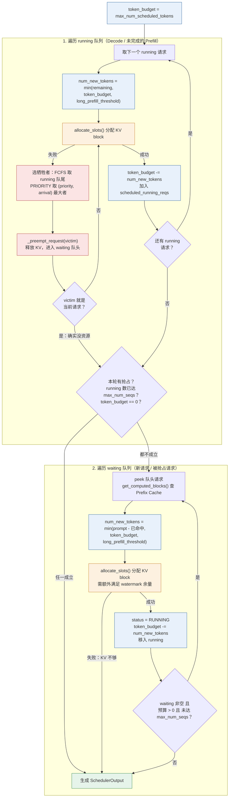
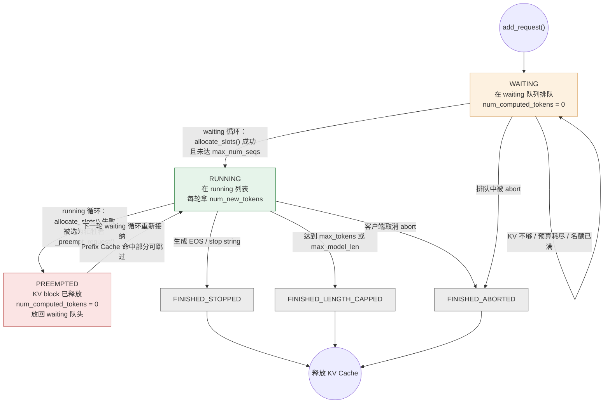

> 本文是[《大模型推理系统揭秘：从 vLLM 看 LLM Serving Infra 核心技术》](/deep-dive-into-vllm.html)系列的第 4 篇（共十四篇）。上一篇：[鸟瞰 vLLM：一个请求如何穿过整个推理系统？](/vllm-request-lifecycle-overview.html)；下一篇：[KV Cache：LLM Serving 的第一号内存问题](/kv-cache-memory-core.html)

> **NOTE** 本文基于 vLLM v0.27.1（tag `6e448d0`, 2026-08-11）源码剖析。文中文件路径、类名和函数名均以该版本为准；vLLM 迭代很快，阅读时请以你手上的版本对照。


上一篇的全景图里已经出现了一个关键事实：KV Cache 不再是一整块连续显存，而是按 Block 动态分配和回收的资源（PagedAttention），不同请求因此可以灵活共享 GPU 显存——它的管理细节留到第五篇。有了"显存可以按块调配"这个前提，一个更直接的问题就浮上来了：

> **GPU 这一轮到底给谁用？每个请求这一轮应该推进多少？**

这正是 Scheduler 要解决的问题。

传统深度学习推理通常以固定 Batch 为基本调度单位：

```text
Batch
 ├── Request A
 ├── Request B
 └── Request C

        ↓

执行完整 Batch

        ↓

所有 Request 完成
```

这种模式对于 CNN、分类模型等输入输出长度相对固定的任务比较合适。

但 LLM Serving 完全不同：

* 不同请求的 Prompt 长度不同；
* 每个请求最终生成多少 token 是未知的；
* Prefill 和 Decode 的计算特征不同；
* 请求会不断到达和完成；
* KV Cache 会随着生成过程动态增长；
* Speculative Decoding 甚至会让一次迭代推进多个 token。

因此，LLM Serving 的 Batch 不能再是一个固定不变的集合。

## 一、总览：调度要回答的五个问题

### 1. 从五个问题到一句话定义

vLLM 的调度可以理解为逐渐回答五个问题：

```text
为什么 Batch 必须动态变化？
        │
        ▼
1. Continuous Batching
        │
        ▼
为什么一个长 Prompt 也不能一次执行完？
        │
        ▼
2. Chunked Prefill
        │
        ▼
Scheduler 每一轮到底给每个 Request 多少计算额度？
        │
        ▼
3. Token Budget
        │
        ▼
为什么 Prefill / Decode / Speculative 可以同时存在？
        │
        ▼
4. Mixed Batch
        │
        ▼
如果 KV Cache 不够怎么办？
        │
        ▼
5. Admission Control & Preemption
```

最终可以把 Scheduler 理解为：

> **在计算资源和 KV Cache 资源的双重约束下，每一轮动态决定哪些 Request 执行，以及每个 Request 本轮推进多少 token。**

### 2. 本文的章节安排

```text
第二章  Continuous Batching            Static Batching 的问题，Batch 为什么必须动态变化
第三章  Chunked Prefill                长 Prompt 为什么也要分块，代价与 long_prefill_token_threshold
第四章  Token Budget                   Request 是调度对象、Token 是调度资源；schedule() 的完整例子与核心源码
第五章  Mixed Batch                    Prefill、Decode 与 Speculative 为什么可以共存；SchedulerOutput
第六章  Admission Control 与 Preemption  KV Cache 不够时：准入、抢占、重算 vs 换出、LIFO 与 Watermark
第七章  本文小结                       从“Batch 调度”到“资源调度”
```

## 二、Continuous Batching：为什么 Batch 必须动态变化？

### 1. Static Batching 的问题

传统推理系统通常采用 Static Batching。

例如有三个请求：

```text
Request A：生成 12 tokens
Request B：生成 6 tokens
Request C：生成 4 tokens
```

如果采用固定 Batch：

```text
Step 1：

A  ████████████
B  ██████
C  ████

Step 2：

A  ████████████
B  ██████
C  ████

...

Step 4：

A  ████████████
B  ██████
C  ████
              ↑
          B、C 已经完成

...

Step 12：

A  ████████████
B  idle
C  idle
```

问题很明显：

> **请求 B、C 已经完成，但 Batch 仍然要等请求 A。**

GPU 的部分计算资源因此被浪费。

更严重的是，新来的 Request D 即使已经排队，也无法及时加入当前 Batch：

```text
A ──────────────────────────────►
B ───────────► done

C ────────► done

D ────────► waiting...
```

于是系统形成：

```text
GPU
│
├── 已完成请求释放资源
│
├── Batch 仍然没有结束
│
└── 新请求无法及时进入
```

### 2. Continuous Batching

LLM 的生成过程天然是迭代式的：

```text
Iteration 1
    ↓
Iteration 2
    ↓
Iteration 3
    ↓
...
```

因此，一个更合理的做法是：

> **不再固定整个 Batch 的生命周期，而是在每一轮迭代开始之前重新决定本轮有哪些 Request 参与执行。**

这就是 Continuous Batching。

```text
                 Continuous Batching

Iter 1:   [A] [B] [C]

Iter 2:   [A] [B] [C]

Iter 3:   [A] [B] [C] → A 完成

Iter 4:        [B] [C] [D]   ← D 加入

Iter 5:        [B] [C] [D] [E]  ← E 加入

Iter 6:        [B] [D] [E]      ← C 完成

...
```

与 Static Batching 相比：

| 特性         | Static Batching | Continuous Batching |
| ---------- | --------------- | ------------------- |
| Batch 生命周期 | 固定              | 每轮动态调整              |
| 新请求加入      | 等 Batch 结束      | 每轮都可以尝试加入           |
| 已完成请求      | 占位直到 Batch 结束   | 立即释放资源              |
| Padding    | 通常需要            | 不需要为了 Batch 对齐而等待   |
| GPU 利用率    | 请求完成后逐渐下降       | 可以持续填充              |
| 调度复杂度      | 较低              | 较高                  |

因此，Continuous Batching 的核心不是简单地：

> “把更多 Request 放进 Batch。”

而是：

> **每一次迭代，都重新决定 GPU 这一轮应该服务哪些 Request。**


## 三、Chunked Prefill：为什么一个 Request 也不能一次吃完？

Continuous Batching 解决了：

> **不同 Request 之间如何动态加入和退出。**

但还有一个问题：

> **如果某一个 Request 自己就非常大怎么办？**

例如一个 32K token 的 Prompt：

```text
Request A
┌─────────────────────────────────────────────┐
│              32K Prompt                     │
└─────────────────────────────────────────────┘
```

如果一次性完成 Prefill：

```text
Iteration 1：

[A: Prefill 32K]
```

那么 A 可能长时间占用 GPU。

此时其他已经处于 Decode 状态的请求：

```text
Request B → Decode
Request C → Decode
Request D → Decode
```

都可能被迫等待。

于是出现典型的 Head-of-Line Blocking：

```text
Long Prefill
████████████████████████████████████████

B Decode   ──────────────────────────────
C Decode   ──────────────────────────────
D Decode   ──────────────────────────────
                 ↑
              被阻塞
```

这会直接影响 Decode 请求的 TPOT。

### 1. Chunked Prefill

因此，长 Prompt 也需要被拆成多个 Chunk：

```text
32K Prompt

┌──────┬──────┬──────┬──────┬──────┐
│Chunk1│Chunk2│Chunk3│Chunk4│Chunk5│ ...
└──────┴──────┴──────┴──────┴──────┘
```

例如：

```text
Iteration 1:
[A: Chunk1] [B: Decode] [C: Decode]

Iteration 2:
[A: Chunk2] [B: Decode] [C: Decode]

Iteration 3:
[A: Chunk3] [B: Decode] [C: Decode]

...
```

这样，A 不再一次性独占 GPU，而是和其他请求交替推进。

```text
没有 Chunked Prefill：

Iter 1   [Long Prefill ████████████████████]
Iter 2   [Long Prefill ████████████████████]
Iter 3   [Long Prefill ████████████████████]
Iter 4   [Decode A][Decode B][Decode C]


有 Chunked Prefill：

Iter 1   [Chunk1][Decode A][Decode B]
Iter 2   [Chunk2][Decode A][Decode B]
Iter 3   [Chunk3][Decode A][Decode B]
Iter 4   [Chunk4][Decode A][Decode B]
...
```

### 2. Chunked Prefill 的代价

Chunked Prefill 并不是免费优化。

它实际上是在做一个典型的：

> **TTFT ↔ TPOT trade-off**

如果长 Prompt 一次性执行：

```text
Long Request
      ↓
快速完成 Prefill
      ↓
TTFT 较低

但：

Decode Requests
      ↓
被阻塞
      ↓
TPOT 出现尖峰
```

如果采用 Chunked Prefill：

```text
Long Request
      ↓
Prefill 被拆成多个 Chunk
      ↓
TTFT 上升

但：

Decode Requests
      ↓
可以持续执行
      ↓
TPOT 更平稳
```

因此，Chunked Prefill 的本质不是简单的“把 Prompt 切小”。

更准确地说：

> **Chunked Prefill 将一个巨大的 Prefill 工作量拆成多个可调度的 token 额度，使 Scheduler 可以在长 Prompt 与 Decode 请求之间重新分配 GPU 计算资源。**

这里已经出现了一个非常关键的概念：

> **Token Budget。**


### 3. `long_prefill_token_threshold`

在 vLLM 中，可以通过：

```python
long_prefill_token_threshold
```

限制一次 Prefill 可以推进的 token 数量。

概念上可以理解为：

```python
num_new_tokens = min(
    num_new_tokens,
    long_prefill_token_threshold,
)
```

例如：

```text
Prompt = 2050 tokens
long_prefill_token_threshold = 512
```

那么这个 Prefill 最多可以被拆成：

```text
512 + 512 + 512 + 512 + 2
```

即：

```text
Chunk 1 → 512
Chunk 2 → 512
Chunk 3 → 512
Chunk 4 → 512
Chunk 5 → 2
```

代价是这个请求需要更多轮才能完成 Prefill，TTFT 可能上升；收益则是其他 Decode 请求不容易被一个长 Prefill 长时间阻塞。

因此：

> **Chunked Prefill 实际上是在调度层把“长请求”变成多个可以跨 iteration 分配的工作单元。**

而接下来真正需要回答的问题是：

> **Scheduler 每一轮到底有多少工作额度可以分配？又应该如何在不同 Request 之间分配？**


## 四、Token Budget：Scheduler 每一轮到底怎么分配？

这一节是整个 Scheduler 的核心。

前面的 Continuous Batching 解决了：

> Request 可以动态加入和退出。

Chunked Prefill 又解决了：

> 一个 Request 也可以被拆成多个部分逐步推进。

于是 Scheduler 每一轮都面临一个非常具体的问题：

> **这一轮 GPU 最多处理多少 token？这些 token 应该分给哪些 Request？**


### 1. Request 是调度对象，Token 是调度资源

这里需要先纠正一个非常容易产生误解的说法。

不要简单理解成：

> Scheduler 调度的不是 Request，而是 Token。

更准确的说法是：

> **Request 是 Scheduler 的调度对象，Token 是 Scheduler 分配计算资源的基本单位。**

也就是说：

```
                    Scheduler
                        │
              调度哪些 Request？
                        │
                        ▼
                  Request A
                  Request B
                  Request C
                        │
                        │
                 每个 Request
                 分配多少 token？
                        │
                        ▼
              num_new_tokens
```

所以，Scheduler 并不是把 token 当成独立任务进行调度，而是：

> **以 Request 为对象，以 token 为资源，决定每个 Request 本轮推进多少 token。**


### 2. 每一轮首先确定 Token Budget

Scheduler 首先需要确定：

> **本轮最多允许处理多少 token？**

在 vLLM V1 中，Scheduler 有一个配置项：

```text
max_num_scheduled_tokens
```

它定义的是：

> **一次 `schedule()` iteration 中，最多允许调度多少个 token。**

例如：

```text
max_num_scheduled_tokens = 512
```

那么：

```text
本轮 Token Budget = 512
```

意味着：

```text
这一轮最多安排 512 token 的计算工作
```

所有 Request 在这一轮消耗的 token 额度之和不能超过这个预算：

```text
Σ num_new_tokens_i ≤ 512
```

于是 Scheduler 的问题就可以抽象成：

```text
给每一个 Request 分配 x_i 个 token

满足：

0 ≤ x_i ≤ request_remaining_i

Σ x_i ≤ Token Budget
```

这就是 Scheduler 最核心的资源分配问题。


### 3. Request 还需要推进多少？

Scheduler 需要知道：

> **这个 Request 到底还差多少 token？**

vLLM 中有两个非常关键的量：

```text
num_tokens_with_spec
num_computed_tokens
```

它们可以帮助我们理解 Scheduler 的工作方式。


**`num_computed_tokens`**

表示这个 Request 当前已经完成计算的 token 数量。

例如：`Prompt = 2050 tokens`，而当前：`num_computed_tokens = 1024`，

这意味着：

```text
前 1024 tokens
      ↓
已经完成计算
      ↓
对应 KV Cache 已经建立
```

**`num_tokens_with_spec`**

它表示当前 Request 这一轮希望推进到的目标 token 位置。

普通 Decode 情况下，通常只需要推进一个 token：

```text
num_tokens_with_spec ≈ num_computed_tokens + 1
```

而如果涉及 speculative decoding，则可能一次需要推进多个 token：

```text
num_tokens_with_spec > num_computed_tokens + 1
```

因此，Scheduler 可以计算：

```text
remaining_tokens = num_tokens_with_spec - num_computed_tokens
```

也就是：

> **这个 Request 当前还需要多少 token 的计算额度。**


### 4. `num_new_tokens`：本轮真正分配多少？

Scheduler 最终真正关心的是：

```text
num_new_tokens
```

即：

> **这个 Request 在本轮到底推进多少 token。**

概念上可以理解为：

```python
remaining_tokens = (
    req.num_tokens_with_spec
    - req.num_computed_tokens
)

num_new_tokens = min(
    remaining_tokens,
    token_budget,
    other_constraints,
)
```

然后：

```python
token_budget -= num_new_tokens
```

于是：

```text
                  Token Budget
                       │
                       ▼
                ┌─────────────┐
                │    512      │
                └──────┬──────┘
                       │
             ┌─────────┼─────────┐
             ▼         ▼         ▼
           Req A     Req B     Req C
           400         1         1
             │         │         │
             └─────────┼─────────┘
                       ▼
                  剩余 110
```

这就是 Scheduler 最核心的工作。


### 5. 用一个完整例子看懂 `schedule()`

假设当前：

```text
max_num_scheduled_tokens = 512
```

也就是：

```text
Token Budget = 512
```

当前有三个正在运行的 Request：

```text
Request A：
长 Prompt Prefill
remaining = 400

Request B：
普通 Decode
remaining = 1

Request C：
普通 Decode
remaining = 1
```

Scheduler 可以分配：

```text
A → 400
B → 1
C → 1
```

消耗：

```text
400 + 1 + 1 = 402
```

于是：

```text
剩余 Token Budget
    =
512 - 402
    =
110
```

此时 waiting 队列中还有：

```text
Request D：
Prompt = 300 tokens
```

Scheduler 不需要等待 A、B、C 全部完成。

只要还有预算，就可以继续接纳 D：

```text
D → 110
```

最终：

```text
┌─────────────────────────────────────────────┐
│          Token Budget = 512                 │
├─────────────────────────────────────────────┤
│ Request A：Prefill       400 tokens         │
│ Request B：Decode          1 token          │
│ Request C：Decode          1 token          │
│ Request D：Prefill       110 tokens         │
├─────────────────────────────────────────────┤
│ Total                    512 tokens         │
└─────────────────────────────────────────────┘
```

这就是一个典型的 Mixed Batch。

但注意：

> **此时 Scheduler 根本不需要创建三个不同的 Batch。**

它只是在一个统一的 Token Budget 下：

```text
A → 400
B → 1
C → 1
D → 110
```

### 6. Decode 为什么也是同一个调度模型？

现在看普通 Decode。

假设：

```text
Request B：

num_computed_tokens = 100
num_tokens_with_spec = 101
```

那么：

```text
remaining_tokens = 101 - 100 = 1
```

因此：

```text
B → 1 token
```

这就是普通 Decode。

而一个长 Prompt：

```text
num_computed_tokens = 1000
num_tokens_with_spec = 1500
```

那么：

```text
remaining_tokens = 1500 - 1000 = 500
```

这就是 Prefill workload。

因此，从 Scheduler 的角度看：

```text
Prefill：

remaining_tokens 很大

Decode：

remaining_tokens 通常为 1

Chunked Prefill：

remaining_tokens 很大
但单轮只能推进一部分

Speculative Decode：

remaining_tokens 可能大于 1
```

所以可以得到一个非常重要的结论：

> **从 Scheduler 的角度，Prefill、Decode 并不是两套完全独立的调度算法，而只是不同 Request 在当前 iteration 中具有不同的 token 推进需求。**

Prefill 和 Decode 依然是非常重要的性能分析概念，但它们并不意味着 Scheduler 内部必须存在两个完全独立的“Prefill Scheduler”和“Decode Scheduler”。


### 7. Scheduler 的核心源码逻辑

在 vLLM V1 中，关键逻辑位于：

```text
vllm/v1/core/sched/scheduler.py
```

其中 `Scheduler.schedule()` 可以概念化为：

```python
def schedule(self, throttle_prefills=False):
    token_budget = self.max_num_scheduled_tokens

    # 1. 先处理已经 Running 的 Request
    for req in self.running:

        target = req.num_tokens_with_spec

        num_new_tokens = (
            target - req.num_computed_tokens
        )

        num_new_tokens = min(
            num_new_tokens,
            token_budget,
        )

        # 长 Prefill 的额外限制
        if self.scheduler_config.long_prefill_token_threshold > 0:
            num_new_tokens = min(
                num_new_tokens,
                self.scheduler_config.long_prefill_token_threshold,
            )

        # 2. 尝试为这些 token 分配 KV Cache；分不到就抢占别人，直到分到或没人可抢
        while True:
            blocks = self.kv_cache_manager.allocate_slots(
                req, num_new_tokens, num_lookahead_tokens=...,
            )
            if blocks is not None:
                break
            # 选择牺牲者：FCFS 下是 running 队尾（最晚进入的）；
            # PRIORITY 下是 (priority, arrival_time) 最大者，即优先级最低、最晚到的
            if self.policy == SchedulingPolicy.PRIORITY:
                victim = max(self.running, key=lambda r: (r.priority, r.arrival_time))
                self.running.remove(victim)
            else:
                victim = self.running.pop()
            self._preempt_request(victim)
            if victim == req:
                break          # 抢到自己头上了，说明确实没资源，本轮到此为止

        if blocks is None:
            break

        # 3. 消耗本轮 Token Budget
        token_budget -= num_new_tokens

    # 4. 再尝试接纳 Waiting Request
    for req in self.waiting:

        computed_blocks, num_computed = (
            self.kv_cache_manager.get_computed_blocks(req)
        )

        num_new_tokens = (
            req.num_tokens_with_spec
            - num_computed
        )

        num_new_tokens = min(
            num_new_tokens,
            token_budget,
        )

        blocks = self.kv_cache_manager.allocate_slots(
            req,
            num_new_tokens,
        )

        if blocks is None:
            break

        req.status = RequestStatus.RUNNING

        token_budget -= num_new_tokens

    return SchedulerOutput(...)
```

把上面两个循环的分支画出来，可以更清楚地看到 Token Budget 递减、KV Cache 分配失败时的抢占循环，以及 waiting 队列在什么条件下根本不会被看一眼（本轮发生过抢占、running 已达 `max_num_seqs`、预算已耗尽）：



两点在源码里容易被忽略、但对理解"公平性"很关键：

* **running 优先于 waiting**。已经在跑的 Decode 请求先拿预算和 KV，新请求只能吃剩下的——这是保证 TPOT 平稳的前提；
* **本轮一旦发生抢占，waiting 队列直接跳过**（`if not preempted_reqs` 才进入第二个循环）。因为抢占说明 KV Cache 已经紧张，再接纳新请求只会立刻触发下一次抢占。

这里最值得注意的是：

```python
num_new_tokens = (
    req.num_tokens_with_spec
    - req.num_computed_tokens
)
```

以及：

```python
token_budget -= num_new_tokens
```

它们共同构成了 Scheduler 的核心逻辑：

```text
Request 当前还差多少？
        │
        ▼
remaining_tokens
        │
        │ 与本轮 Token Budget 比较
        ▼
num_new_tokens
        │
        ▼
allocate_slots()
        │
        ▼
消耗 Token Budget
        │
        ▼
继续处理下一个 Request
```

需要特别注意：

> 上面的两个 `for` 循环并不是“Decode 循环”和“Prefill 循环”。

它们更准确地表示：

```text
Running Requests
        ↓
Waiting Requests
```

在这两个集合中，Scheduler 都是在做同一件事情：

> **计算 Request 当前需要推进多少 token，并在本轮剩余 Token Budget 和其他资源约束下决定实际推进多少。**


### 8. Token Budget 与 KV Cache 是两个不同维度的约束

到这里还需要区分一个非常重要的概念。

Scheduler 同时受到两类资源约束：

```text
                Scheduler
                    │
          ┌─────────┴─────────┐
          │                   │
          ▼                   ▼
     Compute Resource     Memory Resource
     Token Budget          KV Cache
          │                   │
          ▼                   ▼
  本轮最多算多少 token    能否容纳这些 token
```

Token Budget 回答：

> **这一轮最多执行多少计算？**

KV Cache 回答：

> **这些 token 对应的 KV Cache 是否有地方存？**

因此，即使：

```text
Token Budget = 512
```

也不代表一定可以执行 512 tokens。

例如：

```text
Token Budget 足够
        │
        ▼
需要分配 KV Cache
        │
        ▼
KV Cache Block 不够
        │
        ▼
无法继续接纳 / 需要抢占
```

这就是下一章 Admission Control 与 Preemption 要解决的问题。

整体调度流程如下：

```text
                    Scheduler
                        │
                        ▼
          max_num_scheduled_tokens
                        │
                        ▼
                ┌──────────────┐
                │ Token Budget │
                └──────┬───────┘
                       │
                       ▼
             Request token demand
                       │
                       ▼
                num_new_tokens
                       │
                       ▼
                allocate_slots()
                       │
                       ▼
                 KV Cache
                       │
             ┌─────────┴─────────┐
             ▼                   ▼
           足够                  不足
             │                   │
             ▼                   ▼
          执行                  等待/抢占
```

### 9. 另一个上限：`max_num_seqs`

Token Budget 限制的是"本轮算多少 token"，但 Scheduler 还有第二个计算侧上限：`SchedulerConfig.max_num_seqs`（`Scheduler.__init__` 里赋给 `self.max_num_running_reqs`）。它限制的是**同时处于 running 的请求个数**：waiting 循环每次接纳新请求之前，都会先检查 `len(self.running) >= self.max_num_running_reqs`，达到就直接 `break`。

两个上限卡住的是 Batch 的不同维度，哪一个先生效取决于 workload 形态：

| 场景 | 配置 | running 请求构成 | 本轮 token 数 | 先碰到哪个上限 | 后果 |
| --- | --- | --- | ---: | --- | --- |
| Prefill 为主 | budget=2048, max_num_seqs=256 | 4 个新请求，Prompt 各 1000 | 2048 | **Token Budget**：前两个各拿 1000，第三个只拿 48（chunk），第四个本轮进不来 | running 只有 3 个，远未到 256；GPU 算力被打满 |
| Decode 为主 | budget=2048, max_num_seqs=256 | 256 个请求都在 Decode，各 1 token | 256 | **max_num_seqs**：第 257 个 waiting 请求即使有 KV、预算还剩 1792 也进不来 | 预算只用了 12.5%，GPU 显著欠载（memory-bound） |
| 混合 | budget=2048, max_num_seqs=256 | 200 个 Decode + 1 个 Prefill 1800 | 2000 | 都没碰到；再来一个 Prompt 300 的请求只能拿 48 | 典型 Mixed Batch，长 Prefill 被自然切成 chunk |

从这张表可以看出，Decode 为主的在线服务往往是 `max_num_seqs` 而不是 Token Budget 在决定 Batch 大小——每个 Decode 请求只消耗 1 token 的预算，却占掉一个 running 名额，同时还长期占着 KV Cache。这也是为什么调大 `max_num_seqs` 通常要和 KV Cache 容量（`gpu_memory_utilization`、Block 数）一起考虑：名额放开了，但 KV 装不下，结果就是下一章要讲的抢占。

## 五、Mixed Batch：为什么 Prefill、Decode 与 Speculative 可以共存？

前面的 Token Budget 机制实际上已经自然产生了 Mixed Batch。

所谓 Mixed Batch，并不是 Scheduler 专门定义了一种新的：

```text
MixedBatch
```

而是：

> **多个不同类型的 Request 在同一个 Token Budget 下同时获得 token 推进额度。**


### 1. 一轮 GPU 中可以同时有什么？

假设当前：

```text
Token Budget = 512
```

系统中有：

```text
Request A：
长 Prompt，还没有完成 Prefill

Request B：
正常 Decode

Request C：
Speculative Decode

Request D：
刚刚进入系统，需要 Prefill
```

Scheduler 可以得到类似这样的分配：

| Request   | 本轮 token | Workload           | 含义                    |
| --------- | -------: | ------------------ | --------------------- |
| A         |      256 | Prefill            | 长 Prompt 的一个 Chunk    |
| B         |        1 | Decode             | 生成下一个 token           |
| C         |        5 | Speculative Decode | 推进真实 token + 候选 token |
| D         |      250 | Prefill            | 新请求开始 Prefill         |
| **Total** |  **512** |                    |                       |

于是这一轮：

```text
┌─────────────────────────────────────────────┐
│             Token Budget = 512              │
├─────────────────────────────────────────────┤
│ A：Prefill Chunk       256 tokens           │
│ B：Decode                1 token            │
│ C：Speculative           5 tokens           │
│ D：Prefill              250 tokens           │
├─────────────────────────────────────────────┤
│ Total                   512 tokens           │
└─────────────────────────────────────────────┘
```

这就是 Mixed Batch。


### 2. Mixed Batch 并不是三种 Batch 拼起来

这里非常容易产生误解。

不要理解成：

```text
Prefill Batch
      +
Decode Batch
      +
Speculative Batch
      ↓
Mixed Batch
```

更准确的理解是：

```text
                 Scheduler
                     │
                     ▼
              Token Budget
                     │
          ┌──────────┼──────────┐
          ▼          ▼          ▼
        Req A      Req B      Req C
          │          │          │
       256 token    1 token    5 token
          │          │          │
          └──────────┼──────────┘
                     ▼
                SchedulerOutput
```

也就是说：

> **Scheduler 只有一套统一的 token 分配逻辑，而 Prefill、Decode、Speculative 只是不同 Request 在这一轮产生了不同的 token 推进需求。**

这也是为什么 Token Budget 是理解 Mixed Batch 的关键。


### 3. Speculative Decoding 为什么可以自然融入？

普通 Decode：

```text
当前已经计算到 token N

下一轮：
推进 1 token
```

因此：

```text
remaining ≈ 1
```

而 Speculative Decoding 可能希望一次推进多个 token：

```text
当前：
N

Speculative：
N+1
N+2
N+3
N+4
```

因此：

```text
remaining > 1
```

对于 Scheduler 来说，两者最终都只是：

```text
Request
    ↓
num_tokens_with_spec
    ↓
num_computed_tokens
    ↓
remaining tokens
    ↓
num_new_tokens
```

所以 Scheduler 不需要重新设计一套：

```text
Speculative Scheduler
```

而是使用同一个 Token Budget 模型处理。

这也是一个非常重要的架构思想：

> **上层优化可以改变一个 Request 一轮希望推进的 token 数量，但不需要改变 Scheduler 的基本资源分配抽象。**

因此，Speculative Decoding 与普通 Decode 可以在同一个 iteration 中共存。

### 4. SchedulerOutput：调度完成后发生什么？

Scheduler 完成本轮决策后，并不会直接执行模型计算。

它会将本轮调度结果通过：

```text
SchedulerOutput
```

传递给执行层。

可以把整个过程理解为：

```text
                 Scheduler
                     │
                     │ schedule()
                     ▼
          ┌─────────────────────┐
          │   SchedulerOutput   │
          ├─────────────────────┤
          │ Request 列表        │
          │ token 数量          │
          │ KV Cache 分配结果   │
          │ 其他调度元数据      │
          └──────────┬──────────┘
                     │
                     ▼
                 ModelRunner
                     │
                     ▼
              InputBatch
                     │
                     ├── slot_mapping
                     ├── block_table
                     └── attention metadata
                     │
                     ▼
                 GPU 执行
```

因此：

> **Scheduler 负责“决定这一轮算什么”，执行层负责“把这个决定真正变成 GPU 上的计算”。**

执行层需要通过 `InputBatch`、`slot_mapping`、block table 和 attention metadata，把这些不同形态的 token 组织成一次 GPU forward。

```
┌──────────────── 一轮 Mixed Batch 的 token 构成 ──────────────────────┐
│                                                                      │
│  SchedulerOutput (本轮 token 预算分配结果):                            │
│                                                                      │
│  ┌─ Req A (长 prefill, 已推进 256, 本轮再推 256) ──────────────────┐ │
│  │  |████████████████████████|  ← 256 个 prefill tokens              │ │
│  │  block_table = [7, 13]  (新分配的块)                              │ │
│  └──────────────────────────────────────────────────────────────────┘ │
│                                                                      │
│  ┌─ Req B (普通 decode) ───────────────────────────────────────────┐ │
│  │  |█|  ← 1 个 decode token                                        │ │
│  │  block_table 追加 slot 到已有块                                   │ │
│  │  KV Cache 已累积 seq_len=512                                     │ │
│  └──────────────────────────────────────────────────────────────────┘ │
│                                                                      │
│  ┌─ Req C (decode, spec decode) ───────────────────────────────────┐ │
│  │  |█ █ █ █ █|  ← 1 个真实 token + 4 个候选 token                  │ │
│  │  block_table 额外预留 lookahead slots                             │ │
│  └──────────────────────────────────────────────────────────────────┘ │
│                                                                      │
│  GPU 侧组装:                                                          │
│  ┌──────────────────────────────────────────────────────────────────┐ │
│  │  InputBatch (扁平的 token 序列):                                  │ │
│  │  [A₀ A₁ … A₂₅₅ | B₀ | C₀ C₁ C₂ C₃ C₄]                         │ │
│  │  total_tokens = 256 + 1 + 5 = 262                                │ │
│  │                                                                  │ │
│  │  slot_mapping (每个 token 的 KV 写入位置):                        │ │
│  │  A: [block7:0..15, block13:0..15, ...]  (新块, 全部写入)         │ │
│  │  B: [block3:slot15]                    (追加到已存在块尾部)        │ │
│  │  C: [block5:slot12..16]               (含 lookahead 预留)        │ │
│  │                                                                  │ │
│  │  attention metadata 统计（用于 backend 内部分支）:                 │ │
│  │  num_prefill_tokens = 256  → backend 先处理这 256 个 prefill token│ │
│  │  num_decode_tokens  = 6    → 再处理这 6 个 decode/candidate token │ │
│  │  block_table (per-req) 告诉 kernel 每个请求的 KV 块映射            │ │
│  │  query_start_loc 区分不同请求的 token 起始位置                     │ │
│  └──────────────────────────────────────────────────────────────────┘ │
│                                                                      │
│  关键: 模型级只有一个 attention backend, 不是 per-request 切换。       │
│  该 backend 根据 metadata 中的 prefill/decode token 计数,              │
│  在自己的 forward 内调用不同的底层 kernel (如 FlashInfer 的             │
│  trtllm_batch_context_with_kv_cache 和 trtllm_batch_decode_...)。     │
└──────────────────────────────────────────────────────────────────────┘
```

## 六、Admission Control 与 Preemption：KV Cache 不够怎么办？

到这里，Scheduler 已经解决了：

> **计算资源怎么分？**

但还存在另外一个问题：

> **如果 KV Cache 已经没有足够空间了怎么办？**

这是 LLM Serving 中非常现实的问题。

因为每推进一个 token，都可能需要增加对应的 KV Cache。

于是 Scheduler 同时受到：

```text
计算约束：
Token Budget

内存约束：
KV Cache Blocks
```


### 1. Admission Control：不是所有 Request 都能立即进入 Running

假设：

```text
GPU KV Cache
┌─────────────────────────────┐
│ █ █ █ █ █ █ █ █ █ █ █ █ █ │
│ █ █ █ █ █ █ █ █ █ █ █ █ █ │
│ █ █ █ █ █ █ █ █ █ █ █ █ █ │
└─────────────────────────────┘

Free Blocks = 很少
```

此时来了一个新的 Request：

```text
Request D
Prompt = 4K tokens
```

即使：

```text
Token Budget 足够
```

也不代表 D 能立即运行。

因为：

```text
Token Budget 足够
        │
        ▼
需要 KV Cache
        │
        ▼
Free Blocks 不足
        │
        ▼
无法继续
```

因此 Scheduler 在接纳 Waiting Request 时，需要同时考虑 KV Cache 是否能够满足需求。

这就是 Admission Control。

可以简单理解成：

> **先判断“GPU 有没有能力接纳这个 Request”，再决定是否让它进入 Running。**


### 2. KV Cache 不够：Preemption

如果当前 Running Requests 已经占满 KV Cache，而又有更高优先级的调度需求，Scheduler 就可能需要抢占某些 Request。

概念流程：

```text
KV Cache 不足
      │
      ▼
需要释放 KV Cache
      │
      ▼
选择一个 Running Request
      │
      ▼
Preemption
      │
      ├── 释放 KV Cache
      │
      ├── Request 状态变为 PREEMPTED
      │
      └── 重新进入 Waiting
```

vLLM V1 当前主要使用 **Recomputation** 思路：

```text
Preempt
   ↓
释放该 Request 的 KV Cache
   ↓
num_computed_tokens = 0
   ↓
重新进入 Waiting
   ↓
恢复运行时重新计算
```

也就是说：

> **抢占并不是把 Request 本身删除，而是释放它占用的 KV Cache，之后再重新计算。**

把状态放到一起看，一个 Request 在 Scheduler 眼里的生命周期是一个很小的状态机（`vllm/v1/request.py` 的 `RequestStatus`）。注意 PREEMPTED 并不是一个独立的队列——它只是 waiting 队列里一种特殊的状态：被 `prepend_request` 放到队头，恢复时 `num_computed_tokens` 从 0（或 Prefix Cache 命中数）重新开始：



`RequestStatus` 是一个 `IntEnum`，`is_finished()` 的判断就是 `status > PREEMPTED`——所有终态（还包括 `FINISHED_ERROR`、`FINISHED_REPETITION` 等少见分支）都排在 PREEMPTED 之后。图中省略了 `WAITING_FOR_STRUCTURED_OUTPUT_GRAMMAR`、`WAITING_FOR_REMOTE_KVS` 等几个"仍在等待但暂不可调度"的子状态，它们在 waiting 循环里会被跳过并挂到 `skipped_waiting` 队列，对本文关注的 Batch 组成没有影响。


### 3. Recomputation vs Swapping

从实现策略上，可以将抢占后的处理方式分为两类：

| 策略                     | 做法                      | 优点              | 缺点                 |
| ---------------------- | ----------------------- | --------------- | ------------------ |
| Recomputation          | 释放 KV Cache，恢复时重新计算     | 不需要额外 CPU KV 存储 | 浪费 GPU 计算          |
| Swapping               | GPU KV → CPU，恢复时再传回 GPU | 保留已经计算的 KV      | 消耗 CPU 内存和 PCIe 带宽 |
| Quantization + Offload | KV 量化后再换出               | 减少传输量           | 增加量化误差和实现复杂度       |

vLLM V1 当前主要采用 Recomputation。

其核心逻辑可以概念化为：

```python
def _preempt_request(request, ...):

    self._free_request_blocks(request)

    request.status = RequestStatus.PREEMPTED

    request.num_computed_tokens = 0

    request.num_preemptions += 1

    self.waiting.prepend_request(request)
```

其中最关键的是：

```python
request.num_computed_tokens = 0
```

这意味着：

> **从 Scheduler 的角度，这个 Request 后续需要重新计算。**


### 4. 为什么 Recomputation 不一定像想象中那么昂贵？

乍看之下：

```text
Preemption
    ↓
KV Cache 全部释放
    ↓
重新 Prefill
    ↓
不是浪费大量计算吗？
```

理论上确实如此。

但 Prefix Cache 会改变实际成本。

如果 Request 的大量前缀仍然命中 Prefix Cache：

```text
Request
┌───────────────────────────────────────┐
│ Prefix Cache Hit │ 需要重新计算       │
└───────────────────────────────────────┘
        │                    │
        ▼                    ▼
      跳过                  重算
```

那么恢复时并不一定需要从头重新计算整个 Prompt。

因此：

> **Prefix Cache 可以显著降低 Recomputation 的实际代价。**

这也是为什么 KV Cache、Prefix Cache 和 Scheduler 并不是三个互相独立的模块，而是共同参与请求生命周期管理。


### 5. LIFO Preemption 与重新入队

在当前实现中，抢占选择和重新入队还涉及队列策略。

一个重要原则是：

> **尽量避免已经运行很久的 Request 被反复抢占。**

当前实现的牺牲者选择取决于调度策略（`SchedulerConfig.policy`，默认 `"fcfs"`）：

- **FCFS**：`self.running.pop()`，即 running 列表末尾、最晚加入的那个请求——近似 LIFO；
- **PRIORITY**：`max(self.running, key=lambda r: (r.priority, r.arrival_time))`，即优先级数值最大（最不重要）、其中最晚到达的请求。`priority` 由请求携带，数值越小越优先。

两种策略下被抢占的 Request 都会重新放回 Waiting 队列的前部（`prepend_request`），以便尽快恢复。

概念上：

```text
Running：

A
B
C
D
```

如果 D 被抢占：

```text
D
↓
Preempt
↓
Waiting Queue Head
```

恢复时：

```text
Waiting：

D → A → B → ...
```

这样可以避免被抢占的 Request 长时间得不到恢复。

把前面几节串起来，用一个具体的 step 序列看抢占、重新入队和 Recomputation 在时间上是怎样交错的（Block = 16 token，KV Cache 初始空闲 7 块，watermark = 0；A/B/C 已在 Decode，D 是新到请求，Prompt = 60 token）：

```text
P(n) = Prefill n token    D = Decode 1 token    × = 已被抢占，不在 running

step│  A  │  B  │  C  │   D   │空闲块│ 这一轮发生了什么
────┼─────┼─────┼─────┼───────┼─────┼─────────────────────────────────
  1 │  D  │  D  │  D  │ P(60) │ 7→3 │ waiting 循环接纳 D，一次 Prefill 完
    │     │     │     │       │     │ 占 4 块（60 token 落在第 4 块内）
  2 │  D  │  D  │  D  │   D   │ 3→2 │ A 生成的 token 跨入新块，再占 1 块
  3 │  D  │  D  │  D  │   ×   │ 2→4 │ B 跨块（2→1）；C 跨块时 allocate
    │     │     │     │       │     │ 失败 → 牺牲 running 队尾的 D（LIFO）
    │     │     │     │       │     │ D 释放 4 块（1→5），C 拿 1 块（→4）
    │     │     │     │       │     │ 本轮有抢占，waiting 队列不再接纳
  4 │  D  │  D  │  D  │ P(14) │ 4→0 │ D 在 waiting 队头被重新接纳：
    │     │     │     │       │     │ 62 token 中前 48 命中 Prefix Cache
    │     │     │     │       │     │ （3 个整块还在池里），只重算 14 个
  5 │  D  │  D  │  D  │   D   │ 0→0 │ 四个请求都在 Decode；空闲为 0，
    │     │     │     │       │     │ 下一个跨块就会再次触发抢占
```

几个值得注意的细节：

* step 3 中真正"缺块"的是 C，但牺牲者是 D——FCFS 下 `self.running.pop()` 取的是最晚进入 running 的请求，与谁触发了失败无关；
* step 3 抢占发生后，即使预算还剩很多、waiting 里还有别的新请求，第二个循环也不会执行（`if not preempted_reqs`）；
* step 4 中 D 需要重算的是 60 个 Prompt token 加上 step 1、2 已经生成的 2 个 token，共 62 个；其中 3 个整块（48 token）的 hash 仍在 Block Pool 里可以命中（Prefix Cache 的细节见第五篇），所以 `num_new_tokens = 14` 而不是 62——这就是 §4 说的"Recomputation 不一定那么贵"；
* step 5 空闲块归零，说明 step 4 的接纳其实已经把系统推到了悬崖边，下一节的 Watermark 正是为了在 step 4 就拒绝这次接纳。


### 6. Watermark：给 KV Cache 留一点安全余量

Scheduler 还需要避免一种非常糟糕的情况：

```text
接纳 Request
      ↓
KV Cache 几乎耗尽
      ↓
下一轮马上又不够
      ↓
立即 Preemption
      ↓
刚运行又被抢占
      ↓
反复震荡
```

因此可以预留一定比例的 KV Cache 作为安全余量。

这就是 Watermark 的基本思想：

```text
KV Cache Blocks

┌────────────────────────────────┐
│        可正常使用              │
│                                │
│                                │
├────────────────────────────────┤
│        Watermark               │
│        安全余量                │
└────────────────────────────────┘
```

概念上：

```python
watermark_blocks = int(
    watermark * num_blocks
)
```

在接纳新的 Waiting / Preempted Request 时：

```python
required_blocks = (
    num_blocks_to_allocate
    + watermark_blocks
)
```

只有剩余 Block 足够时才接纳。

这样可以减少：

> **Admission → 立即 Preemption → 再 Admission**

这种资源震荡。


## 七、本文小结：Scheduler：从“Batch 调度”到“资源调度”

到这里，可以把 vLLM Scheduler 的整个设计串起来。

传统推理系统更像：

```text
Request
   ↓
固定 Batch
   ↓
执行
   ↓
Batch 完成
```

而 vLLM 更接近：

```text
                 Incoming Requests
                        │
                        ▼
                  Waiting Queue
                        │
                        ▼
                  Scheduler
                        │
             ┌──────────┴──────────┐
             │                     │
             ▼                     ▼
       Token Budget             KV Cache
       计算资源约束              内存约束
             │                     │
             └──────────┬──────────┘
                        ▼
                本轮调度结果
                        │
                        ▼
                SchedulerOutput
                        │
                        ▼
                   ModelRunner
                        │
                        ▼
                     GPU
```

从一个 Request 的生命周期来看：

```text
Request 到达
     │
     ▼
Waiting
     │
     ▼
Admission Control
     │
     ├── KV Cache 不足 ──→ Waiting
     │
     ▼
Running
     │
     ▼
Scheduler.schedule()
     │
     ├── 计算 remaining tokens
     │
     ├── 分配 Token Budget
     │
     ├── allocate_slots()
     │
     └── 生成 SchedulerOutput
     │
     ▼
GPU 执行
     │
     ├── Prefill
     ├── Chunked Prefill
     ├── Decode
     └── Speculative Decode
     │
     ▼
num_computed_tokens 更新
     │
     ├── 未完成 ──────→ 下一轮 Scheduler
     │
     └── 完成 ────────→ 释放 KV Cache
```

因此，本章最重要的结论可以概括为：

> **vLLM Scheduler 并不是简单地维护一个“当前 Batch”。它实际上是在每一个 iteration 中，结合 Token Budget、Request 状态和 KV Cache 可用空间，动态决定哪些 Request 可以执行，以及每个 Request 本轮可以推进多少 token。**

而 Continuous Batching、Chunked Prefill 和 Mixed Batch，实际上都可以从这个统一的资源调度模型中自然推导出来：

```text
                    Scheduler
                        │
                        ▼
                 Token Budget
                        │
          ┌─────────────┼─────────────┐
          ▼             ▼             ▼
       Request A     Request B     Request C
          │             │             │
       256 tokens      1 token       5 tokens
          │             │             │
          ▼             ▼             ▼
       Prefill         Decode      Spec Decode
          │             │             │
          └─────────────┼─────────────┘
                        ▼
                  Mixed Batch
```

最终形成一个非常重要的抽象：

> **LLM Serving 的 Scheduler，本质上不是在调度“Batch”，而是在动态调度一组具有不同计算需求和不同 KV Cache 状态的 Request，并通过 Token Budget 将有限的 GPU 计算能力分配给它们。**

这也是为什么 vLLM 能够在同一轮中同时处理：

```text
长 Prompt Prefill
        +
Chunked Prefill
        +
普通 Decode
        +
Speculative Decode
        +
新 Request Admission
```

而不需要为每一种 workload 设计一套完全独立的 Scheduler。

**Take Away**:

1. **Continuous Batching**：Request 可以在每个 iteration 动态加入和退出。
2. **Chunked Prefill**：一个超长 Request 也不能无限制地独占一轮计算。
3. **Token Budget**：Scheduler 为每个 iteration 设置一个 token 数量上限，以控制本轮 GPU 的最大调度工作量；在此基础上，再结合 Request 的 token 推进需求和 KV Cache 可用空间，决定每个 Request 实际推进多少 token。
4. **Mixed Batch**：Prefill、Decode 和 Speculative Decode 可以在同一轮自然共存，因为它们最终都被统一表示成 token 推进需求。
5. **Admission Control + Preemption**：Token Budget 解决“算多少”，KV Cache 管理解决“能不能装下”。


<details markdown="1">
<summary><b>📂 本章源码导航</b></summary>

| 想看什么                     | 从哪开始                                                       |
| ------------------------ | ---------------------------------------------------------- |
| **Scheduler 核心调度逻辑**     | `vllm/v1/core/sched/scheduler.py` → `Scheduler.schedule()` |
| **Request 状态与生命周期**      | `vllm/v1/core/sched/`                                      |
| **Token Budget**         | `Scheduler.schedule()` → `max_num_scheduled_tokens`        |
| **KV Cache 分配**          | `vllm/v1/core/kv_cache_manager.py` → `allocate_slots()`    |
| **Prefix Cache**         | `vllm/v1/core/kv_cache_manager.py` / `block_pool.py`       |
| **Preemption**           | `Scheduler._preempt_request()`                             |
| **Scheduler → Executor** | `SchedulerOutput`                                          |
| **执行层 InputBatch 构造**    | `ModelRunner`，见后续执行层章节                                     |

</details>


## 下一篇

[KV Cache：LLM Serving 的第一号内存问题](/kv-cache-memory-core.html)
