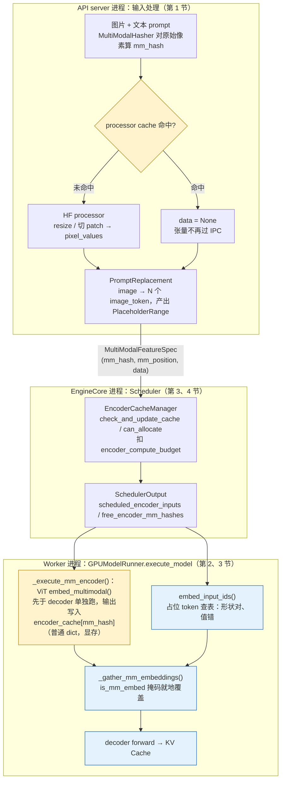
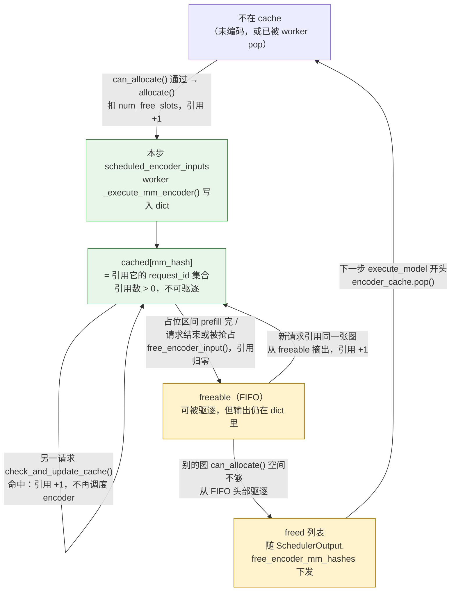

> **NOTE** 本文基于 vLLM v0.27.1（tag `6e448d0`, 2026-08-11）源码剖析。文中文件路径、类名和函数名均以该版本为准；vLLM 迭代很快，阅读时请以你手上的版本对照。


上一篇讲的是"一个新模型如何接进来"——`ModelConfig` 收敛意图、`ModelRegistry` 找到实现、`ModelLoader` 装配权重、`Worker + ModelRunner` 组织执行。整条链路有一个没有说出口的假设：**服务里只有一个模型、一份权重，每个请求就是一串 token id**。调度器按 token 分预算，KV Cache 按 token 分块，model runner 把所有请求的 token 拍平成一条 `input_ids` 送进同一个 forward。

这个假设在两种很常见的请求上破了：

- **multi-LoRA**：同一个 batch 里，请求 A 用客服 adapter，请求 B 用代码 adapter，请求 C 不用 adapter。基座权重是同一份，但每一行 token 要乘的"权重"不再相同；
- **多模态**：请求带了两张图。prompt 里对应位置的 token 不是从 embedding 表里查出来的，而是一个 ViT 算出来的；这个 ViT 有自己的计算预算和显存，它的输出要在 prefill 时正好接到 decoder 的输入上。

两者看起来是两个功能，但它们破坏的是同一组假设、也都在同一组位置被缝回去：请求对象多了几个字段，prefix cache 的哈希多了几个键，调度器多了一种预算，model runner 在 `input_ids → embedding` 和 `embedding → linear` 两处各插了一层。所以本篇的核心问题是：

> **当一个 batch 里的请求各带不同的 LoRA、各带几张图片时，"一个模型、一份权重、一串 token"的假设在哪里破了？vLLM 用什么把它重新缝起来，代价是多少？**

**先说答案**，后面的章节都是这几句话的展开：

- **multi-LoRA** 靠两件事：一是**一个 kernel 处理全部 adapter**——token 不按 adapter 物理重排，只是先算出一份"按 adapter 分好组的行号名单"，每个 adapter 的计算单元照名单去 gather（按索引取）自己的行；二是**槽位静态预分配 + 两层 LRU**——GPU 上按 `max_loras × max_lora_rank` 一次买断一排空槽，adapter 权重在磁盘 → CPU → GPU 槽位之间用两级 LRU 换入换出。
- **多模态**靠三件事：encoder（ViT 等）**单独跑、单独算预算**，输出按图片哈希做**短期缓存**；prompt 里的图片位置先放普通占位 token，查表得到"形状对但值错"的 embedding，再用一张**布尔掩码**把 encoder 输出盖上去。
- 两者都要**隔离 prefix cache**：往 KV 块哈希里多加一个键（adapter 名 / 图片哈希 + 偏移），否则不同 adapter、不同图片会错误地复用同一份 KV。
- **代价**：multi-LoRA 花的是显存（静态买断）与 kernel launch 次数，不是 FLOPs；多模态花的主要是图片占位 token 的 KV（比 encoder 输出大约 20 倍、且伴随请求全程），encoder 输出本身既小又短命。

## 一、总览：假设在哪里破了

### 1. 三个隐含假设

把上一篇那条执行链路上的隐含假设摆出来：

| 假设 | 它在哪里被依赖 | 谁打破它 |
|---|---|---|
| **① batch 内所有 token 乘同一份权重** | `Linear` 层一次 GEMM 处理整个 `[num_tokens, hidden]`；CUDA graph 按 batch 形状录图 | multi-LoRA：每行 token 还要额外乘它自己的 `B·A` |
| **② 输入是 token id 序列，embedding 是查表** | `embed_input_ids(input_ids)`；调度器只数 token | 多模态：一部分位置的 embedding 来自 encoder；encoder 有自己的预算 |
| **③ 相同的 token 前缀 ⇒ 相同的 KV** | prefix cache 的链式哈希只看 token id | 两者都打破：同一串 token 在不同 adapter 下 KV 不同；同一串 `<image>` 占位符对应不同图片时 KV 不同 |

第五篇讲 `hash_block_tokens()` 时留了一个 `extra_keys` 参数，说它"是隔离用的"——本篇就是它存在的理由。

### 2. 两种扩展分别惊动了谁

| | 调度器（第四篇） | KV Cache（第五篇） | Model Runner / 执行（第六篇） | 模型适配（第九篇） |
|---|---|---|---|---|
| multi-LoRA | 一步内活跃 adapter 数 ≤ `max_loras`，超了的 waiting 请求跳过 | 块哈希加 `lora_name` | 每步算 token → adapter 的映射，交给 Punica kernel；每个 LoRA 层多两次 kernel；CUDA graph 按"有无 LoRA / 几个 LoRA"分别录 | 模型声明 `SupportsLoRA`；线性层被 `*WithLoRA` 包一层 |
| 多模态 | 多一种预算（encoder compute budget）和一种缓存（encoder cache）；chunk 边界不能切开一张图；prefix cache 跳过了图但 encoder 没算过时 `num_new_tokens=0` | 块哈希加 `(mm_hash, 块内偏移)` | prefill 前先跑 encoder，输出按 hash 缓存；embedding 后把 encoder 输出按 `is_mm_embed` 掩码散射进去 | 模型声明 `SupportsMultiModal`，提供 `embed_multimodal()`；`MultiModalRegistry` 注册 processor |

### 3. 回到我们的例子

**回到我们的例子**（Llama-3-70B、8×H100、TP=8、2050 token prompt、生成 300 token，每 token KV 320 KB、每卡 40 KB）。本篇会给它加两样东西：

- **8 个 rank-16 的 LoRA 槽位**：静态显存约 **1.44 GB / 卡**——相当于每卡 36K token 的 KV，或者 15 个这样的请求；每步多 1120 次 kernel launch；
- **把 2000 token 的 system prompt 换成一张图**：LLaVA 类 336×336 → 576 个 token，Qwen2-VL 类 1024×1024 → 1369 个 token（37×37）。encoder 输出 9–22 MB，但这些 token 的 KV 是 184–438 MB——**图片贵的不是 encoder 输出，是它占的 KV**。

### 4. 本文的章节安排

| 章 | 主题 | 内容 |
|---|---|---|
| 二 | multi-LoRA | 一段回顾；同 batch 异构 adapter 的 Triton kernel；槽位与 LRU；显存账；映射如何进入调度与执行；动态加载；CUDA graph；量化 + LoRA |
| 三 | 多模态 | 输入处理流水线与 processor 缓存；占位符与 embedding 合并；encoder 的独立执行与预算；EncoderCacheManager；多模态 prefix cache；显存账；视频与音频 |
| 四 | 叠加与向后 | LoRA + 多模态；留给硬件抽象（11）与 PD 分离（12）的问题；两个扩展的开销对照 |
| 五 | 本文小结 |  |

## 二、multi-LoRA：同一个 batch，每一行乘不同的权重

### 1. 一段回顾

LoRA 把权重更新约束为低秩：`W' = W + (α/r)·B·A`，`A ∈ ℝ^{r×in}`，`B ∈ ℝ^{out×r}`，`r ≪ min(in, out)`。训练完可以把 `B·A` 合并进 `W`，推理时零开销——**但 serving 不能合并**：合并后一份 `W'` 只服务一个 adapter，服务 8 个 adapter 就要 8 份 70B 权重。所以 serving 必须保持 unmerged（不合并）形式：

$$ y = Wx + \frac{\alpha}{r}\, B(Ax) $$

等号右边两部分的待遇不同：第一项 `Wx` 是**基座 GEMM，整个 batch 共享同一份 W**；第二项是 **LoRA 路径**，先用 `A` 把 `in` 维压到 `r` 维（这一步叫 **shrink**），再用 `B` 从 `r` 维展回 `out` 维（叫 **expand**）——而 `A`、`B` 要**按行**选：x 的每一行 token 属于哪个请求、请求挂了哪个 adapter，就用哪个 adapter 的 `A`、`B`。

LoRA 路径的 FLOPs 是 `2·r·(in + out)` 对比基座的 `2·in·out`，`r=16`、`hidden=8192` 时约 0.2%——计算上几乎免费。**问题从来不在 FLOPs，而在"每一行选自己的 A、B"这件事怎么在一个 kernel 里做**，以及这些 A、B 放哪里、怎么换。

### 2. 同 batch 异构 adapter 的 kernel

**问题**：一个 batch 里有 6 行 token，第 0、1、5 行要乘客服 adapter 的 A、B，第 2 行要乘代码 adapter 的，第 3、4 行不用 LoRA。GPU 上一次矩阵乘默认是"所有行乘同一个矩阵"，怎么让不同的行乘不同的矩阵？

**两条走不通的路**：一是按 adapter 把 batch 切开、逐个做小 GEMM——8 个 adapter 就是 8 次 launch，每次只处理几行，decode 阶段本来就是 launch-bound（一步的时间被上千次 kernel 启动的固定开销而不是计算量决定，第六篇），这条路走不通；二是先把 token 按 adapter **物理重排**成连续的几段再算——每层都要重排一次 x 再把 y 排回去，搬数据的开销比 LoRA 本身的计算还大。

**Punica 的直觉**（`vllm/lora/punica_wrapper/punica_gpu.py` 的文件头引用了论文 *Punica: Multi-Tenant LoRA Serving*）用一个类比来说：一个班的学生按座位坐着**不动**（x 的行不动），老师手里有一张**按小组分好的点名单**（排序后的行号数组），第 1 组的老师照名单去找第 0、1、5 号座位的学生，第 2 组的老师去找第 2 号座位的——学生不换座位，换的只是老师看名单的那一段。落到 GPU 上：**一次 launch 处理全部 adapter**，kernel 的 grid（一次 launch 里所有计算单元的排列）多开一维遍历 adapter，每个 program（grid 里的一个计算单元）只看自己 adapter 那一段名单，按名单里的行号从原始 x 里 **gather**（按索引取行）自己要算的几行，乘自己 adapter 的权重块，再把结果按同样的行号加回 y。x 和 y 从头到尾都没有被重排。

下图就是这个 6 token 例子（`max_loras=3`，所以 grid 第三维有 `max_loras + 1 = 4` 格）：上半是 x 的 6 行及其归属，中间是"点名单"——按槽位排好的行号数组，下半是 4 个 program 各自照名单去 gather 哪些行：


**"点名单"是怎么来的**：每个 token 先有一个"槽位号"（`token_lora_mapping`，无 LoRA 记 −1）；对它做一次**稳定排序**（`torch.sort(stable=True)`），得到的**下标**就是按槽位分好组的行号名单（−1 的排在最前）；再做一次 `torch.unique(return_counts=True)`，得到"有哪些槽位、每个槽位几行"，前缀和一下就知道每组在名单里从第几行开始。这些就是 kernel 需要的**五张元数据张量**，由 `LoRAKernelMeta`（`vllm/lora/ops/triton_ops/lora_kernel_metadata.py`）维护、`prepare_tensors()` 每步填一次。每张表回答一个问题：

| 张量 | 回答的问题 | 例子里的值 |
|---|---|---|
| `token_lora_mapping` `[tokens]` | 第 i 行 token 用哪个槽位？（−1 = 无 LoRA） | `[1, 1, 2, -1, -1, 1]` |
| `token_indices_sorted_by_lora_ids` `[tokens]` | 点名单本身：按槽位分组后的原始行号 | `[3, 4 │ 0, 1, 5 │ 2]` |
| `active_lora_ids` `[max_loras + 1]` | 名单里第 k 组是哪个槽位？（尾部空位填 −1） | `[-1, 1, 2, -1]` |
| `num_tokens_per_lora` `[max_loras + 1]` | 第 k 组有几行？ | `[2, 3, 1, 0]` |
| `lora_token_start_loc` `[max_loras + 2]` | 第 k 组从名单第几行开始？（前缀和） | `[0, 2, 5, 6, …]` |

```python
@dataclass
class LoRAKernelMeta:
    token_lora_mapping: torch.Tensor              # [tokens]，每个 token 的 adapter 槽位，-1 表示无 LoRA
    token_indices_sorted_by_lora_ids: torch.Tensor  # 按槽位排序后的 token 下标
    active_lora_ids: torch.Tensor                 # [max_loras + 1]，本步活跃的槽位，尾部 -1
    num_tokens_per_lora: torch.Tensor             # 每个活跃槽位有多少 token
    lora_token_start_loc: torch.Tensor            # 每个槽位在排序数组里的起点（前缀和）
```

**"槽位号"又是怎么来的**：这条链上其实有三种编号，名字都带 `lora`，很容易混。请求带来的是 adapter 的全局 id；GPU 上 adapter 权重按**槽位**堆放，kernel 只认槽位；kernel 内部还有一个 grid 下标。对照如下：

| 编号 | 谁产生 | 取值范围 | 无 LoRA 时 | 在哪里被用到 |
|---|---|---|---|---|
| `lora_int_id`（adapter 全局 id） | 用户 / API 注册时在 `LoRARequest` 里指定（`vllm/lora/request.py`），必须 > 0 且全局唯一 | 正整数 | `0` | `InputBatch.request_lora_mapping[req_index]`（`vllm/v1/worker/gpu_input_batch.py`）、`LoRAMapping.index_mapping / prompt_mapping`（`vllm/lora/layers/utils.py`）；`LoRAModelManager.lora_index_to_id` 的**值** |
| 槽位下标（`lora_index_to_id` 的下标；kernel 里的 `lora_id`） | `LoRAModelManager.activate_adapter()` 找第一个空槽时分配；`convert_mapping()`（`vllm/lora/punica_wrapper/utils.py`）按 `lora_index_to_id` 把 `lora_int_id` 反查成它 | `0 … max_loras − 1` | `−1` | `token_lora_mapping`、`active_lora_ids`；`lora_a_stacked[slot]` / `lora_b_stacked[slot]` 的第 0 维 |
| `lora_idx`（grid 第三维下标） | kernel 内 `tl.program_id(axis=2)` | `0 … max_loras`（共 `max_loras + 1` 格） | 该格 `active_lora_ids[lora_idx] == −1` 时整个 program 直接 `return` | 只在 kernel 里，用来读 `active_lora_ids` / `num_tokens_per_lora` / `lora_token_start_loc` 的第 `lora_idx` 项 |

记住一句话：**请求认 `lora_int_id`，显存认槽位，kernel 的 program 认自己在 grid 里的格号，再用格号查出槽位**。例子里 `lora_idx=1` 这一格查到槽位 1，于是它去 `lora_token_start_loc[1]=2` 开始的名单里取 3 行（第 0、1、5 行），乘 `lora_a_stacked[1]`；`lora_idx=0` 和 `lora_idx=3` 查到 −1，整格退出。

有了名单，剩下的就是两次普通的小矩阵乘。vLLM v0.27.1 的实现是两个 Triton kernel（`vllm/lora/ops/triton_ops/`）：

| kernel | 做什么 | 形状 |
|---|---|---|
| `_lora_shrink_kernel`（`lora_shrink_op.py`） | `buffer[slice] += x @ A[slice, lora_id]ᵀ · scale` | `x: [tokens, in]` → `buffer: [num_slices, tokens, r]`，**fp32** |
| `_lora_expand_kernel`（`lora_expand_op.py`） | `y[:, offset:offset+out_slice] += buffer[slice] @ B[slice, lora_id]ᵀ` | `buffer` → 加回基座输出 `y: [tokens, out]` |

结果：y 第 0、1、5 行 `+= B₁·(A₁·x)`，第 2 行 `+= B₂·(A₂·x)`，第 3、4 行只有基座输出。

把上面的话对应到 kernel 源码里的关键几行（`_lora_shrink_kernel`；不想看代码的读者可以跳过这段，前面的图已经是全部原理）：

```python
slice_id = tl.program_id(axis=1)
lora_idx = tl.program_id(axis=2)                       # grid 的第三维遍历活跃 adapter
lora_id = tl.load(lora_ids + lora_idx)
if lora_id == -1:
    return                                             # 没有 LoRA 的那组 token：整个 program 直接退出
lora_m_size = tl.load(num_tokens_per_lora + lora_idx)  # 这个 adapter 有几行
cta_m_offset = pid_m * BLOCK_M
if cta_m_offset >= lora_m_size:
    return                                             # 超出这个 adapter 的行数：早退
lora_m_indices_start = tl.load(lora_token_start_loc + lora_idx)
ram = tl.load(token_indices_sorted_by_lora_ids + lora_m_indices_start + cta_m_offset + tl.arange(0, BLOCK_M) % cta_m_len)
                                                       # 这个 CTA（= program）要处理的原始行号（gather）
```

于是一次 launch、grid 大小 `[M/BLOCK_M × N/BLOCK_N × SPLIT_K, num_slices, max_loras + 1]`（第一维是普通分块 GEMM 的 tile 编号，第二维是切片，第三维就是上面的 `lora_idx`），每个 program 用 `ram` 从原始 `x` 里 gather 自己那几行——**不需要真的把 token 按 adapter 重排**，只是按排序后的索引读。`SLICE_NUM` 维度让 QKV、gate/up 这种合并的投影（`MergedQKVParallelLinearWithLoRA`、`MergedColumnParallelLinearWithLoRA`）一次 launch 处理多个切片。

调用链：`BaseLinearLayerWithLoRA.apply()`（`vllm/lora/layers/base_linear.py`）→ 基座 `quant_method.apply()` 出 `output` → `punica_wrapper.add_lora_linear(output, x, lora_a_stacked, lora_b_stacked, ...)`（`PunicaWrapperGPU`）→ 分配 fp32 `buffer [num_slices, tokens, r]` → `add_shrink()` → `add_expand()`。**每个带 LoRA 的线性层每步多两次 kernel launch 加一块 fp32 中间缓冲**——第 4 节算账时会回到这里。

`LoRAMapping.is_prefill` 这个字段在 CUDA 上被忽略（`LoRAModelRunnerMixin._set_active_loras()` 注释："On cuda platforms we use the same kernels for prefill and decode"）——早期 Punica 区分 SGMV（prefill，按段）和 BGMV（decode，按行）两套 kernel，v0.27.1 的 Triton 实现统一了。

### 3. 槽位与 LRU：adapter 在 GPU 和 CPU 之间怎么换

上一节的 kernel 假定"每个活跃 adapter 的 A、B 已经在 GPU 上、按槽位堆好"。这一节讲这些槽位怎么来、adapter 怎么进出。先给一句话版本：**GPU 上一开始就按 `max_loras` 个空槽把显存买断，adapter 权重在"磁盘 → CPU 内存 → GPU 槽位"两级楼梯上换入换出，每级各有一个 LRU；GPU 层被淘汰只是把槽位让出来（权重还在 CPU 层），CPU 层被淘汰才是真正丢掉。**

先看槽位。`BaseLinearLayerWithLoRA.create_lora_weights()` 在模型加载时为每个 LoRA 层一次性分配：

```python
self.lora_a_stacked = tuple(torch.zeros(max_loras, 1, lora_a_out_size, self.input_size, dtype=lora_dtype, device=device)
                            for _ in range(self.n_slices))
self.lora_b_stacked = tuple(torch.zeros(max_loras, 1, lora_b_out_size, max_lora_rank, dtype=lora_dtype, device=device)
                            for _ in range(self.n_slices))
```

第 0 维是**槽位**（`max_loras` 个），第 2/3 维按 `max_lora_rank` 分配——一个 rank-8 的 adapter 也占一个 rank-16 的槽，多出的部分是零。`set_lora(index, lora_a, lora_b)` 把一个 adapter 的权重 `copy_` 进槽位 `index`（TP 下先 `slice_lora_a/b` 切出本卡的分片），`reset_lora(index)` 清零。

槽位由 `LoRAModelManager`（`vllm/lora/model_manager.py`）分配，它维护两层缓存，外加一张"槽位 → adapter id"的对照表：

| 层 | 容器 | 容量 | 存什么 |
|---|---|---|---|
| CPU 层 | `_registered_adapters: AdapterLRUCache[LoRAModel]` | `max_cpu_loras` | 已从磁盘加载的 adapter（`LoRAModel` 对象，权重张量在主机内存） |
| GPU 层 | `_active_adapters: AdapterLRUCache[None]` | `max_loras` | 已 `copy_` 进 GPU 槽位的 adapter（只记 id，权重就在 `*_stacked` 里） |
| 对照表 | `lora_index_to_id: list[Optional[int]]` | 长度 `max_loras` | 槽位号 → `lora_int_id`，`None` 表示空槽 |

`activate_adapter(lora_id)`：找第一个空槽（`lora_index_to_id` 里的 `None`），遍历 `self.modules` 里每个 LoRA 层调用 `set_lora()`——**激活一个 adapter = 对每一层做一次 H2D（host-to-device，CPU 内存 → 显存）拷贝**。`LRUCacheLoRAModelManager.activate_adapter()` 在槽满时先 `_active_adapters.remove_oldest()`，其 `_on_remove` 回调把槽位清空。两层缓存的 LRU 序在每次访问时 `touch()`，`pin_adapter()` 可以把某个 adapter 钉在两层里不被淘汰。

Worker 侧是 `LRUCacheWorkerLoRAManager`（`vllm/lora/worker_manager.py`）：`_apply_adapters(lora_requests)` 先检查本步请求的不同 adapter 数 ≤ `lora_slots`（超了直接 `RuntimeError`——但调度器保证了不会超，见第 5 节），然后对每个 `add_adapter()`：不在 CPU 缓存里就 `_load_adapter()`——用 `PEFTHelper.from_local_dir()`（`vllm/lora/peft_helper.py`）读 `adapter_config.json` 并 `validate_legal()`（rank 不能超过 `max_lora_rank`），`LoRAModel.from_local_checkpoint()`（`vllm/lora/lora_model.py`）读 safetensors；CPU 缓存满则 `remove_oldest_adapter()`；最后 `activate_adapter()`。源码注释特意说明先加载再淘汰是为了"确保新 adapter 有效后再驱逐旧的"，代价是 CPU 侧短暂超过 `max_cpu_loras`。

把两层 LRU 放在一起看一段请求流（`max_loras=2`、`max_cpu_loras=3`，四个 adapter a/b/c/d），可以看清"哪一步读磁盘、哪一步只做 H2D、哪一步两层都要淘汰"（CPU LRU 一列左边最旧、右边最新）：

| 步 | 本步 adapter | 发生了什么 | GPU 槽位 [0] | GPU 槽位 [1] | CPU LRU | 代价 |
|---|---|---|---|---|---|---|
| 1 | a | 磁盘 → CPU 加载 a；`activate` → 槽 0 | a | – | `[a]` | 读盘 + H2D |
| 2 | b | 磁盘 → CPU 加载 b；`activate` → 槽 1 | a | b | `[a b]` | 读盘 + H2D |
| 3 | a, b | 两层都命中，只 `touch()` | a | b | `[a b]` | 零拷贝 |
| 4 | c | 磁盘 → CPU 加载 c；GPU 满：`remove_oldest` = a（槽 0 清零），c 逐层 H2D `copy_` 进槽 0 | **c** | b | `[a b c]` | 读盘 + H2D |
| 5 | a | CPU 命中，不读磁盘；GPU 满：淘汰 b（槽 1），a 重新 H2D 进槽 1 | c | **a** | `[b c a]` | 只 H2D |
| 6 | d | CPU 满（3）：先加载 d 再淘汰最旧的 b；GPU 淘汰 c，d 进槽 0 | **d** | a | `[c a d]` | 读盘 + H2D |

读磁盘：步 1、2、4、6；只 H2D：步 5；零拷贝：步 3。GPU 层的淘汰只是把槽位清零，adapter 仍留在 CPU 层（步 4 的 a 在步 5 免去了磁盘读）；CPU 层的淘汰才真正丢弃权重。第 6 节会说明这些加载都发生在 `execute_model` 里、整个 batch 同步等待。

每一步的映射由 `LoRAModelRunnerMixin.set_active_loras()`（`vllm/v1/worker/lora_model_runner_mixin.py`）驱动：`InputBatch.make_lora_inputs()` 从 `request_lora_mapping[req_index]` 展开出 `token_lora_mapping`（每个调度 token 一个）和 `prompt_lora_mapping`（每个采样位置一个，给 `LogitsProcessorWithLoRA` 用），打包成 `LoRAMapping` → `set_active_adapters()` → `LoRAModelManager._set_adapter_mapping()` → `punica_wrapper.update_metadata()` → `LoRAKernelMeta.prepare_tensors()`。注意这条链上有一次**编号换算**：`InputBatch` 与 `LoRAMapping` 里放的是 adapter 的 `lora_int_id`（0 表示无 LoRA），到 `punica_wrapper/utils.py` 的 `convert_mapping()` 才按 `lora_index_to_id` 反查成**槽位下标**（−1 表示无 LoRA）——kernel 只认槽位（就是第 2 节那张三种编号对照表的第一行到第二行）。

### 4. 显存账：`max_loras` × `max_lora_rank` 买了什么

**回到我们的例子**：Llama-3-70B、TP=8、`max_loras=8`、`max_lora_rank=16`、adapter 覆盖 q/k/v/o/gate/up/down 七个投影。逐层算每张卡上一个槽位的参数量（默认 `fully_sharded_loras=False`：列并行层 A 不切、B 按输出切；行并行层 A 按输入切、B 不切）：

| 模块 | 基座形状（in → out） | 本卡 A（`r × in`） | 本卡 B（`out × r`） | 合计 |
|---|---|---|---|---|
| q_proj（列并行） | 8192 → 8192 | 16 × 8192 = 131072 | (8192/8) × 16 = 16384 | 147456 |
| k_proj（列并行） | 8192 → 1024 | 131072 | (1024/8) × 16 = 2048 | 133120 |
| v_proj（列并行） | 8192 → 1024 | 131072 | 2048 | 133120 |
| o_proj（行并行） | 8192 → 8192 | 16 × (8192/8) = 16384 | 8192 × 16 = 131072 | 147456 |
| gate_proj（列并行） | 8192 → 28672 | 131072 | (28672/8) × 16 = 57344 | 188416 |
| up_proj（列并行） | 8192 → 28672 | 131072 | 57344 | 188416 |
| down_proj（行并行） | 28672 → 8192 | 16 × (28672/8) = 57344 | 131072 | 188416 |
| **每层每槽每卡** | | | | **≈ 1.13 M 参数** |

80 层 → 90 M 参数 → bf16 **≈ 180 MB / 槽 / 卡**；8 个槽 **≈ 1.44 GB / 卡**，在 `create_lora_weights()` 时一次性 `torch.zeros` 出来，无论实际加载了几个 adapter、实际 rank 是多少。对比：这 1.44 GB 等于每卡 36K token 的 KV（40 KB/token），或者 **15 个我们例子里的请求**（2350 token 各 94 MB/卡）。`max_lora_rank` 从 16 提到 64，这个数字乘 4。

再看 CPU 侧：一个完整的 rank-16 adapter（不切分）约 207 M 参数、414 MB bf16；`max_cpu_loras` 默认等于 `max_loras`，即 8 × 414 MB ≈ 3.3 GB 主机内存，**每个 worker 进程各一份**（TP=8 就是 8 份，每份存的是切分前的完整权重再切）。

计算与 launch：

| 项 | 量 | 说明 |
|---|---|---|
| 额外 FLOPs | 每 token 每层 `2 × 16 × (8192 + 8192) × 2`（q、o）+ … ≈ 基座的 0.2% | 忽略 |
| 额外 kernel | 7 个模块 × 2（shrink + expand）× 80 层 = **1120 次 / 步** | 与第六篇"一步上千 kernel"同量级，**必须进 CUDA graph** |
| fp32 中间缓冲 | `[num_slices, tokens, r]`，每层 `torch.empty` 一次 | batch=64 decode 时每层 `3 × 64 × 16 × 4 B = 12 KB`，忽略；prefill 2050 token 时 393 KB |
| 元数据 | 每步一次 `sort` + `unique` + 若干 H2D | CPU-GPU 同步点，微秒级 |

结论：**multi-LoRA 的代价是显存（静态、按 `max_loras × max_lora_rank` 买断）和 launch 次数，不是 FLOPs。**

### 5. 请求到 adapter 的映射如何进入调度与 KV

请求带的是一个 `LoRARequest`（`vllm/lora/request.py`：`lora_name`、`lora_int_id`、`lora_path`，`lora_int_id` 必须 > 0 且全局唯一）。它在三个地方被消费：

**调度器**（`Scheduler.schedule()`，`vllm/v1/core/sched/scheduler.py`）：先收集本步 running 请求的 `scheduled_loras` 集合并 `assert len(scheduled_loras) <= max_loras`；遍历 waiting 队列时，若某请求的 adapter 不在集合里且集合已满，**跳过这个请求**（`step_skipped_waiting.prepend_request`）继续看下一个。这是本篇里 multi-LoRA 对调度公平性唯一但真实的影响：`max_loras` 成了一种新的准入约束，一个冷门 adapter 的请求可能在 8 个热门 adapter 的持续流量下长时间等不到槽位——FCFS 在这里被打破了，而且没有 aging 机制。

**KV Cache**：`_gen_lora_extra_hash_keys()`（`vllm/v1/core/kv_cache_utils.py`）把 `lora_request.lora_name` 加进每个块的 `extra_keys`。同一段 system prompt 在两个 adapter 下会得到两条完全不同的哈希链、两份物理块——第五篇算的"125 块全部命中"只在**同一个 adapter** 的请求之间成立。这是正确性要求：不同 adapter 的 K、V 投影本来就不同。

**InputBatch**（`vllm/v1/worker/gpu_input_batch.py`）：`add_request()` 时把 `lora_int_id` 记进 `request_lora_mapping[req_index]`，`lora_id_to_lora_request` 保留请求对象供 worker 加载。

### 6. 动态加载

启动时可以用 `--lora-modules` 预注册，但生产里更常见的是运行时加载：

- **HTTP API**：`POST /v1/load_lora_adapter` / `POST /v1/unload_lora_adapter`（`vllm/entrypoints/openai/models/serving.py` → `load_lora_adapter()` / `unload_lora_adapter()`），需要 `VLLM_ALLOW_RUNTIME_LORA_UPDATING=1`；
- **按名字解析**：`LoRAResolver`（`vllm/lora/resolver.py`）插件机制，请求里带一个未注册的 `model` 名时由 resolver 去对象存储或本地目录找 adapter，`VLLM_LORA_RESOLVER_CACHE_DIR` 指定缓存目录；
- **原地替换**：`LoRARequest.load_inplace=True` 强制重新加载同 id 的 adapter（`LRUCacheWorkerLoRAManager.add_adapter()` 里先 `remove_adapter` 再 `add`）。

"加载"在 worker 上是懒的：API 只是注册了 `LoRARequest`，真正的磁盘读取、切分、H2D 拷贝发生在**第一个使用它的请求被调度的那一步**（`_apply_adapters()`）。这意味着一个新 adapter 的第一个请求会在 `execute_model` 里同步等待磁盘 I/O——414 MB 的 safetensors 从本地 NVMe 读大约几十到几百毫秒，从网络存储可能秒级，而且**这段时间整个 batch 都在等**。热门 adapter 常驻、冷门 adapter 预热，是运维层面必须做的事。

### 7. 对 CUDA graph 的影响

第六篇说 CUDA graph 要求"图内 kernel 序列和形状固定"。LoRA 路径的 1120 个 kernel 只在有 LoRA 请求时才存在——于是"有没有 LoRA"成了图的一个维度。`BatchDescriptor`（`vllm/forward_context.py`）因此多了两个字段：`has_lora: bool` 和 `num_active_loras: int`。`CudagraphDispatcher._get_lora_cases()`（`vllm/v1/cudagraph_dispatcher.py`）决定录几套图：

| 配置 | 录的图 | 说明 |
|---|---|---|
| 没开 LoRA | `[0]` | 一套 |
| `cudagraph_specialize_lora=True`（默认） | `[0, max_loras + 1]`，即"无 LoRA"和"有 LoRA"各一套 | **图的数量翻倍**，捕获时间与显存也翻倍 |
| 再开 `specialize_active_lora=True` | `[0] + 2 的幂次直到 max_loras + [max_loras + 1]` | `get_captured_lora_counts()`；kernel grid 的第三维按活跃 adapter 数取整到上一个 2 的幂，少跑空 program |
| `cudagraph_specialize_lora=False` | 只录 `[max_loras + 1]` | 无 LoRA 的 batch 也走带 LoRA 路径的图，kernel 靠 `lora_id == -1` 早退 |

默认选择是一个典型的取舍：多录一套图换来"纯基座请求不付 LoRA 的 launch 成本"。`_lora_shrink_kernel` 开头那个 `if lora_id == -1: return` 是让同一张图能安全跑在"部分请求无 LoRA"的 batch 上的保证——grid 始终按 `max_loras + 1` 开，没用到的 adapter 维度整片早退。

### 8. 量化模型 + LoRA

基座量化不影响 LoRA 路径：`BaseLinearLayerWithLoRA._apply_sync()` 先调 `self._get_quant_method().apply(self.base_layer, x, bias)` 得到基座输出——这里的 `quant_method` 可以是 FP8、GPTQ、AWQ 任何一种——再把 `lora_dtype`（默认跟基座 dtype，量化基座时通常是 bf16）精度的 `B·A·x` 加上去。**LoRA 权重本身不量化**，所以第 4 节的显存账在 W4A16 基座上不变，只是相对占比更高（基座每卡从 17.6 GB 降到约 4.4 GB，8 个槽位的 1.44 GB 就成了显眼的一块）。

两处延伸只点名：MoE 模型的 expert 权重也可以挂 LoRA（`FusedMoEWithLoRA`、`fused_moe_lora_op.py`，`enable_mixed_moe_lora_format` / `enable_moe_shared_loras` 控制格式）；多模态模型的视觉塔与 connector 也可以挂（`enable_tower_connector_lora`，`LoRAMappingType.TOWER / CONNECTOR`），第四章会回到它。

## 三、多模态：一部分 embedding 不是查表得来的

### 1. 输入处理流水线：HF processor 的复用与缓存

文本请求的输入处理是 tokenizer 一步；多模态请求要先把图片变成像素张量、算出它会占多少 token、把占位符（placeholder：在 prompt 里替图片"占座"的 N 个特殊 token，N = 这张图会变成多少个 embedding）插进 prompt。先把一张图从进门到变成 KV 的完整路径摆出来——它跨了三个进程，两级缓存（processor cache、encoder cache）分别落在前两个进程的边界上，本章 1–4 节就是沿着这条路径展开：



vLLM 把第一段（输入处理）放在 `vllm/multimodal/processing/`，由 `MultiModalRegistry`（`vllm/multimodal/registry.py`）按模型类找到对应的 `BaseMultiModalProcessor`（`processing/processor.py`）。它的 `apply()` docstring 概括了三步：

```text
1. 对 prompt 文本和多模态数据一起调用 HF processor，得到 token ids 和处理后的张量（pixel_values 等）
2. 在 token ids 里找到并更新占位序列：占位 token 的数量 = encoder 输出的 feature 数
3. 从处理后的 token ids 里提取占位符位置信息
```

第 1 步**复用 Hugging Face 的 processor**（`_call_hf_processor()`）——图片 resize、归一化、切 patch 的逻辑不重写。第 2 步用 `PromptReplacement` / `PromptInsertion` 描述"把 prompt 里的 `<image>` 换成 N 个 `<image_token>`"，N 由模型的 `get_mm_max_tokens_per_item()` 或实际输出决定。第 3 步产出 `PlaceholderRange`（`vllm/multimodal/inputs.py`）：

```python
@dataclass(frozen=True)
class PlaceholderRange:
    offset: int                          # 占位符在 prompt 中的起点
    length: int                          # 占位符长度
    is_embed: torch.Tensor | None = None # 可选掩码：length 个位置里哪些真的要填 encoder 输出
                                         # （有的模型在图像 token 之间夹换行等文本 token）
```

一张图最终在请求里是一个 `MultiModalFeatureSpec`：`data`（处理后的张量，缓存命中时为 `None` 以省掉 IPC）、`modality`、`identifier`（用于 encoder cache 的哈希）、`mm_position`（上面的 `PlaceholderRange`）、`mm_hash`（用于 processor cache 的哈希）。

**哈希**由 `MultiModalHasher.hash_kwargs()`（`vllm/multimodal/hasher.py`）算，默认 blake3（`mm_hasher_algorithm`，FIPS 环境可换 sha256/sha512），对**原始输入**（PIL 图像的 mode + 像素数组、或带 `io_config` 的原始字节）而不是处理后的张量哈希——所以同一张图以不同 URL 传两次会命中，同一张图 resize 过再传不会。`identifier` 在 `InputProcessor._get_mm_identifier()`（`vllm/v1/engine/input_processor.py`）里生成：默认等于 `mm_hash`，开了 `enable_tower_connector_lora` 时前缀 `lora_name:`，因为此时 encoder 输出依赖 adapter。

**processor cache**（`vllm/multimodal/cache.py`）解决的是"同一张图反复出现，HF processor 不要反复跑、张量不要反复过 IPC"：`mm_processor_cache_gb` 默认 4 GiB，`mm_processor_cache_type` 默认 `lru`（API 进程与引擎进程各一份镜像 LRU：`MultiModalProcessorSenderCache` / `MultiModalReceiverCache`）或 `shm`（`ShmObjectStoreSenderCache` / `ShmObjectStoreReceiverCache`，单写者共享内存环形缓冲，`mm_shm_cache_max_object_size_mb` 限制单对象大小）。文档特别提醒它的总占用是 `mm_processor_cache_gb × (api_server_count + data_parallel_size)`——CPU 内存，不是显存，但多进程部署时容易被忘掉。`_cached_apply_hf_processor()` 先算哈希、查缓存，只把未命中的项送进 HF processor，再 `_merge_mm_kwargs()` 合回来。

### 2. 多模态 token 与占位符如何进入 prompt

**问题**：decoder 的输入必须是一条 `[num_tokens, hidden]` 的 embedding 矩阵，文本 token 的那几行查 embedding 表就有了，可图片那几行的 embedding 是 ViT 算出来的，怎么把两种来源拼到一条矩阵里？

**直觉**：不拼，而是**先占位、再覆盖**。prompt 里图片所在的位置先塞上 `length` 个普通的占位 token（模型专用的 image token id，重复 N 次）——它们和文本一样走查表，得到的向量**形状是对的、值是错的**（谁会在意一个占位符查出来什么）；然后拿 encoder 的输出，用一张"哪些位置是图片"的布尔掩码，把这些行**就地盖掉**。这样 decoder 看到的仍是一条普通的 embedding 矩阵，调度器、KV 分块也仍然按普通 token 数。

到 model runner 时，多模态请求的 `prompt_token_ids` 已经是一串普通 token id，其中 `mm_position` 指向的区间填的是模型的 image token id（重复 `length` 次）。它们和文本 token 一起走 `embed_input_ids()`，得到一个"错误但形状正确"的 embedding；然后在正确的位置**覆盖**成 encoder 输出：

```python
# vllm/model_executor/models/utils.py（简化）
def _merge_multimodal_embeddings(inputs_embeds, multimodal_embeddings, is_multimodal):
    mm_embeds_flat = _flatten_embeddings(multimodal_embeddings)
    inputs_embeds[is_multimodal] = mm_embeds_flat.to(inputs_embeds.dtype)   # 布尔掩码就地散射
    return inputs_embeds
```

这张掩码有两处让它不那么平凡。一是**占位区间里可能夹着真文本**：有的模型在每行图像 token 之间插一个换行 token，它在 `PlaceholderRange` 的区间之内，却不该被覆盖——`is_embed` 就是区间内的一张细粒度掩码，标出哪些位置真的要填 encoder 输出。二是 **chunked prefill**（第四篇：一个长 prompt 分几步算，每步只算一个 chunk）**可以把一张图切在两个 chunk 里**：这一步只算图的前半，就只能取 encoder 输出的前半——而"前半"要在两个坐标系之间换算：prompt 位置坐标下的"占位区间第几个位置"，和 encoder 输出坐标下的"第几个 embedding"，两者因为夹着的文本 token 而错位。

具体地，`is_multimodal` 这张 `[total_num_scheduled_tokens]` 的布尔掩码由 `GPUModelRunner._gather_mm_embeddings()` 构造：遍历本步每个请求、找出与 `[num_computed_tokens, num_computed_tokens + num_scheduled_tokens)` 窗口重叠的 `mm_features`（`get_mm_features_in_window()`），对每个重叠的图计算本步覆盖的是它的第 `start_idx` 到 `end_idx` 个占位，只取 encoder 输出的对应片段（`pos_info.get_embeds_indices_in_range()` 处理 `is_embed` 掩码下的下标换算）。掩码在 CPU pinned 内存上填好再传 GPU，避免 D2H 同步。

下面用一个 13 token 的 prompt 把这几层下标对齐：`PlaceholderRange` 给出占位区间（offset=2，length=9），`is_embed` 挖掉区间里夹着的文本 token（位置 6 是一个换行），encoder 一共输出 8 个 embedding e0..e7；chunk 窗口再把区间切成两半，每半只取 encoder 输出的对应片段：


最后一步就是 `inputs_embeds[is_mm_embed] = mm_embeds_flat`——盖掉查表得到的占位 embedding。注意两点：位置 6 的换行虽然在占位区间内，但 `is_embed=0`，它保留查表 embedding，encoder 输出的下标也跳过它；chunk 2 的 `start_idx=4` 是"encoder 输出的第 4 个"而不是"占位区间的第 5 个位置"——`get_embeds_indices_in_range()` 做的正是这两个坐标系之间的换算。

encoder 输出从 `self.encoder_cache[mm_hash]` 取——这是一个普通的 `dict[str, torch.Tensor]`，不是预分配的显存池。取不到会 `RuntimeError("Encoder cache miss")`，唯一的例外是 EAGLE 的 draft 多看了一个位置、读到了尚未编码的下一张图（调度器与 runner 用 `shift_computed_tokens=1` 表达这个偏移，见第七篇的投机解码一章）。

### 3. encoder 的独立执行与预算

先用一句话建立这两节的画面：**encoder 是一道单独的菜，有自己的锅（每步的计算预算）和临时盘子（encoder cache）；菜做好先放盘子里，decoder 要用时从盘子里取；等这张图的占位区间 prefill 完、菜上桌了，盘子就可以收走**。第 3 节讲锅——encoder 怎么单独跑、预算怎么算、预算不够时调度器怎么办；第 4 节讲盘子——`EncoderCacheManager` 怎么给盘子记账。

encoder（ViT / 音频编码器）不是 decoder forward 的一部分——它在 `execute_model` 里**先于** decoder 单独跑（`GPUModelRunner._execute_mm_encoder()`）：从 `scheduler_output.scheduled_encoder_inputs` 取出本步要编码的项，`group_and_batch_mm_kwargs()`（`vllm/v1/worker/utils.py`）按模态分组、同模态的项拼成一个 batch，调用模型的 `embed_multimodal(**kwargs)`（`SupportsMultiModal` 协议，`vllm/model_executor/models/interfaces.py`），输出按 `mm_hash` 写进 `self.encoder_cache`。视觉编码器可以有自己的 CUDA graph（`EncoderCudaGraphManager`，`vllm/v1/worker/encoder_cudagraph.py`）。TP 下有两种切法（`MultiModalConfig.mm_encoder_tp_mode`）："weights" 按 TP 切 ViT 权重（默认），"data" 每卡持有完整 ViT、把图片分给各卡（`run_dp_sharded_vision_model()`，`vllm/model_executor/models/vision.py`）——ViT 很小，切权重通信占比高，切数据往往更快。

既然 encoder 是单独的计算，调度器就得给它单独的预算。`MultiModalBudget`（`vllm/multimodal/encoder_budget.py`）在启动时算出两个数（`compute_mm_encoder_budget()`，`vllm/v1/core/encoder_cache_manager.py`）：

```python
encoder_compute_budget = max(scheduler_config.max_num_encoder_input_tokens, max_tokens_per_mm_item)
encoder_cache_size     = max(scheduler_config.encoder_cache_size,            max_tokens_per_mm_item)
```

`SchedulerConfig.max_num_encoder_input_tokens` 和 `encoder_cache_size` 都不可配置，`__post_init__` 里直接等于 `max_num_batched_tokens`——即**每步 encoder 最多算 `max_num_batched_tokens` 个 embedding，encoder cache 最多存 `max_num_batched_tokens` 个 embedding**，如果单个项超过这个数则以单项为准。单位是"embedding 数"（`PlaceholderRange.get_num_embeds()`），不是像素也不是字节。

调度器在 `Scheduler.schedule()` 里对每个有 encoder 输入的请求调用 `_try_schedule_encoder_inputs()`，规则（照 docstring）：一个 encoder 项在本步被调度，当且仅当它的占位区间与本步要算的 token 区间重叠、它没在 encoder cache 里、远端 encoder cache（EC connector）也没有、compute budget 够、cache 有空间。四种失败各有处理：

| 情况 | 调度器怎么做 |
|---|---|
| budget 或 cache 不够，且图在本步窗口的后半 | `num_new_tokens = start_pos - num_computed_tokens`：**只算图前面的文本**，图留到下一步 |
| budget 或 cache 不够，但 prefix cache 已经把 `num_computed_tokens` 推到了图中间 | `num_new_tokens = 0`：这一步这个请求一个 token 也不算（源码注释解释了这个 prefix caching 造成的角落） |
| `disable_chunked_mm_input=True` 且窗口只覆盖图的一部分 | 回退到图之前，不切开图 |
| 请求被抢占 | 已扣的 encoder budget 加回去（`encoder_compute_budget += num_embeds_to_restore`） |

encoder 用双向注意力，一张图必须整体编码（注释："the encoder usually uses bidirectional attention"）——所以 encoder 预算的粒度是"项"，与 decoder 的 token 预算不同：**一张 1300 token 的图，要么这一步全算，要么不算**。这是第四篇 Token Budget 模型的第一个真正例外。

### 4. `EncoderCacheManager`：encoder 输出的分配与释放

接着上面的比喻：盘子（encoder 输出的显存）在 worker 进程里，就是 `GPUModelRunner.encoder_cache` 那个普通 dict；但**哪个盘子有人在用、哪个盘子可以收、什么时候通知 worker 收**，这本账在调度器进程里，由 `EncoderCacheManager`（`vllm/v1/core/encoder_cache_manager.py`）记。它管的是**账**，不是显存本身，账本上只有四样东西：

| 字段 | 类型 | 含义 |
|---|---|---|
| `cache_size` / `num_free_slots` / `num_freeable_slots` | `int` | 总容量 / 空余 / 可回收，单位都是 **embedding 数** |
| `cached` | `dict[mm_hash → set[request_id]]` | 哪些请求正在引用这份 encoder 输出（引用数 > 0 不可驱逐） |
| `freeable` | `OrderedDict[mm_hash → num_embeds]` | 引用数已归零、可以被驱逐的，FIFO 先进先出 |
| `freed` | `list[mm_hash]` | 本步真正驱逐的，通过 `SchedulerOutput.free_encoder_mm_hashes` 通知 worker `pop` |

一个 `mm_hash` 在这套账里的状态迁移如下（`freeable` 与 `cached` 之间可以来回，`freed` 之后 worker 才真正释放显存）：



生命周期：

1. `check_and_update_cache(request, i)`：图已在 cache 里（另一个请求算过，或本请求上一步算过）→ 加引用、从 `freeable` 摘出，**不再调度 encoder**。同一张图在两个请求里只编码一次；
2. `can_allocate(request, i, budget, already_scheduled)`：先看 compute budget，再看 `num_free_slots`，不够则从 `freeable` 头部（最早释放的）驱逐直到够，驱逐的 hash 记入 `freed`。"驱逐"只是记账，worker 在下一步的 `execute_model` 开头才真正 `encoder_cache.pop()`；
3. `allocate(request, i)`：扣 `num_free_slots`，加引用；
4. `_free_encoder_inputs()`（调度器 `update_from_output()` 里，每步之后）：占位区间已经完全落在 `num_computed_tokens` 之前（开 EAGLE 时再多留 1 个 token 的 lookahead）→ `free_encoder_input()`，引用数归零则进 `freeable`。请求结束或被抢占 → `free(request)` 全部释放。

注意第 4 步：**一张图的 encoder 输出在它的占位区间 prefill 完之后就可以释放**——之后 decode 只依赖 KV，不再需要 encoder 输出。所以 encoder cache 的驻留时间是"从编码到该图 prefill 完"，通常只有几步；它更像一个跨 chunk、跨请求的短期缓冲，而不是 KV 那样伴随请求全程的状态。

### 5. 多模态 prefix cache：哈希与复用条件

第五篇的 `hash_block_tokens()` 只看 token id，而多模态请求里图片占位符的 token id 全是同一个 image token——两张不同的图会产生完全相同的 token 序列。`_gen_mm_extra_hash_keys()`（`vllm/v1/core/kv_cache_utils.py`）为每个与占位区间重叠的块加入 `(mm_feature.identifier, offset - start_token_idx)`：图的哈希，以及**图的起点相对块起点的偏移**（源码注释：确保同一张图出现在不同位置时块哈希不同）。

于是多模态下 prefix cache 的命中条件是：token 前缀相同 **且** 每个块里覆盖到的图相同 **且** 图在块内的位置相同。实际后果：

- 同一张图 + 同一段前置文本 → 图的 KV 可以复用（多轮对话里反复引用同一张图的典型场景）；
- 同一段文本 + 不同的图 → 从图开始的所有块都不命中，即使图后面的文本一样；
- 图之前的纯文本块不受影响。

`need_extra_keys()` 汇总了三个触发条件：有 `mm_features`、有 `lora_request`、有 `cache_salt`——本篇两个主角都在里面。

### 6. 显存账：encoder 输出与 KV 之争

**回到我们的例子**，把 2000 token 的 system prompt 换成一张图：

| | LLaVA 类（336×336，14 px patch，24×24=576 token） | Qwen2-VL 类（1024×1024，14 px patch，2×2 合并，1369 token） |
|---|---|---|
| 占位 token | 576 | 1369 |
| encoder 输出（hidden=8192，bf16） | `576 × 16 KB ≈ 9.4 MB` | `1369 × 16 KB ≈ 22 MB` |
| 这些 token 的 KV（320 KB/token，全部 8 卡） | `576 × 320 KB ≈ 184 MB` | `1369 × 320 KB ≈ 438 MB` |
| KV / encoder 输出 | **≈ 20×** | **≈ 20×** |
| 驻留时间 | 几步（prefill 期间） | 全请求（2350 步的 decode 都要读） |

**一张图真正贵的地方是它的 KV，不是 encoder 输出**——后者小 20 倍、活得短得多。这解释了为什么 encoder cache 的上限可以简单地绑到 `max_num_batched_tokens`：`16384 × 16 KB = 268 MB`，相对 80 GB 的卡不值得精细管理；而图片占的 KV 直接进第五篇那套按块管理的体系，第四篇的 Token Budget 也直接把 1369 个占位 token 当普通 prefill token 计费。

encoder **激活**的峰值是另一笔：ViT 对 1024×1024 图有 5329 个 patch，注意力矩阵 `5329² × heads`，比它的输出大得多。vLLM 不试图精确算它，而是在 `profile_run()` 里用 `get_dummy_encoder_profile_inputs()`（`encoder_budget.py`）按 `mm_max_items_per_batch` 个最大尺寸的假图**实测一次峰值**，从可用显存里扣掉，剩下的才给 KV Cache。`skip_mm_profiling=True` 可以跳过以加快启动，代价是这部分显存需要用户自己预估——文档明说 "shifts the responsibility to users"。

CPU 侧还有 processor cache 的 `4 GiB × (api_server_count + dp_size)`。

### 7. 视频与音频：差在哪里

图像是多模态的基本形态；视频与音频各在一个维度上把它推到极端。

**视频**是"很多帧图片 + 时间维"：token 数 = 帧数 × 每帧 token，很容易几千甚至上万。`vllm/multimodal/video.py` 提供多种解码后端（`VideoLoader`：OpenCV、PyAV、TorchCodec、PyNvVideoCodec 硬解），`sample_frames_from_video()` 抽帧。token 太多时的对策是**剪枝**：`video_pruning_rate`（`MultiModalConfig`）启用 EVS（`vllm/multimodal/video_prune/evs.py`）等算法，按帧间相似度丢掉冗余 token——这正是 `PlaceholderRange.is_embed` 掩码存在的原因：占位区间长度不变，但只有掩码为真的位置真的填 encoder 输出。model runner 里有一段注释承认的 hack：开启剪枝时多段视频逐个编码而不合 batch，因为调度器按剪枝后的 token 数扣预算，而 encoder 的峰值显存按剪枝前算——预算与真实成本对不上。

**音频**的差异在模型结构：Whisper 一类是 encoder-decoder，音频 encoder 的输出不是 embedding 而是 cross-attention 的 K/V。vLLM 用 `EncoderDecoderCacheManager` 代替 `EncoderCacheManager`：所有 encoder 输入的 `start_pos=0`，只在第一步调度一次（`num_computed_tokens > 0` 后跳过），没有跨请求缓存；`SchedulerConfig.__post_init__` 对 encoder-decoder 模型**直接关闭 chunked prefill 与 prefix caching**（`disable_chunked_mm_input=True`、`enable_chunked_prefill=False`）——第四、五篇的两个核心机制在这类模型上都不可用。`vllm/multimodal/audio.py` 负责重采样等预处理。

还有一个角落：Qwen-Omni 类的 `use_audio_in_video`，同一段占位符同时属于视频和音频两个 feature，`_gather_mm_embeddings()` 里 `is_mm_embed` 用 `|=` 合并两个掩码——`MultiModalBudget` 的注释也为此专门过滤了"没有独立占位符的模态"。

## 四、两个扩展叠加，以及留给后两篇的问题

### 1. LoRA + 多模态

两者同时出现时有三个交叉点：

- `default_mm_loras`（`LoRAConfig`）：某个模态出现时自动挂指定 adapter，用于"只要有图就得用视觉微调"的模型——但一个请求只能有一个 adapter，多模态各带 adapter 时不生效；
- `enable_tower_connector_lora`：LoRA 不只挂在语言模型上，也挂在视觉塔和 connector 上。`_execute_mm_encoder()` 为 encoder batch 单独构造 `LoRAMapping`（`LoRAMappingType.TOWER` / `CONNECTOR`），因为 encoder batch 的结构（按图）与 decoder batch（按 token）不同；
- 此时 encoder 输出依赖 adapter，所以 `identifier = f"{lora_name}:{mm_hash}"`——同一张图在两个 adapter 下是两份 encoder cache，也是两份 KV。

### 2. 留给第十一篇（硬件抽象）的问题

- LoRA 的 kernel 是 Triton 写的，`get_punica_wrapper()`（`vllm/lora/punica_wrapper/punica_selector.py`）按平台选 `PunicaWrapperGPU` / `PunicaWrapperCPU` / `PunicaWrapperXPU`，算子目录也分 `ops/triton_ops`、`ops/torch_ops`、`ops/xpu_ops`。一个新硬件要支持 multi-LoRA，是重写这两个 kernel，还是退回 `torch_ops` 的逐 adapter 循环？后者在 decode 下的 launch 成本，第六篇已经算过。
- ViT 的注意力与 decoder 的 paged attention 是两套后端：`get_vit_attn_backend()`（`vllm/model_executor/models/vision.py`）与 `mm_encoder_attn_backend` 单独选择，`mm_encoder_attn_dtype="fp8"` 单独量化。硬件抽象层要同时覆盖两种注意力形态。
- 视频解码可以走 GPU 硬解（PyNvVideoCodec），这是 NVIDIA 特有的能力——平台抽象要不要把"预处理"也纳入？

### 3. 留给第十二篇（PD 分离）的问题

- **encoder 放哪一侧？** 它的输出只在 prefill 时需要，自然属于 P 侧；但 P 侧的显存本来就要给大 batch 的 prefill 激活，ViT 的峰值激活会挤它。v0.27.1 已经有第三种选择的骨架：`ECTransferConfig`（`vllm/config/ec_transfer.py`）与 `vllm/distributed/ec_transfer/` 定义了 encoder cache 的 producer / consumer，`mm_encoder_only=True` 让一个实例只跑 encoder，调度器里 `_try_schedule_encoder_inputs()` 的 `external_load_encoder_input` 分支对应"encoder 输出从远端来"。E/P/D 三池分离的问题是：encoder 输出（每张图 9–22 MB）值不值得走一次网络？
- **LoRA 在两个池怎么同步？** KV 的块哈希包含 `lora_name`，P 侧算出的 KV 只对同一个 adapter 有效；D 侧必须有同一个 adapter 且槽位可用，否则传过来的 KV 无法使用。两个池的 `max_loras`、adapter 集合、LRU 状态如何保持一致，是 PD 分离下 multi-LoRA 的新问题。
- **处理器缓存在哪一侧？** `mm_processor_cache` 在 API 进程与引擎进程之间；PD 分离后请求要经过 P 和 D 两个引擎，图片张量是传两次、还是 D 侧根本不需要（只需要 KV）？

### 4. 两个扩展的开销对照

把第二章第 4 节和第三章第 6 节的账放到一张表里，回答开头问的"代价是多少"（数字仍是我们的例子：Llama-3-70B、8×H100、TP=8）：

| | multi-LoRA | 多模态 |
|---|---|---|
| **显存：静态** | `max_loras × max_lora_rank` 买断：8 个 rank-16 槽位 ≈ **1.44 GB / 卡**，= 36K token 的 KV 或 15 个例子请求；CUDA graph 多录一套 | encoder 激活峰值：`profile_run()` 实测后从可用显存里扣掉（ViT 对 1024² 图有 5329 个 patch 的注意力）；encoder cache 上限 `max_num_batched_tokens` 个 embedding ≈ 268 MB |
| **显存：动态** | fp32 中间缓冲 `[num_slices, tokens, r]`，每层 KB 级；CPU 侧 `max_cpu_loras × 414 MB` × worker 数 | 一张图的 encoder 输出 9–22 MB、只活几步；**它占的 KV 184–438 MB、活全程**（≈ 20×）；CPU 侧 processor cache `4 GiB × (api_server_count + dp_size)` |
| **计算与 launch** | FLOPs +0.2%；**+1120 次 kernel launch / 步**（7 模块 × 2 × 80 层），必须进 CUDA graph；每步一次 `sort` + `unique` | encoder 是 decoder 之前的一次独立 forward，可有自己的 CUDA graph；占位 token 的 decoder 计算与普通 token 相同 |
| **调度新约束** | 一步内活跃 adapter 数 ≤ `max_loras`，超出的 waiting 请求被跳过（FCFS 被打破，无 aging）；新 adapter 首次加载时整个 batch 同步等磁盘 | encoder compute budget（每步 ≤ `max_num_batched_tokens` 个 embedding），一张图整体编码不可拆；预算不够则 `num_new_tokens` 截到图之前，甚至为 0；encoder-decoder 模型关闭 chunked prefill 与 prefix cache |
| **正确性 / 隔离** | 块哈希 `extra_keys` 加 `lora_name`：同一前缀在不同 adapter 下是两条哈希链、两份块 | 块哈希 `extra_keys` 加 `(mm_hash, 图起点相对块起点的偏移)`：相同 token 序列、不同图 → 从图开始全部不命中 |

<details markdown="1">
<summary><b>📂 本章源码导航</b></summary>

**multi-LoRA**

| 想看什么 | 从哪开始 |
|---|---|
| 配置 | `vllm/config/lora.py` → `LoRAConfig`（`max_loras`、`max_lora_rank`、`max_cpu_loras`、`fully_sharded_loras`、`lora_dtype`、`specialize_active_lora`、`enable_tower_connector_lora`） |
| 请求对象 | `vllm/lora/request.py` → `LoRARequest` |
| **Triton kernel** | `vllm/lora/ops/triton_ops/lora_shrink_op.py`（`_lora_shrink_kernel`）、`lora_expand_op.py`、`lora_kernel_metadata.py`（`LoRAKernelMeta.prepare_tensors()`）；MoE 版 `fused_moe_lora_op.py` |
| Punica wrapper | `vllm/lora/punica_wrapper/punica_gpu.py` → `PunicaWrapperGPU.add_lora_linear()` / `add_shrink()` / `add_expand()` / `update_metadata()`；基类 `punica_base.py`；平台选择 `punica_selector.py` |
| LoRA 层 | `vllm/lora/layers/base_linear.py` → `BaseLinearLayerWithLoRA.create_lora_weights()` / `set_lora()` / `apply()`；`column_parallel_linear.py`、`row_parallel_linear.py`（含 `*WithShardedLoRA`）、`vocal_parallel_embedding.py`、`logits_processor.py`（`LogitsProcessorWithLoRA`）、`fused_moe.py`；`layers/utils.py` → `LoRAMapping`、`LoRAMappingType` |
| **槽位与 LRU** | `vllm/lora/model_manager.py` → `LoRAModelManager.activate_adapter()`、`LRUCacheLoRAModelManager`、`AdapterLRUCache` |
| worker 侧加载 | `vllm/lora/worker_manager.py` → `LRUCacheWorkerLoRAManager.add_adapter()` / `_apply_adapters()`；`vllm/lora/peft_helper.py` → `PEFTHelper`；`vllm/lora/lora_model.py` → `LoRAModel.from_local_checkpoint()` |
| runner 侧映射 | `vllm/v1/worker/lora_model_runner_mixin.py` → `LoRAModelRunnerMixin.set_active_loras()`；`vllm/v1/worker/gpu_input_batch.py` → `InputBatch.make_lora_inputs()`、`request_lora_mapping` |
| 调度器约束 | `vllm/v1/core/sched/scheduler.py` → `Scheduler.schedule()` 中的 `scheduled_loras` |
| prefix cache 隔离 | `vllm/v1/core/kv_cache_utils.py` → `_gen_lora_extra_hash_keys()`、`generate_block_hash_extra_keys()`、`need_extra_keys()` |
| CUDA graph | `vllm/forward_context.py` → `BatchDescriptor.has_lora / num_active_loras`；`vllm/v1/cudagraph_dispatcher.py` → `CudagraphDispatcher._get_lora_cases()`；`vllm/lora/utils.py` → `get_captured_lora_counts()`；`vllm/config/compilation.py` → `cudagraph_specialize_lora` |
| 动态加载 | `vllm/entrypoints/openai/models/serving.py` → `load_lora_adapter()` / `unload_lora_adapter()`；`vllm/lora/resolver.py` → `LoRAResolver`；`vllm/envs.py` → `VLLM_ALLOW_RUNTIME_LORA_UPDATING`、`VLLM_LORA_RESOLVER_CACHE_DIR` |

**多模态**

| 想看什么 | 从哪开始 |
|---|---|
| 配置 | `vllm/config/multimodal.py` → `MultiModalConfig`（`mm_processor_cache_gb`、`mm_processor_cache_type`、`mm_hasher_algorithm`、`mm_encoder_tp_mode`、`mm_encoder_attn_backend`、`skip_mm_profiling`、`video_pruning_rate`）；`vllm/config/scheduler.py` → `max_num_encoder_input_tokens`、`encoder_cache_size`、`disable_chunked_mm_input` |
| **输入处理** | `vllm/multimodal/processing/processor.py` → `BaseMultiModalProcessor.apply()` / `_cached_apply_hf_processor()` / `_call_hf_processor()`、`PromptReplacement`、`PromptInsertion`；`vllm/multimodal/registry.py` → `MultiModalRegistry` |
| 数据结构 | `vllm/multimodal/inputs.py` → `PlaceholderRange`、`MultiModalFeatureSpec`、`MultiModalKwargsItem` |
| 哈希 | `vllm/multimodal/hasher.py` → `MultiModalHasher.hash_kwargs()`；`vllm/v1/engine/input_processor.py` → `InputProcessor._get_mm_identifier()` |
| processor cache | `vllm/multimodal/cache.py` → `MultiModalProcessorSenderCache` / `MultiModalReceiverCache` / `ShmObjectStoreSenderCache` |
| **encoder 预算** | `vllm/multimodal/encoder_budget.py` → `MultiModalBudget`、`get_dummy_encoder_profile_inputs()`；`vllm/v1/core/encoder_cache_manager.py` → `compute_mm_encoder_budget()` |
| **encoder cache 的账** | `vllm/v1/core/encoder_cache_manager.py` → `EncoderCacheManager`（`check_and_update_cache()` / `can_allocate()` / `allocate()` / `free_encoder_input()`）、`EncoderDecoderCacheManager` |
| 调度器侧 | `vllm/v1/core/sched/scheduler.py` → `_try_schedule_encoder_inputs()`、`_free_encoder_inputs()`；`vllm/v1/core/sched/output.py` → `SchedulerOutput.scheduled_encoder_inputs` / `free_encoder_mm_hashes` |
| **runner 侧** | `vllm/v1/worker/gpu_model_runner.py` → `_execute_mm_encoder()`、`_gather_mm_embeddings()`、`encoder_cache`；`vllm/v1/worker/utils.py` → `group_and_batch_mm_kwargs()`；`vllm/v1/worker/encoder_cudagraph.py` → `EncoderCudaGraphManager` |
| embedding 合并 | `vllm/model_executor/models/utils.py` → `_merge_multimodal_embeddings()`；`vllm/model_executor/models/interfaces.py` → `SupportsMultiModal.embed_multimodal()` / `embed_input_ids()` |
| ViT 侧 TP / 注意力 | `vllm/model_executor/models/vision.py` → `run_dp_sharded_vision_model()`、`get_vit_attn_backend()` |
| prefix cache 隔离 | `vllm/v1/core/kv_cache_utils.py` → `_gen_mm_extra_hash_keys()` |
| 视频 / 音频 | `vllm/multimodal/video.py`（`VideoLoader` 及各后端）、`vllm/multimodal/video_prune/evs.py`、`vllm/multimodal/audio.py` |
| encoder 分离 | `vllm/config/ec_transfer.py` → `ECTransferConfig`；`vllm/distributed/ec_transfer/` |

</details>


## 五、本文小结

- 单模型 serving 隐含三个假设：batch 内所有 token 乘同一份权重、输入 embedding 是查表、相同 token 前缀有相同 KV。multi-LoRA 打破第一条，多模态打破第二条，两者都打破第三条——所以 `hash_block_tokens()` 的 `extra_keys` 里同时有 `lora_name` 和 `(mm_hash, 块内偏移)`。
- multi-LoRA 的核心是一个 kernel 处理全部 adapter：Triton 的 `lora_shrink` / `lora_expand` 用 grid 的第三维遍历 adapter，用排序后的 token 索引 gather 各自的行，`lora_id == -1` 的 program 早退。每个 LoRA 层每步多两次 launch 和一块 fp32 缓冲；FLOPs 只多 0.2%。
- adapter 权重按槽位静态堆在 GPU 上（`lora_a_stacked [max_loras, 1, r, in]`），大小由 `max_loras × max_lora_rank` 买断而与实际加载无关：例子里 8 个 rank-16 槽位 ≈ 1.44 GB/卡，等于 15 个请求的 KV。`LoRAModelManager` 用两层 LRU（CPU `max_cpu_loras`、GPU `max_loras`）换入换出，激活 = 逐层 H2D 拷贝；第一个用到新 adapter 的请求会让整个 batch 同步等磁盘。
- `max_loras` 成了调度器的新准入约束（超出的 waiting 请求被跳过，冷门 adapter 可能饿死）；CUDA graph 按有无 LoRA 各录一套（默认），`specialize_active_lora` 再按活跃数分桶；量化基座不影响 LoRA 路径，LoRA 权重始终是 bf16。
- 多模态复用 HF processor 做预处理，用 `PlaceholderRange` 记录占位符，`MultiModalHasher` 对原始输入哈希以驱动两级缓存（processor cache 与 encoder cache）；embedding 阶段用 `is_mm_embed` 布尔掩码把 encoder 输出就地散射进去，chunk 边界可以切在一张图中间。
- encoder 是 decoder forward 之前的一次独立计算，有自己的预算（`encoder_compute_budget`、`encoder_cache_size`，都等于 `max_num_batched_tokens`，单位是 embedding 数）；一张图必须整体编码，预算不够就把 `num_new_tokens` 截到图之前——这是 Token Budget 模型的第一个例外。`EncoderCacheManager` 只记账，输出在图 prefill 完后即可释放，驻留只有几步。
- 显存上，一张图真正贵的是它的 KV（≈ 20× encoder 输出、活全程），encoder 输出本身小且短命；encoder 激活峰值靠 `profile_run()` 实测扣除。视频用 `is_embed` 掩码支持剪枝，音频的 encoder-decoder 结构让 chunked prefill 与 prefix cache 双双失效。
- 两者都给后两篇留下问题：Triton kernel 与 ViT 注意力后端如何跨硬件；encoder 放 P 侧还是独立成池（`ECTransferConfig` 已是骨架）、两个池的 adapter 集合如何一致。


## 下一篇

[硬件解耦：如何不让芯片差异污染 Serving 核心？](/hardware-abstraction-and-portability.html)
