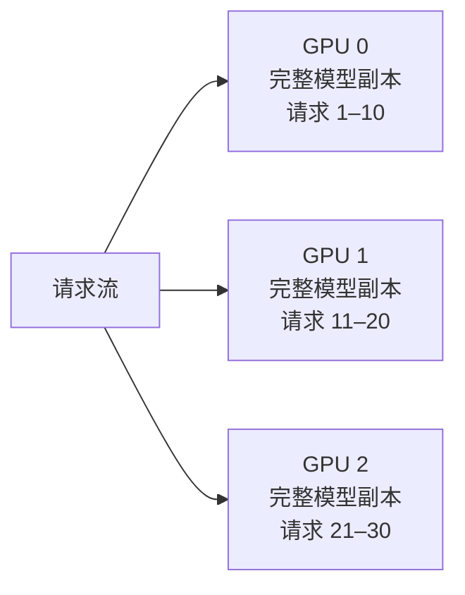
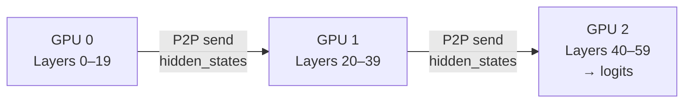
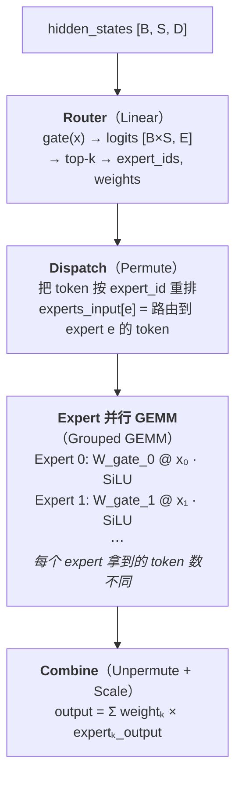
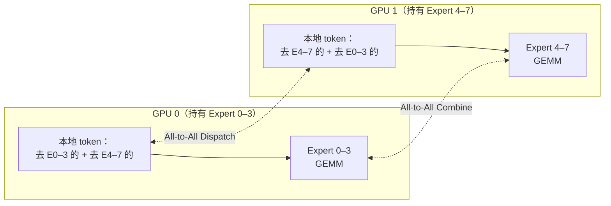
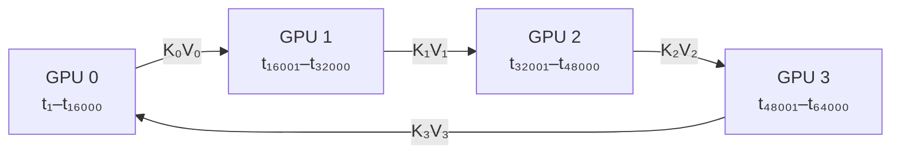
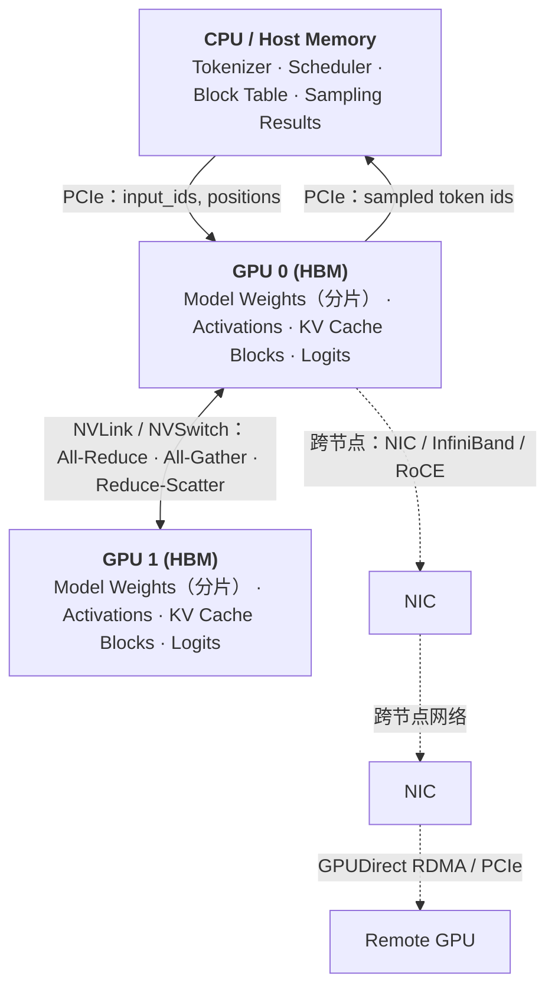
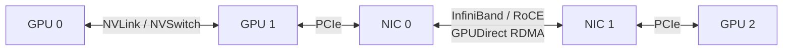

> **NOTE** 本文基于 vLLM v0.27.1（tag `6e448d0`, 2026-08-11）源码深度剖析。文中所有文件路径、类名和行号均以该版本为准；vLLM 迭代很快，阅读时请以你手上的版本对照。


## 1. 分布式推理的混合并行策略

分布式推理的混合并行策略：

| 遇到的问题 | 该用的策略 | 切的是什么 |
|---|---|---|
| 单张卡放不下**一个 Linear 层** | **TP** | 层**内**的矩阵，按行/列切 |
| 单层放得下，但**整个模型**太大 | **PP** | 按**层**切，分段流水 |
| MoE 的 **Expert 太多** | **EP** | 按 **Expert** 切 |
| **上下文太长**，KV Cache 装不下 | **CP** | 按 **token 序列**切 |
| 模型明明装得下，但**要更多吞吐** | **DP** | 什么都不切，**整个模型复制一份** |

这张表里最值得单独说的是 **DP**：它和其余四个不是一类东西。TP/PP/EP/CP 解决的都是"装不下"，是被迫拆分；**DP 解决的是"想要更多"，前提恰恰是单卡装得下**。所以生产部署里通常是"先用 TP/PP/EP/CP 把模型塞进一组卡，再用 DP 把这组卡整体复制 N 份来放大吞吐"——DP 永远是最外层。

下面按 DP → TP → PP → EP → CP 的顺序展开。

### 1.1 DP (Data Parallelism)

**DP：每个 GPU 持有完整模型副本，各自处理不同请求。**



| | 说明 |
|---|---|
| 优势 | 吞吐近似线性扩展，**GPU 间零通信** |
| 限制 | 每个 GPU 必须装得下完整模型 |
| 适用 | 模型放得下、但并发不够的场景 |
| vLLM 实现 | `DPCoordinator`（`vllm/v1/engine/coordinator.py`）管理多个 `EngineCore` 实例，用 ZMQ 做请求分发与负载均衡 |

### 1.2 TP (Tensor Parallelism)

#### 1.2.1 TP 是什么？

**TP（Tensor Parallelism）**：将一个 Transformer Layer 内的大矩阵/计算张量切分到多张 GPU 上，让多张 GPU **共同完成同一个请求**的计算。

与 DP“**一张 GPU 处理一批请求**”不同，TP 是：

```text
DP：
Request A ──→ GPU 0（完整模型）
Request B ──→ GPU 1（完整模型）
Request C ──→ GPU 2（完整模型）

TP：
                 一个 Request
                      │
          ┌───────────┼───────────┐
          ▼           ▼           ▼
        GPU 0       GPU 1       GPU 2
        1/N 模型     1/N 模型     1/N 模型
          └───────────┼───────────┘
                      ▼
                 共同完成计算
```

因此 TP 的主要价值是：

* **降低单 GPU 的模型参数和计算量**
* 让原本单卡放不下的模型可以跨多卡运行

代价则是：**GPU 之间需要频繁通信。**

#### 1.2.2 TP 怎么切？

以矩阵乘法：
$$Y=XW$$

为例，TP 最常见的两种切法是 **Column Parallel** 和 **Row Parallel**。

```text
┌────────────── Tensor Parallelism ────────────────────────────────────┐
│                                                                       │
│  TP: 单层内的矩阵按行/列切分到多个 GPU                                │
│                                                                       │
│  Column-parallel (QKV Projection, Gate/Up):                           │
│  ┌──────────┐   ┌──────────┐   ┌──────────┐   ┌──────────┐         │
│  │  GPU 0   │   │  GPU 1   │   │  GPU 2   │   │  GPU 3   │         │
│  │ W[:, 0:d]│   │W[:, d:2d]│   │W[:,2d:3d]│   │W[:,3d:4d]│         │
│  │    ↓     │   │    ↓     │   │    ↓     │   │    ↓     │         │
│  │ Y₀=X@W₀ │   │ Y₁=X@W₁ │   │ Y₂=X@W₂ │   │ Y₃=X@W₃ │         │
│  └──────────┘   └──────────┘   └──────────┘   └──────────┘         │
│       ↓              ↓              ↓              ↓                 │
│   各 GPU 得到输出的一部分, 无需通信 (column-parallel 前半)             │
│                                                                       │
│  Row-parallel (O Projection, Down):                                   │
│  ┌──────────┐   ┌──────────┐   ┌──────────┐   ┌──────────┐         │
│  │  GPU 0   │   │  GPU 1   │   │  GPU 2   │   │  GPU 3   │         │
│  │W[0:d, :] │   │W[d:2d, :]│   │W[2d:3d,:]│   │W[3d:4d,:]│         │
│  │    ↓     │   │    ↓     │   │    ↓     │   │    ↓     │         │
│  │ Z₀=Y₀@W₀│   │ Z₁=Y₁@W₁│   │ Z₂=Y₂@W₂│   │ Z₃=Y₃@W₃│         │
│  └────┬─────┘   └────┬─────┘   └────┬─────┘   └────┬─────┘         │
│       └───────┬───────┴──────┬───────┘              │                │
│               ▼              ▼                       ▼                │
│         ═══════════ All-Reduce ═══════════                           │
│         Z = Z₀ + Z₁ + Z₂ + Z₃                                       │
│                                                                       │
│  每层 All-Reduce 次数: 2（Attention 后 + MLP 后）                     │
│  通信量: 2 × B × S × H × sizeof(dtype)                               │
│  最佳场景: NVLink / NVSwitch 互联的同机多卡                          │
└───────────────────────────────────────────────────────────────────────┘
```

两者的核心区别：

|      | Column Parallel | Row Parallel |
| ---- | --------------- | ------------ |
| 权重   | 按列切             | 按行切          |
| 每卡计算 | (Y_i=XW_i)      | (Z_i=Y_iW_i) |
| 结果   | 输出的不同分片         | 输出的部分和       |
| 通信   | 无               | All-Reduce   |
| 典型应用 | QKV、Gate/Up     | O、Down       |


#### 1.2.3 为什么 Column 和 Row 可以配合而且经常成对出现？

两种切法之所以能够配合，是因为：

> Column Parallel 的输出分片，恰好对应 Row Parallel 的输入分片。

可以用两个连续的 Linear Layer 来理解：

$$
X \rightarrow Linear_1 \rightarrow Y \rightarrow Linear_2 \rightarrow Z
$$

假设 TP=4：

```text
        Linear 1                         Linear 2
     Column Parallel                   Row Parallel

          W₁                                W₂
     ┌───────────────┐              ┌───────┐
     │ W₁₀│W₁₁│W₁₂│W₁₃│              │ W₂₀  │
     └───────────────┘              ├───────┤
          │                         │ W₂₁  │
          ▼                         ├───────┤
     Y = [Y₀│Y₁│Y₂│Y₃]              │ W₂₂  │
          │                         ├───────┤
          │                         │ W₂₃  │
          │                         └───────┘
          │                             │
          └────── Y₀ → W₂₀ ────────────┤
                 Y₁ → W₂₁ ─────────────┤
                 Y₂ → W₂₂ ─────────────┤
                 Y₃ → W₂₃ ─────────────┤
                                       ▼
                                  All-Reduce
                                       │
                                       ▼
                                       Z
```

假设：

$$
X\in R^{B\times8}
$$

第一层：

$$
Y=XW_1,\qquad W_1\in R^{8\times8}
$$

采用 **Column Parallel**，把 (W_1) 按列切成 4 份：

```text
                 W₁ (8 × 8)
        ┌────────┬────────┬────────┬────────┐
        │   W₁₀  │   W₁₁  │   W₁₂  │   W₁₃  │
        │  8 × 2 │  8 × 2 │  8 × 2 │  8 × 2 │
        └────────┴────────┴────────┴────────┘
             GPU0     GPU1     GPU2     GPU3
```

每张 GPU 分别计算：

$$
Y_0=XW_{10},\quad
Y_1=XW_{11},\quad
Y_2=XW_{12},\quad
Y_3=XW_{13}
$$

所以每张 GPU 得到 (Y) 的一部分：

$$
Y_0,Y_1,Y_2,Y_3\in R^{B\times2}
$$

整体上：

$$
\boxed{Y=[Y_0|Y_1|Y_2|Y_3]}
$$

现在进入第二层：

$$
Z=YW_2
$$

因为 (Y) 的维度是 8，所以：

$$
W_2\in R^{8\times4}
$$

注意：**这里的 Row Parallel 并不是随便把 (W_2) 切几块，而是沿着上一层输出 (Y) 的这个维度切。**

```text
                 W₂ (8 × 4)
              按行切成 4 份

        ┌──────────────────┐
        │      W₂₀         │  ← 2 × 4，对应 Y₀
        ├──────────────────┤
        │      W₂₁         │  ← 2 × 4，对应 Y₁
        ├──────────────────┤
        │      W₂₂         │  ← 2 × 4，对应 Y₂
        ├──────────────────┤
        │      W₂₃         │  ← 2 × 4，对应 Y₃
        └──────────────────┘
          GPU0    GPU1    GPU2    GPU3
```

于是每张 GPU 可以**直接使用自己上一层得到的 (Y_i)**：

$$
Z_0=Y_0W_{20}
$$

$$
Z_1=Y_1W_{21}
$$

$$
Z_2=Y_2W_{22}
$$

$$
Z_3=Y_3W_{23}
$$

为什么最后要相加？

因为完整的矩阵乘法实际上是：

$$
\begin{aligned}
Z
&=YW_2\
&=[Y_0|Y_1|Y_2|Y_3]
\begin{bmatrix}
W_{20}\
W_{21}\
W_{22}\
W_{23}
\end{bmatrix}\
&=Y_0W_{20}+Y_1W_{21}+Y_2W_{22}+Y_3W_{23}
\end{aligned}
$$

因此：

$$
\boxed{Z=Z_0+Z_1+Z_2+Z_3}
$$

最后通过 **All-Reduce** 把各 GPU 的部分结果相加。

```text
 GPU0             GPU1             GPU2             GPU3
  │                │                │                │
Y₀ × W₂₀         Y₁ × W₂₁         Y₂ × W₂₂         Y₃ × W₂₃
  │                │                │                │
 Z₀                Z₁               Z₂               Z₃
  └────────────────┴────────────────┴────────────────┘
                           │
                     All-Reduce
                           │
                           ▼
                    Z = Z₀+Z₁+Z₂+Z₃
```

所以，**Column → Row 能够配合的关键**就是：

> **Column Parallel 把上一层的输出 (Y) 按列切开；Row Parallel 再把下一层权重 (W_2) 按对应的行切开。这样每张 GPU 上的 (Y_i) 正好对应自己的 (W_{2i})，无需重新分发激活，只需要在最后 All-Reduce 合并部分结果。**

可以把它记成：

$$
\boxed{
\text{Column：输出切分}
\rightarrow
\text{Row：输入维度对应切分}
\rightarrow
\text{All-Reduce：合并部分结果}
}
$$


#### 1.2.4 TP 在 Transformer 中怎么应用？

这种“列-行”的组合完美对应了标准 Transformer 解码器（Decoder）内部的组件设计： 

* **Self-Attention 模块**：
    * **QKV Projection（列并行）**：将输入映射到 Q、K、V 空间，每个 GPU 独立负责一部分 Attention Head（注意力头）。
    * **Attention 计算**：在各 GPU 内部独立完成计算。
    * **Output Projection / O_Proj（行并行）**：将多头输出映射回原维度，直到这一步结束时，才进行一次 All-Reduce 通信完成整体求和。 
* **MLP / FFN 模块**：
    * **Gate / Up Projection / FC1（列并行）**：将特征维度放大到中间维度（如 $$4H$$），各 GPU 分片计算。
    * **Down Projection / FC2（行并行）**：将中间维度重新缩小回原维度，同样在第二层结束后才进行一次 All-Reduce 通信。 

以 TP=4 为例：

```text
┌────────────────────────────── Transformer Layer ──────────────────────────────┐
│                                                                              │
│   Attention                                                                  │
│                                                                              │
│   Input X                                                                    │
│      │                                                                       │
│      ├───────────────┬───────────────┬───────────────┐                       │
│      ▼               ▼               ▼               │                       │
│   Q Projection    K Projection    V Projection       │                       │
│   Column TP       Column TP       Column TP          │                       │
│      │               │               │               │                       │
│      ▼               ▼               ▼               │                       │
│   Q₀ Q₁ Q₂ Q₃     K₀ K₁ K₂ K₃     V₀ V₁ V₂ V₃       │                       │
│      │               │               │               │                       │
│      └───────────────┼───────────────┘               │                       │
│                      ▼                               │                       │
│               Attention Compute                      │                       │
│               GPU 本地计算                            │                       │
│                      │                               │                       │
│                      ▼                               │                       │
│              O Projection                            │                       │
│              Row TP                                   │                       │
│                      │                               │                       │
│              ┌───────┴───────┐                       │                       │
│              ▼       ▼       ▼       ▼               │                       │
│             GPU0    GPU1    GPU2    GPU3              │                       │
│              └───────┬───────┘                       │                       │
│                      ▼                               │                       │
│                 All-Reduce                           │                       │
│                      │                               │                       │
│                      ▼                               │                       │
│                 Attention Out                         │                       │
│                                                      │                       │
│──────────────────────────────────────────────────────┼───────────────────────│
│                                                      │                       │
│   MLP                                                │                       │
│                                                      │                       │
│   Input                                               │                       │
│      │                                               │                       │
│      ├──────────────────────┬────────────────────────┤                       │
│      ▼                      ▼                                                │
│   Gate Projection        Up Projection                                         │
│   Column TP              Column TP                                            │
│      │                      │                                                  │
│      ▼                      ▼                                                  │
│   Gate₀...Gate₃          Up₀...Up₃                                            │
│      │                      │                                                  │
│      └───────────┬──────────┘                                                  │
│                  ▼                                                             │
│             Activation                                                         │
│             GPU 本地计算                                                       │
│                  │                                                             │
│                  ▼                                                             │
│             Down Projection                                                    │
│             Row TP                                                             │
│                  │                                                             │
│          ┌───────┴───────┐                                                     │
│          ▼       ▼       ▼       ▼                                             │
│         GPU0    GPU1    GPU2    GPU3                                           │
│          └───────┬───────┘                                                     │
│                  ▼                                                             │
│             All-Reduce                                                         │
│                  │                                                             │
│                  ▼                                                             │
│              MLP Out                                                            │
│                                                                              │
└──────────────────────────────────────────────────────────────────────────────┘
```

这里可以抓住一个非常简单的规律：

| Transformer 部分       | TP 方式               | 为什么                       |
| -------------------- | ------------------- | ------------------------- |
| Q / K / V Projection | **Column Parallel** | 将不同 Head/输出维度分到不同 GPU     |
| Attention            | **GPU 本地计算**        | 每个 GPU 处理自己的 Head         |
| O Projection         | **Row Parallel**    | 将各 GPU 的 Attention 输出重新组合 |
| Gate / Up Projection | **Column Parallel** | 将 MLP 中间维度切到不同 GPU        |
| Activation           | **GPU 本地计算**        | 每个 GPU 处理自己的中间维度          |
| Down Projection      | **Row Parallel**    | 将各 GPU 的部分结果合并            |

因此可以把一个 Transformer Layer 简化成：

```text
        Attention                         MLP

    QKV Projection                   Gate / Up Projection
    Column Parallel                  Column Parallel
           │                                │
           ▼                                ▼
    ┌─────────────┐                  ┌─────────────┐
    │ Attention   │                  │ Activation  │
    │ GPU Local   │                  │ GPU Local   │
    └──────┬──────┘                  └──────┬──────┘
           │                                │
      O Projection                    Down Projection
      Row Parallel                    Row Parallel
           │                                │
           ▼                                ▼
     All-Reduce                         All-Reduce
           │                                │
           ▼                                ▼
      Attention Out                       MLP Out
```

这样就能看到 TP 在 Transformer 中最核心的结构：

$$
\boxed{
\text{Column Parallel}
\rightarrow
\text{GPU 本地计算}
\rightarrow
\text{Row Parallel}
\rightarrow
\text{All-Reduce}
}
$$

这个模式在 **Attention 和 MLP 中各出现一次**，因此：**每个 Transformer Layer 通常需要 2 次 All-Reduce**：

**Attention：** 
$$
QKV\rightarrow Attention\rightarrow O\rightarrow All\text{-}Reduce
$$

**MLP：**
$$
Gate/Up\rightarrow Activation\rightarrow Down\rightarrow All\text{-}Reduce
$$

#### 1.2.5 TP 的代价：通信

TP 的核心交换是：**用 GPU 间通信换取单卡计算和显存压力的降低。**

一次 All-Reduce 的逻辑通信量约为：

$$
\boxed{
V=B\times S\times H\times sizeof(dtype)
}
$$

其中：

* B：Batch Size，本轮同时处理的序列数
* S：本轮每个序列处理的 token 数
* H：Hidden Size

**Decode 阶段通常 (S=1)**。

以我们前面的例子为例：

* Batch=32
* S=1
* H=8192
* BF16（2 Byte）
* 80 层
* 每层 2 次 All-Reduce

则：

$$
V_{\text{一次}}
=32\times1\times8192\times2
=512\text{ KiB}
$$

整个 Decode Step：

$$
512\text{ KiB}\times2\times80
\approx\boxed{80\text{ MiB}}
$$

这是**逻辑通信量**；实际链路传输量还取决于 All-Reduce 算法。例如 Ring All-Reduce 单卡的传输量约为：

$$
2\frac{N-1}{N}V
$$

TP=8 时约为 (1.75V)。

#### 1.2.6 为什么 TP 更适合机内高速互联场景？

TP 的问题不只是“通信量大”，更重要的是：**All-Reduce 位于每层计算的关键路径，需要同步等待。**

```text
GPU Compute
     │
     ▼
All-Reduce
     │
     │ 等待
     ▼
GPU Compute
     │
     ▼
All-Reduce
     │
     ▼
下一层
```

因此 TP 对 **带宽和延迟** 都非常敏感。

| 互联                | TP 适合度 | 原因            |
| ----------------- | ------ | ------------- |
| NVLink / NVSwitch | ⭐⭐⭐⭐⭐  | 高带宽、低延迟       |
| PCIe              | ⭐⭐⭐    | 带宽和延迟较弱       |
| 跨机 IB / RoCE     | ⭐⭐      | 网络路径更长、同步成本更高 |

所以工程上通常遵循：**TP 优先放在高速互联的机内多卡**。跨机扩展时，则通常结合 **DP、PP、EP** 等并行方式，减少高频的跨机同步。

> **一句话总结：TP 把一个 Transformer Layer 的矩阵计算拆给多张 GPU；Column Parallel 产生输出分片，Row Parallel 产生部分和，再通过 All-Reduce 合并。它用 GPU 间通信换取单卡计算和显存压力的降低，因此尤其依赖高速的机内互联。**

### 1.3 PP (Pipeline Parallelism)

#### 1.3.1 PP是什么？

与 TP 主要切分同一层不同，PP 切分的是**不同层（可以而且往往是多个层一个stage）**。

PP的基本思路是：模型沿层的方向切开多个连续的stage，并将这些 stage 部署到不同的 GPU 或 GPU 组上，推理请求需要依次经过所有 stage，stage间串行传递 `hidden_states`。每个 stage 只保存自己负责层的权重和 KV cache。

例如，一个包含 60 层 Transformer 的模型可以划分为三个 stage：

```text
Stage 0：Layers 0–19
Stage 1：Layers 20–39
Stage 2：Layers 40–59
```

其PP和数据流向如下所示：



对于一个 batch，输入首先经过 GPU 0 的层；GPU 0 产生边界激活后，将其发送给 GPU 1，依此类推。每个 stage 只保存自己负责的模型层，以及这些层对应的中间状态和 KV cache。

#### 1.3.2 为什么推理系统需要 PP

在 LLM Serving 中，模型规模可能远超单张 GPU 的显存容量。除了模型权重之外，推理时还需要保存：

- 模型权重；
- KV cache；
- 中间激活；
- CUDA graph 和通信缓冲区；
- 批处理、调度和运行时所需的临时空间。

尤其是长上下文和高并发场景下，KV cache 可能占据大量显存。即使模型权重能够放入单卡，加入多个请求的 KV cache 后，也可能无法继续扩展 batch size。

PP 可以将模型不同层的权重和 KV cache 分布到多个 GPU 上，使单张 GPU 只负责模型的一部分。

因此，在推理场景中，PP 主要解决两个问题：

1. **模型权重无法放入单卡或单个 GPU 组；**
2. **模型权重和 KV cache 的总显存需求过大。**

需要注意，PP 并不会减少整个模型的总计算量。它主要改变的是：

- 模型和缓存如何分布；
- 请求如何经过不同 GPU；
- 多张 GPU 如何协同完成一次前向计算。

#### 1.3.3 PP 怎么切分模型

PP 通常将模型按连续层切分：

```text
GPU 0：Embedding + Layers 0–19
GPU 1：Layers 20–39
GPU 2：Layers 40–59 + LM Head
```

每个连续的层区间称为一个 **pipeline stage**。

同一个 stage 内的层通常在本地 GPU 上连续执行，只有 stage 边界处需要跨 GPU 传递中间激活。

这意味着 PP 的通信主要发生在：

```text
Stage 0 → Stage 1
Stage 1 → Stage 2
```

而不是每一层都进行跨卡通信。

另外，PP最简单的方式是按照层数平均切分，但实际部署中还需要考虑：

- 每个 stage 的计算量；
- 每个 stage 的权重显存；
- 每个 stage 的 KV cache 显存；
- Embedding 和输出层的额外开销；
- GPU 的计算能力和显存容量；
- stage 之间的网络带宽和延迟。

如果某个 stage 的计算时间明显更长，整个请求就会被这个 stage 拖慢。因为后续 stage 必须等待它产生输出，前面的 stage 也可能因为下游处理不及时而无法继续推进。

所以，PP 的切分目标不是简单地让每个 stage 拥有相同数量的层，而是尽量让各 stage 的：

- 计算时间；
- 显存占用；
- 通信开销；

保持相对均衡。

**TIPS** PP 的每个 Stage 不一定只对应一张 GPU

在实际推理系统中，一个 stage 也可能由多张 GPU 组成，并在 stage 内部使用 TP：

```text
Stage 0：GPU 0–3，通过 TP 计算 Layers 0–19
Stage 1：GPU 4–7，通过 TP 计算 Layers 20–39
Stage 2：GPU 8–11，通过 TP 计算 Layers 40–59
```

此时：

- PP 负责层与层之间的切分；
- TP 负责一个 stage 内部的层计算；
- 每个 PP stage 可以看作一个 TP 计算组。


#### 1.3.4 推理请求在 PP 中如何流动

##### ① Prefill 阶段

Prefill 阶段负责处理用户输入的完整 prompt。

例如，用户输入长度为 1024 个 token，数据会依次经过所有 stage：

```text
Prompt tokens
  ↓
Stage 0：计算前 20 层
  ↓ hidden states
Stage 1：计算中间 20 层
  ↓ hidden states
Stage 2：计算后 20 层
  ↓
生成 logits
```

在每个 stage 内部，模型会为自己负责的层计算对应的 Key 和 Value，并写入本地 KV cache：

```text
Stage 0：保存 Layers 0–19 的 KV cache
Stage 1：保存 Layers 20–39 的 KV cache
Stage 2：保存 Layers 40–59 的 KV cache
```

Prefill 通常具有较强的计算特征，输入 token 数量较多，因此比较容易通过批处理或请求并发来提高 GPU 利用率。

##### ② Decode 阶段

Decode 阶段每次只生成一个或少量新 token。

生成下一个 token 时，新的 hidden states 仍然需要依次经过所有 stage：

```text
新 token
  ↓
Stage 0：读取本地 KV cache，计算 Layers 0–19
  ↓
Stage 1：读取本地 KV cache，计算 Layers 20–39
  ↓
Stage 2：读取本地 KV cache，计算 Layers 40–59
  ↓
输出下一个 token
```

每个 stage 只访问自己负责层的 KV cache，但整个生成过程仍然需要经过完整的模型层。

因此，PP 在 decode 阶段的主要特点是：

- KV cache 按 stage 分布；
- 每个 token 都需要经过所有 stage；
- stage 间需要传递中间激活；
- 单请求的端到端延迟会受到多个 stage 串行执行的影响。

在高并发场景中，系统可以同时调度多个请求或多个 token，使不同 stage 尽量处理不同请求的工作，从而提升整体吞吐。

#### 1.3.5 PP的代价：流水线气泡

所谓流水线气泡，是指某些 GPU 暂时没有可执行的工作，只能等待其他 stage。

① 启动时的气泡

假设有三个 stage，开始处理第一个 microbatch 时：但在启动阶段，后面的 stage 还没有输入；在结束阶段，前面的 stage 已经完成，而后面的 stage 仍在处理剩余数据。GPU 暂时没有工作可执行的时间段，就是流水线气泡。

```
时间 →
Stage 0：F(M1)
Stage 1：空闲 → 等待 M1
Stage 2：空闲 → 等待 M1
```

当 Stage 0 计算完 M1 并发送给 Stage 1 后：

```
时间 →
Stage 0：F(M2)
Stage 1：F(M1)
Stage 2：空闲 → 等待 M1
```

此时 Stage 2 仍然没有数据可处理。

随着数据不断向后传递，流水线才逐渐被填满。这一阶段称为 Fill。

② 结束时的气泡
当 Stage 0 已经处理完最后一个 microbatch 后，后面的 stage 可能仍然有数据没有处理完：

```
Stage 0：已完成
Stage 1：仍在处理最后几个 microbatch
Stage 2：仍在处理最后几个 microbatch
```

流水线需要继续运行，直到所有 stage 都完成任务。这一阶段称为 Drain。

因此，PP 通常包含：

1. **Fill**：流水线逐渐填满
2. **Steady State**：所有 stage 尽量并行工作
3. **Drain**：流水线逐渐排空

Fill 和 Drain 阶段产生的空闲时间，就是流水线气泡的一部分。

气泡大小主要取决于：

- stage 数量；
- 并发请求或 microbatch 数量；
- 各 stage 的负载是否均衡；
- stage 之间的通信延迟；
- 调度器能否持续提供足够的工作。

对于推理系统而言，一个重要区别是：

> 训练通常可以通过大量 microbatch 长时间维持稳定流水线；在线推理的请求数量、输入长度和输出长度不断变化，因此流水线负载更动态，气泡和负载不均衡更难完全消除。

因此，PP 往往更适合有一定并发度、注重整体吞吐的 Serving 场景。对于单请求低延迟场景，则需要谨慎评估 stage 串行执行和通信带来的开销。

#### 1.3.6 推理和训练中的 PP 有什么不同

PP 既可以用于训练，也可以用于推理，但两者关注的问题不同。

##### ① 训练阶段的 PP

训练时，每个 microbatch 都需要进行：

```text
Forward：Stage 0 → Stage 1 → Stage 2
Backward：Stage 2 → Stage 1 → Stage 0
```

因此训练 PP 需要处理：

- forward 激活保存；
- backward 梯度传递；
- 多个 microbatch 的梯度累积；
- 参数更新；
- 1F1B 等调度策略；
- 激活显存优化。

训练 PP 的主要目标通常是：

- 支撑超大模型训练；
- 提高整体训练吞吐；
- 降低单卡模型状态和激活压力。

##### ② 推理阶段的 PP

推理阶段通常只有 forward，不需要：

- backward；
- 梯度；
- 优化器状态；
- 参数更新；
- 用于 backward 的训练激活。

推理 PP 的主要关注点是：

- 模型权重能否分布到多张 GPU；
- KV cache 如何分布；
- Prefill 和 Decode 如何调度；
- stage 间通信是否成为瓶颈；
- 如何提升并发吞吐；
- 如何控制单请求延迟。

##### ③ 对比总结

两者的核心区别概括来说如下：

> 训练 PP 的核心是调度 forward、backward 和激活显存；推理 PP 的核心是分布式执行 forward、管理 KV cache，以及在吞吐和延迟之间做权衡。

| 对比项 | 训练 PP | 推理 PP |
|---|---|---|
| 主要计算 | Forward + Backward | Forward |
| 是否需要梯度 | 需要 | 不需要 |
| 是否需要参数更新 | 需要 | 不需要 |
| 主要显存对象 | 参数、梯度、优化器状态、激活 | 参数、KV cache、运行时缓冲区 |
| 典型调度 | Microbatch、1F1B | 请求/Token 批处理、Prefill/Decode 调度 |
| 主要优化目标 | 训练吞吐和显存 | Serving 吞吐、延迟和缓存容量 |
| 边界通信 | 激活 + 反向梯度 | 主要是前向激活 |

#### 1.3.7 PP 对 KV cache 有什么影响

在大模型推理（Inference）场景下，PP 对 KV Cache 的管理、显存占用以及调度带来了极其深远的影响。

##### ① 空间分布式切分：KV Cache 被天然“分层切片”

在单卡或张量并行（TP）中，全网所有层的 KV Cache 通常集中在同一张显卡或同一个机组里。但在 PP 并行下每个 Stage（显卡/节点）只负责模型的一部分层（Layers）。因此，只有当前 Stage 所包含层的 KV Cache 会被缓存在该卡的显存中。

例如：一个 4 阶段的 PP 流水线（Stage 0-3），总共 80 层模型。Stage 0 只持有第 1~20 层的模型参数，因此它也只负责创建和维护第 1~20 层的 KV Cache。后序层的 KV Cache 散落在后面的显卡上。

##### ② 显存节约：降低单卡 KV Cache 的上限压力

大模型推理的显存瓶颈通常在于 模型参数 + KV Cache。

* 单卡纵向扩容：因为 PP 将模型层数均分到了不同卡上，单卡上需要缓存的 KV Cache 层数也变成了总层数的 1/PP_Size。
* 释放长文本潜力：在处理超长文本（Context Length）或大 Batch 推理时，单卡因为只需要存 1/N 的层，从而能腾出更多显存来容纳更多的 Token，在一定程度上缓解了单卡显存因长文本而崩溃（OOM）的问题。

##### ③ 动态管理难题：跨 Stage 的 Token 调度与绑定

在现代推理框架（如 vLLM, LMDeploy）中，通常使用 PagedAttention 来动态申请和管理 KV Cache 虚拟内存块。引入 PP 后，这种管理变得极其复杂：

* 全局调度一致性：当一个 Batch 的请求在不同的 Stage 之间流动时，中央调度器必须确保所有 Stage 在同一时间为同一个请求分配或释放 KV Cache 块。
* 不均匀负载（Load Imbalance）：由于不同请求的 Prompt 长度和生成长度不同（特别是多轮对话或 Early Stopping），某些请求可能在中间就结束了。调度器需要跨越不同的 PP Stage 去同步“释放”这些不再需要的 KV Cache 块，如果同步不及时，会导致某些 Stage 显存提前占满。

##### ④ 跨机通信：解耦架构下的新瓶颈

在一些超大规模推理集群中（如 Speculative Decoding 投机采样或分布式推理），PP 经常跨机部署：

* PP 阶段之间传递的是 Activation（激活值 Tensor），而不是整个 KV Cache。
* 虽然不需要在网络上传输 KV Cache（因为它们已经常驻在各自层的显卡上），但是由于 PP 的每一步都需要等待前级通信，网络延迟（Latency）会直接增加每个 Token 的生成时间（TP-Time-to-First-Token 和 Time-per-Output-Token）。

#### 1.3.8 什么时候适合使用 PP

PP 通常适合以下推理场景：

1、模型权重无法放入单卡或单个 TP 组

这是最直接的场景：

- 模型参数规模很大；
- 单卡显存不足；
- 单机内的 TP 组仍然无法容纳完整模型；
- 需要跨节点部署。

2、KV cache 显存压力较大

当模型可以勉强加载，但长上下文或高并发导致 KV cache 不足时，PP 可以将不同层的 KV cache 分布到不同 GPU 上

不过，还需要结合 PagedAttention、KV cache 量化或其他缓存优化技术共同评估。

3、更关注整体吞吐

PP 更适合：

- 多请求并发；
- 批量推理；
- 长 prompt 的 Prefill；
- 希望提升集群整体吞吐；
- 能够持续向流水线提供任务。

4、需要跨节点部署模型

当模型太大，需要跨多台机器部署时，PP 可以减少跨机 TP 所需的高频集合通信，因此常被用于：

```text
机内 TP + 机间 PP
```

需要谨慎使用的场景：

以下场景不一定适合 PP：

- 单请求、低并发的实时对话；
- 极度追求首 token 延迟或单 token 延迟；
- 跨机网络带宽不足；
- stage 之间计算量严重不均衡；
- 模型本身可以由单机 TP 高效容纳；
- 请求长度和到达模式变化非常剧烈。

在这些场景中，PP 虽然能够解决显存问题，但 stage 间的串行执行和通信可能抵消并行带来的收益。

### 1.4 EP (Expert Parallelism)

混合专家模型（Mixture-of-Experts，MoE）通过在模型中引入多个相对独立的 Expert，并利用 Router 为每个 Token 动态选择少量 Expert，从而在不线性增加计算量的情况下扩大模型参数规模。

与传统稠密模型不同，MoE 模型通常只激活部分参数。例如，一个 MoE 层可能包含 64 个 Expert，但每个 Token 只选择其中的 Top-2 个 Expert。这样，模型可以拥有较大的总参数量，同时将单个 Token 的实际计算量控制在较低水平。

然而，随着 Expert 数量增加，单张 GPU 往往无法容纳全部 Expert 参数。因此，需要将不同 Expert 分布到多张 GPU 上，这就是专家并行（Expert Parallelism，EP）。

#### 1.4.1 EP 的核心思想

EP 的基本思想是：

> 将 MoE 层中的不同 Expert 切分并放置在不同 GPU 上，每张 GPU 只负责计算本地持有的 Expert。

假设一个 MoE 层包含 64 个 Expert，使用 4 张 GPU，并设置 `EP=4`，则可以按照如下方式进行分配：

```text
总计 64 个 Experts，4 张 GPU，EP = 4

┌──────────────────────────────────────────────────────────────┐
│                        Expert Parallelism                    │
├──────────────────────────────────────────────────────────────┤
│ GPU 0：Expert  0 ~ 15                                        │
│ GPU 1：Expert 16 ~ 31                                        │
│ GPU 2：Expert 32 ~ 47                                        │
│ GPU 3：Expert 48 ~ 63                                        │
└──────────────────────────────────────────────────────────────┘
```

从参数存储角度看，每张 GPU 只需要加载总 Expert 参数的约四分之一。假设所有 Expert 参数大小相同，则：

```text
单卡 Expert 参数量 ≈ 总 Expert 参数量 / EP Size
```

需要注意的是，EP 只切分 MoE 层中的 Expert。Router、Attention 层以及其他共享模块是否复制或切分，通常还要结合 Tensor Parallelism（TP）、Data Parallelism（DP）或 Pipeline Parallelism（PP）共同决定。

#### 1.4.2 为什么 MoE 需要 EP

在稠密模型中，每个 Token 通常都会经过同一组参数；而在 MoE 模型中，多个 Expert 只对部分 Token 激活。

例如：

```text
输入 Token 数量：      4096
Expert 总数：           64
每个 Token 激活 Expert：Top-2
```

理论上，每个 Token 只需要经过 2 个 Expert，而不是全部 64 个 Expert。因此，MoE 可以实现：

```text
参数容量较大，但单 Token 激活参数量较小
```

但是，如果所有 64 个 Expert 都放在一张 GPU 上，会带来较大的显存压力。EP 将 Expert 分散到多个 GPU，使得：

- 单卡显存占用降低；
- 更多 Expert 可以加入模型；
- 不同 GPU 可以并行执行不同 Expert；
- 模型容量可以随着 GPU 数量扩展。

EP 的代价是：Token 不一定会被发送到当前 GPU 上的 Expert，因此必须进行跨 GPU 通信。

#### 1.4.3 EP 的完整执行流程

一个典型的 EP MoE 层可以抽象为以下五个阶段：

从工程实现角度看，MoE 的瓶颈并不是“一个大 GEMM 算不动”，而是 **Router + 动态 Dispatch + 变长 Grouped GEMM + Combine** 这一整条动态流水线：



```text
                    MoE 层执行流程

┌──────────────┐
│ 输入 Hidden   │
│ States        │
└──────┬───────┘
       │
       ▼
┌──────────────┐
│ Router/Gate  │  计算每个 Token 的 Expert 概率
└──────┬───────┘
       │
       ▼
┌──────────────┐
│ Top-K 选择   │  确定 Expert ID 和路由权重
└──────┬───────┘
       │
       ▼
┌──────────────┐
│ Dispatch     │  将 Token 发送至目标 Expert 所在 GPU
│ All-to-All   │
└──────┬───────┘
       │
       ▼
┌──────────────┐
│ 本地 Expert  │  执行 Expert FFN/GEMM
│ Computation  │
└──────┬───────┘
       │
       ▼
┌──────────────┐
│ Combine      │  将结果发回原 GPU 并按路由权重聚合
│ All-to-All   │
└──────┬───────┘
       │
       ▼
┌──────────────┐
│ 残差连接/后续 │
│ Transformer 层│
└──────────────┘
```

##### ① Router 计算

对于输入 Token 的隐藏状态 \(x_t\)，Router 通常先计算每个 Expert 的打分：

$$
s_t = W_r x_t
$$

其中：

- \(x_t\) 表示第 \(t\) 个 Token 的隐藏状态；
- \(W_r\) 表示 Router 权重；
- \(s_t\) 表示该 Token 对所有 Expert 的路由分数。

经过 Softmax 后，得到路由概率：

$$
p_{t,e} = \operatorname{Softmax}(s_t)_e
$$

然后选择概率最高的 Top-K 个 Expert：

$$
\mathcal{E}_t = \operatorname{TopK}(p_t, K)
$$

例如：

```text
Token t₁：
  Expert 3  → 权重 0.62
  Expert 17 → 权重 0.28
  其他      → 权重 0.10

Top-2 路由结果：
  t₁ → Expert 3、Expert 17
```

Router 不仅需要记录 Expert ID，还需要记录每个 Expert 对应的路由权重。后续 Combine 阶段会使用这些权重对不同 Expert 的输出进行加权求和。

##### ② All-to-All Dispatch

Router 完成路由后，系统需要根据 Expert ID 判断 Token 的目标 GPU。

在前面的例子中：

```text
Expert  3  位于 GPU 0
Expert 17  位于 GPU 1
Expert 35  位于 GPU 2
Expert 52  位于 GPU 3
```

如果当前 Token 位于 GPU 0，但它选择了 Expert 17，那么该 Token 必须从 GPU 0 发送到 GPU 1。

```text
┌──────────────┐                         ┌──────────────┐
│    GPU 0     │                         │    GPU 1     │
│              │                         │              │
│ Token t₁     │────── Dispatch ───────▶│ Expert 17    │
│ 选择 E17     │                         │              │
└──────────────┘                         └──────────────┘
```

当多个 GPU 上都有 Token 需要访问不同 GPU 的 Expert 时，就形成全对全通信，即 All-to-All。

```text
                         All-to-All Dispatch

             ┌─────────────┐
             │    GPU 0    │
             └─────┬───────┘
          ╱─────────┼─────────╲
         ▼          ▼          ▼
┌─────────────┐ ┌─────────────┐ ┌─────────────┐
│    GPU 1    │ │    GPU 2    │ │    GPU 3    │
│ E16~E31     │ │ E32~E47     │ │ E48~E63     │
└─────────────┘ └─────────────┘ └─────────────┘
         ▲          ▲          ▲
          ╲─────────┼─────────╱
             ┌──────┴──────┐
             │    GPU 0    │
             └─────────────┘
```

实际实现通常不会逐个 Token 单独发送，而是先按照目标 Expert 或目标 GPU 对 Token 进行重排和打包，再进行批量通信：

```text
原始 Token 顺序：

[t₀, t₁, t₂, t₃, t₄, t₅]

路由结果：

t₀ → E3
t₁ → E17
t₂ → E35
t₃ → E3
t₄ → E52
t₅ → E17

按照目标 GPU 重排：

GPU 0：t₀、t₃
GPU 1：t₁、t₅
GPU 2：t₂
GPU 3：t₄
```

这种重排过程通常需要维护以下元数据：

- Token 的原始位置；
- 目标 Expert ID；
- 路由权重；
- Token 属于哪个源 GPU；
- Token 在目标 Expert 批次中的位置。

##### ③ 本地 Expert 计算

完成 Dispatch 后，每张 GPU 会收到一批需要由本地 Expert 处理的 Token。由于每张 GPU 只保存部分 Expert，因此它只负责执行这些本地 Expert 的前馈网络计算。

例如，在 `EP=4` 的场景中：

```text
GPU 0：Expert 0  ~ Expert 15
GPU 1：Expert 16 ~ Expert 31
GPU 2：Expert 32 ~ Expert 47
GPU 3：Expert 48 ~ Expert 63
```

GPU 0 收到 Token 后，会按照目标 Expert 进行分组：

```text
GPU 0 本地 Expert：

Expert 3  ← t₀、t₃
Expert 8  ← t₆
Expert 12 ← t₇、t₈
```

对应的数据流如下：

```text
┌────────────────────┐
│ GPU 0 收到的 Tokens │
│ t₀、t₃、t₆、t₇、t₈  │
└─────────┬──────────┘
          │ 按 Expert ID 分组
          ▼
┌─────────┬─────────┬──────────┐
│Expert 3 │Expert 8 │Expert 12 │
│t₀、t₃  │t₆       │t₇、t₈    │
└────┬────┴────┬────┴─────┬────┘
     └─────────┴──────────┘
               ▼
       本地 Expert 计算
```

一个典型的 Expert 通常是一个独立的前馈网络。对于输入隐藏状态 $$x$$，普通 FFN 可以表示为：

$$
\operatorname{Expert}_e(x)
=
W_{2,e}\,\sigma(W_{1,e}x)
$$

其中：

- $$W_{1,e}$$ 是第 $$e$$ 个 Expert 的上投影矩阵；
- $$W_{2,e}$$ 是下投影矩阵；
- $$\sigma$$ 是激活函数，例如 SiLU 或 GELU。

对于常见的 SwiGLU 结构，可以表示为：

$$
\operatorname{Expert}_e(x)
=
W_{2,e}
\left[
\operatorname{SiLU}(W_{1,e}x)
\odot
(W_{3,e}x)
\right]
$$

其中，$$\odot$$ 表示逐元素相乘，$$W_{3,e}$$ 是 SwiGLU 中的第二个上投影矩阵。

在实际实现中，一个 Expert 通常会批量处理多个 Token，而不是逐个 Token 计算。假设 Expert $$e$$ 接收到 $$n_e$$ 个 Token，将它们组成输入矩阵 $$X_e$$，则普通 FFN 的计算可以写成：

$$
Y_e
=
\sigma(X_e W_{1,e})W_{2,e}
$$

其中：

- $$X_e$$ 包含分配给 Expert $$e$$ 的多个 Token；
- $$Y_e$$ 是该 Expert 对这些 Token 的输出；
- 矩阵乘法通常由 GPU 上的 GEMM Kernel 完成。


对于同一张 GPU 上的多个 Expert，系统通常会采用 Grouped GEMM，将多个 Expert 的矩阵乘法组织为一个批量计算任务：

```text
GPU 0：

Expert 3  → 处理 128 个 Tokens
Expert 8  → 处理  64 个 Tokens
Expert 12 → 处理  96 个 Tokens

Grouped GEMM：
┌────────────┬────────────┬─────────────┐
│ Expert 3   │ Expert 8   │ Expert 12   │
│ n₃ = 128   │ n₈ = 64    │ n₁₂ = 96    │
└────────────┴────────────┴─────────────┘
```

与为每个 Expert 单独启动一次 GEMM 相比，Grouped GEMM 可以减少 Kernel Launch 开销，并提升 GPU 计算资源的利用率。其效果取决于：

- 每个 Expert 接收到的 Token 数量；
- Token 是否已经按照 Expert 分组；
- 各 Expert 之间的负载是否均衡；
- 是否存在 Padding 或 Token Overflow；
- Expert 计算能否与后续通信重叠执行。

计算完成后，各 Expert 的输出会进入 All-to-All Combine 阶段，返回原始 Token 所在的 GPU，并根据 Router 产生的权重进行聚合。

##### ④ All-to-All Combine

Expert 计算完成后，结果需要发回原始 Token 所在的 GPU。这个过程称为 Combine，通常也需要一次 All-to-All 通信。

```text
                    All-to-All Combine

GPU 0 原始 Token t₁
        ▲
        │ Expert 17 计算结果
        │
GPU 1 ──┘

GPU 0 原始 Token t₂
        ▲
        │ Expert 35 计算结果
        │
GPU 2 ──┘
```

如果一个 Token 选择了 Top-2 Expert，则它会收到两个 Expert 的输出：

$$
y_t =
p_{t,e_1}\operatorname{Expert}_{e_1}(x_t)
+
p_{t,e_2}\operatorname{Expert}_{e_2}(x_t)
$$

例如：

```text
Token t₁：

来自 Expert 3 的输出：  y₁
来自 Expert 17 的输出： y₂

Router 权重：
  p₁ = 0.62
  p₂ = 0.28

聚合结果：
  y = 0.62 × y₁ + 0.28 × y₂
```

聚合完成后，MoE 层通常还会执行残差连接：

$$
z_t = x_t + y_t
$$

#### 1.4.4 EP 通信示意图

将整个流程放在一起，可以表示为：

```text
┌───────────────────────────────────────────────────────────────────┐
│                         MoE + EP 执行过程                         │
└───────────────────────────────────────────────────────────────────┘

        GPU 0                         GPU 1
┌──────────────────┐          ┌──────────────────┐
│ 输入 Token       │          │ 输入 Token       │
│ t₀, t₁, t₂       │          │ t₃, t₄, t₅       │
├──────────────────┤          ├──────────────────┤
│ Router           │          │ Router           │
│ t₀→E3, E17       │          │ t₃→E5, E20       │
└────────┬─────────┘          └────────┬─────────┘
         │                             │
         └──────────┬───────┬──────────┘
                    │       │
                    ▼       ▼
             All-to-All Dispatch
                    │       │
         ┌──────────┘       └──────────┐
         ▼                             ▼
┌──────────────────┐          ┌──────────────────┐
│ GPU 0 本地计算   │          │ GPU 1 本地计算   │
│ E0 ~ E15         │          │ E16 ~ E31        │
│ t₀→E3            │          │ t₀→E17           │
└────────┬─────────┘          └────────┬─────────┘
         │                             │
         └──────────┬───────┬──────────┘
                    │       │
                    ▼       ▼
             All-to-All Combine
                    │       │
         ┌──────────┘       └──────────┐
         ▼                             ▼
┌──────────────────┐          ┌──────────────────┐
│ GPU 0 聚合结果   │          │ GPU 1 聚合结果   │
│ Top-K 加权求和   │          │ Top-K 加权求和   │
└──────────────────┘          └──────────────────┘
```

对于 4 张 GPU，逻辑结构相同，只是通信参与者从 2 个扩展到 4 个。

#### 1.4.5 Capacity Factor（CF）：专家容量因子

##### ① 为什么需要容量限制

Router 的路由结果是动态的。即使平均情况下 Token 能够均匀分布到各个 Expert，也可能出现某些 Expert 被大量 Token 选中的情况。

例如，某一批次共有 1024 个 Token，Top-2 路由意味着总路由数量为：

$$
1024 \times 2 = 2048
$$

如果有 64 个 Expert，平均每个 Expert 接收：

$$
2048 / 64 = 32
$$

个 Token。

但实际分布可能如下：

```text
Expert 0：  18 Tokens
Expert 1：  25 Tokens
Expert 2：  31 Tokens
Expert 3：  96 Tokens  ← 热门 Expert
Expert 4：  22 Tokens
...
```

如果 Expert 3 的缓冲区只能容纳 32 个 Token，就会产生溢出。

因此，系统通常会为每个 Expert 预留一个最大容量：

$$
C =
\left\lceil
\text{Capacity Factor}
\times
\frac{T \times K}{E}
\right\rceil
$$

其中：

- \(T\)：Token 数量；
- \(K\)：每个 Token 选择的 Expert 数量；
- \(E\)：Expert 总数；
- \(C\)：单个 Expert 的最大 Token 容量；
- Capacity Factor：容量因子。

例如：

```text
Token 数量 T = 1024
Top-K       K = 2
Expert 数量 E = 64
Capacity Factor = 1.25
```

则：

$$
C =
\left\lceil
1.25 \times \frac{1024 \times 2}{64}
\right\rceil
=
\lceil 40 \rceil
=
40
$$

也就是说，每个 Expert 最多接收约 40 个 Token。

##### ② Capacity Factor 的权衡

Capacity Factor 越大，Expert 越不容易溢出，但需要预留更多缓冲空间；Capacity Factor 越小，显存和通信开销较低，但 Token 丢弃概率可能上升。

```text
Capacity Factor 增大

┌──────────────────────────────────────────────┐
│ 优点：                                       │
│  · Token Overflow 减少                       │
│  · 更多 Token 能够完成 Expert 计算           │
│  · 模型质量通常更稳定                       │
├──────────────────────────────────────────────┤
│ 缺点：                                       │
│  · Expert Buffer 更大                        │
│  · 通信量可能增加                            │
│  · GEMM 可能包含更多 Padding                 │
│  · 显存占用上升                              │
└──────────────────────────────────────────────┘
```

反之：

```text
Capacity Factor 减小

┌──────────────────────────────────────────────┐
│ 优点：                                       │
│  · 缓冲区更小                                │
│  · 显存占用更低                              │
│  · 通信和计算规模更可控                      │
├──────────────────────────────────────────────┤
│ 缺点：                                       │
│  · 热门 Expert 更容易溢出                    │
│  · 部分 Token 可能被丢弃或旁路处理            │
│  · 模型效果可能下降                          │
└──────────────────────────────────────────────┘
```

训练场景中，Token Overflow 可能通过丢弃、跳过 Expert 或采用残差路径处理。推理场景则通常更加关注延迟稳定性，可能使用固定容量、动态容量或特定的负载均衡机制。

##### ③ 负载均衡损失

仅依赖 Capacity Factor 并不能从根本上解决热门 Expert 问题。训练时通常还会加入负载均衡损失，使 Router 尽量均匀地使用不同 Expert。

理想情况下：

```text
Expert 0：约 1/64 的路由
Expert 1：约 1/64 的路由
...
Expert 63：约 1/64 的路由
```

如果某些 Expert 长期获得过多 Token，则可能导致：

- 这些 Expert 所在 GPU 成为性能瓶颈；
- 其他 GPU 处于空闲状态；
- Token 排队时间增加；
- 系统出现明显的长尾延迟；
- Expert 的训练质量和利用率失衡。

因此，EP 的性能不仅取决于 GPU 数量，还取决于 Router 是否能够产生较均衡的 Token 分布。

#### 1.4.6 EP 中的通信与计算重叠

传统实现通常按照以下顺序执行：

```text
Dispatch → 等待通信完成 → Expert 计算
        → 等待计算完成 → Combine
```

这种方式容易产生 GPU 空转：

```text
时间轴：

通信：  ███████
计算：         ███████████
通信：                    ███████
GPU：    通信等待  计算       通信等待
```

现代 MoE 推理和训练系统会尽量进行通信与计算重叠（Communication-Computation Overlap）。

以 2 卡、8 个 Expert 为例，每张卡都要把“不属于自己”的 token 送出去，同时接收“属于自己”的 token：



##### ① 分块执行

一种常见方法是将 Token 分成多个 Chunk：

```text
Chunk 0、Chunk 1、Chunk 2、Chunk 3
```

然后让不同 Chunk 处于不同阶段：

```text
时间 ─────────────────────────────────────────────▶

Chunk 0： Dispatch ── Expert Compute ── Combine
Chunk 1：              Dispatch ── Expert Compute ── Combine
Chunk 2：                            Dispatch ── Expert Compute ── Combine
Chunk 3：                                          Dispatch ── ...
```

更细致地表示：

```text
时间       t0        t1        t2        t3        t4

Dispatch   [C0]      [C1]      [C2]      [C3]
Compute              [C0]      [C1]      [C2]
Combine                         [C0]      [C1]      [C2]
```

这样可以在计算 Chunk 0 的同时，为 Chunk 1 执行 Dispatch，从而减少通信等待。

##### ② 通信与计算重叠的收益

理想情况下，系统总耗时可以从：

$$
T_{\text{total}}
=
T_{\text{dispatch}}
+
T_{\text{compute}}
+
T_{\text{combine}}
$$

降低到接近：

$$
T_{\text{total}}
\approx
\max(
T_{\text{communication}},
T_{\text{compute}}
)
$$

当然，实际效果取决于：

- Token 数量；
- Expert 负载是否均衡；
- GPU 间互联带宽；
- 通信库实现；
- GEMM 的矩阵规模；
- Kernel 调度方式；
- 是否需要额外的 Token 重排和内存拷贝。

当 Expert 计算量较小而通信量较大时，计算很难完全隐藏通信；当 Batch 较大、Expert GEMM 较充分时，通信与计算重叠的收益通常更加明显。

#### 1.4.7 EP 的主要通信特征与性能瓶颈

##### ① All-to-All 通信量

如果每个 Token 选择 Top-K 个 Expert，则 MoE 层的路由数据规模大致与以下因素相关：

$$
V_{\text{comm}}
\propto
T \times K \times H \times \text{ElementSize}
$$

其中：

- \(T\)：Token 数量；
- \(K\)：Top-K；
- \(H\)：隐藏层维度；
- `ElementSize`：每个元素的字节数。

因此，以下情况会显著增加通信量：

- Batch 或序列长度增大；
- Top-K 增大；
- 隐藏层维度增大；
- 使用更高精度的数据类型；
- EP 组内 GPU 数量增加。

以 BF16 为例，每个隐藏状态元素通常占 2 字节。如果隐藏维度为 8192，则单个 Token 的隐藏状态大小约为：

$$
8192 \times 2 = 16384 \text{ Bytes}
$$

当一个 Token 被发送到两个 Expert 时，Dispatch 阶段至少需要传输两份相关激活数据，Combine 阶段还需要传回对应结果。

##### ② 负载不均衡

EP 的计算负载由实际路由到每个 Expert 的 Token 数量决定，而不是简单由 GPU 数量决定。

```text
均衡情况：

GPU 0：██████████  25%
GPU 1：██████████  25%
GPU 2：██████████  25%
GPU 3：██████████  25%

不均衡情况：

GPU 0：██████████████████  45%
GPU 1：██████              15%
GPU 2：████                10%
GPU 3：██████████          30%
```

在同步执行模式下，整个 MoE 层通常需要等待最慢的 GPU：

$$
T_{\text{layer}}
\approx
\max_i(T_{\text{GPU}_i})
$$

因此，即使平均计算量不高，只要一张 GPU 因热门 Expert 而变慢，整个批次的延迟就会受到影响。

##### ③ 小批次 GEMM 效率

MoE 的每个 Expert 只处理一部分 Token。当 Token 数量较少或分布不均时，每个 Expert 的 GEMM 规模可能很小，导致 GPU Tensor Core 利用率下降。

```text
大批次：

Expert 0：████████████████  高效 GEMM
Expert 1：██████████████    高效 GEMM
Expert 2：████████████      较高效 GEMM

小批次：

Expert 0：██               GEMM 利用率低
Expert 1：█                GEMM 利用率低
Expert 2：███              GEMM 利用率较低
```

因此，MoE 系统需要在 Token 重排、Expert 分组、批量 GEMM 和通信之间进行联合优化。

#### 1.4.8 EP 与其他并行策略的区别

| 并行方式 | 切分对象 | 主要目标 | 典型通信 | 主要挑战 |
|---|---|---|---|---|
| 数据并行 DP | Batch 或样本 | 提升吞吐 | 梯度 All-Reduce | 参数复制、梯度同步 |
| 张量并行 TP | 单层权重或激活 | 拆分单层计算 | All-Reduce、All-Gather | 层内通信频繁 |
| Pipeline 并行 PP | 网络层或阶段 | 突破显存限制 | 点对点通信 | Pipeline Bubble |
| 专家并行 EP | MoE Expert | 分摊 Expert 参数 | All-to-All | 动态路由、负载不均 |
| 序列并行 SP | 序列维度 | 降低激活显存 | All-Gather、Reduce-Scatter | 序列切分和同步 |

EP 与 TP 的核心区别如下：

```text
TP：切分同一个 Expert 或同一个线性层的权重

┌─────────────┐
│ 一个线性层  │
├──────┬──────┤
│GPU 0 │GPU 1 │
│权重  │权重  │
│切片 A│切片 B│
└──────┴──────┘

EP：不同 GPU 保存不同 Expert

┌─────────────┐
│ MoE 层      │
├──────┬──────┤
│GPU 0 │GPU 1 │
│E0~E15│E16~31│
└──────┴──────┘
```

TP 关注的是“一个计算模块如何被多张 GPU 共同完成”；EP 关注的是“不同 Expert 如何被不同 GPU 分别完成”。

#### 1.4.9 EP 与 TP 的组合

在实际的大模型系统中，EP 很少单独使用，通常会与 TP 结合。

一种常见架构是：

```text
Transformer Block

┌─────────────────────────────┐
│ Attention                   │
│ 使用 TP 切分                 │
│ GPU 0 ~ GPU 3 协同计算       │
└──────────────┬──────────────┘
               │
               ▼
┌─────────────────────────────┐
│ MoE FFN                     │
│ 使用 EP 分布不同 Experts     │
│ GPU 0：E0~E15               │
│ GPU 1：E16~E31              │
│ GPU 2：E32~E47              │
│ GPU 3：E48~E63              │
└─────────────────────────────┘
```

更复杂的部署可以表示为二维并行网格：

```text
                 EP 维度
          EP 0       EP 1
        ┌────────┬────────┐
TP 0    │ GPU 0  │ GPU 2  │
        ├────────┼────────┤
TP 1    │ GPU 1  │ GPU 3  │
        └────────┴────────┘
```

在这种配置中：

- TP 负责切分 Attention 或线性层；
- EP 负责切分不同 Expert；
- 一个 TP Group 内的 GPU 共同完成某个 Expert 的计算；
- 不同 EP Group 保存不同的 Expert 集合。

这种组合能够同时解决：

1. 单个线性层过大，无法放入单卡；
2. Expert 总参数量过大，无法全部复制；
3. Attention 和 MoE 部分具有不同的并行需求。

不过，TP 与 EP 的组合也会增加拓扑设计和通信调度复杂度。系统需要明确：

- 哪些 GPU 属于同一个 TP Group；
- 哪些 GPU 属于同一个 EP Group；
- Dispatch 是否跨越 TP Group；
- Expert 计算前后是否需要重新聚合；
- 通信是否能够通过 NVLink 或节点内高速互联完成。

#### 1.4.10 vLLM 中的 EP 实现

在 vLLM 等推理引擎中，EP 通常通过通信抽象层实现。上层 MoE 计算逻辑不必直接处理不同通信库的底层细节，而是调用统一的 Dispatch 和 Combine 接口。

可以抽象为：

```python
# 伪代码，仅用于说明执行流程

router_logits = router(hidden_states)
topk_ids, topk_weights = topk(router_logits, k=top_k)

recv_tokens, metadata = communicator.dispatch(
    hidden_states,
    topk_ids,
    topk_weights,
)

local_outputs = run_local_experts(
    recv_tokens,
    metadata,
)

outputs = communicator.combine(
    local_outputs,
    metadata,
    topk_weights,
)
```

其中：

- `dispatch` 负责根据 Expert ID 将 Token 分发到目标 GPU；
- `run_local_experts` 负责执行当前 GPU 上的本地 Expert；
- `combine` 负责将结果发送回源 GPU，并恢复 Token 顺序；
- `metadata` 保存 Token 重排、Expert 映射和聚合所需的信息。

不同版本和不同硬件环境下，vLLM 可使用不同的通信后端或优化路径，例如：

- DeepEP；
- 基于 NVLink 的高性能通信路径；
- FlashInfer 相关的 MoE/通信优化；
- Mori 等通信调度与融合方案。

具体后端是否可用，取决于 vLLM 版本、GPU 架构、CUDA 环境、节点拓扑和启动配置。因此，在技术文档中更稳妥的表述是：

> vLLM 通过通信抽象层提供 EP 的 Dispatch/Combine 能力，并可根据硬件和配置选择 DeepEP、NVLink 优化路径、FlashInfer 相关实现或其他通信后端。
> 

在 MoE 专家计算侧，vLLM 的 Fused MoE（`vllm/model_executor/layers/fused_moe/`）还提供了多种专家后端实现：

| 后端 | 文件 | 适用场景 |
|------|------|---------|
| **Triton Experts** | `experts/triton_moe.py` | 通用 NVIDIA GPU |
| **DeepGemm Experts** | `experts/deep_gemm_moe.py` | H100+ 高效 GEMM |
| **CUTLASS FP8** | `experts/cutlass_moe.py` | FP8 量化 MoE |
| **Marlin MoE** | `experts/marlin_moe.py` | INT4/INT8 量化 MoE |
| **ROCm AIter** | `experts/rocm_aiter_moe.py` | AMD GPU |
| **XPU Experts** | `experts/xpu_moe.py` | Intel GPU |

#### 1.4.11 EP 的常见优化方向

MoE 工程优化通常围绕以下四类手段展开：

| 手段 | 解决什么 |
|---|---|
| **Padding Removal** | 不为了对齐而 padding 到最大值，避免算白工 |
| **Grouped GEMM** | 把多个形状不同的小 GEMM 合成一次 kernel 调用 |
| **Fused MoE Kernel** | Route + Dispatch + GEMM + Combine 全融进一个 kernel，省掉中间张量的 HBM 往返 |
| **All-to-All 与计算重叠** | 把通信藏到计算背后 |

##### ① Token 重排与内存布局优化

Dispatch 前需要将 Token 按目标 GPU 和目标 Expert 重新排列。高效实现会尽量减少：

- 非连续内存访问；
- 重复内存拷贝；
- 临时 Buffer；
- CPU 参与调度；
- 不必要的格式转换。

理想的数据流如下：

```text
原始激活
   │
   ├── Router 产生 Expert ID
   │
   ├── GPU 内部快速分桶
   │
   ├── 按目标 GPU 打包
   │
   ├── All-to-All
   │
   └── 按 Expert 连续布局，直接进入 GEMM
```

##### ② Grouped GEMM

如果每个 Expert 都单独启动一次 GEMM Kernel，会产生大量 Kernel Launch 开销。Grouped GEMM 可以将多个 Expert 的矩阵乘法组织在一起执行。

```text
传统方式：

Launch GEMM(E0)
Launch GEMM(E1)
Launch GEMM(E2)
Launch GEMM(E3)

Grouped GEMM：

一次调度多个 Expert 的 GEMM
┌─────┬─────┬─────┬─────┐
│ E0  │ E1  │ E2  │ E3  │
└─────┴─────┴─────┴─────┘
```

这有助于提升 GPU 利用率，尤其适用于：

- Expert 数量较多；
- 每个 Expert 的 Token 数量较少；
- 多个 Expert 使用相同结构；
- 需要降低 Kernel Launch 开销的场景。

##### ③ 通信与计算重叠

通过 Chunking、异步通信和多 Stream 调度，可以实现：

```text
当前 Chunk：Expert 计算
下一 Chunk：Dispatch
上一 Chunk：Combine
```

从而减少 GPU 等待时间。

##### ④ 通信拓扑感知

EP 性能高度依赖 GPU 之间的连接方式：

```text
同机 NVLink：

GPU 0 ═══ GPU 1
  ║  ╲   ╱  ║
  ║   ╲ ╱   ║
GPU 2 ═══ GPU 3

跨节点网络：

Node 0 ───── InfiniBand/RoCE ───── Node 1
```

同机 NVLink 通常具有更高带宽和更低延迟，而跨节点 EP 需要经过 InfiniBand、RoCE 或其他网络互联，通信成本可能明显增加。

因此，部署时通常需要考虑：

- EP Group 是否尽量放在同一节点；
- GPU 与 NVLink 拓扑是否匹配；
- 跨节点 All-to-All 是否会成为瓶颈；
- 是否需要分层通信；
- 是否需要将高频通信限制在节点内。

##### ⑤ Expert 复制与热门 Expert 优化

当某些 Expert 长期成为热门 Expert 时，可以考虑对其进行复制：

```text
普通 Expert：

E3 只位于 GPU 0

热门 Expert：

E3 副本 1 → GPU 0
E3 副本 2 → GPU 1
E3 副本 3 → GPU 2
```

Router 可以在多个副本之间进一步选择，从而减轻单个 GPU 的压力。

这种方法可以降低负载不均衡，但会增加：

- Expert 参数显存占用；
- 模型加载时间；
- 路由策略复杂度；
- 参数同步成本，尤其是在训练场景中。

#### 1.4.12 EP 的优点与局限

##### ① 优点

1. **降低单卡显存压力**

   不需要在每张 GPU 上复制全部 Expert 参数。

2. **支持更大规模的 MoE 模型**

   Expert 总数量可以随着 GPU 数量扩展。

3. **提高 Expert 计算的并行度**

   不同 GPU 可以同时执行不同 Expert。

4. **适合稀疏激活模型**

   只有被选中的 Expert 才执行实际计算。

5. **可以与 TP、PP、DP 灵活组合**

   能够适配大规模训练和推理集群。

##### ② 局限

1. **All-to-All 通信成本高**

   Token 需要在 GPU 之间动态流动。

2. **路由结果具有动态性**

   通信量和计算量难以像稠密模型一样静态规划。

3. **容易出现负载不均衡**

   热门 Expert 可能导致个别 GPU 成为瓶颈。

4. **小批次下 GEMM 效率较低**

   单个 Expert 收到的 Token 数量不足时，计算单元利用率下降。

5. **跨节点部署复杂**

   如果 EP 通信跨越节点网络，延迟和带宽可能显著影响性能。


#### 1.4.13 总结

专家并行是 MoE 模型扩展的关键并行策略。它通过将不同 Expert 分布到不同 GPU 上，实现 Expert 参数和计算任务的横向扩展。

其基本执行流程可以概括为：

```text
Router
  │
  ▼
Top-K Expert Selection
  │
  ▼
All-to-All Dispatch
  │
  ▼
本地 Expert GEMM
  │
  ▼
All-to-All Combine
  │
  ▼
按路由权重聚合
```

EP 的性能主要由以下因素共同决定：

```text
EP 性能
≈ 通信效率
  × Expert 负载均衡程度
  × 本地 GEMM 效率
  × 通信计算重叠能力
  × GPU 互联拓扑
```

因此，一个高性能 EP 系统不仅要将 Expert 分布到不同 GPU，还需要同时解决：

- Token 如何高效分发；
- Expert 容量如何设置；
- 热门 Expert 如何处理；
- 通信和计算如何重叠；
- 多个 Expert 如何进行 Grouped GEMM；
- EP 与 TP 如何协同；
- 跨节点通信如何优化。

在 vLLM 等推理框架中，EP 通常通过 `dispatch` 和 `combine` 等通信抽象接口实现，并结合 DeepEP、NVLink、FlashInfer 或其他高性能通信后端，尽量降低 MoE 动态路由带来的通信开销。最终目标不是单纯减少通信次数，而是让通信、Token 重排、Expert 计算和结果聚合形成连续的数据流水线。

### 1.5 CP (Context Parallelism)

#### 1.5.1 CP 是什么？
Context Parallelism（CP）是一种面向长序列的并行技术，其核心思想是将输入序列沿上下文维度切分，并分配到多个 GPU 上。每个 GPU 只负责处理整个序列的一部分 token，从而降低单个 GPU 的显存占用，并支持更长上下文的训练与推理。

例如，对于长度为 64K 的输入序列，在 4 个 GPU 上进行上下文并行时，可以将序列划分为 4 个连续的 chunk：

```
完整序列：[t₁, t₂, ..., t₆₄₀₀₀]

GPU 0：[t₁     ~ t₁₆₀₀₀]       chunk 0
GPU 1：[t₁₆₀₀₁ ~ t₃₂₀₀₀]       chunk 1
GPU 2：[t₃₂₀₀₁ ~ t₄₈₀₀₀]       chunk 2
GPU 3：[t₄₈₀₀₁ ~ t₆₄₀₀₀]       chunk 3
```

设上下文并行度为 CP，则每个 GPU 通常只需要保存约 1/CP 的序列激活值和 KV Cache。因此，在其他条件相同的情况下，CP 可以显著降低单卡显存压力。例如，4 路 CP 理论上可以将与序列长度相关的显存占用分摊到 4 个 GPU 上。

#### 1.5.2 Ring Attention

但是这样问题也来了：在标准自注意力中，每个 Query 都需要与完整序列上的 Key 和 Value 进行计算。而现在每个 GPU 只保存本地序列片段，就无法直接完成全局注意力计算。

为此，CP 通常结合 Ring Attention，通过环形通信在不同 GPU 之间传递 Key-Value（KV）块。每个 GPU 保留本地 Query，并依次接收其他 GPU 上的 K、V，完成注意力结果的累加。

以 4 个 GPU 为例，计算过程可以抽象为：



以 GPU 0 为例，它持有本地 Q，分四步凑出全局注意力：

```
Step 1：GPU 0 使用本地 K₀、V₀ 计算局部注意力
Step 2：K₁、V₁ 通过环形通信传递，GPU 0 继续累加注意力结果
Step 3：K₂、V₂ 传递至 GPU 0，GPU 0 继续累加
Step 4：K₃、V₃ 传递至 GPU 0，完成全局注意力计算
```

这个"分块算 + 在线累加"的套路，和第 5.2.2 节的 FlashAttention 是**同一个数学技巧**（Online Softmax），只不过一个跨的是 SRAM 与 HBM，另一个跨的是 GPU 与 GPU。

在实际实现中，每个 GPU 会对不同 KV 块产生的注意力结果进行在线归约。为了避免保存所有中间结果，通常采用 Online Softmax 等方法，对不同 KV 分块的注意力结果进行数值稳定的增量合并。

#### 1.5.3 CP 的主要优势

1. **降低单卡显存占用**  
   序列相关的激活值和 KV Cache 被分摊到多个 GPU，单卡占用通常随 CP 度数近似降低为原来的 `1/CP`。

2. **支持更长上下文**  
   当单个 GPU 无法容纳 64K、128K 甚至 1M tokens 的上下文时，可以通过增加 CP 并行度扩展可处理的序列长度。

3. **适合长序列 Prefill**  
   对于长文档理解、长上下文问答以及大规模代码分析等任务，CP 可以有效缓解 Prefill 阶段的显存压力。

4. **与其他并行方式结合**  
   CP 可以与数据并行（DP）、张量并行（TP）和流水线并行（PP）组合，形成适用于大模型训练和推理的混合并行架构。

#### 1.5.4 CP 的代价与限制

CP 并不会消除全局注意力的计算和通信需求。由于每个 GPU 都需要访问其他 GPU 的 K、V，因此系统会引入额外的 GPU 间通信开销。CP 的性能通常依赖于：

- GPU 之间的互联带宽；
- Ring 通信的效率；
- Attention Kernel 的实现；
- 序列长度和 CP 并行度；
- Prefill 与 Decode 阶段的负载特征。

当序列较短或 GPU 间通信带宽不足时，CP 带来的收益可能被通信开销抵消。因此，CP 更适合超长上下文场景，而不是所有序列长度下的默认并行方案。

#### 1.5.5 vLLM 中的 CP

在 vLLM 等推理框架中，CP 可以根据 Prefill 和 Decode 两个阶段的特点进行进一步划分：

- **PCP（Prefill Context Parallelism）**：主要用于 Prefill 阶段，将长输入序列分布到多个 GPU 上，以降低长上下文计算和显存压力。
- **DCP（Decode Context Parallelism）**：主要用于 Decode 阶段，在逐 token 生成过程中对上下文相关的计算进行并行化。

Prefill 阶段通常具有较大的序列长度和计算量，更适合通过序列切分提升吞吐；Decode 阶段则具有逐步生成、通信频繁的特点，需要针对 KV Cache 访问和跨 GPU 同步进行优化。

总体而言，Context Parallelism 通过“切分上下文、局部计算、全局通信”的方式，将超长序列处理扩展到多个 GPU。它特别适用于 64K～1M tokens 等超长上下文场景，是突破单卡序列长度和 KV Cache 显存限制的重要技术。


### 1.6 混合并行策略汇总

| 模型规模 / 场景 | 推荐策略 | 说明 |
|---|---|---|
| 小于单卡显存 | DP（多实例） | 最简单，吞吐线性扩展 |
| 1–2 卡显存 | TP=2/4 | 机内 NVLink 通信 |
| 4–8 卡显存 | TP=4/8 | 用满机内所有卡 |
| 大于 8 卡显存 | TP=8 + PP=N | 机内 TP + 跨机 PP |
| MoE 模型 | TP + EP | TP 切 Attention，EP 切 Expert |
| 超长上下文 | 上述 + CP | 在已有方案上叠加 |
| 高并发小模型 | DP + TP | DP 放大吞吐，TP 降低单请求延迟 |

四条经验法则：

- **TP 优先放在 NVLink 互联的卡之间**——它通信最频繁且在关键路径上
- **PP 用于跨机或 NVLink 不足时**——它能容忍更高延迟
- **EP 与 TP 可组合**，通常 `TP × EP = 总 GPU 数`
- **DP 永远是最外层的吞吐倍增器**——它不解决"装不下"，只解决"不够快"


## 2. 通信优化：推理系统的性能深水区

在多 GPU 推理系统中，计算单元的利用率往往受限于通信延迟和数据移动开销。尤其是在 Decode 阶段，单步生成的 Token 数量很少，矩阵乘法的计算量下降，而跨 GPU 同步仍然存在，通信启动延迟、同步等待和小消息处理效率就会变得格外重要。

如果把计算看作引擎，通信就是制约其转速的传动系统：链路带宽决定数据能够搬得多快，通信延迟决定每次搬运需要等多久，而计算与通信能否重叠，则决定了这段等待能否被隐藏。

因此，通信优化不能只看“链路峰值带宽”，还需要同时关注：

- 数据经过哪条物理链路；
- 通信发生在初始化阶段还是推理关键路径；
- 消息是小而频繁，还是大而集中；
- 通信是否引入全局同步；
- 通信能否与计算重叠；
- 实际拓扑是否与并行策略匹配。

### 2.1 数据流向图谱：谁在拖慢速度？

在讨论通信优化之前，先把一次推理中的主要数据移动路径展开来看。

需要注意的是，模型推理可以粗略分为两个阶段：

- **初始化阶段**：加载模型权重、建立通信域、分配 KV Cache；
- **推理阶段**：循环执行 Prefill 或 Decode，包括输入传递、层间计算、跨 GPU 通信、采样和 KV Cache 管理。

模型权重加载通常只发生一次，虽然数据量很大，但一般不属于每个请求或每个 Token 的关键路径。真正决定在线推理性能的，主要是推理循环中的高频通信。



从系统角度看，通信链路大致可以分成三类。

**1、CPU 与 GPU 之间**

CPU-GPU 通信通常经过 PCIe。典型数据包括：

- `input_ids`；
- `positions`；
- 调度器生成的元数据；
- 采样结果；
- 被抢占或换出的 KV Cache Block。

这些数据的规模和频率差异很大。输入 Token 和采样结果通常只有 KB 级别，数据量并不大；KV Cache Swap 则可能一次搬运大量数据，但通常只在显存压力较高或发生抢占时触发。

**2、同一节点内的 GPU 之间**

同机 GPU 之间可能通过以下路径通信：

- NVLink；
- NVSwitch；
- PCIe P2P；
- 经过 CPU Root Complex 的 PCIe 路径。

对于 Tensor Parallel，激活需要在 GPU 之间频繁进行 `All-Reduce`、`All-Gather` 或 `Reduce-Scatter`。对于 Expert Parallel，Token Dispatch 通常需要 `All-to-All`，这类通信更容易受到拓扑、消息布局和负载均衡的影响。

**3、跨节点 GPU 之间**

跨节点通信通常经过：

```text
GPU HBM
  ↓
PCIe
  ↓
NIC
  ↓
InfiniBand / RoCE
  ↓
远端 NIC
  ↓
PCIe
  ↓
远端 GPU HBM
```

如果使用 GPUDirect RDMA，网络设备可以更直接地访问 GPU 显存，减少不必要的 CPU 内存中转。否则，数据可能需要经过 Host Memory，额外增加拷贝次数和延迟。

下面是典型链路的带宽量级：

| 链路 | 理论带宽量级 | 说明 |
|---|---:|---|
| NVLink / NVSwitch | 数百 GB/s，具体取决于 GPU、代际和拓扑 | 通常是机内 GPU 通信的首选路径 |
| PCIe Gen5 x16 | 约 64 GB/s，单向理论值 | 实际有效带宽低于理论值 |
| InfiniBand NDR 400 Gb/s | 约 50 GB/s，原始线速折算 | 实际有效带宽受协议和实现影响 |
| RoCE | 取决于网卡和网络配置 | 对拥塞控制、交换机配置更敏感 |

这里需要避免将不同口径的带宽直接等价比较。例如，NVLink 或 NVSwitch 的宣传带宽可能是单 GPU 聚合带宽、双向带宽或系统总带宽，而 PCIe 和 InfiniBand 常按单向链路带宽描述。实际性能还取决于拓扑、并发度、消息大小和通信算法。

下面是主要数据移动类型的分析：

| 数据移动类型 | 方向 | 触发频率 | 数据量 / 带宽要求 | 常见技术 | 性能影响 |
|---|---|---:|---:|---|---|
| 模型权重加载 | CPU → GPU | 初始化一次 | 高 | PCIe DMA、分片加载 | 影响启动时间 |
| `input_ids` / `positions` | CPU ↔ GPU | 每步 | 低，通常为 KB 级 | PCIe、Pinned Memory | 通常不是主要瓶颈 |
| TP 集合通信 | GPU ↔ GPU | 典型情况下每层多次 | 高 | NCCL、CustomAllreduce | 关键路径 |
| PP 微批传递 | GPU → GPU | Stage 之间 | 中 | NCCL P2P、Send / Recv | 影响流水线气泡 |
| EP Token Dispatch | GPU ↔ GPU | 每个 MoE 层 | 高 | NCCL All-to-All | 关键路径 |
| KV Cache Swap | GPU ↔ CPU | 抢占或显存不足时 | 高 | 异步 PCIe 拷贝 | 影响异常请求和尾延迟 |
| Sampled Token | GPU → CPU | 每步 | 极低，通常为整数 | Device-to-Host Copy | 通常不是带宽瓶颈 |

因此，不能简单地说“所有通信都值得优化”。更准确的结论是：

> TP 集合通信和 EP Token Dispatch 通常是最值得优先优化的通信路径，因为它们既可能数据量较大，又处于模型层级或 Token 路由的同步依赖链上。CPU-GPU 小消息则更需要关注调用次数、同步方式和启动延迟，而不是链路带宽。

### 2.2 NCCL：多 GPU 通信的默认底座

NCCL（NVIDIA Collective Communications Library）是 NVIDIA 提供的 GPU 集合通信库，主要为多 GPU 和多节点场景提供高性能通信原语。

它并不负责模型如何切分，也不负责调度 Transformer 层；它负责的是：当模型代码要求多个 GPU 进行数据交换或规约时，以尽可能高效的方式完成这些操作。

常见的 NCCL 通信原语包括：

| 通信原语 | 含义 | 推理中的典型用途 |
|---|---|---|
| `All-Reduce` | 所有 GPU 对数据进行规约，并获得完整结果 | TP 中合并部分结果 |
| `All-Gather` | 每张 GPU 提供一部分数据，最终所有 GPU 获得完整数据 | 收集分片激活或参数 |
| `Reduce-Scatter` | 先规约，再将结果分片发送给不同 GPU | 以分片结果直接进入后续计算 |
| `All-to-All` | 每张 GPU 向所有其他 GPU 发送不同数据 | EP Token Dispatch |
| `Broadcast` | 一张 GPU 将数据发送给所有 GPU | 广播控制数据或共享状态 |
| `Send / Recv` | 点对点发送与接收 | PP Stage 之间传递激活 |

在 vLLM 或类似推理框架中，模型并行代码通常不会直接管理底层的 NVLink、PCIe 或 InfiniBand。上层只需要调用相应的集合通信接口，底层通信库再根据当前硬件和进程组执行实际的数据移动。

#### 2.2.1 NCCL 如何选择通信路径？

NCCL 会根据 GPU 拓扑、节点结构、消息规模和可用网络设备选择通信方式。典型路径如下：



同一节点内，NCCL 优先使用 NVLink 或 NVSwitch；如果 GPU 之间没有直接 NVLink，则可能使用 PCIe P2P。跨节点时，则需要通过 NIC 和 InfiniBand 或 RoCE 网络进行通信。

通信性能因此高度依赖物理拓扑。相同数量的 GPU，如果一种机器采用 NVSwitch，而另一种机器主要依赖 PCIe，TP 通信性能可能存在明显差异。跨节点场景中，如果 GPUDirect RDMA 没有正常启用，数据经过 CPU 内存中转，也可能造成显著性能下降。

#### 2.2.2 Ring、Tree 与通信协议

NCCL 内部会根据场景选择不同的通信算法。常见算法包括：

- **Ring**：将 GPU 组织成环，通常能够较好地利用链路带宽，适合较大的消息；
- **Tree**：将 GPU 组织成树状结构，通信步数可能更少，适合延迟敏感或特定拓扑；
- **分层算法**：先完成机内通信，再完成跨节点通信，或者反过来组合执行。

实际选择并不是“Ring 永远适合大消息、Tree 永远适合小消息”这么简单，还会受到 GPU 拓扑、节点数、网络结构、集合通信类型和消息大小的影响。

NCCL 还会根据消息规模选择不同的通信协议。小消息更关注启动延迟和同步开销，大消息更关注链路带宽和数据吞吐。因此，Decode 与 Prefill 可能呈现完全不同的通信特征：

- Decode：消息较小、调用频繁，更容易受启动延迟影响；
- Prefill：激活规模更大，更容易受有效带宽影响；
- MoE：除了带宽，还需要关注 Token 重排、负载不均衡和 All-to-All 的同步特性。

#### 2.2.3 vLLM 中的通信抽象

vLLM 对通信后端进行了抽象，使模型代码不需要直接感知底层使用 NCCL、P2P 还是其他实现。整体可以理解为三层：

| 层级 | 接口或组件 | 主要职责 |
|---|---|---|
| 最高层：集合通信 API | `tensor_model_parallel_all_reduce()`<br/>`tensor_model_parallel_all_gather()`<br/>`tensor_model_parallel_reduce_scatter()` | 模型代码调用集合通信 |
| 中间层：`GroupCoordinator` | `all_reduce()`、`all_gather()`、`send()`、`recv()` | 管理进程组和通信协调 |
| 底层：设备通信器 | `CudaCommunicator`、`CustomAllreduce`、`FlashInferAllReduce`、`CpuCommunicator`、`XpuCommunicator` | 执行具体的设备或网络通信 |

其中，`CudaCommunicator` 通常对应 NCCL 路径；`CpuCommunicator` 可用于 CPU 通信；在特定硬件和场景下，还可能使用 FlashInfer 或其他专门优化的实现。

这种分层的意义在于：上层模型代码只表达“我要做一次 All-Reduce”，而不必关心底层是通过 NVLink、PCIe、InfiniBand，还是某种专用 Kernel 完成的。

#### 2.2.4 `CustomAllreduce`：针对特定场景的优化

除了 NCCL，vLLM 还提供了 `CustomAllreduce`。它的目标不是全面替代 NCCL，而是在满足特定条件时，针对机内小消息通信进一步降低固定开销。

其典型特点包括：

- 面向特定的 GPU 数量和进程组配置；
- 基于 GPU P2P 和直接内存访问；
- 针对固定机内拓扑进行优化；
- 在小张量场景下，可能比通用 NCCL 路径具有更低的启动和同步开销；
- 某些实现可利用 Hopper 等新架构提供的对称内存能力。

需要特别强调，`CustomAllreduce` 并不是“任何场景都比 NCCL 快”。它通常更适合：

- 单机多卡；
- GPU 之间具备良好的 P2P 或 NVLink 连接；
- 通信消息较小；
- 通信模式固定；
- 对 Decode 阶段的低延迟较敏感。

而 NCCL 更适合：

- 复杂的机内拓扑；
- 跨节点通信；
- 较大的消息；
- 多种集合通信原语；
- 需要成熟的拓扑发现、调度和容错能力的场景。

因此，两者的关系更准确地说是：

> NCCL 提供通用、高度成熟的多 GPU 通信底座；`CustomAllreduce` 则针对固定拓扑和特定消息规模，压缩通用通信库在调度、缓冲区管理和同步上的额外开销。

具体支持的 GPU 数量、架构和启用条件可能随 vLLM 版本变化，实际使用时应以对应版本的源码和运行时检查结果为准。

#### 2.2.5 NCCL 的调试与调优入口

NCCL 的调优应遵循“先确认拓扑，再定位瓶颈，最后修改参数”的顺序，而不是一开始就设置大量环境变量。

常见的调试变量包括：

| 环境变量 | 作用 | 使用建议 |
|---|---|---|
| `NCCL_DEBUG=INFO` | 输出 NCCL 初始化和通信信息 | 排查问题时临时开启 |
| `NCCL_DEBUG_SUBSYS=INIT,GRAPH,NET` | 限定调试信息类别 | 查看拓扑和网络选择 |
| `NCCL_SOCKET_IFNAME` | 指定 Socket 网卡接口 | 多网卡环境中明确通信网卡 |
| `NCCL_IB_HCA` | 指定 InfiniBand HCA | 多 HCA 环境中避免选错设备 |
| `NCCL_IB_GID_INDEX` | 指定 RoCE GID | 按实际网络配置设置 |
| `NCCL_P2P_LEVEL` | 控制 GPU P2P 的使用范围 | 不建议无依据修改 |
| `NCCL_NET_GDR_LEVEL` | 控制 GPUDirect RDMA 使用条件 | 跨节点排查时关注 |
| `NCCL_ALGO` | 指定通信算法 | 适合基准测试和针对性实验 |
| `NCCL_PROTO` | 指定通信协议 | 不建议生产环境盲目固定 |

首先可以检查 GPU 拓扑：

```bash
nvidia-smi topo -m
```

然后使用 NCCL Tests 对集合通信进行基准测试，例如：

```bash
./build/all_reduce_perf -b 8 -e 2G -f 2 -g 2
```

如果机内 NCCL 测试结果已经明显低于硬件预期，应优先检查：

- GPU 是否通过 NVLink 或 NVSwitch 连接；
- GPU P2P 是否正常；
- PCIe Root Complex 和 NUMA 绑定是否合理；
- 是否发生了不必要的 Host Memory 中转。

如果是跨节点性能异常，则需要检查：

- InfiniBand 或 RoCE 链路；
- NCCL 是否选中了正确网卡；
- GPUDirect RDMA 是否生效；
- 网卡和 GPU 的 NUMA 亲和性；
- 网络拥塞和交换机配置。

只有在这些基础条件确认无误后，才值得进一步实验 `NCCL_ALGO`、`NCCL_PROTO` 等参数。否则，修改参数很容易掩盖真正的拓扑或硬件配置问题。

### 2.3 计算与通信的深度重叠：隐藏等待时间

即使通信链路已经达到较高带宽，如果计算和通信仍然严格串行，通信时间依然会完整地暴露在端到端延迟中。

**没有重叠时**

```text
时间 →

Compute  [GEMM₁][── idle ──][GEMM₂][── idle ──][GEMM₃]
Comm     [ idle ][AllReduce₁][ idle ][AllReduce₂][ idle ]

总时间 ≈ T_compute + T_comm
```

此时，计算完成后必须等待通信，通信完成后才能继续下一段计算。GPU 的计算单元可能在等待通信，而通信单元也可能在等待计算产生输入。

**发生重叠时**

```text
时间 →

Compute  [GEMM₁      ][GEMM₂      ][GEMM₃      ]
Comm          [AllReduce₁][AllReduce₂]

总时间 ≈ max(T_compute, T_comm)
```

所以这里的目标不是减少通信本身的字节数，而是让通信时间尽可能被计算时间覆盖。

#### 2.3.1 使用独立 CUDA Stream

最基础的手段是将通信任务调度到独立的 CUDA Stream 上：

- 计算任务运行在计算 Stream；
- NCCL 集合通信运行在通信 Stream；
- 通过 CUDA Event 或显式依赖保证数据就绪后再启动通信；
- 后续计算在通信完成后等待相应 Event。

概念上可以表示为：

```text
Compute Stream:  [产生激活]────────────[继续计算]
                         \             ↑
Communication Stream:     [All-Reduce]─┘
```

但“放到不同 Stream”并不自动意味着真正重叠。以下条件不满足时，两个 Stream 仍然可能串行：

- 通信和计算争用同一硬件资源；
- 存在隐式同步；
- 通信输入尚未准备好；
- 后续计算必须等待完整通信结果；
- 算子或运行时插入了全设备同步。

因此，重叠优化的关键不只是创建多个 Stream，而是重新设计依赖关系。

#### 2.3.2 用 Reduce-Scatter 与 All-Gather 拆解 All-Reduce

在数学上：

```text
All-Reduce = Reduce-Scatter + All-Gather
```

`All-Reduce` 会让每张 GPU 最终获得完整的规约结果。将其拆成两个阶段后，第一阶段 `Reduce-Scatter` 会先完成规约，并将结果分片分发到不同 GPU。

如果后续计算能够按分片执行，那么某张 GPU 获得自己的局部结果后，就可以先开始处理这一部分数据，同时让 `All-Gather` 在后台继续收集其他分片。

```text
Reduce-Scatter  →  本地分片就绪 → 局部计算
                         │
                         └──────→ All-Gather 在后台继续
```

这样做的本质，是把原本要求“完整结果就绪”的依赖，改造成“局部结果就绪即可开始局部计算”的依赖。

但是，这种优化并非对所有模型结构都自动有效。它至少需要满足：

- 后续计算能够处理分片数据；
- 模型依赖允许局部结果先行；
- All-Gather 不会在计算开始后立即重新形成阻塞；
- 通信 Stream 与计算 Stream 之间的依赖安排合理。

此外，拆分后的总通信量通常仍与直接 All-Reduce 处于同一量级，真正的收益来自通信与计算的重叠，而不是简单减少了通信字节数。

#### 2.3.3 MoE 中重叠 All-to-All 与 Expert GEMM

MoE 模型的通信流程通常包括：

```text
Token Routing
      ↓
Token Dispatch / All-to-All
      ↓
Expert GEMM
      ↓
Token Combine / All-to-All
```

如果所有 Token 必须完成分发后，Expert 才开始计算，通信延迟就会完整暴露出来。更进一步的实现会尝试：

- 尽早计算路由结果；
- 分块进行 Token Dispatch；
- 某一批 Token 到达后立即启动对应 Expert GEMM；
- Expert 计算的同时继续传输下一批 Token；
- 计算完成后分块执行 Token Combine。

概念上可以形成如下流水线：

```text
时间 →

Dispatch   [Batch₁][Batch₂][Batch₃]
Expert          [GEMM₁ ][GEMM₂ ][GEMM₃ ]
Combine                  [Combine₁][Combine₂]
```

不过，MoE 的重叠难度通常高于普通 TP 通信，因为它还受到以下因素影响：

- Token 路由是否均衡；
- 每个 Expert 收到的 Token 数量是否稳定；
- All-to-All 的消息是否足够大；
- Token 重排和内存布局是否高效；
- Expert GEMM 是否具备足够计算量；
- 是否存在容量限制和丢弃 Token 的机制。

因此，MoE 通信优化不仅是“把 All-to-All 放到另一个 Stream”，还涉及路由、分桶、内存布局和 Expert 计算粒度的协同设计。

### 2.4 通信问题的定位方法

通信性能问题通常不能只通过端到端吞吐量判断。需要将问题拆分为拓扑、链路、通信原语和应用依赖几个层次。

#### 2.4.1 第一步：确认物理拓扑

```bash
nvidia-smi topo -m
```

重点关注：

- GPU 之间是否存在 NVLink；
- 是否经过同一个 PCIe Root Complex；
- GPU 与 NIC 是否处于同一 NUMA 节点；
- 是否存在跨 CPU Socket 的额外路径；
- 多节点 GPU 是否能够使用 GPUDirect RDMA。

#### 2.4.2 第二步：确认 NCCL 识别结果

临时开启 NCCL 日志：

```bash
NCCL_DEBUG=INFO
NCCL_DEBUG_SUBSYS=INIT,GRAPH,NET
```

重点查看：

- NCCL 识别到了哪些 GPU；
- 使用了哪些网卡；
- 是否启用了 P2P；
- 是否使用 NVLink、InfiniBand 或 RoCE；
- 是否出现回退到 Socket 或 Host Memory 的迹象。

#### 2.4.3 第三步：使用 NCCL Tests 区分通信库问题和应用问题

如果 `all_reduce_perf` 的性能已经较差，问题大概率位于硬件拓扑、驱动、网络或 NCCL 配置层面。

如果 NCCL Tests 性能正常，但 vLLM 端到端性能仍然较差，则需要进一步检查：

- 通信消息大小是否过小；
- 每步通信调用次数是否过多；
- 是否存在隐式同步；
- 通信和计算是否真正重叠；
- 是否发生了不必要的张量转换或内存拷贝；
- 是否存在负载不均衡；
- CUDA Graph 或算子融合是否受到通信依赖影响。

#### 2.4.4 第四步：根据消息规模区分优化方向

| 现象 | 可能原因 | 优先检查方向 |
|---|---|---|
| 小消息延迟高 | 启动和同步开销占比高 | Stream、调用次数、CustomAllreduce |
| 大消息带宽低 | 链路未充分利用 | 拓扑、算法、协议、消息切分 |
| 机内通信慢 | NVLink/P2P 未生效 | `nvidia-smi topo -m`、NCCL 日志 |
| 跨节点通信慢 | 网络或 GDR 配置问题 | NIC、HCA、GPUDirect RDMA |
| NCCL 测试正常但端到端慢 | 应用依赖未重叠 | CUDA Event、Stream 和算子依赖 |
| MoE 通信抖动明显 | Token 分布不均 | 路由、Expert 负载和 Token 分桶 |
| Decode 吞吐低 | 小消息和同步占主导 | 通信融合、低延迟实现和批处理 |

### 2.5 小结：通信优化的优先级

通信优化可以按照以下顺序推进：

1. **先确认并行策略是否匹配硬件拓扑**；
2. **确认 GPU P2P、NVLink、InfiniBand 和 GPUDirect RDMA 是否正常**；
3. **使用 NCCL Tests 测量通信原语的实际性能**；
4. **区分小消息延迟问题和大消息带宽问题**；
5. **减少不必要的同步、拷贝和通信调用**；
6. **让通信与计算尽可能重叠**；
7. **在满足条件时使用 `CustomAllreduce` 等专用实现**；
8. **最后再针对具体工作负载调整 NCCL 算法和协议参数**。

最终目标并不是让某一次 All-Reduce 的基准测试数字最大，而是降低通信在完整推理路径中的可见时间：

```text
端到端时间
= 计算时间
+ 无法隐藏的通信时间
+ 同步等待
+ 数据重排与拷贝开销
```

理想情况下，通信应该尽可能被计算覆盖；对于无法覆盖的部分，则需要通过更合适的拓扑、更低延迟的通信实现、更少的同步点以及更合理的并行策略，将其压缩到最小。

<details markdown="1">
<summary><b>📂 本章源码导航</b></summary>

**分布式**

| 想看什么 | 从哪开始 |
|---|---|
| 并行组的建立与管理 | `vllm/distributed/parallel_state.py` |
| 集合通信后端 | `vllm/distributed/device_communicators/`（小张量优化见 `custom_all_reduce.py`） |
| 数据并行协调 | `vllm/v1/engine/coordinator.py` |
| Fused MoE 各后端 | `vllm/model_executor/layers/fused_moe/experts/` |
| MoE 路由（含两级 grouped top-k） | `vllm/model_executor/layers/fused_moe/router/grouped_topk_router.py` |

</details>


