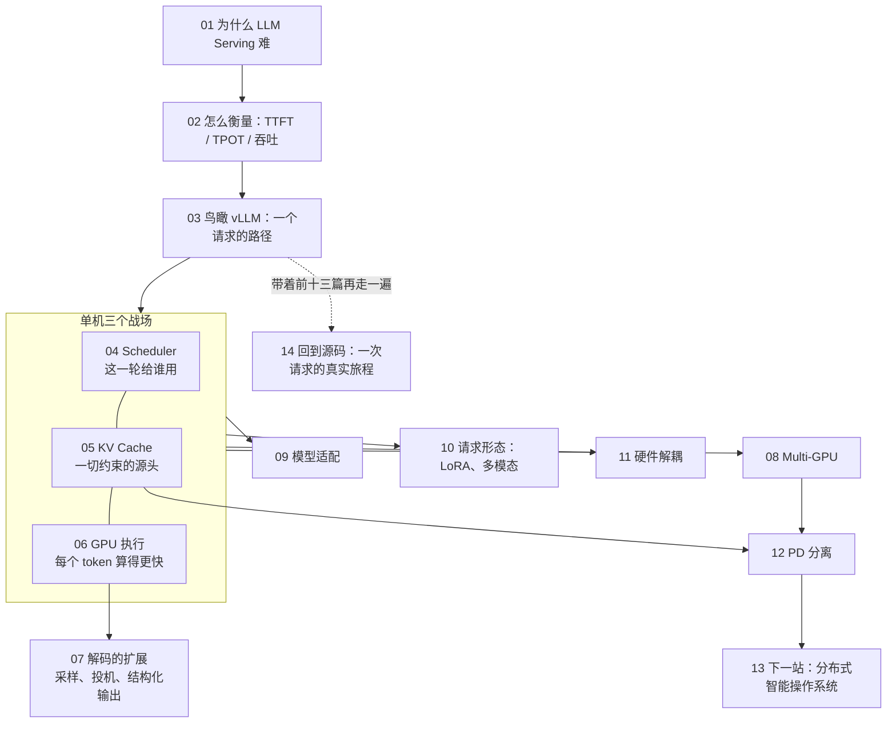
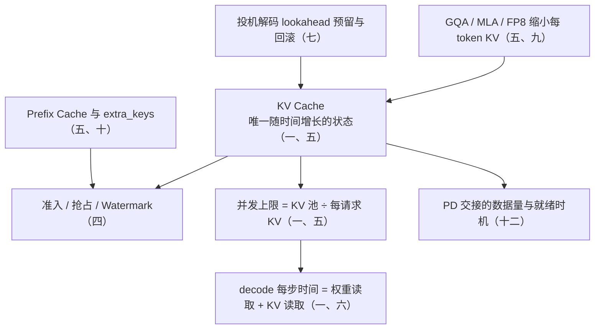

十四篇正文回答了一个问题：**一个文本生成请求，为什么会演化成一个涉及计算、显存、调度、通信与状态管理的复杂系统——vLLM 又是怎样把它组织起来的**。前三篇定义问题、立尺子、画全景；第四到第七篇是单机上的三个战场（调度、KV Cache、GPU 执行）加上解码这一步的三种扩展；第八到第十二篇把问题推向多卡、模型生态、请求形态、异构硬件与 PD 分离；第十三篇望向集群级的系统，第十四篇回到源码把每个抽象落到对象、状态变化与调用链上。十四篇反复回到同一个请求算账：Llama-3-70B、8×H100、TP=8、2050 token prompt、生成 300 token。

本文不讲新内容，做三件事：把十四篇压成一张表与十四段回顾，把贯穿全系列的几条线拎出来，然后给一套三段式的通关自测——判断与计算、跨篇综合、面试题。各篇末尾的自测检验的是"这一篇读懂了没有"，这里检验的是"十四篇能不能连起来用"。第十四篇末尾那节「系列总结」的内容（五笔账、四问的答案、三句话）也收在本文里。

> **读完这十四篇，你应该能回答哪些问题？[^q0] 哪些数字与结论必须能脱口而出？[^q1] 怎么判断自己是"读过"还是"掌握"了？[^q2]**

先把整个系列放在一张图上——箭头是**推导或前置上的依赖**（箭头尾端的结论被箭头头端当作前提），不是阅读顺序：

## 一、总览：系列回答的问题与主线

系列的一句话主张是：**LLM Serving 的本质，是围绕生成过程对请求、Token、计算资源和中间状态进行持续协调；vLLM 不是一堆优化技术的集合，而是一套围绕「动态请求 + KV 状态 + GPU 资源」构建起来的推理操作系统**。主线是总纲那条：问题定义 → 指标体系 → 系统全景 → 单机三个战场（调度 / 内存 / 执行）→ 多卡与集群扩展 → 模型与硬件适配 → 未来演进 → 源码落地。贯穿全系列的两条判断是：KV Cache 是一切约束的源头（它是唯一随时间增长的状态）；调度的单位是 token 不是 request。

| 篇 | 回答的问题 | 一句话结论 | 必记的数字 / 公式 |
|---|---|---|---|
| [第一篇：为什么 LLM Serving 比传统 DL 推理难](/why-llm-serving-is-hard.html) | 为什么不能沿用"一次前向、一次返回"？ | 服务对象变成了持续生成过程：动态执行、带状态、Prefill / Decode 混合 workload；目标是 SLO 约束下的执行规模而非最大 batch | 每 token KV 320 KB（每层 4 KB）、请求 734 MB；权重每卡 17.6 GB；拐点 295 FLOP/B；Prefill 2050 token 算力下界 37 ms、Decode 一步带宽下界 5.3 ms；batch 1 → 64 一步 5.3 → 7.0 ms |
| [第二篇：如何衡量一个 LLM Serving 系统](/how-to-measure-llm-serving.html) | 用哪些指标、指标异常时看哪一段？ | 四个维度（延迟 / 吞吐 / 效率 / 质量）；吞吐量系统做了多少工作，延迟量用户等了多久，Goodput 量 SLO 内的有效工作 | TTFT 从 t0 起算含排队；TPOT = (E2E − TTFT) / (N − 1) 不含首 token；Goodput 按请求计、ttft / tpot / e2el 三项"与"；E2E ≈ 0.3 + 299 × 0.03 ≈ 9.3 s，decode 占 97% |
| [第三篇：鸟瞰 vLLM](/vllm-request-lifecycle-overview.html) | 请求穿过系统时谁决策、谁执行、传的是什么？ | 控制面 / 数据面分离：EngineCore 驱动循环，Scheduler 决策，Executor 分发，ModelRunner 执行；Scheduler 与 ModelRunner 之间传元数据不传 tensor | 三类进程两道 IPC：A↔B ZMQ + msgspec（token id），B↔C 共享内存 MessageQueue（SchedulerOutput 广播、只有 output_rank 回传）；Scheduler 约 3000 行 |
| [第四篇：Scheduler](/scheduler-batch-and-fairness.html) | GPU 这一轮到底给谁用、每个请求推进多少？ | 调度单位是 token：每步先服务 running（至少 1 token），再按 FCFS 准入 waiting，直到 token budget、`max_num_seqs` 或 KV 块用尽；KV 不够按 LIFO 抢占、重算 | 2050 token 按 512 切成 4 × 512 + 2 共 5 段；budget 2048 时 200 decode + 1800 prefill 用掉 2000；decode 为主时 `max_num_seqs` 先于 budget 卡住（256 请求只用 12.5% 预算）；抢占 = `running.pop()` + `num_computed_tokens = 0` + `prepend_request` |
| [第五篇：KV Cache](/kv-cache-memory-core.html) | 历史状态放哪、如何复用、何时释放？ | 显存是被"不确定性"浪费的：按块分页、块满才进 Prefix Cache（链式哈希 + `ref_cnt`）；让 KV 更小有系统 / 架构 / 数值三个正交层面 | 旧系统有效 KV 只占 20.4%–38.2%；`block_size` 16、每卡一块 640 KB；2050 token 129 块、2000 token 125 块全部命中；MHA 64 头 2.56 MB → GQA-8 320 KB → FP8 160 KB（16 倍）；MLA 每 token 每层 (512 + 64) × 2 B ≈ 1.1 KB vs 4 KB |
| [第六篇：GPU 执行](/gpu-execution-kernels-and-graphs.html) | 已经确定要算的 token 怎么算得更快？ | 浪费只有四种：等 CPU 发指令（CUDA Graph）、等 HBM（FlashAttention、融合）、每个数太胖（量化）、轮次太多（投机解码） | Prefill 92 ms（40% MFU）占 3%、300 步 decode 3000 ms 占 97%；一步约 10 ms，权重读取下界 5.3 ms；capture sizes [1, 2, 4] + 8 步进到 256 + 16 步进到 512，默认 `FULL_AND_PIECEWISE`；80 层切成约 81 段图；FP8 1979 vs BF16 989 TFLOPS |
| [第七篇：解码的扩展](/decoding-extensions-sampling-speculative-and-structured-output.html) | 加上 top-p、draft 模型、JSON schema 后为什么调度、KV、runner 都得改？ | 三种扩展分别改分布本身、每步决定的位置数（1 → 1 + K）、分布的支撑集；都不只改 Sampler，因为 batch 是持久的、token 数是调度出来的、KV 是预分配的、图是捕获好的 | 一行 fp32 logits 513 KB；penalties 每步两张 [B, V+1] int64 直方图；临界点约 300 token / 步 / 卡：batch × (1 + K) 超过它验证不再免费；batch 1、接受长度 2.5 约 2.1×，batch 128 每步慢 1.9 倍；bitmask 每行 16 KB（4008 个 int32） |
| [第八篇：Multi-GPU](/multi-gpu-scaling-strategies.html) | 一张卡不够时模型、KV、通信怎么切？ | 单层放不下 TP、整个模型太大 PP、专家太多 EP、上下文太长 CP、装得下要更多吞吐 DP；TP/PP/EP/CP 解决"装不下"，DP 解决"想要更多"且永远最外层 | TP 每层 2 次 all-reduce（Attention 后 + MLP 后），80 层每步 160 次，只放 NVLink 内；PP8 每 stage 10 层、每步 7 次 P2P；TP × EP = 总 GPU 数；CP 适合 64K–1M token；rank 排布 DP × PP × PCP × TP（TP 最内层） |
| [第九篇：模型适配](/model-adaptation-architecture.html) | 模型剧变时引擎在哪一层吸收变化？ | 三层适配模型：模型层吸收结构变化、运行时层吸收状态表示变化（最贵）、算子层吸收执行方式变化；通用抽象扩大范围，特化 kernel 守住性能 | 判断法：改了「算什么」→ 模型层，「状态长什么样」→ 运行时层，「怎么算」→ 算子层；MLA = 512 维 latent + 64 维 RoPE key；新模型 = 一个文件 + 注册 `ModelRegistry`；新量化 = `QuantizationConfig` + `LinearMethod` |
| [第十篇：请求形态的扩展](/request-shapes-multi-lora-and-multimodal.html) | 各带不同 LoRA、各带几张图时"一个模型、一份权重、一串 token"在哪里破了？ | 三个假设被破：同一份权重、embedding 是查表、相同前缀相同 KV；LoRA 靠一个 kernel 处理全部 adapter + 槽位静态预分配 + 两层 LRU；多模态靠 encoder 独立预算 + 占位符 + 布尔掩码散射；两者都往块哈希加 `extra_keys` | 8 个 rank-16 槽位 ≈ 1.44 GB / 卡 = 15 个请求的 KV，与实际加载几个无关；每步多 1120 次 launch、FLOPs 只多 0.2%；一张图 576 / 1369 个 token，encoder 输出 9–22 MB 但 KV 184–438 MB（约 20 倍）；`encoder_compute_budget` = `max_num_batched_tokens` |
| [第十一篇：硬件解耦](/hardware-abstraction-and-portability.html) | 如何让芯片差异不渗进 Scheduler、KV Cache 与请求生命周期？ | 三句话：Serving 核心依赖抽象能力不依赖具体芯片；Platform 是能力中心但不是所有底层组件的唯一父类；Out-of-Tree 独立演进的前提是主仓库提供稳定契约 | 五层边界：Serving Core / 抽象契约 / 平台实现 / 硬件运行时 / Kernel；`get_attn_backend_cls`、`get_device_communicator_cls`、`get_worker_cls`、`check_and_update_config`；插件经 `vllm.platform_plugins` entry point 注册；五条检查项 |
| [第十二篇：PD 分离](/prefill-decode-disaggregation.html) | Prefill 产生的状态怎么办、Decode 何时接管、D 满了 P 还收不收？ | 三个设计问题：计算如何拆、状态如何交接、系统如何协同；"匹配不等于就绪"、"计算结束不等于块可回收"；PD 不会自动产生全局调度器或分布式缓存管理器 | 每 token 320 KiB；2048 token → 640 MiB（TP8 每 rank 80 MiB）；400 Gb/s ≈ 50 GB/s：共享一条链路 13.42 ms、八路并行 1.68 ms；4096 token → 1.25 GiB、每 rank 160 MiB、3.4 ms ≈ 一步 decode 量级；D 侧状态 `WAITING_FOR_REMOTE_KVS`；P 待交接 KV 20000 tok/s × 0.2 s ≈ 1.22 GiB |
| [第十三篇：Serving Infra 的下一站](/future-of-serving-infra.html) | Serving 会不会从模型执行器演化为分布式系统？vLLM 在哪？ | 会，且在发生：四个转变（手工配置 → 自动执行计划、本地缓存 → 分布式状态平面、单体推理 → 多阶段分布式执行、GPU 利用率 → Goodput / SLO / 成本）；vLLM 是执行引擎层 | 三个平面：计算 / 状态 / 调度；OS 类比：vLLM = 内核里的调度器 + 内存管理器（请求 = 进程、KV 块 = 页），llm-d / Dynamo / Mooncake 一类 = 集群资源管理器；契约 = KV 传输、能力发现、指标 |
| [第十四篇：回到源码](/source-code-request-walkthrough.html) | 每个概念对应哪个对象、哪次状态变化、哪条调用链？ | Python 控制面 / C++·CUDA 数据面分离；四个域（请求 / 调度 / 显存 / 模型）；`RequestStatus` 状态机；翻译层 `prepare_inputs()` 把 `SchedulerOutput` 变成 `slot_mapping` / `block_table` | Python 开销 0.15 ms / 15 ms ≈ 1%，且被 batch queue 流水线化；7B / A100：权重读取 13.5 GB ÷ 2.0 TB/s ≈ 6.6 ms，decode 一步 batch 1 8–12 ms、batch 32 10–18 ms，吞吐 100 → 2000 tok/s；五笔账：147 块 / 734 MB、5 段、92 + 3000 ms、每步同步 2.5 MB、跨节点搬 641 MB ≈ 13 ms |

Table: 十四篇的核心问题、结论与必记公式

### 1. 本文的章节安排

| 章 | 内容 |
|---|---|
| 二 | 逐篇回顾：核心问题、结论、必记、常见误解 |
| 三 | 贯穿十四篇的五条线：同一个请求的账、KV Cache 是约束的源头、调度单位是 token、Prefill / Decode 两种 workload、边界与契约 |
| 四 | 常见误区表 |
| 五 | 通关自测：A 判断与计算 10 题、B 跨篇综合 5 题、C 面试题 7 题、D 掌握判据 |
| 六 | 下一步 |

Table: 本文的章节安排

## 二、逐篇回顾

### 1. 第一篇：为什么 LLM Serving 比传统 DL 推理难？

**核心问题**：为什么 LLM Serving 不能沿用传统 DL 推理"一次前向、一次返回"的服务模型？它究竟在哪些地方变难了？

**结论**：难点不在"模型更大"，而在服务对象变了：从一次性、静态、可预测的前向计算，变成持续进行、动态变化、状态不断增长的自回归过程。输入长度、输出长度、服务时长在到达时都未知，Prefill 产生的 KV Cache 要跨几百个 Decode step 保留。归纳为三个根本变化：静态计算 → 动态执行（每步 batch 组成都在变，静态 batch 有效槽位 27 / 48，continuous batching 48 / 48）；无状态 → 带状态（KV Cache 决定并发上限、上下文上限与抢占时机）；单一 workload → Prefill / Decode 混合（前者 compute-bound，后者 memory-bound，竞争同一组 GPU）。目标也变了：不是最大 batch，而是 SLO 约束下的执行规模。全系列围绕四个核心问题展开——这一轮谁执行、状态放哪、如何算得更快、如何扩展——外加模型与硬件两个横切约束。

**必记**：

- 贯穿全系列的例子：Llama-3-70B（80 层、GQA-8、head_dim 128）、8×H100 TP=8、2050 token prompt + 300 输出。
- 每 token 每层 KV = 2 × 8 × 128 × 2 B = 4 KB；80 层 320 KB；TP8 每卡 40 KB；请求约 734 MB；权重每卡 17.6 GB。
- H100：989 TFLOPS、3.35 TB/s，拐点约 295 FLOP/B。
- Prefill 2050 token：36 TFLOP、算术强度约 4100、算力下界 37 ms；Decode batch=1：17.6 GB 读取、5.3 ms。
- Decode batch 1 → 64 → 256：5.3 → 7.0 → 12.4 ms；batch 256 时 KV 读取 24 GB 已超过权重本身。

**常见误解**："LLM 推理难是因为参数多"——参数多只让每步更慢，真正的难点是服务模型的改变。另一个："GPU 算力强所以 decode 快"——decode 一步只算 0.02 ms 却要花 5.3 ms 搬权重，GPU 在等数据。

### 2. 第二篇：如何衡量一个 LLM Serving 系统？

**核心问题**：应该用哪些指标衡量一个 LLM Serving 系统？指标异常时如何判断问题出在排队、Prefill、Decode 还是资源？

**结论**：指标分四个维度——延迟（TTFT、TPOT、ITL、E2E、Queueing Time）、吞吐（Output / Total Tokens/s、Requests/s、Goodput）、资源效率（MFU、GPU 利用率、显存利用率、Cost per Token）、服务质量（P50 / P95 / P99、SLO 达标率）。五个延迟指标是同一条时间线上的不同区间：TTFT 从客户端发出请求起算，所以含排队、首 token 采样与网络，不等于 Prefill；ITL 有 N − 1 个样本可算分位数，TPOT 是它们的均值、抹掉了抖动。使用原则是"不同指标对应不同瓶颈，不同瓶颈对应不同手段"：TTFT 高而 TPOT 正常 → 排队或 Prefill；TPOT 高 → Decode；两者都高且随负载恶化 → 资源饱和（KV 不足触发抢占）；P99 远高于 P50 → 长请求、抢占或 straggler。`vllm bench serve` 的口径：TTFT 在收到首个 SSE chunk 时打点、TPOT 不含首 token、Goodput 按请求计且三项全达标才算、Total Token throughput 含输入。

**必记**：

- TPOT = (E2E − TTFT) / (输出 token 数 − 1)。
- 例子：TTFT 0.3 s、TPOT 30 ms、300 输出 → E2E ≈ 9.3 s，decode 占 97%。
- Goodput 例：6 个请求 10 s，3 个达标 → Requests/s 0.6、Goodput 0.3 req/s；只违反一项也不计入。
- 报告至少带：并发数、输入 / 输出 token 数、Output 与 Total Tokens/s、TTFT、TPOT / ITL、P99；报分位数不报均值。
- 压测要固定输入输出长度分布、控制到达率、区分冷热 prefix cache。

**常见误解**："GPU 利用率 95% 说明系统高效"——利用率只说 SM 上有 kernel 在跑，decode memory-bound 时 MFU 天然只有几个百分点。另一个："TTFT 高就是 Prefill kernel 慢"——高并发时排队可能是 TTFT 的主要部分。

### 3. 第三篇：鸟瞰 vLLM：一个请求如何穿过整个推理系统？

**核心问题**：一个请求如何穿过 vLLM 的整个推理系统——哪个模块负责决策、哪个负责执行，它们之间传递的到底是什么？

**结论**：vLLM V1 遵循控制面 / 数据面分离。链路固定：`api_server` → `AsyncLLM` → `InputProcessor`（tokenize、构造 `EngineCoreRequest`）→ 经 `EngineCoreClient` 跨进程进 `EngineCore`；`EngineCore.step()` 驱动循环——Scheduler 决策产出 `SchedulerOutput`，Executor 分发到 Worker，`GPUModelRunner` 准备 `InputBatch`、调 attention backend 与模型前向、采样，产出 `ModelRunnerOutput`；结果回 Scheduler 更新状态，`EngineCoreOutputs` 回前端 detokenize、流式返回。关键在于传递的是什么：Scheduler 与 ModelRunner 之间传的是元数据（每请求这一轮的 token 数、block table、slot mapping、采样参数），不是 tensor；Worker 之间传的是激活；前后端之间传的是 token id。真正决定谁阻塞谁的是进程边界：API Server 进程与 EngineCoreProc 之间走 ZMQ + msgspec，EngineCore 与 WorkerProc 之间走共享内存 MessageQueue；EngineCoreProc 内部三个线程，主线程只跑 schedule → execute → update 的 busy loop。

**必记**：

- 四问对应模块：谁执行 → `Scheduler`；状态放哪 → `KVCacheManager` / `BlockPool`；算得更快 → `ModelRunner` / Attention Backend；扩出去 → `Executor` / `Worker` / 集合通信。
- `SchedulerOutput` 经 `rpc_broadcast_mq` 一次广播给所有 Worker；`ModelRunnerOutput` 只由 `output_rank` 回传。
- Executor 实现：`UniProcExecutor`、`MultiprocExecutor`、`RayDistributedExecutor`、`RayExecutorV2`（继承 `MultiprocExecutor`，只换进程拉起方式）、`ExecutorWithExternalLauncher`。
- 请求状态：WAITING → RUNNING → FINISHED，抢占回 WAITING；准入要 KV 块够、budget 够、`max_num_seqs` 未满。
- TP 下采样在 rank 0（driver）做；detokenize 在 `AsyncLLM` 侧，`IncrementalDetokenizer` 要等到完整 UTF-8 字符才发。

**常见误解**："用不用 Ray 是两种执行模型"——`RayExecutorV2` 继承 `MultiprocExecutor`，Ray 只是进程拉起方式的差异。另一个："一个 GPU 固定绑定一个 Worker 进程"——单卡、同机多进程、Ray、external launcher 的映射并不相同。

### 4. 第四篇：Scheduler：GPU 这一轮到底给谁用？

**核心问题**：GPU 这一轮到底给谁用？每个请求这一轮应该推进多少？

**结论**：Scheduler 是在计算资源（Token Budget）和 KV Cache 资源的双重约束下，每一轮动态决定哪些 Request 执行、每个推进多少 token。它没有"prefill 阶段"与"decode 阶段"，调度单位是 token：每步先服务 running 队列（每请求至少 1 token），再从 waiting 按 FCFS（或优先级）准入，直到 `max_num_batched_tokens`、`max_num_seqs` 或 KV 块用尽。Continuous Batching、Chunked Prefill、Mixed Batch、投机解码由此统一：一个请求这一轮推进 256、1 或 5 个 token 只是同一模型的不同取值。`long_prefill_token_threshold` 给单次 prefill 加上限，代价是 TTFT 上升、收益是 decode 不被长 prefill 阻塞。KV 不够时抢占：FCFS 下 `running.pop()` 取最晚加入者（近似 LIFO），释放全部块、`num_computed_tokens = 0`、`prepend_request` 回 waiting 队头；V1 选重算不选 swap，因为 Prefix Cache 让重算远低于理论最坏。Watermark 预留余量防止"接纳 → 立即抢占"震荡。

**必记**：

- 2050 token、阈值 512 → 512 + 512 + 512 + 512 + 2 五段。
- budget 2048、`max_num_seqs` 256：4 个 1000 token 新请求 → 前两个各 1000、第三个 48、第四个进不来；256 个 decode → 第 257 个进不来，预算只用 12.5%。
- Decode 为主的在线服务往往是 `max_num_seqs` 而非 budget 决定 batch，所以调大它要与 KV 容量一起考虑。
- 抢占后本轮不再接纳 waiting（`if not preempted_reqs`）；被抢占的 D 重算 62 token 时 48 个命中缓存、只算 14 个。
- token budget 是延迟与吞吐的旋钮：大 → TTFT 低、吞吐高、TPOT 抖；小 → TPOT 稳、TTFT 长。

**常见误解**："抢占谁取决于谁缺块"——牺牲者是 running 队尾最晚进入者，与谁触发失败无关。另一个："重算一定很贵"——前缀块大多还在缓存里。

### 5. 第五篇：KV Cache：LLM Serving 的第一号内存问题

**核心问题**：这些请求已经计算过的历史状态（KV Cache），应该放在哪里、如何复用、何时释放，才能不让"不确定性"吃掉显存？

**结论**：显存不是被模型吃掉的，是被不确定性浪费掉的——按最坏情况预留连续显存，旧系统有效 KV 只占 20.4%–38.2%。PagedAttention 把 KV 切成固定大小的块，用多少申请多少、块间不要求相邻，是操作系统虚拟内存分页的重现：`KVCacheManager` 管每请求的块列表、`BlockPool` 管空闲块与引用计数、Block Table 是逻辑块到物理块的映射。生命周期是 Prefill 批量写入 → Decode 每步追加一个 slot → 完成或被抢占时归还；块只有写满才进 Prefix Cache，键是链式哈希（前一块哈希 + 本块 token，`extra_keys` 带 LoRA 名与多模态哈希），`ref_cnt` 让多个请求共享同一物理块。所有 `ref_cnt == 0` 的块都挂在同一条 `free_block_queue` 上，LRU 驱逐是分配的副作用，命中即续命。让 KV 更小有三个正交层面：系统管理层（分页、Prefix Cache）、模型架构层（MQA / GQA / MLA）、数值层（FP8 / INT8）。

**必记**：

- `block_size` 16、TP8 每卡每 token 40 KB → 一块 640 KB；2050 token 129 块，最后一块浪费 14 / 16。
- 2000 token system prompt = 125 个整块，第二个请求全部命中、只 prefill 50 token；2005 token 则最后 5 个要重算——复用粒度是块。
- KV 比例：Llama 3 70B GQA 12.5%、8B 25%、Falcon 7B MQA 1.4%、DeepSeek V3 MLA 约 2%（576 维 latent，1.1 KB vs 4 KB）。
- MHA 64 头 2.56 MB → GQA-8 320 KB → FP8 160 KB，缩 16 倍；FP8 E4M3 是最安全的 KV 量化格式，Softmax 对 Key 误差敏感。
- 分层存储：HBM 3.35 TB/s、CPU DRAM 约 200 GB/s（PCIe Gen5 64 GB/s）、NVMe 约 7 GB/s。

**常见误解**："Prefix Cache 的键是本块 token 的哈希"——同样 16 个 token 在不同前缀后 K、V 不同，必须链式哈希。另一个："`ref_cnt` 归零就失去内容"——归零只是进空闲队列尾，哈希仍在、可再被命中。

### 6. 第六篇：GPU 执行：如何让每个 Token 算得更快？

**核心问题**：这些已经确定要算的 token，怎么算得更快？

**结论**：落到 GPU 上浪费只有四种形态：等 CPU 发指令、等 HBM 送数据、搬的每个数太胖、轮次本身太多；四类手段一一对应。CUDA Graph 把一步 decode 的数百到上千次 kernel 提交合成一次重放，成立条件是单个 kernel 的 GPU 时间短于 CPU 提交时间，所以基本只对 decode 有意义；代价是图内形状固定，按 `cudagraph_capture_sizes` 分桶、运行时向上 pad。FlashAttention（Tiling + Online Softmax，N×N 矩阵不落 HBM）与算子融合优化的是同一个量——HBM 流量 = 搬运次数 × 每次数据量；量化让每次搬的数据变小，与减少次数正交。投机解码没有消除自回归依赖，被并行化的是验证不是生成，拒绝采样保证分布无损；高并发、高利用率下可能负收益。

**必记**：

- 账本：Prefill 2050 token ≈ 92 ms（7.9 PFLOPS、40% MFU）占 3%，300 步 decode ≈ 3000 ms 占 97%，一步实测约 10 ms。
- capture sizes = [1, 2, 4] + range(8, 256, 8) + range(256, max + 1, 16)，max = min(`max_num_seqs` × 2, 512)；3 个请求 pad 到 4、17 个 pad 到 24、600 个走 eager。
- 五种 `CUDAGraphMode`：NONE / PIECEWISE / FULL / FULL_DECODE_ONLY（PD 分离的 D 实例）/ FULL_AND_PIECEWISE（默认）；PIECEWISE 在 attention 处切，80 层约 81 段图。
- CUDA Graph 上界省 20%、实测 5%–15%；FULL 不是把 forward 融成一个 kernel，与 `torch.compile` 正交。
- Llama-70B 权重 FP16 140 GB → FP8 / INT8 70 GB → INT4 35 GB；FP8 E4M3 范围 ±448；H100 FP8 1979 vs BF16 989 TFLOPS（3958 是稀疏口径）。

**常见误解**："kernel launch 是同步的所以 GPU 等 CPU"——launch 是异步的，只有 kernel 太短、队列被抽干时才出气泡。另一个："投机解码打破了 token 依赖"——依赖在 draft 模型内部照样串行走完。

### 7. 第七篇：解码的扩展：采样、投机解码与结构化输出

**核心问题**：同样是"下一个 token"，为什么加上 top-p、加上 draft 模型、加上 JSON schema 之后，调度器、KV 管理和 model runner 都得改？每一种扩展花掉什么、换回什么？

**结论**：三种扩展改的是"从 logits 到 token"这一步的三个不同东西：采样参数改分布本身，投机解码改每步决定的位置数（1 → 1 + K），结构化输出改分布的支撑集（不合法 token 置 −∞）。它们都不只改 Sampler，因为 `InputBatch` 是持久的（行随请求增删移动，`LogitsProcessor` 的接口因此是 `update_state(BatchUpdate)`）、每步 token 数是调度出来的、KV 是预分配的、CUDA Graph 形状是捕获好的。投机解码在调度器改三处：`1 + K` 进预算、`num_lookahead_tokens` 预留 KV、步后 `num_computed_tokens -= num_rejected` 回滚；`RejectionSampler` 在 `[num_reqs + Σdrafts, V]` 上验证；EAGLE 开启时 prefix cache 主动少命中一块（需要 hidden state）。结构化输出分布在四个位置：前端选后端、`grammar_init()` 异步编译（请求进 `WAITING_FOR_STRUCTURED_OUTPUT_GRAMMAR`）、每步 CPU 填 bitmask 与 forward 重叠、GPU 一个 kernel 打掩码、步后 `accept_tokens()` 推进 FSM；成本几乎全在 CPU 与 TTFT。

**必记**：

- 一行 fp32 logits 128256 × 4 B ≈ 513 KB；batch 64 约 33 MB，读一遍 0.01 ms——Sampler 本身可忽略。
- 真正有成本的采样参数：penalties（每步两张 [B, V+1] int64 直方图，batch 128 就是 260 MB）与 per-request seed。
- 临界点 T_ridge ≈ 295 token / 步 / 卡：batch × (1 + K) 超过约 300 验证不再免费；batch 64、K=3 接近临界（≈ 12 ms），batch 128、K=3 每步 ≈ 17 ms。
- 例子 batch=1：EAGLE K=3 接受长度 2.5 → 120 步 ≈ 1450 ms ≈ 2.1×；n-gram 接受长度 3.5（RAG 抄原文）3.5×；batch 128 每步慢 1.9 倍、吞吐反降。
- bitmask int32、4008 个 word、每行 16 KB，分配 `max_num_seqs` × (1 + K) 行；引擎只认第一个后端。

**常见误解**："投机解码总能加速"——batch 过临界点后步数减 2.5 倍、每步慢 1.9 倍，吞吐下降。另一个："结构化输出的成本在 GPU"——GPU 只有一个打 −∞ 的 kernel，贵在 CPU 编译与每步填 bitmask。

### 8. 第八篇：Multi-GPU：一张卡不够时如何扩展？

**核心问题**：一张卡装不下、或者一张卡不够快时，模型、KV 状态和通信应该怎样在多张 GPU 之间切分？每种切法的代价是什么，通信又该如何优化？

**结论**：五种策略对应五种问题：单层放不下 TP（层内按行 / 列切，Column / Row 配对，Attention 后与 MLP 后各一次 all-reduce）；单层放得下但模型太大 PP（按层切 stage，边界传激活，有流水线气泡，要足够多并发填满）；MoE 专家太多 EP（Router → all-to-all dispatch → 本地 grouped GEMM → all-to-all combine；瓶颈是通信量、负载不均、小批次 GEMM）；上下文太长 CP（用与 FlashAttention 同源的 online softmax 跨卡累加）；装得下但要更多吞吐 DP（整体复制，永远最外层，副本间 prefix cache 不共享）。KV 状态跟着切法走：TP 每卡持全部 token 的 1 / N 个 KV head，PP 随层分 stage，CP 按 token 段，DP 各副本独立池。通信优化不看链路峰值，看数据走哪条物理链路、是否在关键路径、消息多大、是否全局同步、能否重叠、拓扑是否匹配；NCCL 是底座，机内小消息用 `CustomAllreduce`。

**必记**：

- TP8 每层 2 次 all-reduce、80 层每步 160 次，每次 batch × 8192 × 2 B；必须放 NVLink 内，跨机 TP16 几乎总是错的。
- PP8 每 stage 10 层、每步 7 次 P2P；PP 可跨机、能与下一 micro-batch 重叠。
- 推荐组合：小于单卡 → DP；1–2 卡 → TP 2/4；4–8 卡 → TP 4/8；大于 8 卡 → TP8 + PP；MoE → TP + EP（TP × EP = 总 GPU 数）；超长上下文叠加 CP（64K–1M token）。
- rank 排布 DP × PP × PCP × TP，TP 最内层；每个 DP 副本一个独立 `EngineCore`，`DPCoordinator` 走 ZMQ 对齐 step。
- 定位通信问题：物理拓扑 → NCCL 识别结果 → nccl-tests 区分库与应用 → 按消息大小分延迟 / 带宽问题。

**常见误解**："TP 让单请求延迟按卡数线性下降"——每卡计算量减少但每层两次 all-reduce 在关键路径上，PCIe 下未必更快。另一个："DP 与 TP/PP 是同一类东西"——DP 解决"想要更多"，其余解决"装不下"。

### 9. 第九篇：模型适配：如何跟上变化极快的模型世界？

**核心问题**：面对结构、状态表示和执行方式都在快速变化的模型，推理引擎应该在哪一层吸收变化，才能既跟得上模型世界，又不牺牲性能与可维护性？

**结论**：在三层里按变化的性质吸收，让变化停在尽可能高、尽可能窄的层。结构层面的变化（新 attention 变体、激活函数、MoE 路由）用模型层的组合式实现吸收——模型文件用共享的 `LinearBase` 子类、`Attention`、`FusedMoE` 拼装，权重经 `WeightLoader` 映射 HF 命名，新模型 = 一个文件 + 注册 `ModelRegistry`（惰性注册，主进程不 import 模型文件）。状态表示的变化（MLA 压缩 KV、滑窗、SSM 状态、混合模型）触及运行时层——`KVCacheSpec` 让每层声明 cache 形态，`KVCacheManager` 按 spec 分组管理；这是最贵的适配。执行方式的变化（新量化、新 kernel、新硬件）落在算子层——`QuantizationConfig` + `LinearMethod` 替换线性层前向。能力用 Protocol 契约（`SupportsLoRA`、`SupportsPP`、`SupportsMultiModal`）表达而不是统一继承树；抽象扩大范围，特化 kernel 守住性能。

**必记**：

- 判断法：改了「算什么」→ 模型层；「状态长什么样」→ 运行时层；「怎么算」→ 算子层。
- 四个目标：正确性、性能、可维护性、可扩展性；四种方案从"复用通用实现"到"专用 kernel + 运行时改造"，灵活性与性能反向。
- MLA 的 KV = 512 维 latent + 64 维 RoPE key，触及 `KVCacheSpec`、块大小换算、专用 backend、吸收 / 非吸收两条路径。
- MTP 引入"暂存状态 vs 提交状态"，在 vLLM 里就是 `num_computed_tokens` 与实际写入位置之差。
- 适配机制的演进：硬编码 → Monkey Patch → Custom Op → IR；引擎四项核心竞争力：抽象、运行时、特化、演进。

**常见误解**："新模型能跑就是适配完成"——能跑是起点，高效、稳定、可维护地运行才是目标。另一个："新量化格式要改调度器"——只碰算子层，输入输出形状不变（KV 量化除外）。

### 10. 第十篇：请求形态的扩展：multi-LoRA 与多模态

**核心问题**：当一个 batch 里的请求各带不同的 LoRA、各带几张图片时，"一个模型、一份权重、一串 token"的假设在哪里破了？vLLM 用什么把它重新缝起来，代价是多少？

**结论**：单模型 serving 隐含三个假设：batch 内所有 token 乘同一份权重、输入 embedding 是查表、相同 token 前缀有相同 KV。multi-LoRA 打破第一条，多模态打破第二条，两者都打破第三条——所以 `hash_block_tokens()` 的 `extra_keys` 里同时有 `lora_name` 与 `(mm_hash, 块内偏移)`。multi-LoRA 靠一个 kernel 处理全部 adapter（Triton `lora_shrink` / `lora_expand` 用 grid 第三维遍历 adapter、按排序后的 token 索引 gather，`lora_id == -1` 早退）与槽位静态预分配 + 两层 LRU（CPU `max_cpu_loras`、GPU `max_loras`）；`max_loras` 成了调度器的新准入约束，CUDA Graph 按有无 LoRA 各录一套。多模态靠 encoder 单独跑、单独算预算，输出按图片哈希短期缓存，占位符查表得到"形状对但值错"的 embedding，再用 `is_mm_embed` 布尔掩码把 encoder 输出散射进去；一张图必须整体编码，是 Token Budget 模型的第一个例外。

**必记**：

- 8 个 rank-16 槽位 ≈ 1.44 GB / 卡 = 每卡 36K token 的 KV = 15 个请求，与实际加载几个 adapter 无关。
- LoRA 代价：每个 LoRA 层每步多两次 launch + 一块 fp32 缓冲，一步多 1120 次 launch，FLOPs 只多 0.2%；第一个用到新 adapter 的请求让整个 batch 同步等磁盘。
- 一张图：LLaVA 类 336×336 → 576 token，Qwen2-VL 类 1024×1024 → 1369 token；encoder 输出 9–22 MB，但 KV 184–438 MB——贵的是 KV 不是 encoder 输出。
- `encoder_compute_budget` = `encoder_cache_size` = `max_num_batched_tokens`（单位是 embedding 数）；预算不够就把 `num_new_tokens` 截到图之前。
- chunk 边界可以切在一张图中间（embedding 阶段按位置散射），但 encoder 必须整图一次算完。

**常见误解**："只加载一个 adapter 就只占一个槽的显存"——槽位按 `max_loras × max_lora_rank` 买断。另一个："多模态贵在 ViT"——encoder 输出小且短命，图片占位 token 的 KV 大约 20 倍且伴随请求全程。

### 11. 第十一篇：硬件解耦：如何不让芯片差异污染 Serving 核心？

**核心问题**：如何让同一套 Serving 逻辑运行在不同芯片上，同时避免芯片差异渗透到 Scheduler、KV Cache 和请求生命周期管理之中？

**结论**：让芯片差异停在最底层，靠多层边界：Serving Core（Scheduler、KVCacheManager、请求生命周期）只依赖抽象能力；抽象契约（`Platform` 接口、Attention Backend 接口、通信组件接口、Worker 接口）定义能力而不定义实现；平台实现（CUDA / ROCm / TPU / XPU / OOT 插件）各自满足契约。三句话：Serving 核心依赖抽象能力而不依赖具体芯片——调度器问「一块 KV 多少字节、支持哪种 backend、能不能 CUDA Graph」，不问「是不是 NVIDIA」；Platform 是硬件能力中心但不是所有底层组件的唯一父类——Attention Backend 由它派发而非继承它（一个平台多个 backend，接口与平台无关）；Out-of-Tree 让硬件适配独立演进，插件经 entry point 注册，但前提是主仓库提供稳定的扩展契约，"主仓库一行不改"是目标不是事实。请求在异构硬件上的路径里，API、Engine、Scheduler、KV Cache Manager 都不关心设备，Worker 管设备生命周期，Attention Backend 管关键 kernel。

**必记**：

- `Platform` 四类方法：设备与内存（`get_device_name`、`get_device_total_memory`）、能力选择（`get_attn_backend_cls`、`get_device_communicator_cls`、`get_worker_cls`）、配置校正（`check_and_update_config`）、运行时细节（`inference_mode`、pin memory）。
- 新硬件最少提供：`Platform` 子类、Worker / ModelRunner（或复用）、至少一个 Attention Backend、device communicator、算子；经 `vllm.platform_plugins` 注册。
- 五层边界：Serving Core / 抽象契约 / 平台实现 / 硬件运行时 / Kernel。
- 五条检查项：核心里有没有 `is_cuda()` 一类判断；能力能否查询；不支持的配置能否启动时失败；插件能否独立演进；是"能跑"还是"跑得好"。
- OOT 插件可用 `AttentionBackendEnum.CUSTOM` 注册 backend、`register_oot` 整类替换。

**常见误解**："Attention Backend 是 Platform 的子类"——是被派发的独立实现树，否则组合爆炸。另一个："装个插件主仓库完全不用改"——没抽象出来的能力仍要上游补接口。

### 12. 第十二篇：PD 分离：从资源混部走向计算解耦

**核心问题**：Prefill 产生的上下文状态怎么办？Decode 何时才能接管？如果 Decode 已经满了，Prefill 还该继续接收请求吗？

**结论**：PD 分离不是把一个服务拆成两个，而是同时改变计算、调度和状态的边界，要回答三个设计问题。计算如何拆：共置有两种干扰（长 prompt 拖长本步 → ITL 尖峰；长生成占 KV → 新请求进不来），Chunked Prefill 减小抖动但每轮仍争资源，分离移除直接竞争，代价是权重 / 容量共享减少、多了交接。状态如何交接：vLLM 用 `KVConnector` 契约（scheduler 侧决定传哪些块，worker 侧注册、握手、传输、轮询完成），NIXL pull 路径是 D 分好块后从 P RDMA READ；"匹配不等于就绪"（请求挂在 `WAITING_FOR_REMOTE_KVS` 直到 KV 到齐）、"计算结束不等于块可回收"（P 要等传输确认才释放源块）。系统如何协同：路由检查 TP 布局、量化格式、block size 兼容与两侧容量，背压在接纳前、交接前、交接中、超时后四处传播；PD 不会自动产生全局调度器或分布式缓存管理器。是否值得分离取决于负载、网络与 SLO，要与调优过的 Chunked Prefill 共置在总 GPU 相同下公平比较。

**必记**：

- Llama-3-70B 每 token 320 KiB；2048 token → 640 MiB，TP8 每 rank 80 MiB；4096 token → 1.25 GiB、每 rank 160 MiB。
- 400 Gb/s ≈ 50 GB/s：640 MiB 走一条共享链路 13.42 ms，八路独立 1.68 ms；160 MiB ≈ 3.4 ms，与一步 decode 10 ms 同量级，传输必须与计算重叠。
- TP8 → TP2 要重组布局（`compute_tp_mapping()`），GQA 复制可去重、MLA latent 在 rank 间复制可选一个源。
- P 待交接 KV：20000 tok/s × 0.2 s ≈ 1.22 GiB，2 s 就是 12.2 GiB——网络等待变成显存占用。
- `NixlConnector` 是 `NixlPullConnector` 别名；`wait_for_layer_load()` / `save_kv_layer()` 在 NIXL 里是空实现；`MultiConnector` 取首个报告可用 token 的来源。

**常见误解**："PD 分离后尾延迟被彻底消除"——D 内部的长短上下文干扰、通信、抢占仍在。另一个："P 的 prefix cache 命中率能乘进网络节省"——P 命中省的是计算，D 没有这些 KV 仍要传。

### 13. 第十三篇：Serving Infra 的下一站：从模型执行器到分布式智能操作系统

**核心问题**：未来的 Serving 系统，是否会从一个模型执行器，演化为统一管理计算、状态和调度的分布式系统？如果会，vLLM 在其中处于什么位置？

**结论**：会，而且已经在发生。请求正从一次函数调用变成持续数分钟甚至数小时的分布式任务（超长上下文、多轮、工具调用、Session、多模态），核心问题变成三个平面：计算在哪执行、状态存在哪、请求如何被调度迁移恢复。四个转变：手工配置 → 自动执行计划；本地缓存 → 分布式状态平面；单体推理 → 多阶段分布式执行（PD、encoder 池、draft 池、多模型级联）；GPU 利用率 → Goodput、SLO 与成本联合优化。vLLM 解决了 KV 碎片、静态 batch 低利用率、decode 动态调度等 runtime 层问题，但代表的是执行引擎层而非完整的 AI Serving Operating System；集群级路由、状态平面、执行计划由 llm-d、Dynamo、Mooncake 一类承担。判断任何"未来方向"是否成立，最后都撞回 KV Cache 这堵墙。

**必记**：

- 三个平面：计算 / 状态 / 调度；分层：模型与编译层 → Serving Runtime → Inference State Plane → 分布式调度与编排层 → 硬件基础设施。
- 自动执行计划要定的量：TP / PP / DP 度、PD 池比例、batch 与 token budget、量化、投机开关与 K、KV 预算。
- 状态平面的新问题：目录一致性、传输成本 vs 重算成本、块的生命周期与所有权。
- OS 类比：vLLM = 内核里的调度器 + 内存管理器（请求 = 进程、KV 块 = 页）；上层 = 集群资源管理器；契约 = KV 传输、能力 / 容量发现、统一指标与事件。

**常见误解**："GPU 利用率是 Serving 的优化目标"——利用率 100% 的 decode 可能 MFU 只有 5%，要换成 Goodput 与每 token 成本。另一个："vLLM 会长成整个 Serving OS"——它是执行层，完整系统需要更多组件。

### 14. 第十四篇：回到源码：一次请求在 vLLM 内部的真实旅程

**核心问题**：前面讲过的每个概念——调度、KV 分块、Attention 分派、多卡通信——在 vLLM 源码里对应哪个对象、哪次状态变化、哪条调用链？

**结论**：最外层的边界是 Python 控制面（API Server → AsyncLLM → EngineCore → Scheduler → KVCacheManager：请求状态机、调度决策、块分配、停止条件）与 C++ / CUDA 数据面（Worker → ModelRunner → GPU Kernels → NCCL：张量准备、forward、KV 物理读写、采样、通信、CUDA Graph）的分离，中间传 `SchedulerOutput`；Python 开销可被摊薄且被 batch queue 流水线化。源码对象分四个域：请求域、调度域、显存域、模型域。`RequestStatus` 状态机里 PREEMPTED 只有一条出路——回 WAITING；`Scheduler.schedule()` 源码注释明说没有严格的 prefill / decode 阶段，每请求维护 `num_computed_tokens` 追赶 `num_tokens_with_spec`。谁都没细讲的翻译层是 `ModelRunner.prepare_inputs()`：`_update_states` 按 `SchedulerOutput` 增删移动持久 `InputBatch` 的行，`_prepare_inputs` 算 positions、`slot_mapping`、`block_table`、attention metadata，再按 batch 形态选图或 eager。结尾把同一个请求的五笔账合起来复盘：时间、显存、通信、CPU、请求——没有一个数字能单独说明问题。

**必记**：

- 7B / A100 口径：权重读取 13.5 GB ÷ 2.0 TB/s ≈ 6.6 ms；decode 一步 batch 1 8–12 ms、batch 32 10–18 ms（不是 ×32）；吞吐约 100 → 2000 tok/s；Prefill 512 token 5–15 ms。
- Python 控制面 schedule 约 0.05 ms + prepare 约 0.1 ms，对 15 ms 的 forward 约 1%。
- ITL 不等于 TPOT × batch；稳态下 ITL ≈ TPOT，它反映的是波动，优化靠稳定调度不靠缩小 batch。
- 五笔账：147 块 / 734 MB（五）、chunk 512 分 5 段（四）、92 + 3000 ms（六）、每步 8 卡间同步约 2.5 MB、NVLink 约 0.09 ms（八）、PD 两池搬 641 MB ≈ 13 ms（十二）。
- 调用链：`schedule` → `get_computed_blocks` → `allocate_slots` → `BlockPool.get_new_blocks` → block table → `SchedulerOutput.new_block_ids`；完成时 `KVCacheManager.free` 让 `ref_cnt -= 1`、归零的块进空闲队列尾并保留哈希。

**常见误解**："源码走读是附录"——它是前面所有抽象的验证：一个概念若找不到对应的对象、状态变化和调用链，就还没落地。另一个："Python 控制面是瓶颈"——只要 GPU 侧是十毫秒量级，零点几毫秒淹没在里面。

## 三、贯穿全系列的几条线

### 1. 同一个请求的账：从第一篇算到第十四篇

第一篇定下的例子（Llama-3-70B、8×H100、TP=8、2050 + 300 token）是全系列的度量衡。第一篇算出每 token 320 KB、请求 734 MB、权重每卡 17.6 GB、Prefill 算力下界 37 ms、Decode 带宽下界 5.3 ms；第四篇把 2050 按 512 切成 5 段；第五篇把 734 MB 切成 147 个 640 KB 的块，其中 125 个 system prompt 块可共享；第六篇把时间账算成 92 ms + 3000 ms，解释了为什么优化都在 Decode 侧；第七篇在这条账上加投机解码（120 步 ≈ 1450 ms、2.1×）与 logits（513 KB 一行）；第八篇加通信（每步 160 次 all-reduce，约 2.5 MB）；第十篇加 LoRA 槽位（1.44 GB / 卡 = 15 个这样的请求）与一张图（KV 184–438 MB）；第十二篇算 KV 跨节点搬一次（2048 token 640 MiB、13.42 ms）；第十四篇把五笔账并排放到一张表里。

这条线的方法论是：所有毫秒级、GB/s 级数字都是理论下界或量级估算（总纲的"版本与硬件基线"），用于建立判断，不是 benchmark；第十四篇的第三句话——"文中每个性能数字都只是量级示意，真正可迁移的是判断方法"——是这条线的结语。

### 2. KV Cache 是一切约束的源头

第一篇说它是唯一随时间增长的状态，决定并发上限、上下文上限与抢占时机，并算出 batch 256 时 KV 读取 24 GB 已超过权重——KV 不只是容量问题也是带宽问题。第四篇的 Admission Control、Watermark、LIFO 抢占全部由"KV 块够不够"触发，Token Budget 解决"算多少"，KV 解决"能不能装下"。第五篇是它的正面：分页消灭内部碎片，Prefix Cache 让重算变便宜（这反过来解释了第四篇为何选重算不选 swap），GQA / MLA / FP8 从源头缩小它。

第七篇的投机解码要为 draft 预留 `num_lookahead_tokens`、拒绝后回滚 `num_computed_tokens`；EAGLE 为拿 hidden state 主动少命中一块。第八篇 KV 跟着切法走：TP 按 head、PP 按层、CP 按 token 段、DP 各自一池且 prefix cache 不共享。第九篇最贵的适配是状态表示变化（`KVCacheSpec`）；第十篇一张图真正贵的是它的 KV 而非 encoder 输出，LoRA 与图片都要往块哈希里加键。第十二篇整篇是 KV 的交接：数据量、布局、就绪与回收时机、待交接 KV 变成显存占用。第十三篇说任何"未来方向"最后都撞回这堵墙；第十四篇把它写成三句话里的第一句。

### 3. 调度的单位是 token，不是 request

第一篇的时间线对比（静态 batch 27 / 48 vs continuous batching 48 / 48）指出问题；第四篇给出完整模型：每步先 running 后 waiting，每个请求只决定"这一轮推进多少 token"，prefill 与 decode 只是取值不同，Continuous Batching、Chunked Prefill、Mixed Batch、投机解码是同一模型的四种取值。第二篇的 token budget 旋钮解释了 TTFT 与 TPOT 之间的权衡。

第七篇把取值推广到 `1 + K`："纯 decode batch"的定义随之变成每请求 `1 + K` 个 token，预算截断 draft 会让 batch 掉出 FULL 图；第十篇给出这个模型的第一个例外——一张图必须整体编码，encoder 预算不够就把 `num_new_tokens` 截到图之前——以及 `max_loras` 这个新的准入约束。第十二篇在 D 侧多了一个等待远端 KV 的状态，请求就绪后才进入可调度集合。第十四篇在源码注释里找到这句话的原文：没有严格的 prefill / decode 阶段，每请求追赶 `num_tokens_with_spec`。

### 4. Prefill 与 Decode：两种 workload 的一条主线

第一篇建立判断：Prefill compute-bound（算术强度约 4100，高于拐点 295 十几倍），Decode memory-bound（约 1 FLOP/B）。第二篇由此把指标映射到阶段：TTFT 归 Prefill 与排队，TPOT / ITL 归 Decode。第四篇的 Chunked Prefill 与 Mixed Batch 是把两种 workload 塞进同一个 step 的办法；第六篇的四种浪费几乎全在 Decode 侧（97% 的时间），CUDA Graph 基本只对 decode 有意义，权重量化直接减半 decode 带宽，激活量化更利于 Prefill 的 GEMM；第七篇算出 memory-bound 与 compute-bound 的分界约 300 token / 步 / 卡，投机解码只在分界之下"免费"。

第十二篇是这条线的终点：当共置干扰与配置耦合超过共享节省时，把两种 workload 分到两个资源域——P 偏大 batch、高 TP 追 TTFT，D 偏大并发、大 KV 池追 TPOT——但它同时提醒"Prefill compute-bound、Decode memory-bound 是起点不是定律"，Prefill batch 太小用不满算力，大 batch Decode 也能形成高效 GEMM。第十三篇把 encoder 池、draft 池、多模型级联都归入"多阶段分布式执行"，理由相同：各阶段的最优硬件与配置不同。

### 5. 边界与契约：让变化停在该停的层

第三篇先画出三类进程与两道 IPC 边界，以及 Executor 把"进程怎么起"与"一轮怎么执行"分开；第九篇把模型变化分到模型 / 运行时 / 算子三层，用 Protocol 契约表达能力；第十一篇把硬件差异压到五层边界之下，Serving Core 只问能力不问芯片；第十二篇的 `KVConnector` 是跨实例的状态交接契约，两侧 Scheduler 仍局部自治；第十三篇说 vLLM 与上层系统之间的契约（KV 传输、能力发现、指标）是最活跃的演进点；第十四篇的控制面 / 数据面分离是所有这些边界里最外面的一道。同一个方法论贯穿：先问变化的性质（算什么 / 状态长什么样 / 怎么算 / 在哪个设备 / 在哪个实例），再决定它该停在哪一层。

| 概念 | 出现的篇 | 关系 |
|---|---|---|
| 贯穿全文的请求（320 KB、734 MB、5.3 ms） | 一、四、五、六、七、八、十、十二、十四 | 一定下度量衡；各篇各算一笔账；十四并排复盘 |
| KV Cache 作为约束 | 一、四、五、七、八、十、十二、十三 | 一提出；四被它触发抢占；五管理并缩小它；七预留与回滚；八随切法分布；十加哈希键；十二交接；十三撞回这堵墙 |
| token 级调度 | 一、二、四、七、十、十二、十四 | 一提出问题；二给旋钮的指标含义；四给模型；七推广到 1 + K；十给第一个例外；十二加等待远端 KV 的状态；十四在源码注释里找到原文 |
| Prefill / Decode 两种 workload | 一、二、四、六、七、十二、十三 | 一建立判断；二映射到指标；四混批；六 97% 在 decode；七算出分界；十二拆成两池；十三推广为多阶段 |
| Prefix Cache | 四、五、七、八、十、十二 | 四让重算变便宜；五给机制；七 EAGLE 少命中一块；八 DP 副本间不共享；十加 `extra_keys`；十二 P 命中不等于 D 免传 |
| CUDA Graph 的形状约束 | 六、七、十、十二 | 六分桶捕获；七 `1 + K` 改变纯 decode 定义；十按有无 LoRA 各录一套；十二 D 实例用 FULL_DECODE_ONLY |
| 边界与契约 | 三、九、十一、十二、十三、十四 | 三进程边界；九三层适配；十一五层硬件边界；十二 `KVConnector`；十三层间契约；十四控制面 / 数据面 |

Table: 贯穿十四篇的概念及其关系

## 四、常见误区

| 误区 | 为什么错 | 正确的说法 | 出处 |
|---|---|---|---|
| LLM 推理难是因为模型大 | 参数多只让每步更慢；难点是服务对象从一次前向变成持续生成过程 | 三个根本变化：动态执行、带状态、Prefill / Decode 混合 workload | [第一篇](/why-llm-serving-is-hard.html) |
| 最大 batch 就是目标 | batch 增大抬高 TPOT、尾延迟与 KV 压力 | 在 TTFT / TPOT 的 SLO 下选执行规模，超 SLO 的吞吐不算 Goodput | [第一篇](/why-llm-serving-is-hard.html)、[第二篇](/how-to-measure-llm-serving.html) |
| TTFT 等于 Prefill 时间 | TTFT 从客户端发出请求起算，含排队、调度等待、首 token 采样与网络 | TTFT 高先看 waiting 队列、`max_num_seqs`、抢占次数、长 prompt 独占 budget | [第二篇](/how-to-measure-llm-serving.html) |
| GPU 利用率高 = 系统高效 | 利用率只说 SM 上有 kernel；decode memory-bound 时 MFU 只有几个百分点 | 看带宽利用率、每步时间对下界的比值、Goodput | [第二篇](/how-to-measure-llm-serving.html)、[第十三篇](/future-of-serving-infra.html) |
| Scheduler 先跑 prefill 阶段再跑 decode 阶段 | Scheduler 没有阶段，只有"这一轮给这个请求推进多少 token" | Continuous Batching、Chunked Prefill、混合批次、投机解码是同一模型的四种取值 | [第四篇](/scheduler-batch-and-fairness.html)、[第十四篇](/source-code-request-walkthrough.html) |
| 抢占重算一定很贵，应该 swap | Prefix Cache 让前缀块大多还在缓存，重算远低于理论最坏；swap 要 PCIe 拷贝且管理复杂 | V1 主要用重算：`num_computed_tokens = 0`，恢复时只算未命中的部分 | [第四篇](/scheduler-batch-and-fairness.html)、[第五篇](/kv-cache-memory-core.html) |
| Prefix Cache 按 token 复用 | 块只有写满才进缓存，键是链式哈希 | 复用粒度是块：2000 token 命中 125 块，2005 token 最后 5 个要重算 | [第五篇](/kv-cache-memory-core.html) |
| CUDA Graph 把 forward 融成一个超级 kernel | 图只记录 kernel 序列一次重放，减少的是 launch 开销与间隙 | 每个 kernel 内部时间不变；与 `torch.compile` 正交 | [第六篇](/gpu-execution-kernels-and-graphs.html) |
| 投机解码总能加速、打破了 token 依赖 | 依赖在 draft 内部照样串行；batch × (1 + K) 超约 300 后验证不再免费 | batch 1 接受长度 2.5 约 2.1×；batch 128 每步慢 1.9 倍、吞吐反降 | [第六篇](/gpu-execution-kernels-and-graphs.html)、[第七篇](/decoding-extensions-sampling-speculative-and-structured-output.html) |
| TP 卡数翻倍单请求延迟减半 | 每层两次 all-reduce 在关键路径上、不可重叠 | TP 只放 NVLink 内；跨机用 PP；DP 是最外层的吞吐倍增器 | [第八篇](/multi-gpu-scaling-strategies.html) |
| 只加载一个 LoRA 就只占一个槽 | 槽位按 `max_loras × max_lora_rank` 静态买断 | 8 个 rank-16 槽位约 1.44 GB / 卡，与实际加载几个无关 | [第十篇](/request-shapes-multi-lora-and-multimodal.html) |
| 多模态贵在 ViT encoder | encoder 输出 9–22 MB 且短命 | 图片占位 token 的 KV 184–438 MB、约 20 倍、伴随请求全程 | [第十篇](/request-shapes-multi-lora-and-multimodal.html) |
| Attention Backend 应该继承 Platform | 一个平台多个 backend，接口与平台无关，继承会组合爆炸 | Platform 按条件派发一个类；backend 有独立实现树 | [第十一篇](/hardware-abstraction-and-portability.html) |
| PD 分离 = 把两个阶段部署到两台机器；分离后干扰彻底消失 | 共置 / 分离描述资源域，不描述物理位置；D 内部干扰仍在 | 三个设计问题：计算如何拆、状态如何交接、系统如何协同；匹配不等于就绪 | [第十二篇](/prefill-decode-disaggregation.html) |

Table: 常见误区与正确说法

## 五、通关自测

### A. 判断与计算（10 题）

1. Llama-3-8B（32 层、8 个 KV head、head_dim 128、BF16）每 token 的 KV 多大？一个 8192 token 的请求峰值 KV 多大？

   

答案

   每层 2 × 8 × 128 × 2 B = 4 KB，32 层 128 KB / token（70B 的 320 KB 是 80 层）；8192 × 128 KB = 1 GB。对照第五篇的表：8B 的 KV 比例是 25%，70B 是 12.5%。

   

2. `block_size = 16`、Llama-3-70B TP8：一个 4096 token 的 prompt 要几个块？每卡这个请求的 KV 多大？

   

答案

   4096 / 16 = 256 块，正好整除、没有块内浪费；每卡每 token 40 KB，4096 × 40 KB = 160 MiB——与第十二篇"4096 token、TP8 每 rank 160 MiB"一致。

   

3. Llama-3-70B TP8 在 H100 上，权重改成 FP8（W8A8）后 batch=1 一步 decode 的权重读取下界是多少？TTFT 会同比例下降吗？

   

答案

   每卡权重 17.6 GB → 8.8 GB，8.8 GB / 3.35 TB/s ≈ 2.6 ms（BF16 是 5.3 ms）。TTFT 不同比例：Prefill 是 compute-bound，受益的是 FP8 GEMM 算力翻倍（1979 vs 989 TFLOPS）而不是带宽；第六篇的规律是 TTFT 主要受权重量化影响、TPOT 同时受权重与 KV 量化影响。

   

4. 一个请求 TTFT 0.5 s、TPOT 40 ms、输出 200 token：E2E 多少？decode 占比多少？

   

答案

   E2E ≈ 0.5 + 199 × 0.04 ≈ 8.46 s；decode 约 7.96 s，占 94%。与第二篇例子（9.3 s、97%）同一结论：长输出下 E2E 受 Decode 主导。

   

5. `--goodput ttft:300 tpot:60`，10 s 内完成 10 个请求，其中 3 个只有 TTFT 超阈值、2 个只有 TPOT 超阈值、其余全达标：Requests/s 与 Goodput 各多少？

   

答案

   Requests/s = 10 / 10 = 1.0；Goodput 按请求做"与"判断，只违反一项也不计入，达标 5 个 → 0.5 req/s。vLLM 的 Goodput 是 req/s 口径，只能对 ttft / tpot / e2el 设阈值。

   

6. `max_num_batched_tokens = 4096`、`max_num_seqs = 256`：running 里 100 个 decode 请求，waiting 里一个 6000 token 的新请求。这一步和接下来两步各怎么调？

   

答案

   第一步：100 个 decode 各 1 token 用掉 100，剩 3996 给新请求做第一段 chunked prefill；第二步：100 + 剩余 2004 个 prompt token，prefill 完成；第三步：它进 1 个 decode token，成为 101 个 decode。`max_num_seqs` 远未到，卡住的是 budget。

   

7. 默认 `cudagraph_capture_sizes` 下，13 个请求的纯 decode batch 会 pad 到哪个桶、白算几行？300 个请求呢（`max_num_seqs = 256`）？

   

答案

   桶是 [1, 2, 4] + 8 步进到 256 + 16 步进到 max，max = min(256 × 2, 512) = 512。13 → 16，白算 3 行；300 → 304（256 以上按 16 步进），白算 4 行。超过 512 才走 eager。

   

8. H100 上一步约 300 个 token 是 memory / compute-bound 的分界。batch 48、K = 5 时投机解码的验证还"免费"吗？batch 96、K = 3 呢？

   

答案

   48 × 6 = 288 < 300，接近临界但仍在 memory-bound 区，验证基本免费；96 × 4 = 384 > 300，进入 compute-bound，每步时间随 token 数线性涨，收益被抵消甚至为负（第七篇 batch 128、K=3 是 512 token、每步 17 ms）。

   

9. Llama-3-70B TP8，一个 8192 token 的 prompt 做 PD 分离：逻辑 KV 多大？每 rank 多大？八个 rank 共享一条 400 Gb/s 链路与各有独立链路时的理论传输时间各是多少？

   

答案

   8192 × 320 KiB = 2.5 GiB；每 rank 320 MiB。共享一条 50 GB/s 链路：2.5 GiB ≈ 2684 MB / 50 GB/s ≈ 53.7 ms；八路独立：320 MiB ≈ 335 MB / 50 GB/s ≈ 6.7 ms。前者是五步 decode 的时间，后者与一步 decode 同量级——传输必须与计算重叠。

   

10. `max_loras = 16`、`max_lora_rank = 16`、Llama-3-70B TP8 全部线性层挂 LoRA：每卡槽位占多少显存？相当于多少个例子里的请求？实际只加载 3 个 adapter 时占多少？

    

答案

    槽位大小由 `max_loras × max_lora_rank` 决定：8 个 rank-16 是 1.44 GB / 卡，16 个就是约 2.88 GB / 卡；每个请求每卡 KV 约 94 MB（2350 × 40 KB），相当于约 30 个请求。只加载 3 个也占 2.88 GB——静态买断，与实际加载数无关。

    

### B. 跨篇综合（5 题）

1. 线上 TPOT 从 10 ms 跳到 20 ms，TTFT 不变，最近两个改动是把 token budget 调大和开了 EAGLE K=3。用第二、四、七篇判断该先查哪个。

   

答案

   第二篇：TPOT 高而 TTFT 正常 → 问题在 Decode 一步，不在排队。第四篇：budget 调大让长 prompt 的 prefill 一次进同一个 step，同批 decode 请求这一步等更久——TPOT 抖，但表现为尖峰（ITL P99）而非稳态翻倍。第七篇：开投机后每步 token 数变成 batch × 4，若 batch 约 128 就是 512 > 300，验证步进入 compute-bound，每步 17 ms 左右——稳态翻倍更像这个。先看 `SpecDecodingStats` 的按位置接受率与 batch 大小，再看 ITL 分位数判断是否还有 budget 造成的尖峰。

   

2. 所有请求共享一个 2000 token 的 system prompt。用 DP2 × TP4 部署与 TP8 部署，prefix cache 的行为差在哪？若这些请求还各带不同的 LoRA，命中会怎样？

   

答案

   第五篇：2000 token 是 125 个整块，第二个请求全部命中、只 prefill 50 token。第八篇：DP 两个副本各自一个 KV 池、prefix cache 互不可见，system prompt 在每个副本各算一次，且每副本 KV 池只有一半；TP8 只算一次、池更大、单请求 decode 更快但每层通信更多。第十篇：块哈希的 `extra_keys` 带 `lora_name`，不同 adapter 的请求即使 token 完全相同也不能复用同一份 KV——命中率按 adapter 数摊薄。

   

3. 在 PD 分离部署里开 EAGLE 投机解码，会碰到第六、七、十二篇各自提到的哪些问题？

   

答案

   第六篇：D 实例全是纯 decode，`FULL_DECODE_ONLY` 用最少显存拿到 CUDA Graph 收益；但第七篇说开投机后"纯 decode batch"是每请求 `1 + K` 个 token，预算截断 draft 会让 batch 掉出 FULL 图。第七篇：EAGLE 的第一个 draft 需要 target 对 prompt 最后一个 token 的 hidden state，而第十二篇的 KV Transfer 只传 KV 不传 hidden state——D 要么重算最后一个 token，要么 P 侧多传一段；draft 模型的 TP 与 target 绑定，EAGLE 头一层按 TP8 切后通信占比远高于 target。

   

4. 把 `max_num_seqs` 从 256 调到 512 想提高吞吐。用第一、二、四、五篇预判会发生什么、该看什么指标。

   

答案

   第四篇：decode 为主时正是 `max_num_seqs` 在决定 batch，放开名额后 running 可以到 512；但名额放开 KV 未必装下——第五篇：每个请求约 734 MB，80 GB 卡扣掉 17.6 GB 权重只放得下几十个这样的请求，超出就触发第四篇的 LIFO 抢占与重算、Watermark 震荡。第一篇：即使装下，batch 256 时 KV 读取 24 GB 已超过权重，一步 12.4 ms 起且随 batch 线性涨，TPOT 恶化。第二篇：验证要看 Goodput 与抢占次数、P99 TPOT，而不是 tokens/s。

   

5. 要把一个 MLA 模型跑到一块新芯片上，并做 PD 分离。第九、十一、十二篇各要求你改或检查什么？

   

答案

   第九篇：MLA 是状态表示变化，触及运行时层——`KVCacheSpec`（MLA 类型）、块大小换算、专用 MLA attention backend、吸收 / 非吸收两条路径。第十一篇：新芯片经 `Platform` 子类接入，`get_attn_backend_cls` 要能派发一个支持 MLA 布局的 backend（OOT 可用 `AttentionBackendEnum.CUSTOM` 注册），`check_and_update_config` 在启动时拒绝不支持的配置，调度器代码里不能出现设备判断。第十二篇：`compute_tp_mapping()` 对 MLA 的处理是 latent cache 在 TP rank 间复制、选一个源，与 GQA 按 head 切分拼接不同；两侧 block size、dtype、TP 布局必须满足 Connector 兼容性。

   

### C. 面试题（7 题）

1. 让你从零设计一个 LLM Serving 系统，先要回答哪几个问题？为什么按这个顺序？

   

答案

   **答案要点**：(1) 先定义 workload：服务对象是持续生成过程，输入 / 输出长度未知，Prefill compute-bound、Decode memory-bound（第一篇）；(2) 再定尺子：TTFT / TPOT / ITL / Goodput，指标映射到阶段（第二篇）；(3) 画全景：控制面 / 数据面分离，Scheduler 决策、ModelRunner 执行、之间只传元数据（第三篇）；(4) 四个核心问题——这一轮谁执行多少（token 级调度）、状态放哪怎么复用（分页 KV + Prefix Cache）、怎么算得更快（四种浪费）、怎么扩出去（TP/PP/EP/CP/DP）；(5) 两个横切约束：模型在变、硬件在变，要有分层的适配边界。
   **追问方向**：为什么调度单位是 token；KV Cache 为什么是第一号内存问题；什么时候需要 PD 分离。
   **好答案与一般答案的区别**：一般答案罗列 PagedAttention、continuous batching 等名词；好答案先从 workload 推出约束，再说每个机制解决哪个约束。

   

2. 线上 TTFT 的 P99 突然飙升，TPOT 正常，你的排查顺序是什么？

   

答案

   **答案要点**：(1) 先确认口径：TTFT 含排队、首 token 采样、网络，不等于 Prefill（第二篇）；(2) 看排队：waiting 队列长度、running 是否到 `max_num_seqs`、抢占次数（KV 满）（第四篇）；(3) 看长 prompt 是否独占 token budget、`long_prefill_token_threshold` 是否合适；(4) 看 Prefix Cache 命中率是否掉了——是否有人换了 system prompt、是否 DP 副本变多分散了缓存（第五、八篇）；(5) 多模态：encoder 预算不够会把 `num_new_tokens` 截到图之前、图必须整体编码（第十篇）；结构化输出的 grammar 编译在 TTFT 上（第七篇）；(6) PD 分离下还有 Proxy 往返、D 分配等待、握手与传输（第十二篇）。
   **追问方向**：TTFT 与 TPOT 同时恶化说明什么；如何用 Goodput 验证修复；Watermark 与抢占震荡。
   **好答案与一般答案的区别**：一般答案说"加卡或调大 budget"；好答案按"排队 → Prefill → 资源"分段定位，并列出每段的观测量。

   

3. 70B 模型放到 8×H100 上，TP8、DP2 × TP4、TP4 × PP2 各适合什么？你怎么选？

   

答案

   **答案要点**：(1) 先问装不装得下：70B BF16 约 140 GB，单卡放不下，TP/PP 是被迫拆分，DP 是吞吐倍增器且必须单副本装得下（第八篇）；(2) TP8：每卡 17.6 GB 权重、KV 池最大、单请求 decode 最快，代价每层 2 次 all-reduce、每步 160 次，只能在 NVLink 内；(3) DP2 × TP4：两个独立 EngineCore，吞吐随请求数线性、通信减半，但权重两份、每副本 KV 池减半、prefix cache 互不可见；(4) TP4 × PP2：机内只有一台时没必要，PP 用于跨机或 NVLink 不足，且有流水线气泡、需要足够并发；(5) 按 SLO 选：追单请求 TPOT 用 TP8，追高并发吞吐且请求短用 DP；用 Goodput 而非 tokens/s 验证（第二篇）。
   **追问方向**：MoE 模型怎么加 EP（TP × EP = 总 GPU 数）；超长上下文何时加 CP；如何定位 NCCL 通信问题。
   **好答案与一般答案的区别**：一般答案只说"TP 放机内、PP 跨机"；好答案把 KV 池大小、prefix cache 可见性与通信次数一起放进决策。

   

4. 什么时候该开投机解码？开了之后怎么验证真的赚了？

   

答案

   **答案要点**：(1) 原理：用闲置算力换轮次，验证并行化、生成没有，分布严格无损（第六篇）；(2) 收益条件：batch × (1 + K) 在约 300 token / 步 / 卡的分界之下，验证才"免费"；batch 1、接受长度 2.5 约 2.1×，batch 128 每步慢 1.9 倍、吞吐反降（第七篇）；(3) 选 proposer：n-gram 零成本、RAG 抄原文接受长度 3.5 可达 3.5×；EAGLE 需要 hidden state、有自己的 KV group 与 PIECEWISE 图；独立 draft 模型的 KV 要算进显存（1B draft 约 target 的 10%）；(4) 调度侧代价：`1 + K` 进预算、`num_lookahead_tokens` 预留、拒绝回滚；(5) 验证：看 `SpecDecodingStats` 的按位置接受率调 K，用 Goodput 与 TPOT 分位数而不是单请求加速比；高并发吞吐优先的场景先实测。
   **追问方向**：与结构化输出叠加时 FSM 如何推进与回滚；开投机为什么禁用自定义 logits processor、`min_p`、`logit_bias`；PD 分离下 draft 放哪一侧。
   **好答案与一般答案的区别**：一般答案说"小模型猜大模型验"；好答案给出临界点的计算与何时负收益。

   

5. PD 分离到底值不值？你怎么设计一个公平的对比实验？

   

答案

   **答案要点**：(1) 分离移除的是两种干扰的直接竞争（长 prompt 拖长本步 → ITL 尖峰；长生成占 KV → 新请求进不来），代价是权重 / 容量共享减少、多了交接（第十二篇）；(2) 先算交接账：Llama-3-70B 每 token 320 KiB，2048 token 640 MiB，400 Gb/s 共享链路 13.42 ms、八路并行 1.68 ms，与一步 decode 10 ms 比较决定能否重叠；(3) 两个契约："匹配不等于就绪"、"计算结束不等于块可回收"，以及背压在接纳前 / 交接前 / 交接中 / 超时后四处传播；(4) 公平比较至少三套方案：普通共置、调优过的 Chunked Prefill 共置（第四篇）、PD 分离，固定总 GPU 数与成本；(5) 先验证正确性，再控制负载分布、扫描到达率找 SLO 失效点、报告 Goodput 与分位数（第二篇）、主动注入故障。
   **追问方向**：P/D 容量配比怎么估（三段稳态不等式）；MLA 与 TP8 → TP2 的布局重组；PD 与共享缓存、offloading 的区别。
   **好答案与一般答案的区别**：一般答案背"长 prompt 适合分离"；好答案给出交接数据量与时间的量级、两个契约，并说明比较时不能把扩充资源的收益归给架构。

   

6. 一个新模型和一块新芯片要接进 vLLM，各要动哪些层？怎么判断适配"做对了"？

   

答案

   **答案要点**：(1) 模型按变化性质分三层：结构变化 → 模型层（新文件 + `ModelRegistry`，权重映射 HF 命名）；状态表示变化（MLA、滑窗、SSM）→ 运行时层（`KVCacheSpec`，最贵）；执行方式变化（量化、kernel）→ 算子层（`QuantizationConfig` + `LinearMethod`）（第九篇）；(2) 硬件走 `Platform` 子类 + Worker + Attention Backend + communicator + 算子，经 `vllm.platform_plugins` 注册，Attention Backend 由 Platform 派发而非继承（第十一篇）；(3) OOT 的前提是主仓库有稳定契约，没抽象出来的能力仍要上游补；(4) 判断标准：Serving Core 里没有 `is_cuda()` 一类判断、能力可查询、不支持的配置启动时失败、插件能独立演进、"能跑"之外还要数值 / KV / 多卡通信 / 性能全部验证；(5) 请求路径上 API、Engine、Scheduler、KVCacheManager 都不关心设备。
   **追问方向**：MTP 的暂存 / 提交状态怎么落地；`KVCacheSpec` 如何管滑窗 + full attention 混合模型；能力契约为什么用 Protocol 不用继承树。
   **好答案与一般答案的区别**：一般答案说"写个模型类、写个 kernel"；好答案先问"改了算什么 / 状态长什么样 / 怎么算 / 在哪个设备"，再决定变化停在哪一层。

   

7. 解释 PagedAttention 与 Prefix Cache，以及它们如何反过来影响调度和请求形态。

   

答案

   **答案要点**：(1) 问题：请求长度到达时未知，按最坏预留连续显存让有效 KV 只占 20.4%–38.2%（第五篇）；(2) 分页：固定 `block_size` 的块、用多少申请多少、Block Table 做逻辑到物理映射，碎片上限一块；(3) Prefix Cache：块满才进缓存，链式哈希编码整个前缀，`ref_cnt` 共享物理块，所有 `ref_cnt == 0` 的块在同一条 LRU 队列上、驱逐是分配的副作用；2000 token system prompt 125 块全命中；(4) 对调度的影响：抢占选重算不选 swap，因为前缀块大多还在（第四篇）；Admission 与 Watermark 由块数触发；(5) 对请求形态的影响：LoRA 与多模态要往 `extra_keys` 加 `lora_name`、`(mm_hash, 偏移)` 否则错误复用（第十篇）；EAGLE 主动少命中一块以拿 hidden state（第七篇）；DP 副本间缓存不共享（第八篇）；PD 下 P 命中不等于 D 免传（第十二篇）。
   **追问方向**：GQA / MLA / FP8 三个正交层面各缩多少；KV 读取何时超过权重读取；分层存储的带宽量级。
   **好答案与一般答案的区别**：一般答案把它讲成"虚拟内存分页"就停下；好答案说清复用粒度是块、`ref_cnt` 与哈希两者独立，并能举出它牵动的三四处系统行为。

   

### D. 掌握判据

| 水平 | 表现 |
|---|---|
| 读过 | 能说出十四篇各讲什么；知道 PagedAttention、Continuous Batching、Chunked Prefill、CUDA Graph、投机解码、TP / PP / EP、PD 分离这些名词 |
| 掌握 | A 组能不翻书算出 8 题以上；B 组能说出每题用了哪几篇的什么；拿到一个 serving 系统的指标面板能按"排队 → Prefill → Decode → 资源"定位瓶颈，拿到一个部署方案能算出 KV 池、每步时间与通信次数 |
| 能教人 | C 组每题能给出全部要点并预判追问；能解释十四篇里每个反直觉结论为什么成立（调度单位是 token、重算比 swap 好、投机解码高并发下负收益、TP 不减单请求延迟、图片贵在 KV、PD 分离不产生全局调度器） |

Table: 掌握程度的判据

通关标准：A 组至少 8 题、B 组至少 4 题、C 组每题能说出一半以上要点。没过的部分回到第二章对应篇的"必记"，再回该篇正文；第十四篇的源码走读可以当作全部十三篇的验收——一个概念若在对象、状态变化和调用链里找不到对应，就还没落地。

## 六、下一步

十四篇讲的是 memory-bound 的 LLM serving 以及 vLLM 如何组织它，三个方向紧邻但不在范围内：

- **模型作为计算对象的本身**——参数量、Prefill / Decode 的 FLOPs 与访存量、KV Cache 的大小公式、GQA / MLA 对 KV 的影响——是本系列的前置，本系列直接使用这些结论而不再推导，在[《Transformer 与 LLM：结构、算量与数值》](/transformer-and-llm-for-infra-engineers.html)。
- **图像与视频生成模型的推理**是另一半：单请求就 compute-bound、没有 KV cache、batch 几乎不提吞吐、请求时长可预测，几乎每一个系统答案都相反，在[《扩散模型推理基础设施：从一次去噪到一个生成服务》](/diffusion-model-inference-infrastructure.html)。
- 本系列在 Infra 学习路径里的位置，以及它前后的系列，见[《AI-Infra 工程师学习地图》](/ai-infra-learning-roadmap.html)。

回到总纲：[《大模型推理系统揭秘：从 vLLM 看 LLM Serving Infra 核心技术》](/deep-dive-into-vllm.html)。

[^q0]: 四个核心问题加两个横切约束：这一轮谁执行、执行多少（token 级调度、Chunked Prefill、准入与抢占）；历史状态放哪、怎么复用、何时释放（分页 KV、Prefix Cache、GQA / MLA / FP8）；已经确定要算的 token 怎么算得更快（四种浪费：CUDA Graph、FlashAttention 与融合、量化、投机解码，以及采样 / 结构化输出对这一步的扩展）；一张卡不够怎么扩（TP / PP / EP / CP / DP、PD 分离、集群级的状态平面与编排）；模型在变、硬件在变时变化停在哪一层（三层适配、五层硬件边界）。再加上能把每个概念落到源码里的对象、状态变化与调用链。详见[第二章](#二逐篇回顾)。
[^q1]: 贯穿全文的请求：Llama-3-70B 每 token KV 320 KB（每层 4 KB）、请求 734 MB、权重每卡 17.6 GB、拐点 295 FLOP/B、Prefill 算力下界 37 ms（40% MFU 约 92 ms）、Decode 一步带宽下界 5.3 ms、实测约 10 ms；TPOT = (E2E − TTFT) / (N − 1)，Goodput 按请求计、三项"与"；2050 token 按 512 切 5 段；`block_size` 16、一块每卡 640 KB、2000 token 125 块全命中；旧系统有效 KV 20.4%–38.2%；MHA → GQA-8 → FP8 是 2.56 MB → 320 KB → 160 KB；capture sizes [1, 2, 4] + 8 步进 + 16 步进、默认 FULL_AND_PIECEWISE；投机解码分界约 300 token / 步 / 卡、batch 1 约 2.1×、batch 128 每步慢 1.9 倍；TP8 每层 2 次 all-reduce、每步 160 次；8 个 rank-16 LoRA 槽位 1.44 GB / 卡；一张图 KV 约 encoder 输出的 20 倍；PD 交接 2048 token 640 MiB、400 Gb/s 共享链路 13.42 ms。详见[第一章](#一总览系列回答的问题与主线)、[第三章](#三贯穿全系列的几条线)。
[^q2]: 用第五章的三段自测：A 组 10 题判断与计算（至少 8 题）、B 组 5 题跨篇综合（至少 4 题）、C 组 7 道面试题（每题说出一半以上要点）；D 组的表给出"读过 / 掌握 / 能教人"三级的表现。详见[第五章](#五通关自测)。
