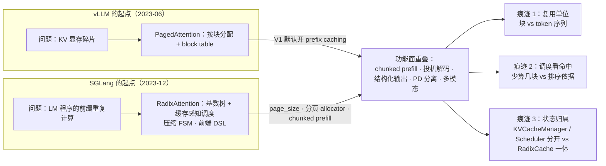
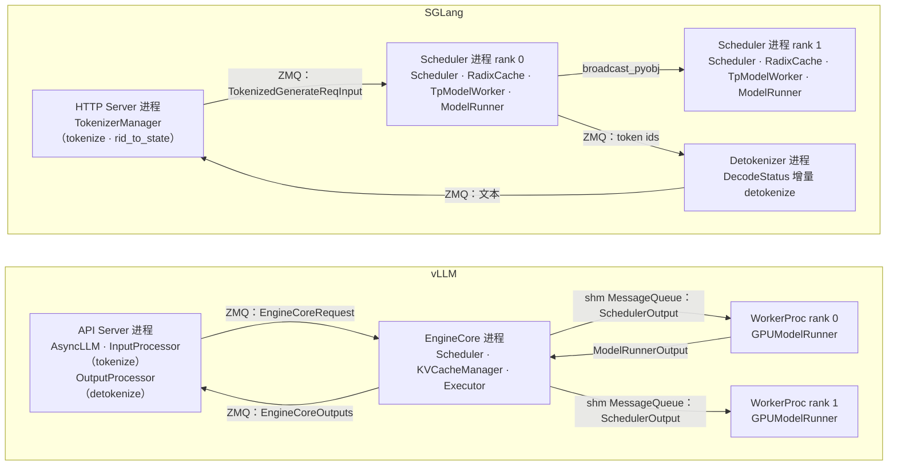
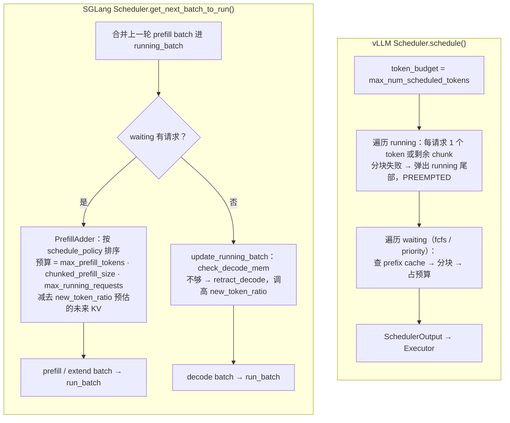
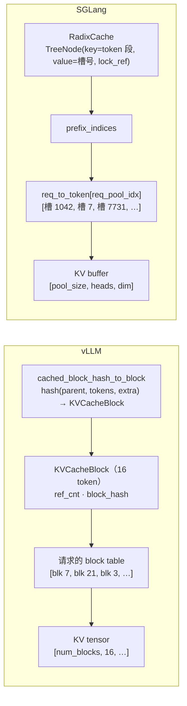
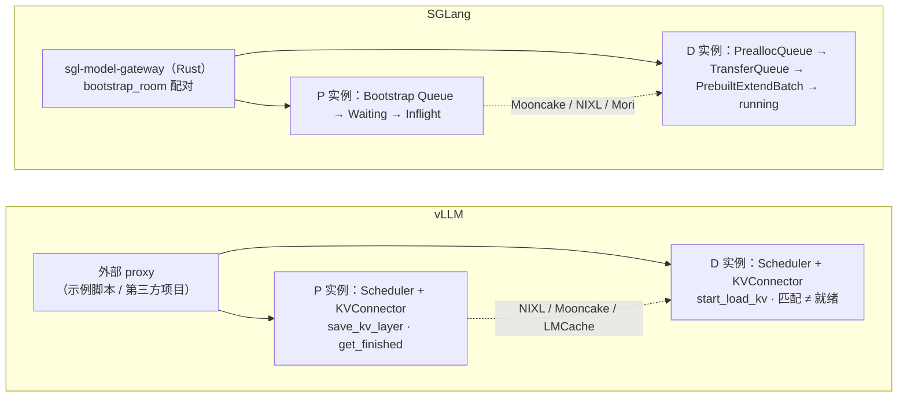

> **NOTE** 本文对照 vLLM v0.27.1（tag `6e448d0`，2026-08-11）与 SGLang v0.5.18（tag `71de97b`，2026-08-20）的源码。文中文件路径、类名、默认值均以这两个版本为准；两个项目都以周为单位迭代，阅读时请以你手上的版本对照。SGLang 的路径省略前缀 `python/sglang/srt/`，vLLM 的路径省略前缀 `vllm/`。

前十四篇只拿一个系统做标本。读者最自然的追问是：**SGLang 呢？** 它和 vLLM 一样是今天最常被部署的开源 LLM Serving 引擎，大规模 DeepSeek 部署、Agent 多轮会话、长 system prompt 的场景里经常是它被选中。两边的社区各有一组 benchmark 图，各自领先。

本文不做排行榜。一组吞吐数字至少取决于七个变量——模型、硬件、输入 / 输出长度分布、并发、prefix cache 命中率、attention / 采样 backend、以及一长串默认值——换一个变量结论就可能翻转，而且两边每个版本都在变。本文做的是另一件事：**把前面十四篇建立的分析框架用到第二个系统上**。同一个请求，在 SGLang 里进的是哪个进程、排的是哪条队列、KV 存在哪张表、怎么被复用、什么时候被踢出去、GPU 上由谁执行、多卡怎么切、PD 怎么拆——每一处都和 vLLM 并排放，然后区分哪些差异来自两个项目**不同的出发点**、哪些只是**功能落地的时间差**。读完这一篇，你应该能在不看 benchmark 的情况下判断一个工作负载更适合谁，也应该能把这套方法用到第三个引擎上。

本篇的核心问题是：

> **vLLM 与 SGLang 在同一个请求的路径上，哪些地方做了不同的选择？这些选择来自什么出发点，又在什么工作负载下显出差别？[^q0]**

## 一、总览

### 1. 先说答案

把两套系统压成三句话：

1. **出发点不同，功能面已经重叠。** vLLM 从 PagedAttention 出发——问题是 KV cache 的显存碎片，答案是分块；SGLang 从 RadixAttention 出发——问题是 LM 程序里大量共享前缀的重复计算，答案是用基数树管理 KV 的复用。今天 vLLM 默认开 prefix caching，SGLang 也有分页 allocator，两边都有 chunked prefill、投机解码、结构化输出、PD 分离、多模态。差别不在"有没有"，而在"状态放在哪、谁调谁"。
2. **结构上，vLLM 是一个调度器指挥 N 个 worker，SGLang 是每个 TP rank 各跑一份调度器。** vLLM 把 Scheduler 和 KVCacheManager 放在一个 EngineCore 进程里，调度结果（`SchedulerOutput`）跨进程发给 worker；SGLang 的 Scheduler 与 ModelRunner 在同一个进程里，每个 TP rank 都收到同样的请求、做同样的决策，调度结果不用传。这一个选择决定了两边 tokenize / detokenize 的位置、overlap 的做法、以及把调度"做成确定性"的必要性。
3. **分叉点在生态的外延。** SGLang 为 DeepSeek 式的大规模 MoE 部署集成了一整套（DP attention、DeepEP、EPLB、两 batch 重叠、PD 分离、HiCache 三级缓存、Rust 写的 model gateway）；vLLM 的外延在硬件插件、`KVConnector` 抽象下的第三方 KV 存储、更长的模型与量化清单，以及一个由多个外部项目组成的部署生态。

| 维度 | vLLM v0.27.1 | SGLang v0.5.18 |
|---|---|---|
| 出发点 | PagedAttention：KV 显存碎片 | RadixAttention：LM 程序的前缀复用 |
| 调度器份数 | 1 份（EngineCore 进程） | 每个 TP / PP rank 1 份（各 Scheduler 进程） |
| 调度与执行的关系 | 跨进程：`SchedulerOutput` 经共享内存队列发给 `WorkerProc` | 同进程：`ScheduleBatch` → `TpModelWorker` → `ModelRunner` |
| 调度主循环 | 一个 token 预算，running 先、waiting 后，无 prefill / decode 阶段 | 先组 prefill batch，否则 decode；`PrefillAdder` 按预估未来 KV 准入 |
| 显存不够时 | 抢占：弹出 `running` 尾部请求，置 `PREEMPTED` 回 waiting 重算 | 撤回：`retract_decode` 按策略挑请求回 waiting，并把 `new_token_ratio` 调高 |
| KV 复用结构 | 块哈希表 `BlockPool.cached_block_hash_to_block`，块粒度（默认 16 token） | 基数树 `RadixCache`，token 粒度（`page_size` 默认 1，可按页对齐） |
| KV 物理布局 | 每层 `[num_blocks, block_size, …]`，请求持 block table | 每层 `[pool_size, …]` 的 token 槽；`req_to_token` 矩阵记每请求每 token 的槽号 |
| CPU / GPU 重叠 | `async_scheduling`：无冲突选项时默认开 | overlap scheduler：默认开（`FutureMap` 占位 token） |
| CUDA Graph | `FULL_AND_PIECEWISE`，与 `torch.compile` 配合 | 按 decode / prefill 分别配置，`FULL` / `BREAKABLE` / `TC_PIECEWISE` |
| 多卡 | TP / PP / EP / DP，EPLB，DBO | TP / PP / EP / DP，DP attention，EPLB，TBO，`DataParallelController` |
| PD 分离 | `KVConnector` 抽象（NIXL / LMCache / Mooncake / …），proxy 由外部提供 | `disaggregation/` 内置 P / D 两套队列，transfer backend Mooncake / NIXL / Mori / Ascend，gateway 原生路由 |
| 多级 KV 缓存 | 通过 connector（offloading、LMCache 等） | `HiRadixCache` + `mem_cache/storage/` 内置 L2 / L3 |
| 网关 | 外部项目 | `sgl-model-gateway`（Rust）随仓库发布 |

Table: 两套系统的一句话对照

### 2. 本文的章节安排

| 章 | 主题 | 内容 |
|---|---|---|
| 二 | 两个出发点 | PagedAttention 与 RadixAttention 各自解决什么问题；它们在今天结构里留下的痕迹 |
| 三 | 进程与边界 | 一个请求从 HTTP 到 GPU 各经过哪些进程；一个调度器 vs N 个调度器 |
| 四 | 调度 | 一个 token 预算 vs 两条队列；抢占 vs 撤回；两种 CPU / GPU 重叠 |
| 五 | KV Cache | 块哈希表 vs 基数树；`block_table` vs `req_to_token`；驱逐与多级缓存 |
| 六 | GPU 执行 | ModelRunner、attention backend 的选择、CUDA Graph 的配置方式 |
| 七 | 多卡 | TP / PP / EP / DP 的共同点；DP attention、EPLB、TBO / DBO 的分叉 |
| 八 | PD 分离 | `KVConnector` vs `disaggregation/`；谁来做 P / D 路由 |
| 九 | 解码的扩展 | 投机解码、结构化输出、LoRA、多模态的清单对照 |
| 十 | API 与生态 | 入口、网关、硬件、模型、可观测 |
| 十一 | 怎么选 | benchmark 为什么不能直接搬；按工作负载的决策表 |
| 十二 | 本文小结 | 一句话差别与方法的迁移 |
| 十三 | 自测 | 5 道题 |

Table: 本文的章节安排

## 二、两个出发点

### 1. vLLM：显存碎片

vLLM 的起点是 2023 年的 PagedAttention 论文（SOSP'23）。它看到的问题是第五篇讲过的：按最大长度预分配 KV cache 的系统，真正存放有效 KV 的显存只占两三成，其余被内部碎片、外部碎片和预留吃掉。答案借自操作系统的虚拟内存：KV 按固定大小的块分配，请求持一张 block table，attention kernel 按表查块。块一旦成为分配单位，continuous batching、抢占、prefix caching、PD 分离的 KV 交接就都以块为单位展开——这是前面十四篇反复看到的脉络。

### 2. SGLang：前缀复用

SGLang 的起点是同年年底的论文《SGLang: Efficient Execution of Structured Language Model Programs》（NeurIPS 2024）。它看到的是另一个问题：当模型被当作程序的一部分调用——多轮对话、few-shot、self-consistency 的多次采样、agent 的 tree search——大量请求共享很长的前缀，而当时的引擎把每个请求当作独立的 token 串从头 prefill。答案有三部分：**RadixAttention**（用基数树组织所有在役与已完成请求的 KV，前缀匹配即复用，LRU 驱逐）、**压缩 FSM** 的约束解码（结构化输出一次跳过多个确定的 token），以及一套**前端 DSL**（`sglang.lang`：`gen`、`select`、`fork`），让程序把复用结构显式地告诉运行时。

### 3. 出发点留下的痕迹

两条路很快会师：vLLM V1 把 prefix caching 做成默认开启（第五篇），SGLang 加了 `page_size`、分页 allocator 和 chunked prefill。但出发点没有被抹平，它决定了今天几处结构性差异：

- **复用的单位**。vLLM 的复用单位是**块**：按块内容哈希，命中要整块命中，块有引用计数。SGLang 的复用单位是**token 序列**：树节点的 key 是一段 token，命中可以停在任意位置（`page_size` > 1 时按页对齐），节点有锁计数。
- **调度器看待命中的方式**。vLLM 的 Scheduler 把前缀命中当作"这个请求少算几块"，顺序仍按 FCFS 或优先级；SGLang 的 Scheduler 提供 `lpm`（longest prefix match）与 `dfs-weight` 两种**缓存感知**的排序策略，把命中长度当作排序依据，并在同一批新请求内部检测互相的前缀（in-batch prefix caching）。
- **状态的归属**。vLLM 让 KVCacheManager 管块、Scheduler 管请求，二者之间是明确的接口；SGLang 的 `RadixCache` 同时是 KV 索引、前缀匹配器和驱逐器，`Scheduler` 直接持有它。

所以回答本章的问题：出发点为什么到今天还重要？[^q1]因为功能可以补，数据结构很难换——块哈希表与基数树各自决定了命中粒度、驱逐方式、锁定方式和调度器能看到什么，后面五、四两章会逐项看到。

## 三、进程与边界：请求从 HTTP 到 GPU

### 1. vLLM：一个调度器、N 个 worker

第三篇与第十四篇画过 vLLM 的三类进程，这里只重述和 SGLang 对照时要用的部分：

- **API Server 进程**：FastAPI 路由 → `AsyncLLM`（`v1/engine/async_llm.py`）→ `InputProcessor` 在这里 **tokenize**，产出 `EngineCoreRequest`；输出侧 `OutputProcessor` 持每个请求的 `IncrementalDetokenizer`，**detokenize 也在这里**。
- **EngineCore 进程**（`v1/engine/core.py` 的 `EngineCoreProc`）：经 ZMQ 收请求；`Scheduler` + `KVCacheManager` 做决策；通过 `Executor` 下发。
- **Worker 进程**（`v1/executor/multiproc_executor.py` 的 `WorkerProc`，每个 TP / PP rank 一个）：`SchedulerOutput` 经共享内存 `MessageQueue`（`rpc_broadcast_mq`）广播到所有 worker；`GPUModelRunner` 翻译成张量、forward、采样；`ModelRunnerOutput` 回到 EngineCore。

调度决策只做**一次**，然后作为数据跨两道边界传递。`SchedulerOutput` 因此是全系统最重要的契约（第十四篇第五章）。

### 2. SGLang：每个 TP rank 一份调度器

SGLang 的 `Engine._launch_subprocesses()`（`entrypoints/engine.py`）起的进程是另一种分法：

- **HTTP Server 进程**：FastAPI（`entrypoints/http_server.py`）+ `TokenizerManager`（`managers/tokenizer_manager.py`）。它 **tokenize**、给每个请求建一个 `ReqState`（`rid_to_state`），经 ZMQ（`PortArgs.scheduler_input_ipc_name`）把 `TokenizedGenerateReqInput` 发给调度器；结果回来后由它写回 HTTP 响应。
- **Scheduler 进程 × (tp_size × pp_size)**：每个 rank 一个进程，进程里是**完整的一套** `Scheduler`（`managers/scheduler.py`）→ `TpModelWorker`（`managers/tp_worker.py`）→ `ModelRunner`（`model_executor/model_runner.py`）→ attention backend。请求由 `attn_tp_rank == 0` 的那个进程从 ZMQ 拉取，再 `_broadcast_reqs_across_ranks` 广播给同组其他 rank（`managers/scheduler_components/request_receiver.py`）。
- **Detokenizer 进程**（`managers/detokenizer_manager.py`）：调度器把 token id 经 ZMQ（`detokenizer_ipc_name`）发到这里，`DecodeStatus` 做增量 detokenize，再经 `tokenizer_ipc_name` 发回 `TokenizerManager`。
- **DataParallelController 进程**（`dp_size` > 1 时，`managers/data_parallel_controller.py`）：按 `load_balance_method`（`round_robin` / `total_requests` / `total_tokens`，PD 模式下 `follow_bootstrap_room`）把请求分发给各 DP 副本的调度器。

| | vLLM | SGLang |
|---|---|---|
| tokenize 在哪 | API Server 进程（`InputProcessor`） | HTTP Server 进程（`TokenizerManager`） |
| detokenize 在哪 | API Server 进程（`OutputProcessor`） | 独立的 Detokenizer 进程 |
| 调度器份数 | 1 | tp_size × pp_size（每 rank 一份，决策相同） |
| 调度结果如何到 GPU | 跨进程：`SchedulerOutput` 经共享内存队列 | 同进程：`ScheduleBatch` → `ModelWorkerBatch` → `ForwardBatch` |
| 请求如何到达其他 TP rank | 不需要：worker 只收 `SchedulerOutput` | rank 0 拉取后 `broadcast_pyobj` 给同组 rank |
| DP 副本 | 多个 EngineCore，API Server 侧分发 | `DataParallelController` 进程分发 |
| 入口的其它形态 | `LLM` 类（同进程 EngineCore）、`AsyncLLM`、gRPC server | `Engine` 类、gRPC server、嵌在调度进程里的 Rust 前端（`SGLANG_RUST_SERVER`） |

Table: 进程与边界对照

### 3. 一份决策 vs N 份相同的决策

这是两套系统最底层的结构差异，值得单独问一句：为什么 SGLang 让每个 TP rank 各跑一份 Scheduler？[^q2]

两种做法各付一种代价。vLLM 只算一次，但要把结果**序列化并跨进程传**，worker 侧还要把它翻译成张量——第十四篇第五章的"翻译层"就是这个代价的体现；好处是 worker 完全被动，调度器可以任意复杂而不必关心确定性。SGLang 不传调度结果，但要求所有 rank **看到完全相同的输入、做出完全相同的决策**——`RequestReceiver` 先广播请求再调度就是为此，调度器里任何依赖本地状态的分支（时间、随机数、本地显存余量）都必须对所有 rank 一致；好处是 Scheduler 和 ModelRunner 之间没有进程边界，`ScheduleBatch` 直接变成 `ForwardBatch`，CPU 侧的准备工作可以与上一轮 GPU 执行紧密重叠（下一章的 overlap scheduler 建立在这上面）。

两边都在向对方靠近：vLLM 的 `async_scheduling` 让调度提前一步做；SGLang 的 `SGLANG_RUST_SERVER` 用一个嵌在调度进程里的 Rust 前端（`rust/sglang-server/`：API server → TokenizerManager → tokenizer / detokenizer）替代 Python 的 HTTP 与 tokenizer 进程，省掉两道 ZMQ。但"一个调度器"与"N 个相同的调度器"这个分法，两边都没有改。

## 四、调度：一个 token 预算 vs 两条队列

### 1. vLLM：一个循环、一个预算

第四篇与第十四篇讲过，vLLM V1 的 `Scheduler.schedule()`（`v1/core/sched/scheduler.py`）没有 prefill / decode 之分：

- 一个 `token_budget = max_num_scheduled_tokens`；默认值随硬件：显存 ≥ 70 GB 且非 A100 时 API server 为 8192（`LLM` 类 16384），否则 2048（`LLM` 类 8192）；`max_num_seqs` 相应为 1024 或 256（`engine/arg_utils.py`）。
- **先 `running` 后 `waiting`**：running 里每个请求推进 1 个 token（投机解码时 `1 + K`），chunked prefill 的请求推进预算剩余的那段；然后从 waiting 按 FCFS 或 `priority` 取新请求，`long_prefill_token_threshold` 限制单个长 prompt 一轮占多少预算。
- **抢占**：running 请求分配不到块时，弹出 `running` 尾部的请求（`self.running.pop()`，优先级模式下取优先级最低者），置 `RequestStatus.PREEMPTED` 回 waiting，下次从头重算（第五篇解释了为什么 V1 选重算不选 swap）。
- 队列策略只有 `fcfs` 与 `priority` 两种（`config/scheduler.py`）。

### 2. SGLang：先 prefill 后 decode、带预留的准入

SGLang 的 `Scheduler.get_next_batch_to_run()` 是另一种形状：

1. 把上一轮的 prefill batch 合并进 `running_batch`（prefill 完成的请求从此按 decode 推进）。
2. **先尝试组 prefill batch**：`get_new_batch_prefill()` 用 `PrefillAdder`（`managers/schedule_policy.py`）从 waiting 队列取请求，预算有三层——`max_prefill_tokens`（默认 16384）、`chunked_prefill_size`（按显存档位自动定：< 35 GB 为 2048，< 60 GB 为 4096，< 160 GB 的 H100 / H200 档 8192，B200 / MI300 档 16384）、`max_running_requests`。
3. **取不到新请求才组 decode batch**：`update_running_batch()` 先 `check_decode_mem()`，不够就 `retract_decode()`。
4. `enable_mixed_chunk` 可以让 prefill chunk 与 decode 混在一个 batch（默认关）；不开时一轮要么 prefill（extend）要么 decode。

`PrefillAdder` 的准入与 vLLM 的"分到块就进"不同：它用 `new_token_ratio` **预估每个请求未来还会生成多少 token**（`max_new_tokens × ratio`），把这部分 KV 算作已占用，再决定还能收几个新请求。`ratio` 从 `SGLANG_INIT_NEW_TOKEN_RATIO × schedule_conservativeness` 起步，每轮衰减到一个下限，一旦发生撤回就按实际已生成量重新估计（`scheduler_components/new_token_ratio_tracker.py`）。`schedule_conservativeness` 是用户调这套估计松紧的旋钮。

排序策略 `schedule_policy` 默认 `fcfs`，另有缓存感知的 `lpm`（按前缀命中长度降序）、`dfs-weight`（按基数树 DFS 顺序，让共享前缀的请求相邻），以及 `lof`（longest output first）、`random`、`priority`、`routing-key`。缓存感知策略是 RadixAttention 论文的一部分：命中长的先跑，它们 prefill 更短、留下的树节点又能被后面的请求继续命中。

### 3. 抢占 vs 撤回

两边都解决"decode 到一半 KV 不够了"，但做法反映了各自的调度形状。vLLM 抢占发生在 `schedule()` 给 running 请求分块失败的那一刻，每次弹一个，弹出的请求回 waiting 排队重算。SGLang 的 `ScheduleBatch.retract_decode()`（`managers/schedule_batch.py`）在 decode batch 组好之前检查整体内存，按撤回策略排序后**一次撤回到够用为止**，被撤回的请求回 waiting、它们的 KV 释放回 allocator（已插入基数树的前缀仍可被命中），同时 `new_token_ratio` 被调高——系统承认刚才的预估过于乐观，接下来收新请求会更保守。所以回答：抢占与撤回有什么不同？[^q3]vLLM 是**事后、逐个、无记忆**的，SGLang 是**事前、批量、带反馈**的。

### 4. 两种 CPU / GPU 重叠

两边都要解决第十四篇末尾的问题：GPU 跑这一轮时 CPU 在干什么。

- vLLM 的 `async_scheduling`（`v1/core/sched/async_scheduler.py`）：调度器在上一轮采样结果回来之前就排下一轮，用占位 token 代替还没出来的那个 token。v0.27.1 的默认是 `None`，由 `config/vllm.py` 决定——没有冲突选项（pooling 模型、不支持的投机方法、不支持的 executor 等）时**开启**。
- SGLang 的 overlap scheduler（`Scheduler.event_loop_overlap()`，默认开，`--disable-overlap-schedule` 关闭）：`FutureMap`（`managers/overlap_utils.py`）给下一轮 batch 的 `input_ids` 填**负的 future 下标**，GPU 侧在 forward 入口 `resolve_forward_inputs` 时从 `output_tokens_buf` 取回上一轮刚采出的 token；调度线程维护一个 `result_queue`，GPU 跑第 N 轮时 CPU 处理第 N−1 轮的结果、准备第 N+1 轮。

| 旋钮 | vLLM | SGLang |
|---|---|---|
| 每轮 token 上限 | `max_num_batched_tokens`（8192 / 2048 按硬件） | `max_prefill_tokens`（16384）+ `chunked_prefill_size`（2048 ~ 16384 按硬件） |
| 并发请求上限 | `max_num_seqs`（1024 / 256） | `max_running_requests`（按 KV 池大小推导） |
| 队列策略 | `fcfs`、`priority` | `fcfs`、`lpm`、`dfs-weight`、`lof`、`random`、`priority`、`routing-key` |
| prefill / decode 混批 | 天然混批（同一预算） | `enable_mixed_chunk`（默认关） |
| 准入保守度 | 无（分到块就进） | `schedule_conservativeness` × `new_token_ratio` |
| 显存不够 | 抢占（重算） | 撤回（重算） |
| CPU / GPU 重叠 | `async_scheduling`（无冲突时默认开） | overlap scheduler（默认开） |
| 异步调度的占位 | 占位 token，采样后回填 | `FutureMap` 负下标，GPU 侧解析 |

Table: 调度旋钮对照

两边都叫 continuous batching，为什么说 vLLM 没有 prefill / decode 阶段而 SGLang 有？[^q4]vLLM 的一轮 batch 里每个请求只有"推进多少 token"这一个属性，prefill 的 chunk 与 decode 的 1 token 在同一个预算里相加；SGLang 的一轮 batch 有 `forward_mode`——`EXTEND` 或 `DECODE`——两种 batch 走不同的 attention 路径与 CUDA Graph 配置，混批是显式开关。这不是谁更先进：vLLM 的做法让预算模型简单、TTFT 与 TPOT 的权衡只有一个旋钮；SGLang 的做法让 prefill 与 decode 可以各选最优的 kernel 与 graph 策略，代价是多一组开关。

## 五、KV Cache：块哈希表 vs 基数树

### 1. vLLM：块、哈希链、引用计数

第五篇与第十四篇讲过的结构，这里列出对照要用的四个事实：

- 物理单位是 `KVCacheBlock`，默认 16 个 token（`CacheConfig.DEFAULT_BLOCK_SIZE`），每层的 KV tensor 形如 `[num_blocks, block_size, …]`。
- 复用索引是 `BlockPool.cached_block_hash_to_block`（`v1/core/block_pool.py`）：**哈希 → 块**。块的哈希是一条链——`hash_block_tokens(parent_hash, tokens, extra_keys)`（默认 `sha256`），所以相同 token 在不同前缀下得到不同的哈希，一个块只能被同一前缀链上的请求命中。
- 请求持 block table（`v1/worker/block_table.py`），`GPUModelRunner` 把它写成张量交给 attention kernel。
- 命中与释放：`KVCacheManager.get_computed_blocks()` 逐块查哈希表，命中块 `ref_cnt += 1`；请求结束 `free()` 让 `ref_cnt -= 1`，归零的块进空闲队列**尾部**并保留哈希，驱逐时从队列头取——这就是 LRU。

### 2. SGLang：token 槽、`req_to_token` 矩阵、基数树

SGLang 把同一件事拆成三个对象（`mem_cache/`）：

- **`TokenToKVPool`**（`memory_pool.py` 的 `MHATokenToKVPool` / `MLATokenToKVPool` 等）：每层的 KV buffer 形如 `[pool_size, head_num, head_dim]`——以 **token 槽**为物理单位，不是块。槽号由 allocator 发放：`page_size` 为 1 时是 `TokenToKVPoolAllocator`（空闲槽列表），> 1 时是 `PagedTokenToKVPoolAllocator`（`allocator/`），滑动窗口模型另有 `SWATokenToKVPoolAllocator`。
- **`ReqToTokenPool`**：一张 `[max_running_requests, max_context_len]` 的 `int32` 矩阵 `req_to_token`，第 i 行是第 i 个在役请求每个位置的槽号。它就是 vLLM 的 block table，只是按 token 而不是按块记。
- **`RadixCache`**（`radix_cache.py`）：基数树。`TreeNode` 的 `key` 是一段 token（`RadixKey`，可带 `extra_key` 与 `cache_salt`），`value` 是这段 token 的槽号张量，另有 `lock_ref`（在役请求对这段前缀的锁计数）、`last_access_time`、`hit_count`、`priority`。

一个请求的路径：进入 waiting 时 `Req.init_next_round_input()` 调 `tree_cache.match_prefix()`——`_match_prefix_helper` 从根沿 `children` 走，key 按 `page_size` 取第一页做字典键，节点匹配一半就 `_split_node`；命中的槽号成为 `prefix_indices`，对应节点 `inc_lock_ref`。prefill 时 `ScheduleBatch.prepare_for_extend()` 只为 `prefix_indices` 之后的 token 向 allocator 要新槽，写进 `req_to_token`。请求结束 `cache_finished_req()`：把 `origin_input_ids + output_ids` 按页对齐做成 key，`insert()` 进树（与已有节点重叠的部分释放重复的槽），再 `dec_lock_ref`。驱逐 `evict()` 只看 `lock_ref == 0` 的叶子，按 `EvictionStrategy`（`evict_policy.py`：LRU / LFU / FIFO / MRU）排优先级，从叶子往根剥。

### 3. 差异的后果

| | vLLM | SGLang |
|---|---|---|
| 物理单位 | 块（默认 16 token） | token 槽（`page_size` 默认 1） |
| 复用索引 | 哈希表：哈希链 → 块 | 基数树：token 段 → 槽号 |
| 命中粒度 | 整块；部分块需 `cache_partial_block` 一类扩展 | 任意长度（`page_size` > 1 时页对齐） |
| 命中查找 | 每块一次哈希与查表 | 从根逐节点比对，可能切分节点 |
| 在役保护 | `ref_cnt` | `lock_ref` |
| 驱逐 | 空闲队列头（LRU） | 无锁叶子按 LRU / LFU / FIFO / MRU |
| 调度器能看到什么 | 命中块数 | 命中长度 + 树的形状（`lpm` / `dfs-weight`） |
| 同批新请求互相复用 | 不检测（第二个请求下一轮才命中） | in-batch prefix caching：命中短于阈值的请求在同批内比对，重复前缀的请求延后 |
| 多级缓存 | `KVConnector`：offloading connector、LMCache、Mooncake 等 | `HiRadixCache`（host 内存 L2）+ `mem_cache/storage/`（file、Mooncake、HF3FS、NIXL、AIBrix、LMCache 等 L3） |

Table: KV 管理对照

块哈希与基数树，谁的前缀命中更"强"？代价是什么？[^q5]基数树命中更细、更能被调度器利用——任意长度命中、同批检测、缓存感知排序；代价是一棵在 CPU 上维护的树（匹配、切分、锁、驱逐都是 Python 对象操作，前缀越多树越大），以及每个 TP rank 各维护一份（第三章）。块哈希表的命中按块取整，但查找是 O(块数) 的哈希，结构简单到可以把块的哈希与元数据通过 `KVConnector` 发给另一个进程或机器——第八篇与第十二篇的 PD 分离、第十三篇的分布式 KV 都建立在"块 + 哈希"这个可以序列化的单位上。SGLang 的 `HiRadixCache` 做同样的事时，节点要额外记 `host_value` 与 `hash_value`，相当于在树上再长出一套块哈希。

## 六、GPU 执行

两边的 GPU 侧结构相似：一个 model runner 把 batch 翻译成张量、调用模型、采样；模型由一层层 attention / MoE / linear 组成，attention 的 kernel 由可替换的 backend 提供；decode 用 CUDA Graph 消除 launch 开销。差别在三处。

### 1. runner 与 worker 的位置

vLLM 的 `GPUModelRunner`（`v1/worker/gpu_model_runner.py`）在 worker 进程里，持久化的 `InputBatch` 跨步增量更新（第十四篇第五章）；SGLang 的 `ModelRunner` 在调度进程里，由 `TpModelWorker.forward_batch_generation()` 调用，`ScheduleBatch` → `ModelWorkerBatch` → `ForwardBatch` 三次转换都不出进程。overlap 时 `Scheduler.run_batch()` 在 `forward_stream` 上发起 forward，采样可以被 `delay_sample_func` 推迟、D2H 拷贝走单独的 `copy_stream`（`launch_batch_sample_if_needed`）。

### 2. attention backend 怎么选

vLLM 的 backend 在 `v1/attention/backends/`（FlashAttention、FlashInfer、Triton、FlexAttention、ROCm 的 AITER、CPU，MLA 另有一组），由 `Platform` 按硬件、dtype、模型特性选一个（第十一篇）；prefill 与 decode 的区别在 backend **内部**处理（MLA backend 内部有 prefill / decode 两条路径）。

SGLang 的 backend 在 `layers/attention/`，选择逻辑在 `ServerArgs`（`server_args.py`）：MHA 模型在 Hopper 默认 `fa3`，SM100 默认 `trtllm_mha`（K / V 宽度不等时 `fa4`），ROCm `aiter`，其余 `flashinfer` 或 `triton`；MLA 模型 Hopper `fa3`、SM100 `flashinfer`。它把 **prefill 与 decode 的选择权暴露给用户**：`--prefill-attention-backend` 与 `--decode-attention-backend` 可以不同。

### 3. CUDA Graph 的配置方式

vLLM 的 `CompilationConfig` 默认 `cudagraph_mode = FULL_AND_PIECEWISE`：decode 形态整图捕获，其它形态用 `torch.compile` 切成分段图、把 attention 留在图外（第六篇）。SGLang 的 `cuda_graph_config` 分 `decode` 与 `prefill` 两组，各有 `max_bs`、`bs` 列表与 backend（`FULL` / `BREAKABLE` / `TC_PIECEWISE` / `DISABLED`，`model_executor/runner_backend/`）；decode 的 `max_bs` 随显存档位自动定（< 20 GB 为 8，A100 40 GB 档 32 / 160，H100 / H200 档 TP < 4 时 256、否则 512，B200 档 512），`mem_fraction_static` 再按 `chunked_prefill_size` 与 `max_bs` 反推——活化显存与图缓冲都从这两个数估出来。`torch.compile` 在 SGLang 是可选项（`--enable-torch-compile`），不是 CUDA Graph 的前提。

| | vLLM | SGLang |
|---|---|---|
| runner 所在进程 | Worker 进程 | Scheduler 进程 |
| 跨步状态 | `InputBatch` 持久化、增量更新 | `ScheduleBatch` 持久化（`running_batch`）、`req_to_token` 按请求行更新 |
| attention backend | `Platform` 选一个，prefill / decode 在 backend 内分路 | `ServerArgs` 按 SM 版本选；prefill / decode 可分别指定 |
| CUDA Graph | `FULL_AND_PIECEWISE`，依赖 `torch.compile` 分段 | decode / prefill 分别配置，`FULL` / `BREAKABLE` / `TC_PIECEWISE` |
| 显存预算 | `gpu_memory_utilization`（默认 0.92）内 profile 出 KV 块数 | `mem_fraction_static` 由 `chunked_prefill_size` 与 graph `max_bs` 反推，再定 KV 池大小 |
| 采样 backend | 内置 sampler（FlashInfer 可选用于部分算子） | `sampling_backend`：有 FlashInfer 时默认 `flashinfer`，否则 `pytorch` |

Table: GPU 执行层对照

为什么 SGLang 把 prefill / decode 的 backend 选择暴露出来，而 vLLM 不这么分？[^q6]因为 SGLang 的 batch 本来就有 `forward_mode`（第四章）：EXTEND 与 DECODE 是两种 batch，各走各的 kernel 与 graph 配置是顺理成章的；vLLM 的 batch 没有模式，一个 batch 里 prefill chunk 与 decode token 混在一起，只能由 backend 在内部按每个请求的形态分路。同一个"有没有阶段"的选择，在调度层与执行层各出现一次。

## 七、多卡

### 1. 共同点

TP / PP / EP / DP 四种并行两边都有（第八篇讲 vLLM 的实现）：TP 切权重、每层 all-reduce；PP 切层、微批流水；EP 把 MoE 专家分散到不同卡、all-to-all 路由 token；DP 复制整个引擎、各自调度。SGLang 的 PP 由 `scheduler_pp_mixin.py` 的 `event_loop_pp` 提供，DP 由 `DataParallelController` 分发。

### 2. 分叉：DeepSeek 带来的那一组

DeepSeek-V3 / R1 这种"MLA + 数百专家 + 几十张卡"的部署让两边各长出一组专用机制，名字不同、思路相近：

- **DP attention**（SGLang `--enable-dp-attention`，`layers/dp_attention.py`）：attention 部分按 DP 复制（MLA 的 KV 很小，复制比切分划算），FFN / MoE 部分按 TP / EP 切；要求 `dp_size == tp_size`，每个 DP rank 有自己的调度器与 KV 池。vLLM 对应的是 DP + EP 的组合（`data_parallel_size` + `enable_expert_parallel`），多个 EngineCore 各管一份 attention，MoE 层跨 DP rank 做 all-to-all。
- **专家负载均衡**：两边都叫 EPLB——SGLang 在 `eplb/`，vLLM 在 `ParallelConfig.enable_eplb` + `EPLBConfig`。
- **两个微批重叠通信与计算**：SGLang 叫 TBO（`--enable-two-batch-overlap`，`batch_overlap/two_batch_overlap.py`），vLLM 叫 DBO（`ParallelConfig.enable_dbo`，`dbo_decode_token_threshold` 默认 32）。
- **all-to-all 的实现**：SGLang `moe_a2a_backend` 可选 `deepep` / `mooncake` / `nixl` / `mori`；vLLM 的 all-to-all 由 `all2all_backend`（第八篇）选择，同样支持 DeepEP。

| | vLLM | SGLang |
|---|---|---|
| TP / PP / EP / DP | 有 | 有 |
| DP 请求分发 | API Server 侧 + DP coordinator | `DataParallelController` 进程（`round_robin` / `total_requests` / `total_tokens`） |
| attention 复制、FFN 切分 | DP + EP 组合 | `enable_dp_attention`（要求 `dp_size == tp_size`） |
| 专家负载均衡 | `enable_eplb` + `EPLBConfig` | `eplb/` |
| 微批重叠 | DBO（`enable_dbo`） | TBO（`enable_two_batch_overlap`）、SBO（`enable_single_batch_overlap`） |
| all-to-all | `all2all_backend`（含 DeepEP） | `moe_a2a_backend`：`deepep` / `mooncake` / `nixl` / `mori` |
| 上下文并行 | 有（`decode_context_parallel_size` 等） | `attn_cp_size` |

Table: 并行能力对照

为什么 SGLang 的 DP attention 把 `dp_size` 和 `tp_size` 绑在一起？[^q7]因为它不是"再起几份引擎"，而是在**同一组 TP rank 内部**把 attention 层按 DP 划分、FFN 层按 TP 划分——`compute_dp_attention_world_info` 把 `tp_rank` 拆成 `(attn_dp_rank, attn_cp_rank, attn_tp_rank)` 三个坐标，`attn_tp_size = tp_size / dp_size / cp_size`。每个 attention DP 组有自己的 Scheduler 与 KV 池（第三章说的"每 rank 一份调度器"在这里成了必要条件），而 FFN 的输入要先在 TP 组内 gather、算完再 scatter 回各自的 attention 组。vLLM 用多个 EngineCore 实现 DP，DP 组之间通过 MoE 层的 all-to-all 相遇，所以 `data_parallel_size` 与 `tensor_parallel_size` 是独立的两个数。

## 八、PD 分离与多级缓存

### 1. vLLM：一个抽象、多个实现

第十二篇讲过 vLLM 的做法：PD 分离不是一个独立模块，而是 Scheduler 与 ModelRunner 上的一组钩子加一个 `KVConnector` 抽象（`distributed/kv_transfer/kv_connector/v1/base.py`：`register_kv_caches`、`start_load_kv`、`save_kv_layer`、`get_finished`、`build_connector_meta`）。实现在同一目录：`nixl/`、`lmcache_connector.py`、`mooncake/`、`moriio/`、`multi_connector.py`（叠加多个）、`offloading_connector.py`（CPU 卸载）、`hf3fs/` 等。P 实例与 D 实例各是一个普通的 vLLM 进程，谁先收请求、D 满了 P 收不收，由**外部的 proxy / 编排层**决定，仓库只提供示例 proxy。

### 2. SGLang：两套队列、一个 bootstrap、一个原生网关

SGLang 把 PD 分离做成了 `disaggregation/` 下的完整模块，`--disaggregation-mode prefill | decode` 决定一个实例扮演哪一边：

- **P 侧**（`prefill.py`）：请求先进 **Bootstrap Queue**（为每个请求建一个 sender、与 D 侧握手、等 D 侧预分配好 KV），握手完成才进 **Waiting Queue**（由 `PrefillAdder` 正常准入），forward 后进 **Inflight Queue** 轮询传输完成。
- **D 侧**（`decode.py`）：请求先进 **PreallocQueue**（建 receiver、握手、有空间就预分配 KV），再进 **TransferQueue** 轮询传输，到达后进 waiting 组成 `PrebuiltExtendBatch`——跳过 prefill forward、只填元数据——最后并入 `running_batch` 开始 decode。
- **传输层**：`TransferBackend` 可选 `mooncake`（默认）、`nixl`、`mori`、`ascend`、`fake`；握手经由一个 bootstrap server（`disaggregation/base/` 与 `common/`）。
- **路由**：`sgl-model-gateway`（Rust）原生支持 `--pd-disaggregation --prefill … --decode …`，带 cache-aware 负载均衡、重试、熔断、Prometheus / OpenTelemetry；P / D 的配对由它的 `bootstrap_room` 决定，`DataParallelController` 的 `follow_bootstrap_room` 策略保证同一个请求的 P 与 D 落到对应的 DP rank。

### 3. 多级缓存

vLLM 的多级 KV 复用 `KVConnector` 这同一个抽象：`offloading_connector.py` 把块卸到 CPU，LMCache / Mooncake 把块放到外部存储。SGLang 另有一条线：`HiRadixCache`（`mem_cache/hiradix_cache.py`）在基数树节点上加 `host_value`，host 内存成为 L2；`mem_cache/storage/` 下的 backend（`file`、`mooncake_store`、`hf3fs`、`nixl`、`aibrix_kvcache`、`lmcache`、`eic` 等）成为 L3；预取策略 `best_effort` / `wait_complete` / `timeout`，写回策略 `write_through` / `write_through_selective` / `write_back`（见其 `docs/docs/advanced_features/hicache_design.mdx`）。

| | vLLM | SGLang |
|---|---|---|
| PD 分离的形态 | `KVConnector` 钩子 + 普通实例 | `disaggregation/` 模块 + `--disaggregation-mode` |
| P / D 配对与路由 | 外部 proxy | `sgl-model-gateway` 原生，`bootstrap_room` |
| D 侧"匹配 ≠ 就绪"的处理 | Scheduler 中 `WAITING_FOR_REMOTE_KVS` 状态（第十二篇） | `PreallocQueue` → `TransferQueue` 两级队列 |
| 传输实现 | NIXL、Mooncake、LMCache、MoRI IO 等 connector | Mooncake（默认）、NIXL、Mori、Ascend |
| CPU 卸载 | `offloading_connector.py` | `HiRadixCache`（L2） |
| 外部存储 | LMCache、Mooncake、HF3FS connector | `mem_cache/storage/` 多个 backend（L3） |

Table: PD 分离与多级缓存对照

两套 PD 分离，谁承担"D 满了 P 收不收"的决定？[^q8]vLLM 把它留给外部：P 实例只知道自己的 KV 发没发完，D 实例只知道自己收没收到，是否放行一个新请求由 proxy 看两边的指标决定（第十二篇第四章的"P/D 协同"是对这层的要求，不是实现）。SGLang 把它内置到 P 侧：请求必须先在 Bootstrap Queue 里与 D 握手、等 D **预分配到 KV** 才能进 Waiting Queue，所以 D 满了的后果是 P 侧的请求停在 bootstrap 阶段，不占 P 的 KV 池。这个差别回到两边的定位：vLLM 更愿意做一个被编排的执行层，SGLang 更愿意把编排的一部分收进来。

## 九、解码的扩展

第七篇与第十篇讲的几类扩展两边都有，差别在清单与默认值。

| 能力 | vLLM | SGLang |
|---|---|---|
| 投机解码方法 | `eagle`、`eagle3`、各家 `*_mtp`、`dflash`、`dspark`、`ngram` / `ngram_gpu`、`medusa`、`mlp_speculator`、`draft_model`、`suffix`（`config/speculative.py`） | `EAGLE`、`EAGLE3`、`FROZEN_KV_MTP`（NEXTN）、`STANDALONE`（独立 draft 模型）、`NGRAM`、`DFLASH`、`DSPARK`（`speculative/spec_info.py`） |
| 投机解码与异步调度 | Eagle / ngram GPU 实现可与 `async_scheduling` 共存，其它方法会关闭异步调度 | "Speculative Decoding V2"：draft 与 verify 跑在 overlap scheduler 上（`eagle_worker_v2.py` 等） |
| 结构化输出 backend | `auto`、`xgrammar`、`guidance`、`outlines`、`lm-format-enforcer`（`config/structured_outputs.py`） | `xgrammar`（默认）、`outlines`、`llguidance`、`none`（`constrained/`） |
| 结构化输出的加速 | bitmask 由 `StructuredOutputManager` 异步编译，采样前应用 | 同样 bitmask；另有 jump-forward（`outlines_jump_forward.py`，一次写入多个确定 token） |
| 推理模型的思维链 | reasoning parser 在 API 层 | `reasoner_grammar_backend.py`：思考段不施加语法，答案段才施加 |
| multi-LoRA | `max_loras`、`max_cpu_loras`、Punica kernel（第十篇） | `lora/`：`lora_manager.py`、`lora_backend` 可选 triton / csgmv 等 |
| 多模态 | 处理器注册表 + encoder cache（第十篇） | `multimodal/` 处理器 + `mm_receiver`，encoder 可与 LM 分离（EPD 分离，`docs/.../epd_disaggregation.mdx`） |
| 前端 DSL | 无（`LLM` 类是 Python API，不是程序语言） | `sglang.lang`：`gen` / `select` / `fork`，可运行在 SGLang 或 OpenAI backend 上 |

Table: 解码扩展的清单对照

结构化输出两边都默认 xgrammar，差别在哪？[^q9]在 bitmask 之外的两件事：SGLang 保留了论文里的 jump-forward——当 FSM 的下一段只有一条路径（JSON 的键名、固定分隔符）时直接追加这些 token，不必逐个采样；以及 `reasoner_grammar_backend` 把"思考段不约束、答案段约束"做成了 backend 的一层包装。vLLM 把同样的需求放到 API 层的 reasoning parser 与 structured output 的 `whitespace_pattern` / 请求级选项里处理。

## 十、API 与生态

| | vLLM | SGLang |
|---|---|---|
| OpenAI 兼容 API | chat / completions / responses（`entrypoints/openai/`），embed / classify / score 在 `entrypoints/pooling/`，transcription 在 `speech_to_text/`；另有 Anthropic、Cohere 兼容入口 | chat / completions / responses / embedding / rerank / score / classify / tokenize / transcription（`entrypoints/openai/`）；另有 Anthropic、Ollama 兼容入口 |
| 原生 API | `LLM` / `AsyncLLM` Python 类，gRPC server | `/generate` HTTP 接口、`Engine` 类、gRPC server |
| 网关 / 路由 | 外部项目（production-stack、llm-d、AIBrix 等） | `sgl-model-gateway`（Rust）：worker 注册、cache-aware / power-of-two 负载均衡、PD 路由、重试与熔断、多模型、MCP |
| 硬件 | `platforms/`：CUDA、ROCm、TPU、XPU、CPU；外部插件（Ascend 等） | `hardware_backend/`：GPU（CUDA / ROCm）、NPU、XPU、MUSA、CPU、MLX |
| 模型清单 | `model_executor/models/` 287 个 `.py` | `models/` 216 个 `.py` |
| 指标 | Prometheus `/metrics`，`vllm bench` | Prometheus `/metrics`，`sglang.bench_serving` |
| 调试 | `VLLM_LOGGING_LEVEL`、profiler 接口 | `/start_profile`、scripted scheduler、crash dump 等 |
| 安装体积 | `vllm` 一个包（含预编译 kernel） | `sglang` + `sgl-kernel` + 可选 `flashinfer`、`sglang_router` |

Table: 入口与生态对照

一个常被忽略的差别是**网关的归属**。vLLM 仓库只管单个实例，多实例的路由、prefix 亲和、PD 配对、弹性伸缩是另外几个项目的事；SGLang 把一个 Rust 网关放进仓库一起发版，它的 cache-aware 路由直接利用第五章的基数树——网关侧维护一棵近似树，把前缀相同的请求送到同一个 worker。第十三篇说的"从模型执行器走向分布式系统"，SGLang 选择在仓库内多走了一步，vLLM 选择把这一步留给生态。

## 十一、怎么选：按工作负载，不按排行榜

### 1. benchmark 为什么不能直接搬

把本文前十章的差异列出来，就知道一张 benchmark 图里藏着多少变量：

- **调度默认值不同**：vLLM 一轮 8192 token、SGLang 的 `chunked_prefill_size` 按显存档位、`new_token_ratio` 的保守度——同一并发下两边的 batch 形状不一样。
- **prefix cache 命中的定义不同**：块粒度 vs token 粒度，同一组请求两边的命中率不同；一个 ShareGPT 数据集与一个多轮 agent trace 会给出相反的结论。
- **attention backend 不同**：同一张 H100 上一边默认 FlashAttention、一边默认 FA3，两边都可以手动换。
- **overlap / async 是否开启**、CUDA Graph 捕获了哪些 batch size、`mem_fraction_static` / `gpu_memory_utilization` 给 KV 池留了多少——都影响最大并发。
- **输入 / 输出长度分布**：长输入短输出偏向 prefill 效率与 prefix cache，短输入长输出偏向 decode 的 graph 与采样路径。
- **版本**：两边都以周为单位发版，一张三个月前的图对应的默认值可能已经变了。

两边都自带压测工具（`vllm bench serve`、`python -m sglang.bench_serving`），**用自己的 trace、在自己的硬件上、把两边配置调到同一口径**（相同 token 预算、相同 backend、相同 KV 池比例、相同 graph 配置）再比，是唯一可信的做法；第二篇讲的 TTFT / TPOT / Goodput 口径同样适用。

### 2. 决策表

| 工作负载特征 | 倾向 | 理由（对应本文的章） |
|---|---|---|
| 多轮对话、agent、长 system prompt、few-shot，前缀共享度高 | SGLang | 基数树 token 粒度命中 + `lpm` / `dfs-weight` 调度 + 网关 cache-aware 路由（五、十） |
| DeepSeek 类大规模 MoE，几十张卡，需要 DP attention + EP + PD 一整套 | SGLang 起步快；vLLM 可达 | SGLang 把 DP attention、DeepEP、EPLB、TBO、PD、HiCache 集成在一个仓库并有成体系的文档（七、八）；vLLM 对应能力都有，但要自己拼编排层 |
| 异构硬件（TPU、XPU、特定加速卡）或需要硬件插件 | vLLM | `Platform` 抽象与外部插件生态（十、第十一篇） |
| 模型 / 量化格式覆盖面、与 HF 生态的贴合 | 两者都快，vLLM 清单更长 | 模型文件数与量化方法清单（十） |
| 需要 KV 多级缓存（CPU、外部存储）且不想引入第三方 | SGLang | `HiRadixCache` + `storage/` 内置（八） |
| 已有 Ray / Kubernetes 编排与 vLLM 社区的部署栈 | vLLM | 外部生态围绕 vLLM 实例设计（十） |
| 需要 Rust 网关、PD 配对、熔断、多模型路由开箱即用 | SGLang | `sgl-model-gateway`（八、十） |
| 需要把推理嵌进 Python 程序（离线批处理、RL rollout） | 两者都行 | `LLM` 类 vs `Engine` 类；RL 框架两边都有集成 |
| 结构化输出重、JSON 模板固定 | 略偏 SGLang | jump-forward（九） |
| 团队更熟悉哪一边的源码 | 那一边 | 两边的调优都要读源码，第三至六章的结构差异决定了排障时看哪里 |

Table: 按工作负载的选择倾向

这张表的每一行都可能被下一个版本改写——两边都在补对方有的东西。更稳定的判断方法是本文的分析框架本身：拿到一个候选引擎，问它调度器在哪、几份、按什么准入；KV 以什么为单位、怎么索引、怎么驱逐；prefill 与 decode 有没有阶段；多卡与 PD 的边界画在哪；网关归谁。答案决定了它在你的工作负载上会怎么表现。

### 3. 一句话

如果只记一句话，vLLM 和 SGLang 的差别是什么？[^q10]**vLLM 是"一个调度器 + 块"，SGLang 是"N 个相同的调度器 + 树"**——前者把状态做成可以序列化、可以跨进程与跨机器传递的单位，后者把状态做成调度器可以直接看见、直接利用的结构。其余的差异——prefill / decode 有无阶段、抢占还是撤回、网关在不在仓库里——大多是这一句话的推论。

## 十二、本文小结

本文把前十四篇的分析框架用到了第二个系统上，得到的对照可以压成下面这张表。

| 层 | vLLM v0.27.1 | SGLang v0.5.18 | 差异的来源 |
|---|---|---|---|
| 出发点 | 显存碎片 → 块 | 前缀复用 → 树 | 出发点 |
| 进程 | 1 个调度器，N 个 worker，`SchedulerOutput` 跨进程 | 每 rank 1 个调度器，与 runner 同进程 | 出发点的推论 |
| 调度 | 一个 token 预算，无阶段，抢占 | prefill 优先，`PrefillAdder` 预估准入，撤回 | 出发点的推论 |
| KV | 块哈希表，`ref_cnt`，LRU 空闲队列 | 基数树，`lock_ref`，叶子驱逐 | 出发点 |
| 执行 | `Platform` 选 backend，`FULL_AND_PIECEWISE` | 按 SM 选 backend，prefill / decode 分别配置 | 调度形状的推论 |
| 多卡 | DP + EP、EPLB、DBO | DP attention、EPLB、TBO | 时间差（同一组需求） |
| PD | `KVConnector`，外部 proxy | `disaggregation/`，原生网关 | 定位（执行层 vs 带编排） |
| 扩展 | 清单略长 | 清单相近，多 jump-forward 与 DSL | 时间差 |
| 生态 | 硬件插件、外部部署栈 | Rust 网关、HiCache、DeepSeek 工具链 | 定位 |

Table: 全文对照与差异来源

三类来源要分开看。**出发点**决定的差异（块 vs 树、一份 vs N 份调度器）短期不会变，选型时最该看它们是否匹配你的工作负载。**定位**决定的差异（执行层 vs 带编排）会随两边的生态演化，但方向已经明确。**时间差**决定的差异（谁先支持了某个模型、某种投机方法、某个硬件）最容易被下一个版本抹平，不值得作为长期选型依据。

## 十三、自测

1. 一个 TP=4 的部署里，vLLM 与 SGLang 各起几个进程、各有几份调度器？调度结果分别怎样到达 GPU？

   

答案

   vLLM：1 个 API Server 进程 + 1 个 EngineCore 进程 + 4 个 WorkerProc；调度器 1 份，在 EngineCore；`SchedulerOutput` 经共享内存 `MessageQueue` 广播给 4 个 worker，worker 翻译成张量。SGLang：1 个 HTTP Server 进程（含 TokenizerManager）+ 4 个 Scheduler 进程（各含 TpModelWorker 与 ModelRunner）+ 1 个 Detokenizer 进程；调度器 4 份，`attn_tp_rank == 0` 拉取请求后广播给其余 3 个 rank，各自做相同决策；调度结果不出进程，`ScheduleBatch` 直接变成 `ForwardBatch`。

   

2. 两个请求共享 1000 个 token 的前缀、第二个只多 5 个 token，在两边的 prefix cache 里各能命中多少？若两者同时到达呢？

   

答案

   vLLM 块粒度（16 token）：第一个请求完成（或块写满）后第二个能命中 ⌊1000 / 16⌋ = 62 个整块即 992 个 token，剩余 8 + 5 个 token 重算；同时到达时第一轮两个都算（不检测同批前缀），第二轮才能命中。SGLang token 粒度（`page_size` = 1）：命中 1000 个 token，只算 5 个；同时到达时 in-batch prefix caching 会把第二个请求延后一轮让它命中。`page_size` > 1 时 SGLang 也按页对齐取整。

   

3. SGLang 的 `new_token_ratio` 是什么、怎么变化？vLLM 为什么没有对应的东西？

   

答案

   `PrefillAdder` 用它预估每个请求未来还会生成多少 token（`max_new_tokens × ratio`）并把这部分 KV 预留出来再决定准入；初值 `SGLANG_INIT_NEW_TOKEN_RATIO × schedule_conservativeness`，每轮按固定步长衰减到下限（越来越激进），一旦撤回就按实际已生成量重新估计（变保守）。vLLM 的准入只看当前能否分到块，不预估未来；KV 不够时靠抢占事后处理——一个是事前预留加反馈，一个是事后处理。

   

4. 为什么 SGLang 的 DP attention 要求 `dp_size == tp_size`，而 vLLM 的 `data_parallel_size` 与 `tensor_parallel_size` 互相独立？

   

答案

   SGLang 的 DP attention 在同一组 TP rank 内部把 attention 按 DP 划分、FFN 按 TP 划分，`tp_rank` 被拆成 `(attn_dp_rank, attn_cp_rank, attn_tp_rank)`，`attn_tp_size = tp_size / dp_size / cp_size`，每个 attention DP 组自带调度器与 KV 池；所以 DP 是对 TP 组的再划分，两者是同一组进程。vLLM 的 DP 是多个独立的 EngineCore，各自有自己的 TP 组，DP 组之间只在 MoE 的 all-to-all 处相遇，两个数自然独立。

   

5. 一个请求在 SGLang 的 PD 分离里从进入 P 到开始 decode 经过哪几个队列？其中哪一步对应 vLLM 第十二篇说的"匹配不等于就绪"？

   

答案

   P 侧：Bootstrap Queue（与 D 握手、等 D 预分配）→ Waiting Queue（`PrefillAdder` 准入）→ forward → Inflight Queue（等传输完成）；D 侧：PreallocQueue（握手、预分配 KV）→ TransferQueue（等 KV 到达）→ waiting 组 `PrebuiltExtendBatch`（跳过 prefill 只填元数据）→ 并入 `running_batch` decode。"匹配不等于就绪"对应 D 侧的 PreallocQueue → TransferQueue：KV 已经分配、请求已经登记，但在传输完成前不能进 decode batch；vLLM 用 `WAITING_FOR_REMOTE_KVS` 状态表达同一件事。

   

[^q0]: 五处结构性选择不同：（1）**进程与边界**——vLLM 一个调度器、N 个被动 worker、`SchedulerOutput` 跨进程；SGLang 每个 rank 一份相同的调度器、与 runner 同进程（第三章）；（2）**调度**——vLLM 单一 token 预算、无 prefill / decode 阶段、事后逐个抢占；SGLang 先 prefill 后 decode、`PrefillAdder` 用 `new_token_ratio` 预估准入、批量撤回带反馈（第四章）；（3）**KV**——块哈希表与 `ref_cnt` vs 基数树与 `lock_ref`（第五章）；（4）**执行**——backend 由 `Platform` 选一个 vs prefill / decode 可分别指定，CUDA Graph 一套配置 vs 两套（第六章）；（5）**PD 与网关**——`KVConnector` + 外部 proxy vs `disaggregation/` + 原生 Rust 网关（第八、十章）。来源分三类：出发点（PagedAttention 的块 vs RadixAttention 的树）、定位（执行层 vs 带编排）、时间差（第十二章）。显出差别的工作负载：前缀共享度高的多轮 / agent 偏向 SGLang，异构硬件与外部编排生态偏向 vLLM，大规模 MoE 两边都可达但 SGLang 集成度更高（第十一章）。
[^q1]: 因为功能可以补、数据结构很难换。块哈希表决定了 vLLM 的命中粒度是整块、在役保护是 `ref_cnt`、驱逐是空闲队列 LRU、调度器只能看到"命中几块"、块可以带着哈希被序列化到另一个进程或机器；基数树决定了 SGLang 的命中粒度是 token、保护是 `lock_ref`、驱逐是无锁叶子按策略、调度器能看到命中长度与树的形状并据此排序（`lpm` / `dfs-weight`）、多级缓存要在节点上再长出 `host_value` 与 `hash_value`。两边后来补的功能（vLLM 的 prefix caching、SGLang 的 `page_size`）都是在各自的结构上加的，没有换掉结构。
[^q2]: 为了让 Scheduler 与 ModelRunner 之间没有进程边界。代价是所有 rank 必须看到完全相同的输入（`RequestReceiver` 先广播请求再调度）、调度逻辑必须是确定性的（不能依赖本地时间、随机数或本地显存余量）、每个 rank 都花一份 CPU 做同样的决策并各维护一棵基数树。好处是 `ScheduleBatch` 直接变成 `ForwardBatch`、不用序列化和翻译，CPU 侧准备工作能与上一轮 GPU 执行紧密重叠（overlap scheduler 的 `FutureMap` 建立在这上面），DP attention 时每个 attention 组自带调度器也顺理成章。vLLM 反过来：只算一次、worker 完全被动、调度器不必关心确定性，代价是 `SchedulerOutput` 的序列化与 worker 侧的翻译层。
[^q3]: 时机、粒度、记忆三点不同。vLLM 的抢占是**事后**的——`schedule()` 给某个 running 请求分块失败那一刻触发；**逐个**的——每次弹出 `running` 尾部一个请求，再试；**无记忆**的——下一轮准入仍只看当前能否分到块。SGLang 的撤回是**事前**的——组 decode batch 前 `check_decode_mem()` 整体检查；**批量**的——`retract_decode()` 按策略排序后一次撤到够用为止，剩最后一个仍不够时 abort；**带反馈**的——撤回后 `new_token_ratio` 按实际已生成量重新估计并调高，接下来 `PrefillAdder` 收新请求更保守。两边被踢出的请求都回 waiting 重算，SGLang 已插入基数树的前缀仍可被命中。
[^q4]: 看一轮 batch 有没有"模式"。vLLM 的 `SchedulerOutput` 里每个请求只有"这一轮推进多少 token"，prefill 的 chunk 与 decode 的 1 token 在同一个 `token_budget` 里相加、混在同一个 forward 里，kernel 按每个请求的形态自己分路。SGLang 的 `ScheduleBatch` 有 `forward_mode`（`EXTEND` / `DECODE` 等），`get_next_batch_to_run()` 先尝试组 prefill batch、组不出才组 decode batch，两种 batch 走不同的 attention 路径与 CUDA Graph 配置，混批要显式打开 `enable_mixed_chunk`。前者预算模型只有一个旋钮，后者 prefill 与 decode 可以各选最优的 kernel 与 graph 策略但多一组开关。
[^q5]: 基数树的命中更"强"：任意长度命中（`page_size` > 1 时页对齐）、同一批新请求之间互相检测前缀（in-batch prefix caching）、命中长度与树形可以作为调度排序依据（`lpm` / `dfs-weight`）、匹配一半的节点可以当场切分。代价是一棵在 CPU 上用 Python 对象维护的树——匹配、切分、锁、驱逐都在树上走，前缀越多树越大，而且每个 TP rank 各维护一份。块哈希表命中按块取整、调度器只看到命中块数，但查找是 O(块数) 的哈希与查表，块带着哈希与 `ref_cnt` 可以直接序列化给 `KVConnector`，PD 分离与分布式 KV 建立在这个可传递的单位上；SGLang 做多级缓存时要在树节点上再加 `host_value` 与 `hash_value`。
[^q6]: 因为"有没有阶段"这个选择在调度层与执行层各出现一次。SGLang 的 batch 自带 `forward_mode`，EXTEND 与 DECODE 是两种 batch，各走各的 kernel 与 CUDA Graph 配置（`cuda_graph_config.prefill` / `.decode`）是顺理成章的，所以 `--prefill-attention-backend` 与 `--decode-attention-backend` 可以不同；vLLM 的 batch 没有模式，一个 forward 里 prefill chunk 与 decode token 混在一起，只能由 `Platform` 选一个 backend、backend 内部按每个请求的形态分路（MLA backend 内部的 prefill / decode 两条路径就是这样），CUDA Graph 也只能用 `FULL_AND_PIECEWISE` 这种按 batch 形态自动选整图或分段图的方式。
[^q7]: 因为 SGLang 的 DP attention 不是"再起几份引擎"，而是对同一组 TP rank 的再划分：`compute_dp_attention_world_info` 把 `tp_rank` 拆成 `(attn_dp_rank, attn_cp_rank, attn_tp_rank)`，`attn_tp_size = tp_size / dp_size / cp_size`；attention 层按 DP 复制（MLA 的 KV 小，复制比切分划算）、FFN / MoE 层按 TP / EP 切，FFN 前要在 TP 组内 gather、算完再 scatter 回各 attention 组。每个 attention DP 组有自己的 Scheduler 与 KV 池——第三章"每 rank 一份调度器"在这里成了必要条件。vLLM 用多个独立的 EngineCore 实现 DP，各自有自己的 TP 组，DP 组之间只在 MoE 的 all-to-all 相遇，所以 `data_parallel_size` 与 `tensor_parallel_size` 是独立的两个数。
[^q8]: vLLM 留给外部，SGLang 内置在 P 侧。vLLM 的 P 实例只知道自己的 KV 发没发完（`get_finished`）、D 实例只知道收没收到（`WAITING_FOR_REMOTE_KVS`），是否放行新请求由 proxy 看两边指标决定，仓库只给示例 proxy。SGLang 的 P 侧请求必须先在 Bootstrap Queue 里与 D 握手、等 D 在 PreallocQueue 里**预分配到 KV** 才能进 Waiting Queue 被 `PrefillAdder` 准入，所以 D 满的后果是请求停在 bootstrap 阶段、不占 P 的 KV 池，P / D 配对由 `sgl-model-gateway` 的 `bootstrap_room` 决定、`DataParallelController` 的 `follow_bootstrap_room` 保证落到对应 DP rank。差别来自定位：vLLM 做被编排的执行层，SGLang 把编排的一部分收进仓库。
[^q9]: 两边都在采样前用 bitmask 屏蔽不合法 token（vLLM 的 `StructuredOutputManager` 异步编译、SGLang 的 `grammar_manager`），差别在 bitmask 之外：SGLang 保留了论文里的 jump-forward（`outlines_jump_forward.py`）——FSM 的下一段只有一条路径（JSON 键名、固定分隔符）时直接追加这些 token、不逐个采样；以及 `reasoner_grammar_backend.py` 把"思考段不约束、答案段约束"做成 backend 的一层包装，投机解码下语法 FSM 的推进还能与 verify 重叠。vLLM 的 backend 清单更长（`guidance`、`outlines`、`lm-format-enforcer`、`auto` 选择），思维链的处理放在 API 层的 reasoning parser。
[^q10]: **vLLM 是"一个调度器 + 块"，SGLang 是"N 个相同的调度器 + 树"。** 前者把状态做成可以序列化、可以跨进程与跨机器传递的单位——`SchedulerOutput` 跨进程、块带哈希走 `KVConnector`、实例被外部编排；后者把状态做成调度器直接看见、直接利用的结构——基数树决定排序、`lock_ref` 保护在役前缀、调度与执行同进程、网关侧再维护一棵近似树。prefill / decode 有无阶段、抢占还是撤回、`dp_size` 是否绑定 `tp_size`、网关在不在仓库里，大多是这句话的推论。
