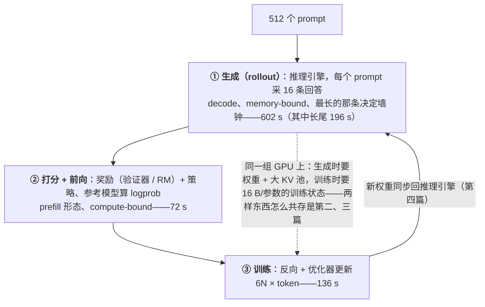

一个 8B 的策略模型做 GRPO：512 个 prompt、每个采 16 条回答、回答平均 8K token。这一步要生成 6700 万个 token，参考模型与旧策略要再各过一遍 7100 万个 token 的前向，训练要对同样多的 token 做前向加反向。合计 6.8×10¹⁸ FLOP，其中训练占一半、生成只占六分之一。但在 64 张 H100 上，生成要 600 秒、训练 135 秒——**按时间生成占四分之三**。整步下来，64 张卡的算力只用到了 13%。

这几个数字是本系列后面七篇的全部起点。系统形态（共置 / 分离 / 异步）要解决的是"生成的 600 秒里训练器在做什么、训练的 135 秒里推理引擎在做什么"；显存切换要解决的是"同一张卡上训练状态与 KV cache 怎么轮流占"；权重同步要解决的是"每步 16 GB 新权重怎么进推理引擎"；异步要解决的是"600 秒里有 196 秒是等最长的几条回答，能不能不等"；Agent 篇要解决的是"当 rollout 还要等几千个容器跑测试时，这张账再放大多少"。不先把这些数字算出来，后面每一个决定都只能靠试。

算这些数字不需要 GPU，需要的是一套一致的记账方法：一步 RL 是**三个形态不同的作业加两次同步**——生成是 serving 作业、打分是一次或几次前向（或一个外部服务）、训练是常规的分布式训练步；两次同步是样本从推理引擎进训练器、新权重从训练器回推理引擎。每个作业有明确的 FLOPs 公式、显存公式与时间模型；把它们与硬件的三个数字（峰值算力、HBM 容量、HBM 带宽）放在一起，就得到三段各花多少秒、整步的 GPU 利用率上限是多少这两个答案。

这一篇不讨论任何系统形态，也不进入任何框架的源码。它只做一件事：把这套记账方法建立起来，给出符号、公式，算清四个场景（8B 对话、8B 推理、32B 推理、DeepSeek-V3 规格的 MoE 推理）的完整数字，并解释为什么 RL 后训练的系统问题与预训练、推理服务都不同。

本篇的核心问题：

> **一个 8B 策略模型，$$B = 512$$、$$G = 16$$、$$\bar L = 8\text{K}$$，在 64 张 H100 上做 GRPO。一步生成多少 token、多少 KV、要分几波？[^q0] 三段各要多少 GPU·秒？[^q1] GPU 平均利用率的理论上限是多少？[^q2] ——这一步之后每一篇要解决的，就是实际值与这个上限之间的差。**

文中所有硬件峰值都是**标称值**（H100 SXM bf16 dense 989 TFLOPS、HBM3 3.35 TB/s、80 GB），字节数用十进制单位（1 GB = 10⁹ 字节），KV 按惯例用 KiB / GiB 注明；所有时间都是在明确写出的 MFU 或带宽利用率假设下的估算，不是实测；论文数字在首次出现处注明出处。

## 一、总览




### 1. 先说答案：三个作业、两次同步

在线 RL 后训练（PPO、GRPO 及其一族）的一步，展开是这样的：

```text
 ┌──────────────── 生成 rollout ────────────────┐   ┌──── 打分 ────┐   ┌────── 训练 ──────┐
 │ 推理引擎：B 个 prompt × G 条回答，decode 为主   │   │ 规则 / 验证器 │   │ 参考前向  log π_ref │
 │ 形态：serving —— 请求、批、KV 池、连续批处理     │──►│ 或奖励模型    │──►│ 旧策略前向 log π_old│
 │ memory-bound，长尾由最长的回答决定              │   │ 或代码沙箱    │   │ 策略前向 + 反向     │
 └──────────────────────────────────────────────┘   └──────────────┘   │ （PPO：价值模型）    │
            ▲                                                          └─────────┬──────────┘
            │                    同步 ②：新权重 → 推理引擎                          │
            └──────────────────────────────────────────────────────────────────────┘
                              同步 ①：样本（token、logprob、reward）→ 训练器  在打分与训练之间
```

三个作业对 GPU 的用法相反：生成是一个 token 一个 token 的 decode，每步读一遍权重与 KV、算得很少，**受 HBM 带宽限制**；训练是整条序列的大矩阵乘，**受算力限制**；打分要么是 prefill 形态的前向（也受算力限制），要么根本不在 GPU 上。它们对显存的要求也互斥：生成要尽可能大的 KV 池，训练要放下参数、梯度、优化器状态（每参数 16 字节）与激活。两次同步是两道墙：训练要等全部 rollout 完成（严格 on-policy 下），下一步生成要等新权重到位。

预训练里只有第三个作业；SFT 与 DPO 也只有第三个。**在线 RL 是唯一把一个 serving 作业放进训练循环的负载**，本系列全部的系统问题都从这里来。

### 2. 三本账：FLOP、字节、秒

三个作业各有一本 FLOP 账和一本字节账，加起来再算一本时间账：

```text
FLOP 的账    生成 2N/token · 前向 2N/token · 训练 6N/token（PPO 价值模型再加 8N）
             合计 ≈ 12N × 一步的 token 数（GRPO）
字节的账     训练状态 16N + 参考 2N + 推理权重副本 2N + KV cache（token 数 × 每 token KV）+ 激活
             ——加起来远超集群显存，所以 rollout 要分波、共置要切换
秒的账       生成 = decode 步数 × 每步读的字节 ÷ 带宽 + 长尾
             前向 / 训练 = FLOP ÷ (卡数 × 峰值 × MFU)
             同步 = 字节 ÷ 链路带宽
             全步 MFU = 总 FLOP ÷ (卡数 × 峰值 × 一步墙钟)
```

FLOP 账在算法侧已经算过（[《后训练》第三篇](/online-rl-ppo-grpo-and-the-rlhf-trio.html)第六章），本篇复述并补上 prompt、前缀缓存与"旧策略要不要重算"三个细节。字节账与秒的账是本篇的主体：前者决定什么放得下、什么必须让路，后者决定三段的时间比例——而这个比例就是第二篇选系统形态、定 GPU 配比的依据。

### 3. 记账符号

全系列使用同一套符号，后续各篇在总览里复述用到的部分：

```text
N  N_a           总参数量、每 token 激活参数量（dense 模型两者相等；MoE 只有 N_a 进 FLOP 账）
B  G             一步的 prompt 数、每个 prompt 的回答数；序列数 S = B·G
P  L̄  L_max      prompt 平均长度、回答平均长度、回答最大长度（token）
T_resp T_all     一步的回答 token 数 S·L̄、前向要过的全部 token 数 S·(P + L̄)
k_kv             每 token 的 KV 字节数（Llama-3-8B：128 KiB；MLA：≈ 70 KB）
n  t             GPU 总数、推理引擎一个实例占的卡数（TP 度）
c                一个推理实例同时在飞的序列数（并发）
F_peak BW M      单卡峰值 FLOPS、HBM 带宽、HBM 容量
η_train η_pre    训练与 prefill 形态前向的 MFU 假设（本篇 0.40、0.50）
η_bw             decode 时 HBM 带宽的有效利用率假设（本篇 0.60）
```

四个场景的模型（KV 字节数按 bf16、$$2 \times$$ 层数 $$\times$$ KV 头数 $$\times$$ 头维 $$\times$$ 2 字节算；DeepSeek-V3 的 MLA 每层只缓存 $$d_c = 512$$ 加 $$d_h^R = 64$$，见[《Transformer 与 LLM》第三篇](/attention-variants-and-kv-cache.html)）：

```text
                 N        N_a     层   KV 头 × 头维    k_kv           推理侧权重
Llama-3-8B       8.0 B    8.0 B    32   8 × 128        128 KiB        bf16
Qwen3-32B       32.8 B   32.8 B    64   8 × 128        256 KiB        bf16
DeepSeek-V3    671 B      37 B    61   MLA 512 + 64    ≈ 70 KB        FP8（官方部署格式）
```

### 4. 本文的章节安排

| 章 | 内容 | 回答的问题 |
|---|---|---|
| 二 | 一步的时间线 | 三个作业与两次同步各在什么时候发生，谁等谁 |
| 三 | FLOP 账 | 12N 怎么来的，prompt、前缀缓存、旧策略重算各占多少 |
| 四 | 字节账 | 四份显存各多大，KV 为什么放不下，分几波 |
| 五 | 秒的账 | decode 的带宽模型、长尾、三段时间比例、全步 MFU |
| 六 | 三个作业的形态 | 为什么它们对 GPU 的用法互斥，两次同步搬什么 |
| 七 | 放大器 | 长思维链、Agent 环境、MoE 各把哪本账放大 |
| 八 | 公开配方 | DeepSeekMath、R1、Kimi k1.5 的配置代进账本 |
| 九 | 动手 | `rl_ledger.py`：四个场景的完整输出 |
| 十 | 小结 | 要点、速查表、下一篇 |

## 二、一步的时间线

### 1. GRPO 的一步

以 GRPO 为例（PPO 只多一个价值模型，第 3 节说），严格 on-policy 的一步按时间展开：

```text
 t0  推理引擎持有第 t 步的权重 θ_t
     ├─ prefill：B 个 prompt 各一次（前缀缓存：同一 prompt 的 G 条回答共享）
     ├─ decode：S = B·G 条序列并发生成，连续批处理，完成一条补一条
     │           ……直到最后一条回答结束（长尾）
 t1  样本（token id、推理引擎算的 log π_old、结束原因）→ 打分
     ├─ 规则 / 验证器：CPU，几乎不占时间；代码沙箱：几十秒到几分钟（第六篇）
     ├─ 奖励模型：一次 prefill 形态的前向（若有）
 t2  样本 + reward → 训练器
     ├─ 参考模型前向：log π_ref（KL 项）
     ├─ 旧策略前向：重算 log π_old（多数框架默认重算，第三章第 4 节）
     ├─ 组内归一化得优势 A，按 mini-batch 做 μ 轮前向 + 反向 + 优化器步
 t3  θ_{t+1} → 推理引擎（同步 ②）；共置形态下还要先把训练状态让出、KV 池建回来
 t0' 下一步
```

两道墙在 t1 和 t3：t1 之前训练器无事可做（严格 on-policy 下它没有样本），t3 之后推理引擎无事可做（它没有新权重）。共置形态把两类作业放在同一组卡上轮流跑，墙的代价是显存切换；分离形态把它们放在不同的卡上，墙的代价是一方空转；异步形态拆掉 t1 这道墙，代价是样本过期。这是第二篇的全部内容，本篇只算每一段的长度。

### 2. 每段需要 GPU 的什么

| 段 | 谁在跑 | 计算形态 | 瓶颈 | 显存里要有什么 |
|---|---|---|---|---|
| prefill | 推理引擎 | 整条 prompt 一次前向 | 算力 | 推理权重副本 + 这批的 KV |
| decode | 推理引擎 | 每步每序列一个 token | **HBM 带宽** | 推理权重副本 + 尽可能大的 KV 池 |
| 打分 | CPU / 沙箱 / RM | — / 容器 / prefill 前向 | 环境延迟 / 算力 | RM 权重（若有） |
| 参考、旧策略前向 | 训练器 | 整条序列一次前向 | 算力 | 参考权重 2N + 激活（不留） |
| 训练 | 训练器 | 前向 + 反向 + 优化器 | 算力 | **16N 训练状态** + 激活 |
| 同步 ② | 两者 | 字节搬运 | 链路带宽 | 一个 bucket 的临时缓冲 |

decode 是唯一受带宽限制的段，也是唯一按"序列数"而不是"token 数"扩展的段——这两点决定了它的时间模型与其他段完全不同（第五章）。

### 3. PPO 多了什么

PPO 有一个与策略同规模的价值模型：rollout 后要对全部 token 做一次价值前向（$$2N$$），训练时它也要前向 + 反向（$$6N$$）；它的训练状态又是 $$16N$$ 字节。所以 PPO 一步的 FLOP 从约 $$12N$$ 涨到约 $$20N$$，显存里多一整套训练状态。GRPO 用组内平均代替价值网络，省掉的正是这一块——它在 2025 年成为默认，一半是算法原因，一半是这本账。

### 4. μ 轮更新

PPO / GRPO 允许对同一批样本做 $$\mu$$ 个 epoch 的更新（clip 就是为此存在的）。$$\mu > 1$$ 时训练的 FLOP 乘 $$\mu$$，其余不变；DeepSeek 一族的配方多用 $$\mu = 1$$，本篇按 1 算。

## 三、FLOP 账：12N 从哪来

### 1. 每 token 的系数

一个参数量为 $$N_a$$（激活参数）的 Transformer，每个 token 的前向约 $$2N_a$$ FLOP、反向约 $$4N_a$$，前向 + 反向 $$6N_a$$（[《Transformer 与 LLM》第二篇](/transformer-flops-bytes-and-roofline.html)；注意力的 $$s^2$$ 项在这里忽略，8K 序列上它约占 5–10%）。生成一个 token 是一次前向，也是 $$2N_a$$。于是 GRPO 一步：

| 部分 | FLOP / token | 过多少 token | 说明 |
|---|---|---|---|
| 生成（decode） | $$2N_a$$ | $$T_{resp} = S \cdot \bar L$$ | 只有回答 token 是生成的 |
| prompt prefill | $$2N_a$$ | $$B \cdot P$$ | 前缀缓存下每个 prompt 只 prefill 一次；没有前缀缓存是 $$S \cdot P$$ |
| 参考前向 | $$2N_a$$ | $$T_{all} = S(P + \bar L)$$ | prompt 也要过前向（它是上下文），只是不进 loss |
| 旧策略前向 | $$2N_a$$ 或 0 | $$T_{all}$$ | 见第 4 节 |
| 奖励模型 | $$2N_{RM}$$ 或 0 | $$T_{all}$$ | 规则 / 验证器奖励为 0 |
| 策略训练 | $$6N_a$$ | $$T_{all}$$ | 反向要过全部位置的激活，prompt 位置的梯度为零但算力照付 |

合计（重算旧策略、规则奖励）：$$2N_a T_{resp} + 2N_a BP + (2 + 2 + 6) N_a T_{all} \approx 12 N_a T_{all}$$——当 $$\bar L \gg P$$ 时 $$T_{resp} \approx T_{all}$$。**训练占一半，三个前向各六分之一，生成只占六分之一。**

### 2. 8B 推理场景的数字

$$B = 512$$、$$G = 16$$、$$P = 500$$、$$\bar L = 8192$$：$$S = 8192$$ 条序列，$$T_{resp} = 6.71 \times 10^7$$，$$T_{all} = 7.12 \times 10^7$$。

```text
生成            2 × 8.03e9 × 6.71e7  =  1.08 EFLOP    15.9%
prompt prefill  2 × 8.03e9 × 2.56e5  =  4.1  PFLOP     0.1%
参考前向        2 × 8.03e9 × 7.12e7  =  1.14 EFLOP    16.8%
旧策略前向      同上                  =  1.14 EFLOP    16.8%
策略训练        6 × 8.03e9 × 7.12e7  =  3.43 EFLOP    50.5%
合计                                     6.80 EFLOP  = 11.9 N_a 每 token
```

64 张 H100 的峰值是 $$64 \times 989 \times 10^{12} = 6.33 \times 10^{16}$$ FLOP/s，这 6.8 EFLOP 全部按峰值算要 107 秒。第五章会算出实际的墙钟是它的 7 到 8 倍——差距几乎全部来自生成。

### 3. 前缀缓存的账

没有前缀缓存时 $$G$$ 条回答各 prefill 一次 prompt，FLOP 是 $$2N_a SP$$；有前缀缓存只 prefill $$B$$ 次。$$G = 16$$、$$P = 500$$、$$\bar L = 8192$$ 时两者差 $$15 \times 2N_a BP \approx 6 \times 10^{16}$$，不到总量的 1%——**对单轮 RL 前缀缓存省的是 KV 显存，不是 FLOP**：同一 prompt 的 $$G$$ 条序列共享 prompt 部分的 KV（$$P \cdot k_{kv}$$ 每条），推理引擎的 prefix caching 让它自动发生。到 Agent 训练（几十轮、每轮追加）它才成为 FLOP 上的决定因素（第七章）。

### 4. 旧策略要不要重算

PPO 的重要性比需要 $$\log \pi_{old}$$——采样时策略的对数概率。推理引擎在生成时顺手就能算出它（采样本来就要算 logits），原则上不必再过一遍前向。但多数框架默认在训练器上**重算**（verl 的 `recompute_log_prob`），原因是**训推不一致**：推理引擎（可能是 FP8 权重、不同的 attention kernel、不同的 reduce 顺序）算出的概率与训练器（bf16、FSDP / Megatron）算出的不完全相同，直接混用会让重要性比在 $$\rho = 1$$ 附近有系统偏差。重算的代价是 $$2N_a T_{all}$$——一步 FLOP 的六分之一，时间上约 8%（第五章）。第五篇会讨论这个偏差本身，以及用推理引擎的 $$\log \pi$$ 做修正而不重算的做法（TIS 一类）。

### 5. 与 SFT、预训练的量级对比

一步 6.8 EFLOP、几百到一千步，一次推理模型的 RL 训练约 $$10^{21}$$–$$10^{22}$$；DeepSeek-R1 级别（更大的模型、更长的回答、几千步）到 $$10^{22}$$–$$10^{23}$$。8B 模型在 15T token 上的预训练是 $$6 \times 8 \times 10^9 \times 1.5 \times 10^{13} = 7 \times 10^{23}$$。**RL 后训练的 FLOP 比预训练低一到两个数量级、比 SFT 高一个数量级**，它贵的地方从来不在 FLOP——在需要一个推理引擎、几个模型同时在显存、以及每步之间的两道墙。

## 四、字节账：四份显存与放不下的 KV

### 1. 四份显存

一步里显存中要出现过的东西：

```text
                            字节                      8B 推理场景（64 卡）           每卡（均分）
① 训练状态                   16 N（bf16 参数 + 梯度 + fp32 主参数 + Adam 两个矩）
                                                      128.5 GB                     2.0 GB
② 参考模型（bf16，只前向）    2 N                       16.1 GB                      0.25 GB
③ 推理引擎的权重副本          2 N（FP8 则 N）           16.1 GB / 实例               16.1 GB（TP = 1）
④ KV cache                  T_all × k_kv             7.12e7 × 128 KiB = 9.33 TB   146 GB —— 放不下
   激活（训练时）             按 micro-batch 的 token 数，可重计算；与预训练同一公式
```

①的 16 字节来自[《大规模训练工程》第一篇](/training-state-anatomy-memory-and-mfu.html)；FSDP / ZeRO-3 把它均分到全部训练卡上，64 卡时每卡只有 2 GB——**训练状态在这个规模下不是问题**，问题是 ③ 和 ④。

③ 是推理引擎自己持有的一份权重，与训练器的分片是两份独立的拷贝（布局不同、可能精度不同），同步 ② 就是刷新它。TP = 1 时每张卡上完整一份 16 GB；32B 模型 TP = 2 每卡 33 GB；DeepSeek-V3 FP8 671 GB 分到 32 张卡每卡 21 GB。

④ 是大头。每 token 128 KiB 是 Llama-3-8B 的 GQA 配置（32 层 × 8 个 KV 头 × 128 维 × K 和 V × 2 字节 = 131072 字节）；一条 $$P + \bar L = 8.7\text{K}$$ 的序列 1.1 GiB；8192 条序列 9.3 TB——**是 64 张卡全部显存（5.1 TB）的近两倍**，还没算权重。任何形态下 rollout 都不可能一次装下全部序列。

### 2. 分波：一个实例装得下多少序列

连续批处理下，一个推理实例（$$t$$ 张卡）同时在飞的序列不断有完成、有补入，在飞序列的平均长度约为 $$P + \bar L / 2$$。可用于 KV 的显存是容量减去权重副本、再减去 CUDA context / NCCL / 碎片（本篇按 10%）：

$$c = \left\lfloor \frac{t \cdot M (1 - 10\%) - \text{权重副本}}{(P + \bar L/2) \cdot k_{kv}} \right\rfloor$$

8B 推理场景：$$(72 - 16.1) \text{ GB} / (4596 \times 128 \text{ KiB}) = 55.9 / 0.60 \approx 92$$ 条。64 个实例共 5900 条并发，8192 条序列分 **1.4 波**。32B（TP = 2）每实例 65 条、32 个实例，分 3.9 波；对话场景（$$\bar L = 1\text{K}$$）4096 条序列 16 卡一波装完。

"波"不是字面上的批：连续批处理让它是流水的，但**总 decode 步数由 $$T_{resp} / (\text{实例数} \times c)$$ 决定**，这是第五章时间模型的输入。并发 $$c$$ 越大，每个 decode 步摊到每个 token 的权重读取越少——但 KV 读取按并发线性增长，第五章会看到当 KV 填满显存时两者之和是个常数。

### 3. 共置形态下的显存冲突

把 ① ② ③ ④ 放在同一组卡上：训练时需要 ① + ② + 激活，生成时需要 ③ + ④。8B 场景每卡训练侧只要几 GB 加激活，推理侧要 16 GB 权重加尽量大的 KV 池——**两者加起来其实放得下**，但 KV 池要"尽量大"，训练的激活（一个 8K 序列的 micro-batch，FlashAttention 下每层约 $$34 \cdot s \cdot h$$ 字节，32 层 36 GB，重计算后几 GB）也要空间；32B 以上或 PPO（两套 16N）就真的放不下。于是共置形态在每段之间**切换显存归属**：生成前把训练状态 offload 到 CPU、释放激活、把 KV 池建满；训练前反过来。切换搬的字节数是每卡的 ① + ②，8B 场景 2.3 GB、PCIe 往返不到 1 秒；32B 场景 9 GB，几秒；DeepSeek-V3 规格 47 GB，接近 4 秒——与步时间相比都小，但它还带着 CUDA graph 重捕获、KV 池重分配、prefix cache 失效这些隐性代价，第三篇专门讨论。

### 4. 分离形态下的显存

rollout 与训练在不同的卡上，各自的显存只放自己的东西：推理池全部给 ③ + ④，训练池全部给 ① + ② + 激活。代价是两个池的大小要事先定（第二篇），以及同步 ② 要跨机器搬 $$2N$$ 字节（第四篇）。

## 五、秒的账：为什么生成占四分之三

### 1. decode 的时间模型

decode 每一步对每条在飞的序列生成一个 token，这一步要把**全部权重读一遍**（$$2N_a$$ 字节，MoE 是被路由到的专家）、把**每条序列的 KV 读一遍**（$$c \times (P + \bar L/2) \times k_{kv}$$），而算的只有 $$2N_a \times c$$ FLOP。以 8B、$$c = 92$$ 为例：读 16 GB 权重加 $$92 \times 4596 \times 128 \text{ KiB} = 55.4$$ GB 的 KV，共 71.5 GB；算 $$2 \times 8 \times 10^9 \times 92 = 1.5 \times 10^{12}$$ FLOP。H100 读 71.5 GB 要 21 毫秒（3.35 TB/s），算 1.5 TFLOP 要 1.5 毫秒——**相差 14 倍，decode 是纯 memory-bound**，与推理服务里的结论相同（[《大模型推理系统揭秘》第一篇](/why-llm-serving-is-hard.html)）。

于是一个 decode 步的时间：

$$t_{step} = \frac{\text{权重副本} + c \cdot (P + \bar L/2) \cdot k_{kv}}{t \cdot BW \cdot \eta_{bw}}$$

注意分子：当 KV 池按第四章第 2 节填满显存时，权重 + 在飞 KV ≈ 可用显存 ≈ $$0.9 M$$。**一个 decode 步就是把整块 HBM 读一遍**：$$0.9 \times 80 \text{ GB} / (3.35 \text{ TB/s} \times 0.6) \approx 36$$ 毫秒，与模型大小、序列长度都无关——它们只影响这 36 毫秒里有多少条序列、也就是每卡的 token/s。8B 推理场景每卡 $$92 / 0.036 = 2600$$ token/s；对话场景（$$\bar L = 1\text{K}$$，KV 小、并发 256 就把序列用完，HBM 没填满）每卡 11900 token/s；32B（TP = 2）每卡 900 token/s。这些数字与 vLLM 在长上下文下的实测吞吐是同一量级。

换算成 MFU：8B 推理场景 $$2 \times 8 \times 10^9 \times 2600 / 989 \times 10^{12} = 4\%$$；对话场景 9%；带宽利用率 $$\eta_{bw}$$ 取 0.6 是保守值，实测更好的引擎能到 0.7–0.8，MFU 相应上浮但仍是**个位数到百分之十几**。[《后训练》第三篇](/online-rl-ppo-grpo-and-the-rlhf-trio.html)给的 10–25% 对应短回答、大并发的对话场景；长思维链下 KV 读取占了带宽的大半，MFU 只有它的一半到四分之一。

### 2. 吞吐时间与长尾

生成的总时间由两部分组成。**吞吐部分**：$$T_{resp} / (\text{实例数} \times c)$$ 个 decode 步，每步 $$t_{step}$$；8B 推理场景 $$6.71 \times 10^7 / (64 \times 92) = 11400$$ 步 × 35.6 毫秒 = 406 秒。**长尾部分**：最后一波里最长的回答要一直生成到 $$L_{max}$$，此时同批的其他序列早已结束，并发很低，每步只读权重（8 毫秒）；多走的 $$L_{max} - \bar L = 24576$$ 步是 196 秒——**长尾占了生成时间的三分之一**，而这段时间里 64 张卡只在为几条序列服务。

回答长度的分布在推理任务上极宽（简单题几百 token、难题几万），$$L_{max} / \bar L = 4$$ 是保守假设；实际训练里 $$L_{max}$$ 常设为 32K 而 $$\bar L$$ 几 K，比值 8–10。长尾是同步形态的固有代价——训练要等全部 rollout 完成——第五篇的部分 rollout 与异步就是为它而生。

### 3. 前向与训练

三个前向与训练是算力受限的常规负载，时间 = FLOP ÷（卡数 × 峰值 × MFU）。prefill 形态的前向 MFU 取 0.5（整条序列一次算、大 GEMM）；训练取 0.4（[《大规模训练工程》第四篇](/thousand-gpu-configuration-and-mfu-tuning.html)的水平；RL 的训练 batch 是变长序列打包，MFU 比预训练略低）。8B 推理场景：参考 + 旧策略前向 $$2.28 \text{ EFLOP} / (6.33 \times 10^{16} \times 0.5) = 72$$ 秒；训练 $$3.43 \text{ EFLOP} / (6.33 \times 10^{16} \times 0.4) = 136$$ 秒。

### 4. 两次同步

共置形态的显存切换：每卡的训练状态 + 参考权重经 PCIe（25 GB/s）出去再回来，8B 场景 $$2 \times 2.3 \text{ GB} / 25 \text{ GB/s} = 0.2$$ 秒。权重同步：$$2N = 16$$ GB 广播到全部推理实例，跨机按一条 400 Gb/s 链路的有效带宽 50 GB/s 算 0.3 秒（NVLink 内更快；DeepSeek-V3 规格 1.34 TB 是 27 秒——第四篇的主题）。在同步形态下这两项都不是主要开销；异步形态下同步频率与方式会变，第五篇再算。

### 5. 一步的墙钟与全步 MFU

把五段加起来（8B 推理场景，64 张 H100）：

```text
生成（吞吐 406 s + 长尾 196 s）    602 s    74%
prompt prefill                    0.1 s     0%
参考 + 旧策略前向                    72 s     9%
训练                               136 s    17%
显存切换                            0.2 s     0%
权重同步                            0.3 s     0%
一步墙钟                            810 s
```

全步 MFU $$= 6.80 \times 10^{18} / (64 \times 989 \times 10^{12} \times 810) = 13\%$$。这就是本篇核心问题的答案：**在这个配置下，GPU 平均利用率的上限是 13%**，其中生成阶段 4%、训练阶段 40%，按时间加权。它是上限而不是估计，因为每一段都按各自形态的理想值算，没有算任何等待、数据搬运、Python 开销。

四个场景放在一起：

```text
                            一步墙钟    生成占比    全步 MFU    每卡 decode token/s
8B 对话  B=512 G=8  L̄=1K    111 s      42%        29%        11900
8B 推理  B=512 G=16 L̄=8K    810 s      74%        13%         2600
32B 推理  (TP=2)            2407 s      65%        18%          900
DeepSeek-V3 推理 (256 卡)     654 s      59%        19%         2100
```

规律：回答越长、生成占比越高、全步 MFU 越低——**RL 后训练的系统效率由 rollout 决定**。HybridFlow（verl）与 OpenRLHF 的论文报告 rollout 占 60–80% 的墙钟，与这张账一致；它们的系统优化几乎全部落在生成一侧，也是这个原因。

### 6. 三个杠杆

从时间模型能直接读出三个能压缩生成时间的杠杆，它们分别对应后面的三篇：

- **让训练器在生成时不闲着**——生成的 602 秒里训练器没有工作；分离 / 异步形态把它填上（第二、五篇）；
- **砍掉长尾**——196 秒在等几条序列；部分 rollout、异步（第五篇）；
- **提高 decode 的带宽效率**——更大的并发（更多显存给 KV：FP8 权重、MLA、KV 量化）、更高的 $$\eta_{bw}$$（更好的 kernel）；这是推理引擎自己的事（[《大模型推理系统揭秘》](/deep-dive-into-vllm.html)），本系列只用它的结果。

FLOP 一侧几乎没有杠杆：12N 里能省的只有旧策略重算的 2N。

## 六、三个作业的形态

### 1. 为什么它们互斥

把三个作业的特征放在一张表里，就能看到它们为什么不能简单地"放在一起跑"：

| | 生成 | 前向（参考 / 旧策略 / RM） | 训练 |
|---|---|---|---|
| 系统形态 | serving：请求、批、KV 池 | 批处理 | 分布式训练步 |
| 扩展单位 | 序列（并发数） | token | token |
| 瓶颈 | HBM 带宽 | 算力 | 算力 |
| MFU | 个位数到 10% 出头 | 40–50% | 40% 上下 |
| 显存主体 | KV 池（越大越好） | 权重 + 一份激活 | 16N 状态 + 激活 |
| 并行配置 | TP（NVLink 内）、EP、DP 多实例 | 与训练相同 | TP / PP / DP / CP / EP |
| 权重 | 独立副本，可能 FP8 | 训练器的分片 | 训练器的分片 |
| 时间由什么决定 | 最长的序列 | token 总数 | token 总数 |
| 引擎 | vLLM / SGLang | FSDP / Megatron | FSDP / Megatron |

三行最关键：**瓶颈不同**（一个吃带宽一个吃算力——同一张卡同一时刻只能被一种用法用满）、**显存主体不同**（KV 池要尽量大 vs 16N 要放下——两者争同一块显存）、**并行配置不同**（推理引擎的 TP / EP 度按延迟与显存定，训练器的按 16N 与通信定——两边的权重分片布局不一样，所以同步 ② 不是简单的拷贝）。

### 2. 两次同步搬什么

**同步 ①**（样本进训练器）：每条序列的 token id（8K token × 4 字节 = 32 KB）、推理引擎的 $$\log \pi_{old}$$（若不重算，8K × 4 字节）、reward、长度与结束原因。8192 条序列共几百 MB——**小到可以忽略**，但它是控制流的同步点：严格 on-policy 下训练器要等最后一条。

**同步 ②**（权重回推理引擎）：$$2N$$ 字节（FP8 推理则 $$N$$），要从训练器的分片布局映射到推理引擎的分片布局、可能要量化、要在不打断生成的前提下加载。它的字节数不大，但机制复杂——第四篇整篇讨论。

### 3. RL 与预训练、推理服务的分工

用架构视图说：预训练只有右半（训练器），推理服务只有左半（推理引擎），两条主线在[《大规模训练工程》](/large-scale-training-from-parallelism-to-fault-tolerance.html)与[《大模型推理系统揭秘》](/deep-dive-into-vllm.html)里各自讲完。RL 后训练是第一个**同时需要两半、并且两半之间有每步一次的数据与权重交换**的负载。本系列不重讲任何一半的内部，只讲它们之间的那条线——以及为了这条线，两半各自要暴露什么接口（推理引擎的批量生成、让渡显存、加载权重；训练器的按并行配置跑一步、导出分片权重）。

## 七、放大器：长思维链、Agent 与 MoE

### 1. 长思维链

从对话（$$\bar L = 1\text{K}$$）到推理模型（$$\bar L = 8\text{K}$$–$$32\text{K}$$），账上的变化不是线性的：

- $$T_{resp}$$ 涨 8–32 倍，FLOP 同比；
- KV 每条涨 8–32 倍，单实例并发 $$c$$ 反比下降，decode 步数（$$T_{resp} / c$$）**涨 64–1000 倍**——这是墙钟从两分钟到十几分钟的来源；
- 长尾 $$L_{max} - \bar L$$ 从 3K 到 24K，占比从 25 秒 / 47 秒到 196 秒 / 602 秒；
- 全步 MFU 从 29% 掉到 13%。

四个场景表里 8B 对话 → 8B 推理这一行就是这个放大器。

### 2. Agent 环境

多轮工具调用的 RL（[《后训练》第六篇](/agentic-rl-tool-use-environments-and-trajectories.html)）改变的是账的**组成**：

- 一条轨迹几万 token，其中约八成来自环境（工具返回、文件内容、测试输出），只有两成是模型生成的；生成 FLOP 按两成算，但参考前向、旧策略前向、训练要过**全部** token——每个有效训练 token 的代价是单轮的约 5 倍；
- 前缀缓存从"省显存"变成"省 FLOP"：几十轮里每轮把新增部分 prefill 进已有的 KV，累计 prefill 从 $$O(\text{轮数}^2)$$ 降到线性，没有它 prefill 会超过 decode；
- 长尾的来源从"回答长度的方差"变成"环境耗时的方差"：一次测试几十秒到几分钟、几十轮，一条轨迹的墙钟以十分钟计，而且不能像部分 rollout 那样"暂停一半下次继续"（沙箱状态要保持）；
- 账上多了一列：环境的 CPU·小时。500 个任务 × $$G = 8$$ × 20 轮 = 8 万次容器执行，每次几十秒——几百 CPU·小时，与模型侧的几个 GPU·小时按价格算同量级、按墙钟算取决于沙箱并发数。

这些让异步从"优化"变成"必需"，第六篇专门讨论，环境侧的账也在那里补进来。

### 3. MoE

DeepSeek-V3 规格（671B 总参数、37B 激活）改变的是**FLOP 与字节的比例**：

- FLOP 按 $$N_a = 37\text{B}$$ 算，一步 31 EFLOP，只比 32B dense 多 13%；
- 权重字节按 $$N = 671\text{B}$$ 算：训练状态 10.7 TB（256 卡每卡 42 GB——训练侧的 FP8 与 EP 是必需，[《大规模训练工程》第二篇](/parallelism-strategies-which-state-to-shard.html)），推理副本 FP8 671 GB 要 32 张卡一个实例；
- decode 每步读的权重是被路由到的专家——并发几千条时几乎全部专家都被命中，等于读 671 GB / 32 卡 = 21 GB 每卡，与 dense 模型"读全部权重"相同；
- MLA 把 $$k_{kv}$$ 压到约 70 KB，KV 总量 5 TB，是 GQA 8B 模型的一半——这是它能把 8192 条序列放进一波的原因；
- 权重同步 1.34 TB（bf16 训练侧）或 671 GB（量化后），跨机几十秒——第四篇的增量同步与量化传输就是为这个量级设计的；
- 推理侧的 EP 与训练侧的 EP 度不同，专家的布局映射是同步 ② 最复杂的部分。

四个场景表里 DeepSeek-V3 一行的全步 MFU（19%）反而比 8B 推理高，来自两点：MLA 让并发大（1024 条 / 实例）、FP8 让权重读取少；MoE 的 decode 效率问题在别处——专家负载不均、all-to-all 通信——不在这张单卡带宽模型里，第八篇的可观测会讨论。

## 八、公开配方的账

把几个公开配方的配置代进账本（都是从论文能读出的参数，缺的项按本篇的默认值补）：

| 配方 | 模型 | $$B$$ | $$G$$ | $$L_{max}$$ | 一步 token（量级） | 说明 |
|---|---|---|---|---|---|---|
| DeepSeekMath GRPO（Shao 等 2024） | 7B | 1024 | 64 | 1024 | $$6.5 \times 10^7$$ | 对话长度、超大 $$G$$：一步 6.5 万条序列，KV 是对话规格但序列数是推理场景的 8 倍，分波与长尾都由 $$G$$ 撑起 |
| DeepSeek-R1-Zero（DeepSeek-AI 2025） | 671B / 37B MoE | — | 16 | 32768 | $$10^8$$ 量级 | 长思维链 + MoE：本篇第四个场景的原型；论文报告回答长度在训练中从几百涨到上万 token——**同一个任务的账在训练过程中变化一个数量级**，配比不能一次定死 |
| Kimi k1.5（Kimi Team 2025） | — | — | — | 长 | — | 明确报告了部分 rollout：给每步的生成设 token 上限、未完成的序列暂停到下一步继续，就是为了第五章第 2 节的长尾 |
| HybridFlow / verl（Sheng 等 2024） | 7B–70B | — | — | — | — | 系统论文；报告生成占一步时间的大半、以及共置形态下切换与同步的开销，本篇的账是它的解析版 |

R1 那一行值得单独说：**账不是静态的**。RL 训练的目标之一就是让回答变长（更长的思维链），于是 $$\bar L$$、KV、并发、长尾都随训练推进变化——第一步适用的 GPU 配比到第五百步可能已经让训练器空转一半。第二篇讨论配比时会回到这一点；第八篇的可观测要监控的第一个量就是回答长度的分布。

## 九、动手：`rl_ledger.py`

本篇的账本是一个纯标准库的 Python 脚本 `rl_ledger.py`（第一版）：输入模型规格、$$B / G / P / \bar L / L_{max}$$、GPU 数与 TP 度、算法（GRPO / PPO）、是否用奖励模型、是否重算旧策略，输出三本账。它是全系列唯一的配套脚本：后面各篇把新机制（系统形态与配比、切换、同步方式、异步、环境）直接用公式与表格记进这张账。

核心是 `ledger()` 函数，把前面五章的公式按顺序算一遍：

```python
def ledger(m: ModelSpec, c: RLConfig, hw: Hardware):
    seqs = c.B * c.G
    resp_tokens = seqs * c.L
    prompt_tokens_unique = c.B * c.P            # 前缀缓存：一个 prompt 的 prefill 只做一次
    all_tokens = seqs * (c.P + c.L)             # 前向 / 训练要过的 token（prompt 也过前向）
    Na, Nt = m.n_active, m.n_total

    # --- FLOPs：生成 2N/token，前向 2N，训练 6N；critic 8N ---
    f_gen = 2 * Na * resp_tokens
    f_prefill = 2 * Na * prompt_tokens_unique
    f_ref = 2 * Na * all_tokens
    f_old = 2 * Na * all_tokens if c.recompute_old_logprob else 0.0
    f_rm = 2 * Na * all_tokens if c.reward_model else 0.0
    f_train = 6 * Na * all_tokens
    f_critic = 8 * Na * all_tokens if c.ppo else 0.0
    f_total = f_gen + f_prefill + f_ref + f_old + f_rm + f_train + f_critic

    # --- 显存（bf16 权重 2 字节/参数；训练状态 16 字节/参数，FSDP 均分到全部卡）---
    w_bytes = 2 * Nt
    train_state = 16 * Nt
    per_gpu_train = train_state / c.gpus
    per_gpu_ref = w_bytes / c.gpus
    per_gpu_rollout_w = m.rollout_dtype_bytes * Nt / c.tp
    kv_total = all_tokens * m.kv_bytes_per_token

    # --- 生成：decode 是 memory-bound，按每步读的字节数估时间 ---
    instances = c.gpus // c.tp
    usable = hw.hbm_bytes * c.tp * (1 - c.overhead_frac) - per_gpu_rollout_w * c.tp
    # 连续批处理下在飞的序列平均只生成到一半：按 P + L/2 估每条的 KV，得到一个实例的稳态并发
    kv_per_seq_avg = (c.P + c.L / 2) * m.kv_bytes_per_token
    concurrent = max(1, int(usable // kv_per_seq_avg))
    concurrent = min(concurrent, math.ceil(seqs / instances))    # 序列不够多时并发由序列数决定
    kv_inflight = concurrent * kv_per_seq_avg
    step_bytes = per_gpu_rollout_w * c.tp + kv_inflight
    t_decode_step = step_bytes / (hw.hbm_bw * c.tp * c.bw_util_decode)
    decode_steps_total = resp_tokens / (instances * concurrent)   # 吞吐意义下的 decode 步数
    t_gen_throughput = decode_steps_total * t_decode_step
    # 长尾：最后一波里最长的序列要多走 (L_max - L) 步，此时并发很低、每步只读权重
    t_tail = (c.L_max - c.L) * (per_gpu_rollout_w * c.tp) / (hw.hbm_bw * c.tp * c.bw_util_decode)
    t_gen = t_gen_throughput + t_tail

    cluster = c.gpus * hw.peak_flops
    t_prefill = f_prefill / (cluster * c.mfu_prefill)
    t_fwd = (f_ref + f_old + f_rm) / (cluster * c.mfu_prefill)
    t_train = (f_train + f_critic) / (cluster * c.mfu_train)

    # --- 两次同步（共置形态）：显存切换 + 权重同步 ---
    t_switch = 2 * (per_gpu_train + per_gpu_ref) / hw.pcie_bw    # 训练状态出去再回来
    t_sync = w_bytes / hw.sync_bw                                 # 新权重广播到推理实例
    t_step = t_gen + t_prefill + t_fwd + t_train + t_switch + t_sync
    step_mfu = f_total / (t_step * cluster)
    ...
```

不带参数运行打印四个内置场景，本篇第五章的表就是从这里来的。8B 推理场景的完整输出：

```text
$ python rl_ledger.py --model 8b --profile reasoning
== Llama-3-8B  GRPO  B=512 G=16 P=500 L=8192 L_max=32768  64xH100 SXM tp=1
  序列 8,192   回答 token  67.11 M   前向要过的 token  71.20 M
  -- FLOPs
     生成 2N               1.08 EFLOP    15.9%
     prompt prefill 2N   4.11 PFLOP     0.1%
     参考前向 2N             1.14 EFLOP    16.8%
     旧策略前向 2N            1.14 EFLOP    16.8%
     策略训练 6N             3.43 EFLOP    50.5%
     合计                  6.80 EFLOP   = 11.9 N 每 token
  -- 显存
     bf16 权重  16.06 GB   训练状态(16/参数) 128.48 GB   -> 每卡：训练   2.01 GB + 参考 250.94 MB + 推理权重副本  16.06 GB
     KV cache 全部序列   9.33 TB（128 KiB/token）   集群显存   5.12 TB   -> 64 个实例 × 并发 92，分 1.4 波
  -- 时间（秒）
     生成（含长尾 196s）             601.7    74.3%
     prompt prefill             0.1     0.0%
     参考/旧策略/RM 前向              72.3     8.9%
     训练                       135.5    16.7%
     显存切换（共置）                   0.2     0.0%
     权重同步                       0.3     0.0%
     一步墙钟                     810.1   decode 步 35.6 ms，每卡 2587 token/s，decode MFU 2.8%
  -- 全步 MFU 13.3%   (  6.80 EFLOP / (64 GPU × 810 s × 989.00 TFLOPS))
```

脚本真正有用的地方是**换一个参数、看账怎么变**——这也是排一个 RL 任务之前要做的事。以上面的 8B 推理场景为基线，只改一个参数：

| 变体 | 一步 FLOP | KV 总量 / 波数 | 生成（秒） | 训练（秒） | 一步墙钟 | 生成占比 | 全步 MFU |
| --- | ---: | ---: | ---: | ---: | ---: | ---: | ---: |
| 基线 GRPO，64 卡 | 6.80 E | 9.3 TB / 1.4 | 602 | 136 | 810 | 74% | 13.3% |
| `--ppo`（加价值模型） | 11.37 E | 9.3 TB / 1.4 | 602 | 316 | 991 | 61% | 18.1% |
| `--no-recompute`（不重算旧策略） | 5.66 E | 9.3 TB / 1.4 | 602 | 136 | 774 | 78% | 11.5% |
| `--G 32`（每题 32 条） | 13.60 E | 18.7 TB / 2.8 | 1007 | 271 | 1423 | 71% | 15.1% |
| `--L 16384`（回答长一倍） | 13.27 E | 18.1 TB / 2.6 | 1662 | 263 | 2066 | 80% | 10.1% |
| `--gpus 128`（卡数翻倍） | 6.80 E | 9.3 TB / 1.0 | 419 | 68 | 523 | 80% | 10.3% |
| `--gpus 32`（卡数减半） | 6.80 E | 9.3 TB / 2.8 | 1007 | 271 | 1423 | 71% | 15.1% |

几个值得看的对比：

- **PPO 的 MFU 反而更高**（13.3% → 18.1%）：价值模型多出的 4.6 EFLOP 全落在训练段，训练是 compute-bound、MFU 0.4，把全步的平均拉上去了。但墙钟多 22%——MFU 高不等于快，它只说明多出来的活是"好算的活"。反过来，`--no-recompute` 省下 1.1 EFLOP、墙钟少 4.5%，MFU 却降到 11.5%：去掉的是高 MFU 的前向。**看 RL 系统的效率要看墙钟，全步 MFU 只是分母的注脚。**
- **G 翻倍与卡数减半是同一张账**（两行数字几乎相同）：都是"每张卡要生成的 token 数翻倍"，生成从 1.4 波变 2.8 波。差别在训练状态每卡 2 GB → 4 GB，8B 不构成问题，70B 就是另一回事。
- **回答长一倍比 G 翻倍贵得多**（2066 秒 vs 1423 秒，FLOP 却几乎一样）：token 数相同，但每条序列的 KV 翻倍、单实例并发从 92 掉到 49，decode 每步喷出的 token 少一半——这就是第五章说的"每步读一遍 HBM，序列越长每步分到的 token 越少"。回答长度是所有参数里对墙钟最敏感的一个，而它在训练中会自己涨。
- **卡数翻倍墙钟只降 35%**（810 → 523 秒）：吞吐部分随卡数线性缩短，长尾 196 秒一秒不少——它取决于最长那条序列的长度，不取决于卡数。128 卡时长尾占生成时间的 47%，再加卡就是给长尾陪跑。这是第五篇"部分 rollout"要解决的问题，也是这张账里**唯一不能用钱买的项**。
- MoE 场景（`--model dsv3 --tp 32 --gpus 256`）见第五章第 5 节的四场景表与第七章第 3 节：FLOP 按激活参数算、字节按全部参数算，两本账脱钩。

几点说明。输出里的 decode MFU（2.8%）把长尾的 196 秒也算进了分母，第五章第 1 节的 4% 只算吞吐部分。decode 的时间模型是**带宽模型**：每步读权重加在飞 KV，除以带宽乘利用率；它忽略了 kernel 启动、采样、调度这些 CPU 侧开销，也忽略了 TP 通信——这两项在 [《大模型推理系统揭秘》](/deep-dive-into-vllm.html)里讨论，在这里都会让实际比估算慢。长尾模型是**最简单的一种**：多走 $$L_{max} - \bar L$$ 步、每步只读权重；实际的长尾取决于长度分布的形状，第五篇会用分布代替 $$L_{max}$$。训练 MFU 0.4、前向 0.5、带宽利用率 0.6 是三个假设，都写在 `RLConfig` 里可以改；结论（生成占大半、全步 MFU 十几个点）对这些假设在合理范围内的变化不敏感。MoE 的 decode 按"读全部专家"算，只在并发大到几乎命中全部专家时成立；小并发下每步读的专家更少、更快，但 EP 的 all-to-all 又会加进来，本篇不建这个模型。

脚本与四个场景的完整输出在 [ai-learning-labs/rl-post-training-infra](https://github.com/arganzheng/ai-learning-labs/tree/main/rl-post-training-infra)。

## 十、本文小结

### 1. 要点回顾

- 在线 RL 的一步是**三个形态不同的作业加两次同步**：生成（serving，带宽受限，按序列数扩展）、打分（前向或外部服务）、训练（算力受限，按 token 数扩展）；样本进训练器、权重回推理引擎。它是唯一把 serving 作业放进训练循环的负载。
- **FLOP 账**：生成 $$2N_a$$、三个前向各 $$2N_a$$、训练 $$6N_a$$，合计约 $$12N_a$$ 每 token；训练占一半、生成六分之一。PPO 再加 $$8N_a$$。前缀缓存对单轮 RL 省的是 KV 不是 FLOP；旧策略重算是六分之一的 FLOP、8% 的时间，为训推不一致而付。
- **字节账**：训练状态 $$16N$$ 均分后不是问题；推理权重副本每实例一份；KV cache 按 $$T_{all} \times k_{kv}$$ 是集群显存的几倍，rollout 必须分波，单实例并发 $$c$$ 由可用显存除以 $$(P + \bar L/2) k_{kv}$$ 决定。
- **秒的账**：decode 每步把整块 HBM 读一遍（约 36 毫秒，与模型和序列长度无关），每卡 token/s = $$c / t_{step}$$；长思维链下 decode MFU 只有个位数。生成时间 = 吞吐部分 + 长尾（$$L_{max} - \bar L$$ 步），8B 推理场景 602 秒里长尾 196 秒。
- **8B 推理场景在 64 张 H100 上**：一步 6.8 EFLOP、810 秒，生成 74%、训练 17%、前向 9%；全步 MFU 上限 13%。回答越长比例越极端；对话场景 29%。
- 三个杠杆——生成时训练器不闲着、砍长尾、提高 decode 带宽效率——分别是第二 / 五篇、第五篇、推理引擎自己的事。FLOP 一侧没有杠杆。
- 长思维链放大 decode 步数与长尾；Agent 环境把八成 token 变成环境的、把长尾变成环境耗时、加一列 CPU·小时；MoE 让 FLOP 与字节脱钩、让权重同步进入分钟级。
- **账是动态的**：回答长度随训练变长，配比不能一次定死。

### 2. 公式速查

```text
FLOP        F = 2N_a T_resp + 2N_a BP + (2 + 2[重算] + 2[RM]) N_a T_all + 6N_a T_all (+ 8N_a T_all [PPO])
KV 总量     T_all × k_kv                    k_kv(GQA) = 2 × 层 × KV头 × 头维 × 2 B
单实例并发   c = ⌊(0.9 t M − 权重副本) / ((P + L̄/2) k_kv)⌋
decode 步   t_step = (权重副本 + c (P + L̄/2) k_kv) / (t · BW · η_bw)      ≈ 0.9 M / (BW η_bw) 当 KV 填满
生成时间     T_resp / (实例数 · c) × t_step  +  (L_max − L̄) × 权重副本 / (t · BW · η_bw)
前向 / 训练  FLOP / (n · F_peak · η)
全步 MFU    F / (n · F_peak · 一步墙钟)
```

### 3. 本篇涉及的算法侧结论

本篇只用了[《后训练》](/post-training-from-sft-to-verifiable-rewards.html)的三个结论：GRPO 一步的采样结构（$$B$$、$$G$$、组内归一化）、需要参考模型与旧策略的对数概率、$$\mu = 1$$ 是常见配方。方法本身（目标函数、优势、clip、KL 估计）见那个系列的第三、五、六篇。

### 4. 下一篇

有了三段的时间——生成 602 秒、前向 72 秒、训练 136 秒——下一个问题就是**怎样把它们放到 64 张卡上**：全部卡轮流做三件事（共置），还是 48 张生成、16 张训练同时跑（分离），还是训练不等生成（异步）？三种形态各把 GPU 用到几成、代价是什么、配比怎么定？

> **同样 64 张卡、同样的 GRPO 配置，共置、分离与异步三种形态下，一步的墙钟时间与 GPU 利用率各是多少？回答长度的方差从小变大时，哪种形态先撑不住？**

下一篇：系统形态——共置、分离与异步。配套代码：[`rl-post-training-infra/rl_ledger.py`](https://github.com/arganzheng/ai-learning-labs/blob/main/rl-post-training-infra/rl_ledger.py)。

## 十一、自测

1. GRPO 一步每个 token 约 $$12N_a$$ FLOP，拆成哪几项？PPO 多出的 $$8N_a$$ 是什么？

   <details markdown="1"><summary>答案</summary>

   生成 $$2N_a$$（每个回答 token 一次前向）、旧策略 logprob 重算 $$2N_a$$、参考模型 $$2N_a$$、奖励模型 $$2N_a$$、策略训练 $$6N_a$$；PPO 再加价值模型的前向 $$2N_a$$ 与训练 $$6N_a$$。训练占一半、生成只占六分之一——但时间上生成占四分之三。

   </details>

2. decode 一步约 36 ms “与模型和序列长度无关”是怎么来的？

   <details markdown="1"><summary>答案</summary>

   KV 池填满后每步读的字节 ≈ 权重副本 + 全部 KV ≈ 0.9 × 显存，$$t_{step} \approx 0.9M / (BW \cdot \eta_{bw})$$ = 0.9 × 80 GB / (3.35 TB/s × 0.6) ≈ 36 ms——由显存大小与带宽决定；模型小就能塞更多并发，每步时间不变、吞吐变高。

   </details>

3. 8B、$$G = 16$$、$$\bar L = 8$$K、prompt 2K，一张 H100 上 vLLM 单实例能并发多少条？

   <details markdown="1"><summary>答案</summary>

   KV 池 ≈ 0.9 × 80 − 16（权重）≈ 56 GB；每条平均占 $$(2\text{K} + 4\text{K}) \times 128$$ KiB ≈ 768 MB；$$c \approx 73$$ 条。6700 万 token / 8K = 8192 条序列，64 卡 × 73 ≈ 4700 并发，约 2 波。

   </details>

4. 生成时间 602 秒里 196 秒是长尾，长尾是什么、由什么决定？为什么 64 → 128 卡几乎不提速？

   <details markdown="1"><summary>答案</summary>

   最后一批最长的回答（$$L_{max} - \bar L$$ 步）在几乎空的 GPU 上独自 decode，每步读权重却只产几个 token；由回答长度分布的尾部决定，与卡数无关——加卡只缩短吞吐部分（406 s），长尾 196 s 不动，所以收益递减。

   </details>

5. 同样的账换成对话场景（回答几百 token）与 Agent 场景（20 轮工具调用），三段的比例各怎么变？

   <details markdown="1"><summary>答案</summary>

   对话：decode 步数少、长尾短，生成占比降、全步 MFU 上限到 29%；Agent：八成 token 是环境返回的（不生成但要 prefill 与训练前向反向），长尾变成环境耗时，多一列 CPU·小时，KV 驻留问题让 prefill 从线性退回二次。

   </details>

[^q0]: 生成 $$B \times G \times \bar L = 512 \times 16 \times 8\text{K} = 6700$$ 万 token；KV 按 8B 的 GQA 每 token 128 KiB、每条序列 prompt + 回答约 10K，全部在飞的 KV 是几十 TiB——64 张 H100 的 KV 池只有几 TiB，所以 rollout 必须**分波**：单实例并发 $$c = \lfloor(0.9tM - \text{权重副本}) / ((P + \bar L/2) k_{kv})\rfloor$$，几百条一波、十几波。详见[第四章](#四字节账四份显存与放不下的-kv)。
[^q1]: FLOP 账每 token 约 $$12N_a$$——生成 $$2N_a$$、三个前向（旧策略重算、参考、RM）各 $$2N_a$$、训练 $$6N_a$$，一步 6.8 EFLOP（[第三章](#三flop-账12n-从哪来)）；但时间不按 FLOP 分：decode 每步把整块 HBM 读一遍约 36 ms、与序列长度无关，长思维链下 decode MFU 只有个位数，生成还有长尾（$$L_{max} - \bar L$$ 步，602 秒里 196 秒是长尾）；结果 810 秒 × 64 卡的一步里**生成 74%、训练 17%、前向 9%**（[第五章](#五秒的账为什么生成占四分之三)）。
[^q2]: 全步 MFU = $$\sum T_i \eta_i / \sum T_i$$，生成段 MFU 个位数拖累全局：8B 推理场景上限约 **13%**，对话场景（回答短）29%；回答越长越极端。后面每一篇解决的就是实际值与这个上限的差：生成时训练器不闲着（共置 / 异步）、砍长尾、提高 decode 带宽效率——FLOP 一侧没有杠杆。账是动态的：回答长度随训练变长，配比不能一次定死。详见[第五章](#五秒的账为什么生成占四分之三)、[第七章](#七放大器长思维链agent-与-moe)。
