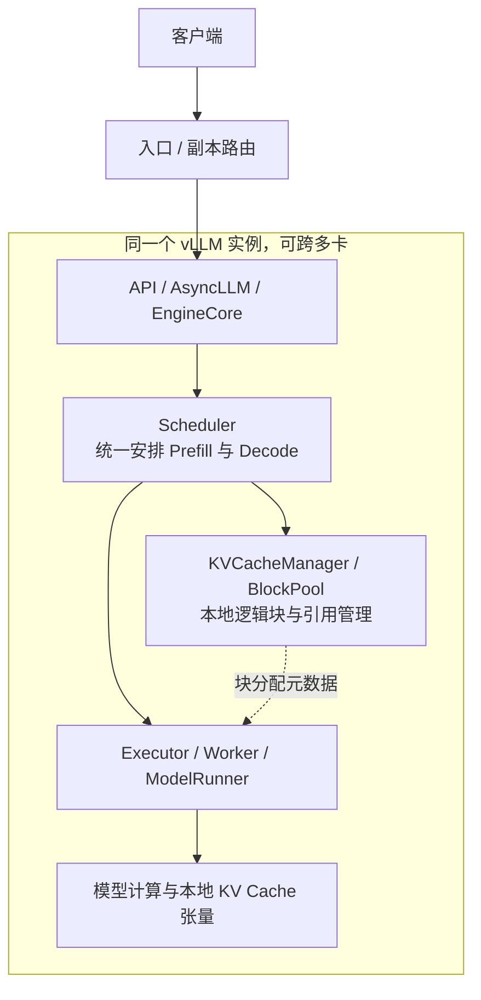
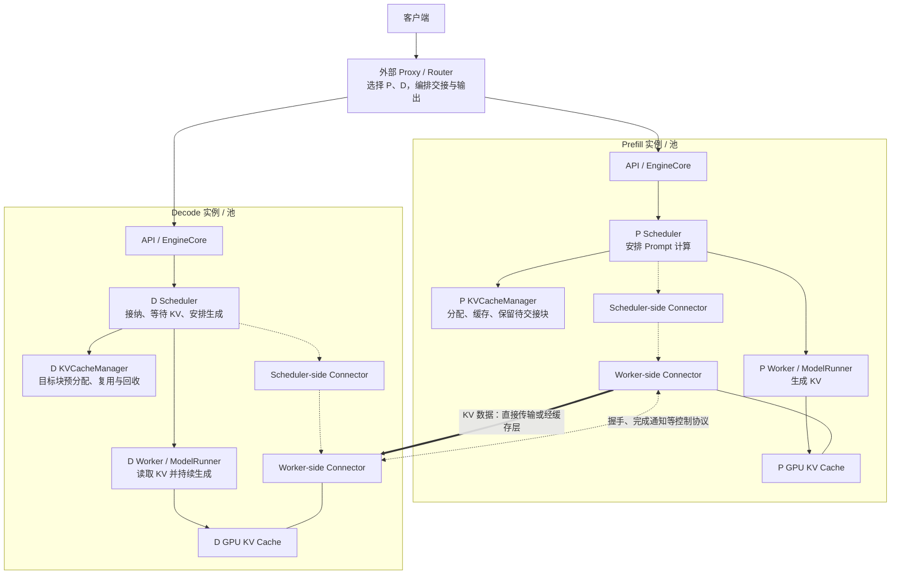
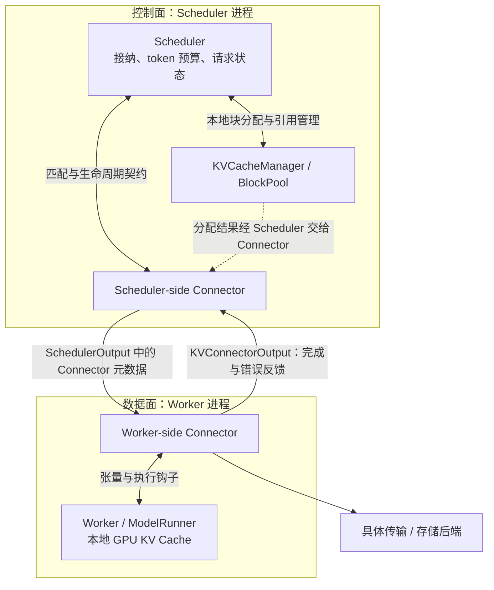
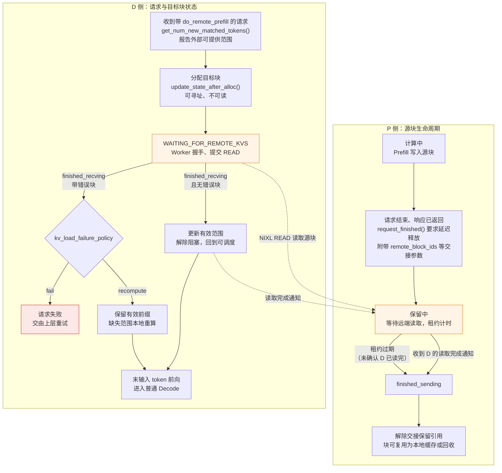
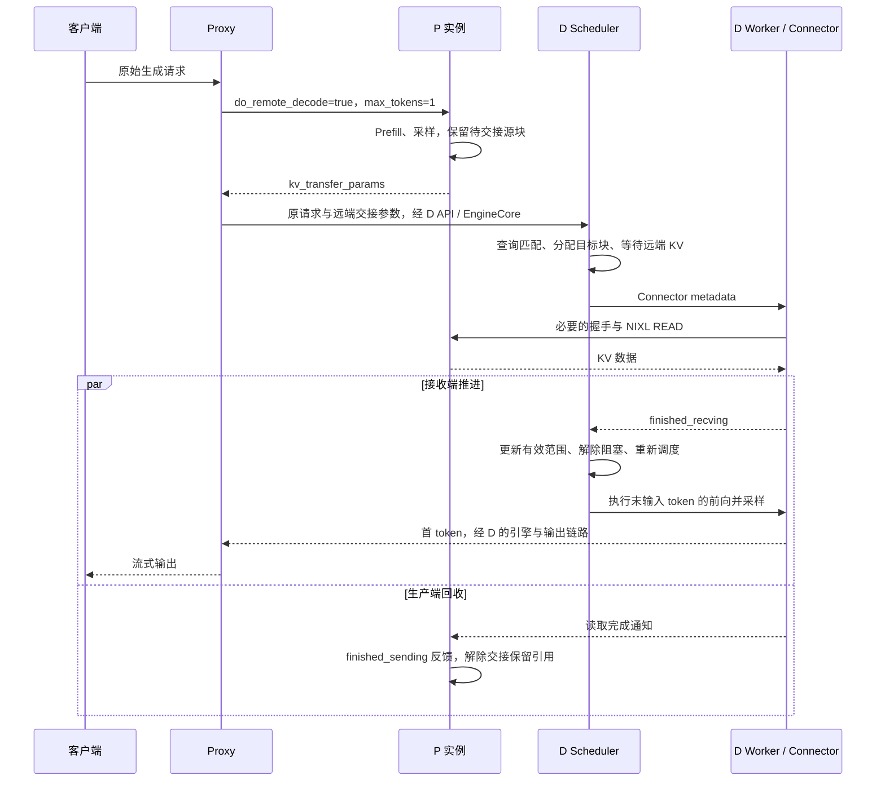
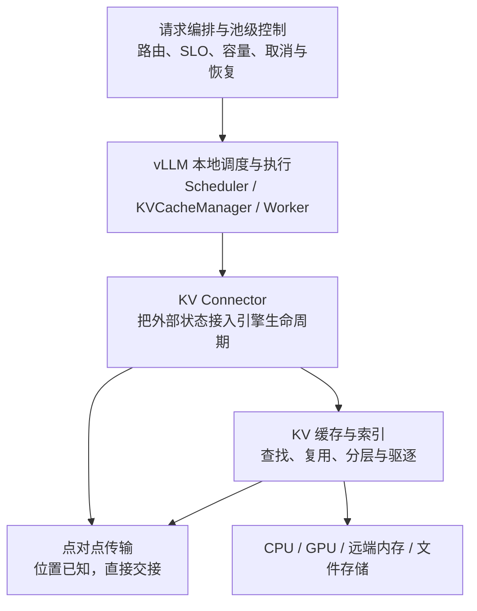

> **版本说明**：实现分析以 vLLM v0.27.1（tag `6e448d0`）为准，重点走读 **NIXL pull + 示例 Proxy** 的交接路径。通用架构、其他 Connector 的选择和系统设计建议会分别说明，不把一种实现视为 PD 分离的唯一路径。文中算例均为注明假设的理论估算，不是本地 GPU 或网络实测。

前面几篇已经解释了，一个推理实例如何通过 Scheduler、KV Cache Manager、Model Runner 与多卡执行器，把动态到来的请求组织成持续运行的 GPU 工作负载。

现在考虑一个常见冲突：一批用户正在逐 Token 接收回答，另一个用户提交了一份长文档。前者希望每一步生成稳定推进，后者希望尽快完成长 Prompt 的处理。两者都需要 GPU，却未必需要相同的 batch、并行策略和资源配比。

如果把 Prefill 和 Decode 放到不同实例，这个冲突似乎消失了。但随即出现新问题：**Prefill 产生的上下文状态怎么办？Decode 何时才能接管？如果 Decode 已经满了，Prefill 还该继续接收请求吗？**

这就是 Prefill/Decode Disaggregation，简称 **PD 分离**。它不是只把一个服务拆成两个服务，而是同时改变计算、调度和状态的边界。


## 一、总览：计算如何拆、状态如何交接、系统如何协同

### 1. 从共置到分离：先看架构发生了什么变化

**PD 共置（colocation）**是指：同一请求的 Prefill 和 Decode 由同一个推理实例接续执行，使用该实例的模型权重、KV Cache 和调度体系。实例可以是一张卡，也可以通过 TP / PP 跨多卡甚至跨节点；因此“共置”不等于“单机”，“分离”也不一定跨节点。



这里的“本地”指**实例负责的执行与存储资源**，不要求所有状态在同一个进程里。Scheduler 维护的 block 元数据与 Worker GPU 上的 KV 张量，本来就是不同层次的对象。

**PD 分离**将 Prefill 与 Decode 放到独立的实例或实例池里。两侧仍然是完整的推理运行时，但承担不同的主要工作：



图中的粗线表示 KV 数据从 P 流向 D，**不表示一定由 P 发起传输**：Pull 由 D 发起读取，Push 由 P 发起写入。实例池、缓存池和外部路由策略也不一定部署成图中一一对应的进程。

与共置相比，变化不是“多了一个 KV Transfer 模块”这么简单：

| 对象 | PD 共置 | PD 分离后的职责变化 |
|---|---|---|
| 外部入口与路由 | 为请求选择一个推理副本，通常在该副本完成生成 | 选择 P / D 组合，编排两阶段，关联请求身份、参数、超时和输出；还要考虑状态位置与交接成本 |
| EngineCore 与 Scheduler | 在同一个资源域里协调 Prefill、Decode、token budget、接纳和抢占 | 两侧独立调度；P 主要安排 Prompt 计算，D 需要把远端 KV 的匹配、预分配、等待与就绪纳入调度；两者不会自动合成一个全局 Scheduler |
| KVCacheManager / BlockPool | 管理本实例的块分配、前缀复用、引用与回收 | 两侧仍各管各的本地块；增加源块保留、目标块预留和远端到本地的映射，跨实例生命周期由 Connector 与上层协议协作 |
| Worker / ModelRunner | 在本实例 KV 上执行前向与采样 | 经 Connector 接入传输和完成反馈，在数据就绪后使用 KV；不能因为 Scheduler 已分配目标块就认为字节已经有效 |
| KV 张量与模型权重 | 同一模型副本完成两阶段，KV 不需在阶段切换时额外跨实例复制 | P、D 通常都要持有可执行模型的权重分片；交接期间 KV 可能同时占据两端空间，还可能需要中转与布局转换 |
| 容量与故障控制 | 主要围绕单实例容量、队列和副本扩展 | 联合观察 P、网络、D 三方能力，处理在途 KV、背压、传输失败和节点故障 |

这里有两个不能混淆的结论：

> **PD 分离不会自动把两个 KVCacheManager 变成一个分布式缓存管理器，也不会自动产生一个全局调度器。**

原来的本地管理器没有消失。新增的是跨实例交接契约，以及把本地状态变化连接起来的控制机制。共享 KV 索引、生产级路由和弹性控制可以由外围系统提供，但它们决定 PD 系统能否有效运行，仍然属于本章需要讨论的内容。

### 2. 三个设计问题与两种观察尺度

把 PD 分离中的概念直接排成“Router → Connector → NIXL → GPU”容易只记住调用关系。理解它需要先回答三个问题：

| 设计问题 | 核心矛盾 | 需要建立的判断 |
|---|---|---|
| **计算如何拆** | P、D 的工作负载与延迟目标不同，但共用资源和配置 | 共置干扰来自哪里？为什么 Chunked Prefill 之外还需要分离？拆开有什么代价？ |
| **状态如何交接** | 计算阶段可以拆开，上下文依赖不能切断 | 传什么、何时传、何时可用、何时释放？如何兼容不同布局？ |
| **系统如何协同** | 两个阶段分别高效，不代表端到端高效 | 如何路由、分配容量、传播背压、处理失败？ |

其中有两种观察尺度：

- **单请求尺度**：一份 KV 怎样被正确交接，一次生成怎样继续推进；
- **集群尺度**：大量请求同时流经两个池子时，排队、网络和显存怎样相互影响。

只看单请求，容易把 PD 分离理解成一次 RDMA；只看集群，又容易停留在“独立扩缩容”“缓存感知调度”的口号。本文会把两个尺度连接起来。

### 3. 本文的组织逻辑与章节安排

```text
二、计算如何拆
    为什么共置产生干扰？
    为什么 Chunked Prefill 之外还需要 PD 分离？
              ↓
三、状态如何交接
    一次请求的交接契约
    KV 数据量、布局、传输与流水
    vLLM 的 KV Transfer 抽象与职责边界
    Scheduler / Worker 如何落实契约，以及一次完整交接
              ↓
四、系统如何协同
    路由与 KV Affinity
    P/D 容量配比与背压
    失败与状态恢复
              ↓
五、综合判断
    不同架构与生态组件如何组合？
    在什么负载、网络和 SLO 下值得分离？
              ↓
六、本文小结
    回收三个问题、关键约束与源码阅读路径
```

贯穿全文的算例使用 **Llama-3-70B、BF16 KV、2048 token Prompt**。先按标准 GQA 的全模型逻辑 KV 计算，再说明 TP 分片和网络拓扑如何改变实际传输。除标明的源码事实外，容量模型和路由例子都是解释设计取舍的简化模型。


## 二、计算如何拆：从共置干扰到资源解耦

### 1. Prefill 与 Decode 的资源画像

对于常见的 decoder-only Transformer，Prefill 一次处理一段输入，多个 token 可以并行参与矩阵乘法；普通自回归 Decode 每轮为每条序列推进一个 token，直到满足停止条件。两者使用同一套模型，却有不同的算子形状和状态访问模式。

| 维度 | Prefill | Decode |
|---|---|---|
| 单次前向中的 token | 一段 Prompt 或其中一个 chunk | 通常每条序列一个 token；投机验证等路径例外 |
| 权重读取的摊销 | 多个输入 token 共用一次较大的矩阵运算，较易摊薄权重访问 | 主要依赖 batch 中的并发请求摊薄权重访问 |
| KV 行为 | 计算并写入输入 token 的 KV，使用需要的历史上下文 | 持续读取已有上下文并追加新 KV |
| 常见瓶颈 | 大 GEMM 的计算，长上下文 attention 也可能显著 | 权重 / KV 带宽、访存延迟、通信、launch 或 CPU 调度 |
| 主要延迟目标 | 尽快完成输入处理，改善 TTFT | 稳定推进每一步，控制 ITL / TPOT |
| 状态驻留 | 共置时通常会继续为后续 Decode 保留 | 状态随着生成增长，持续时间可能很长 |

“Prefill 是 compute-bound、Decode 是 memory-bound”是有用的起点，不是架构定律。Prefill 的 batch 太小未必能用满算力；大 batch Decode 可以形成更高效的 GEMM；MoE 可能受 expert 通信与负载不均影响；滑窗、MLA、量化又会改变 KV 流量。不能据此固定地给 P 配“计算卡”、给 D 配“便宜卡”。

真正应该测的是：**在指定模型、上下文分布和延迟目标下，两阶段分别需要什么资源组合。**

### 2. 共置为什么产生干扰，又有什么优势

**2.1 两种干扰：执行时间与状态容量**

一个长 Prompt 进入混合 batch 后，该步的执行时间可能显著增加。即使 Decode 请求只新增一个 token，也要等待这一步完成，表现为 ITL 尖峰。若完全优先 Decode，又可能让 Prefill 长时间拿不到 token budget，表现为 TTFT 增加。

第二类干扰不在算子时间线上，而在状态容量上：长生成请求持续占据 KV block，新请求即使有计算预算，也可能因分不到 block 无法接纳。**GPU 计算有空隙，不等于有足够的 KV 容量接入新请求。**

```text
长 Prompt 进入混合 batch → 本步执行变长 → 已有请求的 ITL 上升
长生成持续占用 KV       → 新请求难以分配 block → TTFT / 排队上升
```

P/D 分离移除的是两种负载在同一 GPU 资源域内的直接竞争。D 内部的长短上下文干扰、通信拥塞、抢占、共享网络竞争等仍然存在，因此不能说“分离后尾延迟被彻底消除”。

**2.2 共置不是等待被淘汰的低级方案**

共置也有很实在的优势：

- **权重和容量共享**：同一副本服务两阶段，不必分别为 P、D 配置可执行副本；
- **阶段切换无需跨实例搬 KV**：没有额外握手、网络传输和目标端分配等待；
- **资源池化**：流量从输入密集转向输出密集时，同一批 GPU 可以直接改变工作比例，不必等扩缩容；
- **批处理有优化空间**：调度器可以把不同请求的 Prefill / Decode 组合起来，利用合适的算子形状；
- **故障域和部署较简单**：请求不需要跨两个服务执行状态交接。

分离后，两侧通常各持有完整模型的相应分片，且在交接窗口内源、目标 KV 同时存在。固定总 GPU 数下，给 P 的卡就不能同时作为 D 的独立容量。若一侧长期空闲，这种资源切分会损失共置的池化收益。

因此分离的理由不是“共享一定低效”，而是：**当共享带来的干扰与配置耦合，超过共享节省的资源和协调成本时，独立资源域才可能更划算。**

### 3. Chunked Prefill 能解决什么、不能解决什么

Chunked Prefill 通过缩小一次调度中的 Prefill 工作量，让 Decode 有更频繁的执行机会。一个长 Prompt 不必在一步里算完，可以跨多轮推进。

在 vLLM 中，实际 chunk 大小受到 token budget、剩余输入、资源约束等共同影响；`long_prefill_token_threshold` 可作为额外上限，不能把所有 chunk 简化为固定等于这个值。

chunk 的选择体现一个真实矛盾：

- chunk 大：Prefill 更容易形成高效 GEMM，但一次执行对 Decode 的延迟影响更大；
- chunk 小：更容易限制每步干扰，却可能增加 Prefill 的步数与调度开销，损失矩阵运算效率。

把三种做法放到同一条时间轴上，可以看清它们各自把干扰放在了哪里（`[d]` 为一步 Decode，`c1..c4` 为长 Prompt 的四个 chunk，示意步长并不等长）：

```text
时间 →        步1   步2   步3   步4   步5   步6   步7   步8   步9   步10

共置（整段 Prefill 进入混合 batch）
  GPU         [d]   [d]   [d]   [# 长 Prompt Prefill ##][d]   [d]   [d]
  已有请求 ITL ·     ·     ·    |<---- 一次长尖峰 ---->| ·     ·     ·
  新请求 TTFT |<---- 排队 ---->|<----- 一步算完 ------>| 首 token

共置 + Chunked Prefill
  GPU         [d+c1][d+c2][d+c3][d+c4][d]   [d]   [d]
  已有请求 ITL ^     ^     ^     ^     每步都略变长，没有大尖峰
  新请求 TTFT |<--- 分 4 步才算完 --->| 首 token

PD 分离
  P 实例      [# 长 Prompt Prefill ##]--交接-->(源块保留至确认)
  D 实例      [d]   [d]   [d]   [d]   [d]   [d]   [d]   [d]   [d]   [d]
  已有请求 ITL ·     ·     ·     ·     ·     ·     只受 D 内部因素影响
  新请求 TTFT |<------ P 计算 ------>|<-交接->|<-就绪等待->| 首 token
```

整段共置把干扰集中成一次 ITL 尖峰；Chunked Prefill 把它摊成每步一点，但长 Prompt 的首 token 要等多步；分离让 D 的时间线不再被 Prompt 打断，代价是新请求的 TTFT 多出交接与 D 就绪等待两段。三条 TTFT 里哪一条最短，取决于 P 的排队、交接时间和 D 的拥塞程度，不能从图形上直接判定。

它解决的是**同一资源域内的时间切分**，并没有解除硬件、并行度和 KV 容量的共享。即使调出一个不错的 chunk size，P 和 D 仍然不能在同一副本中各自使用任意不同的 TP / PP 配置。

两种方案也不是非此即彼：PD 分离后的 P 实例仍可使用 Chunked Prefill 管理长短 Prompt、控制单步规模。区别是，此时主要在优化 P 池内部，而不是保护另一个资源池里的 Decode。

### 4. PD 分离获得了哪些配置与资源自由度

PD 分离允许分别配置：

| 自由度 | P 侧可能追求 | D 侧可能追求 | 新增约束 |
|---|---|---|---|
| Batch 与调度 | 较高输入吞吐、受控 TTFT、长短 Prompt 公平性 | 稳定 ITL、持续 batch、合适的并发 | 接纳速率与网络、D 容量必须匹配 |
| TP / PP | 满足 Prompt 计算时限的并行策略 | 满足逐 token 延迟和显存容量的策略 | KV 分片可能需要重组，不能只复制相同 block ID |
| 硬件与拓扑 | 符合该负载计算、HBM 与通信需求的设备 | 符合该负载带宽、容量与通信需求的设备 | 两侧布局兼容、传输路径和成本 |
| 实例数量 | 随输入需求变化扩缩 | 随生成需求与驻留量变化扩缩 | 不能让 P 的 KV 产出长期超过 D 的消费能力 |

例如 P 用 TP=8、D 用 TP=2，是一种值得评估的候选配置，不是默认最优解。P 可能缩短单次计算时间，也可能因通信增加而收益有限；D 的 TP 变小可能减少通信，也可能放不下权重与目标并发的 KV。后面讨论异构 TP，正是要说明这种自由度并非免费。

### 5. 如何理解吞吐、Goodput 与延迟目标

v0.27.1 的 `docs/features/disagg_prefill.md` 强调分别调节 TTFT / ITL、控制尾部 ITL，并提醒：

> Disaggregated prefill DOES NOT improve throughput.

这条提醒不能被扩大成“任何 PD 系统在任何负载下都不可能提高吞吐”。更合理的工程含义是：**不要把打开 PD 分离当成直接增加 token/s 的开关。** 分离没有自动减少模型计算，反而增加了传输与协调；整个系统的结果取决于配置、负载与评价口径。

至少要区分三个数：

1. **Raw throughput**：不考虑延迟是否达标，单位时间完成多少请求或 token；
2. **Goodput**：满足指定 SLO 的请求数除以观测时长；
3. **资源效率**：每张 GPU 或每单位成本获得多少 Goodput。

例如把本文的请求级 Goodput 写成：

$$
G = \frac{N_{\text{requests meeting all selected SLOs}}}{T_{\text{observation}}}
$$

一套配置可能总 token/s 较低，却在严格 TTFT 和 TPOT 门槛下完成更多有效请求；也可能只改善 ITL，却因额外排队而让 TTFT 失败。评价时必须同时报告吞吐、SLO 达标率与资源预算，而不是只选其中最漂亮的一项。

[DistServe（OSDI 2024）](https://arxiv.org/html/2401.09670v3)把两阶段资源分配、并行方式与带宽感知放置联合优化，研究的是 SLO 约束下的 per-GPU goodput。这说明容量规划属于 PD 原理本身，而不是可有可无的运维附录；论文的具体收益则不能直接当作当前 vLLM 配置的性能承诺。


## 三、状态如何交接：从请求契约到 KV Transfer

### 1. 一次请求的交接契约：传什么、何时可用、何时释放

**1.1 KV 是中间状态，但不是请求的全部状态**

对于标准自回归 attention，已计算前缀的 K/V 让后续 token 不必重新处理整个前缀。不过，D 仅收到一段字节，并不知道这段字节对应什么请求、哪些位置、哪一种布局。

一次可靠交接至少要定义：

| 契约 | 需要知道什么 | 不满足会发生什么 |
|---|---|---|
| 计算语义一致 | 模型与权重语义、token 序列、位置编码设置、相关 adapter / 多模态输入 | 字节可传输，但对应的上下文不正确 |
| 前缀范围明确 | 已计算到哪个位置，哪些 token 可复用，哪些还需计算 | 漏算、重复推进或使用不完整 KV |
| 存储表示可解释 | dtype、KV heads、层 / group、block 大小、布局及分片 | 数据写错位置或按错误格式读取 |
| 请求执行可接续 | 采样和停止参数、输出预算、必要的生成状态 | 输出行为与客户端请求不一致 |
| 生命周期安全 | 源块保留到什么时候，目标何时可读，谁确认回收 | 源块被覆盖、目标读取半成品或块泄漏 |

这些是**语义要求**，不是要求每个字段都随每次请求发送。模型配置可以在部署或握手时校验，内存描述符可以连接级缓存，请求只传本次 block 与 token 范围。但部署者不能把一个 compatibility hash 当成权重字节、adapter 和所有输入语义都一致的完整证明。

对于包含 Mamba 等状态空间层的混合模型，还要交接对应的内部状态，不能只套用普通 K/V 前缀数组的心智模型。本文的容量算例限定为标准 GQA；具体 Connector 是否支持某种状态组合，必须按版本与兼容性条件核实。

**1.2 本地 block ID 不具有全局含义**

P 的 block 17 和 D 的 block 17 只是各自池里的编号，不代表同一份内容。真正需要建立的是：

```text
请求的逻辑前缀范围
    → P 上的源 layer / group、rank、block 与字节片段
    → D 已分配的目标 layer / group、rank、block 与字节片段
```

所以 D 的典型流程是**先分配目标块、建立传输映射，再接收数据**，而不是等一块远端显存“搬过来”以后才分配。`KVCacheManager` 负责本地容量与引用；Connector 根据这些分配结果组织跨端映射与数据操作。

**1.3 四条必须保持的约束**

- **可寻址不等于可读**：目标 block 已经分配，不代表 KV 已经写完。
- **计算结束不等于可回收**：P 的 HTTP 响应已返回，D 可能仍在读源块。
- **网络提交不等于传输完成**：异步提交成功后，还要等完成与必要的设备同步。
- **块释放不等于远端引用失效已被处理**：取消、超时和重试必须与传输生命周期协调。

把一次交接放到 P 实例、KV 传输、D 实例三条并行时间线上，这四条约束对应的就是各时间线上“状态已变、资源未变”的错位（以后文走读的 NIXL pull 为例，时刻只表示先后，不表示等长）：

```text
时刻  P 实例（源块）          KV 传输               D 实例（请求 / 目标块）
----  ----------------------  --------------------  ------------------------
t0    Prefill 计算，写入源块                        （请求尚未到达）
t1    请求结束，响应返回参数                        Proxy 转发原请求与参数
      源块进入延迟释放（保留）
t2    保留中 ┐                握手，交换描述符      查外部匹配，分配目标块
             │                                      → WAITING_FOR_REMOTE_KVS
t3    保留中 │                READ 提交 → 在途      等待：块可寻址、不可读
t4    保留中 │                完成 + 设备同步       finished_recving
             │                                      → 解除阻塞，重新调度
t5    保留中 │                读取完成通知 → P      末输入 token 前向，首 token
t6    finished_sending ┘                            持续 Decode，KV 继续增长
      解除交接保留引用

Decode 最早在 t5 开始；P 的源块到 t6 才释放：两侧同时占着这份 KV。
```

P 在 t1 就已经“做完了”，源块却要一直保留到 t6；D 在 t2 就拿到了目标块，却要到 t4 才能读、t5 才能算。t2～t6 这段时间内，同一份 KV 同时占用 P 与 D 的显存，这就是后文容量模型里“待交接 KV”与“接收预留”两项的来源。

这几条约束解释了为什么普通的“调用 P，然后调用 D”还不够。RPC 编排连接的是服务调用，Connector 还要连接显存状态的有效期。

**1.4 首 token 由谁产生、谁返回**

设输入为 $$x_1,\ldots,x_N$$。P 完成 Prefill 后，最后位置的 logits 已可用于采样第一个输出 $$y_1$$。因此架构上有不同选择：

- P 采样并返回 $$y_1$$，再将 prompt KV 和接续信息交给 D；D 处理 $$y_1$$ 后生成 $$y_2$$。
- P 只向编排层交付 KV 等信息，D 自己产出客户端看到的 $$y_1$$。若没有传 logits / 最后隐藏状态，D 可重算末尾输入 $$x_N$$ 得到所需 logits。

本文走读的 NIXL toy proxy 属于后者：P 请求设 `max_tokens=1`，但该输出 token 不作为客户端答案接续转发；D 收到原输入和交接元数据后重新开始客户端侧生成。**D 重算的是最后一个输入 token 的前向，不是把 P 采样的输出 token 当作原输入追加进去。**

这是示例协议的选择，不是所有 PD 系统都必须丢弃 P 的首 token。若改成 P 先流式返回，KV 传输可能不再计入 TTFT，却可能暴露为第一个与第二个输出之间的长间隔；不能仅靠提前返回一个 token 就声称完整延迟问题已解决。

### 2. 交接方式：Pull、Push 与经缓存池交接

| 方式 | 基本流程 | 优点 | 主要成本与约束 |
|---|---|---|---|
| **Pull** | D 分配目标空间，获得 P 的位置描述，再发起读取 | 接收方控制接纳与目标地址，容易与本地容量管理衔接 | 源块需保留；读取前的请求编排和握手可能进入关键路径 |
| **Push** | D 提前准备目标地址并告知 P，P 在数据就绪后写入 | 有机会提前准备交接、减少等待；可结合具体实现做流水 | 目标预留、双方会合、取消与写入时序更复杂 |
| **经缓存层交接** | P 将 KV 放入可查找的缓存 / 存储，D 查找并加载 | 生产与消费解耦，便于跨请求、跨实例复用 | 索引、命中、驱逐与额外数据路径；缓存未必持久可靠 |

Pull / Push 首先描述**谁发起数据操作**，不等于谁先做 HTTP 请求，也不自动决定是否逐层流水。通过缓存层交接也不一定是整份数据写盘后再读，缓存可以位于 GPU、CPU 或远端内存。

v0.27.1 的 `NixlConnector` 是 `NixlPullConnector` 的兼容别名；同目录也提供 `NixlPushConnector`。这证明 vLLM 的交接抽象并不绑定一种数据方向，但两端必须配置兼容的协议，不能把两种模式任意混用。

### 3. 传输代价：KV 数据量、布局与异构 TP 映射

**3.1 先算逻辑 KV，再算实际流量**

对各层 KV head 配置相同、K/V head 维度相同的标准 attention，每个 token 的逻辑 KV 字节数为：

$$
B_{\text{token}} = L \times 2 \times H_{kv} \times d_{head} \times b
$$

Llama-3-70B 使用 80 层、8 个 KV heads、128 维 head，BF16 每元素 2 字节：

$$
B_{\text{token}} = 80 \times 2 \times 8 \times 128 \times 2
=327{,}680\ \mathrm{B}=320\ \mathrm{KiB}
$$

2048 个输入 token 对应：

$$
S_{\text{logical}}=2048\times320\ \mathrm{KiB}=640\ \mathrm{MiB}
$$

这是**全模型去除并行复制后的逻辑量**，不是每个 rank 都发送 640 MiB。若按 KV heads 均匀切为 TP=8，且没有额外复制，每个 P rank 持有 80 MiB。

实际网络量还要考虑：D 本地已有的前缀、block 对齐、滑窗或其他状态裁剪、并行复制、源 rank 去重、量化 scale 与布局元数据、是否经过中转层。不能简单地把“源 Prefix Cache 命中率”乘进网络节省：P 命中避免的是重新计算，D 若没有这些 KV，仍可能需要传输。

例如 2048 token Prompt 中，D 已持有可复用的 1536 token 对齐前缀，协议若支持只传缺失后缀，那么剩下 512 token 的逻辑传输量是 160 MiB。但若只有 P 命中了这 1536 token，D 仍为空，传输量不会因此自动降到 160 MiB。

**3.2 TP=8 到 TP=2：并行自由度需要布局重组**

仍用 8 个 KV heads 的例子：

```text
P，TP=8：rank 0: h0   rank 1: h1   ...   rank 7: h7

D，TP=2：rank 0 需要 h0,h1,h2,h3 ← 从 P 的 rank 0~3 各读一段
         rank 1 需要 h4,h5,h6,h7 ← 从 P 的 rank 4~7 各读一段
```

D 的目标块必须按它自己的 attention backend 所需布局写入。反向的 P TP=2、D TP=8，则是多个 D rank 各自读取某个 P rank 中不同的 head 片段。

`vllm/distributed/kv_transfer/kv_connector/v1/nixl/tp_mapping.py` 的 `compute_tp_mapping()` 负责建立这类源 rank 和 head 片段关系。它还处理两个重要情况：

- **GQA 复制**：P 的 TP 大于 KV heads 数时，部分 rank 可能持有相同 KV head，读取时可去掉重复源；
- **MLA 复制**：所分析实现的 MLA latent cache 在 TP rank 间复制，映射可选择一个源，而不是按普通 attention 的 head 切分去拼接。

这不是说任意模型、任意 TP 比例、任意 backend 都能互传。TP 映射、block 大小、状态类型、布局转换等必须共同满足 Connector 的兼容性约束。**资源配置可以独立，并不意味着状态表示可以不兼容。**

### 4. 传输优化：拓扑、粒度与计算通信重叠

**4.1 带宽下界必须对应真实共享链路**

在没有排队、没有重叠的简化情形下：

$$
T_{\text{handoff}} \approx T_{\text{control}}+T_{\text{alloc}}
+T_{\text{layout}}+\frac{S_{\text{xfer}}}{B_{\text{effective}}}
+T_{\text{completion}}
$$

其中网络排队可计入控制 / 传输等待，实际测量时应单独拆出。这个式子不是保证所有项严格串行，而是提醒：**一次请求的交接不只有网卡搬字节。**

把 640 MiB 都通过一条共享的 400 Gb/s 链路，忽略协议开销，线速换算为 50 GB/s：

$$
T_{\min}=\frac{640\times2^{20}}{50\times10^9}
\approx13.42\ \mathrm{ms}
$$

若八个源 rank 各有独立 400 Gb/s 通路，接收端也有相应聚合能力，每路仅承载 80 MiB，则理想并行下界约 1.68 ms。反之，八个 rank 共享一张 NIC，不能把 13.42 ms 再除以八。P TP=8、D TP=2 时，接收侧只有多少 NIC、是否共享 PCIe 上行，也可能成为最终瓶颈。

所以比较 NVLink、InfiniBand、RoCE 或 TCP 时，要先画出 **GPU → 本地互联 / PCIe → NIC → 网络 → NIC → GPU** 的共享关系，再给出有效带宽。GPUDirect RDMA 可以减少 CPU 中转，但是否实际使用、能达到多少带宽，取决于设备、驱动、注册方式和拓扑。NIXL 提供传输抽象，不代表所有后端都在做 RDMA。

RDMA / GPUDirect 常是高负载部署的重要条件，却不是 PD 原理成立的必要条件。KV 很小、命中很多、延迟目标宽松，或者共置干扰很大时，较慢链路也可能有价值。结论应来自该工作负载的临界点，而不是一个“必须高速网”的口号。

**4.2 传输粒度也是优化变量**

分页解决显存分配问题，却可能把一次请求分散为许多 layer / head / block 片段。传输不是只看总字节数：描述符准备、注册、提交与完成跟踪都有开销。

- 粒度太小：片段很多，提交与元数据成本上升；
- 粒度太大：合并等待增加，可能失去早发机会，还可能搬运不需要的字节；
- 为连续传输做 pack/unpack：减少网络片段，但增加 GPU / HBM 读写；
- 跨层连续布局：减少描述符，却影响缓存布局和 backend 兼容性。

v0.27.1 的 NIXL usage 文档提供 `enable_cross_layers_blocks` 的可选路径，在支持的 backend 上让逻辑 block 跨层连续，以减少传输 buffer 数。它与“逐层 KV 一产出就发送”追求的方向并不完全相同：前者偏向合并，后者偏向提早启动，应该按瓶颈选择。

**4.3 三种重叠，改善的指标不同**

| 重叠方式 | 时间线上发生什么 | 主要改善什么 | 必要条件 |
|---|---|---|---|
| **跨请求重叠** | A 的 KV 在传，D 同时执行 B、C | D 不因 A 等待而空闲，改善资源利用率 | 有其他可运行请求；传输不能严重争用其 HBM / 互联 |
| **P 侧发送流水** | 前面层 / 块的 KV 开始发送，P 继续计算后续部分 | 减少 Prefill 结束后仍未传完的尾部 | 目标或缓存可提前确定、数据已经稳定、Connector 支持相应粒度 |
| **D 侧接收流水** | 所需层的 KV 到达后，D 计算这一层，其余层仍在传 | 可能缩短单请求暴露的接收等待 | 当前 token / 中间激活已就绪，逐层依赖、同步和 backend 支持 |

用一个简化时间线区分第一种与后两种：

```text
跨请求：A 的 KV [-----------传输-----------]
        D 的 GPU [B decode][C decode][B decode] → A 就绪后才可运行
        GPU 没有空等，但 A 仍承担自己的交接延迟。

同请求：P [算 L0][算 L1][算 L2]
        传输     [发 L0][发 L1][发 L2]
        若协议允许提前发送，可减少 P 全部算完后剩余的传输尾部。
```

D 侧逐层接收流水还受到首 token 协议的约束：如果 D 要处理的 token 必须等 P 全模型结束后才知道，就不能只因 L0 的 KV 已到便立刻计算。将“某层 KV 可读”误当作“该层所有计算输入已齐”，会画出不可能执行的流水图。

本文分析的 **NIXL pull 异步接收路径以请求为单位等待远端 KV 就绪，再使该请求可调度**，典型收益是跨请求重叠。vLLM 的 `wait_for_layer_load()` / `save_kv_layer()` 留出了其他实现的逐层协作接口，但 v0.27.1 的 NIXL pull/push 共用这两个方法的空实现，`OffloadingConnector` 中相应方法也为空。LMCache 等实现要进一步看 adapter 与配置，不能由接口存在推断功能启用。

### 5. vLLM 中的 KV Transfer 抽象

**5.1 总览：三层功能抽象**

前面讨论了 KV 传输的条件与代价。要把这些能力接入推理引擎，可以先按职责把 KV Transfer 理解为**三层功能抽象**：

```text
Serving 语义层
    请求是否需要外部 KV？何时可以执行？何时可以回收？
    ↓
KV 索引与缓存层
    哪些 KV 已经存在？放在哪里？能复用多少？是否仍有效？
    ↓
数据传输与存储层
    对应的字节如何搬运、保存，并在目标端变得可用？
```

从上往下，是从**请求语义**到**内容与位置**，再到**实际数据操作**。下层把可用范围、完成或失败的结果反馈给上层，上层据此推进请求。后面的 5.2～5.4 就按图中的顺序，逐层解释这三个问题。

这里画的是职责的分层关系，不是规定每次传输必须经过三个独立模块：显式地址交接可以不查全局缓存目录，一个实现也可能同时覆盖多层。但无论采用哪种实现，都应分清“请求能否运行”“内容是否存在”和“字节是否已到达”这三件事。

为什么要这样分层，而不是让 Scheduler 直接调用 NIXL？如果直接调用，Scheduler 除了决定谁运行、分配多少 token，还要了解远端地址、内存注册、传输句柄和完成轮询。换成共享文件或分布式缓存后，调度器又要增加另一套分支；Worker 还需要以同样方式识别这些分支。最终改变一个传输后端，会同时影响调度、执行和资源回收。

反过来，只抽象成通用的 `send` / `recv` 也不够。传输库知道某段字节是否搬完，却不知道这些字节覆盖多少输入 token、对应哪些本地 block、请求是否可以继续调度、结束后是否仍需保留源块。

三层分工中，Serving 语义层通过 KV Connector 起到衔接引擎与外部实现的作用：

> **向上，把外部状态表达成引擎能理解的“匹配范围、加载状态与生命周期”；向下，把这些要求交给具体的查找、缓存、传输和存储实现。**

因此它不是简单包装一个网络 API，而是把**请求与 KV 的语义**连接到**外部状态的获取和保存机制**。上层不需要理解每种后端的传输协议，但仍需要知道异步就绪、失败和能力限制，抽象并不意味着把差异全部藏起来。

**5.2 第一层：Serving 语义层——KV Connector**

vLLM 用 `KVConnectorBase_V1` 定义这组契约。对于引擎来说，关键问题是：

- 当前请求在本地已匹配的前缀之外，还有多少 token 的状态可以从外部取得？
- 这些状态是否需要异步加载，是否应先分配目标块并阻塞该请求？
- 哪些加载已经终结，哪些范围有效，哪些需要失败处理或重算？
- 哪些本地状态需要保存，计算结束后对应块能否立即释放？

这里关注的是**Serving 行为**，而不是 TCP、RDMA 或文件读写。相同的调度入口可以面对“从 P 实例拉取 KV”“从 CPU 缓存恢复前缀”“从共享存储加载已有状态”等不同实现，因为它们对引擎都有相似的语义：减少本地重复计算，但在状态真正可用之前不能直接执行。

这个相似性不表示它们完全等价。直接交接可能要求源块保留到消费完成，普通缓存保存可能允许丢弃；同步加载与异步加载对调度的影响也不同。Connector 的责任是通过契约、元数据和能力约束表达这些差异，而不是保证所有后端具有相同的功能和性能。

**5.3 第二层：KV 索引与缓存层——哪些内容存在、可以复用多少**

在通用缓存场景中，外部状态系统需要把内容身份映射到存储位置：

```text
前缀内容及其语义标识
    → 已存在的 KV 范围
    → 所在节点 / 存储层 / 对象或 block
    → 有效性、保留状态与加载方式
```

这层关注查找、前缀匹配、插入、驱逐和有效期。它回答的不是“网络通不通”，而是“要找的内容是否真的存在、是否仍可复用”。模型或 adapter 不兼容、前缀 token 不一致、对象已被淘汰，即使传输库能连接到远端，也不能形成有效命中。

但**索引与缓存职责不一定是一个独立的目录服务，更不是所有 PD 交接的必经模块**。NIXL pull 示例由 Proxy 携带 P 的显式位置和 block 信息，不需要先查询一个全局前缀目录；LMCache 等缓存实现则需要更丰富的查找与管理。两者都要确定“从哪里获得有效状态”，但获得答案的方式不同。

本地 Prefix Cache、远端缓存目录和 Connector 的外部匹配接口也不是同一张表。Connector 负责把所选实现的查找结果转换为引擎可使用的匹配范围，不会自动把所有实例的本地缓存统一起来。

**5.4 第三层：数据传输与存储层——把内容变成目标端可用的字节**

确定内容与位置后，底层机制负责实际的数据操作：内存注册、描述符构造、设备或主机中转、读取与写入、传输完成及所需同步。实现可以是 GPU 间直接移动，也可以经过 CPU、远端内存或文件存储。

这一层通常理解地址、长度、设备和传输句柄，但不负责决定一个生成请求下一轮应该计算几个 token。Connector 必须把“这次数据操作完成或失败”重新关联到请求、block 和可用前缀，反馈给引擎。

从功能上，可以总结为：

| 职责层次 | 主要问题 | 不应混入的职责 |
|---|---|---|
| **Serving 语义层** | 外部状态如何影响请求匹配、等待、执行与回收 | 不把某种 RDMA 或文件协议写进通用调度逻辑 |
| **KV 索引与缓存层** | 哪些内容存在、位于何处、能复用多少、何时失效 | 不把位置命中直接视为目标端数据已经就绪 |
| **数据传输与存储层** | 字节如何搬运、保存与完成同步 | 不把传输成功直接等同于请求执行完成 |

**这三类职责是功能划分，不代表三个固定的类、进程或必经调用步骤。** 一个 Connector 可以直接调用传输库，也可以通过缓存系统间接访问多个存储后端；一个项目也可能同时覆盖其中多层。第五部分再用这套划分对照具体生态组件。

至此，三层分别回答了**请求如何使用外部状态、内容如何定位与管理、字节如何搬运与保存**。接下来换到实现视角，看这些职责在 vLLM 中由谁承担，以及它们如何通过接口与状态变化协作。

### 6. 抽象如何落地：Scheduler 与 Worker 的交接流程

本节以 NIXL pull 为例，先说明 v0.27.1 的实现组织与组件边界，再沿着“匹配与分配 → 传输 → 完成反馈 → 回收”展开。第 7 小节最后把这些机制串成一次完整请求的时序。

**6.1 实现组织：两侧 Connector 与两类角色**

上一节的**三层功能抽象**回答“需要解决什么问题”；Scheduler 侧与 Worker 侧则回答“引擎内由谁执行”。两者不是同一级划分，也没有一一对应关系：同一个 KV Connector 契约可以在 Scheduler 侧参与匹配与生命周期决策，在 Worker 侧接入加载与完成反馈；外部缓存和传输服务还可以运行在引擎之外。

实现中还要区分两类“角色”：`KVTransferConfig.kv_role` 描述实例的生产 / 消费角色，`KVConnectorRole` 描述 Connector 对象所处的进程侧。

| 名称 | 含义 |
|---|---|
| `kv_producer` / `kv_consumer` | 交接中的生产者与消费者角色；NIXL 示例分别用于 P、D |
| `kv_both` | 配置类型允许的双角色值，但 v0.27.1 NIXL 对其提示弃用，不应作为新示例默认选择 |
| `KVConnectorRole.SCHEDULER` | Scheduler 进程里的 Connector，参与匹配、分配后记录、元数据生成与完成处理 |
| `KVConnectorRole.WORKER` | Worker 里的 Connector，接入张量、传输、同步与结果反馈 |

**P、D 实例都需要 Scheduler-side 与 Worker-side Connector，不是 P 只管控制面、D 只管数据面。** 两侧 Connector 的协作关系如下：



Scheduler 侧持有请求和本地块分配决策，Worker 侧能访问实际 KV 张量；两侧通过元数据与执行结果形成闭环。图中的返回箭头表示信息回到 Scheduler 侧的逻辑关系，实际经由引擎的执行结果链路，并不是两个 Connector 必须直接互发 RPC。具体实现也可以另有后台线程或侧通道。

配置示意如下，分别加入两侧服务启动参数；模型、GPU 分配、网络可达地址、依赖与端口需按部署另行配置，这不是一份完整启动脚本：

```text
P: --kv-transfer-config '{"kv_connector":"NixlConnector","kv_role":"kv_producer"}'
D: --kv-transfer-config '{"kv_connector":"NixlConnector","kv_role":"kv_consumer","kv_load_failure_policy":"fail"}'
```

**6.2 职责边界：Connector、KVCacheManager 与 Router**

明确执行位置后，还要说明谁拥有哪一类决策，避免把 Connector 理解成新的全局调度或显存管理器：

| 组件 | 负责什么 | 不替代什么 |
|---|---|---|
| 外部 Router | 跨实例请求编排、P / D 选择与池级接纳策略，提供必要的交接信息 | 不直接替 D 分配物理 block，不代替实例的最终容量检查 |
| Scheduler | 本实例的请求状态、token 预算与接纳，结合外部加载结果决定何时可执行 | 不直接承担 GPU KV 的数据搬运 |
| KVCacheManager / BlockPool | 本地块的分配、复用、引用与回收 | 不自动提供远端内容发现或全局 KV 目录 |
| KV Connector | 把外部状态的匹配、取得、保存与交接生命周期接入本地引擎 | 不绕过本地块管理另造全局显存分配器，也不接管池级路由 |

Connector 报告有远端命中，并不代表 D 的本地容量一定足够；Router 已选择某个 D，也不代表它立即获得执行预算。这些局部约束仍由本地 Scheduler 与 KV 管理器检查。下面沿实际交接流程说明它们如何配合。

**6.3 外部匹配与本地块预分配**

`KVConnectorBase_V1` 的 Scheduler 侧契约中，几个关键入口是：

| 方法 | 它维护的交接要求 |
|---|---|
| `get_num_new_matched_tokens()` | 查询本地已匹配范围之外，外部能提供多少 token，以及是否异步加载；未知时可返回 `None` 让调度器稍后再查 |
| `update_state_after_alloc()` | 在本地 block 分配后，把目标块与外部 KV 的加载需求关联起来 |
| `build_connector_meta()` | 生成本轮发送给 Worker 的 Connector 元数据 |
| `update_connector_output()` | 消化 Worker 回传的完成、状态等信息 |
| `request_finished()` / 多 group 版本 | 请求结束时判断是否仍需保留块，以及是否返回交接参数 |

NIXL pull 在 D 侧识别 `request.kv_transfer_params` 中的 `do_remote_prefill`，计算外部前缀可覆盖的 token 数，并返回异步加载标志。Scheduler 先检查本地前缀，再考虑外部可用范围，调用本地 KV 管理器为接收预留目标块。

因此，远端命中类似**“匹配范围已知、数据尚未就绪的缓存命中”**。这只是调度视角的类比：外部交接不一定通过全局 prefix hash 查找，不能据此认为系统已有分布式 Prefix Cache。

`Scheduler.schedule()` 在异步加载分支设置：

```python
request.status = RequestStatus.WAITING_FOR_REMOTE_KVS
step_skipped_waiting.prepend_request(request)
```

请求没有像普通 waiting 请求那样直接变成可执行的 running 请求。虽然内部可提前记录预期的 `num_computed_tokens`，在接收结束前必须阻止它进入普通模型计算；“记录已计算数量”在这里不是“所有字节已在本地”的证明。

```text
外部前缀匹配
    → 本地目标块分配
    → 生成传输元数据
    → WAITING_FOR_REMOTE_KVS
    → Worker 报告接收完成
    → 校验有效范围、恢复可调度状态
    → Scheduler 再决定何时执行
```

接收完成也不等于立刻执行：它只是解除阻塞，之后仍受本地 token budget、并发和其他调度条件约束。

**6.4 HTTP 元数据、Worker 控制协议与 KV 数据传输**

NIXL toy proxy 发给 P 的准备请求带 `do_remote_decode=True` 并限制生成一个 token。P 完成后，响应中包含的 `kv_transfer_params` 描述其引擎、请求、block 与 side-channel 地址，Proxy 再把它附到 D 的原请求上。

但这份字典不是“全部协议”。具体交接包含以下三类通信，它们描述的是协议组成，不是上一节的三层功能抽象：

1. **HTTP 请求编排元数据**：告诉 D 去哪个 P、找哪个请求的 block；
2. **Worker 控制协议**：握手、交换传输描述符与布局信息、通知、租约与心跳；
3. **KV 数据操作**：根据描述符发起 NIXL READ/WRITE，底层后端负责实际传输。

`nixl/base_worker.py` 中的握手工作可在后台进行。`NixlHandshakePayload` 携带 compatibility hash；`metadata.py` 中的 `compute_nixl_compatibility_hash()` 使用版本、模型配置、KV dtype、backend 等因素。**TP 大小、block size 与 KV layout 并不都进入该哈希**，它们留给运行时校验与支持的转换路径，以允许部分异构部署。

Worker 还要在初始化时注册相应 KV 张量或传输缓冲区，并根据 layer / group、rank 和 block 组织描述符。不能把所有模型的 KV 都假设成一个简单连续张量；cross-layer 布局、分层张量和 host 中转的实现路径不同。

`nixl/pull_worker.py` 使用 `make_prepped_xfer("READ", ...)` 建立读取，再通过 `transfer(handle)` 提交。提交后需要跟踪完成，不能把函数返回当成 D 可安全运行的信号。

**6.5 完成反馈与恢复调度**

`vllm/v1/worker/kv_connector_model_runner_mixin.py` 负责把 Connector 生命周期接到执行流程，包括绑定 `SchedulerOutput.kv_connector_metadata`、启动加载、收集完成结果、清理本轮元数据等。即使没有正常的模型 forward 工作，也有专门的 no-forward 路径推进 Connector，避免“所有请求都在等 KV、因为没 forward 所以永远没人启动传输”的死锁。

Worker 通过 `get_finished()` 等入口提供完成信息，放入 `KVConnectorOutput`，随执行结果回到 Scheduler：

- `finished_recving`：相应请求的接收处理已终结，可能成功，也可能失败，D 侧必须结合加载错误反馈判断；
- `finished_sending`：生产侧可推进之前延迟的块释放；
- 加载错误块：用于失败处理或缩短可复用的有效前缀。

这些字段表达的是 Connector 对上层提供的生命周期语义，不是同一种成功凭证。正常 READ 完成后，P 需要收到远端不再依赖源块的通知；但在本版本的 NIXL 中，**租约过期也会进入 `finished_sending`**，不能把这个集合里的每个请求都解释为远端已成功且安全地读完。

Scheduler 的 `_try_promote_blocked_waiting_request()` 检查接收完成集合，调用 `_update_waiting_for_remote_kv()`。成功路径可将有效块登记为本地缓存；只有配置启用相应缓存机制时，后续请求才能通过该缓存复用。

对于完整 prompt 命中，源码有这个处理：

```python
if request.num_computed_tokens == request.num_tokens:
    request.num_computed_tokens = request.num_tokens - 1
```

它让 D 为最后一个输入位置再执行一次前向，得到采样所需 logits。对标准 attention，可以加载整段 prompt KV 后重算末位置；Mamba 等递推状态不能简单从 $$h_N$$ 倒退成 $$h_{N-1}$$，NIXL 对这类模型有末 token 截断与交接范围的专门处理。因此“满命中后退一格”不能被理解成所有状态格式都能任意回退。

**6.6 P 侧源块的保留与释放**

`request_finished()` 的返回值允许 Connector 告诉 Scheduler：请求已结束，但块还不能立即释放。NIXL pull 对需要交接的源块执行这种延迟回收，并返回 `remote_block_ids`、`remote_engine_id`、`remote_request_id`、`remote_host`、`remote_port`、`tp_size` 等交接参数。

D 成功读取后向 P 发送完成通知；P 侧完成反馈最终让 Scheduler 释放相应引用。这里的释放是**交接保留引用的解除**，块若仍被其他请求引用，或者成为本地可复用缓存，不等于显存立即被擦除。

租约与心跳约束“等多久”：P 不能因为 D 消失而无限保留，D 还在处理时也需要避免源块过早过期。v0.27.1 的 NIXL 会在租约到期时上报回收；这个分支本身不等待远端取消确认，过期之后才收到的读取通知可能触发“读到了无效 KV”的错误日志。因此，**不能声称该租约机制已经提供了完整的远端读取撤销或隔离保证**。

从生产系统的契约看，回收仍应与在途操作安全结束、超时和错误反馈协调。合理的租约与续期预算可以降低过期风险，但不能把“等得足够久”当作数据正确性的形式保证；需要结合具体后端与异常路径验证。这是设计目标与当前实现边界必须分开说明的地方。

把 6.3～6.6 的状态变化合起来看，P 侧的源块和 D 侧的请求各走一条独立的状态机，只在“D 读源块”和“D 通知读完”两个点上耦合；两条链上各有一个分叉，分别对应租约过期和加载失败：



图中两个分叉的含义不同：D 侧的 `fail` / `recompute` 是显式配置的失败策略，请求最终要么失败要么在本地补算；P 侧的租约过期只是把源块放回可回收状态，它**不区分** D 是否已经读完，因此过期后到达的读取就可能撞上无效 KV。两条状态机之间没有第三条“全局事务”把它们绑在一起，这正是前面强调回收要与在途操作、超时和错误反馈协调的原因。

### 7. 串起来：一次 NIXL pull 请求的完整时序

以下限定为**成功交接路径**：标准 attention、D 无可复用本地前缀、使用所述 toy proxy，P 的输出 token 不直接返回客户端。图中完成通知与 D 的后续执行可以并行推进，不要求 P 等到客户端收到首 token 才释放；失败反馈与恢复在第四部分展开。



两侧是两个独立引擎中的请求对象，通过元数据关联，并不是把同一个 Python `Request` 对象从 P 搬到了 D。对客户端而言是一条生成流；对系统而言是一次跨实例执行状态接续。

在这个协议下，TTFT 的简化分解是：

$$
TTFT_{PD}\approx T_{\text{front}}+Q_P+T_P
+T_{\text{handoff}}+Q_{D,\text{ready}}+T_{D,\text{first}}+T_{\text{return}}
$$

其中交接项包含目标分配与传输相关等待，$$Q_{D,\text{ready}}$$ 只计就绪后等待执行的时间，避免重复计数。和共置相比，不能只看到新增的交接项，也要比较 $$Q_P$$、计算时间以及 Decode 干扰是否下降。这正是下一部分要从集群角度讨论的问题。


## 四、系统如何协同：从单请求正确到集群高效

### 1. 请求路由：为什么需要联合选择 P 与 D

共置时，外部路由通常选择一个副本；分离后，路由面对的是一个组合：**在哪算 Prompt、在哪生成、状态如何过去。** 独立选择“最空闲 P”和“最空闲 D”，未必得到最快组合。

可以先以一个简化的首响应成本估计比较候选：

$$
J(P,D)=\widehat Q_P+\widehat T_P
+\widehat T_{\text{handoff}}(P,D)
+\widehat Q_{D,\text{ready}}+\widehat T_{D,\text{first}}
$$

候选还必须满足兼容性、D 的 KV 容量和预计 ITL 等约束。这里每一项都是时间估计，不把“显存占用百分比”直接加到毫秒上。若设计更复杂的多目标评分，需要显式归一化、加权或把容量作为硬约束。

一个纯教学的例子：

| 组合 | P 排队与计算 | 交接 | D 就绪后等待与首步 | 合计 |
|---|---|---|---|---|
| P0 → D0 | 15 ms，P 前缀命中高 | 5 ms | 70 ms，D 已拥塞 | 90 ms |
| P1 → D1 | 35 ms，P 命中较少 | 12 ms | 10 ms | 57 ms |

选命中率最高的 P，再固定选择与它最亲近的 D，可能落入第一行。真正的收益来自**剩余工作量和端到端队列**，不是某个局部指标。

外部路由器的遥测通常带有滞后，因此它不应代替实例的最终容量检查。即使路由器认为 D 有空闲 block，D Scheduler 仍必须按真实状态接纳。多路由器同时决策还可能形成惊群，需要配额、预留或其他协调机制；这属于系统设计选择，不是 vLLM Connector 自动提供的功能。

### 2. KV Affinity：缓存收益与负载均衡的冲突

**2.1 P 命中与 D 命中不是同一项收益**

- **P 命中**：减少重新执行 Prompt 的计算；但 D 没有的前缀仍需送过去。
- **D 命中**：在协议支持时减少远端读取与新增目标块需求；不一定消除 P 为计算后缀所需的上下文。
- **共享缓存命中**：避免重新 Prefill 的同时引入加载，是否更快要比较传输与重算。

D 上已有完整前缀时，路由器甚至可以考虑直接在 D 接续计算少量后缀，而不是一定执行完整 P→D 流程。但这又把 Prefill 工作带回 D，应根据负载与隔离目标决定，不能只追求“百分之百 PD”。

**2.2 亲和性会制造热点**

一个很长的热门 system prompt 或文档前缀可能被大量请求共享。把它们都送到同一个 D，节省了缓存与传输，却会增加活跃生成数、KV 增长与 ITL。解决方向可以包括热点前缀多副本、负载上限、超限后选择次优缓存节点等。

因此 KV Affinity 更适合作为**带负载约束的偏好**，不是不可打破的绑定。是否命中也必须依据完整语义：token 前缀、模型配置、adapter、多模态输入等，而不是只比较文本开头是否相同。

vLLM 可以发布 `KVCacheEvent`，外部消费者据此维护缓存位置视图，配合队列与容量指标进行路由。事件接口提供观察能力，并不等于全局一致的目录服务：丢事件、延迟、驱逐、节点重启之后如何校准，依然需要外部设计。Connector 的 `take_events()` 与本地块事件也不能假定每种实现都发布相同粒度的信息。

**2.3 多轮对话：状态不总是只向 P→D 流动**

第一轮结束时，D 持有 prompt 加已生成内容的上下文。第二轮增加一条用户消息后，若换到 P 重新计算全部历史，前一轮生成期间积累的 KV 就浪费了。

可选策略有：继续在有状态的实例处理、P 从 D 拉回可复用前缀、经共享缓存加载，或者直接重算。v0.27.1 的 NIXL 双向复用通过 `bidirectional_kv_xfer` 配置和有状态 Proxy 支持相应路径：Proxy 保存 D 返回的交接参数，下一轮把它们交给 P，再将新增状态交回 D。

这不是“多轮一定要 D→P”，而是多轮带来的另一个取舍。传几百个 token 可能还不如本地重算，文档中的 `kv_recompute_threshold` 就体现了这种阈值思想。

更重要的是上下文必须对应：如果客户端删掉了 reasoning tokens、改变了 chat template 或裁剪了历史，新的 token 序列可能已不是原缓存前缀。复用不能仅凭同一个 conversation ID；需要检验实际语义和位置的连续性。

### 3. 容量配比：P 的生产、网络的搬运与 D 的消费

**3.1 三段能力共同限制系统**

把 P 看成 KV 生产者、网络看成搬运者、D 看成消费并持续扩展状态的阶段，可以建立一个最低限度的容量模型。

设请求到达率为 $$\lambda$$，每请求平均未命中的 Prefill token 数为 $$\mathbb E[s_{miss}]$$、输出长度为 $$\mathbb E[o]$$、实际需要跨网络搬运的字节数为 $$\mathbb E[S_{xfer}]$$。P / D 实例数为 $$n_P,n_D$$；在指定负载、配置和目标下测得每实例有效处理速率为 $$C_P,C_D$$。

稳态不能长期违反：

$$
\lambda\mathbb E[s_{miss}]<n_PC_P,\qquad
\lambda\mathbb E[o]<n_DC_D,\qquad
\lambda\mathbb E[S_{xfer}]<B_{\text{pool,effective}}
$$

这里 $$C_P$$ 以输入 token/s 计、$$C_D$$ 以输出 token/s 计，并把各阶段实际首步与尾部开销纳入测量。它们不是固定的硬件常数：长上下文 attention、batch、MoE 路由、量化等都会改变速率。平均条件成立也不保证 P99 达标，突发与长度相关性会让队列出现长尾。

由此得到的 P:D 比例只能是起点。若想让两侧平均处理能力匹配，可近似写成：

$$
\frac{n_P}{n_D}\approx
\frac{\mathbb E[s_{miss}]/C_P}{\mathbb E[o]/C_D}
$$

实际规划还要考虑每实例 GPU 数不同、成本不同、D 的显存容量与安全余量；不能直接按“输入 token 比输出 token 多几倍”决定卡数。

**3.2 D 的压力不仅是输出 token/s**

长输入会同时增加 P 计算、KV 网络量和 D 的上下文容量，也可能增加 D 的 attention 读取成本。长输出则延长请求驻留，让 D 持续积累更多状态。

因此，看到“输入长度变长”就只扩 P，可能完全找错瓶颈。D 的内存约束至少包括：

```text
权重与运行时空间
+ 活跃请求的 KV
+ 接收中 / 就绪未执行请求预留的 KV
+ 可复用但可驱逐的缓存
+ 传输缓冲区、图与其他工作空间
```

前缀共享时不能把每请求逻辑 KV 简单累加；真正消耗的是物理块并集及其他工作空间。观察 `KV usage` 时也要区分正在引用的块、可驱逐缓存和为接收保留的块。

**3.3 P 的待交接 KV：网络等待会变成显存占用**

P 计算完成后还要保留源块。若 KV 产出速率近似稳定为 $$R_P$$ token/s，平均保留时长为 $$\overline T_{hold}$$，忽略共享与复制：

$$
M_{hold}\approx R_P\overline T_{hold}B_{\text{token}}
$$

对本文模型，取 $$R_P=20{,}000$$ token/s、$$\overline T_{hold}=0.2$$ s：

$$
M_{hold}\approx20{,}000\times0.2\times327{,}680\ \mathrm B
\approx1.22\ \mathrm{GiB}
$$

若保留时间变成 2 秒，就是约 12.2 GiB。这里是实例范围的逻辑总量；均匀 TP=8 时按八路分摊，不是每卡都占这么多。

更一般的请求级关系是 $$M_{hold}\approx\lambda\mathbb E[S_{req}T_{hold,req}]$$。大请求更可能传得久、排得久，所以不能总把字节数均值与等待时间均值相乘；上面的简单乘积只是用于建立直觉。

### 4. 独立扩缩容与背压：为什么局部扩容可能加剧拥塞


Pull 允许 D 先确认目标容量再读取，是一种局部安全措施；但它不会自动阻止上游 P 为过多请求完成计算。单个 D “不接受更多传输”，不等于整个系统“不会产生更多待交接 KV”。

系统可在几个位置传播背压：

1. **接纳前**：根据 D 的可承诺容量、网络预算和排队估计，限制送入 P 的工作量；
2. **交接前**：目标不足时不盲目分配，不让重试无限占用 P 源块；
3. **交接中**：控制在途请求数与字节数，而非只控制 HTTP 并发；
4. **超时后**：取消相关阶段、完成必要清理，并限制重算与重试的放大。

这些是控制策略，不要求一定增加一个中央调度服务。可以用 Proxy 的接纳逻辑、池级控制器和实例局部检查协同实现。关键是要明确每层对什么资源负责，避免“上层认为实例会兜底，实例认为上层已限流”。

扩容看两侧端到端容量，缩容还要处理状态：P 要排空正在计算及待交接的请求；D 通常需要 drain 活跃生成，或使用额外迁移 / 恢复机制。模型加载、图预热和缓存变冷都使扩缩容不是瞬时动作。独立扩缩容提供自由度，但需要更强的协调来使用它。

### 5. 失败与状态恢复：交接失败、节点故障与流式续接

**5.1 交接失败不等于整个 Decode 实例故障**

vLLM 的 `kv_load_failure_policy` 默认是 `"fail"`，可显式配置 `"recompute"`。Worker 上报错误 block 后，Scheduler 根据受影响请求的有效前缀决定如何处理。

- **fail**：报告请求失败，由上层决定是否重试；有助于避免意外 Prefill 工作冲击 D 的延迟目标。
- **recompute**：保留可用前缀，对缺失 / 失效范围在本地重算，再继续执行；不是保证只独立重算几个任意洞，attention 的前缀依赖可能要求重算后续范围。

源码入口是 `Scheduler._update_requests_with_invalid_blocks()` 等路径，以及 Connector 的加载错误反馈。`examples/disaggregated/kv_load_failure_recovery_offline/` 提供了故障注入示例。

recompute 是可用性与隔离的取舍：请求可能获救，但 D 重新承担 Prefill，其他请求的 ITL 也可能受影响。大规模失败同时重算，会把网络故障变成计算拥塞，因此应配合重试预算、限流与降级，而不是把它当作无成本容错。

**5.2 不同故障发生在不同状态边界**

| 故障位置 | 主要丢失或不确定的内容 | 处理重点 |
|---|---|---|
| P 计算前 / 中途失败 | Prompt 的计算结果未完成 | 换 P 重算，避免重复交付；已有缓存是否可用另查 |
| P 完成但交接失败 | 源块是否仍有效、D 是否部分写入 | 失效检测、传输清理、保留有效前缀或重试 |
| D 等待 / 生成中失败 | D 的本地状态、生成进度与输出位置 | 重新安排执行，并判断恢复的是 prompt、生成上下文还是客户端流 |
| Proxy 或客户端断连 | 请求是否仍在 P/D 执行、哪些 token 已交付 | 传播取消、清理双侧保留、明确重试与恢复语义 |

只有第一类或交接阶段的失败，才较容易用“原 Prompt 再算一次”概括。如果 D 已生成了数百个 token，仅恢复原 Prompt 的 KV，并不能直接从刚才的位置继续生成。

**5.3 KV 可重建，不代表生成会话无状态**

需要区分三个恢复目标：

1. **恢复 Prompt KV**：避免重复处理原输入；
2. **恢复完整生成上下文**：需要已生成 token 的精确序列及相关模型状态，可通过重放这些 token 构造 KV，或从足够新的快照恢复；
3. **恢复客户端流**：需要知道哪些输出已提交，避免重复、遗漏，并遵守采样、约束解码、停止条件等语义。

若要求严格继续原随机轨迹，还可能需要随机数、语法约束等执行状态，不能保证换一台设备重新采样就得到同样结果。推理生成如果触发了外部工具或业务动作，其幂等性也不能由 KV 恢复代替。

相应的恢复策略仍然是原理上重要的三类：

| 策略 | 优势 | 成本与边界 |
|---|---|---|
| **重算 / token 重放** | 不要求持久化全部 KV，结构较简单 | 恢复计算量、尾延迟与重算风暴；需保留正确 token 历史 |
| **远端缓存 / 快照恢复** | 可能减少长上下文重算 | 快照覆盖到哪里、是否被驱逐、格式兼容、还需补算多少；缓存不等于持久存储 |
| **副本** | 可缩短状态重建时间 | 复制流量、额外容量、快照一致性与输出提交位置协调 |

**vLLM 的加载失败回退只覆盖其中一部分能力，不应写成已有完整的跨实例流式故障恢复。** 反过来，也不能因为 vLLM 没有包办后两种策略，就把它们排除在 PD 系统设计之外。


## 五、综合判断：如何组合架构，何时值得分离

### 1. 架构与生态组件如何组合

**1.1 按职责分层，而不是把名字排成一条必经链路**

第三部分第 5 小节已经解释了 KV Transfer 为什么需要解耦 Serving 语义、KV 查找管理与数据操作。这里沿用这套功能划分，将视角扩大到外围编排，讨论具体组件如何组合，而不是重新定义另一套 Connector 抽象。



三类职责可以组合，也可以由一个项目同时覆盖：

- **Serving 语义与编排**：谁执行请求，何时接纳、等待、取消与交付；
- **KV 查找与生命周期管理**：哪些内容存在、放在哪里、何时失效；
- **数据传输与存储**：如何把相应字节送到目标位置。

本文的 NIXL pull 案例通过显式位置交接，不需要中央 KV 目录；面向跨请求共享的缓存系统则可能需要目录或其他发现机制。两种架构都成立，不应把前者写成所有 PD 系统的“全部协议”。

**1.2 组件各自站在哪一层**

| 组件 / 机制 | 主要职责 | 与 vLLM 的关系 |
|---|---|---|
| **NIXL** | 统一不同后端的数据移动接口，处理内存描述符与传输操作 | NIXL Connector 赋予它请求、block 与生命周期语义；不是全局路由器 |
| **Mooncake Transfer Engine** | 高性能数据传输 | 可作为 KV 移动的基础设施；要与 Mooncake Store 和完整系统方案区分 |
| **Mooncake Store** | 分布式对象 / KV 存储能力 | v0.27.1 有 `MooncakeStoreConnector` 接入；不等同于直接 P→D Connector |
| **LMCache** | KV 缓存、复用与分层管理 | 有 `LMCacheConnectorV1`、`LMCacheMPConnector` 等接入；传输可使用 NIXL 等机制 |
| **OffloadingConnector** | 为实例接入 KV 卸载与加载 | 可只改善单实例缓存容量或复用，并不必然发生 PD 分离 |
| **外部 Serving 编排系统** | 池级路由、容量、部署与可靠性等 | llm-d、Dynamo、production-stack 等项目覆盖其中不同部分，具体能力需按版本核实 |

同版本还可以在 Connector 工厂中找到 MoRIIO、FlexKV、HF3FS 等实现。理解它们先问“负责哪一层、如何组合”，再看名称，不必把每种实现都讲成同一种“KV Pipe”。

`MultiConnector` 允许组合多个 Connector，但也不是把多个缓存命中长度相加。v0.27.1 的主要策略是：**按配置顺序选择首个报告可用 token 的 Connector 作为加载来源，向各 Connector 保存**；查找未完成及异步保存有配套处理。因此顺序、兼容性和额外保存成本都需要评估。

**1.3 PD、共享缓存与 offloading：三个可组合但不同的问题**

- **PD 分离**改变计算位置：一次请求的两阶段由不同资源域执行。
- **跨请求 / 跨实例 KV 复用**改变重复工作：已有前缀可不再计算，也可能减少重复搬运。
- **KV offloading / 分层存储**改变状态驻留位置：在 GPU、CPU、远端内存、磁盘间权衡容量与访问成本。

可以有不分离的 vLLM 实例使用 LMCache，也可以有无共享缓存池的 P→D 直接交接，还可以三者结合。共享缓存与分层存储因此应当在本章保留，但要解释它们解决什么额外问题，而不是画成 PD 的强制组件。

“热、温、冷 KV”的划分也是一个管理策略，不是物理定律：活跃 Decode 所需状态必须及时可达，近期可能复用的前缀可留在快层，低复用概率的内容是否值得写入慢层，则要比较保存、加载与重算成本。过度缓存低价值 KV，反而会抢占正在交接的网络和内存资源。

### 2. 哪些因素决定 PD 分离的收益

| 变化 | 可能的收益 | 同时增加的成本或风险 |
|---|---|---|
| 输入变长 | 分离可减轻对已有 Decode 的计算干扰 | Prefill 计算、KV 网络量、D 上下文容量与访问成本都可能上升 |
| 输出变长 | D 池更值得按持续生成优化 | 驻留时间、KV 增长与并发容量压力增加 |
| SLO 更严格 | 单独优化两阶段、控制直接干扰更有价值 | 网络、排队和交接尾部必须有足够预算 |
| 并发增加 | 更多机会摊薄权重访问、跨请求重叠传输 | NIC、HBM、队列与内存接纳可能饱和 |
| KV 表示更紧凑 | 网络量与容量下降 | 量化精度、格式兼容与转换代价；不保证整机瓶颈同步下降 |
| 前缀复用率提高 | 可减少重算或传输 | 命中发生在哪一侧很重要；热点、目录维护和驱逐会增加复杂度 |
| P/D 负载比例变化 | 可以分别扩缩与配置 | 如果变化快于扩缩容，资源分池可能导致一侧空闲、另一侧拥塞 |

因此“长 Prompt 适合分离”“低并发不适合分离”最多是筛选直觉，不是最终判定。小 KV、宽松 TTFT、很强的共置干扰也可能让低并发场景值得分离；反之，输入很长但 KV 巨大、网络不足，分离可能更差。

### 3. 如何与共置方案公平比较

至少比较三套方案：

1. 普通共置；
2. **调优过的** Chunked Prefill 共置；
3. PD 分离，允许分别调 P、D，但计算总 GPU 或总成本。

固定模型与权重语义、数值精度和质量要求，明确总 GPU 数、型号、网络拓扑与缓存预算。不能用“一台共置”对比“一台 P 加一台 D”后，把扩充资源的收益全部归给架构；若硬件异构，则更应报告总成本。

建议按如下流程实验：

- **先验证正确性**：相同输入、模板、adapter、停止条件，检查输出长度、终止行为以及允许误差内的模型质量；传输和布局变化后不能只看速度。
- **再控制负载**：用相同输入/输出长度分布、突发模型和前缀复用分布；分别报告冷缓存、热缓存与新连接握手成本。
- **扫描到达率**：不要只测无上限并发的吞吐点；找出 TTFT 和 TPOT / ITL 的 SLO 开始失效的位置。固定并发的闭环压测可能掩盖过载排队，需说明采用的负载模型。
- **报告完整结果**：成功率、吞吐、Goodput、分位数、资源量与成本，纳入超时、失败、重试与取消，而不是只统计成功传输。
- **主动注入故障**：传输失败、P 源块过期、D 容量耗尽、客户端取消，观察是否泄漏、是否造成重算风暴、是否破坏其他请求的 ITL。

最终选择的不是一条离线吞吐最高的曲线，而是**在目标负载与服务约束下，能持续提供服务且成本可接受的配置范围**。

### 4. 如何根据指标定位瓶颈并作出选择

| 观测现象 | 优先检查 | 不应立刻下的结论 |
|---|---|---|
| P 计算很快，TTFT 仍高 | Proxy 往返、D 分配等待、握手、传输与就绪后排队 | “继续增加 P 算力” |
| 网络平均带宽不高，交接很慢 | 小片段 / 描述符数量、提交延迟、拓扑、尾部传输 | “不是网络路径的问题” |
| P KV 越来越满 | 已算完待交接的保留时长、D 容量与完成通知 | “P 的 Prompt batch 太大” |
| D 在分离后仍有 ITL 尖峰 | batch / 上下文变化、通信与 HBM 竞争、抢占、recompute | “PD 分离完全无效”或“已经没有干扰” |
| 命中率上升而 Goodput 下降 | 热点实例、队列、加载代价、缓存层争用 | “缓存总是越多越好” |
| 加载失败后业务放大拥塞 | 重试预算、重算并发、两侧取消与清理 | “把默认 fail 全改成 recompute” |

v0.27.1 的 NIXL 文档和 `nixl/stats.py` 给出了传输时间、提交时间、字节数、描述符数、失败与过期请求等观测入口，例如 `vllm:nixl_xfer_time_seconds`、`vllm:nixl_num_descriptors`。它们需要和引擎、Proxy 的排队及端到端指标一起看：某个传输 histogram 不是完整请求的 TTFT。

如果准备调整“传输更快”“命中更多”“P 更强”中的任何一个参数，先问：**它缩短了哪一段关键路径，还是只把等待和内存占用转移到了别处？** 这比只记住某个 Connector 的函数名更有迁移价值。


## 六、本文小结

### 1. 回到三个设计问题

| 问题 | 核心答案 | 必须同时记住的代价 |
|---|---|---|
| **计算如何拆** | 分开两阶段的执行资源，减少直接干扰，获得不同 batch、并行度与容量配置的自由 | 权重 / 容量共享减少、资源可能碎片化，增加交接工作 |
| **状态如何交接** | 用明确契约连接本地块管理、远端映射、传输完成与释放时机 | 匹配不等于就绪，计算结束不等于块可回收；数据与控制协议都需要正确 |
| **系统如何协同** | 联合考虑路由、缓存亲和性、P / 网络 / D 容量、背压与恢复 | 各组件局部高效不保证端到端 SLO，扩缩容和重试可能相互放大 |

架构变化可以归纳为：

> **共置时，实例内的 Scheduler 与 KV 管理器协调两个阶段；分离后，两侧仍独立管理本地计算与内存，Connector 连接状态交接，外围编排连接请求与池级资源。**

PD 不是把 Scheduler、KVCacheManager 换成一个万能的分布式组件，而是在保留局部自治的同时，新增了跨实例契约。

### 2. 回顾完整请求链路及关键约束

```text
路由与接纳：选 P / D 组合，确认容量和兼容性
    ↓
P 计算：生成 KV，结束请求不等于立即释放源块
    ↓
状态交接：分配目标、建立映射、传输与完成确认
    ↓
D 接续：就绪后参与本地调度，持续生成并增长 KV
    ↓
输出与回收：交付客户端、解除引用、保留或驱逐缓存

跨越整条链：在途容量与背压、取消与超时、失败与恢复
```

对本文 NIXL pull 路径而言，D 的 `WAITING_FOR_REMOTE_KVS` 是关键状态门槛，P 的延迟释放是关键生命周期约束。它们服务于同一个目标：**消费者读到正确且稳定的状态，生产者又不会无限期占住资源。** 正常交接靠匹配、传输完成和回收通知维持这个目标；异常情况下，还必须检查错误反馈与租约边界，不能仅凭“处理完成”的标志推断数据正确。

### 3. 几个容易混淆的概念

| 容易混淆 | 应当区分 |
|---|---|
| PD 共置 / 单机，PD 分离 / 跨节点 | 前者描述阶段是否共享实例资源域，后者描述物理部署位置 |
| 局部 Scheduler / 外部 Router | 前者决定本实例下一步算什么，后者决定请求在哪些实例执行；各自需要资源检查 |
| 本地 KV 管理 / 分布式缓存目录 | 两个本地池不会自动变成一个共享池，跨实例发现与复用是额外能力 |
| 传输提交 / 传输完成 / 请求完成 | 三个不同的时刻，对数据有效性和块回收含义不同 |
| 跨请求重叠 / 单请求延迟隐藏 | GPU 在算别人，不代表当前请求已经不用等自己的 KV |
| Raw throughput / Goodput | 完成多少工作，与多少请求在所有选定 SLO 下有效完成，不是同一指标 |
| KV 可重建 / 流式生成可无损恢复 | 后者还需要生成历史、输出位置和相关执行状态 |
| 框架边界 / 文章知识边界 | vLLM 不包办池级编排，不代表理解 PD 时可以忽略它 |

### 4. 源码阅读顺序与导航

建议先读交接协议和状态机，再进入数据移动细节。下面路径均相对于 vLLM v0.27.1 根目录，表中缩写 `kv_connector/v1/` 的完整前缀是 `vllm/distributed/kv_transfer/kv_connector/v1/`。

| 阅读顺序 | 路径 | 重点问题 |
|---|---|---|
| 1. 看请求如何编排 | `tests/v1/kv_connector/nixl_integration/toy_proxy_server.py` | P 请求如何构造，响应中的 `kv_transfer_params` 如何进入 D 请求 |
| 2. 看角色与契约 | `vllm/config/kv_transfer.py`、`kv_connector/v1/base.py` | 实例角色与 Connector 进程角色的区别，匹配、分配、完成与释放契约 |
| 3. 看调度门槛 | `vllm/v1/core/sched/scheduler.py`、`vllm/v1/request.py` | `WAITING_FOR_REMOTE_KVS`、`_try_promote_blocked_waiting_request()`、`_update_waiting_for_remote_kv()` |
| 4. 看 NIXL 控制面 | `kv_connector/v1/nixl/pull_scheduler.py`、`base_scheduler.py` | 本地 / 外部 token 范围、分配后元数据、末 token 特例与延迟释放 |
| 5. 看 Worker 接入点 | `vllm/v1/worker/kv_connector_model_runner_mixin.py` | 包括 no-forward 在内的传输推进、完成反馈与元数据生命周期 |
| 6. 看数据协议 | `kv_connector/v1/nixl/base_worker.py`、`pull_worker.py`、`metadata.py` | 注册、握手、READ、通知、错误与租约；compatibility hash 的范围 |
| 7. 看异构布局 | `kv_connector/v1/nixl/tp_mapping.py` | 源 rank、KV head 片段、GQA 去重与 MLA 复制 |
| 8. 看另一种选择 | `kv_connector/v1/nixl/connector.py`、`push_scheduler.py`、`push_worker.py` | Push 与 Pull 如何共用抽象、哪些接口实际为空 |
| 9. 看逐层接口 | `vllm/model_executor/layers/attention/kv_transfer_utils.py` | 逐层等待 / 保存的调用位置，再到具体 Connector 检查能力 |
| 10. 看故障与组合 | `examples/disaggregated/kv_load_failure_recovery_offline/`、`kv_connector/v1/multi_connector.py` | 加载失败怎么回退，多 Connector 如何选择来源与保存 |
| 11. 看部署与观测约束 | `docs/features/nixl_connector_usage.md`、`docs/features/disagg_prefill.md`、`kv_connector/v1/nixl/stats.py` | 配置、兼容性、失败策略、双向复用与指标；文档中的不同抽象要与具体实现对照 |

没有高速网络环境时，可以先读 `kv_connector/v1/example_connector.py` 和 `examples/disaggregated/example_connector/` 的共享文件示例，理解引擎如何接入外部状态，再去读 NIXL；不要把示例文件传输的性能视为生产方案。

本文从“把两个阶段拆开”出发，最后落到请求、计算资源与状态生命周期的共同管理。下一篇继续讨论：当这些边界不断外推，Serving Infra 会如何从一个模型执行器演进为更完整的系统。

## 下一篇

[Serving Infra 的下一站：从模型执行器到分布式智能操作系统](/future-of-serving-infra.html)
