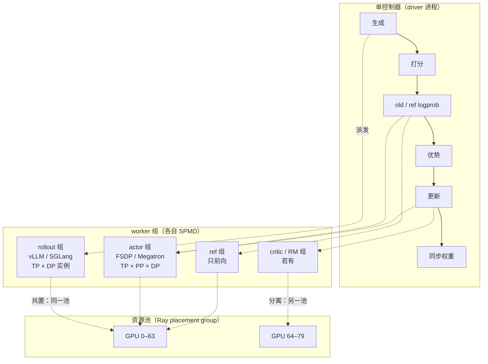

上一篇算出的三段时间——生成 602 秒（其中长尾 196 秒）、前向 72 秒、训练 136 秒——是在"64 张卡先全部做生成、再全部做训练"的前提下算的。这只是三种可能之一。同样 64 张卡，也可以 46 张只做生成、18 张只做训练，两边同时跑；还可以更进一步，让训练不等生成、生成不等训练，各自按自己的节奏走。三种安排下，一步的墙钟分别是 **810 秒、约 750 秒、约 610 秒**，全步 MFU 分别是 **13%、14%、17%**——差别看起来不大，但那是因为上一篇的长尾假设（$$L_{max} / \bar L = 4$$）相当温和。把长尾放到推理模型训练里常见的程度，或者把 Agent 环境的等待加进来，第三种安排会比第一种快两到三倍，而 verl 的公开实验里正是这个数字。

这三种安排就是 RL 后训练系统的三种**形态**：**共置**（colocate，所有角色在同一组卡上时分复用）、**分离**（disaggregate，rollout 与训练各占一个 GPU 池，空分复用）、**异步**（async，在分离之上拆掉每步的同步墙）。它们不是三个框架的三个默认值，而是在同一张账上做的三种交换：共置用切换换来"每个阶段都用满全部卡"，分离用固定配比换来"两类负载各用合适的配置、可以重叠"，异步用样本过期换来"没有任何一方在等"。这一篇把三种形态的时间模型建出来，看每一种把 GPU 用到几成、代价在哪、什么时候先撑不住；然后讨论 rollout : train 的 GPU 配比怎么定、为什么它在训练过程中会变；最后落到 verl 的三种 trainer 模式——`sync`、`colocate_async`、`separate_async`——看同一套控制流怎样只靠换配置切换形态。

要讨论形态，先要有一个把三个作业组织起来的编程模型。HybridFlow（verl 的论文）的**单控制器 + 多 worker 组**是这个领域的共同形态，本篇第二章先讲它，因为三种形态的差别全部在"worker 组怎样映射到 GPU"这一层，而控制流不变。

本篇的核心问题：

> **同样 64 张卡、同样的 GRPO 配置，共置、分离（48 : 16）与异步三种形态下，一步的墙钟时间与 GPU 利用率各是多少？[^q0] 回答长度的方差从小变大时，哪种形态先撑不住？[^q1]**

本篇沿用上一篇的符号与 8B 推理场景（$$B = 512$$、$$G = 16$$、$$\bar L = 8\text{K}$$、$$L_{max} = 32\text{K}$$、64 × H100）。所有时间都是模型估算，公开实验数字注明出处。

## 一、总览

### 1. 先说答案

三种形态在 8B 推理场景下的账：

```text
                    GPU 划分          生成         前向 + 训练     一步墙钟     全步 MFU    谁在等谁
共置（同步）        64 轮流           602 s        208 s          810 s        13%        训练器等 rollout 的长尾；推理引擎等训练
分离（同步）        46 : 18           761 s        740 s         1501 s         7%        两边都在等对方——比共置更差
分离 + 一步流水     46 : 18           761 s        740 s          761 s        14%        长尾仍在生成侧；训练用上一步的样本
异步（流式）        42 : 22           619 s        605 s          619 s        17%        没有人等；样本平均过期 < 1 步
```

三个结论：

- **分离本身不省时间**。把 64 张卡切成两池、两边仍然一步一步同步地轮流跑，是最差的安排：每一时刻只有一个池在工作。分离的价值只在**重叠**——训练这一步时生成下一步——而重叠一定引入 off-policy，哪怕只有一步。
- **共置到异步的收益，几乎全部来自长尾**。生成的 602 秒里 406 秒是吞吐部分、196 秒是等最长的几条回答；异步把这 196 秒吃掉了（训练器不等最后一条，序列跨版本继续生成），吞吐部分则按卡数比例摊在 42 张卡上。长尾占比越高，收益越大：上一篇的假设下是 1.3 倍，verl 文档里 7B、28K 回答上限的实验是 **2.35–2.67 倍**。
- **配比是从时间比推出来的，而时间比会变**。46 : 18 或 42 : 22 是让两边的时间相等；回答长度随训练涨一倍，生成时间涨一倍多而训练时间只涨一倍，配比就要往 rollout 一侧挪。生产系统里配比是运行时可调的量。

### 2. 三种形态是同一张账上的三种交换

```text
              共置 colocate              分离 disaggregate            异步 async
复用方式      时分：同一组卡轮流           空分：两个池各做一件事          空分 + 拆掉同步墙
每阶段卡数    全部                        各自的池                      各自的池
两段能否重叠  否                          可以（一步流水）               完全重叠
显存          训练状态与 KV 池轮流占       各占各的                      各占各的
权重同步      卡内（CUDA IPC）             跨机（NCCL / RDMA）            跨机，且推理引擎在生成中换权重
长尾          拖住全部卡                  拖住 rollout 池               被吞掉（部分 rollout / 流式）
样本新鲜度    严格 on-policy              过期 1 步                     过期 0.x–k 步，可控
新增机制      显存切换（第三篇）            配比 · 跨机同步（第四篇）        staleness · 部分 rollout · 缓冲（第五篇）
```

后面三篇各解决一种形态带来的新问题；本篇只把三种形态的时间与利用率算清楚。

### 3. 本文的章节安排

| 章 | 内容 | 回答的问题 |
|---|---|---|
| 二 | 编程模型 | 单控制器 + worker 组是什么，为什么换形态不用改算法 |
| 三 | 共置 | 时分复用的时间线、利用率、代价 |
| 四 | 分离 | 空分复用为什么不省时间，一步流水省多少 |
| 五 | 异步 | 拆掉同步墙后时间怎么算，代价是什么 |
| 六 | 长尾敏感性 | 长度方差从小到大，三种形态的墙钟怎么变 |
| 七 | 配比 | rollout : train 怎么定，为什么会变，怎样动态调 |
| 八 | verl 的三种 trainer 模式 | `sync` / `colocate_async` / `separate_async` 与三种形态的对应 |
| 九 | 决策表 | 给定模型、任务与卡数，选哪种 |
| 十 | 小结 | 要点、速查表、下一篇 |

## 二、编程模型：单控制器与 worker 组

### 1. 两种写法

把 RL 一步的数据流写成程序，有两种做法。**多控制器**（multi-controller，也叫 SPMD 全程）：每个 GPU 进程跑同一份代码，代码里既有生成又有训练，靠 rank 判断自己该做什么，进程之间用集合通信交换数据——预训练就是这样写的，早期的 RLHF 实现（DeepSpeed-Chat）也是。**单控制器**（single-controller）：一个中心进程持有 RL 算法的数据流（先生成、再打分、再算优势、再更新），把每一段派给一组 worker 执行，worker 组内部仍是 SPMD 的分布式计算。

多控制器的问题在 RL 里特别突出：生成、参考前向、训练三段的并行配置不同（推理引擎 TP = 1 或 2，训练器 FSDP 或 TP × PP），同一份 SPMD 代码要在三种并行布局之间切换，每加一个角色（价值模型、奖励模型）或换一种算法（PPO → GRPO → 加蒸馏 teacher），rank 逻辑就要重写。HybridFlow（Sheng 等 2024，verl 的论文）的贡献是把两层分开：**算法的数据流在单控制器里、每个作业的分布式计算在各自的 worker 组里**，中间用一层"分发 / 收集"装饰器接起来。

### 2. HybridFlow 的三层



三层各自的职责：

- **控制器**只写算法：`generate → reward → old_log_prob → ref_log_prob → advantage → update_actor → update_weights`，每一步是对某个 worker 组的一次调用。verl v0.9 的 v1 trainer 里就是 `PPOTrainer._step_once()` 这十来行，三种 trainer 模式**共享这一份**。
- **worker 组**（`RayWorkerGroup`）是一组 Ray actor，每个 actor 是一个 GPU 进程；组内按 SPMD 跑 FSDP / Megatron 或推理引擎。控制器对组的一次调用被 `@register(dispatch_mode=...)` 装饰器展开：`ONE_TO_ALL` 把同一份参数广播给全组（比如"更新权重"），`DP_COMPUTE` 把一个 batch 按数据并行切给各 rank 再收回来（比如"算这批的 logprob"），`RANK_ZERO` 只发给一个 rank。算法代码不知道组里有几张卡、什么并行。
- **资源池**（`RayResourcePool`，底下是 Ray placement group）决定 worker 组落在哪些 GPU 上。**共置**就是几个角色映射到同一个资源池——verl 用 `create_colocated_worker_cls` 把 actor、rollout、ref 合成一个 worker 类放进同一组进程；**分离**就是给 rollout 单开一个池。三种形态的差别全部在这一层。

### 3. 代价：数据经过控制器

单控制器的代价是数据要在控制器与 worker 组之间搬运。一步的样本（8192 条 × 8K token 的 id、logprob、mask、reward）几百 MB 到几 GB，如果每一段都收回控制器再发出去，控制器成了瓶颈，Ray 的对象存储也会溢出（第八篇的常见故障之一）。HybridFlow 论文里这部分用 Ray 对象存储的引用传递缓解；verl v1 换成了 **TransferQueue**：样本以 key-value 形式存在分布式存储单元里，控制器只拿 `KVBatchMeta`——键与状态标签——worker 组按键自己去取。控制器上流过的只有元数据。

第二个代价是**同步点**：控制器发出一次调用要等全组返回，才发下一次。共置形态下这正好是它需要的（三段本来就要轮流）；异步形态下它是障碍——生成不能是"一次调用"，得是持续运行的服务。verl 的解法是把 rollout 做成 **server 模式**：推理引擎作为独立服务常驻，agent loop 通过 HTTP 提交请求、样本完成一条进一条 TransferQueue，控制器从 replay buffer 取满一个 batch 就训练——第五章与第八章回到这里。

### 4. 角色与组的映射

verl 里的角色（`Role`）与它们默认落在哪个组：

```text
角色                 做什么                          默认组                     共置 / 分离
ActorRolloutRef      actor 训练 + rollout 引擎 + ref  同一个 hybrid worker         共置：三者一组进程
Critic               价值模型（PPO）                  独立 worker 组               与 actor 同池
RewardModel          奖励模型（若有）                  独立池或共置                 separate_async 下必须独立池
Rollout（standalone） 分离形态的推理实例               独立池，rollout.nnodes 指定    分离 / 异步
```

`ActorRolloutRef` 是共置形态的具体形状：**一个进程里既有 FSDP 的 actor、又有 vLLM 引擎、还有 ref 模型**，三者轮流占显存——第三篇的主题。分离形态多出的是独立池上的 standalone rollout 实例，通过 checkpoint engine 跨机接收权重——第四篇的主题。

## 三、共置：时分复用

### 1. 时间线

64 张卡轮流做三件事，每一步：

```text
      ├──────────── 生成 602 s ────────────┤ 切 ├── 前向 72 s ──┤├── 训练 136 s ──┤ 同步 ├
GPU   ████████████████████████░░░░░░░░░░░░  0.2  ██████████████  ████████████████  0.3
      ↑ 吞吐部分 406 s          ↑ 长尾 196 s：越来越少的序列在跑，其余卡空转
                                 ↑ 显存：KV 池 → 训练状态回卡
显存  [推理权重 16 GB + KV 池 56 GB]           [训练状态 2 GB + ref 0.25 GB + 激活……]
```

一步 810 秒，全步 MFU 13%——这是上一篇的数字，也是共置形态的账。

### 2. 利用率模型

共置的全步 MFU 是各段 MFU 的时间加权：

$$U_{colocate} = \frac{\sum_i F_i}{n \cdot F_{peak} \cdot \sum_i T_i} = \frac{T_{gen} \eta_{gen} + T_{fwd} \eta_{fwd} + T_{train} \eta_{train}}{T_{gen} + T_{fwd} + T_{train} + T_{switch} + T_{sync}}$$

8B 推理场景：$$(602 \times 0.028 + 72 \times 0.5 + 136 \times 0.4) / 810 = 13\%$$。生成段的 2.8% 是把长尾也算进分母后的 decode MFU（吞吐部分单独看是 4%）。**共置的利用率被生成段拖低**，而生成段又被长尾拖低——两级放大。

### 3. 它换来的

- **每个阶段用满全部卡**：训练用 64 张卡的算力，生成用 64 张卡的显存放 KV。没有配比问题——不存在"一边闲着"。
- **权重同步在卡内**：训练器与推理引擎在同一进程，新权重经 CUDA IPC 或进程内张量传递进推理引擎，不走网络（8B 一步 0.3 秒以内）。
- **严格 on-policy**：每一步用的样本都是当前权重生成的，算法上最干净，reward 曲线最容易解释。
- **实现最简单**：一个进程、一组卡、控制器顺序调用；verl 的默认模式 `sync` 就是它。

### 4. 它付出的

- **显存切换**：每步两次（生成前放下训练状态、建 KV 池；训练前反过来），8B 场景不到 1 秒，但带着 CUDA graph 重捕获、KV 池重分配、prefix cache 失效的隐性代价，32B 以上是几秒到十几秒——第三篇。
- **阶段无法重叠**：生成时训练器的算力闲着（64 张卡的 989 TFLOPS 只用了 4%），训练时推理引擎的 KV 池不存在。
- **长尾拖住全部卡**：196 秒里 64 张卡都在为几条序列服务，这是共置最大的浪费。$$L_{max} / \bar L$$ 越大、回答长度分布越宽，浪费越大；Agent 训练里一条卡在十分钟测试上的轨迹能让 64 张卡等十分钟。
- **两类负载共用一套并行配置的卡**：推理引擎想要 TP = 1（8B 一卡一实例、并发最大），训练器在大模型上想要 TP × PP；共置下两者各自建自己的进程组，卡数必须一致，配置上互相牵制。

共置适合的是：模型不大（训练状态 + 推理权重 + KV 池在一张卡上放得下、切换便宜）、回答长度分布不太宽、需要严格 on-policy 或者追求实现简单。7B–32B 的推理模型 GRPO，多数团队从共置开始。

## 四、分离：空分复用

### 1. 同步分离为什么更差

把 64 张卡切成 rollout 池 $$n_r$$ 张、训练池 $$n_t$$ 张。生成时间的吞吐部分按卡数反比（每张卡的 decode 吞吐不变、卡少了步数多），长尾不变（它取决于最长那条序列，不取决于卡数）；前向与训练按算力反比：

$$T_{gen}(n_r) = 406 \times \frac{64}{n_r} + 196, \qquad T_{train}(n_t) = (72 + 136) \times \frac{64}{n_t}$$

如果两池仍然一步一步同步地轮流——训练池等 rollout 池生成完、rollout 池等训练池训练完再同步权重——一步墙钟是两者之**和**：46 : 18 时 $$761 + 740 = 1501$$ 秒，比共置的 810 慢将近一倍，全步 MFU 7%。原因很简单：**任一时刻只有一个池在干活**，而共置至少每个阶段全部卡都在干。分离本身不省任何时间，它只是把"一段时间全部卡做 A、另一段全部卡做 B"变成"一段时间 46 张做 A、另一段 18 张做 B"。

### 2. 一步流水

分离的价值只在重叠。最简单的重叠是**一步流水**（one-step-off / one-step-overlap）：第 $$t$$ 步训练用第 $$t-1$$ 步生成的样本，同时 rollout 池用第 $$t-1$$ 步的权重生成第 $$t$$ 步的样本。两池同时工作，一步墙钟是两者之**最大值**：

$$T_{step} = \max\big(T_{gen}(n_r),\ T_{train}(n_t)\big) + T_{sync}$$

```text
rollout 池 (46)  ├── 生成 batch t （用 θ_{t-1}）761 s ──┤├── 生成 batch t+1（用 θ_t）──┤
训练池 (18)      ├── 训练 batch t-1 → θ_t  740 s ──┤ 等 ├── 训练 batch t → θ_{t+1} ──┤
                                                    ↑ 同步 θ_t 到 rollout 池（跨机，几秒）
```

46 : 18 时 $$\max(761, 740) + 3 \approx 764$$ 秒，比共置快 6%，全步 MFU 14%。收益不大，原因也清楚：**长尾还在**——rollout 池仍然要等最长的那条序列，只是这段时间训练池不再陪着等；而吞吐部分摊到 46 张卡上比 64 张慢。

一步流水的代价是样本过期恰好一步（用 $$\theta_{t-1}$$ 的样本更新 $$\theta_t$$），多数报告里几乎无损；verl 的 `one_step_off_policy` recipe 是它的实现，report 在 7B 上比共置快 1.2–1.5 倍——与这里的模型量级一致，收益取决于长尾占比。

### 3. 分离换来的

- **两侧各用合适的并行配置与卡型**：rollout 池可以是 TP = 1 的多实例、用 FP8 权重、甚至用推理卡（H20、L40S）；训练池用 TP × PP、要 NVLink 与 IB。异构集群在这里有意义。
- **推理引擎常驻**：不再每步 sleep / wake，KV 池、CUDA graph、prefix cache 都留着；只需要接收新权重。
- **可以重叠**：一步流水或更深的异步。
- **各自独立扩缩**：rollout 慢就加 rollout 卡，训练慢就加训练卡——这是共置做不到的（共置加卡两边一起加）。

### 4. 分离付出的

- **配比要事先定**：$$n_r : n_t$$ 定错一边就闲着。46 : 18 是让两边时间相等的解，而"相等"随训练推进会变（第七章）。
- **权重同步跨机**：16 GB 从训练池广播到 46 张 rollout 卡，400 Gb/s IB 下几秒；671B MoE 是分钟级——第四篇。
- **两个池的显存都不能借给对方**：训练池的 18 张卡在训练时显存紧、生成时全空；rollout 池反过来。
- **至少一步 off-policy**（若要重叠）。

## 五、异步：拆掉同步墙

### 1. 流式生成与训练

一步流水还有一道墙：训练池每步要等 rollout 池**整批**生成完。异步形态把批的概念在 rollout 侧拆掉：推理引擎持续运行，完成一条序列就进样本缓冲；训练器从缓冲里取满一个 mini-batch 就更新一次，每更新 $$k$$ 次向推理引擎同步一次权重；正在生成的序列不中断（或中断后用新权重继续——**部分 rollout**），完成后带着"它由哪几个版本的权重生成"的标签进缓冲。

```text
rollout 池 (42)  ├─────────── 持续生成：完成一条进一条缓冲，换权重时在飞序列继续 ─────────────┤
                       θ_t ↓ 同步            θ_{t+1} ↓ 同步            θ_{t+2} ↓
训练池 (22)      ├ 取 batch → 更新 ┤├ 取 batch → 更新 ┤├ 取 batch → 更新 ┤├ ……
缓冲             [样本按完成顺序进；训练器取；过期 > k 步的丢弃或等待]
```

生成时间里**长尾消失了**：没有人等最后一条序列——它完成后进缓冲，被下一个 batch 用掉。生成时间只剩吞吐部分：$$T_{gen}(n_r) = 406 \times 64 / n_r$$；训练时间不变。平衡点 $$406 / n_r = 208 / n_t$$，$$n_r + n_t = 64$$，解出 $$n_r \approx 42$$、$$n_t \approx 22$$，两边各约 610 秒——一步（相当于 8192 条样本的更新）**619 秒**，全步 MFU 17%，比共置快 1.3 倍。

### 2. 收益的来源

从共置的 810 到异步的 619，省下的 191 秒几乎等于长尾的 196 秒。**异步的全部收益就是把长尾吞掉**；吞吐部分并没有变快，只是摊在了更少的卡上。所以异步的收益取决于长尾占生成时间的比例——第六章专门算。上一篇的 $$L_{max} / \bar L = 4$$ 下长尾占三分之一，收益 1.3 倍；推理模型训练里常见的 $$L_{max} = 28\text{K}$$–$$32\text{K}$$、$$\bar L$$ 几 K、分布重尾，长尾占一半以上，收益到两倍以上。

verl 的 `fully_async_policy` 文档（美团搜索团队）给了一组公开实验，Qwen2.5-Math-7B、DAPO、回答上限 28K、H20：

```text
卡数           共置同步 步时间    其中生成    异步（配比）   步时间    400 步总时间    提速
32             790 s            357 s      16 : 16      295 s     3d17h → 1d9h    2.66×
64             365 s            151 s      32 : 32      189 s     1d17h → 21h     1.92×
128            356 s            178 s      64 : 64      151 s     1d16h → 17h     2.35×
```

两个细节值得看。第一，**共置从 32 卡加到 128 卡，步时间只从 790 降到 356**——4 倍的卡换 2.2 倍的速度，卡数翻倍到 128 时几乎没有提升（365 → 356）。这就是长尾：吞吐部分随卡数缩短，长尾不随卡数缩短，卡越多长尾占比越高。第二，异步在 128 卡上生成占步时间的比例从 50% 降到 22%（33 秒的"生成"是训练器等缓冲的时间），瓶颈转到了训练侧——配比应该再往训练那边挪。

### 3. 异步的三个刻度

"异步"不是一个开关，是一个刻度：

```text
刻度                       样本过期        长尾处理                     收益         代价
一步流水（k = 1，整批）      恰好 1 步        rollout 池仍等整批            小           几乎无损
流式 + 缓冲（k = 1，逐条）   0–1 步          训练器不等最后一条，rollout 池仍在跑它   中     缓冲区、变长 batch
流式 + staleness 上限 k      0–k 步          同上，且允许缓冲里有过期样本    大           off-policy 修正
流式 + 部分 rollout          一条序列跨版本   换权重时在飞序列不丢、继续生成   最大          一条序列由几个策略生成
```

verl 的 `fully_async` 文档把它们叫做 mode a–d，同一实验里从"流式"到"流式 + staleness 0.5 + 部分 rollout"，收益从 1.6 倍到 2.35 倍。每往下一档，系统多一个机制、算法多一个要修正的偏差——第五篇的内容。

### 4. 异步付出的

- **off-policy**：训练用的样本来自 $$k$$ 步前的权重，重要性比偏离 1；部分 rollout 下一条序列的前半段和后半段来自不同策略。这些要靠 staleness 上限、重要性采样修正、decoupled loss 来控制（第五篇）；效果上多数报告"$$k \le 2$$–4 几乎无损"，但每换一个任务都要重新验证。
- **权重同步在生成中进行**：推理引擎不再有"空闲期"可以换权重，要么中断在飞请求（部分 rollout：保存已生成的 token，换权重后续接），要么让请求自然排空（等待，浪费）。verl 的 `abort → update_weights → resume` 三步就是前者。
- **训练器不再有"一步"的自然边界**：batch 是从缓冲里取的，样本来源的版本、长度、完成时间都是混合的；checkpoint 要保存缓冲区与在飞请求的状态（第八篇）。
- **可观测更难**：reward 曲线的横轴是"训练器更新次数"还是"消耗的样本数"要说清楚；staleness、缓冲深度、两侧的 idle 比例是新增的必看指标。

## 六、长尾敏感性：哪种形态先撑不住

### 1. 参数化

把生成时间拆成吞吐部分 $$T_{thr}$$ 与长尾 $$T_{tail}$$，记长尾占比 $$f = T_{tail} / (T_{thr} + T_{tail})$$，训练侧（前向 + 训练）时间 $$T_t$$。三种形态的一步墙钟（分离与异步都按最优配比、忽略同步时间）：

```text
共置              T_thr + T_tail + T_t
分离 + 一步流水    解 n_r：T_thr·64/n_r + T_tail = T_t·64/(64−n_r)，墙钟 = 两边相等的值
异步（流式）       T_thr + T_t（两池各摊一部分，总卡数不变，长尾消失）
```

异步的墙钟是 $$T_{thr} + T_t$$——**恰好等于"共置但没有长尾"**：两池分别做两件事、卡数按时间比分配，总卡时与 64 张卡轮流做一样。这给了一个干净的结论：**异步 ≈ 共置 − 长尾**，其余一切（配比、跨机同步、staleness）都是为了拿到这一项付的代价。

### 2. 数字

固定吞吐部分 406 秒、训练侧 208 秒，改变长尾：

| 长尾 $$T_{tail}$$ | $$f$$ | 共置 | 分离 + 一步流水 | 异步 | 异步 / 共置 | 对应的场景 |
|---:|---:|---:|---:|---:|---:|---|
| 45 s | 10% | 659 s | 645 s | 614 s | 1.07× | 对话 RL，$$L_{max} / \bar L \approx 2$$ |
| 196 s | 33% | 810 s | 764 s | 614 s | 1.32× | 上一篇的基线，$$L_{max} / \bar L = 4$$ |
| 406 s | 50% | 1020 s | 940 s | 614 s | 1.66× | 推理模型，$$L_{max} / \bar L \approx 8$$ |
| 950 s | 70% | 1564 s | 1440 s | 614 s | 2.55× | 重尾分布，或 Agent 环境的等待 |
| 2400 s | 85% | 3014 s | 2840 s | 614 s | 4.9× | Agent：几条轨迹卡在十分钟的测试上 |

**共置对长尾线性敏感、异步完全不敏感、一步流水几乎和共置一样敏感**——因为一步流水只是让训练池不陪着等，rollout 池还在等。这张表回答了本篇核心问题的后半句："回答长度的方差从小变大时，哪种形态先撑不住"——共置先，一步流水紧跟着，异步不受影响。

也解释了为什么 verl 公开实验的 2.35–2.67 倍出现在"7B、28K 上限、DAPO"这个组合上：DAPO 的动态过滤会丢掉全对 / 全错的组、重新生成，等于人为加长了长尾；28K 的上限让 $$L_{max} / \bar L$$ 到 8–10；两者叠加 $$f$$ 到 60–70%。

### 3. 长尾从哪来

$$f$$ 由三样东西决定，各对应一种放大器（上一篇第七章）：

- **回答长度分布的形状**：推理模型的回答长度是重尾的（多数题几 K，难题打满 $$L_{max}$$），且**随训练推进变长**——R1 论文里从几百 token 涨到上万。同一任务 $$f$$ 从 0.2 涨到 0.6 是正常的。
- **$$G$$ 与 $$B$$**：一步的序列数越多，最长的那条越长（极值统计），$$f$$ 越大；同时吞吐部分也更长，$$f$$ 的变化取决于分布尾部。
- **环境**：Agent 训练里一条轨迹的墙钟由环境耗时决定（几十秒的测试 × 几十轮），方差比生成长度的方差大一个量级，$$f$$ 轻易到 0.8 以上——所以 Agent 训练几乎只能异步（第六篇）。

## 七、配比：怎么定，为什么会变

### 1. 静态解

分离与异步的配比由两侧时间相等决定：

$$\frac{n_r}{n_t} = \frac{T_{gen}^{(64)}}{T_{train}^{(64)}} = \frac{\text{生成在全部卡上的时间}}{\text{前向 + 训练在全部卡上的时间}}$$

8B 推理场景异步：$$406 / 208 \approx 2$$，即 2 : 1（42 : 22）；一步流水要把长尾算进生成侧：$$602 / 208 \approx 2.9$$（46 : 18）。对话场景（$$\bar L = 1\text{K}$$，16 卡）生成 47 秒、前向 + 训练 63 秒，配比约 3 : 4——回答短时训练侧反而是大头；32B 推理场景生成 1565 秒、前向 + 训练 840 秒，接近 2 : 1；PPO 多一个价值模型，训练侧翻倍，配比往训练侧挪。

一个常见的误区是按 FLOP 配：FLOP 上训练是生成的 3 倍，会得出 1 : 3；按时间是 2 : 1，**方向相反**。配比一定按时间。

### 2. 为什么会变

配比的输入——$$T_{gen}$$ 与 $$T_{train}$$——在训练过程中变：

- **回答变长**：$$\bar L$$ 翻倍，$$T_{resp}$$ 翻倍、每条 KV 翻倍、并发减半，生成时间涨到 2–4 倍；训练时间只随 token 数涨 2 倍。配比从 2 : 1 变成 3 : 1 或 4 : 1。R1 一类的训练里这是**必然发生**的。
- **DAPO 式过滤**：过滤掉的组要重新生成，生成侧的有效工作量随"全对率"上升而增加。
- **课程**：难题比例上升，回答更长、环境更慢。
- **训练侧的动态 batch**：按 token 打包的 micro-batch 让训练 MFU 在长回答下略升。

结果是：第一步最优的配比，到第 500 步可能让训练池空转一半——或者反过来。verl 的 `fully_async` 文档明确建议看两个指标调配比：`rollouter/idle_ratio` 高、`trainer/idle_ratio` 低就往训练侧加卡，反之往 rollout 侧加。

### 3. 动态调配比

静态配比只能靠重启换；生产系统要能在运行中调。三种做法：

- **弹性 rollout 实例**：rollout 池是一组独立的推理实例（server 模式），加一台机器就多几个实例注册进负载均衡器；训练侧固定。要求权重同步支持动态拓扑——NIXL / Mooncake 一类的点对点传输（第四篇）比 NCCL 广播（要重建进程组）合适。
- **训练池的卡兼职 rollout**：训练池在等样本时显存与算力都闲着，让它们上一组 hybrid 推理实例帮着生成，缓冲够了再切回训练。verl 的**动态资源调度**（`use_dynamic_resource_scheduling`）就是这个：standalone 实例常驻、hybrid 实例在训练池上按策略激活 / 停用，停用顺序是"先从负载均衡器摘掉 → 中断在飞请求（部分 rollout 转到 standalone 继续）→ sleep 释放显存"，文档报告 Qwen3.5-35B-A3B 上端到端快 15%。v1 的 `separate_async` trainer 内置了同样的形状：`HybridEngineMode` 在 `TRAINER` 与 `ROLLOUT` 之间切换，`switch_to_rollout()` 是"同步权重 → resume 实例 → 加进负载均衡器"，`switch_to_trainer()` 是"摘掉 → abort → sleep"。
- **反过来：rollout 池的卡兼职训练**——不常见，因为训练器的进程组与并行配置不能随意变卡数。

动态调配比的前提是**两种形态能在同一组卡上切换**——也就是说，分离形态里的训练池自己就是一个小的共置系统。第三篇的显存切换在这里又出现了。

### 4. 配比之外的两个自由度

- **推理侧的并发与 TP**：$$n_r$$ 张卡可以是 $$n_r$$ 个 TP = 1 实例（并发最大、每卡吞吐最高，8B 可行），也可以是 $$n_r / 2$$ 个 TP = 2 实例（32B 必须）。TP 度提高一倍，权重副本每卡减半、KV 空间增加，但 TP 通信进入 decode 每步——上一篇的带宽模型里没算这项，实际会让每卡吞吐降 10–30%。
- **训练侧的 mini-batch 数**：异步下训练器每取一个 mini-batch 更新一次、每 $$k$$ 次同步权重（verl 的 `parameter_sync_step`）。$$k$$ 大，同步少、训练 MFU 高，但 staleness 大；$$k$$ 小反之。它与配比一起决定训练侧的有效吞吐。

## 八、verl 的三种 trainer 模式

### 1. 一套控制流

verl v0.9 的 v1 trainer（`verl/trainer/ppo/v1/`，本版本起默认启用）把三种形态做成同一个 `PPOTrainer` 基类的三个子类，`trainer.v1.trainer_mode` 选择：

```text
模式                形态                          rollout 实例在哪        权重同步          样本
sync                共置同步                       与 actor 同一组进程     naive（进程内）    整批，严格 on-policy
colocate_async      共置 + 流式 + 部分 rollout      同上                   naive             流式缓冲，staleness ≤ 阈值
separate_async      分离 + 流式 + 部分 rollout      独立池（standalone），  nccl / nixl /     同上
                    + 训练池兼职 rollout（hybrid）   训练池上另有 hybrid    mooncake / delta
```

三个子类共享 `fit()` 与 `_step_once()`（第二章第 2 节那十来行），差别只在几个**钩子**：

```python
# trainer_sync.py —— 共置同步：生成完 sleep，训练完 update_weights
@register_trainer("sync")
class PPOTrainerSync(PPOTrainer):
    def on_sample_end(self):     # 样本取够了 → 推理引擎让出显存
        self.checkpoint_manager.sleep_replicas()
    def on_step_end(self):       # 训练完 → 新权重进推理引擎（顺带 wake_up）
        self.checkpoint_manager.update_weights(self.global_steps)

# trainer_colocate_async.py —— 共置异步：多了 abort（部分 rollout）与 resume
@register_trainer("colocate_async")
class PPOTrainerColocateAsync(PPOTrainer):
    def on_train_begin(self):    # 先预热 num_warmup_batches 个 batch 的生成
        for _ in range(num_warmup_batches): self._add_batch_to_generate()
    def on_sample_end(self):
        self.checkpoint_manager.abort_replicas()   # 中断在飞请求，保存已生成部分
        self.checkpoint_manager.sleep_replicas()
    def on_step_end(self):
        self.checkpoint_manager.update_weights(self.global_steps)
        self.checkpoint_manager.resume_generation_replicas()   # 被中断的请求接着生成

# trainer_separate_async.py —— 分离异步：standalone 池 + 训练池上的 hybrid 实例
@register_trainer("separate_async")
class PPOTrainerSeparateAsync(PPOTrainer):
    def _setup(self):
        self.standalone_server_manager = LLMServerManager.create(config, start_rank=...)
        self.standalone_checkpoint_manager = CheckpointEngineManager(actor_wg=..., replicas=standalone)
    def on_step_end(self):       # 跨机同步到 standalone 实例（nccl / nixl / ...）
        self.standalone_checkpoint_manager.update_weights(self.global_steps)
    def switch_to_rollout(self):  # 训练池兼职：同步权重 → resume → 加进负载均衡
    def switch_to_trainer(self):  # 摘掉 → abort → sleep
```

`sync` 与 `colocate_async` 的差别只有 `abort` / `resume` 两个调用和一个预热——**共置同步到共置异步，代码上是两行**。`separate_async` 多的是一个 standalone 实例组和一个跨机的 checkpoint engine；它的 `__init__` 里有一条断言：`train_batch_size == parameter_sync_step × ppo_mini_batch_size`——异步下"一步"被重新定义为"$$k$$ 次 mini-batch 更新 + 一次权重同步"。

### 2. 共享的样本通路

三种模式共用一个 `ReplayBuffer`（`verl/trainer/ppo/v1/replay_buffer.py`），底下是 TransferQueue：

- agent loop 每完成一条轨迹，以 `{uid}_{session_id}_{index}` 为键写入，带 `status` 标签；同一 prompt 的 $$G$$ 条构成一个组，组的状态是 `pending → running → finished / failure`；
- 训练器 `sample(global_steps, batch_size)` 取 $$B$$ 个**终态的组**；`sync` 模式下 staleness 策略是 NO-OP（严格 on-policy），异步模式下按 `max_off_policy_threshold`（默认 8 个版本）用 `drop`（丢弃过期组、补发新 prompt）或 `wait`（阻塞到过期组完成、训练它而不丢）处理；
- DAPO 过滤（组内 reward 全同的组淘汰并补发）、失败组的处理都在同一个淘汰 / 补发矩阵里。

也就是说，**样本通路不区分形态**——共置同步的"整批"只是"缓冲里恰好有 $$B$$ 个组、全部来自当前版本"的特例。这是 v1 统一 trainer 的核心设计：形态是资源池与钩子的事，控制流与样本通路一份。

### 3. 配置项速查

```text
形态选择        trainer.v1.trainer_mode = sync | colocate_async | separate_async
资源            trainer.nnodes × trainer.n_gpus_per_node            训练池（共置下即全部）
                actor_rollout_ref.rollout.nnodes × n_gpus_per_node  standalone rollout 池（separate_async）
                actor_rollout_ref.rollout.tensor_model_parallel_size  推理实例 TP
异步节奏        trainer.v1.separate_async.parameter_sync_step        几次 mini-batch 更新同步一次权重
                trainer.v1.*.num_warmup_batches                       开训前预热几个 batch 的生成
                data.gen_batch_size                                   流式 dataloader 每次投多少 prompt
staleness       trainer.v1.sampler.max_off_policy_threshold           轨迹最多跨几个版本（默认 8）
                trainer.v1.sampler.max_off_policy_strategy            drop | wait
权重同步        actor_rollout_ref.rollout.checkpoint_engine.backend   naive（共置）| nccl | nixl | mooncake | delta_sharded
                actor_rollout_ref.rollout.free_cache_engine           共置下是否 sleep / wake（默认 true）
```

（`verl/experimental/fully_async_policy/` 是美团团队更早的独立实现，第五章的公开实验来自它；它的 `staleness_threshold`、`trigger_parameter_sync_step`、`partial_rollout`、动态资源调度在 v0.9 里逐步并入 v1 的 `separate_async`。读那份文档时注意参数名不同。）

### 4. 三种模式的一步时间线

用 verl 的计时器名字（`timing_s/*`）把三种模式的一步对上：

```text
sync            gen ──────────────┤ reward ┤ old_log_prob ┤ ref ┤ adv ┤ update_actor ┤ update_weights ┤
                （gen 含 sleep；update_weights 含 wake_up、显存切换）

colocate_async  gen（= 从缓冲取样的等待，rollout 在跑）┤ abort+sleep ┤ old_log_prob ┤ ref ┤ update_actor ┤ update_weights+resume ┤
                （rollout 与训练仍在同一组卡上轮流，但训练器取的是缓冲里已完成的组，不等长尾；被中断的序列下一轮续接）

separate_async  gen（取样等待，通常接近 0）┤ old_log_prob ┤ ref ┤ update_actor ┤ ×k ┤ update_weights（跨机）┤
                standalone 池：持续生成，同步权重时 abort → 接收 → resume
```

`colocate_async` 是一个容易被忽略的中间态：它**没有分离**，rollout 与训练还是在同一组卡上轮流，收益只来自"训练器不等长尾"——生成阶段的时长由缓冲取够 $$B$$ 个组决定，最长的几条序列被中断、下一步续接。它适合卡数不多、模型放得下、但长尾严重的场景：不用定配比、不用跨机同步，就拿到异步的大部分收益。

## 九、决策表

把前面的模型收成一张表。行是场景，列是建议的形态与理由：

| 场景 | 建议形态 | 理由 |
|---|---|---|
| 7B–32B dense，$$\bar L \le 8\text{K}$$，长尾占比 < 30%，≤ 64 卡 | 共置同步（`sync`） | 切换便宜、on-policy 干净、无配比问题；异步收益 < 1.3× 不值得引入 staleness |
| 同上但长尾占比 > 40%（$$L_{max} \ge 32\text{K}$$、DAPO 过滤） | 共置异步（`colocate_async`） | 两行代码拿到吞长尾的收益，不改资源布局 |
| 32B–70B dense，≥ 128 卡，回答长度重尾 | 分离异步（`separate_async`） | 训练侧要 TP × PP、推理侧要 TP = 2–4 的多实例，两侧配置分开；卡多时共置的长尾浪费按卡数放大 |
| MoE（几百 B 总参数） | 分离异步 + 增量 / 量化同步 | 训练侧 EP + FP8、推理侧 EP 度不同，共置几乎不可能；权重同步是分钟级，必须与生成重叠 |
| Agent 训练（环境等待方差大） | 分离异步 + 部分 rollout | $$f > 0.7$$，共置不可用；环境的 CPU 集群是第三个池（第六篇） |
| PPO（有价值模型） | 共置或分离，配比往训练侧挪 | 训练侧 FLOP 翻倍，2 : 1 变 1 : 1 |
| 严格 on-policy 的算法研究、复现论文 | 共置同步 | 任何异步都改变样本分布，比较实验要先排除它 |
| 异构集群（训练卡 + 推理卡） | 分离 | 只有分离能让推理跑在没有 NVLink / IB 的卡上 |

两个跨行的原则：

- **从共置同步开始，加异步的每一档都要拿 reward 曲线对照**。形态是系统决定，但它改变样本分布；第五篇的 off-policy 指标是判断"这一档能不能加"的依据。
- **卡越多，越该分离**。共置的长尾浪费是"全部卡 × 长尾时间"，随卡数线性增长；分离的配比与同步开销基本不随卡数变。verl 那组实验里共置 64 → 128 卡几乎没提速，而异步 64 → 128 从 189 降到 151 秒。

## 十、本文小结

### 1. 要点回顾

- RL 系统的三种形态是**同一张账上的三种交换**：共置用显存切换换"每阶段用满全部卡"，分离用固定配比换"两侧各用合适配置、可重叠"，异步用样本过期换"没有人等"。
- **单控制器 + worker 组**（HybridFlow）把算法数据流与分布式计算分开，形态的差别只在 worker 组到资源池的映射；代价是数据经过控制器（verl v1 用 TransferQueue 让控制器只拿元数据）与调用的同步点（server 模式的 rollout 绕开它）。
- **同步分离比共置更差**（两池轮流，任一时刻只有一个在干活）；分离的价值只在重叠，而重叠至少引入一步 off-policy。
- **异步 ≈ 共置 − 长尾**：拆掉同步墙的收益几乎全部来自长尾，吞吐部分并不变快。长尾占比 $$f$$ 从 10% 到 70%，异步 / 共置从 1.07× 到 2.5×；verl 公开实验的 2.35–2.67× 对应 7B、28K 上限、DAPO 的重尾场景。
- **共置对长尾线性敏感，一步流水几乎同样敏感，异步不敏感**——这是"哪种形态先撑不住"的答案。卡越多，共置的长尾浪费越大：64 → 128 卡几乎不提速。
- **配比按时间不按 FLOP**（方向相反），且随回答变长而漂移；生产系统靠 `idle_ratio` 一类指标动态调，做法是弹性 rollout 实例或训练池兼职 rollout（verl 的动态资源调度 / `HybridEngineMode`）——分离形态的训练池自己就是一个小共置系统。
- verl v1 的 `sync` / `colocate_async` / `separate_async` 共享控制流与 replay buffer，差别在几个钩子：`sync` 到 `colocate_async` 只多 `abort` / `resume`；`separate_async` 多一个 standalone 实例组与跨机 checkpoint engine。

### 2. 公式速查

```text
共置墙钟          T_gen + T_fwd + T_train + T_switch + T_sync            T_gen = T_thr + T_tail
共置全步 MFU      Σ(T_i · η_i) / Σ T_i
分离（同步）       T_gen(n_r) + T_train(n_t)                              比共置差
分离 + 一步流水    max(T_thr·n/n_r + T_tail,  T_train·n/n_t) + T_sync
异步（流式）       T_thr + T_train（最优配比下）  ≈ 共置 − 长尾
最优配比           n_r / n_t = T_gen^(n) / T_train^(n)     异步用 T_thr，一步流水用 T_thr + T_tail
长尾占比           f = T_tail / (T_thr + T_tail)          异步收益 ≈ 1 / (1 − f · T_gen/(T_gen + T_train))
```

### 3. 下一篇

三种形态里有两种（共置，以及分离形态的训练池兼职 rollout）要在同一张卡上让训练状态与 KV 池轮流占据显存。上一篇算过搬的字节数（8B 每卡 2.3 GB、32B 9 GB、DeepSeek-V3 规格 47 GB），但没有算它带的隐性代价：推理引擎的 KV 池要重新分配、CUDA graph 要不要重捕获、prefix cache 全部失效、训练器的 allocator 与推理引擎的 allocator 在同一块显存上交替留下的碎片。下一篇进入 vLLM 的 sleep mode 与 `CuMemAllocator`、FSDP 的 offload 路径，把一次切换的每个动作、每条链路、每一秒算出来：

> **一个 32B 模型在 8 卡共置。每步开始生成前要把 16 字节/参数的训练状态搬走、把 KV 池建起来，训练前再反过来。每个动作搬多少字节、走哪条链路、要几秒？步时间 5 分钟时这是 2% 还是 20%？**

下一篇：共置——训练器与推理引擎在同一组 GPU 上共存。

**实践建议**：用上一篇的 `rl_ledger.py` 算出你的任务在全部卡上的 $$T_{thr}$$、$$T_{tail}$$、$$T_{train}$$，代进本篇第六章的三个公式，得到三种形态的墙钟与最优配比；再在 8 卡上分别用 `sync` 与 `colocate_async` 各跑 20 步，对比 `timing_s/gen` 与 reward 曲线——前者的差就是你的长尾，后者的差就是异步的代价。

## 十一、自测

1. 为什么“同步分离比共置更差”？给出一个数字直觉。

   <details markdown="1"><summary>答案</summary>

   共置：生成用 64 卡、训练用 64 卡，两段串行；同步分离 48 : 16：生成只用 48 卡（慢 1.33×）、训练只用 16 卡（慢 4×），仍然串行——任一时刻 16 或 48 张卡在等。分离只有在两段重叠时才有意义。

   </details>

2. 长尾占比 $$f = 50\%$$、$$T_{gen} = 600$$ s、$$T_{train} = 200$$ s：异步相对共置的加速约多少？

   <details markdown="1"><summary>答案</summary>

   异步收益 $$\approx 1 / (1 - f \cdot T_{gen} / (T_{gen} + T_{train})) = 1 / (1 - 0.5 \times 0.75) = 1.6\times$$——省掉的正是 300 s 的长尾。

   </details>

3. 异步形态的“最优配比”怎么定？为什么按时间不按 FLOP？

   <details markdown="1"><summary>答案</summary>

   $$n_r / n_t = T_{gen}^{(n)} / T_{train}^{(n)}$$（用满 $$n$$ 卡时两段的时间比，异步用 $$T_{thr}$$）；FLOP 上训练占一半、生成六分之一，时间上却是生成占四分之三——decode 的 MFU 只有个位数，按 FLOP 配会让 rollout 池严重不足。且回答变长时比例漂移，要动态调。

   </details>

4. HybridFlow 的“单控制器 + worker 组”怎么让三种形态共用一套代码？代价是什么？

   <details markdown="1"><summary>答案</summary>

   算法数据流写在一个 driver 上，worker 组（actor、rollout、ref、critic）到资源池的映射决定形态——同一池是共置、不同池是分离、加缓冲与版本就是异步；代价是数据经过控制器（verl v1 用 TransferQueue 只传元数据）与每次调用的同步点（server 模式 rollout 绕开）。

   </details>

5. 回答长度方差从小变大，共置、一步流水、异步各怎么变？为什么卡越多共置越亏？

   <details markdown="1"><summary>答案</summary>

   共置墙钟随长尾线性增长（全部卡等最长的那条）；一步流水的 $$\max$$ 里生成项含 $$T_{tail}$$，几乎同样敏感；异步不敏感（长回答慢慢生成，训练器不等）。卡越多吞吐部分越短、长尾不变，长尾占比上升——64 → 128 卡几乎不提速。

   </details>

[^q0]: **共置**（64 卡先全部生成、再全部训练，中间显存换手）：墙钟 $$T_{gen} + T_{fwd} + T_{train} + T_{switch} + T_{sync}$$，每阶段用满全部卡，但生成的长尾期间训练器闲着——8B 推理场景约 810 秒、全步 MFU 13%（[第三章](#三共置时分复用)）。**同步分离**（48 : 16 轮流）比共置更差——任一时刻只有一个池在干活；分离的价值只在**重叠**：一步流水让第 $$t$$ 步的生成与第 $$t-1$$ 步的训练并行，墙钟 $$\max(T_{thr} \cdot 64/48 + T_{tail}, T_{train} \cdot 64/16) + T_{sync}$$，代价是至少一步 off-policy（[第四章](#四分离空分复用)）。**异步**（rollout 池不停生成、训练池样本够了就训、权重按版本更新）：最优配比下墙钟 $$\approx T_{thr} + T_{train}$$——异步 ≈ 共置 − 长尾，收益几乎全部来自长尾；长尾占比 $$f$$ 从 10% 到 70%，异步 / 共置从 1.07× 到 2.5×，verl 公开的 2.35–2.67× 对应 7B、28K 上限、DAPO 的重尾场景（[第五章](#五异步拆掉同步墙)）。
[^q1]: **共置先撑不住**：它对长尾线性敏感、一步流水几乎同样敏感、异步不敏感；且卡越多共置的长尾浪费越大（64 → 128 卡几乎不提速）。配比按时间不按 FLOP（方向相反）且随回答变长而漂移，生产系统按 `idle_ratio` 动态调——弹性 rollout 实例或训练池兼职 rollout（verl `HybridEngineMode`）。详见[第六章](#六长尾敏感性哪种形态先撑不住)、[第七章](#七配比怎么定为什么会变)、[第九章](#九决策表)的决策表。
