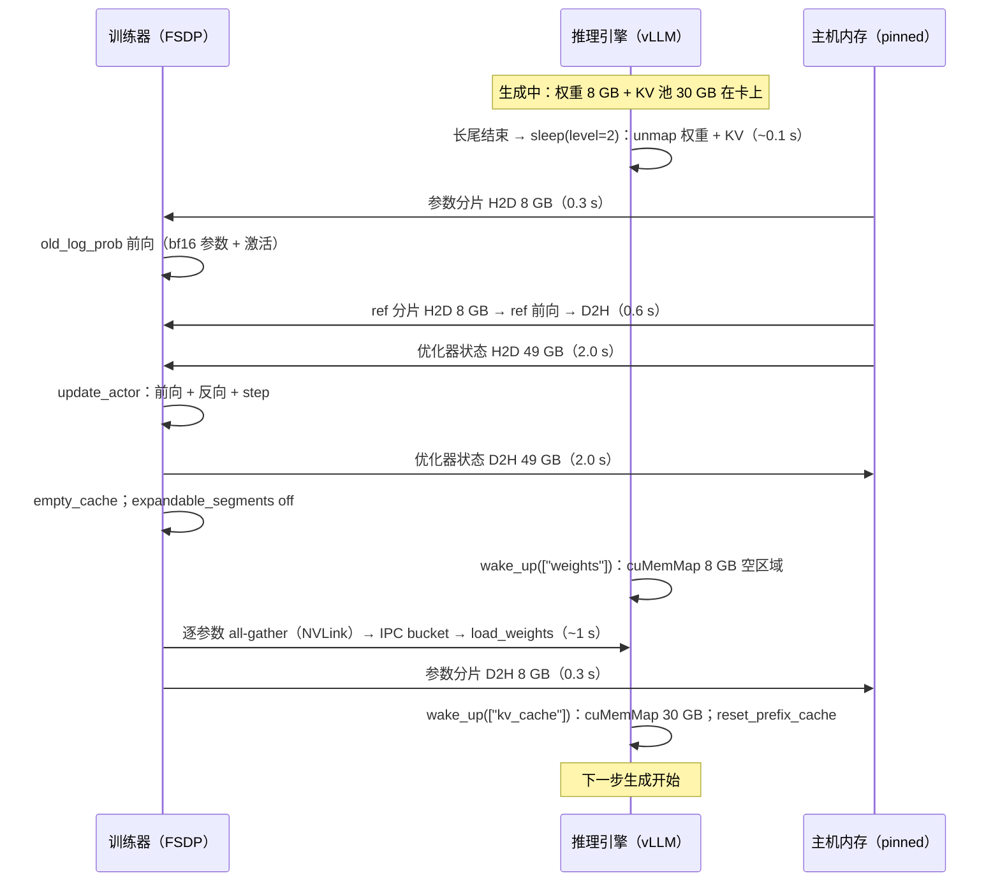

一个 32B 的模型在 8 张 H100 上做共置的 GRPO。训练时每张卡上要有 66 GB 的训练状态（16 字节 / 参数均分到 8 卡）加 8 GB 的参考模型；生成时每张卡上要有 8 GB 的推理权重副本（TP = 8）加尽量大的 KV 池。两样东西加起来 150 GB，卡只有 80 GB——所以每一步里显存要**换两次主人**：生成前训练状态搬到 CPU、推理引擎的权重与 KV 池挂回 GPU；训练前反过来。按 PCIe 的带宽算，一步两次切换搬 130 GB 左右、约 6 秒；步时间 5 分钟时是 2%。

2% 不值得写一篇。值得写的是这 6 秒之外的东西：推理引擎的 KV 池释放再建回来，里面的 prefix cache 全部作废；CUDA graph 捕获的是显存地址，地址变了图就废了——vLLM 的 sleep mode 用 CUDA 虚拟内存 API 把物理页摘下来而**保留虚拟地址**，正是为了不重捕获；训练器的 PyTorch caching allocator 与推理引擎的 `CuMemAllocator` 在同一块 HBM 上交替，一方保留着没释放的段另一方就挂不回来，所以切换前后要 `empty_cache`、要开关 `expandable_segments`；vLLM 启动时按 `gpu_memory_utilization` 定下的 KV 池大小是一次性的，共置下这个数字通常只有 0.5，**推理引擎在共置形态下只拿到半张卡的 KV 池，decode 吞吐比独占一张卡低 10–30%**——这才是共置真正的税，而它不出现在"切换耗时"这个指标里。

这一篇把一次切换拆成每个动作：谁释放什么、走哪条链路、要几秒、留下什么隐性代价；然后看 vLLM 的 sleep / wake_up 与 `CuMemAllocator`、SGLang 的 `torch_memory_saver`、FSDP 与 Megatron 的 offload 路径各是怎样实现"让渡"的；再看 verl 的 hybrid worker——`ActorRolloutRefWorker`，一个进程里同时持有训练器、推理引擎与参考模型——怎样把这些动作排成序；最后回答共置的适用边界：模型多大、回答多长时该换分离。

本篇的核心问题：

> **一个 32B 模型在 8 卡共置。每步开始生成前要把 16 字节/参数的训练状态搬走、把 KV 池建起来，训练前再反过来。每个动作搬多少字节、走哪条链路、要几秒？[^q0] 步时间 5 分钟时这是 2% 还是 20%？[^q1]**

版本：vLLM v0.27.1（`vllm/device_allocator/cumem.py`、`vllm/v1/worker/gpu_worker.py`）、verl v0.9.0（`verl/workers/engine_workers.py`、`verl/workers/rollout/vllm_rollout/`）、PyTorch 2.13 的 FSDP2。硬件按 H100 SXM：80 GB HBM3、NVLink 节点内 450 GB/s 单向、PCIe Gen5 x16 到 CPU 的实测 pinned 拷贝按 25 GB/s 算（标称 64 GB/s）。

## 一、总览

### 1. 先说答案

32B（Qwen3-32B 规格，32.8B 参数）、8 卡共置、FSDP 训练、vLLM TP = 8 推理，一步里显存的两次换手：

```text
                                 每卡搬运字节        链路                 时间        隐性代价
训练 → 生成
  ① 优化器状态 + fp32 主参数 → CPU   49 GB            PCIe D2H            2.0 s      需要 49 GB pinned 主机内存 / 卡
  ② bf16 参数分片 → CPU              8 GB             PCIe D2H            0.3 s      （梯度直接释放，不搬）
  ③ 参考模型 → CPU                   8 GB             PCIe D2H            0.3 s
  ④ 推理权重区域挂回 + 接收新权重      8 GB 写入         NVLink all-gather    ~1 s       全模型 66 GB 流过每张卡
     （sleep level 2：不从 CPU 恢复，直接同步新权重）                      + CUDA IPC 拷贝
  ⑤ KV 池挂回                        ~30 GB 映射       cuMemMap（无拷贝）    ~0.1 s     prefix cache 清空；fp8 KV 要清零
生成 → 训练
  ⑥ 推理引擎 sleep(level=2)          0（丢弃）         cuMemUnmap           ~0.1 s     虚拟地址保留，CUDA graph 不重捕获
  ⑦ bf16 参数分片 → GPU               8 GB             PCIe H2D            0.3 s
  ⑧ 优化器状态 + 主参数 → GPU          49 GB            PCIe H2D            2.0 s      只在 update_actor 前载入
  ⑨ 参考模型 → GPU                    8 GB             PCIe H2D            0.3 s      只在 ref 前向时载入
合计                                约 130 GB         主要是 PCIe          约 6.5 s
```

步时间 5 分钟时约 2%；8B 模型 2.3 GB / 卡、0.2 秒，可忽略；DeepSeek-V3 规格 256 卡每卡 47 GB、约 4 秒，对几十分钟的步也可忽略。**纯搬运时间几乎从来不是放弃共置的理由。**

真正的账在别处：

- **KV 池只有半张卡**：vLLM 按 `gpu_memory_utilization`（verl 共置默认 0.5）在启动时一次性划定 KV 块数，之后 sleep / wake 只是同一批块的摘下挂回。8B 场景 KV 池从 56 GB 缩到 20 GB，并发从 92 降到 33，每卡 decode 吞吐从 2600 降到 1900 token/s——**生成时间多四分之一**，远超切换的秒数。开了训练侧的 param / optimizer offload 后可以把它提到 0.7–0.85，但要给训练侧的常驻部分（CUDA context、NCCL 缓冲、CUDA graph 池、碎片）留出余量。
- **常驻的东西**：CUDA graph 的显存池不能 offload（verl 配置里明说了这一点，给了 `cudagraph_capture_sizes` 让你缩小它），两套 NCCL 通信器（训练器的、推理引擎的）各有缓冲，两个 allocator 各自保留的段——加起来几 GB 到十几 GB，两种形态都要让出。
- **主机内存**：FSDP 的 offload 与 vLLM level 1 的 sleep 都要 pinned 主机内存——8 卡 32B 每卡 65 GB 训练状态就是 520 GB pinned，一台机器 1–2 TB 的内存被吃掉一半；level 2 的 sleep 不留 CPU 副本正是为省这一块。

### 2. 让渡的三种做法

在同一块显存上让两方轮流，只有三种做法，三个框架层各用一种：

```text
做法                          谁在用                              保留什么                 代价
搬到 CPU 再搬回（offload）     FSDP / Megatron 的训练状态；vLLM sleep level 1 的权重   数据        PCIe 往返、pinned 内存
丢弃再重建（discard）          vLLM sleep level 2 的权重（新权重反正要来）；KV 池        虚拟地址    重建 = 重新同步 / 重新填充
不动（resident）              CUDA graph 池、NCCL 缓冲、CUDA context                 全部        永久占着两方都用不到的显存
```

vLLM 的 sleep mode 做的关键一步，是让"丢弃再重建"**不改变虚拟地址**：`cuMemUnmap` 把物理页从虚拟地址上摘下、`cuMemRelease` 归还物理内存，虚拟地址空间仍然保留；`wake_up` 时 `cuMemCreate` 新的物理页再 `cuMemMap` 到**同一个地址**。于是所有持有这些地址的东西——CUDA graph、KV 块表、模型的 parameter 对象——都不用重建。第三章讲它。

### 3. 本文的章节安排

| 章 | 内容 | 回答的问题 |
|---|---|---|
| 二 | 显存归属的账 | 每张卡上两方各要多少，哪些常驻，为什么放不下 |
| 三 | 推理引擎的让渡 | vLLM sleep / wake_up 与 `CuMemAllocator`；SGLang 的 memory saver |
| 四 | 训练器的让渡 | FSDP / Megatron 的 offload 路径，pinned 内存，谁先谁后 |
| 五 | 一次切换的时间线 | verl hybrid worker 的动作序列与每步的秒数 |
| 六 | 隐性代价 | KV 池上限、CUDA graph、prefix cache、碎片与两个 allocator |
| 七 | 共置下的权重同步 | 进程内的 all-gather + CUDA IPC 分桶 |
| 八 | 适用边界 | 模型多大、回答多长、卡多少时该换分离 |
| 九 | 小结 | 要点、速查表、下一篇 |

Table: 本文的章节安排

## 二、显存归属的账

### 1. 一张卡上的两套东西

共置形态下一张卡在一步里先后要放下（32B、8 卡、FSDP、vLLM TP = 8）：

```text
训练时                                       字节 / 卡          生成时                              字节 / 卡
① bf16 参数分片                              8.2 GB            ⑤ 推理权重副本（bf16，TP = 8）        8.2 GB
② 梯度分片                                   8.2 GB            ⑥ KV 池                            尽量大：0.5 × 80 − 8.2 − 激活 ≈ 30 GB
③ fp32 主参数 + Adam 两个矩                  49.2 GB           ⑦ 推理激活峰值（profiling 定）        ~2 GB
④ 参考模型 bf16 分片（只前向）                 8.2 GB            ⑧ CUDA graph 池                    1–3 GB（常驻）
   激活（8K micro-batch，重计算后）            几 GB
   训练器 NCCL 缓冲、allocator 保留段           1–3 GB（常驻）      推理引擎 NCCL 缓冲                 ~1 GB（常驻）
小计                                         ~78 GB + 激活      小计                                ~42 GB（受 0.5 上限）
```

训练侧的 ①–④ 就已经把 80 GB 用光——**32B 在 8 卡上即便不共置，FSDP 也要 offload 优化器状态**（或者用 Megatron 的分布式优化器加 TP，每卡的状态字节相同但激活更省）。加上推理侧，两侧合计 120 GB 以上，每一步必须换手两次。

8B 的账要宽松得多：训练侧每卡 16 GB + 2 GB，推理侧 16 GB 权重 + KV 池，两侧**加起来放得下**——但 KV 池想要尽量大，训练的激活也要空间，实际仍然换手，只是搬的少（2.3 GB）。

### 2. 常驻的部分

有几样东西谁也让不出去，两种形态下都占着：

- **两个 CUDA context 与两套 NCCL 通信器**：训练器的进程组（FSDP 的 all-gather / reduce-scatter）与推理引擎的进程组（TP 的 all-reduce）是独立的，各有自己的缓冲区与 channel；同一进程里两套通信器还可能互相干扰（第八篇的 hang 一类）。
- **CUDA graph 池**：vLLM 默认对一组 batch size 捕获 decode 的 CUDA graph，图里引用的中间缓冲在一个专用显存池里，这个池**不经过 `CuMemAllocator`**、不能 sleep。verl 的 `rollout.cudagraph_capture_sizes` 让你只捕获小 batch（如 `[1, 2, 4, 8, 16, 32]`），或者 `enforce_eager: true` 干脆不用 CUDA graph——代价是 decode 每步的 kernel 启动开销回来（8B 上每步几毫秒，与 36 毫秒的带宽时间相比是 10% 量级）。
- **allocator 的保留段**：PyTorch caching allocator 释放张量时并不把显存还给驱动，只是标记为可复用；这些"reserved but not allocated"的段对另一个 allocator是黑洞。所以切换前要 `torch.cuda.empty_cache()`，verl 包了一层 `aggressive_empty_cache(force_sync=True)`（gc + synchronize + empty_cache）。

### 3. `gpu_memory_utilization` 的含义

vLLM 启动时做一次 profiling：以 `gpu_memory_utilization × 总显存` 为预算，减去权重、减去一次最大 batch 前向的激活峰值，剩下的全部切成 KV 块。**块数从此固定**——sleep 是把这些块的物理页摘掉、wake 是挂回同样多的块，不会因为训练器让出了显存而变多。所以共置下 KV 池的大小由这个比例一次定死：0.5 意味着 KV 池最多 40 GB 减权重；训练侧 offload 得越干净，这个比例就能开得越高。

用上一篇的并发公式算它对生成的影响（8B、TP = 1、$$P + \bar L / 2 = 4.6\text{K}$$、$$k_{kv} = 128$$ KiB）：

```text
gpu_memory_utilization    KV 池        并发 c      decode 步      每卡 token/s     8B 推理场景生成时间
1.0（独占一张卡，理想）      56 GB        92         35.6 ms        2590            602 s
0.85                       50 GB        83         32.8 ms        2530            610 s
0.7                        38 GB        63         26.9 ms        2340            645 s
0.5（verl 默认）            22 GB        36         18.9 ms        1900            745 s
```

从 0.5 到 0.85，生成时间差 22%——**比切换的秒数大一个量级**。这是共置形态最该调的一个参数，调的前提是训练侧确实 offload 干净、并且给常驻部分留够余量（一般 8–10 GB）。

## 三、推理引擎的让渡：vLLM 的 sleep mode

### 1. 三个 level

vLLM 的 `LLM.sleep(level)` / `wake_up(tags)`（v1 引擎里落在 `EngineCore.sleep` → `Worker.sleep`）：

```text
level 0    只暂停调度器（请求照收不处理），显存不动                 —— 换权重前"停一下"用
level 1    权重拷到 CPU（pinned），KV 池丢弃                        —— 权重不变、只让 KV 的场景（LoRA、MTP 草稿模型）
level 2    权重与 KV 都丢弃，只保留 model.named_buffers() 的 CPU 副本  —— 权重马上要被新的覆盖：RL 共置的默认
```

verl 的 hybrid 模式默认 **level 2**（`_sleep_hybrid()`）：新权重反正要从训练器来，level 1 的 CPU 副本是白搬 8 GB、白占 8 GB pinned 内存。只有三种情况退回 level 1——LoRA 只更新 adapter、base 权重不动；MTP 的草稿模型由 vLLM 自己初始化、权重同步覆盖不到它，level 2 丢了就没了；以及 NPU 上不支持 level 2。

### 2. `CuMemAllocator`：物理页摘下、虚拟地址不动

普通的 `cudaMalloc` 把虚拟地址与物理页一次分好，`cudaFree` 一起收回。vLLM 的 sleep mode 换成 CUDA 的**虚拟内存管理 API**（`cuMemAddressReserve` / `cuMemCreate` / `cuMemMap` / `cuMemUnmap` / `cuMemRelease`），把两步拆开。`vllm/device_allocator/cumem.py` 用 PyTorch 的 `CUDAPluggableAllocator` 接进 `torch.cuda.MemPool`，在 `with allocator.use_memory_pool(tag="weights")` / `tag="kv_cache"` 的上下文里分配的所有张量都经它之手，并带一个标签：

```python
# cumem.py（节选）—— sleep：按标签决定备份还是丢弃；两者都 unmap
def sleep(self, offload_tags):
    for ptr, data in self.pointer_to_data.items():
        if data.tag in offload_tags:                     # level 1 的 "weights"
            cpu_backup = torch.empty(size, dtype=uint8, device="cpu", pin_memory=True)
            libcudart.cudaMemcpy(cpu_backup.data_ptr(), ptr, size)
            data.cpu_backup_tensor = cpu_backup
        unmap_and_release(data.handle)                   # 物理页摘下、归还；虚拟地址 ptr 保留
    gc.collect(); torch.cuda.empty_cache()

def wake_up(self, tags):
    for ptr, data in self.pointer_to_data.items():
        if tags is None or data.tag in tags:
            create_and_map(data.handle)                  # 新物理页，映射回同一个 ptr
            if data.cpu_backup_tensor is not None:
                libcudart.cudaMemcpy(ptr, cpu_backup.data_ptr(), size)   # level 1 才有
```

`Worker.sleep(level)` 把 level 翻译成标签：level 1 备份 `weights`、丢 `kv_cache`；level 2 全丢；`wake_up(tags=["weights"])` 与 `wake_up(tags=["kv_cache"])` 可以**分开唤醒**——verl 的权重同步就利用了这一点：先只挂回权重区域、把新权重写进去、再挂回 KV 池，中间这段时间 KV 池的物理内存空着，留给训练器 all-gather 权重用。

因为 `ptr` 不变，三样东西得以幸存：

- **CUDA graph**：捕获时记下的是权重与中间缓冲的地址，地址不变图仍有效——这是 vLLM 官方文档里 sleep mode 的第一个设计目标，也是 RL 共置每步不用重新 warm up 几十秒的原因。
- **模型对象**：`model.parameters()` 的每个张量的 `data_ptr()` 不变，`load_weights` 直接往里写。
- **KV 块表**：块的地址不变，调度器不用重建元数据；但**块里的内容已经不是原来的**——所以要 `reset_prefix_cache()`。

### 3. 唤醒后要补的两件事

`Worker.wake_up` 在 `allocator.wake_up` 之后做两件事：把 level 2 前保存的 `named_buffers()`（RoPE 的 cos/sin 表、归一化层的 running 统计一类不属于 `state_dict` 权重同步的缓冲）拷回去；若 KV 用 fp8，`post_kv_cache_wake_up()` 把 KV 块**清零**并把 `k_scale / v_scale` 重置为 1——新映射的物理页内容是随机的，fp8 的 scale 若留在 0 会让整个 KV 变成零。这两处是"丢弃再重建"的代价：**任何不经权重同步的状态都要显式恢复**，漏一个就是难查的静默错误（第八篇会回到"权重之外的权重"）。

### 4. SGLang：`torch_memory_saver`

SGLang 走同一条路，实现方式不同：`torch_memory_saver` 是一个 `LD_PRELOAD` 库，在 `with memory_saver.region(tag=...)` 上下文内**拦截 `cudaMalloc`**，底下同样换成 `cuMemCreate + cuMemMap`；`pause(tag)` / `resume(tag)` 对应 vLLM 的 sleep / wake_up。verl 的 SGLang 路径调用 `release_memory_occupation()` / `resume_memory_occupation(tags=["weights"] | ["kv_cache"])`，slime 也是这两个接口（`slime/ray/rollout.py` 的 `offload()` / `onload(tags)`）。机制层面两者一致：**按标签分区、物理页摘挂、虚拟地址不动**，这是两个推理引擎为 RL 共置提供的核心接口。

## 四、训练器的让渡：FSDP 与 Megatron 的 offload

### 1. FSDP 一侧

训练器让出的是 ①–④：参数分片、梯度、优化器状态、参考模型。verl 的 FSDP 引擎（`verl/workers/engine/fsdp/`）提供三对函数：

```text
offload_fsdp_model_to_cpu / load_fsdp_model_to_gpu           bf16 参数分片（FSDP1 flat_param；FSDP2 逐 DTensor）
offload_fsdp_optimizer / load_fsdp_optimizer                 fp32 主参数 + Adam 状态
offload_fsdp_grad / load_fsdp_grad                           梯度（一般不搬：optimizer step 后直接释放）
```

对应配置 `actor.fsdp_config.param_offload` / `optimizer_offload`（默认 `false`；共置的大模型配方几乎都开）。`TrainingWorker.to(device, model, optimizer, grad)` 是统一入口，控制器在每个阶段前后调它：

```text
ref 前向前        ref.to("cuda")             8 GB H2D
ref 前向后        ref.to("cpu")              8 GB D2H
old_log_prob 前   actor.to("cuda", model=True, optimizer=False)     8 GB
update_actor 前   actor.to("cuda", optimizer=True)                  49 GB H2D
update_actor 后   actor.to("cpu")                                   57 GB D2H
```

优化器状态**只在 `update_actor` 期间在卡上**——这是把 32B 塞进 8 卡的关键：前向阶段（old_log_prob、ref）只需要 bf16 参数与激活，49 GB 的优化器状态可以留在 CPU。代价是每步多一对 49 GB 的往返（4 秒），以及 pinned 内存。

FSDP2 的 `CPUOffloadPolicy` 是另一条路：由 FSDP 自己在每次 all-gather 前从 CPU 取、用完就丢，参数常驻 CPU。它把"搬"摊进了训练的每一层，每层的 all-gather 前多一次 H2D；对共置的好处是训练器在 GPU 上的常驻几乎为零，代价是训练 MFU 掉几个点。verl 对它做了兼容（`_uses_fsdp2_cpu_offload_policy`），但默认走显式 offload。

### 2. pinned 主机内存

D2H / H2D 要达到 25 GB/s 必须走 pinned 内存，pageable 内存只有几 GB/s。8 卡 32B 共置的一台机器上，pinned 的账：

```text
FSDP offload：8 卡 × (8 + 49 + 8) GB          520 GB
vLLM sleep level 1（若用）：8 × 8 GB            64 GB     level 2 为 0
checkpoint engine 的 CPU 缓冲（第四篇）          几到几十 GB
```

一台 8 卡 H100 机器通常 1–2 TB 内存，520 GB 的 pinned 分配在 Linux 上需要 `ulimit -l` 放开、可能触发 NUMA 不均衡（8 张卡挂在两个 socket 上，pinned 缓冲落在哪个 NUMA 节点决定 PCIe 拷贝走不走 UPI）。70B 在 8 卡上 16N = 1.1 TB 的训练状态，pinned 内存本身就放不下——这已经是共置的硬边界（第八章）。

### 3. Megatron 一侧

Megatron 的训练状态按 TP / PP / DP 切分，分布式优化器（`use_distributed_optimizer`）把 fp32 主参数与 Adam 状态按 DP 均分。verl 的 Megatron 引擎有对应的 `offload_megatron_model_to_cpu` / `offload_megatron_optimizer` / `offload_megatron_copy_params`，多了一样要搬的东西：分布式优化器持有的**参数的 fp32 副本**（`copy_params`）。字节数与 FSDP 相同（都是 16N 均分），搬运方式同为 PCIe。差别在并行布局：Megatron 一侧是 TP × PP 的分片，推理引擎一侧是 TP（可能不同度）× DP 的分片，权重同步的布局映射复杂得多——第四篇。

### 4. 谁先谁后

一张 80 GB 的卡上，训练 → 生成的顺序不能错：

```text
1  训练器：optimizer step 完成 → 释放梯度、激活
2  训练器：优化器状态 D2H（49 GB）           ← 此时卡上还有 bf16 参数、ref、推理引擎的常驻部分
3  训练器：aggressive_empty_cache             ← 把 caching allocator 保留的段真正还给驱动
4  推理引擎：wake_up(tags=["weights"])       ← 8 GB 的权重区域挂回（空的）
5  训练器：all-gather 参数 → IPC → 推理引擎写入   ← 卡上同时有 bf16 分片 8 GB + 推理权重 8 GB + 一个 bucket
6  训练器：bf16 参数 D2H（8 GB）
7  推理引擎：wake_up(tags=["kv_cache"])      ← 最后挂 KV 池，因为它要"尽量大"
8  推理引擎：reset_prefix_cache
```

第 4–6 步的顺序决定峰值：先挂权重区域再同步、同步完再 offload 训练器的 bf16 参数、最后才挂 KV 池——KV 池是最大的一块，必须等其他都让出来。这正是 verl `ActorRolloutRefWorker.update_weights()` 的顺序（第五章）。

## 五、一次切换的时间线：verl 的 hybrid worker

### 1. `ActorRolloutRefWorker`

共置形态在 verl 里的具体形状是一个 worker 类同时持有三样东西：

```text
ActorRolloutRefWorker
├── self.actor      TrainingWorker（FSDP / Megatron 引擎 + 优化器）
├── self.ref        TrainingWorker（同一引擎，只前向；LoRA 时与 actor 共用 base）
├── self.rollout    vLLMRollout / SGLangRollout —— 推理引擎的句柄（server 模式下是对独立 server 进程的引用）
└── self.checkpoint_engine   naive（进程内）
```

`sync` 模式下（`trainer_sync.py`）控制器在两个钩子调它：样本取够后 `sleep_replicas()`，训练完 `update_weights()`。后者展开就是第四章第 4 节的序列（`engine_workers.py`，节选）：

```python
async def update_weights(self, global_steps=None, mode="auto"):
    ...
    set_expandable_segments(False)                     # 推理引擎的 cuMem 池与 expandable segments 不共存
    aggressive_empty_cache(force_sync=True)
    # 1. 只挂回权重区域（KV 池仍睡着）
    if self.config.rollout.free_cache_engine:
        await self.rollout.resume(tags=["weights"])
    # 2. 训练器逐参数 all-gather，生成器按需产出完整张量
    per_tensor_param, peft_config = self.actor.engine.get_per_tensor_param(layered_summon=...)
    # 3. 分桶经 CUDA IPC 送进推理引擎（第七章）
    await self.rollout.update_weights(per_tensor_param, peft_config=peft_config, global_steps=global_steps)
    # 4. 训练器的 bf16 参数让出去
    if self.actor.engine.is_param_offload_enabled:
        self.actor.engine.to("cpu", model=True, optimizer=False, grad=False)
    aggressive_empty_cache(force_sync=True)
    # 5. 最后挂回 KV 池
    if self.config.rollout.free_cache_engine:
        await self.rollout.resume(tags=["kv_cache"])
    set_expandable_segments(True)
```

`rollout.resume(tags)` 落到 vLLM server 的 `wake_up(tags)`，后者调 `engine.wake_up(tags)` 再 `reset_prefix_cache(reset_connector=True)`；`rollout.release()` 落到 `engine.sleep(level=2)`（hybrid）。注意 verl 用的是 `engine.wake_up()` 而不是 `collective_rpc("wake_up")`：前者经 DP 协调器广播到全部 EngineCore 进程，后者只到一个 DP 分片内的 TP worker——DP > 1 时用错了会有一半实例的权重没释放、训练反向时 OOM（代码注释里记着这个坑）。

### 2. 一步的显存时间线

把第二章的字节与本章的顺序合起来，32B、8 卡、一步（`sync` 模式）：



搬运合计约 6.5 秒，其中 4 秒是优化器状态的一对往返。三个可以省的地方：

- **优化器状态不 offload**：如果卡放得下（8B、70B 在 64 卡以上），关掉 `optimizer_offload`，省 4 秒——但 32B 在 8 卡上放不下，没有选择。
- **ref 与 actor 共用 base**：LoRA 训练时 ref 就是 base 权重，不用单独一份；全参训练下 ref 的 8 GB 往返可以改成常驻（若放得下）或与 old_log_prob 前向合并调度。
- **重叠**：D2H 可以与前一段计算重叠（用独立 stream、非阻塞拷贝），vLLM 的 `wake_up(["weights"])` 可以与优化器状态的 D2H 重叠——verl 目前是顺序执行的，代码里有 TODO。

### 3. 与步时间的比例

```text
场景                          切换搬运 / 卡     时间        步时间（同步共置）    占比
8B 推理，64 卡                 2.3 GB × 2       0.2 s       810 s               0.02%
32B 推理，8 卡，opt offload     130 GB           6.5 s       约 300 s（小 B）      2%
32B 推理，64 卡，无 opt offload  16 GB × 2        1.3 s       2400 s              0.05%
DeepSeek-V3 规格，256 卡        47 GB × 2        3.8 s       650 s               0.6%
8B 对话，16 卡                  9 GB × 2         0.7 s       111 s               0.6%
```

**没有一行超过 2%**。切换的搬运时间在任何合理配置下都不是瓶颈；把它压到 0 也换不回多少墙钟。共置的代价在下一章。

## 六、隐性代价

### 1. KV 池的上限

第二章第 3 节算过：`gpu_memory_utilization` 从 0.5 到 0.85，8B 场景的生成时间从 745 秒降到 610 秒。这个参数在共置下能开多大，取决于生成阶段卡上还剩什么：

```text
常驻（训练器侧）：CUDA context ~0.5 GB · NCCL 缓冲 ~1 GB · caching allocator 残余 ~1–2 GB
常驻（推理侧）：  CUDA graph 池 1–3 GB · NCCL 缓冲 ~1 GB
若 param_offload 关：bf16 参数分片 8 GB（32B/8 卡）或 16 GB（8B/TP=1……即整份）
若 optimizer_offload 关：+49 GB —— 此时 KV 池只能开到 0.2–0.3
```

经验值：训练侧两个 offload 都开、CUDA graph 只捕获小 batch，可以开到 0.8–0.85；只开 param offload 开到 0.6–0.7；都不开就是默认的 0.5 甚至更低。**这是共置形态里对墙钟影响最大的一个旋钮**，值得在 8 卡上逐档试、看 `timing_s/gen` 与 OOM 的边界。

### 2. CUDA graph

vLLM 在启动时按 `cudagraph_capture_sizes`（默认从 1 到 `max_num_seqs` 的一组 batch size）为 decode 捕获 CUDA graph，捕获本身几十秒到一两分钟（第一次生成前的 warm up）。有了 `CuMemAllocator` 的地址保持，**sleep / wake 不需要重捕获**——这是共置每步只花几秒而不是几分钟的前提。代价是图的中间缓冲池常驻显存（不能 sleep），大 batch 的图占得多；`cudagraph_capture_sizes: [1, 2, 4, 8, 16, 32]` 一类的配置把池压到 1 GB 以下，代价是并发超过 32 的 decode 步走 eager 模式——而 RL rollout 的并发几乎总是超过 32。所以实际的取舍是：**要么给 CUDA graph 池留 2–3 GB、要么接受高并发下 decode 变慢 10% 左右**。`enforce_eager: true` 是后者的极端。

### 3. prefix cache

权重换了，KV 里的内容全部作废，`reset_prefix_cache()` 是必须的。它的代价在两处：

- **同一 prompt 的 $$G$$ 条回答共享 prompt 的 KV**——这是 GRPO 里 prefix cache 的主要用处（上一篇算过它省显存不省 FLOP）。一步之内不受影响，因为 reset 只在步边界。
- **部分 rollout**（`colocate_async` 模式）：被中断的序列在新权重下续接时，已生成的前半段必须**重新 prefill**——它的 KV 是旧权重算的，不能用。一条 8K 长的序列被中断，续接时先付 8K token 的 prefill（$$2N \times 8\text{K}$$）；一步里有几百条被中断就是几个 PFLOP，不大，但它是部分 rollout 的固有开销，第五篇再算。

### 4. 两个 allocator、一块 HBM

训练器用 PyTorch 的 caching allocator，推理引擎的权重与 KV 用 `CuMemAllocator`（vLLM 自己的激活仍走 caching allocator）。两者在同一块物理显存上交替，问题有三个：

- **保留段**：caching allocator 释放的段不还给驱动，`wake_up` 时 `cuMemCreate` 拿不到物理页就 OOM——所以 `aggressive_empty_cache`。
- **`expandable_segments`**：PyTorch 的这个选项让 caching allocator 用 `cuMemMap` 把段按需扩展，对变长序列的训练能显著减少碎片；但它与 `CuMemAllocator` 在同一进程里各自操作虚拟地址空间，verl 的做法是**唤醒推理引擎前关掉、挂回 KV 池后再开**（`set_expandable_segments(False/True)`），让两套 cuMem 操作不在同一时段进行。
- **碎片**：训练一步的变长 micro-batch 让 caching allocator 留下大小不一的空洞；一步之后 `empty_cache` 归零，所以碎片不跨步累积，但**一步之内**训练的峰值要按"有碎片"估——这是 32B/8 卡这种贴着边跑的配置常见的 OOM 来源：第 1 步能过、第 37 步因为回答变长了不能过。

### 5. 隐性代价的合计

```text
代价                     体现在哪                       量级（8B 推理场景）
KV 池上限 0.5            生成时间                        +24%（745 vs 602 s）
CUDA graph 池常驻        KV 池再小 1–3 GB                +2–5% 生成时间
prefix cache 重置        部分 rollout 的重 prefill        几个 PFLOP / 步
两个 allocator           OOM 风险、empty_cache 的同步      每步几百 ms + 排障成本
pinned 内存              主机内存、NUMA                   32B/8 卡 520 GB
切换搬运                 墙钟                            0.2–6.5 s / 步，< 2%
```

**排在最前面的是 KV 池上限**，它不是切换的代价，是"两方常驻的东西加起来"的代价。

## 七、共置下的权重同步

### 1. 进程内的路径

共置下训练器与推理引擎在同一台机器、（server 模式下）不同进程但同一张卡。新权重不走网络，走两步：

- **训练器侧 all-gather**：FSDP 的参数是分片的 DTensor，`get_per_tensor_param()` 返回一个生成器，逐参数 `.full_tensor()`——每个参数在 8 卡间 all-gather 成完整张量。全模型 66 GB 逐个流过每张卡（每卡接收其中 7/8），NVLink 450 GB/s 下约 0.15 秒的通信；生成器是懒的，同一时刻卡上只有一个参数的完整张量。
- **CUDA IPC 分桶**：完整张量拷进一个固定大小的 bucket（`update_weights_bucket_megabytes`，默认 512 MB），bucket 的 CUDA IPC handle 经 ZMQ 发给同一张卡上的 vLLM worker 进程；worker 用 `rebuild_ipc` 打开 handle、按 `bucket_meta` 里的 offset / shape / dtype 切出每个张量、调 `model.load_weights()` 写入自己的 TP 分片；回 ACK，训练器填下一个 bucket。

```text
训练器进程                                   vLLM worker 进程（同一张卡）
for name, param in get_per_tensor_param():
    full = param.full_tensor()   ← NVLink all-gather
    bucket[offset:] = full       ← 装桶
    满了 → ZMQ 发 IPC handle + meta  ────────→   rebuild_ipc(handle) → 逐张量 load_weights（取 TP 分片）
    ← ACK                        ←────────────
```

66 GB 经 512 MB 的桶是 130 轮往返，每轮的 IPC 打开与拷贝在同卡内几乎是显存带宽速度，整体约 1 秒。峰值显存是**两个 bucket**（发送侧一个、接收侧映射一个）加一个完整参数——与模型大小无关，这是分桶的意义。

### 2. 为什么不直接共享

训练器的分片与推理引擎的分片布局不同（FSDP 按参数的第 0 维切成 8 份，vLLM TP = 8 按注意力头 / 列切），dtype 可能不同（训练 bf16 权重、推理可能 FP8），参数名不同（HF 命名 vs 融合的 QKV）。所以中间必须有一次"完整张量"的形态——all-gather 到完整、再由接收方切出自己的分片。第四篇把这层布局映射与跨机的传输方式展开。

### 3. 共置下同步的代价

8B 场景全模型 16 GB，all-gather + IPC 约 0.3 秒；32B 约 1 秒；DeepSeek-V3 规格 1.34 TB bf16 要几十秒——这时 all-gather 本身成了瓶颈（每卡接收 1.3 TB 的 31/32），MoE 的专家权重要先按 EP 布局 gather 再重切，第四篇专门讨论。共置的"同步在卡内"这个优点，在几百 B 的 MoE 上打了折扣。

## 八、适用边界

### 1. 三条硬边界

- **放得下**：训练侧的峰值（bf16 参数 + 优化器状态 + 激活）与推理侧的常驻部分同时在一张卡上时不能超过 80 GB，训练状态可以 offload 但 pinned 内存要放得下。经验公式：$$16N / n_{train} + \text{激活} \le 70$$ GB，且 $$16N \le$$ 主机内存的一半。70B 要 ≥ 16 卡（每卡 70 GB）实际 ≥ 32 卡；DeepSeek-V3 规格 671B 要 ≥ 256 卡且训练侧 FP8。
- **两侧的并行配置能共存**：推理引擎的 TP 度与训练器的 TP × PP 在同一组卡上各建进程组，卡数必须相同；推理侧想用 EP × DP 而训练侧是 TP × PP × EP 时，EP 度不同要在权重同步里重切——可以做，但每一步都做。
- **长尾占比**：共置的长尾浪费是全部卡 × 长尾时间（上一篇），$$f > 0.4$$ 时应至少换 `colocate_async`。

### 2. 一张决策表

```text
模型          卡数       训练侧 offload            gpu_memory_utilization    结论
8B            8–64      不需要                    0.8–0.85                  共置，几乎无税
32B           8         param + optimizer         0.6–0.7                   共置可行，切换 6 s / 步，KV 池受限
32B           64        不需要                    0.8                       共置，与 8B 同
70B           8         —                         —                         放不下（训练状态 141 GB / 卡）
70B           32–64     param（optimizer 可不开）  0.7                       共置可行；TP 度两侧都要 ≥ 2
DeepSeek-V3   256+      FP8 训练 + EP             0.7                       共置能跑，但同步几十秒、EP 重切每步做——多数团队分离
```

### 3. 何时换分离

共置该换分离的信号，按出现顺序：

1. `gpu_memory_utilization` 开不到 0.7 且 `timing_s/gen` 占步时间七成以上——KV 池上限在拖生成；
2. 步与步之间 OOM 时有时无——两个 allocator 的碎片贴着边；
3. 长尾（最长回答 vs 平均回答）占生成时间四成以上——先试 `colocate_async`，不够再分离；
4. 训练侧想换 Megatron 的 TP × PP × EP、推理侧想用不同的 EP 度——布局每步重切的代价开始接近同步本身；
5. 卡数到 128 以上——共置的长尾浪费按卡数放大，分离的配比与跨机同步开销不随卡数变。

分离不是免费的：它要跨机同步权重（第四篇）、要定配比（上一篇）、要接受至少一步的 off-policy（第五篇）。但它把本篇的全部问题——显存归属、KV 池上限、两个 allocator、pinned 内存——**一次性消掉**：推理引擎独占自己的卡，KV 池开到 0.9，CUDA graph 常驻无所谓，训练器的 offload 只为放下自己。

## 九、本文小结

### 1. 要点回顾

- 共置形态下一张卡在一步里换两次主人：训练时 16N 均分的训练状态 + 参考模型，生成时推理权重副本 + KV 池；32B/8 卡两侧合计 120 GB 以上，必须换手。
- 让渡有三种做法：**搬到 CPU**（FSDP / Megatron 的 offload、vLLM sleep level 1 的权重）、**丢弃再重建**（vLLM level 2 的权重、KV 池——新权重反正要来）、**不动**（CUDA graph 池、NCCL 缓冲、CUDA context）。
- vLLM 的 `CuMemAllocator` 用 CUDA 虚拟内存 API 把物理页摘下而**保留虚拟地址**，所以 CUDA graph、模型对象、KV 块表都不用重建；按标签（`weights` / `kv_cache`）分区让权重与 KV 池能分开唤醒——verl 先挂权重、同步、offload 训练器参数、最后挂 KV 池。SGLang 的 `torch_memory_saver` 同一机制。
- 切换的搬运时间在任何合理配置下 **< 2%**（32B/8 卡 6.5 秒，其中 4 秒是优化器状态往返），不是共置的真实代价。
- 真实代价是**常驻部分挤掉的 KV 池**：`gpu_memory_utilization` 0.5 让 8B 的生成时间多四分之一；训练侧 offload 干净、CUDA graph 只捕获小 batch，可以开到 0.8–0.85——这是共置最值得调的旋钮。
- 其余隐性代价：prefix cache 每步重置（部分 rollout 要重 prefill 已生成部分）、两个 allocator 的保留段与 `expandable_segments` 冲突（`aggressive_empty_cache`、开关切换）、pinned 主机内存（32B/8 卡 520 GB）。
- 共置下权重同步走进程内：逐参数 all-gather → 512 MB bucket → CUDA IPC → 推理 worker 取 TP 分片；峰值两个 bucket，8B 0.3 秒、32B 1 秒、几百 B 的 MoE 几十秒。
- 边界：放得下（$$16N / n \le 70$$ GB 且 pinned 内存够）、两侧并行配置能共存、长尾占比 < 0.4；卡数上百后共置的长尾浪费按卡数放大，该分离。

### 2. 速查表

```text
切换字节 / 卡      训练 → 生成：16N/n（若 optimizer offload；否则 2N/n）+ 2N/n（ref）   生成 → 训练：同量反向
切换时间           字节 / 25 GB/s（PCIe pinned）  8B/64 卡 0.2 s · 32B/8 卡 6.5 s · V3/256 卡 3.8 s
KV 池             gpu_memory_utilization × M − 推理权重 − 激活峰值 − CUDA graph 池；块数启动时定死
并发 c            KV 池 / ((P + L̄/2) k_kv)      0.5 → 0.85 让 8B 生成时间 745 → 610 s
sleep level       2（权重丢弃，RL 默认）· 1（权重备份到 CPU：LoRA、MTP）· 0（只停调度）
wake 顺序         weights → 同步权重 → offload 训练器参数 → kv_cache → reset_prefix_cache
同步（共置）       all-gather（NVLink）+ 512 MB bucket × CUDA IPC；峰值 2 bucket；2N / 卡内带宽 ≈ 8B 0.3 s
pinned 内存        n_卡 × 每卡 offload 字节；32B/8 卡 520 GB
```

### 3. 下一篇

本篇的权重同步是最简单的情形：同一张卡、同一种 dtype、FSDP 到 TP 只要"all-gather 成完整再切"。分离形态下训练器与推理引擎在不同机器，训练侧可能是 Megatron 的 TP × PP × EP、推理侧是 vLLM 的 TP × EP（度不同）、还要在线量化成 FP8；每步 16 GB 到 1.3 TB 的字节要走 NCCL 广播、RDMA 点对点或增量传输。下一篇把"从训练分片到推理分片"这一步的**布局映射**与**传输方式**拆开算：

> **训练器是 Megatron TP=4、PP=2、EP=8 的 671B MoE，推理引擎是 vLLM TP=8、EP=4 的 FP8 副本，两边在不同机器。一次同步要做哪几步映射、传多少字节、走哪条链路、至少几秒？增量同步能省多少？**

下一篇：权重同步——从训练分片到推理分片。

**实践建议**：在 8 卡上用 verl 的 `sync` 模式跑一个 7B–32B 的 GRPO，打开 `VERL_LOGGING_LEVEL=DEBUG` 看 `log_gpu_memory_usage` 在 "Before resume weights / After update_weights / After resume kv_cache" 三个点的输出，与第二章的账对一遍；然后把 `gpu_memory_utilization` 从 0.5 逐档提到 OOM 的边界，记录每档的 `timing_s/gen`——这条曲线就是你这个配置下共置的真实代价。

## 十、自测

1. 32B、8 卡共置，训练 → 生成的切换搬多少字节 / 卡、走什么链路、多久？5 分钟一步时占比多少？

   <details markdown="1"><summary>答案</summary>

   优化器状态也 offload 时 $$16N/8 = 64$$ GB + 参考模型 8 GB ≈ 72 GB，走 PCIe pinned 约 25 GB/s，约 3 秒；往返 6.5 秒（4 秒是优化器状态），占 300 秒的 2%。

   </details>

2. vLLM sleep level 0 / 1 / 2 各做什么？RL 默认用哪个、为什么？

   <details markdown="1"><summary>答案</summary>

   0：只停调度、显存不动；1：权重备份到 CPU、KV 丢弃（LoRA、MTP 头这类同步不覆盖的部分需要）；2：权重与 KV 全丢弃（新权重反正每步要同步进来，不必备份）——RL 默认 level 2。

   </details>

3. `CuMemAllocator` 为什么要“保留虚拟地址、只摘物理页”？如果直接 `del` 模型重建会怎样？

   <details markdown="1"><summary>答案</summary>

   CUDA graph 里烧的是虚拟地址、KV 块表存的是地址、模型对象持有 tensor——地址不变就都不用重建；重建要重新 profile、重捕获几十张 CUDA graph、重建块表，几十秒到分钟级，且碎片风险。SGLang 的 `torch_memory_saver` 同理。

   </details>

4. `gpu_memory_utilization` 从 0.5 调到 0.85，8B 的生成时间怎么变？什么条件下能开这么高？

   <details markdown="1"><summary>答案</summary>

   KV 池扩大近两倍、并发 $$c$$ 翻倍、波数减半，生成时间 745 → 610 秒；条件：训练侧状态 offload 干净（生成期间几乎不占显存）、CUDA graph 只捕获小 batch（graph 池小）、NCCL 缓冲与激活峰值留够。

   </details>

5. 共置形态的边界条件是什么？超出后该怎么办？

   <details markdown="1"><summary>答案</summary>

   训练状态放得下：$$16N/n \le 70$$ GB 且 pinned 主机内存够（32B / 8 卡要 520 GB）；两侧并行配置能在同一组卡上共存；长尾占比 < 0.4（否则训练器等长尾的浪费太大）；卡数上百后长尾浪费按卡数放大——该转分离 / 异步。

   </details>

[^q0]: 32B / 8 卡：训练时每卡持有 $$16N/8 = 64$$ GB 的训练状态加参考模型；生成时要放推理权重副本（TP8 每卡 8 GB）+ KV 池，两侧合计 120 GB 以上，必须换手。训练 → 生成：训练状态 offload 到 CPU pinned 内存（$$16N/n$$，若优化器状态也 offload；否则只搬参数 $$2N/n$$）+ 参考模型 $$2N/n$$，走 PCIe 约 25 GB/s，约 **6.5 秒**（其中 4 秒是优化器状态往返）；生成 → 训练反向同量。让渡的三种做法：搬到 CPU（FSDP / Megatron offload、vLLM sleep level 1 的权重）、丢弃再重建（level 2 的权重、KV 池）、不动（CUDA graph 池、NCCL 缓冲）；vLLM 的 `CuMemAllocator` 摘掉物理页但保留虚拟地址，所以 CUDA graph、模型对象、KV 块表都不用重建。详见[第二](#二显存归属的账)至[五章](#五一次切换的时间线verl-的-hybrid-worker)。
[^q1]: 约 **2%**——切换不是共置的真实代价。真实代价是常驻部分挤掉的 KV 池：`gpu_memory_utilization` 0.5 让 8B 的生成时间多四分之一（745 → 610 秒是 0.5 → 0.85 的差）；训练侧 offload 干净、CUDA graph 只捕获小 batch 时可以开到 0.8–0.85，是共置最值得调的旋钮。其余隐性代价：prefix cache 每步重置、两个 allocator 的保留段冲突。详见[第六章](#六隐性代价)、[第八章](#八适用边界)。
