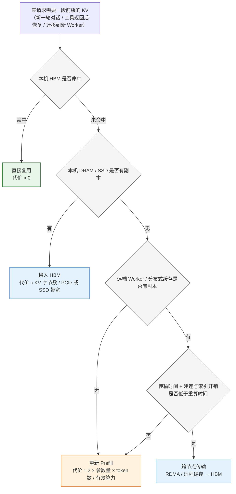

> **NOTE** 本文基于 vLLM v0.27.1（tag `6e448d0`, 2026-08-11）源码剖析。文中文件路径、类名和函数名均以该版本为准；vLLM 迭代很快，阅读时请以你手上的版本对照。


在前面各篇中，我们围绕 vLLM 的核心机制展开了讨论：模型如何加载，算子如何执行，请求如何调度，以及 KV Cache 如何管理。

这些机制解决的是一个核心问题：

> 如何让一次模型推理更高效？

但在真实生产环境中，请求正在变得越来越复杂。一个请求可能包含超长上下文、多轮对话、工具调用、Session 状态，以及图像、音频或视频输入。它不再是一次短暂的函数调用，而可能是一个持续数分钟甚至数小时的分布式任务。

因此，Serving 系统需要管理的对象已经从单纯的模型计算扩展为：

```text
计算
+ KV Cache
+ Session
+ 请求状态
+ 调度计划
+ 故障恢复信息
```

本篇要回答的核心问题是：

> **未来的 Serving 系统，是否会从一个模型执行器，演化为统一管理计算、状态和调度的分布式系统？如果会，vLLM 在其中处于什么位置？**

## 一、总览：三个平面

### 1. 核心问题的改变

Serving Infra 的核心问题也随之改变：

```text
计算在哪里执行？
状态存储在哪里？
请求如何被调度、迁移和恢复？
```

这三个问题分别对应：

- **计算平面**：编译器、并行策略和执行计划；
- **状态平面**：KV Cache、Prefix Cache 和 Session；
- **调度平面**：请求路由、容量编排、弹性和恢复。

Serving 系统正在从“模型执行器”演进为“分布式智能操作系统”。本篇按这三个平面展开：先看 Serving 系统正在管理什么、性能指标为何需要重新定义；再依次讨论计算（自动执行计划与自动化并行）、状态（Inference State Plane）、调度（分布式执行）与弹性（状态恢复）；最后回到 vLLM 的位置与边界、AI Serving Operating System 的图景，以及 Serving Engineer 的角色变化。

### 2. 本文的章节安排

```text
第二章  Serving 系统正在管理什么       从请求响应到智能任务；性能指标需要重新定义
第三章  计算：从手工并行到自动执行计划  手写 Kernel 的边界；Serving Plan Compiler
第四章  自动化并行与容量编排           自动并行、拓扑感知规划、Prefill/Decode 容量均衡、MoE 与专家资源
第五章  状态：从 KV Cache 到 Inference State Plane  分层 KV Cache、Cache-aware Scheduling、状态平面
第六章  调度：从单体 Engine 到分布式执行  PD 解耦、KV Transfer、请求与状态迁移、Speculative Serving
第七章  弹性：从故障重试到状态恢复      故障模型、Goodput 驱动的调度、异构硬件与能耗感知
第八章  vLLM 的位置与边界
第九章  AI Serving Operating System
第十章  Serving Engineer 的角色变化
第十一章 本文小结                     Serving 的下一站
```

## 二、Serving 系统正在管理什么

### 1. 从请求响应到智能任务

早期的推理服务可以抽象为一个简单流程：

```text
输入请求
    ↓
模型执行
    ↓
输出结果
```

请求之间相互独立，模型没有显式的长期状态。系统关注的指标也相对简单：

- 每秒生成多少 token；
- 单请求延迟是多少；
- GPU 利用率是多少；
- 系统支持多少并发。

但 Agent、长上下文和多模态应用改变了这一模型。

一次任务可能经历：

```text
接收请求
   ↓
Prefill
   ↓
生成一部分结果
   ↓
调用外部工具
   ↓
等待工具返回
   ↓
恢复上下文
   ↓
继续生成
```

在这个过程中，GPU 只是任务使用的资源之一。KV Cache、Session、工具调用结果和调度元数据，同样需要被保存、迁移和恢复。

Serving 系统管理的对象因此从“请求”扩展为“带状态的任务”。

### 2. 性能指标需要重新定义

吞吐和延迟仍然重要，但已经不足以描述生产系统的真实质量。

系统还需要关注：

- TTFT：首 token 延迟；
- TPOT：平均输出 token 时间；
- ITL：token 间延迟；
- SLO 满足率；
- 请求超时率；
- KV Cache 命中率；
- 每百万 token 成本；
- 单位能耗；
- 故障恢复时间。

其中，Goodput 比单纯吞吐更接近生产环境的目标：

$$
\text{Goodput}
=
\frac{\text{满足 SLO 的有效请求或 token 数}}
{\text{总资源消耗}}
$$

一个系统即使拥有很高的 tokens/s，如果大量请求超时，或者消耗了过多 GPU，也不能称为高效。

未来的 Serving 系统追求的不是“生成更多 token”，而是 **在满足 SLO 的前提下，以更低的成本完成更多有效任务。**


## 三、计算：从手工并行到自动执行计划

### 1. 手写 Kernel 的边界

在深度学习系统发展的早期，性能优化主要依赖专家手写 Kernel：

- CUDA Kernel；
- Triton Kernel；
- 融合算子；
- 针对特定 GPU 的矩阵乘法；
- 针对特定 Attention 结构的实现。

这种方式依然重要。对于关键路径上的核心算子，手写 Kernel 通常能够提供很高的性能上限。

但模型和硬件的快速变化，也暴露了这种方式的局限：

- 模型结构越来越复杂；
- 硬件架构越来越多；
- Prefill 和 Decode 的执行特征不同；
- 最优实现依赖 Batch、上下文长度和数据类型；
- Kernel 数量和维护成本持续增加。

同一个 Attention 算子，在短上下文、长上下文、Prefill、Decode 和不同量化精度下，可能需要完全不同的实现。

因此，未来的优化对象不会只是单个 Kernel，而是完整的执行计划。

### 2. Serving Plan Compiler

未来的 Serving 编译器可以被抽象为 **Serving Plan Compiler**。

它的输入包括：

```text
模型结构
+ 输入输出特征
+ 硬件拓扑
+ 显存容量
+ 网络能力
+ 并行策略
+ KV Cache 策略
+ SLO 目标
+ 负载预测
```

输出则是一套完整的执行计划：

```text
算子实现
+ 融合方式
+ 张量布局
+ 内存分配
+ 并行方案
+ Batch 策略
+ Cache 策略
+ 通信路径
+ 调度参数
```

编译器的边界因此逐步扩大：

```text
Kernel Compiler
        ↓
Graph Compiler
        ↓
Model Compiler
        ↓
Serving Plan Compiler
```

这并不意味着手写 Kernel 会消失。更现实的方向是编译器和专家插件协同工作：

- 编译器负责搜索和组合；
- 专家 Kernel 作为高性能插件；
- Runtime 根据负载选择不同实现；
- 在线 Profiling 持续修正执行计划；
- 执行计划与硬件拓扑绑定。

未来，一个模型可能不再只有一份固定的执行代码，而是拥有多套计划：

```text
短请求计划
长上下文计划
高并发 Decode 计划
低延迟计划
高吞吐计划
低成本计划
```

Runtime 根据请求特征和集群状态选择合适的计划。


## 四、自动化并行与容量编排

自动化并行是 Serving Infra 下一阶段最重要的演进方向之一。

它解决的问题不是“如何启动更多副本”，而是：**如何根据模型、硬件拓扑、请求负载和 SLO，自动生成合适的分布式执行方案。**

### 1. 从手工配置到自动并行

当前部署大模型，通常需要人工配置：

- Tensor Parallel；
- Pipeline Parallel；
- Data Parallel；
- Expert Parallel；
- Context Parallel；
- Prefill 和 Decode 的 Worker 数量；
- KV Cache 的传输路径；
- Batch 和调度参数。

这些参数并不是相互独立的。

例如：

- 增大 TP 可以降低单卡显存压力，但会增加通信；
- PP 可以扩展模型规模，但可能引入流水线气泡；
- DP 可以增加吞吐，但需要复制模型和 Cache；
- EP 可以减少专家计算，但对 All-to-All 网络提出更高要求；
- CP 可以支持更长上下文，但会增加状态交换。

并行策略本质上是一个联合优化问题：

$$
P^*
=
\arg\min_{P}
\left(
C_{\text{compute}}
+
C_{\text{memory}}
+
C_{\text{communication}}
\right)
$$

同时满足：

$$
\text{TTFT}(P) \leq SLO_{\text{prefill}}
$$

$$
\text{TPOT}(P) \leq SLO_{\text{decode}}
$$

其中，\(P\) 代表完整的并行与部署计划。

### 2. 自动化并行与 PD 容量均衡

自动化并行和 Prefill/Decode 容量均衡处于不同层次。

```text
模型
  │
  ▼
自动化并行规划
  │
  ├── TP / PP / DP / EP / CP
  ├── GPU 映射
  └── 通信计划
  │
  ▼
Worker 执行单元
  │
  ├── Prefill Worker × N
  └── Decode Worker × M
          │
          ▼
    PD 容量编排
```

**自动化并行策略生成**解决的是：**一个模型或一个 Worker 内部，如何切分计算和资源？**

例如：

```text
TP = 4
PP = 2
EP = 4
```

**PD 容量均衡**解决的是：**整个集群中，Prefill 和 Decode 分别需要部署多少资源？**

例如：

```text
Prefill：8 个 Worker
Decode：24 个 Worker
```

前者决定 Worker 内部如何使用 GPU，后者决定集群中 Prefill 与 Decode 的资源比例。

### 3. 拓扑感知的并行规划

自动化并行不能只看 GPU 数量，还必须理解硬件拓扑：

```text
GPU 拓扑
+ NVLink
+ PCIe 层级
+ NUMA 结构
+ RDMA 路径
+ 交换机带宽
+ 故障域
```

不同并行策略对拓扑的依赖不同：

| 并行方式 | 主要依赖 |
|---|---|
| TP | 低延迟、高带宽互联 |
| PP | Stage 间通信和负载均衡 |
| DP | 跨节点扩展能力 |
| EP | All-to-All 网络能力 |
| CP | 上下文相关状态交换 |
| PD 解耦 | KV Cache 传输路径 |

一个拓扑感知的规划器需要回答：

- 哪些 GPU 应当放入同一个 TP Group？
- 哪些 Pipeline Stage 可以跨节点部署？
- 哪些专家需要复制？
- KV Cache 应该通过哪条路径传输？
- 如何避免多个 All-to-All 共享同一条拥塞链路？

这是一种 **Topology-aware Parallelism Planning**。

### 4. Prefill/Decode 容量均衡

Prefill 和 Decode 的资源特征不同。

Prefill 通常具有更高的计算密度，主要受到输入 token 数和上下文长度影响；Decode 则更容易受到活跃请求数、KV Cache 容量、显存带宽和输出长度影响。

可以用两个简化变量描述负载：

$$
\lambda_{\text{prefill}}
=
\text{输入 token 到达率}
$$

$$
\lambda_{\text{decode}}
=
\text{活跃请求数}
\times
\text{平均输出 token 速率}
$$

当输入长度突然增加时，Prefill 可能成为瓶颈；当输出变长或并发提高时，Decode 可能成为瓶颈。

调度器需要持续观察：

```text
Prefill 队列长度
Decode 队列长度
TTFT
TPOT
活跃序列数
KV Cache 使用率
KV Cache 传输带宽
GPU 利用率
输入输出长度分布
```

然后动态调整：

```text
Prefill 副本数
Decode 副本数
GPU 配额
请求路由
批处理策略
KV Cache 位置
```

这不再是普通的弹性伸缩，而是**面向推理阶段的容量编排。**

### 5. MoE 与专家资源

MoE 模型进一步放大了自动并行的复杂度。

不同时间段、不同用户群体和不同任务类型，可能产生完全不同的专家路由分布，从而导致：

- 某些专家成为热点；
- All-to-All 通信拥塞；
- GPU 之间负载不均；
- 专家容量限制；
- 静态专家映射失效。

未来的 Serving 系统可能需要支持：

- Expert-aware Routing；
- 热门专家动态复制；
- 专家与 GPU 的动态映射；
- 专家负载预测；
- 通信与计算重叠；
- 基于运行时流量调整 EP。

并行策略因此不再只是按照参数切分模型，也需要根据真实 token 流量编排计算资源。


## 五、状态：从 KV Cache 到 Inference State Plane

### 1. KV Cache 已经成为运行时资源

KV Cache 最初只是一次请求生命周期内的临时数据。

但随着上下文长度和 Session 生命周期增加，KV Cache 已经具备了明显的状态属性：

- 占用大量显存；
- 影响请求调度；
- 可以被多个请求复用；
- 可能跨 Worker 迁移；
- 可能需要持久化；
- 决定请求能否快速恢复；
- 影响 PD 解耦的通信成本。

因此，KV Cache 不应再只是模型实例内部的实现细节，而应成为 Serving 系统的一等资源。

Agent 场景把这一点放大得最明显。第二章描述的“生成一部分 → 调用工具 → 等待 → 继续生成”流程中，工具调用的等待可能长达数秒到数分钟，而这段时间里模型并不计算，只是需要在恢复时“记得”前面的上下文。下图对比了同一个请求在三种 KV 处理策略下 HBM 的占用随时间的变化：

```text
时间 ─────────────────────────────────────────────────────────────▶
          Prefill  Decode   工具调用等待（秒 ~ 分钟级）    Decode（续）
          ┌───────┬────────┬────────────────────────────┬────────────┐
A 常驻    │  HBM  │  HBM   │ HBM 持续占用，其他请求排队 │    HBM     │
          ├───────┼────────┼────────────────────────────┼────────────┤
B Offload │  HBM  │  HBM   │ 换出→DRAM/SSD ····· 换入→  │    HBM     │
          ├───────┼────────┼────────────────────────────┼────────────┤
C 丢弃重算│  HBM  │  HBM   │ 释放 HBM，仅保留会话文本   │ Prefill' → Decode
          └───────┴────────┴────────────────────────────┴────────────┘
HBM 占用  A ████████████████████████████████████████████████████████
          B ████████████████                            ████████████
          C ████████████████                            ██████████████
```

- **A 常驻**：KV 一直留在 HBM，恢复最快，但等待期间白白占着最稀缺的资源，等待越久、并发越高，被挤掉的请求越多；
- **B Offload**：等待开始时把 KV 换出到 CPU 内存或 SSD，恢复前再换回，HBM 在空窗期可服务其他请求，代价是两次搬运的带宽和恢复时的一小段延迟；
- **C 丢弃重算**：直接释放 KV，恢复时把整段会话重新 Prefill，实现最简单，但上下文越长，重算的 TTFT 和算力开销越大。

三种策略没有绝对优劣：短会话、等待极短时 A 或 C 更划算；长上下文、长等待的 Agent 任务则几乎必须走 B。这个选择本身就是一种调度决策，而它的前提是 KV Cache 有除 HBM 之外的去处——也就是下面要讨论的分层存储。

### 2. 分层 KV Cache

单一的 GPU HBM 很难同时满足超长上下文和长生命周期 Session 的需求。

未来的 KV Cache 可能采用分层存储：

```text
GPU HBM
    ↓
CPU 内存
    ↓
本地 SSD
    ↓
远程内存或分布式缓存
```

不同层级具有不同的容量、带宽和访问延迟：

- HBM：速度快，但容量有限；
- CPU 内存：容量更大，但访问延迟更高；
- 本地 SSD：容量大，但随机访问较慢；
- 远程内存：便于共享和迁移，但依赖网络。

把这四层放在一起看，容量与带宽之间大约相差一到两个数量级，而各层的“换入路径”决定了它适合放什么样的 KV（数值为当前主流硬件的典型量级，仅用于比较）：

| 层级 | 典型容量 | 换入 HBM 的带宽 | 访问延迟 | 适合存放的 KV |
|---|---|---|---|---|
| GPU HBM | 单卡 80–192 GB | 本地，3–8 TB/s | ~百 ns | 活跃请求正在 Decode 的 KV |
| CPU 内存 | 单机 1–2 TB | PCIe Gen5 x16，约 64 GB/s | ~µs | 短暂空闲的会话（工具调用等待、轮次间隔） |
| 本地 SSD | 单机数 TB–数十 TB | NVMe 单盘 7–14 GB/s | ~100 µs | 长时间空闲但会回来的 Session、长文档前缀 |
| 远程内存 / 分布式缓存 | 集群级池化 | RDMA 单网卡 400–800 Gb/s（50–100 GB/s） | ~10 µs 起 + 排队 | 需要跨 Worker 共享或迁移的前缀（PD 解耦、请求迁移） |

值得注意的是，远程内存的带宽并不比本地 SSD 差，甚至可能更高——它的劣势不在带宽，而在共享网络的排队与拥塞不可控，以及数据不在本机、命中与否依赖全局索引。这也是为什么下面的“传输还是重算”不能静态决定。

调度器需要决定：

- 哪些 KV 保留在 HBM；
- 哪些 KV 可以 Offload；
- 哪些 KV 需要压缩；
- 哪些 KV 可以重计算；
- 哪些 KV 需要复制；
- 哪些 KV 可以淘汰。

对于短上下文，重新计算可能比跨节点传输更便宜；对于超长上下文，传输则可能明显优于重新 Prefill。

“传输还是重算”将成为运行时决策。

这个决策可以画成一棵查找树：调度器沿着分层存储从近到远逐级查找，只有在本机没有副本、而远端有副本时，才真正需要在“传输”和“重算”之间做代价比较：



三个叶子的代价模型很不一样：本机换入是纯带宽问题，跨节点传输是带宽加上不可控的网络排队，重算则是算力问题。以一个 80 层、8 个 KV 头、head_dim 128 的模型为例，FP16 下每个 token 的 KV 约为 2 × 80 × 8 × 128 × 2 B ≈ 320 KB，32K 上下文就是约 10 GB——在 50 GB/s 的 RDMA 链路上传输约 0.2 s，而在单卡上重算 32K token 的 Prefill 通常需要数秒，传输明显占优；反过来，几百 token 的短前缀只有几十 MB，传输本身很快，但建连、查索引、等待对端配合的固定开销可能比直接重算还长。所以比较的两边都随上下文长度、链路状态和当前算力余量变化，只能在运行时决定。

### 3. Cache-aware Scheduling

当 KV Cache 成为共享状态后，请求调度就不能只考虑哪个 Worker 当前最空闲。

调度器还需要考虑：

- Worker 当前负载；
- Prefix Cache 命中情况；
- KV Cache 所在位置；
- 请求迁移成本；
- 网络拓扑；
- Session 粘性；
- Cache 的预期复用价值。

一个 Worker 即使当前负载略高，但已经拥有目标请求的大部分 Prefix Cache，将请求发送到该 Worker 仍可能更优。

调度目标因此从：

```text
选择最空闲的 Worker
```

演进为：

```text
选择计算、状态和网络综合成本最低的 Worker
```

这就是 **Cache-aware Scheduling**，更进一步，也可以称为 **Joint Compute–State Scheduling**。

### 4. Inference State Plane

除了 KV Cache，未来的 Serving 系统还需要管理：

- Prefix Cache；
- 对话历史；
- Agent Session；
- 工具调用结果；
- 多模态中间表示；
- 投机解码状态；
- 模型版本和执行计划。

这些对象可以统一抽象为 **Inference State Plane**，即推理状态平面。

状态平面至少需要提供：

- 状态寻址；
- 生命周期管理；
- 状态放置；
- 状态迁移；
- 状态复制；
- 状态版本管理；
- 状态失效；
- 状态恢复；
- 访问权限；
- 成本控制。

模型执行器只需要声明：

```text
需要哪些状态
产生哪些状态
状态生命周期多长
状态是否允许迁移和复用
```

状态平面则负责：

```text
状态放在哪里
如何传输
何时淘汰
是否压缩
是否复制
如何恢复
```

这将改变 Serving Runtime 的边界：Runtime 不再独占所有状态，而是成为状态平面的一个使用者。

## 六、调度：从单体 Engine 到分布式执行

### 1. Prefill/Decode 解耦

传统 Serving Engine 通常将请求接收、Prefill、Decode、KV Cache 管理和结果输出集中在一个进程或一个 Worker 集群中。

这种方式简单直接，但存在几个限制：

- Prefill 和 Decode 难以独立扩展；
- 长 Prefill 容易影响 Decode；
- 资源无法按阶段精细配置；
- KV Cache 生命周期与 Worker 强绑定；
- 故障和迁移成本较高。

Disaggregated Serving 将不同阶段拆分：

```text
请求入口
   ↓
Prefill 集群
   ↓
KV Cache Transfer
   ↓
Decode 集群
   ↓
流式输出
```

其优势包括：

- Prefill 和 Decode 独立扩缩容；
- 两个阶段可以选择不同并行策略；
- 长短请求可以隔离；
- 资源利用率更容易优化；
- 阶段级故障恢复更加清晰。

但它也引入了新的系统问题：

- KV Cache 如何传输；
- Decode Worker 如何选择；
- 网络带宽是否成为瓶颈；
- 请求和状态如何绑定；
- 失败后重新计算还是恢复状态；
- 如何维护流式输出顺序。

PD 解耦不是简单地拆分两个服务，而是一次执行模型的重构。

### 2. KV Cache Transfer

KV Cache Transfer 的成本取决于：

- 上下文长度；
- KV 头数量；
- 数据精度；
- 传输协议；
- 网络拓扑；
- 是否需要重新布局；
- 是否支持压缩；
- 是否可以与计算重叠。

可能的传输路径包括：

```text
GPU → GPU
GPU → CPU → GPU
GPU → RDMA → GPU
GPU → 远程缓存 → GPU
```

系统需要联合决定：

```text
Prefill 在哪里执行？
KV Cache 放在哪里？
Decode 在哪里执行？
使用哪条传输路径？
是否值得传输，还是直接重算？
```

这使得 KV Cache Transfer 不再是一个底层通信细节，而成为全局调度的一部分。

### 3. 请求迁移与状态迁移

在单体架构中，请求通常与 Worker 强绑定。一旦 Worker 过载或发生故障，请求迁移往往意味着重新开始计算。

在分布式 Serving 中，理想的迁移对象应当包括：

```text
请求
+ KV Cache
+ Session 状态
+ 调度元数据
```

系统还需要区分不同状态的恢复策略：

| 状态类型 | 可能的恢复策略 |
|---|---|
| 短期 KV Cache | 丢弃并重算 |
| 长上下文 KV Cache | 分层持久化或异步复制 |
| Agent Session | 外部状态存储 |
| 工具调用结果 | 事件日志或结果缓存 |
| 执行元数据 | 控制面持久化 |
| 流式输出进度 | 检查点或幂等重放 |

只有当状态可以独立于计算实例存在时，请求迁移才真正可行。

### 4. Speculative Serving

投机解码通常被视为模型优化，但在大规模部署中，它也会成为基础设施能力。

```text
Draft Model
    ↓
生成候选 token
    ↓
Target Model
    ↓
验证候选 token
    ↓
接受或拒绝
```

Serving 系统需要决定：

- Draft Model 和 Target Model 的资源比例；
- 两者是否共置；
- 草稿 token 如何传输；
- 不同请求的投机深度；
- 接受率下降时如何调整；
- 验证失败后的回退策略；
- 多模型版本如何兼容。

因此，投机解码不应只是模型代码中的一个开关，而可以被抽象为：**由 Serving 系统管理的多模型协同执行计划。**


## 七、弹性：从故障重试到状态恢复

### 1. 推理系统的故障模型

传统无状态服务发生故障时，通常只需要重新发送请求。

但对于长上下文和持久化 Session，故障可能造成：

- 大量 KV Cache 丢失；
- Agent 工作流中断；
- 多模态中间结果失效；
- 已完成的 Prefill 被迫重算；
- 长请求重新排队；
- 输出重复或状态不一致。

未来的恢复粒度需要从请求级扩展到：

```text
请求级
Session 级
KV Block 级
Pipeline Stage 级
Worker 级
集群级
```

并非所有状态都需要强一致复制。不同状态可以采用不同策略：

- 短期状态直接丢弃；
- 长期状态异步复制；
- Agent 状态外置存储；
- 工具结果使用事件日志；
- 可重算状态采用检查点或重放。

核心目标不是“永不失败”，而是：**故障发生后，以尽可能低的代价恢复有效执行。**

### 2. Goodput 驱动的调度

GPU 利用率高，并不代表服务质量高。

例如：

- GPU 正在处理大量即将超时的请求；
- 超长请求长期占用批次；
- KV Cache 传输阻塞了计算；
- 高吞吐策略导致尾延迟恶化。

更合理的调度目标应当同时考虑：

- 请求优先级；
- SLO；
- 资源成本；
- 能耗；
- 故障风险；
- Cache 复用收益。

可以将目标表示为：

$$
\max
\left(
\text{Goodput}
-
\alpha \cdot \text{Cost}
-
\beta \cdot \text{SLO Violation}
-
\gamma \cdot \text{Energy}
\right)
$$

这意味着 Serving 调度器会从队列管理器演进为多目标优化系统。

### 3. 异构硬件与能耗感知

未来的推理集群不会只包含一种 GPU，还可能同时使用：

- 不同代际和显存容量的 GPU；
- CPU；
- 专用推理加速器；
- 高带宽内存设备；
- 具备不同网络能力的节点。

不同硬件适合不同任务：

- 大显存设备适合长上下文；
- 高算力设备适合 Prefill；
- 高显存带宽设备适合 Decode；
- 低成本设备适合低优先级请求；
- 高速互联节点适合 TP 或 EP；
- 高网络带宽节点适合 KV Cache Transfer。

请求路由需要综合考虑：

```text
模型兼容性
+ 当前负载
+ 显存容量
+ 网络拓扑
+ 能耗
+ 成本
+ SLO
```

资源调度的目标也将从“把请求放到空闲 GPU”演进为：**把合适的请求放到最适合的硬件上。**


## 八、vLLM 的位置与边界

vLLM 代表了现代 LLM Serving Runtime 的重要发展方向。

通过 PagedAttention、连续批处理、KV Cache 管理和高效调度，vLLM 解决了传统推理系统中的许多关键问题：

- KV Cache 内存碎片；
- 静态 Batch 的低利用率；
- 请求长度差异带来的资源浪费；
- Decode 阶段的动态调度；
- 多请求并发下的显存管理。

从这个意义上说，vLLM 已经不只是一个模型执行库，而是一个具备明显 Runtime 特征的推理系统。

但当系统进一步面对以下场景时，问题会超出单个 Engine 的边界：

- 超大规模跨节点部署；
- Prefill/Decode 物理解耦；
- KV Cache 跨集群迁移；
- 多模型协同；
- Agent Session 持久化；
- 多模态异步流水线；
- 自动并行策略搜索；
- 多租户 SLO 调度；
- 跨硬件资源编排；
- 故障域级别的状态恢复。

因此，vLLM 的下一步不只是继续增加更多高性能 Kernel，也可能是向更完整的 Serving Runtime 和分布式执行平台扩展。

| 问题 | vLLM 的优势 | 下一阶段 |
|---|---|---|
| KV Cache | PagedAttention、Block 管理 | 跨 Worker、跨节点状态平面 |
| 动态批处理 | 连续批处理、请求调度 | 全局 SLO 调度 |
| 单模型执行 | 高效 Runtime | 多阶段、多模型协同 |
| GPU 利用率 | 优化局部执行效率 | Goodput、成本和能耗联合优化 |
| 请求处理 | Engine 内部调度 | 请求迁移与 Session 恢复 |

一个单体 Engine 可以很好地管理局部执行效率，却很难独立解决全局状态、跨阶段调度和集群级资源编排。

未来的 Serving 系统更可能由多个层次共同构成：

```text
模型与编译层
    ↓
Serving Runtime
    ↓
Inference State Plane
    ↓
分布式调度与编排层
    ↓
硬件与数据中心基础设施
```

vLLM 可以成为其中重要的执行层，但完整的 AI Serving Operating System 需要更多组件共同完成。


## 九、AI Serving Operating System

将前面的变化放在一起，可以得到一个未来架构：

```text
┌──────────────────────────────────────┐
│       Agent / Application Layer      │
├──────────────────────────────────────┤
│       Request & Workflow Layer       │
├──────────────────────────────────────┤
│       Global Scheduler / SLO         │
├──────────────────────────────────────┤
│       Inference State Plane          │
├──────────────────────────────────────┤
│       Serving Plan Compiler          │
├───────────────┬──────────────┬───────┤
│ Prefill Pool  │ Decode Pool  │ Tools │
├───────────────┴──────────────┴───────┤
│ GPU / CPU / Memory / Network / SSD   │
└──────────────────────────────────────┘
```

每一层承担不同职责：

- **应用与 Agent 层**：对话、工具调用、多模态任务和多模型协同；
- **工作流层**：请求拆分、任务依赖和阶段转换；
- **全局调度层**：请求路由、优先级、SLO 和容量编排；
- **状态平面**：KV Cache、Prefix Cache、Session 和中间状态；
- **编译层**：算子、内存、通信和并行计划；
- **执行层**：Prefill、Decode、Encoder、Draft Model 和 Target Model；
- **资源层**：GPU、CPU、内存、网络和存储。

在这种架构中，Serving 系统的核心抽象不再是：

```text
一个模型 + 一组 GPU
```

而是：

```text
一组带状态的智能任务
+ 一套动态执行计划
+ 一个可迁移、可恢复的分布式运行时
```

## 十、Serving Engineer 的角色变化

过去，Serving Engineer 主要关注：

- CUDA 和 Kernel；
- 显存；
- Batch；
- 请求队列；
- 模型加载；
- 单机性能。

未来则需要同时理解：

- 编译器；
- 分布式系统；
- 操作系统；
- 网络与 RDMA；
- 存储系统；
- 调度理论；
- 资源编排；
- SLO 与成本模型；
- Agent 状态机；
- 多模态流水线；
- 故障恢复；
- 硬件拓扑。

这并不意味着每个人都必须成为所有领域的专家，而是 Serving 系统本身已经不再允许这些领域彼此割裂。

一个高性能 Kernel，如果无法适应请求调度，可能无法带来有效收益；一个优秀的调度器，如果不了解 KV Cache 位置，可能造成大量网络浪费；一个高效的集群编排器，如果不了解模型并行策略，也可能将资源放在错误的位置。

未来的 Serving Engineer 需要具备系统级视野：

> 不仅要知道模型如何计算，还要知道计算如何被编排、状态如何被管理，以及故障发生后系统如何继续工作。


## 十一、本文小结：Serving 的下一站

LLM Serving 的演进，不只是让模型生成 token 更快。

它正在完成四个转变：

```text
手工配置        → 自动执行计划
本地缓存        → 分布式状态平面
单体推理        → 多阶段分布式执行
GPU 利用率       → Goodput、SLO 与成本联合优化
```

未来的 Serving 系统需要同时管理：

- 可编排的计算；
- 可迁移的状态；
- 可恢复的请求；
- 异构的资源；
- 动态生成的执行计划。

vLLM 解决了高性能模型执行中的许多关键问题，但它代表的更多是 Runtime 层，而不是完整的 AI Serving Operating System。

下一阶段的核心，不再是：**如何在一张 GPU 上更快地运行模型？**

而是：**如何让计算、状态和调度协同工作，使整个智能系统能够在复杂环境中持续、低成本、可恢复地完成任务？**

这就是 Serving Infra 的下一站。


## 下一篇

[回到源码：一次请求在 vLLM 内部的真实旅程](/source-code-request-walkthrough.html)
