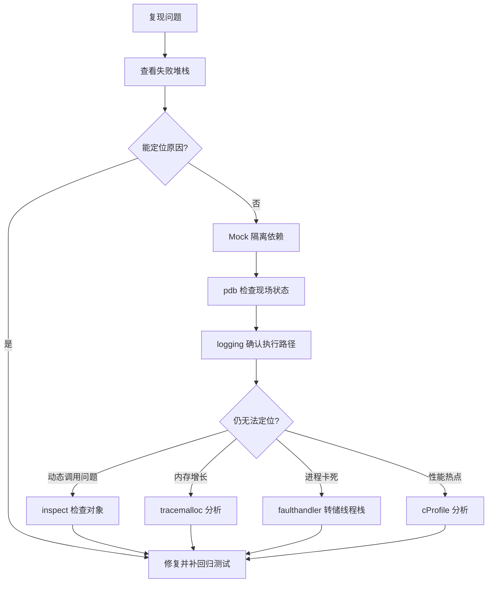

在 AI-Infra 系统中，代码的正确性往往不能只靠阅读来判断。

一个推理服务可能涉及异步调度、动态 batch、多后端切换、插件加载和资源生命周期管理。在这些场景下，逻辑正确但时序错误、类型匹配但运行时值不符、代码不报错但内存持续增长——这些问题在 code review 中很难发现，必须依赖测试和调试工具来定位。

常见的工程挑战包括：

- 异步代码中的超时、取消和资源泄漏难以用肉眼确认；
- Mock 不到位导致测试通过但上线失败；
- 插件和装饰器改变了运行时行为，但调用方看到的仍是旧签名；
- Python 层内存增长缓慢，直到 OOM 时才被发现；
- 进程卡死但没有崩溃，无法从日志判断阻塞位置。

本文不展开完整的测试体系，也不讨论大规模监控平台，而是聚焦 Python 工程师每天会用到的工具：

- **测试**：`pytest`、`unittest.mock`、`pytest-asyncio`、`pytest-cov`；
- **调试**：`pdb`、`logging`、`traceback`、`inspect`；
- **运行时诊断**：`tracemalloc`、`faulthandler`、`cProfile`。


## 一、用 pytest 编写单元测试

### 1. 基本测试结构

项目通常采用如下结构：

```text
project/
├── src/
│   └── inference/
│       ├── batching.py
│       ├── backend.py
│       └── errors.py
├── tests/
│   ├── test_batching.py
│   └── test_backend.py
└── pyproject.toml
```

安装依赖：

```bash
python -m pip install pytest pytest-asyncio pytest-cov
```

运行测试：

```bash
pytest
pytest -q
pytest tests/test_batching.py
pytest tests/test_batching.py::test_split_batches
pytest -k "batch"
```

常用参数：

```bash
pytest -x                 # 第一个失败后停止
pytest -vv                # 输出详细信息
pytest -s                 # 保留 print 输出
pytest --tb=short         # 简化 traceback
pytest --tb=long          # 完整 traceback
pytest --lf               # 只运行上次失败的测试
pytest --pdb              # 失败后自动进入 pdb
```

### 2. 测试边界输入

AI-Infra 中常见的边界包括空输入、最大 batch、非法 shape 和无效 dtype。

```python
import pytest

from inference.batching import split_batches


@pytest.mark.parametrize(
    ("items", "batch_size", "expected"),
    [
        ([], 4, []),
        ([1], 4, [[1]]),
        ([1, 2, 3, 4], 2, [[1, 2], [3, 4]]),
        ([1, 2, 3, 4, 5], 2, [[1, 2], [3, 4], [5]]),
    ],
)
def test_split_batches(items, batch_size, expected):
    assert split_batches(items, batch_size) == expected


@pytest.mark.parametrize("batch_size", [0, -1])
def test_split_batches_rejects_invalid_batch_size(batch_size):
    with pytest.raises(ValueError, match="positive"):
        split_batches([1, 2], batch_size)
```

使用 `pytest.mark.parametrize` 可以避免为相似输入重复编写测试。

### 3. 自定义 marker 分类测试

AI-Infra 项目中，部分测试需要 GPU 或执行时间较长，不适合每次提交都运行。可以通过自定义 marker 分类：

```python
import pytest


@pytest.mark.slow
def test_large_batch_throughput():
    ...


@pytest.mark.gpu
def test_inference_on_cuda():
    ...
```

在 `pyproject.toml` 中注册 marker，避免警告：

```toml
[tool.pytest.ini_options]
markers = [
    "slow: 执行时间较长的测试",
    "gpu: 需要 GPU 的测试",
]
```

按 marker 筛选测试：

```bash
pytest -m "not gpu"         # CI 中跳过 GPU 测试
pytest -m "slow"            # 只运行慢速测试
pytest -m "not slow and not gpu"  # 快速冒烟测试
```

## 二、使用 fixture 管理测试对象

`fixture` 适合创建测试所需的后端、配置和临时资源。

```python
import pytest


class FakeBackend:
    def __init__(self):
        self.started = False
        self.calls = []

    async def start(self):
        self.started = True

    async def stop(self):
        self.started = False

    async def predict(self, inputs):
        self.calls.append(inputs)
        return {"output": inputs}


@pytest.fixture
def backend():
    return FakeBackend()
```

测试生命周期：

```python
@pytest.mark.asyncio
async def test_backend_lifecycle(backend):
    assert backend.started is False

    await backend.start()
    assert backend.started is True

    await backend.stop()
    assert backend.started is False
```

对于临时文件、环境变量和配置，可以使用内置 fixture：

```python
def test_load_config(tmp_path, monkeypatch):
    config_file = tmp_path / "config.yaml"
    config_file.write_text("batch_size: 8")

    monkeypatch.setenv("CONFIG_PATH", str(config_file))

    config = load_config()

    assert config.batch_size == 8
```

### 1. fixture 的 scope 和 yield

默认情况下，fixture 在每个测试函数执行前重新创建。对于代价较高的资源（如加载模型、建立连接池），可以使用 `scope` 控制生命周期：

```python
@pytest.fixture(scope="session")
def model():
    """整个测试会话只加载一次。"""
    return load_model("test-model")


@pytest.fixture(scope="module")
def db_connection():
    """每个测试模块共享一个连接。"""
    conn = create_connection()
    yield conn      # yield 之前是 setup，之后是 teardown
    conn.close()
```

`yield` fixture 在 `yield` 之后的代码作为 teardown 执行，即使测试失败也会运行，适合确保资源释放。

### 2. 使用 conftest.py 共享 fixture

pytest 会自动从 `conftest.py` 文件中收集 fixture，无需显式导入。通常将多个测试模块共用的 fixture 放在 `tests/conftest.py`：

```text
tests/
├── conftest.py          # 共享 fixture：fake_backend, test_config, ...
├── test_batching.py
└── test_backend.py
```

```python
# tests/conftest.py
import pytest


@pytest.fixture
def fake_backend():
    return FakeBackend()


@pytest.fixture
def test_config(tmp_path):
    config_file = tmp_path / "config.yaml"
    config_file.write_text("batch_size: 4\nmax_retries: 2")
    return config_file
```

测试文件直接在参数中引用 fixture 名称即可，pytest 按目录层级向上查找 `conftest.py`。

## 三、用 Mock 隔离模型后端和外部服务

单元测试通常不应真的访问外部服务或执行代价高昂的初始化。可以用 `AsyncMock` 模拟异步依赖。

```python
from unittest.mock import AsyncMock

import pytest


@pytest.mark.asyncio
async def test_predict_passes_inputs_to_backend():
    backend = AsyncMock()
    backend.predict.return_value = {"embedding": [0.1, 0.2]}

    service = InferenceService(backend)

    result = await service.predict({"text": "hello"})

    assert result == {"embedding": [0.1, 0.2]}
    backend.predict.assert_awaited_once_with({"text": "hello"})
```

模拟异常：

```python
@pytest.mark.asyncio
async def test_predict_translates_backend_timeout():
    backend = AsyncMock()
    backend.predict.side_effect = TimeoutError("backend timeout")

    service = InferenceService(backend)

    with pytest.raises(BackendTimeoutError):
        await service.predict({"text": "hello"})
```

检查调用参数：

```python
backend.predict.assert_awaited_once()
inputs = backend.predict.await_args.args[0]

assert inputs["text"] == "hello"
```

### 1. `Mock` 与 `AsyncMock` 的区别

```python
from unittest.mock import Mock, AsyncMock

sync_client = Mock()
async_client = AsyncMock()
```

- 同步函数使用 `Mock`；
- 异步函数使用 `AsyncMock`；
- 不要用普通 `Mock` 模拟需要 `await` 的方法，否则测试可能无法发现协程调用错误。

### 2. 使用 `patch` 替换模块中的对象

前面的例子直接创建 `AsyncMock()` 并注入，适合构造函数接收依赖的场景。对于已经在模块中绑定的对象，可以使用 `unittest.mock.patch`：

```python
from unittest.mock import patch, AsyncMock


@patch("inference.backend.GPUBackend", autospec=True)
def test_service_uses_backend(MockBackend):
    # autospec=True 保留原类的方法签名，调用错误会被发现
    instance = MockBackend.return_value
    instance.predict.return_value = {"result": 42}

    service = create_service()

    assert service.backend is instance
```

也可以作为上下文管理器使用：

```python
async def test_patch_as_context_manager():
    with patch("inference.client.httpx.AsyncClient") as MockClient:
        MockClient.return_value.post = AsyncMock(
            return_value={"status": "ok"}
        )
        result = await send_request({"text": "hello"})

    assert result["status"] == "ok"
```

`patch` 与 `monkeypatch` 的区别：

- `patch` 是 `unittest.mock` 提供的，支持 `autospec`（类型安全）、嵌套替换和装饰器用法，适合替换类、模块级对象；
- `monkeypatch` 是 pytest 内置 fixture，语法更简洁，适合替换环境变量、简单属性和函数。

## 四、异步代码测试

安装并配置 `pytest-asyncio`：

```toml
[tool.pytest.ini_options]
asyncio_mode = "auto"
```

`auto` 模式下，所有 `async def test_*` 函数自动作为 asyncio 测试运行，无需逐个标注 `@pytest.mark.asyncio`。如果项目同时使用 trio 或 anyio，应改为 `strict` 模式并显式标注，避免框架冲突。

测试异步函数：

```python
@pytest.mark.asyncio
async def test_async_predict(backend):
    await backend.start()

    result = await backend.predict({"value": 1})

    assert result == {"output": {"value": 1}}
```

### 1. 测试超时

```python
@pytest.mark.asyncio
async def test_request_timeout():
    backend = AsyncMock()

    async def slow_predict(_):
        await asyncio.sleep(10)

    backend.predict.side_effect = slow_predict

    with pytest.raises(asyncio.TimeoutError):
        await asyncio.wait_for(
            backend.predict({"input": 1}),
            timeout=0.01,
        )
```

### 2. 测试取消

```python
@pytest.mark.asyncio
async def test_request_cancellation():
    started = asyncio.Event()
    stopped = asyncio.Event()

    async def slow_request():
        started.set()
        try:
            await asyncio.sleep(10)
        finally:
            stopped.set()

    task = asyncio.create_task(slow_request())

    await started.wait()
    task.cancel()

    with pytest.raises(asyncio.CancelledError):
        await task

    assert stopped.is_set()
```

这里不仅检查任务收到取消，还检查 `finally` 是否执行，以确认清理逻辑生效。

### 3. 检测未等待的协程

```bash
pytest -W error::RuntimeWarning
```

也可以使用静态检查工具：

```bash
ruff check .
mypy src/
```

未使用 `await` 的代码可能不会立刻失败，因此应结合测试和静态检查。

> 关于 asyncio 事件循环、超时、取消和 `TaskGroup` 的详细机制，参见[《Python 并发、异步与任务协作》](/python-concurrency-asynchrony-and-task-collaboration.html)。

## 五、使用 monkeypatch 修改运行环境

`monkeypatch` 适合临时修改：

- 环境变量；
- 配置路径；
- 模块函数；
- 系统时间；
- 外部调用。

```python
def test_backend_url_from_environment(monkeypatch):
    monkeypatch.setenv("BACKEND_URL", "http://test-backend")

    config = load_config()

    assert config.backend_url == "http://test-backend"
```

替换外部函数：

```python
def test_model_path(monkeypatch):
    monkeypatch.setattr(
        "inference.loader.download_model",
        lambda _: "/tmp/fake-model",
    )

    path = load_model("demo")

    assert path == "/tmp/fake-model"
```

注意：必须替换“被测试模块中实际使用的名称”，而不是盲目替换定义它的原始模块。

例如：

```python
# service.py
from loader import download_model
```

此时应替换：

```python
monkeypatch.setattr("service.download_model", fake_download)
```

而不是：

```python
monkeypatch.setattr("loader.download_model", fake_download)
```

> 理解 `monkeypatch` 的替换目标，需要了解 Python 的模块导入和名称绑定机制，参见[《Python 核心机制与工程基础》](/python-core-mechanisms-and-engineering-fundamentals.html)。

## 六、使用 pdb 定位 Python 逻辑问题

最直接的方式是在代码中插入：

```python
breakpoint()
```

或：

```python
import pdb

pdb.set_trace()
```

运行测试：

```bash
pytest -s tests/test_scheduler.py
```

常用命令：

```text
n              执行下一行
s              进入当前函数调用
r              执行到当前函数返回
c              继续运行
p variable     打印变量
pp variable    格式化打印变量
l              查看当前代码
w              查看调用栈
u              向上移动调用栈
d              向下移动调用栈
q              退出调试
```

测试失败时自动进入调试器：

```bash
pytest --pdb
```

只调试某个测试：

```bash
pytest -s tests/test_scheduler.py::test_timeout_request
```

在 AI-Infra 代码中，断点通常应放在：

- 请求进入调度器的位置；
- batch 形成的位置；
- 后端调用前；
- 异常转换的位置；
- 任务取消的回调中；
- 生命周期状态变化的位置。

## 七、日志：从调试打印到生产配置

日志有两个不同的使用场景：**调试期**临时开 `DEBUG` 看清执行路径，和**生产期**作为常态的可观测性手段。前者关心"我现在想看什么"，后者关心"出问题时能不能查到"。本章先讲前者，再讲后者的配置。

### 1. 用日志替代盲目打印

调试异步和并发代码时，`print()` 往往无法说明日志来自哪个任务。应使用结构化日志或至少带上关键上下文。

```python
import logging

logger = logging.getLogger(__name__)


async def predict(self, request_id, inputs):
    logger.debug(
        "prediction started request_id=%s model=%s",
        request_id,
        self.model_name,
    )

    try:
        result = await self.backend.predict(inputs)
    except Exception:
        logger.exception(
            "prediction failed request_id=%s model=%s",
            request_id,
            self.model_name,
        )
        raise

    logger.debug(
        "prediction finished request_id=%s model=%s",
        request_id,
        self.model_name,
    )
    return result
```

启用调试日志：

```bash
pytest -o log_cli=true --log-cli-level=DEBUG
```

或在应用中：

```python
logging.basicConfig(
    level=logging.DEBUG,
    format="%(asctime)s %(levelname)s %(name)s %(message)s",
)
```

调试日志建议包含：

- request ID；
- task 名称；
- 组件或服务名；
- 关键业务参数；
- 状态变化；
- 调用耗时；
- 异常阶段。

不要直接记录密钥、敏感数据或大型数据结构。

### 2. logging 的四个组件

上面用的都是 `logger.debug()` 这类调用。要把日志配成生产可用，需要理解 `logging` 模块的四个组件——它们的职责划分和 Logback 几乎一一对应：

| 组件 | 职责 | Logback 对应 |
|---|---|---|
| `Logger` | 日志的入口，按名字组织成树 | `Logger` |
| `Handler` | 决定日志输出到哪里（stdout、文件、网络） | `Appender` |
| `Formatter` | 决定日志长什么样 | `Layout` / `Encoder` |
| `Filter` | 决定哪些记录被放过，可以改写记录 | `Filter` |

一条日志的流动路径是：`Logger` → `Filter` → 沿 logger 树向上传播 → 各级 `Handler` → `Formatter` → 输出。

```python
import logging
import sys

logger = logging.getLogger("inference")
logger.setLevel(logging.INFO)

handler = logging.StreamHandler(sys.stdout)
handler.setFormatter(
    logging.Formatter(
        "%(asctime)s %(levelname)s %(name)s [%(process)d] %(message)s"
    )
)
logger.addHandler(handler)
```

注意**级别有两道关卡**：`Logger` 的级别和 `Handler` 的级别。日志要先通过 logger 的级别，再通过 handler 的级别才会被输出。一个常见困惑是"我设了 `logger.setLevel(DEBUG)` 但看不到 DEBUG 日志"——通常是 handler 的级别还停在默认的 `WARNING`。

### 3. logger 的树结构与 propagate

`logging.getLogger(__name__)` 这个写法之所以是惯例，是因为 logger 的名字用 `.` 分隔构成一棵树：

```text
root
└── inference
    ├── inference.engine
    └── inference.backends
        └── inference.backends.torch
```

日志记录默认会**向上传播**（propagate）到所有祖先 logger 的 handler。这带来两个实用后果：

**其一，只需在根部配一次 handler**，所有子 logger 的日志都会流到它。

**其二，可以按模块粒度调级别**，这在排查问题时非常有用：

```python
# 全局 INFO，但把某个模块单独开到 DEBUG
logging.getLogger("inference").setLevel(logging.INFO)
logging.getLogger("inference.backends.torch").setLevel(logging.DEBUG)

# 反过来，压掉过于啰嗦的第三方库
logging.getLogger("httpx").setLevel(logging.WARNING)
logging.getLogger("urllib3").setLevel(logging.WARNING)
```

最后这一条在 AI-Infra 项目里几乎必备——`httpx`、`urllib3`、`filelock`、`transformers` 在 DEBUG 级别下会淹没你真正想看的日志。

如果同一条日志出现了两遍，通常是**同时给子 logger 和 root 加了 handler**，而 `propagate` 还是默认的 `True`。要么只在一处加 handler，要么显式关闭传播：

```python
logger.propagate = False
```

### 4. 库与应用的责任分工

这一条是最容易出错的地方，规则很明确：

**库（library）只创建 logger，不配置输出。**

```python
# 库代码里：正确
import logging

logger = logging.getLogger(__name__)


def predict(x):
    logger.debug("predicting shape=%s", x.shape)
    ...
```

```python
# 库代码里：错误
logging.basicConfig(level=logging.DEBUG)      # 篡改了调用方的全局配置
logger.addHandler(logging.StreamHandler())    # 强加输出，可能导致重复日志
```

原因是 `basicConfig()` 配置的是 **root logger**，属于应用的决策权。库擅自调用它，会覆盖或干扰使用者自己的日志配置——而使用者往往完全不知道是哪个依赖干的。

**应用（application）在入口处配置一次输出。**

```python
# main.py / cli.py：应用入口
import logging
import sys


def setup_logging(level: str = "INFO") -> None:
    logging.basicConfig(
        level=level,
        format="%(asctime)s %(levelname)s %(name)s %(message)s",
        stream=sys.stdout,
        force=True,        # 覆盖已有配置，避免被依赖抢先配置过
    )
    for noisy in ("httpx", "urllib3", "filelock"):
        logging.getLogger(noisy).setLevel(logging.WARNING)
```

如果库确实想在没有任何配置时避免"No handlers could be found"这类警告，标准做法是加一个 `NullHandler`——它什么也不做，只是占位：

```python
# 库的 __init__.py
import logging

logging.getLogger(__name__).addHandler(logging.NullHandler())
```

对应 Java：这正是 SLF4X 门面模式解决的同一个问题——库依赖 SLF4J API 而不绑定具体实现，由应用选择 Logback 还是 Log4j2。Python 没有门面层，靠"库不配置"这个约定来达到同样的效果。

### 5. 结构化日志与采集

生产环境的日志要被机器消费（检索、聚合、告警），纯文本不好解析。JSON 格式更合适：

```python
import json
import logging


class JsonFormatter(logging.Formatter):
    def format(self, record: logging.LogRecord) -> str:
        payload = {
            "ts": self.formatTime(record, "%Y-%m-%dT%H:%M:%S%z"),
            "level": record.levelname,
            "logger": record.name,
            "msg": record.getMessage(),
            "pid": record.process,
        }
        if record.exc_info:
            payload["exc"] = self.formatException(record.exc_info)
        # 把 extra= 传入的自定义字段带上
        for key, value in getattr(record, "extra_fields", {}).items():
            payload[key] = value
        return json.dumps(payload, ensure_ascii=False)
```

生产项目一般不自己写，用现成的库（`python-json-logger`、`structlog`）即可。

**输出到 stdout，不要自己写文件**。容器化部署下，日志采集是平台的职责：容器运行时会捕获 stdout/stderr 交给采集侧。应用自己写文件和做轮转会带来额外问题——文件在容器里、需要挂卷、需要自己处理轮转和清理。

```python
logging.basicConfig(stream=sys.stdout, ...)     # 推荐
# 而不是 logging.FileHandler("/var/log/app.log")
```

配合容器环境还要注意 `PYTHONUNBUFFERED=1`，否则 stdout 会被缓冲，日志出现延迟甚至在崩溃时丢失。

> 容器化部署下的日志采集、`PYTHONUNBUFFERED` 等环境变量设置，见[《Python 工程化：从依赖管理到生产交付》](/python-engineering-from-dependency-to-delivery.html)的容器化一章。

### 6. 注入请求上下文

生产日志最有价值的字段往往是 request ID / trace ID——它让你能把一次请求在各个模块产生的所有日志串起来。但手工在每个 `logger.info()` 里传 request ID 既啰嗦又容易漏。

`contextvars` 配合 `logging.Filter` 可以自动注入：

```python
import contextvars
import logging

request_id_var: contextvars.ContextVar[str] = contextvars.ContextVar(
    "request_id", default="-"
)


class RequestContextFilter(logging.Filter):
    def filter(self, record: logging.LogRecord) -> bool:
        # Filter 除了过滤，也可以给记录附加字段
        record.request_id = request_id_var.get()
        return True


handler = logging.StreamHandler()
handler.addFilter(RequestContextFilter())
handler.setFormatter(
    logging.Formatter("%(asctime)s %(levelname)s [%(request_id)s] %(name)s %(message)s")
)
```

在请求入口处设置一次，之后该请求内所有日志自动带上：

```python
@app.middleware("http")
async def add_request_id(request, call_next):
    token = request_id_var.set(request.headers.get("x-request-id", str(uuid.uuid4())))
    try:
        return await call_next(request)
    finally:
        request_id_var.reset(token)
```

`ContextVar` 的关键性质是它在 asyncio 任务间是隔离的——每个 Task 有自己的上下文副本，并发请求不会互相污染。这一点是它能替代 `threading.local` 用在异步代码里的原因。

> `ContextVars` 的完整机制、与 `threading.local` 的差异、以及在 `TaskGroup` 和线程池中的传播规则，见[《Python 并发、异步与任务协作》](/python-concurrency-asynchrony-and-task-collaboration.html)的 ContextVars 一章。

### 7. 与 SLF4J + Logback 对照

| 关注点 | Java | Python |
|---|---|---|
| 门面 / API | SLF4J | 无门面，`logging` 本身即标准 |
| 实现 | Logback / Log4j2 | `logging`（标准库） |
| 输出目标 | Appender | Handler |
| 格式 | Layout / Encoder | Formatter |
| 过滤 | Filter | Filter（且可改写记录） |
| 配置方式 | `logback.xml` | 代码配置 / `dictConfig` / `fileConfig` |
| 层级与继承 | logger 名按包名分层 | logger 名按 `__name__` 分层 |
| MDC（诊断上下文） | `MDC.put()`（ThreadLocal） | `ContextVar` + Filter |
| 异步日志 | AsyncAppender | `QueueHandler` + `QueueListener` |
| 惰性格式化 | `log.info("x={}", x)` | `logger.info("x=%s", x)` |

最后一行值得强调：**Python 也要用惰性格式化**。

```python
# 好：只有该级别真的会输出时才做字符串格式化
logger.debug("shape=%s dtype=%s", tensor.shape, tensor.dtype)

# 坏：无论级别如何，f-string 总会被求值
logger.debug(f"shape={tensor.shape} dtype={tensor.dtype}")
```

在被频繁调用的路径上，被关闭的 DEBUG 日志如果用了 f-string，格式化开销依然存在。这与 SLF4J 推荐 `{}` 占位符而非字符串拼接是同一个道理。

如果日志量本身成为瓶颈，可以像 Logback 的 `AsyncAppender` 一样把 I/O 移出主线程：

```python
import logging.handlers
import queue

log_queue: queue.Queue = queue.Queue(-1)
queue_handler = logging.handlers.QueueHandler(log_queue)
listener = logging.handlers.QueueListener(log_queue, real_handler)
listener.start()
```

这在异步服务里尤其有意义——写日志是同步 I/O，直接在协程里做会阻塞事件循环。

## 八、检查异常链和调用栈

不要吞掉原始异常：

```python
try:
    result = await backend.predict(inputs)
except TimeoutError as exc:
    raise BackendTimeoutError("prediction timed out") from exc
```

查看完整异常：

```python
import traceback

try:
    run_inference()
except Exception:
    traceback.print_exc()
```

测试异常链：

```python
with pytest.raises(BackendTimeoutError) as exc_info:
    await service.predict(inputs)

assert isinstance(exc_info.value.__cause__, TimeoutError)
```

如果只写：

```python
except Exception:
    raise RuntimeError("prediction failed")
```

原始异常上下文可能丢失，后续很难判断问题究竟发生在网络、后端还是 Python 转换层。

## 九、使用 inspect 排查动态调用问题

插件、装饰器和适配器出问题时，可以使用 `inspect` 检查实际对象。

```python
import inspect

print(inspect.getmodule(plugin))
print(inspect.getsourcefile(plugin.__class__))
print(inspect.signature(plugin.predict))
print(plugin.__class__.__mro__)
```

检查异步函数：

```python
if not inspect.iscoroutinefunction(plugin.predict):
    # 插件声明为异步接口但实际是同步实现，
    # 需要用 run_in_executor 包装以避免阻塞事件循环
    original = plugin.predict

    async def async_wrapper(*args, **kwargs):
        loop = asyncio.get_running_loop()
        return await loop.run_in_executor(None, original, *args)

    plugin.predict = async_wrapper
```

这可以快速发现：

- 加载的不是预期插件；
- 方法被装饰器替换；
- 本应异步的方法实际是同步函数；
- 运行环境使用了旧版本代码；
- 子类继承关系不符合预期。

> 关于反射、`__init_subclass__` 注册和插件发现机制的详细讨论，参见[《反射、元编程与插件化机制》](/python-reflection-metaprogramming-and-plugin-architecture.html)。

## 十、使用 tracemalloc 定位 Python 内存增长

```python
import tracemalloc

tracemalloc.start()

snapshot_before = tracemalloc.take_snapshot()

run_requests()

snapshot_after = tracemalloc.take_snapshot()

for statistic in snapshot_after.compare_to(
    snapshot_before,
    "lineno",
)[:10]:
    print(statistic)
```

命令行调试：

```bash
PYTHONTRACEMALLOC=25 python app.py
```

需要注意：

- `tracemalloc` 主要追踪 Python 分配；
- 不能完整反映 C/C++ 扩展内存；
- 不能直接反映 GPU 显存；
- RSS 增长但 `tracemalloc` 无明显变化时，应检查原生库、mmap 或框架分配器。

检查对象是否仍被引用：

```python
import gc

gc.collect()
print(gc.get_stats())
```

对于特定对象，可以使用：

```python
import weakref

reference = weakref.ref(obj)
del obj
gc.collect()

assert reference() is None
```

> 关于 Python 引用计数、分代 GC、pymalloc 分配器以及 GPU 显存管理的完整讨论，参见[《Python 内存管理与优化》](/python-memory-management-and-optimization.html)。

## 十一、使用 faulthandler 排查卡死

当 Python 进程没有崩溃，但长时间无响应时，可以启用：

```bash
python -X faulthandler app.py
```

也可以在代码中启用：

```python
import faulthandler

faulthandler.enable()
```

定时打印所有线程的调用栈：

```python
faulthandler.dump_traceback_later(10, repeat=True)
```

取消定时转储：

```python
faulthandler.cancel_dump_traceback_later()
```

这对排查以下问题很有用：

- 线程死锁；
- 事件循环被同步调用阻塞；
- 某个线程卡在锁上；
- 外部调用长时间不返回；
- 服务看似存活但没有处理请求。

## 十二、使用 cProfile 判断 Python 热点

对单个函数进行分析：

```bash
python -m cProfile -s cumulative script.py
```

生成可视化分析文件：

```bash
python -m cProfile -o profile.out script.py
```

使用 `pstats` 查看：

```python
import pstats

stats = pstats.Stats("profile.out")
stats.sort_stats("cumulative")
stats.print_stats(20)
```

适合定位：

- Python 层循环；
- 高频函数调用；
- 序列化耗时；
- 过多的属性访问；
- 不必要的对象转换。

如果主要时间消耗在 C/CUDA 调用中，`cProfile` 只能看到 Python 等待调用的表面，不能替代底层运行时分析工具。

## 十三、用 pytest-cov 检查测试覆盖范围

运行：

```bash
pytest --cov=src --cov-report=term-missing
```

生成 HTML 报告：

```bash
pytest \
  --cov=src \
  --cov-report=html
```

查看：

```text
htmlcov/index.html
```

覆盖率重点关注：

- 异常分支；
- 超时和取消分支；
- 生命周期清理；
- 配置失败路径；
- 重试和降级逻辑；
- 插件加载失败路径。

覆盖率高不等于测试质量高。如果测试只执行成功路径，分支覆盖率仍然可能不足。

## 十四、调试决策树

遇到问题时，根据症状选择工具：

| 症状 | 首选工具 | 命令 |
|------|----------|------|
| 测试失败，需要看现场变量 | pdb | `pytest -x --pdb` |
| 不确定执行走了哪个分支 | logging | `pytest -s -o log_cli=true --log-cli-level=DEBUG` |
| 异步代码中出现未 await 的协程 | RuntimeWarning | `pytest -W error::RuntimeWarning` |
| 怀疑 Mock 没有生效 | assert_awaited / call_args | 检查 `mock.call_args_list` |
| 插件加载了错误的实现 | inspect | `inspect.getmodule()` / `inspect.getsourcefile()` |
| 测试通过但不确定覆盖了哪些分支 | pytest-cov | `pytest --cov=src --cov-report=term-missing` |
| Python 进程 RSS 持续增长 | tracemalloc | `PYTHONTRACEMALLOC=25 python app.py` |
| 进程卡死，不崩溃也无日志 | faulthandler | `python -X faulthandler app.py` |
| Python 层响应变慢 | cProfile | `python -m cProfile -s cumulative script.py` |
| 需要快速验证单个函数 | pytest -q | `pytest -q tests/test_backend.py::test_xxx` |
| 需要静态检查类型和风格 | ruff + mypy | `ruff check . && mypy src/` |

## 附：Java 与 Python 测试调试工具对照

| 维度 | Java | Python |
|------|------|--------|
| 测试框架 | JUnit 5 | pytest |
| 参数化测试 | `@ParameterizedTest` + `@CsvSource` | `@pytest.mark.parametrize` |
| Mock 框架 | Mockito | `unittest.mock`（`Mock` / `AsyncMock`） |
| 模块级替换 | Spring `@MockBean` / PowerMock | `unittest.mock.patch` / `monkeypatch` |
| 异步测试 | `CompletableFuture` + JUnit | `pytest-asyncio` |
| 测试资源管理 | `@BeforeEach` / `@AfterEach` | fixture（scope + yield） |
| 共享 fixture | `@ExtendWith` / `@TestConfiguration` | `conftest.py` |
| 覆盖率 | JaCoCo | `pytest-cov`（基于 coverage.py） |
| 调试器 | IDE debugger / jdb | pdb / `breakpoint()` |
| 性能分析 | JMH / async-profiler | cProfile / pstats |
| 堆分析 | VisualVM / Eclipse MAT | tracemalloc / objgraph |
| 线程转储 | jstack / `kill -3` | faulthandler |
| 日志框架 | SLF4J + Logback | logging |
| 静态检查 | SpotBugs / Error Prone | ruff / mypy / pyright |
| 测试分类 | `@Tag("slow")` | `@pytest.mark.slow` / 自定义 marker |

## 总结

本文聚焦 Python 工程中最常见的测试和调试工具：

- 使用 `pytest` 编写参数化测试、异常测试和边界测试；
- 使用 `fixture` 管理测试资源；
- 使用 `Mock`、`AsyncMock` 和 `monkeypatch` 隔离外部依赖；
- 使用 `pytest-asyncio` 测试协程、超时和取消；
- 使用 `pdb` 查看实际执行路径；
- 使用 `logging` 记录任务、请求和状态上下文；
- 使用 `traceback` 保留异常链；
- 使用 `inspect` 排查插件、装饰器和动态调用；
- 使用 `tracemalloc` 定位 Python 对象增长；
- 使用 `faulthandler` 排查卡死和线程栈；
- 使用 `cProfile` 定位 Python 层性能热点；
- 使用 `pytest-cov` 检查分支覆盖情况。

本文的核心不是建立完整的测试理论，而是让开发者在遇到问题时能够快速执行：



这样更符合本系列的定位：从 Python 语言和工具出发，解决 AI-Infra 工程中的实际问题。