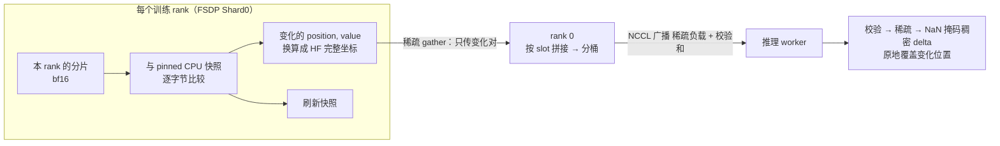

每一步训练结束，优化器改完了参数，推理引擎里的那份权重就旧了。把新权重送过去听起来是一次拷贝——8B 模型 16 GB，NVLink 一秒、InfiniBand 几秒。但两边的权重**不是同一个形状的东西**：训练器里它是 FSDP 按第 0 维切成 64 份的 DTensor，或者 Megatron 的 TP = 4 × PP = 2 × EP = 8 分片，QKV 三个矩阵融合成一个、专家堆叠成一个大张量、名字是 `decoder.layers.3.self_attention.linear_qkv.weight`；推理引擎里它是 vLLM 按 TP = 8 切的列、专家按 EP = 4 分组、可能是 FP8 加一组 128 × 128 的块缩放、名字是 `model.layers.3.self_attn.qkv_proj.weight`。所以"同步"是两件事：**布局**（怎样从一种切法映射到另一种）和**传输**（字节从哪张卡到哪张卡、走哪条链路）。前者决定要不要在中间过一遍"完整张量"、由谁过；后者决定秒数。

秒数的量级：8B 在 NVLink 内不到一秒、跨机几秒；32B 跨机十几秒；235B 的 MoE 用最朴素的做法——每个参数 all-gather 成完整张量、rank 0 广播——要**四分多钟**，而用 verl 0.9 的增量同步（每个训练 rank 只对自己那片分片做字节 diff、只传变化的位置）是 **12–15 秒**，且从 32B 到 235B 几乎不随模型变大而变长。差二十倍的不是链路带宽，是"谁持有完整张量"这个设计决定。

这一篇把同步拆成布局与传输两半，各自把步骤、字节数、时间算清楚：布局一侧讲名字与形状的映射（Megatron-Bridge 做的事）、FSDP 与 Megatron 各自导出的形态、为什么"先 all-gather 再广播"在大模型上不可行；传输一侧讲 CUDA IPC、NCCL 广播、NIXL / Mooncake 的 RDMA 点对点、经 CPU 或磁盘中转的 checkpoint 路径，以及分桶与流水；然后是两个把字节数压下去的手段——量化传输与增量同步；最后是正确性：同步中途推理引擎能不能生成、哪些"权重之外的权重"会漏。

本篇的核心问题：

> **训练器是 Megatron TP=4、PP=2、EP=8 的 671B MoE，推理引擎是 vLLM TP=8、EP=4 的 FP8 副本，两边在不同机器。一次同步要做哪几步映射、传多少字节、走哪条链路、至少几秒？[^q0] 增量同步能省多少？[^q1]**

版本：verl v0.9.0（`verl/checkpoint_engine/`、`verl/workers/rollout/vllm_rollout/`、`docs/advance/delta_weight_sync.md`）、vLLM v0.27.1、Megatron Core 0.18 与 Megatron-Bridge。带宽按 H100 节点：NVLink 450 GB/s 单向、每卡一张 400 Gb/s ConnectX-7（50 GB/s）、PCIe pinned 25 GB/s。

## 一、总览

### 1. 先说答案

671B MoE（DeepSeek-V3 规格：61 层、每层 256 个路由专家 + 1 个共享专家、MLA 注意力），训练器 Megatron TP = 4 × PP = 2 × EP = 8（64 卡一个副本，DP 再往外扩），推理引擎 vLLM TP = 8 × EP = 4 的 FP8 副本（32 卡一个实例），两边在不同机器，一次同步：

```text
步骤                                           在哪做              字节（全模型）        说明
① 训练侧：按 PP 找到每层的所有者                 Megatron 元数据      —                 只有持有该层的 stage 参与
② 训练侧：TP=4 的分片 all-gather 成完整参数        NVLink（节点内）     1.34 TB bf16 流过   注意力 / dense 层；专家在 EP rank 上本来就是完整的
③ 名字与形状映射：mcore → HF                     CPU 元数据 + 视图    0                  拆 QKV、拆 gate/up、专家堆叠 → 逐专家、MLA 的低秩投影
④ 在线量化：bf16 → FP8（块 128×128 + scale）      GPU kernel          1.34 TB → 0.67 TB   与推理侧的量化格式对齐；scale 也是要传的权重
⑤ 分桶（512 MB）+ 传输到推理实例                  IB / RDMA           0.67 TB / 实例       NCCL 广播 或 NIXL 点对点；多个实例共享一次广播
⑥ 推理侧：每个 rank 取自己的 TP 切片 + EP 专家子集  GPU                  每卡写入 21 GB      vLLM load_weights 按名字找到目标张量
⑦ 缓存失效 + 版本号                              推理引擎             —                 reset_prefix_cache；记下 global_steps
```

时间的三个量级：

```text
做法                                   瓶颈                              671B FP8 的一次同步
朴素：逐参数 all-gather → rank 0 广播    rank 0 的一张网卡 + 全模型经它流过    理论 13 s（50 GB/s），实测量级 60–80 s（有效 8–10 GB/s）
多源 / 点对点（NIXL ring、Mooncake）      所有训练卡的网卡一起发               20–30 s 量级（MoonshotAI 的 checkpoint-engine 报告 1T 模型在千卡量级上约 20 s）
增量（delta_sharded）                    每 rank 的分片 diff + 稀疏 gather      12–15 s，几乎不随模型变大（verl 报告 32B–235B 持平）
```

增量同步能省多少：dense 模型每步只有 1–3% 的参数字节变化、MoE 早期只有 0.02–0.05%，线上传输的字节数按这个比例缩；但真正省下的是**"没有任何一个 rank 持有完整模型"**——全模型 all-gather 与 rank 0 的物化都没了，这一项与网络快慢无关，所以 verl 在 0.5B 到 235B 的每一个尺寸上都测到了 1.3–21 倍的提速。

### 2. 两半问题

```text
                布局（layout）                                    传输（transport）
问题            两边的切法、名字、dtype 不同，怎样对上               字节从训练卡到推理卡走哪条链路
输入            训练器的分片元数据（DTensor spec / Megatron 并行度）  拓扑（共置 / 分离）、集群固定还是弹性
输出            HF 名字 + 完整形状 + 目标 dtype 的张量流              每张推理卡收到自己那份
决定            要不要物化完整张量、由谁物化                         带宽、峰值显存、对进程组的要求
verl 里         Megatron-Bridge / mbridge、FSDP 的 get_per_tensor_param   checkpoint_engine/*（naive / nccl / nixl / mooncake / kimi / delta_sharded）
```

两半之间的接口是一个**流**：`(name, tensor)` 的生成器，名字是 HF 命名、张量是完整形状（或 delta 的稀疏表示），dtype 是推理侧要的。checkpoint engine 只管把这个流分桶送到对面，不知道 FSDP 还是 Megatron；引擎后端只管产出这个流，不知道对面是 vLLM 还是 SGLang。这层分工让 verl 能用同一套传输代码服务 FSDP / Megatron / VeOmni 三种训练后端与 vLLM / SGLang / TRT-LLM 三种推理后端。

### 3. 本文的章节安排

| 章 | 内容 | 回答的问题 |
|---|---|---|
| 二 | 布局：名字与形状 | HF ↔ Megatron 的融合权重怎样映射，MoE 与 MLA 特殊在哪 |
| 三 | 布局：从分片到完整再到分片 | FSDP / Megatron 各怎样导出，为什么全模型经 rank 0 不可行 |
| 四 | 传输方式 | CUDA IPC、NCCL 广播、NIXL / Mooncake、checkpoint 中转的带宽与要求 |
| 五 | 分桶与流水 | bucket 大小、三步重叠、峰值显存 |
| 六 | 量化传输 | FP8 / MXFP4 的 scale 怎么算、在哪量化 |
| 七 | 增量同步 | `delta_sharded` 的机制、字节数与测量 |
| 八 | 一次同步多少秒 | 四个场景的账；异步下的同步频率 |
| 九 | 正确性 | 同步中的生成、权重之外的权重、版本 |
| 十 | 小结 | 要点、速查表、下一篇 |

## 二、布局之一：名字与形状

### 1. 三套命名

同一个 Llama / Qwen / DeepSeek 层，在三个地方长得不一样：

```text
HF（checkpoint 与 vLLM 的“语言”）               Megatron Core（训练器）                             vLLM 内部
model.layers.3.self_attn.q_proj.weight        decoder.layers.3.self_attention.linear_qkv.weight   model.layers.3.self_attn.qkv_proj.weight
model.layers.3.self_attn.k_proj.weight          （Q、K、V 交错融合成一个 [h + 2·h_kv, d] 的矩阵）      （Q、K、V 顺序拼接）
model.layers.3.self_attn.v_proj.weight
model.layers.3.mlp.gate_proj.weight           decoder.layers.3.mlp.linear_fc1.weight              model.layers.3.mlp.gate_up_proj.weight
model.layers.3.mlp.up_proj.weight               （gate 与 up 拼接）
model.layers.3.mlp.experts.17.down_proj.weight decoder.layers.3.mlp.experts.linear_fc2.weight17   model.layers.3.mlp.experts.w2_weight[17]
                                                （或 GroupedGEMM 的堆叠张量 [E_local, ...]）          （堆叠成 [E, ...] 的一个大张量）
```

三点差别：**融合**（Megatron 把 QKV、gate/up 融合成一个 GEMM，且 QKV 的融合是按注意力组**交错**的，不是顺序拼接——拆开时要按 `num_query_groups` 重排）；**专家堆叠**（Megatron 的 GroupedGEMM 与 vLLM 的 FusedMoE 都把本地专家堆成一个张量，但堆的是各自 EP 分组下的本地专家、顺序与编号不同）；**dtype 与量化布局**（推理侧 FP8 的 `weight_scale_inv`、MXFP4 的 `weight_scale` 是训练侧没有的张量）。

所有映射都以 **HF 命名 + HF 形状**为中间语言：训练侧把自己的分片翻译成 HF 张量流，推理侧的 `load_weights()` 本来就会读 HF checkpoint、自带 HF → 内部的映射（vLLM 每个模型类里的 `stacked_params_mapping`）。于是训练侧只需要做"mcore → HF"这半程。

### 2. Megatron-Bridge

这半程在 verl 里由 **Megatron-Bridge**（NVIDIA 维护，v0.9 起为默认；早期是 verl 自己的 mbridge）完成：每个模型家族一张映射表，每条是"一个（或一组）mcore 参数 → 一个（或一组）HF 参数"加一个转换函数：

```text
映射类型              例子                                  转换
一对一                layernorm.weight → input_layernorm.weight   改名
一对多（拆）          linear_qkv → q_proj, k_proj, v_proj         按 query group 交错 → 顺序，切成三块
                     linear_fc1 → gate_proj, up_proj              沿第 0 维切两半
多对一（合）          （反向加载时用）
专家                 experts.linear_fc1.weightE → experts.E.gate_proj / up_proj   先按本地专家编号 → 全局编号，再拆
TP 感知              列并行 / 行并行的参数按 TP 维 all-gather 后再拆      拆分要在 gather 之后：交错的 QKV 只有完整时才能正确拆
```

最后一行是布局问题里最容易错的地方：Megatron 的 TP 切法与 HF 的拆法**维度不同**——QKV 融合矩阵按 TP 切的是"每个 rank 拿几个注意力组"，HF 拆的是"Q / K / V 三块"，两种切法交叉，必须先 gather 成完整再拆。所以 Megatron 一侧导出完整 HF 张量的最小单位是"一个参数在 TP 组内 all-gather 一次"。

verl 0.9 的 release note 里有一项"Megatron-Bridge param mappings covering TP+EP and hybrid-Mamba"——映射表要覆盖到 TP 与 EP 的组合与新的层类型，每种新模型都要补这张表，这是接一个新模型进 RL 训练时最常见的工作量。

### 3. MoE 与 MLA 的特殊之处

**专家**：Megatron 的 EP 把每层的 256 个专家分到 8 个 EP rank 上，每个 rank 持有 32 个**完整的**专家（若 expert TP = 1）——专家参数**不需要 all-gather**，本地就是完整的，只需要把本地编号翻译成全局编号。推理侧 vLLM EP = 4 每个 rank 组持有 64 个专家。所以专家的映射是"8 组 → 4 组"的重分组，每个推理 rank 从两个训练 EP rank 各收一半。DeepSeek-V3 规格 671B 里专家占 95% 以上的参数，**这部分的传输是点对点的天然形态**——每个训练 EP rank 只需要把自己的 32 个专家发给需要它们的推理 rank，不需要经过任何"完整模型"。这是 NIXL / Mooncake 一类点对点传输在 MoE 上比 NCCL 广播有优势的结构性原因。

**MLA**：DeepSeek 的注意力把 K / V 压成一个低秩的 `kv_a_proj`（$$d_c = 512$$）加 `kv_b_proj`，Q 也有 `q_a / q_b` 两段；vLLM 为了 decode 效率会把 `kv_b_proj` 吸收进 Q / O 投影（weight absorption），这是加载时做的**推理侧变换**——权重同步只需送 HF 形状的 `kv_b_proj`，vLLM 自己重新吸收。但这意味着 `load_weights` 之后有一段推理侧的计算，且吸收后的张量不在 HF 命名里、每次同步都要重算。

**共享专家与 dense 层**：DeepSeek-V3 前 3 层是 dense MLP、每层有 1 个共享专家，这些走注意力 / dense 层的 TP 路径。同一个模型里两条路径并存，映射表要分别覆盖。

## 三、布局之二：从分片到完整再到分片

### 1. 为什么中间要过一遍"完整"

训练侧的切法（FSDP 的 `Shard(0)`、Megatron 的 TP 列 / 行）与推理侧的切法（vLLM 的 TP 按头 / 列）不一致，且中间要拆融合、要重排；最简单的做法是训练侧 gather 成完整 HF 张量，推理侧按自己的规则切。**"完整"只是逐参数的**——一次只有一个参数是完整的，流式处理——但它决定了两件事：

- 通信量：训练侧 all-gather 每个参数一次，总量 = 全模型字节（每 rank 接收 $$(1 - 1/tp)$$ 份）。8B 16 GB 在 NVLink 内可忽略；671B bf16 1.34 TB 是 3 秒以上的纯 NVLink 时间，且 TP 组跨节点时走 IB 更慢。
- 谁持有它：如果所有训练 rank 都 gather（FSDP 的 `full_tensor()` 就是这样：每个 rank 都得到完整张量），然后只有 rank 0 发送，其余 rank 的 gather 白做；如果只有 rank 0 gather，其他 rank 要把分片发给它——都是"全模型经过一个点"。

### 2. FSDP 的导出

verl 的 FSDP 引擎 `get_per_tensor_param()`（`verl/workers/engine/fsdp/transformer_impl.py`）：

```python
params = self.module.state_dict()                       # FSDP2：DTensor 的引用，不物化
params = convert_weight_keys(params, module)            # FSDP 包装名 → HF 名
per_tensor_param = (
    (name, param.to(device).full_tensor() if isinstance(param, DTensor) else param)
    for name, param in params.items()                   # 懒生成器：逐参数 all-gather
)
per_tensor_param = unfuse_moe_params(per_tensor_param, model_type)   # 融合的专家 → 逐专家
```

三个细节：FSDP2 的 `state_dict()` 只拿引用、`full_tensor()` 时才 all-gather，所以峰值是一个参数；FSDP1 要先 `load_fsdp_model_to_gpu` 把整个分片搬上卡再 unshard（0.9 为 FSDP2 跳过了这一步，release note 里的 "skips the whole-shard staging round trip"）；LoRA 有两条路——`merge=True` 时先把 adapter 合进 base 再导出完整权重，`merge=False` 时只导 adapter、推理侧当 LoRA 加载（每步传的字节从 2N 降到 adapter 的几十 MB，第七章）。

FSDP 的分片是"每个参数沿第 0 维切 $$n$$ 份"，与 HF 形状只差一次 concat，**没有 Megatron 那种融合 / 交错问题**——这是 FSDP 后端在权重同步上简单得多的原因，也是 `delta_sharded` 先只支持 FSDP 的原因（第七章）。

### 3. Megatron 的导出

Megatron 一侧多两层：PP 让每个 rank 只有部分层，TP 让每层的参数按列或行切。`get_per_tensor_param()` 经 Megatron-Bridge：对每个 HF 参数，找到持有它的 PP stage，在 TP 组内 all-gather 对应的 mcore 参数，做转换（拆 QKV、重排），产出 HF 张量。**只有持有该层的 PP stage 有数据**，其他 stage 在这一步产出空——所以 Megatron 的导出天然是多源的：PP = 2 时两个 stage 各产出一半的层。verl 0.9 的 "PP/VPP steady delta export" 就是把这个多源结构也接进了增量同步。

EP 一侧：专家本地完整，导出只需改名重排；expert TP > 1 时再多一次 TP 内 gather。

### 4. 全模型经 rank 0：为什么不可行

朴素 NCCL 引擎的路径是：所有训练 rank 各自 gather 出完整张量 → **只有 rank 0** 把张量装桶广播（`nccl_checkpoint_engine.py` 里 `assert self.rank <= 0, "Trainer workers other than rank 0 should not send weights"`，其余 rank 消费生成器但不发）。三个代价随模型线性增长：

- **rank 0 的网卡**是唯一出口：全模型字节 ÷ 一张 400 Gb/s 网卡 = 671 GB / 50 GB/s = 13 秒的下界，实测有效带宽只有理论的五分之一到三分之一（verl 的基准：Qwen3-30B-A3B 61 GB bf16 跨 4 节点 IB，NCCL 与 NIXL 各约 7 秒，即 8–9 GB/s）；
- **全模型 all-gather** 在训练侧每个 rank 都发生一遍，NVLink 内 1.34 TB 是几秒，TP 组跨节点更慢；
- **rank 0 物化**：即使逐参数流式，rank 0 上要有 bucket、完整张量、all-gather 的中间缓冲，大 MoE 的单个专家堆叠张量可能就是几 GB。

verl 的 `delta_weight_sync.md` 给了直接的测量：Qwen3-235B-A22B（VeOmni EP8 × FSDP8，8 + 2 节点）全量 NCCL 广播 **246–266 秒**，其中绝大部分不是线上传输，是"全模型物化"这项与网络无关的固定开销。这就是"谁持有完整张量"比"链路多快"更重要的原因。

## 四、传输方式

### 1. 五条链路

verl 的 checkpoint engine 把传输抽象成三个接口——`send_weights`（训练侧，消费张量流并发送）、`receive_weights`（推理侧，产出张量流）、`get_weights`（推理侧从本地缓存取，用于每个实例独立更新）——下面有六个后端：

```text
后端                通信库                拓扑                         适用                             弹性
naive              torch.distributed     进程内 / 同卡 CUDA IPC        共置同步（第三篇）                 —
nccl               NCCL                  all_gather + 广播             分离、固定集群                    低：换实例要重建 NCCL 组
hccl               HCCL                  同上                          Ascend                          低
nixl               NIXL（UCX / UCCL / Mooncake 后端）  all_gather + 环形点对点   分离、弹性 rollout、异构硬件      高：环拓扑可动态调
mooncake           Mooncake Transfer Engine  all_gather + 环形点对点     分离、固定集群                    高
kimi_ckpt_engine   Mooncake P2P + NCCL 广播  先 offload 到 CPU，P2P 到一个推理 worker，再组内广播   分离、顺带落 checkpoint   低
delta_sharded      NCCL（稀疏负载）        分片 diff + 稀疏 gather + 广播   分离异步、FSDP 训练侧             低
```

基准（verl README，Qwen3-30B-A3B 61 GB bf16）：4 × 8 H100 IB 400 Gbps 上 NCCL 约 7 秒（8.25 GB/s）、NIXL 约 7 秒；2 × 8 H100 上 Mooncake 5.9 秒（9.4 GB/s）；Ascend 上 kimi_ckpt_engine 的 "offload 7 s + update 3.5 s"——先把权重放到 CPU 再传，多付一次 PCIe 换来传输与训练重叠的可能。

### 2. CUDA IPC（同卡）

共置的路径，第三篇讲过：完整张量装进 512 MB 的 bucket，bucket 的 CUDA IPC handle 经 ZMQ 发给同一张卡上的推理 worker 进程，worker 打开 handle、切出张量、`load_weights`。不经网络、不经 CPU，带宽是显存带宽；峰值是两个 bucket。它也是**所有跨机方式的最后一跳**：跨机传到推理节点上的某个 rank 后，同节点其他推理 rank 拿数据仍走 IPC 或 NVLink。

### 3. NCCL 广播（一对多）

训练 rank 0 建一个临时的 NCCL 进程组，成员是它自己加所有推理 rank（`build_topology`：world = 1 + 推理总卡数），逐 bucket `broadcast`。要点：

- **进程组是临时的**：每次同步 `init_process_group` → 广播 → `finalize`；因为推理实例集合变了（弹性、故障）就要重建，NCCL 建组是秒级的固定开销；
- **与训练 / 推理各自的 NCCL 通信不能撞**：训练器的 FSDP 进程组、推理引擎的 TP 进程组、同步用的广播组，三套通信器共存于同一批卡；同步时训练器空闲（它刚更新完）、推理侧被 abort（第九章），所以不会同时发 collective——但如果异步形态下推理引擎正在 decode（TP all-reduce 在跑）又收到广播，两套通信器在同一张卡上争 SM 与网卡，轻则慢、重则死锁（第八篇的 hang 一类）；
- **元数据走 ZMQ**：bucket 里有哪些张量、各自的 offset / shape / dtype，用 ZMQ pub-sub 单独发（`MasterMetadata`），NCCL 只传字节；
- **`magic_recv` 缓冲**：0.9 修了一个"广播缓冲被复用导致权重损坏"的问题，加了独立的接收缓冲与广播完成后的 stream 同步——bucket 复用与异步 NCCL 之间的竞争是这条路径的典型 bug。

### 4. NIXL / Mooncake（点对点 + 环）

NVIDIA 的 NIXL（Dynamo 项目的传输库，底层 UCX / UCCL / Mooncake）与 Mooncake Transfer Engine 提供 RDMA 的**单边写**：发送方把 bucket 直接写进接收方注册好的显存，不需要接收方参与 collective。verl 的两个引擎用它做"all-gather + 环形点对点"：训练 rank 0 gather 出 bucket → 写给第一个推理 rank → 它写给下一个 → 环。相比 NCCL 广播：

- **不需要进程组**：加减实例只是改环的成员表，适合弹性 rollout 与故障恢复（一个实例挂了，环绕过它）；
- **异构**：训练侧 H100、推理侧 H20 或别的卡，只要 RDMA 可达；
- **带宽相当**：基准里与 NCCL 打平（都被 rank 0 的出口限制）；真正的优势要多源发送才体现——每个训练 rank 直接写给需要它那片分片的推理 rank，MoE 的专家天然适合（第二章第 3 节）。

MoonshotAI 的 **checkpoint-engine**（Kimi K2 的权重同步组件，verl 的 `kimi_ckpt_engine` 后端接的就是它）是这条路上做得最彻底的公开实现：训练侧先 offload 到 CPU pinned 内存，用 Mooncake 做 P2P 传到每个推理节点的一个 worker，再用 NCCL 在节点内广播；它的 README 给出的量级是 **1T 参数的模型在几千张 GPU 上约 20 秒**完成一次全量更新。设计要点是把"训练侧 offload"与"传输"流水化——训练器一边 offload 一边发，接收侧一边收一边加载——三段重叠。

### 5. 经 checkpoint 中转

最古老的路径：训练器存一个 checkpoint（safetensors）到共享存储，推理引擎重新加载。字节数 2N 写一遍、每个实例读一遍；对象存储 / 并行文件系统的带宽通常几 GB/s 到几十 GB/s，8B 一两分钟、几百 B 十几分钟。它慢，但**完全解耦**：推理实例可以在任何地方、任何时间加载；没有进程组、没有 RDMA 要求；顺带就是 checkpoint。适合同步频率低的场景（几十步一次的评测实例、离线蒸馏的 teacher），不适合每步同步。slime 的 `update_weights_from_disk` 与 verl 的 `load_format: safetensors` 都保留了这条路。

## 五、分桶与流水

### 1. 为什么分桶

模型有几百到几千个参数张量，大小从几 KB（layernorm）到几 GB（专家堆叠）。逐张量发有两个问题：小张量的每次通信有固定开销（NCCL 一次 collective 几十微秒起，几千个就是几百毫秒）；大张量要一次性的完整缓冲。分桶把张量按顺序装进固定大小的缓冲（verl 默认 `update_weights_bucket_megabytes: 512`），满了就发——每次发送的字节数恒定，通信次数 = 模型字节 / bucket 大小（16 GB 是 32 次，671 GB 是 1300 次），峰值显存 = bucket 大小的常数倍。

比 bucket 还大的单个张量（MoE 的专家堆叠可能几 GB）单独走：`_direct_send_large_weight`，或者在 `split_weight_chunks` 里切成多块、接收侧 `merge_weight_chunks` 拼回（`TensorMeta` 里的 `chunk_offset / chunk_size` 就是为此）。

### 2. 三步流水

一个 bucket 的生命周期有三步——**填**（gather 张量、拷进 bucket）、**传**（NCCL / RDMA）、**装**（接收侧切出张量、`load_weights`）——三步各在不同的硬件上（NVLink + 显存拷贝、网卡、显存拷贝 + 可能的 dtype 转换），可以重叠。verl 的 NCCL 引擎用**双缓冲**：`send_buf` 填满 → 发起异步广播 → 换到 `recv_buf` 继续填 → 填满前等上一个广播完成。稳态下传输与填充重叠，同步时间 ≈ max(填, 传, 装)。

```text
时间 →
填    [b0][b1][b2][b3]……
传        [b0][b1][b2][b3]……
装            [b0][b1][b2]……
```

重叠的前提是三步的速度接近；671B 场景下"填"含 TP all-gather（NVLink，快）、"传"是 IB（慢）、"装"含 FP8 反量化或 MLA 吸收（GPU kernel，中）——瓶颈在传，另外两步被它遮住。

### 3. bucket 大小

大 bucket 通信次数少、每次带宽利用高，但峰值显存大、流水的粒度粗（第一个 bucket 填满前传输不能开始）；小 bucket 反之。512 MB 是个平衡：IB 上 512 MB 的一次传输约 10 ms 量级，固定开销可忽略；峰值两个 bucket 1 GB，对训练卡与推理卡都不算负担。0.9 的 "NCCL broadcast bucket sizing" 修的是 bucket 与张量边界的对齐问题：一个张量不能跨 bucket（否则接收侧要拼），所以 bucket 的实际填充率低于 100%，小 bucket 下浪费更多。

## 六、量化传输

### 1. 推理侧是 FP8 时

DeepSeek-V3 的官方部署是 FP8（块 128 × 128 的 e4m3 权重 + fp32 的块缩放 `weight_scale_inv`），vLLM 的 FP8 路径按这个格式加载；训练侧是 bf16（或 FP8 训练但格式不同）。同步时要在某处做**在线量化**：

```text
在哪量化          传输字节        谁付计算              问题
训练侧（发送前）   N（减半）      训练 rank             scale 的计算要与推理侧的量化格式完全一致（块大小、舍入、per-tensor vs per-block）
推理侧（接收后）   2N            推理 rank             传输不省，但格式由推理引擎自己保证
```

verl 0.9 为 DeepSeek-V4 做的 "FP8/MXFP4 weight transfer" 是前者：训练侧按推理侧的 scheme 量化后再装桶，release note 里 "quantized weight-sync paths split per scheme"——每种量化格式一条路径，因为 FP8 块量化、MXFP4 的 microscaling、per-channel FP8 的 scale 算法各不相同，量化后的张量与 scale 张量都要按推理侧的名字发出去。**scale 是权重的一部分**：漏传 scale 或用错块大小，推理引擎不报错、只是全部输出变成噪声（第九章）。

### 2. 与训练精度的交互

训练侧 bf16 → 推理侧 FP8 意味着推理引擎用的是**量化过的策略**——它生成时的 $$\log \pi$$ 与训练器 bf16 算出的 $$\log \pi$$ 有系统差异，这是训推不一致的一个来源（第五篇），量化越激进差异越大。MXFP4 推理 + bf16 训练的组合在 verl 里是能跑的，但要配合旧策略重算或重要性比修正。

### 3. LoRA：只传 adapter

LoRA 训练时 base 权重不变，每步变的只有 adapter（rank 64 的 LoRA 在 8B 上约 170 MB）。verl 的 `merge=False` 路径只导出 adapter 张量，推理引擎当 LoRA 加载（vLLM 的 `add_lora` / SGLang 的 LoRA 路径），第一步先同步一次 base（`base_sync_done`），之后每步几十到几百 MB——**传输字节降两个量级**，同步几乎免费；代价是推理侧带 LoRA 的 decode 比合并后的慢 10–20%。`merge=True` 则每步把 adapter 合进 base 再导出完整权重，传输 2N，推理侧无 LoRA 开销。同步频率高（异步、$$k$$ 小）时前者划算。

## 七、增量同步：`delta_sharded`

### 1. 观察

RL 一步的学习率小（$$10^{-6}$$ 量级），一步之后**多数参数的 bf16 表示没有变**——bf16 只有 8 位尾数，更新量小于当前值的 $$2^{-8}$$ 就被舍掉。verl 的测量：dense 模型每步 1–3% 的参数字节变化，235B MoE 的早期步骤只有 0.02–0.05%（大多数专家在一步里没被路由到、梯度为零）。只传变化的位置，线上字节按这个比例缩。

### 2. 机制

`delta_sharded` 后端（`verl/checkpoint_engine/delta_checkpoint_engine.py` + `verl/workers/engine/utils/hf_delta_export.py`）把 diff 放到 **all-gather 之下**：



- **每个 rank 只管自己的分片**：在 pinned CPU 内存里存一份自己分片的快照，每步导出时按整数位比较（bit-exact，无阈值），得到变化的 `(position, value)`；位置换算成参数在 HF 完整张量里的绝对坐标（从 DTensor 的 spec 本地算出，不需要通信）。
- **稀疏 gather 到 rank 0**：只传变化对，量按稀疏比缩；rank 0 只做拼接与分桶，不知道布局；`counts[K]` 对齐保证 gather 在各 rank 间步调一致。
- **首次是全量种子**：第一次同步走普通的全量路径（values-only），同时建立快照；之后每步都是稀疏的。
- **推理侧原地覆盖**：SGLang 的 `--custom-weight-loader` 钩子挂一个 verl 提供的 loader（`verl.workers.rollout.sglang_rollout.delta_loader.apply_delta`），校验每个 bucket 的校验和、把稀疏 delta 变成 NaN 掩码的稠密张量、只覆盖非 NaN 位置；接收侧峰值是一个 bucket，与模型大小无关。

**没有任何 rank 持有完整模型**——全量 all-gather 与 rank 0 物化都消失了。这就是它在 0.5B 上也比全量快（1.3 倍）的原因：省的不只是字节。

### 3. 测量

verl 文档（H100、GSM8K GRPO、v1 `separate_async`、SGLang、稳态每步同步）：

```text
模型（布局）                                    delta_sharded    全量 NCCL      提速
Qwen2.5-7B（1 + 1 节点）                        3.9–4.9 s        5.5–6.0 s     1.3×
Qwen2.5-32B（2 + 2 节点）                       11.2–11.9 s      17.7–18.1 s   1.55×
Qwen2.5-32B（offload 关）                       6.2 s            14.2 s        2.3×
Qwen2.5-72B（4 + 4 节点，gen TP8，offload 关）    12.0–13.0 s      28.5–29.1 s   2.3×
Qwen3-30B-A3B（VeOmni EP8，1 + 1 节点）          7.1 s            32.2 s        4.5×
Qwen3-235B-A22B（EP8 × FSDP8，8 + 2 节点，TP16）  11.4–14.9 s      246–266 s     ~21×
```

两个规律：**delta 的时间从 32B 到 235B 几乎持平**（稀疏 gather 摊在更大的训练 world 上），全量随参数字节线性涨；**MoE 的收益最大**（稀疏比更低、且全量路径里的专家 all-gather 最贵）。正确性：200 步 GRPO 的 reward 曲线与全量对齐、零校验失败；perturb → delta → revert → delta 的往返在每个 prompt 上贪心生成逐字节一致。

### 4. 边界

当前范围：分离形态（`hybrid_engine=False`）、FSDP1 / FSDP2 训练侧（需要 `Shard(0)` 的 DTensor）、SGLang 推理侧 bf16。Megatron 训练侧在路线图上（mcore → HF 的转换器要改写成"按块可分"的形式，交错 QKV 与 gate/up 拼接是行 / 块置换、能改；TP 列切用 `BlockPlacement` 的 dim-1 偏移表达）；量化推理侧（对量化后的字节做 diff）也在路线图上。VeOmni 的 FSDP2 + EP 已支持（"EP-aware sharded delta export"）。

增量同步与 decoupled PPO 有一个巧合的协同：后者本来就要保留上一步的权重（第五篇），diff 可以直接对着它做、省掉专用快照。

## 八、一次同步多少秒

### 1. 四个场景

按本篇的模型算（分离形态、跨机、全量 NCCL 广播，有效带宽按 verl 基准的 8.5 GB/s；增量按 verl 测量外推）：

```text
场景                     推理侧字节      全量广播（实测量级）    增量          共置（IPC，第三篇）
8B bf16                  16 GB          2–3 s                 ~2 s          0.3 s
32B bf16                 66 GB          8–18 s                6–12 s        1 s
70B bf16                 141 GB         17–30 s               12–13 s       2–3 s
235B-A22B bf16           470 GB         4 分钟以上             11–15 s       几十秒
671B FP8（本篇核心问题）   671 GB         60–80 s（理论下界 13 s） 12–15 s（外推）  几十秒（EP 重切）
```

671B 的三步映射（PP 定位 → TP gather → mcore → HF 转换 + FP8 量化 + EP 重分组）本身不到几秒；决定秒数的是"671 GB 经 rank 0 的一张网卡"还是"每个 EP rank 直接发自己的专家"。前者 60–80 秒，后者与 MoonshotAI 报告的量级一致（十几到二十秒），增量再压到十几秒且不随模型变大。

### 2. 同步在步时间里的比例

同步形态下每步一次，比例 = $$T_{sync} / T_{step}$$：8B 场景 0.3 / 810 可忽略；671B 全量 80 秒对 650 秒的步是 12%——**这是必须上增量或多源的理由**。

异步形态下同步频率是配置项：verl `separate_async` 的 `parameter_sync_step`（每 $$k$$ 个 mini-batch 更新同步一次）。同步期间推理实例被 abort（第九章），rollout 池的空转比例：

$$\text{bubble} = \frac{T_{sync}}{k \cdot T_{mb} + T_{sync}}$$

$$T_{mb}$$ 是一个 mini-batch 的训练时间。$$k$$ 大同步少、staleness 大；$$k$$ 小反之。32B 场景全量同步 15 秒、mini-batch 训练 60 秒：$$k = 1$$ 时 bubble 20%、$$k = 4$$ 时 6%；换增量同步 6 秒后 $$k = 1$$ 也只有 9%。**同步时间直接决定异步能开到多细的粒度**，这是权重同步这一段"最 Infra"的机制对算法（staleness）的反向约束。

### 3. 与显存切换的对比

第三篇算过共置的显存切换是每步几秒、< 2%；本篇的跨机同步在大模型上是几十秒、10% 以上。**分离形态用跨机同步换掉了共置的显存切换，大模型上前者更贵**——这是第二篇决策表里"MoE 要分离异步 + 增量 / 量化同步"那一行的原因：分离是为了并行配置与长尾，而它带来的同步开销必须靠增量与重叠压回去。

## 九、正确性

### 1. 同步中的推理引擎

新权重写入时推理引擎不能在生成：一个 decode 步用到一半新一半旧的权重，输出是错的且不可复现。三种处理：

- **排空**（drain）：停止接新请求，等在飞请求完成——长尾让这段等待可能很长，同步形态下这就是"训练器等 rollout"的那道墙；
- **中断**（abort）：立刻中断在飞请求，保存已生成的 token 与状态，同步完成后用新权重续接——部分 rollout，verl 的 `abort_replicas → update_weights → resume_generation_replicas` 三步；续接时已生成的前缀要在新权重下**重新 prefill**（第三篇第六章）；
- **双缓冲**：推理引擎持有两份权重，写新的时用旧的生成，写完切换——显存翻倍，只在小模型上可行；vLLM / SGLang 都没有内置。

verl 的 `CheckpointEngineManager.update_weights()` 的完整顺序：abort 全部实例 → （可选）释放 KV 池 → 建进程组 → 训练侧 `send` 与推理侧 `receive` 并行 → finalize → 恢复 KV 池 → resume 被中断的请求。中间还有 `reset_prefix_cache(reset_connector=True)`——连外挂的 KV 存储（Mooncake store 一类 connector）也要清，因为里面的 KV 是旧权重算的。

### 2. 权重之外的权重

`state_dict` 里的参数同步了，还有几样东西**不在里面**、或不由训练器产生，漏一个就是静默错误：

```text
东西                        为什么会漏                                后果
量化 scale                  训练侧没有；在线量化时要一起发             输出变噪声，不报错
MTP 草稿模型                 vLLM 自己初始化、不属于 actor            level 2 sleep 后丢失 → 0.9 特别处理 "MTP drafter weights preserved across hybrid sleep"
LoRA 合并状态               merge 前后 base 不同                      merge=True 时 SGLang 要确保自己是 LoRA-free（0.9 修了一处）
named_buffers（RoPE 表等）   不在 state_dict                          level 2 sleep 后由 Worker 从 CPU 副本恢复
tied embeddings             HF 里 lm_head 与 embed 共享一个张量        映射表要知道只传一次、两处都更新
MLA 吸收后的张量             推理侧派生，不在 HF 名字里                 每次同步后 vLLM 要重新吸收
KV cache 与 prefix cache    内容由旧权重算出                          必须 reset；外挂 connector 也要
```

0.9 的 release note 里 "reset all caches after weight updates"、"MTP drafter weights preserved"、"SGLang stays LoRA-free when merge=True" 三条 fix 都属于这一类。**同步的正确性检查**：slime 的 `--check-weight-update-equal` 在同步后把推理引擎的权重与训练器比一遍；verl 的 delta 引擎每个 bucket 带校验和；最朴素也最可靠的是同步后用固定 prompt 贪心生成几条、与训练器前向的 argmax 对比。

### 3. 版本

推理引擎要知道自己在用哪个版本的权重——异步形态下样本要带"由第几步的权重生成"的标签（第五篇的 staleness 就按它算），部分 rollout 下一条序列的不同段来自不同版本。verl 在 `update_weights` 末尾 `set_global_steps(global_steps)`，agent loop 把它记进每条轨迹。**同步是版本号唯一的推进点**：同步失败一半（某个实例没收到）而版本号推进了，比同步慢得多危险。

## 十、本文小结

### 1. 要点回顾

- 权重同步是**布局 + 传输**两半：布局把训练分片翻译成 HF 名字与形状的张量流（Megatron-Bridge 做 mcore → HF：拆交错的 QKV、拆 gate/up、专家本地编号 → 全局；FSDP 只需 concat），传输把流送到每张推理卡。中间接口是 `(name, tensor)` 生成器，让 3 种训练后端 × 3 种推理后端共用一套传输。
- 朴素路径"逐参数 all-gather → rank 0 广播"的代价是**全模型经过一个点**：rank 0 的一张网卡 + 全模型物化，235B 要四分多钟；这项开销与网络快慢无关。
- 传输的五条链路：CUDA IPC（同卡，共置）、NCCL 广播（固定集群、临时进程组、与训练 / 推理的通信器要错开）、NIXL / Mooncake 的 RDMA 点对点 + 环（弹性、异构、多源）、经 CPU 的 P2P + 节点内广播（MoonshotAI checkpoint-engine：1T 模型千卡约 20 秒）、经 checkpoint 中转（慢但完全解耦）。
- **分桶**（512 MB）让通信次数与峰值显存都与模型大小无关；双缓冲让填 / 传 / 装三步重叠。
- **量化传输**：训练侧按推理侧的 scheme 在线量化，字节减半，scale 是必须一起传的权重；LoRA 只传 adapter，字节降两个量级。
- **增量同步**（`delta_sharded`）：每 rank 对自己的分片做 bit-exact diff、稀疏 gather、原地覆盖；dense 每步 1–3% 变化、MoE 0.02–0.05%；32B 到 235B 同步时间持平在 12–15 秒，235B 上比全量快 21 倍——省的不只是字节，是"没有人持有完整模型"。
- 671B FP8 跨机一次同步：映射几秒、全量经 rank 0 60–80 秒、多源 / 增量 12–20 秒；同步形态下占步时间 10% 以上是上增量的理由；异步形态下 $$T_{sync} / (k T_{mb} + T_{sync})$$ 决定 rollout 池的空转，同步越快 $$k$$ 能越小。
- 正确性：同步时推理引擎必须 abort 或 drain（续接要重 prefill）；scale、MTP 草稿、LoRA 合并态、buffers、tied embeddings、KV / prefix cache 是"权重之外的权重"；版本号只在同步成功后推进。

### 2. 速查表

```text
字节            bf16 2N · FP8 N · LoRA adapter ~几十–几百 MB · 增量 (1–3%)·2N dense / (0.02–0.05%)·2N MoE
链路带宽        NVLink 450 GB/s · IB 400 Gb/s = 50 GB/s 理论 / 8–10 GB/s 实测有效（单源 NCCL）· PCIe pinned 25 GB/s
朴素全量        T ≈ 2N / (单网卡有效带宽) + 全模型 all-gather + rank 0 物化    235B: 250 s
多源 / P2P      T ≈ 2N / (Σ 发送方网卡)                                        1T 千卡 ~20 s
增量            T ≈ diff + 稀疏 gather + 固定开销，几乎不随 N 变                  32B–235B: 12–15 s
bucket          512 MB；峰值 2 bucket；次数 = 2N / bucket
异步空转        bubble = T_sync / (k·T_mb + T_sync)
同步顺序        abort → (释放 KV) → 建组 → send ∥ receive → finalize → 恢复 KV → resume → reset_prefix_cache → set_global_steps
```

### 3. 下一篇

分离形态要重叠、异步形态要拆墙，都意味着训练用的样本不再来自当前权重。本篇末尾的版本号就是为此准备的：每条样本带着"第几步的权重生成"、部分 rollout 下每一段带着各自的版本。下一篇讨论拆掉同步墙之后要补的东西——staleness 的上限与 `drop` / `wait` 策略、部分 rollout 的代价、重要性比与 decoupled PPO 的修正、训推不一致（推理引擎的 $$\log \pi$$ 与训练器的不同——本篇的 FP8 量化就是一个来源）、样本缓冲的淘汰规则，以及怎样从信号里区分它们：

> **从同步换成 $$k \le 2$$ 的异步，一步的墙钟从 12 分钟降到 5 分钟，但 reward 曲线的斜率变缓了。是 staleness、是训推不一致、还是缓冲区淘汰规则？要区分这三个原因，需要事前记录哪些信号？**

下一篇：异步与 off-policy——把同步的墙拆掉之后要补什么。

**实践建议**：不依赖框架，用 100 行写一个最小的 FSDP2 → vLLM 同步：两个进程组（训练 2 卡、vLLM TP=2 两卡），训练侧 `state_dict()` 逐参数 `full_tensor()`、装 512 MB bucket、`dist.broadcast` 到 vLLM 的 rank，vLLM 侧 `collective_rpc("load_weights", ...)`；用 `torch.cuda.Event` 量三段（gather / 广播 / 加载）各自的时间，与本篇第五章的流水模型对一遍；然后把 bucket 改成 64 MB 与 2 GB 各跑一次，看曲线。

## 十一、自测

1. Megatron 的 QKV 权重与 HF 的 `q_proj` / `k_proj` / `v_proj` 差在哪？Megatron-Bridge 做什么？

   <details markdown="1"><summary>答案</summary>

   Megatron 把 Q、K、V 按 head 交错拼成一个矩阵（每个 KV 组的 q 头、k、v 相邻，便于 TP 切分），HF 是三个独立矩阵；Bridge 按 head 拆开重排、gate / up 拆开、专家编号从本地转全局、PP 层号加偏移——输出 `(name, tensor)` 的 HF 张量流。

   </details>

2. “逐参数 all-gather → rank 0 广播”为什么与网络快慢无关地慢？

   <details markdown="1"><summary>答案</summary>

   全模型的每个字节都要经过 rank 0：一张网卡发 $$2N$$ 字节（235B 是 470 GB / 8–10 GB/s 有效 ≈ 50 s 起）、且 rank 0 要物化完整模型（显存或主机内存）；其他 rank 的网卡闲着。换更快的网也只快一张卡。

   </details>

3. 分桶 512 MB、双缓冲各解决什么？为什么峰值显存与模型大小无关？

   <details markdown="1"><summary>答案</summary>

   分桶让每次传输的消息大小固定、次数 = $$2N$$ / 512 MB，NCCL / RDMA 效率稳定；双缓冲让“填桶（all-gather）/ 传桶 / 装桶（推理侧加载）”三步在两个桶上流水；任何时刻只有两个桶在飞，峰值 1 GB，与 $$N$$ 无关。

   </details>

4. 增量同步的前提是什么？dense 与 MoE 每步各变化多少？为什么 MoE 收益更大？

   <details markdown="1"><summary>答案</summary>

   每 rank 能对自己的分片做 bit-exact diff（保留上一版本的副本或哈希）、推理侧支持原地稀疏覆盖；dense 每步 1–3% 的参数值变化，MoE 只有 0.02–0.05%（每步只有被路由到的专家更新）——MoE 参数多、变化少，增量省得最多。

   </details>

5. 同步形态一步 10 分钟、同步 60 秒；异步形态 $$k = 2$$、$$T_{mb} = 2$$ 分钟、同步 60 秒：各浪费多少？

   <details markdown="1"><summary>答案</summary>

   同步：60 / 600 = 10%，正好是“该上增量”的阈值；异步：rollout 池空转 $$T_{sync} / (kT_{mb} + T_{sync}) = 60 / 300 = 20\%$$——同步越快 $$k$$ 能越小（staleness 越低）而不多付空转。

   </details>

[^q0]: **映射**是布局 + 传输两半：布局把 Megatron TP4 / PP2 / EP8 的分片翻译成 HF 名字与形状的张量流（拆交错的 QKV、拆 gate / up、专家本地编号 → 全局编号、PP 的层号偏移），再由推理侧按 vLLM TP8 / EP4 的布局取自己那份并在线量化到 FP8（scale 是必须一起传的权重）；中间接口是 `(name, tensor)` 生成器，让 3 种训练后端 × 3 种推理后端共用一套传输（[第二章](#二布局之一名字与形状)、[第三章](#三布局之二从分片到完整再到分片)、[第六章](#六量化传输)）。**字节**：671B FP8 是 $$N$$ 字节 ≈ 671 GB（bf16 传是 $$2N$$）。**链路与时间**：朴素路径「逐参数 all-gather → rank 0 广播」让全模型经过一张网卡且要在 rank 0 物化，671B 经 rank 0 60–80 秒——瓶颈是「谁持有完整模型」而非网络快慢；多源 / P2P（NIXL / Mooncake 的 RDMA 环、checkpoint-engine 经 CPU 的 P2P + 节点内广播）让每张网卡各发一份，$$T \approx 2N / \sum$$ 发送方网卡，671B 约 **12–20 秒**；分桶 512 MB 让通信次数与峰值显存与模型大小无关，双缓冲让填 / 传 / 装重叠（[第四章](#四传输方式)、[第五章](#五分桶与流水)、[第八章](#八一次同步多少秒)）。
[^q1]: MoE 每步只有 0.02–0.05% 的参数变化，增量只传几百 MB；`delta_sharded` 每 rank 对自己分片做 bit-exact diff、稀疏 gather、原地覆盖，几乎不随 $$N$$ 变——32B 到 235B 持平 12–15 秒，235B 上比全量快 21 倍。省的不只是字节，是「没有人持有完整模型」。同步形态下同步占步时间 10% 以上就该上增量；异步形态下 $$T_{sync} / (kT_{mb} + T_{sync})$$ 决定 rollout 池的空转。详见[第七章](#七增量同步delta_sharded)、[第八章](#八一次同步多少秒)。
