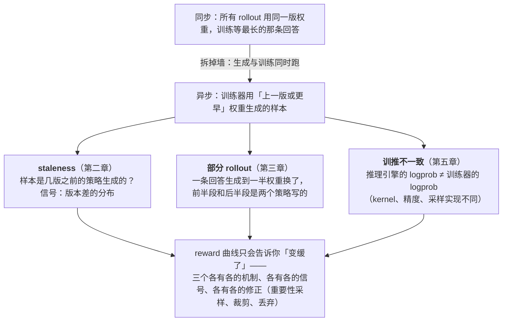

第二篇的结论是异步把长尾吞掉、把一步的墙钟从 12 分钟压到 5 分钟。代价写得很轻："样本过期"。这一篇把这个代价展开——它其实是三个不同的东西，各有各的机制、各有各的信号，混在一起时 reward 曲线只会告诉你"变缓了"，不会告诉你为什么。

第一个是 **staleness**：训练用第 $$t$$ 步的权重更新，样本由第 $$t - k$$ 步的权重生成，重要性比 $$\pi_\theta / \pi_{old}$$ 偏离 1，PPO 的 clip 开始大量触发；更隐蔽的是，**过期程度与回答长度相关**——长回答生成得慢、更容易过期——所以"丢弃过期样本"这个看似中性的策略会系统性地丢掉长回答，改变训练数据的长度分布。第二个是**训推不一致**：推理引擎（vLLM，可能 FP8，FlashInfer 的 attention，TP 的 all-reduce 顺序）算出的 $$\log \pi$$ 与训练器（FSDP，bf16，FlashAttention）算出的**本来就不同**，哪怕权重逐位相同；这个差在 dense 模型上每 token $$10^{-3}$$ 量级，在 MoE 上因为路由的不连续可以大一个数量级，8K token 的序列级比值会爆——它是一种与异步无关、但在异步里被放大的 off-policy。第三个是**缓冲区的淘汰规则**：DAPO 过滤掉全对 / 全错的组、失败的 rollout 被丢、过期的被 drop——每一条规则都在改变进入训练的样本分布，而它们的效果与前两者纠缠在一起。

要区分三者，靠的不是事后分析而是**事前记录**：每条样本的生成版本与训练版本的差（staleness 分布）、推理侧与训练侧 $$\log \pi$$ 的逐 token 差（不一致的量）、每一类淘汰的计数与被淘汰样本的长度分布（缓冲的偏置）。这一篇把这三条线各自的机制、代价、修正与信号讲清楚，然后落到 verl 的 `colocate_async` / `separate_async` 里它们实现在哪，末尾用 AReaL 的设计作对照——它从第一天起就是异步的，把这些问题当主线而不是补丁。

本篇的核心问题：

> **从同步换成 $$k \le 2$$ 的异步，一步的墙钟从 12 分钟降到 5 分钟，但 reward 曲线的斜率变缓了。是 staleness、是训推不一致、还是缓冲区淘汰规则？[^q0] 要区分这三个原因，需要事前记录哪些信号？[^q1]**

版本：verl v0.9.0（`verl/trainer/ppo/v1/replay_buffer.py`、`trainer_separate_async.py`、`docs/algo/rollout_corr.md`、`docs/advance/fully_async.md`）、AReaL（Fu 等 2025，arXiv 2505.24298，及当前文档）。算法层面只讨论"系统要为修正提供什么"，不评价各修正对效果的优劣——那是[《后训练》](/post-training-from-sft-to-verifiable-rewards.html)系列的事。

## 一、总览




### 1. 先说答案

三个原因、三组信号、三种处理：

```text
原因           机制                                   事前要记的信号                                   处理
staleness     样本由 k 步前的权重生成，ρ 偏离 1；        每条样本 (生成版本, 训练版本)；staleness 分布      staleness 上限（drop / wait）；
              drop 策略偏向短回答                       被 drop 样本的长度 vs 全体；clip 触发比例          decoupled loss；k 调小、同步调频
训推不一致     推理引擎与训练器算的 log π 不同           逐 token |log π_rollout − log π_train| 的均值 / 最大  重算 old_log_prob；TIS / MIS；
              （kernel、精度、reduce 顺序、MoE 路由）    序列级比值分布；MoE 的专家命中一致率                统一精度（FP16）；确定性
缓冲淘汰       DAPO 过滤、失败组、过期 drop、补发          每类淘汰的计数；被淘汰组的 reward / 长度分布；        调阈值；wait 代替 drop；
              改变了进入训练的分布                        缓冲深度；被训练样本的长度分布 vs 生成的            按 reward 分层监控
```

三个原因在 reward 曲线上不可分，在这些信号上可分：staleness 涨、不一致不变、淘汰不变——是 $$k$$ 太大或同步太慢；不一致涨（尤其换了 FP8 或 MoE 后）——与异步无关，同步形态下也会有，只是异步让它更难被发现；淘汰计数涨、被训练样本变短——是规则在筛数据。**没有事前记录，这三者事后无法区分**，因为它们都表现为"重要性比偏离 1 + reward 斜率变缓"。

### 2. off-policy 的三个来源

在线 RL 假设训练的样本来自当前策略。异步系统里有三处偏离：

```text
来源            偏离的方向                        大小                              是否可控
时间（staleness） π_old = π_{θ_{t−k}}，与 π_θ 差 k 步更新   随 k、学习率、步内更新次数增长        可控：k 上限、同步频率
实现（训推不一致） π_rollout ≠ π_train，同一权重不同实现    dense 每 token 1e-3 量级；MoE 1e-2 起   部分可控：精度、kernel、确定性
筛选（淘汰规则）  训练分布 ≠ 生成分布                     取决于过滤比例                      可控：规则与阈值
```

第二个来源在同步形态下**也存在**——这是第一篇说"多数框架默认重算旧策略 logprob"的原因；异步把它放大是因为异步系统更倾向于**不重算**（省下 2N 的前向、且 π_old 在部分 rollout 下本来就是分段的），直接用推理侧的 $$\log \pi$$ 当 $$\pi_{old}$$，于是不一致直接进了重要性比。

### 3. 本文的章节安排

| 章 | 内容 | 回答的问题 |
|---|---|---|
| 二 | staleness | 定义、分布、上限策略，drop 为什么偏向短回答 |
| 三 | 部分 rollout | 一条序列跨版本的代价：重 prefill 与分段的 π_old |
| 四 | 算法修正的系统要求 | PPO 比值在 off-policy 下的行为，decoupled PPO，要存什么 |
| 五 | 训推不一致 | 来源、量级、TIS / MIS，为什么 MoE 更糟 |
| 六 | 样本缓冲 | 入队、淘汰矩阵、补发、变长 batch、顺序效应 |
| 七 | 异步下的权重同步 | 频率、abort / resume、实例间的版本混合 |
| 八 | 信号与诊断 | 回答核心问题：一张诊断表 |
| 九 | verl 与 AReaL 的实现 | 落点；准入控制 vs 消费淘汰的分歧 |
| 十 | 小结 | 要点、速查表、下一篇 |

Table: 本文的章节安排

## 二、staleness

### 1. 定义

一条样本的 staleness $$s$$ = 训练它时的策略版本 − 生成它时的策略版本。同步形态 $$s \equiv 0$$；一步流水 $$s \equiv 1$$；流式异步下 $$s$$ 是一个**分布**：样本 $$i$$ 在版本 $$v_i$$ 下开始生成、用时 $$\tau_i$$ 完成、进缓冲、等 $$w_i$$ 被取出训练，期间权重同步了若干次，$$s_i = \lfloor (\tau_i + w_i) / T_{sync} \rfloor$$，$$T_{sync}$$ 是同步间隔（异步下 = $$k$$ 个 mini-batch 的训练时间）。

三个框架对"上限"的定义不同：

```text
框架 / 配置                                   定义                                              默认 / 建议
verl v1  trainer.v1.sampler.max_off_policy_threshold   一条轨迹跨越的版本数上限（int）                 8
AReaL    rollout.max_head_offpolicyness                 新请求开始时，允许落后当前版本的最大步数        0 = 同步；建议 2–8
meituan fully_async  async_training.staleness_threshold  过期样本占一次同步周期样本数的比例（float）      < 1；0 = 同步
```

verl 的是**按轨迹**的版本跨度、在消费时检查；AReaL 的是**准入**时检查（版本落后太多的请求不让开始）；meituan 的是**按比例**（一个周期里最多生成 $$(1 + \text{threshold}) \times$$ 需要量的样本，多出来的是"预生成的过期样本"）。三者控制的是同一个量的不同侧面，第九章对照。

### 2. staleness 与长度相关

$$s_i$$ 里的 $$\tau_i$$ 是生成用时，与回答长度成正比。同步间隔 $$T_{sync}$$ 固定时，**长回答的 staleness 系统性地更大**：

```text
8B 推理场景，异步，T_sync ≈ 150 s（k = 1，训练池 22 卡、一个 mini-batch 的训练时间）
回答长度      生成用时（并发下）    典型 staleness
2K            ~40 s               0
8K（均值）     ~150 s              1
32K（L_max）   ~600 s              4
```

于是 `max_off_policy_threshold = 2` 配 `drop` 策略的效果是：**32K 的回答几乎全部被丢**，训练看到的长度分布被截在 16K 左右。这不是随机丢样本，是按长度筛——对推理模型的训练（目标之一就是学会更长的思维链）是直接的偏置。verl 提供 `wait` 策略正是为此：过期的在飞组不丢、阻塞取样直到它完成，代价是训练器等（等的就是长尾——异步的收益又还回去一部分）。

两个折中：把阈值放宽（8 而不是 2，接受更大的 staleness、靠算法修正）；或者部分 rollout（第三章）——长回答不再"用一个版本生成到底"，而是跨版本续接，每段的 staleness 都不大。

### 3. staleness 对训练的影响

公开的消融：

- **AReaL 论文**：不做算法修正时，staleness 从 0 增到 4–8，数学任务的最终准确率明显下降；加 decoupled PPO loss 后 staleness 到 4 基本无损、8 略降。系统侧 staleness 4–8 已经足够让 rollout 与训练完全重叠（论文报告同等卡数下相对同步系统最高 2.77 倍的训练加速，1.5B–14B 的数学任务）。
- **verl `fully_async` 文档**（7B、128 卡、DAPO）：`staleness_threshold` 0 / 0.1 / 0.3 / 0.5 四档的 400 步总时间 25.9 / 20.0 / 17.3 / 17.4 小时，AIME 准确率 0.26 / 0.30 / 0.29 / 0.31——0.3 与 0.5 时间几乎一样，作者注明"回答长度在训练中变化显著导致不稳定，需要进一步分析"。
- 一步流水（$$s \equiv 1$$）在多数报告里与同步无差别。

结论是 $$s \le 2$$–4 配合修正基本安全，再往上收益递减（时间上）而风险递增（效果上）。但这些都是数学任务上的结论，**换任务要重验**——Agent 任务的轨迹更长、reward 更稀疏，对 staleness 的容忍度不同。

### 4. 系统要为 staleness 记什么

```text
每条轨迹    生成开始时的策略版本 v_start；部分 rollout 下每一段的版本 [v_1, v_2, …]；进缓冲时间；被训练时的版本
每个 batch  staleness 的均值 / 最大 / 直方图；被 drop 的组数与它们的长度分布；wait 阻塞的时间
verl 里     ReplayBuffer 在 prompt 的 tag 里存 global_steps；sample() 返回 off_policy 指标：
            training/off_policy/evicted_samples · evicted_samples_staleness/{mean,max,min}
```

版本号的来源是第四篇末尾的 `set_global_steps`——权重同步成功后推理实例记下版本，agent loop 把它写进每条轨迹的元数据。**版本号错一步，所有 staleness 统计都错一步**。

## 三、部分 rollout

### 1. 机制

Kimi k1.5 的报告（Kimi Team 2025）最早把它写清楚：每一轮 rollout 给一个 token 预算，超预算的序列**暂停**、下一轮用新权重**继续**，一条长轨迹可能跨三四个版本才完成。AReaL 叫它 interruptible generation；verl 的实现是 `abort → update_weights → resume`：权重同步前中断所有在飞请求，保存已生成的 token，同步后作为新请求（prompt = 原 prompt + 已生成部分）重新提交。

它解决的是第二章的长度偏置：32K 的回答不再是"一个版本生成 600 秒"，而是"每 150 秒换一次权重，四段各 8K"，每段的 staleness 不超过 1。长尾从"等一条序列"变成"一条序列分四次算"，而且训练器随时有样本——这是 meituan 实验里从 1.6 倍到 2.35 倍那最后一档的来源。

### 2. 代价一：重 prefill

续接时，已生成的前缀在推理引擎里的 KV 是**旧权重**算的，不能用（权重换了、prefix cache 已清）。新请求要对"原 prompt + 已生成部分"重新 prefill：一条中断在 8K 处的序列，续接付 $$2N \times 8\text{K}$$ 的 prefill FLOP。一步里被中断的序列数 = 同步时刻的在飞序列数（8B 场景每实例 90 条 × 64 实例 ≈ 6000 条，平均已生成 4K）→ 约 $$2 \times 8 \times 10^9 \times 2.4 \times 10^7 = 0.4$$ EFLOP，是一步 FLOP 的 6%。prefill 是 compute-bound、MFU 高，时间上几秒到十几秒——**不大，但每次同步都付**，同步越频繁付得越多。这是"同步频率不能无限调细"的第二个原因（第一个是同步本身的空转，第四篇第八章）。

### 3. 代价二：分段的 π_old

一条序列的 token 来自不同版本的策略：前 8K 由 $$\theta_{t-3}$$ 采样、接着 8K 由 $$\theta_{t-2}$$……PPO 的 $$\log \pi_{old}$$ 要**逐 token 记录**（推理引擎采样时顺手算的 logprob，各段来自各自的版本），不能用任何一个版本的前向重算——重算得到的是"$$\theta_{t-3}$$ 在整条序列上的 logprob"，与实际的采样分布不符。所以部分 rollout 几乎强制了"用推理侧 logprob 当 $$\pi_{old}$$"（verl 的 `use_rollout_log_probs` / `bypass_mode`），也就把训推不一致（第五章）直接放进了重要性比。

存储开销：每 token 一个 fp32 的 logprob（4 字节）加一个版本号（1–2 字节），8K 序列 40 KB，一步几百 MB——可忽略。真正的开销在**语义**：优势函数、KL 项、长度归一化都要处理"一条序列里有几段不同 staleness"这件事。verl 的 `fully_async/partial/max_partial_span` 指标记的就是一个周期里被训练的部分 rollout 样本最大跨了几个版本。

### 4. 代价三：中断本身

`abort` 是推理引擎侧的操作：调度器把在飞请求标记取消、释放它们的 KV 块、返回已生成的 token。vLLM 的 `pause_scheduler(mode="abort")` 与 SGLang 的 `abort_request` 都是毫秒级。但 agent loop 一侧要能接住"请求被中断、返回了部分结果"——对单轮生成只是拼接后重提；对多轮 Agent 轨迹（第六篇），中断发生在工具调用中间时，工具的状态（沙箱里的文件、数据库连接）要保持到续接——**多轮场景下部分 rollout 的边界只能在轮与轮之间**，一轮之内的生成要么完成要么整轮重来。

## 四、算法修正的系统要求

### 1. PPO 比值在 off-policy 下

PPO 的目标里 $$\rho_t = \pi_\theta(a_t) / \pi_{old}(a_t)$$，clip 到 $$[1 - \epsilon, 1 + \epsilon]$$（$$\epsilon = 0.2$$）。同步形态下 $$\pi_{old} = \pi_\theta$$ 的起点，一步内 $$\mu$$ 轮更新让 $$\rho$$ 略偏离 1，clip 偶尔触发（比例几个百分点）。异步下 $$\pi_{old}$$ 是 $$k$$ 步前的策略，$$\rho$$ 的分布变宽、clip 触发比例上升到几十个百分点——**被 clip 的 token 梯度为零**，等于有效 batch 变小、更新方向偏向"没怎么变的 token"。这是 staleness 让 reward 斜率变缓的直接机制。序列级的比值（8K 个 token 的乘积）会到 $$e^{\pm 10}$$ 以外，任何序列级的加权都不可用，所以修正都在 token 级。

### 2. decoupled PPO

AReaL 论文的做法：把"采样策略"（behavior，$$\pi_{behave}$$，生成时的版本）与"近端策略"（proximal，$$\pi_{prox}$$，训练器最近的一个固定快照）分开：

$$L = \mathbb{E}\left[\frac{\pi_{prox}(a)}{\pi_{behave}(a)} \cdot \min\left(\frac{\pi_\theta(a)}{\pi_{prox}(a)} A,\ \text{clip}\left(\frac{\pi_\theta(a)}{\pi_{prox}(a)}\right) A\right)\right]$$

前一个比值是重要性权重（不求梯度），修正 staleness；后一个是 PPO 的信任域，围着一个**稳定的** $$\pi_{prox}$$ 而不是围着各条样本各自的 $$\pi_{behave}$$。系统要为它提供三份 logprob：$$\log \pi_{behave}$$（推理侧记录）、$$\log \pi_{prox}$$（训练器用快照前向）、$$\log \pi_\theta$$（训练时前向）——比同步 PPO 多一份。

verl 的 `separate_async` trainer 实现了它，用的手段很直接（`trainer_separate_async.py` 的 `_compute_old_log_prob`）：一个同步周期有 $$k$$ 个 mini-batch，第一个 mini-batch 时把当前权重存到 CPU（`save_model_to_cpu(0)`）作为 $$\pi_{prox}$$；之后每个 mini-batch 先存当前权重、恢复快照 0、算 old_log_prob、再恢复当前——**每个 mini-batch 多两次权重的 CPU 往返**（32B 每次 66 GB，PCIe 几秒），换来周期内所有 mini-batch 用同一个 $$\pi_{prox}$$。`DetachActorWorker` 是为这个 CPU 快照能力换的 worker 类。第四篇提过增量同步可以直接对着这个快照做 diff，两个机制共用一份 CPU 副本。

### 3. 重算还是不重算

第一篇算过重算旧策略 logprob 是一步 FLOP 的六分之一、时间的 8%。异步下的三个选项：

```text
选项                                      π_old 来自          多付的前向    修正了什么              没修正什么
重算（verl 默认 recompute_log_prob）        训练器当前版本前向   2N           训推不一致（π_old 与 π_θ 同一实现）  staleness（π_old 不是采样分布）
不重算（bypass_mode / use_rollout_log_probs） 推理引擎记录        0            staleness（π_old 就是采样分布）      训推不一致（直接进比值）
decoupled（3 份 logprob）                  推理侧 + 快照前向    2N + 快照往返  两者都修正                     快照往返的时间
```

注意"重算"在部分 rollout 下是**错**的（第三章第 3 节），所以异步系统默认不重算，然后用第五章的方法处理不一致。verl 的 `rollout_correction.bypass_mode=true` 是"两份 logprob"模式、`false` 是"三份"模式；文档里写明 `bypass_mode=False` + 部分 rollout 时的实现"近似 AReaL 的 decoupled PPO"。

## 五、训推不一致

### 1. 来源

同一份权重，推理引擎与训练器算出的 $$\log \pi$$ 不同：

```text
来源                          机制                                                     量级（每 token |Δ log π|）
浮点累加顺序                   TP 的 all-reduce、GEMM 的 tile 顺序、bf16 累加              1e-4 – 1e-3
attention kernel               FlashInfer vs FlashAttention vs Triton；chunked prefill    1e-3
采样实现                       温度、top-p 的截断在 logits 还是 logprob 上做；vLLM 返回的是采样前还是后的 logprob   可到 1e-2（配置错时更大）
权重精度                       推理 FP8（块量化）vs 训练 bf16                            1e-2 – 1e-1
MoE 路由                       top-k 在 bf16 下的并列翻转 → 选中不同专家 → 该 token 的输出完全不同   单 token 可到 1 以上；序列里 1–5% 的 token
序列打包                       训练侧 packing 后的位置编码、mask 处理                      实现 bug 级：正确时为 0
```

前两项是 bf16 的固有噪声、无法消除、也基本无害（均值接近 0）。后三项是系统性偏差：FP8 让 $$\pi_{rollout}$$ 整体偏离；MoE 的路由翻转是**不连续**的——同一个 token 在两边可能走不同的专家，logprob 差不是小扰动而是"另一个分布的样本"。Liu、Li 等 2025 的分析（verl 的 rollout correction 文档引用的 "When Speed Kills Stability" 系列）把这归为"toxic tails"：极少数 token 的比值极端，主导了梯度。另一条线（Qi 等 2025，"Defeating the Training-Inference Mismatch via FP16"）指出 bf16 的 8 位尾数是主要来源，两侧都换 FP16 能把不一致降一个量级——代价是训练侧要处理 FP16 的溢出（loss scaling）。

### 2. 为什么它在同步形态下也在

第一篇第三章第 4 节的问题"旧策略要不要重算"就是这个：不重算，$$\rho = \pi_{train} / \pi_{rollout}$$ 在第一轮更新（$$\theta = \theta_{old}$$）时就不是 1，PPO 的 clip 在同步形态下也会因为不一致触发。重算把它藏起来了——$$\pi_{old}$$ 与 $$\pi_\theta$$ 同一实现，比值从 1 开始——但**采样分布仍然是推理引擎的**，训练在优化一个它没有真正采样过的分布，这是一种静默的 off-policy。同步形态下它小到可以忽略（dense、bf16）；FP8 推理、MoE、长序列三者叠加时不能。

### 3. 修正：TIS 与 MIS

把 $$w_t = \pi_{train}(a_t) / \pi_{rollout}(a_t)$$ 当作重要性权重乘进 loss，两种截断：

- **TIS**（truncated IS）：$$\min(w_t, C)$$，$$C \approx 2$$；过大的权重截掉，保留小的。verl 的 `rollout_correction.rollout_is=token`、`rollout_is_threshold=2.0`。
- **MIS / 拒绝采样**（masked IS，verl 叫 `rollout_rs`）：$$w_t$$ 超出区间的 token **直接屏蔽**（梯度为零），而不是截断权重。Liu、Li 等的分析主张拒绝优于截断：截断保留了一个方向错误的梯度，屏蔽把它去掉。verl 支持 token 级与序列级（`seq_mean_k3` 一类按序列的几何均值判断）的拒绝。

系统要求相同：推理侧**每 token 的 logprob 必须返回并存下**（vLLM 的 `logprobs` 参数；注意要的是采样 token 的 logprob、且是温度处理后的），训练侧每次前向算出 $$\log \pi_{train}$$ 后与它逐 token 比较。verl 的调试指标 `training/rollout_probs_diff_{mean,max,std}` 就是这个差；**它应该在同步形态下就一直开着**，作为基线，异步之后才知道涨了多少是异步带来的。

### 4. MoE 的特殊处理

路由翻转让"逐 token 的比值"失去意义——两边走了不同的专家，比值不是 $$\pi_\theta / \pi_{old}$$ 而是两个不同函数的比。缓解的方向有三：**路由回放**（router replay：推理时记录每个 token 选中的专家，训练时强制走同样的专家——verl 0.9 的 CI 里有 "router-replay" 的测试项）；**推理侧确定性**（消掉并列翻转的随机部分，第八篇）；**屏蔽**（MIS 把翻转的 token 去掉，代价是丢 1–5% 的 token）。这也是第一篇 MoE 场景表里那行"MoE 的 decode 效率问题在别处"的另一半：MoE 在 RL 里的麻烦不只是 all-to-all，还有这层路由不一致。

## 六、样本缓冲

### 1. 结构

异步系统的中心是一个样本缓冲（replay buffer / message queue）：推理侧完成一条进一条，训练侧取满一个 batch 训一次。verl v1 的 `ReplayBuffer` 建在 TransferQueue 上，键是 `{uid}_{session_id}_{index}`（prompt、GRPO 组内第几条、第几个输出），值是 token id / logprob / mask 等，**标签**（status、global_steps 等）单独存在元数据服务器上——训练器选样本只看标签，不搬数据。

GRPO 的组约束让缓冲以**组**为单位：一个 prompt 的 $$G$$ 条要全部完成（`finished`）或有失败（`failure`）才成为"终态组"，才能被取；组内归一化的优势要 $$G$$ 条齐了才能算。所以缓冲的深度按组数计，一个组的完成时间由它最慢的那条决定——**组内的长尾**是异步吞不掉的（它比批的长尾小得多：$$G = 16$$ 条里最长的 vs 8192 条里最长的）。

### 2. 淘汰矩阵

进入训练前有四类筛：

```text
筛                    条件                                    sync 模式                        async 模式             偏置方向
staleness（drop）      组跨越的版本数 > max_off_policy_threshold   NO-OP                           淘汰 k、补发 k          偏向短回答（第二章）
staleness（wait）      同上                                    NO-OP                           阻塞取样直到完成         无偏，训练器等
DAPO 过滤             组内配置的 reward 指标全同（全对 / 全错）    可选：淘汰 k、补发 2k             淘汰 k、补发 k          偏向中等难度 prompt；训练后期全对率升 → 过滤比例升 → 生成负担升
失败组                至少一条 session 出错（引擎异常、超时）      保留、缺的 padding（可选补发）     淘汰 k、补发 k          偏向"不出错"的样本：超时的多是长回答 / 慢环境
```

每一类淘汰都改变分布，并且**比例会随训练变化**：DAPO 过滤在训练后期（模型变强、全对率升）淘汰得越来越多，等价于有效 batch 缩小、生成负担上升；超时淘汰在回答变长后变多。verl 把四类的计数与被淘汰组的 staleness 都做成指标（`{prefix}/off_policy/evicted_samples`、DAPO 的 `filtered_reward_counts`），第八章的诊断表靠它们。

### 3. 补发与预热

淘汰一个组就要补发一个 prompt 让生成侧补上，否则缓冲会空。verl 的 `refill_fn` 由训练器注入、按需从流式 dataloader（`data.gen_batch_size`）取 prompt 提交给 agent loop。开训前先投 `num_warmup_batches` 个 batch 的 prompt（默认 1）让缓冲有存货——预热的量决定第一步的等待与初始 staleness：投得多，训练器第一步不用等，但这些样本都是版本 0 生成的、会被后面几步陆续用掉、staleness 逐步升到 warmup 的批数。

### 4. 顺序效应

一个不显然的观察来自 meituan 的消融（`require_batches` 1 / 2 / 4，即训练器每次取 1 / 2 / 4 个 mini-batch）：取得越少（越接近纯流式）**回答长度越长、训练越不稳定**，400 步时间反而更长。原因是流式取样按完成顺序——**先完成的是短回答**——训练器最先训到的一批系统性地短，优势的组内归一化在"短的一批"与"长的一批"之间交替，训练信号带上了长度的周期性。一次取多个 mini-batch 打乱顺序能缓解。这是缓冲区设计里的第三个偏置来源：不是淘汰，是**顺序**。

### 5. 变长 global batch

同步形态下一步的 batch 是固定的 $$B \times G$$ 条；异步下取满 $$B$$ 个终态组就走，但组的**token 数**差别很大（都是短回答的组 vs 都打满 $$L_{max}$$ 的组）。训练侧按 token 数打包 micro-batch（verl 的 `use_dynamic_bsz`、`ppo_max_token_len_per_gpu`），一个 mini-batch 的训练时间随 token 数波动——这让"同步间隔 $$T_{sync}$$"本身也是波动的，反过来影响 staleness 的分布。`_balance_batch` 在 DP rank 之间按序列长度均衡，避免一个 rank 拿到全部长回答。

## 七、异步下的权重同步

### 1. 频率

第四篇算过 rollout 池的空转比例 $$T_{sync} / (k T_{mb} + T_{sync})$$。异步下 $$k$$（`parameter_sync_step`）是 staleness 与效率的直接旋钮：

```text
k      同步间隔（32B，T_mb = 60 s）   典型 staleness（8K 回答）   rollout 空转（同步 15 s）   rollout 空转（增量 6 s）
1      60 s                         2–3                        20%                       9%
2      120 s                        1–2                        11%                       5%
4      240 s                        0–1                        6%                        2%
```

注意方向：**$$k$$ 越大、同步越少、staleness 越小**——因为 staleness 按版本数计，同步少版本就少；但每个版本之间的参数变化更大（$$k$$ 个 mini-batch 的更新），"一步的 staleness"变得更重。两种计法都要看：版本数（verl 的阈值）与参数距离（没有现成指标，可以用 $$\pi_{prox}$$ 与 $$\pi_{behave}$$ 的 KL 近似）。

### 2. 在飞请求

同步时推理引擎的处理是部分 rollout 那一套：abort → 收权重 → resume。三个细节：

- **abort 的粒度**：verl 是全部实例一起 abort（`abort_replicas()`），同步完一起 resume；也可以**滚动更新**——实例轮流 abort / 更新 / resume，同一时刻只有一部分实例停，代价是实例间版本不一致（见下）。
- **续接的重 prefill**：第三章算过，一步 FLOP 的几个百分点。
- **负载均衡器的 sticky session**：多轮 Agent 的请求要回到同一个实例（前缀缓存在那里），abort 后重提可能被路由到别的实例，verl 的 `FullyAsyncLLMServerClient` 带重试、动态调度里有 `enable_rebalance` 让重提时重新分配。

### 3. 实例间的版本混合

滚动更新或部分实例更新失败时，同一时刻不同实例持有不同版本——样本的 staleness 不再只由时间决定，还由"落在哪个实例上"决定。verl 的动态资源调度（第二篇）里 hybrid 实例激活时要先同步权重，就是为了不让它们带着旧版本加入。**每个实例的当前版本**应该是一个可观测量（`set_global_steps` 落在每个 server 上），第八篇的排障表里"权重同步漏了一部分"就是从这里看出来的。

## 八、信号与诊断

### 1. 一张诊断表

回到核心问题。同步 → 异步（$$k \le 2$$）后 reward 斜率变缓，按下面的顺序看信号：

```text
第一步：不一致有没有变？（与异步无关的基线）
   training/rollout_probs_diff_mean / max          异步前后应相同；若涨了 → 检查是否同时换了 FP8 / 引擎版本 / MoE 路由
   序列级 Σ|Δ log π| 的分布                         长回答的累计差；MoE 看专家命中一致率
   → 涨了：先修不一致（统一精度、确定性、TIS / MIS），再看异步

第二步：staleness 的分布与偏置
   evicted_samples_staleness/{mean,max}；staleness 直方图     均值 > 2 或最大 > 阈值一半 → k 太大或同步太慢
   被 drop 的组数 · 被 drop 组的平均长度 vs 全体            前者高且后者长 → drop 在筛长回答 → 换 wait 或部分 rollout
   被训练样本的长度分布 vs 生成侧的长度分布                两者分离 → 缓冲在偏置数据（drop 或超时）
   PPO clip 触发比例 · ρ 的分布                             比同步基线高一倍以上 → staleness 在吃梯度

第三步：淘汰规则
   DAPO filtered 计数 / 步 · 失败组计数 / 步              随训练上升 → 有效 batch 在缩、生成负担在涨
   缓冲深度（终态组数）· trainer / rollouter idle_ratio     深度接近 0 且 trainer idle 高 → 生成跟不上，训练器在等；深度过大 → staleness 在涨
   require_batches / 取样顺序                              流式下先短后长的周期性

第四步：同步本身
   update_weights 耗时 · 每实例的 global_steps            某实例版本落后 → 同步漏了；耗时占比 > 10% → 增量 / 多源
   续接的重 prefill token 数                              同步过频
```

**没有第一步的基线，后面都没法比**：`rollout_probs_diff` 在同步形态下就要开着。

### 2. 三个典型模式

```text
模式                                          最像的原因            确认方式
reward 斜率缓、clip 比例翻倍、staleness 均值 3+    staleness            把 k 减半或阈值收紧，斜率应回来
reward 斜率缓、probs_diff_max 出现 > 1 的尖峰、MoE   不一致（路由翻转）    同步形态下复现同样的尖峰；MIS 屏蔽后恢复
reward 斜率缓、训练样本平均长度比生成短 30%          drop 偏置            换 wait，长度分布应对齐（训练器会变慢——那是收益的一部分还回去）
```

### 3. 事前要记的清单

```text
每条轨迹    生成版本（每段）· 推理侧逐 token logprob · 完成时间 · 进缓冲时间 · 被训练版本 · 淘汰原因（若有）· 长度 · reward
每个 batch  staleness 分布 · probs_diff 统计 · clip / TIS 截断 / MIS 屏蔽比例 · 各类淘汰计数 · 长度分布 · token 数
每次同步    耗时 · 各实例版本 · 中断的请求数与已生成 token 数
```

这些在 verl v1 里大部分有现成指标；缺的（被淘汰组的长度分布、每实例版本）要自己加，都不难——难的是**开训前想到要加**。

## 九、verl 与 AReaL 的实现

### 1. verl 的落点

```text
机制                    落点                                                   配置
staleness 上限          ReplayBufferAsync._stale_terminal_keys（drop）           trainer.v1.sampler.max_off_policy_threshold（8）
                        ReplayBufferAsync._has_enough_samples（wait 阻塞）        trainer.v1.sampler.max_off_policy_strategy（drop | wait）
部分 rollout            CheckpointEngineManager.update_weights：abort → … → resume；agent loop 续接   colocate_async / separate_async 内置
decoupled PPO           PPOTrainerSeparateAsync._compute_old_log_prob：save/restore_model_from_cpu   algorithm.rollout_correction.bypass_mode=false
不重算 / 用推理侧 logprob  同上 bypass 分支；actor.use_rollout_log_probs              bypass_mode=true
TIS / MIS               core_algos 的 rollout_correction 权重与 mask               rollout_correction.rollout_is / rollout_is_threshold / rollout_rs
不一致监控              verl/utils/debug/metrics.py                              training/rollout_probs_diff_*
缓冲淘汰矩阵            ReplayBuffer._evict_terminal_groups / _dapo_filtered_keys  algorithm.filter_groups.*；sync_refill_failed_groups
流式补发                ReplayBuffer.refill_fn ← trainer._add_prompts_to_generate   data.gen_batch_size；num_warmup_batches
同步频率                PPOTrainerSeparateAsync.on_step_end 每 k 次                trainer.v1.separate_async.parameter_sync_step
异步 checkpoint 恢复     PPOTrainer._reissue_inflight_prompts：恢复时重发 pending / running 的 prompt，保留 finished    —
```

最后一行是异步系统特有的：checkpoint 里不只有训练状态，还有缓冲区（已完成的样本）与在飞的 prompt；恢复时已完成的保留、在飞的重发（用恢复后的权重重新生成）。第八篇的 RL 状态 checkpoint 回到这里。

### 2. AReaL：准入控制而不是消费淘汰

AReaL 从第一天就是异步的（论文标题里的 "Large-Scale Asynchronous RL"），它的设计与 verl 有一个结构性分歧：**staleness 在哪里控制**。

- verl 在**消费端**控制：请求一律提交给推理实例，样本完成后进缓冲，训练器取样时检查跨越的版本数，超了就 drop 或 wait。生成侧不知道 staleness 这回事。
- AReaL 在**准入端**控制：rollout controller 维护当前训练版本，`max_head_offpolicyness` 限制"一个新请求开始时最多落后几个版本"，落后太多就不让开始（阻塞提交），配合 interruptible generation 让在飞的请求随版本推进续接。缓冲里的样本 staleness 由此被**上界**住，不需要事后 drop——也就没有第二章的长度偏置。

两种做法的交换：准入控制让生成侧的并发随训练进度起伏（版本落后时新请求被卡住，推理实例可能空转），消费淘汰让生成侧满负荷但会浪费被 drop 的算力并引入偏置。AReaL 的另一半是 decoupled PPO 从一开始就是默认（`use_decoupled_loss: true` 要求 `recompute_logprobs: true`，即三份 logprob），而 verl 是 opt-in。第七篇对照两个框架时会回到这一点：**AReaL 把异步的正确性当作主线设计，verl 把它当作 v1 trainer 的一种模式**——前者在异步上更干净，后者在同步 / 共置 / 分离之间切换更自由。

### 3. slime 与 meituan 实现的位置

slime 的 `train_async.py` 与 `fully_async_rollout.py` 是"一步流水 + 流式"的形态，staleness 控制较简单（依赖 SGLang 的 `abort` 与 Data Buffer 的批边界）；meituan 的 `verl/experimental/fully_async_policy/` 是 verl v1 `separate_async` 的前身，它的 `staleness_threshold`（比例）与 `partial_rollout` 开关、`trigger_parameter_sync_step` 在 v1 里对应为 `max_off_policy_threshold`（版本数）、内置部分 rollout、`parameter_sync_step`。读那份文档的实验数字时对上参数名即可。

## 十、本文小结

### 1. 要点回顾

- 异步的代价"样本过期"是三个东西：**staleness**（时间上的 off-policy）、**训推不一致**（实现上的 off-policy，同步形态下也有）、**缓冲淘汰**（筛选上的分布偏移）。它们在 reward 曲线上不可分，在事前记录的信号上可分。
- staleness 与回答长度正相关（长回答生成慢），所以 `drop` 策略系统性地丢长回答；`wait` 无偏但训练器要等；部分 rollout 让长回答跨版本续接、每段 staleness 都小，代价是续接时对已生成前缀**重 prefill**（一步 FLOP 的几个百分点，每次同步都付）与**分段的 π_old**（强制用推理侧 logprob）。
- 公开消融：$$s \le 2$$–4 配修正基本无损（AReaL、verl fully_async），再往上时间收益递减；换任务要重验。
- 算法修正的系统要求是 logprob 的份数：重算（2 份，修不一致不修 staleness，部分 rollout 下不成立）、不重算（2 份，修 staleness 不修不一致）、decoupled PPO（3 份：behave / prox / θ，两者都修）；verl 的 decoupled 靠每个 mini-batch 把权重在 CPU 快照间切换实现。
- 训推不一致的来源按量级：浮点顺序与 kernel（$$10^{-3}$$，无害）、采样实现、FP8（$$10^{-2}$$ 起）、MoE 路由翻转（不连续，单 token 可到 1 以上）；修正是 token 级的 TIS（截断）或 MIS（屏蔽），MoE 另有路由回放；`rollout_probs_diff` 要在同步形态下就开着作基线。
- 缓冲的四类筛（drop / wait、DAPO、失败）各有偏置方向且比例随训练变化；补发与预热决定初始 staleness；流式的**完成顺序**（先短后长）本身是第三种偏置。
- 同步频率 $$k$$：越大同步越少、版本数意义的 staleness 越小、但每版本的参数变化越大；rollout 空转 $$T_{sync} / (k T_{mb} + T_{sync})$$；实例间版本混合要把每实例版本做成可观测量。
- verl 在消费端控制 staleness（drop / wait），AReaL 在准入端控制（`max_head_offpolicyness` 阻塞新请求）并默认 decoupled loss——异步的正确性一个是模式、一个是主线。

### 2. 速查表

```text
staleness        s = 训练版本 − 生成版本 ≈ ⌊(生成用时 + 缓冲等待) / T_sync⌋；长回答 s 更大
上限             verl max_off_policy_threshold（版本数，8，drop | wait）· AReaL max_head_offpolicyness（准入，2–8）· meituan staleness_threshold（比例，< 1）
部分 rollout     重 prefill = 2N × Σ 已生成 token（一步 FLOP 的 ~6%）· π_old 逐 token 记录、分段版本
decoupled PPO    w = π_prox/π_behave（无梯度）× clip(π_θ/π_prox)；3 份 logprob；verl 用 CPU 快照切换实现
不一致           |Δ log π| dense bf16 1e-3 · FP8 1e-2 · MoE 路由翻转 ≫ · TIS: min(w, 2) · MIS: 越界屏蔽
缓冲             以 GRPO 组为单位；淘汰 = drop / wait · DAPO · failure；补发 refill；预热 num_warmup_batches；先短后长的顺序效应
同步频率         k = parameter_sync_step；rollout 空转 = T_sync / (k·T_mb + T_sync)
必记信号         每轨迹：各段版本 · 推理侧 logprob · 完成 / 入队 / 训练时间 · 淘汰原因 · 长度；每 batch：staleness 分布 · probs_diff · clip 比例 · 淘汰计数 · 长度分布
```

### 3. 下一篇

本篇的长尾来自回答长度的方差；下一篇的长尾来自**环境**。多轮 Agent 训练里一条轨迹是模型与工具交替几十轮，其中八成 token 是环境返回的，一轮工具调用几毫秒到几分钟，几千个沙箱容器同时在跑测试——rollout 不再是"推理引擎批量生成"，而是一个由 LLM 服务、工具网关、沙箱集群、reward 服务组成的分布式系统，异步在这里从优化变成必需，部分 rollout 的边界只能落在轮与轮之间：

> **500 个代码任务 × $$G = 8$$ × 20 轮，每轮跑一次几十秒的测试。一步 rollout 要多少次容器执行、多少 CPU·小时、并发多少个沙箱才能在 30 分钟内完成？GPU 这一侧在这 30 分钟里做了什么？**

下一篇：Agentic rollout——多轮、工具、沙箱与环境服务。

**实践建议**：在 8 卡上用 `colocate_async` 跑一个小模型的 GRPO，`max_off_policy_threshold` 取 1 / 2 / 4 / 8 各跑 50 步，每次记下 `training/rollout_probs_diff_mean`、`off_policy/evicted_samples_staleness/mean`、被 drop 的组数、被训练样本的平均长度与 reward 曲线；再把推理侧换成 FP8 重跑阈值 2 那一档，看 `probs_diff` 涨多少、reward 差多少——这两组数据放在一起，就是本篇第八章诊断表在你的配置下的基线。

## 十一、自测

1. staleness 为什么与回答长度正相关？这让 `drop` 策略产生什么偏置？

   <details markdown="1"><summary>答案</summary>

   长回答生成时间长，期间权重更新了更多次，$$s$$ 更大；`drop` 丢掉 $$s$$ 超阈值的样本就系统性地丢长回答——训练分布偏短，模型学会写短。`wait` 无偏但训练器要等；部分 rollout 让长回答跨版本续接、每段 $$s$$ 都小。

   </details>

2. 部分 rollout 付出什么代价？为什么 $$\pi_{old}$$ 必须用推理侧的 logprob？

   <details markdown="1"><summary>答案</summary>

   续接时对已生成的前缀重 prefill（一步 FLOP 的几个百分点，每次同步都付）；一条回答的不同段由不同版本生成，训练侧重算的 $$\pi_{old}$$ 只能是一个版本——分段的 behave 策略只有推理侧逐 token 记录的 logprob 才对。

   </details>

3. decoupled PPO 需要哪三份 logprob？各来自哪？重要性权重怎么写？

   <details markdown="1"><summary>答案</summary>

   $$\pi_{behave}$$（生成时的版本，推理侧记录）、$$\pi_{prox}$$（训练这个 mini-batch 开始时的版本，verl 用 CPU 快照切回算）、$$\pi_\theta$$（当前参数）；$$w = \pi_{prox} / \pi_{behave}$$（无梯度，修 staleness）× $$\text{clip}(\pi_\theta / \pi_{prox})$$（PPO 的信任域，修不一致与一步内的漂移）。

   </details>

4. `rollout_probs_diff` 在 dense bf16、FP8、MoE 上各是什么量级？哪一档必须修？

   <details markdown="1"><summary>答案</summary>

   dense bf16 约 $$10^{-3}$$（浮点顺序，无害）；FP8 $$10^{-2}$$ 起；MoE 路由翻转不连续、单 token 可超过 1——必须修：token 级 TIS（$$\min(w, 2)$$ 截断）或 MIS（越界屏蔽），MoE 另有路由回放（把推理侧的路由决定传给训练侧）。

   </details>

5. 流式异步里“先短后长的完成顺序”为什么本身是一种偏置？补发与预热管什么？

   <details markdown="1"><summary>答案</summary>

   同一批 prompt 的短回答先完成先进缓冲、先被训练，长回答后到——每个 mini-batch 的长度分布不是总体分布，且长回答的 $$s$$ 更大；补发（refill）保持缓冲里 prompt 的覆盖，预热（`num_warmup_batches`）让初始 staleness 不为零就开始训。

   </details>

[^q0]: reward 曲线上三个原因不可分，事前记录的信号上可分——判读规则：staleness 分布右移 + 被丢样本偏长 → 是 **staleness**，降 $$k$$ 或改 `wait` / 部分 rollout；`rollout_probs_diff` 跳升 → 是**训推不一致**，开 TIS / MIS 或路由回放；淘汰比例变化 + 训练样本分布偏移 → 是**缓冲规则**。修正的系统要求是 logprob 的份数：重算（2 份，修不一致不修 staleness）、不重算（2 份，修 staleness 不修不一致）、decoupled PPO（3 份 behave / prox / θ，两者都修，verl 用 CPU 快照切换实现）。公开消融 $$s \le 2$$–4 配修正基本无损。详见[第二章](#二staleness)、[第四章](#四算法修正的系统要求)、[第五章](#五训推不一致)、[第八章](#八信号与诊断)。
[^q1]: **staleness**：每个样本的生成版本与训练版本、每个 mini-batch 的 staleness 分布、`drop` / `wait` 的比例与被丢样本的长度分布——$$s \approx \lfloor(\text{生成用时} + \text{缓冲等待}) / T_{sync}\rfloor$$ 与回答长度正相关，所以 `drop` 系统性地丢长回答。**训推不一致**：`rollout_probs_diff`（推理侧与训练侧 logprob 的差）——在同步形态下就开着作基线，切异步后它变大才说明是这个原因；来源有浮点顺序（$$10^{-3}$$，无害）、FP8（$$10^{-2}$$ 起）、MoE 路由翻转（单 token 可到 1 以上）。**缓冲淘汰**：每类淘汰（drop / wait、全对全错过滤、失败丢弃、流式完成顺序）的比例、进入训练的样本长度 / reward 分布与生成侧的对比。详见[第二章](#二staleness)、[第五章](#五训推不一致)、[第六章](#六样本缓冲)、[第八章](#八信号与诊断)。
