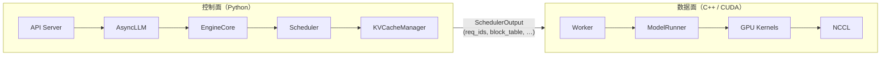
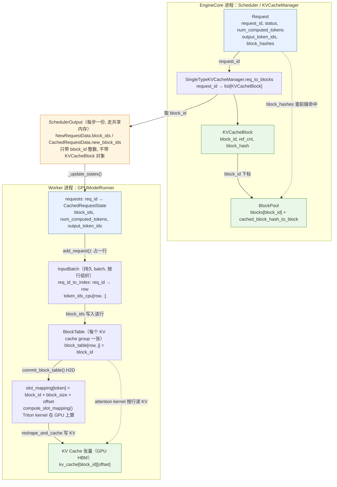
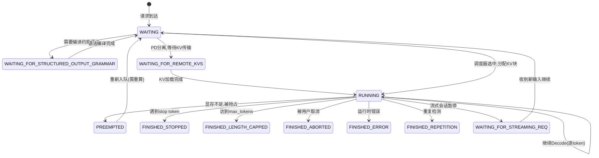
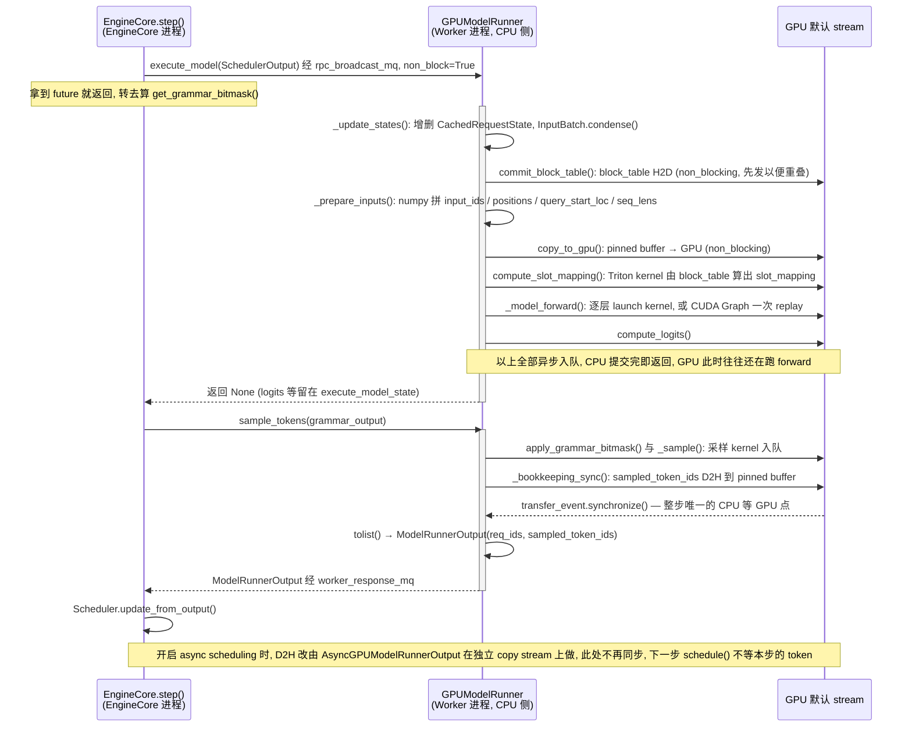

> **NOTE** 本文基于 vLLM v0.27.1（tag `6e448d0`, 2026-08-11）源码剖析。文中文件路径、类名和函数名均以该版本为准；vLLM 迭代很快，阅读时请以你手上的版本对照。


> **前十三篇回答了「是什么」和「为什么」，这一篇回答「怎么实现」。**

现在你已经知道 Scheduler 为什么要按 token 预算调度、KV Cache 为什么要分块、Attention Backend 为什么要按 batch 形态分派。带着这些「为什么」回头看数据结构，它们就不再是需要背的字段列表，而是每一个都能对应到一个设计约束。

这一篇刻意放在最后：如果它出现在系列的第二篇，你只会看到一堆 class；出现在这里，你会看到**设计决策留下的痕迹**。

本篇的核心问题是：

> **前面讲过的每个概念——调度、KV 分块、Attention 分派、多卡通信——在 vLLM 源码里对应哪个对象、哪次状态变化、哪条调用链？**

## 一、总览：把抽象还原成工程事实

### 1. 从边界到调用链

本篇沿一条自上而下的路径把源码串起来：先看 vLLM V1 最外层的一道边界——Python 控制面与 C++/CUDA 数据面的分离，以及 Python 如何调用 C++；再给源码里的每个核心对象定位到请求域、调度域、显存域、模型域四个域之一；然后进入控制流的关键——请求状态机与 `Scheduler.schedule()` 的调度决策；接着看谁都没细讲的翻译层，`SchedulerOutput` 如何在 `ModelRunner.prepare_inputs()` 里变成 `slot_mapping`、`block_table` 等 GPU 张量；最后把从 HTTP 请求到 GPU Kernel 的完整调用链排成一张表，并附上一张各环节耗时量级的表。结尾回到系列开头那个请求，把各篇的账合起来复盘一遍。

### 2. 本文的章节安排

```text
第二章  控制面与数据面的分离       Python 控制面 vs C++/CUDA 数据面；为什么要解耦；PyBind11 与 Triton
第三章  四个域                     请求域、调度域、显存域、模型域：给源码里的每个对象定位
第四章  请求状态机                 RequestStatus 状态机；Scheduler 的统一 token 预算决策
第五章  翻译层                     SchedulerOutput 如何变成 GPU 张量：slot_mapping 与 block_table
第六章  从请求到 GPU Kernel 的完整调用链   十个环节与三道边界
第七章  附录：各环节耗时量级       Llama-2-7B / A100 单卡口径下的耗时表与 batch 摊薄效应
第八章  本文小结与系列总结         同一个请求的五笔账、四问的答案、三句话
```

## 二、控制面与数据面的分离



| | 控制面（Python） | 数据面（C++ / CUDA） |
|---|---|---|
| 组件 | API Server → AsyncLLM → EngineCore → Scheduler → KVCacheManager | Worker → ModelRunner → GPU Kernels → NCCL |
| 职责 | 请求接收与参数解析、Tokenization / Detokenization、请求状态机、流式响应、数据并行协调 | 输入张量准备、模型 Forward（GEMM / Attention / MLP）、KV Cache 物理读写 |
| | 调度决策、KV 块分配与释放、Prefix Cache 查找、抢占决策、停止条件检测 | 采样（top-p / top-k / temperature）、集合通信、CUDA Graph 捕获与重放 |
| 技术栈 | ZMQ IPC、msgspec 序列化、asyncio | CUDA Stream 驱动、零拷贝传输 |

**为什么控制流和数据流需要解耦？**

1. **语言特性匹配**：调度逻辑复杂多变（频繁的条件判断、动态数据结构操作），适合 Python；数值计算追求极致性能，适合 C++/CUDA
2. **迭代速度**：调度算法是 vLLM 最频繁迭代的模块，Python 的开发效率远胜 C++
3. **控制面开销可被摊薄**：只要调度、序列化和输入准备开销显著小于 GPU 执行时间，Python 控制面的影响就可以被流水线化和批处理摊薄；具体是否成为瓶颈取决于 batch、模型和硬件
4. **Batch Queue 机制**：vLLM 通过 `batch_queue` 等机制让调度与执行尽量流水线化，当 GPU 执行当前 batch 时，CPU 侧可以准备后续 batch

**说明** 为什么控制面开销可被摊薄？
这里用数字解释说明一下。下图以一个较大模型的 decode 步（forward 约 15 ms 量级，例如 70B 级别多卡部署）为例——第七章那张 7B 单卡的表里 decode 是 8–12 ms，量级不同但结论一致：只要 GPU 侧是十毫秒量级，Python 侧的零点几毫秒就淹没在里面。

```
单次 Decode 迭代
  Python 控制面  ──[schedule ~0.05ms][prepare ~0.1ms]
  GPU 数据面     ────────────────────────────[model forward ~15ms][sample ~0.05ms]
                 → Python 开销占比 0.15ms / 15ms ≈ 1%

流水线化后（Batch Queue）
  CPU  ──[sched N][prep N]──[sched N+1][prep N+1]──
  GPU  ──────────────────[forward N]──────────[forward N+1]──
                          ↑ GPU 在算 N 的同时，CPU 已在准备 N+1
                          → Python 延迟被摊薄甚至完全隐藏
```

Python/C++语言核心分工原则：

| 层面 | 语言 | 职责 | 为什么选这个语言 |
|------|------|------|----------------|
| API + 调度 | Python | 请求管理、调度策略、KV块分配 | 逻辑复杂多变，需要快速迭代 |
| 输入准备 | Python + PyTorch | 张量构建、block table 更新 | 利用 PyTorch 的张量接口 |
| 模型 Forward | C++/CUDA (via PyTorch) | GEMM、Attention、MLP | 极致性能 |
| 自定义算子 | CUDA / Triton | RMSNorm、RoPE、Fused Attention | 硬件特化 |
| 集合通信 | C++ (NCCL) | All-Reduce、All-Gather | 零拷贝、内核级调度 |

### 1. Python如何调用C++：PyBind11 与 Triton

vLLM 的 C++/CUDA 扩展通过 PyTorch 的 Custom Op 机制注册（位于 `csrc/` 目录），使用 PyBind11 绑定 Python 接口。同时，许多算子（尤其是 Attention 和 MoE 相关）使用 OpenAI Triton 编写，兼顾性能和开发效率：

| Python 层 | → | C++ / CUDA 层 | → | GPU 硬件 |
|---|---|---|---|---|
| `torch.ops.vllm.rms_norm()` | | `csrc/libtorch_stable/layernorm_kernels.cu` | | CUDA Cores |
| `attention_backend()` | | FlashAttention（C++ lib）或 Triton kernel（`.py`） | | Tensor Cores |
| `fused_moe()` | | `csrc/libtorch_stable/moe/`（CUDA）或 Triton experts（`.py`） | | Tensor Cores |
| `torch.matmul()` | | cuBLAS GEMM | | Tensor Cores |


## 三、四个域：给源码里的每个对象定位

vLLM V1 的核心数据对象（定义在 `vllm/v1/request.py`、`vllm/v1/core/sched/output.py`、`vllm/v1/outputs.py`）可以分为四个域：

- **请求域**：`Request` 是调度器内部对请求的完整表示，包含 token ids、采样参数、状态机状态、块哈希等
- **调度域**：`SchedulerOutput` 封装每一轮的调度决策，`ModelRunnerOutput` 封装 GPU 执行结果
- **显存域**：`KVCacheBlock` 是物理块的元数据（含引用计数和哈希），Block Table 维护虚拟→物理映射
- **模型域**：模型权重常驻 GPU，激活张量在前向计算中动态生成和销毁

这四个域和第一篇的四问是对应的：请求域是四问的输入，调度域是第一问的产物，显存域是第二问的产物，模型域是第三问的战场。

```
┌─────────────────────────────────────────────────────────────────────┐
│                      核心数据对象全景图                               │
├─────────────────────────────────────────────────────────────────────┤
│                                                                     │
│  ┌──────────────────── 请求域 ────────────────────────┐             │
│  │                                                     │            │
│  │  EngineCoreRequest  ──→  Request                    │            │
│  │  (IPC 传输对象)         (调度器内部对象)              │            │
│  │    · request_id          · status (状态机)           │            │
│  │    · prompt (text)       · prompt_token_ids          │            │
│  │    · sampling_params     · output_token_ids          │            │
│  │    · lora_request        · num_computed_tokens       │            │
│  │                          · block_hashes              │            │
│  │                          · spec_token_ids            │            │
│  └─────────────────────────────────────────────────────┘            │
│                                                                     │
│  ┌──────────────────── 调度域 ────────────────────────┐             │
│  │                                                     │            │
│  │  SchedulerOutput           ModelRunnerOutput         │            │
│  │  (调度决策)                (模型执行结果)             │            │
│  │    · scheduled_requests     · req_ids                │            │
│  │    · num_scheduled_tokens   · sampled_token_ids      │            │
│  │    · finished_req_ids       · logprobs_tensors       │            │
│  │    · preempted_req_ids      · draft_tokens           │            │
│  └─────────────────────────────────────────────────────┘            │
│                                                                     │
│  ┌──────────────────── 显存域 ────────────────────────┐             │
│  │                                                     │            │
│  │  KVCacheBlock              Block Table               │            │
│  │  (物理块元数据)            (虚拟→物理映射)            │            │
│  │    · block_id               · req → [block_ids]      │            │
│  │    · ref_cnt                                         │            │
│  │    · block_hash                                      │            │
│  │                                                      │            │
│  │  KV Cache Tensor (GPU HBM)                           │            │
│  │    · shape: [num_blocks, block_size, num_heads, d]   │            │
│  └─────────────────────────────────────────────────────┘            │
│                                                                     │
│  ┌──────────────────── 模型域 ────────────────────────┐             │
│  │                                                     │            │
│  │  Model Weights (参数)   Activations (激活)           │            │
│  │    · Linear.weight        · hidden_states            │            │
│  │    · LayerNorm.weight     · Q, K, V tensors          │            │
│  │                           · attention_output         │            │
│  │                           · logits                   │            │
│  └─────────────────────────────────────────────────────┘            │
└─────────────────────────────────────────────────────────────────────┘
```

两条边界值得留意：

- **`EngineCoreRequest` → `Request` 是一次跨进程翻译**。前者是能被 msgspec 序列化、走 ZMQ 的扁平数据；后者是带状态机、会被反复修改的活对象。这条边界就是第二章控制面的进程边界。
- **显存域是唯一"跨请求共享"的域**。请求域、调度域、模型域的对象都属于某一次请求或某一轮迭代，而 `KVCacheBlock` 会被多个请求通过 `ref_cnt` 共享——Prefix Cache 的全部魔法都发生在这一行。

上面的全景图按域列出了字段，但没有回答"这些对象之间靠什么串起来"。答案是两把钥匙——`request_id` 和 `block_id`——以及一次跨进程的复制：调度器进程里 `Request` 通过 `request_id` 找到它的 `KVCacheBlock` 列表，块对象只在这个进程存在；跨到 Worker 进程时，`SchedulerOutput` 只带整数 `block_id`，Worker 用它填 `BlockTable` 的一行，再由 `BlockTable` 派生出 kernel 真正读写 KV 张量所需的 `slot_mapping`：



读这张图要抓住三处"断开"：

1. **`KVCacheBlock` 对象不出进程。** `ref_cnt`、`block_hash` 只在 Scheduler 侧有意义（决定能否复用、何时释放），Worker 侧看到的只是一个整数 `block_id`。所以 Prefix Cache 命中与否，Worker 完全不知情——它只是少收到几个要写的 token。
2. **`CachedRequestState` 是 `Request` 的只读镜像。** 两者字段高度重合（`num_computed_tokens`、`output_token_ids`、`block_ids`），但前者靠每步 `CachedRequestData` 的增量维护，从不反向同步；`Request` 才是权威。
3. **`InputBatch` 的行号是临时的。** `req_id_to_index` 每步都可能因 `condense()`（把尾行搬到空洞）而变化，`BlockTable` 和 `token_ids_cpu` 都按行号索引，所以它们必须和 `InputBatch` 同步搬行（`move_row` / `swap_row`）。`request_id` 是跨进程的稳定身份，行号只是 Worker 内一次 step 的临时坐标。

## 四、请求状态机：系统如何决定"下一步做什么"

### 1. 请求状态机

vLLM V1 的请求状态机（`RequestStatus`，定义在 `vllm/v1/request.py`）是理解控制流的关键：



```python
# vllm/v1/request.py
class RequestStatus(enum.IntEnum):
    WAITING = enum.auto()
    WAITING_FOR_STRUCTURED_OUTPUT_GRAMMAR = enum.auto()
    WAITING_FOR_REMOTE_KVS = enum.auto()
    WAITING_FOR_STREAMING_REQ = enum.auto()
    RUNNING = enum.auto()
    PREEMPTED = enum.auto()
    # Note: anything after PREEMPTED will be considered as a finished status.
    FINISHED_STOPPED = enum.auto()
    FINISHED_LENGTH_CAPPED = enum.auto()
    FINISHED_ABORTED = enum.auto()
    FINISHED_IGNORED = enum.auto()
    FINISHED_ERROR = enum.auto()
    FINISHED_REPETITION = enum.auto()
```

状态机里值得特别注意的是 PREEMPTED：它只有一条出路，即回到 WAITING。被抢占的请求会释放 KV 块，等调度器重新分配资源后再继续。因此系统不能假设"已经开始跑的请求一定能跑完"，Scheduler 每轮都要同时面对新请求和恢复请求。

### 2. Scheduler 的调度决策

在 vLLM V1 中，`Scheduler.schedule()` 的核心不是把系统硬切成 Prefill 阶段和 Decode 阶段，而是在每一轮迭代里分配统一的 token 预算。源码注释明确指出：调度器内部没有严格的 "decoding phase" 或 "prefill phase"；每个请求维护 `num_computed_tokens`，调度器尝试让它追赶 `num_tokens_with_spec`。

```
┌─────────────────────────────────────────────────────────────────┐
│                  Scheduler.schedule() 核心问题                    │
├─────────────────────────────────────────────────────────────────┤
│  输入: 当前 running / waiting 请求、KV Cache 状态、token budget     │
│                                                                 │
│  对每个可推进请求，计算本轮可以新增多少 token:                      │
│  · 新请求可能推进一段 prompt tokens                                │
│  · 已运行请求通常推进下一个 decode token                            │
│  · spec decode / MTP 可能需要额外 lookahead tokens                 │
│  · 长 prompt 可能被 long_prefill_token_threshold 截断              │
│                                                                 │
│  同时满足:                                                        │
│  · max_num_batched_tokens / max_num_scheduled_tokens              │
│  · max_num_seqs                                                   │
│  · KV Cache 可用块数                                               │
│  · encoder / multimodal / structured output 等附加约束             │
│                                                                 │
│  输出: SchedulerOutput                                            │
│  · 本轮调度的请求与 token 数                                        │
│  · block table / slot mapping 相关更新                             │
│  · preemption、KV transfer、spec decode 等执行提示                  │
└─────────────────────────────────────────────────────────────────┘
```

这里可以和第一篇的结论对上了：Prefill / Decode 的区分在**性能分析**层面依然成立（第一篇「Prefill 与 Decode」一章），但在 **Scheduler 的实现**层面它们被统一到"本轮给这个请求推进多少 token"这一个模型里——这正是第四篇反复强调的那句话在源码里的样子。


## 五、翻译层：SchedulerOutput 如何变成 GPU 张量

第四篇的调度决策和第六篇的 GPU 执行之间，隔着一层谁都没细讲的翻译：调度器交出来的是"哪个请求本轮推进多少 token"，而 kernel 要的是"这个 token 的 KV 写到哪个 slot、这个请求能读哪些块"。做这件翻译的是 `ModelRunner.prepare_inputs()`。

**Scheduler 交出来的东西**（`SchedulerOutput`）：

| 字段 | 内容 | 含义 |
|---|---|---|
| `scheduled_new_reqs` | `{req_id: num_tokens}` | 首次调度的请求 |
| `scheduled_running_reqs` | `{req_id: num_tokens}` | 继续执行的请求 |
| `req_to_new_blocks` | `{req_id: [(block_id, n)]}` | 本轮的块分配 |
| `finished_req_ids` / `preempted_req_ids` | — | 状态通知 |

**`ModelRunner.prepare_inputs()` 把它翻译成 GPU 数据结构**，四步：

| 步骤 | 做什么 | 细节 |
|---|---|---|
| ① `InputBatch` 构造 | 按 scheduled tokens 扁平化成一条 token_id 序列 | Req A（已缓存 256、新推 256）→ 追加 256 个<br/>Req B（decode）→ 追加 1 个<br/>Req C（spec decode）→ 追加 1+N 个 |
| ② `slot_mapping` 构造 | 每个 token → `(block_id, offset)` | 新块从头写；已有块追加到尾部；**Prefix Cache 命中的 token 不写，直接复用** |
| ③ attention metadata | 告诉 kernel 每个请求能读哪些块 | `block_table`（per req）、`query_lens` / `kv_lens` / `is_prompt` / spec flags |
| ④ 执行模式选择 | 决定走 Graph 还是 Eager | 纯 decode 且 size 匹配 → CUDA Graph replay；含 prefill / mixed / size 不匹配 → Eager |

最终**给 GPU 的**是 `input_ids, positions, attn_metadata`，**从 GPU 拿回的**是 `hidden_states → logits → sampled_token_ids`。

大致流程如下所示：

```
┌─────── SchedulerOutput → ModelRunner 映射 ───────────────────────────┐
│                                                                      │
│  Scheduler 输出:                                                     │
│  ┌──────────────────────────────────────────────────────────────────┐ │
│  │ scheduled_new_reqs:      {req_id: num_tokens}       ← 首次调度    │ │
│  │ scheduled_running_reqs:  {req_id: num_tokens}       ← 继续执行    │ │
│  │ req_to_new_blocks:       {req_id: [(block_id, n)]}  ← 块分配      │ │
│  │ finished_req_ids, preempted_req_ids, ...            ← 状态通知    │ │
│  └──────────────────────────────────────────────────────────────────┘ │
│                              │                                        │
│                              ▼                                        │
│  ModelRunner.prepare_inputs():                                        │
│  ┌──────────────────────────────────────────────────────────────────┐ │
│  │ 1. InputBatch 构造: 根据 scheduled tokens 扁平化为 token_id 序列  │ │
│  │    · Req A (已缓存 256, 新推 256) → 追加 256 个 token_ids         │ │
│  │    · Req B (decode) → 追加 1 个 token_id                          │ │
│  │    · Req C (spec decode) → 追加 1 + N 个 token_ids                │ │
│  │                                                                  │ │
│  │ 2. slot_mapping 构造: token → (block_id, offset)                 │ │
│  │    · 新分配的块 → 从头写入                                         │ │
│  │    · 已存在块 → 追加到尾部                                         │ │
│  │    · Prefix Cache 命中的 token → 不写入, 直接复用                   │ │
│  │                                                                  │ │
│  │ 3. attention metadata 构造:                                       │ │
│  │    · block_table (per req): 虚拟块 → 物理块的映射                  │ │
│  │    · query_lens / kv_lens / is_prompt / spec_decode flags         │ │
│  │                                                                  │ │
│  │ 4. CUDA Graph / Eager 模式选择:                                   │ │
│  │    · Pure decode + size matched → CUDA Graph replay               │ │
│  │    · 含 prefill / mixed / size mismatch → Eager 模式              │ │
│  └──────────────────────────────────────────────────────────────────┘ │
│                                                                      │
│  给 GPU: input_ids, positions, attn_metadata                          │
│  从 GPU: hidden_states → logits → sampled_token_ids                   │
└──────────────────────────────────────────────────────────────────────┘
```

图中 SchedulerOutput 到 GPU 计算中间隔着一层的 `ModelRunner.prepare_inputs`。这一层不是调模型，而是把调度决策翻译成 GPU 数据结构：`slot_mapping` 告诉每个 token 的 KV 写去哪，`block_table` 告诉每个请求能读到哪些块。CUDA Graph / Eager 的选择也在这里决定。这层翻译是看懂后面 Prefill、Decode 和 Mixed Batch 执行差异的前提。

现在可以回头看这一层为什么必须存在：`slot_mapping` 是第五篇分块存储的直接产物（KV 不连续，所以必须逐 token 给出落点），`block_table` 是 Prefix Cache 共享的直接产物（多个请求可能指向同一个物理块），而"走 Graph 还是 Eager"则是第六篇 CUDA Graph 那个约束的落地位置（图里的形状必须固定）。**三个字段，三篇的设计约束。**

### 1. 一步之内的时序：CPU 与 GPU 在哪里等谁

上面讲的是"翻译什么"，还有一个问题是"翻译和计算在时间上怎么排"。第二章那张流水线图说 CPU 准备 N+1 步时 GPU 在算 N 步，它成立的前提是**一步之内 CPU 几乎不等 GPU**。v0.27.1 把一步拆成 `execute_model()` 和 `sample_tokens()` 两次调用，下面按时间顺序标出每个动作发生在 CPU 还是 GPU、哪里是异步入队、哪里是真正的同步点：



几点解读：

- **`execute_model()` 全程不同步。** 从 `_update_states()` 到 `compute_logits()`，CPU 做的只是填 pinned buffer、发 `non_blocking` 拷贝、launch kernel（或 replay 一张图）。`commit_block_table()` 被刻意放在最前面，让 block table 的 H2D 拷贝和后面的 numpy 计算重叠——这是源码注释里明说的优化。
- **同步点只有一个，且被推到最后。** `_bookkeeping_sync()` 里的 `_to_list()` 用 `transfer_event.synchronize()` 等采样结果落到 CPU；它用 CUDA event 而不是 `tolist()` 直接触发的全 stream 同步，是为了不阻塞其他 stream 上的拷贝（比如 KV 传输）。在这个点之前，GPU 上排着的是 forward + 采样整条队列，CPU 等的时间就是 GPU 真正的计算时间。
- **为什么拆成两次调用。** `execute_model()` 返回后、`sample_tokens()` 之前，EngineCore 有一个窗口可以做需要上一步结果的事（结构化输出的 grammar bitmask），而 GPU 此刻正在跑 forward——把 CPU 侧这段工作塞进 GPU 的空当。
- **async scheduling 把最后那个同步点也拿掉了。** 采样结果留在 GPU，`AsyncGPUModelRunnerOutput` 在另一条 copy stream 上做 D2H，Scheduler 用占位 token 先调度下一步，等结果到达再修正。这就是第二章"流水线化"在源码里更激进的形态。


## 六、从请求到 GPU Kernel 的完整调用链

把前面所有环节串成一条链，可以清楚看到三道边界——两道进程边界（③ ZMQ、⑤ 共享内存队列）和一道 Python → CUDA 边界（⑦）——落在哪几个位置：

```
  HTTP Request ("Hello")
       │
       │ ①  Python (FastAPI)
       ▼
  api_server.py: create_chat_completion()
       │
       │ ②  Python (async)
       ▼
  AsyncLLM.add_request() → Tokenizer → [15496, 11, ...]
       │
       │ ③  Python (IPC: ZMQ + msgspec)
       ▼
  EngineCore.add_request() → Scheduler.add_request()
       │
       │ ④  Python (调度算法)
       ▼
  Scheduler.schedule() → SchedulerOutput
       │
       │ ⑤  进程边界 (共享内存 MessageQueue)
       ▼
  Executor.execute_model() → Worker.execute_model()
       │
       │ ⑥  Python (张量准备)
       ▼
  ModelRunner._execute_model()
    → prepare_inputs(): 构建 input_ids, positions, block_table 张量
       │
       │ ⑦  Python → CUDA 边界 (PyTorch dispatch)
       ▼
  model.forward(input_ids, positions, kv_caches, attn_metadata)
    → 每层: RMSNorm → QKV → RoPE → Attention → O_proj → MLP
       │
       │ ⑧  CUDA Kernel Launch (C++ runtime)
       ▼
  Attention Backend (FlashAttention / FlashInfer)
    → flash_attn_varlen_func() 或 flashinfer.decode()
       │
       │ ⑨  CUDA Graph (可选: Decode 阶段)
       ▼
  cudagraph_manager.run_fullgraph(batch_desc)
    → 预捕获的完整执行图一次性重放
       │
       │ ⑩  GPU → CPU
       ▼
  Sampling: logits → sampled_token_ids (GPU tensor → CPU list)
       │
       │ ⑪  Python (输出处理)
       ▼
  ModelRunnerOutput → Scheduler.update_from_output()
    → Detokenizer → "Sure" → SSE Stream → Client
```

| # | 层 | 调用 | 语言 / 边界 |
|---|---|---|---|
| ① | HTTP 入口 | `api_server.py: create_chat_completion()` | Python（FastAPI） |
| ② | 异步引擎 | `AsyncLLM.add_request()` → Tokenizer → `[15496, 11, …]` | Python（async） |
| ③ | 进程边界 | `EngineCore.add_request()` → `Scheduler.add_request()` | **Python IPC：ZMQ + msgspec** |
| ④ | 调度 | `Scheduler.schedule()` → `SchedulerOutput` | Python（调度算法） |
| ⑤ | 执行分发 | `Executor.execute_model()` → `Worker.execute_model()` | **进程边界：共享内存 `MessageQueue`（`rpc_broadcast_mq`）** |
| ⑥ | 张量准备 | `ModelRunner._execute_model()` → `prepare_inputs()`：构建 `input_ids`、`positions`、`block_table` | Python |
| ⑦ | 模型前向 | `model.forward(...)`；每层 RMSNorm → QKV → RoPE → Attention → O_proj → MLP | **Python → CUDA 边界（PyTorch dispatch）** |
| ⑧ | Attention kernel | Attention Backend → `flash_attn_varlen_func()` 或 `flashinfer.decode()` | **CUDA Kernel Launch（C++ runtime）** |
| ⑨ | 图重放（可选） | `cudagraph_manager.run_fullgraph(batch_desc)`：预捕获的完整图一次性重放 | CUDA Graph，仅 Decode |
| ⑩ | 取回结果 | Sampling：`logits` → `sampled_token_ids`（GPU tensor → CPU list） | **GPU → CPU** |
| ⑪ | 输出处理 | `ModelRunnerOutput` → `Scheduler.update_from_output()` → Detokenizer → SSE Stream → Client | Python |

三道边界（③⑤⑦）恰好把这条链切成了四段，而它们的位置不是随意的：

- **③ 是进程边界** —— API 层与引擎核心分离，为的是不让 HTTP 处理阻塞调度循环；
- **⑤ 也是进程边界，同时是控制面与数据面的边界** —— 上游全是决策，下游全是计算（第二章）；EngineCore 只把 `SchedulerOutput` 序列化后经共享内存广播给 Worker 进程，单卡时 Executor 与 Worker 同进程（`UniProcExecutor`）则退化为普通函数调用；
- **⑦ 是 Python 与 GPU 的边界** —— 过了这里就再没有 Python 开销可言。

前面说"Python 控制面只占 ~1%"，指的正是 ①–⑥ 这一段相对 ⑦–⑩ 的耗时占比。

上面那条链是"时间顺序"，下面换成"调用栈"再看一遍。区别在于嵌套关系：`step()` 是一个普通函数，`schedule()`、`execute_model()`、`update_from_output()` 都是它的直接子调用，⑪ 返回的地方就是 ④ 出发的地方；而三段栈分别活在三个进程里，栈与栈之间只靠消息队列衔接，没有任何一个 Python 帧同时横跨两道边界：

```text
进程 A · API Server                          vllm/entrypoints/, vllm/v1/engine/
└─ create_chat_completion()                  chat_completion/serving.py
   └─ AsyncLLM.generate()                    async_llm.py
      ├─ add_request()
      │  ├─ InputProcessor.process_inputs()  input_processor.py   tokenize
      │  └─ AsyncMPClient.add_request_async() core_client.py      ZMQ 发送 ↓
      └─ await RequestOutputCollector.get()  ◀─ output_handler() 协程 ↑
         └─ OutputProcessor.process_outputs() output_processor.py detokenize
═══ 进程边界 ①：ZMQ + msgspec（EngineCoreRequest ↓ / EngineCoreOutputs ↑）═════
进程 B · EngineCoreProc                      vllm/v1/engine/core.py
├─ process_input_sockets() 输入线程          ◀─ ZMQ 收 EngineCoreRequest
│  └─ preprocess_add_request() → Request.from_engine_core_request()
├─ run_busy_loop() 主线程
│  └─ step()
│     ├─ Scheduler.schedule()                core/sched/scheduler.py
│     │  ├─ KVCacheManager.get_computed_blocks()   core/kv_cache_manager.py
│     │  └─ KVCacheManager.allocate_slots()
│     ├─ MultiprocExecutor.execute_model()   executor/multiproc_executor.py
│     │  └─ collective_rpc() → rpc_broadcast_mq.enqueue()   共享内存广播 ↓
│     ├─ MultiprocExecutor.sample_tokens()   同上, 阻塞等 worker_response_mq ↑
│     └─ Scheduler.update_from_output()      ◀─ ModelRunnerOutput
└─ process_output_sockets() 输出线程         → ZMQ 发 EngineCoreOutputs ↑
═══ 进程边界 ②：共享内存 MessageQueue（SchedulerOutput ↓ / ModelRunnerOutput ↑）
进程 C · WorkerProc（每个 TP/PP rank 一个）  vllm/v1/worker/
└─ worker_busy_loop()                        executor/multiproc_executor.py
   └─ Worker.execute_model() / sample_tokens()   gpu_worker.py
      └─ GPUModelRunner                      gpu_model_runner.py
         ├─ _update_states()      CPU: 同步 CachedRequestState / InputBatch
         ├─ _prepare_inputs()     CPU → GPU: H2D 拷贝 + slot_mapping kernel
         ├─ _model_forward()   ┐  Python → CUDA 边界（PyTorch dispatch）
         ├─ compute_logits()   │  Attention → flash_attn / FlashInfer kernel
         ├─ _sample()          │  或整段 CUDA Graph replay
         └─ _bookkeeping_sync()┘  GPU → CPU: 整步唯一的 D2H 同步点
```

这张树回答了一个链式图回答不了的问题：**每个进程里"常驻"的是什么。** 进程 A 常驻的是每个请求一个的 `generate()` 协程和一个全局 `output_handler()` 协程；进程 B 常驻的是三个线程，其中主线程的栈底永远是 `run_busy_loop() → step()`；进程 C 常驻的是 `worker_busy_loop()`，它从共享内存里取出方法名和参数、反射调用 `Worker` 上的同名方法、把返回值塞回响应队列——`execute_model` 和 `sample_tokens` 对它来说只是两个字符串。三段栈都是"死循环 + 一次调用"的形状，请求本身不在任何一个栈上，它只是三条消息队列里流过的数据。


## 七、附录：各环节耗时量级

**测试口径**（不写清口径的耗时表没有意义）：Llama-2-7B、FP16、A100 80GB 单卡（HBM 带宽约 2.0 TB/s）、TP=1、prompt 512 tokens、无 prefix cache 命中、CUDA Graph 开启。**换任何一个条件，下面的数字都会变。**

| 环节 | 典型耗时 | 说明 |
|---|---|---|
| Tokenization | 0.1–0.5 ms | CPU，可忽略 |
| `Scheduler.schedule()` | 0.01–0.1 ms | Python，随请求数增长 |
| CPU→GPU 输入拷贝 | 0.01–0.05 ms | PCIe DMA，数据量极小 |
| Kernel Launch | ~2–5 μs/个 | Decode 一步数百个（7B / 32 层）；开 CUDA Graph 后合并为 1 次 |
| Prefill（512 tokens） | 5–15 ms | Compute-bound，GEMM 主导 |
| **Decode 一步（batch=1）** | **8–12 ms** | Memory-bound，下界由权重读取决定 |
| **Decode 一步（batch=32）** | **10–18 ms** | **注意：不是 ×32** |
| 权重读取 | ≈ 6.6 ms | 13.5 GB ÷ 2.0 TB/s，**batch=1 时 decode 耗时的大头** |
| KV Cache 读取 | 随上下文线性增长 | 512 ctx 时很小；32K ctx 时会反超权重成为主导 |
| Sampling | 0.01–0.1 ms | GPU kernel |
| GPU→CPU token 拷贝 | ~5 μs | 数据量极小 |
| Detokenization | 0.01–0.05 ms | CPU，可忽略 |

派生指标：

| 指标 | batch=1 | batch=32 | 说明 |
|---|---|---|---|
| TTFT | 10–20 ms | 随排队增加 | ≈ queueing + prefill |
| TPOT | 8–12 ms | 10–18 ms | ≈ 一次 decode 步 |
| 系统吞吐 | ~100 tok/s | **~2000 tok/s** | batch 放大的是这一行 |


这张表里最值得盯住的是**加粗的那两行**。batch 从 1 涨到 32，单步耗时只从 ~10 ms 涨到 ~15 ms，**远不是 32 倍**——因为那 13.5 GB 权重无论 batch 多大都只需要从 HBM 读一遍，32 个请求把这笔固定成本摊薄了。

这正是第一篇那条吞吐-延迟权衡曲线的微观解释，也是 Continuous Batching 全部收益的来源：**在 memory-bound 区间，增大 batch 几乎是免费的吞吐。** 直到 batch 大到让 KV Cache 读取或计算本身成为新瓶颈为止——那时曲线才会掉头。

顺带澄清一个常见误解：**ITL 不等于 `TPOT × batch`。** 稳态下 ITL 约等于 TPOT；它真正的意义在于反映**波动**——当一个长 prompt 的 chunked prefill 插进来、或者发生抢占时，个别 token 的间隔会出现尖峰。所以优化 ITL 靠的是稳定调度，不是缩小 batch。


## 八、本文小结与系列总结

我们从第一篇起跟踪的那个请求，现在可以完整地复盘一遍了：

| 篇 | 这个请求在这一篇遭遇了什么 | 数字 |
|---|---|---|
| 五 | 它的 KV 被切成块存放；system prompt 那 125 个整块可被后续请求复用 | 147 块 / 734 MB |
| 四 | 它没有"prefill 阶段"，只是被持续发放 token 额度，直到追平 2050 | 若 chunk=512 则分 5 段 |
| 六 | 97% 的时间花在 300 次逐 token 的 decode 上 | 92 ms + 3000 ms |
| 八 | 每个 token 每步在 8 张卡间同步约 2.5 MB | NVLink 上 ~0.09 ms |
| 十二 | 若拆成 PD 两池，它的 641 MB KV 要跨节点搬一次 | ≈ 13 ms |

**同一个请求，五个视角，五笔完全不同的账。** 这正是 Serving Infra 的日常——没有哪一个数字能单独说明问题，但它们合在一起就是系统的全貌。

回到第一篇阅读地图的那四个问题，现在每一个都有了答案：

| 问题 | vLLM 的回答 |
|------|-----------|
| 这一轮谁执行、执行多少 | Continuous Batching + 统一 token 预算 + Chunked Prefill |
| 状态放哪、怎么复用 | PagedAttention + Prefix Cache + GQA/MLA + KV 量化 |
| 怎么算得更快 | FlashAttention + CUDA Graph + 算子融合 + 低精度 + 投机解码 |
| 怎么扩出去 | TP / PP / EP / CP / DP + 通信重叠 |

但如果只把这些当成一份优化清单，就错过了最重要的东西。**这些技术之所以能共存于一个系统，是因为它们背后有一套统一的世界观。** 如果这个系列只留下三句话，我希望是这三句：

**其一，KV Cache 是一切约束的源头。** 它是 LLM 推理里唯一随时间无限增长的状态，所以它同时决定了并发上限、上下文上限和抢占时机。看不懂显存，就看不懂调度——第十三篇那三个未来方向，最后都撞回了这堵墙。

**其二，调度的单位是 token，不是 request。** Scheduler 内部没有"prefill 阶段"和"decode 阶段"，只有"这一轮给这个请求推进多少 token"。理解了这一点，Continuous Batching、Chunked Prefill、投机解码、混合批次就不再是四种技巧，而是同一个模型的四种取值。

**其三，文中每个性能数字都只是量级示意。** 接受率、加速比、耗时表——它们随模型、硬件、batch、上下文长度剧烈漂移。真正可迁移的是判断方法（先定位瓶颈在 Prefill 还是 Decode，再选手段），而不是具体数值。请在你自己的 workload 上重测。

所以最后，我更愿意这样概括它：

> **vLLM 不是一堆推理优化技术的集合，而是一套围绕「动态请求 + KV 状态 + GPU 资源」构建起来的推理操作系统。**

它调度任务、管理内存、抽象硬件、隔离故障——操作系统做的事，它都在做，只不过管的不是进程和物理内存页，而是请求和 KV 块。理解了这个类比，你就不只是理解了 vLLM，而是拿到了看懂下一个 Serving 系统的钥匙。
 


## 回到总纲

本篇是系列的最后一篇。完整目录见[《大模型推理系统揭秘：从 vLLM 看 LLM Serving Infra 核心技术》总纲](/deep-dive-into-vllm.html)。
