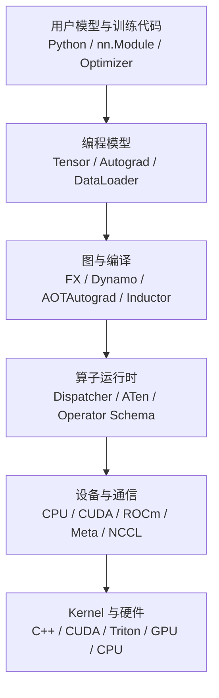
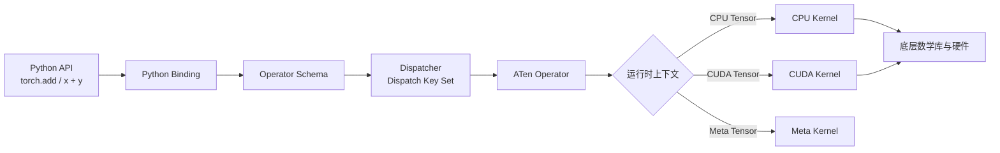

PyTorch 经常被介绍成一个“深度学习框架”，也经常被使用成一个 Python 库：导入 `torch`，创建 Tensor，定义 `nn.Module`，然后训练模型。

这种理解对于开始使用 PyTorch 已经足够，但对于训练平台、推理引擎、算子开发和 AI-Infra 来说还不够。真正需要理解的是：

> **PyTorch 如何把 Python 中表达的张量计算，转化为可以自动求导、跨设备执行、编译优化和分布式协作的运行时系统？**

一行看起来很普通的代码：

```python
z = torch.add(x, y)
```

背后可能涉及：

```text
Python API
    ↓
Python Binding
    ↓
Operator Schema
    ↓
Dispatcher
    ↓
ATen Operator
    ↓
CPU / CUDA / Meta Kernel
    ↓
底层数学库与硬件
```

如果这条链路只停留在“PyTorch 会自动处理”，那么遇到下面的问题时就只能依赖试错：

- 为什么同一个算子既能运行在 CPU，也能运行在 CUDA 上？
- 为什么某些 Tensor 操作会产生拷贝，另一些操作只是创建 view？
- 为什么 `model(x)` 不等于简单调用 `model.forward(x)`？
- 为什么模型在 eager mode 下运行正常，`torch.compile()` 后却出现 graph break？
- 为什么 GPU 利用率很低，却找不到明显的 Python 瓶颈？
- 为什么增加 GPU 数量后，训练速度没有线性提升？
- 为什么一个看似简单的 C++ 扩展会遇到 ABI、stride、dtype 或生命周期问题？

本文是《PyTorch 深度实践：从 Tensor 到深度学习运行时》的第一篇。它只负责建立全局地图，不深入某一个模块的全部实现。后续文章会沿着这张地图，逐步展开 Tensor、Autograd、Module、Dispatcher、编译器、性能和分布式运行时。


## 一、PyTorch 到底是什么？

### 1. PyTorch 是什么？

PyTorch 是一个面向张量计算和深度学习的开源计算平台。它以 Python 作为主要用户接口，以 C++ 运行时和算子系统作为执行核心，并通过 CPU、CUDA 以及其他硬件后端完成实际计算。

更完整地说，PyTorch 提供了一套从模型表达一直到设备执行的连续抽象：

```text
Tensor 与模型
    ↓
自动求导与训练
    ↓
算子分发与设备抽象
    ↓
CPU / GPU 执行
    ↓
编译优化与分布式扩展
```

因此，PyTorch 既不是只有 Python API 的工具包，也不是单独的 GPU 算子集合，而是连接以下几个层次的深度学习运行时：

```text
用户模型代码
    ↓
PyTorch 编程模型
    ↓
算子运行时
    ↓
设备后端
    ↓
Kernel 与硬件
```

从使用者角度看，PyTorch 提供了大量 Python API：

```python
import torch
from torch import nn

x = torch.randn(32, 128, device="cuda")
layer = nn.Linear(128, 256, device="cuda")
y = layer(x)
```

但 Python API 只是 PyTorch 的入口，不是 PyTorch 的全部实现。

PyTorch 至少包含以下几类能力：

| 能力 | 解决的问题 |
|---|---|
| Tensor | 如何表示和操作多维数据 |
| Autograd | 如何自动计算梯度 |
| `nn.Module` | 如何组织模型、参数和状态 |
| Optimizer | 如何根据梯度更新参数 |
| Dispatcher | 如何选择具体的算子实现 |
| ATen | 如何提供统一的 Tensor 和算子抽象 |
| CPU/CUDA Kernel | 如何在不同设备上执行计算 |
| Compiler | 如何捕获、变换和优化计算图 |
| Distributed | 如何让多个进程和设备协同工作 |
| Extension | 如何接入 C++、CUDA 和自定义硬件 |

### 2. PyTorch 提供什么？

从能力边界看，PyTorch 不只是一个 Python 库。Python API 是入口，真正的执行能力由下面这些相互协作的抽象组成。

一个深度学习系统至少需要处理以下问题：

```text
数据表示
    ↓
数学运算
    ↓
梯度计算
    ↓
模型组织
    ↓
参数更新
    ↓
设备执行
    ↓
性能优化
    ↓
多设备协作
    ↓
模型保存与部署
```

如果完全手工实现，开发者需要分别处理：

- 多维数组的内存布局；
- CPU 和 GPU 的数据存储；
- 算子的广播和 dtype 转换；
- 计算图构建；
- 反向传播；
- 参数和梯度管理；
- Kernel 调用；
- 多卡通信；
- 检查点和恢复训练。

PyTorch 的价值不是把这些问题消灭，而是为这些问题提供一套可以组合的抽象和运行时机制。


## 二、PyTorch 与其他深度学习框架

框架比较不能简单归结为“谁更好”。更有意义的比较是：它们如何表达计算、如何执行程序，以及如何把程序交给编译器和硬件。

| 框架 | 编程模型 | 典型执行方式 | 突出特点 |
|---|---|---|---|
| PyTorch | Python-first 的 Tensor 和 Module | Eager 为主，编译为辅 | 灵活、易调试、生态丰富 |
| TensorFlow | Tensor、Layer 和计算图 | Eager 与 Graph 并存 | 工业化工具链和部署生态完整 |
| JAX | 函数组合与程序变换 | 以变换和编译为核心 | `jit`、自动向量化、自动并行 |
| MXNet | 符号图与动态图 | 混合执行 | 历史上强调灵活性和分布式 |
| OneFlow | Tensor 与分布式训练抽象 | 图与运行时优化 | 面向大规模训练场景 |

PyTorch 的核心编程特色，是 Eager-first，同时逐步具备 Compiler-ready 能力。它的核心取舍可以概括为：

```text
优先提供灵活的 Python 编程体验
        ↓
允许程序在运行时立即执行
        ↓
通过 Autograd 动态构建计算图
        ↓
再使用 Compiler 对稳定部分进行优化
```

这种设计带来几个优势：

- Python 控制流可以直接参与模型计算；
- 出错时可以使用普通 Python 调试工具；
- 模型结构可以快速修改；
- 研究代码和工程代码之间的迁移成本较低；
- 可以逐步把性能敏感的部分下沉到 C++、CUDA 或编译器。

它也带来相应成本：

- Python 调度本身可能成为开销；
- 每次执行的动态性可能限制编译器优化；
- Kernel Launch 和同步可能放大细粒度操作的成本；
- 运行时行为比静态图更难提前分析；
- 不同设备、dtype 和 shape 的组合增加测试矩阵。

因此，PyTorch 的设计方向不是“只使用动态图”或“只使用静态图”，而是试图同时保留两者的价值：

```text
Eager Mode       → 灵活、可调试、适合探索
Compiled Mode    → 可分析、可融合、适合稳定执行
```


## 三、PyTorch 的架构演进

这里的“阶段”是为了帮助理解架构演进而做的归纳，不是 PyTorch 官方发布的固定分期。版本号和日期采用官方发布节点作为参照；不同能力往往跨越多个版本逐步成熟，不能简单归因于某一个版本。

| 阶段 | 代表版本与时间 | 主要变化 | 对今天架构的影响 |
|---|---|---|---|
| 动态图与研究友好 | 0.1.x，2016 年 9 月起公开 alpha，2017 年初持续迭代 | 以 Python 为中心的 Tensor、动态图和自动求导体验 | 奠定 Eager-first 的编程模型 |
| API 稳定与生产化 | 0.4，2018 年；1.0，2018 年 12 月 | Tensor/Variable 接口整合，API 稳定，TorchScript 和生产能力逐步引入 | 从研究工具走向通用深度学习平台 |
| C++ 运行时与分布式成熟 | 1.x，2019—2022 年 | ATen、C++ Tensor API、Dispatcher、分布式训练和自定义扩展持续完善 | Python API 之下形成完整运行时 |
| 图表示与编译基础设施 | 1.8—1.13，2021—2022 年 | FX、functorch、TorchDynamo、AOTAutograd、TorchInductor 等组件逐步发展 | 为 Eager 程序提供图捕获和优化路径 |
| 编译执行与大模型运行时 | 2.0，2023 年 3 月 15 日及之后 | `torch.compile` 成为主要编译入口，动态 Shape、分布式和 Transformer 优化持续增强 | 保留 Eager 体验，同时获得编译优化能力 |

### 1. 阶段一：动态图与研究友好

PyTorch 0.1.x 于 2016 年 9 月起以 alpha 版本公开发布，并在 2017 年初持续迭代。早期 PyTorch 的核心体验可以概括为：

```python
x = torch.randn(10, requires_grad=True)
y = x * 2
z = y.relu()
loss = z.sum()
loss.backward()
```

代码执行到哪一行，计算就发生到哪一行；Python 的 `if`、`for` 和函数调用可以直接参与模型逻辑。这个 Eager-first 的设计，成为 PyTorch 后续架构一直保留的用户体验基础。

### 2. 阶段二：API 稳定与生产化

PyTorch 0.4 在 2018 年带来了重要的 Tensor/Variable 接口整合。随后 PyTorch 1.0 于 2018 年 12 月发布，API 稳定性、生产使用和图执行能力成为重要方向。

这一阶段的关键不是“动态图被静态图取代”，而是开始提供从 Eager 模型走向更受约束执行环境的路径，例如 TorchScript。PyTorch 由此同时面对两类需求：

```text
研究与开发 → 灵活、即时、容易调试
生产与部署 → 可保存、可分析、可优化
```

### 3. 阶段三：C++ 运行时、算子系统与分布式成熟

在 1.x 系列中，PyTorch 持续强化：

- ATen；
- C++ Tensor API；
- Dispatcher；
- CPU/CUDA Kernel；
- C++ 前端；
- 分布式通信；
- 自定义算子和扩展机制。

这带来了一个重要变化：

> PyTorch 不再只是一个 Python 深度学习库，而是逐渐成为具有完整运行时和算子系统的深度学习平台。

Python 仍然是主要入口，但大量真正影响性能和设备行为的逻辑已经进入 C++、CUDA 和底层库。

### 4. 阶段四：从动态图走向编译执行

Eager Mode 灵活，但也存在明显成本：

- Python 代码需要参与调度；
- 大量细粒度操作会产生很多 Kernel Launch；
- 编译器难以看到跨算子的全局关系；
- 动态控制流和数据依赖会限制静态优化。

因此，1.8—1.13 期间逐步形成了多种图表示和编译基础设施：

- FX；
- functorch；
- TorchDynamo；
- AOTAutograd；
- TorchInductor；
- Triton。

### 5. 阶段五：编译执行与大模型运行时

PyTorch 2.0 于 2023 年 3 月 15 日发布，其主要方向是在保持 Eager Mode 开发体验的同时，通过 `torch.compile` 将稳定的计算部分交给编译器。

现代 PyTorch 还需要继续处理：

- 多 GPU 训练；
- 参数、梯度和优化器状态分片；
- 混合精度；
- 动态 Shape；
- Meta Tensor 和 Fake Tensor；
- CPU、CUDA、ROCm 及其他后端；
- 大模型检查点；
- 量化和推理优化。

这些能力看起来分散，实际都在回答同一个问题：

> **如何让同一套模型和算子抽象，在不同设备、不同规模和不同执行模式下保持可组合？**

## 四、两张地图

下面两张地图分别从静态和动态两个视角组织全文：第一张说明系统由哪些层组成，第二张说明一次算子调用如何穿过这些层。

### 1. 静态视角：PyTorch 的逻辑分层

这一节我们先从**静态视角**出发，看看“PyTorch 由哪些职责层组成、每一层负责什么”。

从上到下，可以把 PyTorch 粗略分为以下六层：



这不是 PyTorch 源码目录的直接映射，而是一张用于分析问题的逻辑地图。

#### 1.1 第一层：用户模型与训练代码

这是最接近业务和算法的部分：

```python
class Classifier(nn.Module):
    def __init__(self, input_dim: int, num_classes: int) -> None:
        super().__init__()
        self.layers = nn.Sequential(
            nn.Linear(input_dim, 128),
            nn.ReLU(),
            nn.Linear(128, num_classes),
        )

    def forward(self, x: torch.Tensor) -> torch.Tensor:
        return self.layers(x)
```

用户在这一层表达：

- 模型结构；
- 前向计算；
- 损失函数；
- 优化器；
- 训练循环；
- 推理逻辑。

这一层主要使用 Python，但它产生的每个 Tensor 操作最终都需要进入下面的运行时。

#### 1.2 第二层：编程模型

这一层包括：

- Tensor；
- Autograd；
- `nn.Module`；
- Dataset 和 DataLoader；
- Optimizer；
- Checkpoint。

它提供的是深度学习开发者使用的抽象。例如：

```python
output = model(inputs)
loss = criterion(output, targets)
loss.backward()
optimizer.step()
```

这段代码隐藏了大量细节，但隐藏不等于不存在：

- `inputs` 和 `targets` 有 dtype、shape、device；
- `model` 可能是一个带参数和 Buffer 的模块树；
- forward 可能动态构建 Autograd 图；
- `backward()` 会沿图传播梯度；
- `optimizer.step()` 会读取参数和梯度状态。

第二篇到第四篇会集中讨论这一层。

#### 1.3 第三层：图与编译

这一层负责把 Python 程序或 Tensor 操作转换为可以分析的图表示：

```text
Python Model
    ↓
TorchDynamo
    ↓
FX Graph
    ↓
AOTAutograd
    ↓
TorchInductor
    ↓
Triton / C++ / Vendor Library
```

这里需要区分几种概念：

- Eager 计算图：为了 Autograd 记录的运行时图；
- FX Graph：用于程序分析和重写的 Python 层图表示；
- 编译器中间表示：面向代码生成和优化的内部表示；
- Kernel：最终在 CPU 或 GPU 上执行的实现。

第七篇会详细讨论这几个概念的关系。

#### 1.4 第四层：算子运行时

这一层负责回答：

> 这个算子是什么？在当前运行时上下文中，应该调用哪个实现？

它包括：

- Operator Schema；
- Dispatcher；
- Dispatch Key；
- ATen；
- TensorIterator；
- Native Functions；
- Composite Kernel；
- Meta Kernel。

例如，同样是加法操作：

```python
z = x + y
```

如果 `x` 和 `y` 是 CPU Tensor，就需要 CPU 实现；如果它们是 CUDA Tensor，就需要 CUDA 实现；如果当前操作正在构建 Meta Tensor 的形状推断，又需要 Meta 实现。

第五篇会以 `add`、`add_` 和 `add.out` 为例展开这一层。

#### 1.5 第五层：设备与通信

这一层连接 PyTorch 运行时和具体设备或进程：

- CPU；
- CUDA；
- ROCm；
- Meta；
- NCCL；
- Gloo；
- 其他硬件后端。

它处理的不只是“把代码放到 GPU 上”，还包括：

- 内存分配；
- 数据迁移；
- Kernel Launch；
- stream；
- event；
- 进程间通信；
- 集合通信；
- 设备同步。

第八篇和第九篇会分别讨论性能执行与分布式通信。

#### 1.6 第六层：Kernel 与硬件

最底层是实际完成计算的代码和硬件：

- C++ CPU Kernel；
- CUDA Kernel；
- Triton Kernel；
- cuBLAS；
- cuDNN；
- 设备厂商库；
- CPU 指令集；
- GPU Streaming Multiprocessor。

这一层决定了计算最终消耗多少：

- 算力；
- 显存带宽；
- Kernel Launch；
- 寄存器和共享内存；
- 线程块调度；
- 设备间通信。

但性能问题不一定发生在最底层。上层的 Python 调度、Tensor 布局、数据搬运和同步，都可能成为瓶颈。


### 2. 动态视角：一次算子调用发生了什么？

上面的静态地图回答了“系统由什么组成”，但还没有回答“代码如何在系统中流动”。下面我们切换到**动态视角**：以一次 `torch.add(x, y)` 为例，追踪一个算子从 Python 入口经过绑定、Schema、Dispatcher 和 ATen，最终进入具体设备 Kernel 的过程。

以简单的加法为例：

```python
z = torch.add(x, y)
```

可以沿着下面的路径理解：



这张图表达的是典型执行路径：统一的算子契约和 Dispatcher 位于上层，具体设备 Kernel 位于下层。实际路径会因算子实现、Autograd、编译模式和 PyTorch 版本而有所变化。

#### 2.1 第一步：Python API

用户调用的是 Python 暴露出来的函数：

```python
torch.add(x, y)
```

也可以使用运算符形式：

```python
z = x + y
```

或者 Tensor method：

```python
z = x.add(y)
```

这几个入口在用户层语义相近，但可能对应不同的生成绑定和调用形式。不要只根据 Python 表面语法判断内部实现路径。

#### 2.2 第二步：Python Binding

PyTorch 需要把 Python 对象转换为 C++ 运行时能够理解的对象：

```text
Python Tensor object
    ↓
C++ Tensor handle
    ↓
算子参数检查与转换
```

这一层涉及 Python/C++ 边界、引用管理和参数解析。

它不是把所有 Tensor 数据复制到 C++，而通常是让 C++ 侧获得对 Tensor 对象和底层存储的可管理引用。

#### 2.3 第三步：Operator Schema

算子需要有明确的签名和语义。例如可以抽象表示为：

```text
add(Tensor self, Tensor other, Scalar alpha=1) -> Tensor
```

Schema 描述：

- 参数类型；
- 返回类型；
- 默认参数；
- mutable 参数；
- aliasing 和 out variant 等语义。

Schema 是算子系统的重要契约。它让不同语言绑定、后端实现、Autograd 和编译器能够围绕同一个算子定义协作。

#### 2.4 第四步：Dispatcher

Dispatcher 根据运行时信息选择实现。影响选择的因素可能包括：

- Tensor 的 device；
- dtype；
- 是否需要 Autograd；
- 是否处于 tracing 或 compiling；
- 是否是 Meta Tensor；
- 是否有自定义后端；
- 是否使用特殊布局。

可以简化成：

```text
算子名 + Tensor 元数据 + 运行时上下文
                    ↓
             Dispatch Key Set
                    ↓
              具体 Kernel
```

这不是 Java 方法重载的简单等价物。Java 重载通常依据编译期静态类型选择方法，而 PyTorch 的分发还会受到设备、Autograd、Tracing 和运行时上下文影响。

#### 2.5 第五步：ATen Operator

ATen 是 PyTorch 的核心 Tensor 和算子库，提供跨设备的统一抽象。

从用户角度看：

```python
z = x + y
```

从运行时角度看，它需要保证：

- shape 规则一致；
- 广播规则一致；
- dtype 规则一致；
- 错误行为一致；
- 不同后端具有相同的算子语义。

ATen 并不意味着所有计算都由一份代码完成。它提供统一接口，具体执行仍可能落到不同后端。

#### 2.6 第六步：CPU、CUDA 或其他 Kernel

最终，Dispatcher 会让操作进入某个具体实现：

```text
CPU Tensor  → CPU Kernel
CUDA Tensor → CUDA Kernel
Meta Tensor → Meta Kernel
```

某些算子会调用底层库：

```text
矩阵乘法 → cuBLAS / cuBLASLt
卷积     → cuDNN 或专用 Kernel
通用逐元素操作 → Native CUDA Kernel
```

返回的结果仍然要重新包装成 PyTorch Tensor，并保留正确的：

- shape；
- stride；
- dtype；
- device；
- Autograd 信息；
- storage 生命周期。

#### 2.7 这是一条概念路径

上面的流程适合建立架构认知，但不是所有算子在所有 PyTorch 版本中的固定源码调用栈。

实际路径可能因为以下因素而变化：

- Python function、Tensor method 或运算符入口不同；
- 算子是否有 Composite 实现；
- 是否正在进行 Autograd；
- 是否处于编译或 Fake Tensor 模式；
- 后端是否覆盖了特定 Dispatch Key；
- PyTorch 版本的代码生成和绑定方式变化。

这些层次是稳定的职责边界；具体函数调用栈则可能随版本和算子实现变化。


## 五、PyTorch 工程中最重要的几个边界

### 1. Python 与 C++ 的边界

Python 适合：

- 表达模型结构；
- 组织训练流程；
- 处理配置和生命周期；
- 编写实验逻辑。

C++ 更适合：

- 实现运行时；
- 管理高性能数据结构；
- 连接设备后端；
- 实现低层算子；
- 处理对性能敏感的路径。

这不是“Python 慢、C++ 快”这么简单，而是不同层次的职责不同：

```text
Python：表达和组织
C++：运行时和抽象
CUDA：设备执行
```

### 2. 通用抽象与后端实现的边界

PyTorch 希望用户使用统一 Tensor API，但不同设备不可能完全没有差异：

- 某些算子只在部分后端支持；
- 不同设备的 dtype 能力不同；
- Kernel 的性能特征不同；
- 内存和通信模型不同；
- 编译器后端能力不同。

因此，真正健康的抽象不是假装所有设备完全相同，而是：

> 在统一语义之下，允许后端保留必要的实现差异。

### 3. 灵活性与可分析性的边界

Eager Mode 鼓励动态 Python，但编译器更喜欢稳定、可推断的程序。

```text
更多动态性 → 更好的表达能力
更多静态性 → 更好的分析和优化机会
```

`torch.compile()` 的工程价值就在于尝试在两者之间建立桥梁。但这座桥不是无条件成立的，graph break、动态 shape 和运行时 guard 都是需要理解的边界。

### 4. 可移植性与性能特化的边界

统一代码可以跨设备运行，但高性能通常需要特化：

```text
通用实现 → 易移植、易维护
设备特化 → 更高性能、更高维护成本
```

一个 AI-Infra 工程师需要能够判断：

- 哪些逻辑应该留在通用层；
- 哪些路径值得写专用 Kernel；
- 哪些优化只适合特定 shape；
- 哪些设备差异应该通过 Dispatcher 隔离。


## 下一篇

[Tensor 与内存布局](/pytorch-tensor-and-memory-layout.html)
