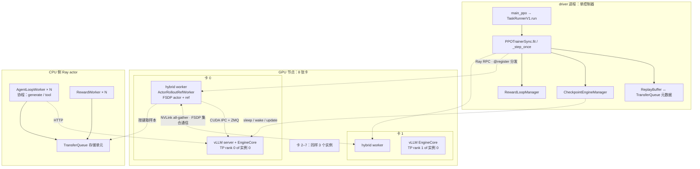

前六篇每讲一个机制都给了 verl 里的落点：一个目录、一个类、一个函数名。这一篇把落点串成线。线的起点是一条命令——`python -m verl.trainer.main_ppo algorithm.adv_estimator=grpo trainer.nnodes=1 trainer.n_gpus_per_node=8 ...`——终点是 8 张卡上各自的进程在做什么、一个训练步的数据怎样在它们之间流动、一个 bf16 参数从优化器更新完成到推理引擎用它生成下一个 token 经过哪些函数。追完这条线，前六篇的"账"与"机制"就都有了代码的锚点；再看 slime 与 AReaL 在同一条线的哪几段做了不同的选择，就能分清哪些是这类系统的必然、哪些是 verl 的取舍。

verl v0.9.0 的代码量不小（`verl/` 下十几万行），这一篇只走一条主路：**v1 trainer + FSDP 后端 + vLLM server 模式 + 共置 `sync`**，然后在每个分叉口指一下另一条路（Megatron、SGLang、`separate_async`）在哪。读法上建议开着源码对照——文中引用的都是 v0.9.0 tag 的路径与函数名，不引行号。

本篇的核心问题：

> **一个 bf16 参数从优化器更新完成，到推理引擎用它生成下一个 token，在 verl 里经过哪些函数、哪些进程、哪条链路？把这条链追清楚，前六篇的机制就全部落到了代码上；再问 slime 和 AReaL 在这条链的哪一段做了不同的选择，就知道哪些是必然、哪些是取舍。**

版本：verl v0.9.0（tag `483b8a0`，2026-08-14）；对照 slime v0.3.0、AReaL 当前主分支与论文。


## 一、总览

### 1. 先说答案：一个参数的旅程

8 卡共置、FSDP、vLLM TP = 2（4 个实例）、`sync` 模式。第 $$t$$ 步的 `update_actor` 结束后，某一层 `q_proj.weight` 的一个 bf16 分片：

```text
 #   在哪个进程                    函数                                                          做什么
 1   hybrid worker（8 个 Ray actor 之一）  TrainingWorker.train_batch → engine.optimizer_step        fp32 主参数更新 → 写回 bf16 分片（FSDP2 的 DTensor，Shard(0)，1/8）
 2   driver（单控制器）             PPOTrainerSync.on_step_end → CheckpointEngineManager.update_weights   backend == "naive" → 直接调 actor_wg.update_weights(mode="naive")
 3   driver → 8 个 hybrid worker    RayWorkerGroup 的 update_weights（@register(ONE_TO_ALL)）       同一调用广播给全组，每个 worker 并行执行 4–9
 4   hybrid worker                 ActorRolloutRefWorker.update_weights                            set_expandable_segments(False); aggressive_empty_cache
 5   hybrid worker → vLLM server    rollout.resume(tags=["weights"]) → vLLMHttpServer.wake_up → engine.wake_up(["weights"])   CuMemAllocator 把权重区域挂回（空的）
 6   hybrid worker                 FSDPEngine.get_per_tensor_param → convert_weight_keys → param.full_tensor()   分片名 → HF 名；8 卡 all-gather 成完整 [h, h] 张量（懒生成器）
 7   hybrid worker                 vLLMRollout.update_weights → BucketedWeightSender.async_send_weights   完整张量拷进 512 MB bucket；满了 → ZMQ 发 IPC handle + meta
 8   vLLM worker（同一张卡的另一进程） vLLMColocateWorkerExtension.update_weights_from_ipc → BucketedWeightReceiver → rebuild_ipc → model.load_weights   打开 handle，按 meta 切出 q_proj，vLLM 的 stacked_params_mapping 把它写进 qkv_proj 的对应列（TP=2 取自己的一半）
 9   hybrid worker → vLLM server    actor.engine.to("cpu") ; rollout.resume(tags=["kv_cache"]) ; server.clear_kv_cache ; set_global_steps(t+1)   训练器参数让出；KV 池挂回；prefix cache 清；版本号推进
10   driver                        下一步 _step_once → replay_buffer.sample → （缓冲空）→ agent loop 提交 prompt
11   AgentLoopWorker（CPU Ray actor） AgentLoopBase.run → LLMServerClient.generate → HTTP → vLLMHttpServer.generate   请求进 vLLM
12   vLLM EngineCore                scheduler → model_runner.execute_model → CUDA graph（地址没变，不重捕获）   decode 一步，qkv_proj 的 GEMM 用的就是 #8 写进去的字节 → 一个 token
```

十二步、四类进程（driver、hybrid worker、vLLM server / EngineCore、AgentLoopWorker）、三条链路（Ray RPC、NVLink all-gather、CUDA IPC + ZMQ）。分离形态下第 2 步走 `nccl` / `nixl` / `delta_sharded` 后端，第 6–8 步换成 checkpoint engine 的 `send_weights` / `receive_weights`（第四篇），其余不变。

### 2. 进程地图



### 3. 本文的章节安排

| 章 | 内容 | 对应前文 |
|---|---|---|
| 二 | 入口：配置到 trainer | 第二篇的编程模型 |
| 三 | 单控制器：`RayWorkerGroup` 与 `@register` | 第二篇 |
| 四 | 资源池与共置：worker 怎样落到卡上 | 第二、三篇 |
| 五 | hybrid worker：`ActorRolloutRefWorker` 与 model engine | 第三篇 |
| 六 | rollout server：实例、负载均衡、sleep / wake | 第三、六篇 |
| 七 | 一步的数据流：`_step_once` 的九个阶段 | 第一篇 |
| 八 | 权重同步：checkpoint engine 的三条路 | 第四篇 |
| 九 | 样本通路与异步：TransferQueue、replay buffer、agent loop | 第五、六篇 |
| 十 | 对照：slime 与 AReaL 在哪里分道 | — |
| 十一 | 小结 | — |


## 二、入口：从配置到 trainer

### 1. 一条命令

`examples/grpo_trainer/run_qwen3_4b_fsdp.sh` 是最短的完整例子，去掉环境变量后的骨架：

```bash
python3 -m verl.trainer.main_ppo \
    algorithm.adv_estimator=grpo \
    data.train_batch_size=512  data.max_response_length=1024 \
    actor_rollout_ref.model.path=Qwen/Qwen3-4B \
    actor_rollout_ref.actor.ppo_mini_batch_size=256  actor_rollout_ref.actor.optim.lr=1e-6 \
    actor_rollout_ref.actor.use_dynamic_bsz=True  actor_rollout_ref.actor.ppo_max_token_len_per_gpu=3000 \
    actor_rollout_ref.actor.fsdp_config.param_offload=False  actor_rollout_ref.actor.fsdp_config.optimizer_offload=False \
    actor_rollout_ref.rollout.name=vllm  actor_rollout_ref.rollout.tensor_model_parallel_size=2 \
    actor_rollout_ref.rollout.gpu_memory_utilization=0.6  actor_rollout_ref.rollout.n=5 \
    actor_rollout_ref.rollout.checkpoint_engine.update_weights_bucket_megabytes=4096 \
    actor_rollout_ref.ref.fsdp_config.param_offload=True \
    trainer.nnodes=1  trainer.n_gpus_per_node=8
```

配置是 Hydra：`verl/trainer/config/ppo_trainer.yaml` 是根，通过 `defaults` 组合 `actor/`、`rollout/`、`engine/`、`algorithm/` 等子配置；命令行覆盖任意叶子。三个与系统形态直接相关的默认值：`trainer.use_v1: true`（v1 trainer）、`trainer.v1.trainer_mode: sync`、`actor_rollout_ref.hybrid_engine: true`（共置）。`rollout.mode` 在 0.9 里只有 server 模式——SPMD 的 rollout 已退役（PR #4411；`vllm_rollout.py` 的 `generate_sequences` 直接 `raise NotImplementedError`）。

### 2. `main_ppo`

```text
main_ppo.main(config)
  └─ run_ppo(config, TaskRunnerV1)        # Ray init；把 TaskRunner 作为一个 Ray actor 起在 driver 侧（占 1 CPU）
       └─ TaskRunnerV1.run(config)
            ├─ tq.init(config.transfer_queue)          # TransferQueue：元数据服务 + 存储单元（Ray actor）
            ├─ trainer_cls = get_trainer_cls(config.trainer.v1.trainer_mode)   # "sync" → PPOTrainerSync
            ├─ trainer = trainer_cls(config); trainer.init()                    # _setup：资源池、worker 组、rollout 实例、checkpoint manager
            ├─ init_agent_loop_manager()               # AgentLoopManagerTQ.create(llm_client=trainer.get_llm_client(), ...)
            └─ trainer.fit(agent_loop_manager)         # 训练循环
```

`get_trainer_cls` 查的是 `@register_trainer("sync")` 注册表——`trainer_sync.py` / `trainer_colocate_async.py` / `trainer_separate_async.py` 三个文件各注册一个（第二篇第八章）。`TaskRunner` 自己也是 Ray actor，是为了让 driver 逻辑不占用启动命令所在的机器。

### 3. `PPOTrainer.__init__` 与 `init()`

`trainer_base.py` 的 `PPOTrainer` 是 ABC，三个子类只覆盖钩子。构造时决定几个布尔量：`use_reference_policy`（有 KL 就要 ref）、`use_critic`（GRPO 为 False）、`use_teacher_policy`（蒸馏）；`_build_replay_buffer()` 按模式选 `ReplayBuffer`（sync）或 `ReplayBufferAsync`。`init()` → `_setup()` 是全部基础设施的构造点，第三、四、六章逐段读它。


## 三、单控制器：`RayWorkerGroup` 与 `@register`

### 1. 三个类

`verl/single_controller/` 只有几个文件，是 HybridFlow 编程模型的全部实现：

```text
base/worker.py          Worker：每个 GPU 进程里的基类；知道自己的 rank / world_size / master addr；提供 get_availale_master_addr_port 等
base/worker_group.py    WorkerGroup：一组 worker 的句柄；_bind_worker_method 把 worker 类上带 @register 的方法绑成组方法
base/decorator.py       @register(dispatch_mode, execute_mode, blocking)；Dispatch / Execute 枚举与各 dispatch_fn / collect_fn
ray/base.py             RayResourcePool（placement group）· RayClassWithInitArgs · RayWorkerGroup（用 Ray actor 实现 WorkerGroup）· create_colocated_worker_cls
```

### 2. `@register` 做什么

worker 类的方法加装饰器：

```python
class ActorRolloutRefWorker(Worker):
    @register(dispatch_mode=Dispatch.ONE_TO_ALL)
    def init_model(self): ...

    @register(dispatch_mode=make_nd_compute_dataproto_dispatch_fn(mesh_name="train"), blocking=False)
    def update_actor(self, data: TensorDict) -> TensorDict: ...

    @register(dispatch_mode=make_nd_compute_dataproto_dispatch_fn(mesh_name="ref"))
    def compute_ref_log_prob(self, data: TensorDict) -> TensorDict: ...
```

装饰器只在方法上挂一个属性 `{dispatch_mode, execute_mode, blocking}`。`RayWorkerGroup` 构造时 `_bind_worker_method` 扫描 worker 类的所有方法，对带这个属性的每一个，在**组对象上生成同名方法**：

```text
组方法 update_actor(data):
   1. dispatch_fn(worker_group, data)   → 把 data 按 DP 切成 world_size 份（nd_compute：按 "train" mesh 的 dp 维切，TP/PP 内的 rank 拿同一份）
   2. execute_fn                        → 对每个 worker 调 worker.update_actor.remote(chunk_i)（execute_all）
   3. collect_fn(worker_group, outputs) → 收回各 rank 的输出，按 mesh 拼回（只从每个 dp 组的一个 rank 收）
   blocking=False → 返回 futures，调用方用 ray.get 或直接传给下一个组方法（_materialize_futures 自动等待）
```

`Dispatch.ONE_TO_ALL`：同一参数发给全组，收回列表（`init_model`、`update_weights`、`to(device)`）；`DP_COMPUTE_PROTO`：按 DP 切 `DataProto`；`make_nd_compute_dataproto_dispatch_fn(mesh_name)`：按 worker 上注册的 device mesh（"train" 是 actor 的 FSDP mesh、"ref" 是 ref 的）切，让 TP × PP × DP 的任意并行都能正确分发——这是 0.9 里 Megatron 与 FSDP 共用同一套分发的关键。**控制器代码里一行 `self.actor_rollout_wg.update_actor(batch)`，底下就是"切、发、收"三步**，算法作者不碰 rank。

### 3. 代价与绕开它的地方

分发的代价是数据经 driver：`DataProto` 的切分与拼接在 driver 内存里做，一步几百 MB 到几 GB。v1 用 TransferQueue 绕开——组方法收发的是 `KVBatchMeta`（键 + 标签），worker 自己按键从存储单元取张量（第九章）。第二个绕开的地方是 rollout：生成不是组方法调用，是 agent loop 对 HTTP 服务的请求（第六章）。


## 四、资源池与共置：worker 怎样落到卡上

### 1. `ResourcePoolManager`

`_init_resource_pool_mgr()`（`trainer_base.py`）：

```python
role = Role.ActorRolloutRef if need_reference_policy(config) and not ref_in_actor else Role.ActorRollout
self.role_worker_mapping[role] = ray.remote(ActorRolloutRefWorker)
self.mapping[role] = "global_pool"
if need_critic(config):
    self.role_worker_mapping[Role.Critic] = ray.remote(TrainingWorker); self.mapping[Role.Critic] = "global_pool"
resource_pool_spec = {"global_pool": [config.trainer.n_gpus_per_node] * config.trainer.nnodes}
if config.reward.reward_model.enable_resource_pool:
    resource_pool_spec["reward_pool"] = [rm.n_gpus_per_node] * rm.nnodes; self.mapping[Role.RewardModel] = "reward_pool"
self.resource_pool_manager = ResourcePoolManager(resource_pool_spec, mapping)
```

`Role` 枚举（`trainer/ppo/utils.py`）：`Actor / Rollout / ActorRollout / Critic / RefPolicy / RewardModel / ActorRolloutRef / Env / TeacherModel`。默认全部角色映射到 `global_pool`——**共置就是"所有角色一个池"**；生成式 RM 开 `enable_resource_pool` 就多一个 `reward_pool`；`separate_async` 的 standalone rollout 不走这张表，由 `LLMServerManager.create(start_rank=...)` 另起（第六章）。

### 2. placement group

`RayResourcePool.get_placement_groups(strategy="STRICT_PACK")`：一个节点一个 placement group，bundle 数 = 该节点的 GPU 数，每个 bundle `{"GPU": 1, "CPU": 1}`；STRICT_PACK 保证一个 pg 的 bundle 都在同一台机器。`RayWorkerGroup._init_with_resource_pool` 对每个 pg 的每个 bundle 起一个 Ray actor（`_create_worker`），环境变量里塞 `RANK / WORLD_SIZE / MASTER_ADDR / MASTER_PORT`（rank 0 的 actor 先起、拿到空闲端口、其余按它的地址初始化进程组）。**一个 worker = 一张卡 = 一个进程**，进程组由 worker 内的 FSDP / Megatron 自己 `init_process_group`。

### 3. `create_colocated_worker_cls`

同一个池里有多个角色（actor_rollout_ref + critic）时，不起两组进程——`_setup()` 里：

```python
for resource_pool, class_dict in self.resource_pool_to_cls.items():
    worker_dict_cls = create_colocated_worker_cls(class_dict=class_dict)   # 把几个 worker 类合成一个 WorkerDict
    wg_dict = RayWorkerGroup(resource_pool=resource_pool, ray_cls_with_init=worker_dict_cls)
    spawn_wg = wg_dict.spawn(prefix_set=class_dict.keys())                # 按前缀拆回几个"虚拟"组
```

`WorkerDict` 在一个进程里持有 `{"actor_rollout_ref": ActorRolloutRefWorker(...), "critic": TrainingWorker(...)}`，方法名加前缀（`actor_rollout_ref_update_actor`）；`spawn` 生成的每个虚拟组把前缀去掉、重新绑定，控制器看到的仍是 `self.actor_rollout_wg.update_actor(...)` 与 `self.critic_wg.update_critic(...)`——**同一批进程、两个句柄**。这就是"共置"在代码里的形状：不是两个进程共享一张卡，是一个进程里两个对象轮流用显存。PPO 的 critic 与 actor 在同一进程里，第一篇算的"两套 16N"就在同一个 CUDA context 里。


## 五、hybrid worker：`ActorRolloutRefWorker` 与 model engine

### 1. 三层

```text
ActorRolloutRefWorker（verl/workers/engine_workers.py）        —— 角色层：知道 actor / ref / rollout 三者的关系与顺序
  ├── self.actor: TrainingWorker                                 —— 训练 worker 层：train_batch / infer_batch / to(device) / checkpoint；不知道 RL
  │     └── self.engine: BaseEngine（FSDPEngine | MegatronEngine | VeOmniEngine | TorchTitanEngine | AutoModelEngine）
  │                                                              —— 引擎层：build model / optimizer；forward_backward_step；get_per_tensor_param；offload
  ├── self.ref: TrainingWorker（同一引擎类，无优化器；LoRA 时 ref 复用 actor 的 base）
  ├── self.rollout: vLLMRollout | SGLangRollout | TRTLLMRollout    —— 推理引擎的**句柄**（server 模式：指向另一个进程的 server）
  └── self.checkpoint_engine: 按 config.rollout.checkpoint_engine.backend 建（共置下强制 naive）
```

`TrainingWorker` 是通用的：critic 用它、蒸馏的 teacher 用它、SFT 也用它。它把一次 `train_batch(data)` 展开为：按 `ppo_micro_batch_size` 或动态 token 数（`use_dynamic_bsz` + `ppo_max_token_len_per_gpu`）切 micro-batch → 每个 micro-batch `engine.forward_backward_step`（loss_fn 由 `set_loss_fn` 注入——PPO 的 policy loss 在 `trainer/ppo/core_algos.py`，trainer 在 `_setup` 里注入）→ 梯度累积 → `engine.optimizer_step`。RL 特有的东西（哪些位置算 loss、优势怎么用）全在 loss_fn 里，worker 不知道。

### 2. `init_model`

`ActorRolloutRefWorker.init_model()`（`@register(ONE_TO_ALL)`，每个 worker 并行执行）：先建 ref（若有，配置从 actor 派生、MTP 强制关）、再建 actor（`TrainingWorker(config)` → `engine.initialize()` 建 FSDP 模型与优化器）、最后建 rollout 句柄——**server 模式下这里不启动 vLLM**，只是 `vLLMRollout` 对象记下 `replica_rank / rollout_rank`，真正的 server 由 `LLMServerManager` 在 `_setup` 的后半段起（第六章），起好后 `_ensure_server_handle()` 按名字（`vllm_<replica>` 前缀）找到它。

### 3. 三个 `@register` 方法与前六篇的对应

```text
方法                              分发                         做什么                                    对应
compute_log_prob(data)            nd_compute("train")          actor.infer_batch → 旧策略 log π          第一篇：重算 2N；第五篇：bypass 时跳过
compute_ref_log_prob(data)        nd_compute("ref")            ref.to(cuda) → infer → ref.to(cpu)（若 offload）   第三篇：ref 的 8 GB 往返
update_actor(data)                nd_compute("train"), non-blocking   actor.to(cuda, optimizer=True) → train_batch → to(cpu)   第一篇：6N；第三篇：优化器状态往返
update_weights(global_steps, mode) ONE_TO_ALL（async）           第一章表的 #4–#9                          第三、四篇
save_model_to_cpu / restore_model_from_cpu（DetachActorWorker）  ONE_TO_ALL   decoupled PPO 的 π_prox 快照             第五篇
execute_checkpoint_engine(method)  DP_COMPUTE                   转发给 checkpoint engine（prepare / init_process_group / finalize）   第四篇
```

### 4. 引擎的边界

`verl/workers/engine/base.py` 的 `BaseEngine` 是训练后端的接口：`initialize / forward_backward_step / optimizer_step / to / get_per_tensor_param / save_checkpoint / load_checkpoint`。FSDP 与 Megatron 的实现各在自己目录（`engine/fsdp/transformer_impl.py`、`engine/megatron/transformer_impl.py`）。**本系列把训练器当黑盒**的边界就在这里：RL 侧只调这几个方法。换 Megatron 只是 `actor.strategy=megatron` 加 `megatron_config`，worker 与 trainer 不变；`get_per_tensor_param` 里 Megatron-Bridge 的映射（第四篇）藏在 `MegatronEngine` 内。


## 六、rollout server：实例、负载均衡、sleep / wake

### 1. `RolloutReplica` 与 `LLMServerManager`

`_setup` 的后半段：

```python
self.llm_server_manager = LLMServerManager.create(config, worker_group=self.actor_rollout_wg, rollout_resource_pool=...)
checkpoint_engine_config.backend = "naive"                         # 共置：强制进程内
self.checkpoint_manager = CheckpointEngineManager(config=..., actor_wg=self.actor_rollout_wg, replicas=self.llm_server_manager.get_replicas())
```

`LLMServerManager`（`workers/rollout/llm_server.py`）负责三件事：起 replica、起全局负载均衡器、弹性增删 replica。一个 **replica** = 一个推理实例（`workers/rollout/replica.py` 的 `RolloutReplica`），等价于一条 `vllm serve --data-parallel-size ... --tensor-parallel-size 2` 命令；8 卡 TP = 2 就是 4 个 replica。三种初始化：

```text
init_hybrid(worker_group)          共置：replica 的 workers 就是 hybrid worker 组里对应的那 tp 个 actor（同一进程）；launch_servers 在它们旁边起 vLLM server 进程
init_colocated(resource_pool)      同池但独立进程（rollout 与训练进程分开、共享 GPU）—— 过渡形态
init_standalone()                  分离：独立资源池，自己的 placement group；separate_async 用 LLMServerManager.create(start_rank=hybrid_num_replicas) 再起一组
```

`vLLMReplica.launch_servers()` 起的是 `vLLMHttpServer`（`vllm_rollout/vllm_async_server.py`）——一个 Ray actor，内部用 vLLM 的 `AsyncLLM` 引擎（EngineCore 是它的子进程，TP worker 各一个进程）。共置下 vLLM worker 进程与 hybrid worker 进程在同一张卡上：前者的 `vLLMColocateWorkerExtension`（`vllm_rollout/utils.py`，通过 vLLM 的 `worker_extension_cls` 注入）暴露 `update_weights_from_ipc`，后者通过 ZMQ 找到它——第一章表的 #7–#8。

### 2. 负载均衡与客户端

`LLMServerManager.get_client(client_cls)` 返回 `LLMServerClient`（sync）或 `FullyAsyncLLMServerClient`（async，带 abort 后的重试）。客户端持有所有 server 的地址与 handle；`generate(request_id, prompt_ids, sampling_params)` 第一轮选在飞请求最少的 server，同一 `request_id` 之后的轮次粘到同一个 server（第六篇的粘性路由）。`separate_async` 里还有一个 **global load balancer**（Ray actor），standalone 与 hybrid 两组 replica 都注册进它，`add_servers / remove_servers` 就是训练池兼职 rollout 时的开关（第二篇）。

### 3. sleep / wake 的调用链

```text
PPOTrainerSync.on_sample_end → CheckpointEngineManager.sleep_replicas()
  → 每个 replica.sleep() → server_handle.sleep.remote() → vLLMHttpServer.sleep()
      → rollout_mode == HYBRID → _sleep_hybrid() → engine.sleep(level=2)（LoRA / MTP / NPU 时 level=1）→ engine.reset_encoder_cache()
          → EngineCore.sleep → pause_scheduler(mode="abort", clear_cache=True) → Worker.sleep(level) → CuMemAllocator.sleep(offload_tags)

PPOTrainerSync.on_step_end → CheckpointEngineManager.update_weights(global_steps)
  → backend == "naive" → actor_wg.update_weights(global_steps, mode="naive")（ONE_TO_ALL，8 个 worker 并行）
      → ActorRolloutRefWorker.update_weights → 第一章表 #4–#9
          其中 rollout.resume(tags) → server_handle.wake_up.remote(tags) → engine.wake_up(tags) → Worker.wake_up → CuMemAllocator.wake_up(tags) → reset_prefix_cache
```

第三篇讲的每个动作都在这条链上：`_sleep_hybrid` 选 level、`_get_wake_up_tags` 默认 `["kv_cache", "weights"]` 但 `update_weights` 里分两次各传一个、`clear_kv_cache` 顺带清 mm / encoder cache。


## 七、一步的数据流：`_step_once` 的九个阶段

### 1. 控制流

`PPOTrainer.fit()` 的循环体调 `self.step()`，后者按 `parameter_sync_step`（sync 模式为 1）调 `_step_once()`：

```python
def _step_once(self, metrics, timing_raw, sample_batch_size):
    with marked_timer("gen", ...):                                   # 1. 从缓冲取样（sync：等到 B 个组终态；缓冲空时先 _add_batch_to_generate）
        self.on_sample_begin()
        batch, off_policy_metrics = self.replay_buffer.sample(global_steps, "train", sample_batch_size)
        self.on_sample_end()                                         #    sync：sleep_replicas —— 推理引擎让出显存
    if self.reward_loop_manager.reward_loop_worker_handles is None:  # 2. [可选] 共置的 RM 打分
        with marked_timer("reward", ...): batch = self._compute_reward_colocate(batch)
    batch = self._balance_batch(batch)                               # 3. 按序列长度在 DP rank 间均衡
    with marked_timer("old_log_prob", ...): batch = self._compute_old_log_prob(batch)   # 4. 重算 log π_old（或 bypass 直接拷 rollout 的）
    if self.use_reference_policy:
        with marked_timer("ref", ...): batch = self._compute_ref_log_prob(batch)       # 5. ref 前向
    if self.use_critic:
        with marked_timer("values", ...): batch = self._compute_values(batch)           # 6. [PPO] 价值前向
    with marked_timer("adv", ...): batch = self._compute_advantage(batch)              # 7. 优势（GRPO 组内归一化；driver 上算，只碰标量列）
    if self.use_critic:
        with marked_timer("update_critic", ...): batch = self._update_critic(batch)     # 8. [PPO]
    if self.config.trainer.critic_warmup <= self.global_steps:
        with marked_timer("update_actor", ...): batch = self._update_actor(batch)       # 9. 策略更新
    return batch
```

然后 `fit()` 里：`_save_checkpoint`（按 `save_freq`）→ `on_step_end()`（sync：`update_weights`）→ `_validate`（按 `test_freq`）→ `_compute_metrics` → `tq.kv_clear(batch.keys)` 清掉这一步的样本。`marked_timer` 的名字就是日志里的 `timing_s/gen`、`timing_s/old_log_prob`、`timing_s/update_actor`、`timing_s/update_weights`——第一篇算的三段时间在这里各有一个计时器；`perf/throughput` 是 token 数 / (步时间 × GPU 数)。

### 2. `_compute_old_log_prob` 与 `_update_actor`

两者都是"组方法 + 后处理"：

```text
_compute_old_log_prob(batch)
  → self.actor_rollout_wg.compute_log_prob(batch)        # nd_compute("train") 分发；worker 从 TQ 取张量、infer_batch、写回 log_probs 列
  → 若 rollout_log_probs 在：算 rollout_probs_diff 指标   # 第五篇的训推不一致基线
_update_actor(batch)
  → self.actor_rollout_wg.update_actor(batch)            # non-blocking；worker：to(cuda) → train_batch（micro-batch 循环、loss_fn = ppo policy loss）→ to(cpu)
  → 收回 actor/* 指标（pg_loss、clip 比例、grad_norm、entropy）
```

worker 侧的 `train_batch` 在 `TrainingWorker` 里；loss 函数 `verl/trainer/ppo/core_algos.py` 的 `compute_policy_loss_*`（按 `actor.policy_loss.loss_mode` 选 vanilla / GSPO / clip-cov / …）加 `rollout_correction` 的 IS 权重与 mask（第五篇）。**RL 算法的全部代码在 `core_algos.py` 一个文件里**，系统代码不碰它。

### 3. 数据在哪

v1 里 `batch` 是 `KVBatchMeta`：`partition_id`（"train" / "val"）、`keys`（`{uid}_{session}_{index}` 列表）、`tags`（每条的元数据）。张量在 TransferQueue 的存储单元里；worker 收到 `KVBatchMeta` 后按键 `tq.kv_batch_get(...)` 取自己那份、算完 `kv_batch_put` 新列（`log_probs`、`ref_log_prob`、`advantages`）。driver 上只有 `_compute_advantage` 会真的取张量（reward 与 mask 这几列，小），算 GRPO 的组内归一化后写回。第二篇说的"控制器只拿元数据"就是这个。


## 八、权重同步：checkpoint engine 的三条路

### 1. 选路

`CheckpointEngineManager`（`verl/checkpoint_engine/base.py`）在构造时按 `config.rollout.checkpoint_engine.backend` 选引擎类（`CheckpointEngineRegistry`），`update_weights()` 分两条：

```text
backend == "naive"（共置 sync / colocate_async）
  → actor_wg.update_weights(mode="naive")：第一章表 #4–#9，进程内 IPC；manager 不做别的
其他（nccl / nixl / mooncake / kimi / hccl / delta_sharded；分离）
  1 abort_replicas()                       中断在飞请求（部分 rollout）
  2 临时组一个 RayWorkerGroup 包住所有 replica 的 workers
  3 release_kv_cache_replicas()            （vLLM 侧目前是 no-op，TODO）
  4 build_process_group(rollout)           actor_wg.execute_checkpoint_engine("prepare") 拿 master 元数据 → 两侧 init_process_group
  5 ray.get(actor_wg.update_weights(mode=backend) + rollout.update_weights())   训练侧 send_weights ∥ 推理侧 receive_weights
  6 execute_checkpoint_engine("finalize")  两侧销毁临时进程组
  7 resume_kv_cache_replicas(); resume_generation_replicas()   恢复 KV、续接请求
```

第 5 步训练侧走 `ActorRolloutRefWorker.update_weights(mode != "naive")` 的分支：`delta_sharded` 把整个 `actor.engine` 交给引擎（它自己驱动 seed / steady 状态机与快照）；其他后端先 `get_per_tensor_param()` 拿生成器再 `checkpoint_engine.send_weights(generator)`。推理侧 `CheckpointEngineWorker.update_weights()` 在每个 rollout worker 上跑：`receive_weights()` 产出张量流 → `rollout.update_weights(流)` → IPC 进 vLLM——**最后一跳仍是第一章的 #7–#8**。

### 2. 三个引擎的形状

```text
NCCLCheckpointEngine（nccl_checkpoint_engine.py）
  prepare()：rank 0 起 ZMQ pub 服务发元数据；build_topology：world = 1 + 推理总卡数；init_process_group：临时 NCCL 组
  send_weights：split_weight_chunks 切大张量 → 双缓冲 bucket → BroadcastOperation（异步线程里 broadcast）→ 换缓冲
  receive_weights：_receive_weight_chunks 收 bucket + 元数据 → merge_weight_chunks 拼回 → yield (name, tensor)
NIXLCheckpointEngine / MooncakeCheckpointEngine
  同样的 send / receive 接口；传输换成注册显存 + RDMA 单边写；拓扑是环，成员表可动态改
DeltaCheckpointEngine（delta_checkpoint_engine.py + delta_sync/）
  send_weights(engine)：首次 seed 走 engine.get_per_tensor_param 的全量；之后 engine.get_per_tensor_param_delta_shard → 稀疏 gather → bucket → 广播
  receive：稀疏负载 → SGLang custom_weight_loader（delta_loader.apply_delta）原地覆盖
```

第四篇的每个概念都在这三个类里：bucket（`bucket_size`）、双缓冲（`send_buf / recv_buf`）、元数据与字节分离（ZMQ + NCCL）、`TensorMeta.chunk_offset`（大张量切块）、`magic_recv` 缓冲。

### 3. 版本号

`update_weights(global_steps)` 一路把 `global_steps` 带到最后：`vLLMRollout.update_weights` 末尾 `server_handle.set_global_steps.remote(global_steps)`，server 记下；agent loop 从 server 的响应里拿到版本、写进 `AgentLoopOutput` 的元数据 → TransferQueue 的 tag → `ReplayBuffer` 算 staleness（第五篇）。


## 九、样本通路与异步

### 1. TransferQueue

v1 的样本存储（外部包 `transfer_queue`，Ascend 开源）：一个**元数据服务**（键 → 标签、状态）加若干**存储单元**（键 → 张量字典），都是 Ray actor。`tq.init(config.transfer_queue)` 起它们；`AgentLoopManagerTQ` 把每条轨迹 `kv_put`；`ReplayBuffer` 只查元数据服务选键；worker 按键 `kv_batch_get`；步末 `kv_clear`。它替代了 v0 里"DataProto 在 driver 与 worker 之间来回"的路径，是 v1 能把 sync 与 async 统一的前提——**异步的本质是样本的生产与消费解耦，解耦点就是这个 KV 存储**。

### 2. `ReplayBuffer` 的取样

`replay_buffer.py`（第五篇讲过语义，这里看形状）：

```text
ReplayBuffer.sample(global_steps, partition_id, batch_size)
  循环：
    _sync_metadata_from_transfer_queue()      拉最新的键与标签
    终态组 = status ∈ {finished, failure} 的 prompt uid
    _evict_terminal_groups()                  按矩阵淘汰：DAPO（reward 全同）· failure（可选）· [async] stale（跨版本 > 阈值）；淘汰的调 refill_fn 补发
    _sampleable_terminal_keys()               够 batch_size 个组 → _select_prompt_uids → _materialize_batch → 返回 KVBatchMeta + off_policy 指标
    不够 → _wait_for_next_poll（2 s）
ReplayBufferAsync 覆盖：_stale_terminal_keys（drop）· _has_enough_samples（wait 策略：有在飞组到阈值就阻塞）
```

`refill_fn` 是 trainer 注入的 `_add_prompts_to_generate(n)`：从流式 dataloader（`data.gen_batch_size` 一批）取 prompt → `agent_loop_manager.submit(...)`。sync 模式下 `_add_batch_to_generate()` 在 `step()` 开头投一整批（`train_batch_size` 个 prompt），然后 `sample` 等它们全部终态；async 模式下 `on_train_begin` 先投 `num_warmup_batches` 批，之后靠淘汰触发补发——**同一份 `sample()`，两种节律**。

### 3. agent loop 在 v1 里

`trainer/ppo/v1/agent_loop_tq.py` 的 `AgentLoopManagerTQ`：`create(config, llm_client, teacher_client, reward_loop_worker_handles)` 起 `AgentLoopWorker`（CPU Ray actor，数量 `rollout.agent.num_workers`）；`submit(batch)` 把 prompt 按 uid 分给 worker；worker 为每个 prompt 的每条 session 起协程跑用户的 `AgentLoopBase.run()`（`verl/experimental/agent_loop/`：`single_turn_agent_loop.py` 是单轮、`tool_agent_loop.py` 是多轮工具调用）；协程结束 → reward（`reward_loop_worker_handles` 非空时异步发给 RewardWorker，否则留给 trainer 的 `_compute_reward_colocate`）→ `kv_put` 进 TransferQueue、tag 置 `finished`。**生成侧不知道 trainer 在等什么**，它只往存储里放；trainer 也不知道生成侧在跑什么，它只从存储里取。

### 4. 异步 checkpoint 恢复

`_save_checkpoint` 存训练状态（引擎的 `save_checkpoint`）、dataloader 位置、`global_steps`；异步模式下 TransferQueue 里已完成但未训练的样本与在飞的 prompt 不进 checkpoint。`_load_checkpoint` 后 `fit()` 开头调 `_reissue_inflight_prompts()`：把上次 pending / running 状态的 prompt 重新提交（用恢复后的权重重新生成），已 finished 的保留——第八篇 RL 状态 checkpoint 的具体形状。


## 十、对照：slime 与 AReaL 在哪里分道

上面这条线在三个框架里都存在——都要起训练器与推理引擎、都要同步权重、都要有一个样本通路。分歧在几段。

### 1. slime：不做抽象

slime v0.3.0（智谱，GLM 系列的 RL 框架）的 `train.py` 不到 200 行，主循环直白到可以整段读：

```python
pgs = create_placement_groups(args)                                   # rollout 与 actor 的 placement group（可共置可分离）
rollout_manager, num_rollout_per_epoch = create_rollout_manager(args, pgs["rollout"])   # SGLang 引擎 + router
actor_model, critic_model = create_training_models(args, pgs, rollout_manager)          # Megatron
actor_model.update_weights()                                          # 首次同步
for rollout_id in range(args.start_rollout_id, args.num_rollout):
    rollout_data_ref = ray.get(rollout_manager.generate.remote(rollout_id))   # 生成（Data Buffer 里的 rollout 函数）
    if args.offload_rollout: ray.get(rollout_manager.offload.remote())        # SGLang release_memory_occupation
    actor_model.train(rollout_id, rollout_data_ref)                           # Megatron 训练（含 offload_train）
    if args.offload_rollout: ray.get(rollout_manager.onload_weights.remote())  # resume_memory_occupation(["weights"])
    actor_model.update_weights()                                              # update_weights_from_tensor / from_distributed
    if args.offload_rollout: ray.get(rollout_manager.onload_kv.remote())
```

与 verl 的分歧：

```text
                     verl                                              slime
训练后端             FSDP / Megatron / VeOmni / TorchTitan，BaseEngine 抽象     只有 Megatron；Megatron 参数原样透传（--tensor-model-parallel-size 就是 Megatron 的）
推理后端             vLLM / SGLang / TRT-LLM，RolloutReplica + AsyncServerBase 抽象   只有 SGLang；所有 SGLang 参数加 --sglang- 前缀透传（--sglang-mem-fraction-static）
控制器               单控制器 + @register 分发；v1 用 TransferQueue              driver 顺序调几个 Ray actor 的方法；Data Buffer 是一个 Ray actor
权重同步             checkpoint engine 六个后端                                  共置：SGLang update_weights_from_tensor（CUDA IPC）；分离：update_weights_from_distributed（NCCL 广播）；磁盘
异步                 v1 三种 trainer 模式；replay buffer 的淘汰矩阵               train_async.py：一步流水；fully_async_rollout：流式；staleness 控制在 rollout 函数里
agent                AgentLoopBase + tool schema + uni-agent 网关               自定义 generate 函数（--rollout-function-path），agent 逻辑就是一个 Python 函数
模型接入             每个模型家族一张 Megatron-Bridge 映射表 + 引擎适配             同样用 Megatron-Bridge（加一层自己的 patch），只需这一层
```

slime 的赌注是：**"少一层抽象"在这类系统里是优点**——Megatron 与 SGLang 各自的新特性（新的并行、新的 kernel、新的量化）不需要 slime 改一行就能用（参数透传），排障时调用栈短、每一步都能对到两个上游的文档。代价是绑定：换 FSDP 或 vLLM 要重写；异步的形态由用户的 rollout 函数决定，框架不提供 staleness 的统一控制；多后端组合（FSDP 训练 + SGLang 推理）不存在。对一个只用 Megatron + SGLang、模型是自家的团队，这个赌注是合理的；verl 的抽象层服务的是"任意组合"的需求，代价是每层抽象都要跟着上游演进（0.9 的 breaking changes 里一半是这类）。

### 2. AReaL：异步是主线

AReaL（蚂蚁，论文 Fu 等 2025）的分歧不在抽象多少，在**哪个形态是默认**：

```text
                     verl                                              AReaL
默认形态             sync（共置同步）；异步是 trainer_mode 的两个选项          异步分离；max_head_offpolicyness=0 时退化为同步（文档说"用于调试，通常慢 2 倍"）
staleness 控制点     消费端：replay buffer 取样时 drop / wait                  准入端：rollout controller 在请求开始时按版本落后量放行 / 阻塞
生成                 agent loop 协程 → LLM server；abort / resume 是 checkpoint manager 的动作   RolloutWorkflow.arun_episode 协程 → InferenceEngine.agenerate；interruptible generation 是引擎的一等能力
权重同步             checkpoint engine，update_weights 是 trainer 钩子           WeightUpdateMeta（nccl 或 disk），训练引擎每步 update_weights_to(...)，推理引擎按版本接收；版本对齐是 API 的一部分
算法                 PPO/GRPO 变体 + rollout_correction（IS / RS）opt-in       decoupled PPO 默认（use_decoupled_loss + recompute_logprobs），三份 logprob
训练后端             多后端                                                    FSDP2 / Megatron / Archon（自研 MoE 引擎）
```

AReaL 的论点是：一旦接受异步，**系统与算法必须一起设计**——interruptible generation 决定了一条序列由几个版本生成、于是 π_behave 是分段的、于是 loss 必须把 behave 与 prox 分开、于是训练引擎必须每步能算 π_prox；准入控制让缓冲里的 staleness 有上界而不是事后淘汰、于是没有长度偏置、于是不需要 wait 策略。这条推理链在 verl 里也走得通（`separate_async` + `bypass_mode=false` + `wait` 近似它），但要用户自己把选项配对；AReaL 把它做成默认，同步反而是特例。代价是 AReaL 在共置、同步、严格 on-policy 的场景上没有 verl 顺手，用户群也小得多。

### 3. OpenRLHF 的位置

OpenRLHF（2023–2024）是最早把 Ray + vLLM 用于 RLHF 的开源实现：actor / critic / ref / RM 各一组 Ray actor，vLLM 引擎独立、用 NCCL 广播同步权重——verl 的角色划分、"vLLM 作为独立引擎 + 广播权重"的路径都能在它身上找到原型。它没有走到的是单控制器的分发抽象、共置的显存切换、异步的样本通路；2025 年后活跃度下降，v0.11 仍在维护但已不是新任务的默认选择。

### 4. 哪些是必然、哪些是取舍

把三个框架放在一起，这条链上**三家都有、写法趋同**的段落是这类系统的必然：

- 推理引擎以服务形态存在、通过 sleep / release 让渡显存、通过 IPC / NCCL / RDMA 接收权重、按版本号标记样本；
- 训练器导出 HF 命名的张量流（verl 与 slime 都经 Megatron-Bridge，AReaL 有自己的转换层）；
- 样本经一个缓冲 / 队列解耦生产与消费，GRPO 以组为单位；
- agent 逻辑是用户的一个函数 / 协程，框架只要一条轨迹。

**三家不同**的段落是取舍：抽象层的厚度（verl 厚、slime 薄）、默认形态（verl 同步、AReaL 异步）、staleness 控制点（消费端 vs 准入端）、算法修正是否默认（opt-in vs 内建）、后端组合的自由度（任意 vs 绑定）。选框架就是选这几个取舍，而不是选"哪个更快"——三家在各自的默认场景上都报告了接近的吞吐。


## 十一、本文小结

### 1. 要点回顾

- 一个参数从优化器到下一个 token 的十二步：`train_batch` 更新分片 → `on_step_end` → `CheckpointEngineManager.update_weights`（naive）→ `ActorRolloutRefWorker.update_weights` → `wake_up(["weights"])` → `get_per_tensor_param`（all-gather）→ `BucketedWeightSender`（IPC + ZMQ）→ `update_weights_from_ipc` → `load_weights` → `wake_up(["kv_cache"])` + `reset_prefix_cache` + `set_global_steps` → agent loop 请求 → EngineCore decode（CUDA graph 地址未变）。四类进程、三条链路。
- `@register(dispatch_mode)` 只挂属性；`RayWorkerGroup._bind_worker_method` 把它变成"切 / 发 / 收"的组方法；`nd_compute(mesh_name)` 让 FSDP 与 Megatron 共用分发。v1 用 TransferQueue 让分发只传 `KVBatchMeta`。
- 共置在代码里是 `create_colocated_worker_cls`：一个进程持有多个角色对象、`spawn` 拆成多个句柄；`ActorRolloutRefWorker` 三层（角色 / `TrainingWorker` / `BaseEngine`），RL 侧只调引擎的六七个方法。
- rollout 是 `RolloutReplica`（等价一条 `vllm serve`）+ `vLLMHttpServer`（Ray actor 包 `AsyncLLM`）+ `LLMServerClient`（最空实例 + 粘性）；共置下 `vLLMColocateWorkerExtension` 在同卡的 vLLM 进程里接 IPC。
- `_step_once` 九个阶段各一个 `marked_timer`；RL 算法全部在 `core_algos.py`；`_compute_advantage` 是 driver 上唯一碰张量的阶段。
- checkpoint engine：naive 直接进程内；其他后端七步（abort → 建组 → send ∥ receive → finalize → 恢复 → resume）；三种引擎形状（NCCL 双缓冲广播、NIXL / Mooncake 环、delta 稀疏 gather）。
- 样本通路：TransferQueue（元数据 + 存储）是同步与异步统一的解耦点；`ReplayBuffer.sample` 同一份代码两种节律；`refill_fn` 补发；`_reissue_inflight_prompts` 恢复。
- 对照：slime 赌"少一层抽象"（只绑 Megatron + SGLang、参数透传），AReaL 赌"异步是主线"（准入控制 + decoupled PPO 默认）；三家趋同的段落（服务化推理引擎、HF 张量流、缓冲、agent 函数）是必然，不同的（抽象厚度、默认形态、控制点、修正默认、组合自由度）是取舍。

### 2. 源码索引

```text
入口            verl/trainer/main_ppo.py（TaskRunnerV1）· verl/trainer/config/ppo_trainer.yaml
trainer         verl/trainer/ppo/v1/trainer_base.py（PPOTrainer）· trainer_sync.py · trainer_colocate_async.py · trainer_separate_async.py · replay_buffer.py · agent_loop_tq.py
单控制器        verl/single_controller/base/decorator.py（@register, Dispatch）· worker_group.py（_bind_worker_method）· ray/base.py（RayResourcePool, RayWorkerGroup, create_colocated_worker_cls）
worker          verl/workers/engine_workers.py（TrainingWorker, ActorRolloutRefWorker）· verl/workers/engine/{base,fsdp,megatron,veomni}/
rollout         verl/workers/rollout/replica.py · llm_server.py · vllm_rollout/{vllm_async_server,vllm_rollout,utils,bucketed_weight_transfer}.py · sglang_rollout/
权重同步        verl/checkpoint_engine/{base,nccl_,nixl_,mooncake_,kimi_,delta_}checkpoint_engine.py · docs/advance/delta_weight_sync.md
算法            verl/trainer/ppo/core_algos.py · verl/trainer/config/algorithm/rollout_correction.yaml · docs/algo/rollout_corr.md
agent           verl/experimental/agent_loop/ · verl/tools/base_tool.py · verl/utils/tokenizer/continuous_token_wiring.py
reward          verl/workers/reward_manager/ · docs/advance/reward_loop.rst
前身 / 参考      verl/experimental/fully_async_policy/（meituan）· docs/advance/{fully_async,one_step_off,dynamic_schedule,determinism}.md
```

### 3. 下一篇

代码追完，剩下的是把前七篇变成决策与运维：给定模型、GPU 数与任务形态，按什么顺序推出系统形态、配比、两套并行配置、同步方式；跑起来后全步 MFU 怎么算、损失拆到哪几项；RL 状态的 checkpoint 除了训练状态还有什么；两次运行怎样对齐到 bitwise；以及那些只有 RL 系统才有的故障——跨引擎的 NCCL hang、同步中途的 OOM、sleep 之后的静默错误、训推差异导致的 reward 崩塌、沙箱泄漏——各自的信号与排查路径：

> **凌晨两点告警：reward 曲线从上升变成平台，步时间没变，没有报错。十分钟内你要判断是 staleness 涨了、是训推不一致、是某个沙箱池挂了导致 reward 全为零、还是权重同步漏了一部分参数。你需要的每一个信号，在开训前有没有采集？**

下一篇：配置、可观测与排障——从一张卡的比例到一条 hang 的排查。本篇之后系列的最后一篇。

**实践建议**：在 8 卡上跑 `run_qwen3_4b_fsdp.sh`，`trainer.logger` 加上 `console`，把一步日志里的 `timing_s/*` 逐项对到本篇第七章的九个阶段；然后开 Ray dashboard 看 actor 列表——数一数有几类进程、各在哪张卡上，与第一章的进程地图对一遍；最后在 `ActorRolloutRefWorker.update_weights` 的每个 `log_gpu_memory_usage` 处把时间戳也打出来，得到你这个配置下第一章那十二步各自的秒数。

<details markdown="1">
<summary><b>核心问题的答案</b></summary>

**十二步**：`train_batch` 更新本 rank 的分片 → `on_step_end` → `CheckpointEngineManager.update_weights`（naive 后端）→ `ActorRolloutRefWorker.update_weights` → 推理引擎 `wake_up(["weights"])`（只挂权重区）→ `get_per_tensor_param`（FSDP / Megatron 逐参数 all-gather 成 HF 名字与形状的张量流）→ `BucketedWeightSender`（512 MB 桶，CUDA IPC 句柄 + ZMQ 元数据）→ 同卡 vLLM 进程里的 `vLLMColocateWorkerExtension.update_weights_from_ipc`（打开句柄、取自己的 TP 分片、`load_weights`）→ 全部桶完成后 `wake_up(["kv_cache"])` → `reset_prefix_cache` → `resume` 调度 → 下一步 `generate` 的第一个 token。进程：driver（单控制器）、hybrid worker 进程（一个进程持有 actor / ref / rollout 多个角色对象，`create_colocated_worker_cls` 拼、`spawn` 拆句柄）、同卡的 vLLM 进程（`RolloutReplica` + `vLLMHttpServer` 包 `AsyncLLM`）；链路：进程内 all-gather 走 NCCL、跨进程走 CUDA IPC（共置）、非 naive 后端走 NCCL 双缓冲广播 / NIXL、Mooncake 环 / delta 稀疏 gather（第二至六章）。**前六篇落到代码**：`@register(dispatch_mode)` + `RayWorkerGroup._bind_worker_method` 是单控制器（第二篇）；`create_colocated_worker_cls` 是共置（第三篇）；checkpoint engine 的七步是权重同步（第四篇）；TransferQueue + `ReplayBuffer.sample` + `refill_fn` 是异步（第五篇）；`agent_loop_tq.py` 是 agent（第六篇）；`_step_once` 九个阶段各一个 `marked_timer`，算法全在 `core_algos.py`（第七章）。**slime 与 AReaL 的不同选择**：slime 赌“少一层抽象”——只绑 Megatron + SGLang、参数透传；AReaL 赌“异步是主线”——准入控制 + decoupled PPO 默认。三家趋同的（服务化推理引擎、HF 张量流做中间表示、replay buffer、agent 函数接口）是必然，不同的（抽象厚度、默认形态、控制点、修正默认、组合自由度）是取舍（第八章）。

</details>


## 十二、自测

1. `@register(dispatch_mode=Dispatch.DP_COMPUTE_PROTO)` 挂在 worker 方法上做了什么？谁把它变成“组方法”？

   <details markdown="1"><summary>答案</summary>

   只给函数挂一个属性（分发模式、是否阻塞）；`RayWorkerGroup._bind_worker_method` 在 driver 侧遍历 worker 类，对带属性的方法生成“切分参数 → 发给各 worker → 收集结果”的组方法绑到 worker group 上——driver 调一次，所有 worker 各执行一份。

   </details>

2. 共置在代码里是怎么实现的？一个进程里 actor 与 rollout 怎么共存？

   <details markdown="1"><summary>答案</summary>

   `create_colocated_worker_cls` 把多个 worker 类合成一个类，一个 Ray actor 进程里同时持有 actor / ref / rollout 的对象；`spawn` 把它拆成多个句柄让 driver 像分开的组一样调用；`ActorRolloutRefWorker` 三层（角色 / `TrainingWorker` / `BaseEngine`）里 RL 侧只调引擎的六七个方法。

   </details>

3. verl 的 rollout 为什么做成 `RolloutReplica` + HTTP server？与直接在 worker 里调 `LLM.generate` 比多了什么、换回什么？

   <details markdown="1"><summary>答案</summary>

   一个 replica 等价一条 `vllm serve`，`vLLMHttpServer` 是包着 `AsyncLLM` 的 Ray actor，`LLMServerClient` 做最空实例 + 粘性路由；多了一层进程与 HTTP，换回 agent loop 用 OpenAI 接口接现成 harness、异步形态下 rollout 与训练解耦、server 模式绕开控制器的同步点。

   </details>

4. non-naive checkpoint engine 的七步是什么？三种引擎形状各适合什么？

   <details markdown="1"><summary>答案</summary>

   abort（停调度）→ 建临时进程组 → send ∥ receive（双缓冲）→ finalize → 恢复调度器状态 → resume；NCCL 双缓冲广播适合固定集群同步形态；NIXL / Mooncake 环适合弹性、异构、跨机的分离形态；delta 稀疏 gather 适合大模型 / MoE 的增量同步。

   </details>

5. slime 与 AReaL 各赌了什么？三家“必然趋同”的四段是什么？

   <details markdown="1"><summary>答案</summary>

   slime：少一层抽象——只支持 Megatron + SGLang，参数直接透传，代码薄；AReaL：异步是主线——准入端控制 staleness（`max_head_offpolicyness`）、decoupled PPO 默认。趋同：推理引擎服务化、HF 张量流做训推之间的中间表示、replay buffer 作为同步 / 异步的解耦点、agent 以函数 / loop 接口接入。

   </details>
