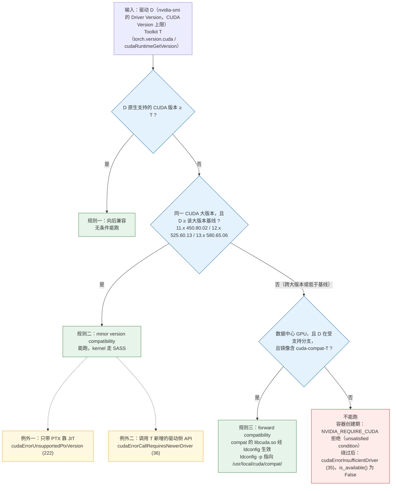
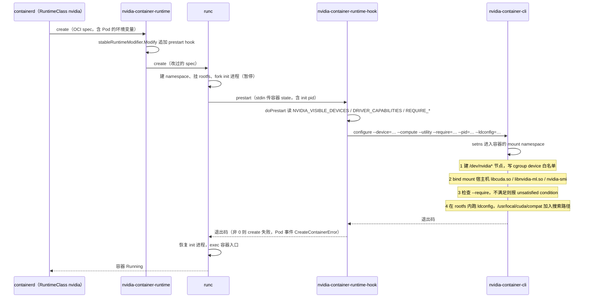
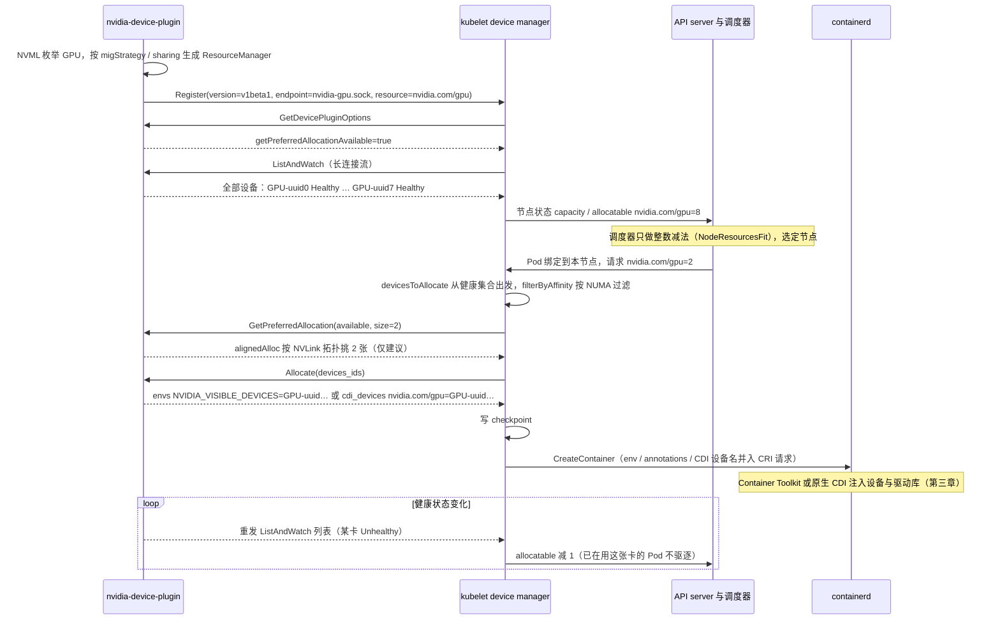
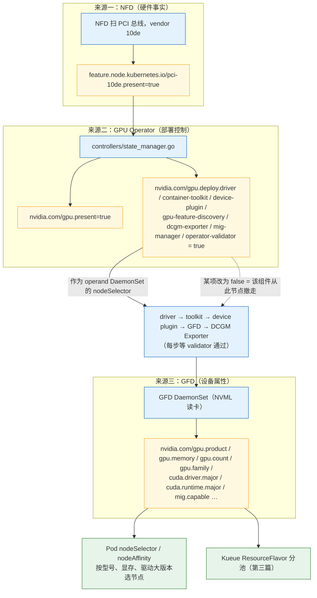
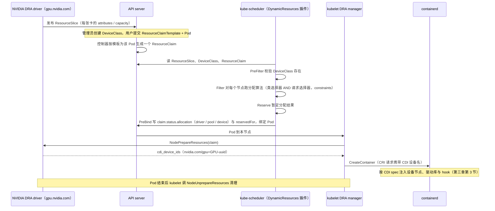

> 本文是[《AI 平台工程：资源层与交付层》](/ai-platform-engineering.html)系列的第 2 篇（共八篇）。上一篇：[引擎的需求清单与平台的整体架构](/ai-platform-engine-requirements-and-architecture.html)　下一篇：[AI 任务调度：gang scheduling、队列与拓扑感知](/ai-job-scheduling-gang-queue-topology.html)

上一篇结束在一个 Pending 的 Pod 上：`resources.limits` 里写了 `nvidia.com/gpu: 1`，`kubectl describe` 里是 `0/3 nodes are available: 3 Insufficient nvidia.com/gpu`。原因很直接——没有任何组件告诉 kubelet 这台机器上有 GPU。但把 device plugin 装上、Pod 调度成功之后，故障并没有结束，只是换了地方：Pod `Running`，`torch.cuda.is_available()` 返回 `False`，日志里一行 `CUDA driver version is insufficient for CUDA runtime version`；或者容器根本起不来，`kubectl describe` 里是 `nvidia-container-cli: requirement error: unsatisfied condition: cuda>=13.1`；或者一切正常，直到某个 kernel 启动时报 `the provided PTX was compiled with an unsupported toolchain`。

这些报错都不是 Kubernetes 的问题，也不是引擎的问题。它们来自一件事：一个容器要用上 GPU，必须让四层软件——内核态驱动、用户态驱动库、CUDA Runtime、上层库——在版本上互相接受，而这四层分别由四个不同的角色控制：内核驱动由节点管理员（或 GPU Operator 的驱动容器）装，用户态驱动库由 Container Toolkit 从宿主机挂进容器，CUDA Runtime 随镜像（或 pip wheel）走，上层库由训练框架和推理引擎自己带。这四个角色互不知情，只靠 NVIDIA 定义的三条兼容规则维系。

再往上，K8s 要回答的问题是"这台节点有几张卡、给哪个 Pod"。device plugin 用一个 gRPC 接口回答了"几张"，但它只能计数：调度器不知道这是 A100 还是 H100、显存是 40 GB 还是 80 GB、两张卡之间有没有 NVLink。Dynamic Resource Allocation（DRA）在 Kubernetes 1.34 GA，用 `ResourceSlice` 把设备的属性发布出来、用 CEL 表达式按属性选设备，是对 device plugin 局限的正面回答。最后还有一个常被低估的维度：一个带 CUDA 和 PyTorch 的镜像动辄 10 GB，拉取时间直接决定训练任务的启动时间和推理服务的扩容时间。

本篇要回答总纲提出的核心问题：

> **宿主机驱动 580（原生 CUDA 13.0）、镜像里 CUDA 13.1 编译的 PyTorch、代码里调用了 CUDA 13.1 新增的 API——这个组合能跑吗？如果宿主机驱动是 570（原生 CUDA 12.8）呢？答案取决于三条兼容规则中的哪一条适用。**

源码与 CRD 以 Kubernetes v1.37.0（device plugin API `staging/src/k8s.io/kubelet/pkg/apis/deviceplugin/v1beta1`、DRA API `staging/src/k8s.io/api/resource/v1`）、NVIDIA k8s-device-plugin v0.20.0、NVIDIA Container Toolkit v1.20.0、NVIDIA GPU Operator v26.7.0 为准。CUDA 与驱动的版本基线、前向兼容支持的 GPU 与驱动分支，以 NVIDIA CUDA 兼容性文档为准，本文只给规则和查法，不写成实测。


## 一、总览：四层栈、一个计数器和一个属性系统

### 1. 引擎的需求

训练框架和推理引擎对"容器里的 GPU"这一层的要求可以列成五条：

- **能打开设备**：进程要能 `open("/dev/nvidia0")`、`/dev/nvidiactl`、`/dev/nvidia-uvm`，并且 cgroup 的 device 白名单放行。这是 CUDA 初始化的第一步，缺一个就是 `cudaErrorNoDevice` 或 `cudaErrorInsufficientDriver`。
- **用户态驱动库版本与内核驱动一致**：`libcuda.so.<version>` 必须和 `nvidia.ko` 是同一个版本，这两者由同一个驱动包安装，不能分别升级。容器镜像里不能带 `libcuda.so`——它带的版本几乎肯定和节点不一致。
- **CUDA Runtime 与驱动兼容**：镜像里的 `libcudart.so.12`（或静态链接进 `libtorch_cuda.so` 的 cudart）要求驱动版本不低于某个基线。PyTorch、vLLM、TensorRT-LLM 各自绑定一个 CUDA Toolkit 版本，平台管不了它们选哪个。
- **要整数张、要指定的那几张**：训练进程按 `CUDA_VISIBLE_DEVICES` 或 `LOCAL_RANK` 找卡，两个 Pod 不能拿到同一张卡；TP=2 的推理服务要两张卡在同一节点，最好在同一 NVLink 域。
- **要知道卡是什么**：70B 模型 BF16 权重 140 GB，TP=2 需要每卡显存不低于 80 GB；一个 7B 模型给它 80 GB 卡是浪费。引擎在启动时就要知道显存大小和计算能力（`torch.cuda.get_device_capability()`），平台最好在调度时就知道。

### 2. K8s 的空缺

原生 Kubernetes 对以上五条一条都不满足：

- 容器运行时默认不挂载任何 `/dev/nvidia*`，也不知道 `libcuda.so` 在宿主机的哪里；
- kubelet 的资源模型只有 `cpu`、`memory`、`ephemeral-storage`、hugepages 和"扩展资源"（extended resources）。扩展资源是一个整数计数器：节点上报 `nvidia.com/gpu: 8`，Pod 请求 `nvidia.com/gpu: 2`，调度器做减法。它不知道 8 张卡各自是什么，也不能表达"要 2 张且互连"；
- 版本契约完全在 K8s 视野之外。调度器不检查镜像里的 CUDA 版本和节点驱动是否匹配，Pod 调度成功后在容器启动或首次 CUDA 调用时才失败。

### 3. 平台的机制（全局图）

填这些空缺的组件自下而上分四层，每一层对应一个"谁把什么放进容器"的问题：

```text
                    ┌──────────────────────────────────────────────────────────────┐
  Pod spec          │ resources.limits: nvidia.com/gpu: 2           ← device plugin 路径    │
                    │ resourceClaims: [{resourceClaimTemplateName}] ← DRA 路径（1.34 GA）    │
                    └──────────────────────────────────────────────────────────────┘
                         │ 调度：计数（NodeResourcesFit）或按属性算（DynamicResources 插件）
                         ▼
  kubelet           device manager（pkg/kubelet/cm/devicemanager）：ListAndWatch 记数、Allocate 取注入指令
                    DRA manager（pkg/kubelet/cm/dra）：NodePrepareResources 取 CDI 设备名
                         │ 注入指令：环境变量 NVIDIA_VISIBLE_DEVICES=GPU-uuid,... 或 CDI 设备 nvidia.com/gpu=0
                         ▼
  容器运行时         containerd / CRI-O → nvidia-container-runtime（OCI runtime 包装）
  + Container Toolkit    legacy：prestart hook → nvidia-container-cli configure，挂 libcuda.so、/dev/nvidia*
                         cdi / jit-cdi：按 CDI spec 改 OCI spec（v1.20.0 默认 auto → jit-cdi）
                         │
                         ▼
  宿主机            nvidia.ko / nvidia-uvm.ko + libcuda.so.<ver> + nvidia-smi   ← 节点管理员或 GPU Operator 驱动容器
                    GPU Feature Discovery → 节点标签 nvidia.com/gpu.product / gpu.memory / cuda.driver.major …
                    GPU Operator（ClusterPolicy）：把驱动容器、Toolkit、device plugin、GFD、DCGM Exporter、MIG Manager 装成一套
```

镜像是这张图的第五个参与者：它带 CUDA Runtime 和上层库，不带驱动；它的体积决定 Pod 从 `Scheduled` 到 `Running` 的时间。

### 4. 本文的章节安排

```text
二、四层栈与三条兼容规则      哪层在宿主机、哪层在容器；向后 / minor version / forward 三条规则各配例子与查法；PyTorch wheel 为什么带 cudart 不带 libcuda；核心问题的三个组合
三、Container Toolkit          nvidia-container-runtime 的 legacy hook 路径；NVIDIA_VISIBLE_DEVICES / NVIDIA_DRIVER_CAPABILITIES / NVIDIA_REQUIRE_CUDA；CDI 与 nvidia-ctk cdi generate；jit-cdi
四、device plugin              v1beta1 gRPC 五个方法；NVIDIA 插件如何上报 nvidia.com/gpu、Allocate 返回什么；健康检查；三个局限
五、GPU Operator               ClusterPolicy 的组件字段；节点标签的三个来源（NFD → gpu.present → gpu.deploy.* → GFD）；驱动容器与 hostPaths；Helm 安装与 values
六、DRA                        DeviceClass / ResourceSlice / ResourceClaim / ResourceClaimTemplate；CEL 选择器与 capacity；调度器与 kubelet 侧；完整示例；v1.37 的特性状态与 NVIDIA DRA driver
七、镜像                       nvidia/cuda 的 base / runtime / devel；PyTorch / vLLM 镜像的层；多阶段构建；拉取时间的算术；预热与 P2P 分发
八、代价与边界                 四栏表；每个机制引入的新问题；什么场景不该用
九、本文小结                   要点、源码与 CRD 位置、mini-platform/gpu/ 增量
```


## 二、四层栈与三条兼容规则

### 1. 四层栈：哪层在宿主机、哪层在容器

```text
                 ┌───────────────────────────────────────────────────────────────────┐
   容器内         │ 第 4 层  库          libcudnn.so.9  libnccl.so.2  libcublas.so.12  libnvrtc.so.12          │
   （镜像 /       │                      来源：pip wheel（nvidia-cudnn-cu12 …）或 nvidia/cuda:*-runtime 层         │
    pip wheel）   │ 第 3 层  CUDA Runtime libcudart.so.12（或静态链进 libtorch_cuda.so）                          │
                 │                      来源：nvidia-cuda-runtime-cu12 wheel / nvidia/cuda:*-runtime；版本 = torch.version.cuda │
                 ├─ ─ ─ ─ ─ ─ ─ ─ ─ 注入边界：Container Toolkit 把下面两层"挂"进容器 ─ ─ ─ ─ ─ ─ ─ ─ ─ ─ ─ ─┤
   宿主机         │ 第 2 层  用户态驱动   libcuda.so.580.x  libnvidia-ml.so.580.x  libnvidia-ptxjitcompiler.so.580.x  │
   （驱动包）     │                      nvidia-smi；版本 = nvidia-smi 左上角的 Driver Version                       │
                 │ 第 1 层  内核态驱动   nvidia.ko  nvidia-uvm.ko  nvidia-modeset.ko  → /dev/nvidia0 … /dev/nvidiactl /dev/nvidia-uvm │
                 └───────────────────────────────────────────────────────────────────┘
```

边界划在第 2 层和第 3 层之间，原因有三个：

- **第 1、2 层必须同版本**。`libcuda.so` 通过 ioctl 与 `nvidia.ko` 通信，接口不对外公开、随版本变化。两者由同一个驱动包安装，容器镜像不可能预知节点的驱动版本，所以 `libcuda.so` 只能来自宿主机。
- **第 3 层对第 2 层的要求是"不低于某个基线"而不是"相等"**。这就是 CUDA 兼容规则存在的意义：它让镜像可以独立于节点驱动构建和分发。
- **第 4 层对第 3 层是编译期绑定**。cuDNN 9 for CUDA 12 只能配 cudart 12；NCCL 的 `libnccl.so.2` 按 CUDA 大版本分包。这层由框架决定，平台不干预。

`nvidia-smi` 右上角显示的 `CUDA Version: 13.0` 是第 2 层的属性——这个驱动**最高**原生支持到哪个 CUDA 版本，不代表机器上装了 CUDA Toolkit。`torch.version.cuda` 是第 3 层的属性——PyTorch 编译时用的 Toolkit 版本。两者不同是常态，能不能一起工作由下面三条规则决定。

### 2. 三条兼容规则

以下规则与数字以 NVIDIA CUDA 兼容性文档（CUDA Compatibility）为准。

**规则一：向后兼容（backward compatibility）——新驱动跑旧 Toolkit，无条件成立。** 驱动 580 上跑 CUDA 11.8、12.4、13.0 编译的程序都可以。这是 NVIDIA 对驱动 ABI 的承诺，也是平台侧最省心的状态：节点驱动尽量新，镜像随便选。例子：节点驱动 570（原生支持到 CUDA 12.8），镜像是 CUDA 12.1 的 PyTorch 2.1，直接跑。

**规则二：minor version compatibility——同一 CUDA 大版本内，旧驱动跑新 Toolkit。** 从 CUDA 11.0 起，同一大版本内的所有 Toolkit 只要求驱动不低于该大版本的**最低基线**，而不是不低于该 Toolkit 对应的驱动。基线（以 NVIDIA 文档为准）：

```text
CUDA 11.x   驱动 >= 450.80.02
CUDA 12.x   驱动 >= 525.60.13
CUDA 13.x   驱动 >= 580.65.06
```

所以驱动 580（原生对应 CUDA 13.0，正是 13.x 的基线）可以运行 CUDA 13.1 及之后 13.x 编译的程序；同理驱动 535（原生对应 CUDA 12.2）可以运行 CUDA 12.4、12.8 编译的程序。但有两个限制：

- **PTX JIT 不在此列**。新 Toolkit 生成的 PTX 用新的 PTX ISA 版本，旧驱动里的 `libnvidia-ptxjitcompiler.so` 不认识它，报 `cudaErrorUnsupportedPtxVersion`（222，"the provided PTX was compiled with an unsupported toolchain"）。程序必须带目标 GPU 的 SASS（`-gencode arch=compute_90,code=sm_90`），只带 PTX 靠 JIT 的路径在 minor version compatibility 下不工作。PyTorch 的 wheel 为每个支持的架构都编了 SASS，所以一般没问题；只有当 GPU 架构比 wheel 编译时支持的最新架构还新、只能靠 PTX 时才会撞上。
- **新 Toolkit 里依赖新驱动的 API 不可用**。CUDA Runtime 通过 `cuGetProcAddress` 向驱动查询入口点，13.1 新增而 580 驱动没有的入口，调用时返回 `cudaErrorCallRequiresNewerDriver`（36，"the API call requires a newer CUDA driver than the one currently installed"）。这是核心问题里"调用了 13.1 新增 API"那一半的答案。

例子：驱动 580 + CUDA 13.1 编译的 PyTorch——能 import、能算矩阵乘、能训练，因为 SASS 都在；如果代码直接调了 13.1 才有的驱动侧入口（例如某些 graph 或 memory pool 的新接口），那一处返回 36。

**规则三：forward compatibility——跨大版本，旧驱动跑新 Toolkit，需要 `cuda-compat` 包，仅数据中心 GPU。** 驱动 570（或更早的 535）想跑 CUDA 13.x，或驱动 470 想跑 CUDA 12.x，minor version compatibility 不覆盖。NVIDIA 提供 `cuda-compat-<major>-<minor>` 包（如 `cuda-compat-13-0`、`cuda-compat-13-1`），把一份**新版本的用户态驱动库**——`libcuda.so`、`libnvidia-ptxjitcompiler.so`、`libnvidia-nvvm.so`——装到 `/usr/local/cuda-<ver>/compat/`，让新的用户态驱动库配合旧的内核驱动工作。限制（以 NVIDIA 文档为准）：只支持数据中心 GPU（Tesla / NVIDIA 数据中心品牌，不含 GeForce、大部分 RTX 工作站卡）；旧驱动必须来自被支持的分支（通常是 LTSB 分支，如 470、535 等）；某些需要内核驱动配合的新功能不可用。

例子：驱动 570（原生 CUDA 12.8）的数据中心节点上跑 `nvidia/cuda:13.1.2-runtime` 镜像——镜像的 base 层带 `cuda-compat-13-1`，Container Toolkit 把 compat 目录加入 `ldconfig`（第三章第 1 节），`libcuda.so.590.x` 取代宿主机挂进来的 `libcuda.so.570.x`，程序按 CUDA 13.1 运行。同样的镜像在 GeForce 卡上：compat 库拒绝加载，回到 `cudaErrorInsufficientDriver`（35）。

### 3. 怎么查

| 要查什么 | 命令 | 读法 |
|---|---|---|
| 节点驱动版本、驱动原生支持的最高 CUDA | `nvidia-smi`（宿主机或容器内） | 左上 `Driver Version: 580.65.06`；右上 `CUDA Version: 13.0`。后者是第 2 层的上限，不是 Toolkit |
| 驱动版本（脚本用） | `nvidia-smi --query-gpu=driver_version --format=csv,noheader`；或 `cat /proc/driver/nvidia/version` | 第 2 层与第 1 层同版本，`/proc` 那个是内核模块报的 |
| 镜像里 PyTorch 编译用的 Toolkit | `python -c "import torch; print(torch.version.cuda)"` | 第 3 层。`13.1` 表示 cudart 13.1；与 `nvidia-smi` 的 `CUDA Version` 比较，判断落在哪条规则 |
| Runtime 实际看到的驱动能力 | `python -c "import torch; print(torch.cuda.is_available(), torch.cuda.get_device_capability())"`；C 里是 `cudaDriverGetVersion()` vs `cudaRuntimeGetVersion()` | `is_available()` 为 `False` 且 stderr 有 `The NVIDIA driver on your system is too old (found version 12080)`，是规则二/三都没满足 |
| 容器里生效的是宿主机驱动还是 compat 库 | `ldconfig -p \| grep libcuda.so`；`ls /usr/local/cuda/compat/` | compat 生效时 `libcuda.so.1` 指向 `/usr/local/cuda/compat/libcuda.so.590.*` 而不是 `/usr/lib/x86_64-linux-gnu/libcuda.so.570.*` |
| compat 包版本 | `dpkg -l \| grep cuda-compat` 或 `rpm -qa \| grep cuda-compat` | 包名 `cuda-compat-13-1`，版本号是其中 `libcuda.so` 的驱动版本 |
| GPU 是否数据中心品牌 | `nvidia-smi --query-gpu=name --format=csv,noheader`；或看 Toolkit 的 `NVIDIA_REQUIRE_CUDA` 判定结果 | 官方 CUDA 镜像的 `NVIDIA_REQUIRE_CUDA` 里含 `brand=tesla,driver>=570,driver<571` 这类子句，就是为 forward compat 留的口子 |

### 4. 为什么 PyTorch wheel 带 CUDA Runtime 不带驱动

`pip install torch` 装下来的除了 `torch` 还有十来个 `nvidia-*-cu12` 包：`nvidia-cuda-runtime-cu12`（cudart）、`nvidia-cudnn-cu12`、`nvidia-cublas-cu12`、`nvidia-nccl-cu12`、`nvidia-nvjitlink-cu12`…… 加起来 2–3 GB。它们是第 3、4 层。wheel **不带** `libcuda.so`，因为：

- 第 2 层必须与第 1 层同版本，而 wheel 不知道你的内核驱动是什么；
- 第 2 层是 NVIDIA 驱动包的一部分，许可与分发方式和 Toolkit 不同；
- 第 2 层通过 `ldconfig` 从系统路径找。容器里这条路径由 Container Toolkit 铺好——它把宿主机的 `libcuda.so.580.x` 挂到容器的 `/usr/lib/x86_64-linux-gnu/` 并跑一次 `ldconfig`。

所以"镜像里 CUDA 13.1"和"节点驱动 580"这两个数字分别由两个不相关的过程决定，兼容规则是它们之间唯一的契约。`torch.version.cuda`、`nvidia-smi` 的 `CUDA Version`、`nvcc --version` 三个数字互不相同是正常的，分别是第 3 层、第 2 层上限、以及构建时的 Toolkit。

### 5. 核心问题的三个组合

把三条规则连成一棵决策树——输入是节点的驱动 D（`nvidia-smi` 的 `Driver Version` 与右上角 `CUDA Version` 上限）和镜像的 Toolkit T（`torch.version.cuda`），沿着判断走到叶子就是结果与对应的错误码：



下表是核心问题的三个组合在这棵树上落到的叶子：

| 组合 | 适用规则 | 结果 |
|---|---|---|
| 驱动 580 + CUDA 13.1 的 PyTorch，常规使用 | 规则二（13.x 基线 580.65.06 ≤ 580） | **能跑**。`torch.cuda.is_available()` 为 `True`，kernel 走 SASS。`nvidia-smi` 仍显示 `CUDA Version: 13.0`，这不是错 |
| 驱动 580 + CUDA 13.1 的 PyTorch + 代码调用 13.1 新增的驱动侧 API | 规则二不覆盖新入口 | **那一处调用失败**：`cudaErrorCallRequiresNewerDriver`（36）。其余功能正常。解法是把驱动升到 13.1 对应的 ≥ 590.44.01，或在数据中心 GPU 上装 `cuda-compat-13-1` 转入规则三——compat 的 `libcuda.so` 是 13.1 对应的 590 驱动，新入口就有了 |
| 驱动 570 + CUDA 13.x 的 PyTorch | 规则二不适用（570 < 580.65.06，跨大版本）；只剩规则三 | **数据中心 GPU + 镜像含 `cuda-compat-13-x` + 570 是受支持分支**：能跑，容器内 `ldconfig -p` 看到 `libcuda.so` 来自 `/usr/local/cuda/compat/`。**其他情况**：容器启动阶段被 Toolkit 的 `NVIDIA_REQUIRE_CUDA` 检查拒绝（`unsatisfied condition: cuda>=13.1`），或绕过检查后 `cudaErrorInsufficientDriver`（35）、`torch.cuda.is_available()` 为 `False` |

第三行不是假设的边角情况，而是 2026 年最常见的坑：PyTorch 从 2.11 起 PyPI 默认 wheel 切到 CUDA 13.0，驱动停在 5xx 且 < 580 的集群（570、550、535 都一样）只要 `pip install torch` 就直接落到规则三——不是数据中心 GPU、或镜像里没有 `cuda-compat-13-x`，就是上面那两个报错。第九章练手项目的 `mismatch/Dockerfile` 就用这个组合复现两种报错。


## 三、Container Toolkit：把驱动注入容器

Container Toolkit 是"注入边界"的执行者。它以 NVIDIA Container Toolkit v1.20.0 为准，包含四个可执行文件（`cmd/`）：`nvidia-container-runtime`（OCI runtime 包装器）、`nvidia-container-runtime-hook`（prestart hook）、`nvidia-cdi-hook`（CDI spec 里引用的 hook）、`nvidia-ctk`（命令行工具，含 `cdi generate`、`runtime configure`）。配置文件是 `/etc/nvidia-container-runtime/config.toml`，结构定义在 `api/config/v1/config.go` 的 `Config`。

### 1. legacy 路径：prestart hook

`nvidia-container-runtime` 不是一个完整的容器运行时，它包装 `runc`（或 `crun`）：接到 `create` 命令时读取 OCI spec，按需修改后交给真正的 runtime。`internal/runtime/runtime_factory.go` 的 `newSpecModifier` 按 `nvidia-container-runtime.mode` 决定怎么改。legacy 模式的改法在 `internal/modifier/stable.go` 的 `stableRuntimeModifier.Modify`：往 `spec.Hooks.Prestart` 追加一条 `nvidia-container-runtime-hook prestart`。

容器创建到 prestart 阶段，hook 被调用（`cmd/nvidia-container-runtime-hook/main.go` 的 `doPrestart`），它读容器的环境变量，拼出一条 `nvidia-container-cli configure` 命令：`--device=<NVIDIA_VISIBLE_DEVICES 解析结果>`、`--compute` / `--utility` 等能力开关、`--require=<NVIDIA_REQUIRE_* 的每一条>`、`--pid=<容器 init 进程 pid>`、`--ldconfig=@/sbin/ldconfig`。`nvidia-container-cli`（来自 libnvidia-container，C 实现，不在本仓库）进入容器的 mount namespace，做四件事：

1. 创建 `/dev/nvidia0`…`/dev/nvidiactl`、`/dev/nvidia-uvm`、`/dev/nvidia-uvm-tools` 设备节点并写 cgroup device 白名单；
2. 把宿主机驱动包里的用户态库按能力集挑出来 bind mount 进容器：`compute` 对应 `libcuda.so`、`libnvidia-ptxjitcompiler.so` 等，`utility` 对应 `nvidia-smi`、`libnvidia-ml.so`；
3. 检查 `--require` 条件；
4. 在容器 rootfs 内运行 `ldconfig`，让 `libcuda.so.1` 的符号链接和 ld cache 指向刚挂进来的库。

把这条调用链按时间画出来，可以看清两件事：OCI spec 只在 `create` 之前被改过一次（只加了一条 hook），真正的注入发生在 `runc` 已经建好 namespace、尚未 exec 容器进程的 prestart 窗口里；以及 `--require` 检查失败为什么表现为"容器起不来"而不是 CUDA 报错——它在 hook 里就返回了非零退出码：



第四步是 forward compatibility 在容器里生效的地方：`api/config/v1/runtime.go` 的 `legacyModeConfig.CUDACompatMode`（`cuda-compat-mode`）默认 `ldconfig`，把 `/usr/local/cuda/compat` 加进 `ldconfig` 的搜索路径；如果镜像的 compat 目录里 `libcuda.so` 比宿主机的新，ld cache 就指向它。另两个取值 `mount` 与 `hook`（`enable-cuda-compat` hook，`internal/discover/hooks.go` 的 `EnableCudaCompatHook`）是 CDI 路径下的实现。

### 2. 三个环境变量

hook 路径的全部输入都是容器的环境变量，定义在 `internal/config/image/envvars.go`：

- **`NVIDIA_VISIBLE_DEVICES`**：给这个容器哪些 GPU。取值是 GPU 索引（`0,1`）、UUID（`GPU-fef8089b-…`）、`all` 或 `none`（以及 MIG 设备 `MIG-GPU-…`）。device plugin 的 `Allocate` 默认就通过这个变量传递分配结果（第四章第 3 节）。config.toml 里 `accept-nvidia-visible-devices-envvar-when-unprivileged`（`Config.AcceptEnvvarUnprivileged`）决定非特权容器设这个变量是否被接受——K8s 场景下它是一个安全阀：设为 `false` 后，用户 Pod 自己写 `NVIDIA_VISIBLE_DEVICES=all` 绕过 device plugin 分配的做法就失效了，但 device plugin 也必须改用 volume-mounts 或 CDI 策略传递设备列表。
- **`NVIDIA_DRIVER_CAPABILITIES`**：挂哪些驱动库。`internal/config/image/capabilities.go` 定义了 `compute`、`utility`、`graphics`、`video`、`display`、`ngx`、`compat32`、`all`；默认 `DefaultDriverCapabilities` 是 `utility,compute`。训练和推理只需要默认值；要用 NVENC 解码视频数据集就加 `video`。`nvidia/cuda` 官方镜像在 Dockerfile 里设了 `NVIDIA_DRIVER_CAPABILITIES=compute,utility`。
- **`NVIDIA_REQUIRE_CUDA`**（及所有 `NVIDIA_REQUIRE_*`）：容器对宿主机的要求，`internal/config/image/cuda_image.go` 的 `CUDA.GetRequirements` 收集它们传给 `--require`。`nvidia/cuda:13.1.2-*` 镜像里的值形如 `cuda>=13.1 brand=unknown,driver>=535,driver<536 brand=tesla,driver>=535,driver<536 … brand=tesla,driver>=570,driver<571 … brand=tesla,driver>=580,driver<581`——第一段要求驱动原生支持 13.1，后面每段是"品牌 X 且驱动在 forward-compat 支持的分支内"的例外（570 节点就是靠 `driver>=570,driver<571` 这一段放行的）。检查不通过时 `nvidia-container-cli` 报 `requirement error: unsatisfied condition: cuda>=13.1`（Go 侧对应实现见 `internal/requirements/constraints/binary.go` 的 `binary.Assert`），容器创建失败，`kubectl describe pod` 里是 `CreateContainerError` 或 `RunContainerError`。`NVIDIA_DISABLE_REQUIRE=1` 可以跳过这个检查——只用于把报错从"容器起不来"推后到"CUDA 初始化失败"，方便看清 Runtime 的错误码，不是修复。

### 3. CDI：把注入变成一份声明

Container Device Interface 是 CNCF 下的容器设备规范：一份 JSON/YAML 文件（放在 `/etc/cdi/` 或 `/var/run/cdi/`）描述每个设备名对应的设备节点、挂载、环境变量和 hook；容器运行时（containerd 1.7 起支持、2.0 起默认开启；CRI-O 1.28 起支持）在创建容器时按名字把这些内容并入 OCI spec，**不需要 vendor 的 runtime 包装器**。

`nvidia-ctk cdi generate`（`cmd/nvidia-ctk/cdi/generate/generate.go`）扫描宿主机驱动生成这份文件：

```bash
sudo nvidia-ctk cdi generate --output=/etc/cdi/nvidia.yaml
# 关键参数（v1.20.0 默认值）：
#   --vendor nvidia.com  --class gpu          → 设备名 nvidia.com/gpu=0、nvidia.com/gpu=GPU-<uuid>、nvidia.com/gpu=all
#   --device-name-strategy index,uuid         → 每张卡同时生成索引名和 UUID 名
#   --mode auto                               → nvml / csv（Tegra）/ wsl 自动判断
#   --nvidia-cdi-hook-path /usr/bin/nvidia-cdi-hook
nvidia-ctk cdi list                          # 列出可用设备名
```

生成的 spec 里每个设备包含 `/dev/nvidia<N>` 的 deviceNodes、`containerEdits` 里的库文件 mounts，以及 `nvidia-cdi-hook` 的 `update-ldcache`、`create-symlinks`、`enable-cuda-compat`（v1.20.0 起加入管理 spec）等 hook（hook 名列表在 `internal/discover/hooks.go`）。之后容器请求设备只需在 CRI 层给出 `nvidia.com/gpu=0`——device plugin 的 `cdi-cri` 策略正是这样做的（第四章第 3 节）。

Toolkit 自身也能消费 CDI：`nvidia-container-runtime.mode = "cdi"` 时，`internal/modifier/cdi.go` 按 `modes.cdi.spec-dirs`（`cdiModeConfig.SpecDirs`）读 spec 并修改 OCI spec，注解前缀 `modes.cdi.annotation-prefixes` 默认 `cdi.k8s.io/`。v1.20.0 的 `mode = "auto"` 在有 NVML 的平台上解析为 `jit-cdi`（`internal/info/auto.go` 的 `modeResolver.ResolveRuntimeMode`，默认 `JitCDIRuntimeMode`）：不读磁盘上的 spec 文件，而是在每次容器创建时**即时生成**等价的 CDI 编辑并应用——行为与 CDI 一致，但不依赖 `nvidia-ctk cdi generate` 的产物是否过期。

### 4. hook 与 CDI 的对照

| | legacy hook | CDI（含 jit-cdi） |
|---|---|---|
| 谁改 OCI spec | `nvidia-container-cli` 在 prestart 阶段进入容器 namespace 直接操作 | 容器运行时（或 nvidia-container-runtime）在创建前按声明修改 spec |
| 输入 | 环境变量 `NVIDIA_VISIBLE_DEVICES` 等 | 设备名 `nvidia.com/gpu=<idx/uuid>`，经 CRI 字段或 `cdi.k8s.io/*` 注解 |
| 是否需要 vendor runtime | 需要 `nvidia-container-runtime` 作为 containerd 的 runtime handler | 原生 CDI 不需要；jit-cdi 仍走 nvidia-container-runtime |
| 安全性 | 环境变量可被 Pod 自己设置，需 `accept-nvidia-visible-devices-envvar-when-unprivileged=false` 配合 | 设备名由 kubelet 传，Pod 无法自设 |
| 可审计性 | 注入内容隐含在 `nvidia-container-cli` 的逻辑里 | spec 文件可读、可 diff、可版本化 |
| 与 DRA 的关系 | DRA 不用它 | DRA 的 `NodePrepareResources` 返回的就是 CDI 设备名（第六章第 3 节） |

GPU Operator v26.7.0 的 `cdi.enabled` 默认 `true`（`api/nvidia/v1/clusterpolicy_types.go` 的 `CDIConfigSpec.Enabled`），它把 Toolkit 配成 CDI 模式、把 device plugin 的 `deviceListStrategy` 配成 CDI 注解。方向很清楚：hook 是过去，CDI 是现在和 DRA 的基础。


## 四、device plugin：让 kubelet 数得清 GPU

### 1. v1beta1 gRPC 接口

device plugin 是 kubelet 的一个扩展点：任何进程只要实现 `DevicePlugin` gRPC 服务并到 kubelet 注册，就能让节点上报一种扩展资源。接口定义在 `staging/src/k8s.io/kubelet/pkg/apis/deviceplugin/v1beta1/api.proto`（Kubernetes v1.37.0 仍是 `v1beta1`，`constants.go` 的 `Version = "v1beta1"`），两个 service：

```text
service Registration                       kubelet 提供，socket 在 /var/lib/kubelet/device-plugins/kubelet.sock
  rpc Register(RegisterRequest)            插件启动后调用：version、endpoint（自己的 socket 名）、resource_name（如 nvidia.com/gpu）、options

service DevicePlugin                       插件提供，socket 在 /var/lib/kubelet/device-plugins/<endpoint>
  rpc GetDevicePluginOptions               返回 DevicePluginOptions：pre_start_required、get_preferred_allocation_available
  rpc ListAndWatch(Empty) → stream         设备列表流：每个 Device 有 ID、health（"Healthy"/"Unhealthy"）、topology（NUMA 节点）。状态变化就重发整个列表
  rpc GetPreferredAllocation               kubelet 在分配前询问："可用集合里选 N 个，你偏好哪几个？"结果只是建议
  rpc Allocate(AllocateRequest)            容器创建时调用：给定 devices_ids，返回 ContainerAllocateResponse——envs、mounts、devices、annotations、cdi_devices
  rpc PreStartContainer                    可选，容器启动前做设备初始化（重置等）
```

kubelet 侧的实现在 `pkg/kubelet/cm/devicemanager/manager.go` 的 `ManagerImpl`：`PluginConnected` 处理注册，`PluginListAndWatchReceiver` → `genericDeviceUpdateCallback` 维护 `healthyDevices` / `unhealthyDevices` 两个集合并生成 `GetCapacity` 上报给节点状态；Pod 准入时 `Allocate` → `allocateContainerResources` → `devicesToAllocate` 从健康集合里挑设备，先经 Topology Manager 的 NUMA 亲和过滤（`filterByAffinity`），再调 `callGetPreferredAllocationIfAvailable` 征求插件意见，最后调插件的 `Allocate` 拿注入指令；`GetDeviceRunContainerOptions` 在创建容器时把这些指令并入 CRI 请求。分配结果写入 checkpoint 文件（`checkpointFile`）以便 kubelet 重启后恢复。

把插件侧和 kubelet 侧串成一次完整的生命周期，注意方向：只有 `Register` 是插件主动调 kubelet，其余五个方法都是 kubelet 调插件；`ListAndWatch` 是一条常驻的流，`Allocate` 才是每个容器创建时发生一次的调用；调度器在整条链上只看到一个整数：



这个模型里 kubelet 只知道三件事：**资源名、每个设备的 ID 字符串、健康与否**。调度器知道的更少：只有 `status.allocatable` 里的一个整数。

### 2. NVIDIA 插件怎么上报 `nvidia.com/gpu`

NVIDIA k8s-device-plugin v0.20.0 的入口在 `cmd/nvidia-device-plugin/main.go`，配置结构 `api/config/v1/config.go` 的 `Config`（`version` / `flags` / `resources` / `sharing` / `imex`），可以由命令行、环境变量或 `--config-file` 指定的 ConfigMap 提供。与本篇相关的字段（`api/config/v1/flags.go`）：

```text
flags.migStrategy                 none | single | mixed         MIG 设备怎么上报（第四篇展开）；默认 none
flags.failOnInitError             默认 true                      节点没驱动时插件直接退出而不是空转
flags.nvidiaDriverRoot            "/" 或 "/run/nvidia/driver"    驱动在宿主机的根，GPU Operator 驱动容器用后者
flags.plugin.deviceListStrategy   envvar | volume-mounts | cdi-annotations | cdi-cri（可多选）  Allocate 用什么方式传设备列表；默认 envvar
flags.plugin.deviceIDStrategy     uuid | index                   NVIDIA_VISIBLE_DEVICES 里放 UUID 还是索引；默认 uuid
flags.plugin.passDeviceSpecs      默认 false                     Allocate 是否直接返回 /dev/nvidia* 的 DeviceSpec
flags.plugin.sharedDevicesAllocationPolicy  distributed | packed  共享/MIG 设备的偏好分配策略
sharing.timeSlicing / sharing.mps                                把一张卡上报为 N 个副本（第四篇）
resources.gpus[] / resources.mig[]                               按型号模式改资源名（如 nvidia.com/a100 与 nvidia.com/h100 分开上报）
```

资源名的前缀 `nvidia.com` 定义在 `api/config/v1/consts.go` 的 `ResourceNamePrefix`，默认资源 `nvidia.com/gpu`。`internal/rm/nvml_manager.go` 的 `NewNVMLResourceManagers` 用 NVML 枚举设备，按 `migStrategy` 与 `sharing` 配置生成一个或多个 `ResourceManager`，每个对应一个资源名；`internal/plugin/server.go` 为每个资源起一个 `nvidiaDevicePlugin`，`Register` 时声明 `GetPreferredAllocationAvailable: true`，`ListAndWatch` 首次发送全部设备，之后在健康状态变化时重发。

`GetPreferredAllocation` 的实现值得一看（`internal/rm/nvml_manager.go` 的 `getPreferredAllocation`）：如果可用设备都是完整 GPU、没有副本，走 `alignedAlloc`——调用 `gpuallocator` 库按 NVLink / PCIe 拓扑挑一组互连最好的卡（`NewBestEffortPolicy`）；否则按 `sharedDevicesAllocationPolicy` 用 `internal/rm/allocate.go` 的 `greedyAlloc` 在副本之间做 distributed 或 packed 分配。这是 device plugin 模型下唯一的"拓扑感知"——**节点内**、**分配时**、**建议性**的。调度器选节点时对此一无所知。

### 3. Allocate 返回什么

`internal/plugin/server.go` 的 `getAllocateResponse` 按 `deviceListStrategy` 组装响应：

- `envvar`（默认）：`Envs["NVIDIA_VISIBLE_DEVICES"] = "GPU-uuid1,GPU-uuid2"`，交给 Container Toolkit 的 hook 路径；
- `volume-mounts`：把设备列表编码成挂载路径（`/var/run/nvidia-container-devices/<id>`），配合 Toolkit 的 `accept-nvidia-visible-devices-as-volume-mounts`，用于禁用了环境变量方式的安全加固场景；
- `cdi-annotations`：`Annotations["cdi.k8s.io/<prefix>_<uuid>"] = "nvidia.com/gpu=GPU-uuid1,…"`，由 nvidia-container-runtime 的 CDI 模式解析；
- `cdi-cri`：填 `CdiDevices`，即 `api.proto` 里 `ContainerAllocateResponse.cdi_devices`，kubelet 通过 CRI 直接传给支持 CDI 的 containerd / CRI-O，不再需要 nvidia-container-runtime。

另有 `passDeviceSpecs=true` 时填 `Devices`（`DeviceSpec` 的 host_path / container_path / permissions），让 kubelet 直接创建设备节点——这对 CPU Manager 静态策略或 `hostPID` 等场景有用。GDRCopy、GDS、MOFED 开关分别加 `NVIDIA_GDRCOPY=enabled` 等环境变量，Toolkit 据此多挂对应的库（第五篇 RDMA 时再见）。

### 4. 健康检查与 Pending 的读法

`internal/rm/health.go` 的 `checkHealth` 用 NVML 事件订阅 `XidCriticalError`、`DoubleBitEccError`、`SingleBitEccError`：一张卡报了关键 Xid（可通过 `DP_DISABLE_HEALTHCHECKS` 环境变量按 Xid 号忽略，因为有些 Xid 是应用错误而不是硬件故障），插件把它标 `Unhealthy` 并重发 `ListAndWatch`，kubelet 的 `genericDeviceUpdateCallback` 把它从 `healthyDevices` 移走，节点的 `allocatable` 减一。已经在用这张卡的 Pod 不会被驱逐——只是之后不再分给新 Pod。

于是上一篇 Pending 事件的三种读法：

```text
0/3 nodes are available: 3 Insufficient nvidia.com/gpu          没有节点上报过这个资源（插件没装、没注册、failOnInitError 退出）
                                                                  或 allocatable 都被占满 / 被健康检查扣光。看 kubectl describe node 的 Capacity vs Allocatable
0/3 nodes are available: 1 Insufficient nvidia.com/gpu, 2 ...    资源存在但数量不够；配合 kubectl get pods -A -o wide 看谁占着
Pod Running 但容器内 nvidia-smi 报 No devices were found          分配成功、注入失败：Toolkit 没装 / RuntimeClass 没指到 nvidia / NVIDIA_VISIBLE_DEVICES 被 Pod 自己覆盖
```

### 5. 三个局限

device plugin 模型在 2018 年定型，它的边界今天看得很清楚：

- **只能计数，不能表达属性**。`nvidia.com/gpu: 2` 无法说"要 80 GB 的"或"要 H100"。变通办法是 GFD 打节点标签 + `nodeSelector`（第五章第 2 节），或按型号上报不同资源名（`resources.gpus[]` 的 pattern 重命名）。前者是节点级的，混卡节点无能为力；后者让每种卡型都成为独立配额，碎片化。
- **调度器看不见拓扑**。`GetPreferredAllocation` 只在节点内、在 kubelet 已经选定节点后生效。要 8 张卡全在一个 NVLink 域、要 GPU 与 RDMA 网卡同 PCIe switch，调度器无法保证——它甚至不知道一个节点的 8 张卡是不是"凑得齐"。
- **不能跨 Pod 共享**。一个设备 ID 一旦分给某容器就从可用集合里消失。要让两个 Pod 共用一张卡，只能由插件把一张卡上报成 N 个假设备（`sharing.timeSlicing` 的副本），kubelet 层面看到的仍是 N 个不相关的整数；没有显存或算力的账。

这三条正是 DRA 的设计目标（第六章）。在 DRA 普及之前，K8s 生态用 GFD 标签、Volcano / Kueue 的调度扩展、HAMi 的 API 拦截各自绕过一条，后面几篇会逐一遇到。


## 五、GPU Operator：ClusterPolicy 驱动的一套组件

### 1. 组件与 ClusterPolicy 字段

前两章的组件——驱动、Toolkit、device plugin——再加上节点标签、监控和 MIG 管理，每个都是一个 DaemonSet，每个都要和节点的内核、发行版、容器运行时对上。GPU Operator 把它们收进一个 CRD：`nvidia.com/v1` 的 `ClusterPolicy`（集群单例，名字固定 `cluster-policy`），类型在 `api/nvidia/v1/clusterpolicy_types.go` 的 `ClusterPolicySpec`。与本篇相关的字段：

```text
operator        OperatorSpec              runtimeClass（默认 "nvidia"）、initContainer；defaultRuntime（docker | crio | containerd）已废弃，运行时由 Operator 自动探测
daemonsets      DaemonsetsSpec            所有 operand DaemonSet 的公共 tolerations / priorityClassName / updateStrategy
driver          DriverSpec                enabled；repository/image/version（默认 nvcr.io/nvidia/driver:595.91.07）；kernelModuleType（auto | open | proprietary）；
                                          usePrecompiled；useNvidiaDriverCRD（用 NVIDIADriver CRD 按节点组管理多版本驱动）；rdma；upgradePolicy
toolkit         ToolkitSpec               enabled；container-toolkit 镜像（默认 v1.20.0）；env（如 CONTAINERD_CONFIG）
devicePlugin    DevicePluginSpec          enabled；k8s-device-plugin 镜像（默认 v0.20.0）；config（DevicePluginConfig：ConfigMap 名与默认项，内容即第四章的 Config）；mps
gfd             GPUFeatureDiscoverySpec   enabled；GFD 与 device plugin 同一镜像
dcgmExporter    DCGMExporterSpec          enabled；dcgm-exporter 镜像（默认 4.6.0-4.8.3）；serviceMonitor（第八篇）
dcgm            DCGMSpec                  独立 nv-hostengine，默认关闭（exporter 内嵌）
mig             MIGSpec                   strategy：none | single | mixed，同时喂给 GFD 与 device plugin
migManager      MIGManagerSpec            enabled；k8s-mig-manager 镜像（默认 v0.15.0）；config（MIGPartedConfigSpec）——第四篇
cdi             CDIConfigSpec             enabled（默认 true）：Toolkit 配成 CDI 模式、device plugin 用 CDI 注解
validator       ValidatorSpec             operator-validator：在每个节点上依次验证 driver / toolkit / cuda / plugin 是否就绪
hostPaths       HostPathsSpec             rootFS（默认 /）、driverInstallDir（默认 /run/nvidia/driver）、kubeletRootDir
nodeStatusExporter, gds, gdrcopy, sandboxWorkloads, vgpuManager, kataManager, ccManager …   本篇不涉及
```

Operator 的 reconcile（`controllers/`）按固定顺序推进各组件的 DaemonSet，每一步等上一步的 validator 通过：驱动容器就绪 → Toolkit 配置好 containerd 并重启它 → device plugin 注册 → GFD 打标签 → DCGM Exporter。任何一步失败，ClusterPolicy 的 `status.state` 停在 `notReady`，`kubectl get clusterpolicy` 一眼可见。

### 2. 节点标签的三个来源

`kubectl get node -o yaml` 里 GPU 节点会有三组标签，来源不同：

**第一组：NFD 的 PCI 标签。** GPU Operator 依赖 Node Feature Discovery（Helm 值 `nfd.enabled: true` 时一并安装），NFD 扫 PCI 总线，给有 NVIDIA 设备（vendor id `10de`）的节点打 `feature.node.kubernetes.io/pci-10de.present=true`。这是"这个节点有 NVIDIA 卡"的唯一硬件级来源。

**第二组：Operator 自己的部署控制标签。** `controllers/state_manager.go` 里，Operator 看到 `pci-10de.present` 后给节点打 `nvidia.com/gpu.present=true`（`GPUPresentLabel`），再打一组 `nvidia.com/gpu.deploy.*=true`：`gpu.deploy.driver`、`gpu.deploy.container-toolkit`、`gpu.deploy.device-plugin`、`gpu.deploy.gpu-feature-discovery`、`gpu.deploy.dcgm-exporter`、`gpu.deploy.mig-manager`、`gpu.deploy.operator-validator` 等（v26.7.0 还有 `gpu.deploy.dra-driver`，见第六章第 5 节）。每个 operand DaemonSet 的 `nodeSelector` 就是对应的 `gpu.deploy.<name>=true`。把某个节点的 `nvidia.com/gpu.deploy.driver` 改成 `false`，驱动容器就从它上面撤走——这是节点级排除和灰度升级的开关。

**第三组：GFD 的属性标签。** GPU Feature Discovery（k8s-device-plugin 仓库 `cmd/gpu-feature-discovery`，标签生成在 `internal/lm/`）用 NVML 读每张卡的属性写成节点标签。`internal/lm/resource.go` 的 `baseLabeler` 与 `NewGPUResourceLabeler` 生成，键名是 `<资源名>.<后缀>`：

```text
nvidia.com/gpu.product              NVIDIA-H100-80GB-HBM3（型号，空格替换为 -；共享时后缀 -SHARED）
nvidia.com/gpu.count                8
nvidia.com/gpu.memory               81559（MiB）
nvidia.com/gpu.family               hopper          nvidia.com/gpu.compute.major / .minor    9 / 0
nvidia.com/gpu.replicas             1（时间片副本数）  nvidia.com/gpu.sharing-strategy          none | time-slicing | mps
nvidia.com/cuda.driver.major/.minor/.rev      580 / 65 / 06      （internal/lm/nvml.go；另有 cuda.driver-version.* 全称版）
nvidia.com/cuda.runtime.major/.minor          13 / 0             （驱动原生支持的 CUDA 上限，与 nvidia-smi 右上角一致）
nvidia.com/mig.capable  nvidia.com/mig.strategy  nvidia.com/mps.capable  nvidia.com/gpu.mode
nvidia.com/gpu.machine              机型（internal/lm/machine-type.go）   nvidia.com/gfd.timestamp   本次标签时间
```

MIG 策略为 `mixed` 时资源名变成 `nvidia.com/mig-1g.5gb` 之类，标签前缀随之变为 `nvidia.com/mig-1g.5gb.product` 等（`internal/lm/mig-strategy.go`）。

三组标签不是并列的，而是一条因果链：NFD 的硬件标签触发 Operator 打部署标签，部署标签是各 operand DaemonSet 的 `nodeSelector`，GFD 作为其中一个 operand 跑起来之后才有第三组属性标签；三组里只有第三组是给 Pod 和上层调度器消费的：



这组标签是 device plugin 时代"按属性选卡"的全部手段：Pod 写 `nodeSelector: {nvidia.com/gpu.product: NVIDIA-H100-80GB-HBM3}` 或用 `nodeAffinity` 表达"`nvidia.com/gpu.memory` 大于某值"（标签是字符串，只能用 `In` 枚举，不能比大小）。第三篇 Kueue 的 `ResourceFlavor` 也靠这些标签把"H100 池"和"A100 池"分开。`nvidia.com/cuda.driver.major` 标签则可以用来把 CUDA 13 的镜像只调度到驱动 ≥ 580 的节点——把第二章的兼容规则前移到调度期，虽然粗糙，但比容器起不来好。

### 3. 驱动容器与 hostPaths

`driver.enabled: true` 时驱动不装在节点 OS 里，而是由驱动容器在每个节点上编译（或用 `usePrecompiled` 拉预编译模块）并 `insmod`，用户态库放在 `hostPaths.driverInstallDir`（默认 `/run/nvidia/driver`）下，而不是 `/usr/lib`。于是 Toolkit 和 device plugin 都要知道这个根：device plugin 的 `flags.nvidiaDriverRoot` 与 `containerDriverRoot`，Toolkit 的 `nvidia-container-cli.root`，都由 Operator 按 `hostPaths` 填好。好处是驱动版本成为集群配置的一部分、可以滚动升级；代价是节点上直接跑 `nvidia-smi` 找不到驱动（要 `chroot /run/nvidia/driver nvidia-smi`），并且驱动容器镜像必须与节点内核版本匹配——云厂商镜像更新内核后驱动容器编译失败，是 GPU Operator 最常见的故障。节点已经装好驱动的集群设 `driver.enabled: false`，Operator 只管其余组件。

### 4. Helm 安装与 values

GPU Operator 用 Helm 安装，chart 的 `values.yaml`（`deployments/gpu-operator/values.yaml`）顶层键与 `ClusterPolicySpec` 一一对应，`clusterPolicy.deployCR: true`（默认）时由 `templates/clusterpolicy.yaml` 渲染出 `ClusterPolicy`。练手项目的最小 values 与安装命令见第九章第 3 节。三个节点级前提在装之前就要确认：容器运行时是 containerd 或 CRI-O（Operator 自动探测，`operator.defaultRuntime` 字段已废弃）；节点内核有对应的驱动容器镜像（或改 `driver.enabled: false` 自装驱动）；没有其他 device plugin 在同一节点上报 `nvidia.com/gpu`（HAMi、云厂商自带插件都会冲突，第四篇再谈）。


## 六、DRA：从计数到属性

### 1. 四个对象

Dynamic Resource Allocation 在 Kubernetes 1.34 把 `resource.k8s.io/v1` 升为 GA（`staging/src/k8s.io/api/resource/v1/types.go`，各类型标注 `introduced=1.34`）。它用四个对象替换"扩展资源整数"：

```text
ResourceSlice          驱动发布   "我这个节点/池里有哪些设备，每个设备有什么属性和容量"
                       spec.driver（如 gpu.nvidia.com）、spec.pool、spec.nodeName / nodeSelector / allNodes、
                       spec.devices[]：name、attributes{}（DeviceAttribute：int / bool / string / version 之一）、capacity{}（DeviceCapacity：Quantity）
                       可选：sharedCounters / consumesCounters（可分区设备）、taints、allowMultipleAllocations（可共享设备）
DeviceClass            管理员定义 "一类设备"：spec.selectors[].cel.expression 预筛选（如"驱动是 gpu.nvidia.com 且 type 是 gpu"）、
                       spec.config[] 给驱动的默认参数；spec.extendedResourceName 让传统 nvidia.com/gpu 请求映射到这个类（v1.37 GA）
ResourceClaim          用户申请   spec.devices.requests[]：每个请求 exactly{deviceClassName, selectors[], allocationMode（ExactCount | All）, count, capacity}
                       或 firstAvailable[]（按优先顺序列出多个子请求，取第一个能满足的）；
                       spec.devices.constraints[]：matchAttribute（多设备的某属性必须相同，如同一 NVLink 域）/ distinctAttribute；
                       status.allocation.devices.results[]：driver / pool / device，即分到了哪张卡；status.reservedFor：哪个 Pod 在用
ResourceClaimTemplate  Pod 模板   spec.spec 是一个 ResourceClaimSpec；Pod 引用模板时，每个 Pod 实例自动生成一个 ResourceClaim，Pod 删除时随之删除
```

Pod 侧的接法是两处：`spec.resourceClaims[]` 声明（`name` + `resourceClaimName` 或 `resourceClaimTemplateName`），`containers[].resources.claims[]` 引用其中的 `name`——kubelet 的 `pkg/kubelet/cm/dra/manager.go` 的 `Manager.GetResources` 正是遍历 `container.Resources.Claims` 找到该容器要注入的设备。

### 2. CEL 选择器与 capacity

`CELDeviceSelector.Expression`（`types.go` 注释里有完整说明）在每个候选设备上求值，输入对象 `device` 有四个字段：`device.driver`（字符串）、`device.attributes["<域>"].<名>`、`device.capacity["<域>"].<名>`（Quantity）、`device.allowMultipleAllocations`。属性按域前缀分组，所以 NVIDIA 驱动发布的 `gpu.nvidia.com/productName` 写成 `device.attributes['gpu.nvidia.com'].productName`。Quantity 用 `compareTo(quantity('40Gi')) >= 0` 比较——`types.go` 里 `CapacityRequirements` 的注释直接给出了这个写法，并说明 `exactly.capacity.requests` 字段在语义上等价于这样一条 CEL。健壮的表达式应先用 `has()` 或 `.?` 检查属性存在，否则未知字段导致求值错误、整个分配中止。表达式长度上限 10 KiB，求值代价有上限。

`DeviceClass` 的 selectors 与 `ResourceClaim` 请求里的 selectors 是**与**的关系：类做粗筛（"是 NVIDIA 的完整 GPU"），请求做细筛（"显存 ≥ 40Gi"）。

### 3. 调度器与 kubelet 侧

DRA 的核心变化是**分配决定由调度器做**（结构化参数，structured parameters）：调度器读所有 `ResourceSlice`，在 `pkg/scheduler/framework/plugins/dynamicresources/dynamicresources.go` 的 `DynamicResources` 插件里，`PreFilter` 收集 Pod 的 claims 并检查 DeviceClass 存在（`validateDeviceClass`），`Filter` 对每个节点跑分配算法看能否满足全部请求，`Reserve` 暂定结果，`PreBind` 把 `status.allocation` 写回 `ResourceClaim`（`bindClaim`）并把 Pod 加进 `reservedFor`。驱动**不参与调度**，它只负责两件事：发布 `ResourceSlice`，以及在节点上按分配结果准备设备。

节点上，kubelet 的 DRA manager（`pkg/kubelet/cm/dra/manager.go`）在 Pod 启动前调 `PrepareResources`，通过 kubelet plugin gRPC（`staging/src/k8s.io/kubelet/pkg/apis/dra/v1/api.proto` 的 `NodePrepareResources` / `NodeUnprepareResources`）让驱动做节点侧准备，驱动返回每个设备的 `cdi_device_ids`——**DRA 的注入手段就是 CDI**，kubelet 把这些 CDI 设备名放进 CRI 请求，containerd 按第三章的 CDI spec 注入。Pod 结束后 `UnprepareResources` 清理。

与第四章第 1 节的 device plugin 时序对照着看：分配决定从 kubelet 移到了调度器，驱动只在两端出现——开头发布 `ResourceSlice`，结尾把已分配的设备翻译成 CDI 设备名；调度器读的不再是一个整数而是每张卡的属性：



与 device plugin 相比，kubelet 的角色从"分配者"退成"执行者"；调度器从"减法器"升为"求解器"。代价是调度器要读的对象多了一个数量级（每节点一到多个 `ResourceSlice`，每 Pod 一个 `ResourceClaim`），v1.37 changelog 里一半以上的 DRA 条目是调度性能与 informer 缓存的修复。

### 4. 完整示例：按显存选一张卡

以下三个对象假设集群已部署 NVIDIA DRA driver（驱动名 `gpu.nvidia.com`，GPU Operator v26.7.0 的 `manifests/state-dra-driver/0400_deviceclass-gpu.yaml` 会同时创建名为 `gpu.nvidia.com` 的 DeviceClass，选择器为 `device.driver == 'gpu.nvidia.com' && device.attributes['gpu.nvidia.com'].type == 'gpu'`）。设备的属性名与容量名由驱动定义，`memory` 容量名以 NVIDIA DRA driver 文档为准，本地检出未含该仓库。

```yaml
# mini-platform/gpu/dra/deviceclass.yaml —— 一个只匹配完整 GPU（不含 MIG 实例）的类
apiVersion: resource.k8s.io/v1
kind: DeviceClass
metadata:
  name: gpu-full.mini-platform.io
spec:
  selectors:
  - cel:
      expression: "device.driver == 'gpu.nvidia.com' && device.attributes['gpu.nvidia.com'].type == 'gpu'"
```

```yaml
# mini-platform/gpu/dra/claim.yaml —— 模板：一张显存不小于 40Gi 的卡；以及使用它的 Pod
apiVersion: resource.k8s.io/v1
kind: ResourceClaimTemplate
metadata:
  name: one-gpu-40gi
  namespace: mini-platform
spec:
  spec:
    devices:
      requests:
      - name: gpu
        exactly:
          deviceClassName: gpu-full.mini-platform.io
          allocationMode: ExactCount
          count: 1
          selectors:
          - cel:
              expression: "device.capacity['gpu.nvidia.com'].memory.compareTo(quantity('40Gi')) >= 0"
---
apiVersion: v1
kind: Pod
metadata:
  name: dra-probe
  namespace: mini-platform
spec:
  restartPolicy: Never
  resourceClaims:
  - name: gpu
    resourceClaimTemplateName: one-gpu-40gi
  containers:
  - name: probe
    image: nvidia/cuda:12.8.1-base-ubuntu24.04
    command: ["nvidia-smi", "--query-gpu=name,memory.total,uuid", "--format=csv"]
    resources:
      claims:
      - name: gpu
```

```bash
kubectl apply -f gpu/dra/deviceclass.yaml -f gpu/dra/claim.yaml
kubectl -n mini-platform get resourceclaim                      # 自动生成的 claim，名字以 dra-probe-gpu- 开头
kubectl -n mini-platform get resourceclaim -o jsonpath='{.items[0].status.allocation.devices.results}'
# → [{"device":"gpu-3","driver":"gpu.nvidia.com","pool":"node-a","request":"gpu"}]   （形态示意）
kubectl -n mini-platform logs dra-probe                          # nvidia-smi 只看到这一张卡
kubectl get resourceslice -o yaml | grep -A3 "memory:"          # 看驱动发布的容量，与选择器对照
```

要两张卡且在同一 NVLink 域，把 `count: 2` 并加 `constraints: [{requests: [gpu], matchAttribute: gpu.nvidia.com/<域属性名>}]`——属性名同样以驱动文档为准。这一句在 device plugin 模型里没有任何对应物。

### 5. DRA 修了什么、v1.37 走到哪、NVIDIA driver 的状态

对照第四章第 5 节的三个局限：

- **属性**：`ResourceSlice.spec.devices[].attributes / capacity` + CEL 选择器。按显存、型号、计算能力、驱动版本选卡成为调度期语义，不再靠节点标签近似。
- **拓扑**：`constraints.matchAttribute` 让"多个设备的某属性相同"成为硬约束；v1.37 新增的 `derivedAttributes`（`DeviceDerivedAttribute`，CEL 计算的虚拟属性）允许跨驱动对齐——例如 GPU 与 RDMA 网卡的 NUMA 节点，changelog 里明确以此为例；`resource.kubernetes.io/numaNode` 成为标准属性名（KEP-6072）。
- **共享**：`allowMultipleAllocations` + `capacity.requestPolicy`（consumable capacity，`DRAConsumableCapacity`）让一个设备被多个 claim 各取一部分容量；`sharedCounters` / `consumesCounters`（`DRAPartitionableDevices`）让 MIG 这类"从同一块物理资源切出的分区"被正确记账——第四篇会回到这里。

Kubernetes v1.37.0 的 `CHANGELOG/CHANGELOG-1.37.md` 给出的 DRA 状态：核心 API GA（1.34 起）；`DRAExtendedResource`（`DeviceClass.extendedResourceName`，让 `nvidia.com/gpu: 1` 这种传统请求由 DRA 满足，kubelet devicemanager 的 `isDRAExtendedResource` 据此放行）GA；Device Taints and Tolerations GA；`DRAResourceClaimDeviceStatus` GA；Prioritized List（`firstAvailable`）1.36 GA 并锁定；DRA 设备健康 gRPC 升 v1；DRA Workload resource claims（PodGroup 级 claim，与 gang scheduling 相关）升 Beta 但默认关闭；派生属性、兼容性组（`compatibilityGroups`）、资源池状态、`SkipNodeOperations` 为 Alpha。也就是说：按属性选卡、按 NVLink 域约束、DRA 接管 `nvidia.com/gpu` 请求，在 v1.37 都是可以在生产集群上开的功能；共享与分区还在 Beta / Alpha。

NVIDIA 的 DRA driver（`k8s-dra-driver-gpu`）在 GPU Operator v26.7.0 里的位置：仓库 `README.md` 的 Roadmap 写着"Integrate NVIDIA's DRA Driver for GPUs as a managed component"；`api/nvidia/v1alpha1/gpucluster_types.go` 定义了一个新的 `GPUCluster` CRD（`nvidia.com/v1alpha1`），其 `spec.draDriver`（`DRADriverSpec`）配置 DRA driver 的镜像、`featureGates`、`gpus.kubeletPlugin` 与 `computeDomains`（多节点 NVLink 的 compute domain）；`deployments/gpu-operator/values.yaml` 的 `gpuCluster.deployCR` 默认 `false`、注释标明"experimental"，且与 `clusterPolicy.deployCR` 互斥；`draDriver.version` 默认 `v0.5.0`；`manifests/state-dra-driver/` 会创建 `gpu.nvidia.com`、`mig.nvidia.com` 与 compute-domain 三类 DeviceClass；节点标签多了 `nvidia.com/gpu.deploy.dra-driver`。结论：**device plugin 路径是 v26.7.0 的默认与生产路径，DRA 路径是同一 Operator 内的实验性替代**，两者不能同时启用。生产集群今天用 device plugin + GFD 标签，在测试集群上用 `GPUCluster` 验证 DRA，是合理的节奏。


## 七、镜像：分层、体积与拉取时间

### 1. `nvidia/cuda` 的三种变体

Docker Hub 上的 `nvidia/cuda:<cuda 版本>-<变体>-<发行版>` 是绝大多数 GPU 镜像的基底，三种变体是三个包含关系递增的层（体积为量级，以具体 tag 为准）：

```text
base      ~100–300 MB    最小 CUDA 环境：libcudart 等 runtime 核心库、cuda-compat 包、NVIDIA_REQUIRE_CUDA / NVIDIA_DRIVER_CAPABILITIES 环境变量
                         够跑一个静态链接了 cudart 的二进制；不够跑 PyTorch
runtime   ~1.5–3 GB      + 全部 CUDA 数学库（cuBLAS、cuFFT、cuSPARSE、cuRAND、cuSOLVER、NPP、nvJPEG）+ NCCL；-cudnn 后缀再加 cuDNN
                         够跑已编译好的框架；不能编译 CUDA 代码
devel     ~5–8 GB        + nvcc、头文件、静态库、Nsight 工具链
                         编译 CUDA 扩展（flash-attention、自定义 kernel、从源码装 vLLM）需要它
```

注意第二章的结论：**三种变体都不含 `libcuda.so`**。`base` 层带的 `cuda-compat` 包是那份"新版用户态驱动"，只在 forward compat 条件下由 Toolkit 启用。

### 2. PyTorch 与 vLLM 镜像的层

两条常见路线的层结构（量级）：

```text
pytorch/pytorch:2.x-cuda12.x-cudnn9-runtime      nvidia/cuda runtime 层 + conda/pip 的 torch 与 nvidia-*-cu12 wheels   ≈ 3–4 GB 压缩
pytorch/pytorch:2.x-cuda12.x-cudnn9-devel        同上但 devel 基底                                                       ≈ 7–9 GB 压缩
nvcr.io/nvidia/pytorch:YY.MM-py3（NGC）           devel 基底 + 预编译 apex / TransformerEngine / DALI / 多种工具            ≈ 10 GB 以上
vllm/vllm-openai:v0.x                            nvidia/cuda 基底 + torch + vllm + flash-attn + xformers …                ≈ 8–12 GB 压缩
```

其中真正的"应用代码"（vLLM 的 Python 包、PyTorch 的 Python 层）只有几百 MB，其余全是第 3、4 层的 CUDA 库与预编译 kernel。这带来两个平台侧的判断：

- 同一 CUDA 大版本内，不同应用镜像共享的 `nvidia/cuda` 基底层可以命中节点镜像缓存——**统一基底版本**是最便宜的拉取优化；
- 用 pip 的 `nvidia-*-cu12` wheel 而不是 `runtime` 变体的镜像，等于把同样的库换了一个层放，不省体积；但如果基底用 `base` 而库全部由 wheel 提供，就避免了 `runtime` 层里与 wheel 重复的那几 GB。

### 3. 多阶段构建

需要 `nvcc` 编译自定义 kernel 但运行时不需要它，是多阶段构建的典型场景：

```dockerfile
# 构建阶段：devel 基底，编译 CUDA 扩展
FROM nvidia/cuda:12.8.1-devel-ubuntu24.04 AS build
RUN apt-get update && apt-get install -y --no-install-recommends python3-pip python3-venv git \
 && rm -rf /var/lib/apt/lists/*
RUN python3 -m venv /opt/venv && /opt/venv/bin/pip install --no-cache-dir torch --index-url https://download.pytorch.org/whl/cu128   # 版本与 CUDA 索引按 PyTorch 官网的对应表选
COPY . /src
RUN /opt/venv/bin/pip install --no-cache-dir --no-build-isolation /src        # 这里会调 nvcc

# 运行阶段：base 基底 + 整个 venv；nvcc、头文件、静态库全部留在上一阶段
FROM nvidia/cuda:12.8.1-base-ubuntu24.04
RUN apt-get update && apt-get install -y --no-install-recommends python3 && rm -rf /var/lib/apt/lists/*
COPY --from=build /opt/venv /opt/venv
ENV PATH=/opt/venv/bin:$PATH
ENTRYPOINT ["python3", "-m", "myapp.serve"]
```

devel 到 base 通常能去掉 5 GB 以上；`--no-cache-dir` 与清理 apt 列表再省几百 MB。要点是**运行阶段的 CUDA 库来自 wheel（`nvidia-*-cu12`），不来自基底**，所以基底只需 `base`。反过来，如果应用依赖 `runtime` 变体里的某个库（例如用系统 `libnccl.so` 而不是 wheel 的），运行阶段就得用 `runtime`。

### 4. 拉取时间的算术

一个 10 GB（压缩）镜像拉到一台新节点的时间由三段组成：registry 到节点的网络传输、解压（gzip 解压单线程通常 100–300 MB/s，zstd 快数倍）、写入节点磁盘。以 registry 出口 500 MB/s、gzip 解压 200 MB/s 估算，传输约 20 s，解压约 50 s（层可并行解压，但 containerd 默认并发有限），加上元数据与校验，**2–3 分钟**是常见量级；registry 带宽被同时扩容的几十个 Pod 分摊时，十分钟也不罕见。对比第六篇会讲的推理扩容时间分解——调度 + 拉镜像 + 拉权重 + 加载显存 + 预热——拉镜像在冷节点上是第一或第二大项。训练侧类似：32 个 Pod 同时拉 12 GB 的 NGC 镜像，registry 是瞬时 400 GB 的出口压力。

四个层次的对策：

- **减体积**：多阶段构建、统一基底、不在镜像里放模型权重（权重走第五篇的存储路径）。
- **预热**：GPU 节点池加入集群时用一个 DaemonSet 把常用镜像拉一遍（`initContainers` 引用目标镜像并立刻退出，主容器是 `pause`）；或用 kube-fledged 这类控制器按 CRD 维护"每个节点该有哪些镜像"。节点自动扩缩容场景下，把镜像烤进节点系统盘镜像（云厂商的自定义 OS image）是最彻底的预热。
- **P2P 分发**：Dragonfly、Kraken 这类工具让节点之间互相传层，registry 只出一份；适合几十节点同时拉同一镜像的训练任务启动。
- **按需加载**：stargz / Nydus / SOCI 让容器在层未完全下载时就启动，按访问懒加载文件。对 CUDA 镜像效果有限——`import torch` 就会触碰大部分 `.so`，但对"镜像里有 devel 层但运行时用不到"的场景有用。

镜像的 `imagePullPolicy` 也值得一提：`Always` 会在每次 Pod 创建时向 registry 校验 digest，即使本地有缓存；用 digest 引用（`image@sha256:…`）并设 `IfNotPresent`，既可复现又不多请求。


## 八、代价与边界

### 1. 引擎需求 → K8s 空缺 → 平台机制 → 代价

| 引擎需求 | K8s 空缺 | 平台机制 | 代价 |
|---|---|---|---|
| 进程能打开 `/dev/nvidia*`，找到与内核驱动同版本的 `libcuda.so` | 运行时不知道 GPU 设备与驱动库在哪 | Container Toolkit：legacy hook 或 CDI / jit-cdi 把设备节点与驱动库注入容器 | 每个 GPU 节点多一层运行时配置（RuntimeClass、containerd 配置）；hook 路径依赖环境变量，Pod 可自设 `NVIDIA_VISIBLE_DEVICES=all` 越权，需 Toolkit 配置收口 |
| 镜像里的 CUDA Runtime 能配节点驱动 | K8s 完全不检查版本契约，失败发生在容器启动或首次 CUDA 调用 | 三条兼容规则（向后 / minor version / forward）；`NVIDIA_REQUIRE_CUDA` 把检查前移到容器创建；GFD 的 `cuda.driver.major` 标签可用于 nodeSelector | 驱动升级成为集群级事件（驱动容器滚动重启节点上的 GPU 负载）；forward compat 仅数据中心 GPU、仅受支持分支；跨大版本的 PTX JIT 与新 API 不可用 |
| 整数张、互不重叠、最好互连 | 只有整数扩展资源，调度器不认拓扑 | device plugin：`ListAndWatch` 计数、`Allocate` 注入、`GetPreferredAllocation` 节点内按 NVLink 挑卡 | 调度器仍只做减法；节点内拓扑只是"建议"；健康检查扣减不驱逐已运行 Pod |
| 知道卡是什么：显存、型号、计算能力 | 扩展资源无属性 | GFD 节点标签 + `nodeSelector` / `nodeAffinity`；DRA 的 `ResourceSlice` 属性 + CEL 选择器 | 标签是节点级、字符串、不能比大小，混卡节点失效；DRA 让调度器读写的对象增加一个数量级，NVIDIA driver 在 GPU Operator v26.7.0 中仍是实验性、与 ClusterPolicy 路径互斥 |
| 驱动、Toolkit、插件、标签、监控在每个节点一致 | 每个组件一个 DaemonSet，各有版本与节点前提 | GPU Operator 的 `ClusterPolicy` 统一编排与校验 | 驱动容器与节点内核强耦合，内核升级即故障点；Operator 单例、集群级，异构节点组要靠 `NVIDIADriver` CRD 或标签排除；多一个需要升级的组件 |
| 训练任务秒级启动、推理副本分钟级扩容 | 镜像拉取时间不在任何调度决策里 | 统一基底、多阶段构建、预热、P2P、按需加载 | 预热占节点磁盘（每个版本一份 10 GB）；P2P 分发是又一个要运维的系统；按需加载对 CUDA 镜像收益有限 |

### 2. 每个机制引入的新问题

**Toolkit 与 CDI 的迁移期。** v1.20.0 同时支持 legacy、cdi、jit-cdi 三种模式，device plugin 支持四种 `deviceListStrategy`，GPU Operator 用 `cdi.enabled` 统一切换。但三者的默认值不同（Toolkit 单独安装默认 `auto` → jit-cdi；device plugin 单独安装默认 `envvar`；Operator 默认 CDI），手工混装时出现"插件给了环境变量、运行时只认 CDI 注解"的组合，症状是 Pod Running 但容器内没有设备。一个集群只选一条路径，并用 `kubectl debug node` 检查 `/etc/nvidia-container-runtime/config.toml` 的 `mode` 与插件的启动参数一致。

**驱动升级的爆炸半径。** 驱动容器是 DaemonSet，升级意味着卸载内核模块——节点上所有 GPU 进程必须先停。GPU Operator 的 `driver.upgradePolicy` 提供 drain 与 `maxParallelUpgrades`，但对一个 30 天的训练任务，任何驱动升级都是一次 checkpoint 恢复。这就是为什么很多集群把驱动固定在 LTSB 分支、靠 minor version compatibility 和 forward compat 消化应用侧的 CUDA 升级，而不是反过来。

**device plugin 与 DRA 的双轨。** v1.37 的 `DRAExtendedResource` GA 让 `nvidia.com/gpu: 1` 可以由 DRA 满足，是为了迁移期让旧 Pod spec 不改也能跑。但同一个节点上 device plugin 与 DRA driver 同时上报同一批 GPU 会重复计数——GPU Operator 用 `ClusterPolicy` 与 `GPUCluster` 互斥来防止这件事，自建的集群要自己保证。

**镜像预热与磁盘。** 一个节点缓存 5 个版本的 PyTorch 镜像加 3 个版本的 vLLM 镜像，轻松占掉 80 GB 系统盘。kubelet 的镜像 GC 按磁盘水位（`imageGCHighThresholdPercent`）清理，预热的镜像可能刚拉完就被回收。预热要配合更大的系统盘或单独的 containerd 数据盘。

### 3. 什么场景不该用

- **单租户、节点已装驱动、卡型单一的小集群**：不需要 GPU Operator。装 Container Toolkit 与 device plugin 两个包，配一个 `RuntimeClass`，比多维护一个 Operator 便宜。Operator 的价值在多节点组、多驱动版本、需要 MIG 与监控一起管的时候。
- **今天的生产训练集群**：不要把 DRA 作为唯一路径。NVIDIA DRA driver 在 GPU Operator v26.7.0 中是实验性；Kueue、Volcano 对 DRA claim 的配额与 gang 语义支持程度以第三篇对应版本为准。用 device plugin + GFD 标签 + 调度器扩展，DRA 在测试集群上跟进。
- **消费级 GPU（开发机、边缘）**：forward compat 不可用，跨大版本的 CUDA 镜像只能靠升驱动。选镜像时以节点驱动为上限，而不是反过来。
- **要求秒级冷启动的推理场景**：任何镜像方案都不够，问题要从镜像转到"节点常驻 + 权重预加载"（第六篇）。


## 九、本文小结

### 1. 要点回顾

```text
四层栈            内核驱动 / 用户态驱动库（宿主机，同版本）｜CUDA Runtime / 库（容器，随镜像或 wheel）；注入边界由 Container Toolkit 执行
                  nvidia-smi 的 CUDA Version 是驱动上限（第 2 层）；torch.version.cuda 是 Toolkit 版本（第 3 层）；两者不同是常态
三条规则          向后兼容：新驱动跑旧 Toolkit，无条件
                  minor version：同大版本内旧驱动跑新 Toolkit；基线 11.x ≥ 450.80.02、12.x ≥ 525.60.13、13.x ≥ 580.65.06；PTX JIT 与新驱动 API 除外（222 / 36）
                  forward：跨大版本需 cuda-compat 包，仅数据中心 GPU 与受支持驱动分支；容器里靠 Toolkit 的 cuda-compat-mode 生效
核心问题          580 + CUDA 13.1 常规：能跑（规则二）；调 13.1 新 API：那一处 36；570 + 13.x：只有数据中心 GPU + compat 包能跑，否则 unsatisfied condition 或 35
Toolkit           legacy：prestart hook → nvidia-container-cli configure，读 NVIDIA_VISIBLE_DEVICES / DRIVER_CAPABILITIES / REQUIRE_CUDA
                  CDI：nvidia-ctk cdi generate 生成 nvidia.com/gpu=<idx|uuid> 声明，运行时原生注入；v1.20.0 默认 auto → jit-cdi
device plugin     v1beta1：Register / GetDevicePluginOptions / ListAndWatch / GetPreferredAllocation / Allocate / PreStartContainer
                  NVIDIA 插件按 NVML 上报 nvidia.com/gpu，Allocate 按 deviceListStrategy 返回 envvar / volume-mounts / cdi-annotations / cdi-cri
                  三个局限：只计数、无属性、不跨 Pod 共享；节点内 NVLink 偏好只是建议
GPU Operator      ClusterPolicy（nvidia.com/v1）：driver / toolkit / devicePlugin / gfd / dcgmExporter / migManager / cdi / hostPaths
                  标签三来源：NFD pci-10de.present → Operator 的 gpu.present 与 gpu.deploy.* → GFD 的 gpu.product / gpu.memory / cuda.driver.major …
DRA               resource.k8s.io/v1：ResourceSlice（驱动发布属性与容量）/ DeviceClass（预筛）/ ResourceClaim（请求 + CEL + constraints）/ ResourceClaimTemplate
                  调度器做分配（DynamicResources 插件），kubelet 经 NodePrepareResources 拿 CDI 设备名
                  v1.37：核心与 ExtendedResource、DeviceTaints、DeviceStatus GA；共享与分区 Beta/Alpha；NVIDIA driver 在 GPU Operator v26.7.0 为实验性 GPUCluster 路径
镜像              nvidia/cuda base / runtime / devel 均不含 libcuda.so；PyTorch / vLLM 镜像 3–12 GB，绝大部分是 CUDA 库
                  多阶段构建 devel → base；10 GB 冷拉 2–3 分钟起；统一基底、预热、P2P、按需加载四层对策
```

### 2. 本篇涉及的源码与 CRD 位置

| 位置 | 内容 |
|---|---|
| kubernetes `staging/src/k8s.io/kubelet/pkg/apis/deviceplugin/v1beta1/api.proto` `Registration` / `DevicePlugin` | device plugin gRPC：`Register`、`GetDevicePluginOptions`、`ListAndWatch`、`GetPreferredAllocation`、`Allocate`、`PreStartContainer`；`ContainerAllocateResponse` 的 `envs` / `mounts` / `devices` / `annotations` / `cdi_devices` |
| kubernetes `staging/src/k8s.io/kubelet/pkg/apis/deviceplugin/v1beta1/constants.go` | `Version = "v1beta1"`、`DevicePluginPath`、`KubeletSocket`、`Healthy` / `Unhealthy` |
| kubernetes `pkg/kubelet/cm/devicemanager/manager.go` `ManagerImpl` | `PluginConnected`、`genericDeviceUpdateCallback`、`GetCapacity`、`Allocate` → `devicesToAllocate` → `filterByAffinity` / `callGetPreferredAllocationIfAvailable`、`GetDeviceRunContainerOptions`、`isDRAExtendedResource` |
| kubernetes `staging/src/k8s.io/api/resource/v1/types.go` | `ResourceSlice` / `ResourceSliceSpec` / `Device`（`Attributes`、`Capacity`、`AllowMultipleAllocations`、`Taints`）、`DeviceClass` / `DeviceClassSpec`（`Selectors`、`ExtendedResourceName`）、`ResourceClaim` / `DeviceClaim` / `DeviceRequest` / `ExactDeviceRequest`（`DeviceClassName`、`Selectors`、`AllocationMode`、`Count`、`Capacity`）、`DeviceConstraint`（`MatchAttribute` / `DistinctAttribute`）、`CELDeviceSelector`、`DeviceDerivedAttribute`、`ResourceClaimTemplate`、`ResourceClaimStatus.Allocation` |
| kubernetes `staging/src/k8s.io/kubelet/pkg/apis/dra/v1/api.proto` | `NodePrepareResources` / `NodeUnprepareResources`；`Device.cdi_device_ids` |
| kubernetes `pkg/kubelet/cm/dra/manager.go` `Manager` | `PrepareResources`、`GetResources`（遍历 `container.Resources.Claims`）、`UnprepareResources` |
| kubernetes `pkg/scheduler/framework/plugins/dynamicresources/dynamicresources.go` `DynamicResources` | `PreFilter` / `validateDeviceClass` / `Filter` / `Reserve` / `PreBind` / `bindClaim` |
| kubernetes `CHANGELOG/CHANGELOG-1.37.md` | DRA 各特性门在 1.37 的状态：`DRAExtendedResource` GA、Device Taints GA、`DRAResourceClaimDeviceStatus` GA、`DRAWorkloadResourceClaims` Beta（默认关）、派生属性 / 兼容性组 / `DRAOptionalNodeOperations` Alpha |
| k8s-device-plugin `api/config/v1/config.go` `Config`；`flags.go` `Flags` / `PluginCommandLineFlags`；`consts.go` | `migStrategy`、`failOnInitError`、`nvidiaDriverRoot`、`deviceListStrategy`（`envvar` / `volume-mounts` / `cdi-annotations` / `cdi-cri`）、`deviceIDStrategy`、`passDeviceSpecs`、`sharedDevicesAllocationPolicy`；`ResourceNamePrefix = "nvidia.com"` |
| k8s-device-plugin `api/config/v1/sharing.go` / `replicas.go` / `resources.go` | `sharing.timeSlicing` / `sharing.mps`（`ReplicatedResources`）、`resources.gpus[]` / `resources.mig[]` 的 pattern 重命名 |
| k8s-device-plugin `cmd/nvidia-device-plugin/main.go` | 命令行与环境变量（`MIG_STRATEGY`、`DEVICE_LIST_STRATEGY`、`NVIDIA_DRIVER_ROOT`、`PASS_DEVICE_SPECS` …）与默认值 |
| k8s-device-plugin `internal/plugin/server.go` `nvidiaDevicePlugin` | `Register`（声明 `GetPreferredAllocationAvailable`）、`ListAndWatch`、`GetPreferredAllocation`、`Allocate` → `getAllocateResponse` → `updateResponseForCDI` / `updateResponseForDeviceListEnvVar` / `updateResponseForDeviceMounts` |
| k8s-device-plugin `internal/rm/nvml_manager.go` / `allocate.go` / `health.go` | `NewNVMLResourceManagers`、`getPreferredAllocation` → `alignedAlloc`（gpuallocator 按 NVLink 拓扑）/ `greedyAlloc`（distributed / packed）；`checkHealth`（Xid / ECC 事件，`DP_DISABLE_HEALTHCHECKS`） |
| k8s-device-plugin `internal/lm/resource.go` / `nvml.go` / `mig-strategy.go` / `machine-type.go` | GFD 标签：`baseLabeler`（`product` / `count` / `replicas` / `sharing-strategy`）、`memory`、`family` / `compute.major` / `compute.minor`、`nvidia.com/cuda.driver.*` / `cuda.runtime.*`、`mig.capable` / `mig.strategy` / `mps.capable` / `gpu.mode`、`gpu.machine` |
| nvidia-container-toolkit `api/config/v1/config.go` `Config`；`runtime.go` `RuntimeConfig` / `modesConfig` / `legacyModeConfig` | `config.toml`：`accept-nvidia-visible-devices-envvar-when-unprivileged`、`nvidia-container-runtime.mode` / `modes.cdi.spec-dirs` / `modes.cdi.annotation-prefixes` / `modes.legacy.cuda-compat-mode`（`disabled` / `hook` / `ldconfig` / `mount`） |
| nvidia-container-toolkit `internal/config/image/envvars.go` / `capabilities.go` / `cuda_image.go` | `NVIDIA_VISIBLE_DEVICES`、`NVIDIA_DRIVER_CAPABILITIES`（默认 `utility,compute`）、`NVIDIA_REQUIRE_*` / `NVIDIA_DISABLE_REQUIRE`；`CUDA.GetRequirements` |
| nvidia-container-toolkit `internal/modifier/stable.go` `stableRuntimeModifier.Modify`；`cmd/nvidia-container-runtime-hook/main.go` `doPrestart` | legacy 路径：追加 prestart hook；hook 拼装 `nvidia-container-cli configure --device/--require/--ldconfig/--pid` |
| nvidia-container-toolkit `internal/info/auto.go` `modeResolver.ResolveRuntimeMode`；`internal/modifier/cdi.go`；`internal/discover/hooks.go` | `auto` → `jit-cdi`（NVML 平台）/ `csv`（Tegra）；CDI 模式 spec 读取；hook 名 `update-ldcache` / `create-symlinks` / `enable-cuda-compat` / `chmod` … |
| nvidia-container-toolkit `cmd/nvidia-ctk/cdi/generate/generate.go`；`internal/requirements/constraints/binary.go` `binary.Assert` | `nvidia-ctk cdi generate` 参数（`--vendor nvidia.com`、`--class gpu`、`--device-name-strategy index,uuid`、`--mode auto`）；`unsatisfied condition: …` 错误文本 |
| gpu-operator `api/nvidia/v1/clusterpolicy_types.go` `ClusterPolicySpec` | `operator` / `daemonsets` / `driver`（`DriverSpec`：`enabled`、`kernelModuleType`、`usePrecompiled`、`useNvidiaDriverCRD`）/ `toolkit` / `devicePlugin`（`config`、`mps`）/ `gfd` / `dcgmExporter` / `dcgm` / `mig`（`strategy`）/ `migManager` / `cdi`（`CDIConfigSpec.Enabled`）/ `validator` / `hostPaths`（`rootFS`、`driverInstallDir`、`kubeletRootDir`）；`OperatorSpec.RuntimeClass`（`DefaultRuntime` 已标注 Deprecated） |
| gpu-operator `controllers/state_manager.go` | `nvidia.com/gpu.present`、`nvidia.com/gpu.deploy.*`（`driver` / `container-toolkit` / `device-plugin` / `gpu-feature-discovery` / `dcgm-exporter` / `mig-manager` / `operator-validator` / `dra-driver` …）、`nvidia.com/mig.config`、NFD 的 `feature.node.kubernetes.io/pci-10de.present` |
| gpu-operator `deployments/gpu-operator/values.yaml`；`templates/clusterpolicy.yaml` | Helm 键与默认版本：`driver.version 595.91.07`、`toolkit.version v1.20.0`、`devicePlugin.version v0.20.0`、`gfd.version v0.20.0`、`dcgmExporter.version 4.6.0-4.8.3-distroless`、`migManager.version v0.15.0`、`cdi.enabled true`、`mig.strategy single`、`operator.runtimeClass nvidia`、`clusterPolicy.deployCR`、`gpuCluster.deployCR`（实验）、`draDriver.version v0.5.0` |
| gpu-operator `api/nvidia/v1alpha1/gpucluster_types.go` `GPUClusterSpec` / `DRADriverSpec`；`manifests/state-dra-driver/` | 实验性 DRA 路径：`draDriver`（`repository` / `image` / `version` / `featureGates` / `gpus.kubeletPlugin` / `computeDomains`）；DeviceClass `gpu.nvidia.com` / `mig.nvidia.com` 的 CEL 选择器 |

### 3. mini-platform 本篇增量：`gpu/`

上一篇留下的是一个三到四节点、每节点至少一张 GPU、没装任何 GPU 组件的集群和一个 Pending 的 Pod。本篇加三样东西：

```text
mini-platform/
└── gpu/
    ├── values.yaml            GPU Operator v26.7.0 的 Helm values（最小覆盖）
    ├── clusterpolicy.yaml     Helm 渲染出的 ClusterPolicy 的关键字段（对照阅读；实际由 Helm 创建）
    ├── dra/
    │   ├── deviceclass.yaml   第六章第 4 节的 DeviceClass
    │   └── claim.yaml         ResourceClaimTemplate + 使用它的 Pod
    └── mismatch/
        ├── Dockerfile         故意用 CUDA 13.0 镜像配 570/535 驱动节点
        ├── probe.cu           打印 runtime / driver 版本并触发 CUDA 初始化
        └── pod.yaml           两种运行方式：默认（Toolkit 拒绝）与 NVIDIA_DISABLE_REQUIRE=1（看到 Runtime 错误码）
```

**（1）装 GPU Operator。** 前提：节点是 containerd，内核版本有对应的驱动容器镜像（云上 Ubuntu 22.04 / 24.04 LTS 通用内核一般都有；不确定就先在节点上装好驱动并把 `driver.enabled` 设为 `false`）。

```yaml
# mini-platform/gpu/values.yaml —— 只覆盖与默认不同的键；其余取 chart v26.7.0 默认
driver:
  enabled: true                 # 节点已自装驱动时改为 false
  version: "595.91.07"          # chart 默认；改成你要的分支时确认该内核有对应镜像
toolkit:
  enabled: true
devicePlugin:
  enabled: true
gfd:
  enabled: true
dcgmExporter:
  enabled: true                 # 第八篇要用；现在装上不碍事
migManager:
  enabled: false                # 单卡云实例没有 MIG；第四篇再开
mig:
  strategy: single
cdi:
  enabled: true                 # 默认即 true，显式写出以强调本篇选 CDI 路径
operator:
  runtimeClass: nvidia
```

```bash
helm repo add nvidia https://helm.ngc.nvidia.com/nvidia && helm repo update
helm install gpu-operator nvidia/gpu-operator \
  --namespace gpu-operator --create-namespace \
  --version v26.7.0 -f gpu/values.yaml
kubectl -n gpu-operator get pods -w                       # 顺序：nfd → gpu-operator → driver → toolkit → device-plugin → gfd → dcgm-exporter → validator
kubectl get clusterpolicy cluster-policy -o jsonpath='{.status.state}'   # ready
kubectl get node -o json | jq '.items[].status.allocatable["nvidia.com/gpu"]'
kubectl get node -L nvidia.com/gpu.product,nvidia.com/gpu.memory,nvidia.com/cuda.driver.major
kubectl apply -f probes/pending-gpu-pod.yaml && kubectl get pod -w    # 上一篇的 Pending Pod 现在应 Running
```

`gpu/clusterpolicy.yaml` 是 `kubectl get clusterpolicy cluster-policy -o yaml` 的关键字段（省略 `status`、镜像拉取策略与 `validator` / `nodeStatusExporter` / `dcgm` 等以默认值渲染的段），用来对照第五章第 1 节的字段表：

```yaml
# mini-platform/gpu/clusterpolicy.yaml —— 由 Helm 渲染；此处保留与本篇相关的字段，其余段落省略
apiVersion: nvidia.com/v1
kind: ClusterPolicy
metadata:
  name: cluster-policy
spec:
  operator:
    runtimeClass: nvidia
  hostPaths:
    rootFS: /
    driverInstallDir: /run/nvidia/driver
  daemonsets:
    priorityClassName: system-node-critical
    tolerations:
    - key: nvidia.com/gpu
      operator: Exists
      effect: NoSchedule
    updateStrategy: RollingUpdate
  cdi:
    enabled: true
  mig:
    strategy: single
  driver:
    enabled: true
    kernelModuleType: auto
    repository: nvcr.io/nvidia
    image: driver
    version: "595.91.07"
  toolkit:
    enabled: true
    repository: nvcr.io/nvidia/k8s
    image: container-toolkit
    version: v1.20.0
  devicePlugin:
    enabled: true
    repository: nvcr.io/nvidia
    image: k8s-device-plugin
    version: v0.20.0
  gfd:
    enabled: true
    repository: nvcr.io/nvidia
    image: k8s-device-plugin
    version: v0.20.0
  dcgmExporter:
    enabled: true
    repository: nvcr.io/nvidia/k8s
    image: dcgm-exporter
    version: 4.6.0-4.8.3-distroless
  dcgm:
    enabled: false
  migManager:
    enabled: false
  nodeStatusExporter:
    enabled: false
```

**（2）复现版本不匹配。** `mismatch/` 用 CUDA 13.0 的镜像去配驱动 570（或 535）的节点（13.x 基线 580，跨大版本——就是核心问题第三个组合）。如果你的节点驱动已经 ≥ 580，把 `FROM` 换成更新的 CUDA 大版本，或反过来找一台旧驱动节点——目的是让"镜像 Toolkit 大版本 > 驱动原生支持的大版本"。

```c
// mini-platform/gpu/mismatch/probe.cu —— 打印第 2 层与第 3 层的版本，再做一次会触发 context 初始化的调用
#include <cstdio>
#include <cuda_runtime.h>

int main() {
  int rt = 0, drv = 0;
  cudaRuntimeGetVersion(&rt);                 // 第 3 层：镜像里的 cudart
  cudaDriverGetVersion(&drv);                 // 第 2 层：容器里实际加载的 libcuda.so 支持的 CUDA 版本
  printf("runtime %d.%d  driver-supports %d.%d\n", rt / 1000, (rt % 1000) / 10, drv / 1000, (drv % 1000) / 10);
  cudaError_t e = cudaFree(0);                // 初始化 context；版本不兼容在这里暴露
  if (e != cudaSuccess) {
    printf("cudaFree(0): %s (%d)\n", cudaGetErrorString(e), (int)e);
    return 1;
  }
  int n = 0;
  cudaGetDeviceCount(&n);
  printf("devices: %d\n", n);
  return 0;
}
```

```dockerfile
# mini-platform/gpu/mismatch/Dockerfile —— devel 阶段编译，runtime 阶段运行；nvcc 默认静态链接 cudart
FROM nvidia/cuda:13.0.0-devel-ubuntu24.04 AS build
COPY probe.cu /src/probe.cu
RUN nvcc -O2 -o /src/cuda-probe /src/probe.cu

FROM nvidia/cuda:13.0.0-runtime-ubuntu24.04
COPY --from=build /src/cuda-probe /usr/local/bin/cuda-probe
CMD ["cuda-probe"]
```

```yaml
# mini-platform/gpu/mismatch/pod.yaml —— 同一镜像跑两次：默认，以及绕过 Toolkit 的要求检查
apiVersion: v1
kind: Pod
metadata:
  name: mismatch-default
  namespace: mini-platform
spec:
  restartPolicy: Never
  containers:
  - name: probe
    image: registry.example.com/mini-platform/cuda-probe:13.0    # docker build -t … gpu/mismatch && push
    resources:
      limits:
        nvidia.com/gpu: 1
---
apiVersion: v1
kind: Pod
metadata:
  name: mismatch-disable-require
  namespace: mini-platform
spec:
  restartPolicy: Never
  containers:
  - name: probe
    image: registry.example.com/mini-platform/cuda-probe:13.0
    env:
    - name: NVIDIA_DISABLE_REQUIRE
      value: "1"
    resources:
      limits:
        nvidia.com/gpu: 1
```

预期看到的三种结果（文本为示意，以你的驱动与 GPU 为准）：

```text
A. 驱动 570/535 + 非数据中心 GPU（或 compat 不支持该分支），mismatch-default：
   kubectl describe pod mismatch-default → Warning Failed ... nvidia-container-cli: requirement error:
     unsatisfied condition: cuda>=13.0, please update your driver to a newer version, or use an earlier cuda container
   容器根本没起来——这是 NVIDIA_REQUIRE_CUDA 在容器创建阶段的拦截。

B. 同一节点，mismatch-disable-require：
   runtime 13.0  driver-supports 12.8        （570 节点；535 节点是 12.2）
   cudaFree(0): CUDA driver version is insufficient for CUDA runtime version (35)
   容器起来了，Runtime 在初始化时拒绝——这是 PyTorch 场景下 torch.cuda.is_available() 为 False 的底层原因。

C. 驱动 570 + 数据中心 GPU + 570 在 CUDA 13.0 forward-compat 支持的分支内（以 NVIDIA 文档为准），两个 Pod 都是：
   runtime 13.0  driver-supports 13.0
   devices: 1
   容器里 ldconfig -p | grep libcuda.so 指向 /usr/local/cuda/compat/ —— 规则三生效，镜像 base 层的 cuda-compat-13-0 被 Toolkit 启用。
```

把 A、B、C 三个结果对回第二章第 5 节的表：A 与 B 是"570 跑 13.x"那一格的两种表现，C 是唯一能跑的分支。

**（3）DRA 初试。** 需要 Kubernetes ≥ 1.34 与 NVIDIA DRA driver。在 GPU Operator v26.7.0 上这意味着换到实验性的 `GPUCluster` 路径（`helm install … --set clusterPolicy.deployCR=false --set gpuCluster.deployCR=true`，与 ClusterPolicy 互斥——**在另一个测试集群上做，不要在刚装好的主集群上切**），或者按 `k8s-dra-driver-gpu` 文档单独安装驱动。之后 `kubectl apply -f gpu/dra/deviceclass.yaml -f gpu/dra/claim.yaml`，按第六章第 4 节的命令看 `ResourceClaim.status.allocation` 里分到的设备名，再把 `quantity('40Gi')` 改成 `quantity('200Gi')` 重新提交——Pod 会 Pending，`kubectl describe pod dra-probe` 的事件里能看到 DynamicResources 插件给出的原因：没有任何设备满足选择器。这是 device plugin 模型下不可能出现的一条信息——它只会说 `Insufficient nvidia.com/gpu`。

到这里，集群上的 Pod 能看见 GPU、能读懂版本报错、能按属性选卡。但它们仍然是一个一个被调度的。下一篇处理的是当一个训练任务需要 32 个 Pod **同时**拿到 GPU 时，默认调度器为什么会把集群带进死锁，以及 Volcano、Kueue 和 Slurm 各自怎样让一组 Pod 要么全部拿到、要么全部等待：

> **两个团队各有 16 卡的配额，A 团队提交了一个 32 卡的任务，B 团队的卡空着。在 Volcano、Kueue 和 Slurm 里，这个任务分别会怎样？借用、抢占、等待三种行为各自的配置是什么？**


## 下一篇

[AI 任务调度：gang scheduling、队列与拓扑感知](/ai-job-scheduling-gang-queue-topology.html)
