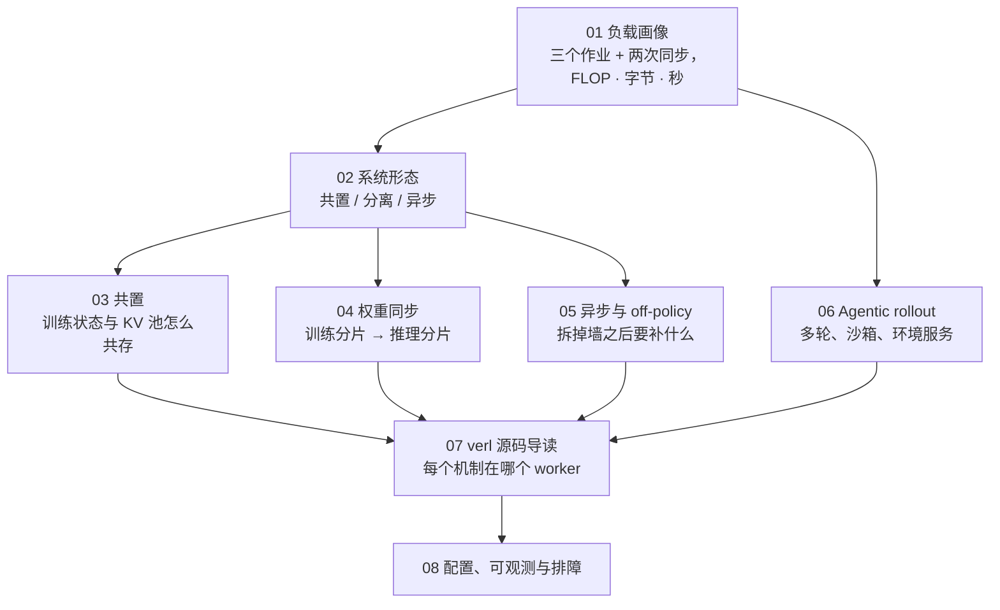
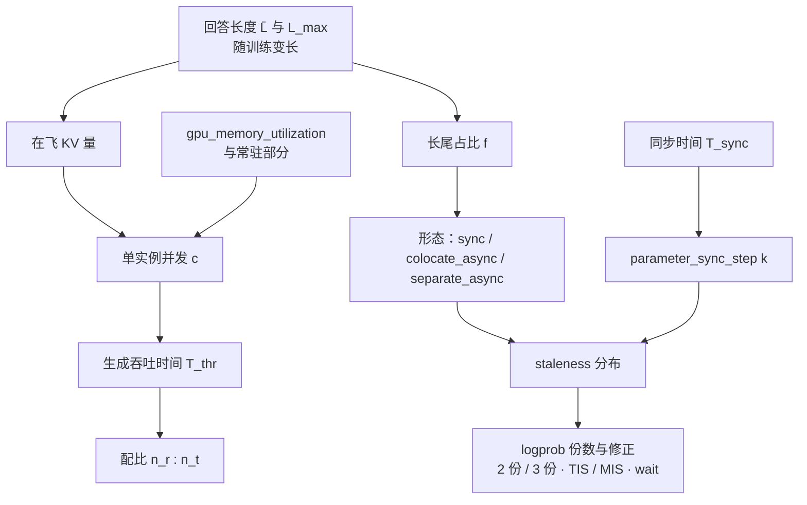

八篇正文回答了一个问题：**一个 RL 后训练任务同时是一个推理服务和一个训练任务，这两样东西怎样共享一组 GPU，而不让任何一方在等另一方**。第一篇把一步 RL 拆成三个作业加两次同步、算清 FLOP / 字节 / 秒三本账；第二篇把共置、分离、异步三种形态放在同一张账上比较；第三到第六篇各解决形态带来的一个问题——共置要切显存、任何形态都要同步权重、异步要补 off-policy 的修正、Agent 要调度环境；第七篇把每个机制落到 verl 的函数与进程上，第八篇把前七篇变成配置推导、指标面板与故障表。八篇反复回到同一个场景算账：Llama-3-8B、$$B = 512$$、$$G = 16$$、$$\bar L = 8\text{K}$$、64 × H100，一步 810 秒、全步 MFU 13%。

本文不讲新内容，做三件事：把八篇压成一张表与八段回顾，把贯穿八篇的几条线拎出来，然后给一套三段式的通关自测——判断与计算、跨篇综合、面试题。各篇末尾的自测检验的是"这一篇读懂了没有"，这里检验的是"八篇能不能连起来用"。第八篇末尾那节系列总结的内容（八篇回顾、三种能力、趋势与边界）也并入本文。

> **读完这八篇，你应该能回答哪些问题？[^q0] 哪些数字与结论必须能脱口而出？[^q1] 怎么判断自己是"读过"还是"掌握"了？[^q2]**

先把整个系列放在一张图上——箭头是**推导或前置上的依赖**（箭头尾端的结论被箭头头端当作前提），不是阅读顺序：

## 一、总览：系列回答的问题与主线

系列的一句话主张是：**RL 训练的一步是三个形态不同的作业加两次同步，把它们的算力、显存、时间与两次同步的字节数追踪清楚，系统形态、权重同步、异步、环境调度都是在这张账上做交换**。生成是 memory-bound 的 decode、训练是 compute-bound 的 GEMM，两者对 GPU 的用法相反、对显存的要求互斥，中间还隔着两道同步的墙——公开报告里 rollout 占墙钟的 60–80%、GPU 利用率常在 30% 以下，全部来自这个结构。八篇的顺序是"先算账、再定形态、再解决形态带来的问题、最后读源码与配置"，账本线（FLOP · 字节 · 秒）、形态线（共置 / 分离 / 异步）、框架线（verl，末尾对照 slime 与 AReaL）三条线索交织。

| 篇 | 回答的问题 | 一句话结论 | 必记的数字 / 公式 |
|---|---|---|---|
| [第一篇：负载画像](/rl-step-anatomy-rollout-reward-train.html) | 8B、$$B = 512$$、$$G = 16$$、$$\bar L = 8\text{K}$$、64 张 H100 做 GRPO：生成多少 token、多少 KV、分几波？三段各多少 GPU·秒？利用率上限？ | 一步 = 三个作业 + 两次同步；FLOP 上训练占一半、生成六分之一，时间上生成占四分之三——decode 每步把整块 HBM 读一遍 | 每 token 约 $$12N_a$$；一步 6.8 EFLOP；KV 9.3 TB、分 1.4 波；decode 步 ≈ 36 ms；生成 602 s（长尾 196）+ 前向 72 + 训练 136 = 810 s；全步 MFU 13%（对话场景 29%） |
| [第二篇：系统形态](/rl-system-topologies-colocate-disaggregate-async.html) | 同样 64 卡，共置、分离、异步各是多少墙钟与利用率？长尾变大时哪种先撑不住？ | 三种形态是同一张账上的三种交换；同步分离比共置更差；异步 ≈ 共置 − 长尾；共置对长尾线性敏感、异步不敏感 | 共置 810 s / 13%，同步分离 1501 s / 7%，一步流水 764 s / 14%，异步 619 s / 17%；$$f$$ 从 10% 到 70%，异步 / 共置 1.07× → 2.55×；verl 实验 2.35–2.67×；配比 $$n_r / n_t = T_{gen}^{(n)} / T_{train}^{(n)}$$，异步 2 : 1（42 : 22） |
| [第三篇：共置](/colocated-trainer-and-rollout-engine-memory-handoff.html) | 32B 在 8 卡共置，每步两次显存换手搬多少字节、走哪条链路、几秒？是 2% 还是 20%？ | 让渡有搬 / 丢 / 不动三种；`CuMemAllocator` 摘物理页保虚拟地址；切换 < 2%，真实代价是常驻部分挤掉的 KV 池 | 每步约 130 GB、6.5 s（4 s 是优化器状态往返）；`gpu_memory_utilization` 0.5 → 0.85 让 8B 生成 745 → 610 s；pinned 内存 32B/8 卡 520 GB；边界 $$16N / n \le 70$$ GB |
| [第四篇：权重同步](/weight-sync-from-training-shards-to-inference-shards.html) | Megatron TP4 / PP2 / EP8 的 671B → vLLM TP8 / EP4 的 FP8 副本，跨机一次同步做哪几步、传多少、几秒？增量省多少？ | 同步 = 布局 + 传输两半，中间是 HF 名字的 `(name, tensor)` 流；"谁持有完整模型"比链路快慢重要；增量让没有人持有完整模型 | FP8 传 $$N$$ = 671 GB；朴素经 rank 0 60–80 s（理论下界 13 s）、多源 12–20 s；235B 全量 246–266 s vs delta 11–15 s（21×）；dense 每步 1–3% 变化、MoE 0.02–0.05%；bucket 512 MB、峰值 2 bucket；bubble $$= T_{sync} / (k T_{mb} + T_{sync})$$ |
| [第五篇：异步与 off-policy](/async-rl-staleness-partial-rollout-and-off-policy-correction.html) | 同步换成 $$k \le 2$$ 的异步后 reward 斜率变缓，是 staleness、训推不一致还是缓冲淘汰？事前记什么信号？ | "样本过期"是三个东西，reward 曲线上不可分、事前记录的信号上可分；修正的系统要求是 logprob 的份数 | $$s \approx \lfloor (\text{生成用时} + \text{等待}) / T_{sync} \rfloor$$，长回答 $$s$$ 更大；阈值默认 8；$$s \le 2$$–4 配修正无损；不一致 dense $$10^{-3}$$、FP8 $$10^{-2}$$、MoE 路由翻转单 token > 1；TIS $$\min(w, 2)$$；部分 rollout 重 prefill ≈ 一步 FLOP 的 6%；decoupled PPO 3 份 logprob |
| [第六篇：Agentic rollout](/agentic-rollout-multi-turn-tools-sandboxes-and-environment-services.html) | 500 任务 × $$G = 8$$ × 20 轮、每轮几十秒测试：多少次容器执行、多少 CPU·小时、多少并发沙箱？GPU 在做什么？ | rollout 变成分布式系统；KV 驻留决定 prefill 是二次还是线性；沙箱是第三个池；环境方差让异步成必需 | 8 万次执行；667–1300 CPU·h；1300–1800 并发沙箱；32 卡 30 分钟里 decode ≈ 500 s、prefill 160–1600 s；每卡 650 token/s；训练侧 15 EFLOP；八成 token 来自环境 |
| [第七篇：verl 源码导读](/verl-source-walkthrough-from-a-grpo-config-to-every-worker.html) | 一个 bf16 参数从优化器更新完成到推理引擎用它生成下一个 token，经过哪些函数、进程、链路？ | 十二步、四类进程、三条链路；共置 = 一个进程持有多个角色对象；TransferQueue 是同步与异步统一的解耦点；slime 薄、AReaL 异步优先 | `@register` 只挂属性、`_bind_worker_method` 生成组方法；`_step_once` 九个阶段；non-naive 同步七步；`create_colocated_worker_cls` + `spawn`；三家趋同的四段是必然 |
| [第八篇：配置、可观测与排障](/rl-post-training-configuration-observability-and-troubleshooting.html) | 凌晨两点 reward 平台、步时间不变、无报错：十分钟内区分四个嫌疑，信号开训前采了没有？ | 六步推导、全步 MFU 瀑布、RL 状态的 checkpoint、确定性、必采指标、故障表；排查顺序是数据 → 版本 → 异步 → 实现 | 32B / 128 卡算例：80 : 48、一步 ≈ 1170 s、MFU ≈ 20%；瀑布 100% − 64% − 13% − 4% − 0.1% ≈ 13%；671B checkpoint 10.7 TB 写 18 分钟；`full_determinism` 要求 `use_v1=false` |

Table: 八篇的核心问题、结论与必记公式

### 1. 本文的章节安排

| 章 | 内容 |
|---|---|
| 二 | 逐篇回顾：核心问题、结论、必记、常见误解 |
| 三 | 贯穿八篇的五条线：长尾、谁持有完整模型、版本号与 logprob 份数、配比按时间且会漂、推理引擎的三个接口 |
| 四 | 常见误区表 |
| 五 | 通关自测：A 判断与计算 10 题、B 跨篇综合 5 题、C 面试题 8 题、D 掌握判据 |
| 六 | 下一步 |

Table: 本文的章节安排

## 二、逐篇回顾

### 1. 第一篇：负载画像——一步 RL 里发生什么

**核心问题**：一个 8B 策略模型，$$B = 512$$、$$G = 16$$、$$\bar L = 8\text{K}$$，在 64 张 H100 上做 GRPO：一步生成多少 token、多少 KV、要分几波？三段各要多少 GPU·秒？GPU 平均利用率的理论上限是多少？

**结论**：在线 RL 的一步是三个形态不同的作业加两次同步——生成是 serving 作业（decode 为主，受 HBM 带宽限制，按序列数扩展），打分是一次前向或一个外部服务，训练是常规分布式训练步（受算力限制，按 token 数扩展）；两次同步是样本进训练器、新权重回推理引擎。FLOP 账每 token 约 $$12N_a$$：生成 $$2N_a$$、旧策略重算 / 参考 / RM 三个前向各 $$2N_a$$、训练 $$6N_a$$——训练占一半、生成只占六分之一。但时间不按 FLOP 分：KV 池填满后一个 decode 步就是把整块 HBM 读一遍，$$t_{step} \approx 0.9M / (BW \cdot \eta_{bw}) \approx 36$$ ms，与模型大小和序列长度无关，长思维链下 decode MFU 只有个位数；加上长尾——最后一波里最长的回答多走 $$L_{max} - \bar L$$ 步——生成占了一步的四分之三。字节账上训练状态 $$16N$$ 均分后不是问题，KV cache（$$T_{all} \times k_{kv}$$）是集群显存的近两倍，rollout 必须分波。它是唯一把 serving 作业放进训练循环的负载。

**必记**：

- 8B 推理场景：$$S = 8192$$ 条序列、回答 6710 万 token；FLOP 6.8 EFLOP（生成 15.9%、两个前向各 16.8%、训练 50.5%）；PPO 再加 $$8N_a$$。
- KV 9.33 TB 对 64 卡 5.1 TB 显存；单实例并发 $$c = \lfloor (0.9tM - \text{权重副本}) / ((P + \bar L/2) k_{kv}) \rfloor \approx 92$$，分 1.4 波。
- 时间：生成 602 s（吞吐 406 + 长尾 196）、前向 72 s、训练 136 s、切换 0.2 s、同步 0.3 s；一步 810 s；生成 74%、训练 17%、前向 9%。
- 全步 MFU $$= F / (n \cdot F_{peak} \cdot T_{step}) = 13\%$$；对话场景 29%、32B 推理 18%、DeepSeek-V3 规格 19%。
- 前缀缓存对单轮 RL 省 KV 不省 FLOP；旧策略重算是六分之一 FLOP、8% 时间，为训推不一致而付。
- 卡数翻倍墙钟只降 35%（810 → 523 s）：长尾 196 s 不随卡数缩短。

**常见误解**："训练 FLOP 占一半，所以训练是瓶颈"——时间上生成占四分之三，RL 系统的效率由 rollout 决定，FLOP 一侧几乎没有杠杆。另一个："全步 MFU 越高越好"——PPO 加价值模型让 MFU 从 13.3% 升到 18.1%，墙钟却多 22%；看效率要看墙钟。

### 2. 第二篇：系统形态——共置、分离与异步

**核心问题**：同样 64 张卡、同样的 GRPO 配置，共置、分离与异步三种形态下，一步的墙钟与 GPU 利用率各是多少？回答长度的方差从小变大时，哪种形态先撑不住？

**结论**：三种形态不是三个框架的默认值，是同一张账上的三种交换：共置用显存切换换"每个阶段用满全部卡"，分离用固定配比换"两侧各用合适的并行配置、可以重叠"，异步用样本过期换"没有人等"。把 64 张卡切成两池、两边仍一步一步同步地轮流，是最差的安排——任一时刻只有一个池在干活，46 : 18 时一步 1501 秒；分离的价值只在重叠，而重叠至少引入一步 off-policy。异步把批的概念在 rollout 侧拆掉，完成一条进一条缓冲，训练器取满就更新，长尾消失，一步 619 秒——从 810 省下的 191 秒几乎就是长尾的 196 秒，**异步 ≈ 共置 − 长尾**。所以共置对长尾线性敏感、一步流水几乎同样敏感、异步不敏感，且卡越多共置的长尾浪费越大。编程模型上，HybridFlow 的单控制器 + worker 组把算法数据流与分布式计算分开，形态的差别只在 worker 组到资源池的映射；verl v1 的 `sync` / `colocate_async` / `separate_async` 共享控制流与 replay buffer，`sync` 到 `colocate_async` 只多 `abort` / `resume` 两个调用。

**必记**：

- 8B 推理场景：共置 810 s / 13%；同步分离 1501 s / 7%；分离 + 一步流水 764 s / 14%；异步（42 : 22）619 s / 17%。
- 长尾占比 $$f = T_{tail} / (T_{thr} + T_{tail})$$，异步收益 $$\approx 1 / (1 - f \cdot T_{gen} / (T_{gen} + T_{train}))$$；$$f$$ 10% → 1.07×、33% → 1.32×、50% → 1.66×、70% → 2.55×、85% → 4.9×。
- verl `fully_async` 公开实验（7B、28K 上限、DAPO）：2.66× / 1.92× / 2.35×；共置 32 → 128 卡步时间只从 790 降到 356 s。
- 最优配比 $$n_r / n_t = T_{gen}^{(n)} / T_{train}^{(n)}$$，按时间不按 FLOP（FLOP 会得出 1 : 3，时间是 2 : 1，方向相反）；随回答变长而漂，靠 `idle_ratio` 动态调。
- 单控制器的代价：数据经控制器（v1 用 TransferQueue 只传元数据）、每次调用的同步点（server 模式绕开）。
- `separate_async` 的断言：`train_batch_size == parameter_sync_step × ppo_mini_batch_size`——"一步"被重新定义为 $$k$$ 次 mini-batch 更新 + 一次同步。

**常见误解**："分离总比共置省时间"——同步分离比共置慢将近一倍。另一个："按 FLOP 定 rollout : train 的配比"——会把 rollout 池配得严重不足。

### 3. 第三篇：共置——训练器与推理引擎在同一组 GPU 上共存

**核心问题**：一个 32B 模型在 8 卡共置，每步生成前要把 16 字节/参数的训练状态搬走、把 KV 池建起来，训练前再反过来。每个动作搬多少字节、走哪条链路、要几秒？步时间 5 分钟时这是 2% 还是 20%？

**结论**：一张卡在一步里换两次主人：训练时 $$16N$$ 均分的训练状态加参考模型，生成时推理权重副本加 KV 池，32B/8 卡两侧合计 120 GB 以上。让渡只有三种做法——搬到 CPU（FSDP / Megatron 的 offload、vLLM sleep level 1 的权重）、丢弃再重建（level 2 的权重、KV 池，新权重反正要来）、不动（CUDA graph 池、NCCL 缓冲、CUDA context）。vLLM 的 `CuMemAllocator` 用 CUDA 虚拟内存 API 把物理页摘下而保留虚拟地址，所以 CUDA graph、模型对象、KV 块表都不用重建，按标签 `weights` / `kv_cache` 可以分开唤醒——verl 的顺序是先挂权重、同步、offload 训练器参数、最后挂 KV 池。搬运时间在任何合理配置下都不到 2%，真实代价是两方常驻的东西挤掉的 KV 池：`gpu_memory_utilization` 在启动时一次定死块数，共置默认 0.5 让 8B 的生成时间多四分之一。

**必记**：

- 32B / 8 卡：优化器状态 + fp32 主参数 49 GB、bf16 分片 8 GB、参考模型 8 GB 每卡，PCIe pinned 25 GB/s，一步约 130 GB、6.5 s，其中 4 s 是优化器状态往返；步时间 5 分钟时 2%。
- 8B / 64 卡 2.3 GB × 2、0.2 s；DeepSeek-V3 规格 / 256 卡 47 GB × 2、3.8 s——没有一行超过 2%。
- `gpu_memory_utilization` 1.0 / 0.85 / 0.7 / 0.5：8B 生成 602 / 610 / 645 / 745 s；训练侧两个 offload 都开、CUDA graph 只捕获小 batch，可开到 0.8–0.85。
- sleep level：0 只停调度、1 权重备份到 CPU、2 全丢（RL 默认；LoRA、MTP 草稿、NPU 退回 1）。
- pinned 内存：8 卡 × (8 + 49 + 8) GB = 520 GB；70B 在 8 卡上 $$16N = 1.1$$ TB 放不下。
- 共置同步走进程内：逐参数 all-gather → 512 MB bucket → CUDA IPC，峰值两个 bucket；8B 0.3 s、32B 1 s、几百 B 的 MoE 几十秒。

**常见误解**："共置的代价是切换耗时"——它排在隐性代价的最后一位，第一位是 KV 池上限。另一个："sleep 之后 CUDA graph 要重捕获"——虚拟地址不变，图仍有效，这正是每步只花几秒而不是几分钟的前提。

### 4. 第四篇：权重同步——从训练分片到推理分片

**核心问题**：训练器是 Megatron TP=4、PP=2、EP=8 的 671B MoE，推理引擎是 vLLM TP=8、EP=4 的 FP8 副本，两边在不同机器。一次同步要做哪几步映射、传多少字节、走哪条链路、至少几秒？增量同步能省多少？

**结论**：同步是两件事。**布局**把训练分片翻译成 HF 名字与形状的张量流——Megatron-Bridge 做 mcore → HF（拆交错的 QKV、拆 gate / up、专家本地编号 → 全局编号、PP 层号偏移），FSDP 只需 concat；专家在 EP rank 上本来就完整，天然是点对点的形态。**传输**把这个 `(name, tensor)` 流送到每张推理卡：CUDA IPC（同卡）、NCCL 广播（固定集群、临时进程组）、NIXL / Mooncake 的 RDMA 环（弹性、异构、多源）、经 CPU 的 P2P + 节点内广播（MoonshotAI checkpoint-engine）、经 checkpoint 中转。朴素路径"逐参数 all-gather → rank 0 广播"的代价是全模型经过一个点：一张网卡加 rank 0 物化，235B 要四分多钟，这项与网络快慢无关。分桶 512 MB 让通信次数与峰值显存都与模型大小无关，双缓冲让填 / 传 / 装重叠。量化传输在训练侧按推理 scheme 在线量化，字节减半，scale 是必须一起传的权重。增量同步 `delta_sharded` 让每个 rank 对自己的分片做 bit-exact diff、稀疏 gather、原地覆盖——省的不只是字节，是"没有人持有完整模型"。

**必记**：

- 671B FP8 传 $$N$$ ≈ 671 GB（bf16 是 $$2N$$ = 1.34 TB）；朴素经 rank 0 60–80 s（理论下界 671 / 50 = 13 s，实测有效 8–10 GB/s）；多源 / P2P 12–20 s；1T 模型千卡约 20 s。
- verl 基准：Qwen3-30B-A3B 61 GB 跨 4 节点 IB，NCCL 与 NIXL 各约 7 s（8–9 GB/s）。
- delta vs 全量：7B 3.9–4.9 vs 5.5–6.0 s；32B 11.2–11.9 vs 17.7–18.1 s；72B 12–13 vs 28.5–29.1 s；235B 11.4–14.9 vs 246–266 s（约 21×）；32B 到 235B 几乎持平。
- 变化比例：dense 每步 1–3%，235B MoE 早期 0.02–0.05%（bf16 尾数 8 位，更新小于 $$2^{-8}$$ 被舍掉）。
- 同步形态下占步时间 10% 以上就该上增量（671B 全量 80 s 对 650 s 的步是 12%）；异步空转 $$= T_{sync} / (k T_{mb} + T_{sync})$$：32B 全量 15 s、$$T_{mb} = 60$$ s，$$k = 1$$ 时 20%、增量 6 s 时 9%。
- 权重之外的权重：量化 scale、MTP 草稿、LoRA 合并态、`named_buffers`、tied embeddings、MLA 吸收后的张量、KV / prefix cache；版本号只在同步成功后推进。

**常见误解**："同步慢是因为网络慢"——换更快的网只快一张卡，瓶颈是谁持有完整张量。另一个："增量同步只在大模型上有意义"——0.5B 上也快 1.3 倍，因为全量 all-gather 与 rank 0 物化这两项固定开销消失了。

### 5. 第五篇：异步与 off-policy——把同步的墙拆掉之后要补什么

**核心问题**：从同步换成 $$k \le 2$$ 的异步，一步的墙钟从 12 分钟降到 5 分钟，但 reward 曲线的斜率变缓了。是 staleness、是训推不一致、还是缓冲区淘汰规则？要区分这三个原因，需要事前记录哪些信号？

**结论**："样本过期"是三个不同的东西。**staleness**：样本由 $$t - k$$ 步的权重生成，$$\rho$$ 偏离 1、clip 大量触发、有效 batch 变小；它与回答长度正相关（长回答生成慢），所以 `drop` 策略系统性地丢长回答，`wait` 无偏但训练器要等，部分 rollout 让长回答跨版本续接、每段 $$s$$ 都小，代价是续接时对已生成前缀重 prefill 与分段的 $$\pi_{old}$$（强制用推理侧 logprob）。**训推不一致**：同一份权重，推理引擎与训练器算出的 $$\log \pi$$ 本来就不同，同步形态下也存在，只是被重算藏起来了；FP8 与 MoE 路由翻转让它从无害噪声变成系统偏差，修正是 token 级的 TIS（截断）或 MIS（屏蔽）。**缓冲淘汰**：drop / wait、DAPO 过滤、失败组，每一类都改变分布且比例随训练变化，流式的完成顺序（先短后长）是第三种偏置。三者在 reward 曲线上不可分、在事前记录的信号上可分。算法修正的系统要求是 logprob 的份数：重算（2 份，修不一致不修 staleness，部分 rollout 下不成立）、不重算（2 份，反之）、decoupled PPO（3 份 behave / prox / $$\theta$$，两者都修，verl 用 CPU 快照切换实现）。

**必记**：

- $$s = \lfloor (\tau_i + w_i) / T_{sync} \rfloor$$；8B 场景 $$T_{sync} \approx 150$$ s 时 2K / 8K / 32K 回答的典型 $$s$$ 为 0 / 1 / 4——阈值 2 配 `drop`，32K 几乎全丢。
- 三种上限：verl `max_off_policy_threshold`（版本数，默认 8，消费端）、AReaL `max_head_offpolicyness`（准入端，建议 2–8）、meituan `staleness_threshold`（比例）。
- 公开消融：AReaL decoupled 后 $$s = 4$$ 基本无损、8 略降，最高 2.77× 加速；verl 0 / 0.1 / 0.3 / 0.5 档 400 步 25.9 / 20.0 / 17.3 / 17.4 小时。结论 $$s \le 2$$–4 配修正基本安全，换任务要重验。
- 不一致量级：浮点顺序与 kernel $$10^{-3}$$（无害）、FP8 $$10^{-2}$$ 起、MoE 路由翻转单 token 可到 1 以上（1–5% 的 token）；TIS $$\min(w_t, 2)$$；`rollout_probs_diff` 在同步形态下就要开着作基线。
- 部分 rollout 重 prefill：8B 场景约 6000 条 × 平均 4K ≈ 0.4 EFLOP，一步 FLOP 的 6%，每次同步都付。
- $$k$$ 越大同步越少、版本数意义的 staleness 越小，但每版本的参数变化越大——两种计法都要看。

**常见误解**："drop 掉过期样本是中性的"——它按长度筛，对以更长思维链为目标的训练是直接偏置。另一个："训推不一致是异步带来的"——它在同步形态下就有，异步只是更倾向于不重算、让它直接进了重要性比。

### 6. 第六篇：Agentic rollout——多轮、工具、沙箱与环境服务

**核心问题**：500 个代码任务 × $$G = 8$$ × 20 轮，每轮跑一次几十秒的测试。一步 rollout 要多少次容器执行、多少 CPU·小时、并发多少个沙箱才能在 30 分钟内完成？GPU 这一侧在这 30 分钟里做了什么？

**结论**：rollout 从"推理引擎批量生成"变成一个分布式系统——推理服务、agent loop 协程、工具网关、沙箱集群、reward 服务、样本缓冲；一条样本是几十轮、几万 token 的轨迹，八成 token 来自环境（`response_mask = 0`，不进 loss 但过前向 + 反向）。推理引擎侧，前缀缓存把 prefill 从二次降到线性（十倍），但命中的前提是 KV 块还在显存里：几千条 40K 轨迹的 KV 是 KV 池的十倍以上，等环境的 30 秒里被 LRU 逐出，默认配置下 prefill 接近"没有缓存"的账，KV 卸载到主机内存 / 外部存储是主要出路；粘性路由是前缀缓存的前提也是负载不均的来源；低并发 + 长上下文让 decode 变成 KV 带宽受限。沙箱是有状态的（整条轨迹占着一个）、隔离要求高于 CI（沙箱边界就是 reward 边界）、镜像按任务，**沙箱并发数是第三个配比变量**。环境与 reward 服务化之后，模型也以 OpenAI / Anthropic 兼容接口暴露，现成的 harness 可以直接接进训练（uni-agent 网关）。长尾来自环境方差，$$f$$ 轻易到 0.8 以上，同步形态不可用；部分 rollout 只能在生成中或轮边界，轨迹跨的版本数更多，decoupled loss 接近必需。token 连续性（只拼接新增 token、不整体重编）是 Agent RL 特有的训推不一致。

**必记**：

- 4000 条轨迹 × 20 轮 = 8 万次执行；667 CPU·h（1 核）/ 1300（2 核）；一条轨迹墙钟 ≈ 800 s；30 分钟内完成要 1800 个有状态沙箱或 1300 个可释放沙箱；约 45 台 80 核机器对 4 台 8 卡机器——CPU 机器数是 GPU 机器数的十倍、按价格同量级。
- GPU（32 卡）：生成 32M token、decode ≈ 500 s（28%）；prefill 全命中 160M token / 160 s，全重算 1.6B token / 1600 s，KV 驻留下约 1400 s；训练要过 160M token，15 EFLOP——比单轮 8B 场景的 6.8 EFLOP 还多一倍。
- 每卡并发 31、上下文 20K：每步读 16 GB 权重 + 80 GB KV，48 ms，650 token/s，是单轮的四分之一。
- 一张卡 KV 池 50 GB，125 条轨迹 × 2.5 GB = 310 GB——六倍于池子，约六分之一命中。
- 轨迹跨版本 ≈ 轨迹墙钟 / 同步间隔 = 800 / 150 ≈ 5。
- verl：`AgentLoopBase.run` 协程、`LLMServerClient` 粘性、`BaseTool` 的 create / execute / calc_reward / release、Reward Loop、uni-agent 1000+ 并发会话；生成式 RM 在 `separate_async` 下必须独立池。

**常见误解**："Agent RL 是生成占 90%"——三段都重，外加一个 CPU 集群。另一个："开了前缀缓存 prefill 就是线性的"——命中率由 KV 驻留决定，默认配置下接近全重算。

### 7. 第七篇：verl 源码导读——从一个 GRPO 配置追到每个 worker

**核心问题**：一个 bf16 参数从优化器更新完成，到推理引擎用它生成下一个 token，在 verl 里经过哪些函数、哪些进程、哪条链路？slime 和 AReaL 在这条链的哪一段做了不同的选择？

**结论**：十二步、四类进程（driver、hybrid worker、vLLM server / EngineCore、AgentLoopWorker）、三条链路（Ray RPC、NVLink all-gather、CUDA IPC + ZMQ）。`@register(dispatch_mode)` 只在方法上挂属性，`RayWorkerGroup._bind_worker_method` 把它变成"切 / 发 / 收"的组方法，`nd_compute(mesh_name)` 让 FSDP 与 Megatron 共用分发；共置在代码里是 `create_colocated_worker_cls`——一个进程持有 actor / ref / rollout 多个角色对象、`spawn` 拆成多个句柄，不是两个进程共享一张卡。`ActorRolloutRefWorker` 三层（角色 / `TrainingWorker` / `BaseEngine`），RL 侧只调引擎的六七个方法，这就是本系列把训练器当黑盒的边界。rollout 是 `RolloutReplica`（等价一条 `vllm serve`）+ `vLLMHttpServer` + `LLMServerClient`；`_step_once` 九个阶段各一个 `marked_timer`，RL 算法全部在 `core_algos.py`。TransferQueue（元数据 + 存储）是 v1 能统一 sync 与 async 的前提——异步的本质是样本生产与消费解耦，解耦点就是这个 KV 存储；`ReplayBuffer.sample` 同一份代码两种节律。三家框架趋同的段落（服务化推理引擎、HF 张量流、缓冲、agent 函数）是这类系统的必然；不同的（抽象厚度、默认形态、staleness 控制点、修正是否默认、后端组合自由度）是取舍。

**必记**：

- 十二步：`train_batch` → `on_step_end` → `CheckpointEngineManager.update_weights`（naive）→ `ActorRolloutRefWorker.update_weights` → `wake_up(["weights"])` → `get_per_tensor_param`（all-gather）→ `BucketedWeightSender`（IPC + ZMQ）→ `update_weights_from_ipc` → `load_weights` → `wake_up(["kv_cache"])` + `reset_prefix_cache` + `set_global_steps` → agent loop 请求 → EngineCore decode（CUDA graph 地址未变）。
- 三个默认值决定形态：`trainer.use_v1: true`、`trainer.v1.trainer_mode: sync`、`hybrid_engine: true`；0.9 里 rollout 只有 server 模式。
- 一个 worker = 一张卡 = 一个进程；placement group `STRICT_PACK`，每 bundle `{"GPU": 1, "CPU": 1}`。
- non-naive 同步七步：abort → 临时组包住 replica → 释放 KV → 建进程组 → send ∥ receive → finalize → 恢复 KV、resume。
- `_compute_advantage` 是 driver 上唯一真的取张量的阶段。
- slime：只绑 Megatron + SGLang、参数透传、`train.py` 不到 200 行；AReaL：异步分离默认、准入端控制、decoupled PPO 默认；OpenRLHF 是 Ray + vLLM 的原型。

**常见误解**："共置是两个进程共享一张卡"——是一个进程里两个对象轮流用显存（vLLM 的 EngineCore 是另一个进程，但训练器与推理引擎句柄在同一个 hybrid worker 里）。另一个："选框架是选哪个更快"——三家在各自默认场景上吞吐接近，选的是取舍。

### 8. 第八篇：配置、可观测与排障——从一张卡的比例到一条 hang 的排查

**核心问题**：凌晨两点告警：reward 曲线从上升变成平台，步时间没变，没有报错。十分钟内要判断是 staleness 涨了、是训推不一致、是某个沙箱池挂了导致 reward 全为零、还是权重同步漏了一部分参数。需要的每一个信号，在开训前有没有采集？

**结论**：开训前按六步推导——账 → 形态与配比 → 训练侧并行 → 推理侧并行 → 同步后端 → 异步参数——每一步的输出是下一步的输入，故障有一半是某一步的输出与实际不符；两个刻意留下的错误是"配比算完要用每侧自己的卡数重算两侧时间"与"配比算出的训练卡数要用显存再校验"。全步 MFU 的分母是全部 GPU（含 rollout 池与 RM 池）× 峰值 × 墙钟，看它与预期值的差、差拆到哪几项才有意义，优化顺序是先砍长尾、再看 decode 的并发、最后才是训练 MFU——与预训练相反。RL 的 checkpoint 多出缓冲、在飞 prompt、各实例版本、沙箱状态，verl 的做法是存训练状态与元数据、丢缓冲、重发在飞。确定性是调试模式：`full_determinism` 让两次运行 reward 曲线 bitwise 对齐，代价是 v0 trainer 与确定性 kernel 的吞吐。那十分钟是一棵决策树：先看 reward 按源、再看每实例版本、再看 `rollout_probs_diff`、再看 staleness + 长度 + 同步耗时，都正常就是算法问题——系统侧能给算法侧的最大帮助是十分钟内证明"不是系统的问题"。

**必记**：

- 算例一（32B、128 卡）：共置一步 ≈ 1500 s、$$f = 38\%$$ → `separate_async`，配比 650 : 440 ≈ 3 : 2，凑整 80 : 48，一步 ≈ 1170 s（1.38×），预期 MFU ≈ 20%；`parameter_sync_step = 2`，空转 2.5%。
- 算例二（671B、512 卡）：按时间 384 : 128 但训练侧每卡 84 GB 放不下 → 256 : 256；沙箱并发 4000 级；同步 60–80 s 必须与生成重叠。
- 瀑布（8B、64 卡）：100% − 64%（decode memory-bound）− 13%（长尾）− 4%（前向 / 训练 MFU）− 0.1%（切换 + 同步）≈ 13%；实测常在 8–10%。
- checkpoint：8B 128 GB 13 s、32B 525 GB 53 s、671B 10.7 TB 18 分钟——大模型必须异步保存。
- 确定性来源七项；`full_determinism` 要求 `use_v1: false`、不被 batch-invariant 覆盖的模型 `max_num_seqs: 1`；确定性 kernel 训练慢 10–30%。
- 排查顺序：数据（reward 按源、长度、filtered 计数）→ 版本（每实例 `global_steps`、同步耗时）→ 异步（staleness、clipfrac、被 drop 的长度）→ 实现（py-spy、NCCL 日志）；前三步各两分钟看面板。

**常见误解**："reward 为 0 说明环境出错了"——0 是合法 reward，服务应返回错误码而不是 0，否则沙箱池挂了看起来就是"模型变差了"。另一个："先 py-spy"——实现问题排在最后，先看不需要读代码的三步。

## 三、贯穿全系列的几条线

### 1. 长尾：从一个数字到一种形态的判据

第一篇给出长尾的定义与量：最后一波里最长的回答多走 $$L_{max} - \bar L$$ 步，602 秒里 196 秒，且它不随卡数缩短——64 → 128 卡墙钟只降 35%，这是账里唯一不能用钱买的项。第二篇把它变成形态的判据：异步 ≈ 共置 − 长尾，收益几乎全部来自这一项，$$f$$ 从 10% 到 70% 对应 1.07× 到 2.55×，共置对它线性敏感、异步不敏感。第三篇给出共置的换挡阈值 $$f > 0.4$$ 至少换 `colocate_async`。

第五篇是长尾的另一面：吞掉长尾的手段——部分 rollout、流式缓冲——各自带来 staleness 的长度偏置、重 prefill、分段的 $$\pi_{old}$$；`wait` 策略无偏，但等的就是长尾，把异步的收益又还回去一部分。第六篇把长尾的来源从回答长度换成环境耗时，$$f > 0.8$$，共置同步在第二篇的表里是 3014 秒对 614 秒，异步从优化变成必需。第八篇的 MFU 瀑布里长尾是 −13% 那一项，排在 decode memory-bound 的 −64% 之后、任何训练侧优化之前——先砍长尾，与预训练的优化顺序相反。

### 2. 谁持有完整模型：字节账的一条暗线

第一篇的字节账说训练状态 $$16N$$ 均分后每卡 2 GB 不是问题，问题是推理权重副本每实例一份完整、KV 是集群显存的近两倍——"哪里放着一份完整的东西"从这里开始成为主线。第三篇的共置里，两方都要"尽量大"的那块显存（KV 池 vs 训练状态 + 激活）只能换手，常驻的部分（CUDA graph 池、两套 NCCL 缓冲、allocator 保留段）谁也让不出去，它们挤掉的 KV 池才是共置的真实代价；pinned 主机内存（32B/8 卡 520 GB）是训练状态在 CPU 上的那份完整拷贝。

第四篇把这条线推到极致：朴素同步慢不是因为网络慢，是"全模型经过 rank 0 一张网卡并在它上面物化"；分桶让峰值显存与 $$N$$ 无关；增量同步的本质不是省字节，是没有任何 rank 持有完整模型，所以 0.5B 也快 1.3 倍、235B 快 21 倍且从 32B 到 235B 持平。第八篇的算例二把它变成配置约束：按时间算出的 384 : 128 在显存上放不下（训练侧每卡 84 GB），要取两个约束的交集——671B 这个规模显存约束几乎总是先到；pinned 内存要把 offload、decoupled 快照、异步 checkpoint 缓冲三者合算。

### 3. 版本号与 logprob 的份数：正确性的两根线

第一篇留下一个伏笔：多数框架默认重算旧策略 logprob，付 $$2N_a$$、8% 的时间，为的是训推不一致——推理引擎算出的 $$\log \pi$$ 与训练器的不同。第四篇在同步的末尾加上 `set_global_steps`：同步是版本号唯一的推进点，同步失败一半而版本号推进了比同步慢危险得多。第五篇把两根线接起来：staleness 按版本数算（$$s = \lfloor (\tau + w) / T_{sync} \rfloor$$），版本号错一步全部统计错一步；修正的系统要求是 logprob 的份数——重算 2 份修不一致、不重算 2 份修 staleness、decoupled 3 份两者都修——而部分 rollout 下重算是错的（分段的 behave 策略只有推理侧逐 token 记录的 logprob 才对），所以异步系统默认不重算、不一致直接进重要性比。

第六篇让轨迹跨的版本数更多（≈ 5），decoupled 接近必需，并加了一种不是数值的不一致——token 序列本身不一致（重新 tokenize 不幂等、chat template 轮边界）。第七篇把版本号一路带到 TransferQueue 的 tag，让 `ReplayBuffer` 能算 staleness；AReaL 的分歧点正在这里——版本对齐是 API 的一部分、三份 logprob 是默认。第八篇的十分钟决策树里，"每实例版本"是第二步，`rollout_probs_diff` 是第三步，`full_determinism` 下它应接近纯精度差 $$10^{-3}$$；故障表里"实例版本漂移"与"sleep / wake 后静默错误"都是这两根线的断点。

### 4. 配比按时间、且会漂

第一篇结尾就说账是动态的：R1 一类的训练里回答长度从几百涨到上万，第一步适用的配比到第五百步可能让训练器空转一半。第二篇给出静态解 $$n_r / n_t = T_{gen} / T_{train}$$，强调按时间不按 FLOP（方向相反：FLOP 1 : 3、时间 2 : 1），并给出动态调的两条路——弹性 rollout 实例、训练池兼职 rollout（`HybridEngineMode`），后者意味着分离形态的训练池自己就是一个小共置系统。第四篇加上同步时间对配比的反向约束：$$T_{sync} / (k T_{mb} + T_{sync})$$ 决定 $$k$$ 能开多细，同步越快 staleness 越低而不多付空转。

第五篇说 $$k$$ 与 staleness 的关系有两种计法（版本数 vs 参数距离），第六篇加进第三个配比变量——沙箱并发数，以及生成式 RM 的第四个 GPU 负载，rollout : train 在 Agent RL 里更接近 1 : 1。第八篇把它们收成六步推导，并留下两个常犯的错：配比算完要用每侧自己的卡数重算两侧时间（一步是两侧的最大值，不是按比例缩短的总时间），以及用显存校验训练卡数。

### 5. 推理引擎的三个接口

第一篇划定边界：本系列只用推理引擎的三个接口——批量生成、让渡显存、加载权重——与它的吞吐特性。第二篇让"批量生成"变成 server 模式的持续服务，绕开单控制器的同步点。第三篇是"让渡显存"：sleep / wake_up 按 `weights` / `kv_cache` 标签分区，`CuMemAllocator` 保虚拟地址，SGLang 的 `torch_memory_saver` 同一机制。第四篇是"加载权重"：`load_weights` 接 HF 名字的张量流、按自己的 TP / EP 切出分片，加上 `reset_prefix_cache` 与版本号。第六篇让"批量生成"再长出 OpenAI / Anthropic 兼容的一面，现成 harness 接进来，网关重建 token 序列。第七篇的结论是这三个接口在三家框架里写法趋同——是必然，不是 verl 的选择；第八篇说趋势是 vLLM 与 SGLang 把它们做成一等 API，训练框架的适配层会变薄。

| 概念 | 出现的篇 | 关系 |
|---|---|---|
| 长尾 $$L_{max} - \bar L$$、$$f$$ | 一、二、三、五、六、八 | 一定义与量；二变成形态判据；三给换挡阈值；五给吞掉它的代价；六换成环境方差；八进 MFU 瀑布 |
| decode 步 ≈ 36 ms、并发 $$c$$ | 一、三、六、八 | 一建带宽模型；三说 `gpu_memory_utilization` 决定 $$c$$；六说长上下文让 KV 主导每步；八给推理侧并行配置的原则 |
| $$16N$$ 训练状态、KV 池、pinned 内存 | 一、三、四、八 | 一算四份显存；三算换手与常驻；四算 bucket 峰值与 rank 0 物化；八用显存校验配比、合算 pinned |
| HF 张量流 `(name, tensor)` | 三、四、七 | 三在共置下 all-gather + IPC；四加布局映射与跨机传输；七落到 `get_per_tensor_param` 与 checkpoint engine |
| 版本号 `global_steps` | 四、五、六、七、八 | 四说只在同步成功后推进；五按它算 staleness；六说轨迹跨约 5 个版本；七带到 tag；八是十分钟的第二步 |
| logprob 份数与 `rollout_probs_diff` | 一、四、五、七、八 | 一说重算为不一致而付；四说 FP8 量化是来源；五给 2 / 3 份与 TIS / MIS；七在 `_compute_old_log_prob` 算差；八是十分钟的第三步 |
| 配比 $$n_r : n_t$$ | 一、二、四、六、八 | 一说账动态；二给时间比与动态调；四给 $$T_{sync}$$ 对 $$k$$ 的约束；六加沙箱与 RM；八给六步与两个常错 |
| 部分 rollout（abort → update → resume） | 二、三、四、五、六、七 | 二是异步的最后一档；三说续接要重 prefill；四说同步时必须 abort 或 drain；五算代价与分段 $$\pi_{old}$$；六说边界只能在轮间；七是 checkpoint engine 的七步 |
| 单控制器 + worker 组、TransferQueue | 二、七 | 二给编程模型与代价；七给 `@register`、`_bind_worker_method`、`KVBatchMeta` 的实现 |
| 沙箱与环境服务 | 一、六、八 | 一说八成 token 来自环境、加一列 CPU·小时；六算环境账与配比；八进 checkpoint、故障表与平台要求 |

Table: 贯穿八篇的概念及其关系

## 四、常见误区

| 误区 | 为什么错 | 正确的说法 | 出处 |
|---|---|---|---|
| 训练 FLOP 占一半，所以 RL 的瓶颈在训练 | decode 是 memory-bound、MFU 个位数，时间不按 FLOP 分 | 时间上生成占四分之三，效率由 rollout 决定 | [第一篇](/rl-step-anatomy-rollout-reward-train.html) |
| 加卡就能按比例缩短 rollout | 长尾取决于最长那条序列，不取决于卡数 | 64 → 128 卡墙钟只降 35%，长尾 196 s 一秒不少 | [第一篇](/rl-step-anatomy-rollout-reward-train.html) |
| 全步 MFU 越高系统越好 | PPO 多出的价值模型 FLOP 是"好算的活"，MFU 升、墙钟也升 | 看墙钟，MFU 只是分母的注脚（13.3% → 18.1%，墙钟 +22%） | [第一篇](/rl-step-anatomy-rollout-reward-train.html) |
| 分离比共置省时间 | 两池同步地轮流，任一时刻只有一个池在干活 | 同步分离 1501 s 比共置 810 s 更差；分离的价值只在重叠 | [第二篇](/rl-system-topologies-colocate-disaggregate-async.html) |
| rollout : train 按 FLOP 配 | FLOP 上训练是生成的 3 倍，时间上生成是训练的 2 倍 | 按时间配，异步 2 : 1；且随回答变长而漂 | [第二篇](/rl-system-topologies-colocate-disaggregate-async.html) |
| 共置的代价是显存切换的秒数 | 任何合理配置下切换 < 2% | 真实代价是 KV 池只有半张卡：0.5 让 8B 生成 602 → 745 s | [第三篇](/colocated-trainer-and-rollout-engine-memory-handoff.html) |
| sleep 之后 CUDA graph 要重捕获、KV 块表要重建 | `CuMemAllocator` 只摘物理页、虚拟地址不变 | 图、模型对象、块表都幸存；要补的是 `named_buffers`、fp8 KV scale、prefix cache | [第三篇](/colocated-trainer-and-rollout-engine-memory-handoff.html) |
| 权重同步慢是网络带宽不够 | 朴素路径让全模型经 rank 0 一张网卡并在它上面物化 | 235B 全量 246–266 s 大部分与网络无关；多源 / 增量才是解 | [第四篇](/weight-sync-from-training-shards-to-inference-shards.html) |
| 增量同步省的是传输字节 | 0.5B 上也快 1.3 倍，字节比例解释不了 | 省的是"没有人持有完整模型"——全量 all-gather 与 rank 0 物化消失 | [第四篇](/weight-sync-from-training-shards-to-inference-shards.html) |
| 异步的代价只是"样本过期一点" | staleness、训推不一致、缓冲淘汰三者机制不同、信号不同 | 在 reward 曲线上不可分，要事前记录三组信号 | [第五篇](/async-rl-staleness-partial-rollout-and-off-policy-correction.html) |
| drop 掉过期样本是中性的随机丢弃 | staleness 与回答长度正相关 | drop 系统性地丢长回答；用 wait 或部分 rollout | [第五篇](/async-rl-staleness-partial-rollout-and-off-policy-correction.html) |
| 开了前缀缓存，多轮的 prefill 就是线性的 | 命中要 KV 块还在显存；等环境的 30 秒里被逐出 | 默认配置下接近全重算（1400 s 对 160 s）；KV 卸载是出路 | [第六篇](/agentic-rollout-multi-turn-tools-sandboxes-and-environment-services.html) |
| reward 为 0 就是环境出错 | 0 是合法 reward | 服务应返回错误码；reward 要按源分组监控 | [第八篇](/rl-post-training-configuration-observability-and-troubleshooting.html) |

Table: 常见误区与正确说法

## 五、通关自测

### A. 判断与计算（10 题）

1. 8B 模型 GRPO，$$B = 256$$、$$G = 32$$、$$P = 500$$、$$\bar L = 4\text{K}$$，重算旧策略、规则奖励：回答 token 数、前向要过的 token 数、一步 FLOP 各多少？生成占多少？

   

答案

   $$S = 8192$$ 条；$$T_{resp} = 8192 \times 4096 = 3.36 \times 10^7$$；$$T_{all} = 8192 \times 4596 = 3.77 \times 10^7$$；FLOP $$\approx 12 \times 8.03 \times 10^9 \times 3.77 \times 10^7 = 3.6$$ EFLOP；生成 $$2N_a T_{resp} = 0.54$$ EFLOP，约 15%——序列数与第一篇的基线相同，token 减半、FLOP 减半，比例不变。

   

2. 一张 H200（141 GB、4.8 TB/s），$$\eta_{bw} = 0.6$$，KV 池填满：一个 decode 步多少毫秒？比 H100 的 36 ms 长还是短，为什么吞吐反而更高？

   

答案

   $$0.9 \times 141 / (4.8 \times 0.6) \approx 44$$ ms，比 36 ms 长——显存涨了 76%、带宽只涨 43%，每步读的字节更多；但一步里在飞的序列多 76%，每卡 token/s 更高。decode 步时间由容量 / 带宽决定，与模型无关。

   

3. 32B、vLLM TP = 2、$$P = 1\text{K}$$、$$\bar L = 8\text{K}$$、$$k_{kv} = 256$$ KiB：`gpu_memory_utilization` 0.9（独占）与 0.5（共置默认）下单实例并发各多少？

   

答案

   每条在飞 $$(1\text{K} + 4\text{K}) \times 256$$ KiB ≈ 1.3 GB；0.9：$$2 \times 80 \times 0.9 - 66 = 78$$ GB → $$c \approx 58$$；0.5：$$2 \times 80 \times 0.5 - 66 = 14$$ GB → $$c \approx 10$$。并发差近 6 倍、波数差近 6 倍——32B 共置下这个比例不开到 0.7 以上不可用，这是第三篇"该换分离"的第一个信号。

   

4. 某配置全部卡上 $$T_{gen} = 1000$$ s、长尾占比 $$f = 0.7$$、$$T_{train} = 300$$ s：异步相对共置的加速约多少？异步的一步墙钟是多少？

   

答案

   $$1 / (1 - 0.7 \times 1000 / 1300) = 1 / (1 - 0.538) \approx 2.2\times$$；验算：共置 1300 s，异步 $$= T_{thr} + T_{train} = 300 + 300 = 600$$ s，$$1300 / 600 \approx 2.2$$。省下的 700 s 正是长尾。

   

5. 接上题，64 张卡：异步形态与一步流水的最优配比各是多少？

   

答案

   异步按 $$T_{thr} : T_{train} = 300 : 300 = 1 : 1$$ → 32 : 32；一步流水要把长尾算进生成侧，$$T_{gen} : T_{train} = 1000 : 300 \approx 3.3 : 1$$ → 约 49 : 15。长尾越重，一步流水的配比越偏向 rollout 侧，而它仍要等长尾——这是第二篇说一步流水"几乎和共置一样敏感"的另一面。

   

6. 70B 模型分别在 8 卡、16 卡、32 卡上共置，训练状态每卡多少 GB？按第三篇的边界哪些可行？

   

答案

   $$16N = 1.13$$ TB：8 卡 141 GB / 卡——放不下，pinned 内存也放不下；16 卡 70 GB——贴着 $$16N / n \le 70$$ GB 的边界，加激活就超；32 卡 35 GB——可行，第三篇的决策表写的是 70B 要 32–64 卡、开 param offload、TP 度两侧都 ≥ 2。

   

7. Qwen3-235B-A22B bf16（470 GB）用朴素 NCCL 广播同步：单张 400 Gb/s 网卡的理论下界与按实测有效带宽 8–10 GB/s 的传输时间各多少？verl 实测的 246–266 s 多出来的是什么？

   

答案

   理论 $$470 / 50 = 9.4$$ s；按 8–10 GB/s 是 47–59 s；实测 246–266 s 里多出的近 200 s 是全模型 all-gather 与 rank 0 物化——与网络无关的固定开销。同一模型 `delta_sharded` 是 11.4–14.9 s。

   

8. 异步形态，全量同步 $$T_{sync} = 20$$ s、一个 mini-batch 训练 $$T_{mb} = 100$$ s：$$k = 1, 2, 5$$ 时 rollout 池的空转各多少？换增量同步 8 s 后 $$k = 1$$ 是多少？

   

答案

   $$T_{sync} / (k T_{mb} + T_{sync})$$：$$k = 1$$ 20 / 120 ≈ 17%；$$k = 2$$ 20 / 220 ≈ 9%；$$k = 5$$ 20 / 520 ≈ 4%；增量 8 s、$$k = 1$$：8 / 108 ≈ 7%。同步越快 $$k$$ 能越小（staleness 越低）而不多付空转。

   

9. 同步间隔 $$T_{sync} = 200$$ s，忽略缓冲等待，回答 4K / 16K / 32K 的生成用时约 80 / 320 / 640 s：各自的 staleness 是多少？`max_off_policy_threshold = 2` 配 `drop` 会丢掉哪些？

   

答案

   $$s = \lfloor \tau / T_{sync} \rfloor$$ = 0 / 1 / 3；32K 的回答全部被 drop，训练看到的长度分布被截断——不是随机丢样本，是按长度筛。换 `wait`（训练器等）或部分 rollout（32K 分几段续接、每段 $$s \le 1$$）。

   

10. Agent 任务：1000 个任务 × $$G = 4$$ × 30 轮，每次执行 20 s × 2 核，每轮生成 10 s，目标 20 分钟完成一步：容器执行次数、CPU·小时、可释放与有状态两种沙箱的并发数各多少？

    

答案

    执行 $$4000 \times 30 = 12$$ 万次；CPU $$120000 \times 20 \times 2 / 3600 \approx 1333$$ 核·小时；可释放：$$120000 \times 20 / 1200 = 2000$$ 个；有状态：轨迹墙钟 $$30 \times (10 + 20) = 900$$ s，$$4000 \times 900 / 1200 = 3000$$ 个。有状态比可释放多一半——沙箱在等模型生成的 10 秒里空转。

    

### B. 跨篇综合（5 题）

1. 8B 推理场景从 `sync` 换成 `colocate_async`：省下的是哪一部分时间、要改多少代码？新付出的三笔账各来自哪一篇？

   

答案

   第二篇：省的是训练器等长尾的 196 s，rollout 与训练仍在同一组卡上轮流；代码上只多 `abort` / `resume` 与一个预热。第三篇：prefix cache 每步重置，被中断的序列续接时已生成前缀要重 prefill。第五篇：重 prefill 约一步 FLOP 的 6%、每次同步都付；一条序列由几个版本生成，$$\pi_{old}$$ 必须用推理侧 logprob（不重算），训推不一致直接进重要性比；`drop` 策略偏向短回答。

   

2. 32B 在 8 卡共置，`gpu_memory_utilization` 只能开到 0.5、`timing_s/gen` 占步时间七成：先调什么？调不动后换分离，新增哪几笔账？

   

答案

   第三篇：先开训练侧 param + optimizer offload、缩 `cudagraph_capture_sizes`，把比例提到 0.7–0.85（8B 上 745 → 610 s 的差）；步与步之间 OOM 时有时无、长尾占四成以上、卡数上百是换分离的信号。换分离后：第四篇的跨机同步（32B 66 GB 全量 8–18 s、增量 6–12 s；同步形态下占步时间 10% 以上就上增量）；第二篇的配比（按时间定、会漂）与至少一步 off-policy；换来 KV 池开到 0.9、CUDA graph 常驻无所谓、两侧并行配置独立。

   

3. 671B MoE 的 RL 任务：为什么共置几乎不可能、权重同步必须多源或增量、同步频率 $$k$$ 不能小？

   

答案

   第一篇：训练状态 10.7 TB、推理 FP8 671 GB 要 32 卡一个实例，FLOP 与字节脱钩。第三篇：训练侧 TP × PP × EP 与推理侧 TP × EP 度不同，专家布局每步重切；共置能跑但同步几十秒，多数团队分离。第四篇：朴素同步 671 GB 经 rank 0 60–80 s，对 650 s 的步是 12%；多源 / P2P 12–20 s；`delta_sharded` 尚不支持 Megatron 训练侧，所以是 nccl / nixl 多源 + 量化传输。第八篇：按时间的配比 384 : 128 在显存上放不下 → 256 : 256；$$T_{sync}$$ 大则 $$T_{sync} / (k T_{mb} + T_{sync})$$ 要 $$k$$ 不小才能把空转压住，同步必须与生成重叠。

   

4. Agent RL 里为什么部分 rollout 只能在轮边界，这怎样反过来要求 decoupled PPO？AReaL 在这一点上与 verl 差在哪？

   

答案

   第六篇：一条轨迹的"在飞"可能是沙箱正在跑测试，推理引擎侧无请求可 abort，沙箱执行不可中断续接（状态在容器里），所以边界只有生成中与轮间；轨迹墙钟 800 s 对同步间隔 150 s，跨约 5 个版本。第五篇：分段的 behave 策略只能用推理侧逐 token 记录的 logprob，重算是错的；staleness 大且分段，要 3 份 logprob（behave / prox / $$\theta$$）的 decoupled 修正。第七篇：AReaL 从第一天就把 interruptible generation 当引擎的一等能力、decoupled 默认、准入端控制 staleness，系统与算法一起设计；verl 是 `separate_async` + `bypass_mode=false` + `wait` 近似它，选项要用户自己配对。

   

5. 一次 `update_weights` 之后 reward 掉到随机水平、没有报错：链路上哪些东西可能漏了？在第七篇的十二步里哪一步加校验最便宜？

   

答案

   第三篇：level 2 sleep 后 `named_buffers`（RoPE 表）要恢复、fp8 KV 的 scale 要重置。第四篇的"权重之外的权重"：量化 scale、MTP 草稿、LoRA 合并态、tied embeddings、MLA 吸收后的张量、prefix cache 与外挂 connector。第七篇：在 #8 `load_weights` 完成后、#9 `set_global_steps` 之前加校验——按 bucket 或按层的校验和、桶数与字节数对预期、或固定 prompt 贪心生成与训练器前向 argmax 对比。第八篇：同步失败必须回滚版本号或强制重同步，否则 staleness 统计全错、`rollout_probs_diff` 持续偏大。

   

### C. 面试题（8 题）

1. 给你一个 RL 后训练任务（模型规格、卡数、任务形态），你怎么决定共置、分离还是异步？给出判据与数字。

   

答案

   **答案要点**：(1) 先算账：三段时间 $$T_{thr}$$ / $$T_{tail}$$ / $$T_{fwd}$$ / $$T_{train}$$、长尾占比 $$f$$、KV 与并发；(2) $$f < 0.3$$、≤ 64 卡、7B–32B → 共置同步，异步收益 < 1.3× 不值得引入 staleness；(3) $$f > 0.4$$ 先 `colocate_async`（两行代码吃长尾），卡数上百、需要两套并行配置、MoE、Agent → `separate_async`；(4) 异步 ≈ 共置 − 长尾，收益 $$\approx 1 / (1 - f \cdot T_{gen} / (T_{gen} + T_{train}))$$；(5) 配比按时间不按 FLOP，算完用每侧卡数重算、再用显存校验；(6) 从同步开始，每加一档拿 reward 曲线对照。
   **追问方向**：同步分离为什么更差；卡越多为什么越该分离；配比漂了怎么动态调（`idle_ratio`、`HybridEngineMode`）。
   **好答案与一般答案的区别**：一般答案说"大模型分离、小模型共置"；好答案先算出 $$f$$ 与三种形态的墙钟，再解释每种形态在交换什么。

   

2. RL 后训练的 GPU 利用率为什么常常只有 10–20%？能优化到多少，杠杆在哪？

   

答案

   **答案要点**：(1) 一步里生成是 memory-bound 的 decode，每步把整块 HBM 读一遍约 36 ms，MFU 个位数，时间占四分之三；(2) 全步 MFU 是时间加权：8B 推理场景上限 13%，瀑布 −64%（decode）−13%（长尾）−4%（前向 / 训练 MFU）−0.1%（切换 + 同步）；(3) 三个杠杆：生成时训练器不闲着（分离 / 异步）、砍长尾（部分 rollout、异步）、提高 decode 带宽效率（更大的 $$c$$：FP8 权重、MLA、`gpu_memory_utilization`）；(4) FLOP 一侧没有杠杆，能省的只有旧策略重算的 $$2N$$；(5) 优化顺序与预训练相反：先长尾、再并发、最后训练 MFU；(6) 看墙钟不只看 MFU（PPO 的 MFU 更高但更慢）。
   **追问方向**：为什么 decode 步时间与模型大小无关；卡数翻倍为什么只快 35%；Agent 场景 prefill 为什么可能比 decode 贵。
   **好答案与一般答案的区别**：一般答案说"推理慢"；好答案给出带宽模型、把损失拆成瀑布、说清哪一项能用什么手段拿回来。

   

3. 训练器与推理引擎共置在同一张卡上，显存是怎么管理的？代价在哪？

   

答案

   **答案要点**：(1) 两方各要"尽量大"的一块（KV 池 vs $$16N$$ + 激活），每步换手两次；(2) 三种让渡：搬到 CPU（FSDP offload、sleep level 1）、丢弃再重建（level 2 权重、KV 池）、不动（CUDA graph 池、NCCL 缓冲）；(3) `CuMemAllocator` 用 cuMemUnmap / cuMemMap 摘物理页保虚拟地址，CUDA graph、模型对象、KV 块表不重建，按 tag 分开唤醒；(4) 顺序：优化器状态 D2H → empty_cache → wake weights → all-gather + IPC 同步 → 训练器参数 D2H → wake kv_cache → reset_prefix_cache；(5) 搬运 32B/8 卡 6.5 s、< 2%；真实代价是 KV 池被常驻部分挤掉（0.5 → 0.85 差 22% 生成时间）、pinned 内存 520 GB、两个 allocator 的碎片与 `expandable_segments` 冲突。
   **追问方向**：level 1 与 2 什么时候各用；为什么先挂权重再挂 KV 池；`engine.wake_up` 与 `collective_rpc("wake_up")` 的坑；何时换分离。
   **好答案与一般答案的区别**：一般答案说"offload 到 CPU"；好答案说出虚拟地址不变这一步为什么关键，并指出代价不在切换秒数而在 KV 池上限。

   

4. 新权重从训练器进推理引擎，每步怎么做？大模型上怎么加速？

   

答案

   **答案要点**：(1) 两半：布局（分片 → HF 名字与形状的张量流，Megatron-Bridge 拆交错 QKV、拆 gate / up、专家编号；FSDP 只需 concat）与传输（IPC / NCCL 广播 / NIXL、Mooncake 环 / 经 CPU P2P / checkpoint 中转）；(2) 分桶 512 MB 双缓冲，峰值与 $$N$$ 无关；(3) 朴素路径全模型经 rank 0，235B 四分多钟，与网络无关；(4) 加速三招：多源点对点（每张网卡各发一份，MoE 专家天然点对点，1T 千卡 ~20 s）、量化传输（字节减半，scale 一起传）、增量（bit-exact diff、稀疏 gather，32B–235B 持平 12–15 s，MoE 每步只变 0.02–0.05%）；(5) 正确性：同步时 abort 或 drain、权重之外的权重、版本号只在成功后推进。
   **追问方向**：为什么中间要过一遍"完整"；`delta_sharded` 为什么先只支持 FSDP；异步下同步频率与 staleness 的关系（bubble 公式）。
   **好答案与一般答案的区别**：一般答案说"NCCL 广播"；好答案把布局与传输分开，说出"谁持有完整模型"才是慢的原因。

   

5. 异步 RL 引入了哪些问题？系统要为算法修正提供什么？

   

答案

   **答案要点**：(1) 三个来源：staleness（时间）、训推不一致（实现，同步下也有）、缓冲淘汰（筛选）；(2) staleness 与长度正相关，`drop` 偏短，`wait` 无偏但等，部分 rollout 分段但要重 prefill；$$s \le 2$$–4 配修正基本无损；(3) logprob 份数：重算 2 份、不重算 2 份、decoupled 3 份（behave / prox / $$\theta$$），verl 用 CPU 快照切换、AReaL 默认；(4) 不一致量级 $$10^{-3}$$ / FP8 $$10^{-2}$$ / MoE 路由翻转 > 1，TIS 截断或 MIS 屏蔽，MoE 路由回放；(5) 系统要存：每 token 推理侧 logprob 与版本、每 batch 的 staleness 分布、各类淘汰计数、被 drop 的长度分布——`rollout_probs_diff` 在同步下就开着作基线；(6) $$k$$ 越大同步越少、版本数意义的 staleness 越小但每版本变化更大。
   **追问方向**：消费端与准入端控制 staleness 的差别；流式"先短后长"的顺序效应；异步 checkpoint 恢复的语义（重发在飞、reward 断点）。
   **好答案与一般答案的区别**：一般答案说"用重要性采样修正"；好答案把三个来源分开、说清每种修正需要哪几份 logprob、哪些信号必须事前记。

   

6. Agent RL 的基础设施与单轮 RL 有什么本质不同？集群怎么配？

   

答案

   **答案要点**：(1) rollout 变成分布式系统：推理服务 + agent loop 协程 + 工具网关 + 沙箱集群 + reward 服务 + 缓冲；(2) 账的组成变了：八成 token 来自环境（不进 loss 但过前向反向，训练 FLOP 反而更多）、prefill 与 decode 并列、加一列 CPU·小时；(3) 前缀缓存从省显存变成省 FLOP（十倍），但 KV 驻留决定命中率，默认接近全重算，KV 卸载是出路；粘性路由是前提；(4) 沙箱有状态、隔离高于 CI（沙箱边界 = reward 边界）、镜像按任务；并发数是第三个配比变量，CPU 机器数常是 GPU 的十倍、成本同量级；(5) 长尾来自环境方差 $$f > 0.8$$，异步必需，部分 rollout 只能在轮边界，轨迹跨约 5 个版本；(6) 服务化让现成 harness 直接接进训练（uni-agent 网关重建轨迹）；token 连续性是新的训推不一致。
   **追问方向**：核心问题的数字（8 万次、667–1300 CPU·h、1300–1800 沙箱）；生成式 RM 为什么是第四个 GPU 负载、`separate_async` 下为什么必须独立池；reward hacking 的系统侧。
   **好答案与一般答案的区别**：一般答案讲"多轮工具调用的 loop"；好答案把环境账、KV 驻留与沙箱配比算出来，指出三段都重、外加一个 CPU 集群。

   

7. 讲讲 verl 的架构：单控制器、worker 组、三种形态怎么共用一套代码？与 slime、AReaL 的分歧在哪？

   

答案

   **答案要点**：(1) HybridFlow：算法数据流在 driver，`_step_once` 九个阶段各调一个 worker 组；`@register` 挂属性、`_bind_worker_method` 生成"切 / 发 / 收"的组方法、`nd_compute(mesh)` 让 FSDP / Megatron 共用分发；(2) 形态只在资源池映射与几个钩子：`create_colocated_worker_cls` 让一个进程持有多个角色对象（共置），standalone 池另起（分离），`sync` → `colocate_async` 只多 `abort` / `resume`；(3) rollout 是 server 模式的 `RolloutReplica` + `vLLMHttpServer` + 粘性客户端；(4) TransferQueue 让控制器只拿 `KVBatchMeta`，是同步与异步统一的解耦点，`ReplayBuffer.sample` 一份代码两种节律；(5) checkpoint engine：naive 进程内 IPC，其他后端七步；(6) slime 赌"少一层抽象"（只绑 Megatron + SGLang、参数透传），AReaL 赌"异步是主线"（准入控制、decoupled 默认）；三家趋同的四段是必然。
   **追问方向**：一个参数的十二步；`engine.wake_up` 与 `collective_rpc` 的差别；`_compute_advantage` 为什么是 driver 上唯一碰张量的阶段；v1 为什么做不到 `full_determinism`。
   **好答案与一般答案的区别**：一般答案背目录结构；好答案能说出形态切换落在哪一层、共置在代码里是什么形状、以及哪些设计是必然哪些是取舍。

   

8. 上线一个持续两周的 RL 任务，你会监控什么、怎么设计 checkpoint、出问题怎么排？

   

答案

   **答案要点**：(1) 按八篇各一组指标：三段 `timing_s/*` 与全步 MFU（分母含全部 GPU）、`response_length` 分布与 clip_ratio、两侧 `idle_ratio`、切换点显存、`update_weights` 耗时与每实例 `global_steps`、staleness 分布与 `rollout_probs_diff`、被训练样本长度 vs 生成长度、环境耗时与按源分组的 reward、MoE 的 `max_vio`；(2) checkpoint 多出缓冲、在飞 prompt、各实例版本、沙箱状态；verl 存训练状态与元数据、丢缓冲、重发在飞，恢复后 reward 有断点；671B 10.7 TB 写 18 分钟必须异步；(3) 确定性作为调试模式：`full_determinism` bitwise 对齐，代价 v0 trainer 与吞吐；(4) 排查顺序：数据 → 版本 → 异步 → 实现，前三步看面板各两分钟；(5) 十分钟决策树：reward 按源 → 每实例版本 → `probs_diff` → staleness + 长度 + 同步耗时 → 都正常交给算法；(6) 典型故障：跨引擎 NCCL hang、同步中途 OOM、sleep 后静默错误、沙箱泄漏、Ray 对象存储溢出、DAPO 过滤饥饿。
   **追问方向**：reward 为 0 与错误码的区别；`_reissue_inflight_prompts` 为什么让 staleness 归零；异质 gang 对调度器的要求。
   **好答案与一般答案的区别**：一般答案列监控项；好答案说出每个信号对应哪个嫌疑、为什么开训前不接进面板那十分钟就变成一小时。

   

### D. 掌握判据

| 水平 | 表现 |
|---|---|
| 读过 | 能说出八篇各讲什么；知道 $$12N$$、36 ms、共置 / 分离 / 异步、sleep / wake、`delta_sharded`、staleness、TransferQueue 这些名词 |
| 掌握 | A 组能不翻书算出 8 题以上；B 组能说出每题用了哪几篇的什么；拿到一个 RL 任务的配置能算出三段时间、长尾占比、推荐形态与配比、全步 MFU 预期值，并解释它的利用率为什么是这个数 |
| 能教人 | C 组每题能给出全部要点并预判追问；能解释八篇里每个反直觉结论（同步分离更差、切换不是共置的代价、同步慢与网络无关、drop 偏短、开了前缀缓存 prefill 仍接近二次）为什么成立；能在 verl 里定位并修改显存让渡、权重同步、异步控制、agent loop 中的任一段 |

Table: 掌握程度的判据

通关标准：A 组至少 8 题、B 组至少 4 题、C 组每题能说出一半以上要点。这对应总纲的三种能力——算账（第一、二、八篇）、实现（第三到七篇）、运维（第五、八篇）。没过的部分回到第二章对应篇的"必记"，再回该篇正文。

## 六、下一步

八篇讲的是在线 RL 后训练的**系统**：生成、打分、训练三段怎样共享 GPU、怎样同步、怎样调度。写作时能看到的趋势每条对应一篇：推理引擎的 RL 接口在标准化（sleep / wake、按 tag 分区、`update_weights_from_*`、版本号、abort / resume 成为一等 API）；权重同步向"没有完整模型"收敛（增量、多源、点对点）；异步成为大规模任务的默认、准入控制与 decoupled loss 内建；环境成为公司级平台、训练与部署用同一个 agent；可观测的对象从训练器扩到整个循环。机制层已经稳定，实现层还在每个版本变——读者拿到的应该是前者。

四个方向紧邻但不在范围内：

- **RL 算法本身**（目标函数、PPO / GRPO 及其变体、奖励模型、可验证奖励、Agent RL 的公式与 mask）在算法地图的[《后训练：从 SFT 到可验证奖励》](/post-training-from-sft-to-verifiable-rewards.html)——本系列只用了"一步里生成多少 token、要几个模型、样本怎样进 loss"这些结论，讨论 off-policy 修正时只讨论它对系统的要求。
- **训练引擎内部**（并行策略、FSDP / Megatron 的实现、分布式 checkpoint、容错与弹性）在[《大规模训练工程》](/large-scale-training-from-parallelism-to-fault-tolerance.html)——本系列把训练器当作"能按给定并行配置跑一步、能导出分片权重"的黑盒。
- **推理引擎内部**（调度、KV cache 管理、连续批处理、PagedAttention、投机解码、PD 分离）在[《大模型推理系统揭秘》](/deep-dive-into-vllm.html)——本系列只用它的三个接口与吞吐特性。
- **集群资源层**（Kubernetes / Ray 的调度、gang scheduling、沙箱平台）在[《AI 平台工程》](/ai-platform-engineering.html)——第八篇末尾给出的是引擎对平台的要求，平台怎样满足在那里。

本系列在 Infra 学习路径里的位置，以及训练与推理两条主线为什么在这里会合，见[《AI-Infra 工程师学习地图》](/ai-infra-learning-roadmap.html)。Infra 地图上与它相邻的下一块是扩散模型的推理基础设施——没有 KV cache、每步全量前向，是另一张完全不同的账。

回到总纲：[《RL 后训练基础设施：rollout 与训练如何共享一组 GPU》](/rl-post-training-infrastructure.html)。

## 七、延伸阅读

本系列只讨论在线 RL 后训练的**系统**：生成、打分、训练三段怎样共享 GPU、怎样同步、怎样调度。以下内容与它紧邻，但不在范围内：

- **RL 算法本身**：目标函数、PPO / GRPO 及其变体、奖励模型、可验证奖励、Agent RL 的公式与 mask。它们是算法地图 L5 的[《后训练：从 SFT 到可验证奖励》](/post-training-from-sft-to-verifiable-rewards.html)（八篇）；本系列只使用"一步里生成多少 token、要几个模型、样本怎样进 loss"这些结论，第五篇讨论 off-policy 修正时只讨论它对系统的要求，不评价它对效果的影响。
- **训练引擎内部**：并行策略、FSDP / Megatron 的实现、分布式 checkpoint 的格式、容错与弹性。它们在[《大规模训练工程》](/large-scale-training-from-parallelism-to-fault-tolerance.html)；本系列把训练器当作"一个能按给定并行配置跑一步、能导出分片权重"的黑盒。
- **推理引擎内部**：调度、KV cache 管理、连续批处理、PagedAttention、投机解码、PD 分离。它们在[《大模型推理系统揭秘》](/deep-dive-into-vllm.html)；本系列只使用推理引擎的三个接口——批量生成、让渡显存、加载权重——与它的吞吐特性。
- **集合通信的实现**：NCCL 的算法与调优、RDMA。本系列只用广播、all-gather、点对点的语义与带宽。
- **集群资源层**：Kubernetes / Ray 的调度、gang scheduling、容器运行时、沙箱平台的实现。本系列第六、八篇给出 RL 任务对它们的要求，不讨论它们自身。
- **SFT 与离线方法**：SFT、DPO 一族在系统上与预训练同构（读数据、训练），没有 rollout；蒸馏里的 on-policy 蒸馏与在线 RL 同构，第五篇会提及。
- **多模态与 VLA 的 RL**：图像输入让 rollout 多一个 vision encoder、环境多一类观测，系统形态不变；正文在涉及处标注，不单列。

[^q0]: 八个，与总纲的"最终目标"一一对应：一步里生成、打分、训练各花多少 GPU·秒、上限是多少（三段的账）；该共置、分离还是异步、GPU 怎么分（三种形态的交换）；每步的显存切换搬多少字节、要几秒（让渡接口与切换代价）；新权重怎么进推理引擎、传多少、走哪条链路、几秒（布局映射与传输）；异步之后 reward 曲线变了是 staleness 还是训推不一致（off-policy 的信号）；Agent 训练的沙箱要多少并发、GPU 在等什么（环境账与长尾调度）；verl 把权重同步与样本通路实现在哪（源码导读）；利用率差在哪一项、坏了从哪查（全步 MFU 与排障）。详见[第二章](#二逐篇回顾)。
[^q1]: 每 token 约 $$12N_a$$、训练占一半生成六分之一；decode 步 ≈ 36 ms 与模型无关；8B 推理场景一步 810 s（生成 602、长尾 196、前向 72、训练 136）、全步 MFU 13%；共置 810 / 同步分离 1501 / 一步流水 764 / 异步 619 s，异步 ≈ 共置 − 长尾，$$f$$ 70% 时 2.55×；配比 $$n_r / n_t = T_{gen} / T_{train}$$ 按时间不按 FLOP；32B/8 卡切换 6.5 s < 2%，`gpu_memory_utilization` 0.5 → 0.85 让生成 745 → 610 s；671B FP8 同步经 rank 0 60–80 s、多源 12–20 s，235B 全量 246–266 s vs 增量 11–15 s；dense 每步 1–3%、MoE 0.02–0.05% 参数变化；bubble $$= T_{sync} / (k T_{mb} + T_{sync})$$；$$s \le 2$$–4 配修正无损，不一致 $$10^{-3}$$ / $$10^{-2}$$ / MoE > 1；Agent 8 万次执行、667–1300 CPU·h、1300–1800 沙箱、prefill 160–1600 s；MFU 瀑布 100 − 64 − 13 − 4 − 0.1 ≈ 13%。详见[第一章](#一总览系列回答的问题与主线)、[第三章](#三贯穿全系列的几条线)。
[^q2]: 用第五章的三段自测：A 组 10 题判断与计算（至少 8 题）、B 组 5 题跨篇综合（至少 4 题）、C 组 8 道面试题（每题说出一半以上要点）；D 组的表给出"读过 / 掌握 / 能教人"三级的表现。详见[第五章](#五通关自测)。
