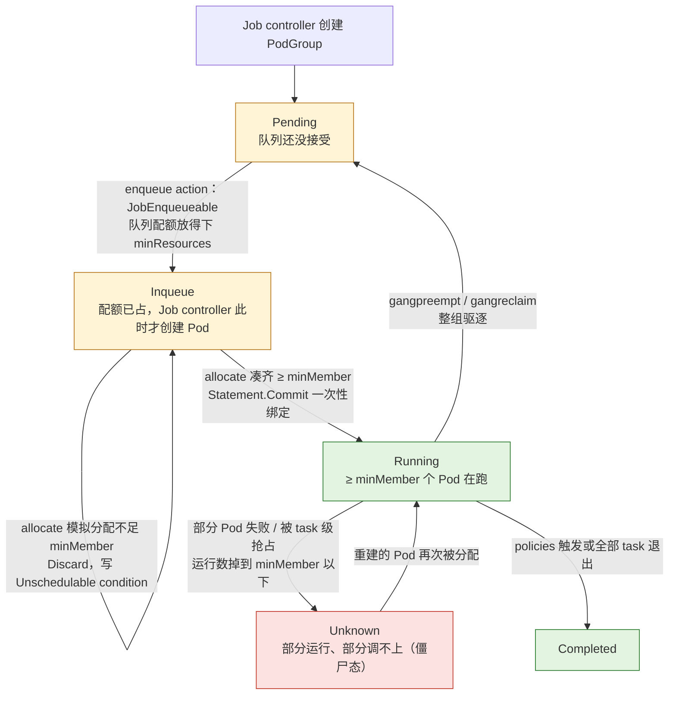
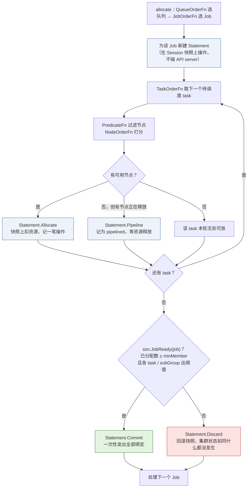
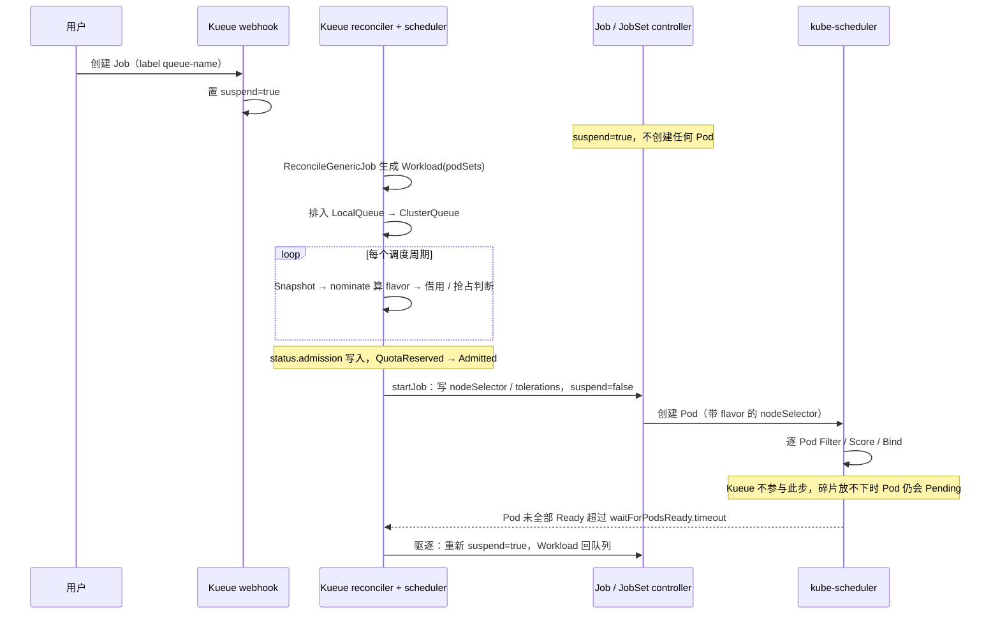
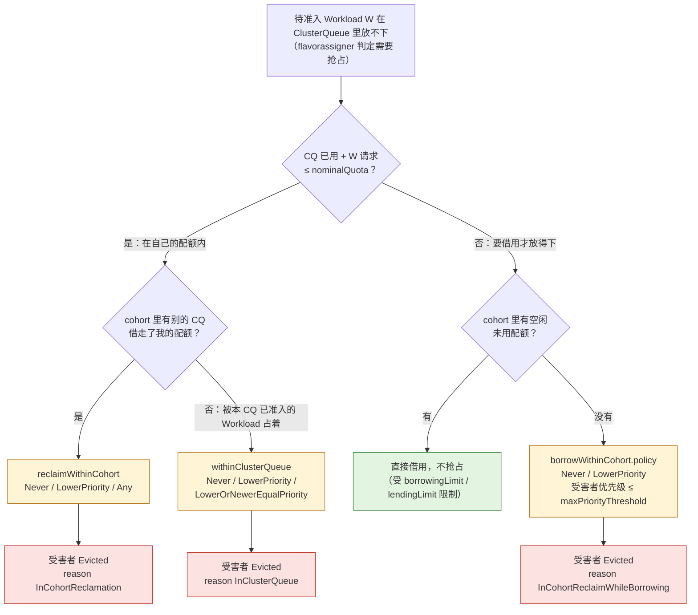

> 本文是[《AI 平台工程：资源层与交付层》](/ai-platform-engineering.html)系列的第 3 篇（共八篇）。上一篇：[容器里的 GPU：驱动、CUDA、device plugin 与镜像](/gpu-in-containers-driver-cuda-device-plugin.html)　下一篇：[GPU 共享与切分：MIG、时间片、MPS 与 HAMi](/gpu-sharing-and-partitioning-mig-mps-hami.html)

周一早上，集群里有 40 张空闲的 GPU。算法团队提交了一个 4 节点 32 卡的预训练任务，`kubectl get pods` 显示 30 个 Pod `Running`、2 个 `Pending`。`describe` 那两个 Pending 的 Pod，事件是 `0/12 nodes are available: 12 Insufficient nvidia.com/gpu`——剩下的 8 张卡分散在四台机器上，每台两张，而这个任务的每个 Pod 要 8 张。30 个已经起来的 Pod 在 `torchrun` 的 rendezvous 里等那两个永远不会来的同伴，占着 30 张卡什么也不算。另一个团队的 8 卡任务也在 Pending：它要的 8 张卡本来在，现在被这 30 个 Pod 中的某几个占了一部分。集群分配率 95%，有效利用率接近零，而且没有任何一方会自己退让。

这不是配置错误，是默认 kube-scheduler 的工作方式与训练任务的形态之间的根本不匹配：调度器一个 Pod 一个 Pod 地决定，训练任务却是要么全部起来、要么全部没用。第一篇把这条需求列进了"原生 Kubernetes 满足不了"的那一栏，第二篇讲了单个容器怎样拿到 GPU；本篇讲**一组容器怎样一起拿到一组 GPU**——这是 AI 平台资源层里最核心、也最容易被低估的一层。

它包含三个层层递进的问题。第一，**同时性**：一组 Pod 要作为一个整体被调度，这就是 gang scheduling。第二，**公平性**：集群是多个团队共用的，谁先谁后、谁能用多少、空闲的卡能不能借给别人、借出去的能不能收回——这是队列与配额。第三，**位置**：32 张卡在同一机柜还是横跨四个机柜，对 all_reduce 的带宽差几倍；同一台机器的 8 张卡要一起给出去而不是被四个小任务各拿两张——这是拓扑感知。Kubernetes 生态里有两个主流项目在填这三个洞，走的路却完全不同：Volcano 换掉调度器，Kueue 在调度器前面加一道闸门。理解这两条路的差别，比记住任何一个 CRD 的字段重要。

本篇要回答总纲提出的核心问题：

> **两个团队各有 16 卡的配额，A 团队提交了一个 32 卡的任务，B 团队的卡空着。在 Volcano、Kueue 和 Slurm 里，这个任务分别会怎样？借用、抢占、等待三种行为各自的配置是什么？**

读完本篇你应该能做三件事：面对一个 Pending 的训练任务，说出它卡在哪一层（配额没准入、gang 没凑齐、拓扑约束不满足、还是节点碎片）；为一个多团队 GPU 集群选出 Volcano 或 Kueue 并写出配额定义；把一个 `torchrun` 任务用 Kubeflow Trainer 的 `TrainJob` 表达出来并接到队列上。

源码与 API 以下列版本为准：Volcano v1.15.2（`scheduling.volcano.sh/v1beta1`、`batch.volcano.sh/v1alpha1`、`topology.volcano.sh/v1alpha1`）、Kueue v0.19.2（`kueue.x-k8s.io/v1beta2`）、Kubeflow Trainer v2.3.0（`trainer.kubeflow.org/v1alpha1`）、KubeRay v1.7.0（`ray.io/v1`）、Slinky slurm-operator v1.2.2（`slinky.slurm.net/v1beta1`，仅对照）、Kubernetes v1.37.0。引用格式为"仓库 路径 的 类型/字段/函数"，不给行号。


## 一、总览：从一个 Pod 到一组 Pod

### 1. 引擎的需求

训练框架对调度层提出的要求，可以从第一篇的需求表里抽出四条，每一条都能对应到一次真实的故障：

```text
需求                        来源                                        不满足时的现象
同时性（all-or-nothing）    torchrun rendezvous 要等齐 WORLD_SIZE 个进程   部分 Pod Running、部分 Pending；已起的进程空转直到 rendezvous 超时
整数、不可压缩的 GPU        一个 rank 一张（或几张）卡，不能给 0.7 张      调度器只会计数，不理解"8 张卡要在同一台机器"
拓扑局部性                  NVLink 域内 / 同机柜 all_reduce 快几倍         任务跨机柜后 step time 翻倍，MFU 掉一半，没有任何报错
可预期的抢占                被抢占等于丢掉自上次 checkpoint 以来的进度      高优先级任务随时踢掉低优先级任务，后者每次重来都从上一个 checkpoint 开始
```

第一条是硬需求，不满足就是死锁。第二、三条是性能需求，不满足任务也能跑，只是慢——而且慢得很隐蔽。第四条是运营需求：抢占本身是合理的，但抢占的粒度、时机和补偿要和 checkpoint 周期配合，否则集群看起来很忙、实际有效计算很少。

除此之外还有一条平台自身的需求：**多租户**。一个团队的任务不能无限占用别人的配额，但别人不用的时候又应该能借；借来的东西要能被收回。这条需求引擎不关心，但它决定了前四条在多团队环境下能否落地。

### 2. K8s 的空缺

kube-scheduler 的调度单元是 Pod。它从队列里取出一个 Pod，跑一遍 PreFilter → Filter → PostFilter → PreScore → Score → Reserve → Permit → PreBind → Bind 的周期，为**这一个** Pod 选一个节点，然后取下一个。它不知道这个 Pod 属于一个 32 个 Pod 的任务，不知道那个任务只有凑齐 32 个才有意义，也不知道其他 31 个 Pod 是否能被放下。在 v1.37.0 的稀疏检出里能看到这个框架里两个与 GPU 有关的插件：`pkg/scheduler/framework/plugins/noderesources/fit.go` 的 `Fit.Filter` 负责"这个节点上 `nvidia.com/gpu` 够不够"，`pkg/scheduler/framework/plugins/dynamicresources/dynamicresources.go` 的 `DynamicResources.Filter` / `Reserve` / `PreBind` 负责 DRA 的 ResourceClaim 分配。两者都是逐 Pod 的。

需要说明的是，上游正在填这个洞：Kubernetes v1.37.0 把 Workload-Aware Scheduling（WAS）的 `Workload` 与 `PodGroup` 提升到了 `scheduling.k8s.io/v1beta1`，由 `GenericWorkload` feature gate 控制，`CHANGELOG/CHANGELOG-1.37.md` 里能看到 `PodGroupPostFilter`、`PlacementFeasible` 这类为 PodGroup 增加的扩展点，`noderesources/fit.go` 里也多了 `Fit.ScorePlacement`——对一组 Pod 的放置整体打分。这是原生 gang scheduling 的雏形。但它解决的只是"同时性"；队列、配额、借用、拓扑这几层在 v1.37 的原生 API 里还没有，也不是 WAS 的目标。本篇写作时它仍是 beta 且默认状态以 v1.37 文档为准，生产集群里的 AI 任务调度仍然由下面两条扩展路线承担。

除了同时性，原生 K8s 在另外三处也是空的：

- **配额只有 `ResourceQuota`**，它是命名空间级的硬上限，不能表达"保底 16 卡、闲时最多 32 卡、别人要用时还回来"这种弹性语义，也没有排队——超了配额的 Pod 直接被 API server 拒绝，而不是排队等；
- **拓扑只有 node affinity 和 topology spread**，它们是每个 Pod 的偏好，不能表达"这 32 个 Pod 要落在同一个 rack 标签值下，具体哪个 rack 由调度器选"；
- **抢占只看 `PriorityClass` 的数值**，一个高优先级 Pod 可以踢掉任意低优先级 Pod，不会考虑被踢的 Pod 属于一个 gang、踢掉一个等于废掉全部。

### 3. 平台的机制（全局图）

两条路线的位置画在同一张图上：

```text
                  用户提交 TrainJob / vcjob / RayJob / Job
                                 │
       ┌─────────────────────────┴─────────────────────────┐
       │ Kueue 路线（准入控制）                              │ Volcano 路线（替换调度器）
       │                                                   │
  Job 被 webhook 置为 suspend=true                     Job controller 创建 PodGroup(minMember)
  jobframework 生成 Workload(podSets)                  PodGroup 进入 Queue
  LocalQueue → ClusterQueue(ResourceFlavor 配额)        volcano-scheduler 每个周期开一个 Session：
  cohort 内借用 / 抢占 / 公平共享                         actions: enqueue → allocate → (preempt, reclaim, backfill)
  [AdmissionCheck: ProvisioningRequest 扩容]            plugins: gang / priority / drf / capacity / binpack / …
  [TAS: 按 Topology 层级选域，生成 nodeSelector]          gang: minMember 不齐则整组不 Commit
       │                                                   │  network-topology-aware: 按 HyperNode tier 选域
  admitted → suspend=false → Pod 被创建                    │
       │                                                   │
       └──────────────► kube-scheduler ◄───────────────────┘   （Volcano 路线里 kube-scheduler 被替换为 volcano）
                       逐 Pod 绑定节点
                                 │
                       Pod 起来 → torchrun rendezvous（headless Service 的稳定 DNS 名）
```

Kueue 不碰 Pod 的节点选择，它只决定"这个任务现在能不能开始"；决定了之后把 Job 的 `suspend` 翻成 `false`，Pod 被创建出来，交给 kube-scheduler（或任何别的调度器）逐个绑定。Volcano 自己就是调度器：它把一组 Pod 当作一个 Job 整体做 allocate，凑不齐 `minMember` 就不提交任何一个绑定。两者的差别不在功能多少，而在**介入的时机**：Kueue 在 Pod 存在之前，Volcano 在 Pod 存在之后。

在两条路线之上是任务的表达层：Kubeflow Trainer 的 `TrainJob` 把 `torchrun` 的参数翻译成 JobSet，并按 `TrainingRuntime` 里的 `podGroupPolicy` 生成 Volcano 的 PodGroup 或让 Kueue 接管；KubeRay 的 `RayJob` / `RayCluster` 对 Ray 做同样的事。Slurm 作为对照贯穿全文：它二十年前就把 gang、partition、backfill、GRES 和拓扑做完了，K8s 生态在重新发明其中的大部分。

### 4. 本文的章节安排

```text
二、为什么会死锁      逐 Pod 调度的时序；gang 的定义与 minMember；为什么必须在调度器层面做；v1.37 WAS 的位置
三、Volcano           对象模型 Job → PodGroup → Queue；Session 与 action/plugin 流水线；gang 插件；capability/deserved/guarantee
四、Kueue             Workload → LocalQueue → ClusterQueue；ResourceFlavor；cohort 借用与 lendingLimit；suspend；抢占策略；AdmissionCheck
五、两种哲学          对比表；选型；能否叠加
六、拓扑感知          为什么；Kueue TAS 的 Topology 与三个注解；Volcano 的 HyperNode 与 tier；标签从哪里来
七、抢占与 checkpoint 抢占的代价模型；PriorityClass / WorkloadPriorityClass / Queue priority 的交互；配置建议
八、Kubeflow Trainer  TrainJob / TrainingRuntime / JobSet；torch 插件注入的 PET_*；rendezvous 如何落地；与 Volcano / Kueue 的对接
九、Slurm 与 Ray      sbatch / partition / GRES / backfill；Slinky 的 slurm-operator 与 slurm-bridge；Ray placement group 与 KubeRay 的两层自动扩缩
十、回答核心问题      借用 / 抢占 / 等待 × Volcano / Kueue / Slurm 的行为与配置项
十一、代价与边界      四栏表；每个机制引入的新问题
十二、实践            mini-platform/sched/：Kueue 两队列 cohort、TrainJob、Volcano Job、从 suspended 到 admitted
十三、小结            要点、源码位置、练手项目增量
```


## 二、为什么逐 Pod 调度会死锁

### 1. 一条时间线

把开头那个故障画成时间线。集群 12 台机器，每台 8 张卡，共 96 张；此前已有别的任务占了 56 张，剩 40 张：4 台完全空闲（32 张），另外 4 台各剩 2 张（8 张）。任务 J 要 32 个 Pod，每个 Pod 8 张卡；每个 Pod 因此只能落在完全空闲的机器上。

```text
t0   J 的 32 个 Pod 同时进入调度队列（Job 的 parallelism=32，或 JobSet 展开）
t1   kube-scheduler 逐个处理：Pod-0 → node-A（剩 0 卡）……Pod-3 → node-D
     四台空机器每台只能放 1 个 8 卡 Pod → 4 个 Pod 绑定成功
t2   Pod-4：Filter 阶段 12 个节点全部 Insufficient nvidia.com/gpu → Unschedulable，进 backoff 队列
     Pod-5 … Pod-31 同样 → 28 个 Pending
t3   Pod-0..3 的容器启动，torchrun 进入 rendezvous，等 WORLD_SIZE=32×8 个进程
     它们占着 32 张卡，GPU 利用率 0%
t4   另一任务 K（4 个 Pod × 2 卡）提交。它本可以用那 4 台各剩 2 张卡的机器——仍然可以，K 跑起来了
     但如果 K 需要的是 4 台空机器中的任意一台（比如 1 个 8 卡 Pod），它也 Pending：那些机器被 J 的 Pod 占了
t5   rendezvous 超时（torchrun 默认约 15 分钟）→ Pod-0..3 退出 → Job 按 backoffLimit 重建它们
     重建的 Pod 再次抢到 4 台空机器 → 回到 t1。J 永远凑不齐，K 类任务永远等不到整机
```

注意 t1 到 t3 之间没有任何"错误"：每一个 Pod 的调度决定在它自己的视角里都是正确的。问题在于调度器没有一个视角能看到"这 32 个 Pod 是一个东西，4 个成功等于 0 个成功"。

把 t3 时刻的节点占用摊开看，再对照 gang 调度在同一时刻会做什么，差别一目了然——不在于"放了几个 Pod"，而在于**那 4 台空机器最终归谁**：

```text
逐 Pod 调度，t3 时刻（■ 其他任务  J 任务 J 的 Pod  · 空闲）
        GPU: 0 1 2 3 4 5 6 7
node-A       J J J J J J J J   Pod-0 已绑定，等 rendezvous，利用率 0%
node-B       J J J J J J J J   Pod-1
node-C       J J J J J J J J   Pod-2
node-D       J J J J J J J J   Pod-3
node-E..H    ■ ■ ■ ■ ■ ■ · ·   各剩 2 张，放不下 8 卡的 Pod
node-I..L    ■ ■ ■ ■ ■ ■ ■ ■   满
Pod-4 … Pod-31 → Pending（Insufficient nvidia.com/gpu）；32 卡被占，0 卡在算

gang 调度，同一时刻
node-A..D    · · · · · · · ·   模拟分配只放得下 4/32 个 Pod → Discard，不绑定
node-E..H    ■ ■ ■ ■ ■ ■ · ·   4 台空机器留给放得下的任务（如 1 个 8 卡 Pod）
node-I..L    ■ ■ ■ ■ ■ ■ ■ ■
J 整体 Pending，PodGroup 上写明 "4/32 tasks in gang unschedulable"
```

如果情况更糟一点——两个 32 卡任务 J1、J2 同时提交，各抢到了 2 台空机器——那么两个任务各占 16 张卡，谁也凑不齐，谁也不会退让，这就是经典的资源死锁。集群分配率显示 100%，有效利用率是 0。

### 2. gang scheduling 的定义

gang scheduling 的定义只有一句：**一组 Pod 要么全部（或至少 `minMember` 个）被调度，要么一个都不调度**。它有三个推论：

- 调度决定是**对整组做的**：调度器需要先在"模拟"里为所有成员找到位置，确认可行后再一次性提交绑定；找不到就全部放弃，不留下任何部分绑定；
- 需要一个**表达"组"的对象**：原生 Pod 上没有这个信息，所以 Volcano 有 `PodGroup`、Kueue 有 `Workload.spec.podSets`、K8s v1.37 的 WAS 有 `scheduling.k8s.io/v1beta1` 的 `PodGroup`；
- 需要一个**阈值**：不是所有任务都要求 100% 成员。`minMember` 让弹性训练（比如 torchrun 的 `--nnodes=2:4`）表达"最少 2 个节点就能开始"。

`minMember` 在 Volcano 里是 `PodGroupSpec.MinMember`（`volcano staging/src/volcano.sh/apis/pkg/apis/scheduling/v1beta1/types.go`），字段注释就是这个定义："if there's not enough resources to start all tasks, the scheduler will not start anyone"。同一个 struct 里还有更细的 `MinTaskMember`（每个 task 角色的最少数目，比如 master 1 + worker 至少 3）和 v1.15 引入的 `SubGroupPolicy`（把一个 PodGroup 再分成若干子组，每个子组内部要求同时性和拓扑一致，`MinSubGroups` 是子组级别的 gang 阈值）。

### 3. 为什么必须在调度器层面实现

一个自然的想法是：让应用自己重试——起不齐就退出，Job 重建，总有一次能凑齐。开头的时间线已经说明这条路走不通：重试只是把死锁变成活锁，占着资源等的时间没有减少，反而多了反复拉镜像、反复初始化的开销。更根本的原因是**调度器是唯一同时看到所有待调度 Pod 和所有节点空闲资源的地方**。应用只能看到自己；任何在应用层做的"等一等再重试"都不知道该等多久、也不知道自己是否应该先退让。

另一个想法是在 admission 层做：Pod 创建之前先检查"集群剩余资源够不够整个任务"，够了才放行。这正是 Kueue 的思路，它能防止"配额上放不下"的任务进入集群。但它防不住"配额上够、节点上因为碎片放不下"的情况——这在第四章会展开，也是 Kueue 后来加 Topology-Aware Scheduling 和 `waitForPodsReady` 的原因。


## 三、Volcano：一个更懂批处理的调度器

### 1. 对象模型

Volcano 有三个核心对象，分属两个 API 组：

```text
batch.volcano.sh/v1alpha1     Job          用户写的东西：tasks[]（每个 task 一个 PodTemplate + replicas）、minAvailable、queue、plugins
scheduling.volcano.sh/v1beta1 PodGroup     调度器看的东西：minMember、minResources、queue、priorityClassName、networkTopology、subGroupPolicy
scheduling.volcano.sh/v1beta1 Queue        多租户的东西：weight、capability、deserved、guarantee、reclaimable、priority、parent
```

`Job` 是给用户的：`JobSpec.Tasks` 是一组 `TaskSpec`，每个有 `Name`、`Replicas`、`Template`（`v1.PodTemplateSpec`）、可选的 `MinAvailable`；`JobSpec.MinAvailable` 是整个 Job 的 gang 阈值；`JobSpec.Queue` 指定队列；`JobSpec.Plugins` 是一个 `map[string][]string`，键是插件名——`ssh`、`env`、`svc`、`pytorch` 等（`volcano pkg/controllers/job/plugins/factory.go` 的 `RegisterPluginBuilder`）。`JobSpec.Policies` 是生命周期策略，比如"某个 task 完成就把整个 Job 标为完成"。这些都在 `volcano staging/src/volcano.sh/apis/pkg/apis/batch/v1alpha1/job.go`。

Job controller（`volcano pkg/controllers/job/job_controller_actions.go` 的 `createOrUpdatePodGroup`）为每个 Job 创建一个同名的 `PodGroup`，把 `minAvailable` 写进 `minMember`、把 tasks 的资源总和写进 `minResources`、把 `queue` 抄过去；每个 Pod 打上 `scheduling.k8s.io/group-name` 注解（`scheduling/v1beta1/labels.go` 的 `KubeGroupNameAnnotationKey`）指向它的 PodGroup。**Job controller 只在 PodGroup 离开 `Pending` 阶段之后才创建 Pod**（`job_controller_actions.go` 里对 `pg.Status.Phase != PodGroupPending` 的判断），这一点决定了 Volcano 的排队发生在 Pod 存在之前——和 Kueue 的 `suspend` 殊途同归。

不用 Volcano `Job` 也可以用 Volcano 调度器：任何 Pod 只要 `schedulerName: volcano` 并带上 `scheduling.k8s.io/group-name` 注解，就会被当作某个 PodGroup 的成员；没有注解的 Pod 由 `volcano pkg/controllers/podgroup/pg_controller_handler.go` 自动创建一个单成员 PodGroup。Kubeflow Trainer 和 KubeRay 都走这条路——它们自己创建 PodGroup，不用 vcjob。

`PodGroupStatus.Phase` 有五个值：`Pending`（还没被队列接受）、`Inqueue`（配额上放得下，controller 可以创建 Pod 了）、`Running`（`minMember` 个 Pod 在跑）、`Unknown`（部分在跑、部分调不上——这就是第二章的死锁状态，Volcano 会把它显式标出来）、`Completed`。每次迁移由不同的组件驱动，排障时先看 Phase 就能知道该去查哪一层：



`Pending` 卡住是队列配额问题（看 Queue 的 `capability` / `deserved`）；`Inqueue` 卡住是节点资源或拓扑问题（看 PodGroup 的 `Unschedulable` condition）；`Unknown` 是第二章那种部分运行的僵尸状态，Volcano 不会自动解开它——要靠 Job 的 `policies` 重建或人工干预。

### 2. Session 与 action / plugin 流水线

Volcano 调度器不是事件驱动的，而是**周期性**的：每个周期（默认 1 秒）打开一个 `Session`，对集群做一次快照，然后按配置顺序执行一串 action，每个 action 在执行时调用各 plugin 注册的回调函数来做决定。周期结束时关闭 Session，提交这一轮的绑定。

Helm chart 的默认配置（`volcano installer/helm/chart/volcano/config/volcano-scheduler.conf`）：

```yaml
actions: "enqueue, allocate, backfill"
tiers:
- plugins:
  - name: priority
  - name: gang
    enablePreemptable: false
  - name: conformance
- plugins:
  - name: overcommit
  - name: drf
    enablePreemptable: false
  - name: predicates
  - name: proportion
  - name: nodeorder
  - name: binpack
```

action 是"做什么"，`volcano pkg/scheduler/actions/` 下每个目录一个：

```text
enqueue      把 PodGroup 从 Pending 变成 Inqueue：问 plugin 的 JobEnqueueable（配额上放不放得下 minResources）
allocate     核心：按 QueueOrderFn 选队列 → JobOrderFn 选 Job → TaskOrderFn 选 task → PredicateFn 过滤节点 → NodeOrderFn 打分
             为一个 Job 的所有 task 在 Statement 里模拟分配，JobReady 才 Commit，否则 Discard
preempt      同队列内，高优先级的饥饿 Job 抢占低优先级 Job 的 task（JobStarving / Preemptable 回调）
reclaim      跨队列，把借出去的资源收回来：受害者队列必须 reclaimable，且它超出了 deserved
backfill     把没有资源请求（BestEffort）的 task 塞进剩余空隙
gangpreempt / gangreclaim   v1.15 新增：以整个 Job 为受害者单位的抢占/回收，解决下面要说的"gang 不能被部分驱逐"
shuffle      周期性重排已运行的 task（配合 rescheduling 插件）
```

plugin 是"按什么规则"，`volcano pkg/scheduler/plugins/` 下每个目录一个，通过在 `OnSessionOpen` 里向 Session 注册回调来参与决定。tiers 是优先级层：第一层的 plugin 先表态，有明确结论就不再问第二层。

`allocate` 的骨架在 `volcano pkg/scheduler/actions/allocate/allocate.go` 的 `Action.Execute` 注释里写得很清楚（"1. pick a queue … 5. use ssn.NodeOrderFn to judge the best node"）。关键的 gang 语义在 `allocateForJob`：它为 Job 新建一个 `framework.Statement`（`volcano pkg/scheduler/framework/statement.go`），逐个 task 调用 `Statement.Allocate`（在快照上扣资源、记录操作但不真正绑定），全部 task 处理完后检查 `ssn.JobReady(job)`——满足就 `Statement.Commit`（真正发出绑定），不满足就 `Statement.Discard`（回滚快照，什么都没发生）。这就是 gang 的实现：**模拟分配 + 整体提交或整体回滚**。`JobReady` 与 `JobPipelined` 的区别是，pipelined 允许 task 排到正在释放资源的节点上等（`Statement.Pipeline`），为 preempt/reclaim 之后的分配留位置。



图里蓝色的三步都发生在快照上：直到 `Commit` 之前，API server 没有收到任何 Bind 请求，其他 Job 也看不到这些"预占"——这和 kube-scheduler 每处理完一个 Pod 就 Bind 的做法是根本差别，也是第二章那种"4 个成功等于 0 个成功"在 Volcano 里不会出现的原因。

### 3. gang 插件做了什么

`volcano pkg/scheduler/plugins/gang/gang.go` 的 `gangPlugin.OnSessionOpen` 注册了六类回调：

```text
JobValidFn        Job 的有效 task 数 < MinAvailable → 不合法，直接跳过（Reason: NotEnoughTasks / NotEnoughPodsOfTask）
JobReadyFn        CheckTaskReady && CheckSubJobReady && IsReady：已分配数 ≥ minMember（且每个 task/subGroup 达到各自阈值）
JobPipelinedFn    同上，但把 pipelined 的 task 也算上
JobOrderFn        没 ready 的 Job 排在已 ready 的前面——优先把差一点的凑齐，而不是给已经在跑的加 Pod
JobStarvingFn     Job 还没到 MinAvailable → 饥饿，有资格发起抢占
PreemptableFn / ReclaimableFn   受害者选择：一个 Job 只有在 ReadyTaskNum > MinAvailable 时，多出来的 task 才能被抢/被收
```

最后一条值得停一下。它的意思是：**gang 插件不允许把一个正在跑的 Job 打到 `minMember` 以下**——因为那样它就废了，抢走的资源等于白抢，还多了一个占着剩余资源空转的僵尸。推论是一个 `minAvailable == replicas` 的训练任务，在 task 级的 `preempt` / `reclaim` 里**永远不会成为受害者**。这是设计使然，但也意味着默认配置下"高优先级任务抢占低优先级训练任务"根本不会发生——除非用 v1.15 新增的 `gangpreempt` / `gangreclaim` action，它们以整个 Job（"whole-bundle"，`volcano pkg/scheduler/actions/gangreclaim/gangreclaim.go` 的 `AllowWholeBundleKey`）为受害者单位，一次驱逐整组。第七章会回到这个取舍。

`OnSessionClose` 里 gang 插件还负责把没 ready 的 Job 的 PodGroup 打上 `Unschedulable` condition，消息形如 `X/Y tasks in gang unschedulable: pod group is not ready, Z Pending, ...`——这是排障时最先该看的一行。

### 4. Queue 的三个配额语义

`QueueSpec`（`scheduling/v1beta1/types.go`）里有三个 `v1.ResourceList` 类型的字段，`volcano docs/design/capacity-scheduling.md` 给出了它们的定义：

```text
capability   上限。任何时候队列里的总用量不能超过它。不设 = 不限
deserved     应得。这部分资源"可以借给别的队列，也可以收回来"——它是 reclaim 的基准线
guarantee    保底。这部分资源即使队列空着也不借出去，永远留着
```

三者的关系是 `guarantee ≤ deserved ≤ capability`。用第一篇的两团队场景解释：A、B 各 `deserved: 16` 卡。B 空闲时 A 可以用到 `capability`（设为 32 就能跑那个 32 卡任务）；B 提交任务时，`reclaim` action 会发现 A 的用量超过了 `deserved`，从 A 手里收回超出的部分——但只收 `deserved` 以外的，A 的 16 卡是它的。如果 A 还设了 `guarantee: 8`，那么即使 A 一个任务都没有，B 也最多用到 `96 - 8`。

把队列 A 的用量画成一条数轴，三个字段就是三条刻度线，每一段的"归属"不同（Kueue 的对应字段一并标出，第四章会展开）：

```text
队列 A 的 GPU 用量 →
 0        8                16                             32
 ├────────┼────────────────┼───────────────────────────────┤
 │ 保底   │ 应得但可借出   │ 借来的                        │
 │        │                │                               │
    guarantee=8      deserved=16              capability=32

 0–8    A 空闲时也不借给别人；B 最多能用到 96-8
 8–16   A 没用时 B 可以借走；A 要用时 reclaim 把它收回（B 是受害者）
 16–32  A 从别人那里借来的；别人要用时 reclaim 从 A 手里收回（A 是受害者）
 >32    enqueue 拒绝：minResources 超过 realCapability，PodGroup 停在 Pending

 Kueue 对应：nominalQuota-lendingLimit │ nominalQuota │ nominalQuota+borrowingLimit
```

这三个字段由 `capacity` 插件解释（`volcano pkg/scheduler/plugins/capacity/capacity.go` 的 `buildQueueAttrs`：读 `Spec.Deserved`、`Spec.Capability`、`Spec.Guarantee.Resource`，算出 `realCapability = (总资源 - 所有队列 guarantee 之和) + 本队列 guarantee`，再和 `capability` 取小）。`capacity` 是 v1.9 之后推荐的插件；默认配置里的 `proportion` 是它的前身，按 `weight` 比例算 deserved 而不是让管理员按资源类型写数字——异构集群（A100 和 H100 混跑）里 weight 一个数字无法表达"A100 上 1:3、H100 上 1:1"，这是 `capacity` 出现的原因（设计文档开头就是这个例子）。两者不能同时启用。

`QueueSpec.Reclaimable`（默认 `true`，`volcano pkg/scheduler/api/queue_info.go` 的 `QueueInfo.Reclaimable`）决定这个队列借出去的资源能不能被收回；`QueueSpec.Priority` 决定队列之间的调度顺序和回收顺序（"Higher values are prioritized for scheduling and considered later during reclamation"）；`QueueSpec.Parent` 支持层级队列（`docs/design/hierarchical-queue-on-capacity-plugin.md`）；`QueueSpec.DequeueStrategy` 的 `fifo` / `traverse`（默认）决定队头 Job 调不上时是阻塞还是跳过——和 Kueue 的 `StrictFIFO` / `BestEffortFIFO` 一一对应。

其他常用 plugin 一句话：`priority` 按 `PriorityClass` 排 Job 和 task；`drf` 按 dominant resource fairness 排 Job（多资源维度下的公平）；`binpack` 给节点打分时偏好"已经装得比较满"的节点，参数 `binpack.weight`、`binpack.resources`（`volcano pkg/scheduler/plugins/binpack/binpack.go`）——对 GPU 集群非常重要，它减少了第二章那种"每台机器剩两张卡"的碎片；`predicates` 和 `nodeorder` 复用 kube-scheduler 的 Filter / Score 逻辑；`sla` 给等待过久的 Job 加权；`numaaware` 处理 NUMA 拓扑；`network-topology-aware` 是第六章的主角。


## 四、Kueue：调度器之前的配额闸门

### 1. 设计前提

Kueue 的出发点和 Volcano 相反：**不替换调度器，不碰 Pod 的节点选择，只回答"这个任务现在能不能开始"**。它假设集群上已经有 kube-scheduler（或任何调度器）负责把 Pod 放到节点上，自己只管准入。这样做的代价是它看不到节点碎片（后面会讲怎么补），好处是它可以和任何 Job 类型、任何调度器组合，而且对 Job 的干预只有一个字段：`suspend`。

`suspend` 是 `batch/v1` Job 自带的字段：`suspend: true` 的 Job 不创建 Pod。Kueue 给每一种支持的 Job 类型（`kueue pkg/controller/jobs/` 下一个目录一种：`job`、`jobset`、`trainjob`、`rayjob`、`raycluster`、`leaderworkerset`、`pod`、`deployment`、`statefulset`、`mpijob`、`appwrapper` 等）实现了 `jobframework.GenericJob` 接口（`kueue pkg/controller/jobframework/interface.go`），接口里最重要的四个方法是 `IsSuspended` / `Suspend` / `Unsuspend` / `PodSets`。对 TrainJob 来说，`kueue pkg/controller/jobs/trainjob/trainjob_controller.go` 里 `TrainJob.IsSuspended` 读的就是 `trainJob.Spec.Suspend`。

流程：用户创建一个带 `kueue.x-k8s.io/queue-name` 标签（`kueue pkg/controller/constants/constants.go` 的 `QueueLabel`）的 Job → Kueue 的 webhook 把它的 `suspend` 置为 `true` → `JobReconciler.ReconcileGenericJob` 为它创建一个 `Workload` 对象 → Kueue 调度器把 Workload 排进队列、算配额、决定准入 → 准入后 reconciler 调用 `startJob`：把 Workload 里分配到的 flavor 对应的 `nodeSelector` / `tolerations` 写进 Job 的 Pod 模板（`RunWithPodSetsInfo`），再 `Unsuspend` → Job controller 开始创建 Pod → kube-scheduler 接手。Workload 的命名规则是 `<kind 小写>-<job 名>-<5 位 hash>`（`kueue pkg/controller/jobframework/workload_names.go` 的 `GenerateWorkloadNamePrefix` 与 `hashLength`），所以一个叫 `ddp-2node` 的 TrainJob 对应的 Workload 叫 `trainjob-ddp-2node-xxxxx`。



这张图里 Kueue 出现两次：准入时把 `suspend` 翻成 `false`，驱逐（抢占、回收、`waitForPodsReady` 超时）时再翻回 `true`。它对 Job 的全部干预就是这一个字段加上准入时写入的 `nodeSelector` / `tolerations`。

### 2. 五个对象

```text
Workload          一次准入请求。spec.podSets[]（每个 podSet 一个 PodTemplate + count）、queueName、priorityClassRef
                  status.admission（分到哪个 ClusterQueue、每个 podSet 用了哪个 flavor）、conditions（QuotaReserved / Admitted / Finished / Evicted）
LocalQueue        命名空间级。spec.clusterQueue 指向一个 ClusterQueue。用户只看得到它
ClusterQueue      集群级。spec.resourceGroups[].flavors[].resources[]{name, nominalQuota, borrowingLimit, lendingLimit}
                  spec.cohortName、queueingStrategy、preemption、admissionChecksStrategy、fairSharing、stopPolicy
ResourceFlavor    "一种资源"：spec.nodeLabels（准入后写成 nodeSelector）、nodeTaints、tolerations、topologyName
Cohort            可选的显式对象：spec.parentName（层级）、resourceGroups（cohort 自己也能持有配额）、fairSharing
```

全部在 `kueue apis/kueue/v1beta2/` 下对应的 `*_types.go`。几个字段值得逐个解释。

**ResourceFlavor 是 Kueue 表达异构的方式。** `ResourceFlavorSpec.NodeLabels` 是一组标签，比如 `nvidia.com/gpu.product: NVIDIA-H100-80GB-HBM3`（第二篇讲过这个标签由 GPU Feature Discovery 打上）。ClusterQueue 里每个 flavor 单独给配额：H100 flavor 16 张、A100 flavor 32 张。Workload 准入时 Kueue 按 flavor 在 ClusterQueue 里的**顺序**尝试（`FlavorFungibility` 控制"当前 flavor 要借用/抢占才能放下时，是先试下一个 flavor 还是就地借"），选中后把该 flavor 的 `nodeLabels` 作为 `nodeSelector` 写进 Pod——这是 Kueue 影响 Pod 落点的唯一方式（TAS 之前）。

**cohort 是借用的边界。** `ClusterQueueSpec.CohortName` 只是一个名字，同名的 ClusterQueue 组成一个 cohort，彼此可以借用未使用的 `nominalQuota`。每个 `ResourceQuota` 上有两个限制借用的字段：`BorrowingLimit`（我最多从别人那里借多少；null = 不限）和 `LendingLimit`（我最多借给别人多少，等价于"我为自己保留 `nominalQuota - lendingLimit`"；null = 全部可借）。对照 Volcano：`nominalQuota` ≈ `deserved`，`nominalQuota + borrowingLimit` ≈ `capability`，`nominalQuota - lendingLimit` ≈ `guarantee`。如果创建了显式的 `Cohort` 对象，还可以用 `CohortSpec.ParentName` 组成树、在 cohort 层持有不属于任何 ClusterQueue 的公共配额。

**queueingStrategy 决定队头阻塞。** `StrictFIFO`：同优先级按创建时间严格排序，队头放不下则后面的也不准入——保证公平但会让小任务等大任务；`BestEffortFIFO`（默认）：队头放不下就跳过看下一个——吞吐高但大任务可能饥饿。

### 3. 调度周期

`kueue pkg/scheduler/scheduler.go` 的 `Scheduler.schedule` 每轮做四件事：对缓存做快照（`cache.Snapshot`）；取每个 ClusterQueue 的队头 Workload，调用 `nominate` 为每个候选算 flavor 分配（`kueue pkg/scheduler/flavorassigner/flavorassigner.go` 的 `FlavorAssigner.Assign`）——这一步决定"用哪个 flavor、要不要借用、要不要抢占"；按 cohort 内的顺序对候选逐个 `processEntry`，需要抢占的调用 `kueue pkg/scheduler/preemption/preemption.go` 的 `Preemptor.GetTargets` 选受害者、`IssuePreemptions` 发出驱逐；最后对可以准入的 Workload 写 `status.admission` 并设置 `QuotaReserved` condition。

Workload 的 `status.conditions` 里有一串 reason 常量（`workload_types.go`）能告诉你它卡在哪：`WaitingForQuota`（配额不够）、`NoMatchingFlavor`（没有 flavor 能覆盖它请求的资源）、`ExceedsMaxQuota`（比 `nominalQuota + borrowingLimit` 还大，永远进不去）、`TopologyPlacementFailed`（TAS 找不到满足拓扑约束的域）、`WaitingForPreemptedWorkloads`（已选好受害者，等它们退出）、`UnsatisfiedAdmissionChecks`（配额有了，但 AdmissionCheck 没过）。`flavorassigner.go` 生成的消息形如 `couldn't assign flavors to pod set node: insufficient unused quota for nvidia.com/gpu in flavor h100, 16 more needed`——这是 `kubectl describe workload` 里最有用的一行。

### 4. 抢占策略

`ClusterQueuePreemption`（`clusterqueue_types.go`）有三个独立的开关，对应三种场景：

```text
withinClusterQueue      同一个 ClusterQueue 内，待准入的 Workload 放不进 nominalQuota 时能否抢占已准入的低优先级 Workload
                        Never（默认）/ LowerPriority / LowerOrNewerEqualPriority
reclaimWithinCohort     待准入的 Workload 在自己的 nominalQuota 之内，但配额被 cohort 里别的 ClusterQueue 借走了——能否抢回来
                        Never（默认）/ LowerPriority / Any（不看优先级，是我的就抢回来）
borrowWithinCohort      待准入的 Workload 需要借用才能放下，能否为此抢占 cohort 里别的 ClusterQueue 的低优先级 Workload
                        policy: Never（默认）/ LowerPriority；maxPriorityThreshold 限制受害者的优先级上限
```

三个开关分别管三种"放不下"的情形，判断顺序可以画成一棵决策树——先看待准入的 Workload 加上本队列已用量是否超出 `nominalQuota`，再看放不下的原因是别人借走了还是自己就不够：



被抢占的 Workload 上 `Evicted` condition 的 reason 记录了原因：`InClusterQueue`、`InCohortReclamation`、`InCohortFairSharing`、`InCohortReclaimWhileBorrowing`（`workload_types.go` 同名常量）。抢占的实现是把 Job 重新 `suspend`——Pod 被删除、Workload 回到队列重新排队；Job 本身不会消失，恢复后从 checkpoint 继续是训练框架自己的事。

第四种场景是 **fair sharing**：在 Kueue 配置（`kueue apis/config/v1beta2/configuration_types.go` 的 `Configuration.FairSharing`）里开启后，cohort 内不再是"先借到先得"，而是按每个 ClusterQueue 的 `FairSharing.Weight` 计算加权份额（`ClusterQueueStatus.FairSharing.WeightedShare`），借用最多的队列先被抢；`preemptionStrategies` 的 `LessThanOrEqualToFinalShare` / `LessThanInitialShare` 决定抢到什么程度为止。这大致对应 Volcano 的 `drf` 插件。

### 5. AdmissionCheck 与集群自动扩缩容

配额是静态的，云上的节点池是弹性的。Kueue 用 `AdmissionCheck` 把"配额准入"和"资源到位"分成两步：Workload 先拿到配额（`QuotaReserved`），然后等所有 AdmissionCheck 变成 `Ready` 才真正 `Admitted`。`AdmissionCheckSpec.ControllerName` 指定谁来执行检查，`ClusterQueueSpec.AdmissionChecksStrategy.AdmissionChecks[].OnFlavors` 可以只对某些 flavor 启用（比如只有 spot flavor 需要先扩容）。

Kueue 内置的检查器是 `kueue.x-k8s.io/provisioning-request`（`kueue apis/kueue/v1beta2/provisioningrequestconfig_types.go` 的 `ProvisioningRequestControllerName`）：它为每个拿到配额的 Workload 创建一个 Cluster Autoscaler 的 `ProvisioningRequest`，参数来自 `ProvisioningRequestConfig`（`provisioningClassName`、`managedResources`、`retryStrategy`），Cluster Autoscaler 看到请求后**一次性**为整个 Workload 扩出足够的节点，扩好了 check 变 Ready，Workload 才 admitted。这解决了云上 gang 的另一半问题：不是"有没有配额"，而是"节点还没买"。没有它，Kueue 准入了、Pod 创建了、Cluster Autoscaler 看到 Pending 的 Pod 才开始逐个扩节点——先扩出来的节点上 Pod 先跑起来，又回到第二章的部分启动。

### 6. 准入之后：waitForPodsReady

Kueue 准入是按配额做的加法，不保证 kube-scheduler 真能把每个 Pod 放下——碎片、taint、别的非 Kueue 管理的 Pod 都可能让某个 Pod Pending。`Configuration.WaitForPodsReady`（`configuration_types.go`）是补救：`timeout` 内 Workload 的 Pod 没有全部 Ready，就驱逐它、按 `requeuingStrategy` 退避重排，`blockAdmission: true` 时还会阻止其他 Workload 在此期间准入（避免它们也去抢碎片）。这是一个"时间维度上的 all-or-nothing"：Kueue 不能阻止部分启动，但能保证它不持续。真正阻止部分启动要靠 TAS——第六章。


## 五、两种哲学的对比

### 1. 对比表

```text
维度              Volcano v1.15.2                                    Kueue v0.19.2
定位              替换 kube-scheduler 的批处理调度器                  kube-scheduler 之前的准入控制器
介入时机          Pod 创建后（vcjob 的 Pod 在 PodGroup Inqueue 后创建） Pod 创建前（suspend=true 直到 admitted）
gang 的保证       强：allocate 在快照上模拟全部 task，JobReady 才 Commit  弱：按配额做加法；节点层面靠 TAS 或 waitForPodsReady 补
配额对象          Queue（capability / deserved / guarantee，层级 parent）  ClusterQueue（nominalQuota / borrowingLimit / lendingLimit，cohort，Cohort 树）
异构表达          按 ResourceList 的资源名（nvidia.com/gpu 与 MIG 资源名分开算）  ResourceFlavor（同一资源名按 nodeLabels 分成多种 flavor）
借用与回收        capacity 插件 + reclaim action；受 gang 插件限制         cohort 借用；preemption.reclaimWithinCohort / borrowWithinCohort
公平性            drf 插件（DRF）、queue weight / priority               fairSharing（加权份额）、WorkloadPriorityClass
抢占受害者粒度    task 级（默认不能把 Job 打到 minMember 以下）；gangpreempt / gangreclaim 整 Job  Workload 级（整个 Job 重新 suspend）
拓扑感知          HyperNode CRD（topology.volcano.sh/v1alpha1）+ network-topology-aware 插件；PodGroup.networkTopology  Topology CRD + ResourceFlavor.topologyName；podset-*-topology 注解；TAS 直接生成 nodeSelector
节点打分          自己做（nodeorder / binpack / numaaware）             不做，交给 kube-scheduler
与集群自动扩缩容  无专门机制（Pod Pending 后 Cluster Autoscaler 自己反应） AdmissionCheck + ProvisioningRequest：先扩容再准入
支持的 Job 类型   vcjob；任何带 group-name 注解的 Pod                    batch/v1 Job、JobSet、TrainJob、RayJob/RayCluster、LWS、Pod、Deployment、StatefulSet…（Integrations.Frameworks）
多集群            Job forwarding（volcano.sh/job-forwarding 注解）        MultiKueue（managedBy: kueue.x-k8s.io/multikueue）
运维面            换调度器：所有 Pod 走 volcano，或按 schedulerName 分流   加一个 controller + webhook；不改调度器
```

### 2. 什么场景选哪个

**Volcano 适合"调度器本身就是问题"的场景**：任务几乎全是批处理，需要精细的节点级决策（binpack 减少碎片、NUMA、拓扑 tier），需要 task 级别的弹性（minAvailable < replicas 的弹性训练），团队有能力维护一个非默认调度器。它的对象模型（Job / task / PodGroup）也更贴近 HPC 用户的直觉——`minAvailable` 就是 `sbatch -N`。

**Kueue 适合"多租户配额是主要问题"的场景**：集群上训练和推理混跑，推理服务不该被换调度器；多个团队要按 flavor（H100 / A100 / spot）分配额、互相借用；任务类型多样（Job、JobSet、RayJob、TrainJob 甚至 Deployment），希望用同一套队列管；在云上需要和 Cluster Autoscaler 配合先扩容再启动。它对现有集群的侵入最小。

**能不能一起用？**机制上不冲突：Kueue 管准入（`suspend`），Volcano 管调度（`schedulerName: volcano`），一个在 Pod 之前一个在 Pod 之后。但两边各有一套配额，重复定义会互相打架（Kueue 准入了、Volcano 的 Queue 又把它挡住），实际部署里很少同时启用，两个项目的文档也都没有把对方作为推荐组合。更常见的组合是 Kueue + kube-scheduler（+ TAS 补拓扑），或 Volcano 单独。

**Kubeflow Trainer 两边都支持**，第八章讲：`TrainingRuntime.spec.podGroupPolicy.volcano` 生成 Volcano PodGroup；`kueue.x-k8s.io/queue-name` 标签让 Kueue 接管。这让选型可以推迟到平台层，训练任务的定义不用改。


## 六、拓扑感知调度

### 1. 为什么位置重要

第一篇把"节点间高带宽低延迟网络"列为训练的资源需求，这里只需要两个事实：同一台 8 卡机器内 GPU 之间走 NVLink，带宽是跨机 RDMA 网络的数倍到十数倍；跨机流量在同一台 leaf 交换机下是一跳，跨 spine 是三跳，带宽被更多任务分享。all_reduce 的时间由最慢的那条链路决定。所以对调度器的要求有两层：

- **节点内**：一个 Pod 要 8 张卡时，应该给它整台机器，而不是让四个 2 卡任务各拿两张，把整机拆散——这是 binpack 的事，Volcano 的 `binpack` 插件、kube-scheduler 的 `NodeResourcesFit` 用 `MostAllocated` 策略都能做；
- **节点间**：32 个 Pod 应该落在同一个 leaf 交换机（或同一 rack、同一 block）下的 32 台机器上，找不到就退到下一级——这需要调度器知道"哪些节点在同一个域"，原生的 node affinity 只能表达"落在 rack=r1"，不能表达"落在同一个 rack，哪个都行"。

后者就是 Topology-Aware Scheduling。它的输入是节点上的一组层级标签，输出是把一组 Pod 约束到某个标签值上。

同一个 8 节点任务的两种落法，对照网络的层级看，差别在 all_reduce 要跨几跳、和多少别的任务分享链路：

```text
                     ┌─────────┐
                     │  spine  │   block（tier 2，跨 leaf 3 跳）
                     └──┬───┬──┘
              ┌─────────┘   └─────────┐
         ┌────┴────┐             ┌────┴────┐
         │ leaf-1  │ rack r1     │ leaf-2  │ rack r2  （tier 1，同 leaf 1 跳）
         └────┬────┘             └────┬────┘
        n1 n2 … n8（8 台）      n9 n10 … n16（8 台）
        每台 8 卡，机内 NVLink（tier 0）

放法 A：podset-required-topology: rack（Volcano hard, highestTierAllowed=1）
  r1: [J][J][J][J][J][J][J][J]     r2: [·][·][·][·][·][·][·][·]
  任意两 Pod 之间 1 跳（同 leaf），all_reduce 带宽 = leaf 上行不参与
  代价：要等 r1 或 r2 有 8 台整机同时空出来

放法 B：无拓扑约束（或 preferred 退到 block）
  r1: [J][J][J][·][■][■][■][■]     r2: [J][J][J][J][J][■][■][■]
  半数流量跨 spine 3 跳，与 ■ 任务共享 leaf 上行；step time 可能翻倍，无报错

放法 C：碎片化（binpack 关闭时最常见）
  r1: [J][■][J][■][J][■][J][■]     r2: [■][J][■][J][■][J][■][J]
  每台机器都被拆散：J 只拿到部分卡，下一个 8 卡/整机任务永远等不到整机
```

三种放法在 `kubectl get pods -o wide` 里看起来都是 `Running`，差别只体现在 step time 和后续任务的等待时间上——这正是拓扑感知"慢得很隐蔽"的原因，也是为什么平台要在指标里暴露"任务实际落在第几层"。

### 2. Kueue 的 TAS

Kueue 从 v0.14 起 TAS 进入 beta（`kueue site/content/en/docs/concepts/topology_aware_scheduling.md` 开头的 feature-state 标注，`TopologyAwareScheduling` feature gate 默认开启）。三个对象：

**`Topology` CRD** 定义层级。它在 v0.19.2 里同时存在于 `kueue apis/kueue/v1beta1/topology_types.go` 和 `apis/kueue/v1beta2/topology_types.go`，v1beta2 是存储版本。`TopologySpec.Levels[]` 是从粗到细的一组 `TopologyLevel{NodeLabel}`：

```yaml
apiVersion: kueue.x-k8s.io/v1beta2
kind: Topology
metadata:
  name: default
spec:
  levels:
  - nodeLabel: cloud.provider.com/topology-block
  - nodeLabel: cloud.provider.com/topology-rack
  - nodeLabel: kubernetes.io/hostname
```

（标签名照抄 Kueue 文档的示例，`cloud.provider.com/...` 不是任何真实云的标签，见下面第 4 节。）最细一级通常是 `kubernetes.io/hostname`，这样 TAS 能把 Pod 精确到节点，也只有在这一级上节点的 taint 才会被考虑——文档示例里的注释专门写了这一点。

**`ResourceFlavor.spec.topologyName`** 把 flavor 和 Topology 绑起来。只有通过带 `topologyName` 的 flavor 准入的 Workload 才走 TAS。

**Pod 模板上的注解**指定约束级别（`kueue apis/kueue/v1beta2/topology_types.go` 的常量）：

```text
kueue.x-k8s.io/podset-required-topology: <level label>       全部 Pod 必须落在该级别的同一个域内，否则不准入
kueue.x-k8s.io/podset-preferred-topology: <level label>      先试该级别；放不下就上一级；到顶还放不下就允许分散
kueue.x-k8s.io/podset-unconstrained-topology: "true"         不要求同域，但仍由 TAS 做节点级放置（减少碎片）
kueue.x-k8s.io/podset-slice-required-topology + podset-slice-size    把 PodSet 切成大小固定的 slice，每个 slice 内要求同域
kueue.x-k8s.io/podset-group-name                             多个 PodSet 作为一组做 flavor 与域的分配
```

TAS 的工作方式和普通 Kueue 准入有一个本质区别：**它做节点级的容量计算**。`kueue pkg/cache/scheduler/tas_flavor_snapshot.go` 维护每个拓扑域的空闲容量（节点 `status.allocatable` 减去所有已准入 TAS Workload 的用量、再减去所有非 Kueue 管理的 Pod 的用量），`kueue pkg/scheduler/flavorassigner/tas_flavorassigner.go` 在准入时按层级找一个能放下整个 PodSet 的域，找到后把结果写进 `PodSetAssignment.TopologyAssignment`（`workload_types.go`：`Levels` + `Slices[].ValuesPerLevel` / `PodCounts`）。准入后 Kueue 给每个 Pod 加 `kueue.x-k8s.io/topology` scheduling gate（`TopologySchedulingGate` 常量），Pod 创建时被挡在调度器外，Kueue 的 Pod webhook 按 TopologyAssignment 给每个 Pod 写上精确到 `kubernetes.io/hostname` 的 `nodeSelector`，再解开 gate。**到这一步 Kueue 实际上替 kube-scheduler 做了放置决定**，kube-scheduler 只是执行。这也是为什么 TAS 能提供节点层面的 gang 保证——它在准入时就确认了每个 Pod 有位置。代价文档也写了：Kueue 要开始跟踪集群里所有 Pod 和所有节点，内存和调度延迟都会上升。

### 3. Volcano 的 HyperNode

Volcano 用一个专门的 CRD 描述网络拓扑：`topology.volcano.sh/v1alpha1` 的 `HyperNode`（`volcano staging/src/volcano.sh/apis/pkg/apis/topology/v1alpha1/hypernode_types.go`）。`HyperNodeSpec.Tier` 是层级（数字越小带宽越高，`docs/design/Network Topology Aware Scheduling.md`："The smaller the value of the tier, the higher the bandwidth"），`HyperNodeSpec.Members[]` 是成员，每个成员 `Type` 为 `Node` 或 `HyperNode`，通过 `Selector` 的 `ExactMatch` / `RegexMatch` / `LabelMatch` 选中节点或下级 HyperNode。一个 spine-leaf 网络就是一棵 tier-1 叶子 HyperNode（各含若干节点）被 tier-2 HyperNode 包含的树。HyperNode 可以手写，也可以由 `docs/design/hyperNode-auto-discovery.md` 描述的发现器从 UFM、RoCE 或节点标签自动生成。

任务侧用 `PodGroupSpec.NetworkTopology`（也可以写在 `JobSpec.NetworkTopology`，controller 抄过去）：`Mode` 为 `hard`（必须在 `HighestTierAllowed` 及以下的某个 HyperNode 内放下全部 Pod）或 `soft`（尽量）；`HighestTierAllowed` 或 `HighestTierName` 指定允许跨越的最高层级。`SubGroupPolicy[].NetworkTopology` 可以为子组单独设约束——比如 TP 组必须同机、PP 组允许跨 leaf。

调度侧是 `network-topology-aware` 插件（`volcano pkg/scheduler/plugins/network-topology-aware/network_topology_aware.go`）：它注册 `HyperNodeGradientForJobFn`——对 hard 模式的 Job，从低 tier 到 `highestAllowedTier` 逐层给出候选 HyperNode 列表；`allocate` action 的 `allocateForJob` 对每个候选 HyperNode 做一次完整的模拟分配（`stmtBackup` 保存每个 HyperNode 上的 Statement），用 `selectBestHyperNodeForJob` 选出得分最高的一个提交。插件参数（源码注释里的示例）：`weight`、`hypernode.binpack.cpu` / `.memory` / `.resources`，以及 `hypernode.binpack.normal-pod.fading`——让没有拓扑要求的普通 Pod 也偏好装满已有的 HyperNode，给有拓扑要求的大任务留出完整的域。

一个限制在 `volcano pkg/scheduler/actions/preempt/preempt.go` 的 `Action.Execute` 里明写了：带 `networkTopology` 的 Job 目前不支持发起抢占（注释引了 issue 4374）。

### 4. 标签从哪里来

两边的拓扑感知都依赖节点上有正确的层级标签，而 Kubernetes 自己不产生这些标签。来源有三类：

- **云厂商**：托管 K8s 的 GPU 节点池通常带有 placement group / zone 级别的标签（`topology.kubernetes.io/zone` 是 K8s 的 well-known label；更细的机柜级标签各云名字不同——Kueue 文档用 `cloud.provider.com/topology-block` / `-rack` 作占位，本文沿用，**实际名字以所用云的文档为准**）；
- **NVIDIA 侧**：GPU Feature Discovery 打的是 GPU 属性标签（第二篇的 `nvidia.com/gpu.product` 等），不是机柜标签；k8s-device-plugin v0.20.0 的 `internal/lm/imex.go` 会为 NVLink 多机域（GB200 NVL72 这类 IMEX 系统）打 `nvidia.com/gpu.clique` 标签——这是一个真实的"哪些节点在同一个 NVLink 域"的拓扑标签，可以直接作为 Topology 的一级；
- **自建集群**：从 InfiniBand 子网管理器（UFM）或交换机的 LLDP 信息生成，Volcano 的 HyperNode 发现器就是做这件事的；否则只能由管理员按机柜手工打标签。

没有正确的标签，拓扑感知等于没有；标签打错（两台不同 rack 的机器标了同一个值）比没有更糟——调度器会自信地把任务放到一个"假"域里。


## 七、抢占、优先级与 checkpoint

### 1. 抢占的代价模型

对一个无状态服务，抢占的代价是一次重启。对训练任务，代价是**自上次 checkpoint 以来的全部进度**：如果 checkpoint 间隔是 30 分钟，一次抢占平均丢 15 分钟的 GPU 时间——乘以卡数。一个 256 卡任务被抢一次，平均损失 64 卡时；再加上重新调度、拉镜像、rendezvous、加载 checkpoint 的几分钟固定开销。

于是抢占策略有一个简单的算术：让一个高优先级任务提前 $$T_{\text{wait}}$$ 开始，代价是被抢任务丢掉的 $$N_{\text{gpu}} \times (T_{\text{since\_ckpt}} + T_{\text{restart}})$$。只有当前者的价值明显大于后者时抢占才划算。这给出三条推论：

- **抢占应该以整个任务为单位**。抢掉一个 gang 任务的 3 个 Pod，剩下的 29 个 Pod 会一直等到 rendezvous 超时，损失更大——这正是 Volcano gang 插件禁止把 Job 打到 `minMember` 以下的原因；Kueue 的抢占天然是 Workload 级的。
- **抢占前应该给被抢者存 checkpoint 的机会**。K8s 的 `terminationGracePeriodSeconds` 加上训练框架对 SIGTERM 的处理（收到信号先存一次 checkpoint 再退出）能把损失压到 $$T_{\text{restart}}$$；这要求 grace period 至少覆盖一次 checkpoint 写入的时间（第五篇会算这个时间），几十秒到几分钟。
- **checkpoint 间隔应该和抢占频率匹配**。集群上抢占越频繁，checkpoint 就该越密；反过来，如果平台承诺某个队列的任务不会被抢（Kueue 的 `lendingLimit` 保住 nominal、Volcano 的 `guarantee`），那个队列里的任务可以把 checkpoint 间隔拉长。

### 2. 三层优先级的交互

系统里有三个地方能表达优先级，它们作用在不同的层：

```text
层                  对象                                     谁读它                          影响什么
Pod 级              PriorityClass（scheduling.k8s.io/v1）      kube-scheduler；Volcano priority 插件   节点上的抢占顺序；Volcano 的 Job/task 排序
Workload 级         WorkloadPriorityClass（kueue.x-k8s.io/v1beta2） Kueue                          队列内排序；ClusterQueue 抢占策略的比较基准
队列级              Volcano Queue.spec.priority；Kueue fairSharing.weight  各自调度器            队列之间的资源分配顺序与回收顺序
```

Kueue 故意把 Workload 优先级和 Pod 优先级分开：`WorkloadPriorityClass`（`kueue apis/kueue/v1beta2/workloadpriorityclass_types.go`，只有 `Value` 和 `Description`）通过 `kueue.x-k8s.io/priority-class` 标签（`WorkloadPriorityClassLabel`）挂到 Job 上，`Workload.spec.priorityClassRef.kind` 记录来源是 `PriorityClass` 还是 `WorkloadPriorityClass`。原因是 Pod 的 `PriorityClass` 会让 kube-scheduler 在节点上抢占别的 Pod——那是 Kueue 管不到的、绕过配额的抢占；而准入层的优先级只应该影响排队和 Kueue 自己的抢占。生产建议是：**训练任务的 Pod 一律用同一个 `PriorityClass`（或不设），优先级差异只在 Workload 层表达**，把抢占决定收回到看得见配额和 gang 的那一层。

Volcano 则直接用 `PodGroupSpec.PriorityClassName` / `JobSpec.PriorityClassName`，`priority` 插件按它排 Job 和 task，`preempt` action 按它选受害者；`volcano.sh/preemptable` 注解（`scheduling/v1beta1/labels.go` 的 `PodPreemptable`）可以把某个 Job 标为不可抢占，`preempt.go` 和 `reclaim.go` 里都会检查 `task.Preemptable`。

### 3. 一组可用的默认值

```text
Kueue     生产队列 preemption.withinClusterQueue: LowerPriority，reclaimWithinCohort: Any，borrowWithinCohort.policy: Never
          （自己的 nominal 一定能拿回来；借来的随时可能被收回；不为借用去抢别人）
          研发/实验队列 lendingLimit 设为全部（nominal 全可借），生产队列 lendingLimit 设小甚至 0
          WorkloadPriorityClass 分 3～4 档；同档 StrictFIFO 防饥饿
Volcano   生产 Queue guarantee = deserved（不借出）；实验 Queue guarantee 0、capability 放大、reclaimable: true
          actions 加 reclaim（跨队列回收）；是否加 preempt / gangpreempt 视是否接受任务级抢占
两边      terminationGracePeriodSeconds ≥ 一次 checkpoint 写入时间 + 余量；训练脚本处理 SIGTERM
```


## 八、训练任务的 K8s 表达：Kubeflow Trainer

### 1. 三个对象与 JobSet

Kubeflow Trainer v2 用三个 CRD（`trainer pkg/apis/trainer/v1alpha1/`）把"一个 `torchrun` 命令"变成 K8s 对象：

```text
ClusterTrainingRuntime  集群级模板（平台管理员写）：spec.mlPolicy（numNodes、torch/mpi/...）、spec.podGroupPolicy、spec.template（一个 JobSetSpec）
TrainingRuntime         同上，命名空间级
TrainJob                用户写：spec.runtimeRef（指向上面二者之一）、spec.trainer（image/command/args/env/numNodes/numProcPerNode/resourcesPerNode）
                        spec.initializer（dataset/model 的 storageUri）、spec.suspend、spec.managedBy、spec.runtimePatches
```

`TrainingRuntimeSpec.Template` 的类型是 `JobSetTemplateSpec`，其 `Spec` 就是 JobSet 的 `jobsetv1alpha2.JobSetSpec`（`trainingruntime_types.go`）——Trainer 不自己管 Pod，而是把 runtime 模板 + TrainJob 的覆盖渲染成一个 JobSet，由 JobSet controller 创建 `batch/v1` Job、再由 Job 创建 Pod。`trainer manifests/base/runtimes/torch_distributed.yaml` 是随发行版安装的 `torch-distributed` runtime：一个名为 `node` 的 replicatedJob，Pod 模板带 `trainer.kubeflow.org/trainjob-ancestor-step: trainer` 标签（`trainer pkg/constants/constants.go` 的 `LabelTrainJobAncestor`），容器名也是 `node`。

渲染由 `trainer pkg/runtime/core/trainingruntime.go` 的 `TrainingRuntime.NewObjects` 驱动，经过 `trainer pkg/runtime/framework/plugins/` 下的一串插件：`torch` 注入环境变量、`jobset` 构造 JobSet 并算出每个 Pod 的 DNS 名、`volcano` / `coscheduling` 生成 PodGroup、`trainjobstatus` 回写状态。

### 2. torch 插件与 rendezvous 的落地

`torchrun` 需要每个节点知道四件事：一共几个节点、每节点几个进程、我是第几个节点、rendezvous 的地址。`trainer pkg/runtime/framework/plugins/torch/torch.go` 的 `Torch.EnforceMLPolicy` 把它们变成环境变量注入 `node` 容器（常量在 `pkg/constants/constants.go`）：

```text
PET_NNODES          = spec.trainer.numNodes（也写回 replicatedJob 的 parallelism / completions）
PET_NPROC_PER_NODE  = spec.trainer.numProcPerNode；未设且请求了 GPU 时为 "auto"（torchrun 按可见 GPU 数决定）
PET_NODE_RANK       从 Pod 注解 batch.kubernetes.io/job-completion-index 取（Indexed Job 的序号）
PET_MASTER_ADDR     = <trainjob>-node-0-0.<trainjob>
PET_MASTER_PORT     = 29500（ContainerTrainerPort）
```

`PET_` 前缀是 torchrun 的约定：`pytorch torch/distributed/argparse_util.py` 的 `env` action 会用 `PET_<dest>` 环境变量作为对应命令行参数的默认值，所以用户的 `command` 只需要写 `torchrun train.py`，不用写 `--nnodes` / `--node-rank` / `--master-addr`。

`PET_MASTER_ADDR` 里那个 `<trainjob>-node-0-0.<trainjob>` 是 rendezvous 在 K8s 里落地的关键。它是 JobSet 的命名规则：`<jobset>-<replicatedJob>-<replicaIdx>-<podIdx>` 是 Pod 的 hostname，`<jobset>` 是 JobSet 为自己创建的 headless Service 的名字（也是 Pod 的 subdomain；`trainer pkg/runtime/framework/plugins/jobset/jobset.go` 的 `JobSet.IdentifyPodNetwork` 按 `spec.Network.Subdomain` 或 JobSet 名生成每个 Pod 的 endpoint）。headless Service 加上 Pod 的 `hostname` / `subdomain`，让 `ddp-2node-node-0-0.ddp-2node.<ns>.svc` 这个名字在 Pod 创建之前就是确定的，且能被同命名空间的其他 Pod 解析——这就是"稳定的 DNS 名"。rank 0 的 Pod 在这个名字上监听 29500，其他 Pod 用 c10d 后端连过去交换 rank 与地址，之后 NCCL 的 bootstrap 走同一套地址。如果 rank 0 的 Pod 重启，名字不变，只是 IP 变了，DNS 会更新——这比把 IP 写进环境变量健壮得多。

Volcano 的 `pytorch` 插件（`volcano pkg/controllers/job/plugins/distributed-framework/pytorch/pytorch.go`）做的是同一件事的旧版本：注入 `MASTER_ADDR`（`<job>-<master task>-0.<job>`，由 `svc` 插件的 headless Service 与 `hostname` / `subdomain` 提供）、`MASTER_PORT`（默认 23456）、`WORLD_SIZE`、`RANK`——这是给 `torch.distributed.launch` 时代的 env 初始化方式，不是 `torchrun` 的 `PET_*`。用 vcjob 跑 `torchrun` 时需要自己把这些变量映射成 `--rdzv-endpoint`。

### 3. 与 Volcano 的对接：podGroupPolicy

`TrainingRuntimeSpec.PodGroupPolicy` 有两个互斥的来源（`PodGroupPolicySource`）：`coscheduling`（scheduler-plugins 的 `scheduling.x-k8s.io` PodGroup，`ScheduleTimeoutSeconds`）和 `volcano`（`VolcanoPodGroupPolicySource`，唯一字段是 `NetworkTopology`，类型直接复用 Volcano 的 `volcanov1beta1.NetworkTopologySpec`）。

`trainer pkg/runtime/framework/plugins/volcano/volcano.go` 的 `Volcano.Build` 为 TrainJob 创建一个同名 `scheduling.volcano.sh/v1beta1` PodGroup：`minMember` 是所有 PodSet 的 count 之和（`totalMembers`），`minResources` 是各 PodSet 单 Pod 请求乘 count 的总和，`queue` 来自 runtime 模板或 TrainJob 上的 `scheduling.volcano.sh/queue-name` 注解（`QueueNameAnnotationKey`），`priorityClassName` 从 Pod 模板抄，`networkTopology` 从 `podGroupPolicy.volcano.networkTopology` 抄；`Volcano.EnforcePodGroupPolicy` 给每个 Pod 加 `scheduling.k8s.io/group-name` 注解。Pod 模板里还要写 `schedulerName: volcano`——这一行在 runtime 模板里。于是 Volcano 调度器看到的是一个标准的 PodGroup + 一组带注解的 Pod，和 vcjob 没有区别。

### 4. 与 Kueue 的对接：suspend 与 runtimePatches

Kueue 侧只需要 TrainJob 带 `kueue.x-k8s.io/queue-name` 标签，并在 Kueue 配置的 `integrations.frameworks` 里启用 `trainer.kubeflow.org/trainjob`（`kueue apis/config/v1beta2/configuration_types.go` 的 `Integrations.Frameworks` 注释列出了全部可选值）。`kueue pkg/controller/jobs/trainjob/trainjob_controller.go` 做了两件有意思的事：

- `TrainJob.PodSets` 不读 TrainJob 自己，而是调用 Trainer 的 runtime 库（`kftrainerruntimecore`）把 TrainJob **渲染成它将要变成的 JobSet**，再从 JobSet 的 replicatedJobs 提取 PodSets——这样 Workload 的资源请求和最终 Pod 完全一致；
- `TrainJob.RunWithPodSetsInfo` 把准入时分到的 `nodeSelector` / `tolerations` / `schedulingGates` 写进 TrainJob 的 `spec.runtimePatches`（`RuntimePatch.Manager` 为 `kueue.x-k8s.io/manager`），而不是直接改 JobSet——因为 JobSet 是 Trainer controller 管的，Kueue 只能通过 TrainJob 提供的 patch 入口影响它。`TrainJobSpec.RuntimePatches` 这个字段的存在就是为了这类外部控制器。

之后 `Unsuspend` 把 `spec.suspend` 置为 `false`，Trainer controller 才创建 JobSet。整个过程里 Trainer 不知道 Kueue 存在，Kueue 也不碰 JobSet。

### 5. 弹性与故障恢复的边界

`torch.go` 顶部的 TODO 写着 "Add support for PyTorch elastic when JobSet supports Elastic Jobs"——v2.3.0 的 TrainJob 是固定 `numNodes`，`PET_NNODES` 是一个数不是范围，`minMember` 等于全部成员。弹性训练（`--nnodes=2:4`、`--max-restarts`）在这一版还表达不出来。故障恢复靠 JobSet 的 failure policy 和 `batch/v1` Job 的 `backoffLimit` 重建 Pod，checkpoint 的保存与恢复是训练脚本的事。


## 九、对照：Slurm 与 Ray

### 1. Slurm 早就做完了什么

把本篇前面的概念对到 Slurm 的词汇上：

```text
K8s 生态                          Slurm                                  说明
gang / minMember                  sbatch -N <nodes> -n <tasks>           作业天然是整体分配的；不存在"部分启动"这个概念
PodGroup                          job（一个 job step 集合）               srun 在已分配的节点上启动 step
Queue / ClusterQueue              partition                              节点分组 + 访问控制 + 默认限制；一个节点可属多个 partition
配额 / cohort 借用                 association（account × user × partition）的 GrpTRES / MaxTRES；QOS 的 GrpTRES、抢占等级、UsageFactor
公平共享（drf / fairSharing）       fairshare（多因子优先级里的一项，基于历史用量）
ResourceFlavor / GPU 型号          GRES（gres.conf 定义 gpu:h100:8），--gres=gpu:h100:4 或 --gpus-per-node
拓扑感知                           topology plugin（topology/tree, topology/block）+ topology.conf；--switches=1 要求同一交换机下
binpack / 整机                     --exclusive（独占节点）；SelectType=select/cons_tres 的 CR_* 参数
抢占                               PreemptType=preempt/qos 或 preempt/partition_prio；PreemptMode=REQUEUE/SUSPEND/CANCEL；GraceTime
排队策略                           sched/backfill：在不推迟队头大作业开始时间的前提下用小作业填空隙——要求作业给 --time
```

Slurm 的 backfill 值得单独说：它之所以有效，是因为每个作业都声明了**时限**（`--time`），调度器因此能算出"队头那个 256 卡作业最早什么时候能开始"，然后放心地在这之前把小作业塞进空隙。K8s 上的任务没有时限的概念（`activeDeadlineSeconds` 是上限不是估计），所以 Volcano 的 `backfill` action 只能填 BestEffort Pod，Kueue 的 `BestEffortFIFO` 只是跳过放不下的队头——两者都做不到 Slurm 意义上的 backfill。这是 K8s 生态相对 HPC 调度最大的差距之一。

另一处差距是 Slurm 的作业是**进程**而不是容器：`srun` 直接在节点上 fork，没有镜像拉取、没有 Pod 创建的延迟，rendezvous 靠 `SLURM_JOB_NODELIST` 等环境变量和 PMI，不需要 headless Service。代价是隔离弱、环境靠模块系统和容器插件（pyxis/enroot）补。

### 2. Slinky：把 Slurm 搬进 K8s 的两种方式

SchedMD 的 Slinky 项目有两个方向。检出里的 `slurm-operator` v1.2.2 是第一种：**在 K8s 里运行一个完整的 Slurm 集群**。`slurm-operator api/v1beta1/` 定义了 `slinky.slurm.net/v1beta1` 下的六个 CRD：`Controller`（slurmctld）、`NodeSet`（一组 slurmd Pod，即 Slurm 的计算节点；`NodeSetSpec.Replicas`、`Partition.Enabled` / `Partition.Config` 让每个 NodeSet 自动成为一个 partition）、`LoginSet`（登录节点，用户在这里 `sbatch`）、`Accounting`（slurmdbd）、`RestApi`（slurmrestd）、`Token`（JWT）。用户体验就是 `docs/usage/tutorial-pytorch.md` 里的样子：`kubectl cp` 一个 sbatch 脚本到 login Pod，`sbatch pytorch-sbatch.sh`，Slurm 在 NodeSet 的 Pod 里跑作业。K8s 在这里只是 Slurm 的"虚拟机管理器"：调度决定全部由 slurmctld 做，K8s 调度器只负责把 slurmd Pod 放到节点上——`NodeSetSpec.ScalingMode` 和 `docs/usage/autoscaling.md` 描述的 KEDA 联动让 NodeSet 按 Slurm 的排队指标伸缩，`docs/usage/topology.md` 描述 operator 如何把节点注解 `topology.slinky.slurm.net/spec` 同步成 Slurm 的 `topology.yaml`。

第二种方向是 `slurm-bridge`（不在检出里，`slurm-operator docs/versioning.md` 提到它是 Slinky 组件之一）：让 Slurm 的 slurmctld 充当 K8s 的调度器——Pod 作为 Slurm 作业排队，由 Slurm 决定放置，再回写到 K8s 绑定。它解决的是"团队已有 Slurm 的策略和习惯，但工作负载已经是容器"的问题。本文只到这一句为止，细节以该项目的文档为准。

### 3. Ray 与 KubeRay：两层调度

Ray 有自己的调度器：任务和 actor 在 Ray 集群内部按逻辑资源（`num_cpus`、`num_gpus`、自定义资源）分配到 worker，**placement group** 提供 gang 语义——一组 bundle 要么全部预留成功要么全部失败，`STRICT_PACK` / `PACK` / `SPREAD` / `STRICT_SPREAD` 策略表达"同一节点"或"分散"。所以在 Ray 的世界里，本篇讨论的 gang 和局部性问题在**Ray 集群内部**已经解决了——前提是 Ray 集群本身有足够的节点。

KubeRay 负责 Ray 集群本身（`kuberay ray-operator/apis/ray/v1/`）：`RayCluster`（`HeadGroupSpec` + `WorkerGroupSpecs[]`，每个 worker group 有 `Replicas` / `MinReplicas` / `MaxReplicas`、`RayStartParams`、Pod 模板）、`RayJob`（`RayClusterSpec` + `Entrypoint` + `SubmissionMode`，可选 `ShutdownAfterJobFinishes`）、`RayService`（Serving 用，第六篇）。于是 GPU 资源经过两层调度：

```text
第一层  K8s 调度器把 RayCluster 的 head / worker Pod 放到节点上（每个 Pod 请求 N 张 nvidia.com/gpu）
第二层  Ray 调度器把任务 / actor / placement group 放到 worker 上（按 Pod 里可见的 GPU 数）
```

自动扩缩容也是两层：`RayClusterSpec.EnableInTreeAutoscaling` 启用 Ray autoscaler，它按 Ray 内部的资源需求（比如一个 placement group 等不到 bundle）在 `MinReplicas` ~ `MaxReplicas` 之间改 worker group 的 `Replicas`（`AutoscalerOptions.UpscalingMode` / `IdleTimeoutSeconds` 调节激进程度）；新增的 worker Pod 如果 Pending，再由 Cluster Autoscaler 扩 K8s 节点。两层的延迟叠加是 Ray 任务"扩容慢"的来源。

KubeRay 和本篇两条路线的接口：`--batch-scheduler` 启动参数（`kuberay ray-operator/main.go`）支持 `volcano`、`yunikorn`、`kai-scheduler`，`volcano` 模式下 `kuberay ray-operator/controllers/ray/batchscheduler/volcano/volcano_scheduler.go` 为 RayCluster / RayJob 创建 PodGroup（`minMember` 为 head + 所有 worker group 的 `MinReplicas`，RayJob 的 submitter Pod 故意不算进去以免死锁），队列用 `volcano.sh/queue-name` 标签。Kueue 侧 `ray.io/rayjob` / `ray.io/raycluster` / `ray.io/rayservice` 是 Kueue 的内置 integration，靠 `RayJobSpec.Suspend` / `RayClusterSpec.Suspend` 工作——`ray-operator/controllers/ray/utils/validation.go` 里注明了 Kueue 对 RayJob 的限制（比如带 autoscaling 的 RayJob 不能被 suspend）。`ManagedBy` 字段接受 `kueue.x-k8s.io/multikueue`，交给 Kueue 的多集群调度。


## 十、回答核心问题：借用、抢占、等待

两个团队 A、B，各 16 卡配额，集群共 32 卡。A 提交一个 32 卡任务 J，此时 B 空闲。J 的三种可能结局——借到 B 的 16 卡跑起来（借用）、等 B 有任务时被收回（抢占/回收）、或一直等到 A 自己有 32 卡（等待，即永远不跑）——在三个系统里分别由什么配置决定：

```text
                Volcano v1.15.2（capacity 插件）              Kueue v0.19.2                                       Slurm
借用：J 能否用 B 的 16 卡
                Queue A: deserved 16, capability ≥ 32         CQ A: nominalQuota 16, borrowingLimit ≥ 16（或 null）  A、B 在同一 partition，各自 association 的
                Queue B: deserved 16（reclaimable 默认 true）   CQ B: nominalQuota 16, lendingLimit ≥ 16（或 null）    GrpTRES=gres/gpu=16 → J 超出 A 的 GrpTRES，
                enqueue: minResources(32) ≤ A 的 realCapability  两者 cohortName 相同                                永远 Pending（AssocGrpGRES）。要允许借用，
                → Inqueue；allocate 用到 B 的空闲 → J 运行      调度周期：A 的 nominal 16 + 从 B 借 16 → admitted      须不设 GrpTRES 而只靠 fairshare 排序，或
                                                                                                                    用 QOS 的 GrpTRES 做软限（MaxTRESPerJob 仍是硬的）
不借：J 永远等   Queue A: capability 16（或 B: guarantee 16）    CQ A: borrowingLimit 0 或 B: lendingLimit 0，或不设 cohortName  GrpTRES=gres/gpu=16（默认行为）
                J 停在 Pending，PodGroup Unschedulable          Workload 停在 Pending，reason ExceedsMaxQuota（32 > 16 + 0）  squeue 显示 AssocGrpGRES
回收：B 提交任务时 J 会怎样
                actions 含 reclaim：B 的 Job 饥饿 → 在 A 超出   B 的 Workload 在自己 nominal 内但配额被 A 借走 →        PreemptType=preempt/qos，B 的 QOS 可抢 A 的 QOS：
                deserved 的部分选受害者；但 gang 插件不允许     CQ B preemption.reclaimWithinCohort: LowerPriority     J 被 REQUEUE（回队列重排）或 SUSPEND（挂起）；
                把 J 打到 minMember 以下 → task 级 reclaim      或 Any → 选 J 为受害者（Evicted: InCohortReclamation） GraceTime 给 J 存 checkpoint 的时间。
                找不到受害者，J 继续跑、B 等                     → J 整个被 suspend、Pod 删除、回队列；B 的任务准入      不配抢占则 B 等 J 跑完
                用 gangreclaim action（allowWholeBundle）→      J 之后要么等 A 有 32 卡（不可能），要么 B 空了再借       
                整个 J 被驱逐，B 的任务上；J 回 Pending
不回收：B 也等   不加 reclaim / gangreclaim；或 Queue A         CQ B preemption.reclaimWithinCohort: Never（默认）       不配 PreemptType
                reclaimable: false                              B 的 Workload 停在 WaitingForQuota 直到 J 结束
```

三点观察：

1. **默认值差异很大。** Volcano 默认 `reclaimable: true` 但默认 actions 不含 `reclaim`；Kueue 默认允许借用（`borrowingLimit`/`lendingLimit` 为 null）但默认 `reclaimWithinCohort: Never`；Slurm 默认是硬配额（`GrpTRES`）根本不借。同一个"两队列各 16 卡"的意图，三个系统不配置时的行为分别是：Volcano 借了不还、Kueue 借了不还、Slurm 不借。
2. **Volcano 的回收受 gang 保护。** 这是三者中最微妙的一点：一个 `minAvailable == replicas` 的任务在 task 级 reclaim 下事实上不可回收。要让"借来的一定会被收回"成立，Volcano 必须用 v1.15 的 `gangreclaim`，或者接受 J 把 `minAvailable` 设得比 replicas 小（弹性训练）。
3. **回收之后 J 的命运不同。** Kueue 和 Slurm（REQUEUE）把 J 放回队列，它重新排队并可能在 B 空闲时再次借到；Volcano 的 gangreclaim 同样让 PodGroup 回到 Pending。三者都不保证 J 的进度——那是 checkpoint 的事。Slurm 的 `SUSPEND` 模式是唯一能保住进程状态的（SIGSTOP 而不是 kill），但 GPU 显存不会释放，对 GPU 任务基本没有意义。

一个更具体的建议：如果 A 团队的 32 卡任务是常态而不是偶然，"两个 16 卡队列"本身就是错的配额设计。Kueue 里应该让 A、B 各 `nominalQuota: 16` 但 cohort 层持有另一份共享配额，或者用 fair sharing 让借用按份额自动平衡；Volcano 里应该给 A `deserved: 16, guarantee: 8` 而给 B `guarantee: 16`，明确"谁的任务可以被挤"。配额系统能表达的远不止硬上限，把它当硬上限用是最常见的浪费来源。


## 十一、代价与边界

### 1. 机制线上的这一段

```text
引擎需求                         K8s 空缺                              平台机制                                      代价
一组进程同时起（all-or-nothing） 逐 Pod 调度，无"组"的概念              Volcano PodGroup.minMember + allocate 的模拟/提交  等待时间：大任务要凑齐才能开始，集群空转等它
                                 （v1.37 WAS 的 PodGroup 为 beta）      Kueue Workload.podSets + suspend 准入             Kueue 只保证配额，不保证节点放得下（需 TAS / waitForPodsReady）
多团队共用、保底可借可收         ResourceQuota 是命名空间硬上限，无排队  Volcano Queue capability/deserved/guarantee + reclaim  借出的资源收回等于抢占，被抢者丢 checkpoint 间隔的进度
                                                                         Kueue ClusterQueue nominal/borrowing/lendingLimit + cohort  两套优先级（Pod 级 / Workload 级）要对齐
                                                                         Volcano 默认不 reclaim；Kueue 默认不 reclaimWithinCohort  默认值下"借了不还"
同机 8 卡、同 rack 32 卡         node affinity 只能指定值，不能"同一个" Volcano HyperNode + network-topology-aware         等待更久：满足拓扑的域比满足数量的节点少得多
                                                                         Kueue Topology + TAS 注解 → 精确 nodeSelector      Kueue 要跟踪全部 Pod/节点，内存与延迟上升；标签必须正确
抢占要以任务为单位、留存盘时间   PriorityClass 抢占是 Pod 级的           Volcano gang 插件禁止打到 minMember 以下；gangpreempt  task 级抢占形同禁用；整任务抢占代价大
                                                                         Kueue Workload 级抢占 + WorkloadPriorityClass       Pod PriorityClass 仍可绕过 Kueue 在节点上抢占
云上节点不够时先扩容再启动       Cluster Autoscaler 按 Pending Pod 逐个扩  Kueue AdmissionCheck + ProvisioningRequest          多一次往返：扩容完成前 Workload 占着配额不跑
torchrun 需要稳定的 rendezvous   Pod IP 不稳定                          JobSet headless Service + hostname/subdomain；Trainer 注入 PET_*  一个 TrainJob 多一个 Service 与一组 DNS 记录
```

### 2. 每个机制引入的新问题

**gang 让集群更空。** 一个 32 卡任务在等待凑齐的过程中，已经空出来的 20 张卡不能给它，也不该给别的大任务（否则它永远凑不齐）。Volcano 的 `backfill` 只能填 BestEffort Pod；Kueue 的 `BestEffortFIFO` 会让小任务插队，代价是大任务饥饿，`StrictFIFO` 反过来。没有作业时限的估计，K8s 生态做不到 Slurm 式的 backfill。一个实际的缓解是按任务规模分队列：大任务队列 `StrictFIFO`、小任务队列 `BestEffortFIFO`，配额上给大任务队列保底。

**准入控制不等于调度。** Kueue 按配额准入的 Workload 可能在节点上放不下——碎片、taint、DaemonSet 占用、非 Kueue 管理的 Pod。`waitForPodsReady` 是事后补救，TAS 是事前保证但代价不小（跟踪全集群 Pod）。一个折中是把所有 GPU 节点都交给 Kueue 管（不让非 Kueue 的 Pod 请求 GPU），让配额加法与节点实况一致。

**换调度器的运维成本。** Volcano 接管全部 Pod 意味着推理服务、系统组件也走它；按 `schedulerName` 分流则要保证两个调度器不会对同一批节点的资源做出冲突的决定（它们各自的缓存不知道对方的分配，直到绑定写回 API server）。这是 Volcano 用于混合集群时最常见的坑。

**拓扑约束是双刃剑。** `hard` 模式 / `podset-required-topology` 让任务等到一个完整的域为止，在一个跑满的集群里可能等几小时；`soft` / `preferred` 可能在高峰期把任务放到跨 spine 的位置，性能掉一半却不报错。合理的做法是对 TP 组用 hard（同机），对 DP/PP 用 preferred（同 rack），并在指标里暴露"实际落在了第几层"。

**抢占与 checkpoint 的耦合。** 平台开启抢占之后，训练脚本必须处理 SIGTERM、checkpoint 间隔必须适配、`terminationGracePeriodSeconds` 必须够长——这三件事分属训练代码、训练配置和平台配置三个地方，任何一个没跟上，抢占就从"提高集群利用率"变成"浪费 GPU 时"。

**这一层不该做的事。** 调度器不负责 GPU 的切分（第四篇）、不负责 RDMA 网卡的分配（第五篇，那是 device plugin 和 Multus 的事，调度器只看资源计数）、不负责推理服务的扩缩容（第六篇，那是 HPA/KEDA）。把这些塞进调度器插件是常见的过度设计。


## 十二、实践：mini-platform/sched/

本篇给练手项目加一个 `sched/` 目录：Kueue 的两队列 cohort、一个 2 节点 DDP 的 TrainJob、同一任务的 Volcano 版本，以及观察 suspended → admitted 的方法。硬件要求：两个各有至少一张 GPU 的节点（`numProcPerNode: 1`）；没有 GPU 也可以把 `nvidia.com/gpu` 换成 `cpu` 走通流程。

```text
mini-platform/sched/
  kueue/flavor.yaml            ResourceFlavor（按 GPU 型号标签选节点）
  kueue/clusterqueue-a.yaml    团队 A：nominal 16 卡，可借可贷
  kueue/clusterqueue-b.yaml    团队 B：nominal 16 卡，只贷不借
  kueue/localqueue.yaml        两个命名空间各一个 LocalQueue
  trainjob-ddp.yaml            2 节点 PyTorch DDP TrainJob，挂到 team-a 的队列
  volcano/vcjob.yaml           同一任务的 Volcano Job（minAvailable=2）
```

### 1. Kueue：flavor、两个 ClusterQueue、LocalQueue

安装 Kueue v0.19.2 后（Helm 或 manifests，以官方安装文档为准），在 Kueue 的 ConfigMap 配置里确认 `integrations.frameworks` 包含 `trainer.kubeflow.org/trainjob` 和 `jobset.x-k8s.io/jobset`。

`sched/kueue/flavor.yaml`：

```yaml
apiVersion: kueue.x-k8s.io/v1beta2
kind: ResourceFlavor
metadata:
  name: gpu-default
spec:
  nodeLabels:
    nvidia.com/gpu.present: "true"
  tolerations:
  - key: nvidia.com/gpu
    operator: Exists
    effect: NoSchedule
```

`nvidia.com/gpu.present` 是 GPU Feature Discovery 打的标签（第二篇）；生产里通常按 `nvidia.com/gpu.product` 为每种卡建一个 flavor。

`sched/kueue/clusterqueue-a.yaml`：

```yaml
apiVersion: kueue.x-k8s.io/v1beta2
kind: ClusterQueue
metadata:
  name: team-a
spec:
  cohortName: gpu-pool
  namespaceSelector:
    matchLabels:
      team: a
  queueingStrategy: BestEffortFIFO
  preemption:
    withinClusterQueue: LowerPriority
    reclaimWithinCohort: Any
    borrowWithinCohort:
      policy: Never
  resourceGroups:
  - coveredResources: ["cpu", "memory", "nvidia.com/gpu"]
    flavors:
    - name: gpu-default
      resources:
      - name: cpu
        nominalQuota: 128
      - name: memory
        nominalQuota: 512Gi
      - name: nvidia.com/gpu
        nominalQuota: 16
        borrowingLimit: 16
        lendingLimit: 16
```

`sched/kueue/clusterqueue-b.yaml`——B 团队保守：把自己的全部 nominal 借出去，但自己不借别人的：

```yaml
apiVersion: kueue.x-k8s.io/v1beta2
kind: ClusterQueue
metadata:
  name: team-b
spec:
  cohortName: gpu-pool
  namespaceSelector:
    matchLabels:
      team: b
  queueingStrategy: StrictFIFO
  preemption:
    withinClusterQueue: Never
    reclaimWithinCohort: Any
  resourceGroups:
  - coveredResources: ["cpu", "memory", "nvidia.com/gpu"]
    flavors:
    - name: gpu-default
      resources:
      - name: cpu
        nominalQuota: 128
      - name: memory
        nominalQuota: 512Gi
      - name: nvidia.com/gpu
        nominalQuota: 16
        borrowingLimit: 0
        lendingLimit: 16
```

`sched/kueue/localqueue.yaml`（命名空间要先建好并打上 `team` 标签）：

```yaml
apiVersion: v1
kind: Namespace
metadata:
  name: team-a
  labels:
    team: a
---
apiVersion: v1
kind: Namespace
metadata:
  name: team-b
  labels:
    team: b
---
apiVersion: kueue.x-k8s.io/v1beta2
kind: LocalQueue
metadata:
  name: gpu
  namespace: team-a
spec:
  clusterQueue: team-a
---
apiVersion: kueue.x-k8s.io/v1beta2
kind: LocalQueue
metadata:
  name: gpu
  namespace: team-b
spec:
  clusterQueue: team-b
```

这组配置对应第十章的"借用 + 回收"一行：A 可以借到 B 的 16 卡（`borrowingLimit: 16` + B 的 `lendingLimit: 16`），B 提交任务时 `reclaimWithinCohort: Any` 让 B 无视优先级把自己的 nominal 抢回来。

### 2. TrainJob：2 节点 DDP

安装 Kubeflow Trainer v2.3.0（它依赖 JobSet），随包安装的 `torch-distributed` ClusterTrainingRuntime 可以直接用。`sched/trainjob-ddp.yaml`：

```yaml
apiVersion: trainer.kubeflow.org/v1alpha1
kind: TrainJob
metadata:
  name: ddp-2node
  namespace: team-a
  labels:
    kueue.x-k8s.io/queue-name: gpu
spec:
  runtimeRef:
    name: torch-distributed
    kind: ClusterTrainingRuntime
  trainer:
    image: pytorch/pytorch:2.13.0-cuda13.0-cudnn9-runtime
    numNodes: 2
    numProcPerNode: 1
    command: ["torchrun"]
    args:
    - "-c"
    - |
      import os, torch, torch.distributed as dist
      dist.init_process_group("nccl")
      rank, world = dist.get_rank(), dist.get_world_size()
      torch.cuda.set_device(int(os.environ["LOCAL_RANK"]))
      x = torch.ones(1, device="cuda") * rank
      dist.all_reduce(x)
      print(f"rank {rank}/{world} on {os.uname().nodename}: all_reduce -> {x.item()}", flush=True)
      dist.destroy_process_group()
    resourcesPerNode:
      requests:
        cpu: "4"
        memory: 16Gi
        nvidia.com/gpu: "1"
      limits:
        nvidia.com/gpu: "1"
```

`command: ["torchrun"]` 加 `args: ["-c", "<脚本>"]`：torchrun 会把 `-c` 后面的内容当作 Python 代码传给每个进程（等价于 `python -c`），`--nnodes` / `--nproc-per-node` / `--node-rank` / `--master-addr` / `--master-port` 全部来自 Trainer 注入的 `PET_*`。期望输出是每个 rank 一行 `all_reduce -> 1.0`（0 + 1）。

### 3. 观察 suspended → admitted

提交后马上看：

```console
$ kubectl apply -f sched/trainjob-ddp.yaml
$ kubectl -n team-a get trainjob ddp-2node -o jsonpath='{.spec.suspend}{"\n"}'
true
$ kubectl -n team-a get workloads
NAME                      QUEUE   RESERVED IN   ADMITTED   FINISHED   AGE
trainjob-ddp-2node-7f2c1  gpu                                         3s
```

Kueue 的 webhook 已经把 `suspend` 翻成 `true`，Workload 已创建但 `RESERVED IN` 为空——还在排队。如果此时 team-a 已经有 16 卡在跑、B 也满了，`describe` 会告诉你原因（消息格式来自 `flavorassigner.go`，以下为示意）：

```console
$ kubectl -n team-a describe workload trainjob-ddp-2node-7f2c1
...
Status:
  Conditions:
    Type:     QuotaReserved
    Status:   False
    Reason:   WaitingForQuota
    Message:  couldn't assign flavors to pod set node: insufficient unused quota for nvidia.com/gpu in flavor gpu-default, 2 more needed
```

配额够时，几秒内：

```console
$ kubectl -n team-a get workloads
NAME                      QUEUE   RESERVED IN   ADMITTED   FINISHED   AGE
trainjob-ddp-2node-7f2c1  gpu     team-a        True                  9s
$ kubectl -n team-a get trainjob ddp-2node -o jsonpath='{.spec.suspend}{"\n"}'
false
$ kubectl -n team-a get pods -l jobset.sigs.k8s.io/jobset-name=ddp-2node
NAME                       READY   STATUS    RESTARTS   AGE
ddp-2node-node-0-0-xxxxx   1/1     Running   0          20s
ddp-2node-node-0-1-xxxxx   1/1     Running   0          20s
$ kubectl -n team-a get workload trainjob-ddp-2node-7f2c1 -o jsonpath='{.status.admission.podSetAssignments[0].flavors}{"\n"}'
{"cpu":"gpu-default","memory":"gpu-default","nvidia.com/gpu":"gpu-default"}
```

`status.admission.podSetAssignments[].flavors` 记录了每种资源用了哪个 flavor；如果 A 借了 B 的配额，`kubectl get clusterqueue team-a -o yaml` 的 `status.flavorsUsage[].resources[].borrowed` 会大于 0。要看到"借用后被回收"，在 team-b 提交一个 16 卡任务，观察 team-a 的 Workload 出现 `Evicted` condition、reason `InCohortReclamation`，TrainJob 的 `suspend` 回到 `true`。

一个常见的坑：Kueue 只在 `suspend` 状态下能改 TrainJob 的 `runtimePatches`（`RunWithPodSetsInfo` 的注释写了这是 Trainer webhook 的要求）。如果你手工创建了 `suspend: false` 的 TrainJob 而 Kueue 的 webhook 没生效（比如 integration 没启用），它会绕过 Kueue 直接跑起来——`kubectl get workloads` 为空就是这种情况的信号。

### 4. Volcano 对照：同一任务的 vcjob

换到 Volcano（另一个集群或先卸载 Kueue 的 webhook，两者对 `suspend` 的处理不冲突，但不要让同一个任务同时被两边排队）。先建队列：

```yaml
apiVersion: scheduling.volcano.sh/v1beta1
kind: Queue
metadata:
  name: team-a
spec:
  weight: 1
  reclaimable: true
  deserved:
    nvidia.com/gpu: "16"
  capability:
    nvidia.com/gpu: "32"
---
apiVersion: scheduling.volcano.sh/v1beta1
kind: Queue
metadata:
  name: team-b
spec:
  weight: 1
  reclaimable: true
  deserved:
    nvidia.com/gpu: "16"
  guarantee:
    resource:
      nvidia.com/gpu: "8"
```

`deserved` / `capability` / `guarantee` 需要调度器配置启用 `capacity` 插件（替换默认的 `proportion`）并加上 `reclaim` action，否则 `deserved` 无人解释。`sched/volcano/vcjob.yaml`：

```yaml
apiVersion: batch.volcano.sh/v1alpha1
kind: Job
metadata:
  name: ddp-2node
  namespace: team-a
spec:
  schedulerName: volcano
  queue: team-a
  minAvailable: 2
  plugins:
    pytorch: ["--master=master", "--worker=worker", "--port=29500"]
  policies:
  - event: PodEvicted
    action: RestartJob
  tasks:
  - name: master
    replicas: 1
    policies:
    - event: TaskCompleted
      action: CompleteJob
    template:
      spec:
        restartPolicy: OnFailure
        containers:
        - name: pytorch
          image: pytorch/pytorch:2.13.0-cuda13.0-cudnn9-runtime
          command: ["sh", "-c"]
          args:
          - >-
            torchrun --nnodes=2 --nproc-per-node=1 --node-rank=$RANK
            --rdzv-backend=c10d --rdzv-endpoint=$MASTER_ADDR:$MASTER_PORT
            -c "import os, torch, torch.distributed as dist;
            dist.init_process_group('nccl');
            r, w = dist.get_rank(), dist.get_world_size();
            torch.cuda.set_device(int(os.environ['LOCAL_RANK']));
            x = torch.ones(1, device='cuda') * r; dist.all_reduce(x);
            print(f'rank {r}/{w} on {os.uname().nodename}: all_reduce -> {x.item()}', flush=True);
            dist.destroy_process_group()"
          resources:
            limits:
              nvidia.com/gpu: "1"
  - name: worker
    replicas: 1
    template:
      spec:
        restartPolicy: OnFailure
        containers:
        - name: pytorch
          image: pytorch/pytorch:2.13.0-cuda13.0-cudnn9-runtime
          command: ["sh", "-c"]
          args:
          - >-
            torchrun --nnodes=2 --nproc-per-node=1 --node-rank=$RANK
            --rdzv-backend=c10d --rdzv-endpoint=$MASTER_ADDR:$MASTER_PORT
            -c "import os, torch, torch.distributed as dist;
            dist.init_process_group('nccl');
            r, w = dist.get_rank(), dist.get_world_size();
            torch.cuda.set_device(int(os.environ['LOCAL_RANK']));
            x = torch.ones(1, device='cuda') * r; dist.all_reduce(x);
            print(f'rank {r}/{w} on {os.uname().nodename}: all_reduce -> {x.item()}', flush=True);
            dist.destroy_process_group()"
          resources:
            limits:
              nvidia.com/gpu: "1"
```

对比两份 YAML 能看到两种对象模型的差别：TrainJob 只写 `numNodes: 2`，节点角色、rendezvous、环境变量都由 runtime 决定；vcjob 要自己分 `master` / `worker` 两个 task，用 `pytorch` 插件注入 `MASTER_ADDR` / `MASTER_PORT` / `RANK`（`WORLD_SIZE` 也会注入，但这里让 torchrun 按 `--nnodes` × `--nproc-per-node` 自己算），再手工拼 `--rdzv-endpoint`。gang 的表达是 `minAvailable: 2`；观察方式是：

```console
$ kubectl -n team-a get podgroup
NAME                 STATUS    MINMEMBER   RUNNINGS   AGE
ddp-2node-<uid>      Running   2           2          15s
$ kubectl -n team-a get vcjob ddp-2node -o jsonpath='{.status.state.phase}{"\n"}'
Running
```

如果只有一张空闲 GPU，PodGroup 会停在 `Inqueue`（配额够、节点上放不下）或 `Pending`（配额不够），`kubectl describe podgroup` 的 `Unschedulable` condition 会写 `1/2 tasks in gang unschedulable: pod group is not ready, 1 Pending, ...`——而 Pod 一个都不会被创建，这是和 Kueue + kube-scheduler 组合（Pod 可能创建出来一个 Running 一个 Pending）最直观的区别。

也可以不用 vcjob，让 Trainer 的 runtime 生成 Volcano PodGroup：复制 `torch-distributed` 为一个新的 ClusterTrainingRuntime，加上 `spec.podGroupPolicy.volcano: {}`、在 `spec.template.metadata.annotations` 写 `scheduling.volcano.sh/queue-name: team-a`、在 Pod 模板写 `schedulerName: volcano`，TrainJob 本身不用改——第八章第 3 节讲的就是这条路。


## 十三、本文小结

### 1. 要点回顾

```text
死锁          kube-scheduler 逐 Pod 决定；32 卡任务凑不齐 → 已起的 Pod 空转等 rendezvous 超时 → 重建 → 活锁；两个大任务互相卡死
gang          一组 Pod 要么 ≥ minMember 个同时调度，要么都不；必须在调度器/准入层做，应用重试无效；K8s v1.37 的 WAS（scheduling.k8s.io/v1beta1 PodGroup）是原生雏形
Volcano       Job → PodGroup(minMember) → Queue；周期 Session，actions enqueue/allocate/preempt/reclaim/backfill + tiers of plugins
              allocate 在 Statement 上模拟全部 task，JobReady 才 Commit；gang 插件禁止把 Job 抢到 minMember 以下（→ gangpreempt/gangreclaim）
Queue 配额    guarantee ≤ deserved ≤ capability：保底 / 可借可收 / 上限；capacity 插件解释，reclaim action 执行回收；reclaimable 默认 true
Kueue         不换调度器，webhook 置 suspend=true；Workload(podSets) → LocalQueue → ClusterQueue(ResourceFlavor 配额) → admitted → unsuspend
              cohort 借用：nominalQuota / borrowingLimit / lendingLimit；抢占三开关 withinClusterQueue / reclaimWithinCohort / borrowWithinCohort
              AdmissionCheck + ProvisioningRequest 先扩容再准入；waitForPodsReady 做时间维度的 all-or-nothing
哲学          Volcano 在 Pod 之后做节点级 gang；Kueue 在 Pod 之前做配额级 gang；TAS 让 Kueue 也做节点级放置
拓扑          Kueue Topology(levels[].nodeLabel) + ResourceFlavor.topologyName + podset-required/preferred/unconstrained-topology 注解
              Volcano HyperNode(tier, members) + PodGroup.networkTopology(hard/soft, highestTierAllowed) + network-topology-aware 插件
              标签来自云厂商 / GFD 的 nvidia.com/gpu.clique / UFM 发现 / 手工；没有正确标签拓扑感知等于零
抢占          代价 = N_gpu × (距上次 checkpoint 时间 + 重启时间)；以整任务为单位；grace period 覆盖一次 checkpoint；优先级只在 Workload 层表达
Trainer       TrainJob(numNodes, resourcesPerNode) + (Cluster)TrainingRuntime(mlPolicy.torch, podGroupPolicy, JobSetSpec) → JobSet
              torch 插件注入 PET_NNODES/NPROC_PER_NODE/NODE_RANK/MASTER_ADDR/MASTER_PORT；MASTER_ADDR = <job>-node-0-0.<job>（headless Service）
              podGroupPolicy.volcano → PodGroup；kueue.x-k8s.io/queue-name → Kueue 经 runtimePatches 写 nodeSelector 再 unsuspend
Slurm         partition / association GrpTRES / QOS 抢占 / GRES / --exclusive / topology.conf / backfill（靠 --time）；K8s 生态缺时限估计故无真 backfill
              Slinky slurm-operator：Controller/NodeSet/LoginSet/Accounting/RestApi/Token 在 K8s 里跑 Slurm；slurm-bridge 让 Slurm 当 K8s 调度器
Ray           placement group 在 Ray 内做 gang；KubeRay RayCluster/RayJob 管 Pod；两层调度、两层扩缩容；--batch-scheduler=volcano 生成 PodGroup
核心问题      借用：Volcano capability>deserved / Kueue borrowingLimit+lendingLimit / Slurm 默认 GrpTRES 不借
              回收：Volcano reclaim（gang 保护→gangreclaim）/ Kueue reclaimWithinCohort / Slurm PreemptType=preempt/qos
              默认值：Volcano 借了不还、Kueue 借了不还、Slurm 不借
```

### 2. 代价与边界

```text
机制                       换来                              付出
gang                       不再死锁                          凑齐前集群空转；无时限估计 → 无真 backfill；大小任务饥饿二选一
Kueue 准入                 不换调度器、任意 Job 类型、配额弹性  配额加法 ≠ 节点实况；需 TAS 或 waitForPodsReady 补
Volcano 调度器             节点级 gang、binpack、NUMA、tier    换调度器；混合集群里两调度器缓存冲突
cohort / deserved 借用     闲置配额被用起来                    收回 = 抢占 = 丢进度；默认值多为"借了不还"
拓扑 hard 约束             通信带宽可预期                      等待时间显著变长；标签错误比没有更糟
Workload 级抢占            抢占以任务为单位、可见配额          Pod PriorityClass 仍能绕过；三处优先级要对齐
ProvisioningRequest        云上先扩容再启动，避免部分启动       多一次往返，扩容期间配额被占
TAS                        准入即确定节点，节点级 gang          Kueue 跟踪全部 Pod/节点，内存与延迟上升
```

### 3. 本篇涉及的源码与 CRD 位置

| 项目（版本） | 路径 | 类型 / 字段 / 函数 |
|---|---|---|
| Volcano v1.15.2 | `staging/src/volcano.sh/apis/pkg/apis/scheduling/v1beta1/types.go` | `PodGroupSpec.MinMember` / `MinTaskMember` / `Queue` / `PriorityClassName` / `MinResources` / `NetworkTopology` / `SubGroupPolicy`；`NetworkTopologySpec.Mode` / `HighestTierAllowed` / `HighestTierName`；`PodGroupPhase`（`Pending` / `Inqueue` / `Running` / `Unknown` / `Completed`）；`QueueSpec.Weight` / `Capability` / `Reclaimable` / `Guarantee` / `Deserved` / `Priority` / `Parent` / `DequeueStrategy` |
| | `scheduling/v1beta1/labels.go` | `KubeGroupNameAnnotationKey`（`scheduling.k8s.io/group-name`）、`QueueNameAnnotationKey`（`scheduling.volcano.sh/queue-name`）、`PodPreemptable`（`volcano.sh/preemptable`） |
| | `batch/v1alpha1/job.go`、`register.go` | `JobSpec.SchedulerName` / `MinAvailable` / `Tasks` / `Plugins` / `Policies` / `Queue` / `PriorityClassName` / `NetworkTopology`；`TaskSpec.Replicas` / `MinAvailable` / `Template`；`GroupName = batch.volcano.sh` |
| | `topology/v1alpha1/hypernode_types.go`、`labels.go` | `HyperNodeSpec.Tier` / `TierName` / `Members`；`MemberSpec.Type` / `Selector`（`ExactMatch` / `RegexMatch` / `LabelMatch`）；`volcano.sh/network-topology-mode` |
| | `pkg/scheduler/actions/{enqueue,allocate,preempt,reclaim,backfill,gangpreempt,gangreclaim,shuffle}` | `enqueue.Action.Execute`（`JobEnqueueable` → `PodGroupInqueue`）；`allocate.Action.Execute` / `allocateForJob` / `selectBestHyperNodeForJob`；`preempt.Action.Execute`（`JobStarving`、`ContainsNetworkTopology` 跳过）；`reclaim.Action.Execute`（`Queue.Reclaimable`、`Statement.Evict` / `Pipeline`）；`gangreclaim.AllowWholeBundleKey` |
| | `pkg/scheduler/framework/statement.go` | `Statement.Allocate` / `Pipeline` / `Evict` / `Commit` / `Discard` |
| | `pkg/scheduler/plugins/gang/gang.go` | `gangPlugin.OnSessionOpen`：`AddJobValidFn` / `AddJobReadyFn` / `AddJobPipelinedFn` / `AddJobOrderFn` / `AddJobStarvingFns` / `AddPreemptableFn` / `AddReclaimableFn`；`OnSessionClose` 写 `Unschedulable` |
| | `pkg/scheduler/plugins/capacity/capacity.go` | `capacityPlugin.buildQueueAttrs`（`deserved` / `capability` / `guarantee` / `realCapability`）、`checkDeservedExceedance` |
| | `pkg/scheduler/plugins/{priority,drf,binpack,proportion}` | `PluginName`；`binpack.weight` / `binpack.resources` |
| | `pkg/scheduler/plugins/network-topology-aware/network_topology_aware.go` | `PluginName = network-topology-aware`；`AddHyperNodeGradientForJobFn`；参数 `weight`、`hypernode.binpack.*`、`hypernode.binpack.normal-pod.fading` |
| | `pkg/scheduler/api/queue_info.go` | `QueueInfo.Reclaimable`（默认 true） |
| | `pkg/controllers/job/job_controller_actions.go`；`pkg/controllers/podgroup/pg_controller_handler.go` | `createOrUpdatePodGroup`；Pod 无 group-name 注解时自动建 PodGroup |
| | `pkg/controllers/job/plugins/` | `factory.go`（`ssh` / `env` / `svc` / `pytorch`）；`distributed-framework/pytorch/pytorch.go`（`MASTER_ADDR` / `MASTER_PORT` / `WORLD_SIZE` / `RANK`，`DefaultPort = 23456`）；`svc/svc.go`（headless Service、`Hostname` / `Subdomain`） |
| | `installer/helm/chart/volcano/config/volcano-scheduler.conf`；`docs/design/capacity-scheduling.md`、`Network Topology Aware Scheduling.md`、`hyperNode-auto-discovery.md` | 默认 actions / tiers；三个配额语义的定义；HyperNode / tier 定义；拓扑发现 |
| Kueue v0.19.2 | `apis/kueue/v1beta2/clusterqueue_types.go` | `ClusterQueueSpec.ResourceGroups` / `CohortName` / `QueueingStrategy` / `NamespaceSelector` / `FlavorFungibility` / `Preemption` / `AdmissionChecksStrategy` / `StopPolicy` / `FairSharing`；`ResourceQuota.NominalQuota` / `BorrowingLimit` / `LendingLimit`；`ClusterQueuePreemption.ReclaimWithinCohort` / `BorrowWithinCohort` / `WithinClusterQueue`；`StrictFIFO` / `BestEffortFIFO` |
| | `apis/kueue/v1beta2/{resourceflavor,localqueue,cohort,workload,workloadpriorityclass,admissioncheck,provisioningrequestconfig,fairsharing}_types.go` | `ResourceFlavorSpec.NodeLabels` / `NodeTaints` / `Tolerations` / `TopologyName`；`LocalQueueSpec.ClusterQueue`；`CohortSpec.ParentName` / `ResourceGroups`；`WorkloadSpec.PodSets` / `QueueName` / `PriorityClassRef`；`PodSet.Count` / `MinCount` / `TopologyRequest`；`Admission.PodSetAssignments[].Flavors` / `TopologyAssignment`；condition `QuotaReserved` / `Admitted` / `Evicted` 与 reason `WaitingForQuota` / `NoMatchingFlavor` / `ExceedsMaxQuota` / `TopologyPlacementFailed` / `InCohortReclamation` / `InCohortReclaimWhileBorrowing`；`WorkloadPriorityClass.Value`；`AdmissionCheckSpec.ControllerName`；`ProvisioningRequestControllerName`；`ProvisioningRequestConfigSpec.ProvisioningClassName` / `ManagedResources` / `RetryStrategy`；`FairSharing.Weight` |
| | `apis/kueue/v1beta2/topology_types.go`（存储版本）、`v1beta1/topology_types.go` | `TopologySpec.Levels[].NodeLabel`；`PodSetRequiredTopologyAnnotation` / `PodSetPreferredTopologyAnnotation` / `PodSetUnconstrainedTopologyAnnotation` / `PodSetSliceRequiredTopologyAnnotation` / `PodSetSliceSizeAnnotation` / `PodSetGroupName`；`TopologySchedulingGate`（`kueue.x-k8s.io/topology`） |
| | `apis/config/v1beta2/configuration_types.go` | `Configuration.WaitForPodsReady`（`Timeout` / `BlockAdmission` / `RequeuingStrategy`）、`FairSharing.PreemptionStrategies`（`LessThanOrEqualToFinalShare` / `LessThanInitialShare`）、`Integrations.Frameworks`、`ManageJobsWithoutQueueName` |
| | `pkg/controller/constants/constants.go` | `QueueLabel`（`kueue.x-k8s.io/queue-name`）、`WorkloadPriorityClassLabel`（`kueue.x-k8s.io/priority-class`） |
| | `pkg/controller/jobframework/{interface,reconciler,workload_names}.go` | `GenericJob.IsSuspended` / `Suspend` / `Unsuspend` / `PodSets` / `RunWithPodSetsInfo`；`JobReconciler.ReconcileGenericJob` / `startJob` / `stopJob`；`GenerateWorkloadNamePrefix`、`hashLength` |
| | `pkg/controller/jobs/trainjob/trainjob_controller.go`；`pkg/controller/jobs/{rayjob,raycluster}/` | `FrameworkName = trainer.kubeflow.org/trainjob`；`TrainJob.PodSets`（渲染 JobSet）、`RunWithPodSetsInfo`（`runtimePatches`，`kueue.x-k8s.io/manager`）；`ray.io/rayjob` / `ray.io/raycluster` |
| | `pkg/scheduler/scheduler.go`、`flavorassigner/{flavorassigner,tas_flavorassigner}.go`、`preemption/preemption.go`、`pkg/cache/scheduler/tas_flavor_snapshot.go` | `Scheduler.schedule` / `nominate` / `processEntry`；`FlavorAssigner.Assign`；`Preemptor.GetTargets` / `IssuePreemptions`；TAS 域容量快照 |
| | `site/content/en/docs/concepts/topology_aware_scheduling.md`、`site/static/examples/tas/sample-gpu-queues.yaml`、`docs/tasks/run/trainjobs.md` | TAS 定义、示例标签名、TrainJob 用法 |
| Kubeflow Trainer v2.3.0 | `pkg/apis/trainer/v1alpha1/trainjob_types.go` | `TrainJobSpec.RuntimeRef` / `Trainer` / `Initializer` / `RuntimePatches` / `Suspend` / `ManagedBy`；`Trainer.Image` / `Command` / `Args` / `NumNodes` / `NumProcPerNode` / `ResourcesPerNode`；`RuntimePatch.Manager`；`PodSpecPatch.NodeSelector` / `Tolerations` / `SchedulingGates` |
| | `pkg/apis/trainer/v1alpha1/trainingruntime_types.go` | `TrainingRuntimeSpec.MLPolicy` / `PodGroupPolicy` / `Template`（`JobSetTemplateSpec.Spec` = `jobsetv1alpha2.JobSetSpec`）；`PodGroupPolicySource.Coscheduling` / `Volcano`；`VolcanoPodGroupPolicySource.NetworkTopology`；`TorchMLPolicySource.EnvInjection` |
| | `pkg/constants/constants.go` | `PET_NNODES` / `PET_NPROC_PER_NODE` / `PET_NODE_RANK` / `PET_MASTER_ADDR` / `PET_MASTER_PORT`；`ContainerTrainerPort = 29500`；`Node`；`LabelTrainJobAncestor` |
| | `pkg/runtime/framework/plugins/torch/torch.go`、`jobset/jobset.go`、`volcano/volcano.go`、`coscheduling/coscheduling.go`；`pkg/runtime/core/trainingruntime.go` | `Torch.EnforceMLPolicy`；`JobSet.IdentifyPodNetwork`；`Volcano.Build` / `EnforcePodGroupPolicy`；`TrainingRuntime.newRuntimeInfo`（注解传播） |
| | `manifests/base/runtimes/torch_distributed.yaml` | `torch-distributed` ClusterTrainingRuntime |
| KubeRay v1.7.0 | `ray-operator/apis/ray/v1/{raycluster,rayjob}_types.go` | `RayClusterSpec.HeadGroupSpec` / `WorkerGroupSpecs` / `EnableInTreeAutoscaling` / `AutoscalerOptions` / `Suspend` / `ManagedBy`；`WorkerGroupSpec.Replicas` / `MinReplicas` / `MaxReplicas`；`RayJobSpec.RayClusterSpec` / `Entrypoint` / `SubmissionMode` / `Suspend` / `ShutdownAfterJobFinishes` |
| | `ray-operator/main.go`；`controllers/ray/batchscheduler/volcano/volcano_scheduler.go`；`controllers/ray/utils/validation.go` | `--batch-scheduler`（`volcano` / `yunikorn` / `kai-scheduler`）；`QueueNameLabelKey`（`volcano.sh/queue-name`）、PodGroup `MinMember` 计算；`ValidateRayJobSpec` 的 Kueue 限制 |
| Slinky slurm-operator v1.2.2 | `api/v1beta1/groupversion_info.go`、`{controller,nodeset,loginset,accounting,restapi,token}_types.go` | `slinky.slurm.net/v1beta1`；`NodeSetSpec.Replicas` / `ScalingMode` / `Partition.Enabled` / `Partition.Config` |
| | `docs/concepts/architecture.md`、`docs/usage/{tutorial-pytorch,topology,autoscaling}.md`、`docs/versioning.md` | 架构；`sbatch` 用法；`topology.slinky.slurm.net/spec` 注解；KEDA 扩缩；`slurm-bridge` 的存在 |
| Kubernetes v1.37.0 | `pkg/scheduler/framework/plugins/noderesources/fit.go`；`dynamicresources/dynamicresources.go`；`CHANGELOG/CHANGELOG-1.37.md` | `Fit.Filter` / `Score` / `ScorePlacement`；`DynamicResources.Filter` / `Reserve` / `PreBind`；WAS：`scheduling.k8s.io/v1beta1` `Workload` / `PodGroup`、`GenericWorkload` gate、`PodGroupPostFilter` / `PlacementFeasible` |
| PyTorch v2.13.0 | `torch/distributed/argparse_util.py`、`run.py` | `PET_<dest>` 环境变量作为 torchrun 参数默认值 |
| k8s-device-plugin v0.20.0 | `internal/lm/imex.go` | `nvidia.com/gpu.clique` 标签 |

### 4. 练手项目本篇增量

```text
mini-platform/sched/
  kueue/flavor.yaml             ResourceFlavor gpu-default（nodeLabels + GPU toleration）
  kueue/clusterqueue-a.yaml     team-a：nominal 16 / borrowingLimit 16 / lendingLimit 16；reclaimWithinCohort Any
  kueue/clusterqueue-b.yaml     team-b：nominal 16 / borrowingLimit 0 / lendingLimit 16；StrictFIFO
  kueue/localqueue.yaml         team-a、team-b 命名空间 + 各一个 LocalQueue gpu
  trainjob-ddp.yaml             2 节点 × 1 GPU 的 TrainJob，kueue.x-k8s.io/queue-name: gpu
  volcano/vcjob.yaml            同一任务的 batch.volcano.sh/v1alpha1 Job，minAvailable 2，pytorch 插件
```

要验证的三件事：（1）TrainJob 提交后 `spec.suspend` 为 `true`、Workload 出现且 `RESERVED IN` 为空，几秒后变为 `team-a`、`ADMITTED True`、`suspend` 变 `false`、两个 Pod 打出 `all_reduce -> 1.0`；（2）先用 team-a 占满 16 卡再提交，`describe workload` 出现 `insufficient unused quota` 消息，释放后自动准入；（3）Volcano 版本在只有一张空闲 GPU 时 PodGroup 停在 `Inqueue`/`Pending` 且**零个** Pod 被创建，两张都空时 `MINMEMBER 2 / RUNNINGS 2`。

下一篇回到单张卡内部：一个任务拿到了整张 80 GB 的卡却只用 20 GB，剩下的怎么给别人？

> **同一张 A100 上跑三个小模型的推理服务，用 MIG、用 HAMi 按显存切、用时间片开三个副本——三种方案在隔离性、总吞吐、故障影响范围上各自怎样？哪种方案下一个服务的 OOM 会拖垮另外两个？**


## 下一篇

[GPU 共享与切分：MIG、时间片、MPS 与 HAMi](/gpu-sharing-and-partitioning-mig-mps-hami.html)
