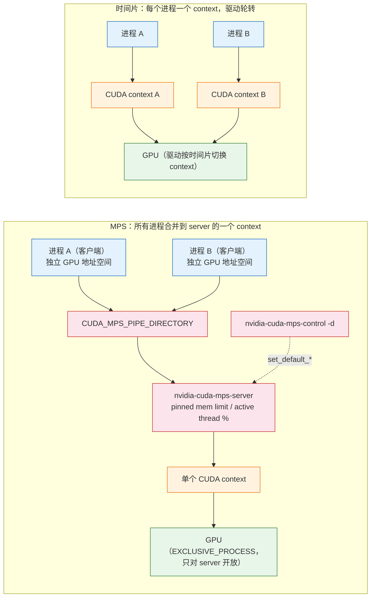
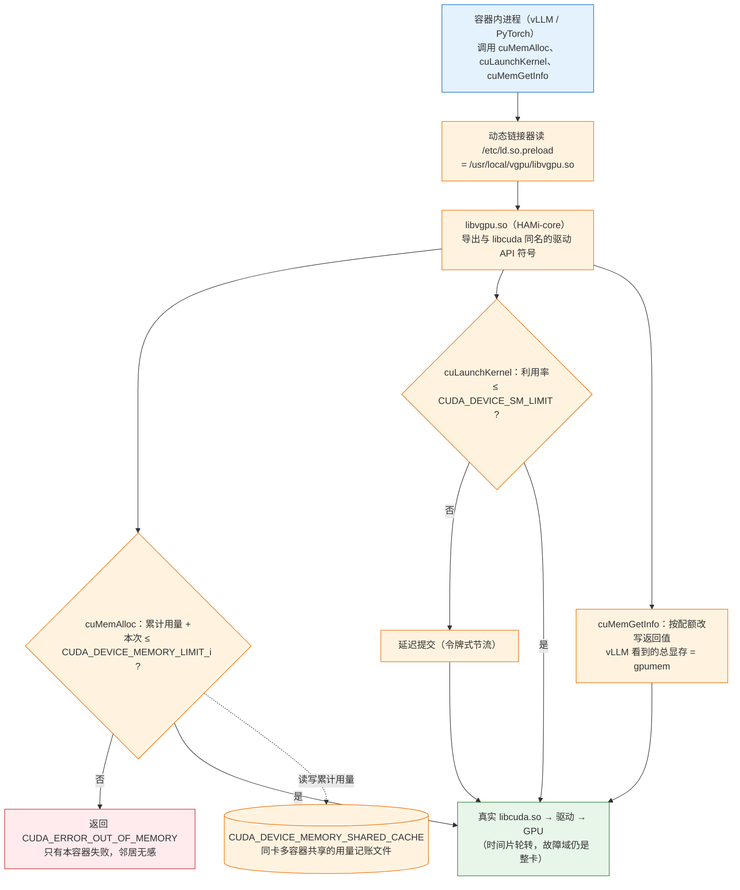

月底看账单，推理平台上一张 80 GB 的 H100 每小时几美元，一个月跑满是四位数。再看 DCGM 的曲线：这张卡上唯一的服务是一个 7B 模型的 vLLM 副本，`DCGM_FI_DEV_FB_USED` 常年 22 GB 左右，`DCGM_FI_PROF_SM_ACTIVE` 白天峰值不到 30%，夜里几乎是零。也就是说，这张卡四分之三的显存和七成以上的算力在付费但没有产出。集群里这样的卡有几十张：每个团队的每个小模型都要"一张卡"，因为 `nvidia.com/gpu: 1` 是 device plugin 唯一听得懂的请求。

于是有人把两个服务塞到同一张卡上——直接在 Pod 里不声明 GPU、用 `hostPath` 挂上 `/dev/nvidia*`。省了一半的钱，也带来了新的事故：一个服务的请求突增、KV cache 把显存吃到 79 GB，另一个服务在 `cudaMalloc` 上抛出 OOM 崩掉；两个服务的进程在同一张卡上轮转，尾延迟从 80 ms 涨到 300 ms，而且没人能说清楚哪个服务该为这 220 ms 负责。

这就是本篇的问题：**一张 GPU 怎样才能安全地给多个工作负载用？**"安全"有三个含义——显存隔离（一个进程的 OOM 不影响另一个）、算力隔离（一个进程的高负载不拖慢另一个）、故障隔离（一个进程触发的 GPU 错误不带倒另一个）。不同的共享机制在这三条上做到的程度完全不同，价格也不同：从"什么都不做"到 MIG 的硬件分区，隔离越强，灵活性和总利用率就越低。

NVIDIA 与开源社区给出了四层答案：不隔离的裸共享、驱动层的时间片、CUDA MPS 的进程合并、MIG 的硬件分区；在 K8s 上，前三层通过 NVIDIA device plugin 的 `sharing` 配置或 HAMi 这类第三方方案暴露成可请求的资源，MIG 通过 GPU Operator 的 MIG Manager 与 device plugin 的 `migStrategy` 接入。本篇逐一拆开这四层的机制、它们在 K8s 里的接线方式、对推理引擎吞吐的影响，最后回答总纲给本篇的核心问题：

> **同一张 A100 上跑三个小模型的推理服务，用 MIG `3g.20gb` + `3g.20gb`、用 HAMi 按显存切三份、用时间片开三个副本——三种方案在隔离性、总吞吐、故障影响范围上各自怎样？哪种方案下一个服务的 OOM 会拖垮另外两个？**

本篇源码与配置以 NVIDIA k8s-device-plugin v0.20.0、NVIDIA GPU Operator v26.7.0、HAMi v2.10.0、Kubernetes v1.37.0 为准。MIG 的几何约束、MPS 的语义、NCCL 对 MIG 的支持等硬件与驱动层事实，来自 NVIDIA 的 MIG 用户指南与 MPS 文档，正文中标为"以 NVIDIA 文档为准"，不写成实测。


## 一、总览：隔离与利用率的四档取舍

### 1. 引擎的需求

推理引擎对一张 GPU 的需求可以拆成三个量：

- **显存**是硬约束。vLLM 启动时按 `--gpu-memory-utilization`（默认 0.9）预留显存：权重加载后剩下的全部划给 KV cache。它把"这张卡有多少显存"当作事实，划完就不再归还。两个 vLLM 进程在同一张卡上各自预留 90%，第二个必然启动失败；即使调低到各 45%，任何一个进程的显存越界（CUDA graph 捕获、临时缓冲、碎片）都会撞到对方。引擎需要的是**一个不会被别人侵占、也不会侵占别人的显存上限**。
- **算力**是软约束。同一模型在 30% 算力和 100% 算力下都能跑，差别是吞吐和延迟。引擎需要的是**可预期的算力份额**——不是绝对数字，而是"邻居的负载变化不会让我的 P99 翻三倍"。
- **故障域**是运维约束。一个进程触发的 GPU 错误（Xid、非法地址访问、ECC 错误）是否会让同卡的其他进程一起被杀，决定了两个服务能不能放在一张卡上而不把 SLA 绑在一起。

训练任务的需求正好相反：它要**整张卡**，而且要卡之间的 NVLink 与 RDMA。切分对训练没有意义——一个被切掉一半 SM 的 GPU 只会让 all_reduce 等待更久。本篇讨论的共享全部针对推理服务与开发环境。

### 2. K8s 的空缺

Kubernetes 用 device plugin 把 GPU 表达为**整数个扩展资源**：节点上报 `nvidia.com/gpu: 8`，Pod 请求 `nvidia.com/gpu: 1`，kubelet 从空闲列表里挑一个设备 ID 交给容器。这套模型有三个洞：

1. **不可分割**：扩展资源只能是整数，请求 `0.5` 会被 API server 拒绝。没有"半张卡"。
2. **不可超卖**：一个设备 ID 同时只属于一个容器。kubelet 不知道 GPU 可以时间片共享，也无法表达"给这个容器 20 GB 显存"。
3. **没有属性**：device plugin 上报的只有 ID 与健康状态，调度器看不到显存大小、已用显存、SM 数量，无法按"剩余显存 ≥ 20 GB"选卡。上一篇的 DRA 在 v1.37 上补了属性与部分切分语义（本篇第五章第 5 节），但 NVIDIA 官方栈的主流路径仍是 device plugin。

所以所有共享方案在 K8s 侧的做法都是同一个技巧的变体：**把一张物理卡在 device plugin 里"复制"成 N 个逻辑设备**，让整数计数模型继续工作，再在底层用某种机制（驱动时间片、MPS、软件拦截、硬件分区）决定这 N 个逻辑设备如何分享物理卡。差别在于底层机制提供多强的隔离。

### 3. 平台的机制（全局图）

四层共享机制及其在 K8s 上的接线：

```text
                 隔离弱 ───────────────────────────────────────────▶ 隔离强

  层次        不隔离            时间片              MPS                 MIG
  ─────────────────────────────────────────────────────────────────────────────
  机制        多进程直接共用     驱动层按时间片轮转    进程合并到一个 CUDA    硬件分区：独立 SM、
              GPU               各进程的 CUDA context context，server 统一   L2 slice、显存与带宽
                                                    提交 kernel
  显存隔离    无                无                   有上限（pinned mem     有（物理隔离）
                                                    limit），软限制
  算力隔离    无                轮转，无份额保证      active thread          有（SM 物理划分）
                                                    percentage，软限制
  故障域      整卡              整卡                 有限隔离（Volta+），    单个 GI
                                                    server 挂则全挂
  开销        无                context 切换         几乎无 context 切换；   无切换开销；SM 与
                                                    server 多一跳          带宽被固定切走
  配置位置    Pod 里不声明 GPU  device plugin        device plugin          MIG Manager 节点标签
              （不推荐）        sharing.timeSlicing  sharing.mps +          + mig-parted + device
                                                    mps-control-daemon     plugin migStrategy
  硬件要求    任意              任意                 Volta+（独立地址空间）  A30/A100/H100/H200/
                                                                          B200 等数据中心卡
  K8s 资源    —                nvidia.com/gpu ×N    nvidia.com/gpu ×N      nvidia.com/gpu（single）
                                (或 .shared)        (或 .shared)           nvidia.com/mig-3g.20gb（mixed）

  第三方       HAMi：软件拦截（libvgpu.so）在时间片之上加显存与算力配额
              nvidia.com/gpu + nvidia.com/gpumem + nvidia.com/gpucores；调度器扩展按剩余显存选卡
```

HAMi 不是第五层，而是**在时间片之上用软件补上显存与算力配额**：它的隔离强度介于时间片与 MPS 之间，但请求模型比两者都细（按 MB 而不是按 1/N），而且不要求节点级统一配置。这四层加 HAMi 构成本篇的全部选项。

### 4. 本文的章节安排

```text
二、四个层次        每一层的机制、隔离强度、故障域、开销；为什么"不隔离"也是一个选项
三、MIG             GI/CI 与几何约束；A100/H100 的 profile；改配置为什么要清空 GPU；
                    K8s 接线：MIG Manager → mig.config 标签 → mig-parted → device plugin single/mixed；
                    NCCL 与 MIG
四、时间片与 MPS    device plugin 的 sharing 配置（完整 ConfigMap）；节点级生效与互斥；
                    renameByDefault / failRequestsGreaterThanOne；MPS 控制守护进程做了什么
五、HAMi            请求模型（gpumem / gpucores）与完整 Pod；libvgpu.so 拦截层；
                    scheduler extender 与打分策略；与官方插件互斥；动态 MIG；HAMi-DRA 与 DRA 切分语义
六、商业 vGPU       NVIDIA vGPU 在虚拟机场景的位置，为什么容器场景不是主流
七、对引擎的影响    1/7 的 MIG 实例 ≠ 1/7 的吞吐；memory-bound 与 compute-bound 的差别；决策树
八、核心问题        三方案对照表；哪种方案下一个 OOM 会拖垮另外两个
九、代价与边界      每种机制引入的新问题；什么场景不该用
十、实践            mini-platform/share/：MIG 配置、HAMi 两服务共卡、时间片 ConfigMap、压测与 OOM 演练
十一、小结          要点、四栏表、源码位置、练手项目增量
```


## 二、共享的四个层次

### 1. 不隔离：多进程直接共用

CUDA 从来不禁止多个进程同时打开一张 GPU。默认计算模式（`Default`）下，每个进程创建自己的 CUDA context，驱动在这些 context 之间做时间片轮转。所以"不隔离"和"时间片"在硬件层面是同一件事——差别只在 K8s 侧：不隔离指的是绕过 device plugin，在 Pod 里用 `hostPath` 挂 `/dev/nvidia*` 或直接设 `NVIDIA_VISIBLE_DEVICES`，让 kubelet 完全不知道这个 Pod 用了 GPU。

它的代价不在 GPU 上，在调度上：kubelet 的资源账本里这张卡是空的，调度器可以把一个 `nvidia.com/gpu: 1` 的 Pod 也放上来，与这些"隐形"进程争抢；节点扩缩容、驱逐、成本分摊都看不到它们。这是开发机上的做法，不是平台的做法。本篇后面不再讨论它，但要记住：**时间片方案的 GPU 行为与它完全一样**，只是多了 kubelet 的账本。

### 2. 时间片：驱动层的轮转

多个 CUDA context 共享一张 GPU 时，驱动按时间片调度：一个 context 的 kernel 跑完一个片就切换到下一个，切换时保存与恢复上下文状态。这是 GPU 的默认行为，不需要任何配置。它的性质：

- **没有显存隔离**。每个 context 都能看到整卡显存、都能 `cudaMalloc` 到用尽为止。谁先分谁得，后来者 OOM。
- **没有算力份额**。轮转是公平的，但一个 context 提交了大 kernel 就占满自己的片，另一个 context 只能等；跑三个进程时每个进程的墙钟时间大致拉长三倍，且随邻居负载波动。
- **单一故障域**。一个进程触发 Xid 错误（非法内存访问、ECC 不可纠正错误）时，驱动的处理通常是重置受影响的 context 或整个 GPU；后一种情形下同卡所有进程一起死。NVIDIA k8s-device-plugin 的 README（"Shared Access to GPUs"）直接写明：时间片下的工作负载"runs in the same fault-domain as of all the others (meaning if one workload crashes, they all do)"。
- **有切换开销**。context 切换要保存寄存器、共享内存等状态，粒度是毫秒级时间片；对延迟敏感的推理请求，这个开销体现为尾延迟抖动。

时间片适合的场景是**算力需求稀疏、互相不在乎**的负载：开发环境的 notebook、偶尔跑一下的测试、夜间批处理。它不适合两个都在线的推理服务。

### 3. MPS：进程合并到一个 context

CUDA Multi-Process Service 换了一种思路：不让多个 context 轮转，而是起一个 MPS server 进程，所有客户端进程的 CUDA 调用经 server 代理，在**一个** GPU context 里并发执行。多个客户端的 kernel 可以真正同时跑在不同的 SM 上，没有 context 切换。Volta 起的 MPS 给每个客户端独立的 GPU 地址空间，并提供两个限制手段（以 NVIDIA MPS 文档为准）：

- `CUDA_MPS_PINNED_DEVICE_MEM_LIMIT`（或控制命令 `set_default_device_pinned_mem_limit`）：每个客户端能分配的显存上限；
- `CUDA_MPS_ACTIVE_THREAD_PERCENTAGE`（或 `set_default_active_thread_percentage`）：每个客户端可用的 SM 比例。

时间片与 MPS 的结构差别在 context 的数量与位置：



两者都是**软限制**：显存上限由 MPS server 在分配时检查，越界的 `cudaMalloc` 失败——这确实让一个客户端的 OOM 不再蔓延到别人；算力比例限制的是客户端可占用的 SM 上限，不保证下限。故障域上，Volta 起 MPS 对致命错误有有限的隔离（受影响的客户端被终止，其他客户端可能继续），但 MPS server 本身崩溃会带走所有客户端；具体行为以 NVIDIA MPS 文档为准。

MPS 的另一个硬性前提：GPU 要设为 `EXCLUSIVE_PROCESS` 计算模式，只允许 MPS server 一个进程直接打开它。这意味着**MPS 与直接使用 GPU 的进程互斥**，也意味着开关 MPS 要先清空 GPU 上的进程。

### 4. MIG：硬件分区

Multi-Instance GPU 是 Ampere 起数据中心 GPU（A30、A100、H100、H200、B200 等）的硬件特性：把一张 GPU 划成最多 7 个 **GPU Instance（GI）**，每个 GI 拥有独立的 SM 集合、独立的 L2 cache slice、独立的显存分区与显存控制器（因此带宽也独立）、独立的 copy engine 等。GI 之间没有任何共享的执行资源，一个 GI 上的进程无论做什么——占满 SM、打满带宽、触发致命错误——另一个 GI 都不受影响。这是四层中唯一提供**硬件级**显存、算力、故障三重隔离的机制。

每个 GI 内部还可以再划 **Compute Instance（CI）**：多个 CI 共享同一个 GI 的显存与带宽，但各自有独立的 SM。CI 之间显存不隔离，用途是让同一显存分区里的两组 kernel 并行。K8s 侧默认每个 GI 一个 CI（device plugin `mixed` 策略只上报 `C == G` 的 profile，第三章第 3 节），本篇不展开 CI。

MIG 的代价来自"硬"：分区几何是固定的枚举（第三章），改几何要清空 GPU，切下来的 SM 与带宽不能借给邻居；一个 GI 空闲时它的资源就是空闲的，没有超卖。它把利用率问题从"谁来抢"变成了"分几块"。

把三种机制下两个进程的 kernel 在 SM 上的占用画到同一条时间轴上，"轮转"、"并发"、"分区"的差别就很直观：

```text
  横轴 = 时间，纵轴 = SM；A / B = 两个进程的 kernel；s = context 切换；. = 空闲

  时间片：同一时刻只有一个 context 在 GPU 上，A、B 轮转，各自独占全部 SM
  SM 高 ┤AAAAAAAAsBBBBBBBBsAAAAAAAAsBBBBBBBBsAAAA
        │AAAAAAAAsBBBBBBBBsAAAAAAAAsBBBBBBBBsAAAA
        │AAAAAAAAsBBBBBBBBsAAAAAAAAsBBBBBBBBsAAAA
  SM 0  ┤AAAAAAAAsBBBBBBBBsAAAAAAAAsBBBBBBBBsAAAA
        └────────────────────────────────────────▶ t
        A 的墙钟 ≈ 单跑的 2 倍 + 切换开销，随 B 负载波动；显存整卡可见、先到先得

  MPS：一个 context，A、B 的 kernel 同时占不同 SM（active thread % 各 50）
  SM 高 ┤BBBBBBBBBBBBBB........BBBBBBBBBBBBBBBBBB   ← B 的上限 50%
        │BBBBBBBBBBBBBB........BBBBBBBBBBBBBBBBBB
        │AAAAAAAAAAAAAAAAAAAAAAAAAAAAAAAAAAAAAAAA   ← A 的上限 50%：B 空闲时
  SM 0  ┤AAAAAAAAAAAAAAAAAAAAAAAAAAAAAAAAAAAAAAAA      A 也拿不到上面的 SM
        └────────────────────────────────────────▶ t
        无切换；显存按 pinned mem limit 软限制；带宽与 L2 共享；server 崩则全崩

  MIG：两个 GI，各有独立的 SM、L2 slice、显存分区与带宽
  GI-1  ┤BBBBBB......BBBBBBBBBBBBB......BBBBBBBBB
  (3g)  │BBBBBB......BBBBBBBBBBBBB......BBBBBBBBB
  ──────┼────────────────────────────────────────   ← 硬件边界：OOM / Xid 不越过
  GI-0  │AAAAAAAAAAAAAAAAAAAAAAAAAAAAAAAAAAAAAAAA
  (3g)  ┤AAAAAAAAAAAAAAAAAAAAAAAAAAAAAAAAAAAAAAAA
        └────────────────────────────────────────▶ t
        A 的性能与 B 完全无关；B 空闲时它的 SM 与带宽也空着（无超卖）
```

### 5. 四层对照

| | 不隔离 | 时间片 | MPS | MIG |
|---|---|---|---|---|
| 显存隔离 | 无 | 无 | 有上限（软） | 物理隔离 |
| 算力隔离 | 无 | 轮转，无份额 | SM 比例上限（软） | SM 物理划分 |
| 故障域 | 整卡 | 整卡 | 有限隔离；server 是单点 | 单个 GI |
| 性能开销 | context 切换 | context 切换 | 几乎无切换；多一跳代理 | 无切换；资源固定切走 |
| 配置位置 | Pod `hostPath`（不推荐） | device plugin `sharing.timeSlicing` | device plugin `sharing.mps` + mps-control-daemon | MIG Manager 标签 → mig-parted；device plugin `migStrategy` |
| 生效范围 | 单 Pod | 节点级，所有卡 | 节点级，所有卡 | 单卡可不同（mig-parted `devices` 列表） |
| 硬件要求 | 任意 | 任意 | Volta+ | Ampere+ 数据中心卡 |
| 与其他机制 | — | 与 MPS 互斥 | 与时间片互斥；不支持 MIG 设备 | MIG 设备上可再叠时间片 |
| 动态调整 | — | 改 ConfigMap，重启 plugin | 改 ConfigMap，重启 plugin 与 MPS | 清空 GPU 后重新 apply |

"与其他机制"一列有两个细节值得记住：device plugin 的 README 明确"Time-slicing and MPS are mutually exclusive"、"Sharing with MPS is currently not supported on devices with MIG enabled"；而时间片可以叠在 MIG 设备上——README 列出 A100 上可时间片化的资源包括 `nvidia.com/mig-1g.5gb` 等。第八章回答核心问题时会用到这一点。


## 三、MIG：硬件分区与 K8s 的接线

### 1. 几何：slice、profile 与合法组合

MIG 把 GPU 的资源切成 **slice**：A100 有 7 个计算 slice（每个 14 个 SM，对应 GFD 标签 `nvidia.com/gpu.multiprocessors: 14` 的样例值）和 8 个显存 slice（40 GB 卡每片 5 GB，80 GB 卡每片 10 GB）。一个 **profile** 是"几个计算 slice + 几个显存 slice"的组合，命名为 `<计算 slice 数>g.<显存 GB>gb`。以下为 NVIDIA MIG 用户指南列出的常用 profile（以 NVIDIA 文档为准，SM 数与实例数随驱动版本可能微调）：

| Profile | 计算 slice | 显存 slice | 最多实例数 | 备注 |
|---|---|---|---|---|
| A100 40 GB：`1g.5gb` | 1 | 1 | 7 | 最小单元 |
| A100 40 GB：`1g.10gb` | 1 | 2 | 4 | 显存加倍的 1g |
| A100 40 GB：`2g.10gb` | 2 | 2 | 3 | |
| A100 40 GB：`3g.20gb` | 3 | 4 | 2 | 两个共占 6 个计算 slice，剩 1 个无法使用 |
| A100 40 GB：`4g.20gb` | 4 | 4 | 1 | |
| A100 40 GB：`7g.40gb` | 7 | 8 | 1 | 整卡 |
| A100 80 GB / H100 80 GB：`1g.10gb` | 1 | 1 | 7 | |
| A100 80 GB / H100 80 GB：`1g.20gb` | 1 | 2 | 4 | |
| A100 80 GB / H100 80 GB：`2g.20gb` | 2 | 2 | 3 | |
| A100 80 GB / H100 80 GB：`3g.40gb` | 3 | 4 | 2 | |
| A100 80 GB / H100 80 GB：`4g.40gb` | 4 | 4 | 1 | |
| A100 80 GB / H100 80 GB：`7g.80gb` | 7 | 8 | 1 | 整卡 |

这张表与 GPU Operator v26.7.0 `assets/state-mig-manager/0400_configmap.yaml` 里 `default-mig-parted-config` 的 `all-1g.5gb`（`"1g.5gb": 7`）、`all-3g.20gb`（`"3g.20gb": 2`）、`all-1g.10gb`（H100/A100 80 GB 为 `"1g.10gb": 7`）等条目一致。带 `+me` 后缀的 profile（如 `1g.5gb+me`）额外带上视频编解码等媒体引擎，本篇不涉及。

三条几何规则决定了什么组合合法：

1. **计算 slice 总数 ≤ 7，显存 slice 总数 ≤ 8**。`3g.20gb × 2` 用掉 6 个计算 slice 与全部 8 个显存 slice——第 7 个计算 slice 没有显存可配，被浪费。这是核心问题里 `3g.20gb + 3g.20gb` 只能得到**两个**实例的原因。
2. **每个 profile 只能放在固定的位置**（placement）。GI 不是任意排列：`4g.20gb` 只能占前四个 slice，`3g.20gb` 有两个合法起点，`2g.10gb` 有三个。一张卡上先创建的 GI 会限制后续 GI 的可选位置，产生碎片。
3. **混合几何合法但受上述约束**。A100 40 GB 上 `3g.20gb + 2g.10gb + 1g.5gb`（6 计算 / 7 显存）和 `4g.20gb + 3g.20gb`（7 / 8）都合法；GPU Operator 的 `all-balanced` 配置在 80 GB 卡上用的是 `1g.10gb × 2 + 2g.20gb × 1 + 3g.40gb × 1`。

把 A100 40 GB 的 7 个计算 slice 与 8 个显存 slice 画成一排格子，几个常见几何的占位如下（placement 以 NVIDIA MIG 用户指南为准，此处为示意）：

```text
  计算 slice（7 个，每个 14 SM）        显存 slice（8 个，每个 5 GB）
  位置:  0    1    2    3    4    5    6      0   1   2   3   4   5   6   7

  all-1g.5gb（7 个实例）
       ┌────┬────┬────┬────┬────┬────┬────┐  ┌───┬───┬───┬───┬───┬───┬───┬───┐
       │ 1g │ 1g │ 1g │ 1g │ 1g │ 1g │ 1g │  │ 1 │ 2 │ 3 │ 4 │ 5 │ 6 │ 7 │ - │
       └────┴────┴────┴────┴────┴────┴────┘  └───┴───┴───┴───┴───┴───┴───┴───┘
       7 个 1g 实例用掉 7 个显存 slice，第 8 片空着                          ▲

  all-3g.20gb（2 个实例）—— 核心问题的方案一
       ┌──────────────┬──────────────┬────┐  ┌───────────────┬───────────────┐
       │   3g.20gb A  │   3g.20gb B  │ .. │  │   A（4 片）   │   B（4 片）   │
       └──────────────┴──────────────┴────┘  └───────────────┴───────────────┘
                                        ▲ 第 7 个计算 slice 没有显存可配，浪费

  4g.20gb + 3g.20gb（7 / 8，用满）
       ┌───────────────────┬──────────────┐  ┌───────────────┬───────────────┐
       │      4g.20gb      │   3g.20gb    │  │   4 片        │   4 片        │
       └───────────────────┴──────────────┘  └───────────────┴───────────────┘
       4g 只能从位置 0 起；3g 有两个合法起点（0 或 4）

  3g.20gb + 2g.10gb + 1g.5gb（6 / 7）
       ┌──────────────┬─────────┬────┬────┐  ┌───────────────┬───────┬───┬───┐
       │   3g.20gb    │ 2g.10gb │ 1g │ .. │  │   4 片        │ 2 片  │ 1 │ - │
       └──────────────┴─────────┴────┴────┘  └───────────────┴───────┴───┴───┘

  碎片：先建 2g.10gb 于位置 4-5，再想放 4g.20gb（只能占 0-3）仍可；
        但若先建 1g.5gb 于位置 2，4g.20gb 就再也放不下——placement 固定导致的碎片
```

### 2. 重新配置为什么要清空 GPU

MIG 的两级操作各有前提（以 NVIDIA MIG 用户指南为准）：

- **开关 MIG 模式**（`nvidia-smi -mig 1/0`）要求 GPU 上没有任何进程，且要 GPU 重置生效；在一些平台上需要重启节点。
- **创建 / 销毁 GI 与 CI** 要求受影响的 GI 上没有进程。理论上一张卡上有空闲位置时可以只增删一个 GI 而不动其他 GI；但 MIG Manager 采用的是"整卡几何"模型——一个配置名对应整张卡（或按 `devices` 列表选定的几张卡）的完整布局，切换配置就是把这些卡上的所有 GI 销毁重建，所以实际操作上要先把这些卡上的 Pod 全部驱逐。

这决定了 MIG 在平台上的使用方式：**几何是提前规划的、按节点池固定的**，不是随每个 Pod 的请求动态调整的。一个节点池全部切成 `all-1g.10gb` 给小模型，另一个池 `all-3g.40gb` 给中等模型，第三个池不开 MIG 给训练。改布局是一次运维变更，要排空节点。HAMi v2.10.0 的动态 MIG 试图改变这一点（第五章第 4 节）。

### 3. K8s 接线：从节点标签到 `nvidia.com/mig-3g.20gb`

GPU Operator v26.7.0 把 MIG 的生命周期拆给三个组件：

```text
  运维改标签                     MIG Manager（DaemonSet）                    device plugin + GFD
  ────────────                   ────────────────────────                    ───────────────────
  kubectl label node n1 \    ──▶ 监听 nvidia.com/mig.config 变化         ──▶ migStrategy=single:
    nvidia.com/mig.config=       读取 mig-parted ConfigMap 里同名配置          所有 GI 统一上报为 nvidia.com/gpu
    all-3g.20gb                  停掉 GPU 客户端（gpu-clients 列表：           GFD 覆盖 nvidia.com/gpu.product
                                   dcgm、dcgm-exporter、device plugin…）        为 A100-SXM4-40GB-MIG-3g.20gb
                                 nvidia-mig-parted apply（必要时先开 MIG 模式）
                                 重新拉起客户端                            ──▶ migStrategy=mixed:
                                 写回状态标签（成功 / 失败 / 进行中）             每种 profile 一个资源名
                                                                                nvidia.com/mig-3g.20gb: 2
```

各环节对应的源码与配置：

- **ClusterPolicy 字段**（`gpu-operator api/nvidia/v1/clusterpolicy_types.go`）：`MIGManagerSpec`（`spec.migManager`，`Enabled`、`Config *MIGPartedConfigSpec`、`GPUClientsConfig`）；`MIGPartedConfigSpec.Name` 指定自定义 mig-parted ConfigMap，注释写明"If not specified, MIG configuration will be dynamically generated from hardware"；`MIGPartedConfigSpec.Default` 是节点没有 `nvidia.com/mig.config` 标签时的默认配置，枚举只允许 `all-disabled` 或空。`MIGSpec.Strategy`（`spec.mig.strategy`）取 `none` / `single` / `mixed`，同时传给 GFD 与 device plugin。
- **标签**：`controllers/state_manager.go` 定义 `migConfigLabelKey = "nvidia.com/mig.config"`、`migCapableLabelKey = "nvidia.com/mig.capable"`、`migManagerLabelKey = "nvidia.com/gpu.deploy.mig-manager"`；`addGPUStateLabels` 在容器工作负载模式下对 `mig.capable=true` 的节点自动加 `gpu.deploy.mig-manager=true`，MIG Manager DaemonSet 只落在这些节点上。状态回写标签（`nvidia.com/mig.config.state`）由 MIG Manager 自身（`mig-parted` 仓库）写入，GPU Operator 检出里没有它的定义，以 MIG Manager 文档为准。
- **默认配置**：`assets/state-mig-manager/0400_configmap.yaml` 是 `default-mig-parted-config`，`mig-configs` 下每个键是一个可用的标签值：`all-disabled`、`all-enabled`、`all-1g.5gb`、`all-3g.20gb`、`all-1g.10gb`、`all-balanced` 等，条目用 `device-filter` 按 PCI 设备 ID 区分 A100 40 GB / 80 GB / H100 / H200 / B200。`0410_configmap.yaml` 是 `default-gpu-clients`，列出重新配置前要停掉的宿主机服务（`nvidia-dcgm.service`、`dcgm-exporter.service` 等）；`0600_daemonset.yaml` 把两者挂到 `/mig-parted-config` 与 `/gpu-clients`。Helm values 里 `mig.strategy` 默认 `single`，`migManager.enabled` 默认 `true`，MIG Manager 镜像为 `k8s-mig-manager` v0.15.0。

device plugin 侧（`k8s-device-plugin v0.20.0`）把 GI 变成 K8s 资源的逻辑在 `internal/rm`：

- `rm.go` 的 `AddDefaultResourcesToConfig`：先无条件加 `nvidia.com/gpu`（pattern `*`）；`migStrategy=single` 时把所有 MIG 设备也映射到 `nvidia.com/gpu`（`AddMIGResource("*", "gpu")`）；`mixed` 时遍历 NVML 可见的 MIG profile，跳过 `C != G` 的（即只上报 CI 数等于 GI slice 数的整 GI），资源名为 `"mig-" + profile`，`+` 替换为 `.`——这就是 `nvidia.com/mig-3g.20gb`、`nvidia.com/mig-1g.5gb.me` 的来源。
- `device_map.go` 的 `buildDeviceMapFromConfigResources`：`buildGPUDeviceMap` 跳过已开 MIG 的整卡（`migEnabled && migStrategy != none`），`buildMigDeviceMap` 逐个 GI 匹配 profile pattern；`single` 策略要求 `assertAllMigDevicesAreValid(uniform=true)`——节点上所有 MIG 设备属性必须完全一致（"more than one MIG device type present on node"），且不允许 MIG 卡与非 MIG 卡混在同一节点（"all devices on the node must be configured with the same migEnabled value"）。
- GFD（`docs/gpu-feature-discovery/README.md`）：`single` 下把 `nvidia.com/gpu.product` 改写为 `A100-SXM4-40GB-MIG-1g.5gb`、`gpu.count` 改为 GI 总数、`gpu.memory` 改为单个 GI 的显存，并加 `nvidia.com/gpu.slices.gi` / `slices.ci` / `multiprocessors` / `engines.*`；`mixed` 下为每种 profile 生成 `nvidia.com/mig-3g.20gb.count` 等一组标签，`nvidia.com/mig.strategy` 标出策略。

`single` 与 `mixed` 的选择是平台侧的一个真实取舍：`single` 让用户继续写 `nvidia.com/gpu: 1`，不需要知道 MIG 的存在，但要求全节点统一几何，而且用户拿到的"一张卡"可能只有 5 GB 显存——他们要靠 `nodeSelector` 选 `gpu.product` 标签才能确定拿到什么；`mixed` 让请求显式（`nvidia.com/mig-3g.20gb: 1`），允许一个节点上混合几何，但每一种 profile 都是独立的配额与队列，容量规划要按 profile 做。

### 4. NCCL 与 MIG：训练几乎不切分

NVIDIA MIG 用户指南写明 MIG 实例之间**不支持 GPU 到 GPU 的 P2P**（无论 PCIe 还是 NVLink），也不支持跨 GI 的 CUDA IPC；因此 NCCL 不能在同一张卡的多个 GI 之间、也不能跨卡的 GI 之间建立通信。结论是：一个 MIG 实例只能承载单进程的工作负载——单 GI 内的多 CI 也不例外。数据并行、张量并行、流水并行都依赖 NCCL，所以训练任务不会用 MIG；即使一个实验只需要 5 GB 显存，它要么拿整卡，要么单进程跑在一个 GI 里而放弃分布式。

这也解释了为什么 MIG 节点池与训练节点池必须分开：一张开了 MIG 的卡从 NCCL 的视角是"不存在"的，混在训练池里只会让 gang scheduling 凑不齐卡。


## 四、时间片与 MPS：device plugin 的 `sharing` 配置

### 1. 配置模型：`api/config/v1`

k8s-device-plugin v0.20.0 的配置文件由 `api/config/v1/config.go` 的 `Config` 定义：`version: v1`，四个段 `flags`、`resources`、`sharing`、`imex`。共享相关的是 `sharing`（`sharing.go` 的 `Sharing`）：

```go
type Sharing struct {
    TimeSlicing ReplicatedResources  `yaml:"timeSlicing,omitempty"`
    MPS         *ReplicatedResources `yaml:"mps,omitempty"`
}
```

两者共用 `replicas.go` 的 `ReplicatedResources`：

- `renameByDefault`（bool）：为 `true` 时被复制的资源以 `<原名>.shared` 上报（`ResourceName.DefaultSharedRename`，后缀常量 `DefaultSharedResourceNameSuffix = ".shared"`），如 `nvidia.com/gpu.shared`。目的是让用户知道自己拿到的是共享访问权而非独占卡。
- `failRequestsGreaterThanOne`（*bool）：为 `true` 时，一个容器请求超过 1 个共享资源会在 `Allocate` 时被拒绝（`rm.go` 的 `ValidateRequest`："maximum request size for shared resources is 1"），Pod 以 `UnexpectedAdmissionError` 失败。README 建议开启：请求 2 个副本不会得到两倍算力，只是两份同一张卡的访问权。注意 `config.go` 的 `NewConfig` 对 MPS 有特殊处理——`sharing.mps` 存在而未显式设置该字段时默认置为 `true`；时间片默认 `false`。
- `resources`：列表，每项 `name`（要复制的资源，如 `nvidia.com/gpu` 或 `nvidia.com/mig-1g.5gb`）、`replicas`（≥ 2，`ReplicatedResource.UnmarshalJSON` 校验 "number of replicas must be >= 2"）、可选 `rename` 与 `devices`（`all` / 数量 / 索引与 UUID 列表；但 `config.go` 的 `DisableResourceNamingInConfig` 在当前版本把 `rename` 与非 `all` 的 `devices` 忽略并打警告，即**只能对全部设备统一复制**）。

`Sharing.SharingStrategy()` 决定生效的是哪一种：`mps` 配置了 `replicas > 1` 则为 `mps`，否则 `timeSlicing` 配置了则为 `time-slicing`，否则 `none`。也就是两者同时写时 MPS 优先，但 README 的立场是它们互斥，不要同时写。

复制的实现在 `internal/rm/device_map.go` 的 `updateDeviceMapWithReplicas`：对每个匹配的物理设备生成 `replicas` 个 `Device`，ID 为 `NewAnnotatedID(id, i)`（原 UUID 加副本序号的注解形式），`Paths`、`TotalMemory`、`Topology` 全部复制自原设备，`Replicas` 记为副本总数。kubelet 看到的就是 N 个健康设备。分配时 `allocate.go` 按 `sharedDevicesAllocationPolicy`（`distributed` 默认 / `packed`，`cmd/nvidia-device-plugin/main.go` 的 `--shared-devices-allocation-policy`）决定是把新请求摊到最少被用的物理卡上还是先填满一张。

### 2. 时间片：完整 ConfigMap

下面是一份可直接 `kubectl apply` 的 ConfigMap，配合 GPU Operator 使用时由 `ClusterPolicy.spec.devicePlugin.config`（`DevicePluginSpec.Config *DevicePluginConfig`，字段 `name` / `default`）引用；裸 Helm 部署时对应 chart 的 `config.name` / `config.default`：

```yaml
apiVersion: v1
kind: ConfigMap
metadata:
  name: device-plugin-config
  namespace: gpu-operator
data:
  # 默认：不共享
  default: |-
    version: v1
    flags:
      migStrategy: none
  # 开发环境节点：每张卡 4 个时间片副本，改名为 nvidia.com/gpu.shared
  time-slicing-4: |-
    version: v1
    flags:
      migStrategy: none
    sharing:
      timeSlicing:
        renameByDefault: true
        failRequestsGreaterThanOne: true
        resources:
        - name: nvidia.com/gpu
          replicas: 4
```

```yaml
apiVersion: nvidia.com/v1
kind: ClusterPolicy
metadata:
  name: cluster-policy
spec:
  devicePlugin:
    enabled: true
    config:
      name: device-plugin-config
      default: default
  # ……其余字段（driver、toolkit、dcgmExporter 等）省略
```

哪个节点用哪份配置由节点标签 `nvidia.com/device-plugin.config=<键名>` 决定（README "Catalog of Labels"），例如 `kubectl label node dev-1 nvidia.com/device-plugin.config=time-slicing-4`；`cmd/config-manager` 监听该标签的变化，把对应配置写到目标路径并向 `nvidia-device-plugin` 进程发 `SIGHUP`（`DefaultSignal`）使其重载。生效后：

```text
$ kubectl describe node dev-1
Capacity:
  nvidia.com/gpu.shared:  32        # 8 卡 × 4 副本
Labels:
  nvidia.com/gpu.sharing-strategy=time-slicing
  nvidia.com/gpu.replicas=4
```

`nvidia.com/gpu.sharing-strategy` 与 `nvidia.com/gpu.replicas` 是 GFD 在共享模式下追加的标签（`internal/lm/resource.go` 写 `sharing-strategy`）；若没有 `renameByDefault`（资源名仍是 `nvidia.com/gpu`），GFD 会给 `nvidia.com/gpu.product` 追加 `-SHARED` 后缀以示区别（`resourceLabeler` 中 `isShared() && !isRenamed()` 的分支），改名后则不加。

三个要点，全部来自 README "With CUDA Time-Slicing"：

1. **节点级生效**："the same sharing method is applied to all GPUs on a node. You cannot configure sharing on a per-GPU basis"。一台机器要么全部时间片，要么全部不。
2. **没有隔离**：plugin "simply creates 10 references to each GPU and indiscriminately hands them out"。显存、算力、故障域与第二章第 2 节描述的裸时间片完全相同。
3. **可叠在 MIG 上**：`resources[].name` 可以是 `nvidia.com/mig-1g.5gb` 这类 `mixed` 策略产生的资源，即一个 GI 再切成若干时间片副本。

### 3. MPS：ConfigMap 与控制守护进程

MPS 的配置形状与时间片相同，只是键换成 `mps`：

```yaml
apiVersion: v1
kind: ConfigMap
metadata:
  name: device-plugin-config
  namespace: gpu-operator
data:
  mps-4: |-
    version: v1
    flags:
      migStrategy: none
    sharing:
      mps:
        renameByDefault: true
        resources:
        - name: nvidia.com/gpu
          replicas: 4
```

不同的是背后多了一个进程。v0.20.0 的 `cmd/mps-control-daemon` 是随 device plugin 一起部署的 DaemonSet（GPU Operator 通过 `DevicePluginSpec.MPS *MPSConfig` 的 `root` 字段指定宿主机目录，默认 `/run/nvidia/mps`；plugin 侧对应 `flags.mpsRoot`）。它的 `mps/daemon.go` 的 `Daemon.Start` 做了四件事：

1. 用 `nvidia-smi -i <uuid> -c EXCLUSIVE_PROCESS` 把每张卡设为独占进程模式（`setComputeMode`）；
2. 以 `CUDA_MPS_PIPE_DIRECTORY` 等环境变量启动 `nvidia-cuda-mps-control -d`；
3. 对每张卡下发 `set_default_device_pinned_mem_limit <index> <总显存/replicas>M`（`perDevicePinnedDeviceMemoryLimits`）——**每个客户端的显存上限是均分的**，没有按需分配；
4. 下发 `set_default_active_thread_percentage <100/replicas>`（`activeThreadPercentage`）——算力也是均分。

容器侧，`internal/plugin/mps.go` 的 `updateReponse` 在 `Allocate` 响应里注入 `CUDA_MPS_PIPE_DIRECTORY` 环境变量，并挂载 MPS 的 pipe 目录与 `/dev/shm`，容器内的 CUDA 运行时据此连接到宿主机的 MPS server。`getMPSOptions` 里有一条硬检查：资源中含 MIG 设备则直接报错 "sharing using MPS is not supported for MIG devices"。

三条边界，来自 README "With CUDA MPS"：

- "As of v0.15.0 of the device plugin, MPS support is considered experimental"——v0.20.0 的 README 仍保留这条警告；
- "Sharing with MPS is currently not supported on devices with MIG enabled"；
- "the only supported resource available for MPS are `nvidia.com/gpu` resources and only with full GPUs"。

MPS 比时间片多出的是显存上限与 SM 比例；比 HAMi 少的是粒度（只能 1/N 均分）与灵活性（节点级、需要独占计算模式、开关要清空 GPU）。它在 K8s 上的位置比较尴尬：要隔离就直接上 MIG，要弹性就用 HAMi。它最适合的场景是**同一模型的多个相同副本**共卡——例如一张 H100 上跑四个 7B 服务副本，每个副本的显存与算力需求一样，均分正好。


## 五、HAMi：软件层的显存与算力配额

### 1. 请求模型

HAMi（Heterogeneous AI Computing Virtualization Middleware，CNCF 孵化项目）把一张 NVIDIA GPU 表达成四个资源（`HAMi charts/hami/values.yaml`，名称可改）：

| 资源 | 默认名 | 含义 |
|---|---|---|
| `resourceName` | `nvidia.com/gpu` | 需要几张物理卡（每张卡上一个 vGPU） |
| `resourceMem` | `nvidia.com/gpumem` | 每张卡分给容器的显存，单位 MB |
| `resourceMemPercentage` | `nvidia.com/gpumem-percentage` | 每张卡显存的百分比，与 `gpumem` 二选一 |
| `resourceCores` | `nvidia.com/gpucores` | 每张卡算力的百分比（0–100） |
| `resourcePriority` | `nvidia.com/priority` | 任务优先级，注入 `CUDA_TASK_PRIORITY` |

它们对应 `pkg/device/nvidia/device.go` 的 `NvidiaConfig` 字段 `ResourceCountName` / `ResourceMemoryName` / `ResourceMemoryPercentageName` / `ResourceCoreName` / `ResourcePriority`，由 chart 的 `templates/scheduler/device-configmap.yaml` 渲染进 `device-config.yaml`。`gpumem` 与 `gpucores` 都是可选的：不写 `gpumem` 时按 `defaultMemory`（默认 0，表示整卡）、不写 `gpucores` 时按 `defaultCores`（默认 0，表示不限）。

一个完整的、按显存共卡的 vLLM Pod（`examples/nvidia/default_use.yaml` 的形状）：

```yaml
apiVersion: v1
kind: Pod
metadata:
  name: vllm-qwen-7b
  annotations:
    hami.io/gpu-scheduler-policy: binpack      # 可选：卡内优先装满
spec:
  containers:
  - name: vllm
    image: vllm/vllm-openai:v0.28.0
    args:
    - --model=Qwen/Qwen2.5-7B-Instruct
    - --max-model-len=8192
    - --gpu-memory-utilization=0.9
    - --port=8000
    ports:
    - containerPort: 8000
    resources:
      limits:
        nvidia.com/gpu: 1            # 一张物理卡上的一个 vGPU
        nvidia.com/gpumem: 24000     # 24 GB 显存
        nvidia.com/gpucores: 40      # 40% 算力
```

请求语义与 device plugin 的 `replicas` 有本质区别：时间片 / MPS 的"副本"是**均分**（1/N），HAMi 的 `gpumem` 是**按需**——一张 80 GB 卡可以放一个 24 GB 加一个 50 GB 的服务，调度器按剩余显存而非剩余副本数做决定。

### 2. 拦截层：`libvgpu.so`

HAMi 在容器内强制显存与算力上限的方式是 **CUDA 驱动 API 拦截**。核心库 `libvgpu.so` 来自独立仓库 HAMi-core（HAMi 仓库的 `.gitmodules` 把它作为子模块 `libvgpu` 引入，指向 `Project-HAMi/HAMi-core`；本文没有检出该仓库，拦截的具体函数以 HAMi-core 文档为准）。HAMi 主仓库里能看到的是**注入方式**——`pkg/device-plugin/nvidiadevice/nvinternal/plugin/server.go` 的 `Allocate` 在非 MIG 模式下：

- 环境变量：`CUDA_DEVICE_MEMORY_LIMIT_<i>=<gpumem>m`（每张分配到的卡一个）、`CUDA_DEVICE_SM_LIMIT=<gpucores>`、`CUDA_DEVICE_MEMORY_SHARED_CACHE=<路径>`（同卡多容器共享的用量记账文件）；`deviceMemoryScaling > 1` 时加 `CUDA_OVERSUBSCRIBE=true`；`disableCoreLimit` 时加 `GPU_CORE_UTILIZATION_POLICY=disable`（常量 `util.CoreLimitSwitch`）；
- 挂载：宿主机的 `libvgpu.so` 挂到容器 `<hookPath>/vgpu/libvgpu.so`（`hookPath` 即 chart 的 `global.gpuHookPath`，默认 `/usr/local`），记账目录与 `/tmp/vgpulock`；
- **`/etc/ld.so.preload`**：除非容器显式设了 `CUDA_DISABLE_CONTROL=true`，plugin 把宿主机的 `ld.so.preload` 挂进容器，其内容（仓库 `lib/nvidia/ld.so.preload`）就是一行 `/usr/local/vgpu/libvgpu.so`。

于是容器里任何进程加载 `libcuda.so` 时，`libvgpu.so` 已先被动态链接器预加载，它导出同名的 CUDA 驱动 API 符号，在 `cuMemAlloc` 一类分配调用上检查累计用量是否超过 `CUDA_DEVICE_MEMORY_LIMIT`，超过则返回 OOM 错误；在显存查询上按配额改写返回值——这就是为什么上面的 Pod 里 vLLM 的 `--gpu-memory-utilization=0.9` 是相对 24 GB 而不是相对 80 GB 计算的（HAMi README 的生态表把与 vLLM 的集成描述为 "Run inference servers with GPU memory caps"；改写细节以 HAMi-core 文档为准）。算力限制的实现是在 kernel 提交路径上按 `CUDA_DEVICE_SM_LIMIT` 做令牌式节流：利用率超过份额时延迟后续提交。

一次 CUDA 调用在 HAMi 容器里走的路径，以及两个限制各在哪一步生效：



`CUDA_DISABLE_CONTROL=true` 会让 plugin 不挂 `ld.so.preload`，图中橙色的拦截层就不存在，容器直接看到整卡——这是调试时的逃生口，也说明限制完全依赖预加载生效。

这个设计的性质要说清楚：

- 它是**软件层、用户态**的限制。显存上限是"分配时拒绝"，不是硬件保护——一个进程若绕过 CUDA 驱动 API（静态链接、直接 ioctl）就不受限。对于用标准 CUDA 运行时的推理引擎，这在实践中足够。
- 显存 OOM 被**限制在越界的容器内**：它自己的 `cudaMalloc` 失败，邻居不受影响。这是 HAMi 相对时间片最重要的改进。
- 算力份额是**节流**而非分区：`gpucores: 40` 的容器在邻居空闲时也只能用到约 40%（`gpuCorePolicy: default`；`force` / `disable` 见 `NvidiaConfig.GPUCorePolicy`）。
- **故障域仍是整卡**：拦截库管不住 Xid。一个容器触发 GPU 重置，同卡所有容器一起死。

### 3. 调度：scheduler extender

按显存选卡需要调度器知道每张卡的剩余显存，kube-scheduler 不知道。HAMi 用 **scheduler extender** 补上（`pkg/scheduler`）：

```text
  Pod 提交 ──▶ MutatingWebhook（pkg/scheduler/webhook.go）
                 检测到 nvidia.com/gpu* 资源 → 改 schedulerName 为 hami-scheduler
                 （scheduler.forceOverwriteDefaultScheduler=true 时连 default-scheduler 也改）
           ──▶ kube-scheduler（hami-scheduler Pod 内附带一个，kubeScheduler.enabled）
                 常规过滤 → 调 extender 的 filter 与 bind
           ──▶ extender Filter（scheduler.go 的 Scheduler.Filter，路由 routes/route.go 的 PredicateRoute）
                 从节点注解 hami.io/node-nvidia-register 读每张卡的总显存 / 总算力 / 型号
                 从已调度 Pod 的注解累加每张卡的已用显存与算力（getNodesUsage）
                 对每个节点：fitInDevices 逐卡试装 → 通过则打分（calcScore）
           ──▶ extender Bind（Scheduler.Bind，路由 Bind）
                 先对节点加锁（hami.io/mutex.lock 注解，nodelock），写 Pod 注解：
                   hami.io/vgpu-devices-to-allocate、hami.io/vgpu-devices-allocated、
                   hami.io/vgpu-node、hami.io/bind-phase=allocating
                 再调 API 绑定
           ──▶ 节点上 HAMi device plugin 的 Allocate
                 读 hami.io/vgpu-devices-to-allocate 得知该给哪张卡多少显存 → 注入环境变量与挂载
                 成功后 bind-phase 置 success，释放节点锁
```

打分有两级，各有 `binpack` / `spread` 两种策略（`pkg/util/types.go` 的 `SchedulerPolicyName`）：

- **节点级**（`nodeSchedulerPolicy`，默认 `binpack`）：`pkg/scheduler/policy/node_policy.go` 的 `ComputeDefaultScore` 把节点上已用的卡数比例、算力比例、显存比例相加乘以权重；`binpack` 选分高的（装满一台再开下一台），`spread` 选分低的。
- **卡级**（`gpuSchedulerPolicy`，默认 `spread`）：在节点内决定用哪张卡，`pkg/scheduler/policy/gpu_policy.go` 的 `DeviceUsageList.Less` 按策略链排序；除 `binpack` / `spread` 外还有 `topology-aware`（多卡请求时按 NVLink 拓扑选组合，`pkg/device/nvidia/calculate_score.go` 的 `CalculateGPUScore`）、`mutex`（只用空闲卡）、`numa`。

默认组合"节点 binpack + 卡 spread"的含义是：集群层面尽量把共享负载集中到少数节点，把整卡留给训练；节点内部把负载摊到各卡，减少单卡上的争抢。Pod 可以用注解 `hami.io/node-scheduler-policy` 与 `hami.io/gpu-scheduler-policy` 覆盖，也可以用 `nvidia.com/use-gputype` / `nvidia.com/nouse-gputype` / `nvidia.com/use-gpuuuid` 限定卡型与 UUID（`pkg/device/nvidia/device.go` 常量）。

### 4. 与官方 device plugin 互斥；动态 MIG

HAMi 自带的 device plugin（`pkg/device-plugin`，从 NVIDIA 插件分叉）向 kubelet 注册的资源名就是 `nvidia.com/gpu`，数量为物理卡数 × `deviceSplitCount`（chart 默认 10，`register.go` 用 `schedulerConfig.DeviceSplitCount` 填 `Count`）。kubelet 对同一个资源名只接受一个 device plugin，后注册者覆盖先注册者——所以 **HAMi 的 device plugin 与 NVIDIA 官方 device plugin 不能在同一节点上同时运行**。HAMi 的 chart 用 `devicePlugin.nvidiaNodeSelector`（默认 `gpu: "on"`）限定自己落在哪些节点；配合 GPU Operator 时的做法是让 Operator 继续管驱动、Container Toolkit、DCGM（HAMi README 生态表："Can coexist with GPU Operator when HAMi manages scheduling and the Operator manages drivers"），而在 `ClusterPolicy.spec.devicePlugin.enabled=false`，或用节点标签把官方插件从 HAMi 节点上排除。同样地，GFD 的 `nvidia.com/gpu.count` 等标签在 HAMi 节点上不再由官方栈维护。

HAMi v2.10.0 还带了**动态 MIG**（`docs/develop/dynamic-mig-migration.md`）：节点配置 `operatingmode: mig`（`nodeConfiguration.config` 里的 `migstrategy` / `operatingmode`），Pod 加注解 `nvidia.com/vgpu-mode: mig`（`pkg/device/nvidia/device.go` 的 `AllocateMode`），调度器按 `migProfileAllowlist`（chart 默认列出 A30 / A100 / H100 / H200 / B200 等型号的合法 profile）与 NVML 报告的合法 placement 为 Pod 选一个 profile 与位置，device plugin 在 `Allocate` 时按需创建 GI/CI、Pod 结束时销毁。它想解决的是第三章第 2 节的问题——不必为切换几何而排空节点。文档同时坦承边界："Dynamic MIG does not remove MIG hardware constraints"：碎片仍会让大 profile 放不下、开关 MIG 模式仍要排空，并且**MIG Manager 与 HAMi 动态 MIG 不能管同一张卡**，迁移时要先停掉 MIG Manager 对目标节点的 reconcile。

### 5. HAMi-DRA 与 DRA 的切分语义

HAMi 的 CHANGELOG 记录 v2.8.0 "Support DRA (Dynamic Resource Allocation) via HAMi-DRA"、v2.9.0 "HAMi-DRA for NVIDIA is ready for use"；HAMi-DRA 是独立仓库，本文未检出，其 `DeviceClass` 与属性名以 HAMi 文档为准。这里只说 Kubernetes v1.37 的 `resource.k8s.io/v1` 为切分提供了什么原语（`kubernetes staging/src/k8s.io/api/resource/v1/types.go`）：

- **可分区设备**（feature gate `DRAPartitionableDevices`，v1.37 为 beta）：`ResourceSliceSpec.SharedCounters []CounterSet` 声明一组共享计数器（例如"这张卡的 7 个计算 slice 与 8 个显存 slice"），每个候选设备用 `Device.ConsumesCounters []DeviceCounterConsumption` 声明自己消耗多少计数器。驱动可以把一张卡的**所有可能的** MIG profile 都作为设备发布出去，调度器分配 `3g.20gb` 时扣掉对应计数器，与之冲突的 `7g.40gb` 自动不可用——这正是 MIG 几何约束在 API 层的表达，也让"按 Pod 请求动态创建 GI"有了原生路径。
- **可消耗容量 / 多次分配**（feature gate `DRAConsumableCapacity`）：`Device.AllowMultipleAllocations *bool` 允许一个设备被多个 `DeviceRequest` 分配，`DeviceCapacity.RequestPolicy *CapacityRequestPolicy` 规定每次请求如何消耗容量（如显存按 MB 扣减），`DeviceRequestAllocationResult.ShareID` 标识每一份分配。这是 HAMi 式"按显存共卡"在 DRA 里的表达。

两者都还是 beta 或更早，NVIDIA 官方 DRA driver 与 HAMi-DRA 对它们的支持程度以各自当前版本的文档为准。方向是明确的：切分与共享正在从 device plugin 的"复制 N 份"技巧，迁移到 DRA 的结构化参数上；但 2026 年 9 月的生产集群仍以本篇前四章的机制为主。


## 六、商业 vGPU：虚拟机场景的对照

NVIDIA vGPU（历史上的 GRID，含面向计算的 vCS/vComputeServer 许可）在 hypervisor 层把一张物理 GPU 切成若干虚拟 GPU 分给虚拟机：每个 vGPU 有固定的显存配额（按 profile，如 A100 的 `A100-10C`），算力按时间片或 MIG 后端调度；需要宿主机安装 vGPU Manager 驱动、虚拟机内安装 guest 驱动，并购买许可。它解决的是**虚拟机之间**的 GPU 共享——VDI、云厂商的 GPU 实例、多租户强隔离场景。

容器场景下它不是主流，原因有三：容器与宿主机共享内核与驱动，不存在 hypervisor 这一层来做切分；vGPU 的时间片后端在隔离上并不比 MIG 强、在灵活性上不如 HAMi；许可成本与运维复杂度都高于开源方案。GPU Operator 对它的支持面向 KubeVirt 这类"K8s 上跑虚拟机"的场景：`ClusterPolicy.spec.sandboxWorkloads`（`SandboxWorkloadsSpec`）、`spec.vgpuManager`（`VGPUManagerSpec`），节点标签 `nvidia.com/gpu.workload.config` 取 `container` / `vm-passthrough` / `vm-vgpu`（`controllers/state_manager.go`）；device plugin 侧的 GFD 会在虚拟机内打出 `nvidia.com/vgpu.present`、`nvidia.com/vgpu.host-driver-version` 标签（README "Catalog of Labels"）。如果平台的租户边界是虚拟机而不是命名空间，vGPU 是那一层的答案；本系列的主线是容器，不再展开。


## 七、切分对引擎的影响与决策树

### 1. 1/7 的实例不等于 1/7 的吞吐

一个 MIG `1g.5gb` 实例拿到 A100 的 1/7 SM、1/8 显存、1/8 显存带宽、1/8 L2。一个推理服务在它上面的吞吐是整卡的几分之一，取决于服务的瓶颈在哪里：

- **decode 阶段是 memory-bound**：每生成一个 token 要把全部权重从显存读一遍，时间 ≈ 权重字节数 / 显存带宽。在 1/8 带宽的实例上，单请求的每 token 延迟约为整卡的 8 倍。但整卡在小 batch 下**也没有用满带宽**——批大小为 1 时整卡与 1g 实例都被"读一遍权重"的固定成本主导，差别只体现在带宽本身。所以 7 个 1g 实例各跑一个小 batch 服务，**总吞吐可以接近甚至高于**整卡跑 7 倍 batch 的吞吐（后者受 KV cache 与调度开销限制），代价是每个请求的延迟高得多。
- **prefill 阶段是 compute-bound**：长 prompt 的首 token 延迟由 SM 算力决定，1g 实例约为整卡的 1/7。一个 prompt 很长、输出很短的服务（RAG 摘要、分类）切到 1g 上 TTFT 会差 7 倍，很难接受。
- **显存是硬门槛**：模型权重 + 最小 KV cache 放不进 5 GB 就什么都谈不上。7B 模型 FP16 权重 14 GB，在 A100 40 GB 上至少要 `3g.20gb`；INT4 量化后约 4 GB 可勉强进 `1g.5gb`，但 KV cache 几乎没有空间，并发只能是个位数。

对 `3g.20gb` 的推演类似：3/7 的 SM，但 4/8 的带宽——decode 只慢到整卡的一半左右，prefill 慢到 3/7。**profile 的显存 slice 与计算 slice 比例不同**，是选 profile 时容易忽略的一点：`3g.20gb` 对 decode 密集的对话服务比对 prefill 密集的服务更划算。

HAMi 与 MPS 的情况不同：它们不切带宽与 L2，`gpucores: 40` 的容器在邻居空闲时拿不到超过 40% 的 SM（默认策略），但拿到的是**整卡的带宽**。所以 HAMi 下的 decode 性能接近整卡（只要邻居不同时打满），prefill 受 SM 份额限制。这也是 HAMi 在推理场景总吞吐通常高于 MIG 的机制原因——以及它的延迟波动更大的原因：邻居一忙，带宽与 L2 就要分。

把各方案拿到的资源份额与两个阶段的瓶颈对上（A100 40 GB，定性推演，非实测）：

| 方案 | SM 份额 | 显存带宽 / L2 份额 | 显存上限 | prefill（compute-bound）延迟 ≈ | decode（memory-bound）每 token 延迟 ≈ | 邻居忙时的波动 |
|---|---|---|---|---|---|---|
| MIG `1g.5gb` | 1/7（固定） | 1/8（固定） | 5 GB（硬） | 整卡 × 7 | 整卡 × 8 | 无 |
| MIG `3g.20gb` | 3/7（固定） | 4/8（固定） | 20 GB（硬） | 整卡 × 7/3 | 整卡 × 2 | 无 |
| HAMi `gpucores: 40` | ≤ 40%（节流上限） | 整卡（不切，与邻居共享） | `gpumem`（软） | 整卡 × 2.5 | 邻居空闲时 ≈ 整卡 | 带宽与 L2 被邻居分走时上升 |
| MPS `replicas: 2` | ≤ 50%（上限） | 整卡（共享） | 1/2（软） | 整卡 × 2 | 邻居空闲时 ≈ 整卡 | 同 HAMi |
| 时间片 `replicas: 2` | 轮转，无保证 | 轮到时整卡 | 无 | 随邻居 | 随邻居 | 最大，含 context 切换抖动 |

表里最值得看的是 MIG 两行的 SM 与带宽份额**不成比例**（`3g.20gb` 是 3/7 对 4/8），以及 HAMi / MPS 的带宽列是"整卡"——前者决定了同一 profile 对 prefill 密集与 decode 密集的服务划算程度不同，后者是软件切分总吞吐更高、延迟波动也更大的直接原因。

引擎侧的另一个影响是**启动时的显存探测**。vLLM 按 `--gpu-memory-utilization` × 可见显存总量预留 KV cache。在 MIG 实例里可见显存就是 GI 的显存，没有问题；在 HAMi 里可见显存被拦截库改写为 `gpumem` 配额，也没有问题；在裸时间片与 MPS 里，vLLM 看到的是整卡显存，`0.9 × 80 GB` 会撞上邻居——必须手动把 `--gpu-memory-utilization` 调到 `1/N` 以下并留出余量（MPS 下 pinned memory limit 会让越界的分配失败，时间片下则是先到先得）。

### 2. 决策树

```text
这个负载是训练或需要 NCCL？
├─ 是 ──▶ 不切分。整卡，且节点池不开 MIG（第三章第 4 节）
└─ 否 ──▶ 是推理服务还是开发 / notebook / 批处理？
          ├─ 开发 / notebook / 批处理（对延迟不敏感、互不在乎）
          │    ──▶ 时间片。sharing.timeSlicing，replicas 按并发人数；
          │        提醒用户显存不隔离，或叠在 MIG 1g 实例上得到显存隔离
          └─ 推理服务 ──▶ 硬件支持 MIG（A30/A100/H100/H200/B200）且需要 SLA 隔离？
                         ├─ 是，且模型大小与 profile 匹配、几何可以按节点池固定
                         │    ──▶ MIG。GPU Operator MIG Manager 固定几何；
                         │        mixed 策略让请求显式；多副本同 profile 时 single 也可
                         ├─ 是，但需要按需分配显存、模型大小参差、几何会频繁变
                         │    ──▶ HAMi（可选动态 MIG 模式）。接受故障域是整卡
                         └─ 否（非 MIG 卡，或不需要硬隔离）
                              ──▶ 同一模型的相同副本共卡？
                                  ├─ 是 ──▶ MPS（均分即可）或 HAMi
                                  └─ 否 ──▶ HAMi（按 gpumem 差异化分配）
```

一条横切的原则：**共享节点池与独占节点池分开**。时间片和 MPS 是节点级配置，MIG 是节点池级规划，HAMi 的 device plugin 与官方插件互斥——这三个事实都指向同一个结论：一台节点只能有一种共享策略，把策略绑在节点池标签上，让调度器（上一篇的 Kueue `ResourceFlavor` 或 Volcano 队列）按池分派。


## 八、回答核心问题：三个小模型与一张 A100

题设：一张 A100 40 GB，三个小模型的推理服务（假定每个 7B 级、FP16 权重约 14 GB、单服务显存需求 15–18 GB 含 KV cache），三种方案。

| | MIG `3g.20gb` × 2 | HAMi 按显存切三份 | 时间片 `replicas: 3` |
|---|---|---|---|
| 能放几个服务 | **两个**。`3g.20gb × 2` 用尽 8 个显存 slice，第三个服务没有位置；要放三个只能改成 `2g.10gb × 3`（显存不够 7B FP16），或在一个 `3g.20gb` 上再叠时间片跑两个服务 | 三个，`gpumem` 各约 13000 MB（40 GB 减去驱动与拦截开销后三分）；7B FP16 放不下，需量化或换 80 GB 卡 | 三个副本都能调度；vLLM 三个进程各自预留显存，必须手动把 `--gpu-memory-utilization` 压到约 0.3 |
| 显存隔离 | 硬件。一个 GI 用满 20 GB 也碰不到另一个 | 软件。拦截库在越界的 `cudaMalloc` 上返回 OOM，只有越界者失败 | 无。谁先分谁得；后启动或后扩 KV cache 的服务 OOM |
| 算力隔离 | 硬件。各 3/7 SM、1/2 带宽，互不影响 | 软件节流。`gpucores` 上限；带宽与 L2 共享，邻居忙时延迟上升 | 无。三个 context 轮转，每个服务的 P99 随邻居负载波动 |
| 总吞吐（定性） | 两个服务各拿固定资源；第 7 个计算 slice 浪费；decode 各约整卡一半，prefill 各约 3/7 | 三个服务分享整卡带宽，空闲算力可被有请求的服务用（默认策略下不超过各自 `gpucores`）；总吞吐通常最高 | 与 HAMi 接近，但 context 切换开销与无节流导致抖动更大 |
| 故障影响范围 | 单个 GI。一个服务的 Xid 只重置它自己的 GI | 整卡。Xid 级错误三个服务一起死；OOM 不蔓延 | 整卡。Xid 三个一起死；OOM 也蔓延 |
| 谁的 OOM 会拖垮别人 | 不会 | 不会（越界者自己失败） | **会**：一个服务多分了显存，另两个在下一次分配时 OOM |
| 几何 / 配额调整 | 排空节点后改 `nvidia.com/mig.config` | 改 Pod 的 `gpumem` 重新调度即可 | 改 ConfigMap 重启 plugin |
| 用户看到的请求 | `nvidia.com/mig-3g.20gb: 1`（mixed）或 `nvidia.com/gpu: 1`（single） | `nvidia.com/gpu: 1` + `nvidia.com/gpumem: 13000` | `nvidia.com/gpu.shared: 1` |

对核心问题的直接回答：**时间片方案下一个服务的 OOM 会拖垮另外两个**——它没有显存隔离，一个服务把显存分完，另两个的下一次 `cudaMalloc` 就失败；HAMi 下 OOM 被限制在越界的容器内，但 Xid 级的 GPU 错误仍是整卡故障域；MIG 下无论 OOM 还是 Xid 都限制在单个 GI 内。

题设本身也暴露了一个几何陷阱：`3g.20gb + 3g.20gb` 装不下三个服务。如果三个服务确实都要跑而又要 MIG 的隔离，现实的做法是把其中两个对延迟要求低的服务放到同一个 `3g.20gb` 上再叠时间片（`sharing.timeSlicing.resources[].name: nvidia.com/mig-3g.20gb, replicas: 2`）——这两个之间没有显存隔离，但与第三个服务之间有；或者换 80 GB 卡用 `3g.40gb × 2 + 1g.10gb` 之类的混合几何。


## 九、代价与边界

每一种共享机制都在解决利用率问题的同时引入了新的问题。按机制列出：

**MIG**

- **几何刚性与碎片**：profile 只能整数倍地占 slice，`3g.20gb × 2` 浪费一个计算 slice；一张卡上空着的 `1g` 位置放不下 `2g` 请求。集群层面，按 profile 划分的容量是多个独立的小池子，每个池子都可能"整体空闲但单个不够"。
- **改配置要排空**：几何是节点池级的决策，变更代价是驱逐该池全部 Pod。负载结构变化快的团队会发现自己在不停地做 MIG 迁移，或者干脆固定一个"够用就行"的几何而放弃精细匹配。
- **单进程**：GI 内不能 NCCL，所以 TP≥2 的模型不能放进 MIG 实例；一个 13B 模型在 A100 40 GB 上要 TP=2 或量化，MIG 帮不上。
- **监控与计费的粒度变化**：DCGM 对 MIG 实例的指标支持随版本变化，`DCGM_FI_PROF_*` 一类 profiling 指标在 MIG 设备上的可用性以 DCGM 文档为准；成本分摊要按 GI 而非按卡。

**时间片**

- 没有任何隔离，只是让 kubelet 有了账本。它适合"互相不在乎"的负载，不适合任何有 SLA 的服务。
- `replicas` 是节点级、按卡均分的。用户拿到的 `nvidia.com/gpu.shared: 1` 不代表任何确定的资源量，而 `failRequestsGreaterThanOne` 默认还是 `false`，请求 2 个副本的用户会误以为自己拿到了两倍算力。
- vLLM 一类会预留显存的引擎在时间片下必须由用户手动调低预留比例，平台没有办法强制。

**MPS**

- v0.20.0 的 README 仍标为实验性；不支持 MIG 设备；只支持整卡的 `nvidia.com/gpu`；显存与算力只能 1/N 均分。
- 要求 `EXCLUSIVE_PROCESS` 计算模式，与任何不经 MPS server 的进程互斥（包括调试工具与监控 agent 直接开 context 的情形）；MPS server 是单点，它崩溃则同卡全部客户端崩溃。
- 开关 MPS 要清空 GPU 上的进程，与 MIG 一样是"排空型"变更。

**HAMi**

- 隔离是软件层的：显存靠拦截 `cudaMalloc`，算力靠节流；故障域仍是整卡；对不经 CUDA 驱动 API 的访问无效。它防"邻居多分了显存"，不防"邻居把 GPU 弄挂了"。
- 与官方 device plugin 互斥、替换调度器（extender 与 webhook 改写 `schedulerName`），是一个侵入性较强的组件；升级 HAMi 或 HAMi-core 版本要与 CUDA 版本对齐（拦截库按 CUDA 驱动 API 版本适配），这是官方栈没有的维护面。
- `deviceSplitCount`（默认 10）是每张卡的 vGPU 上限，也是调度器的一个粗粒度约束：显存还有余但 10 个位置用完就不能再放。
- 拦截层本身有开销与兼容风险：CUDA graph、特定的内存池实现（如 PyTorch 的 `expandable_segments`）、新 CUDA 版本的 API 都可能与拦截逻辑产生边角问题，以 HAMi-core 的兼容说明为准。

**共同的边界**

- **训练不切分**。所有方案对 NCCL 负载都没有意义，MIG 甚至让 NCCL 不可用。
- **共享策略是节点级的**：时间片 / MPS 的 ConfigMap、MIG 的几何、HAMi 的 device plugin 都以节点为单位生效。一个节点池一种策略，用标签与调度器的 flavor / 队列把负载分到对应的池。
- **利用率的收益上限由负载的互补性决定**。两个都在高峰打满算力的服务共卡，任何机制都只是让它们各拿一半；共享的收益来自负载的时间错峰与资源维度互补（一个吃显存不吃算力，一个反之）。平台在决定切分之前，应先用第八篇的 `SM_ACTIVE` 与 `FB_USED` 曲线确认这种互补确实存在。
- **切分让成本分摊与容量规划复杂化**：账单要按 GI、按 `gpumem` 而不是按卡算，队列配额要按 profile 或按显存 MB 设——这些都要在第三篇的 Kueue / Volcano 配置与第八篇的成本模型里同步改。


## 十、实践：`mini-platform/share/`

本篇给 `mini-platform/` 加 `share/` 目录，包含 MIG、HAMi、时间片三种配置与一个压测脚本。MIG 部分需要 A30 / A100 / H100 等支持 MIG 的卡；HAMi 与时间片在任何 NVIDIA 卡上都能跑。所有 manifest 用 GPU Operator v26.7.0、k8s-device-plugin v0.20.0、HAMi v2.10.0 的字段。

### 1. `mig-config.yaml`：节点标签与自定义几何

```yaml
# 自定义 mig-parted 配置：在默认配置之外加一个 "two-services" 几何
# 由 ClusterPolicy.spec.migManager.config.name 引用；键名必须是 config.yaml
apiVersion: v1
kind: ConfigMap
metadata:
  name: custom-mig-parted-config
  namespace: gpu-operator
data:
  config.yaml: |-
    version: v1
    mig-configs:
      all-disabled:
        - devices: all
          mig-enabled: false
      # A100 40GB：两个 3g.20gb（核心问题的方案一）
      two-services:
        - devices: all
          mig-enabled: true
          mig-devices:
            "3g.20gb": 2
      # A100 40GB：只切第 0 张卡，其余整卡留给训练（同节点混合）
      gpu0-only:
        - devices: [0]
          mig-enabled: true
          mig-devices:
            "3g.20gb": 2
        - devices: [1, 2, 3]
          mig-enabled: false
---
apiVersion: nvidia.com/v1
kind: ClusterPolicy
metadata:
  name: cluster-policy
spec:
  mig:
    strategy: mixed          # 上报 nvidia.com/mig-3g.20gb 而非 nvidia.com/gpu
  migManager:
    enabled: true
    config:
      name: custom-mig-parted-config
      default: all-disabled
  # ……其余字段省略
```

应用步骤（命令与预期输出形态，非实测）：

```bash
kubectl apply -f share/mig-config.yaml
# 排空目标节点（MIG Manager 会停掉 GPU 客户端，但用户 Pod 要自己驱逐）
kubectl cordon a100-1 && kubectl drain a100-1 --ignore-daemonsets --delete-emptydir-data
kubectl label node a100-1 nvidia.com/mig.config=two-services --overwrite
# 观察 MIG Manager 日志与状态标签，直到 mig.config.state 变为 success（标签名以 MIG Manager 文档为准）
kubectl get node a100-1 -o jsonpath='{.metadata.labels}' | tr ',' '\n' | grep mig
kubectl uncordon a100-1
kubectl describe node a100-1 | grep -A3 Capacity
#   nvidia.com/mig-3g.20gb:  2      ← mixed 策略；single 策略下则是 nvidia.com/gpu: 2
```

注意 `gpu0-only` 这种同节点混合几何只在 `mixed` 策略下可用：`single` 策略会因 `internal/rm/device_map.go` 的 "all devices on the node must be configured with the same migEnabled value" 检查而拒绝启动。

### 2. `hami/values.yaml` 与 `hami/pod.yaml`：两个 vLLM 共卡

`hami/values.yaml`（只列改动项，其余取 chart 默认）：

```yaml
# helm install hami hami-charts/hami -n kube-system --version 2.10.0 -f share/hami/values.yaml
scheduler:
  defaultSchedulerPolicy:
    nodeSchedulerPolicy: binpack     # 共享负载集中到少数节点
    gpuSchedulerPolicy: spread       # 节点内摊到各卡
devicePlugin:
  deviceSplitCount: 10               # 每张卡最多 10 个 vGPU
  deviceMemoryScaling: 1             # 不超卖显存
  nvidiaNodeSelector:
    gpu: "on"                        # 只接管打了 gpu=on 的节点
devices:
  nvidia:
    gpuCorePolicy: default
```

安装前把目标节点从官方 device plugin 下摘出来（GPU Operator 环境下把 `ClusterPolicy.spec.devicePlugin.enabled` 设为 `false`，或用 nodeSelector 排除），再 `kubectl label node a100-2 gpu=on`。

`hami/pod.yaml`：两个 7B 级服务，显存 24 GB 与 40 GB 不对称，模拟真实平台上的差异化请求（80 GB 卡）：

```yaml
apiVersion: v1
kind: Pod
metadata:
  name: svc-a
  labels:
    app: svc-a
spec:
  containers:
  - name: vllm
    image: vllm/vllm-openai:v0.28.0
    args:
    - --model=Qwen/Qwen2.5-7B-Instruct
    - --max-model-len=8192
    - --gpu-memory-utilization=0.9
    - --port=8000
    ports:
    - containerPort: 8000
    resources:
      limits:
        nvidia.com/gpu: 1
        nvidia.com/gpumem: 24000
        nvidia.com/gpucores: 40
---
apiVersion: v1
kind: Pod
metadata:
  name: svc-b
  labels:
    app: svc-b
spec:
  containers:
  - name: vllm
    image: vllm/vllm-openai:v0.28.0
    args:
    - --model=Qwen/Qwen2.5-7B-Instruct
    - --max-model-len=32768
    - --gpu-memory-utilization=0.9
    - --port=8000
    ports:
    - containerPort: 8000
    resources:
      limits:
        nvidia.com/gpu: 1
        nvidia.com/gpumem: 40000
        nvidia.com/gpucores: 60
---
apiVersion: v1
kind: Service
metadata:
  name: svc-a
spec:
  selector:
    app: svc-a
  ports:
  - port: 8000
---
apiVersion: v1
kind: Service
metadata:
  name: svc-b
spec:
  selector:
    app: svc-b
  ports:
  - port: 8000
```

验证两者落在同一张卡上：

```bash
kubectl get pod svc-a svc-b -o jsonpath='{range .items[*]}{.metadata.name}{"\t"}{.metadata.annotations.hami\.io/vgpu-devices-allocated}{"\n"}{end}'
#   svc-a   GPU-xxxx,NVIDIA,24000,40:;
#   svc-b   GPU-xxxx,NVIDIA,40000,60:;      ← 同一个 GPU UUID
kubectl exec svc-a -- python3 -c 'import torch; f,t=torch.cuda.mem_get_info(); print(t>>20, "MiB total")'
#   经拦截库改写后应显示约 24000 MiB 而非整卡 80 GB（改写细节以 HAMi-core 文档为准）
```

注解值的格式来自 `pkg/device/devices.go` 的 `EncodeContainerDevices`：`<UUID>,<类型>,<显存 MB>,<算力 %>`，多卡用 `:` 分隔、多容器用 `;` 分隔。

### 3. `timeslicing-config.yaml`：device plugin ConfigMap

即第四章第 2 节的 ConfigMap 与 `ClusterPolicy.spec.devicePlugin.config` 片段，加一个节点标签步骤：

```bash
kubectl apply -f share/timeslicing-config.yaml
kubectl label node dev-1 nvidia.com/device-plugin.config=time-slicing-4 --overwrite
kubectl describe node dev-1 | grep -E 'gpu.shared|sharing-strategy|gpu.replicas'
#   nvidia.com/gpu.shared: 4          （单卡节点）
#   nvidia.com/gpu.sharing-strategy=time-slicing
#   nvidia.com/gpu.replicas=4
```

再把 `hami/pod.yaml` 里的两个 Pod 改成 `nvidia.com/gpu.shared: 1`、去掉 `gpumem` / `gpucores`，并把 `--gpu-memory-utilization` 分别改为 `0.3` 与 `0.5`——这一步是手动的，也正是时间片方案的问题所在：没人强制。

### 4. `bench.sh`：两服务压测与 OOM 演练

```bash
#!/usr/bin/env bash
# bench.sh -- 两个共卡推理服务的压测与 OOM 隔离演练
# 用法: bench.sh <scheme: mig|hami|ts> <svc-a-url> <svc-b-url>
# 依赖: vllm bench（vllm/vllm-openai 镜像自带）或任意 OpenAI 兼容压测器；kubectl
set -euo pipefail
SCHEME=$1; A=$2; B=$3
MODEL=Qwen/Qwen2.5-7B-Instruct
OUT=results/$SCHEME; mkdir -p "$OUT"

bench() {  # bench <url> <tag> <concurrency> [extra vllm bench args...]
  local url=$1 tag=$2 conc=$3; shift 3
  vllm bench serve --backend openai-chat --base-url "$url" --model "$MODEL" \
    --dataset-name random --random-input-len 512 --random-output-len 256 \
    --num-prompts 200 --max-concurrency "$conc" \
    --save-result --result-dir "$OUT" --result-filename "$tag.json" "$@"
}

echo "== phase 1: A alone (baseline)";      bench "$A" a-alone 16
echo "== phase 2: A + B concurrently";      bench "$A" a-shared 16 & bench "$B" b-shared 16; wait

echo "== phase 3: OOM drill inside B's container"
# vLLM 启动时就把 KV cache 预留完，运行期很少再分配；所以用一个显式的分配器在 B 的容器里
# 以 1 GiB 为步长吃显存直到失败，模拟"B 的显存越界"。观察 A 是否受影响。
kubectl exec svc-b -- python3 -c '
import torch
xs = []
try:
    while True:
        xs.append(torch.empty(1 << 30, dtype=torch.uint8, device="cuda")); print(len(xs), "GiB")
except RuntimeError as e:
    print("allocator stopped:", str(e).splitlines()[0])
' || echo "drill process exited non-zero"
echo "-- is A still serving?"
curl -sf "$A/v1/models" >/dev/null && echo "A: alive" || echo "A: DEAD"
bench "$A" a-during-drill 16 || echo "A failed under drill"
kubectl get pod -l 'app in (svc-a,svc-b)' -o wide
echo "-- GPU-level errors (Xid) during drill:"
kubectl logs -n gpu-operator -l app=nvidia-dcgm-exporter --since=5m | grep -i xid || echo "none"

echo "== phase 4: A after drill";             bench "$A" a-after 16
```

预期观察（定性，非实测；三种方案各跑一遍后对比 `results/*/` 里的 TTFT / TPOT 分位数与吞吐）：

- **phase 1 → phase 2**：MIG 下 A 的吞吐与延迟几乎不变（B 在另一个 GI）；HAMi 下 A 的吞吐略降、P99 上升（共享带宽与 L2，但 `gpucores` 节流让 B 不会吃掉 A 的份额）；时间片下 A 的 P99 明显上升且波动大。
- **phase 3**：MIG 下分配器在 B 的 GI 显存用尽处停下（约 20 GB 减 B 已用），A 完全无感。HAMi 下分配器在 `gpumem: 40000` 的配额处被拦截库拒绝，B 的 vLLM 自身也可能因后续分配失败而报错，A 不受影响。时间片下分配器会吃掉**整卡**剩余的全部显存——A 的 vLLM 因为 KV cache 已预留，可能仍能服务已有请求，但任何新的分配（CUDA graph 捕获、临时缓冲、重启）都会 OOM，`a-during-drill` 的错误率或延迟应明显异常；若 A 和 B 是同时启动的，时间片下**谁先完成预留谁活**，另一个在启动阶段就 OOM——这就是"无隔离"的含义。若 B 触发的是非法访问一类 Xid 错误而非 OOM，HAMi 与时间片下 A 都会一起死，只有 MIG 幸免。
- **phase 4**：MIG 与 HAMi 下 A 恢复到 phase 1 的水平；时间片下若 A 已死则需要重启。

把 `results/{mig,hami,ts}/*.json` 里的 `p99_ttft_ms`、`p99_tpot_ms`、`output_throughput` 三列并排，就是第八章那张表的实测版本。


## 十一、本文小结

### 1. 要点回顾

- 共享的四层是同一个技巧的不同底座：K8s 侧都靠 device plugin 把一张卡复制成 N 个逻辑设备；底层分别是驱动时间片（无隔离）、MPS（软显存上限 + SM 比例，均分）、MIG（硬件分区，独立 SM / L2 / 显存 / 带宽，单进程）。HAMi 在时间片之上用 `libvgpu.so` 拦截 CUDA 驱动 API，提供按 MB 的显存配额与算力节流，故障域仍是整卡。
- MIG 几何是枚举：A100 7 个计算 slice、8 个显存 slice，`3g.20gb × 2` 用尽显存 slice 并浪费一个计算 slice。改几何要清空 GPU；开关 MIG 模式要重置。MIG 实例之间不支持 P2P 与 CUDA IPC，NCCL 不可用，训练不切分。
- K8s 里 MIG 的接线：`nvidia.com/mig.config` 节点标签 → MIG Manager → mig-parted ConfigMap（`default-mig-parted-config` 的 `all-1g.5gb` / `all-3g.20gb` / `all-balanced` 等）→ device plugin `migStrategy`：`single` 全部上报为 `nvidia.com/gpu` 且要求全节点几何一致；`mixed` 每种 profile 一个资源名 `nvidia.com/mig-<profile>`。
- 时间片与 MPS 通过 device plugin `sharing.timeSlicing` / `sharing.mps` 配置，`replicas ≥ 2`，`renameByDefault` 加 `.shared` 后缀，`failRequestsGreaterThanOne` 拒绝多副本请求（MPS 默认开、时间片默认关）；两者互斥、节点级生效、只能对全部设备统一复制。MPS 由 `mps-control-daemon` 设 `EXCLUSIVE_PROCESS`、按 `1/replicas` 下发 pinned memory limit 与 active thread percentage；README 仍标为实验性、不支持 MIG 设备。
- HAMi 请求模型：`nvidia.com/gpu` + `nvidia.com/gpumem`（MB）或 `nvidia.com/gpumem-percentage` + `nvidia.com/gpucores`（%）。webhook 改 `schedulerName`，extender 的 Filter / Bind 按每卡剩余显存与算力选卡并写 `hami.io/vgpu-devices-to-allocate` 注解，device plugin 的 `Allocate` 注入 `CUDA_DEVICE_MEMORY_LIMIT_<i>` / `CUDA_DEVICE_SM_LIMIT` 并经 `/etc/ld.so.preload` 预加载 `libvgpu.so`。与官方 device plugin 互斥（同注册 `nvidia.com/gpu`）；v2.10.0 有动态 MIG，与 MIG Manager 不能同管一张卡；HAMi-DRA 为独立仓库。
- 切分对引擎：MIG 实例的吞吐份额由瓶颈决定——decode（memory-bound）看显存 slice 比例，prefill（compute-bound）看计算 slice 比例，`3g.20gb` 是 3/7 算力 + 1/2 带宽。HAMi / MPS 不切带宽，总吞吐通常更高但延迟随邻居波动。vLLM 的 `--gpu-memory-utilization` 在 MIG 与 HAMi 下自动相对配额，在时间片与 MPS 下要手动调。
- 核心问题：时间片下一个服务的 OOM 会拖垮另外两个；HAMi 把 OOM 限制在越界容器内但 Xid 仍是整卡；MIG 两者都隔离在 GI 内——而 `3g.20gb × 2` 只能放两个服务。
- 决策：训练不切；有 SLA 的推理在 MIG 卡上用 MIG、需要弹性用 HAMi；同模型相同副本可用 MPS；开发环境用时间片。一个节点池一种策略。

### 2. 引擎需求 → K8s 空缺 → 平台机制 → 代价

| 引擎需求 | K8s 空缺 | 平台机制 | 代价 |
|---|---|---|---|
| 小模型只用整卡的 1/3，希望与别人共卡 | 扩展资源只能整数，一个设备 ID 只给一个容器 | device plugin `sharing.timeSlicing` 把一张卡复制成 N 个 `nvidia.com/gpu(.shared)` | 无显存 / 算力 / 故障隔离；节点级均分；用户要自己调低显存预留 |
| 共卡但显存上限要被强制、邻居 OOM 不能波及自己 | kubelet 不理解显存，无法表达"20 GB" | MPS（`sharing.mps`，1/N pinned memory limit）；HAMi（`nvidia.com/gpumem` + `libvgpu.so` 拦截） | MPS 实验性、均分、独占计算模式；HAMi 软件隔离、故障域整卡、替换调度器与 device plugin |
| 有 SLA 的服务要硬隔离：算力、带宽、故障都不受邻居影响 | 无任何硬件分区概念 | MIG：MIG Manager + `nvidia.com/mig.config` + mig-parted；device plugin `migStrategy=single/mixed` 上报 `nvidia.com/mig-<profile>` | 几何枚举与碎片；改配置要排空节点；单进程、无 NCCL；仅数据中心卡 |
| 调度器按"剩余显存 ≥ X"选卡 | 默认调度器只计数 | HAMi scheduler extender（Filter / Bind，binpack / spread）；DRA 的 `SharedCounters` / `AllowMultipleAllocations`（v1.37 beta） | extender 是额外的调度跳与单点；DRA 切分语义与驱动支持仍在演进 |
| 训练要整卡与 NCCL | — | 不切分；MIG 节点池与训练池分开 | 训练卡的利用率问题只能靠调度与排队解决（第三、八篇） |

### 3. 本篇涉及的源码与配置位置

| 项目 / 版本 | 位置 | 内容 |
|---|---|---|
| k8s-device-plugin v0.20.0 | `api/config/v1/config.go` | `Config`（`version` / `flags` / `resources` / `sharing` / `imex`）；`NewConfig` 对 `sharing.mps.failRequestsGreaterThanOne` 默认置 `true`；`DisableResourceNamingInConfig` 忽略 `rename` 与非 `all` 的 `devices` |
| | `api/config/v1/sharing.go` | `Sharing{TimeSlicing, MPS}`；`SharingStrategy()` 返回 `mps` / `time-slicing` / `none` |
| | `api/config/v1/replicas.go` | `ReplicatedResources{RenameByDefault, FailRequestsGreaterThanOne, Resources}`；`ReplicatedResource{Name, Rename, Devices, Replicas}`，`replicas >= 2` 校验 |
| | `api/config/v1/flags.go`、`consts.go` | `CommandLineFlags.MigStrategy`、`MpsRoot`；`PluginCommandLineFlags.SharedDevicesAllocationPolicy`；常量 `MigStrategyNone/Single/Mixed`、`DefaultSharedResourceNameSuffix = ".shared"`、`AllocationPolicyDistributed/Packed` |
| | `internal/rm/rm.go` | `AddDefaultResourcesToConfig`（`single` 把 MIG 设备映射到 `nvidia.com/gpu`；`mixed` 生成 `mig-<profile>` 资源名，只取 `C == G` 的 profile）；`ValidateRequest`（"maximum request size for shared resources is 1"） |
| | `internal/rm/device_map.go` | `buildDeviceMapFromConfigResources`、`buildGPUDeviceMap`、`buildMigDeviceMap`、`assertAllMigDevicesAreValid`（`single` 要求节点上 MIG 设备属性一致）、`updateDeviceMapWithReplicas`（复制 N 份，`NewAnnotatedID`） |
| | `internal/rm/allocate.go` | `comparatorForPolicy`、`greedyAlloc`（`distributed` / `packed` 副本分配策略） |
| | `cmd/mps-control-daemon/mps/daemon.go` | `Daemon.Start`：`setComputeMode(EXCLUSIVE_PROCESS)`、启动 `nvidia-cuda-mps-control -d`、`set_default_device_pinned_mem_limit`（`perDevicePinnedDeviceMemoryLimits`，总显存 / 副本数）、`set_default_active_thread_percentage`（`activeThreadPercentage`，100 / 副本数） |
| | `internal/plugin/mps.go` | `getMPSOptions`（MIG 设备报错 "sharing using MPS is not supported for MIG devices"）；`updateReponse` 注入 `CUDA_MPS_PIPE_DIRECTORY` 与 pipe / shm 挂载 |
| | `README.md` | "Shared Access to GPUs"：时间片与 MPS 互斥、节点级、MPS 实验性、不支持 MIG；标签 `nvidia.com/device-plugin.config`、`nvidia.com/gpu.sharing-strategy`、`nvidia.com/mig.capable`、`nvidia.com/mps.capable`、`nvidia.com/vgpu.present` |
| | `docs/gpu-feature-discovery/README.md` | `single` / `mixed` 下的 GFD 标签：`nvidia.com/mig.strategy`、`gpu.product` 改写、`gpu.slices.gi/ci`、`gpu.multiprocessors`、`nvidia.com/mig-<profile>.count/.memory` |
| GPU Operator v26.7.0 | `api/nvidia/v1/clusterpolicy_types.go` | `MIGSpec.Strategy`（`none/single/mixed`）；`MIGManagerSpec`（`Enabled`、`Config *MIGPartedConfigSpec`、`GPUClientsConfig`）；`MIGPartedConfigSpec{Name, Default}`；`DevicePluginSpec.Config *DevicePluginConfig{Name, Default}`、`DevicePluginSpec.MPS *MPSConfig{Root}`；`SandboxWorkloadsSpec`、`VGPUManagerSpec` |
| | `controllers/state_manager.go` | `migConfigLabelKey = "nvidia.com/mig.config"`、`migCapableLabelKey`、`migManagerLabelKey = "nvidia.com/gpu.deploy.mig-manager"`、`gpuWorkloadConfigLabelKey = "nvidia.com/gpu.workload.config"`（`container` / `vm-passthrough` / `vm-vgpu`）；`addGPUStateLabels` |
| | `assets/state-mig-manager/0400_configmap.yaml` | `default-mig-parted-config`：`all-disabled`、`all-enabled`、`all-1g.5gb`、`all-3g.20gb`、`all-1g.10gb`、`all-balanced` 等，按 `device-filter` 区分卡型 |
| | `assets/state-mig-manager/0410_configmap.yaml`、`0420_configmap.yaml`、`0600_daemonset.yaml` | `default-gpu-clients`（重配前停掉的宿主机服务）；entrypoint 设 `WITH_SHUTDOWN_HOST_GPU_CLIENTS`；DaemonSet 挂载 `/mig-parted-config` 与 `/gpu-clients` |
| | `deployments/gpu-operator/values.yaml` | `mig.strategy: single`、`migManager.enabled/version`（k8s-mig-manager v0.15.0）、`migManager.config` 自定义 ConfigMap 示例；`devicePlugin.version: v0.20.0` |
| HAMi v2.10.0 | `charts/hami/values.yaml` | `resourceName` / `resourceMem` / `resourceMemPercentage` / `resourceCores` / `resourcePriority`；`scheduler.defaultSchedulerPolicy.{nodeSchedulerPolicy,gpuSchedulerPolicy}`；`scheduler.forceOverwriteDefaultScheduler`；`devicePlugin.deviceSplitCount / deviceMemoryScaling / deviceCoreScaling / nvidiaNodeSelector / nodeConfiguration`；`devices.nvidia.gpuCorePolicy`；`global.gpuHookPath` |
| | `charts/hami/templates/scheduler/device-configmap.yaml` | 渲染 `device-config.yaml`：`nvidia.resourceCountName` 等、`defaultMemory/defaultCores/defaultGPUNum`、`migProfileAllowlist`（A30 / A100 / H100 / H200 / B200 等） |
| | `pkg/device/nvidia/device.go` | `NvidiaConfig`（`ResourceCountName`、`ResourceMemoryName`、`ResourceCoreName`、`ResourceMemoryPercentageName`、`GPUCorePolicy`、`MigProfileAllowlist`）；常量 `RegisterAnnos = "hami.io/node-nvidia-register"`、`GPUInUse = "nvidia.com/use-gputype"`、`GPUUseUUID`、`AllocateMode = "nvidia.com/vgpu-mode"`、`MigMode` / `HamiCoreMode` / `MpsMode`；注解 `hami.io/vgpu-devices-to-allocate` / `hami.io/vgpu-devices-allocated` |
| | `pkg/util/types.go` | `SchedulerPolicyName`（`binpack` / `spread` / `topology-aware` / `mutex` / `numa`）；注解 `hami.io/node-scheduler-policy`、`hami.io/gpu-scheduler-policy`、`hami.io/vgpu-node`、`hami.io/bind-phase`；`CoreLimitSwitch = "GPU_CORE_UTILIZATION_POLICY"` |
| | `pkg/scheduler/scheduler.go`、`routes/route.go`、`webhook.go` | `Scheduler.Filter` / `Scheduler.Bind`、`getNodesUsage`、`lockAllDevices`；`PredicateRoute` / `Bind` 路由；webhook `Handle` 改写 `schedulerName` |
| | `pkg/scheduler/policy/node_policy.go`、`gpu_policy.go`、`pkg/scheduler/score.go` | `NodeScore.ComputeDefaultScore`、`OverrideScore`；`DeviceUsageList.Less` / `gpuSortKeyChain`；`fitInDevices`、`calcScore` |
| | `pkg/device-plugin/nvidiadevice/nvinternal/plugin/server.go`、`register.go`、`util.go` | `Allocate` 注入 `CUDA_DEVICE_MEMORY_LIMIT_<i>`、`CUDA_DEVICE_SM_LIMIT`、`CUDA_DEVICE_MEMORY_SHARED_CACHE`、`CUDA_OVERSUBSCRIBE`，挂载 `libvgpu.so` 与 `/etc/ld.so.preload`（`CUDA_DISABLE_CONTROL` 可跳过）；注册数量 = `DeviceSplitCount`；`GetLibPath` |
| | `lib/nvidia/ld.so.preload`、`.gitmodules` | 预加载文件内容 `/usr/local/vgpu/libvgpu.so`；子模块 `libvgpu` → `Project-HAMi/HAMi-core`（拦截实现，本文未检出） |
| | `docs/develop/dynamic-mig-migration.md`、`CHANGELOG.md` | 动态 MIG 的 reservation-first 模型、与 MIG Manager 不能同管一张卡；v2.8.0 引入 HAMi-DRA、v2.9.0 "ready for use" |
| Kubernetes v1.37.0 | `staging/src/k8s.io/api/resource/v1/types.go` | `ResourceSliceSpec.SharedCounters []CounterSet`、`Device.ConsumesCounters []DeviceCounterConsumption`（`DRAPartitionableDevices`，beta）；`Device.AllowMultipleAllocations`、`DeviceCapacity.RequestPolicy`、`DeviceRequestAllocationResult.ShareID`（`DRAConsumableCapacity`） |
| NVIDIA 文档（非检出） | MIG 用户指南、MPS 文档 | profile 表与合法 placement；改配置的空闲要求；MIG 实例间无 P2P / CUDA IPC；MPS 的 pinned memory limit / active thread percentage 与 Volta 起的故障隔离范围 |

### 4. 练手项目本篇增量

`mini-platform/share/` 新增：

```text
share/
├── mig-config.yaml          自定义 mig-parted ConfigMap（two-services、gpu0-only 两种几何）
│                            + ClusterPolicy 片段（mig.strategy=mixed、migManager.config）
├── hami/
│   ├── values.yaml          节点 binpack / 卡 spread；deviceSplitCount=10；nodeSelector gpu=on
│   └── pod.yaml             svc-a（gpumem 24000 / gpucores 40）与 svc-b（40000 / 60）共卡 + 两个 Service
├── timeslicing-config.yaml  device plugin ConfigMap（default 与 time-slicing-4）+ ClusterPolicy 片段
└── bench.sh                 四阶段：A 单跑 → A+B 并跑 → B 的 OOM 演练并检查 A → A 恢复
```

跑完三种方案后，读者手上有三组 TTFT / TPOT / 吞吐分位数与三次 OOM 演练的结果，可以直接填进第八章的对照表。下一篇离开单卡，进入多机：训练任务的速度上限由节点间网络决定，能否长期运行由 checkpoint 能否按时写完决定。

> **一个 8 节点 64 卡的训练任务，`nccl-tests` 在容器里测出的 all_reduce 带宽只有裸机的三分之一。从 Pod 的网络配置、device plugin 的资源分配、NCCL 的环境变量三个层面，各自可能出了什么问题？**


## 下一篇

[网络与存储：RDMA 进容器、并行文件系统与 checkpoint I/O](/rdma-networking-storage-and-checkpoint-io.html)
