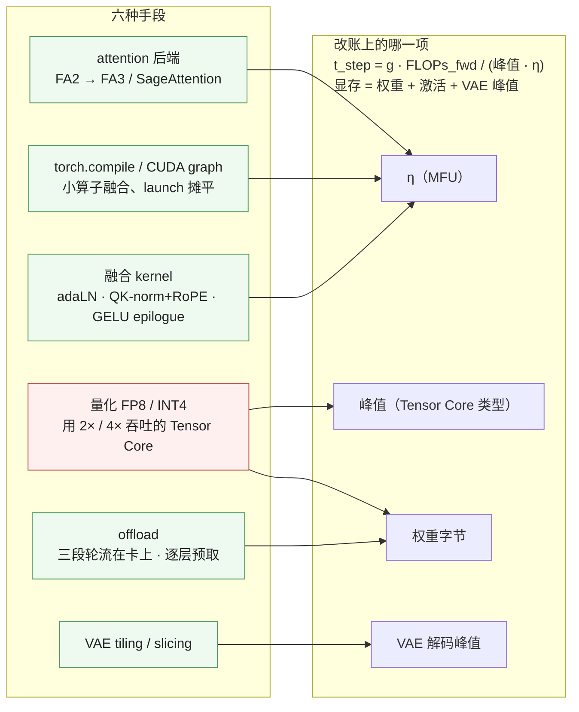
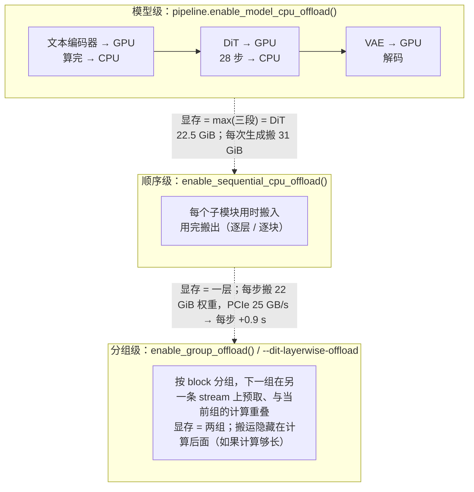
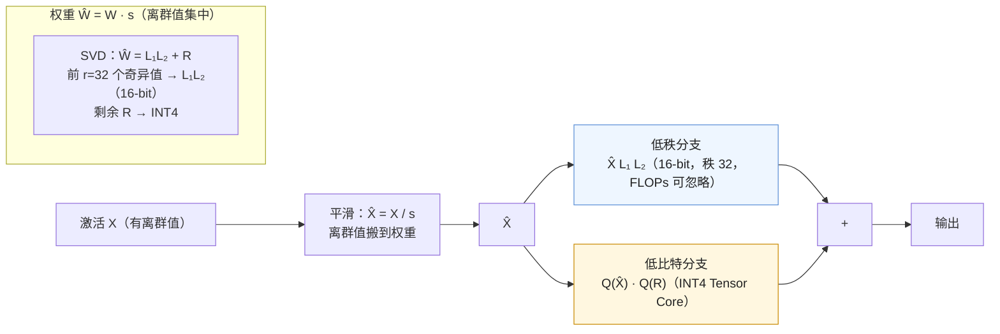
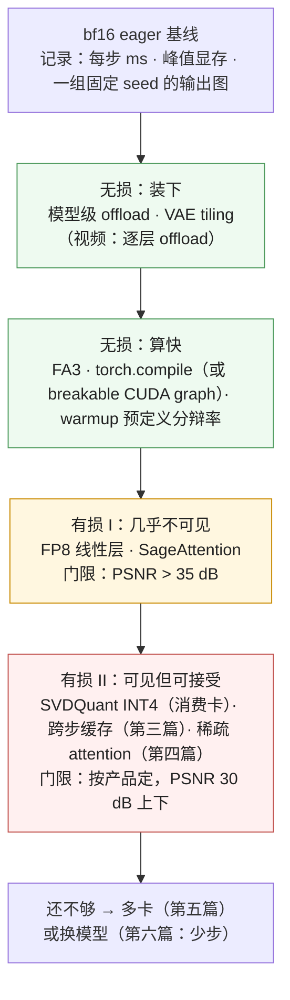

上一篇算出 FLUX.1-dev 一步 74 TFLOPs、eager 下 MFU 只有 0.31。这一篇讨论**不改变这 74 TFLOPs**（或改变得可控）的全部单卡手段：让同样的 FLOPs 跑得更快（换 attention 后端、编译、量化到 FP8 / INT4 用更快的 Tensor Core），以及让 31.5 GiB 的权重装进 24 GB 的卡（三段的 offload、逐层 offload、VAE 分块）。它们在账上改的是 $$\eta$$ 与字节，不是 FLOPs 的公式。

单卡优化的顺序有讲究：先做**无损**的（后端、编译、offload、VAE 分块——输出与基线 bit-exact 或只有浮点漂移），再做**有损**的（FP8、INT4、8-bit attention——输出可见地变了，需要质量预算）。三个引擎的文档都把 flag 分成这两栏，本文也按这个顺序。

本篇要回答的核心问题是：

> **一张 24 GB 的 RTX 4090 上，12B 的 FLUX.1-dev 放不放得下？[^q0] 放下之后 28 步几秒？把 FA3、compile、FP8、SVDQuant 依次加上，每步降到多少？[^q1] 哪一步开始图片可见地变了？[^q2]**

## 一、总览

### 1. 先说答案：六种手段，各改账上的哪一项

FLUX.1-dev 1024² 28 步，从 eager 基线出发逐项叠加（H100 与 4090 两列；H100 的 eager / compile 是 xDiT 实测，其余按各方法公开的加速比合成，标为估算）：

| 叠加到 | H100 每步 | H100 28 步 | 4090 每步 | 4090 28 步 | 显存（DiT 段） | 输出 |
|---|---|---|---|---|---|---|
| bf16 eager，FA2 | 240 ms | 6.71 s（实测） | 放不下：需 offload，约 1.5 s | ~40 s | 22.5 GiB | 基线 |
| + `torch.compile` | 154 ms | 4.30 s（实测） | ~1.2 s | ~33 s | 同 | 浮点漂移（SSIM > 0.98） |
| + FA3（Hopper） | ~140 ms | ~3.9 s（估） | — | — | 同 | 无损 |
| + FP8 线性层 | ~105 ms | ~2.9 s（估） | — | — | 11 GiB | 有损：轻微 |
| + SVDQuant INT4（W4A4） | Hopper 不支持 | — | ~0.45 s | ~12 s（Nunchaku：4090 上比 W4A16 快 3×） | 6.5 GiB | 有损：可见但小 |
| + SageAttention INT8 | ~95 ms | ~2.7 s（估） | 再快 5–10% | | 同 | 有损：轻微 |

Table: 六种手段逐项叠加的账

三个结论：

- **编译是最大的一项无损收益**（1.56×）：扩散是形状固定、步数固定、每步相同的负载，几乎是 `torch.compile` 的理想用例；eager 下 GEMM 之外的几十个小算子占了近一半时间。
- **量化的收益来自 Tensor Core 峰值，不来自字节**：FLUX 单请求已经 compute-bound，权重从 22 GiB 变 11 GiB 本身不提速；提速的是 FP8 Tensor Core 的 2× 吞吐。这与 LLM decode 里"权重减半 → 时间减半"的逻辑相反。
- **24 GB 卡上的问题首先是装下**：不量化要靠 offload（慢 3–5 倍，因为每步搬 22 GiB 权重过 PCIe），量化到 INT4 之后 6.5 GiB 常驻，才谈得上快。

### 2. 本文的章节安排

| 章 | 主题 | 内容 |
|---|---|---|
| 二 | 三段的 offload | 三段不必同时在卡；模型级 / 顺序 / 分组 offload；DiT 逐层预取与它的两面；文本编码器放哪 |
| 三 | attention 后端 | FA2 / FA3 / SDPA / xformers 在 $$N = 4608$$ 上的差别；SageAttention 的 8-bit Q·K 为什么扩散能容忍 |
| 四 | 编译与 CUDA graph | eager 的时间去哪了；`torch.compile` 的收益与代价；动态分辨率；breakable CUDA graph |
| 五 | 量化 | FP8 W8A8；SVDQuant / Nunchaku 的 W4A4；NVFP4；为什么图像对 W4 更敏感、怎么评 |
| 六 | 融合 kernel | adaLN、QK-norm + RoPE、GELU epilogue、packed QKV——引擎的"fast path" |
| 七 | VAE | 解码峰值的来源；tiling / slicing；视频 3D VAE 的时间分块；fp32 还是 bf16 |
| 八 | 叠加顺序与收益表 | 无损先、有损后；FLUX 与 Wan 的两张表；三个引擎的对照 |
| 九 | 本文小结 | |
| 十 | 自测 | 5 道题 |

Table: 本文的章节安排

## 二、三段的 offload：装下

### 1. 三种粒度

第一篇的字节账：FLUX 三段权重 31.5 GiB，但 DiT 段只需 22.5 GiB。offload 的全部内容就是**让不在用的部分不占显存**，粒度从粗到细有三种：

| 粒度 | 显存 | 每次生成的 H2D 字节 | 时间代价 | 适用 |
|---|---|---|---|---|
| **模型级**（三段轮流） | max(三段) ≈ DiT 权重 + 激活 | 一次 31.5 GiB（每段搬一次） | 约 1.3 s / 次生成（PCIe 4.0 ×16 约 25 GB/s） | 卡装得下 DiT、装不下三段：24 GB 跑 FLUX 的第一选择 |
| **顺序级**（逐层） | 一层（几百 MiB） | **每步** 22 GiB → 28 步 620 GiB | 每步 +0.9 s：28 步 +25 s | 卡连 DiT 都装不下（16 GB 以下）、不在乎慢 |
| **分组预取**（逐层 + 重叠） | 两组 | 同顺序级 | 若每层计算时间 ≥ 搬运时间则接近免费；否则 H2D 成为瓶颈 | 视频模型（每层计算 0.7 s ≫ 搬运 17 ms）；图像模型上常常变慢 |

Table: offload 的三种粒度

分组预取的收益完全取决于**每层的计算时间与搬运时间之比**。Wan 14B 一层权重 0.67 GB、搬运 27 ms（25 GB/s），而一层的计算在 720p 81 帧上是 29 s / 40 = 0.73 s——搬运只占 4%，可以完全藏在计算后面；SGLang 的文档给出 Wan A14B 显存从 40 GB 降到约 11 GB、速度几乎不变，并且对 Wan / MOVA 一类视频模型**默认开启**。FLUX 一层权重 0.39 GB、搬运 16 ms，而 1024² 上一层计算只有 154 / 57 = 2.7 ms——搬运是计算的 6 倍，逐层 offload 会让每步慢到 H2D 的速度（≈ 22 GiB / 25 GB/s ≈ 0.9 s）。所以同一个 flag 在视频模型上"免费"、在图像模型上"慢 6 倍"，SGLang 的性能指南明确建议图像模型关掉它（`--dit-layerwise-offload false`），并给出 `--dit-offload-prefetch-size` 调预取深度。

### 2. 文本编码器放哪

文本编码器是三段里最适合搬走的：只跑一次、几十毫秒、输出只有 $$512 \times 4096 \times 2$$ 字节 = 4 MiB。三种放法：

- **CPU offload**（`--text-encoder-cpu-offload`）：用时搬到 GPU（T5-XXL 9 GiB，0.4 s），算完搬回。SGLang 对显存 < 30 GB 的卡自动开启；
- **留在 CPU 上算**：T5-XXL 512 token 在 CPU 上几秒，比搬运还慢，一般不做；
- **独立服务 / 独立卡**：文本编码器作为一个 stage 单独部署，输出 embedding 传给 DiT 的卡——第七篇的三段分离；vLLM-Omni 的 stage-based 部署与 SGLang 的 disaggregation 都支持；
- **不加载**：SD3 允许推理时不加载 T5（只用两个 CLIP），省 9 GiB，代价是文字渲染与复杂 prompt 变差（算法地图 L7 第六篇的消融）。

另一个细节：**prompt embedding 缓存**。同一个 prompt 被反复请求（同 prompt 多 seed、批量出图）时，文本编码器的输出可以按 prompt 哈希缓存——vLLM-Omni 的 `PromptEmbedCache`、diffusers 的 `text_kv_cache` hook；每条 4 MiB，缓存一千条 4 GiB。这是扩散推理里唯一像"前缀缓存"的东西。

### 3. 24 GB 卡上的 FLUX

把上面的合起来，一张 4090 跑 FLUX.1-dev bf16 的路径：文本编码器 CPU offload（或算完释放）→ DiT 常驻 22.2 GiB + 激活 0.3 GiB = 22.5 GiB（24 GB 卡剩 1.5 GB 给 CUDA context 与碎片，**很紧**，2048² 就溢）→ VAE 在 DiT 释放后加载、tiling 解码。每次生成多搬 31 GiB 权重、约 1.3 s，28 步在 4090（165 TFLOPS）上按 $$\eta = 0.45$$ 是 28 s，加起来 30 s 量级。要快，就得进第五章：INT4 之后 DiT 6.5 GiB 常驻、三段全部放得下、不再搬运。

## 三、attention 后端

### 1. 在 $$N = 4608$$ 上 FA2 / FA3 / SDPA 的差别

DiT 的 attention 是标准的双向 self-attention（无因果 mask），$$N = 4608$$、$$h = 24$$、$$d_h = 128$$。所有引擎默认走 FlashAttention 一族，差别在版本：

| 后端 | 实现 | H100 上 FLUX 一层 attention 的效率 | 备注 |
|---|---|---|---|
| PyTorch SDPA（`native`） | 按硬件分派到 FA2 / cuDNN / math | 与 FA2 相当 | diffusers 默认 |
| FlashAttention-2（`flash`） | 分块、不物化分数矩阵 | 峰值的 35–45%（Hopper 上 FA2 用不到 wgmma） | Ampere 的最优 |
| **FlashAttention-3**（`_flash_3_hub` / SGLang `fa`） | Hopper 专用：warp 特化、TMA、FP8 | 峰值的 60–75%，比 FA2 快 1.5–2× | Hopper 的最优；attention 占 20% → 端到端 5–10% |
| xformers | 旧 | 不再推荐 | |
| **SageAttention**（`sage`） | Q·K 量化到 INT8 / FP8，PV 保留 FP16 / FP8 累加 | 比 FA2 快 2–3×（Ampere / Ada 上收益最大） | **有损**；SageAttention 3 用 Blackwell 的 FP4 |

Table: FLUX attention 各后端的效率

图像模型 attention 只占 20%，换后端的端到端收益有限（FA2 → FA3 约 5–10%）；到视频的 72–87% 时它成了主项（第四篇）。

### 2. SageAttention：为什么扩散能容忍 8-bit 的 Q·K

SageAttention 把 $$Q$$、$$K$$ 按 block 平滑后量化到 INT8，用 INT8 Tensor Core 算 $$QK^\top$$（Ada / Hopper 上 INT8 吞吐是 bf16 的 2×），softmax 后的 $$P$$ 与 $$V$$ 用 FP16 / FP8 累加。它的误差在 LLM 上会累积到 logits、改变采样的 token；在扩散上却几乎不可见——两个原因：

- **每一步的误差被后续步的去噪吸收**：扩散的每步是在预测"当前 latent 里的噪声"，一步的小误差相当于多加了一点噪声，下一步会把它当作噪声去掉。这是扩散模型对近似计算（低精度 attention、跨步缓存、稀疏 attention）普遍鲁棒的根源，也是第三、四篇的前提；
- **输出是像素而不是离散 token**：LLM 的一个 logit 错位就换了一个词，图像的一个像素值偏 1/255 不可见。

代价仍然存在：SageAttention 在细节纹理、文字渲染上有可测的 PSNR 下降（对基线图 30–35 dB），所以三个引擎都把它列在"有损"栏，SGLang 允许按请求覆盖（`--attention-backend-override sage_attn`）而不是全局开。

## 四、编译与 CUDA graph

### 1. eager 的时间去哪了

FLUX 一层的算子：adaLN 调制（从条件向量算出 scale / shift / gate，6 个 $$[1, d]$$ 向量）、LayerNorm、调制乘加、QKV 投影（GEMM）、QK RMSNorm、RoPE、attention、输出投影（GEMM）、gate 乘、残差加、LayerNorm、调制、MLP 上投影（GEMM）、GELU、MLP 下投影（GEMM）、gate 乘、残差加——**四个 GEMM 加一个 attention，周围十几个逐元素 / 归一化算子**。eager 下每个算子一次 kernel launch（5–10 μs 的 CPU 开销）、各自读写一遍 $$[4608, 3072]$$ 的 bf16 张量（27 MiB，8 μs @ 3.35 TB/s）。57 层 × 15 个算子 = 855 次 launch，每步 5–10 ms 的纯开销，加上这些算子本身 memory-bound 的读写：这就是 eager 的 MFU 停在 0.31 而 GEMM 本身能到 0.7 的原因。

### 2. `torch.compile`

`torch.compile`（Inductor 后端）把逐元素算子融合进相邻的 GEMM 或彼此融合（一层的十几个小算子变成三四个融合 kernel），消掉多数 launch 与中间张量的读写；`mode="max-autotune"` 再为每个 GEMM 形状挑最优的 Triton / cuBLAS 配置。xDiT 实测 FLUX 单卡 6.71 → 4.30 s（1.56×），4 卡 USP 下更大（2.6×，因为每卡的 GEMM 更小、开销占比更高）。

扩散是编译的理想负载，理由都在第一篇的账上：

| 性质 | 对编译的意义 |
|---|---|
| 形状固定：$$N$$、$$d$$ 在一次生成里不变 | 一次编译、28 步复用；无 LLM decode 那种每步 $$N$$ 变化的重编译 |
| 每步相同：同一个图 28 次 | 编译成本被 28 步摊平；服务里被所有请求摊平 |
| 无数据依赖的控制流 | 整个 DiT 前向可以捕获成一张图 |

Table: 扩散负载对编译友好的性质

代价：

- **编译时间**：FLUX 第一次前向 1–3 分钟（`max-autotune` 更久）。服务启动时要 warmup（SGLang 的 `--warmup-mode request`）；
- **动态分辨率 = 重编译**：用户请求 1024² 与 768×1344 是两个形状，各编译一次；分辨率组合多时是"重编译风暴"（第九篇的故障之一）。对策：只允许一组预定义分辨率（SGLang 的 `--warmup-resolutions 1024x1024 768x1344` 启动时预编译）、或 `dynamic=True` 用符号形状（Inductor 对 GEMM 的调优会变弱）；
- **数值漂移**：融合改变了浮点运算顺序，输出与 eager 不 bit-exact——SGLang 在 Qwen-Image 上测得 SSIM 0.984 / PSNR 39.7 dB，肉眼不可见，但 A/B 时要知道这不是 bug。

### 3. CUDA graph 与 breakable CUDA graph

编译消掉的是**算子内**的开销；CUDA graph 消掉的是**算子间**的 CPU launch 开销——把一步的全部 kernel 录成一张图、一次提交。LLM decode 依赖它（每步只有几毫秒的计算、launch 开销占比大）；扩散的一步有一两百毫秒计算，launch 开销占比小，收益不如编译。但对**小模型 / 高分辨率下的多卡**（每卡计算变短）与**少步蒸馏模型**它又重要起来。

CUDA graph 的问题是全图必须静态：attention 的某些后端、集合通信（多卡）、依赖 prompt 长度的部分不能录进去。SGLang 的 **breakable CUDA graph**（`--enable-breakable-cuda-graph`）把 DiT 前向按固定分辩率分段捕获、attention 与集合通信留在 eager，两者交替执行；文档给出 Qwen-Image 1024² 在 2×H200 TP2 上每步 124.7 → 83.1 ms（1.5×，Qwen-Image 60 层小算子多、launch 占比高），代价是每张卡多 5 GB 捕获显存、每个服务分辩率都要预先捕获，且与 `torch.compile`、Cache-DiT 互斥。

## 五、量化：换更快的 Tensor Core

### 1. 收益的来源

第一篇的 roofline：FLUX 单请求在算力屋顶上。量化在这里的收益**不是**"读的字节少了"（LLM decode 的逻辑），而是：

| 精度 | H100 Tensor Core 峰值 | 相对 bf16 | 权重字节 |
|---|---|---|---|
| BF16 | 989 T | 1× | 22.2 GiB |
| FP8（E4M3） | 1979 T | 2× | 11.1 GiB |
| INT8 | 1979 T | 2× | 11.1 GiB |
| INT4（Ada / Ampere 有；Hopper 无） | 4090：660 T vs bf16 165 T | 4× | 5.6 GiB |
| NVFP4（Blackwell） | B200：~9 P | 4× | 5.6 GiB |

Table: H100 各精度的 Tensor Core 峰值与权重字节

FP8 只对**线性层的 GEMM**（占 FLUX 每步的 80%）生效，attention 另有自己的 FP8 路径（FA3 FP8、SageAttention）。理论上限 GEMM 部分 2× → 端到端 1.6×；实践中量化 / 反量化的 scale 计算、部分层保留 bf16（首末层、adaLN）把它压到 **1.3–1.5×**（SGLang 与 vLLM-Omni 对 FP8 checkpoint 给出的数字都在这个范围）。

### 2. FP8：W8A8 与在线量化

- **权重**：按通道或按 block 的 scale，离线量化一次（NVIDIA ModelOpt 产出的 FP8 checkpoint，SGLang 用 `--transformer-path` 加载；diffusers 通过 `torchao` / `PipelineQuantizationConfig`）；
- **激活**：动态的 per-tensor 或 per-token scale，每个 GEMM 前算一次（在线量化）；
- **哪些层不量化**：输入投影、输出投影、adaLN 的 MLP 通常留 bf16——它们小、对精度敏感；
- **质量**：FP8 对 FLUX 一类的 DiT 几乎无损（PSNR > 35 dB），是三个引擎都推荐的"第一个有损选项"。FP8 的 NaN 是最常见的故障：激活里的离群值让 per-tensor scale 饱和——第九篇。

### 3. SVDQuant / Nunchaku：W4A4

4-bit 是另一个量级的问题：权重与激活都到 4 bit 时，两边的离群值都装不下 16 个量化级。LLM 的做法（SmoothQuant：把激活的离群值"搬"到权重上）不够——搬过去之后权重的离群值又量化不了。**SVDQuant**（Li 等 2024，ICLR 2025）的做法是**多加一条低秩分支吸收离群值**：

低秩分支的 FLOPs 是 $$2 N d r \times 2$$，$$r = 32$$ 时不到主 GEMM 的 2%；但它多读写一遍激活——**Nunchaku** 推理引擎把低秩分支的 kernel 融进 INT4 GEMM 的 kernel（共享输入的读取、把低秩输出直接加进累加器），才把这 2% 的 FLOPs 变成 2% 的时间而不是 20%。结果：FLUX.1-dev 显存 3.6× 缩减（22 → 6.5 GiB），16 GB 的笔记本 4090 上比 NF4 W4A16（只量化权重、算时反量化成 bf16）快 3×，比"bf16 + CPU offload"快 8.7×；LoRA 可以直接挂在低秩分支旁而不必重新量化。Blackwell 上有 NVFP4 版本。**Hopper 没有 INT4 Tensor Core**，所以 SVDQuant 在 H100 上没有加速（SGLang 文档：Ampere / Ada / Blackwell only）——这是 4-bit 量化在消费卡上比在数据中心卡上更有价值的硬件原因。

### 4. 图像为什么对 W4 更敏感、怎么评

LLM 的 W4（GPTQ / AWQ）几乎无损，扩散的 W4 却要 SVDQuant 这样的方法才可用——因为扩散的输出是连续值、误差在 28 步里累积成可见的纹理 / 颜色偏移，且 DiT 的激活离群值比 LLM 更极端（adaLN 调制放大了某些通道）。评测也不同：

| LLM 量化评测 | 扩散量化评测 |
|---|---|
| 困惑度、下游任务准确率 | 对**同 seed 基线图**的 PSNR / SSIM / LPIPS（同一张图变了多少） |
| — | FID / ImageReward / HPSv2 在一个 prompt 集上（整体质量有没有掉） |
| — | 目测：文字渲染、手指、细纹理是最先坏的 |

Table: LLM 量化评测与扩散量化评测的差别

第九篇展开。经验阈值：PSNR > 35 dB 不可见，30–35 dB 细看可见，< 28 dB 明显。FP8 通常 > 35，SVDQuant INT4 在 30 上下，NF4 W4A16 更低。

## 六、融合 kernel：引擎的"fast path"

编译能融合"标准"的逐元素算子，但 DiT 特有的模式常常需要手写 kernel 才到极致。三个引擎都在积累这类 fast path：

| 模式 | 做什么 | 为什么值得手写 | 在哪 |
|---|---|---|---|
| **adaLN 调制融合** | LayerNorm + scale + shift（+ gate）一个 kernel | 每层两次，读写 $$[N, d]$$ 三遍变一遍 | SGLang `runtime/layers/fused_scale_shift_gate.py`；vLLM-Omni 的 batched TP AdaLN |
| **QK-norm + RoPE** | Q / K 的 RMSNorm 与旋转位置编码一个 kernel | 每层一次，$$[N, h, d_h]$$ 的两遍读写变一遍 | SGLang（FLUX / LTX-2 的 fused QK norm）|
| **packed QKV** | 三个投影合成一个 $$[d, 3d]$$ 的 GEMM | GEMM 越大效率越高；也方便量化与 all-to-all | 三者都有；SGLang 注：NVFP4 路径下看到分开的 `to_q/k/v` 说明量化没生效 |
| **GELU / gate epilogue** | 激活函数进 GEMM 的 epilogue（cuBLASLt） | 省一遍 $$[N, 4d]$$ 的读写 | SGLang `--quality high` 的 Wan FFN 路径 |
| **GroupNorm + SiLU**（VAE） | 解码器残差块里的归一化 + 激活 | VAE 是 memory-bound，省读写就是省时间 | SGLang 的 VAE fast path |

Table: DiT 特有的融合 kernel 模式

这些各自 1–5% 的收益，叠起来是 eager → 最优之间"编译之外的那一半"。SGLang 把有些 fast path 标为**近似**（`--quality high`：bit-exact 的 `lossless` 是默认），因为融合改变了累加顺序或用了低精度中间值——它们的 SSIM 门限是图像 0.95 / 28 dB、视频 0.92 / 24 dB。

## 七、VAE：峰值与分块

### 1. 峰值的来源

第一篇：FLUX 1024² 的 VAE 解码激活 2 GiB、Wan 720p 81 帧 107 GiB。解码器的最后几级在像素分辩率上以 128 通道 fp32 工作，一份特征图 = 像素数 × 128 × 4 字节。VAE 默认 **fp32**（bf16 下重建有色带与色偏——VAE 的激活范围大、对精度敏感，SGLang 的 `--vae-precision bf16` 明确标为有损）。

### 2. tiling 与 slicing

- **Tiling**（`vae.enable_tiling()`）：把 latent 切成重叠的空间 tile（如 $$64 \times 64$$ latent → $$512 \times 512$$ 像素）逐个解码，重叠区域线性混合掩盖接缝；峰值降为一个 tile 的量（1024² 切 4 块 → 0.5 GiB），时间略增（重叠部分重算）；
- **Slicing**（`enable_slicing()`）：batch 里的多张图逐张解码——只对 batch > 1 有用；
- **视频的时间分块**：3D VAE 的因果卷积让解码器可以按 latent 帧的 chunk 顺序解码（Wan 的 VAE 内建：每次解一个 latent 帧、缓存前面几帧的特征作为因果上下文），峰值从 107 GiB 降到一帧的量（1.3 GiB）；空间上再 tiling。HunyuanVideo 的 VAE 同样有 `enable_tiling` 的时空版本；接缝（尤其时间上的闪烁）是第九篇的故障之一；
- **多卡**：xDiT 的 Parallel VAE 与 vLLM-Omni 的 `--vae-patch-parallel-size`——第五篇。

### 3. VAE 的时间

第一篇按 MFU 0.05 估 1024² 解码 100 ms、Wan 7 s。它是 memory-bound 的卷积链，融合（GroupNorm + SiLU）、bf16（有损）、channels-last 布局各能省一些；在少步模型上（FLUX-schnell 4 步 DiT 0.6 s）它占到 15%，成为第二个优化对象——第六篇。

## 八、叠加顺序与收益表

### 1. 顺序

每一步都对着基线的固定 seed 图测 PSNR / SSIM，无损的应当 > 40 dB（编译的浮点漂移）或 bit-exact。

### 2. FLUX.1-dev 1024² 28 步

| 配置 | H100 每步 | 28 步 | 4090 28 步 | DiT 段显存 | 对基线 PSNR | 来源 |
|---|---|---|---|---|---|---|
| bf16 eager FA2 | 240 ms | 6.71 s | ~40 s（offload） | 22.5 GiB | — | xDiT |
| + compile | 154 ms | 4.30 s | ~33 s | 22.5 GiB | > 40 dB | xDiT |
| + FA3 | ~140 ms | ~3.9 s | — | 同 | bit-exact 级 | 估（attention 20% × 1.7） |
| + FP8 W8A8 | ~105 ms | ~2.9 s | — | 11.3 GiB | ~36 dB | 估（GEMM 部分 1.4×） |
| SVDQuant INT4 + compile | Hopper 无收益 | — | ~12 s | 6.5 GiB | ~30 dB | Nunchaku（4090：3× vs W4A16） |
| + SageAttention | ~95 ms | ~2.7 s | ~11 s | 同 | ~32 dB | 估 |

Table: FLUX.1-dev 1024² 28 步各配置的时间与显存

### 3. Wan2.1-14B 720p 81 帧 50 步（单卡，实际几乎不这样跑）

| 配置 | 每步 | 50 步 | 显存 | 说明 |
|---|---|---|---|---|
| bf16 eager | ~40 s | ~35 min | 27 + 14 GiB | attention 72%，FA2 效率低 |
| + 逐层 offload | 同 | 同 | **11 GiB + 14 GiB 激活** | 免费：每层 0.7 s 计算 ≫ 27 ms 搬运 |
| + FA3 | ~26 s | ~22 min | 同 | attention 部分 1.7× |
| + compile | ~23 s | ~19 min | 同 | 线性部分 28% 里的小算子 |
| + FP8 | ~20 s | ~17 min | 同 | 只对 28% 的线性项 |
| + SageAttention | ~13 s | ~11 min | 同 | attention 部分再 2× |

Table: Wan2.1-14B 720p 单卡各配置的时间与显存

视频模型的单卡优化里 **attention 后端是主项、量化是次项**——与图像相反。再往下就是第四篇的稀疏 attention 与第五篇的多卡。

### 4. 实现对照

| 机制 | diffusers v0.40 | SGLang Diffusion v0.5.19 | vLLM-Omni v0.28 | xDiT |
|---|---|---|---|---|
| 模型级 offload | `pipe.enable_model_cpu_offload()` | `--text-encoder-cpu-offload` / `--vae-cpu-offload` / `--dit-cpu-offload`；`runtime/managers/memory_managers/component_residency.py` | `diffusion/offloader/sequential_backend.py` | 沿用 diffusers |
| 逐层预取 | `model.enable_group_offload(use_stream=True)`（`hooks/group_offloading.py`） | `--dit-layerwise-offload`、`--dit-offload-prefetch-size`；`layerwise_offload.py` | `offloader/layerwise_backend.py`、`distributed_layerwise_backend.py` | — |
| attention 后端 | `model.set_attention_backend("flash" / "_flash_3_hub" / "sage")`（`models/attention_dispatch.py`） | `--attention-backend fa / torch_sdpa / sage_attn / sage_attn_3 / …`；`runtime/layers/attention/selector.py` | `diffusion/attention/selector.py`、`attention/backends/` | `xfuser/core/distributed/attention_backend.py` |
| 编译 | `torch.compile(pipe.transformer)` | `--enable-torch-compile`；`--warmup-resolutions` | `--compile` / `diffusion/compile.py` | `--use_torch_compile`（`xfuser/compile/`） |
| CUDA graph | — | `--enable-breakable-cuda-graph`（`runtime/breakable_cuda_graph/`） | CUDA graph in `worker/` | — |
| FP8 | `torchao` / `PipelineQuantizationConfig` | ModelOpt checkpoint：`--transformer-path` | `diffusion/quantization/`（含 `hsdp_fp8.py`） | `layers/fp8_linear.py` |
| INT4 / NVFP4 | Nunchaku 插件 | `--enable-svdquant --transformer-weights-path`；`flux_2_nvfp4.py` | ModelOpt NVFP4 | `fp4_quantize.py` |
| VAE 分块 | `vae.enable_tiling()` / `enable_slicing()` | `--vae-config.*`；`runtime/pipelines_core/stages/` | `distributed/vae_patch_parallel.py`、`--vae-use-tiling` | Parallel VAE（第五篇） |
| 融合 fast path | — | `runtime/layers/fused_scale_shift_gate.py`、`--quality high` | batched TP AdaLN 等 | — |

Table: 单卡优化机制在四个引擎里的实现对照

### 5. 实践建议

一张 24 GB 以上的卡、diffusers、FLUX.1-dev、20 个固定 prompt 与 seed：按第 1 小节的顺序逐项打开，每一项记录每步耗时（用 `torch.cuda.Event` 夹住 transformer 的 forward，排除第一次编译）、峰值显存（`torch.cuda.max_memory_allocated`）、对基线图的 PSNR / SSIM / LPIPS。该看的：compile 的 1.5×、FA3 的 5–10%、FP8 的 1.3–1.4×、SVDQuant 在 4090 上的 3×；PSNR 从 > 40（compile）到 ~36（FP8）到 ~30（INT4）；文字与手指最先变。把这条"加速比—质量"曲线画出来，它是第九篇配置推导的输入。

## 九、本文小结

| 项 | 规则 | 数字（FLUX.1-dev 1024²） |
|---|---|---|
| 无损先、有损后 | 装下 → 算快 → FP8 / Sage → INT4 / 缓存 / 稀疏 | 每步对固定 seed 基线测 PSNR |
| offload | 三段不必同时在卡；逐层预取的收益 = 每层计算 / 搬运 | 模型级 +1.3 s / 次；逐层：Wan 免费（0.7 s vs 27 ms）、FLUX 慢 6×（2.7 ms vs 16 ms） |
| 文本编码器 | 只跑一次、4 MiB 输出：offload / 独立 stage / embedding 缓存 | T5-XXL 9 GiB |
| attention 后端 | FA3 比 FA2 快 1.5–2×；图像占 20% → 端到端 5–10%；视频是主项 | SageAttention INT8 Q·K 有损、扩散可容忍 |
| 编译 | 形状固定 + 每步相同 = 理想负载；eager 一半时间在小算子 | 6.71 → 4.30 s（1.56×）；漂移 SSIM 0.98 |
| CUDA graph | 消 launch 开销；扩散一步计算长、收益小于编译；小模型 / 多卡 / 少步时重要 | Qwen-Image BCG 125 → 83 ms |
| 量化 | 收益来自 Tensor Core 峰值，不来自字节 | FP8 GEMM 2× → 端到端 1.3–1.5×；Hopper 无 INT4 |
| SVDQuant | 低秩分支吸收离群值 + Nunchaku 融合 kernel | FLUX 22 → 6.5 GiB；4090 上 3× vs W4A16 |
| 评测 | 对基线图的 PSNR / SSIM / LPIPS，不是困惑度 | > 35 不可见，30–35 细看可见 |
| VAE | fp32、像素分辩率特征图；tiling / 时间分块 | 1024² 2 GiB → tile 0.5 GiB；Wan 107 GiB → 按帧 1.3 GiB |

Table: 单卡扩散执行的规则与数字小结

### 下一篇

单卡把 $$\eta$$ 从 0.31 推到 0.5 以上之后，下一个大项是账上的 $$T$$：28 步里有多少步的网络输出与上一步几乎相同、可以不算？第三篇讨论跨步冗余——TeaCache、First-Block Cache、Cache-DiT 一族的缓存与跳步，它们把"$$T$$"换成"$$T_\text{full} + T_\text{hit} \cdot \epsilon$$"。

## 十、自测

1. 逐层 offload（`--dit-layerwise-offload`）在 Wan 14B 视频上"几乎免费"，在 FLUX 图像上让每步慢好几倍。用第一篇的数字解释：判据是什么？两个模型各是多少？

   

   
答案

   判据：每层的计算时间 vs 该层权重的 H2D 搬运时间（PCIe 约 25 GB/s）。Wan 一层 0.67 GB → 27 ms，计算 29 s / 40 层 = 0.73 s，搬运 4%，可全部藏在计算后面。FLUX 一层 0.39 GB → 16 ms，计算 154 ms / 57 = 2.7 ms，搬运是计算的 6 倍，每步退化为搬 22 GiB 的 0.9 s。详见[第二章](#二三段的-offload装下)。
   

2. FLUX 权重从 bf16 22 GiB 量化到 FP8 11 GiB，为什么每步时间不是减半、而只快 1.3–1.5×？在什么负载下"权重减半 → 时间减半"才成立？

   

   
答案

   FLUX 单请求是 compute-bound（算术强度 3,100 ≫ 拐点 295），时间由 FLOPs / 峰值决定，读权重的字节数不是瓶颈；FP8 的收益来自 Tensor Core 峰值 2×，只作用于线性层（80%），且部分层留 bf16、有 scale 开销 → 1.3–1.5×。"权重减半 → 时间减半"只在 memory-bound 时成立：LLM decode batch 1。详见[第五章](#五量化换更快的-tensor-core)。
   

3. SVDQuant 在 RTX 4090 上让 FLUX 快 3×，在 H100 上却没有加速。为什么？它的低秩分支为什么必须与 INT4 kernel 融合？

   

   
答案

   Hopper 没有 INT4 Tensor Core（有 FP8 / INT8），W4A4 在 H100 上只能反量化后用 bf16 / FP8 算，省显存不省时间；Ada / Ampere / Blackwell 有 INT4（或 NVFP4）Tensor Core，吞吐 4×。低秩分支 $$X L_1 L_2$$（秩 32）FLOPs 不到 2%，但单独跑要多读写一遍激活 $$[N, d]$$——在 memory-bound 的小 kernel 上这是 20% 的时间；Nunchaku 把它融进 INT4 GEMM（共享输入读取、直接加进累加器）才让它只占 2%。详见[第五章](#五量化换更快的-tensor-core)。
   

4. 一个 FLUX 服务允许用户任选分辩率，开了 `torch.compile` 之后 p99 延迟反而恶化。最可能的原因是什么？两种对策？

   

   
答案

   每个新的 $$(H, W)$$ 组合都是新形状，触发重编译（FLUX 一次 1–3 分钟），分辩率组合多时不断重编译。对策：只允许一组预定义分辩率并在启动时预编译（`--warmup-resolutions`）；或 `dynamic=True` 用符号形状（GEMM 调优变弱）。第九篇称之为"重编译风暴"。详见[第四章](#四编译与-cuda-graph)。
   

5. SageAttention 把 Q·K 量化到 INT8，LLM 上会改变生成的 token，扩散上却几乎不可见。两个原因？它仍然被列为"有损"，最先坏的是什么？

   

   
答案

   （1）每步的误差相当于多加了一点噪声，被后续去噪步吸收；（2）输出是连续像素而不是离散 token，小偏差不可见。仍有可测的 PSNR 下降（30–35 dB），细纹理与文字渲染最先变，所以按请求可选而非全局默认。详见[第三章](#三attention-后端)。
   

## 下一篇

[跨步冗余：TeaCache、First-Block Cache 一族的缓存与跳步](/timestep-redundancy-caching-and-step-skipping.html)

[^q0]: bf16 放不下三段合计的 31.5 GiB，但 DiT 段只要 22.2 GiB 权重 + 0.3 GiB 激活：文本编码器 CPU offload（算完搬走）、VAE 最后再加载并 tiling，24 GB 能放下（余 1.5 GB，2048² 会溢）。每次生成多搬 31 GiB 权重约 1.3 s。量化到 SVDQuant INT4 后 DiT 6.5 GiB，三段全部常驻。详见[第二章](#二三段的-offload装下)、[第五章](#五量化换更快的-tensor-core)。

[^q1]: H100：eager 240 ms → compile 154 ms（xDiT 实测 6.71 → 4.30 s）→ FA3 约 140 → FP8 约 105 → SageAttention 约 95 ms（后三项按各方法公开加速比合成）。4090：bf16 + offload 约 40 s；SVDQuant INT4 + compile 约 12 s（Nunchaku：比 W4A16 快 3×）。详见[第八章](#八叠加顺序与收益表)。

[^q2]: offload、VAE tiling、FA3 无损（bit-exact 级）；compile 有浮点漂移但 SSIM > 0.98 / PSNR > 40 dB，不可见；FP8 线性层约 36 dB，细看不可见；SageAttention 30–35 dB、SVDQuant INT4 约 30 dB，细纹理与文字渲染开始可见。判定标准是对同 seed 基线图的 PSNR / SSIM / LPIPS，不是 LLM 的困惑度。详见[第五章](#五量化换更快的-tensor-core)、[第八章](#八叠加顺序与收益表)。
