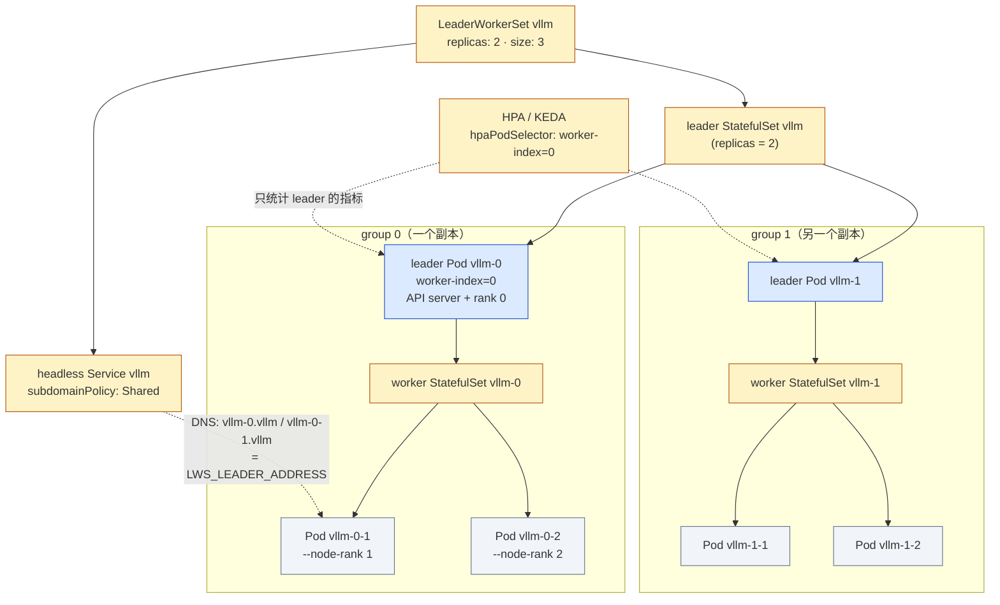
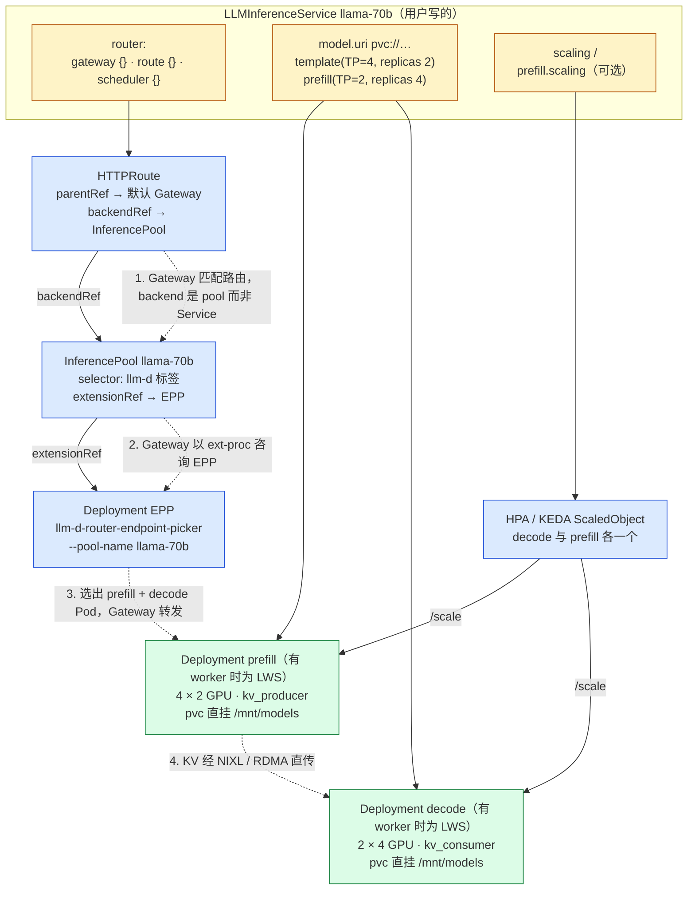
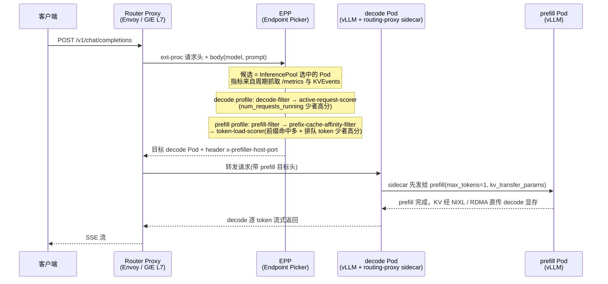
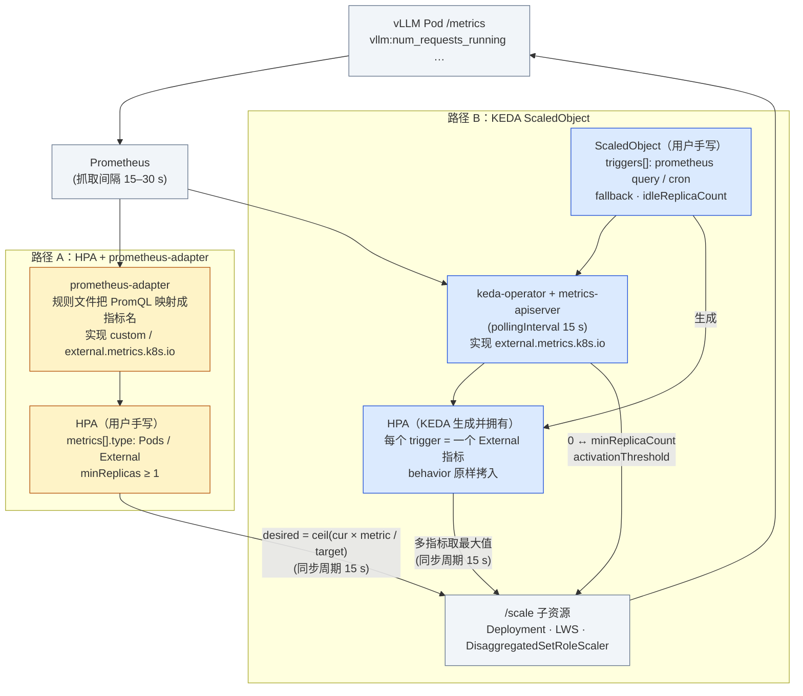

一个常见的事故是这样的：某个 70B 模型的推理服务用 Deployment 部署了 2 个副本，每个副本 TP=4 占一台 4 卡机器，HPA 按 CPU 利用率 70% 扩容。晚高峰到来，用户侧 TTFT 从 1 秒涨到 20 秒，`kubectl get hpa` 却显示 CPU 只有 12%——vLLM 的 CPU 几乎全在等 GPU，KV cache 早已占满、几百个请求在引擎内部的等待队列里排队，而 K8s 对此一无所知。值班同学手动把副本改成 6，新 Pod 调度、拉镜像、从对象存储拉 140 GB 权重、加载到显存、做 CUDA graph 捕获，8 分钟后第一个新副本才开始接流量，此时高峰已经过去一半。第二天有人把副本常驻改成 6，于是 16 张 H100 在白天的 20 个小时里几乎空转。

这个故事里的每一个环节都是 Serving 平台要解决的问题：一个副本是几个 Pod、副本的就绪要等多久、用什么指标判断"满了"、多久之前触发扩容、扩多少、空闲时缩到几个。前五篇的资源层把 GPU、网络、存储组织成了可调度的池子，从本篇起进入交付层——把一个能跑的引擎进程包装成一个有形态、能扩缩、能升级的**服务**。

这一层的开源组件很多，定位各不相同：LeaderWorkerSet 只解决"多 Pod 一副本"这一件事；KServe 是一个完整的 Serving 平台，用 `InferenceService` 服务传统模型、用 `LLMInferenceService` 服务 LLM；Triton 是一个通用推理服务器，可以把 vLLM 当作后端；Ray Serve 用 Python 代码描述服务拓扑；llm-d 是 vLLM 社区与 K8s 社区共同推动的 LLM Serving 栈，它的组件被 KServe 嵌入。本篇的任务是把它们放到同一张图上，说清每一个解决什么、怎么配、代价是什么，最后回到扩缩容这个最实际的问题。

本篇要回答总纲提出的核心问题：

> **一个 TP=4 的 70B 模型服务，晚高峰要从 2 副本扩到 6 副本，每个副本从调度到能接流量要 8 分钟。扩缩容指标选什么、阈值定多少、提前多久触发，才能在高峰到来前就绪而不在平时浪费 16 张卡？**

本文的 CRD 与源码以 **LeaderWorkerSet v0.10.0、KServe v0.20.0、llm-d v0.9.0（EPP 来自 llm-d-router v0.10.0）、Triton Inference Server v2.72.0、KubeRay v1.7.0、KEDA v2.20.2** 为准，Gateway API Inference Extension 以 v1.6.0 为准；被服务的引擎是 vLLM v0.28.0，只使用它的启动参数、指标名与 OpenAI 兼容接口。文中出现的硬件与时间数字是量级估算，标注"非实测"；核心问题里的"8 分钟"是题设。


## 一、总览

### 1. 引擎的需求

推理引擎对 Serving 层提出的要求，可以从一个 vLLM 进程的生命周期读出来：

- **一个副本可能不是一个 Pod。** `--tensor-parallel-size 4` 在一台 4 卡机器内是一个进程组；70B 以上的模型或 PP 跨机（`--pipeline-parallel-size 2 --nnodes 2`）时，一个副本是两台机器上的两个 Pod，它们必须同时存在、互相能按稳定的名字找到、其中一个挂掉另一个也没有意义。
- **就绪很慢，且分阶段。** 权重要从存储读到显存（70B BF16 是 140 GB），然后做 CUDA graph 捕获与可能的 `torch.compile`，最后 `/health` 才返回 200。在这之前 Pod 是 Running 但不能接流量；在这之后第一批请求还会因为 prefix cache 为空而偏慢。
- **负载状态在引擎内部。** 请求排在 vLLM 调度器的等待队列里（`vllm:num_requests_waiting`），KV cache 占用率（`vllm:kv_cache_usage_perc`）决定还能接多少并发。CPU 利用率与这两个数字几乎无关。
- **PD 分离时两类副本的负载模型不同。** prefill 是算力受限、按输入 token 数扩缩；decode 是显存与延迟受限、按并发请求数扩缩。
- **升级要按副本组滚动。** 换镜像时不能一个 Pod 一个 Pod 地滚——把一个 TP 组里的一半进程换成新版本，整个组就坏了。
- **请求是有状态的流。** 一个请求可能跑几十秒并流式返回，缩容时要 drain 而不是直接杀。

### 2. K8s 的空缺

原生对象逐条对不上：

- Deployment 与 StatefulSet 的单位都是 Pod，没有"N 个 Pod 是一个副本"的概念；StatefulSet 有稳定的名字但没有组的语义，`replicas: 4` 是 4 个 Pod 而不是 2 组 × 2。
- HPA 默认只认 `metrics.k8s.io` 的 CPU 与内存；接引擎指标要经过 `custom.metrics.k8s.io` / `external.metrics.k8s.io` 的适配器，且 HPA 不能缩到 0（`HPAScaleToZero` 至今是 alpha feature gate）。
- Pod 的 `readinessProbe` 只有成功与失败，没有"权重加载到 60%"这样的进度；`startupProbe` 能给出足够长的宽限，但平台不知道一个副本还要多久。
- Service 的 kube-proxy 负载均衡是无状态轮询，不知道哪个副本 KV cache 已满——这是第七篇网关的问题，本篇只在"平台生成什么对象"处带过。
- 模型权重不是镜像的一部分。K8s 没有"把 140 GB 的文件放到 Pod 起来之前"的原生机制，只有 initContainer、PVC 与 image volume 这些积木。

### 3. 平台的机制

```text
                          ┌──────────── 交付层（本篇范围）────────────┐
   请求 ──► 网关（第七篇）──►│  InferencePool / Service                 │
                          │      │                                    │
                          │      ▼                                    │
                          │  Serving 控制面                            │
                          │   KServe  InferenceService / LLMInferenceService  (serving.kserve.io)
                          │   llm-d   Router(EPP) + Kustomize recipes  (Helm / kustomize)
                          │   KubeRay RayService                       (ray.io/v1)
                          │      │  生成                               │
                          │      ▼                                    │
                          │  副本形态                                  │
                          │   Deployment（单 Pod 副本）                 │
                          │   LeaderWorkerSet（多 Pod 副本）            (leaderworkerset.x-k8s.io/v1)
                          │   DisaggregatedSet（P/D 角色 × slices）     (disaggregatedset.x-k8s.io/v1)
                          │      │  scale 子资源                       │
                          │      ▼                                    │
                          │  扩缩容                                    │
                          │   HPA（custom / external metrics）          │
                          │   KEDA ScaledObject（prometheus / cron 触发） (keda.sh/v1alpha1)
                          │      ▲  指标                               │
                          │      │  vllm:num_requests_waiting · vllm:kv_cache_usage_perc · llm_d_epp_*
                          │  权重加载                                  │
                          │   storage-initializer（s3:// hf://）· pvc:// 直挂 · oci:// modelcar / image volume
                          └────────────────────────────────────────────┘
                                          │
                                          ▼
                                 引擎 Pod：vLLM / Triton / SGLang（资源层供给 GPU、RDMA、存储）
```

四个层次：**副本形态**回答"一个副本是几个 Pod、怎么起、怎么重启、怎么滚动"；**Serving 控制面**回答"用户声明什么、控制器生成什么"；**扩缩容**回答"看什么指标、何时加减副本"；**权重加载**回答"140 GB 从哪来、多久到显存"。四个层次相对独立——可以只用 LWS + KEDA 不用 KServe，也可以用 KServe 但把扩缩容交给它内置的 KEDA 集成。

把本篇涉及的组件按这四个层次（外加"请求怎么进来"与"批处理/多模型"两列）逐个定位，可以看到它们的重叠与空白——没有一个组件覆盖全部，而 KServe `LLMInferenceService` 与 llm-d 恰好是同一套架构的两种包装：

| 组件 | 用户声明什么 | 副本形态（多 Pod 副本 / PD） | 请求入口与调度 | 扩缩容 | 权重加载 | 批处理 / 多模型 |
|---|---|---|---|---|---|---|
| LeaderWorkerSet / DisaggregatedSet | group（leader + workers）；roles × slices | 自己就是副本形态：一个 group = 一个副本；每个 role 一个 LWS | 无（headless Service，流量自己接到 leader） | 只提供 `/scale`：`hpaPodSelector` 只选 leader；`DisaggregatedSetRoleScaler` 每角色一个 | 无（`volumeClaimTemplates` 可给节点本地缓存） | 无，全在引擎内部 |
| KServe `InferenceService` | predictor / transformer / explainer / canary | Deployment（Standard）或 Knative Service（Knative）；`workerSpec` 多节点 | Knative 路由或 Ingress；transformer → predictor 串行 | 内置：HPA / KPA / KEDA（`scaleMetric`、`autoScaling.metrics`），不能表达 PD | storage-initializer（`s3://` `hf://`）、`pvc://`、`oci://`、`LocalModelCache` | `batcher`（请求级凑批）；ModelMesh 多模型共享进程 |
| KServe `LLMInferenceService` | 一个 LLM 服务：`model` + `template`/`worker` + `prefill` + `router` + `scaling` | Deployment（单节点）/ LWS（`worker` 非空）；`prefill` 与 decode 各一组 | 生成 HTTPRoute + InferencePool + EPP（来自 llm-d） | `scaling.wva` → HPA 或 KEDA actuator；prefill / decode 独立 | 同上；`storageInitializer.enabled: false` 可关 | 无，vLLM 内部连续批处理 |
| Triton Inference Server | model repository + `config.pbtxt` | 单进程，K8s 对象自选（通常 Deployment） | 进程内按模型名分发；无跨副本路由 | 无（外部 HPA/KEDA 看 `nv_inference_*`） | repository 路径（本地 / S3 / GCS / Azure） | `dynamic_batching`、`sequence_batching`、`ensemble`；多框架多模型一个进程 |
| Ray Serve / `RayService` | Python deployment 图 + `serveConfigV2` + `rayClusterConfig` | replica 是 Ray actor，放在 Ray worker Pod 内；K8s 只见 head / worker Pod | Serve HTTP proxy 按 `route_prefix` 到 deployment；deployment 间 handle 调用 | 三层：Serve autoscaler（`target_ongoing_requests`）→ Ray autoscaler（worker Pod）→ cluster autoscaler | 引擎自理（`ray.serve.llm` 的 `model_loading_config`） | `@serve.batch`；多阶段 DAG 在进程间零拷贝传对象 |
| llm-d v0.9.0 | Router Helm values（EPP 插件链）+ 模型服务器 Kustomize overlay | Deployment / LWS / DisaggregatedSet（recipes 提供） | Router = Proxy + EPP；InferencePool（GIE） | KEDA `ScaledObject`（EPP 汇总指标）/ WVA 路径 | recipes 里 PVC 或 HF 下载；Fast Model Actuation 热启动 | 引擎内部；Batch Serving 属于 workloads 路径 |

### 4. 本文的章节安排

| 章 | 主题 |
|---|---|
| 二 | 四种部署形态：单 Pod 单卡 / 单 Pod 多卡 / 多 Pod 一副本 / PD 分离，各用什么 K8s 对象；就绪的定义 |
| 三 | LeaderWorkerSet：group / leader / worker 模型，size、restartPolicy、rolloutStrategy、subGroupPolicy、networkConfig 逐条；完整的多节点 vLLM YAML；DisaggregatedSet；scale 子资源 |
| 四 | KServe：InferenceService 三段式与 Knative / Standard 两种模式；LLMInferenceService 字段与完整示例；控制器生成什么、llm-d 如何被嵌入；storage-initializer 与权重加载路径 |
| 五 | Triton 与 Ray Serve：model repository 与 `config.pbtxt`、dynamic batching、ensemble、vLLM backend；Ray Serve 编程模型与 RayService |
| 六 | llm-d `v0.9.0`：Router（proxy + EPP）、InferencePool、Model Server 三概念；交付物；well-lit paths；与 KServe 的关系 |
| 七 | 扩缩容：为什么 CPU 无意义；HPA 自定义指标 vs KEDA ScaledObject（完整 YAML）；缩零与冷启动；PD 独立扩缩；扩容时间分解表 |
| 八 | 核心问题的数值推演：假设、反应式阈值倒推、headroom 的代价、cron + 指标兜底的组合 |
| 九 | 代价与边界：引擎需求 → K8s 空缺 → 平台机制 → 代价 四栏表；什么场景不该用 |
| 十 | 本文小结与 mini-platform/serve/ 增量 |


## 二、推理服务的四种部署形态

### 1. 一个副本是什么

先定义"副本"：**一份完整的模型权重加上服务它的进程组**，是扩缩容的最小单位。一个副本的 GPU 数等于 `TP × PP`（数据并行 DP 在 vLLM 里是多个引擎共用一个 API server，扩缩容视角下仍算一个副本但容量是 DP 倍）。副本的 Pod 数取决于这些 GPU 分布在几台机器上：TP 要求节点内高带宽互联，所以 TP 组几乎总在一台机器内；跨机靠 PP（或 DP/EP，见 llm-d 的 wide-EP 路径）。

### 2. 四种形态 × K8s 对象表

| 形态 | 引擎参数（vLLM v0.28.0） | Pod 数 / 副本 | 副本对象 | 稳定网络标识 | 扩缩容目标 | 典型模型 |
|---|---|---|---|---|---|---|
| 单 Pod 单卡 | 默认 | 1 | Deployment | 不需要 | Deployment `/scale` | 7B–14B |
| 单 Pod 多卡 | `--tensor-parallel-size N`（N ≤ 节点卡数） | 1 | Deployment | 不需要（进程组在 Pod 内） | Deployment `/scale` | 32B–70B（TP=2–8） |
| 多 Pod 一副本 | `--tensor-parallel-size 8 --pipeline-parallel-size 2 --nnodes 2 --node-rank i --master-addr <leader>`；或 `--distributed-executor-backend ray` | `nnodes` | `LeaderWorkerSet`（`leaderworkerset.x-k8s.io/v1`） | headless Service，`LWS_LEADER_ADDRESS` 注入 | LWS `/scale`（按 group 计数） | 405B、DeepSeek-R1 |
| PD 分离 | prefill 与 decode 各一组，`--kv-transfer-config '{"kv_connector":"NixlConnector","kv_role":...}'` | 两个独立的副本集合 | 两个 Deployment / 两个 LWS；或 `DisaggregatedSet`（`disaggregatedset.x-k8s.io/v1`）；或 `LLMInferenceService.spec.prefill` | 每组各自的 Service / InferencePool | 两个 `/scale`，指标不同 | 中大模型、长输入 |

第三列决定了对象选择：Pod 数为 1 就用 Deployment，其余都需要 LWS 或建立在 LWS 之上的抽象。第五列是 HPA/KEDA 能否工作的前提：只要对象有 `/scale` 子资源，扩缩容层就不关心它是 Deployment 还是 LWS。

### 3. 就绪的定义

四种形态共用同一个就绪判据：引擎的 HTTP 端点返回 200。vLLM 的 `/health` 在引擎初始化完成后返回；KServe 的 `kserve-vllmserver` runtime（`config/runtimes/kserve-vllmserver.yaml`）用 `/v1/models` 做探针，注释说明它"只在模型注册后返回 200"，并给了 `startupProbe` 60 × 30 s 的宽限——大模型加载要以半小时为上限来配探针，否则 kubelet 会在权重还没读完时杀掉容器，进入一个永远起不来的循环。多 Pod 副本只探 leader（API server 只在 leader 上），worker 的健康由 LWS 的组重启策略兜底。


## 三、LeaderWorkerSet：多 Pod 一副本

### 1. 对象模型

LWS 的类型定义在 `lws api/leaderworkerset/v1/leaderworkerset_types.go`。`LeaderWorkerSetSpec` 的注释给出全部语义：一个 **group** 由一个 leader 和 M 个 worker 组成，共 `size = M + 1` 个 Pod；`replicas` 是 group 的数量；group 的索引 `leaderIndex` 从 0 到 N−1，leader Pod 名为 `<lws>-<leaderIndex>`，worker 名为 `<lws>-<leaderIndex>-<workerIndex>`（workerIndex 从 1 到 M，leader 自己的 workerIndex 为 0）。控制器为每个 group 建一个 leader Pod 加一个管理 worker 的 StatefulSet，所以 group 内部的名字稳定、顺序可控。

以 `replicas: 2, size: 3` 为例，控制器实际创建的对象及它们之间的关系如下——注意 leader 由一个 StatefulSet 统一管理（所以 `<lws>-0`、`<lws>-1` 名字稳定），而每个 group 的 worker 各有一个自己的 StatefulSet，HPA 与 Service 都只"看见"leader：



图里有两个对扩缩容与故障恢复重要的事实：`RecreateGroupOnPodRestart` 的作用域是一个 group 子图——`vllm-0-2` 的容器重启会让 `vllm-0` 与 `vllm-0-1` 一起重建，但不影响 group 1；`replicas` 从 2 改成 1 时删掉的是整个 group 1（leader Pod 与它的 worker StatefulSet），而不是某几个 Pod。

Pod 上注入的标签与环境变量（同文件常量）：

```text
leaderworkerset.sigs.k8s.io/name           所属 LWS
leaderworkerset.sigs.k8s.io/group-index    group 编号（leaderIndex）
leaderworkerset.sigs.k8s.io/worker-index   组内编号，leader 为 0
leaderworkerset.sigs.k8s.io/group-key      同组 Pod 共享的 hash
LWS_LEADER_ADDRESS                         leader Pod 的地址（headless Service 下的 DNS 名）
LWS_GROUP_SIZE                             size
LWS_WORKER_INDEX                           组内编号
```

`LWS_LEADER_ADDRESS` 与 `LWS_WORKER_INDEX` 正好是 vLLM 多节点启动需要的 `--master-addr` 与 `--node-rank`，这是下文 YAML 能写得很短的原因。

### 2. 字段逐条

`LeaderWorkerTemplate`（同文件）：

- **`leaderTemplate` / `workerTemplate`**：两个 `PodTemplateSpec`。leader 可以不写，此时与 worker 相同；典型用法是 leader 多开一个服务端口、多一个 readinessProbe，worker 只跑引擎进程。
- **`size`**：每组 Pod 数，默认 1；为 1 时只有 leader，worker StatefulSet 副本为 0——也就是说单 Pod 副本也可以用 LWS 表达，只是没有必要。
- **`restartPolicy`**：枚举 `RecreateGroupOnPodRestart`（默认）、`RecreateGroupAfterStart`、`None`（旧名 `Default` 已弃用）。默认值的注释说：组内任一 Pod 被重建、或任一容器（含 init 容器）重启，整组全部重建，"以保证组内所有 Pod/容器同时启动"。这是 TP/PP 进程组需要的语义：一个 rank 死了，其他 rank 会在下一次集合通信上挂住，重建整组比等待超时快。`RecreateGroupAfterStart` 是它的"等首次全部就绪再启用"版本，避免调度阶段一个 Pod Pending 触发无意义的重建。
- **`subGroupPolicy`**：`subGroupSize` 把一个 group 再切成子组，`subGroupPolicyType` 为 `LeaderWorker`（leader 计入第一个子组）或 `LeaderExcluded`。配合注解 `leaderworkerset.sigs.k8s.io/subgroup-exclusive-topology`，可以表达"一个副本跨两台机器，每台机器内的 Pod 是一个子组、要落在同一拓扑域"。这是 TPU 多 host 与 GPU 跨机 DP/EP 部署用到的字段。
- **`volumeClaimTemplates` / `persistentVolumeClaimRetentionPolicy`**：与 StatefulSet 相同语义，给每个 Pod 一块自己的 PVC，可用于节点本地的权重缓存。

`LeaderWorkerSetSpec` 的其余字段：

- **`rolloutStrategy`**：`type` 目前只有 `RollingUpdate`；`rollingUpdateConfiguration` 有 `partition`（从该序号起的 group 才更新，注释明说用于 canary 与 xPyD 的交互式发布）、`maxUnavailable`（默认 1）、`maxSurge`（默认 0）。滚动的单位是 **group**：注释写的是"replicas 一个一个更新，前一个（leader + workers）就绪后下一个才开始"。这正是引擎需要的"按副本组滚动"。
- **`startupPolicy`**：`LeaderCreated`（默认，leader 创建后立刻建 worker）或 `LeaderReady`（leader 就绪后再建 worker）。vLLM 的 mp 多节点模式 worker 要连 leader 的 `--master-addr`，用默认值即可——进程会重试；如果 leader 要先起一个 Ray head 再让 worker 加入，`LeaderReady` 更稳。
- **`networkConfig.subdomainPolicy`**：`Shared`（默认，所有 group 共用一个 headless Service，主机名形如 `my-lws-0.my-lws`、`my-lws-0-1.my-lws`）或 `UniquePerReplica`（每个 group 一个 headless Service，`my-lws-0-1.my-lws-0`）。后者在 group 很多时避免一个 Service 后面挂几百个 endpoint。
- **注解 `leaderworkerset.sigs.k8s.io/exclusive-topology`**：值是一个节点标签键，控制器为同一 group 注入 pod affinity / anti-affinity，使一个 group 独占一个拓扑域（一台机器、一个机柜）——第三篇拓扑感知的推理版。

状态侧 `LeaderWorkerSetStatus` 有 `replicas`、`readyReplicas`、`updatedReplicas` 与 `hpaPodSelector`，最后一个是本篇扩缩容的接口，见第 5 节。

### 3. 完整示例：TP=8 × PP=2 的 405B

用 vLLM v0.28.0 的多进程多节点模式（`docs/serving/parallelism_scaling.md` 的 "Running vLLM with MultiProcessing"：head 节点 `--nnodes 2 --node-rank 0 --master-addr`，worker 节点加 `--headless`；参数定义在 `vllm/engine/arg_utils.py` 与 `vllm/entrypoints/openai/cli_args.py`）。权重放在一个 ReadOnlyMany 的 PVC 上，避免每个 group 各自从 HF 下载。

```yaml
# mini-platform/serve/lws-vllm.yaml —— 一个副本 = 2 台 8 卡机器；replicas 是副本数
apiVersion: leaderworkerset.x-k8s.io/v1
kind: LeaderWorkerSet
metadata:
  name: vllm-405b
  namespace: serve
  annotations:
    leaderworkerset.sigs.k8s.io/exclusive-topology: topology.kubernetes.io/zone   # 一个 group 不跨可用区
spec:
  replicas: 2
  startupPolicy: LeaderCreated
  rolloutStrategy:
    type: RollingUpdate
    rollingUpdateConfiguration:
      maxUnavailable: 1
      maxSurge: 1                      # 先起新 group 再删旧 group，滚动期间容量不降
  networkConfig:
    subdomainPolicy: Shared
  leaderWorkerTemplate:
    size: 2                            # leader + 1 worker = --nnodes 2
    restartPolicy: RecreateGroupOnPodRestart
    leaderTemplate:
      metadata:
        labels:
          app: vllm-405b
          role: leader
      spec:
        containers:
        - name: vllm
          image: vllm/vllm-openai:v0.28.0
          command: ["sh", "-c"]
          args:
          - >-
            vllm serve /models/Llama-3.1-405B-Instruct
            --served-model-name llama-405b --port 8000
            --tensor-parallel-size 8 --pipeline-parallel-size 2
            --nnodes $(LWS_GROUP_SIZE) --node-rank 0 --master-addr $(LWS_LEADER_ADDRESS)
            --gpu-memory-utilization 0.9
          ports:
          - containerPort: 8000
            name: http
          startupProbe:                # 权重加载 + CUDA graph 捕获，给 30 分钟
            httpGet: { path: /health, port: 8000 }
            periodSeconds: 30
            failureThreshold: 60
          readinessProbe:
            httpGet: { path: /health, port: 8000 }
            periodSeconds: 10
          resources:
            limits:
              nvidia.com/gpu: "8"
              rdma/rdma_shared_device_a: 1        # 第五篇：PP 跨机走 RDMA
          securityContext:
            capabilities:
              add: ["IPC_LOCK"]
          volumeMounts:
          - { name: models, mountPath: /models, readOnly: true }
          - { name: dshm, mountPath: /dev/shm }
        volumes:
        - name: models
          persistentVolumeClaim:
            claimName: llama-405b-weights           # ReadOnlyMany，第五篇的并行文件系统
        - name: dshm
          emptyDir: { medium: Memory, sizeLimit: 32Gi }
    workerTemplate:
      metadata:
        labels:
          app: vllm-405b
          role: worker
      spec:
        containers:
        - name: vllm
          image: vllm/vllm-openai:v0.28.0
          command: ["sh", "-c"]
          args:
          - >-
            vllm serve /models/Llama-3.1-405B-Instruct
            --tensor-parallel-size 8 --pipeline-parallel-size 2
            --nnodes $(LWS_GROUP_SIZE) --node-rank $(LWS_WORKER_INDEX) --master-addr $(LWS_LEADER_ADDRESS)
            --headless
          resources:
            limits:
              nvidia.com/gpu: "8"
              rdma/rdma_shared_device_a: 1
          securityContext:
            capabilities:
              add: ["IPC_LOCK"]
          volumeMounts:
          - { name: models, mountPath: /models, readOnly: true }
          - { name: dshm, mountPath: /dev/shm }
        volumes:
        - name: models
          persistentVolumeClaim:
            claimName: llama-405b-weights
        - name: dshm
          emptyDir: { medium: Memory, sizeLimit: 32Gi }
---
apiVersion: v1
kind: Service
metadata:
  name: vllm-405b
  namespace: serve
spec:
  selector:
    leaderworkerset.sigs.k8s.io/name: vllm-405b
    role: leader                        # 只把流量给 leader（API server 在 leader 上）
  ports:
  - { name: http, port: 8000, targetPort: 8000 }
```

三点说明。第一，worker 的 `--node-rank $(LWS_WORKER_INDEX)` 只在 `size: 2` 时恰好等于 1；更多节点时 worker index 从 1 起、node-rank 也从 1 起，仍然一致。第二，`LWS_LEADER_ADDRESS` 是 DNS 名，vLLM 文档里写的是 `<HEAD_NODE_IP>`，主机名能否被 torch 分布式初始化接受以 v0.28.0 实际行为为准，不行就在启动脚本里先 `getent hosts` 解析成 IP。第三，`lws docs/examples/vllm/GPU/lws.yaml` 给的是 Ray 后端的写法：leader 用 `multi-node-serving.sh leader --ray_cluster_size=$(LWS_GROUP_SIZE)` 起 Ray head，worker 用 `multi-node-serving.sh worker --ray_address=$(LWS_LEADER_ADDRESS)` 加入，然后在 leader 上 `--distributed-executor-backend ray`；这个脚本在 vLLM v0.28.0 里位于 `examples/ray_serving/multi-node-serving.sh`。两种方式的差别只在进程组怎么组建，LWS 层完全相同。

### 4. DisaggregatedSet：P/D 角色作为一个对象

v0.10.0 把 PD 分离抽象成一个独立 API group `disaggregatedset.x-k8s.io/v1`，类型在 `lws api/disaggregatedset/v1/disaggregatedset_types.go`（不在 `leaderworkerset/v1` 下）。`DisaggregatedSetSpec`：

- **`roles`**：2–10 个 `DisaggregatedRoleSpec`，每个有 `name`（如 `prefill`、`decode`）、可选的 `scaling`，并内联一个 `LeaderWorkerSetTemplateSpec`（即一个完整的 LWS `metadata` + `spec`）。每个角色就是一个 LWS；限制是 `rolloutStrategy.type` 必须为 RollingUpdate 且不能设 `partition`，因为跨角色的滚动由 DisaggregatedSet 统一编排。
- **`slices`**：整套角色拓扑的独立副本数，默认 1。一个 slice 是"8 个 prefill + 2 个 decode"这样一份完整拓扑；改 `slices` 只增减份数、不触发滚动。
- **`placementPolicy`**：`type` 为 `None` / `ExclusiveSlice`（一个 slice 的所有角色放进同一拓扑域，slice 之间分散）/ `ExclusiveTopology`（再加一个域最多一个 slice），`topology` 是节点标签键。注入方式仍是 pod affinity。
- 校验规则（类型上的 CEL）：非 External 角色的 `replicas` 要么全为 0、要么全大于 0——不能只留 decode 不留 prefill。

`scaling.mode` 为 `External` 时，控制器为该角色自动创建一个 `DisaggregatedSetRoleScaler`（`disaggregatedsetrolescaler_types.go`，名字 `<ds>-<role>`）。它只有一个 `spec.replicas`，带 `/scale` 子资源，`status.selector` 只选每个 group 的 leader（`leaderworkerset.sigs.k8s.io/worker-index=0`）。注释说得很直接：这是为了让 HPA、KEDA 或任何认 `/scale` 的控制器能**分别**驱动 prefill 与 decode 的副本数——第七章"PD 独立扩缩"在对象层的落点就是它。

llm-d v0.9.0 的 PD 分离与 wide-EP 路径都提供了 DisaggregatedSet 版本的 manifest（`llm-d guides/pd-disaggregation/README.ds.md`、`guides/wide-ep-lws/modelserver/gpu/vllm/disaggregatedset/disaggregatedset.yaml`），后者把 DeepSeek-R1 的 prefill / decode 各作为一个 role、每个 role 是 `size: 2` 的 LWS。

### 5. 扩缩容接口

`LeaderWorkerSet` 类型上的 kubebuilder 标记声明了 scale 子资源：`specpath=.spec.replicas, statuspath=.status.replicas, selectorpath=.status.hpaPodSelector`。`replicas` 字段的注释解释了设计：HPA 通过 `hpaPodSelector` 只看到 **leader Pod**，"所以实际上 HPA 看的是 leader 的指标；leader 可以聚合组内指标并作为一个汇总的自定义指标暴露"。对 vLLM 这正好：指标端点在 leader 的 API server 上，`vllm:num_requests_waiting` 天然是整个副本的数字。缩容时删除 leader 与它的 worker StatefulSet，整组一起消失。


## 四、KServe：InferenceService 与 LLMInferenceService

KServe v0.20.0 有两条并行的 API：`serving.kserve.io/v1beta1` 的 `InferenceService` 面向"一个模型文件 + 一个模型服务器"的传统形态，`serving.kserve.io/v1alpha1`（存储版本已是 `v1alpha2`）的 `LLMInferenceService` 面向 LLM。两者共用 storage-initializer 与 `ClusterServingRuntime` 这些基础设施，但对象模型完全不同。

### 1. InferenceService：三段式与两种模式

`pkg/apis/serving/v1beta1/inference_service.go` 的 `InferenceServiceSpec` 有四个字段：`predictor`（必填）、`transformer`（请求/响应的前后处理，调用 predictor）、`explainer`（可解释性，调用 predictor 或 transformer）、`canary`（v0.20.0 新增的渐进发布条目）。这就是"三段式"：每一段是一个独立的 Deployment 与 Service，请求经 transformer → predictor 串行。

`PredictorSpec`（`predictor.go`）是 "1-of" 语义：`sklearn`、`xgboost`、`tensorflow`、`pytorch`、`triton`、`onnx`、`huggingface`、`pmml`、`lightgbm`、`paddle` 各是一个内置服务器，或者用 `model`（`ModelSpec`，按 `modelFormat` 在 `ClusterServingRuntime` 里匹配运行时），或者直接给完整的 `containers`。`storageUri` 在 `PredictorExtensionSpec` 上；v0.20.0 还有 `storageUris` 列表（多个模型挂到不同路径）与 `workerSpec`（`pipelineParallelSize`、`tensorParallelSize`，多节点 predictor，配套 `config/runtimes/kserve-huggingfaceserver-multinode.yaml`）。

`ComponentExtensionSpec`（`component.go`）是每一段共有的扩缩容与流量字段：`minReplicas` / `maxReplicas`、`scaleTarget` / `scaleMetric`（枚举 `cpu` / `memory` / `concurrency` / `rps`）、`autoScaling.metrics[]`（`type` 为 `Resource` / `External` / `PodMetric`；`External` 的 `metric.backend` 为 `prometheus` / `graphite`，带 `serverAddress` 与 `query`）、`containerConcurrency`、`timeout`、`canaryTrafficPercent`、`logger`、`batcher`。

部署模式由注解 `serving.kserve.io/deploymentMode` 控制。`pkg/constants/constants.go` 的 `DeploymentModeType` 在 v0.20.0 是 `Knative`、`Standard`、`ModelMesh`，`ParseDeploymentMode` 把旧值 `Serverless` 归一到 `Knative`、`RawDeployment` 归一到 `Standard`，默认 `Standard`。三种模式：

```text
Knative（旧名 Serverless）   Knative Service + KPA；按并发/rps 扩缩，能缩到零；请求经 activator 排队；
                            依赖 Knative Serving（默认命名空间 knative-serving）与一个 Ingress 实现
Standard（旧名 RawDeployment）Deployment + Service + HPA（或 KEDA，注解 serving.kserve.io/autoscalerClass: keda）；
                            不能原生缩零；对象最少、最接近手写
ModelMesh                   多模型共享一组服务进程（模型按需装载卸载），面向大量小模型
```

`AutoscalerClassType` 的枚举是 `hpa`、`kpa`、`external`、`keda`、`none`。对 LLM 有意义的只有 `Standard` + `keda`（或 `external`，把扩缩容交给第七章的 ScaledObject）——Knative 的 KPA 只认并发与 rps，不认引擎队列。

### 2. 一个 vLLM 的 InferenceService

v0.20.0 内置了 `kserve-vllmserver` runtime（`config/runtimes/kserve-vllmserver.yaml`，`modelFormat` 名为 `vLLM`），它用 `python -m vllm.entrypoints.openai.api_server --port=8080 --model=/mnt/models --served-model-name=<isvc 名>` 启动，`/mnt/models` 是 `constants.DefaultModelLocalMountPath`。于是：

```yaml
apiVersion: serving.kserve.io/v1beta1
kind: InferenceService
metadata:
  name: qwen-7b
  namespace: serve
  annotations:
    serving.kserve.io/deploymentMode: Standard
    serving.kserve.io/autoscalerClass: keda
spec:
  predictor:
    minReplicas: 1
    maxReplicas: 4
    autoScaling:
      metrics:
      - type: External
        external:
          metric:
            backend: prometheus
            serverAddress: http://prometheus.monitoring:9090
            query: sum(vllm:num_requests_waiting{model_name="qwen-7b"})
          target:
            type: AverageValue
            averageValue: "8"
    model:
      modelFormat:
        name: vLLM
      storageUri: hf://Qwen/Qwen2.5-7B-Instruct
      args: ["--tensor-parallel-size=1", "--max-model-len=8192"]
      resources:
        limits:
          nvidia.com/gpu: "1"
```

它能表达单 Pod 的两种形态和一段式的扩缩容，但没有 PD 分离、没有 InferencePool、没有 KV 感知路由——这些是下一个 CRD 的事。

### 3. LLMInferenceService：字段

`pkg/apis/serving/v1alpha1/llm_inference_service_types.go` 的 `LLMInferenceServiceSpec`：

```text
model            LLMModelSpec：uri（hf:// s3:// pvc:// oci://，storage-initializer 据此下载）、name（请求里的 model 字段，
                 默认 metadata.name）、criticality（Critical/Standard/Sheddable，给推理网关调度器用）、lora（adapters[]、
                 maxRank → --max-lora-rank、maxAdapters → --max-loras、maxCpuAdapters → --max-cpu-loras）
storageInitializer  enabled：false 时不注入 init 容器（模型已由别的方式放好）
（WorkloadSpec 内联）
  replicas       静态副本数；与 scaling 互斥（类型上的 CEL 校验）
  scaling        ScalingSpec：minReplicas、maxReplicas、wva（Workload Variant Autoscaler，actuator 二选一：hpa.behavior
                 或 keda.{pollingInterval, cooldownPeriod, idleReplicaCount, fallback, advanced}；scalingModifiers 不允许设）
  parallelism    ParallelismSpec：tensor、pipeline、data、dataLocal、dataRPCPort、expert
  template       PodSpec：单节点时是唯一的 Pod；多节点时是 head/leader；PD 时顶层是 decode
  worker         PodSpec：出现即触发多节点（LWS）部署，控制器负责 head 与 worker 的发现
router           RouterSpec：route（{} 表示由控制器创建 HTTPRoute；http.refs 引用自建的；group/weight 做多个 llmisvc 间的
                 按权重分流）、gateway（{} 用默认 Gateway，refs 引用已有）、ingress（与前两者互斥）、
                 scheduler（{} 即部署 EPP：pool.spec 内联 InferencePool 或 pool.ref 引用；template 是 EPP 的 PodSpec；
                 config.inline / config.ref 是 EndpointPickerConfig；replicas）
prefill          WorkloadSpec：出现即 PD 分离，"inspired by the llm-d architecture"，prefill 与 decode 各自独立扩缩
tracing          TracingSpec：exporterEndpoint、sampler、samplerArg
baseRefs         []LocalObjectReference → LLMInferenceServiceConfig，按顺序合并，后者覆盖前者，本对象 spec 优先级最高
```

`LLMInferenceServiceConfig` 与 `LLMInferenceService` 共用 `LLMInferenceServiceSpec`——它就是一份可以被继承的 spec 模板。

### 4. 完整示例

一个 PD 分离、带调度器的 70B 服务；顶层 `template` 是 decode，`prefill.template` 是 prefill；权重从 PVC 直挂（不下载）：

```yaml
# mini-platform/serve/llmisvc.yaml
apiVersion: serving.kserve.io/v1alpha1
kind: LLMInferenceService
metadata:
  name: llama-70b
  namespace: serve
spec:
  model:
    uri: pvc://llama-70b-weights
    name: llama-70b
    criticality: Standard
  parallelism:
    tensor: 4
  replicas: 2                              # decode 副本数；想交给自动扩缩就换成 scaling
  router:
    gateway: {}                            # 用集群默认的 Gateway
    route: {}                              # 控制器创建 HTTPRoute
    scheduler: {}                          # 部署 EPP + InferencePool（llm-d Router）
  template:
    containers:
    - name: main                           # 名字必须是 main，才能与 well-known config 里的容器合并
      env:
      - name: VLLM_NIXL_SIDE_CHANNEL_HOST
        valueFrom:
          fieldRef: { fieldPath: status.podIP }
      - name: VLLM_ADDITIONAL_ARGS
        value: "--kv_transfer_config '{\"kv_connector\":\"NixlConnector\",\"kv_role\":\"kv_consumer\"}' --max-model-len 16384"
      resources:
        limits:
          nvidia.com/gpu: "4"
          rdma/rdma_shared_device_a: 1
      startupProbe:
        httpGet: { path: /health, port: 8000 }
        periodSeconds: 30
        failureThreshold: 60
  prefill:
    replicas: 4
    parallelism:
      tensor: 2
    template:
      containers:
      - name: main
        env:
        - name: VLLM_NIXL_SIDE_CHANNEL_HOST
          valueFrom:
            fieldRef: { fieldPath: status.podIP }
        - name: VLLM_ADDITIONAL_ARGS
          value: "--kv_transfer_config '{\"kv_connector\":\"NixlConnector\",\"kv_role\":\"kv_producer\"}' --max-model-len 16384"
        resources:
          limits:
            nvidia.com/gpu: "2"
            rdma/rdma_shared_device_a: 1
```

用户没写镜像、没写 `vllm serve` 命令、没写端口与探针——这些来自控制器自动合并的 well-known config。

### 5. 控制器生成什么

`pkg/controller/v1alpha2/llmisvc/config_merge.go` 的 `combineBaseRefsConfig` 按 spec 的形状决定合并哪些 `LLMInferenceServiceConfig`（名字前缀由环境变量 `LLM_INFERENCE_SERVICE_CONFIG_PREFIX` 决定，默认 `kserve-`）：

```text
router.scheduler 非空且 pool 无 ref     → kserve-config-llm-scheduler           EPP Deployment + InferencePool 的模板
router.route 非空且无 http.refs         → kserve-config-llm-router-route        HTTPRoute 模板
prefill 为空 且 worker 为空             → kserve-config-llm-template            单节点：一个 Deployment
prefill 为空 且 worker 非空 且 DP       → kserve-config-llm-worker-data-parallel      多节点：一个 LWS
prefill 非空：prefill 侧 / decode 侧各自按上面的规则选 *-prefill-template / *-decode-template /
             *-prefill-worker-data-parallel / *-decode-worker-data-parallel
tracing 非空                            → kserve-config-llm-tracing
然后追加用户的 baseRefs（覆盖 well-known），最后本对象自己的 spec 覆盖一切
```

这些 config 的实体在 `config/llmisvcconfig/`。`config-llm-template.yaml` 里的 `main` 容器用 `ghcr.io/llm-d/llm-d-cuda:v0.8.0` 镜像，入口脚本先按 `KSERVE_INFER_ROCE` 探测 RoCE 网卡并设置 `NCCL_IB_HCA` / `UCX_NET_DEVICES`，最后执行：


```text
vllm serve /mnt/models
  --served-model-name "{{ .Spec.Model.Name }}" "publishers/{{ .ObjectMeta.Namespace }}/models/{{ .Spec.Model.Name }}"
  --port 8000
  {{- if and .Spec.Parallelism .Spec.Parallelism.Tensor }} --tensor-parallel-size {{ .Spec.Parallelism.Tensor }}{{- end }}
  ${VLLM_ADDITIONAL_ARGS} $@
```


模板变量由 `ReplaceVariables`（同文件）代入。`config-llm-scheduler.yaml` 里 EPP 的镜像是 `ghcr.io/llm-d/llm-d-router-endpoint-picker:v0.9.0`，参数 `--pool-name` / `--pool-namespace` 指向控制器创建的 InferencePool——**这就是 llm-d 被嵌入 KServe 的方式**：KServe 不自己实现调度器，它生成 llm-d Router 的 EPP Deployment、GIE 的 `InferencePool`（`inference.networking.k8s.io`）与 Gateway API 的 `HTTPRoute`，把 Gateway → EPP → Pod 这条链接起来。第七篇会从网关的角度再看这条链。

多节点走 `workload_multi_node.go`：`expectedMainMultiNodeLWS` / `expectedPrefillMultiNodeLWS` 生成 `LeaderWorkerSet`，`reconcileMultiNodeWorkload` 用 `PreserveLWSReplicas` 选项保留外部扩缩容器改过的副本数。也就是说，LLMInferenceService 多节点形态的底层仍是第三章的 LWS。

把第 4 节那个 PD 分离示例交给控制器，生成物与请求路径如下。上排是 spec 的三块字段，下面是 K8s 里实际出现的对象；实线是控制器的"生成 / 引用"关系，虚线是运行时的请求流——两者是两回事，排障时要分开看：



排障时按这张图找对象：`kubectl get httproute,inferencepool,deploy,lws -n serve` 能看到全部生成物；请求 5xx 先看 EPP 日志（是否选到了 Pod），再看 decode Pod 的 vLLM 日志（KV 是否收到）；改了 `template` 却没生效，多半是 well-known config 与本对象 spec 的合并优先级问题。

### 6. 权重加载路径

两个 CRD 共用 `pkg/webhook/admission/pod/storage_initializer_injector.go` 的逻辑，按 `storageUri` 的 scheme 分三条路（scheme 常量在 `pkg/constants/constants.go`）：

- **`pvc://<claim>[/path]`**：`CommonStorageInitialization` 把 PVC URI 单独分出来，"直接作为卷挂载，不需要 init 容器"，卷名 `kserve-pvc-source`，挂到 `/mnt/models`（默认只读，注解可改）。这是最快的路径——权重已在并行文件系统上，就绪时间只剩读到显存。
- **`s3://`、`gs://`、`hf://`、`https://`**：注入名为 `storage-initializer` 的 initContainer（镜像 `kserve/storage-initializer`），下载到 emptyDir 卷 `kserve-provision-location`，主容器再从 `/mnt/models` 读。下载由 `ClusterStorageContainer`（`pkg/apis/serving/v1alpha1/storage_container_types.go`）按 URI 前缀匹配容器镜像与凭据，`predictor.storageContainerName` 可指定。代价是每个副本都要完整下一遍，140 GB 在对象存储上的下载时间直接计入扩容时间。
- **`oci://`**：模型打成 OCI 镜像。`InjectModelcar` 有两种模式：默认的 **modelcar** 是一个 sidecar 容器，与主容器共享进程命名空间，主容器通过 `/proc/<pid>/root` 的符号链接读它的文件系统；`oci+native://` 走 K8s 的 `ImageVolumeSource`（image volume），把镜像直接作为卷挂载。两者都把权重分发交给镜像仓库与节点的镜像缓存——第五篇"权重分发三方案"里的镜像内嵌方案在这里落地。

`LLMInferenceServiceSpec.storageInitializer.enabled: false` 关掉注入，用于权重已经由别的机制放好的场景。KServe 还有一组 `LocalModelCache` / `LocalModelNodeGroup` / `LocalModelNode` CRD（`pkg/apis/serving/v1alpha1/local_model_cache_types.go`，`sourceModelUri`、`modelSize`、`nodeGroups`），把模型预先拉到一组节点的本地盘上，Pod 调度到这些节点时直接用——这是把"拉权重"从扩容路径上移走的平台级做法。


## 五、Triton 与 Ray Serve：另两种组织方式

### 1. Triton：model repository 与 config.pbtxt

Triton Inference Server 把"服务什么"表达成一个目录树（`triton-server docs/user_guide/model_repository.md`，`tritonserver --model-repository=<path>`，可指定多个，支持本地路径、S3、GCS、Azure）：

```text
<model-repository-path>/
  <model-name>/
    config.pbtxt
    [<output-labels-file> ...]
    [configs/ <custom-config-file>.pbtxt ...]
    <version>/            数字目录，一个版本一个
      <model-definition-file>
```

`config.pbtxt`（`model_configuration.md`）最少要有 `platform` 和/或 `backend`、`max_batch_size`、`input` 与 `output`。一个 TensorRT 模型的例子（文档原文的最小配置，加上实例组与动态批处理）：

```text
name: "resnet50"
platform: "tensorrt_plan"
max_batch_size: 8
input [
  { name: "input0", data_type: TYPE_FP32, dims: [ 3, 224, 224 ] }
]
output [
  { name: "output0", data_type: TYPE_FP32, dims: [ 1000 ] }
]
instance_group [
  { count: 2, kind: KIND_GPU }          # 每张 GPU 两个执行实例，并发处理
]
dynamic_batching {
  preferred_batch_size: [ 4, 8 ]
  max_queue_delay_microseconds: 100
}
```

字段语义：`max_batch_size` 为 0 表示模型不支持 Triton 的批处理；`instance_group` 的 `count` / `kind` / `gpus` 控制每张卡起几个实例、放在哪几张卡；`dynamic_batching`（`batcher.md`）把独立到达的请求合成一个 batch，`preferred_batch_size` 是优先凑的尺寸，`max_queue_delay_microseconds` 是为凑批最多等多久，还有 `preserve_ordering`、`priority_levels` 与队列策略；`sequence_batching` 用于有状态模型，`iterative_sequence: true` 让一个请求被反复调度直到生成完成——文档 "Continuous/Inflight Batching with Iterative Sequences" 一节说明这是 LLM 连续批处理在 Triton 调度器里的表达。`model_transaction_policy { decoupled: true }` 允许一个请求返回多个响应，是流式输出的前提。

### 2. ensemble

`ensemble_models.md` 的 `platform: "ensemble"` 把多个模型串成一张 DAG，`ensemble_scheduling.step[]` 每一步指定 `model_name`、`model_version`，用 `input_map` / `output_map` 把上一步的输出张量名接到下一步的输入名：

```text
ensemble_scheduling {
  step [
    { model_name: "image_preprocess_model"  model_version: -1
      input_map  { key: "RAW_IMAGE"          value: "IMAGE" }
      output_map { key: "PREPROCESSED_OUTPUT" value: "preprocessed_image" } },
    { model_name: "classification_model"    model_version: -1
      input_map  { key: "FORMATTED_IMAGE"    value: "preprocessed_image" }
      output_map { key: "CLASSIFICATION_OUTPUT" value: "CLASSIFICATION" } }
  ]
}
```

中间张量不出进程、不经网络，这是 ensemble 相对 KServe transformer → predictor 两个 Pod 串联的优势；代价是所有阶段绑在同一个 Triton 进程里，不能独立扩缩。

### 3. Triton 作为通用服务器 vs vLLM 作为引擎

Triton 的抽象是"张量进、张量出"，调度器（dynamic / sequence / ensemble）与后端（TensorRT、ONNX Runtime、PyTorch、Python、TensorRT-LLM、vLLM）分离，一份进程可以同时服务几十个不同框架的模型，指标是 `nv_inference_request_success`、`nv_inference_queue_duration_us`、`nv_inference_pending_request_count` 这类按模型分的通用计数（`metrics.md`）。vLLM 的抽象是"一个模型的 OpenAI 兼容服务"，调度器就是连续批处理与 KV cache 管理本身，没有多模型、没有 DAG，指标全是 LLM 特有的。

两者可以叠：Triton 有 vLLM backend（v2.72.0 文档 `docs/backend_guide/vllm.rst` 指向 `vllm_backend` 仓库；`docs/introduction/compatibility.md` 列出 `nvcr.io/nvidia/tritonserver:<yy.mm>-vllm-python-py3` 容器及其内置的 vLLM 版本）。这时 vLLM 作为一个 Python 后端在 Triton 进程内运行，模型目录里放一个 `model.json`（vLLM 引擎参数）而不是权重，Triton 负责协议、多模型与指标，vLLM 负责 LLM 调度——具体格式以 vllm_backend 文档为准。什么时候值得这样叠：已经有 Triton 的多模型平台（视觉、语音、排序模型都在上面），LLM 只是其中一种；或者需要 ensemble 把 tokenizer、LLM、后处理串在一个进程里。反之，纯 LLM 平台直接跑 vLLM 更简单，OpenAI 协议、`/metrics`、多节点都是原生的。

### 4. Ray Serve：用代码描述拓扑

Ray Serve 的单位是 **deployment**：一个 Python 类加 `@serve.deployment` 装饰器，声明副本数、每副本资源（`ray_actor_options={"num_gpus": 1}`）与自动扩缩容（`autoscaling_config` 里的 `min_replicas`、`max_replicas`、`target_ongoing_requests`）。多个 deployment 用 `.bind()` 组成一张图（一个 application），一个 deployment 的方法可以直接 `await` 另一个的 handle——多阶段流水线（tokenize → embed → LLM → rerank）是 Python 调用而不是 YAML 里的 step。Ray 自己的调度器在 Ray 集群内放置副本，K8s 只看到 Ray 的 head 与 worker Pod。

Ray 也提供 `ray.serve.llm` 模块，把 vLLM 包装成 deployment 并暴露 OpenAI 兼容路由；`kuberay ray-operator/config/samples/ray-service.llm-serve.yaml` 用 `import_path: ray.serve.llm:build_openai_app`，在 `llm_configs` 里给 `model_loading_config`、`engine_kwargs`（直接是 vLLM 的引擎参数）与 `deployment_config.autoscaling_config`（`target_ongoing_requests: 64`、`max_ongoing_requests: 128`）。这里的扩缩容信号是 Ray Serve 自己计的每副本在途请求数，与 vLLM 的队列长度接近，但不是同一个数。

### 5. RayService

KubeRay 的 `RayService`（`ray.io/v1`，`kuberay ray-operator/apis/ray/v1/rayservice_types.go`）把一个 Ray 集群与其上的 Serve 应用作为一个对象：

- **`serveConfigV2`**：字符串，就是 Ray Serve 的 application 配置 YAML（`applications[].import_path`、`route_prefix`、`args`、`deployments[]`）。
- **`rayClusterConfig`**：一个完整的 `RayClusterSpec`——`rayVersion`、`headGroupSpec`（`rayStartParams`、Pod 模板）、`workerGroupSpecs[]`（`groupName`、`replicas` / `minReplicas` / `maxReplicas`、`numOfHosts`、`rayStartParams`、Pod 模板）、`enableInTreeAutoscaling` 与 `autoscalerOptions`（`upscalingMode`、`idleTimeoutSeconds`、`version`）。
- **`upgradeStrategy.type`**：`NewCluster`（起一个新集群，就绪后切流量）、`NewClusterWithIncrementalUpgrade`（新集群按 `clusterUpgradeOptions` 的 `stepSizePercent` / `intervalSeconds` / `maxSurgePercent` 逐步接流量，要求 `gatewayClassName`）、`None`。
- **`serviceUnhealthySecondThreshold`** / **`deploymentUnhealthySecondThreshold`**、`rayClusterDeletionDelaySeconds`、`excludeHeadPodFromServeSvc`、`suspend`。

两层扩缩容：Ray Serve autoscaler 按 `target_ongoing_requests` 增减 deployment 副本（Ray actor），Ray autoscaler 在 actor 放不下时增加 worker Pod（`workerGroupSpecs.replicas` 在 `minReplicas` / `maxReplicas` 之间），K8s cluster autoscaler 再在 Pod Pending 时加节点。三层各有自己的延迟，LLM 副本的 8 分钟就绪时间落在第一层与第二层之间。

RayService 适合的场景：Python 逻辑重、多阶段、需要在阶段之间传大对象（Ray 的对象存储在进程间零拷贝）、团队已经用 Ray 做数据处理与训练。不适合：只是一个 vLLM 进程加扩缩容——Ray 的 head、GCS、dashboard 是额外的运维面，升级要整集群切换。


## 六、llm-d v0.9.0

### 1. 三个核心概念

`llm-d docs/architecture/README.md` 把架构建立在三个概念上：

- **llm-d Router**：请求的入口，做 LLM 感知的负载均衡、排队与策略执行。它由两部分组成——**Proxy**（`core/router/proxy.md`）是一个符合 GIE 规范的 L7 代理，接收请求后通过 `ext-proc` 协议咨询 EPP；**EPP（Endpoint Picker）**（`core/router/epp/`）是路由引擎，按实时指标、KV cache 亲和与配置的策略给模型服务器 Pod 打分并选出目标。EPP 的代码在 llm-d-router 仓库的 `epp/` 目录（v0.10.0）。
- **InferencePool**：来自 GIE 的 API（`inference.networking.k8s.io/v1`，v1.6.0 的 GIE 仓库只保留 InferencePool API、`apix/v1alpha1` 扩展 API、轻量参考 EPP `pkg/lwepp` 与 conformance），用标签选择器把服务同一基础模型的 Pod 归为一组，文档称之为 "LLM-optimized Service"。**Variant** 是 pool 内通过 Pod 标签区分的子集——prefill 与 decode、不同成本或性能档位。
- **Model Server**：vLLM 或 SGLang。`core/model-servers.md` 列出 EPP 默认抓取的指标及各引擎的对应名：TotalQueuedRequests ↔ `vllm:num_requests_waiting`，TotalRunningRequests ↔ `vllm:num_requests_running`，KVCacheUtilization ↔ `vllm:kv_cache_usage_perc`，以及可选的 `vllm:cache_config_info` 标签 `block_size` / `num_gpu_blocks`（给前缀缓存打分器用）。这张表是"引擎需要暴露什么才能被正确路由"的接口清单。

三个概念在一次请求里怎么协作，用 PD 分离路径（`router/pd-disaggregation.values.yaml` 的插件链）走一遍最清楚。EPP 不在数据路径上：它只回答"送到哪"，请求体仍由 Proxy 转发；prefill 与 decode 的选择用两个不同的 `schedulingProfile`，打分依据也不同：



如果不做 PD 分离（Optimized Baseline 路径），第 3–5 步只剩一个 profile：`prefix-cache-scorer` 与 `queue-scorer` / `kv-cache-utilization-scorer` 加权求和，选出一个 Pod 后 Proxy 直接转发，Pod 上也没有 sidecar。两条路径共用的一点是：**EPP 的所有评分输入都来自 Model Server 的指标约定**——引擎不导出 `vllm:kv_cache_usage_perc` 或不发 KV 事件，对应打分器就退化成随机。

高级模式在此之上叠加：KV cache 管理（前缀感知路由的近似与精确两种、`KVEvents` 驱动的 KV-Cache Indexer、CPU/SSD 分层卸载、P2P 前缀共享）、PD 分离（Router 同时选 prefill 与 decode 端点并协调 KV 传输，decode Pod 上有一个 `routing-proxy` sidecar，镜像 `llm-d-router-disagg-sidecar`）、预测延迟路由（XGBoost 在线训练的 latency predictor sidecar）、批处理、自动扩缩容。

### 2. 交付物

`docs/api-reference/artifacts.md` 列出 v0.9.0 的全部产物：

```text
CRD              InferencePool（GIE）；InferenceObjective、InferenceModelRewrite（llm-d-router）
Router Helm      oci://ghcr.io/llm-d/charts/llm-d-router-standalone   EPP + Envoy sidecar，不需要 K8s Gateway
                 oci://ghcr.io/llm-d/charts/llm-d-router-gateway      EPP + InferencePool，接已有 Gateway（Istio、kgateway、GKE…）
                 （chart 当前由 GIE 仓库发布，未来迁到 llm-d）
镜像             ghcr.io/llm-d/llm-d-router-endpoint-picker（EPP）、llm-d-router-disagg-sidecar、latency-training/prediction-server
Model Server     推荐上游镜像 vllm/vllm-openai；llm-d 自建 llm-d-cuda / llm-d-aws / llm-d-rocm 等含未合入补丁（EFA、DeepEP…）
部署方式         Kustomize：guides/recipes/modelserver/ 的 base（single-host/default、pd、e-pd）+ components（镜像、sidecar）
                 + 各 guide 的 overlay（patch-decode.yaml / patch-prefill.yaml）
```

要特别指出一点：早期资料里的 **`llm-d-modelservice` Helm chart 在 v0.9.0 已经不是部署方式**。`proposals/modelservice.md` 顶部标注 "Status: Superseded"——从 v0.7 起模型服务器的部署改为 Kustomize（`guides/recipes/`），该 chart 只为旧的 helmfile 指南保留。guide 里的模型服务器就是普通的 `Deployment`（单机形态）或 `LeaderWorkerSet` / `DisaggregatedSet`（多节点、wide-EP），加上 llm-d 需要的标签（`llm-d.ai/model`、`llm-d.ai/role`、`llm-d.ai/inference-serving`）与 vLLM 参数。

### 3. well-lit paths

`guides/README.md` 把经过测试与基准的部署配方分成几组：

```text
Intelligent Routing        Optimized Baseline（前缀缓存 + 负载感知路由，即"推理调度"路径）；Predicted Latency-Based Routing
Advanced KV-Cache          Precise Prefix Cache Routing；Tiered Prefix Cache；P2P KV Cache Sharing（实验）
Serving Large Models       Prefill/Decode Disaggregation（gpt-oss-120b：8 × TP=1 prefill + 2 × TP=4 decode）；
                           Wide Expert-Parallelism（DeepSeek-R1 用 LWS 跨节点 DP/EP）
Operational Excellence     Flow Control；Workload Autoscaling（KEDA + EPP 指标 / WVA）；Fast Model Actuation
Workloads                  Agentic Serving；Multimodal；RL rollout；Batch Serving
```

每条路径两件东西：Router 的 Helm values（EPP 的 `EndpointPickerConfig` 插件链）与模型服务器的 Kustomize overlay。PD 路径的 `router/pd-disaggregation.values.yaml` 是一个好例子：插件链里 `prefill-filter` / `decode-filter` 按角色过滤，`prefix-cache-affinity-filter` 与 `token-load-scorer` 给 prefill 打分，`active-request-scorer` 给 decode 打分，两个 `schedulingProfiles` 分别选出 prefill 与 decode 端点。PD 的"最佳实践"一节说得清楚：中大模型、长输入（10k ISL 而不是 200）、稀疏 MoE 才值得分离；prefill 用少并行多副本、decode 用多并行少副本；调 xPyD 比例。

### 4. 与 KServe 的关系

`artifacts.md` 的提示直接说明了分工："llm-d 遵循模块化部署模式，允许逐步采用功能。寻求单一 CRD 驱动部署模式的用户应考虑 KServe 的 LLMInferenceService。" 反过来看第四章：KServe 的 `LLMInferenceService` 生成的 EPP 镜像是 `llm-d-router-endpoint-picker`，模型服务器镜像默认是 `llm-d-cuda`，PD 分离的注释写 "inspired by the llm-d architecture"。两者的关系是：**llm-d 定义架构与组件（Router/EPP、InferencePool 的用法、模型服务器的标签与参数约定、well-lit paths），KServe 把这套架构包成一个 CRD 加一组可继承的 config**。用 llm-d 原生方式，你直接改 Helm values 与 Kustomize overlay，每个组件都看得见；用 KServe，你写一个 spec，控制器替你生成 Deployment / LWS、InferencePool、EPP、HTTPRoute 并维持一致。前者适合要精细控制路由插件与引擎参数的团队，后者适合要给多个团队提供自助入口的平台。


## 七、扩缩容

### 1. 为什么 CPU 利用率没有意义

vLLM 进程的 CPU 做三件事：HTTP 与 tokenizer、调度器每步的簿记、向 GPU 提交 kernel 并等待。GPU 满载时 CPU 可能只有百分之十几；GPU 空转时 CPU 也差不多——CPU 与负载几乎解耦。内存同理：KV cache 在显存里，host 内存基本不随并发变化。`nvidia.com/gpu` 是整数资源，K8s 没有"GPU 利用率"这个指标；DCGM 的 `DCGM_FI_DEV_GPU_UTIL` 只表示"有 kernel 在跑"，一个请求就能让它到 100%（第八篇）。

真正的负载在引擎内部，vLLM v0.28.0 在 `vllm/v1/metrics/loggers.py` 里注册（标签是 `model_name` 与 `engine`）：

```text
vllm:num_requests_running              正在被批处理执行的请求数（gauge）
vllm:num_requests_waiting              等待调度的请求数（gauge）——排队即饱和
vllm:num_requests_waiting_by_reason    按原因分的等待数（capacity 等）
vllm:kv_cache_usage_perc               KV cache 占用比例，1 = 100%
vllm:time_to_first_token_seconds       TTFT 直方图
vllm:inter_token_latency_seconds       token 间延迟直方图
vllm:request_time_per_output_token_seconds   每请求的 TPOT 直方图
vllm:e2e_request_latency_seconds       端到端延迟直方图
vllm:request_queue_time_seconds        请求在队列里的时间直方图
vllm:prefix_cache_queries / vllm:prefix_cache_hits   前缀缓存命中计数
vllm:num_preemptions                   因 KV 不足被抢占的请求数
```

选哪个作为扩缩容信号，要看它是**领先**还是**滞后**：`num_requests_waiting` 只在副本已经满了之后才非零，是滞后指标——适合做"必须扩"的兜底；`num_requests_running` 与 `kv_cache_usage_perc` 随负载线性上升，可以在饱和之前触发，是领先指标；TTFT 直方图是用户体验本身，但它是结果而不是原因，并且直方图分位数在低流量时噪声很大。llm-d 的 EPP 在 Router 侧也导出汇总指标 `llm_d_epp_flow_control_queue_size`（Flow Control 队列里等待后端容量的请求数）与 `llm_d_epp_request_running`（`docs/architecture/advanced/autoscaling/hpa-epp.md`），好处是不依赖每个 Pod 的 `/metrics` 被抓取。

### 2. HPA 自定义指标 vs KEDA

HPA 要用引擎指标，需要一个实现了 `custom.metrics.k8s.io` 或 `external.metrics.k8s.io` 的 API 服务（通常是 prometheus-adapter），在它的配置里把 PromQL 映射成指标名，再在 HPA 的 `metrics[].type: Pods` 或 `External` 里引用。链路是 Prometheus → adapter → HPA，配置分散在三处，adapter 的规则语法与 PromQL 之间还有一层翻译。HPA 本身有两个硬约束：`minReplicas` ≥ 1（除非开 alpha 的 `HPAScaleToZero`），且默认的同步周期 15 秒、scaleDown 稳定窗口 5 分钟等参数在 `behavior` 里调。

KEDA 把这一层收敛成一个 CRD。`keda apis/keda/v1alpha1/scaledobject_types.go` 的 `ScaledObjectSpec`：

```text
scaleTargetRef        name、apiVersion、kind——任何带 /scale 子资源的对象（Deployment、LWS、DisaggregatedSetRoleScaler…）
pollingInterval       KEDA 查询触发器的间隔（秒）
cooldownPeriod        最后一个触发器变为不活跃后、缩到 0（或 idleReplicaCount）前等待的秒数；只管缩零，
                      普通缩容由生成的 HPA 的 behavior 管
initialCooldownPeriod 对象刚创建后的等待
idleReplicaCount      所有触发器都不活跃时的副本数（缩零就是 0）；必须 < minReplicaCount
minReplicaCount / maxReplicaCount
triggers[]            type（prometheus、cron、…）、name、metricType（Value / AverageValue；external 指标不支持 Utilization）、
                      metadata（各 scaler 自己的键）、authenticationRef、useCachedMetrics
advanced.horizontalPodAutoscalerConfig.behavior   原样拷进生成的 HPA（scaleUp / scaleDown 的 stabilizationWindowSeconds 与 policies）
advanced.horizontalPodAutoscalerConfig.name       生成的 HPA 名
advanced.restoreToOriginalReplicaCount            删 ScaledObject 时是否恢复原副本数
advanced.scalingModifiers                          formula / target / activationTarget / metricType：多个触发器的组合公式
fallback              failureThreshold 次取指标失败后的副本数 replicas 与 behavior（static / currentReplicas / …）
```

KEDA 的工作方式是**生成并拥有一个 HPA**：它自己实现 `external.metrics.k8s.io`，把每个 trigger 变成 HPA 的一个 External 指标，HPA 的比例计算（desired = ceil(current × metric / target)）与 behavior 仍是 K8s 的；KEDA 额外做的是 0 ↔ 1 的激活（`activationThreshold`）、多触发器、cron 与 fallback。

下图把两条链路放在一起对比。粗看都是"Prometheus → 某个 metrics API → HPA → `/scale`"，差别在谁拥有 HPA、PromQL 写在哪、以及 0 ↔ 1 这一步由谁做；括号里是信号延迟的三段来源，第八章的 `T_signal ≈ 1 分钟` 就是它们之和：



`SCALE → VLLM` 这条回边是闭环里最慢的一段：改了 `replicas` 之后新副本要 8 分钟才开始上报指标，这期间流量还在涨、`ceil(total / target)` 只会算出更大的 desired。这个控制回路的死区（dead time）约 9 分钟，远大于 HPA 的 15 秒同步周期，所以扩容侧不应再加稳定窗口或分步试探（第三节 `scaleUp.stabilizationWindowSeconds: 0`、`Pods: 4` 一步到位），而缩容侧要用 15 分钟窗口把"回落是不是暂时的"这个判断拖到有把握为止。Prometheus scaler 的 metadata 键在 `pkg/scalers/prometheus_scaler.go` 的 `prometheusMetadata`：`serverAddress`、`query`（必须聚合成一个数）、`threshold`、`activationThreshold`（可选，超过它才算"活跃"，用于缩零判断）、`namespace`、`queryParameters`、`customHeaders`、`ignoreNullValues`（默认 true）、`unsafeSsl`、`timeout`。cron scaler（`cron_scaler.go`）的键是 `start`、`end`、`timezone`、`desiredReplicas`。多个触发器同时存在时，HPA 取各指标算出的期望副本数的最大值。

KServe 与 llm-d 都选择了 KEDA 作为 LLM 扩缩容的执行器：KServe `InferenceService` 的 `autoscalerClass: keda` 与 `LLMInferenceService.scaling.wva.keda`（类型直接引用 `kedav1alpha1.Fallback` 与 `kedav1alpha1.AdvancedConfig`），llm-d 的 Workload Autoscaling 路径（`guides/workload-autoscaling/keda-epp-queue/`）给的就是一个 `ScaledObject`。

### 3. 完整的 ScaledObject

目标是第三章那样一个 LWS（这里换成核心问题的 70B TP=4 单节点服务，`size: 1`，名字 `vllm-70b`）。三个触发器：领先指标 `num_requests_running`、滞后兜底 `num_requests_waiting`、以及一个按预测高峰的 cron。阈值的推导在第八章。

```yaml
# mini-platform/serve/keda-scaledobject.yaml
apiVersion: keda.sh/v1alpha1
kind: ScaledObject
metadata:
  name: vllm-70b
  namespace: serve
spec:
  scaleTargetRef:
    apiVersion: leaderworkerset.x-k8s.io/v1
    kind: LeaderWorkerSet
    name: vllm-70b                       # 也可以是 apps/v1 Deployment，或 disaggregatedset.x-k8s.io/v1 DisaggregatedSetRoleScaler
  pollingInterval: 15
  cooldownPeriod: 1800                   # 只对缩到 idleReplicaCount 生效
  minReplicaCount: 2
  maxReplicaCount: 6
  fallback:
    failureThreshold: 4                  # Prometheus 连续 4 次取不到 → 保持当前副本数（不要因为监控挂了而缩容）
    replicas: 2
    behavior: currentReplicasIfHigher
  advanced:
    restoreToOriginalReplicaCount: false
    horizontalPodAutoscalerConfig:
      name: vllm-70b
      behavior:
        scaleUp:
          stabilizationWindowSeconds: 0  # 扩容不等
          selectPolicy: Max
          policies:
          - type: Pods
            value: 4                     # 一步最多加 4 个副本：2 → 6 一次到位
            periodSeconds: 60
        scaleDown:
          stabilizationWindowSeconds: 900  # 15 分钟内的指标最高值决定缩容，避免高峰中的短暂低谷触发缩容
          policies:
          - type: Pods
            value: 1                     # 每 5 分钟最多缩 1 个：缩掉再扩回来要 8 分钟
            periodSeconds: 300
  triggers:
  - type: prometheus
    name: running
    metricType: AverageValue             # 总数 / 副本数 与 threshold 比
    metadata:
      serverAddress: http://prometheus-k8s.monitoring.svc:9090
      query: sum(vllm:num_requests_running{namespace="serve", model_name="llama-70b"})
      threshold: "36"                    # 每副本 36 个在途请求 ≈ 饱和点 64 的 56%，见第八章
      activationThreshold: "1"
  - type: prometheus
    name: waiting
    metricType: AverageValue
    metadata:
      serverAddress: http://prometheus-k8s.monitoring.svc:9090
      query: sum(vllm:num_requests_waiting{namespace="serve", model_name="llama-70b"})
      threshold: "4"                     # 任一副本出现持续排队即扩：滞后兜底
  - type: cron
    name: evening-peak
    metadata:
      timezone: Asia/Shanghai
      start: "48 19 * * *"               # 高峰 20:00 开始爬升，提前 12 分钟把地板抬到 6
      end: "30 23 * * *"
      desiredReplicas: "6"
```

几处与 LLM 相关的选择：`metricType: AverageValue` 让阈值是"每副本"的数字，副本数变化时语义不变；`scaleUp.policies` 用 `Pods: 4`，让 HPA 算出的期望值（可能一次从 2 跳到 6）不被默认的"每 15 秒最多翻倍"限流截断；`scaleDown` 的 15 分钟稳定窗口加每 5 分钟缩 1 个，是因为**缩错的代价是 8 分钟**——一个副本缩掉后再需要它，用户要等 8 分钟；`fallback` 用 `currentReplicasIfHigher`，监控故障时宁多勿少。

### 4. 缩零与冷启动

缩到零省的是空闲时段的全部 GPU；代价是第一个请求要等一个完整的冷启动——对 70B 就是 8 分钟，没有用户会等。所以缩零只适合三类服务：内部工具与实验模型（可以等）、小模型（冷启动 30 秒以内）、以及有预热机制的平台。KEDA 的缩零由 `idleReplicaCount: 0` / `minReplicaCount: 0` 加 `activationThreshold` 实现，指标从 0 变为非 0 时 KEDA 直接把副本改成 `minReplicaCount`，再交给 HPA。Knative 模式的 KServe 用 KPA 缩零并由 activator 缓冲请求，同样躲不开权重加载。

缩短冷启动的三条路：把"拉权重"从路径上拿掉（PVC 直挂、`LocalModelCache` 预热、`oci://` 走节点镜像缓存）、把"加载到显存 + 预热"拿掉（llm-d 的 Fast Model Actuation 路径用 vLLM 的 sleep/wake 让模型张量退到主机内存、GPU 由"占位 Pod"预留，再次需要时秒级唤醒——`guides/fast-model-actuation/README.md` 称之为 hot start；只做过 Python 模块加载、重建 vLLM 实例的是 warm start）、或者根本不缩零而是缩到一个能扛基线的最小副本数。

### 5. PD 分离下的独立扩缩

prefill 与 decode 的饱和信号不同：prefill 是算力受限，合适的指标是等待队列与输入 token 到达率（EPP 侧 `llm_d_epp_flow_control_queue_size`，或 prefill 副本的 `vllm:num_requests_waiting`）；decode 是并发与 KV 受限，指标是 `vllm:num_requests_running` 或 `vllm:kv_cache_usage_perc`。对象层需要两个独立的 `/scale` 目标：两个 Deployment / LWS 各挂一个 ScaledObject；`DisaggregatedSet` 用 `scaling.mode: External` 为每个角色生成 `DisaggregatedSetRoleScaler`；`LLMInferenceService` 的 `prefill.scaling` 与顶层 `scaling` 各自生成 actuator——类型注释明说"每个工作负载（decode 与 prefill）可以有自己独立的 scaling 配置，产生独立的自动扩缩容资源"。

一个约束：xPyD 的比例不是任意的。prefill 副本产生的 KV 要能被 decode 副本吸收，NixlConnector 对 TP 比例方向有已知限制（llm-d PD guide 的警告）。实践中通常固定比例、按同一比例扩缩，或者只让一侧弹性、另一侧按容量上限配死。

### 6. 扩容时间的分解

一个 70B TP=4 副本从 HPA 改 `replicas` 到 readinessProbe 通过，时间花在五段（量级估算，非实测，依赖具体存储与网络）：

| 阶段 | 做什么 | 决定因素 | 典型量级 | 怎么缩短 |
|---|---|---|---|---|
| 调度 | 找到一台有 4 张空闲卡的节点并绑定 | 是否有空闲节点；否则要等 cluster autoscaler 加节点 | 有空闲节点：秒级；云上加节点：3–10 分钟 | 预留缓冲节点；节点池 warm pool；第三篇的队列优先级 |
| 拉镜像 | vLLM 镜像 10 GB 量级 | 节点是否已缓存；镜像仓库带宽 | 已缓存：0；未缓存 100–200 MB/s：1–2 分钟 | 节点预拉（DaemonSet）、镜像瘦身（第二篇）、P2P 分发 |
| 拉权重 | 140 GB 到本地盘或直接读 | 存储路径：对象存储 / 并行文件系统 / 节点 NVMe 缓存 / 镜像 | 对象存储 1 GB/s：2–3 分钟；并行文件系统 5 GB/s：30 秒；本地缓存：≈0 | `pvc://` 直挂、`LocalModelCache`、`oci://`、第五篇的分发方案 |
| 加载到显存 | safetensors 读取、反序列化、H2D 拷贝 | 磁盘/文件系统读带宽、PCIe、CPU 解码 | 1–3 分钟 | 直接从并行文件系统 mmap；更快的 load format |
| 预热 | CUDA graph 捕获、`torch.compile`、profile run 决定 KV block 数 | 模型、`--max-num-seqs`、编译缓存 | 1–3 分钟 | 持久化 compile cache（llm-d 的 recipe 挂 `/.cache` 卷）；`--enforce-eager` 换吞吐 |

五段加起来正是题设的 8 分钟量级。前三段是平台能优化的（本系列前几篇的内容），后两段是引擎的。**扩缩容策略的所有"提前多久"都是这个总时间加上信号链路的延迟**：Prometheus 抓取间隔（15–30 秒）+ KEDA `pollingInterval`（15 秒）+ HPA 同步周期（15 秒），约 1 分钟。


## 八、核心问题的数值推演

### 1. 假设

把总纲的问题变成可以算的形式，需要补几条假设（全部是假设，替换成自己的压测数字即可）：

```text
副本                 70B BF16，TP=4，4 × 80 GB。权重 140 GB → 每卡 35 GB；--gpu-memory-utilization 0.9 → 每卡 72 GB 可用，
                     KV 约 37 GB/卡、148 GB/副本。Llama-3-70B 每 token KV 320 KB（80 层 × 2 × 8 KV head × 128 × 2 B）
                     → 约 46 万 token 的 KV；平均上下文 4k → 显存上能放约 110 个并发
饱和点 C             压测得到：并发到 64 时 TPOT p95 触到 SLO（假设，显存够但算力不够）；再往上 waiting 开始增长
                     → 一个副本的"容量"是 64 个在途请求
高峰                 20:00 起 40 分钟内并发从 100 线性爬到 350，持续到 23:30，之后 30 分钟内回落
                     → 峰值需要 ceil(350 / 64) = 6 个副本；爬升速率 r = (350 − 100) / 40 ≈ 6.25 并发/分钟
就绪时间 T_ready     8 分钟（题设）
信号延迟 T_signal    抓取 30 s + polling 15 s + HPA 15 s ≈ 1 分钟
```

### 2. 反应式：从提前量倒推阈值

扩容决策在 t 时刻做出，新副本在 t + T_signal + T_ready = t + 9 分钟就绪。这 9 分钟里并发增加 Δ = r × 9 ≈ 56。要在新副本就绪前不出现排队，触发时刻现有副本必须还有 56 个并发的余量：

$$
N \cdot C - D(t) \ge r \,(T_{\text{signal}} + T_{\text{ready}})
$$

N = 2 时，`2 × 64 − D ≥ 56` → `D ≤ 72` → 每副本在途请求 ≤ 36。所以 **`vllm:num_requests_running` 的 AverageValue 阈值取 36**，约为饱和点的 56%。用 `kv_cache_usage_perc` 表达是同一个数除以显存能放的并发：36 / 110 ≈ 0.33——注意这个换算依赖平均上下文长度，长上下文流量下 KV 会先于算力饱和，两个指标应该都挂上取大者。

`num_requests_waiting` 不能做主指标：它非零的时刻就是 D 已经到 128 的时刻，此后 9 分钟里每分钟多 6 个请求进队列，TTFT 直线上升。它的正确位置是兜底：阈值 4 意味着"任一副本持续有几个请求在排队"，触发后 HPA 会按比例再加副本。

### 3. 代价：领先阈值等于峰值过配

阈值 36 有个直接后果。HPA 的比例公式在峰值 D = 350 时给出 desired = ceil(350 / 36) = **10** 个副本、40 张卡，而不是 6 个副本、24 张卡。这不是参数没调好，而是反应式扩缩容的结构性代价：**为 9 分钟的就绪时间预留的 44% headroom，在稳态高峰时也被保留下来**。两个可选的缓解都不完美——把阈值抬到 58（90%）则触发时余量只剩 12 个并发、2 分钟就穿透；用 `scaleUp.policies` 限制每步最多加 4 个副本只能约束速度、不能改变 HPA 算出的目标值。

用卡时算这笔账（每天一个 3.5 小时的高峰）：

```text
反应式，阈值 36     高峰期 10 副本而不是 6 → 多 16 张卡 × 3.5 h ≈ 56 卡时/天；高峰前 9 分钟仍有一段排队
反应式，阈值 58     高峰期约 7 副本；但爬升期有约 7 分钟 waiting > 0，TTFT 劣化
常驻 6 副本         全天多 16 张卡 × 20.5 h ≈ 328 卡时/天——总纲说的"浪费 16 张卡"
```

### 4. 组合方案：预测触发 + 指标兜底 + 缩容慢

每天固定时间的高峰是**可预测**的，可预测的负载不应该用反应式指标去追。第三节 YAML 里的组合：

- **cron 触发器**在 19:48 把期望副本抬到 6：20:00 开始爬升、20:40 到峰值，而 6 个副本在 19:48 + 9 分钟 = 19:57 就绪，比第一个额外副本被需要的时刻（D 超过 128，约 20:04）早 7 分钟。多花的是 4 个副本 × 12 分钟 ≈ 3.2 卡时/天。cron 的 `end: 23:30` 之后地板回到 `minReplicaCount: 2`，但实际缩容由 HPA 的 `scaleDown` behavior 控制。
- **`num_requests_running` 阈值 36** 仍然保留，负责 cron 没覆盖的意外流量；因为高峰已由 cron 抬到 6 副本，它在正常高峰里算出的 desired 是 ceil(350 / 36) = 10——**这会覆盖 cron 的 6**（HPA 取最大值）。所以在有 cron 的方案里，反应式阈值应该抬到接近饱和：取 **56**（88%），此时它在预期高峰内不动（350 / 56 = 6.25 → 7，只多 1 个副本），只在流量超出预测 10% 以上时介入；穿透时间 = (2 × 64 − 2 × 56) / 6.25 ≈ 2.6 分钟的排队，作为"预测失败时的代价"可以接受，也可以再加一层 `num_requests_waiting` 兜底。
- **缩容慢**：`scaleDown.stabilizationWindowSeconds: 900` 加每 5 分钟缩 1 个。23:30 之后 6 → 2 要 20 分钟以上，多花约 4 × 0.3 h ≈ 1.3 卡时/天，换来的是回落期一次二次高峰不需要再等 8 分钟。

把三种方案放到同一条时间轴上，差别一眼可见——图中 `D` 是并发（第 1 节的假设曲线），`N` 是就绪副本数，`▓` 是 waiting > 0 的时段：

```text
时刻        19:48  19:57  20:00  20:04  20:20  20:40 ... 23:30  23:50  24:00
D 并发       100    100    100    125    225    350       350    150    100
            ------+------+------+------+------+------ ... ------+------+-----
常驻 6      N= 6      6      6      6      6      6         6      6      6
            全天多 16 卡 x 20.5 h = 328 卡时/天

反应式      N= 2      2      2      2 ^    4 ^    8 ^ 10   10      9 ... 5
阈值 36     D 越过 N x 36 即触发, 决策后 9 分钟才就绪; 爬升 6.25/min 快于追赶
            ---> 爬升期阶段性 waiting > 0; 峰值 ceil(350/36) = 10 副本
            ---> 高峰多 16 卡 x 3.5 h = 56 卡时/天

组合方案    N= 2 ^    6      6      6      6      6         6 v    5 ... 2
cron 19:48  19:48 cron 抬到 6, 19:57 就绪 (比 D > 128 的 20:04 早 7 分)
+ running   running 56 在预期高峰内不动 (350/56 -> 7, 最多多 1 副本)
  56 / wait 4  23:30 地板回 2; 15 分钟窗口 + 每 5 分钟缩 1, 6 -> 2 约 20 分钟
            ---> 3.2 + 1.3 卡时 = 约 5 卡时/天
```

（`^` 表示扩容决策、`v` 表示缩容开始；`N` 是**就绪**副本数，决策与就绪之间隔 9 分钟。）

三项合计每天约 5 卡时的额外开销，对比反应式的 56 卡时与常驻的 328 卡时。剩下的不确定性在预测本身：高峰提前、周末形态不同、营销活动——这些由第八篇的容量规划回路去修正 cron 的时间与 `desiredReplicas`。

### 5. 结论

```text
指标        主：cron（可预测的日高峰）；辅：vllm:num_requests_running AverageValue（领先，意外流量）；
            兜底：vllm:num_requests_waiting AverageValue（滞后，任何排队都扩）；长上下文流量再挂 vllm:kv_cache_usage_perc
阈值        无 cron 的纯反应式：running ≤ C × (1 − r·(T_signal + T_ready) / (N·C))，本例 36/副本，代价是峰值过配到 10 副本
            有 cron：running 抬到 ~0.9 C（本例 56），waiting 取 4
提前多久    cron 提前 T_signal + T_ready + 余量 ≈ 12 分钟；反应式的"提前"就是阈值与饱和点之间的差 ÷ 爬升速率
不浪费      缩容 15 分钟稳定窗口 + 每 5 分钟 1 个；idle 时段 minReplicaCount 2 而不是 0（8 分钟冷启动不能对用户暴露）
```

这个推演里最不该被跳过的一步是**测出 C 与 r**：C 来自对单副本的压测（第八篇的 goodput 与饱和点），r 来自历史流量曲线。没有这两个数，任何阈值都是猜的。


## 九、代价与边界

### 1. 引擎需求 → K8s 空缺 → 平台机制 → 代价

| 引擎需求 | K8s 的空缺 | 平台机制 | 代价 |
|---|---|---|---|
| 多 Pod 作为一个副本，同起同停、稳定名字 | Deployment / StatefulSet 单位是 Pod | `LeaderWorkerSet`：group、`size`、`RecreateGroupOnPodRestart`、headless DNS、`LWS_LEADER_ADDRESS` | 一个 Pod 挂整组重建（几分钟）；group 级 gang 需要配合第三篇的调度器；leader 单点承载 API |
| prefill / decode 两组副本、独立生命周期 | 无角色概念 | `DisaggregatedSet` roles + slices + `DisaggregatedSetRoleScaler`；`LLMInferenceService.prefill` | xPyD 比例受 KV 传输约束；两组各自的 8 分钟就绪；需要 RDMA（第五篇） |
| 声明式的"一个模型服务"，含路由与调度器 | 只有 Deployment + Service | KServe `InferenceService` / `LLMInferenceService` + well-known config；生成 LWS、InferencePool、EPP、HTTPRoute | 控制器与模板隐藏细节，排障要读生成物；API 仍是 alpha（v1alpha1 → v1alpha2），升级有迁移成本；依赖 Gateway API 与 GIE |
| 多模型、DAG、异构后端一个进程服务 | 无 | Triton model repository、`config.pbtxt`、dynamic batching、ensemble、vLLM backend | 张量协议对 LLM 不自然；vLLM 作为 backend 少一层原生能力（多节点、指标）；ensemble 内阶段不能独立扩缩 |
| Python 逻辑重、多阶段、进程间传大对象 | 无 | Ray Serve deployment 图 + `RayService`（`serveConfigV2`、`rayClusterConfig`、`upgradeStrategy`） | 多一个 Ray 控制面（head、GCS、autoscaler）；升级是整集群切换；三层扩缩容延迟叠加 |
| 按引擎内部状态扩缩 | HPA 只认 CPU/内存；缩零是 alpha | KEDA `ScaledObject`：prometheus / cron 触发、`AverageValue`、behavior、fallback；EPP 汇总指标 | 领先阈值 = 峰值过配；滞后阈值 = 排队；缩零 = 冷启动暴露给用户；多一个 KEDA 与 Prometheus 依赖 |
| 140 GB 权重在 Pod 起来前到位 | 镜像不含权重；无原生预取 | storage-initializer（`s3://` `hf://`）、`pvc://` 直挂、`oci://` modelcar / image volume、`LocalModelCache` | 下载路径每副本重复拉；PVC 依赖并行文件系统；OCI 镜像巨大、版本管理复杂；预热占用节点盘 |
| 按副本组滚动升级、不中断 | Deployment 滚动按 Pod | LWS `rolloutStrategy`（`partition`、`maxSurge`）；RayService `NewCluster*`；KServe `canary` / `router.route.group+weight` | `maxSurge` 期间双倍 GPU；`partition` 需要人工推进；canary 需要网关分流 |

### 2. 什么时候不该用这些

- **一个 7B 模型、一个团队、一台机器**：Deployment + Service + 一个手写的 HPA（或者不扩缩）就够了。KServe、llm-d、Ray 的每一层抽象都是为"多模型、多团队、多形态"付的成本。
- **不能接受任何排队、也没有可预测的曲线**：反应式扩缩容无解，只能按峰值常驻（并用第四篇的切分把空闲容量借给别的负载），或者接受第八章算出的过配。
- **模型小到冷启动 30 秒以内**：不需要本篇大部分的复杂度，缩零是合理的；反过来，70B 以上不要缩零。
- **Triton 只为了跑一个 vLLM**：多一层协议翻译和一个 Python backend，没有收益。
- **llm-d 的原生方式 vs KServe**：团队要调 EPP 插件链、试不同引擎参数，用 llm-d 原生的 Helm values + Kustomize；要给十几个团队一个自助的 CRD，用 KServe。两者同时上是重复的。
- **PD 分离**：短输入短输出（200 ISL / 200 OSL）的流量不会受益，反而多付 KV 传输和两组副本的固定成本；llm-d 的 PD guide 明确把它限定在中大模型、长输入、稀疏 MoE。


## 十、本文小结

### 1. 要点回顾

```text
四种形态              单 Pod 单卡 / 单 Pod 多卡 → Deployment；多 Pod 一副本 → LeaderWorkerSet；PD → 两组对象或 DisaggregatedSet
LeaderWorkerSet       group = leader + workers，size、RecreateGroupOnPodRestart、RollingUpdate 按 group、subGroupPolicy、
                      Shared / UniquePerReplica 子域；注入 LWS_LEADER_ADDRESS / LWS_GROUP_SIZE / LWS_WORKER_INDEX；
                      scale 子资源只看 leader（hpaPodSelector）
DisaggregatedSet      独立 API group disaggregatedset.x-k8s.io/v1；roles（每个是 LWS 模板）、slices、placementPolicy；
                      scaling.mode External → DisaggregatedSetRoleScaler 给 HPA/KEDA 分别驱动
KServe InferenceService  predictor / transformer / explainer / canary；模式 Knative（旧 Serverless）/ Standard（旧 RawDeployment）/ ModelMesh；
                      autoscalerClass hpa / kpa / external / keda；kserve-vllmserver runtime，modelFormat vLLM
KServe LLMInferenceService  model.uri、parallelism、template / worker、prefill、router{gateway,route,scheduler}、scaling.wva、baseRefs；
                      控制器按形状合并 kserve-config-llm-* 生成 Deployment / LWS + InferencePool + EPP + HTTPRoute
权重路径              pvc:// 直挂；s3:// hf:// → storage-initializer init 容器到 /mnt/models；oci:// modelcar 或 image volume；LocalModelCache 预热
Triton                model repository 目录树；config.pbtxt：platform/backend、max_batch_size、instance_group、dynamic_batching、
                      ensemble_scheduling、sequence_batching.iterative_sequence、decoupled；vLLM backend 把引擎放进通用服务器
Ray Serve / RayService  deployment 图 + autoscaling_config；serveConfigV2 + rayClusterConfig；NewCluster / NewClusterWithIncrementalUpgrade
llm-d v0.9.0          Router = Proxy + EPP（llm-d-router）；InferencePool（GIE）；Model Server 指标约定；Kustomize recipes（modelservice 已废弃）；
                      well-lit paths；KServe 把它包成一个 CRD
扩缩容                CPU 无意义；领先指标 running / kv_cache_usage_perc，滞后指标 waiting；KEDA 生成并拥有 HPA；
                      AverageValue 阈值按副本；缩零 = 冷启动暴露；PD 两侧各自 /scale
扩容时间              调度 + 拉镜像 + 拉权重 + 加载到显存 + 预热 ≈ 8 分钟；再加约 1 分钟信号延迟
核心问题              纯反应式阈值 36/副本（56%）→ 峰值过配到 10 副本；组合方案 cron 提前 12 分钟到 6 + running 56 + waiting 4 + 缩容慢，
                      每天约 5 卡时额外开销 vs 常驻的 328 卡时
```

### 2. 本篇涉及的 CRD 与源码位置

| 内容 | 位置 |
|---|---|
| LWS 类型 | `lws api/leaderworkerset/v1/leaderworkerset_types.go`：`LeaderWorkerSetSpec`（`Replicas`、`LeaderWorkerTemplate`、`RolloutStrategy`、`StartupPolicy`、`NetworkConfig`）、`LeaderWorkerTemplate`（`Size`、`RestartPolicy`、`SubGroupPolicy`、`VolumeClaimTemplates`）、`RollingUpdateConfiguration`（`Partition`、`MaxUnavailable`、`MaxSurge`）、`RecreateGroupOnPodRestart` / `RecreateGroupAfterStart` / `NoneRestartPolicy`、`SubdomainShared` / `SubdomainUniquePerReplica`、`LeaderWorkerSetStatus.HPAPodSelector`、`LeaderWorkerSetTemplateSpec`；常量 `ExclusiveKeyAnnotationKey`、`LwsLeaderAddress`、`LwsGroupSize`、`LwsWorkerIndex`；`groupversion_info.go`：`leaderworkerset.x-k8s.io/v1` |
| DisaggregatedSet | `lws api/disaggregatedset/v1/disaggregatedset_types.go`：`DisaggregatedSetSpec`（`Roles`、`Slices`、`PlacementPolicy`）、`DisaggregatedRoleSpec`（`Name`、`Scaling`、内联 `LeaderWorkerSetTemplateSpec`）、`RoleScalingStatic` / `RoleScalingExternal`、`PlacementNone` / `PlacementExclusiveSlice` / `PlacementExclusiveTopology`；`disaggregatedsetrolescaler_types.go`：`DisaggregatedSetRoleScaler`（scale 子资源）；`groupversion_info.go`：`disaggregatedset.x-k8s.io/v1` |
| LWS 示例 | `lws docs/examples/vllm/GPU/lws.yaml`（Ray 后端多节点） |
| KServe InferenceService | `kserve pkg/apis/serving/v1beta1/inference_service.go`：`InferenceServiceSpec`（`Predictor`、`Explainer`、`Transformer`、`Canary`）、`PrometheusBackend`；`predictor.go`：`PredictorSpec`（`Model`、`StorageUris`、`WorkerSpec`）、`WorkerSpec`（`PipelineParallelSize`、`TensorParallelSize`）、`PredictorExtensionSpec.StorageURI`；`component.go`：`ComponentExtensionSpec`（`MinReplicas`、`MaxReplicas`、`ScaleMetric`、`AutoScaling`）、`MetricsSpec`、`ExternalMetricSource`、`ExternalMetrics`（`Backend`、`ServerAddress`、`Query`）、`MetricCPU` / `MetricMemory` / `MetricConcurrency` / `MetricRPS` |
| KServe 模式与注解 | `kserve pkg/constants/constants.go`：`DeploymentMode`、`DeploymentModeType`（`Knative`、`Standard`、`ModelMeshDeployment`、`LegacyServerless`、`LegacyRawDeployment`）、`ParseDeploymentMode`、`AutoscalerClass`、`AutoscalerClassHPA` / `KPA` / `External` / `Keda` / `None`、`HfURIPrefix` / `OciURIPrefix` / `OciNativeURIPrefix` / `PvcURIPrefix` / `S3URIPrefix`、`PvcSourceMountName`、`StorageInitializerVolumeName`、`StorageInitializerContainerName`、`DefaultModelLocalMountPath` |
| KServe LLMInferenceService | `kserve pkg/apis/serving/v1alpha1/llm_inference_service_types.go`：`LLMInferenceServiceSpec`（`Model`、`StorageInitializer`、`WorkloadSpec`、`Router`、`Prefill`、`Tracing`、`BaseRefs`）、`WorkloadSpec`（`Replicas`、`Scaling`、`Parallelism`、`Template`、`Worker`）、`LLMModelSpec`（`URI`、`Name`、`Criticality`、`LoRA`）、`RouterSpec`（`Route`、`Gateway`、`Ingress`、`Scheduler`）、`SchedulerSpec`（`Pool`、`Template`、`Config`、`Replicas`）、`ScalingSpec`（`MinReplicas`、`MaxReplicas`、`WVA`）、`ActuatorSpec`（`HPA`、`KEDA`）、`KEDAScalingSpec`、`ParallelismSpec`（`Tensor`、`Pipeline`、`Data`、`DataLocal`、`Expert`）、`LLMInferenceServiceConfig`；`v1alpha2/llm_inference_service_types.go` 为存储版本 |
| KServe llmisvc 控制器 | `kserve pkg/controller/v1alpha2/llmisvc/config_merge.go`：`combineBaseRefsConfig`、`ReplaceVariables`、`MergeSpecs`、config 名常量（`configTemplateNameSuffix` 等）；`workload_multi_node.go`：`reconcileMultiNodeWorkload`、`expectedMainMultiNodeLWS`、`expectedPrefillMultiNodeLWS`、`PreserveLWSReplicas`；`config/llmisvcconfig/config-llm-template.yaml`、`config-llm-scheduler.yaml`、`config-llm-decode-template.yaml`、`config-llm-prefill-template.yaml`；样例 `docs/samples/llmisvc/single-node-gpu/`、`e2e-gpt-oss/` |
| KServe 权重加载 | `kserve pkg/webhook/admission/pod/storage_initializer_injector.go`：`CommonStorageInitialization`、`InjectStorageInitializer`、`InjectModelcar`；`pkg/utils/storage.go`：`ConfigureModelcarToContainer`、`ConfigureOciNativeToContainer`（`ImageVolumeSource`）；`pkg/apis/serving/v1alpha1/storage_container_types.go`（`ClusterStorageContainer`）、`local_model_cache_types.go`（`LocalModelCacheSpec.SourceModelUri` / `ModelSize` / `NodeGroups`）；`config/runtimes/kserve-vllmserver.yaml`、`kserve-huggingfaceserver-multinode.yaml` |
| llm-d | `llm-d docs/architecture/README.md`；`core/router/README.md`、`proxy.md`、`epp/`；`core/inferencepool.md`；`core/model-servers.md`（指标对应表）；`advanced/autoscaling/README.md`、`hpa-epp.md`（`llm_d_epp_flow_control_queue_size`、`llm_d_epp_request_running`）；`advanced/kv-management/kv-indexer.md`；`docs/api-reference/artifacts.md`；`proposals/modelservice.md`（Superseded）；`guides/README.md`、`guides/env.sh`、`guides/recipes/router/base.values.yaml`、`guides/recipes/modelserver/`、`guides/pd-disaggregation/`（`README.md`、`README.ds.md`、`router/pd-disaggregation.values.yaml`、`modelserver/gpu/vllm/base/`）、`guides/wide-ep-lws/modelserver/gpu/vllm/disaggregatedset/disaggregatedset.yaml`、`guides/workload-autoscaling/keda-epp-queue/optimized-baseline/base/scaledobject.yaml`、`guides/fast-model-actuation/README.md` |
| GIE / llm-d-router | `gateway-api-inference-extension api/v1`（`inference.networking.k8s.io`，`InferencePool`）、`apix/v1alpha1`、`pkg/lwepp`；`llm-d-router epp/`（EPP）、`sidecar/`、`cmd/epp`、`cmd/pd-sidecar` |
| Triton | `triton-server docs/user_guide/model_repository.md`（Repository Layout、`--model-repository`）、`model_configuration.md`（`platform` / `backend`、`max_batch_size`、`input` / `output`、`instance_group`、`model_transaction_policy.decoupled`、Model Warmup）、`batcher.md`（`dynamic_batching`：`preferred_batch_size`、`max_queue_delay_microseconds`、`preserve_ordering`、`priority_levels`；`sequence_batching`、`iterative_sequence`）、`ensemble_models.md`（`ensemble_scheduling.step`、`input_map` / `output_map`）、`metrics.md`（`nv_inference_request_success`、`nv_inference_queue_duration_us`、`nv_inference_pending_request_count`）；`docs/backend_guide/vllm.rst`、`docs/introduction/compatibility.md`（`vllm-python-py3` 容器） |
| KubeRay | `kuberay ray-operator/apis/ray/v1/rayservice_types.go`：`RayServiceSpec`（`ServeConfigV2`、`RayClusterSpec`、`UpgradeStrategy`、`ServiceUnhealthySecondThreshold`、`DeploymentUnhealthySecondThreshold`、`ExcludeHeadPodFromServeSvc`、`Suspend`）、`RayServiceUpgradeStrategy`、`ClusterUpgradeOptions`、`RayServiceNewCluster` / `RayServiceNewClusterWithIncrementalUpgrade` / `RayServiceUpgradeNone`；`raycluster_types.go`：`EnableInTreeAutoscaling`、`AutoscalerOptions`（`UpscalingMode`、`IdleTimeoutSeconds`）、`WorkerGroupSpec`（`GroupName`、`MinReplicas`、`MaxReplicas`、`NumOfHosts`、`RayStartParams`）；`config/samples/ray-service.llm-serve.yaml` |
| KEDA | `keda apis/keda/v1alpha1/scaledobject_types.go`：`ScaledObjectSpec`（`ScaleTargetRef`、`PollingInterval`、`CooldownPeriod`、`InitialCooldownPeriod`、`IdleReplicaCount`、`MinReplicaCount`、`MaxReplicaCount`、`Advanced`、`Triggers`、`Fallback`）、`Fallback`（`FailureThreshold`、`Replicas`、`Behavior`）、`AdvancedConfig`（`HorizontalPodAutoscalerConfig`、`RestoreToOriginalReplicaCount`、`ScalingModifiers`）、`ScaleTarget`；`scaletriggers_types.go`：`ScaleTriggers`（`Type`、`Name`、`Metadata`、`AuthenticationRef`、`MetricType`）；`pkg/scalers/prometheus_scaler.go`：`prometheusMetadata`（`serverAddress`、`query`、`threshold`、`activationThreshold`、`namespace`、`ignoreNullValues`）；`cron_scaler.go`（`start`、`end`、`timezone`、`desiredReplicas`）；`pkg/scalers/scaler.go`：`GetMetricTargetType`；`groupversion_info.go`：`keda.sh/v1alpha1` |
| vLLM（被服务对象） | `vllm/v1/metrics/loggers.py`：`vllm:num_requests_running`、`vllm:num_requests_waiting`、`vllm:kv_cache_usage_perc`、`vllm:time_to_first_token_seconds`、`vllm:inter_token_latency_seconds`、`vllm:request_time_per_output_token_seconds`、`vllm:e2e_request_latency_seconds`、`vllm:request_queue_time_seconds`、`vllm:prefix_cache_hits`、`vllm:num_preemptions`、`vllm:cache_config_info`；`vllm/engine/arg_utils.py`：`--tensor-parallel-size`、`--pipeline-parallel-size`、`--distributed-executor-backend`、`--nnodes`、`--node-rank`、`--master-addr`、`--served-model-name`、`--gpu-memory-utilization`、`--max-model-len`；`vllm/entrypoints/openai/cli_args.py`：`--headless`；`vllm/config/parallel.py`：`DistributedExecutorBackend`；`docs/serving/parallelism_scaling.md`；`examples/ray_serving/multi-node-serving.sh` |

### 3. mini-platform 本篇增量：`serve/`

四个文件。`lws-vllm.yaml` 是第三章第 3 节的 LWS（练手时把模型换成集群能放下的，比如 2 节点 × 2 卡的 70B `--tensor-parallel-size 2 --pipeline-parallel-size 2`，机制不变）；`llmisvc.yaml` 是第四章第 4 节的 `LLMInferenceService`，二选一部署；`keda-scaledobject.yaml` 是第七章第 3 节的 ScaledObject，`scaleTargetRef` 指向你部署的那个对象（LWS，或 KServe 生成的 Deployment / LWS——名字用 `kubectl get lws,deploy -n serve` 查）。第四个是压测与观测脚本：

```python
# mini-platform/serve/scale-bench.py —— 线性爬升并发，记录 vLLM 队列、副本数与每个副本的就绪耗时
# 用法：python3 scale-bench.py --url http://<gateway-or-svc>:8000 --model llama-70b \
#          --target vllm-70b --kind lws --namespace serve --ramp-min 40 --peak 200 --base 40
# 只依赖标准库；副本状态通过 kubectl 读取（kind: lws | deploy | dsrs）。
import argparse, json, subprocess, threading, time, urllib.request

def chat(url, model, prompt_tokens=512, max_tokens=128):
    body = json.dumps({"model": model, "max_tokens": max_tokens,
                       "messages": [{"role": "user", "content": "x " * prompt_tokens}]}).encode()
    req = urllib.request.Request(f"{url}/v1/chat/completions", data=body,
                                 headers={"Content-Type": "application/json"})
    t0 = time.time()
    try:
        with urllib.request.urlopen(req, timeout=300) as r:
            r.read()
        return time.time() - t0, None
    except Exception as e:                       # 超时/5xx 也要计数，它们就是饱和的表现
        return time.time() - t0, type(e).__name__

def kube_replicas(kind, name, ns):
    """返回 (spec.replicas, status.replicas, status.readyReplicas)。lws 与 dsrs 都有这三项。"""
    out = subprocess.run(["kubectl", "get", kind, name, "-n", ns, "-o", "json"],
                         capture_output=True, text=True, check=True).stdout
    o = json.loads(out)
    return (o["spec"].get("replicas", 0), o["status"].get("replicas", 0),
            o["status"].get("readyReplicas", 0))

def scrape(url, name, model):
    """从 /metrics 取一个 gauge 的所有 engine 之和；经网关时这只是被路由到的那个副本，仅作参考。"""
    try:
        text = urllib.request.urlopen(f"{url}/metrics", timeout=5).read().decode()
    except Exception:
        return float("nan")
    total = 0.0
    for line in text.splitlines():
        if line.startswith(name + "{") and f'model_name="{model}"' in line:
            total += float(line.rsplit(" ", 1)[1])
    return total

def main():
    ap = argparse.ArgumentParser()
    ap.add_argument("--url", required=True); ap.add_argument("--model", required=True)
    ap.add_argument("--target", required=True); ap.add_argument("--kind", default="lws")
    ap.add_argument("--namespace", default="serve")
    ap.add_argument("--base", type=int, default=40); ap.add_argument("--peak", type=int, default=200)
    ap.add_argument("--ramp-min", type=float, default=40); ap.add_argument("--hold-min", type=float, default=20)
    args = ap.parse_args()

    stop = threading.Event(); lat = []; errs = []; lock = threading.Lock()
    def worker():
        while not stop.is_set():
            d, e = chat(args.url, args.model)
            with lock:
                (errs if e else lat).append(d)
    threads = []
    def set_concurrency(n):                      # 只增不减：爬升阶段并发单调
        while len(threads) < n:
            t = threading.Thread(target=worker, daemon=True); t.start(); threads.append(t)

    t_start = time.time(); ramp_s = args.ramp_min * 60; hold_s = args.hold_min * 60
    scale_events = {}                            # spec.replicas 增加的时刻 → readyReplicas 追上的时刻
    last_spec = None
    print(f"{'t_min':>6} {'conc':>5} {'spec':>4} {'cur':>4} {'ready':>5} {'waiting':>8} {'kv%':>6} {'p50_s':>6} {'err':>4}")
    while True:
        el = time.time() - t_start
        if el > ramp_s + hold_s:
            break
        conc = args.base + int((args.peak - args.base) * min(el / ramp_s, 1.0))
        set_concurrency(conc)
        spec, cur, ready = kube_replicas(args.kind, args.target, args.namespace)
        if last_spec is not None and spec > last_spec:
            scale_events[spec] = [el, None]      # 记录扩容决策时刻
        for k, v in scale_events.items():
            if v[1] is None and ready >= k:
                v[1] = el                        # 记录就绪时刻
        last_spec = spec
        waiting = scrape(args.url, "vllm:num_requests_waiting", args.model)
        kv = scrape(args.url, "vllm:kv_cache_usage_perc", args.model)
        with lock:
            s = sorted(lat[-200:]); p50 = s[len(s) // 2] if s else float("nan"); ne = len(errs); errs.clear()
        print(f"{el/60:6.1f} {conc:5d} {spec:4d} {cur:4d} {ready:5d} {waiting:8.0f} {kv*100:6.1f} {p50:6.1f} {ne:4d}")
        time.sleep(15)
    stop.set()
    print("\nscale-out events (spec.replicas -> minutes from decision to all ready):")
    for k, (t0, t1) in sorted(scale_events.items()):
        print(f"  -> {k}: {'%.1f min' % ((t1 - t0) / 60) if t1 else 'not ready before end'}")

if __name__ == "__main__":
    main()
```

预期看到的形态（定性，取决于你的 C 与 r）：`conc` 线性上升的同时，`waiting` 在 `running` 阈值触发前应该保持 0；`spec` 跳变的那一行就是 KEDA/HPA 的决策时刻，之后 `cur` 立刻跟上（Pod 已创建）而 `ready` 要过几分钟才增加——两者之间的差就是第七章表格里五段之和，脚本末尾按每次扩容打印这个差。若把 `running` 触发器去掉只留 `waiting`，会看到 `waiting` 先涨、`p50_s` 随之抬升、`spec` 才变——这是滞后指标的形状。把 cron 触发器的 `start` 设在脚本开始前 12 分钟再跑一次，`spec` 应在爬升开始前就到 6，`waiting` 全程为 0，而 `ready` 的 6 在爬升开始时已经就位。把三次的 `ready` 曲线与 `p50_s` 曲线叠在一起，就是第八章推演的实测版。


## 下一篇

副本有了形态、会扩会缩之后，请求进入平台的第一站还没解决：Service 的轮询会把请求送到 KV cache 已满的副本上，同一前缀的请求分散到不同副本浪费 prefix cache，多个租户共用一组副本时没有配额与优先级。下一篇进入第七篇 [模型网关与多租户：路由、配额与灰度](/model-gateway-multi-tenancy-and-quota.html)：Gateway API Inference Extension 的 `InferencePool` 与来自 llm-d-router 的 Endpoint Picker、OpenAI 协议归一、按 token 的配额与计费、版本灰度与 LoRA 路由，以及"配额到底指什么"这个核心问题。
