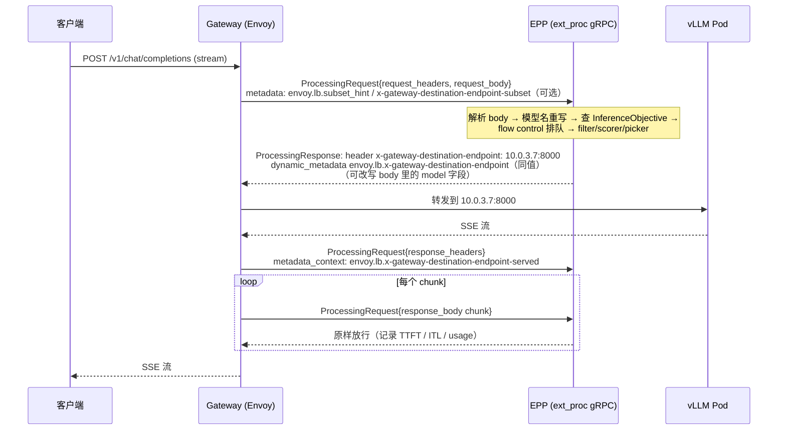

> 本文是《AI 平台工程：资源层与交付层》系列的第 7 篇。上一篇：[Serving 平台：从 InferenceService 到 llm-d](/serving-platforms-kserve-triton-ray-serve-llm-d.html)；下一篇：[可观测、成本与 FinOps](/ai-platform-observability-cost-and-finops.html)。

上一篇结束时，一个 70B 模型的 4 个副本已经跑在集群里，KEDA 会按 `vllm:num_requests_waiting` 把它扩到 6 个。把它们暴露出去最省事的做法是一个 `Service` 加一个 Ingress：`kube-proxy` 在 4 个 Pod 之间轮询，客户端拿到一个 URL，`POST /v1/chat/completions`，完事。这套东西跑起来没有任何报错，但第一周的监控会出现一个反直觉的图形：4 个副本的 `vllm:kv_cache_usage_perc` 长期不齐——一个在 95% 上下抖、两个在 60%、一个 30%；TTFT 的 p50 在 400 ms，p99 却到了 6 s；而 `nvidia-smi` 看总算力只用了一半。请求没有多到需要扩容，但排队真实地发生了，发生在那个 95% 的副本上，因为轮询不看它满不满。

第二周的问题来自另一头。两个团队共用这 4 个副本：A 是对外产品，B 是内部评测脚本。B 的脚本晚上跑批，一次发 2000 个并发，A 的用户在同一时刻打开对话框，等了 8 秒才看到第一个字。平台侧能拿出来的手段只有 Ingress 的按 IP 限速——按请求数限，B 的每个请求带着 30k token 的上下文，A 的每个请求只有 500 token，"每分钟 600 个请求"对两者的含义相差 60 倍。月底算账时同样的问题再来一遍：账单要按 token 计，但网关只记了请求数和字节数，流式响应中途被客户端掐断的那部分谁也说不清生成了多少。

第三周要上 FP8 版本做 A/B。同一个模型名后面要挂两组副本、按 10% 分流、出问题秒级回滚——传统微服务用 HTTPRoute 的权重就能做，但两组副本各有各的 prefix cache，分流的同时又要保证同一会话的多轮请求落在同一组、甚至同一个副本上，否则每次分流切换都是一次全量 prefill。

这三周的问题都发生在引擎之外、Serving 平台之上：**请求进入平台后的第一站**。传统 API 网关在这里做的是路由、鉴权、限流、灰度；模型网关要做同样的四件事，但每一件都被 LLM 请求的特性改写了——路由要看副本的 KV cache 状态而不只是健康检查，限流要按 token 而不是按请求，灰度要和缓存亲和共存，鉴权之后还要把租户身份变成排队优先级。本篇的核心问题是总纲给出的那一个：

> **两个租户共用一个 70B 模型的 4 个副本，A 租户的配额是 B 的三倍。当两者同时打满时，网关应该按什么规则决定哪个请求排队、排在哪个副本上？"配额"在这里指的是 GPU 时间、token 数还是请求数？**

版本锚点：Gateway API Inference Extension（下称 GIE）v1.6.0（`inference.networking.k8s.io/v1`、`inference.networking.x-k8s.io/v1alpha1`）；llm-d-router v0.10.0（`llm-d.ai/v1alpha2`、`llm-d.ai/v1alpha1` 的 `EndpointPickerConfig`）；llm-d v0.9.0 的 guides；vLLM v0.23.0 只用它的 OpenAI 协议字段、启动参数与指标名；KServe v0.20.0 的 `LLMInferenceService` 只做对照。全部发布于本文日期之前。一个必须先说明的事实：**GIE 在 v1.6.0 已经不再包含 Endpoint Picker 的实现**——它的仓库里只剩 `InferencePool` API（`api/v1`）、实验性的 `InferencePoolImport`（`apix/v1alpha1`）、一个只做轮询的轻量参考实现 `pkg/lwepp` 和 conformance 套件；调度插件、`InferenceObjective`、`InferenceModelRewrite` 都在 llm-d 社区的 `llm-d-router` 仓库里。本篇据此分工：**池的定义看 GIE，选副本的逻辑看 llm-d-router**。


## 一、总览

### 1. 引擎的需求

推理引擎对网关这一层的要求，可以从它自己暴露出来的东西反推。vLLM v0.23.0 的 OpenAI 兼容服务在 `/metrics` 上给出 `vllm:num_requests_waiting`、`vllm:num_requests_running`、`vllm:kv_cache_usage_perc`、`vllm:lora_requests_info`（`vllm/v1/metrics/loggers.py`），在 `--kv-events-config` 打开时还会通过 ZMQ 发布 KV block 的 stored / removed 事件（`vllm/engine/arg_utils.py` 的 `kv_events_config`）。引擎把这些东西暴露出来，是因为它知道自己的三个事实平台必须知道：

- **KV cache 是硬约束，而且是每副本独立的。** 一个副本的 KV cache 用到 95%，新请求就在它的 waiting 队列里等；旁边的副本 30% 空着也帮不上忙。请求一旦被送到某个副本，就不能再迁走（迁移 KV cache 的代价与重新 prefill 相当）。所以**选副本必须在请求到达时一次做对**。
- **prefill 的代价可以被缓存吃掉，但缓存在副本本地。** 开了 `--enable-prefix-caching` 后，同一前缀的第二个请求命中缓存，prefill 的计算几乎为零；但缓存在哪个副本，只有那个副本知道。同一会话的多轮请求、同一 system prompt 的一批请求，落在同一副本上 TTFT 差好几倍。
- **请求的成本在它结束之前不知道。** 输入 token 数请求到达时可以数出来，输出 token 数要生成完才知道；流式响应可能被客户端中途关闭；一个 500 token 的请求和一个 30k token 的请求都是"一个请求"。**任何按请求数的配额对 LLM 都是错的量纲。**

从这三个事实出发，引擎需要的网关是：一个在每个请求到达时**能看到每个副本内部状态**、按状态选副本、并且**用 token 而不是请求数**理解容量的东西。此外还有两条来自运维而不是引擎的要求：同一模型名后面要能挂多个版本（BF16 / FP8、新旧权重、不同 LoRA），并且切换时不能把缓存亲和打散；多个团队共用副本时，谁先谁后、谁被限流，要有一个明确的规则。

### 2. K8s 的空缺

原生 Kubernetes 里请求进入 Pod 的路径是 `Service` → `kube-proxy`（或 CNI 的等价物）→ Pod，Gateway API 把 `Service` 换成了 `Gateway` + `HTTPRoute` → `Service`。这条路径上每一处对 LLM 都缺一样东西：

| 需要什么 | 原生路径给了什么 | 缺什么 |
|---|---|---|
| 按副本的 KV / 队列状态选副本 | `Service` 的 endpoint 轮询或随机；健康检查只知道"活着" | 负载均衡器看不到 Pod 内部指标；`HTTPRoute.backendRefs` 只能指向 `Service` 或按权重分到多个 `Service` |
| 同一前缀去同一副本 | 会话亲和只有 `sessionAffinity: ClientIP`，按源 IP | 亲和的键应该是请求体里的内容（system prompt、会话），不是 IP；一个 NAT 后面的几千个用户会全落到一个副本 |
| 按 token 限流 | `Ingress` / Gateway 实现的限流按请求数或字节数 | 请求体里 `messages` 的 token 数需要 tokenizer 才能数；输出 token 数在响应结束前不存在 |
| 按租户优先级排队 | 没有排队这个概念；`PriorityClass` 是 Pod 调度的优先级，不是请求的 | 请求排队要发生在网关或引擎里，K8s 对象层面没有对应物 |
| 同一模型名多版本灰度 | `HTTPRoute.backendRefs[].weight` | 只能按请求随机分流，不感知会话与缓存；模型名在请求体里，`HTTPRoute` 的 match 默认只看 path / header |
| 跨集群容量共享 | MCS（`ServiceExport` / `ServiceImport`）处于 alpha 且不知道 GPU | 导入一个"池"并保留 EPP 选副本的语义，需要新对象 |

第一行是根本缺口。Envoy 这类数据面有能力按每个请求调用一个外部处理器决定目标（`ext_proc`），但 Gateway API 的 `HTTPRoute` 没有一个后端类型能表达"这组 Pod 是一个模型池，请调用某个处理器为每个请求选一个 Pod"。GIE 填的正是这一格。

### 3. 平台的机制

整条链路从外到内：

```text
客户端  POST /v1/chat/completions {"model": "llama-70b", "stream": true, ...}
   │
   ▼
[API 网关 / 认证层]   API key 或 JWT → 租户身份；剥掉客户端自带的 x-llm-d-* 头；注入
   │                   x-llm-d-inference-fairness-id / x-llm-d-inference-objective；
   │                   按租户×模型的 RPM / TPM / 并发预扣（本篇第五、六章的设计部分）
   ▼
[Gateway API 网关]    Gateway（Istio / agentgateway / Envoy AI Gateway / GKE Gateway …）
   │                   HTTPRoute：按 header（模型名，由 body-based router 从请求体提出）匹配
   │                   backendRefs → InferencePool（inference.networking.k8s.io/v1）
   │                            或按 weight 分到两个 InferencePool（版本灰度）
   ▼
[ext_proc → EPP]      Endpoint Picker（llm-d-router）：解析 OpenAI 请求体 → 模型名重写
   │                   （InferenceModelRewrite）→ 查 InferenceObjective 得优先级 → flow control
   │                   排队/准入 → 调度 profile：filter → scorer（加权）→ picker → 返回
   │                   x-gateway-destination-endpoint: <podIP:port>
   ▼
[数据面转发]          网关把请求原样（或重写了 model 字段后）发到那个 Pod；流式响应经
   │                   EPP 的 response 处理路径，从 usage 里读 prompt_tokens / completion_tokens
   ▼
[vLLM Pod]            InferencePool.spec.selector 选中的 Pod；/metrics 被 EPP 每 50 ms 抓一次；
                       可选：ZMQ 发布 KV 事件给 EPP 的精确前缀索引
```

三层各管一件事：**认证层管"你是谁、还能用多少"**，是本篇的设计讨论部分，因为开源栈里没有一个组件把它做完整；**Gateway API 管"哪个模型、哪个版本"**，用标准的 `HTTPRoute` 匹配和权重；**EPP 管"哪个副本、现在还是等一会"**，这是 LLM 特有的部分，也是本篇源码阅读的主体。

### 4. 本文的章节安排

```text
二、为什么轮询是错的       KV 满与 prefix cache 的数值小例子；负载均衡器看不到什么；引擎给了什么
三、GIE 的对象与数据路径    v1.6.0 的仓库分工；InferencePool 字段；HTTPRoute → InferencePool 的完整 YAML；
                            ext_proc 协议（x-gateway-destination-endpoint 等）；网关实现与 conformance
四、EPP 的调度框架          llm-d-router：请求控制流水线、filter / scorer / picker / profile handler 的实名清单、
                            EndpointPickerConfig 与加权打分、近似 vs 精确前缀缓存、PD 分离的 profile 与 sidecar、EPP 的 HA
五、协议与租户              OpenAI 协议作为路由键、body-based routing、协议归一；租户识别与信任边界；
                            InferenceObjective 与 priority、fairness ID、flow control 的 priority band；配额规则表与策略 YAML
六、token 记账              三种"配额"的量纲；预扣与结算；流式断开；usage 的可靠性；回答核心问题的规则表
七、版本灰度与 LoRA         池间 HTTPRoute 权重；池内 InferenceModelRewrite；按 header / 租户定向与回滚；LoRA 的动态加载与亲和
八、多集群与网关容量        InferencePoolImport 的状态；multicluster-* 插件；网关与 EPP 自身的容量
九、代价与边界              四栏表；什么时候不该上这一层
十、本文小结                要点、源码位置、mini-platform/gateway/ 增量与 ttft-compare.py
```


## 二、为什么轮询是错的

### 1. 一个数值小例子

取一组不算极端的数字（全部为推演值，非实测）：一个模型的 4 个副本，每个副本的 KV cache 能放约 160k token（由 `--gpu-memory-utilization` 和 `--max-model-len` 决定，70B 级模型在多卡 TP 下是这个量级）；工作负载是 64 个活跃的多轮对话，每个对话的上下文约 8k token；prefill 吞吐按 llm-d 的 `prefix-cache-affinity-filter` 为参考配置校准出的 `peakPrefillThroughput: 15926` token/s 取整为 16k token/s（Qwen3-32B、H100、TP=2，`guides/optimized-baseline/router/optimized-baseline.values.yaml` 的注释）。

**轮询。** 每个对话的每一轮被随机送到 4 个副本之一。要让某一轮命中缓存，它必须落在上一轮所在的副本，概率 1/4；更糟的是每个副本会看到全部 64 个对话的碎片，64 × 8k = 512k token 远超 160k 的容量，LRU 不断淘汰，实际命中率还要低于 1/4。未命中一轮的 prefill 是 8k / 16k = **0.5 s**，命中一轮接近 0。TTFT 的期望约 0.4 s，但这是均值；分布是双峰的：四分之一的请求几十毫秒，四分之三 0.5 s 以上。

**前缀亲和。** 把 64 个对话按某种一致的方式分到 4 个副本，每副本 16 个对话 × 8k = 128k token，在 160k 容量之内；每一轮都命中，TTFT 稳定在几十毫秒加排队。**同样的硬件、同样的负载，TTFT 差一个数量级**，差别只在谁选副本。

再加上 KV 满的一维。假设有一个副本因为几个长上下文请求 KV 用到 95%，vLLM 会把新请求放进 waiting 队列直到有 block 释放。轮询仍然把 1/4 的请求送过去，这 1/4 的 TTFT 里多了一段与长请求生成时长相关的排队——几秒到几十秒——而另外三个副本的 KV 还有余量。p99 就是这样从 0.5 s 变成 6 s 的。

### 2. 负载均衡器看不到什么

上面两件事需要的信息分别是：**每个副本当前的 KV 使用率和队列长度**，以及**每个副本当前缓存了哪些前缀**。前者引擎在 `/metrics` 上给了，但 `Service` 的负载均衡不读指标；后者更麻烦——vLLM 的 `vllm:prefix_cache_hits` 是一个计数器，告诉你命中了多少，不告诉你缓存里有什么。要知道"哪个副本有这个前缀"，要么网关自己记账（我把带这个前缀的请求送去了哪里，就假设那里有缓存），要么引擎把缓存的变化事件推出来。这两种做法分别对应第四章的 `approx-prefix-cache-producer` 与 `precise-prefix-cache-producer`。

会话亲和（`sessionAffinity: ClientIP`）看起来是一个近似解，但它按源 IP 亲和：一个企业 NAT 后面的几千个用户会全部落到一个副本；而按 cookie 的亲和要求客户端配合，OpenAI 协议的客户端 SDK 不带 cookie。亲和的键应该是**请求内容的前缀哈希**，这只能在能读请求体的地方做。

### 3. 引擎给了什么：model server protocol

GIE 在 `docs/proposals/003-model-server-protocol/README.md` 里把 EPP 对引擎的要求写成了一份协议（状态 "Partially implemented"）：引擎 MUST 实现 OpenAI 的 Completions 与 Chat API；MUST 在 Prometheus 端点上暴露 `TotalQueuedRequests`、`TotalRunningRequests`、`KVCacheUtilization` 三个 gauge（vLLM 对应 `vllm:num_requests_waiting`、`vllm:num_requests_running`、`vllm:kv_cache_usage_perc`，表里同时列了 Triton TensorRT-LLM、trtllm-serve、SGLang 的对应名）；可选的 `BlockSize` 与 `NumGPUBlocks`（`vllm:cache_config_info` 的 `block_size` / `num_gpu_blocks` 标签）供前缀缓存打分估算容量；支持动态 LoRA 的引擎 MUST 暴露 `vllm:lora_requests_info`，带 `max_lora`、`running_lora_adapters`、`waiting_lora_adapters` 三个标签。这份协议是"引擎开发者的接口清单"在网关这一层的具体形态：**一个引擎只要给出这几个指标和 OpenAI 接口，就能被 EPP 正确路由**。


## 三、Gateway API Inference Extension：InferencePool 与 ext_proc 数据路径

### 1. v1.6.0 的仓库分工

先把"什么在哪里"说清楚，因为文档和早期博客里的路径已经对不上了：

| 东西 | v1.6.0 所在 | API group / 路径 |
|---|---|---|
| `InferencePool` CRD | GIE `api/v1/inferencepool_types.go` | `inference.networking.k8s.io/v1` |
| `InferencePoolImport` CRD（alpha） | GIE `apix/v1alpha1/inferencepoolimport_types.go` | `inference.networking.x-k8s.io/v1alpha1` |
| EPP ↔ 网关的 ext_proc 协议 | GIE `docs/proposals/004-endpoint-picker-protocol/README.md` | 状态 Implemented，v1.0.0 |
| EPP ↔ 引擎的指标协议 | GIE `docs/proposals/003-model-server-protocol/README.md` | Partially implemented |
| 轻量参考 EPP（只做轮询） | GIE `pkg/lwepp` | 供 conformance 使用 |
| conformance 套件 | GIE `conformance/`，只有 `Gateway` 一个 profile（`conformance.go` 的 `GatewayLayerProfileName`） | `conformance/reports/` 里最新为 v1.5.0（istio、nginx-gateway-fabric） |
| **EPP 实现**：调度框架、插件、flow control、数据层 | llm-d-router `pkg/epp/`、`cmd/epp/` | — |
| `EndpointPickerConfig`（EPP 配置文件的 schema） | llm-d-router `apix/config/v1alpha1/endpointpickerconfig_types.go` | `llm-d.ai/v1alpha1` |
| `InferenceObjective`、`InferenceModelRewrite` CRD | llm-d-router `apix/v1alpha2/` | `llm-d.ai/v1alpha2` |
| KV 事件订阅与精确前缀索引 | llm-d-router `pkg/kvevents/`、`pkg/kvcache/` | — |
| PD 分离的路由 sidecar | llm-d-router `pkg/sidecar/`、`cmd/pd-sidecar/` | — |
| body-based routing（从请求体提模型名） | GIE 只剩提案 `docs/proposals/1964-pluggable-bbr-framework`（Draft）；llm-d v0.9.0 的 `guides/multi-model-routing` 用独立仓库的 Inference Payload Processor（IPP） | 注入 `X-Gateway-Base-Model-Name` 头 |

GIE `docs/proposals/1199-inferencemodel-api-evolution/README.md` 记录了这个演化：原来的 `InferenceModel`（v1alpha2）被拆掉，`Criticality` 变成 `InferenceObjective.spec.priority`（整数，允许负值），流量切分与模型名重写"不一定通过 GIE 的 CRD"实现——这就是它们最终落在 llm-d-router 的 `InferenceModelRewrite` 里的原因。GIE 的 `1816-inferenceomodelrewrite` 提案（状态 Proposed）与 llm-d-router `apix/v1alpha2/inferencemodelrewrite_types.go` 的字段是一致的。

### 2. `InferencePool` 的字段

`api/v1/inferencepool_types.go` 的 `InferencePoolSpec` 只有四个字段，每一个都值得读一下注释：

```go
type InferencePoolSpec struct {
    Selector          LabelSelector      `json:"selector,omitzero"`          // 只有 matchLabels；同 namespace
    TargetPorts       []Port             `json:"targetPorts,omitempty"`      // 1~8 个，每个 podIP:port 是一个独立 endpoint
    AppProtocol       AppProtocol        `json:"appProtocol,omitempty"`      // "http"（默认）或 "kubernetes.io/h2c"
    EndpointPickerRef *EndpointPickerRef `json:"endpointPickerRef,omitempty"`
}
type EndpointPickerRef struct {
    Group       *Group                    `json:"group,omitempty"`       // 默认 ""（core）
    Kind        Kind                      `json:"kind,omitempty"`        // 默认 Service
    Name        ObjectName                `json:"name,omitempty"`
    Port        *Port                     `json:"port,omitempty"`        // Kind=Service 时必填
    FailureMode EndpointPickerFailureMode `json:"failureMode,omitempty"` // FailOpen | FailClose（默认）
}
```

- `selector` 故意只支持 `matchLabels`（`shared_types.go` 的 `LabelSelector` 注释："intentionally simple to be compatible with Kubernetes Service selectors"），因为有的网关实现会把它翻译成一个 `Service`。
- `targetPorts` 多于一个时，同一个 Pod 的每个端口是一个独立的 endpoint——这是给一个 Pod 里跑多个引擎进程（DP 副本）的形态用的，conformance 里有一条 `gateway_following_epp_routing_dp` 测的就是它。
- `endpointPickerRef` 是 v1 的字段名（早期版本叫 `extensionRef`，v1.6.0 的类型定义里已没有这个名字）。它在 API 层面是 `+optional`，但 `InferencePoolReasonEndpointPickerRefMissing` 的注释说得很直白：v1.5.0 之前必填，现在"仍被大多数实现要求"。
- `failureMode` 默认 `FailClose`：EPP 不可达时**丢请求**而不是退回随机转发。这个默认值的理由是 FailOpen 会把本篇第二章的问题原样带回来，而且是在流量最大、EPP 最可能过载的时候。conformance 有专门一条 `epp_unavailable_fail_open` 测 FailOpen 的行为。

`status.parents[]` 按每个引用它的 Gateway 记 `Accepted` 与 `ResolvedRefs` 两个 condition；另有一个 `Exported` condition 类型（`InferencePoolConditionExported`）为多集群导出预留，第八章再说。

### 3. 完整的 `InferencePool` + `HTTPRoute`

下面两个对象是 `mini-platform/gateway/inferencepool.yaml` 与 `httproute.yaml` 的内容，字段全部来自 v1.6.0 的类型定义和 conformance 的 `resources/base.yaml`：

```yaml
apiVersion: inference.networking.k8s.io/v1
kind: InferencePool
metadata:
  name: llama-70b-bf16
  namespace: serving
spec:
  selector:
    matchLabels:
      app: vllm-llama-70b
      variant: bf16
  targetPorts:
    - number: 8000
  appProtocol: http
  endpointPickerRef:
    kind: Service
    name: llama-70b-epp
    port:
      number: 9002
    failureMode: FailClose
```

```yaml
apiVersion: gateway.networking.k8s.io/v1
kind: HTTPRoute
metadata:
  name: llama-70b
  namespace: serving
spec:
  parentRefs:
    - group: gateway.networking.k8s.io
      kind: Gateway
      name: inference-gateway
      namespace: gateway-system
      sectionName: http
  rules:
    - matches:
        - path:
            type: PathPrefix
            value: /v1
          headers:
            - name: X-Gateway-Base-Model-Name
              value: llama-70b
      backendRefs:
        - group: inference.networking.k8s.io
          kind: InferencePool
          name: llama-70b-bf16
          weight: 100
      timeouts:
        request: 0s          # 流式响应可能持续数分钟，关掉请求级超时
```

两点说明。第一，`backendRefs` 里 `group: inference.networking.k8s.io`、`kind: InferencePool` 是 Gateway API 的标准扩展点：`HTTPRoute` 本来就允许指向非 `Service` 的后端，前提是网关实现认识这个 kind；不认识的实现会在 `HTTPRoute.status` 里给 `ResolvedRefs=False`（conformance 的 `httproute_invalid_inferencepool_ref` 测这个）。第二，`headers` 匹配的 `X-Gateway-Base-Model-Name` 是 llm-d v0.9.0 `guides/multi-model-routing/manifests/httproutes.yaml` 里 IPP 注入的头名；如果只有一个模型，这条 match 可以去掉，`HTTPRoute` 按 path 全部送进池。多模型时每个模型一条 `HTTPRoute`（或一条 route 多条 rule），第五章展开。

### 4. ext_proc 数据路径与 EPP 协议

Envoy 的 `ext_proc` filter 允许把请求的 headers / body 以 gRPC 流的形式发给一个外部处理器，处理器可以改写 headers、body，或直接返回响应。GIE 的 `004-endpoint-picker-protocol` 规定 EPP 必须实现这个 gRPC 服务（`envoy.service.ext_proc.v3.ExternalProcessor`），必须支持 streaming 模式，并定义了四个约定：



- **Destination Endpoint**（EPP → 数据面）：EPP 必须通过 `x-gateway-destination-endpoint` 这个 header **和** `dynamic_metadata` 里 `envoy.lb` 命名空间下的同名键给出 `<ip:port>`，可以是逗号分隔的多个（有序 fallback 列表，网关按重试配置顺序尝试）。没有可用 endpoint 时返回 503 的 `ImmediateResponse`；应当丢弃时（sheddable 请求且服务器过载）返回 429。
- **Endpoint Subset**（数据面 → EPP）：网关可以在 `envoy.lb.subset_hint` 命名空间下用 `x-gateway-destination-endpoint-subset` 限定 EPP 只能从某个子集里选——这是多网关、多 `HTTPRoute` 共享一个池时限定候选范围的机制。
- **Destination Endpoint Served**（数据面 → EPP）：响应阶段网关必须在 `metadata_context` 里告诉 EPP 实际由谁服务了（`x-gateway-destination-endpoint-served`），因为 EPP 给的是一个列表，重试可能落到第二个。EPP 用它更正自己对"哪个副本刚被送了什么前缀"的记账。
- **健康检查**：gRPC Health Checking Protocol，`readiness` 在数据同步完成且（多副本时）当选 leader 之后才 `SERVING`。

这些常量在 llm-d-router `pkg/epp/metadata/consts.go` 里逐一对应：`DestinationEndpointKey`、`DestinationEndpointNamespace = "envoy.lb"`、`SubsetFilterNamespace = "envoy.lb.subset_hint"`、`DestinationEndpointServedKey`。

一个重要的性质：**EPP 在请求路径上是同步的**——每个请求的 headers 与 body 都要经过 EPP 的 gRPC 流才能转发，响应的每个 chunk 也经过它。这意味着 EPP 的延迟直接加在 TTFT 上，EPP 的吞吐是网关的吞吐上限之一，第八章讨论容量时会回到这里。

### 5. 网关实现与 conformance

GIE 的 conformance 只有 `Gateway` 一个 profile（`conformance/conformance.go` 注释："Future profiles will cover EPP and ModelServer layers"），测的是网关是否正确地：接受 `InferencePool` 作为后端并写 status、按 EPP 返回的 endpoint 转发（`gateway_following_epp_routing`）、按权重在两个池之间分流（`gateway_weighted_two_pools`：70 / 30）、回传 served endpoint、处理 `FailOpen`、拒绝无效引用、支持 `appProtocol` 与 DP 多端口。`conformance/reports/` 里 v1.5.0 有 istio 与 nginx-gateway-fabric 的报告。

v1.6.0 的 `site-src/implementations/gateways.md` 列出的 conformant 实现是 **Istio、Agentgateway、NGINX Gateway Fabric**；`site-src/index.md` 与 `concepts/api-overview.md` 仍写着"extends popular gateways like Envoy Gateway, kgateway, and GKE Gateway"。llm-d v0.9.0 的 `docs/infrastructure/gateway/README.md` 给出安装指引的是 **GKE Gateway、Istio、Agentgateway、Envoy AI Gateway** 四家，`guides/optimized-baseline` 的 `GATEWAY_CLASS` 选项是 `epponly | gke | agentgateway | istio`。选型上这些实现的差别在于 ext_proc 之外的东西：是否已有服务网格、是否需要 AI 网关的上游（第三方模型 API）代理、是否用云厂商的 LB。对本篇讨论的 EPP 路由语义来说它们是等价的——协议就是为了这个而定的。

llm-d 还提供一个 **Standalone 模式**（`docs/architecture/core/router/proxy.md`）：Envoy 作为 sidecar 与 EPP 跑在同一个 Pod 里，ext_proc 走 localhost，不需要 `Gateway` / `HTTPRoute` 与网关控制器。适合批处理、RL rollout、还在用 Ingress 的集群；生产多租户场景仍应走 Gateway 模式，因为灰度、TLS、多集群都依赖 Gateway API 的对象。

KServe v0.20.0 的对照：`pkg/apis/serving/v1alpha1/llm_inference_service_types.go` 的 `LLMInferenceServiceSpec.Router` 有 `Route.HTTP`（内嵌 `gwapiv1.HTTPRouteSpec`）、`Gateway.Refs` 和 `Scheduler`（`Pool.Spec` 内嵌 GIE 的 `InferencePoolSpec`、`Config.Inline` / `Config.Ref` 放 `EndpointPickerConfig`、`Template` 是 EPP 的 PodSpec、`Replicas`）——它把本章的 `InferencePool` + `HTTPRoute` + EPP Deployment 三样东西折叠进一个 CR，生成的对象与本章手写的一致。


## 四、EPP：llm-d-router 的调度框架

### 1. 请求控制流水线

llm-d-router `docs/architecture.md` 把一个请求在 EPP 里的路径分成两段。**Request Control** 每请求跑一次（`pkg/epp/requestcontrol/director.go` 的 `Director.HandleRequest`）：

```text
1. 解析 body（parser 插件：openai-parser / anthropic-parser / vllmhttp-parser），记 IncomingModelName
2. modelRewriteIfNeeded：按 InferenceModelRewrite 的规则或 x-llm-d-model-name-rewrite 头改写 model → TargetModelName
3. getInferenceObjective：按 x-llm-d-inference-objective 头查同 namespace 的 InferenceObjective，取 spec.priority（无则 0）
4. 读 x-llm-d-inference-fairness-id（无则 agent-identity 属性，再无则 "default-flow"）
5. admissionController.Admit(ctx, reqCtx, priority)  ← flow control 在这里排队或拒绝（可能阻塞）
6. endpointCandidates.Locate：池里当前就绪的 endpoint（可被 x-gateway-destination-endpoint-subset 限定）
7. Screener 插件：对所有 profile 都生效的强制过滤
8. DataProducer 插件：为这个请求准备数据（token 数、前缀匹配信息、在途负载…）
9. Admitter 插件：可拒绝（如 latency-slo-admitter）
10. scheduler.Schedule → 一个或多个 scheduling profile
11. prepareRequest：写 x-gateway-destination-endpoint；PreRequest 插件（PD 分离在这里写 x-prefiller-host-port）
12. repackage：把可能改写过的 body 序列化回去
```

**Scheduling** 每个 profile 跑一次（`pkg/epp/scheduling/scheduler_profile.go` 的 `SchedulerProfile.Run`）：filter 链顺序过滤 → 每个 scorer 给每个候选打 0～1 分（`enforceScoreRange` 截断）→ `weightedScorePerEndpoint[endpoint] += score × weight` → picker 选。多个 profile 由 **profile handler** 编排：PD 分离就是 prefill 与 decode 两个 profile。

### 2. 插件类型与实名清单

插件类型名是配置文件里 `type:` 的值，全部来自 `pkg/epp/framework/plugins/` 下各插件源码的常量（`README.md` 说明 `cmd/epp/runner/runner.go` 是稳定级别的唯一来源，当前全部为 Alpha 或 Beta；Alpha 插件需要 `--allow-experimental-plugins`）。与本篇相关的：

| 槽位 | 类型名 | 做什么 |
|---|---|---|
| filter | `prefix-cache-affinity-filter` | 概率性地把候选缩到"有前缀命中"的 sticky 子集；TTFT 惩罚超过 `maxTTFTPenaltyMs` 时打破亲和；`explorationProbability` 控制探索 |
| filter | `utilization-filter` | 按 `active-requests` / `running-requests` / `waiting-queue` / `kv-cache-utilization` 的 `maxValue` 丢掉过载副本；`fallbackOnEmpty` |
| filter | `decode-filter` / `prefill-filter` / `encode-filter` | 按 `llm-d.ai/role` 标签选角色 Pod（PD 分离） |
| filter | `label-selector-filter` | 通用的标签选择器（替代已弃用的 `by-label`） |
| filter | `session-affinity-filter` | 按会话头（默认 `x-session-token`）亲和 |
| scorer | `prefix-cache-scorer` | 按前缀命中比例（可加绝对长度项，`matchLengthWeight`）打分 |
| scorer | `precise-prefix-cache-scorer` | 已弃用，由 `precise-prefix-cache-producer` + `prefix-cache-scorer` 取代 |
| scorer | `queue-scorer` | 队列最短得 1，最长得 0，线性 |
| scorer | `kv-cache-utilization-scorer` | `1 − kvCacheUsagePercent` |
| scorer | `token-load-scorer` | 按 EPP 自己记的在途 token 负载打分 |
| scorer | `load-aware-scorer`、`active-request-scorer`、`running-requests-size-scorer` | 其他负载维度 |
| scorer | `lora-affinity-scorer` | 目标 LoRA 已加载 1.0 / 有空位 0.8 / 在等待加载 0.6 / 满了 0.0 |
| scorer | `latency-scorer` | 配合 `predicted-latency-producer` 按预测 TTFT/TPOT 打分 |
| scorer | `session-affinity-scorer`、`topology-affinity-scorer`、`header-label-affinity-scorer` | 其他亲和 |
| picker | `max-score-picker`（默认）、`weighted-random-picker`、`random-picker` | 取最高分 / 按分数加权随机 / 随机 |
| profile handler | `single-profile-handler`（默认）、`disagg-profile-handler`、`pd-profile-handler`（已弃用）、`header-profile-handler`、`data-parallel-profile-handler` | 编排 profile |
| decider | `prefix-based-pd-decider`、`always-disagg-pd-decider`、`always-disagg-multimodal-decider` | 决定这个请求是否走 prefill 分离 |
| data producer | `approx-prefix-cache-producer`、`precise-prefix-cache-producer`、`token-producer`、`inflight-load-producer`、`session-id-producer`、`predicted-latency-producer` | 为 scorer / filter 准备每请求数据 |
| flow control | `fcfs-ordering-policy`、`edf-ordering-policy`、`slo-deadline-ordering-policy`；`global-strict-fairness-policy`、`round-robin-fairness-policy`、`program-aware-fairness`；`utilization-detector`、`concurrency-detector`；`static-usage-limit-policy`、`priority-holdback-policy`、`soft-reflective-ceiling-policy` | 排队顺序 / 流间公平 / 饱和检测 / 准入上限 |

brief 里提到的 `lora-affinity`，在 v0.10.0 的类型名是 `lora-affinity-scorer`（`scorer/loraaffinity/lora_affinity.go` 的 `LoraAffinityScorerType`）；`pd-profile-handler` 存在但已标 Deprecated，替代者是 `disagg-profile-handler`（`profilehandler/disagg/README.md`）。

### 3. `EndpointPickerConfig` 与加权打分

EPP 的配置是一个 YAML 文件（`--config-file`）或内联文本（`--config-text`），schema 是 `apix/config/v1alpha1/endpointpickerconfig_types.go` 的 `EndpointPickerConfig`：`plugins[]`（`name` / `type` / `parameters`）实例化插件，`schedulingProfiles[]`（`name` / `plugins[].pluginRef` / `weight`）把实例装进 profile；另有 `featureGates`、`dataLayer`、`flowControl`、`requestHandler` 几段。下面是 `mini-platform/gateway/epp-config.yaml`，它把 llm-d v0.9.0 的 `guides/flow-control/router/flow-control.values.yaml` 与 `optimized-baseline` 的配置合成一份，装进 ConfigMap 由 EPP Deployment 挂载：

```yaml
apiVersion: v1
kind: ConfigMap
metadata:
  name: llama-70b-epp-config
  namespace: serving
data:
  epp-config.yaml: |
    apiVersion: llm-d.ai/v1alpha1
    kind: EndpointPickerConfig
    featureGates:
      - flowControl
    plugins:
      # 数据生产者：近似前缀索引（EPP 自己记"我把什么前缀送去了哪"）
      - type: approx-prefix-cache-producer
        parameters:
          blockSizeTokens: 64
          maxPrefixTokensToMatch: 16384
          lruCapacityPerServer: 31250
      - type: inflight-load-producer
      # 副本选择
      - type: prefix-cache-affinity-filter
      - type: utilization-filter
        name: drop-overloaded
        parameters:
          conditions:
            - metric: kv-cache-utilization
              maxValue: 0.9
            - metric: waiting-queue
              maxValue: 4
          fallbackOnEmpty: true
      - type: prefix-cache-scorer
        parameters:
          matchLengthWeight: 0.3
          matchLengthScaleTokens: 8192
      - type: queue-scorer
      - type: kv-cache-utilization-scorer
      - type: lora-affinity-scorer
      - type: max-score-picker
      - type: single-profile-handler
      # flow control：租户间公平与优先级
      - type: round-robin-fairness-policy
      - type: fcfs-ordering-policy
      - type: concurrency-detector
        parameters:
          maxConcurrency: 128
          concurrencyMode: requests
          headroom: 0.0
    schedulingProfiles:
      - name: default
        plugins:
          - pluginRef: prefix-cache-affinity-filter
          - pluginRef: drop-overloaded
          - pluginRef: prefix-cache-scorer
            weight: 3
          - pluginRef: queue-scorer
            weight: 2
          - pluginRef: kv-cache-utilization-scorer
            weight: 2
          - pluginRef: lora-affinity-scorer
            weight: 1
          - pluginRef: max-score-picker
    flowControl:
      maxBytes: "10Gi"
      maxRequests: "1k"
      defaultRequestTTL: "60s"
      saturationDetector:
        pluginRef: concurrency-detector
      priorityBands:
        - priority: 100
          maxRequests: "500"
          fairnessPolicyRef: round-robin-fairness-policy
          orderingPolicyRef: fcfs-ordering-policy
        - priority: 0
          maxRequests: "200"
          fairnessPolicyRef: round-robin-fairness-policy
          orderingPolicyRef: fcfs-ordering-policy
        - priority: -10
          maxRequests: "50"
          fairnessPolicyRef: round-robin-fairness-policy
          orderingPolicyRef: fcfs-ordering-policy
```

打分的算术（`scheduler_profile.go` 的 `runScorerPlugins`）：每个 scorer 的原始分被 `enforceScoreRange` 截到 $$[0, 1]$$，再乘权重累加，picker 取最大：

$$
S(e) = \sum_i w_i \cdot \operatorname{clamp}_{[0,1]}\big(s_i(e)\big)
$$

上面的配置里前缀命中满分 3、队列与 KV 各 2、LoRA 1，总分 8。一个前缀完全命中但队列最长的副本得 3 + 0 + kv，一个无命中但完全空闲的副本得 0 + 2 + 2 = 4——**只有当前缀命中省下的 prefill 值得付出更长的排队时**（这由 `prefix-cache-scorer` 的 `matchLengthWeight` 与 `queue-scorer` 的权重比决定），请求才会去热副本。`prefix-cache-affinity-filter` 在 scorer 之前先做了一层：命中率高于阈值的 sticky 副本存在且没有明显过载时，候选集只剩它们，scorer 只在 sticky 集内分负载；sticky 副本的 TTFT 比其他副本高出 `maxTTFTPenaltyMs` 以上时它打破亲和，候选集回到全集。这个 filter 的 README 解释了它为什么存在：`prefix-cache-scorer` + `max-score-picker` 会把相似前缀的并发请求全部堆到一个副本（hot-spotting），换 `weighted-random-picker` 又会稀释亲和；filter 把"亲和"与"分负载"拆成两步。

`docs/architecture.md` 的 "Default plugins" 一节列了不写也会注入的东西：单 profile 时自动加 `single-profile-handler`，没有 picker 时加 `max-score-picker`，scorer 的 weight 默认 1.0，parser 默认三个都开，flow control 的三个默认策略与 `utilization-detector`，数据层的 `metrics-data-source` + `core-metrics-extractor`（这是 50 ms 一次的 `/metrics` 抓取，`--refresh-metrics-interval`）。

### 4. 近似 vs 精确前缀缓存

"哪个副本有这个前缀"有两种知法，对应两个 data producer：

**近似**（`approx-prefix-cache-producer`，`requestcontrol/dataproducer/approximateprefix/`）：EPP 把每个请求的 prompt 切成 `blockSizeTokens` 大小的块、逐块链式哈希，记录"这个块哈希被送去了哪个副本"，每副本一个 LRU（`lruCapacityPerServer`）。它不需要引擎配合，代价是**猜**：引擎可能已经把那些块淘汰了（EPP 的 LRU 与引擎的 LRU 不同步），也不知道引擎内部因为其他原因产生的缓存。`docs/operations.md` 警告 `maxPrefixTokensToMatch` 越大 EPP 的 CPU 越高（400k token 的匹配上限比 16k 高出 100% 以上）。

**精确**（`precise-prefix-cache-producer` + `pkg/kvcache` + `pkg/kvevents`）：vLLM 以 `--kv-events-config '{"enable_kv_cache_events":true,"publisher":"zmq","endpoint":"tcp://*:5556",...,"topic":"kv@<podIP>:<port>@<model>"}'` 启动（llm-d `guides/precise-prefix-cache-routing/modelserver/gpu/vllm/base/patch-vllm.yaml`），EPP 的 `kvevents.Pool` 订阅每个 Pod 的 ZMQ 流，把 block-stored / block-removed / all-cleared 事件写进 `kvblock.Index`；`kvcache.Indexer.ScoreTokens` 把请求 token 切块、算哈希、查索引，`LongestPrefixScorer` 按"从第 0 块开始连续命中的最长前缀"给每个 Pod 打分。这要求 EPP 拿到**与引擎相同的 token 序列**——所以要配 `token-producer`，llm-d 的 guide 让它调 vLLM 的 `/v1/chat/completions/render` 端点（`dataproducer/tokenizer/vllm_http.go` 的 `chatRenderPath`）做分词，或在 EPP 里内置 tokenizer。精确方案的代价是每个 Pod 一条 ZMQ 订阅、EPP 内存里一份全局索引、以及分词的延迟；收益是命中率不再靠猜，多轮长上下文（agentic）负载下差别明显。

两者都要求引擎的 `block_size` 与 EPP 的 `blockSizeTokens` 对齐，否则块边界错位，哈希全部对不上。

### 5. PD 分离的 profile 与 sidecar

PD 分离下一个请求要选两个 Pod。`disagg-profile-handler` 先跑 `decode` profile（总是），再由 decider 决定是否跑 `prefill` profile：`prefix-based-pd-decider` 读 decode 候选上的前缀匹配信息，只有**未命中的后缀长度 ≥ `nonCachedTokens`** 时才值得分离（`promptTokens` 另设一个最短提示长度门槛）。两个 profile 各自用 `prefill-filter` / `decode-filter`（按 `llm-d.ai/role` 标签，或用 `label-selector-filter` 适配外部系统的标签）缩候选，各自打分。结果写成两个 header：`x-gateway-destination-endpoint` 指向 decode Pod，`x-prefiller-host-port` 指向 prefill Pod（`docs/disaggregation.md`）。

网关只认识第一个 header，把请求发到 decode Pod。decode Pod 里跑着 `pd-sidecar`（`pkg/sidecar/proxy/`）：看到 `x-prefiller-host-port` 就先把请求转给 prefill Pod 做 prefill（KV 通过 NIXL、shared-storage、SGLang、Mooncake 等 connector 传输，`pkg/sidecar/constants/constants.go`），再在本地 decode；没有这个 header 就本地做完两段。所以 PD 分离对网关是透明的——这是 llm-d 把"选两个 Pod"塞进单目标 ext_proc 协议的方式。v0.9.0 还有一个实验性的 **Coordinator** 形态（`docs/coordinator_architecture.md`、`guides/coord-disaggregation`）：一个独立服务把 encode / prefill / decode 作为流水线步骤，每步再通过网关 + EPP 选 Pod，不再需要每 Pod 一个 sidecar。

### 6. EPP 自身的部署形态

EPP 是有状态的：近似前缀索引、在途负载、flow control 的队列都在进程内存里。`docs/operations.md` 的 "Scaling Modes" 说得很清楚：**Active-Passive**（leader election，`--ha-enable-leader-election`，只有 leader 的 readiness 通过）加副本不加吞吐；**Active-Active** 吞吐近线性（2 副本 2.0x、4 副本 3.5x），但每个副本只看到自己处理过的请求，近似前缀路由的命中率显著下降，flow control 的公平与优先级也只在每个副本的流量份额内生效。精确前缀索引是 HA 安全的（每个副本各自订阅事件收敛到同一视图），`guides/precise-prefix-cache-routing` 却仍要求 `replicas: 1`，因为 `token-load-scorer` 的在途 token 记账是每进程的。结论：**当前版本的 EPP 应按"一个池一个活跃 EPP"来规划**，把它的容量作为池的容量上限之一（第八章）。


## 五、协议与租户：OpenAI 协议、模型名与身份

### 1. OpenAI 协议作为路由键

事实标准是 OpenAI 的 `/v1/chat/completions` 与 `/v1/completions`。vLLM v0.23.0 的请求模型在 `vllm/entrypoints/openai/chat_completion/protocol.py` 的 `ChatCompletionRequest`：`model: str | None`、`messages`、`stream: bool | None = False`、`stream_options: StreamOptions | None`（`engine/protocol.py`：`include_usage`、`continuous_usage_stats`）、`max_completion_tokens`（`max_tokens` 已标 deprecated）。响应的 `UsageInfo` 有 `prompt_tokens`、`completion_tokens`、`total_tokens`、`prompt_tokens_details.cached_tokens`。

对网关来说这份协议有三处不便。第一，**路由键在请求体里**：`model` 是 JSON 字段，`HTTPRoute` 的 match 只看 path、header、query。所以要有一个组件先读 body、把 `model` 提到 header 里——GIE 的 `1964-pluggable-bbr-framework` 提案（Draft）描述的 body-based router 注入 `X-Gateway-Model-Name`；llm-d v0.9.0 实际使用的是独立仓库 `llm-d-inference-payload-processor`（IPP），它按带 `inference.llm-d.ai/ipp-managed: "true"` 标签的 ConfigMap 里的 `baseModel` 与 `adapters` 列表，把请求体里的 `model` 映射到基础模型名并注入 `X-Gateway-Base-Model-Name` 头，`HTTPRoute` 再按这个头匹配到对应的 `InferencePool`（`guides/multi-model-routing`）。LoRA 名也在这张表里——`"model": "food-review-1"` 会被映射到它的基础模型的池，池内再由 EPP 的 `lora-affinity-scorer` 选副本。第二，**流式响应是 SSE**：`text/event-stream`，每行 `data: {...}`，以 `data: [DONE]` 结束，连接可能持续几分钟，网关不能按普通 HTTP 响应缓冲。第三，**`model` 字段同时是路由键和引擎参数**：vLLM 用它选 LoRA adapter（`--lora-modules` 注册的名字或动态加载的名字），所以网关改写它（版本重定向）时要保证改写后的名字引擎认识。

### 2. 协议归一

EPP 的 `requestHandler.parsers` 默认开三个：`openai-parser`、`anthropic-parser`、`vllmhttp-parser`（`framework/plugins/requesthandling/parsers/`）。parser 的职责是从各自协议的 body 里取出 `model`、prompt / messages、`max_tokens` 类字段供调度使用（`openai.go` 的 `MaxOutputTokensFromPayload(bodyMap, "max_completion_tokens", "max_tokens")`），实现 `ModelNameRewriter` 以便改写模型名，并从响应里解析 `usage`。这一层做的是**理解**协议而不是**转换**协议：EPP 不把 Anthropic 请求翻成 OpenAI 请求再发给 vLLM。真正的协议转换（对客户端统一暴露 OpenAI、对上游可能是 OpenAI、Anthropic 或第三方 API）是 AI 网关（Envoy AI Gateway、agentgateway 这类）的工作，在 `HTTPRoute` 之前。平台内部的建议是**只对引擎暴露 OpenAI 协议**，把多协议留给最外层。

### 3. 租户识别与信任边界

租户身份进入这条链路的方式是 header。llm-d-router `pkg/epp/metadata/consts.go` 定义了 EPP 读取的控制头（v0.9.0 起统一为 `x-llm-d-*` 前缀，旧的 `x-gateway-inference-*` 作为弃用别名仍可读，同时出现时新名胜出）：

| header | 用途 | EPP 里的消费者 |
|---|---|---|
| `x-llm-d-inference-objective` | `InferenceObjective` 的名字（同 namespace） | `Director.getInferenceObjective` → `spec.priority` |
| `x-llm-d-inference-fairness-id` | flow control 的流 ID；缺省 `default-flow` | `Director.HandleRequest` → `InferenceRequest.FairnessID` |
| `x-llm-d-model-name-rewrite` | 每请求覆写目标模型名 | `modelRewriteIfNeeded` |
| `x-llm-d-slo-ttft-ms` / `x-llm-d-slo-tpot-ms` | 请求的延迟目标 | `latency-slo-admitter`、`slo-deadline-ordering-policy` 等 |

这几个头**任何客户端都能自己写**。llm-d `guides/flow-control/README.md` 用一段 WARNING 给出信任边界的正确做法：外层 API 网关（或 Envoy 的 `ext_authz` filter）**先剥掉**请求里所有 `x-llm-d-*` 头及其弃用别名（`x-gateway-destination-endpoint*` 这类 EPP 协议头不在剥除范围），**再**验证 API key 或 JWT，从凭证里取出租户与等级，**然后**注入权威的 `x-llm-d-inference-fairness-id` 与 `x-llm-d-inference-objective`。这一步在 GIE 的分层里明确属于 "auth handled upstream"（`1199` 提案的 Non-Goals："IGW implementing a custom auth mechanism"）。

于是租户模型是两层的：**外层**（认证层）把 API key → 租户 → (fairness ID, objective 名, 配额档) 三元组；**内层**（EPP）只认 fairness ID 与 objective，不知道 API key 是什么。mini-platform 里认证层是一个几十行的 Envoy `ext_authz` 兼容服务或一个网关 filter，它读第五节的策略文件做映射与预扣，本篇不给它的代码，只给它执行的规则。

### 4. `InferenceObjective`、优先级与 flow control

`InferenceObjective`（llm-d-router `apix/v1alpha2/inferenceobjective_types.go`，`llm-d.ai/v1alpha2`）只有两个字段：`spec.priority *int32`（越大越优先，允许负值，未设视为 0）和 `spec.poolRef`。类型注释把语义写死了：**"flow control will always allow requests of higher priority to be served first. Fairness is only enforced and tracked between requests of the same priority."** 也就是优先级之间是严格的，公平只在同一优先级内。llm-d `guides/flow-control/objectives.yaml` 的三档：

```yaml
apiVersion: llm-d.ai/v1alpha2
kind: InferenceObjective
metadata:
  name: premium-traffic
  namespace: serving
spec:
  priority: 100
  poolRef:
    name: llama-70b-bf16
---
apiVersion: llm-d.ai/v1alpha2
kind: InferenceObjective
metadata:
  name: standard-traffic
  namespace: serving
spec:
  priority: 0
  poolRef:
    name: llama-70b-bf16
---
apiVersion: llm-d.ai/v1alpha2
kind: InferenceObjective
metadata:
  name: best-effort-traffic
  namespace: serving
spec:
  priority: -10
  poolRef:
    name: llama-70b-bf16
```

flow control（`pkg/epp/flowcontrol/`，`featureGates: ["flowControl"]` 打开，默认关）在 `Admit` 处生效：饱和检测器（`concurrency-detector` 按在途请求数，`utilization-detector` 按抓到的 KV / 队列指标；后者受指标滞后影响，`guides/flow-control/tuning.md` 建议生产用前者）判断池是否饱和；未饱和直接放行（work-conserving，不会在 GPU 有余量时人为限流）；饱和时请求进入按 `priority` 分的 band，band 内按 `fairnessPolicyRef` 在流之间选（`round-robin-fairness-policy` 轮转各 fairness ID；`global-strict-fairness-policy` 忽略流、全局排序），流内按 `orderingPolicyRef` 选（`fcfs-ordering-policy` 先到先服务；`edf` / `slo-deadline` 按截止时间）。每个 band 有 `maxRequests` / `maxBytes` 上限，超过直接 429；排队超过 `defaultRequestTTL`（默认 60 s）也 429。429 响应带 `x-llm-d-request-dropped-reason` 头（`rejected-saturated`、`rejected-ttl-expired`、`rejected-context-cancelled`、`evicted-*`），前缀 `rejected-*` 表示没消耗 GPU、可放心重试，`evicted-*` 表示已经算了一部分（`docs/api-reference/epp-http-headers.md`）。`enableEviction: true` 时高优先级请求被饱和挡住可以把在途的负优先级请求杀掉腾位。

回到"A 的配额是 B 的三倍"：EPP 的公平策略在 v0.10.0 只有等份轮转与全局严格两种（还有实验性的 `program-aware-fairness`），**没有按权重的公平**。所以"三倍"不能在 EPP 层表达，只能在外层用 TPM 配额表达；EPP 层能表达的是"A 与 B 谁的优先级更高"以及"同一优先级内不让任何一方饿死"。

### 5. 每租户每模型的配额：规则表与策略文件

外层配额是设计题。三个维度都要有，缺一个就有绕过的办法：

| 维度 | 限什么 | 为什么需要 | 缺了会怎样 |
|---|---|---|---|
| RPM（请求/分钟） | 请求到达率 | 防止大量小请求把 EPP、网关、tokenizer 打满；这些开销与 token 数无关 | 一个租户每分钟发 10 万个 1-token 请求，TPM 很低但 EPP CPU 打满 |
| TPM（token/分钟） | 输入 + 输出 token 的消耗率 | 与 GPU 时间最接近的量纲；账单的单位 | 按 RPM 限的 600 个 30k-token 请求 = 1800 万 token/分钟 |
| 并发（在途请求数） | 同时占用 KV cache 的请求数 | KV cache 是并发的函数不是速率的函数；一个租户开 2000 个慢流就把所有副本的 KV 占满 | TPM 未超但所有新请求排队 |

TPM 和并发之间还有一层：并发 × 每请求上下文长度 ≈ 占用的 KV token 数，这才是真正的"GPU 内存配额"。有的平台直接限"在途 token 数"（并发请求的 `prompt_tokens + max_completion_tokens` 之和）——这是最贴近资源的量纲，但对客户端最不直观。

`mini-platform/gateway/tenants/quota-a.yaml` 与 `quota-b.yaml` 用 mini-platform **自己的** schema（`mini-platform.local/v1alpha1`，由认证层的小服务读取；不是任何上游项目的 CRD），把外层配额与内层身份绑在一起：

```yaml
# mini-platform/gateway/tenants/quota-a.yaml —— mini-platform 自定 schema，由网关的认证 filter 强制执行
apiVersion: mini-platform.local/v1alpha1
kind: TenantQuota
metadata:
  name: tenant-a
spec:
  identity:
    apiKeyHashes:                      # sha256(api key)，明文不入库
      - "3a1f…"
    jwtClaims:                         # 或从 JWT 的 claim 取租户
      issuer: https://sso.example.internal
      tenantClaim: org
      tenantValue: product-team
  inject:                              # 认证通过后注入给 EPP 的头（客户端自带的同名头先剥掉）
    fairnessId: tenant-a
    objective: premium-traffic         # 对应 InferenceObjective 名，priority 100
  limits:
    - model: llama-70b                 # 请求体里的 model（重写前的名字）
      rpm: 3000
      tpm: 3000000                     # 输入 + 输出
      concurrency: 600
      maxCompletionTokensDefault: 1024 # 请求未给 max_completion_tokens 时的预扣值
    - model: "*"                       # 其他模型的兜底
      rpm: 300
      tpm: 300000
      concurrency: 60
  accounting:
    preDebit: input_plus_max_output    # 预扣 = prompt 估算 + min(max_completion_tokens, 上限)
    settleOn: usage_or_chunk_count     # 结算优先用 usage，缺失则按 SSE chunk 数
    streamDisconnect: bill_generated   # 断开时按已生成计费
```

```yaml
# mini-platform/gateway/tenants/quota-b.yaml
apiVersion: mini-platform.local/v1alpha1
kind: TenantQuota
metadata:
  name: tenant-b
spec:
  identity:
    apiKeyHashes:
      - "9c72…"
  inject:
    fairnessId: tenant-b
    objective: standard-traffic        # priority 0
  limits:
    - model: llama-70b
      rpm: 1000
      tpm: 1000000                     # A 的三分之一
      concurrency: 200
      maxCompletionTokensDefault: 1024
  accounting:
    preDebit: input_plus_max_output
    settleOn: usage_or_chunk_count
    streamDisconnect: bill_generated
```

"三倍"落在 `tpm` 与 `concurrency` 上；"谁先服务"落在 `objective` 上。如果两个租户应当**同等优先、只是额度不同**，就让两者都用 `standard-traffic`，靳 `round-robin-fairness-policy` 在饱和时轮转两条流，而三倍的差别只由外层的 TPM 体现。

一个常被忽略的点：这些限制是**每租户每模型**的，而不是每租户总量的。两个模型的池是两组 GPU，一个租户在 7B 池上的用量不应吃掉它在 70B 池上的额度；反过来，总量配额（一个租户一个月花多少钱）是 FinOps 的事，下一篇讨论。


## 六、token 记账：预扣、结算与流式

### 1. 三种"配额"的量纲

核心问题问"配额"指什么。三个候选各自的位置：

| 量纲 | 与 GPU 消耗的关系 | 请求到达时可知？ | 适合做什么 |
|---|---|---|---|
| 请求数 | 弱：500 token 与 30k token 差 60 倍 | 是 | 限 EPP / 网关 / tokenizer 这类与 token 无关的开销（RPM） |
| token 数 | 强：prefill ∝ 输入 token，decode ∝ 输出 token；但输入 token 的单位成本远低于输出（prefill 批量并行） | 输入是、输出否 | 账单单位；速率配额（TPM）；预扣与结算 |
| GPU 时间 | 就是它 | 否：取决于批内其他请求、缓存命中、量化版本 | 内部成本核算与容量规划；不适合对租户暴露，因为同一请求在不同时刻的 GPU 时间不同 |

结论是：**对租户暴露 token 配额（区分输入与输出），用并发数约束 KV 占用，用 RPM 约束控制面开销；GPU 时间留给平台内部算成本**。这也是主流 API 厂商定价按输入 / 输出 token 分别计价的原因——它是既能在请求到达时部分确定、又与成本足够相关的最细量纲。

### 2. 预扣与结算

外层配额执行器（认证层）在请求进入时不知道最终消耗，只能预扣再结算：

```text
到达      估算输入 token：tokenizer（精确，有 CPU 成本）或字节数/4（粗，零成本）
          预扣 = 输入估算 + min(max_completion_tokens 或缺省值, 单请求上限)
          若 租户.tpm 余量 < 预扣 或 并发 ≥ 上限 或 rpm 超 → 429（网关生成，未进 EPP）
          否则 扣减 tpm 令牌桶、并发 +1，注入 x-llm-d-* 头，放行
响应结束  读 usage：prompt_tokens、completion_tokens（、prompt_tokens_details.cached_tokens）
          实际 = prompt_tokens + completion_tokens
          退还 预扣 − 实际（可能为负：输入估算偏低时补扣）；并发 −1；写账单事件
```

预扣值的选择是一个取舍：按 `max_completion_tokens` 全额预扣最安全，但客户端常填一个很大的默认值（4096、8192），会让 TPM 配额看起来瞬间用完；按历史平均输出预扣更平滑，但突发的长输出可以短时超配额。`maxCompletionTokensDefault` 与单请求上限是这个取舍的两个旋钮。

输入 token 的估算精度决定退还量的方差。EPP 自己在这一步有工具：`token-producer` 的 `estimate` 后端不调用 tokenizer，按字符估算；精确分词要调引擎的 `/v1/chat/completions/render` 或内置 tokenizer。外层配额执行器可以复用同样的思路：估算用于预扣，精确值等 `usage`。

### 3. 流式断开与 `usage` 的可靠性

`usage` 在非流式响应里总是有；流式响应里**默认没有**——只有请求带 `"stream_options": {"include_usage": true}` 时，vLLM 才在 `[DONE]` 之前多发一个 `choices` 为空、只有 `usage` 的 chunk（llm-d-router `parsers/openai/openai.go` 的注释描述了这个格式，`ParseResponse` 在流结束时从中取 usage）。所以**网关必须替客户端补上 `stream_options.include_usage`**（客户端没写就加，写了 `false` 也改成 `true`），否则流式请求一个 token 都记不到。`continuous_usage_stats: true` 让每个 chunk 都带累计 usage，代价是每个 chunk 大几十字节，收益是中途断开时最后一个 chunk 里就有截止那一刻的精确计数。

断开的三种情形：

| 情形 | 引擎侧发生了什么 | 怎么记 |
|---|---|---|
| 排队中断开 | 请求还在 EPP 的 flow control 队列里，未到引擎 | EPP 返回 `rejected-context-cancelled`；不计费、退还全部预扣 |
| 生成中客户端断开 | 网关关闭上游连接，vLLM 收到断开后中止该请求（释放 KV）；已生成的 token 已经花了 GPU | 按已生成计费：`continuous_usage_stats` 下用最后一个 usage；否则按已转发的 SSE chunk 数（vLLM 默认每 chunk 一个 token 的增量，近似）；输入按 prompt 全额 |
| 生成中上游断开（Pod 重启） | 引擎没了，客户端收到半截流 | 输入是否计费是策略问题；建议只记不扣，并对这类事件告警——它对应下一篇的 goodput |

EPP 在响应路径上记的是指标而不是账单：`HandleResponseBody` 从 usage 里取值调 `metrics.RecordInputTokens` / `RecordOutputTokens` / `RecordPromptCachedTokens`，暴露为 `llm_d_epp_request_input_tokens`、`llm_d_epp_request_output_tokens`、`llm_d_epp_request_cached_tokens` 三个 histogram，标签 `model_name`、`target_model_name`、`fairness_id`、`priority`（`pkg/epp/metrics/llm_d_router_metrics.go` 的 `modelLabelsWithFairnessPriority`；旧的 `inference_objective_*` 系列已标 Deprecated）。这意味着**按租户（fairness ID）× 模型 × 优先级的 token 用量在 EPP 的 `/metrics` 上已经有了**，可以直接做 PromQL 的对账；但 histogram 不是账本，丢一次抓取就丢一段，账单级的记录仍要在网关的访问日志或专门的事件流里做。

`cached_tokens` 值得单独说：命中前缀缓存的输入 token 几乎不消耗 prefill 算力，API 厂商普遍对它打折。有了 `prompt_tokens_details.cached_tokens`，平台可以把"输入 token"拆成命中与未命中两种单价——这同时是给租户的一个正向激励：把 system prompt 放前面、保持会话连续，账单会变便宜，命中率也会变高。

### 4. 回答核心问题：规则表

把前面的机制排成一张表，就是对"两个租户共用 4 个副本、A 的配额是 B 的三倍、同时打满"的回答：

| 决策点 | 谁决定 | 规则 | 依据 |
|---|---|---|---|
| 这个请求能不能进 | 认证层（外层配额） | 每租户每模型的 RPM / TPM 令牌桶 + 并发上限；TPM 按输入估算 + 输出预扣扣减；超则 429，不进 EPP | A 的桶是 B 的三倍：同样打满时 B 先撞到 429 |
| 进了之后先服务谁 | EPP flow control | 按 `InferenceObjective.spec.priority` 分 band，高 band 严格优先；同 band 内 `round-robin-fairness-policy` 在 fairness ID 之间轮转 | 若 A=premium(100)、B=standard(0)：饱和时 A 的队列先清空 B 才动；若两者同优先级：各服务一个，A 的三倍体现在它的桶更大、被 429 更少 |
| 等多久放弃 | EPP flow control | `defaultRequestTTL`（60 s）；band 的 `maxRequests` / `maxBytes` 满了立即 429 | 负优先级 band 给小 `maxRequests`，让 best-effort 快速失败而不是排长队 |
| 排在哪个副本 | EPP scheduling profile | 与租户无关：`prefix-cache-affinity-filter` 缩到有前缀命中的副本 → `utilization-filter` 丢掉 KV > 0.9 或队列 > 4 的 → 加权分（前缀 3、队列 2、KV 2、LoRA 1）→ 最高分 | 4 个副本对两个租户是一个池；租户隔离在时间（排队顺序）上而不在空间（副本）上 |
| "配额"是什么 | 平台设计 | 对租户：输入 / 输出 token（TPM）+ 并发数 + RPM；对平台：GPU 时间用于成本核算 | 请求数量纲错误；GPU 时间到达时不可知 |
| 断开怎么算 | 认证层 + EPP | 排队中断开退全部预扣；生成中断开按已生成结算（`continuous_usage_stats` 或 chunk 数）；`usage` 靠网关强制 `include_usage` | 见 6.3 |

如果要在**空间上**隔离两个租户（B 的突发不能影响 A 的 TTFT，哪怕 A 有余量），那就不是配额问题而是**两个池**：A 独占 3 个副本的池、B 用 1 个副本的池，各自一条 `HTTPRoute` 按租户头匹配。代价是 A 空闲时 B 用不上那 3 个副本——这正是总纲取舍线里"隔离 vs 利用率"在网关层的形态。


## 七、版本灰度与 LoRA 路由

### 1. 池间灰度：`HTTPRoute` 权重

BF16 与 FP8 是两组不同的 Pod（不同镜像参数或不同权重文件），各自一个 `InferencePool`、各自一个 EPP。灰度用 Gateway API 的标准权重（llm-d `guides/rollouts/blue-green-update.md`；GIE conformance `gateway_weighted_two_pools` 验证 70/30）：

```yaml
apiVersion: gateway.networking.k8s.io/v1
kind: HTTPRoute
metadata:
  name: llama-70b
  namespace: serving
spec:
  parentRefs:
    - name: inference-gateway
      namespace: gateway-system
  rules:
    - matches:
        - headers:
            - name: X-Gateway-Base-Model-Name
              value: llama-70b
      backendRefs:
        - group: inference.networking.k8s.io
          kind: InferencePool
          name: llama-70b-bf16
          weight: 90
        - group: inference.networking.k8s.io
          kind: InferencePool
          name: llama-70b-fp8
          weight: 10
```

回滚是把 `weight` 改回 100 / 0，生效时间是网关配置下发的秒级；旧池保留到确认稳定再删（"Preserve rollback capability"）。这个机制的 LLM 特有问题是：**权重分流是按请求随机的，两个池的 prefix cache 互不相通**。一个多轮对话的第 5 轮有 10% 概率被分到 FP8 池，那里没有它的缓存，全量 prefill；第 6 轮又回到 BF16 池。灰度比例越接近 50% 这个问题越严重。三种缓解：按会话 / 租户定向（下一节），让分流的粒度是"用户"而不是"请求"；灰度期间接受命中率下降，用 `cached_tokens` 指标量化损失；或者在池内做灰度（`InferenceModelRewrite`），让两个版本共享同一个 EPP 的前缀索引——但那要求两个版本能被同一个 EPP 视作一个池，即同一 `selector`、同一引擎进程能同时服务两个 `model` 名（LoRA 场景成立，BF16 / FP8 两套权重通常不成立）。

### 2. 池内灰度：`InferenceModelRewrite`

同一个池里、同一批引擎进程能服务多个模型名时（典型是一个基础模型 + 多个 LoRA），版本切换不需要动 Pod，用 llm-d-router 的 `InferenceModelRewrite`（`apix/v1alpha2/inferencemodelrewrite_types.go`，`llm-d.ai/v1alpha2`）：

```yaml
apiVersion: llm-d.ai/v1alpha2
kind: InferenceModelRewrite
metadata:
  name: support-assistant
  namespace: serving
spec:
  poolRef:
    group: inference.networking.k8s.io
    kind: InferencePool
    name: llama-70b-bf16
  rules:
    - matches:
        - model:
            type: Exact
            value: support-assistant          # 客户端看到的稳定名字
      targets:
        - modelRewrite: support-assistant-v1  # 引擎里注册的 adapter 名
          weight: 90
        - modelRewrite: support-assistant-v2
          weight: 10
```

EPP 在 `modelRewriteIfNeeded` 里按规则改写请求体的 `model`，改写后的名字进入调度（`lora-affinity-scorer` 用它查副本上是否已加载）与指标（`target_model_name` 标签）。`rules[]` 按顺序首个匹配生效；多个 `InferenceModelRewrite` 指向同一池时 Exact 匹配优先于空 `matches`（全匹配），再按创建时间。llm-d `guides/rollouts/adapter-rollout.md` 用它做 LoRA 的 90/10 → 100 切换。这一层的回滚同样是改权重，而且**前缀缓存不受影响**——两个 adapter 版本共享基础模型的 KV cache（LoRA 不改变基础模型的 KV）。

### 3. 按 header 或租户定向与回滚

"内部员工先用新版本"、"某个租户固定用 FP8"，用 `HTTPRoute` 的 header match 做：一条 rule 匹配 `x-canary: fp8`（或认证层按租户注入的 `x-tenant-tier: internal`）指向 FP8 池、权重 100；下一条 rule 不带 header 匹配、按 90/10。Gateway API 规定 rule 按最具体的 match 优先，所以带 header 的先命中。这比随机权重更适合 LLM，因为定向的粒度是用户，一个用户的所有请求都在同一个池里，缓存亲和得以保持。回滚是删掉那条 rule。

不管哪种方式，灰度期间要盯的指标是**分池的** TTFT / TPOT 分位数与 `cached_tokens` 比例，以及**按 `target_model_name` 分的**错误率——FP8 版本的质量回归在指标上表现为用户重试增多而不是错误码，所以还要看同一 fairness ID 的请求率是否异常上升。

### 4. LoRA：动态加载与按 adapter 路由

vLLM v0.23.0 的 LoRA 有两条加载路径：启动时 `--enable-lora --max-loras N --lora-modules name=path`（`vllm/entrypoints/openai/cli_args.py` 的 `lora_modules`，值为 `LoRAModulePath{name, path, base_model_name}`）；运行时 `POST /v1/load_lora_adapter` / `/v1/unload_lora_adapter`（`vllm/entrypoints/serve/lora/api_router.py`，需要环境变量 `VLLM_ALLOW_RUNTIME_LORA_UPDATING=True`），或者更省事的 `VLLM_PLUGINS=lora_filesystem_resolver` + `VLLM_LORA_RESOLVER_CACHE_DIR=/adapters`，让引擎在收到未知 `model` 名时到目录里找同名 adapter 自动加载（llm-d `guides/rollouts/adapter-rollout.md` 用的就是这条）。`--max-loras` 限制同时驻留 GPU 的 adapter 数，超过就要换出。

网关这一层的两件事：**池的选择**由 IPP 的 `adapters` 列表把 adapter 名映射到基础模型的池（5.1）；**副本的选择**由 `lora-affinity-scorer` 按 `vllm:lora_requests_info` 的 `running_lora_adapters` / `waiting_lora_adapters` / `max_lora` 打分：已加载 1.0、未加载但有空位 0.8、正在等待加载 0.6、满了 0.0。它的 README 承认这个算法"highly biased towards vLLM's current dynamic LoRA implementation"。一个几十个 adapter 的多租户微调场景里，权重设置的直觉是：`lora-affinity-scorer` 的权重要高于负载类 scorer，因为换入一个 adapter 的代价（从磁盘读几百 MB、占显存）通常大于多排几个请求的代价；但也不能压过 `prefix-cache-scorer`，因为 adapter 亲和与前缀亲和往往指向同一个副本（同一租户的请求既用同一 adapter 又共享 system prompt），冲突时前缀命中省的是 prefill 时间，更直接。


## 八、多集群与网关自身的容量

### 1. `InferencePoolImport`：状态以检出为准

GIE v1.6.0 的 `apix/v1alpha1/inferencepoolimport_types.go` 定义了 `InferencePoolImport`（`inference.networking.x-k8s.io/v1alpha1`，`site-src/api-types/inferencepoolimport.md` 标注 "Alpha since v1.1.0"）。它的形态值得注意：**没有 `spec`，只有 `status`**——`status.controllers[]` 每项记 `name`（管理它的控制器）、`exportingClusters[].name`、`parents[]`（复用 v1 的 `ParentStatus`）与 `conditions`。它不是用户写的，是控制器根据其他集群导出的 `InferencePool` 在本集群里同名同 namespace 地创建的；用户能做的是让 `HTTPRoute.backendRefs` 指向它。

导出侧的机制在 `docs/proposals/1374-multi-cluster-inference/README.md`（状态 **Draft**）：在 `InferencePool` 上加注解 `inference.networking.x-k8s.io/export: ClusterSet`，实现（Hub/Spoke 或 Push/Pull 两种拓扑）把它镜像成各成员集群的 `InferencePoolImport`；`InferencePool.status` 里用 `Exported` condition（`InferencePoolConditionExported`，v1 类型里已有此常量）表示导出状态。数据路径有两种模式：**Endpoint Mode** 由导入集群的网关直接路由到导出池的 EPP 选出的 Pod（要求跨集群 Pod 网络可达）；**Parent Mode** 路由到导出池的 Gateway（要求 Gateway 之间可达）。选哪个导出池是实现自定义的（就近、容量溢出等）。

所以对"多集群"的准确表述是：**API 有了（alpha、status-only），提案是 Draft，conformance 不覆盖，v1.6.0 的检出里没有参考实现**。生产上跨集群的 LLM 路由今天仍靠上层 DNS / 全局 LB 做粗粒度分发，每个集群内部再用本篇的机制。

### 2. llm-d-router 的 `multicluster-*` 插件

llm-d-router 从另一个方向接近这个问题：`pkg/epp/framework/plugins/README.md` 的 "Multi-cluster variants" 一节描述了一组把"候选 endpoint"从 Pod 换成**集群**的插件——`multicluster-file-discovery` 从文件发现对等集群、`multicluster-metrics-data-source` + `multicluster-metrics-extractor` 抓取每个集群的池级聚合指标、`multicluster-kv-cache-utilization-scorer` / `multicluster-queue-scorer` / `multicluster-prefix-cache-scorer` / `multicluster-session-affinity-filter` 在集群之间打分。这是一个"集群级 EPP"：先选集群，再由集群内的 EPP 选 Pod。它与 `InferencePoolImport` 不冲突（一个在选谁、一个在怎么表达对象），但两者都还不是 well-lit path。

### 3. 网关与 EPP 自身的容量

LLM 流量对网关的压力与普通 API 不同：连接**长**（一个流式响应几十秒到几分钟）、并发**高**（在途请求数 = 所有副本的 running + waiting 之和）、每连接**有状态**（ext_proc 的 gRPC 流在整个请求期间保持打开）。llm-d-router `docs/operations.md` 给了一组实测参考（Standalone 模式，`llm-d-simulator` 模拟 Qwen3-8B，非本文实测）：

| 组件 | 负载 | CPU | 内存 |
|---|---|---|---|
| Envoy | 10 req/s，100k 输入 / 1k 输出 | 1.2 核 | 1.3 GiB |
| Envoy | 100 req/s，100k / 1k | 7.3 核 | < 1.4 GiB |
| Envoy | 892 req/s，10k / 1k | 8.8 核 | 1.4 GiB |
| EPP | 每 1 req/s 的大 agentic 请求 | 0.5～1.0 核 | — |
| EPP | 50～100 req/s，1k 输出 | — | 4～6 GiB |
| EPP | 5k 输出 | — | 20+ GiB |
| EPP 空闲 | 100 个模型服务 Pod | ≈ 7.5 核（指标抓取） | — |

几个可操作的结论：Envoy 的 CPU 与请求率线性、内存基本不变；EPP 的内存与**在途请求数 × 输出长度**成正比（每个在途请求的状态留在内存里直到流结束），flow control 打开后排队的请求体也在内存里（按 `maxBytes` 预算）；EPP 的空闲 CPU 与 Pod 数成正比（每个 Pod 每 50 ms 一次抓取）；近似前缀匹配的 `maxPrefixTokensToMatch` 直接影响 EPP CPU。所以一个 100 副本的池配一个 EPP 时，EPP 自己就是一个 8～32 核、几十 GiB 的工作负载（`docs/operations.md` 的 Helm 示例给 EPP `cpu: "32"`），要按第四章 6 节的 HA 限制规划。

网关层的高可用与普通 Gateway 一样（多副本 + LB），但要注意两点：`HTTPRoute.timeouts.request` 要关掉或设到分钟级，否则长流被网关切断；网关滚动升级时在途的流式连接会断，客户端要能重试，账单要按 6.3 的规则处理。


## 九、代价与边界

### 1. 引擎需求 → K8s 空缺 → 平台机制 → 代价

| 引擎需求 | K8s 空缺 | 平台机制 | 代价 |
|---|---|---|---|
| 请求到达时按每副本 KV / 队列状态选副本 | `Service` 与 `HTTPRoute` 后端只能轮询 / 随机 / 按权重 | `InferencePool` 作为 `HTTPRoute` 后端 + EPP 经 ext_proc 每请求选 endpoint | 每个请求多一次 gRPC 往返（EPP 延迟直接进 TTFT）；EPP 是新的单点与容量上限；`FailClose` 下 EPP 挂了流量全断 |
| 同一前缀去同一副本 | 亲和只有 ClientIP | `approx-prefix-cache-producer`（EPP 记账）或 `precise-prefix-cache-producer`（引擎 KV 事件） | 近似方案会猜错；精确方案要每 Pod 一条 ZMQ 订阅、EPP 内全局索引、与引擎对齐的分词与 block size；EPP 多副本时近似索引分裂 |
| 不把请求送到过载副本 | 健康检查只知道活着 | `utilization-filter`、`queue-scorer`、`kv-cache-utilization-scorer`；flow control 的饱和检测 | 依赖 50 ms 一次的指标抓取，有滞后（`utilization-detector` 的问题）；阈值需要按模型与硬件调 |
| 多租户下高优先级先服务、同级公平 | 没有请求排队的概念 | `InferenceObjective.spec.priority` + flow control 的 band / fairness / ordering | 排队在 EPP 内存里；无按权重的公平；状态每副本独立；打开后改变饱和时的行为，要重新调 TTL 与 band 上限 |
| 按 token 而不是请求限流与计费 | 限流按请求 / 字节 | 外层认证层的 TPM 令牌桶 + 预扣 / 结算；网关强制 `stream_options.include_usage` | 预扣值不准导致配额抖动；断开时的计数是近似的；需要一个开源栈里没有的组件 |
| 同一模型名多版本灰度 | 权重分流不感知会话与缓存 | 池间 `HTTPRoute` 权重 / header 定向；池内 `InferenceModelRewrite` | 池间灰度打散前缀缓存；池内灰度要求同一引擎能服务两个版本（LoRA 成立，量化版本不成立） |
| 按 adapter 选副本 | — | IPP 的 adapter → 基础模型映射 + `lora-affinity-scorer` | 算法偏向 vLLM 的实现；`--max-loras` 与换入代价要与前缀亲和权衡 |
| 跨集群容量共享 | MCS alpha 且不知 GPU | `InferencePoolImport`（alpha、status-only、Draft 提案）；`multicluster-*` 插件 | 尚无稳定 API 与参考实现；生产仍靠上层 LB |

### 2. 什么时候不该上这一层

- **单模型、单租户、副本数 ≤ 2**：轮询的损失有限，一个 `Service` 足够。EPP、Gateway 控制器、IPP 三个新组件的运维成本高于收益。
- **请求之间没有共享前缀**（每个请求都是独立的短 prompt）：前缀亲和是空操作，只剩负载感知；这时 `utilization-filter` + `queue-scorer` 的收益仍在，但可以先用 Standalone 模式跑 EPP，不引入 Gateway API。
- **对 TTFT 极端敏感且 EPP 无法与网关同节点部署**：ext_proc 的往返加在每个请求上；测量它（EPP 的 `llm_d_epp_scheduler_e2e_duration_seconds` 一类指标）再决定。
- **需要按权重的租户公平**（A 在饱和时严格拿三倍）：v0.10.0 的 EPP 做不到，要么接受"优先级 + 外层 TPM"的近似，要么自己写 fairness policy 插件。
- **需要跨集群路由**：等 `InferencePoolImport` 出 beta，或用上层 LB。
- **EPP 的状态模型不能接受单活**：近似前缀路由 + Active-Active 会显著降低命中率；要 HA 就要精确前缀索引且不用进程内状态的 scorer，或接受 Active-Passive。

一条一般性的边界：本篇所有机制都建立在**引擎按 model server protocol 暴露指标和 OpenAI 接口**这个前提上。一个不给 `KVCacheUtilization` 的引擎，EPP 只能按队列长度选；一个不实现 `usage` 的引擎，token 计费只剩 chunk 计数。引擎开发者的接口清单在第二章 3 节，它不长。


## 十、本文小结

### 1. 要点回顾

```text
为什么        轮询不看 KV 满不满、不看缓存在哪；64 会话 × 8k 的例子里前缀亲和把 TTFT 从 0.5 s 级降到几十 ms 级
分工          GIE v1.6.0：InferencePool（api/v1）、InferencePoolImport（apix/v1alpha1）、ext_proc 协议、lwepp、conformance
              llm-d-router v0.10.0：EPP 实现、EndpointPickerConfig、InferenceObjective / InferenceModelRewrite（llm-d.ai/v1alpha2）
数据路径      Gateway → HTTPRoute（header 匹配模型名）→ InferencePool → ext_proc → EPP → x-gateway-destination-endpoint → Pod
InferencePool selector（只有 matchLabels）/ targetPorts（1~8）/ appProtocol / endpointPickerRef{name, port, failureMode=FailClose}
EPP 流水线    parse → 模型名重写 → InferenceObjective 取 priority → fairness ID → flow control Admit → screener → data producer
              → admitter → 每 profile：filter → Σ w·clamp(score) → picker → prepareRequest
插件          prefix-cache-affinity-filter / utilization-filter；prefix-cache-scorer / queue-scorer / kv-cache-utilization-scorer /
              lora-affinity-scorer / token-load-scorer；max-score-picker；disagg-profile-handler + prefix-based-pd-decider
前缀两法      approx-prefix-cache-producer（EPP 记账，猜）vs precise-prefix-cache-producer（vLLM --kv-events-config ZMQ 事件，准）
PD            两个 profile，两个 header（x-gateway-destination-endpoint 给 decode，x-prefiller-host-port 给 sidecar）
租户          外层：API key / JWT → 剥 x-llm-d-* → 注入 fairness-id / objective；每租户每模型 RPM / TPM / 并发
              内层：priority 严格优先，同 priority 内 round-robin 公平；无按权重公平；429 带 x-llm-d-request-dropped-reason
记账          预扣 = 输入估算 + min(max_completion_tokens, 上限)；usage 结算；流式必须强制 include_usage；断开按已生成
核心问题      能否进：TPM 桶（A 三倍）；先服务谁：priority band → round-robin；哪个副本：与租户无关，看前缀与负载；
              配额 = token（区分输入/输出/命中）+ 并发 + RPM；GPU 时间只做内部成本
灰度          池间 HTTPRoute weight / header 定向（打散缓存）；池内 InferenceModelRewrite（LoRA 版本，缓存不受影响）
多集群        InferencePoolImport alpha、status-only、提案 Draft；尚无稳定 API
容量          Envoy CPU ∝ req/s；EPP 内存 ∝ 在途 × 输出长度；EPP 空闲 CPU ∝ Pod 数；EPP 单活为主
```

### 2. 本篇涉及的源码与 CRD 位置

| 主题 | 项目 / 路径 | 符号 |
|---|---|---|
| InferencePool | GIE `api/v1/inferencepool_types.go` | `InferencePoolSpec.Selector` / `TargetPorts` / `AppProtocol` / `EndpointPickerRef`；`EndpointPickerRef.Group` / `Kind` / `Name` / `Port` / `FailureMode`；`EndpointPickerFailOpen` / `EndpointPickerFailClose`；`InferencePoolStatus.Parents`；`InferencePoolConditionAccepted` / `ResolvedRefs` / `Exported`；`InferencePoolReasonEndpointPickerRefMissing` |
| 共享类型 | GIE `api/v1/shared_types.go`、`api/v1/doc.go` | `LabelSelector.MatchLabels`、`AppProtocolHTTP` / `AppProtocolH2C`；`+groupName=inference.networking.k8s.io` |
| InferencePoolImport | GIE `apix/v1alpha1/inferencepoolimport_types.go`、`doc.go` | `InferencePoolImportStatus.Controllers`、`ImportController.Name` / `ExportingClusters` / `Parents` / `Conditions`；`+groupName=inference.networking.x-k8s.io` |
| EPP 协议 | GIE `docs/proposals/004-endpoint-picker-protocol/README.md` | `x-gateway-destination-endpoint`、`x-gateway-destination-endpoint-subset`、`x-gateway-destination-endpoint-served`、`envoy.lb`、`envoy.lb.subset_hint`、503 / 429 ImmediateResponse |
| 引擎协议 | GIE `docs/proposals/003-model-server-protocol/README.md` | `TotalQueuedRequests` / `TotalRunningRequests` / `KVCacheUtilization`、`vllm:lora_requests_info{max_lora,running_lora_adapters,waiting_lora_adapters}` |
| 提案 | GIE `docs/proposals/1199-inferencemodel-api-evolution`、`1374-multi-cluster-inference`、`1816-inferenceomodelrewrite`、`1964-pluggable-bbr-framework` | `InferenceObjectives`（Phase 1）；`inference.networking.x-k8s.io/export` 注解、Endpoint / Parent Mode；`InferenceModelRewrite`；`X-Gateway-Model-Name` |
| 参考 EPP 与 conformance | GIE `pkg/lwepp/README.md`、`conformance/conformance.go`、`conformance/tests/*.yaml`、`conformance/resources/base.yaml`、`site-src/implementations/gateways.md` | `GatewayLayerProfileName`；`gateway_weighted_two_pools`、`epp_unavailable_fail_open`、`gateway_following_epp_routing_dp`、`httproute_invalid_inferencepool_ref` |
| EPP 配置 schema | llm-d-router `apix/config/v1alpha1/endpointpickerconfig_types.go` | `EndpointPickerConfig.FeatureGates` / `Plugins` / `SchedulingProfiles` / `DataLayer` / `FlowControl` / `RequestHandler`；`PluginSpec.Name` / `Type` / `Parameters`；`SchedulingPlugin.PluginRef` / `Weight`；`FlowControlConfig.MaxBytes` / `MaxRequests` / `DefaultRequestTTL` / `PriorityBands` / `SaturationDetector` / `EnableEviction`；`PriorityBandConfig.Priority` / `FairnessPolicyRef` / `OrderingPolicyRef` |
| InferenceObjective / ModelRewrite | llm-d-router `apix/v1alpha2/inferenceobjective_types.go`、`inferencemodelrewrite_types.go`、`shared_types.go`、`doc.go` | `InferenceObjectiveSpec.Priority` / `PoolRef`；`InferenceModelRewriteSpec.PoolRef` / `Rules`；`InferenceModelRewriteRule.Matches` / `Targets`；`TargetModel.Weight` / `ModelRewrite`；`ModelMatch.Type` / `Value`；`MatchExact`；`+groupName=llm-d.ai` |
| 请求控制 | llm-d-router `pkg/epp/requestcontrol/director.go` | `Director.HandleRequest`、`getInferenceObjective`、`modelRewriteIfNeeded`、`repackage`；`admissionController.Admit` |
| 调度 | llm-d-router `pkg/epp/scheduling/scheduler_profile.go`、`scheduler.go` | `SchedulerProfile.Run` / `runFilterPlugins` / `runScorerPlugins` / `runPickerPlugin`、`enforceScoreRange`、`WeightedScorer`；`Scheduler.Schedule` |
| 控制头 | llm-d-router `pkg/epp/metadata/consts.go` | `ObjectiveKey`、`FlowFairnessIDKey`、`ModelNameRewriteKey`、`TTFTSLOHeaderKey`、`TPOTSLOHeaderKey`、`DefaultFairnessID`、`DestinationEndpointKey`、`DestinationEndpointServedKey`、`SubsetFilterNamespace` |
| 插件类型名 | llm-d-router `pkg/epp/framework/plugins/scheduling/{filter,scorer,picker,profilehandler}/…`、`requestcontrol/dataproducer/…`、`flowcontrol/…`、`requesthandling/parsers/…` | 第四章 2 节表中的全部类型常量（`PrefixCacheScorerPluginType`、`QueueScorerType`、`KvCacheUtilizationScorerType`、`LoraAffinityScorerType`、`MaxScorePickerType`、`DisaggProfileHandlerType`、`PdProfileHandlerType`、`PrefixBasedPDDeciderPluginType`、`UtilizationFilterType`、`OpenAIParserType` 等） |
| 前缀索引 | llm-d-router `pkg/kvcache/README.md`、`indexer.go`；`pkg/kvevents/README.md`、`pool.go`、`zmq_subscriber.go` | `Indexer.ScoreTokens` / `ComputeBlockKeysFromTokens`、`LongestPrefixScorer`；`Pool`、`SubscriberManager` |
| 响应与指标 | llm-d-router `pkg/epp/handlers/response.go`、`pkg/epp/metrics/llm_d_router_metrics.go`、`parsers/openai/openai.go` | `HandleResponseBody`、`RecordInputTokens` / `RecordOutputTokens` / `RecordPromptCachedTokens`；`llm_d_epp_request_input_tokens` / `request_output_tokens` / `request_cached_tokens`、`modelLabelsWithFairnessPriority`；`extractUsage`、`streamingEndMsg` |
| PD sidecar | llm-d-router `pkg/sidecar/proxy/`、`pkg/sidecar/constants/constants.go`、`docs/disaggregation.md` | `KVConnectorNIXLV2` / `KVConnectorSharedStorage` / `KVConnectorSGLang` / `KVConnectorMooncake`；`x-prefiller-host-port`、`llm-d.ai/role` |
| 运维 | llm-d-router `docs/operations.md`、`docs/architecture.md` | Active-Active / Active-Passive；Default plugins；`--config-file` / `--config-text` / `--refresh-metrics-interval` / `--allow-experimental-plugins` |
| llm-d guides | llm-d `guides/optimized-baseline/router/*.values.yaml`、`guides/flow-control/{objectives.yaml,router/*.values.yaml,README.md}`、`guides/precise-prefix-cache-routing/`、`guides/multi-model-routing/manifests/`、`guides/rollouts/{blue-green-update,adapter-rollout}.md`、`docs/infrastructure/gateway/README.md`、`docs/architecture/core/router/proxy.md`、`docs/api-reference/epp-http-headers.md` | `peakPrefillThroughput`；`X-Gateway-Base-Model-Name`、`inference.llm-d.ai/ipp-managed`；`x-llm-d-request-dropped-reason` 取值；Standalone / Gateway 模式 |
| vLLM v0.23.0 | `vllm/entrypoints/openai/chat_completion/protocol.py`、`openai/engine/protocol.py`、`openai/cli_args.py`、`openai/models/protocol.py`、`serve/lora/api_router.py`、`vllm/envs.py`、`vllm/engine/arg_utils.py`、`vllm/v1/metrics/loggers.py` | `ChatCompletionRequest.model` / `stream` / `stream_options` / `max_completion_tokens`；`StreamOptions.include_usage` / `continuous_usage_stats`；`UsageInfo.prompt_tokens` / `completion_tokens` / `total_tokens` / `prompt_tokens_details`；`PromptTokenUsageInfo.cached_tokens`；`--lora-modules`、`LoRAModulePath`；`/v1/load_lora_adapter` / `/v1/unload_lora_adapter`；`VLLM_ALLOW_RUNTIME_LORA_UPDATING`、`VLLM_LORA_RESOLVER_CACHE_DIR`；`--enable-lora` / `--max-loras` / `--enable-prefix-caching` / `--kv-events-config`；`vllm:num_requests_waiting` / `num_requests_running` / `kv_cache_usage_perc` / `prefix_cache_hits` / `lora_requests_info` / `cache_config_info` |
| KServe v0.20.0 对照 | `pkg/apis/serving/v1alpha1/llm_inference_service_types.go` | `LLMInferenceServiceSpec.Router`；`RouterSpec.Route` / `Gateway` / `Scheduler`；`SchedulerSpec.Pool` / `Config` / `Template` / `Replicas`；`SchedulerConfigSpec.Inline` / `Ref` |

### 3. mini-platform 本篇增量：`gateway/`

```text
mini-platform/gateway/
├── inferencepool.yaml        第三章 3 节：InferencePool llama-70b-bf16（selector app=vllm-llama-70b,variant=bf16；EPP Service 9002；FailClose）
├── httproute.yaml            第三章 3 节：HTTPRoute 按 X-Gateway-Base-Model-Name 匹配 → InferencePool；timeouts.request: 0s
├── epp-config.yaml           第四章 3 节：ConfigMap 里的 EndpointPickerConfig（flowControl 特性门、近似前缀 + 亲和 filter + 四个 scorer、三档 priority band）
├── objectives.yaml           第五章 4 节：三个 InferenceObjective（premium 100 / standard 0 / best-effort -10）
├── tenants/
│   ├── quota-a.yaml          第五章 5 节：mini-platform 自定 TenantQuota（tpm 3M、并发 600、premium）
│   └── quota-b.yaml          tpm 1M、并发 200、standard
└── ttft-compare.py           下面
```

前置条件是上一篇的多副本 vLLM（Pod 带 `app=vllm-llama-70b, variant=bf16` 标签、`--enable-prefix-caching`、端口 8000）、一个支持 GIE 的 Gateway 实现（按 llm-d `docs/infrastructure/gateway/` 任选一家）、GIE 的 CRD（`kubectl apply -f https://github.com/kubernetes-sigs/gateway-api-inference-extension/releases/download/v1.6.0/manifests.yaml`，文件名以 v1.6.0 release 页为准）、llm-d-router 的 EPP Deployment 与 Service（用 llm-d 的 router Helm chart 或手写，挂载 `epp-config.yaml`，`--config-file` 指向它，`--pool-name llama-70b-bf16`）。为了做对照，同时保留一个普通的 `Service` 指向同一组 Pod，通过网关的另一条 `HTTPRoute`（path `/rr/v1`，`backendRefs` 指向该 `Service`）暴露——这就是"轮询"那一侧。

**`ttft-compare.py` 做什么。** 模拟 N 个多轮对话（每个对话一个固定的长 system prompt + 逐轮追加的历史），把同样的请求序列分别打到轮询入口和 InferencePool 入口，流式接收，记录每个请求的 TTFT（发出请求到收到第一个带 `content` 的 SSE chunk），输出两侧的 p50 / p90 / p99 与均值；同时从 `usage` 里读 `prompt_tokens_details.cached_tokens` 算命中率。只用标准库。

```python
#!/usr/bin/env python3
"""mini-platform/gateway/ttft-compare.py

对比"轮询 Service"与"InferencePool + EPP"两条入口下，前缀共享负载的 TTFT 分布。
只依赖标准库；流式接收 SSE；TTFT = 发出请求到第一个带 content 的 chunk。
"""
import argparse
import json
import random
import statistics
import threading
import time
import urllib.error
import urllib.request

SYSTEM_PROMPT_WORDS = 1500   # 约 2k token 的 system prompt，制造可命中的长前缀
TURN_WORDS = 120             # 每轮用户消息长度


def make_system_prompt(conv_id: int) -> str:
    rnd = random.Random(conv_id)
    words = [f"policy{rnd.randint(0, 9999)}" for _ in range(SYSTEM_PROMPT_WORDS)]
    return f"You are assistant #{conv_id}. Follow these rules: " + " ".join(words)


def make_turn(conv_id: int, turn: int) -> str:
    rnd = random.Random(conv_id * 1000 + turn)
    return " ".join(f"q{rnd.randint(0, 9999)}" for _ in range(TURN_WORDS))


def stream_request(base_url: str, model: str, messages, api_key: str, max_tokens: int, timeout: float):
    """返回 (ttft_seconds, cached_tokens, prompt_tokens, error)。"""
    body = {
        "model": model,
        "messages": messages,
        "max_completion_tokens": max_tokens,
        "stream": True,
        "stream_options": {"include_usage": True},   # 6.3：流式必须显式要 usage
        "temperature": 0.0,
    }
    req = urllib.request.Request(
        base_url.rstrip("/") + "/v1/chat/completions",
        data=json.dumps(body).encode(),
        headers={"Content-Type": "application/json", "Authorization": f"Bearer {api_key}"},
        method="POST",
    )
    t0 = time.perf_counter()
    ttft = None
    cached = prompt = 0
    try:
        with urllib.request.urlopen(req, timeout=timeout) as resp:
            for raw in resp:
                line = raw.decode("utf-8", "replace").strip()
                if not line.startswith("data:"):
                    continue
                payload = line[5:].strip()
                if payload == "[DONE]":
                    break
                try:
                    obj = json.loads(payload)
                except json.JSONDecodeError:
                    continue
                if ttft is None:
                    for ch in obj.get("choices") or []:
                        if (ch.get("delta") or {}).get("content"):
                            ttft = time.perf_counter() - t0
                            break
                usage = obj.get("usage")
                if usage:
                    prompt = usage.get("prompt_tokens", 0) or 0
                    cached = ((usage.get("prompt_tokens_details") or {}).get("cached_tokens") or 0)
    except (urllib.error.URLError, TimeoutError, OSError) as e:
        return None, 0, 0, str(e)
    return ttft, cached, prompt, None


def run_side(name: str, base_url: str, args, schedule):
    """schedule: [(conv_id, turn)]，按顺序、以 args.concurrency 并发发出。"""
    results = []
    lock = threading.Lock()
    histories = {}
    idx = {"i": 0}

    def worker():
        while True:
            with lock:
                if idx["i"] >= len(schedule):
                    return
                conv, turn = schedule[idx["i"]]
                idx["i"] += 1
                hist = histories.setdefault(conv, [{"role": "system", "content": make_system_prompt(conv)}])
                messages = hist + [{"role": "user", "content": make_turn(conv, turn)}]
            ttft, cached, prompt, err = stream_request(base_url, args.model, messages, args.api_key,
                                                       args.max_tokens, args.timeout)
            with lock:
                # 追加历史（用固定占位回复，避免不同侧的回复不同导致前缀分叉）
                hist.append({"role": "user", "content": make_turn(conv, turn)})
                hist.append({"role": "assistant", "content": f"ack {conv}-{turn}"})
                results.append((ttft, cached, prompt, err))

    threads = [threading.Thread(target=worker, daemon=True) for _ in range(args.concurrency)]
    for t in threads:
        t.start()
    for t in threads:
        t.join()

    ttfts = sorted(r[0] for r in results if r[0] is not None)
    errors = sum(1 for r in results if r[3])
    tot_prompt = sum(r[2] for r in results)
    tot_cached = sum(r[1] for r in results)

    def pct(p):
        if not ttfts:
            return float("nan")
        k = max(0, min(len(ttfts) - 1, int(round(p / 100 * (len(ttfts) - 1)))))
        return ttfts[k]

    print(f"[{name}] n={len(results)} errors={errors} "
          f"ttft_ms p50={pct(50)*1e3:7.1f} p90={pct(90)*1e3:7.1f} p99={pct(99)*1e3:7.1f} "
          f"mean={statistics.fmean(ttfts)*1e3 if ttfts else float('nan'):7.1f} "
          f"cache_hit={tot_cached}/{tot_prompt} ({(tot_cached / tot_prompt * 100) if tot_prompt else 0:.1f}%)")
    return ttfts


def main():
    p = argparse.ArgumentParser()
    p.add_argument("--rr-url", required=True, help="轮询 Service 入口，如 http://gw.example/rr")
    p.add_argument("--pool-url", required=True, help="InferencePool 入口，如 http://gw.example")
    p.add_argument("--model", default="llama-70b")
    p.add_argument("--api-key", default="sk-tenant-a")
    p.add_argument("--conversations", type=int, default=64)
    p.add_argument("--turns", type=int, default=6)
    p.add_argument("--concurrency", type=int, default=16)
    p.add_argument("--max-tokens", type=int, default=32)
    p.add_argument("--timeout", type=float, default=120.0)
    p.add_argument("--seed", type=int, default=7)
    args = p.parse_args()

    # 同一份调度表：turn 0 全部先发（预热缓存），之后各轮交错，模拟多用户并发多轮
    rnd = random.Random(args.seed)
    schedule = [(c, 0) for c in range(args.conversations)]
    later = [(c, t) for t in range(1, args.turns) for c in range(args.conversations)]
    rnd.shuffle(later)
    schedule += later

    print(f"conversations={args.conversations} turns={args.turns} concurrency={args.concurrency} "
          f"requests/side={len(schedule)}")
    run_side("round-robin ", args.rr_url, args, list(schedule))
    time.sleep(5)   # 让两侧之间的 KV 状态稍微沉淀
    run_side("inferencepool", args.pool_url, args, list(schedule))


if __name__ == "__main__":
    main()
```

```bash
python3 -m py_compile mini-platform/gateway/ttft-compare.py
python3 mini-platform/gateway/ttft-compare.py \
  --rr-url http://gw.example.internal/rr --pool-url http://gw.example.internal \
  --conversations 64 --turns 6 --concurrency 16
```

**预期看到什么**（定性；具体数字取决于模型、硬件与 `--conversations` 相对每副本 KV 容量的比例）：turn 0 两侧都是冷启动，TTFT 相近；从 turn 1 起，InferencePool 一侧的 `cache_hit` 比例应显著高于轮询侧（轮询侧在 4 副本下的命中上限约 1/4，且随对话数超过每副本容量而进一步下降），p50 TTFT 相应低一个量级左右，p99 的差距更大——轮询侧的 p99 里混着送到 KV 最满的那个副本的请求。把 `--conversations` 调到远超 4 个副本总容量（例如 512），两侧的命中率都会掉下来，差距缩小：这是"前缀亲和的收益取决于工作集是否放得进缓存"的直接演示。把 `--concurrency` 调高到让某个副本饱和，然后对比两侧的错误数与 p99：InferencePool 一侧在 `utilization-filter` 与 flow control 的作用下应表现为 429（带 `x-llm-d-request-dropped-reason`）而不是长尾等待。

**两租户 TPM 配额的验证**（依赖认证层已按 `tenants/*.yaml` 配置）：用 `--api-key sk-tenant-b` 再跑一遍，把 `--max-tokens` 调大让每分钟 token 数超过 B 的 `tpm: 1000000`，应看到 B 侧出现 429 而 A 侧同样负载不出现；同时在 EPP 的 `/metrics` 上 `llm_d_epp_request_input_tokens_count{fairness_id="tenant-b"}` 的增速在 429 出现后趋平。这一步验证的是外层配额；再把两侧同时打满、A 用 `premium-traffic`、B 用 `standard-traffic`，看 `llm_d_epp_flow_control_request_queue_duration_seconds` 按 `priority` 标签分开的分布——B 的排队时长应明显长于 A，这是内层优先级。

到这里 mini-platform 有了一个能按模型路由、按副本状态选目标、按租户限额和排队的入口。它记下的每一个 token 数、每一次 429、每一个 `cached_tokens`，都是下一篇要变成账单和看板的原料。下一篇的核心问题：

> **一个 64 卡集群上月账单 X 元，DCGM 显示平均分配率 85%、平均 `SM_ACTIVE` 35%。这 50 个百分点的差距分别来自哪里——排队等 gang、训练的通信等待、推理的低峰空转、开发环境的长期占用？每一项对应本系列哪一篇的机制？**


## 下一篇

[可观测、成本与 FinOps](/ai-platform-observability-cost-and-finops.html)
