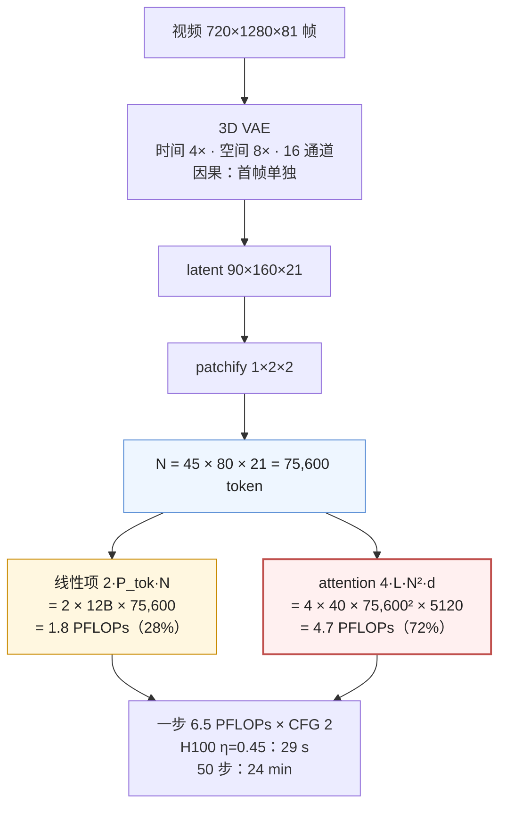

第一篇的账里有一个翻转：FLUX 一步 74 TFLOPs 里 attention 占 20%，Wan2.1-14B 生成 5 秒 720p 的一步 6.5 PFLOPs 里 attention 占 72%，HunyuanVideo 129 帧占 87%。同样是 DiT，图像模型是 GEMM 负载，视频模型是 attention 负载——因为 $$N$$ 从 4 千变成了 7 万到 12 万，$$4 L N^2 d$$ 压过了 $$2 P_\text{tok} N$$。前两篇的手段在视频上仍然有效但不够：编译与量化只改线性项那 28%，跨步缓存跳的是整步；要动 attention 这 72%，需要另一类冗余——**token 与 token 之间的冗余**：一个 token 对绝大多数其他 token 的注意力接近零，尤其是空间上远、时间上远的那些。

这一篇先把视频的账算细（token 从哪来、attention 占比怎样随帧数与分辨率变化、为什么 FlashAttention 之前视频 DiT 不可能推理），再看 2025 年收敛出来的几类稀疏 attention（Sparse VideoGen、Radial Attention、Sliding Tile Attention、VSA）各利用哪种结构、稀疏怎样落到 kernel 的 block 上才换回时间、以及 Amdahl 定律给它们的上限。

本篇要回答的核心问题是：

> **Wan2.1-14B 生成 5 秒 720p，一步的 attention 是多少 PFLOPs、占几成？[^q0] 把 attention 稀疏掉 80%，端到端加速多少？[^q1] 帧数加到 4 倍，账上哪一项变了 16 倍？[^q2]**

## 一、总览

### 1. 先说答案：视频的账由 $$N^2$$ 主导



Wan2.1-14B 720p，帧数从 17 到 129：

| 帧数 | latent 帧 | $$N$$ | 线性项 | attention | attention 占比 | 每步（$$\eta$$ 0.45，CFG ×2） | 50 步 | DiT 激活 |
|---|---|---|---|---|---|---|---|---|
| 17 | 5 | 18,000 | 0.43 P | 0.26 P | 38% | 3.1 s | 2.6 min | 3.4 GiB |
| 49 | 13 | 46,800 | 1.1 P | 1.8 P | 62% | 13.1 s | 10.9 min | 8.9 GiB |
| **81** | **21** | **75,600** | **1.8 P** | **4.7 P** | **72%** | **29 s** | **24 min** | **14.4 GiB** |
| 129 | 33 | 118,800 | 2.9 P | 11.6 P | 80% | 66 s | 54 min | 22.7 GiB |

帧数 17 → 129（latent 帧 5 → 33，6.6 倍）：线性项 6.6 倍、attention 44 倍、每步 21 倍。**视频时长是二次方的成本**。

稀疏化的收益受 Amdahl 定律约束：attention 占比 $$a$$、稀疏后 attention 时间变为 $$1/s$$，端到端加速 $$= 1 / \big((1-a) + a/s\big)$$：

| attention 占比 $$a$$ | attention 加速 $$s$$ | 端到端 |
|---|---|---|
| 72%（Wan 81 帧） | 2×（SageAttention / FA3 级） | 1.56× |
| 72% | 3.5×（80% 稀疏、kernel 效率 70%） | **2.06×** |
| 72% | 5×（80% 稀疏、理想） | 2.36× |
| 72% | ∞ | 3.57×（上限） |
| 87%（HunyuanVideo 129 帧） | 3.5× | 2.6× |
| 20%（FLUX） | 3.5× | 1.17× |

三个结论：

- **视频上 attention 后端与稀疏化是主项**，编译 / 量化 / 跨步缓存是次项——与图像相反。
- **稀疏必须落到 kernel 的 block 粒度**：任何"算出注意力分数再置零"的做法在 $$N = 10^5$$ 上都不成立（分数矩阵 425 GiB）；稀疏要在 FlashAttention 的分块循环里**跳过整块**，所以稀疏模式的设计与 token 的排布方式（layout）是同一个问题。
- **稠密 attention 在视频上有天然的稀疏结构**：注意力随时空距离衰减（Radial 的"能量衰减"）、head 分成关注同帧内的与关注同位置跨帧的（SVG 的 spatial / temporal head）——稀疏方法都是在把这些结构显式化。

### 2. 本文的章节安排

| 章 | 主题 | 内容 |
|---|---|---|
| 二 | 视频的 token 账 | 3D VAE、时空 patch、$$N$$ 的三个乘数；五个模型 |
| 三 | attention 占比的翻转 | $$4LN^2d$$ vs $$2P_\text{tok}N$$ 的交叉点；分辨率与帧数的扫描；$$d$$ 的影响 |
| 四 | 显存：FlashAttention 是前提 | 分数矩阵 425 GiB；激活随 $$N$$ 线性到 14 GiB；CFG batch；3D VAE 解码的 107 GiB |
| 五 | 全 3D attention 与它的替代 | 时空分解为什么被放弃；全 attention 的代价就是本文 |
| 六 | 稀疏 attention 的四条路 | SVG（head 分类）、SVG2（语义置换）、Radial（静态能量衰减掩码）、STA / VSA（tile 滑窗、可训练）；训练无关 vs 需微调 |
| 七 | 稀疏怎样落到 kernel | block-sparse FlashAttention；layout 变换；tile 对齐；掩码的存储 |
| 八 | 8-bit attention 与叠加表 | SageAttention 在视频上的收益；Wan 81 帧的叠加账；Amdahl |
| 九 | 实现对照与实践 | 四个实现里的后端；实践建议 |
| 十 | 本文小结 | |
| 十一 | 自测 | 5 道题 |

## 二、视频的 token 账

### 1. 3D VAE

图像 VAE 把 $$H \times W \times 3$$ 压到 $$\frac{H}{8} \times \frac{W}{8} \times 16$$；视频 3D VAE 在此之上把时间压 $$f_t = 4$$ 倍：$$F$$ 帧 → $$\frac{F - 1}{4} + 1$$ 个 latent 帧。"+1"来自**因果卷积**：第一帧单独编码（不看后面的帧），之后每 4 帧压成 1 个 latent 帧。因果性有两个系统上的好处：图像可以当作单帧视频（图像与视频联合训练）；解码可以按 chunk 顺序进行（第二篇的时间分块、第六篇的流式）。Wan、HunyuanVideo、CogVideoX 都自训了 3D VAE，压缩率 4 × 8 × 8 = 256 倍（每个 latent 值对应 256 个像素值，再乘 16 通道 / 3 通道 → 48 倍的数据压缩）。

### 2. 时空 patch

DiT 把 latent 按 $$(p_t, p, p) = (1, 2, 2)$$ 切 patch：时间上不合并（每个 latent 帧一层 token），空间上 $$2 \times 2$$。一个 token 对应原视频里 $$4 \text{ 帧} \times 16 \times 16$$ 像素的时空块。

$$
N = \underbrace{\frac{H}{16} \cdot \frac{W}{16}}_{\text{一帧的 token}} \cdot \underbrace{\left(\frac{F-1}{4} + 1\right)}_{\text{latent 帧}}
$$

720p 一帧 $$45 \times 80 = 3600$$ 个 token（一张 1024² 图是 4096），81 帧 21 个 latent 帧 → 75,600。**5 秒 720p 视频 = 18 张 1024² 图的 token 数**，但 attention 是 $$18^2 = 340$$ 倍。

### 3. 五个视频配置

| 模型 | 输出 | latent | $$N_\text{img}$$ | 文本 | $$N$$ | 每步 FLOPs（$$g$$ 后） |
|---|---|---|---|---|---|---|
| Wan2.1-1.3B | 480×832×81 | 60×104×21 | 32,760 | cross-attn | 32,760 | 小模型：$$P_\text{tok}$$ 1.2B、$$d$$ 1536、30 层 → 线性 0.08 P + attention 0.4 P |
| Wan2.1-14B | 480×832×81 | 60×104×21 | 32,760 | cross-attn | 32,760 | 0.79 P + 0.88 P = 1.7 P ×2 |
| **Wan2.1-14B** | **720×1280×81** | **90×160×21** | **75,600** | cross-attn | **75,600** | **1.8 P + 4.7 P = 6.5 P ×2** |
| HunyuanVideo-13B | 720×1280×129 | 90×160×33 | 118,800 | 256（联合） | 119,056 | 1.6 P + 10.5 P = 12.1 P ×1 |
| CogVideoX-5B | 480×720×49 | 60×90×13 | 17,550 | 226（联合） | 17,776 | 小 |

Wan 用 cross-attention 接文本（不进 $$N$$），HunyuanVideo 与 CogVideoX 用联合 attention（进 $$N$$，但 256 相对 118,800 可忽略）。

## 三、attention 占比的翻转

### 1. 交叉点

$$
\frac{\text{attention}}{\text{线性}} = \frac{4 L N^2 d}{2 P_\text{tok} N} = \frac{2 L N d}{P_\text{tok}} = \frac{2 N d}{P_\text{tok}/L}
$$

$$P_\text{tok}/L$$ 是一层的每 token 参数（$$\approx 12 d^2$$ 加 FFN 的差异），所以比值 $$\approx \frac{2 N d}{12 d^2} = \frac{N}{6 d}$$。**attention 与线性项相等的交叉点在 $$N \approx 6d$$**：$$d = 3072$$ 时 18K token，$$d = 5120$$（Wan）时 31K，$$d = 1536$$（SD3）时 9K。

| 模型 | $$d$$ | 交叉点 $$N \approx 6d$$ | 实际 $$N$$ | attention 占比 |
|---|---|---|---|---|
| SD3-medium | 1536 | 9K | 4.4K | 32% |
| FLUX.1-dev | 3072 | 18K | 4.6K | 20% |
| Wan2.1-14B 480p | 5120 | 31K | 33K | 53% |
| Wan2.1-14B 720p | 5120 | 31K | 76K | 72% |
| HunyuanVideo 720p | 3072 | 18K | 119K | 87% |

$$d$$ 越大，交叉点越远：Wan 的 $$d = 5120$$ 让它在同样的 $$N$$ 下 attention 占比低于 HunyuanVideo。这是模型设计对系统的一个直接影响——**宽而浅的 DiT 比窄而深的更"GEMM 化"**，对 attention 稀疏化的依赖更低。

### 2. 分辨率与帧数

分辨率翻倍：一帧 token 4 倍，$$N$$ 4 倍，attention 16 倍；帧数翻倍：$$N$$ 2 倍，attention 4 倍。1080p 81 帧的 Wan：$$N = 168,840$$，attention 占 85%，每步 2.1 分钟，50 步 103 分钟（账本 `--height 1080 --width 1920`）。

## 四、显存：FlashAttention 是前提

### 1. 分数矩阵

标准 attention 物化 $$QK^\top$$：每层每 head 一个 $$N \times N$$ 矩阵。Wan 40 个 head、$$N = 75,600$$：$$40 \times 75600^2 \times 2$$ 字节 = **425 GiB**——一层就超过五张 H100。视频 DiT 的推理**只能**用 FlashAttention 一族（分块计算、在线 softmax、不物化分数矩阵），这不是优化，是前提。

### 2. 激活

FlashAttention 下每层的激活随 $$N$$ 线性：10 份 $$[N, d]$$ 的 bf16 张量，Wan 81 帧 $$10 \times 75600 \times 5120 \times 2 = 7.2$$ GiB，CFG batch 2 → 14.4 GiB；加权重 26.6 GiB → 41 GiB，80 GB 卡放得下，但已经没有多少余量给 VAE。129 帧 22.7 GiB 激活 + 26.6 GiB 权重 = 49 GiB。这是视频模型多卡的第一个理由（第五篇）：不是快，是**放下**。

### 3. 3D VAE 解码

第一篇：Wan 720p 81 帧不分块 107 GiB、HunyuanVideo 129 帧 227 GiB。3D VAE 的解码器**必须**按时间 chunk（因果卷积允许）与空间 tile 分块，或用 Parallel VAE 切到多卡。它在时间账上也不可忽略（7–12 s），当 DiT 段被多卡与稀疏压到几十秒时，VAE 解码开始占 10–20%。

## 五、全 3D attention 与它的替代

2023–2024 年上半年的视频模型（Make-A-Video、AnimateDiff、早期 Open-Sora）用**时空分解**的 attention：空间 attention 在每帧内（$$F_\text{lat}$$ 个 $$N_\text{frame}^2$$）、时间 attention 在每个空间位置跨帧（$$N_\text{frame}$$ 个 $$F_\text{lat}^2$$）。FLOPs 从 $$N^2 = (N_\text{frame} F_\text{lat})^2$$ 降到 $$N_\text{frame}^2 F_\text{lat} + N_\text{frame} F_\text{lat}^2$$，Wan 720p 81 帧上是 $$3600^2 \times 21 + 3600 \times 21^2 = 2.7 \times 10^8 + 1.6 \times 10^6$$，比全 attention 的 $$5.7 \times 10^9$$ 小 21 倍。

2024 年下半年之后的主流（Sora、HunyuanVideo、Wan、CogVideoX）全部回到**全 3D attention**——每个 token 看所有帧的所有位置。原因是质量：分解 attention 的时间一致性差（物体跨帧变形、闪烁），大运动与相机运动学不好；全 attention 在 scaling 上更干净。代价就是本文的全部内容。稀疏 attention 可以看成两者之间的折中：保留全 attention 的结构（每个 token 原则上可以看任何位置），但只算注意力显著的那部分。

## 六、稀疏 attention 的四条路

### 1. 稠密 attention 里的结构

稀疏化的依据是稠密 attention 的分数矩阵实际上有结构。视频 DiT 里观察到的三种：

```text
（a）spatial head：分数集中在对角线附近的块        （b）temporal head：分数集中在等间距的斜线
     （同一帧内的 token 互相看）                         （跨帧同一空间位置的 token 互相看）
     帧1  帧2  帧3  帧4                                  帧1  帧2  帧3  帧4
   ┌────┬────┬────┬────┐                              ┌────┬────┬────┬────┐
帧1│████│    │    │    │                           帧1│▚   │▚   │▚   │▚   │
   ├────┼────┼────┼────┤                              ├────┼────┼────┼────┤
帧2│    │████│    │    │                           帧2│▚   │▚   │▚   │▚   │
   ├────┼────┼────┼────┤                              ├────┼────┼────┼────┤
帧3│    │    │████│    │                           帧3│▚   │▚   │▚   │▚   │
   ├────┼────┼────┼────┤                              ├────┼────┼────┼────┤
帧4│    │    │    │████│                           帧4│▚   │▚   │▚   │▚   │
   └────┴────┴────┴────┘                              └────┴────┴────┴────┘

（c）能量衰减：分数随时空距离衰减（Radial）
     帧1  帧2  帧3  帧4
   ┌────┬────┬────┬────┐
帧1│████│▓▓▓▓│▒▒▒▒│░░░░│    对角块全算，
   ├────┼────┼────┼────┤    离对角越远（时间距离越大）
帧2│▓▓▓▓│████│▓▓▓▓│▒▒▒▒│    算的比例减半、再减半……
   ├────┼────┼────┼────┤    每块内部：空间窗口也随距离缩小
帧3│▒▒▒▒│▓▓▓▓│████│▓▓▓▓│
   ├────┼────┼────┼────┤
帧4│░░░░│▒▒▒▒│▓▓▓▓│████│
   └────┴────┴────┴────┘
```

### 2. 四类方法

| 方法 | 年 | 稀疏模式 | 怎么决定 | 训练 | 报告的加速 |
|---|---|---|---|---|---|
| **Sparse VideoGen（SVG）** | 2025.02 | 每个 head 二选一：spatial 掩码（对角块）或 temporal 掩码（斜线） | **在线 profiling**：每步每 head 用少量 token 采样算一下两种掩码下的误差，选误差小的 | 无 | attention 2.3×，端到端 CogVideoX-1.5 2.28×、HunyuanVideo 2.33× |
| **SVG2** | 2025.05 | 语义相关 token 聚成簇、簇内稠密 | k-means 把 token 按 Q / K 的语义聚类，**置换**使同簇 token 连续，再算簇间的 top-k 块 | 无 | 比 SVG 更准（同稀疏度下 PSNR 更高），端到端约 2× |
| **Radial Attention** | 2025.06 | 静态掩码：对角块全算，时间距离每翻倍、计算密度减半（$$O(n \log n)$$）；块内空间窗口随距离收缩 | 掩码由 $$(F, H, W)$$ 决定，与内容无关 | 默认长度下无需训练（1.9×）；扩到 2–4× 长度需 LoRA 微调 | HunyuanVideo 默认长度 1.9×；4× 长度下比稠密快 3.7×、训练成本降 4.4× |
| **Sliding Tile Attention（STA）** | 2025.02 | 每个 token 只看时空局部窗口（3D 滑窗），窗口对齐到 tile | 静态，按 head 配窗口大小（有配置文件） | 无（可选微调） | HunyuanVideo attention 58–91% 稀疏、attention 1.4–3.5×，端到端约 1.6–2× |
| **VSA（Video Sparse Attention）** | 2025 | 粗粒度：把 token 分成 cube，先在 cube 级算一遍 attention 选 top-k cube，再在选中的 cube 里算细粒度 | **可训练**：粗粒度分支参与训练 | 需要（FastWan 用它训练） | attention 2.5×，训练与推理同用 |
| **SageAttention** | 2024 | 不稀疏：INT8 / FP8 的 Q·K | — | 无 | attention 2–3×（第二篇） |

四条路的分界：

- **内容相关 vs 静态**：SVG / SVG2 按内容在线决定（每步每 head 都要 profiling，有开销，但对不同视频自适应）；Radial / STA 是静态掩码（零开销、可预知、但对快速大运动可能漏掉远处的相关 token）。
- **训练无关 vs 需微调**：SVG / STA / Radial 默认长度可以直接套在预训练模型上；Radial 的长度外推与 VSA 需要训练——VSA 的思路是**训练时就用稀疏 attention**，让模型学会在稀疏结构下工作，推理时不再是近似。这是稀疏化的终局形态：FastVideo 的 FastWan 系列就是用 VSA 训练（再加步数蒸馏）的。
- **稀疏度**：都在 70–90%，因为再高质量掉；所以 attention 的加速上限约 3–5×，端到端按 Amdahl 打折到 2× 上下。

### 3. 长度外推

Radial 的另一个贡献是**用稀疏换长度**：稠密 attention 的模型训练在 5 秒上，直接生成 20 秒 $$N$$ 变 4 倍、attention 16 倍、且质量崩（位置编码外推）；Radial 的 $$O(n \log n)$$ 掩码加一个 LoRA 微调，在 4 倍长度上比稠密快 3.7 倍、训练成本比直接微调稠密低 4.4 倍。这与 LLM 长上下文的稀疏 attention（NSA、MoBA）是同一件事在另一个域的重现。

## 七、稀疏怎样落到 kernel

### 1. block 粒度

FlashAttention 把 $$Q$$ 与 $$K / V$$ 各切成 $$B_q \times B_k$$ 的块（FA2 128×64、FA3 128×128），外层循环 $$Q$$ 块、内层循环 $$K / V$$ 块，每对块做一次小 GEMM 与在线 softmax。**稀疏只有在这个粒度上"跳过整个 $$K / V$$ 块"才省时间**：一个块里哪怕只有一个 token 要算，整块都得算。所以稀疏模式必须让"要算的 token 对"在 $$N \times N$$ 矩阵上聚成对齐到 128×128 的块——稀疏度的定义也应当按块算。

### 2. layout 变换

视频 token 的自然顺序是 $$(t, h, w)$$ 展平——同一帧的 token 连续。spatial head 的对角块掩码在这个顺序下天然对齐；**temporal head 的斜线掩码不对齐**（同一空间位置的 token 相隔 $$N_\text{frame}$$ 个位置，散在 $$F_\text{lat}$$ 个块里）。SVG 的解法是**置换**：对 temporal head 把 token 按 $$(h, w, t)$$ 重排——同一位置跨帧的 token 变成连续——斜线掩码变成对角块，再调 block-sparse kernel；算完置换回来。置换是一次 $$[N, d]$$ 的 gather，成本小于它省下的 attention。SVG2 把这个思路推广成按语义聚类的置换（k-means 的簇作为块）。

STA 的 tile 是 3D 的：把 latent 切成 $$(t, h, w)$$ 各几个单位的 tile，tile 内 token 连续，3D 滑窗恰好是若干整 tile——它把"稀疏模式对齐到 kernel 块"做成了设计约束而不是事后适配。

### 3. 掩码的存储与开销

$$N = 75,600$$、块 128：$$591 \times 591 = 35$$ 万个块，一个 bool 掩码 350 KB——可忽略。静态掩码（Radial / STA）在请求开始时按形状生成一次；动态的（SVG）每步每 head 生成，开销在 profiling（用 $$N$$ 的 1–2% 采样算两种掩码的误差）而不是掩码本身。block-sparse FlashAttention 的 kernel 接受一个"每个 $$Q$$ 块要算哪些 $$K$$ 块"的索引表，跳过其余——FlexAttention（PyTorch 的可编程 attention）与各家的定制 kernel 都是这个接口。

## 八、8-bit attention 与叠加表

### 1. SageAttention 在视频上

第二篇讲过 SageAttention 的 INT8 Q·K 在图像上端到端只有 5–10%（attention 占 20%）；视频上 attention 占 72%，同样的 2–3× attention 加速变成端到端 1.5–1.8×。它与稀疏**正交、可叠加**（稀疏决定算哪些块，8-bit 决定每块怎么算）——SGLang 的 `sage_sla_attn` 就是两者的组合。

### 2. Wan2.1-14B 720p 81 帧 50 步的叠加账（单卡 H100，$$\eta$$ 0.45 基线）

| 配置 | 线性 28% | attention 72% | 每步 | 50 步 | 说明 |
|---|---|---|---|---|---|
| 基线（FA2 eager） | 8.2 s | 21 s | 29 s | 24 min | 第一篇 |
| + FA3 | 8.2 | 12.4（1.7×） | 20.6 | 17 min | 无损 |
| + compile + FP8（线性） | 5.5 | 12.4 | 17.9 | 15 min | 只作用于 28% |
| + SageAttention | 5.5 | 6.2（再 2×） | 11.7 | 9.8 min | 有损 I |
| + 稀疏 80%（STA / SVG，kernel 效率 70%） | 5.5 | 2.4（再 2.6×） | 7.9 | 6.6 min | 有损 II |
| + TeaCache 跳 40%（视频上可行） | ×0.6 | ×0.6 | 4.7 | 3.9 min | 有损 II，与稀疏正交 |
| + 8 卡 USP（第五篇，效率 80%） | | | 0.74 | **37 s** | 加 VAE 解码 7 s |

从 24 分钟到 40 秒：**单卡的四项拿到 6×，多卡拿到另一个 6×**。这张表也说明视频服务的形态：单卡不可能给出可接受的延迟，多卡是必需的（第五篇），少步蒸馏（第六篇：FastWan 3 步）再拿一个 10×。

## 九、实现对照与实践

### 1. 实现对照

| 机制 | diffusers v0.40 | SGLang Diffusion v0.5.19 | vLLM-Omni v0.28 | xDiT |
|---|---|---|---|---|
| 稠密后端 | `set_attention_backend("flash" / "_flash_3_hub" / "sage")` | `--attention-backend fa / torch_sdpa / sage_attn / sage_attn_3` | `attention/backends/` + `selector.py` | `core/distributed/attention_backend.py` |
| 稀疏后端 | FlexAttention（`flex`）可自定义掩码 | `sliding_tile_attn`（需 `--mask-strategy-file-path`）、`video_sparse_attn`（VSA）、`sparse_video_gen_2_attn`、`vmoba_attn`、`sla_attn` / `sage_sla_attn`；`runtime/layers/attention/STA_configuration.py` | 按模型适配 | `core/fast_attention/`（DiTFastAttn）、`sparge_attention/`、`vsa_attention.py`、`ssta.py` |
| 按请求切换 | — | `--attention-backend-override`（只允许稠密后端：fa / sdpa / sage） | — | — |
| 与 SP 的关系 | — | 稀疏后端只在服务级、与 ring 并行有兼容限制 | — | USP 下的 attention 由 `long_ctx_attention/` 包装 |
| 3D VAE 分块 | `vae.enable_tiling()`（时空版本，Wan / Hunyuan 的 VAE 类各自实现） | `--vae-config.*`；overlapping tiled decode | `--vae-use-tiling`、`vae_patch_parallel.py` | Parallel VAE |

注意 SGLang 把稀疏后端全部标为**服务级、有损、模型特定**：STA 需要每个模型每个分辨率的掩码配置文件；VSA 只对用 VSA 训练的模型（FastWan）是无损的。

### 2. 实践建议

一张 24 GB 以上的卡，Wan2.1-1.3B（480p，$$N = 32,760$$，attention 占 53%——小模型上占比更高，效果更明显）：用 `diffusion_ledger.py --model wan --height 480 --width 832 --sweep` 先看帧数对 attention 占比的影响；然后在 diffusers 里对同一 prompt / seed 依次换 `flash` → `_flash_3_hub`（Hopper）→ `sage`，记录每步时间与对基线视频的逐帧 PSNR 与 VBench 的时间一致性分项；有 SGLang 的话再试 `--attention-backend sliding_tile_attn`。该看的：attention 后端在视频上的端到端收益比在 FLUX 上大 5 倍以上；SageAttention 的 PSNR 在视频上常比图像上更低（时间闪烁）；STA 在快速运动的片段上比静态片段掉得多。

## 十、本文小结

| 项 | 规则 | 数字 |
|---|---|---|
| token 账 | $$N = \frac{H}{16}\frac{W}{16}\left(\frac{F-1}{4}+1\right)$$ | Wan 720p 81 帧 75,600；HunyuanVideo 129 帧 118,800 |
| 翻转点 | attention / 线性 $$\approx N / 6d$$，交叉在 $$N \approx 6d$$ | $$d$$ 3072 → 18K；5120 → 31K |
| 占比 | 图像 20–30%，视频 50–90% | Wan 81 帧 72%、129 帧 80%；HunyuanVideo 87% |
| 二次方 | 帧数 / 分辨率翻倍 → attention 4× / 16× | 17 → 129 帧每步 21× |
| 显存 | 分数矩阵不可物化；激活随 $$N$$ 线性；3D VAE 解码必须分块 | 425 GiB vs 14.4 GiB vs 107 GiB |
| 全 3D attention | 2024 年后主流，为时间一致性付 $$N^2$$ | 分解 attention 少 21× 但质量差 |
| 稀疏的依据 | spatial / temporal head；能量衰减；局部性 | 稀疏度 70–90% |
| 四条路 | SVG（在线 head 分类 + 置换）、SVG2（语义聚类）、Radial（静态 $$O(n\log n)$$，可扩长度）、STA / VSA（tile 滑窗，VSA 可训练） | attention 2–3.5×，端到端 1.6–2.3× |
| kernel | 稀疏必须对齐 FlashAttention 的 128 块；layout 置换让模式对齐 | 掩码 350 KB，可忽略 |
| Amdahl | 端到端 $$= 1/((1-a) + a/s)$$ | $$a$$ 0.72、$$s$$ 3.5 → 2.06×；上限 3.57× |
| 叠加 | FA3 + FP8 + Sage + 稀疏 + 缓存 ≈ 6×；多卡再 6× | Wan 81 帧 24 min → 40 s |

### 下一篇

单卡的六倍到头了，Wan 的一步仍要 5 秒、50 步 4 分钟，激活 14 GiB 挤在权重旁边。下一篇把请求切到多张卡上：为什么 LLM 的张量并行在这里不划算、序列并行（Ulysses / Ring / USP）与 CFG 并行怎样切、PipeFusion 怎样利用第三篇的时间冗余在 PCIe 与以太网上做流水线、Parallel VAE 怎样解决 107 GiB 的解码峰值。

## 十一、自测

1. Wan2.1-14B（$$d = 5120$$，40 层，$$P_\text{tok}$$ 12B）与 HunyuanVideo（$$d = 3072$$，60 层，$$P_\text{tok}$$ 6.8B）在同样的 $$N = 75,600$$ 下，attention 占比各约多少？为什么不同？

   <details markdown="1">
   <summary>答案</summary>
   Wan：attention $$4 \times 40 \times 75600^2 \times 5120 = 4.7$$ P，线性 $$2 \times 12\text{B} \times 75600 = 1.8$$ P → 72%。HunyuanVideo：attention $$4 \times 60 \times 75600^2 \times 3072 = 4.2$$ P，线性 $$2 \times 6.8\text{B} \times 75600 = 1.0$$ P → 80%。比值 $$\approx N / 6d$$：$$d$$ 越大，同样的 $$N$$ 下线性项相对越重——宽而浅的 DiT 更"GEMM 化"。详见[第三章](#三attention-占比的翻转)。
   </details>

2. 一个新的稀疏方法声称 attention 稀疏度 95%、误差可接受。在 Wan 720p 81 帧上，端到端最多快多少？如果 kernel 在 95% 稀疏下只达到 8× 的 attention 加速，端到端是多少？

   <details markdown="1">
   <summary>答案</summary>
   attention 占 72%。理想 20×：$$1/(0.28 + 0.72/20) = 3.16\times$$；上限（attention → 0）3.57×。kernel 8×：$$1/(0.28 + 0.09) = 2.7\times$$。剩下的 28% 线性项要靠编译 / FP8 / 多卡。详见[第八章](#八8-bit-attention-与叠加表)。
   </details>

3. 为什么 SVG 对 temporal head 要先做 token 置换再调 attention kernel？不置换直接用斜线掩码会怎样？

   <details markdown="1">
   <summary>答案</summary>
   FlashAttention 按 128×128 的块跳过计算；temporal 模式（同一空间位置跨帧）在 $$(t,h,w)$$ 顺序下是相隔 $$N_\text{frame}$$ 的斜线，每个 128 块里都有几个要算的 token，没有一个块能整块跳过，稀疏度落到 kernel 上是 0。置换成 $$(h,w,t)$$ 顺序后同位置跨帧的 token 连续，斜线变成对角块，才能跳块。详见[第七章](#七稀疏怎样落到-kernel)。
   </details>

4. 视频 DiT 为什么"没有 FlashAttention 就不能推理"，而不只是"慢"？给出 Wan 720p 81 帧的数字。

   <details markdown="1">
   <summary>答案</summary>
   标准 attention 物化每 head 的 $$N \times N$$ 分数矩阵：$$40 \text{ heads} \times 75600^2 \times 2$$ 字节 = 425 GiB，一层就超过五张 H100 的显存。FlashAttention 分块计算、在线 softmax，不物化分数矩阵，激活随 $$N$$ 线性（14.4 GiB）。详见[第四章](#四显存flashattention-是前提)。
   </details>

5. Radial Attention 与 STA 都是静态掩码、零 profiling 开销，SVG 是在线决定。对一个生成服务，静态掩码有什么额外的好处？什么场景下它会比 SVG 差？

   <details markdown="1">
   <summary>答案</summary>
   静态掩码按 $$(F, H, W)$$ 在请求开始时生成一次，每步的计算量完全可预知（服务可精确估时长、可与 CUDA graph / 编译配合，不需要每步的动态决策）；也没有各卡决策不一致的问题。差的场景：快速大范围运动或相机大幅移动的片段——相关 token 在时空上相距远，被静态的局部 / 衰减窗口截掉，而 SVG 的在线 profiling 会为这些 head 选 temporal 模式。详见[第六章](#六稀疏-attention-的四条路)。
   </details>

## 下一篇

[多卡并行：序列并行、CFG 并行与 PipeFusion——为什么不是张量并行](/multi-gpu-diffusion-parallelism-usp-cfg-pipefusion.html)

[^q0]: $$N = 45 \times 80 \times 21 = 75{,}600$$；attention $$4 L N^2 d = 4 \times 40 \times 75600^2 \times 5120 = 4.7$$ PFLOPs，线性项 $$2 \times 12\text{B} \times 75600 = 1.8$$ P，attention 占 72%；一步（CFG ×2）13 PFLOPs，H100 $$\eta$$ 0.45 下 29 s，50 步 24 分钟。详见[第一章](#一总览)、[第三章](#三attention-占比的翻转)。

[^q1]: Amdahl：$$1 / \big((1-a) + a/s\big)$$，$$a = 0.72$$。稀疏 80% 理想下 attention 5×：2.36×；kernel 效率 70%（3.5×）：2.06×；attention 时间为零的上限 3.57×。剩余的 28% 线性项要靠 FA3 / 编译 / FP8 / 多卡。详见[第八章](#八8-bit-attention-与叠加表)。

[^q2]: 帧数 17 → 129 时 latent 帧 5 → 33（6.6 倍，不是 4 倍——因果 VAE 的 "+1"），$$N$$ 从 18,000 到 118,800；线性项 6.6×、attention $$6.6^2 = 44\times$$、每步 21×。严格 4 倍的 $$N$$（如 33 → 129 帧的 latent 帧 9 → 33）下 attention 恰好 16×。同样的规律对分辨率也成立：边长翻倍 → $$N$$ 4× → attention 16×。详见[第二章](#二视频的-token-账)、[第三章](#三attention-占比的翻转)。
