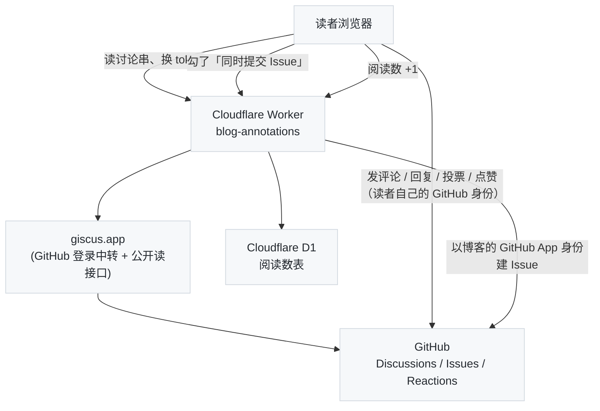

写给我自己的备忘：这个博客怎么托管、怎么发布、写文章有哪些约定、读者能用哪些功能、出了问题去哪儿看。主题、配置、写作、运维都在这一篇里，不用再翻别的地方。代码层面的细节以仓库里的 `AGENTS.md` 为准；给读者看的那份是[《致读者的一封信》](/a-letter-to-readers.html)——本站只有这两篇"说明书"。

---

## 一、快速开始

### 1. 环境

需要 Ruby（Homebrew 的 `ruby`，`~/.zshrc` 已把 `/opt/homebrew/opt/ruby/bin` 和 gems 的 bin 加进 PATH）和 Bundler；Node 只在编译样式和跑检查脚本时用到。

```bash
bundle install                    # 装 Gemfile 里的 Jekyll 4.4 及插件
npm install                       # 只为 node_modules/.bin/lessc（改样式时才需要）
pip install fonttools brotli      # 只为 tools/fa-subset.py（极少需要）
brew install webp lychee          # 图片转 WebP、本地跑链接检查（可选）
```

### 2. 日常命令

```bash
jekyll serve --future                       # http://localhost:4000，含未来日期的文章
jekyll serve --future --drafts              # 再加上 _drafts/
python3 tools/new-post.py slug "标题" --tags AI  # 新建文章骨架
jekyll build                                # 输出到 _site/（和线上一致：不含未来文章）
node tools/check-render.cjs <slug>          # 浏览器渲染检查，需要先起 Chrome，见第五节
```

`jekyll build` 时那条 `Conflict: … the-productive-programmer-on-windows.html` 警告是历史遗留，无害。

### 3. 目录结构

| 路径 | 内容 |
| :--- | :--- |
| `_posts/` | 文章，`YYYY-MM-DD-slug.md` |
| `_drafts/` | 草稿，只在 `--drafts` 时预览，永不发布 |
| `slides/` | reveal.js 幻灯片，`/slides/` 是索引 |
| `_layouts/` `_includes/` | 模板（Liquid） |
| `_data/series.yml` | 系列文章定义 |
| `img/in-post/` | 文章图片（WebP） |
| `less/` → `css/` | 样式源与产物（见第七节的注意事项） |
| `js/` | 前端脚本：目录、脚注 / Tips、评论与划线、搜索、图放大、代码复制 |
| `tools/` | 维护脚本、检查脚本、评论系统的 Cloudflare Worker |
| `.github/workflows/` | `deploy`（发布）、`check`（质检）、`links`（每周外链） |

---

## 二、托管：GitHub Pages 是什么、能做什么

### 1. 基本事实

- 仓库 `arganzheng/arganzheng.github.com`，`master` 分支就是站点源码；根目录 `CNAME` 文件写着 `arganzheng.life`，GitHub 据此接受这个域名。DNS 是四条 A 记录指到 GitHub Pages 的 IP（`185.199.108-111.153`）。
- **强制 HTTPS 已开**（仓库 Settings → Pages → Enforce HTTPS）：`http://` 会 301 到 `https://`。证书由 GitHub 自动签发和续期，不用管。
- GitHub Pages 是**纯静态托管**：没有服务端代码、没有数据库、不能自定义 HTTP 头。所有"动态"的东西（评论、点赞、阅读数）都靠浏览器直接调外部服务实现，见第六节。
- 软限制：仓库 1 GB、站点 1 GB、每月 100 GB 流量、每小时 10 次构建。个人博客离这些很远；图片已经全部转成 WebP（`img/` 从 24 MB 降到 10 MB）。
- **缓存**：GitHub Pages 对所有文件（包括 HTML）返回 `Cache-Control: max-age=600`，无法修改。所以一次改动从 push 到所有读者看到，最坏是 **3 分钟构建 + 10 分钟浏览器缓存**。按 F5 普通刷新会立即重新校验 HTML；CSS/JS 的 URL 带构建时间戳（`?v=…`），HTML 一新它们必然跟着新。这个 13 分钟我认为可以接受，所以没有再在前面加 Cloudflare 之类的 CDN 来改缓存头。

### 2. 构建与发布：GitHub Actions 而不是老式 Pages 构建

Pages 有两种模式。老式（legacy）是 GitHub 自己用 Jekyll 3.10 和白名单插件构建；本站已切到 **Actions 模式**（Settings → Pages → Source = GitHub Actions），由 `.github/workflows/deploy.yml` 用 `Gemfile` 里锁定的 Jekyll 4.4 构建后发布，好处是本地、CI、线上是同一个 Jekyll，也不再受插件白名单限制。

触发时机：

| 触发 | 说明 |
| :--- | :--- |
| push 到 `master` | 约 3 分钟后上线 |
| 每天北京时间 00:05 | 定时构建，让**未来日期的文章按日期自动上线**（构建不带 `--future`） |
| 手动 | Actions → deploy → Run workflow |

所以**定时发布**的用法就是：文件名和 front matter 用未来的日期，push 上去，到那天凌晨自动出现。本地预览要看到它们需要 `jekyll serve --future`。

`_config.yml` 里显式写了 `timezone: Asia/Shanghai`，"今天"按北京时间算。

### 3. 常用检查入口

- Actions 页面：`deploy`（发布）、`check`（每次 push 的质量检查）、`external links`（每周一外链检查）。
- `gh run list --limit 5` 命令行看最近几次结果；`gh run view <id> --log-failed` 看失败原因。
- Pages 设置状态：`gh api repos/arganzheng/arganzheng.github.com/pages`。
- **作者仪表盘** [/admin/stats.html](/admin/stats.html)（不在导航、不进 sitemap、noindex）：阅读趋势（`/views/daily`，7 / 30 / 90 天柱状图 + 这段时间读得最多）、文章榜（`/stats/top`：阅读 · 点赞 · 点赞率 · 分享 · 评论，点表头排序，默认 TOP 10 可展开）、**修订简报**（见下）、读者划出来的句子（`/reactions/top`：存疑最多 / 点赞最多 / 分享最多，带章节和存疑原因，点句子直达原文）、最近评论（用评论框同一个 GitHub 登录读 Discussions）、待处理的勘误 Issue 与死链报告。数据全是公开的，只是集中在一页。
- **修订简报**：仪表盘里选一篇文章（或点文章榜每行的「简报」，URL 形如 `/admin/stats.html#brief=/slug.html`——只有这一个入口），把这篇文章的全部反馈汇成一份 Markdown：D1 里的存疑 + 原因 + 章节（`GET /feedback?path=`）、Discussion 的划线评论 / 回复（走 Worker 的匿名 `/discussions` 中转）、`划线评论` 标签的 Issue 及其 open/closed 状态（REST），再抓一次文章页判断每条引文还能不能定位。段落按 `2×存疑 + 评论 + ▲ + 3×建议修改` 排序，已修正的和定位不上的分开列，末尾附一段给 AI 的修订指令。点「复制 Markdown」贴给 AI 即可；AI 改完提交时写 `Fixes #N`，文章上的标记自动变绿。
- **待修订队列（自动）**：`.github/workflows/feedback-queue.yml` 每周一早上（或手动，参数 `threshold` / `only` / `dry_run`）跑 `tools/feedback-queue.cjs`，用和仪表盘**同一份**聚合代码（`js/feedback-brief.js`，浏览器和 Node 都能加载）给全站每篇文章算一遍简报：分数 = 待处理段落分 + 未处理的普通评论 + 章节「没看懂」数，达到阈值（默认 3）的文章开一个 `待修订` 标签的 Issue，正文就是简报；下周反馈有变化就更新正文，全部处理完（分数掉到阈值以下）就自动关闭。这样 Devin / Copilot 一类工具可以直接从 Issue 接活，我不用记得去看仪表盘。仪表盘「待处理」区第一栏列的就是这些 Issue（带「简报」直达链接）。本地试跑：`DRY_RUN=1 API=http://localhost:8788 GITHUB_TOKEN=$(gh auth token) node tools/feedback-queue.cjs`（先 `npm i --no-save linkedom@0.18.13`）。

---

## 三、站点配置（`_config.yml`）

站点级的开关都在这个文件里，现状如下：

```yaml
title: Arganzheng's Blog                 # 导航栏和首页显示
SEOTitle: 阿甘的博客 | Arganzheng's Blog   # <title> 用这个，可以和 title 不同
description: "…"                          # 首页描述、分享卡片兜底
url: "https://arganzheng.life"            # 绝对链接、canonical、feed 都用它，必须 https
timezone: Asia/Shanghai
permalink: /:title.html
paginate: 10                              # 首页每页文章数

# SNS：填了就出现在页脚
github_username / zhihu_username / linkedin_username / wechat_qrcode   # weibo / twitter / facebook 注释掉了

# 侧栏（首页、列表页右侧；窄屏时挪到底部）
sidebar: true
sidebar-about-description: "…"            # 头像下一句话
sidebar-avatar: /img/avatar-argan-msup.jpg
featured-tags: true                       # HOT TAGS 模块
featured-condition-size: 2                # 文章数 > 2 的标签才上榜
related_posts_threshold: 3                # 文末「YOU MIGHT ALSO LIKE」条数
recommends:                               # 侧栏 RECOMMEND：title / href / desc（一句推荐理由），外链新窗口打开
  - { title: …, href: …, desc: … }
# friends: [...]                          # 友链模块，模板支持但没配

# 统计：GA、百度统计（_includes/analytics.html）；Cloudflare Web Analytics 直接写在 head.html
ga_track_id: 'UA-…'
# ba_track_id:

# 评论与划线（第六节）
giscus:                                   # 仓库 / 分类的 ID，只用来定位讨论串和 GitHub 登录
annotations:
  api: https://blog-annotations.arganzheng.workers.dev   # 留空 = 关闭整个评论功能
  issues: true                            # 编辑器里显示「同时提交 Issue」

service-worker: false                     # 见第七节，不要开
plugins: [jekyll-paginate, jekyll-sitemap, jekyll-redirect-from]
```

早年用过 Disqus 评论和 JiaThis 分享按钮，都已移除：Disqus 在国内被墙且往正文里注入广告链接；JiaThis 早已停服。评论现在是 GitHub Discussions，见第六节。

---

## 四、写文章

### 1. 三种文章布局，以及它们和幻灯片的区别

| `layout:` | 头部 | 用途 | 现存文章 |
| :--- | :--- | :--- | :--- |
| `post` | 无大图，白底标题 + meta 行 | **默认**，所有技术文章 | 370+ |
| `header-post` | 全宽背景图（或 CSS 渐变）+ 白字标题，导航栏反白 | 随笔、生活类，想要一张封面时 | 3 篇（2017 年的随笔） |
| `keynote` | 头部是一个 **iframe，嵌一份在线幻灯片**，正文在下面 | 一次分享的「幻灯片 + 文字稿 + 评论」合在一页 | 1 篇（演示） |

`keynote` 和 `slides/` 目录下的幻灯片是两回事：**`slides` 布局是幻灯片本身**（`slides/xxx.md` 用 Markdown 写、reveal.js 渲染成全屏演示，URL `/slides/xxx.html`，见下文第 10 小节）；**`keynote` 是一篇文章**，只是把某个幻灯片 URL（自己的 `/slides/xxx.html` 或外部的 Slides.com / Speaker Deck）嵌在头部，下面可以写讲稿、参考资料，也有评论区和阅读数。典型用法：先在 `slides/` 写好幻灯片，再建一篇 `keynote` 文章 `iframe: /slides/xxx.html` 作为它的"落地页"——[《keynote 布局演示》](/keynote-layout-demo.html)就是一篇活的例子。注意 keynote 页面的标题、标签只出现在 `<title>` 和列表里，页面头部就是幻灯片本身。

### 2. front matter 全部字段

文章放在 `_posts/YYYY-MM-DD-slug.md`，URL 是 `/slug.html`（`permalink: /:title.html`；改文件名 = 改 URL = 评论串和外部链接都会断，非改不可时加 `redirect_from`）。

```yaml
---
layout: post                  # post | header-post | keynote
title: "标题"                  # 系列文章约定「系列名（NN）：副标题」
subtitle: "副标题"             # 可选；也是分享卡片 / 搜索引擎描述的兜底
date: 2026-09-09 14:30:00     # 可选；文件名已含日期，同一天多篇想控制顺序时再写时间
tags: [AI, AI-Infra]
catalog: true                 # 右侧浮动目录；正文里写 [TOC] 也会自动开启
series: deep-dive-into-vllm   # 系列文章才写，key 见 _data/series.yml
updated: 2026-09-20           # 大改后写上：头部显示「更新于」，JSON-LD dateModified
description: "一句话摘要"       # 分享卡片 / 搜索引擎；不写用 subtitle，再不写用正文开头
author: arganzheng            # 可选，默认 arganzheng
published: false              # Jekyll 内建：不构建这篇（比放草稿目录更方便临时下线）
pinned: true                  # 置顶：首页第一页排在最前，带「置顶」徽章；可多篇，按日期排
category: life                # 分类：不写 = 技术文章（首页 Tech）；life = 随笔/生活（不进首页，进导航 Life 的 /life/ 卡片页）
redirect_from: /old-slug.html # 旧地址 301 过来（jekyll-redirect-from），可写数组

# 仅 header-post：
header-img: img/post-bg-2015.jpg                          # 背景图；也是分享卡片的图
header-bg-css: "linear-gradient(to right, #24b94a, #38ef7d)"  # 用 CSS 渐变代替图
header-mask: 0.3              # 图上压一层黑色遮罩的透明度，字看不清时用
header-img-credit: "Unsplash" # 右下角「Image by …」
header-img-credit-href: "https://unsplash.com/photos/xxx"
# 选图：标题和 meta 是白字，所以要深色或加 header-mask；宽度 ≥ 1920，体积控制在 300 KB 内（首屏就加载）

# 仅 keynote：
iframe: "/slides/reveal-demo.html"   # 嵌入的幻灯片地址
navcolor: invert              # 幻灯片是浅色背景时，把导航栏文字变深色
---
```

不需要的字段：`mathjax: true`（公式自动检测、KaTeX 渲染，没有开关）、`header-style: text`（`post` 布局就是纯文字头部）、`nav-style`（这里叫 `navcolor`，只有 keynote 用）。同类 Jekyll 主题常见的双语切换（`multilingual` / `lang`）这里没有。

文章头部那一行「Posted by … | 日期 · 更新于 | 约 N 分钟 · X.Xk 字 | 阅读 · 点赞 · 评论 · 分享 四组文字统计」是自动的：阅读时长按去掉代码块后的字数 / 450 字每分钟估算。

### 3. 分类：Tech / Life

只有两类，用 `category:` 区分，**不写就是技术文章**（绝大多数），走首页（导航 **Tech**）的分页流。`life` 是随笔、瑜伽、生活：不进首页，导航 **Life** 进 `/life/` 卡片页（用各篇的 `header-img` 做封面，所以生活类建议用 `header-post` 布局配一张图），归档页标 `[Life]`。首页的分页由 `_plugins/home_flow.rb` 把 life 和置顶文章标成 `hidden`（jekyll-paginate 只对这个字段生效，归档 / 标签 / RSS / 搜索不受影响），所以每页都是满的、不会有空洞。备忘录、读者信、布局演示这类关于博客本身的文章就是普通技术文，不单独分类。RSS 只有一份，每条 `<category>` 里带 `tech` 或 `life`。

### 4. 系列文章

系列信息**不写在正文里**，写在 front matter 的 `series:` 字段，取值是 `_data/series.yml` 里的 key。同系列文章按日期排序，页面自动生成三样东西：文首的「本文是《…》系列的第 N 篇（共 X 篇）。上一篇：…；下一篇：…」引用块、文末的系列目录、以及把 Previous / Next 换成系列内的上一篇 / 下一篇。

新开一个系列：先在 `_data/series.yml` 加一条（`name`、`overview` 总览页 URL），总览文章本身**不写** `series:`。标题约定是「系列名（NN）：副标题」，导航里只显示「）：」后面的部分。

非系列文章的文末 Previous / Next 仍是按时间的相邻文章，另有按 tag 推荐的「YOU MIGHT ALSO LIKE」。

### 5. 新建、草稿与本地预览

```bash
python3 tools/new-post.py my-slug "标题" --tags AI,AI-Infra --series deep-dive-into-vllm   # 生成 _posts/今天-my-slug.md
python3 tools/new-post.py my-slug "标题" --draft                                          # 生成 _drafts/my-slug.md
jekyll serve --future            # http://localhost:4000，含未来日期的文章
jekyll serve --future --drafts   # 再加上 _drafts/ 里的草稿
```

草稿放 `_drafts/`（文件名不用带日期），只有加 `--drafts` 时才会出现在本地预览里，线上永远不发布；写完移到 `_posts/` 并加上日期即可。`new-post.py` 会校验 `--series` 的 key 是否存在。

### 6. Markdown 能力速查

kramdown（GFM 模式），加上博客自己的扩展：

| 你写的 | 效果 |
| :--- | :--- |
| ```` ```python ```` 等围栏代码 | rouge 高亮；右上角自动有**复制**按钮；过宽的代码块横向滚动 |
| Markdown / HTML 表格 | GitHub 风格；右上角复制菜单支持 TSV / Markdown / HTML，也可从表格标题进入反馈 |
| ```` ```mermaid ```` | Mermaid 图，浏览器端渲染；点击图放大 / 缩放 / 拖动 |
| `$$ ... $$` | KaTeX 公式（行内和块级都用 `$$`），有公式的页面才加载 KaTeX |
| `` | 自动 lazy 加载；≥ 200px 的图点击放大 |
| `概念[^名字]` + `[^名字]: 解释` | 浮窗脚注：悬停编号就地弹出卡片，见下一小节 |
| `[概念](# "tip: 一句话解释")` | 行内 Tips：虚线下划线 + `?` 角标，见下一小节 |
| 站外链接 | 自动加虚线下划线和 ↗ 图标、新窗口打开 |
| `[TOC]` | 就地生成目录，同时开启右侧浮动目录 |
| 表格 | GitHub 风格，手机上横向滚动 |
| `<i class="fa fa-xxx"></i>` | Font Awesome 4.7 图标（约 150 个常用的已内置，见第七节） |

### 7. 浮窗脚注与行内 Tips（作者给读者的解释）

这是本站最常用的两个"不打断阅读的解释"手段。原则：**解释长（多段、代码、表格、列表）用脚注，一两句话用行内 Tips**。

**浮窗脚注**就是标准 Markdown 脚注，只是读者悬停编号时就地弹出卡片、点击才平滑跳到文末（并避开吸顶导航栏）；脚注内容支持完整 Markdown。看一段实际效果——悬停下面的编号：

> 在现代分布式深度学习架构中，集群通信与算子实现至关重要。业界广泛采用 NCCL 集合通信库[^nccl]，并借助 Ring AllReduce 算法[^ring-allreduce]实现跨卡梯度同步。在服务层，vLLM 引擎[^vllm]引入了 PagedAttention 显存优化。底层算子常通过 PyTorch C++ 扩展骨架[^kernel-code]开发；混合并行切分时要评估各并行策略的显存与通信模式[^parallelism-table]。

对应源码（脚注定义放文末任意位置，缩进四格可以放代码块和表格）：

```markdown
业界广泛采用 NCCL 集合通信库[^nccl]，……开发高性能融合算子[^kernel-code]。

[^nccl]: **NCCL**：英伟达的集合通信库……详见 [NCCL 官方仓库](https://github.com/NVIDIA/nccl)。

[^kernel-code]: **PyTorch C++ 算子实现骨架**：
    ~~~cpp
    #include <torch/extension.h>
    torch::Tensor custom_add(torch::Tensor a, torch::Tensor b) { return a + b; }
    ~~~
```

**行内 Tips** 有四种写法，效果一样（虚线下划线 + `?` 角标，悬停或轻触弹出；支持加粗、代码、链接、公式，不支持代码块和列表）：

| 写法 | 示例 | 效果 |
| :--- | :--- | :--- |
| Markdown 链接 title（**推荐**） | `[GIL](# "tip: 全局解释器锁……")` | 在 Python 中，[GIL](# "tip: Global Interpreter Lock（全局解释器锁）：确保同一时刻只有一个线程执行 Python 字节码，是 CPU 密集型任务并发的主要约束。") 是多线程计算的主要制约 |
| kramdown IAL | `[MVCC](#){: .tip data-tip="……"}` | [MVCC](#){: .tip data-tip="Multi-Version Concurrency Control：保留数据项的历史版本，读不阻塞写、写不阻塞读。"} 是高并发隔离的核心机制 |
| Liquid include（可带「了解更多 ↗」外链） | `` |  是消除传输瓶颈的基石 |
| 原生 HTML | `<span class="inline-tip" data-tip="……">词</span>` | <span class="inline-tip" data-tip="Overlap：用多 CUDA Stream 让 GEMM 计算与 AllReduce 通信同时进行，隐藏通信时延。">计算与通信重叠</span> 能显著提升 MFU |
| 公式也行 | `[AllGather 通信量](# "tip: 每卡发送 $\frac{N-1}{N} S$")` | [AllGather 通信量](# "tip: 在 $N$ 个 GPU 间同步大小为 $S$ 的张量时，Ring AllGather 每卡发送 $\frac{N-1}{N} S$。") 可精确量化 |

交互细节（不用记，知道有就行）：悬停 100 ms 后才弹出防误触；鼠标移入卡片可以复制文字、点里面的链接；空间不够自动翻到下方；`Esc`、点空白处、鼠标移开都能关；手机上轻触弹出、再触关闭。

**外链**不需要任何标记：[PyTorch 官网](https://pytorch.org/) 这样的站外链接自动带 ↗ 并新窗口打开，[归档](/archive/) 这样的站内链接保持原样。

**问答脚注**（`[^q0]`、`[^q1]`……）是脚注的一个变种，专门给系列文章「文首提问、文末作答」用：文首每个问题（粗体核心问题按「？」拆开、列表里的「为什么……？」各一条）挂一个 `q` 开头的脚注，文末逐条作答并链到对应章。与浮窗脚注的区别只在前缀，规则要记牢：

- **脚注名以 `q` 开头（`[^q0]`… → `id="fn:q0"`）的一律跳过浮窗**：`js/inline-popups.js` 的 `processFootnotes()` 对 `/^fn:q\d+$/` 的编号不加 `has-popup-footnote`、不绑悬停事件，悬停无卡片；点编号只平滑跳到文末的那条脚注（沿用已有的 `scrollToTargetWithOffset`，避开吸顶导航栏），文末的 ↩ 照常跳回。答案是读完再看的，不该悬停就泄底。
- 文末脚注列表加了分隔线与标签：默认「脚注」，页面里只要有 `fn:q…` 就改标「文首问题的答案」（`.footnotes:has(li[id^="fn:q"])::before`，样式在 `less/extras.less` 末尾，手工追加到两份 CSS）。
- **解释性脚注不受影响**：名字不要以 `q` 开头（`[^nccl]`、`[^ring]` 这样即可），继续浮窗。所以一篇文章里两种脚注可以并存，只靠名字区分。
- 写法：答案一到几句、可核对、含数字，末尾「详见[第 N 章](#锚点)」链到章标题（锚点是 kramdown 生成的 `<h2 id>`，从 `_site` 里抄）；定义放「下一篇」之后即可，kramdown 渲染时本来就把脚注放在正文末尾。

### 8. 图片

新图先放 `img/in-post/`，大于 20 KB 的 png/jpg 跑一次 `python3 tools/webp-images.py --apply` 会转成 WebP 并自动改写引用（先不带 `--apply` 是预览）。手绘 SVG 直接放，不用转。文章里用绝对路径 `/img/in-post/xxx.webp`。

**alt 必填，而且要像图题**（``）。`js/figures.js` 会把独占一段的图片包成 `<figure>`，下方居中显示「图 N + alt」作图题，右上角悬停出现一个「评论」小方块——点它就选中图题、弹出划线工具条，所以**图题就是这张图的划线锚点**：读者对图的赞 / 存疑 / 评论、简报里的引文，都是这行 alt。没有 alt 只剩「图 N」，中间插一张图编号就变、旧评论会「未定位」。Mermaid 图同样有图题：源码第一行写 `%% 图：xxx`（或 Mermaid front matter 的 `title:`），否则只显示「图 N」；它的方块在复制按钮左边。

**表格标题与工具**：正文表格会自动获得复制和反馈按钮。需要稳定反馈锚点时，在表格前紧邻写 `表：标题`、`表1：标题`、`表: 标题` 或 `表1: 标题`（`表`与编号之间可以有空格）；也可以在 HTML 表格里使用 `<caption>标题</caption>`。显式编号会原样保留。反馈按钮只在用户提供标题时显示标题；没有标题时直接选中表头，没有表头才降级为整表。复制菜单提供 TSV（表格软件）、Markdown 和 HTML 三种格式。

### 9. Liquid 陷阱

`{%` 和 `{{` 出现在代码里（PTX、Go template、Jinja）必须包在 <code>&#123;% raw %&#125;…&#123;% endraw %&#125;</code> 里，否则 Liquid 会把它当模板语法，构建直接失败——写这一段本身就让构建失败了一次。`raw` 不能嵌套。

### 10. 幻灯片

`slides/xxx.md` 用 `layout: slides` 是 reveal.js 演示文稿，URL `/slides/xxx.html`，`/slides/` 是索引页。`---` 分页（前面留空行），`<!-- v -->` 纵向子页，`?print-pdf` 导出 PDF。日期与文章一样从文件名的 `YYYY-MM-DD-` 前缀取（front matter 写了 `date:` 则以它为准），ARCHIVE 与 `/slides/` 索引按它排；`slides/2026-08-01-reveal-demo.md` 是全部语法的活演示；想给它配文字稿就建一篇 `layout: keynote` 的文章嵌进去（见本节第 1 小节）。

---

## 五、发布前后：质量检查

每次 push 触发 `check` workflow，做三件事，任何一件失败都会在 Actions 里标红并发邮件：

1. **构建**：`jekyll build --strict_front_matter`——front matter 写错 YAML 直接失败。
2. **全站链接检查**（lychee 离线模式）：每个站内链接、图片、`#锚点` 必须存在。写错 slug、图片路径、引用了不存在的标题锚点，这里会抓到。
3. **渲染检查**（headless Chrome 跑 `tools/check-render.cjs`）：本次改动的文章逐篇打开，Mermaid 有没有语法错、图片有没有加载失败、代码块有没有溢出。只改了模板 / CSS / JS 时改为抽查最新 15 篇。站外热链的图挂了只告警不判失败。

本地想提前跑：

```bash
jekyll serve --future &
~/.claude/skills/browser/scripts/start.cjs          # 起一个带调试端口的 Chrome
node tools/check-render.cjs <slug> [<slug> ...]
lychee --offline --root-dir $PWD/_site --include-fragments --exclude '/tags/?#' '_site/**/*.html'
```

**外链**每周一自动检查一次（`external links` workflow），失效的汇总开成一个带 `dead-links` 标签的 Issue，不阻塞任何发布。老文章外链腐烂是常态，看到 Issue 有空再修。

---

## 六、读者侧功能

这些都在文章页上，读者不需要任何配置；作者需要知道的是它们的数据在哪儿。

### 1. 评论、划线评论、投票、点赞、阅读数



- **数据都在 GitHub**：每篇文章对应仓库 Discussions 的 `Comments` 分类里一条以 URL 为标题的讨论串。评论、回复、划线评论都是这个讨论串里的普通评论，去 GitHub 上也能看、能删、能锁。
- **划线评论**：读者选中正文任意文字 → 点浮出的「评论」→ 评论挂在那句话上，正文那句话下面出现琥珀色虚线（多个讨论串时为实线）和计数标记。它在 GitHub 上是一条开头带引用和 `§ 原文位置` 链接的评论。我改了原文措辞，模糊匹配仍能对上；改动太大就列为「未能定位」，评论不会丢。
- **投票 / 点赞**：评论的 ▲ 分数 ▼ 是 GitHub 的 👍/👎 reaction，一人一票由 GitHub 保证；文章的「点赞」是匿名的——Worker 的 D1 里一行计数，不用登录，一个浏览器一票（localStorage 记着），信任级别和阅读数一样。读者还可以对**一段话**点「点赞」或「存疑」（选中文字后工具条上的前两个按钮），同样匿名：Worker 的 `passage_reactions(path, hash, quote, up, doubt, share)` 一行一段，`hash` 就是 `#annot-<hash>` 里那个 FNV-1a，`quote` 存原文，所以没有评论的段落也能画出下划线（存疑为红色点线）；段尾标记合成 💬 n · 👍 n · ❓ n，讨论面板顶部有同样的两个按钮和「说说哪里不对 →」。评论区顶部的「最受关注的段落」按 `点赞 + 2×存疑 + 2×评论投票 + 评论数` 排名。
- **章节级「点赞 / 没看懂」**：每个标题（h2 到 h6，章和小节都有）末尾两个小按钮（`js/annotations.js` 的 `renderChapterBars`），匿名、一个浏览器一票，不用选文字——手机读者主要靠这个。存的还是 `passage_reactions`，只是 `quote` 写成 `§ 章节标题`、`section` 写章节标题，`up` = 点赞、`doubt` = 没看懂；仪表盘「读者划出来的句子」里这类行带「章节」标签，修订简报开头多一张「章节热度」表。它回答段落级回答不了的问题：哪一章整体该压缩、该扩写。
- **存疑的原因与章节**：点了「存疑」的读者在面板里能再点一个原因（有错误 / 没看懂 / 版本过时 / 缺例子/图 / 与前文矛盾），存进 `passage_reactions.reasons`（JSON 计数）；每条 reaction 和每条划线评论都带所在章节（最近的 h2/h3，reaction 存 `section` 列，评论头写成 `· 位于「…」`）。一个 ❓ 只说"这里有问题"，加上原因和章节就能直接派活。
- **反馈方式**：工具条保留「评论」，不再提供独立的「建议修改」按钮，避免相似入口增加读者负担。需要提出改法时，直接在普通评论中说明即可；已有历史建议评论仍然保留。
- **代码块的评论方块**：每个代码块右上角复制按钮旁，和图片上的是同一个按钮（`js/figures.js`）：点了就选中整段代码、弹出普通的划线工具条，省掉拖选几十行的动作；引文就是整段代码，代码一改旧评论自然变「未定位」。跑不通的反馈就是一条普通的划线评论 + Issue，环境、报错读者自己写。
- **同时提交 Issue**：读者认为写错了可以勾上这个，会在仓库开一个带 `划线评论` 标签的 Issue 并署读者名，评论上带红旗徽章——这是我的勘误工作队列，去 Issues 里按标签筛。
- **已修正**：带 Issue 的划线评论以 **Issue 关闭**为准（提交时写 `Fixes #N` 即可，前端匿名读 REST 查状态，open 缓存 10 分钟、closed 一天）；不带 Issue 的，我在下面回复含「已修正 / 已修复 / 已采纳」的话，或给那条评论一个 🎉。命中后那句话的线变绿色实线，段尾标记带 ✓，评论挂绿色「已修正」徽章，「最受关注的段落」不再算它。零新存储。只有存疑没有评论的段落，改了原文自然对不上、不再显示，即视为归档。
- **原文已修改**：定位不上的划线评论列在评论区顶部，带引文前 24 字和作者——多半是因为那条评论原文才改的，修完记得回复「已修正」。
- **阅读数**：唯一不在 GitHub 的数据，存 Cloudflare D1，一个浏览器一篇文章一天算一次，本地预览不计数。它是量级参考，不是统计产品。
- **作者徽章**：我自己（仓库 OWNER）发的评论旁边有「作者」标签。
- **通知**：有人评论或回复，GitHub 会按我的通知设置发邮件（Discussions 的 watch 要开着）。回复读者直接在页面上或 GitHub 上都行。

Worker 代码在 `tools/annotations-worker/`，部署用 `wrangler deploy`；它持有的唯一密钥是博客 GitHub App 的私钥（建 Issue 用），以 Cloudflare secret 形式存放。README 里有从零配置的步骤。

### 2. 搜索

导航栏放大镜或 `/search/` 页面，纯前端：打开时才下载索引（`search.json` 标题 + `search-content.ndjson` 全文，约 10 MB，按构建版本缓存），之后在内存里搜。文章一多这个全文索引会继续长，目前可接受。

### 3. 其他

- **RSS**：`/feed.xml`，最近 10 篇全文；页面 `<head>` 里有自动发现标签，阅读器直接填域名即可。
- **标签页** `/tags/`、**归档页** `/archive.html`、**关于** `/about/`。
- **分享卡片**：每页都有 Open Graph / Twitter Card / JSON-LD，贴到微信、Twitter、Slack 会显示标题、摘要、图（默认 `img/home-bg.jpg`，文章可用 `header-img` 覆盖）。
- **统计**：Google Analytics、百度统计、Cloudflare Web Analytics 三个都接着（`_includes/analytics.html`、`head.html`）。
- **404 页**、`robots.txt`、`sitemap.xml`（jekyll-sitemap 插件生成）都有。

### 4. 操作栏（点赞 / 分享）与「复制为公众号格式」

文章页 COMMENTS 标题上方一栏三个按钮（`_includes/post-actions.html` + `js/share.js`）：「♥ 点赞 N」「分享」，作者登录后再多一个「复制为公众号格式」。「点赞」是匿名计数——Worker 的 D1 里一行（`GET/POST /votes`），不用登录，一个浏览器一票（localStorage 记着），信任级别和阅读数一样；没有点踩。数字显示在文章头部 meta 行末尾的 `.post-stats` 文字条：阅读、点赞、评论、分享四组文字和数字，由 `share.js` 统一绘制——点赞 / 分享来自 `GET /votes`，阅读 / 评论由 `annotations.js` 通过 `blog:stats` 事件递过来；首页和 `/life/` 列表每篇的 meta 里是同一条文字条，由 `share.js` 一次请求 `GET /stats?paths=…` 填（每篇边缘缓存 2 分钟）。分享数：分享菜单里任何一项真正用过（系统分享完成、打开微博 / X / LinkedIn、显示微信二维码、复制链接成功）就 `POST /shares` 加一，信任级别同阅读数。列表页没有任何动作按钮——读者在列表页点赞、评论、分享的可能性不大。

「分享」点开一个小菜单：系统分享（Web Share API，不支持的浏览器不显示）、微博、X、LinkedIn（官方分享 URL，不加载任何第三方脚本）、微信扫一扫（本地生成二维码，`js/vendor/qrcode.min.js` 点开才加载）、复制链接。知乎 / 掘金没有分享入口 URL，只能复制链接。

**作者专用**：用 GitHub 登录评论区后（login 等于 `_config.yml` 的 `github_username`），操作栏右侧多出一个绿色的「复制为公众号格式」按钮（`js/wechat-export.js`，点了才加载）。它把渲染好的正文转成一段自包含、全内联样式的 HTML 放进剪贴板，到**公众号编辑器或知乎编辑器里直接 ⌘V**——这是 mdnice / 墨滴那类工具的原理，只是不用再把 Markdown 贴过去一遍。转换时做的事：

- 去掉系列导航 / 目录 / 评论 / 高亮 / 复制按钮等非正文内容，删掉所有 class / id，按标签写 `style=`；代码块的配色从页面实时取（Rouge token → `<span style="color:…">`）。
- **外链变脚注**：公众号会剥掉非公众号链接，所以链接变成「文字[n]」，文末生成「参考与脚注」列表；Markdown 脚注和名词 tip 也并进这个列表。
- **公式**：取 KaTeX 里的 TeX 源，换成 codecogs 渲染的图片（外部服务，只在你点复制时用到）。
- **图**：站内 `.webp` 转成 JPEG（公众号素材库不收 webp）、Mermaid 用 `htmlLabels: false` 重渲染一遍再转 PNG（带 HTML 标签的 SVG 会污染 canvas），都以 data URL 内嵌；其他图片补成绝对地址。一篇二十张截图的文章约 3 MB。
- 末尾自动加一行「原文：URL」。

粘贴后要自己看一眼的：base64 图片和 codecogs 公式图是否被编辑器成功抓取上传（公众号的行为没有文档，实测为准），代码块配色有没有保留，标题得在编辑器里另填。划线评论、脚注浮窗、目录这些交互必然丢失，所以才有那行原文链接。

---

## 七、开发与维护

- **样式**：源在 `less/`，但 `css/argan-blog{,.min}.css` 里有几百行手工追加的规则，**不能整体重新编译**。改样式的做法是改对应的 `.less`，用 `node_modules/.bin/lessc` 编译该文件，把输出替换到两个 css 的对应区块（`AGENTS.md` 有具体做法）。
- **字体**：不引入网络字体，全部走系统字体栈：`-apple-system, BlinkMacSystemFont, "Helvetica Neue", Arial, "PingFang SC", "Hiragino Sans GB", "Microsoft YaHei", … , sans-serif`——Mac / iOS 是 San Francisco + 苹方，Windows 是 微软雅黑，Android 是 Roboto + 思源。零下载、零闪烁，中英文混排是各平台自己调好的。代码块用 SF Mono / Menlo / Consolas 一路兜底。别加 Google Fonts。
- **前端依赖**：2026-09 起页面不再加载 jQuery 和 Bootstrap 的 JS（也去掉了 FastClick）——主题剩下的几十行（表格 / 视频响应式包裹、导航栏随滚动隐现、浮动目录固定）在 `js/argan-blog.js` 里用原生 DOM 重写，标签云着色是 `js/tagcloud.js`，导航栏折叠一直是 `nav.html` 里的原生代码。新功能一律原生 JS，不要再引 jQuery。Bootstrap 3 的 **CSS** 保留（栅格、navbar、表格等还在用），也不要直接换 Bootstrap 5——那是一次 UI 重构，不是升级。
- **响应式**：Bootstrap 3 栅格。≥ 1200px 文章页右侧有浮动目录、首页右侧有侧栏（头像、一句话、HOT TAGS）；< 992px 侧栏挪到页面底部、目录收起为按钮；代码块和表格在窄屏横向滚动而不是换行。
- **Font Awesome**：用的是自托管子集（20 KB，全量 77 KB），里面固定包含约 150 个常用图标，正常写文章不用管。如果用了子集外的图标，`check` workflow 会失败并直接列出图标名，这时跑 `python3 tools/fa-subset.py`（需要 `pip install fonttools brotli`）或把图标名加进脚本的 `ALWAYS` 列表。
- **依赖**：Ruby 依赖在 `Gemfile` / `Gemfile.lock`（改动后跑 `bundle lock --add-platform x86_64-linux`，CI 是 Linux）；Dependabot 会自动开 PR 升级。Node 只在本地编译 less 和跑检查脚本时用。
- **Service Worker**：`sw.js` 保留但已禁用（`service-worker: false`），不要开——它的实现会给每个请求加随机参数，等于关掉所有缓存。
- **主题来源**：基于一个 2017 年的 Jekyll 主题，之后自己长期改造，两边早已分叉，不要尝试整体合并任何主题更新；想要的功能手动移植。
- **评论系统的两个外部依赖**：giscus.app 的 OAuth / 读接口（稳定但非公开契约）和 Cloudflare Worker 免费额度。任何一个挂了，页面退化为「复制评论内容去 GitHub 粘贴」，文章本身不受影响。

---

## 八、FAQ

**push 了但线上没变？** 先看 Actions 里 `deploy` 是否绿；绿了就是缓存——GitHub Pages 所有文件 `max-age=600`，按 F5 刷新即可，最坏等 10 分钟。

**构建失败，日志里有 `Liquid Exception`？** 九成是代码块里的 `{%` / `{{` 没包 raw（第四节第 9 小节），或 front matter 的 YAML 写错（冒号后没空格、引号没闭合）。

**`check` 红了，`deploy` 绿了，要紧吗？** 站点已经上线了，`check` 是质量检查：看它红在哪一步——链接检查（写错了 slug / 图片路径 / 锚点）、渲染检查（Mermaid 语法、图片）、图标子集。修了再 push 一次即可。

**Mermaid 图不显示或报错？** 保留字（`end`、`call`、`click`、`style`、`class`、`default`、`o`、`x`）不能当节点 ID；标签里的 `[ ] { }` 要写成 `#91; #93; #123; #125;`；`sequenceDiagram` 一行一条消息。横向布局在 755px 宽的正文里会缩到看不清，用 `flowchart TB`。

**公式不渲染？** 行内和块级都用 `$$…$$`（kramdown 的 mathjax 引擎语法，前端换成 KaTeX 渲染）。代码块里的 `$` 不会被误伤。

**想临时下线一篇文章？** front matter 加 `published: false`，不用移文件。

**想改一篇文章的 URL？** 尽量不要——评论串按 URL 对应。非改不可时新文件加 `redirect_from: /old.html`，旧评论会留在旧讨论串里。

**评论区一直「正在加载」？** 打开浏览器控制台看 `[annotations]` 日志：Worker 挂了（Cloudflare 状态页）或 giscus.app 抽风。都不影响文章阅读。

**读者说图标是空方块？** 用了图标子集之外的图标，跑 `python3 tools/fa-subset.py` 重新生成（第七节）。

**本地 `jekyll serve` 看得到、线上看不到某篇？** 文章日期在未来。线上每天 00:05 会自动构建一次把到期的放出来。

---

## 九、速查

| 我想… | 做法 |
| :--- | :--- |
| 发一篇文章 | `_posts/日期-slug.md` 写好 → push → 3 分钟后上线（未来日期则到那天凌晨） |
| 大改一篇旧文 | front matter 加 `updated: 日期` |
| 加进某个系列 | front matter 加 `series: <key>`；新系列先改 `_data/series.yml` |
| 放图 | `img/in-post/`，大图跑 `tools/webp-images.py --apply` |
| 本地预览 | `jekyll serve --future` |
| 发布前自检 | `node tools/check-render.cjs <slug>`；或直接 push 看 `check` |
| 看谁评论了 | GitHub → Discussions → Comments 分类；邮件通知 |
| 看读者报的错 | GitHub → Issues → 标签 `划线评论` |
| 看死链 | Issues → 标签 `dead-links`（每周一更新） |
| 部署失败 | Actions → deploy → 看红色那步；多半是 front matter YAML 或 Liquid 语法 |
| 图标不显示 | 看 `check` 的 Font Awesome 那步给出的名字，跑 `tools/fa-subset.py` |
## 十、Releases

2026 年 8 月起大改，以下按自己的节奏记版本；每发一个功能就在这里加一条。

#### V2.25 — 2026-09-15：处理第一批划线评论；L1 工具箱加「Python 使用层」篇
- 读者与作者在 Discussions 里的划线评论逐条处理：正文按评论改（混合精度数据流图与 bf16 / fp16 位布局、显存账与激活的衔接、Matplotlib 用 labs 实图、三张地图「一句话」重写与「场景选型属于谁」、感受野注英文、图 1 的 Infra 边界说明、删 PyTorch 总纲的 Java 段），每条在 Discussion 下回复含「已修正」的说明（页面上标绿、周报归档）；此前已回复但没写关键词的用 🎉 反应补标。`待修订` Issue #27 #28 #29 关闭。
- 采纳「L1 应像 PyTorch 上下篇一样有一篇 Python 使用层」：新写[《算法工程师的工具箱（01）：Python 使用层》](/python-in-use-for-algorithm-engineers.html)（01-17，配 `algorithm-tooling/00_python_in_use.py`，只用标准库），L1 变为六篇；原 01-17 … 01-29 的十二篇各顺延一天到 01-18 … 01-30（`git mv`，URL 不变），Infra 01 系列现为 01-23 … 01-30。地图、总纲、AGENTS.md 里 L1 的篇号、篇数（算法专属 52 篇、约 31 小时）与引用一并更新。

#### V2.24 — 2026-09-17：文首问题改为脚注作答
- 小结后那段折叠的「核心问题的答案」读起来效果不好，142 篇正文全部改为脚注：文首每个问题挂一个 `[^qN]`，文末逐条作答（可核对的一到几句话 + 「详见第 N 章」链接），原折叠块删除；自测不变。
- `q` 前缀的脚注不走浮窗（`js/inline-popups.js` 按 `fn:q` 跳过，点编号只跳转）；文末脚注列表加分隔线与标签（默认「脚注」，含问答脚注时为「文首问题的答案」），样式追加在 `less/extras.less` 末尾与两份 CSS。写法见第四节第 7 小节。

#### V2.23 — 2026-09-14：地图加时长与路线图，系列文章统一「核心问题的答案」与折叠自测
- 以「CS 本科、数学忘光、AI 零基础、目标全栈」的读者视角审视三张地图：全栈地图「从哪一张进入」加零基础一行，「全栈的一条线」改为带每段时长的路线图；算法地图加系列依赖图与时长列；Infra 地图系列总览加时长（合计约 190 小时），十一个总纲各加「第一遍怎么读」。时长按每分钟 450 字估算。
- 系列文章收尾结构统一为：小结 → 折叠的「核心问题的答案」（回应文首粗体问题）→ 自测（3–5 题，每题答案各自折叠）→ 下一篇。折叠用 `<details markdown="1">`，样式见 `less/extras.less` 末尾（手工追加到两份 CSS）。算法侧 57 篇与 Infra 侧 85 篇（01–11 系列的全部正文篇）都已整理；总纲不加。
- 算法侧 L3、后训练、L6、L7 约 25 篇原本几乎没有图，按 AGENTS.md 的配图规则逐篇补 mermaid / 文本图。

#### V2.22 — 2026-09-14：幻灯片按文件名取日期
- `slides/` 里的 deck 是页面，Jekyll 不会像 `_posts/` 那样从文件名取日期，没写 `date:` 的 deck 会在 ARCHIVE 顶部挂成无年份、无日期的一条。新增 `_plugins/slides_date.rb`：文件名有 `YYYY-MM-DD-` 前缀且 front matter 没有 `date:` 时自动补上，与文章一致；`archive.html` 对两者都没有的条目落到最底部的「未注明日期」。

#### V2.21 — 2026-09-14：算法地图 L0–L2 由三篇导读升级为三个系列，1–3 月时间线重排
- 读者反馈三篇导读对从零开始的人不够（「根本不足以支撑读懂那八个公式」），于是展开成三个面向 AI 小白的系列，总纲沿用原导读的 URL（评论不丢）：**L0**《算法工程师的数学》八篇（`math-for-ai`，01-07 总纲，01-08 … 01-15）、**L1**《算法工程师的工具箱》五篇（V2.25 起六篇；`algorithm-tooling`，01-16 总纲，01-17 … 01-21）、**L2**《LLM 时代的经典机器学习》六篇（`classical-ml`，02-27 总纲，02-28 … 03-05）。每篇从定义讲起、代真实模型算数字、篇末自测；L1 / L2 每篇配一个 CPU 可跑的脚本（`ai-learning-labs/algorithm-tooling/`、`classical-ml/`），L0 不配。
- Python 语言本身不在 L1 讲：Infra 的 **01 Python 与 03 PyTorch 改为两张地图共享**，是 L1 的「深入篇」（写法同 04），两个总纲文首各加一句说明；算法地图 L1 一节、Infra 地图 01 / 03 一节、全栈总览「共同的前置」段同步。
- 为让发布顺序 = 学习顺序，重排 3 月 23 日之前的文章（24 个 `git mv`，URL 不变）：01-02 算法地图 ↔ 01-03 Infra 地图互换；L0 → L1 → 01 Python（01-22 … 01-29）→ 02 C++（02-02 … 02-15 不动）→ 03 PyTorch（02-16 … 02-26）→ L2 → L3（03-23 不动）。
- L3 等系列里「L0 / L1 / L2 导读第 N 章」的引用改为指向新系列对应篇；行内公式不能有裸 `|`（kramdown 会把整段当表格）记入 AGENTS.md。

#### V2.20 — 2026-09-14：统一点赞文案，简化反馈入口与统计展示
- 「有用」和划线工具条中的「赞」统一改为「点赞」；各级标题后的章节反馈按钮、COMMENTS 前的文章操作栏也统一使用「点赞」。
- 移除划线工具条的「建议修改」入口及对应徽章 / 预填模式；需要提出修改建议时直接使用普通「评论」，历史评论保留。
- 首页、Life 列表和文章详情页顶部的阅读、点赞、评论、分享统计改为文字 + 数字，不再使用图标数字角标。

#### V2.20 — 2026-09-14：《RL 后训练基础设施》八篇写完
- 正文八篇（08-27 … 09-03）一次写完并挂进总纲目录：负载画像 / 系统形态 / 共置 / 权重同步 / 异步与 off-policy / Agentic rollout / verl 源码导读 / 配置与排障。源码事实取自 verl v0.9.0、vLLM v0.27.1、slime v0.3.0、AReaL 的浅克隆，只引路径与函数名、不引行号；公开数字（verl `fully_async` 与 `delta_weight_sync` 文档的实验表、checkpoint engine 基准）注明出处。
- 只有第一篇有配套脚本（`rl_ledger.py`）；后面各篇不再写配套代码——作者的要求：配套实验费时、文章反而写薄。各篇末尾改为一段「实践建议」。总纲的「贯穿全系列的实践线」相应改写。
- Infra 地图现状表、全栈总览的系列数（十一个系列 93 篇）与 AGENTS.md 同步。

#### V2.19 — 2026-09-14：Infra 地图新增「RL 后训练基础设施」并重排发布顺序
- 「RL 后训练基础设施」从选修升为主线 L4（与 07、08 并列），编号 **09**；发了总纲《RL 后训练基础设施：rollout 与训练如何共享一组 GPU》（`series.yml` 的 `rl-post-training-infra`），八篇正文陆续写，总纲的章节目录先不带链接。升主线的理由写在 Infra 地图 09 一节：编排本身是新机制，框架的机制层已经稳定。源码对象只选 verl（事实标准、一套代码覆盖全部形态），slime / AReaL 只在第七篇末节对照。
- 为了保持「发布顺序 = 学习顺序」，把系列重排：vLLM 十四篇压成每天一篇（08-11 … 08-25；不能更早，它 pin 的 vLLM v0.27.1 tag 就是 08-11）；RL 总纲定在 08-26、正文 08-27 … 09-03；原 09 平台 → **10**（09-04 … 09-12）、原 10 开源贡献 → **11**（09-13 … 09-17），文件改名、URL 不变。副作用：开源贡献 15–17 日的三篇在到期前暂时下线。地图、全栈总览、算法 / 应用地图与后训练系列里的编号与「选修」措辞同步。
- 「扩散模型推理基础设施」仍列选修，计划作为五篇的短系列补上。

#### V2.18 — 2026-09-14：按读者反馈拆系列
- 读者在《AI 全栈学习地图》划线问「前八篇 / 后四篇既然分明，为什么不拆成两个系列」——说得对，一个系列应当自治。《Transformer 与 LLM》收回到 8 篇（成本表）；原 09–12 独立为新系列《预训练：从 tokenizer 到训练配方》（`_data/series.yml` 的 `pretraining`，新写一篇总纲），只属于算法地图 L4。文章 URL 不变，只改标题与 `series:`，旧评论不受影响；三张地图与全栈总览同步。
- 同一位读者指出全栈总览里的 harness 一词没有说明出处：按「更新说明」规则加了 `更新 @2026-09-14` 与 `updated:`，并链到应用地图的「三个 harness 案例」。这是「读者划线 → Issue → 修文 → `Fixes #N` 变绿」链路第一次完整跑通。

#### V2.17 — 2026-09-13：代码块的评论方块、图上的按钮归位
- 代码块右上角复制按钮旁新增和图片一样的评论方块：一点选中整段代码，弹出普通划线工具条（点赞 / 存疑 / 评论 / 复制 / 搜一搜 / 分享）。
- 图片 / Mermaid 图的复制与评论按钮改挂在**图本身**的右上角（之前挂在整栏的右上角，图居中时按钮飘在空白处，几乎点不到），悬停出现，手机常显。

#### V2.16 — 2026-09-13：反馈自动进队列、章节级反馈、去 jQuery
- 每周一 `feedback-queue` Action 用仪表盘同一套简报逻辑（抽成 `js/feedback-brief.js`）跑全站，反馈够多的文章自动开 / 更新 / 关闭一个「待修订」Issue，正文就是简报，AI 工具可直接接活。Worker `GET /feedback` 不带 `path` 时返回全站。
- 图片和 Mermaid 图有了图题（`图 N + alt` / `%% 图：…`）和右上角「评论」方块：点方块选中图题、弹划线工具条，图题就是这张图的锚点；有评论的图加一圈边框（`js/figures.js`）。alt 从此必填。
- 每个标题（各级章节）末尾加「点赞 / 没看懂」两个小按钮：匿名、不用选文字，存 `passage_reactions`（`quote = § 标题`）。简报开头新增「章节热度」表，仪表盘的句子列表给这类行打「章节」标签，「待处理」区先列「待修订」Issue。
- 全站去掉 jQuery 2.1.3、Bootstrap 3 JS 与 FastClick；`argan-blog.js`、标签云改原生。Bootstrap CSS 保留。

#### V2.15 — 2026-09-13：把读者反馈变成可执行的修订任务
- 「存疑」可以再点一个原因（有错误 / 没看懂 / 版本过时 / 缺例子/图 / 与前文矛盾；`POST /reactions kind=reason`，`passage_reactions.reasons`），每条 reaction / 划线评论记下所在章节（`section` 列 / 评论头 `· 位于「…」`）。
- 后续已移除「建议修改」快捷入口；读者改用普通「评论」提交问题和建议。
- 「已修正」状态：带 Issue 的看 Issue 是否关闭；不带的看作者回复「已修正」或 🎉。命中后划线变绿实线、标记带 ✓、评论挂徽章。定位不上的划线评论改为显示引文片段。
- 仪表盘新增「修订简报」（`#brief=/slug.html`，文章榜每行有入口，Worker `GET /feedback`）：一篇文章的全部反馈汇成 Markdown，附给 AI 的修订指令，一键复制。「读者划出来的句子」显示章节和存疑原因。
- 评论编辑器的 Markdown 工具栏加「表格」按钮（插入 3×3）。

#### V2.14 — 2026-09-12：分享一句话，修引文转义
- 工具条末尾的「复制链接」改成「分享」按钮：弹出与整篇文章相同的分享菜单（系统分享 / 微博 / X / LinkedIn / 微信二维码 / 复制链接，`js/share.js` 暴露的 `window.BlogShare`），链接指向这句话（已有讨论则指向讨论串）；讨论面板的「赞」「存疑」旁也有「分享 N」。每次分享给这句话记一次（`passage_reactions.share`，`POST /reactions kind=share`），同时也算整篇文章的一次分享。仪表盘「读者划出来的句子」新增「分享最多」。
- 修 bug：以数字加点开头的引文（如 `1.5px …`）发到 GitHub 时转义写成了 `\1.5px`，多出一个反斜杠，hash 对不上，「§ 原文位置」跳不回去。现在转义为 `1\.5px`（之前发出去的那条要手动改掉引文里的反斜杠）。
- 仪表盘文章榜默认只列 TOP 10（长尾全是阅读 1 的文章，没有信息量），底部可展开全部；合计仍为全部文章。

#### V2.13 — 2026-09-11：给一句话点赞 / 存疑，仪表盘加视角
- 选中文字的工具条新增「赞」「存疑」：匿名、不用登录、一个浏览器一票（Worker `GET/POST /reactions`，D1 `passage_reactions`）。没有评论的段落也能被划线；存疑为红色点线；段尾标记合成 💬 / 👍 / ❓；「最受关注的段落」公式加入赞与存疑。
- 仪表盘：阅读趋势（新表 `views_daily`，按北京日期）、文章榜（阅读 / 有用 / 有用率 / 分享 / 评论，可排序）、读者存疑 / 点赞最多的句子；修了「最近评论」一直登不上的 bug（GraphQL 别名和字段同名冲突）。

#### V2.12 — 2026-09-11：角标计数与分享数
- 头部 meta 行和首页 / `/life/` 列表的统计改为文字 + 数字：阅读、点赞、评论、分享；列表页去掉全部动作按钮。
- 新增分享次数（Worker `POST /shares`，D1），分享菜单任一项用过即加一。
- 划线评论的高亮从黄色底改为微信读书式的虚线下划线（琥珀色，区别于作者提示的青色虚线；同一段多条讨论为实线，悬停才有淡淡底色）。
- 版权声明改为 CC BY 4.0：保留作者、署名和原文链接即可转载、翻译或商业引用（`_config.yml` `license.note`，`%url%` 代表本文链接）。

#### V2.11 — 2026-09-10：版权声明与侧栏
- 每篇文章末尾加版权声明（`_config.yml` `license:`，默认 CC BY-NC-SA 4.0；单篇可 `license: false`）。
- 侧栏文字加深、ABOUT ME / HOT TAGS / RECOMMEND 改成带下划线的小标题；页脚去掉文章链接，加 GitHub Star（带数量）；归档页 Go to article 的放大镜换成 Font Awesome 图标。

#### V2.10 — 2026-09-10：操作栏与分享
- 操作栏「有用 · 分享 · 复制为公众号格式」放到 COMMENTS 上方；「有用」改为匿名计数（Worker `/votes`，D1），不再是需要 GitHub 登录的讨论串 👍。头部 meta 行加「N 人觉得有用 · N 条评论」，首页 / `/life/` 列表每篇带「N 人觉得有用」（Worker 新增 `GET /stats`）。
- 「分享」菜单：系统分享 / 微博 / X / LinkedIn / 微信二维码 / 复制链接，零第三方脚本。
- 作者专用「复制为公众号格式」：正文转内联样式 HTML 进剪贴板，外链变脚注、公式转图、webp / Mermaid 转位图，粘进公众号或知乎编辑器即可。

#### V2.9 — 2026-09-10：Tech / Life 分栏
- 导航 Posts 改为 **Tech**，与 **Life** 并列：首页只放技术文章，生活文只在 `/life/`（`_plugins/home_flow.rb` 给 life / 置顶文章打 `hidden`，jekyll-paginate 据此跳过，分页不再有空洞）。去掉 `meta` 分类，备忘录 / 读者信 / 布局演示当普通文章进首页流。归档标记 `[Tech]` / `[Life]`。
- 新文《个人博客终于迎来了久违的更新》（生活类，带全套功能截图）。

#### V2.8 — 2026-09-09：两篇说明书
- 选中文字的浮动工具条新增「复制」「搜一搜」（Google）。
- 分类：`category: life`，首页徽章、`/life/` 卡片页、导航 Life、归档标记、页脚说明书入口；作者仪表盘 `/admin/stats.html`（Worker 新增 `GET /views/top`）。
- 首页置顶（`pinned: true`）；文章头部 meta 加「N 人觉得有用」；侧栏 RECOMMEND 改为带推荐理由的外链列表；HOT TAGS 阈值改用 `featured-condition-size`；上下篇与相关文章之间加间距。
- 《博客备忘录》（本文，并入原浮窗脚注演示文）与《致读者的一封信》，其余演示文删除、旧地址 301（`jekyll-redirect-from`）。
- `header-post` 布局新增 `header-bg-css` / `header-img-credit`；`tools/new-post.py` 建文脚本。
- 删除停服的 JiaThis 分享按钮；`keynote` 布局补齐目录 / 相关文章 / 评论区并清掉多说残留，新增《keynote 布局演示》。

#### V2.7 — 2026-09-09：体积与图标
- `img/in-post/` 全部转 WebP（20 MB → 5.8 MB），`tools/webp-images.py`。
- Font Awesome 改为自托管子集（77 KB → 20 KB，固定含约 150 个常用图标，CI 兜底）。
- 评论区「最受关注的段落」；作者徽章；回复通知提示。
- 修复：lychee 之前因一条注释里的 `<pre>` 只检查了 `<head>`——修好后全站 2 万个链接真正过检，顺手修了 7 个老文章的坏链接。

#### V2.6 — 2026-09-09：发布链路与 SEO
- 部署改为 GitHub Actions（Jekyll 4.4，与本地一致）；每日定时构建实现定时发布；`timezone: Asia/Shanghai`。
- CI：`check`（构建 + 站内链接 / 锚点 + headless Chrome 渲染检查）、`external links`（每周，开 Issue）。
- Open Graph / Twitter Card / JSON-LD、RSS 自动发现、强制 HTTPS、`url` 改 https；去掉无效的 no-cache meta 与停服 CDN；静态资源按构建版本缓存（搜索索引不再每次重下 10 MB）。
- 文章头部 meta 行：`updated`、阅读时长 / 字数、阅读数；正文图片 lazy 加载并可点击放大。
- 系列文章改为 `series:` front matter + `_data/series.yml` 自动导航，84 篇迁移。

#### V2.5 — 2026-09-09：点赞、投票、阅读数
- 文章「有用」= Worker + D1 匿名计数；评论 ▲ 分数 ▼ = GitHub 👍 / 👎 reaction，一人一票；阅读数 = Worker + Cloudflare D1。
- 用户可见文案统一为「评论 / 划线评论」。

#### V2.4 — 2026-09-08 ～ 09：划线评论与自建评论区
- 读者选中正文即可就地评论（W3C TextQuoteSelector + 模糊匹配定位，原文小改不丢）；段落下方就地展开讨论串，同段落合并。
- 文末评论区不再用 giscus iframe，改由同一段脚本渲染：回复、编辑、删除、Markdown 工具条与预览、GitHub 登录、草稿保留。
- 「同时提交 Issue」：Worker 以博客自己的 GitHub App 身份建 Issue（取代会过期的 PAT），评论带红旗徽章。

#### V2.3 — 2026-09-08：作者侧解释与评论迁移
- 浮窗脚注、行内 Tips（四种写法）、站外链接自动识别。
- 评论从 Disqus 迁到 giscus（GitHub Discussions）。

#### V2.2 — 2026-08-27：搜索
- 站内全文搜索（前端索引，打开时才加载），修复卡顿；首页与右侧栏显示优化。

#### V2.1 — 2026-08-19：幻灯片
- `slides` 布局：Markdown 写 reveal.js 演示文稿，`/slides/` 索引。

#### V2.0 — 2026-08-16 ～ 17：阅读体验
- Mermaid 图（浏览器渲染、点击放大）、KaTeX 公式；`[TOC]` 与右侧浮动目录；文章页排版与代码块风格对齐 GitHub；代码块复制按钮；导航栏修复与放大。

#### V1.x — 2017 ～ 2026-08
- 2017-05 从 Octopress 迁到 Jekyll 与现在的主题；Disqus 评论；随笔用大图头部（`header-post`）；PWA / Service Worker（后来关闭）；侧栏、HOT TAGS、SEOTitle、GA / 百度统计。

---

[^nccl]: **NCCL (NVIDIA Collective Communications Library)**：英伟达专为 GPU 集群优化的集合通信库，实现了跨 PCIe、NVLink 和 InfiniBand 的广播、归约与 AllGather。详见 [NCCL 官方仓库](https://github.com/NVIDIA/nccl)。

[^ring-allreduce]: **Ring AllReduce**：每个进程只与左右邻居通信，把数据切成 $$S/N$$ 大小的块环状传递，总通信量与节点数 $$N$$ 无关。

[^vllm]: **vLLM** 是伯克利推出的高效 LLM 推理与服务引擎。

    核心创新是借鉴操作系统虚拟内存分页思想的 **PagedAttention**，把显存浪费从 60%–80% 压到 4% 以下。

[^kernel-code]: **PyTorch C++ 算子实现骨架**——脚注里可以放代码块：
    ~~~cpp
    #include <torch/extension.h>
    torch::Tensor custom_add(torch::Tensor a, torch::Tensor b) {
        return a + b;
    }
    PYBIND11_MODULE(TORCH_EXTENSION_NAME, m) {
        m.def("forward", &custom_add, "Custom Add Forward");
    }
    ~~~

[^parallelism-table]: **三种并行策略速查**——脚注里也可以放表格：

    | 并行策略 | 切分对象 | 主要通信算子 |
    | :--- | :--- | :--- |
    | **张量并行 (TP)** | 权重矩阵 ($W$) | All-Reduce |
    | **流水线并行 (PP)** | 网络层数 | P2P (Send/Recv) |
    | **数据并行 (DP/ZeRO)** | 批量样本 | Reduce-Scatter / All-Gather |
