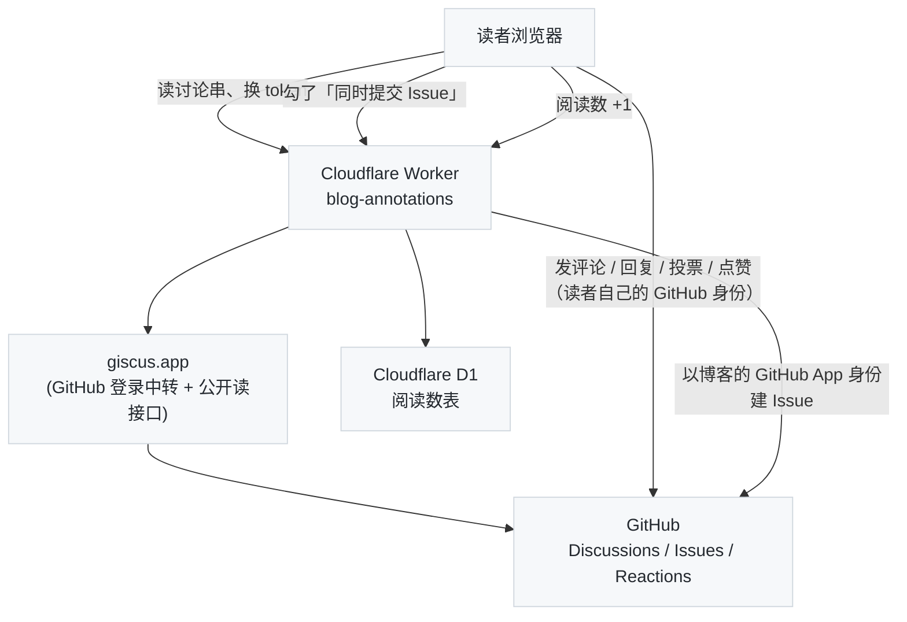

这是写给我自己的备忘：博客怎么托管、怎么发布、写文章有哪些约定、读者能用哪些功能、出了问题去哪儿看。技术细节以仓库里的 `AGENTS.md` 为准，本文只讲"怎么用"。给读者看的那份在[《读者划线评论》](/highlight-annotations-demo.html)——本站只有这两篇"手册"，一篇给站点维护者（我），一篇给读者。

---

## 一、托管：GitHub Pages 是什么、能做什么

### 1. 基本事实

- 仓库 `arganzheng/arganzheng.github.com`，`master` 分支就是站点源码；根目录 `CNAME` 文件写着 `arganzheng.life`，GitHub 据此接受这个域名。DNS 是四条 A 记录指到 GitHub Pages 的 IP（`185.199.108-111.153`）。
- **强制 HTTPS 已开**（仓库 Settings → Pages → Enforce HTTPS）：`http://` 会 301 到 `https://`。证书由 GitHub 自动签发和续期，不用管。
- GitHub Pages 是**纯静态托管**：没有服务端代码、没有数据库、不能自定义 HTTP 头。所有"动态"的东西（评论、点赞、阅读数）都靠浏览器直接调外部服务实现，见第四节。
- 软限制：仓库 1 GB、站点 1 GB、每月 100 GB 流量、每小时 10 次构建。个人博客离这些很远；图片已经全部转成 WebP（`img/` 从 24 MB 降到 10 MB）。
- **缓存**：GitHub Pages 对所有文件（包括 HTML）返回 `Cache-Control: max-age=600`，无法修改。所以一次改动从 push 到所有读者看到，最坏是 **3 分钟构建 + 10 分钟浏览器缓存**。按 F5 普通刷新会立即重新校验 HTML；CSS/JS 的 URL 带构建时间戳（`?v=…`），HTML 一新它们必然跟着新。这个 13 分钟我认为可以接受，所以没有再在前面加 Cloudflare 之类的 CDN 来改缓存头。

### 2. 构建与发布：GitHub Actions 而不是老式 Pages 构建

Pages 有两种模式。老式（legacy）是 GitHub 自己用 Jekyll 3.10 和白名单插件构建；本站已切到 **Actions 模式**（Settings → Pages → Source = GitHub Actions），由 `.github/workflows/deploy.yml` 用 `Gemfile` 里锁定的 Jekyll 4.4 构建后发布，好处是本地、CI、线上是同一个 Jekyll，也不再受插件白名单限制。

触发时机：

| 触发 | 说明 |
| :--- | :--- |
| push 到 `master` | 约 3 分钟后上线 |
| 每天北京时间 00:05 | 定时构建，让**未来日期的文章按日期自动上线**（构建不带 `--future`） |
| 手动 | Actions → deploy → Run workflow |

所以**定时发布**的用法就是：文件名和 front matter 用未来的日期，push 上去，到那天凌晨自动出现。本地预览要看到它们需要 `jekyll serve --future`。

`_config.yml` 里显式写了 `timezone: Asia/Shanghai`，"今天"按北京时间算。

### 3. 常用检查入口

- Actions 页面：`deploy`（发布）、`check`（每次 push 的质量检查）、`external links`（每周一外链检查）。
- `gh run list --limit 5` 命令行看最近几次结果；`gh run view <id> --log-failed` 看失败原因。
- Pages 设置状态：`gh api repos/arganzheng/arganzheng.github.com/pages`。

---

## 二、写文章

### 1. 三种文章布局，以及它们和幻灯片的区别

| `layout:` | 头部 | 用途 | 现存文章 |
| :--- | :--- | :--- | :--- |
| `post` | 无大图，白底标题 + meta 行 | **默认**，所有技术文章 | 370+ |
| `header-post` | 全宽背景图（或 CSS 渐变）+ 白字标题，导航栏反白 | 随笔、生活类，想要一张封面时 | 3 篇（2017 年的随笔） |
| `keynote` | 头部是一个 **iframe，嵌一份在线幻灯片**，正文在下面 | 一次分享的「幻灯片 + 文字稿 + 评论」合在一页 | 0 篇 |

`keynote` 和 `slides/` 目录下的幻灯片是两回事：**`slides` 布局是幻灯片本身**（`slides/xxx.md` 用 Markdown 写、reveal.js 渲染成全屏演示，URL `/slides/xxx.html`，见下文第 9 小节）；**`keynote` 是一篇文章**，只是把某个幻灯片 URL（自己的 `/slides/xxx.html` 或外部的 Slides.com / Speaker Deck）嵌在头部，下面可以写讲稿、参考资料，也有评论区和阅读数。典型用法：先在 `slides/` 写好幻灯片，再建一篇 `keynote` 文章 `iframe: /slides/xxx.html` 作为它的"落地页"。注意 keynote 页面的标题、标签只出现在 `<title>` 和列表里，页面头部就是幻灯片本身。

### 2. front matter 全部字段

文章放在 `_posts/YYYY-MM-DD-slug.md`，URL 是 `/slug.html`（`permalink: /:title.html`；改文件名 = 改 URL = 评论串和外部链接都会断，非改不可时加 `redirect_from`）。

```yaml
---
layout: post                  # post | header-post | keynote
title: "标题"                  # 系列文章约定「系列名（NN）：副标题」
subtitle: "副标题"             # 可选；也是分享卡片 / 搜索引擎描述的兜底
date: 2026-09-09 14:30:00     # 可选；文件名已含日期，同一天多篇想控制顺序时再写时间
tags: [AI, AI-Infra]
catalog: true                 # 右侧浮动目录；正文里写 [TOC] 也会自动开启
series: deep-dive-into-vllm   # 系列文章才写，key 见 _data/series.yml
updated: 2026-09-20           # 大改后写上：头部显示「更新于」，JSON-LD dateModified
description: "一句话摘要"       # 分享卡片 / 搜索引擎；不写用 subtitle，再不写用正文开头
author: arganzheng            # 可选，默认 arganzheng
published: false              # Jekyll 内建：不构建这篇（比放草稿目录更方便临时下线）
redirect_from: /old-slug.html # 旧地址 301 过来（jekyll-redirect-from），可写数组

# 仅 header-post：
header-img: img/post-bg-2015.jpg                          # 背景图；也是分享卡片的图
header-bg-css: "linear-gradient(to right, #24b94a, #38ef7d)"  # 用 CSS 渐变代替图
header-mask: 0.3              # 图上压一层黑色遮罩的透明度，字看不清时用
header-img-credit: "Unsplash" # 右下角「Image by …」
header-img-credit-href: "https://unsplash.com/photos/xxx"

# 仅 keynote：
iframe: "/slides/reveal-demo.html"   # 嵌入的幻灯片地址
navcolor: invert              # 幻灯片是浅色背景时，把导航栏文字变深色
---
```

不存在的字段：上游 Hux 主题有 `mathjax: true`（本站公式自动检测、KaTeX 渲染，不用开关）、`header-style: text`（本站的 `post` 布局就是纯文字头部）、`multilingual` / `lang`（双语切换，本站没移植）、`nav-style`（本站叫 `navcolor` 且只有 keynote 用）。

文章头部那一行「Posted by … | 日期 · 更新于 | 约 N 分钟 · X.Xk 字 | N 次阅读」是自动的：阅读时长按去掉代码块后的字数 / 450 字每分钟估算。

### 3. 系列文章

系列信息**不写在正文里**，写在 front matter 的 `series:` 字段，取值是 `_data/series.yml` 里的 key。同系列文章按日期排序，页面自动生成三样东西：文首的「本文是《…》系列的第 N 篇（共 X 篇）。上一篇：…；下一篇：…」引用块、文末的系列目录、以及把 Previous / Next 换成系列内的上一篇 / 下一篇。

新开一个系列：先在 `_data/series.yml` 加一条（`name`、`overview` 总览页 URL），总览文章本身**不写** `series:`。标题约定是「系列名（NN）：副标题」，导航里只显示「）：」后面的部分。

非系列文章的文末 Previous / Next 仍是按时间的相邻文章，另有按 tag 推荐的「YOU MIGHT ALSO LIKE」。

### 4. 新建、草稿与本地预览

```bash
python3 tools/new-post.py my-slug "标题" --tags AI,AI-Infra --series deep-dive-into-vllm   # 生成 _posts/今天-my-slug.md
python3 tools/new-post.py my-slug "标题" --draft                                          # 生成 _drafts/my-slug.md
jekyll serve --future            # http://localhost:4000，含未来日期的文章
jekyll serve --future --drafts   # 再加上 _drafts/ 里的草稿
```

草稿放 `_drafts/`（文件名不用带日期），只有加 `--drafts` 时才会出现在本地预览里，线上永远不发布；写完移到 `_posts/` 并加上日期即可。`new-post.py` 会校验 `--series` 的 key 是否存在。

### 5. Markdown 能力速查

kramdown（GFM 模式），加上博客自己的扩展：

| 你写的 | 效果 |
| :--- | :--- |
| ```` ```python ```` 等围栏代码 | rouge 高亮；右上角自动有**复制**按钮；过宽的代码块横向滚动 |
| ```` ```mermaid ```` | Mermaid 图，浏览器端渲染；点击图放大 / 缩放 / 拖动 |
| `$$ ... $$` | KaTeX 公式（行内和块级都用 `$$`），有公式的页面才加载 KaTeX |
| `` | 自动 lazy 加载；≥ 200px 的图点击放大 |
| `概念[^名字]` + `[^名字]: 解释` | 浮窗脚注：悬停编号就地弹出卡片，见下一小节 |
| `[概念](# "tip: 一句话解释")` | 行内 Tips：虚线下划线 + `?` 角标，见下一小节 |
| 站外链接 | 自动加虚线下划线和 ↗ 图标、新窗口打开 |
| `[TOC]` | 就地生成目录，同时开启右侧浮动目录 |
| 表格 | GitHub 风格，手机上横向滚动 |
| `<i class="fa fa-xxx"></i>` | Font Awesome 4.7 图标（约 150 个常用的已内置，见第五节） |

### 6. 浮窗脚注与行内 Tips（作者给读者的解释）

这是本站最常用的两个"不打断阅读的解释"手段。原则：**解释长（多段、代码、表格、列表）用脚注，一两句话用行内 Tips**。

**浮窗脚注**就是标准 Markdown 脚注，只是读者悬停编号时就地弹出卡片、点击才平滑跳到文末（并避开吸顶导航栏）；脚注内容支持完整 Markdown。看一段实际效果——悬停下面的编号：

> 在现代分布式深度学习架构中，集群通信与算子实现至关重要。业界广泛采用 NCCL 集合通信库[^nccl]，并借助 Ring AllReduce 算法[^ring-allreduce]实现跨卡梯度同步。在服务层，vLLM 引擎[^vllm]引入了 PagedAttention 显存优化。底层算子常通过 PyTorch C++ 扩展骨架[^kernel-code]开发；混合并行切分时要评估各并行策略的显存与通信模式[^parallelism-table]。

对应源码（脚注定义放文末任意位置，缩进四格可以放代码块和表格）：

```markdown
业界广泛采用 NCCL 集合通信库[^nccl]，……开发高性能融合算子[^kernel-code]。

[^nccl]: **NCCL**：英伟达的集合通信库……详见 [NCCL 官方仓库](https://github.com/NVIDIA/nccl)。

[^kernel-code]: **PyTorch C++ 算子实现骨架**：
    ~~~cpp
    #include <torch/extension.h>
    torch::Tensor custom_add(torch::Tensor a, torch::Tensor b) { return a + b; }
    ~~~
```

**行内 Tips** 有四种写法，效果一样（虚线下划线 + `?` 角标，悬停或轻触弹出；支持加粗、代码、链接、公式，不支持代码块和列表）：

| 写法 | 示例 | 效果 |
| :--- | :--- | :--- |
| Markdown 链接 title（**推荐**） | `[GIL](# "tip: 全局解释器锁……")` | 在 Python 中，[GIL](# "tip: Global Interpreter Lock（全局解释器锁）：确保同一时刻只有一个线程执行 Python 字节码，是 CPU 密集型任务并发的主要约束。") 是多线程计算的主要制约 |
| kramdown IAL | `[MVCC](#){: .tip data-tip="……"}` | [MVCC](#){: .tip data-tip="Multi-Version Concurrency Control：保留数据项的历史版本，读不阻塞写、写不阻塞读。"} 是高并发隔离的核心机制 |
| Liquid include（可带「了解更多 ↗」外链） | `` |  是消除传输瓶颈的基石 |
| 原生 HTML | `<span class="inline-tip" data-tip="……">词</span>` | <span class="inline-tip" data-tip="Overlap：用多 CUDA Stream 让 GEMM 计算与 AllReduce 通信同时进行，隐藏通信时延。">计算与通信重叠</span> 能显著提升 MFU |
| 公式也行 | `[AllGather 通信量](# "tip: 每卡发送 $\frac{N-1}{N} S$")` | [AllGather 通信量](# "tip: 在 $N$ 个 GPU 间同步大小为 $S$ 的张量时，Ring AllGather 每卡发送 $\frac{N-1}{N} S$。") 可精确量化 |

交互细节（不用记，知道有就行）：悬停 100 ms 后才弹出防误触；鼠标移入卡片可以复制文字、点里面的链接；空间不够自动翻到下方；`Esc`、点空白处、鼠标移开都能关；手机上轻触弹出、再触关闭。

**外链**不需要任何标记：[PyTorch 官网](https://pytorch.org/) 这样的站外链接自动带 ↗ 并新窗口打开，[归档](/archive/) 这样的站内链接保持原样。

### 7. 图片

新图先放 `img/in-post/`，大于 20 KB 的 png/jpg 跑一次 `python3 tools/webp-images.py --apply` 会转成 WebP 并自动改写引用（先不带 `--apply` 是预览）。手绘 SVG 直接放，不用转。文章里用绝对路径 `/img/in-post/xxx.webp`。

### 8. Liquid 陷阱

`{%` 和 `{{` 出现在代码里（PTX、Go template、Jinja）必须包在 <code>&#123;% raw %&#125;…&#123;% endraw %&#125;</code> 里，否则 Liquid 会把它当模板语法，构建直接失败——写这一段本身就让构建失败了一次。`raw` 不能嵌套。

### 9. 幻灯片

`slides/xxx.md` 用 `layout: slides` 是 reveal.js 演示文稿，URL `/slides/xxx.html`，`/slides/` 是索引页。`---` 分页（前面留空行），`<!-- v -->` 纵向子页，`?print-pdf` 导出 PDF。`slides/2026-08-01-reveal-demo.md` 是全部语法的活演示；想给它配文字稿就建一篇 `layout: keynote` 的文章嵌进去（见本节第 1 小节）。

---

## 三、发布前后：质量检查

每次 push 触发 `check` workflow，做三件事，任何一件失败都会在 Actions 里标红并发邮件：

1. **构建**：`jekyll build --strict_front_matter`——front matter 写错 YAML 直接失败。
2. **全站链接检查**（lychee 离线模式）：每个站内链接、图片、`#锚点` 必须存在。写错 slug、图片路径、引用了不存在的标题锚点，这里会抓到。
3. **渲染检查**（headless Chrome 跑 `tools/check-render.cjs`）：本次改动的文章逐篇打开，Mermaid 有没有语法错、图片有没有加载失败、代码块有没有溢出。只改了模板 / CSS / JS 时改为抽查最新 15 篇。站外热链的图挂了只告警不判失败。

本地想提前跑：

```bash
jekyll serve --future &
~/.claude/skills/browser/scripts/start.cjs          # 起一个带调试端口的 Chrome
node tools/check-render.cjs <slug> [<slug> ...]
lychee --offline --root-dir $PWD/_site --include-fragments --exclude '/tags/?#' '_site/**/*.html'
```

**外链**每周一自动检查一次（`external links` workflow），失效的汇总开成一个带 `dead-links` 标签的 Issue，不阻塞任何发布。老文章外链腐烂是常态，看到 Issue 有空再修。

---

## 四、读者侧功能

这些都在文章页上，读者不需要任何配置；作者需要知道的是它们的数据在哪儿。

### 1. 评论、划线评论、投票、点赞、阅读数



- **数据都在 GitHub**：每篇文章对应仓库 Discussions 的 `Comments` 分类里一条以 URL 为标题的讨论串。评论、回复、划线评论都是这个讨论串里的普通评论，去 GitHub 上也能看、能删、能锁。
- **划线评论**：读者选中正文任意文字 → 点浮出的「评论」→ 评论挂在那句话上，正文出现黄色高亮和计数标记。它在 GitHub 上是一条开头带引用和 `§ 原文位置` 链接的评论。我改了原文措辞，模糊匹配仍能对上；改动太大就列为「未能定位」，评论不会丢。
- **投票 / 点赞**：评论的 ▲ 分数 ▼ 是 GitHub 的 👍/👎 reaction；文章的「有用」是讨论串本身的 👍。一人一票，GitHub 保证。评论区顶部的「最受关注的段落」按投票和讨论数排名。
- **同时提交 Issue**：读者认为写错了可以勾上这个，会在仓库开一个带 `划线评论` 标签的 Issue 并署读者名，评论上带红旗徽章——这是我的勘误工作队列，去 Issues 里按标签筛。
- **阅读数**：唯一不在 GitHub 的数据，存 Cloudflare D1，一个浏览器一篇文章一天算一次，本地预览不计数。它是量级参考，不是统计产品。
- **作者徽章**：我自己（仓库 OWNER）发的评论旁边有「作者」标签。
- **通知**：有人评论或回复，GitHub 会按我的通知设置发邮件（Discussions 的 watch 要开着）。回复读者直接在页面上或 GitHub 上都行。

Worker 代码在 `tools/annotations-worker/`，部署用 `wrangler deploy`；它持有的唯一密钥是博客 GitHub App 的私钥（建 Issue 用），以 Cloudflare secret 形式存放。README 里有从零配置的步骤。

### 2. 搜索

导航栏放大镜或 `/search/` 页面，纯前端：打开时才下载索引（`search.json` 标题 + `search-content.ndjson` 全文，约 10 MB，按构建版本缓存），之后在内存里搜。文章一多这个全文索引会继续长，目前可接受。

### 3. 其他

- **RSS**：`/feed.xml`，最近 10 篇全文；页面 `<head>` 里有自动发现标签，阅读器直接填域名即可。
- **标签页** `/tags/`、**归档页** `/archive.html`、**关于** `/about/`。
- **分享卡片**：每页都有 Open Graph / Twitter Card / JSON-LD，贴到微信、Twitter、Slack 会显示标题、摘要、图（默认 `img/home-bg.jpg`，文章可用 `header-img` 覆盖）。
- **统计**：Google Analytics、百度统计、Cloudflare Web Analytics 三个都接着（`_includes/analytics.html`、`head.html`）。
- **404 页**、`robots.txt`、`sitemap.xml`（jekyll-sitemap 插件生成）都有。

---

## 五、维护者须知

- **样式**：源在 `less/`，但 `css/argan-blog{,.min}.css` 里有几百行手工追加的规则，**不能整体重新编译**。改样式的做法是改对应的 `.less`，用 `node_modules/.bin/lessc` 编译该文件，把输出替换到两个 css 的对应区块（`AGENTS.md` 有具体做法）。
- **Font Awesome**：用的是自托管子集（20 KB，全量 77 KB），里面固定包含约 150 个常用图标，正常写文章不用管。如果用了子集外的图标，`check` workflow 会失败并直接列出图标名，这时跑 `python3 tools/fa-subset.py`（需要 `pip install fonttools brotli`）或把图标名加进脚本的 `ALWAYS` 列表。
- **依赖**：Ruby 依赖在 `Gemfile` / `Gemfile.lock`（改动后跑 `bundle lock --add-platform x86_64-linux`，CI 是 Linux）；Dependabot 会自动开 PR 升级。Node 只在本地编译 less 和跑检查脚本时用。
- **Service Worker**：`sw.js` 保留但已禁用（`service-worker: false`），不要开——它的实现会给每个请求加随机参数，等于关掉所有缓存。
- **和上游 Hux 主题的关系**：本站 fork 自 [huxpro.github.io](https://github.com/Huxpro/huxpro.github.io)（V1.8 时代），之后各自演化。上游后来加的东西里，`header-bg-css`、`header-img-credit`、`published: false` 的用法这次已对齐（见第二节）；`multilingual` 双语切换、`header-style: text`、`mathjax` 开关、`nav-style`、Rake 建文脚本没有移植（前两者本站用不上，后三者本站有等价物：公式自动检测、`navcolor`、`tools/new-post.py`）。本站独有而上游没有的：系列导航、`updated`、`description`、`[TOC]` + 浮动目录、浮窗脚注 / 行内 Tips、划线评论 / 投票 / 阅读数、reveal.js 幻灯片布局、Actions 部署与 CI 检查、WebP / 图标子集。上游的 `_doc/Manual.md` 仍值得偶尔看一眼有没有新东西。
- **评论系统的两个外部依赖**：giscus.app 的 OAuth / 读接口（稳定但非公开契约）和 Cloudflare Worker 免费额度。任何一个挂了，页面退化为「复制评论内容去 GitHub 粘贴」，文章本身不受影响。

---

## 六、速查

| 我想… | 做法 |
| :--- | :--- |
| 发一篇文章 | `_posts/日期-slug.md` 写好 → push → 3 分钟后上线（未来日期则到那天凌晨） |
| 大改一篇旧文 | front matter 加 `updated: 日期` |
| 加进某个系列 | front matter 加 `series: <key>`；新系列先改 `_data/series.yml` |
| 放图 | `img/in-post/`，大图跑 `tools/webp-images.py --apply` |
| 本地预览 | `jekyll serve --future` |
| 发布前自检 | `node tools/check-render.cjs <slug>`；或直接 push 看 `check` |
| 看谁评论了 | GitHub → Discussions → Comments 分类；邮件通知 |
| 看读者报的错 | GitHub → Issues → 标签 `划线评论` |
| 看死链 | Issues → 标签 `dead-links`（每周一更新） |
| 部署失败 | Actions → deploy → 看红色那步；多半是 front matter YAML 或 Liquid 语法 |
| 图标不显示 | 看 `check` 的 Font Awesome 那步给出的名字，跑 `tools/fa-subset.py` |

---

[^nccl]: **NCCL (NVIDIA Collective Communications Library)**：英伟达专为 GPU 集群优化的集合通信库，实现了跨 PCIe、NVLink 和 InfiniBand 的广播、归约与 AllGather。详见 [NCCL 官方仓库](https://github.com/NVIDIA/nccl)。

[^ring-allreduce]: **Ring AllReduce**：每个进程只与左右邻居通信，把数据切成 $$S/N$$ 大小的块环状传递，总通信量与节点数 $$N$$ 无关。

[^vllm]: **vLLM** 是伯克利推出的高效 LLM 推理与服务引擎。

    核心创新是借鉴操作系统虚拟内存分页思想的 **PagedAttention**，把显存浪费从 60%–80% 压到 4% 以下。

[^kernel-code]: **PyTorch C++ 算子实现骨架**——脚注里可以放代码块：
    ~~~cpp
    #include <torch/extension.h>
    torch::Tensor custom_add(torch::Tensor a, torch::Tensor b) {
        return a + b;
    }
    PYBIND11_MODULE(TORCH_EXTENSION_NAME, m) {
        m.def("forward", &custom_add, "Custom Add Forward");
    }
    ~~~

[^parallelism-table]: **三种并行策略速查**——脚注里也可以放表格：

    | 并行策略 | 切分对象 | 主要通信算子 |
    | :--- | :--- | :--- |
    | **张量并行 (TP)** | 权重矩阵 ($W$) | All-Reduce |
    | **流水线并行 (PP)** | 网络层数 | P2P (Send/Recv) |
    | **数据并行 (DP/ZeRO)** | 批量样本 | Reduce-Scatter / All-Gather |
