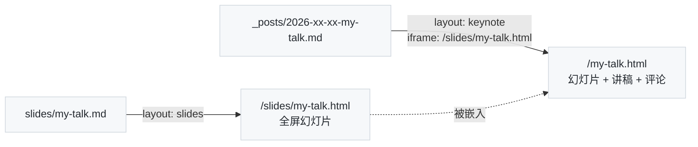

你现在看到的这一页就是 `keynote` 布局：**头部不是标题图，而是一份嵌进来的在线幻灯片**（方向键或点右下角箭头翻页，`F` 全屏，`S` 演讲者视图），往下滚就是这篇文章的正文——讲稿、补充说明、参考资料，文末照常有评论区、投票和阅读数。

它解决的问题很具体：做完一次分享，幻灯片本身信息密度低，光放幻灯片没人看得懂；只写文章又丢了幻灯片的节奏。keynote 把两者放在一页：想快速过一遍看上面，想看细节读下面，想讨论去文末。

## 一、怎么写

三步。

**1. 先有一份幻灯片。** 本站的幻灯片是 `slides/` 目录下的 Markdown 文件，`layout: slides`，reveal.js 渲染，URL 是 `/slides/<名字>.html`——上面嵌的就是 `slides/2026-08-01-reveal-demo.md`。也可以嵌外部的：Slides.com、Speaker Deck、Google Slides 的嵌入地址都行，只要对方允许 iframe。

**2. 新建一篇 `layout: keynote` 的文章，`iframe` 指向幻灯片。** 本文的 front matter 一字不差是：

```yaml
---
layout: keynote
title: "keynote 布局演示：给一份幻灯片配上讲稿"
subtitle: "上面是可以翻页的幻灯片，下面是文字稿、参考资料和评论区"
iframe: "/slides/reveal-demo.html"   # 站内相对地址或完整 URL
navcolor: invert                      # 幻灯片是浅色背景时加上，导航栏文字变深色
catalog: true
tags: [Blog, Demo, Slides]
---
```

也可以用脚本一步生成：`python3 tools/new-post.py my-talk "标题" --layout keynote --iframe /slides/my-talk.html`。

**3. 正文照常写 Markdown。** 所有文章能用的东西这里都能用：目录、脚注、Tips、Mermaid、公式、划线评论。

## 二、和普通文章、和幻灯片本身的区别

| | `slides` 布局 | `keynote` 布局 | `post` 布局 |
| :--- | :--- | :--- | :--- |
| 它是什么 | **幻灯片本身**，全屏演示 | **一篇文章**，头部嵌一份幻灯片 | 普通文章 |
| 文件位置 | `slides/xxx.md` | `_posts/日期-xxx.md` | `_posts/日期-xxx.md` |
| URL | `/slides/xxx.html` | `/xxx.html` | `/xxx.html` |
| 出现在首页 / 归档 / RSS | 否（只在 [/slides/](/slides/) 索引） | 是 | 是 |
| 评论、点赞、阅读数 | 无 | 有 | 有 |
| 适合 | 现场演讲、投屏、导出 PDF | 分享之后的"落地页" | 一切 |

所以典型流程是：**在 `slides/` 写幻灯片 → 讲完 → 建一篇 keynote 文章挂上它、把讲稿整理进去**。幻灯片和文章各自有 URL，互不影响。

## 三、几个注意点

- **页面头部就是幻灯片**，标题、副标题、标签不会显示在头部（它们出现在浏览器标签页、首页列表、分享卡片里）。所以正文开头最好用一句话交代这是什么，就像本文第一段那样。
- **`navcolor: invert`**：默认导航栏文字是白色，配深色幻灯片；本站的 reveal 主题是白底，所以要加这一行让导航栏变深色。嵌深色主题（`theme: black`）的幻灯片时去掉它。
- **高度**：头部高度跟随浏览器窗口（视口高度减 85px，留一条露出下面还有内容），幻灯片在里面自适应缩放。翻页要先点一下幻灯片让它获得焦点，之后方向键才生效——reveal.js 的键盘事件只在 iframe 内部有效。
- **移动端**：手机上幻灯片可以左右滑动翻页；键盘快捷键自然没有。
- **外部幻灯片**：嵌 Google Slides 用它"发布到网络"给的 `/embed` 地址；Speaker Deck 用 `speakerdeck.com/player/<id>`。如果对方站点禁止 iframe（`X-Frame-Options`），头部会是一片空白，没有其他办法，只能换成链接。

## 四、正文可以放什么

这部分就是你的讲稿。常见的写法：

1. **一页一节**：按幻灯片顺序，每页配几段解释，读者对照着看。
2. **只写幻灯片上没有的**：现场口头说的补充、被砍掉的内容、Q&A 里的问题。
3. **参考资料**：幻灯片里只有一行的引用，这里给出链接和一句话说明。

比如上面这份演示文稿的第 4 页讲到 Mermaid，讲稿里就可以顺手放一张图并展开说：



写幻灯片本身的语法（分页、纵向子页、逐条显示、演讲者备注、导出 PDF）见上面那份演示文稿。
