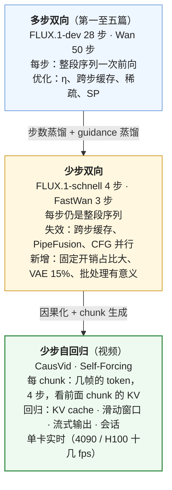
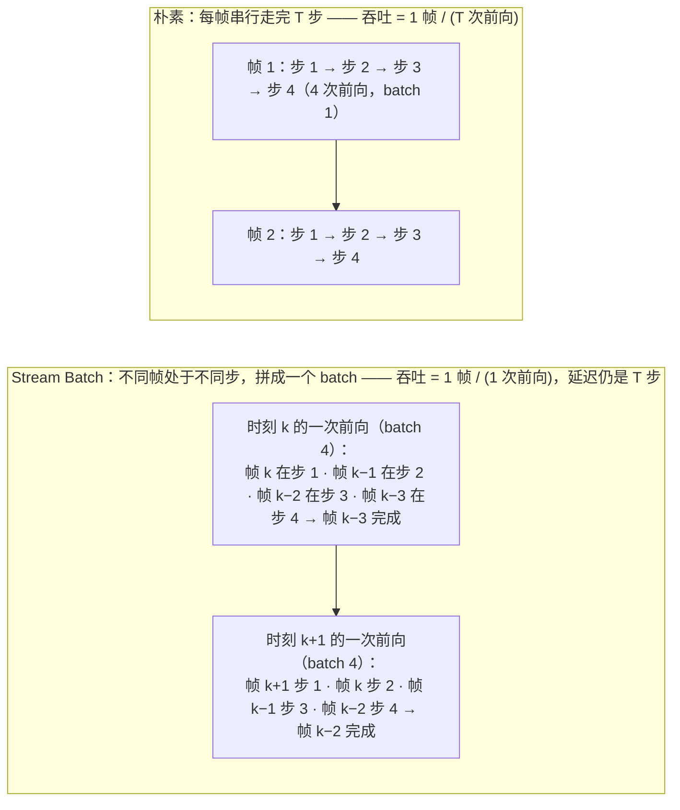
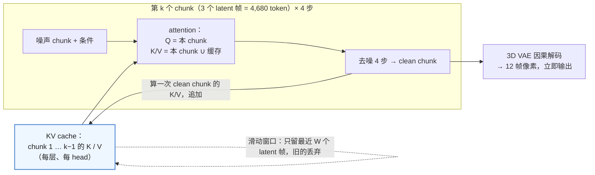

前五篇都在一个前提下做交换：28 步、50 步，每步一次完整前向。步数 $$T$$ 是第一篇账上最大的可调乘数，但前五篇没有动它——因为它不是系统能改的，是算法侧的：换更好的采样器（50 → 20 步）、步数蒸馏（→ 4 步、1 步）、guidance 蒸馏（去掉 CFG 的 ×2）。这一篇不讨论这些方法怎么做（在算法地图 L7 第六篇），只讨论**它们做成之后系统怎么变**：当 FLUX.1-dev 的 28 步变成 FLUX.1-schnell 的 4 步、一张图从 4.3 s 变成 0.7 s，前五篇的结论哪些失效、哪些不变、哪些新问题出现。

然后是一个更大的变化。视频模型一直是"一次前向处理整段视频的全部 token、重复几十步"——双向 attention，生成第 1 帧时要看第 81 帧。2024 年底开始的**自回归视频**（CausVid、Self-Forcing）把它改成"一个 chunk 一个 chunk 地生成，每个 chunk 只看前面的"——因果 attention 加少步蒸馏，单卡实时流式。于是一个在第一篇里被宣布"没有"的东西回来了：**KV cache**。已生成 chunk 的 K / V 被缓存供后面的 chunk 查询，滑动窗口决定它多大，服务形态从批任务变成会话——08 系列的一部分方法在这里重新出现。

本篇要回答的核心问题是：

> **FLUX.1-schnell 4 步 vs dev 28 步：每张 FLOPs、单卡 QPS、哪些优化还有用？[^q0] 自回归视频模型每个 chunk 的 KV cache 多大、滑动窗口留几帧？[^q1] 为什么一个"没有 KV cache"的负载又需要 KV cache 了？[^q2]**

## 一、总览

### 1. 先说答案：两次形态变化

FLUX.1-dev → schnell 的账（H100，$$\eta$$ 0.45）：

| | dev 28 步 | schnell 4 步 | 比 |
|---|---|---|---|
| DiT 段 FLOPs | 2.08 P | 0.30 P | 1/7 |
| DiT 段时间 | 4.68 s | 0.67 s | 1/7 |
| 文本编码器 + VAE | 22 + 102 ms（2.6%） | 22 + 102 ms（**15.6%**） | 占比 ×6 |
| 合计 | 4.80 s | 0.80 s | 6× |
| 单卡吞吐 | 0.21 张/s | 1.25 张/s | 6× |
| 跨步缓存（TeaCache） | 1.8× | **不可用** | — |
| PipeFusion / DistriFusion | 弱互联上可用 | **不可用** | — |
| 编译 / CUDA graph | 1.56× | 更重要（固定开销占比大） | — |
| SP 4 卡 | 1.63 s（延迟） | ~0.3 s；xDiT 8×A100 0.82 s（含全部） | — |

Table: FLUX.1-dev 与 schnell 的账

三个结论：

- **步数蒸馏是本系列里最大的一项加速，但它不是系统做的**：7× 来自算法侧重训一个模型；系统侧的全部工作（编译 1.5×、缓存 1.8×、稀疏 2×、多卡 2.6×）加起来与它同量级。系统工程师要知道的是：它之后账的结构变了。
- **利用"相邻步相似"的优化全部失效**：跨步缓存、PipeFusion、DistriFusion 的前提是几十步里中段平缓，4 步的每一步都是转折点。CFG 并行随 guidance 蒸馏一起消失。剩下的是不依赖步数的那些：attention 后端、编译、量化、序列并行。
- **固定开销与另两段浮出来**：文本编码器与 VAE 从 2.6% 到 15.6%；kernel launch、采样器、Python 开销从可忽略到可见——CUDA graph 从"收益小于编译"变成必需（SGLang 对 Z-Image-Turbo、SANA 一类少步模型推荐 breakable CUDA graph）。

自回归视频的账（Self-Forcing，Wan2.1-1.3B 底座，480p，chunk = 3 个 latent 帧）：

| | 双向 Wan 1.3B 480p 81 帧 50 步 | 自回归 4 步，21 个 latent 帧 = 7 个 chunk |
|---|---|---|
| 每次前向的 $$N$$ | 32,760（全部） | 4,680（一个 chunk）+ 看前面 chunk 的 KV |
| 前向次数 | 50 × 2（CFG） | 7 chunk × 4 步 = 28 |
| attention | 双向，$$N^2$$ | 因果，chunk 内 + 对缓存的 K / V |
| KV cache | 无 | **每 chunk 0.86 GB**；21 帧满窗口 6 GB |
| 输出 | 全部完成后一次输出 | 每 chunk 完成即输出（流式）；首 chunk 延迟亚秒 |
| 单卡 | 分钟级 | H100 约 17 fps、4090 实时（Self-Forcing 论文） |
| 时长 | 固定 81 帧 | 可无限延长（滑动窗口；误差累积是限制） |

Table: 双向 Wan 与自回归视频的账

### 2. 本文的章节安排

| 章 | 主题 | 内容 |
|---|---|---|
| 二 | 少步的账 | 步数蒸馏与 guidance 蒸馏的系统含义；FLUX、Wan（FastWan）的账；固定开销 |
| 三 | 失效与不变 | 逐项复核前五篇的优化 |
| 四 | 少步下的新形态 | 固定开销、CUDA graph、批处理何时有意义、多卡的意义从延迟变为吞吐 |
| 五 | 实时交互 | StreamDiffusion 的 stream batch；交互式图像生成的延迟结构 |
| 六 | 自回归视频 | 双向 → 因果：CausVid、Self-Forcing、Causal Forcing；chunk 与 KV cache |
| 七 | KV cache 的回归 | 每 chunk 的字节数、滑动窗口、长视频的误差累积、KV 量化 |
| 八 | 服务形态：从批任务到会话 | 流式输出、会话状态、交互式世界模型；08 系列的哪些回来了 |
| 九 | 实现对照与实践 | 三个引擎的 causal pipeline 与 KV 组件 |
| 十 | 本文小结 | |
| 十一 | 自测 | 5 道题 |

Table: 本文的章节安排

## 二、少步的账

### 1. 三种改步数的方式

| 方式 | 改什么 | 步数 | 重训 | 质量 | 系统含义 |
|---|---|---|---|---|---|
| **高阶采样器**（DPM-Solver++、UniPC） | 采样器的积分方法 | 50 → 15–25 | 无 | 几乎无损 | 步数减半，其余不变；跨步缓存的收益随之减小 |
| **步数蒸馏**（LCM、progressive、consistency、ADD / Turbo、DMD2） | 训一个学生模型，几步走完教师的轨迹 | → 1–8 | 有（几千到几万 GPU 小时） | 上限是教师；多样性略降 | 账上 $$T$$ 除以 7–25；相邻步不再相似 |
| **guidance 蒸馏** | 把 CFG 的效果烤进模型 | $$g$$: 2 → 1 | 有（常与步数蒸馏一起做） | 几乎无损；guidance 强度固定 | 每步 FLOPs 减半；CFG 并行与 CFG gating 消失 |

Table: 三种改步数的方式

FLUX.1-dev 是 guidance 蒸馏（$$g = 1$$、28 步），FLUX.1-schnell 是两者都做（4 步、$$g = 1$$）；SD3-Turbo、SDXL-Turbo、LCM-LoRA、Z-Image-Turbo（9 步、无 CFG）、FLUX.2-klein（步数蒸馏）、FastWan（DMD 3 步）都是这一类。

### 2. 账

$$
\text{FLOPs}_\text{DiT} = g \cdot T \cdot \text{FLOPs}_\text{fwd}: \quad \text{FLUX 28 步} \to \text{4 步} = \frac{1}{7}; \quad \text{Wan 50 步 CFG} \to \text{FastWan 3 步无 CFG} = \frac{1}{33}
$$

| 模型 | 蒸馏前 | 蒸馏后 | DiT 段 FLOPs | 单卡 H100 时间 |
|---|---|---|---|---|
| FLUX.1-dev → schnell | 28 步 $$g$$=1 | 4 步 $$g$$=1 | 2.08 P → 0.30 P | 4.7 s → 0.67 s（+0.12 s 另两段） |
| SD3-medium → SD3-Turbo | 28 步 $$g$$=2 | 4 步 $$g$$=1 | 0.50 P → 36 T | 1.1 s → 0.16 s（+0.14 s） |
| Wan2.1-14B → FastWan（VSA + DMD） | 50 步 $$g$$=2 | 3 步 $$g$$=1，VSA 稀疏 | 650 P → 20 P（再稀疏） | 24 min → ~40 s；FastVideo 报告 1.3B 480p 5 秒视频在 H200 上去噪约 1 s |
| Wan2.1-1.3B → Self-Forcing | 50 步 $$g$$=2 | 4 步 $$g$$=1，自回归 | — | 分钟级 → 实时流式 |

Table: 步数蒸馏前后的账

### 3. 另两段浮出来

FLUX 的文本编码器 22 ms + VAE 102 ms 在 dev 上是 2.6%，在 schnell 上是 15.6%；SD3-Turbo 上是 47%。少步模型的优化对象转移：

- **VAE 解码**：fp32 卷积链的 100 ms 变成主项之一——bf16 VAE（有损）、融合的 GroupNorm + SiLU、TAESD 一类的**轻量解码器**（几 MB、几毫秒、质量略降，实时预览用）；
- **文本编码器**：prompt embedding 缓存（第二篇）命中时直接省 22 ms；
- **采样器与 Python 开销**：4 步里每步的 Python 调度、采样器的逐元素运算、kernel launch 从"每步 150 ms 里的几毫秒"变成"每步 170 ms 里的几毫秒"再变成"每步 40 ms（SD3-Turbo）里的几毫秒"——10% 以上，CUDA graph 的理由。

## 三、失效与不变

逐项复核前五篇：

| 优化 | 依赖的性质 | 少步模型上 | 说明 |
|---|---|---|---|
| 三段 offload（02） | 三段不同时在卡 | **不变** | 但每次生成搬 31 GiB 的 1.3 s 现在是总时间的 2 倍——少步模型必须常驻或量化 |
| attention 后端（02） | 无 | **不变** | |
| `torch.compile`（02） | 形状固定 | **不变、更重要** | 固定开销占比大 |
| CUDA graph（02） | 形状固定 | **从可选到必需** | 每步计算短，launch 占比大 |
| FP8 / INT4（02） | Tensor Core | **不变** | 蒸馏模型对量化的敏感度略高（误差没有多步去吸收）——评测要重做 |
| 跨步缓存（03） | 相邻步相似 | **失效** | 4 步之间相对差 50%+；schnell 上零命中 |
| CFG gating（03） | 有 CFG | **消失** | $$g = 1$$ |
| 稀疏 attention（04） | token 间冗余 | **不变** | 与步数无关；FastWan 直接用 VSA 训练 |
| 序列并行（05） | 无 | **不变** | 但单卡已亚秒，多卡的目的变为吞吐或视频 |
| CFG 并行（05） | 有 CFG | **消失** | |
| PipeFusion / DistriFusion（05） | 相邻步激活相似（stale K/V） | **失效** | xDiT 对 schnell 不用 PipeFusion |
| Parallel VAE（05） | 无 | **不变、更重要** | VAE 占比大 |

Table: 前五篇的优化在少步模型上的失效与不变

失效的三项有同一个根：**它们都在利用"几十步里大部分步是保守余量"这个事实**，蒸馏把余量拿走了。剩下的优化都是对"一次前向"本身的。

## 四、少步下的新形态

### 1. 批处理何时有意义

第一篇：单请求 compute-bound，batch 不提吞吐。这个结论的前提是**一个请求的 GEMM 已经填满 GPU**——FLUX 1024² 的 $$[4608, 3072] \times [3072, 12288]$$ 是。它在两种情况下不成立：

- **小模型 × 低分辨率**：SD-Turbo 512²（0.86B U-Net，$$N \approx 1024$$）、SD3-Turbo 512²（$$N = 1357$$，$$d = 1536$$）的 GEMM 是 $$[1357, 1536] \times [1536, 6144]$$，H100 上 MFU 不到 30%——batch 4 把它填满，吞吐近 3×；
- **固定开销占比大**：少步下每步的 launch / 调度开销不随 batch 增长，batch 摊薄它。

所以少步 + 小模型的实时场景（第五章）恰恰是批处理有意义的场景；FLUX-schnell 1024² 仍然不是——它每步仍是 74 TFLOPs 的大 GEMM。SGLang 的动态批处理（第七篇）合并的正是这类"形状兼容的小请求"。

### 2. 多卡的意义

dev 上 4 卡 SP 是为了把 4.3 s 切成 1.6 s（延迟）；schnell 单卡 0.8 s 已经在多数 SLO 内，4 卡 SP 切到 0.3 s 的意义不大、效率还低。xDiT 的 schnell 数据：8×A100 Ulysses 8 + compile，1024² 0.82 s、2048² 2.4 s——2048² 才是多卡的理由（单卡 2048² 4 步约 3.8 s）。少步模型的多卡默认是 **DP**（吞吐），SP 留给高分辨率与视频。

### 3. 延迟结构

| | dev 28 步 | schnell 4 步 |
|---|---|---|
| 首输出 | 4.8 s 后一次给出 | 0.8 s |
| 中间预览 | 每步可以解码一张模糊预览（VAE 100 ms，太贵；用 TAESD 5 ms） | 4 步没必要 |
| 交互（改 prompt 重生成） | 不可能实时 | 接近实时：0.8 s 一轮 |

Table: dev 与 schnell 的延迟结构

## 五、实时交互：StreamDiffusion

交互式生成（画板实时上色、摄像头实时风格化）要的是**每帧几十毫秒**，即使 1 步模型（SD-Turbo 512² 单步约 20 ms 计算）也要把整条流水线的开销压掉。StreamDiffusion（Kodaira 等 2023）是这类系统的原型，它的几个设计都是"把串行变并行、把开销摊掉"：

- **Stream batch**：把处于不同去噪步的连续帧拼成一个 batch，一次前向推进所有帧各一步——每次前向完成一帧，吞吐从 $$1/T$$ 变成 $$1$$（小模型的 GEMM 未饱和，batch $$T$$ 几乎不增加时间）；延迟不变（每帧仍经历 $$T$$ 步），这是吞吐与延迟的经典分离；
- **Residual CFG**：无条件分支只算一次（或每隔几帧一次），复用它的残差——第三篇 CFG gating 的原型；
- **相似性过滤**：输入帧与上一帧几乎相同时跳过生成、直接复用输出——摄像头静止时省掉全部计算；
- **预计算**：prompt embedding、噪声、采样器系数全部预先算好；**tiny VAE**（TAESD）做解码。

报告的数字：RTX 4090 上 SD-Turbo 512² 1 步约 90 fps、LCM 4 步约 40 fps。它与 LLM serving 的连续批处理形式上相似（batch 里的成员处于不同阶段），但动机相反：LLM 是为了摊权重读取（memory-bound），这里是为了填满小 GEMM 并让每次前向都产出一帧。

## 六、自回归视频

### 1. 双向的限制

Wan / HunyuanVideo 的 DiT 是**双向**的：每个 token 看全部帧，包括"未来"。这带来两个系统上的硬约束：整段视频必须一次生成完才有任何输出（24 分钟后才看到第一帧）；时长在生成前固定（81 帧就是 81 帧，延长要重新生成）；而且 $$N^2$$ 的 attention 让时长是二次方的成本。交互式应用（游戏、世界模型、实时对话中的视频）不可能在这个形态上做。

### 2. 因果化 + 蒸馏

自回归视频模型把 DiT 改成**因果**的：按 chunk（几个 latent 帧）生成，第 $$k$$ 个 chunk 的 token 只看第 $$1 \ldots k$$ 个 chunk（chunk 内双向、chunk 间因果），前面 chunk 的 K / V 缓存起来。再加步数蒸馏让每个 chunk 只需 4 步：

| 工作 | 年 | 底座 | 方法 | 结果 |
|---|---|---|---|---|
| **CausVid** | 2024.12 | 双向 DiT（Wan 一类） | 把双向教师改成因果学生：先用教师的 ODE 轨迹初始化学生，再用 DMD（分布匹配蒸馏）以双向教师监督因果学生（"非对称蒸馏"）；4 步；chunk 级 KV cache | VBench-Long 84.27；单卡 9.4 fps 流式；支持 I2V、流式 V2V、动态改 prompt |
| **Self-Forcing** | 2025.06 | Wan2.1-1.3B | 训练时按**推理的方式**自回归 rollout（用自己生成的前 chunk 作条件、带 KV cache），消掉 teacher-forcing 与推理的分布差（exposure bias）；整段视频级的损失；**rolling KV cache** 支持无限延长；数据无关（不需要视频数据） | 单卡实时流式，首 chunk 亚秒；质量匹配慢得多的双向模型 |
| **Causal Forcing** | 2025 | 同 | 指出 Self-Forcing 用双向教师做 ODE 初始化的理论问题，先把双向底座微调成因果扩散模型再作教师 | 质量与运动优于 Self-Forcing，同样实时 |
| **LingBot World / 世界模型一类** | 2026 | 因果 DMD | 交互式：每 chunk 接收动作 / 相机控制信号 | SGLang 有专门的 causal DMD pipeline 与 realtime 会话 |

Table: 自回归视频生成的代表工作

### 3. 一个 chunk 的前向

每个 chunk 的账（Self-Forcing 配置：Wan 1.3B，$$d = 1536$$，30 层，480p 一帧 $$30 \times 52 = 1560$$ token，chunk 3 帧 4,680 token）：

- 前向的 $$N_q = 4680$$（Q），K / V 长度 = 4680 + 缓存长度（最多窗口 21 帧 = 32,760）；
- attention FLOPs 每层 $$4 N_q N_{kv} d$$——比双向的 $$4 N^2 d$$ 小 $$N / N_q = 7$$ 倍（$$N_{kv}$$ 满窗口时）；线性项 $$2 P_\text{tok} N_q$$ 是双向的 $$1/7$$；
- 4 步 × 7 个 chunk = 28 次前向，每次约双向一次前向的 $$1/7$$ → 总 FLOPs ≈ 双向 50 步 CFG 的 $$\frac{28}{100} \times \frac{1}{7} \approx 4\%$$；
- 每 chunk 完成后**再算一次**它的 clean 版本的 K / V 写入缓存（去噪过程中的 K / V 是带噪输入的，不能直接用）——多一次前向的 attention 部分。

## 七、KV cache 的回归

### 1. 字节数

一个 token 的 K + V：每层 $$2 d$$ 个数，bf16：$$2 \times 1536 \times 2 = 6$$ KB / 层，30 层 **184 KB / token**（Wan 1.3B 没有 GQA——DiT 通常不用 GQA，因为训练时是双向、每个 head 的 K / V 都被全序列用到）。

| | token 数 | KV 字节 |
|---|---|---|
| 一个 latent 帧（480p） | 1,560 | 287 MB |
| 一个 chunk（3 帧） | 4,680 | **0.86 GB** |
| 窗口 21 帧（≈ 5 秒） | 32,760 | **6.0 GB** |
| 若 720p（3,600 token / 帧） | ×2.3 | 窗口 14 GB |
| 若 14B 底座（$$d$$ 5120，40 层） | 每 token 819 KB | 480p 窗口 27 GB |

Table: 自回归视频的 KV 字节数

对比第一篇 Llama-3-8B 的 KV：128 KB / token（GQA 8 head）。**自回归视频的 KV 每 token 比 LLM 还大**（无 GQA、$$d$$ 大），且一个 chunk 就是几千 token——08 系列的 KV 管理问题（分页、驻留、换出）在这里重现，vLLM-Omni 的 `diffusion_kv/` 直接复用了 vLLM 的分页 KV 管理器与 PagedAttention 适配。

### 2. 滑动窗口与长视频

窗口 $$W$$ 决定两件事：显存（$$\propto W$$）与每 chunk 的 attention 成本（$$\propto W$$）。Self-Forcing 的 rolling KV cache 固定 $$W$$（如 21 帧），生成第 22 帧时丢掉第 1 帧的 K / V——视频可以无限延长，成本恒定。代价：模型看不到 $$W$$ 之前的内容（长程一致性靠已生成帧的间接传递）；**误差累积**——每个 chunk 以自己生成的（有误差的）前 chunk 为条件，几十秒后画面漂移、饱和、物体变形。Self-Forcing 训练时的自回归 rollout 正是为了让模型在训练中见到自己的误差，把漂移推后到分钟级；Causal Forcing 进一步改善。这是自回归视频当前最主要的质量限制，也是"世界模型"路线的核心问题。

### 3. KV 量化

窗口 6–27 GB 的 KV 在长会话里是显存的主项。SGLang 对 LingBot World 的 causal 服务提供 `--kv-cache-quant int4 | int2`（Quant-VideoGen 的 PRQ）：**已完成的 chunk** 的 K / V 量化到 INT4 / INT2，**当前与最近的 chunk** 留 bf16——因为最近的 chunk 对当前生成影响最大、且它们的 K / V 还会被"重算 clean 版本"覆盖。与 LLM 的 KV 量化（KIVI 一类）同构，粒度是 chunk 而不是 token。

## 八、服务形态：从批任务到会话

### 1. 什么回来了

| 08 系列的概念 | 双向多步扩散 | 自回归少步视频 |
|---|---|---|
| KV cache | 无 | **有**：chunk 级，滑动窗口 |
| 分页 / 驻留 / 换出 | 无 | **有**：多会话共享显存，vLLM-Omni 复用分页管理器 |
| prefill / decode | 每步都是 prefill | **有对应物**：I2V 的参考帧 / 已有视频编码进 KV 是 prefill，逐 chunk 生成是 decode |
| 流式输出 | 无（一次给出） | **有**：每 chunk 12 帧立即输出 |
| 会话状态 | 无 | **有**：KV、当前帧位置、prompt、控制信号 |
| 连续批处理 | 无意义 | **部分回归**：多个会话的当前 chunk 可以拼 batch（同形状、同步数） |
| 抢占 | 步边界 | chunk 边界；被抢占的会话要换出 KV |
| 请求时长 | 可预测 | **不可预测**（用户决定何时停）——与 LLM 一样 |

Table: 08 系列的概念在自回归少步视频上回来了什么

第一篇那张"08 的机制在扩散上大半用不上"的表，在自回归视频上要重新画：大半又用得上了。**因果化让视频生成在系统形态上向 LLM serving 收敛**——这是 SGLang 与 vLLM 两个 LLM 引擎恰好适合承载它的原因之一。

### 2. 会话与控制信号

交互式应用（世界模型：用户按方向键、相机移动）在 chunk 之间注入控制信号，模型据此生成下一 chunk。SGLang 的 `realtime/` 模块（`session.py`、`control_signals.py`）把它做成会话：一个长连接、服务端持有 KV 与状态、客户端流式收帧、随时发控制。LingBot World、SANA-WM（world model）的 realtime pipeline 是这个形态的第一批生产实现。这一部分在 2026 年仍在快速变化，本文只指出形态。

## 九、实现对照与实践

### 1. 实现对照

| 机制 | SGLang Diffusion v0.5.19 | vLLM-Omni v0.28 | xDiT | diffusers v0.40 |
|---|---|---|---|---|
| 少步模型 | 原生 pipeline：`flux_2_klein.py`、`zimage_pipeline.py`（Turbo 9 步无 CFG）、`wan_dmd_pipeline.py`、`sana_sprint.py`；推荐 breakable CUDA graph | `sched/sigma_schedule.py`（`DMD2SigmaSchedule`） | schnell 用 USP、不用 PipeFusion | FLUX-schnell、LCM、Turbo 各 pipeline |
| 因果视频 pipeline | `wan_causal_dmd_pipeline.py`、`lingbot_world_causal_dmd_pipeline.py`、`sana_wm_realtime_pipeline.py`、`longlive2_pipeline.py` | 因果模型适配 | `pipeline_causal_wan.py` | — |
| KV cache | `runtime/layers/kvcache/causal_attention_cache.py`、`qvg_packed_cache.py`（量化） | `diffusion/diffusion_kv/`：`manager.py`、`paged_attention_adapter.py`、`request.py`；调度器里的 `KVPrefetchJob` | — | `hooks/text_kv_cache.py`（只缓存文本 K/V） |
| KV 量化 | `--kv-cache-quant int4 / int2` | — | — | — |
| 实时会话 | `runtime/realtime/`：`session.py`、`control_signals.py`、`states/` | — | — | — |
| 流式输出 | realtime 会话逐 chunk 推送 | 流式输出（`outputs/`） | — | — |
| 动态批处理 | `runtime/managers/dynamic_batch_admission.py` | `sched/step_scheduler.py`（step 级批） | — | — |

Table: 少步与自回归视频在四个引擎里的实现对照

### 2. 实践建议

一张 24 GB 以上的卡：（1）FLUX.1-dev 与 schnell 各跑 20 个固定 prompt，对比开 / 关 `torch.compile`、开 / 关 TeaCache（FBCache）的每张时间与 PSNR——该看到 schnell 上缓存零命中或图坏、compile 的相对收益更大、VAE 时间占比从 2% 到 15%；（2）用 Self-Forcing 的开源实现（`guandeh17/self-forcing`，Wan2.1-1.3B）生成一段 10 秒视频，用 `torch.cuda.memory_allocated` 记录每个 chunk 后的显存增量（应接近 0.86 GB / chunk 直到窗口满），记录首 chunk 延迟与之后每 chunk 的延迟（应接近恒定），看第 30 秒之后的画面漂移。

## 十、本文小结

| 项 | 规则 | 数字 |
|---|---|---|
| 步数是最大的乘数 | 采样器 2×；步数蒸馏 7–25×；guidance 蒸馏 2× | FLUX dev → schnell：DiT 2.08 P → 0.30 P，4.7 s → 0.67 s |
| 失效 | 依赖"相邻步相似"的：跨步缓存、PipeFusion、DistriFusion；依赖 CFG 的：CFG 并行、CFG gating | schnell 上缓存零命中 |
| 不变 | attention 后端、编译、量化、稀疏 attention、SP、Parallel VAE | 编译与 CUDA graph 更重要 |
| 浮出来的 | 文本编码器 + VAE、launch 与 Python 开销 | 2.6% → 15.6%；SD3-Turbo 47% |
| 批处理 | 小模型 × 低分辨率的 GEMM 不饱和时有意义；FLUX 1024² 仍无意义 | SD3-Turbo 512² batch 4 近 3× |
| 多卡 | 少步模型默认 DP（吞吐）；SP 留给高分辨率与视频 | xDiT schnell 8×A100 1024² 0.82 s |
| StreamDiffusion | stream batch（不同步的帧拼 batch）、residual CFG、相似性过滤、tiny VAE | 4090 SD-Turbo 约 90 fps |
| 自回归视频 | 因果 chunk + 4 步 DMD；CausVid → Self-Forcing → Causal Forcing | 单卡实时；首 chunk 亚秒 |
| KV cache 回归 | 每 token $$2 d L \times 2$$ 字节（无 GQA）；chunk 级；滑动窗口 | Wan 1.3B 480p：184 KB / token，chunk 0.86 GB，窗口 6 GB |
| 限制 | 误差累积（漂移）、窗口外遗忘 | 分钟级 |
| 形态 | 批任务 → 会话：KV 驻留、流式、抢占、不可预测时长 | 08 系列大半回归 |

Table: 少步与自回归视频的规则与数字小结

### 下一篇

前六篇的机制都在一个请求内部。下一篇把它们放进一个对外的服务：请求形态、批处理为什么几乎不提吞吐、时长可预测的调度、文本编码器 / DiT / VAE 的三段分离、LoRA 与 ControlNet 的服务、`/v1/images` 与 `/v1/videos` 的同步与异步、以及一张图多少钱。

## 十一、自测

1. FLUX.1-schnell 4 步在 H100 上 DiT 段 0.67 s、文本编码器 22 ms、VAE 102 ms。开 TeaCache（阈值 0.4）预期加速多少？把 VAE 换成 bf16（快 2×）预期加速多少？

   

   
答案

   TeaCache：0×——4 步之间相对差 50% 以上，没有步会命中（或命中即坏），schnell 上零收益。VAE bf16：总时间 0.80 → 0.75 s，约 7%——在 dev 上同样的改动只有 1%。少步模型的优化对象转移到另两段。详见[第二章](#二少步的账)、[第三章](#三失效与不变)。
   

2. 第一篇说"batch 对扩散几乎不提吞吐"，第五章说 StreamDiffusion 用 stream batch 把吞吐提到接近 $$T$$ 倍。两者矛盾吗？

   

   
答案

   不矛盾。前提不同：第一篇的 FLUX 1024² 单请求的 GEMM（$$[4608, 3072] \times [3072, 12288]$$）已填满 GPU，batch 只是线性增加时间。StreamDiffusion 的 SD-Turbo 512²（0.86B，$$N \approx 1024$$）GEMM 小、单请求 MFU 不到 30%，batch $$T$$ 几乎不增加时间——batch 的收益来自填满未饱和的 GPU，与步数无关；少步 + 小模型恰好是这个区间。详见[第四章](#四少步下的新形态)、[第五章](#五实时交互streamdiffusion)。
   

3. Self-Forcing（Wan 1.3B，$$d$$ 1536，30 层，480p 一帧 1,560 token）的 KV cache 每 token 多少字节？为什么比 Llama-3-8B 的 128 KB 还大？

   

   
答案

   每层 K + V $$2 d$$ 个 bf16 = $$2 \times 1536 \times 2 = 6$$ KB，30 层 184 KB / token。Llama-3-8B 用 GQA（8 个 KV head × 128 = 1024 维，而不是 4096），每层 4 KB × 32 层 = 128 KB。DiT 不用 GQA（双向训练下每个 head 的 K / V 都被全序列用到，没有压缩的动机），所以尽管模型小（1.3B vs 8B），每 token 的 KV 更大。详见[第七章](#七kv-cache-的回归)。
   

4. 自回归视频的滑动窗口 $$W$$ 从 21 帧改成 42 帧，显存与每 chunk 的时间各怎么变？它解决了什么、没解决什么？

   

   
答案

   KV 显存 6 → 12 GB（$$\propto W$$）；每 chunk 的 attention 成本 $$\propto N_q \cdot N_{kv}$$，$$N_{kv}$$ 近似翻倍，attention 时间约翻倍（线性项不变）。解决了 5–10 秒内的长程一致性（能看到更早的帧）；没解决误差累积——漂移来自以自己有误差的输出为条件，与窗口大小无关，靠训练方法（Self-Forcing 的 rollout、Causal Forcing）推后。详见[第七章](#七kv-cache-的回归)。
   

5. 为什么 SGLang 的 KV 量化只量化"已完成的 chunk"、把当前与最近的 chunk 留在 bf16？

   

   
答案

   两个原因：最近的 chunk 对当前生成的影响最大（attention 随时间距离衰减，第四篇），量化误差在这里最伤；当前 chunk 去噪完成后还要重算一次 clean 版本的 K / V 覆盖进缓存，量化中间状态没有意义。旧 chunk 影响小、且不再改变，INT4 / INT2 的误差可接受——与 LLM 的 KV 量化按"最近 token 保留高精度"同构，粒度是 chunk。详见[第七章](#七kv-cache-的回归)。
   

## 下一篇

[serving 形态：请求形态、批处理、三段分离、LoRA / ControlNet、异步任务 API 与成本](/diffusion-serving-shapes-batching-disaggregation-and-cost.html)

[^q0]: schnell 4 步、$$g = 1$$：DiT 段 $$4 \times 74.3$$ T = 0.30 PFLOPs（dev 的 1/7），加文本编码器 4.9 T 与 VAE 5 T；H100 $$\eta$$ 0.45 下 0.67 + 0.12 = 0.80 s，单卡约 1.25 张/s（dev 0.21 张/s）。仍有用的：attention 后端、`torch.compile` / CUDA graph（更重要）、FP8 / INT4、序列并行（但意义变为高分辨率与吞吐）、Parallel VAE；失效的：跨步缓存（4 步无冗余）、PipeFusion / DistriFusion（stale K/V 误差大）、CFG 并行与 CFG gating（无 CFG）。详见[第二章](#二少步的账)、[第三章](#三失效与不变)。

[^q1]: Self-Forcing 配置（Wan2.1-1.3B，$$d = 1536$$，30 层，无 GQA，480p 一帧 $$30 \times 52 = 1560$$ token）：每 token K + V $$= 2 \times 1536 \times 2 \text{ B} \times 30 = 184$$ KB；一个 chunk 3 个 latent 帧 4,680 token → 0.86 GB；rolling 窗口 21 个 latent 帧（约 5 秒）→ 6.0 GB。720p 乘 2.3，14B 底座每 token 819 KB。窗口大小是显存与每 chunk attention 成本（$$\propto N_q N_{kv}$$）的线性乘数。详见[第七章](#七kv-cache-的回归)。

[^q2]: 第一篇的"没有 KV cache"成立于双向多步模型：每步对全部 token 做完整前向，K / V 由本步的带噪输入算出、用完即弃，没有"历史 token 供新 token 查询"的结构。自回归视频把 attention 改成因果、按 chunk 生成：第 $$k$$ 个 chunk 的 Q 要查询第 $$1 \ldots k-1$$ 个 chunk 的 K / V，而那些 chunk 已经生成完、K / V 不再变（用 clean 版本重算一次后写入缓存）——"历史"出现了，缓存它就省掉了对历史 chunk 的重算。随之回归的还有滑动窗口、分页驻留、流式输出、会话状态与不可预测的时长——视频生成在系统形态上向 LLM serving 收敛。详见[第六章](#六自回归视频)、[第八章](#八服务形态从批任务到会话)。
