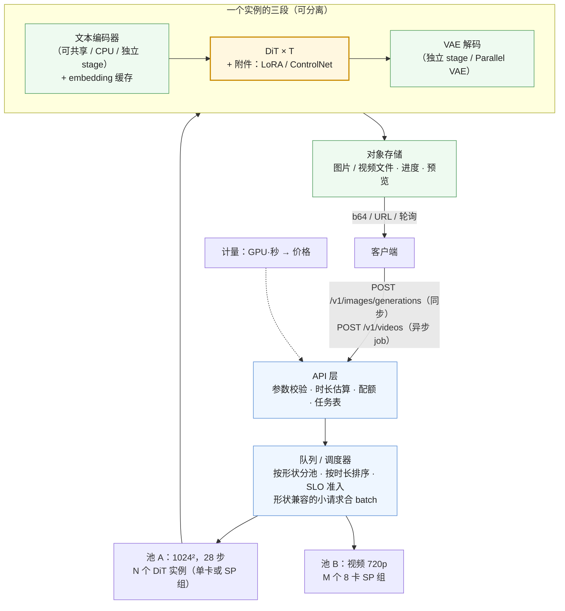
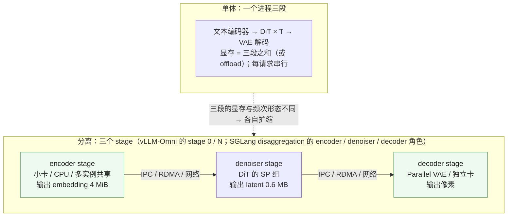
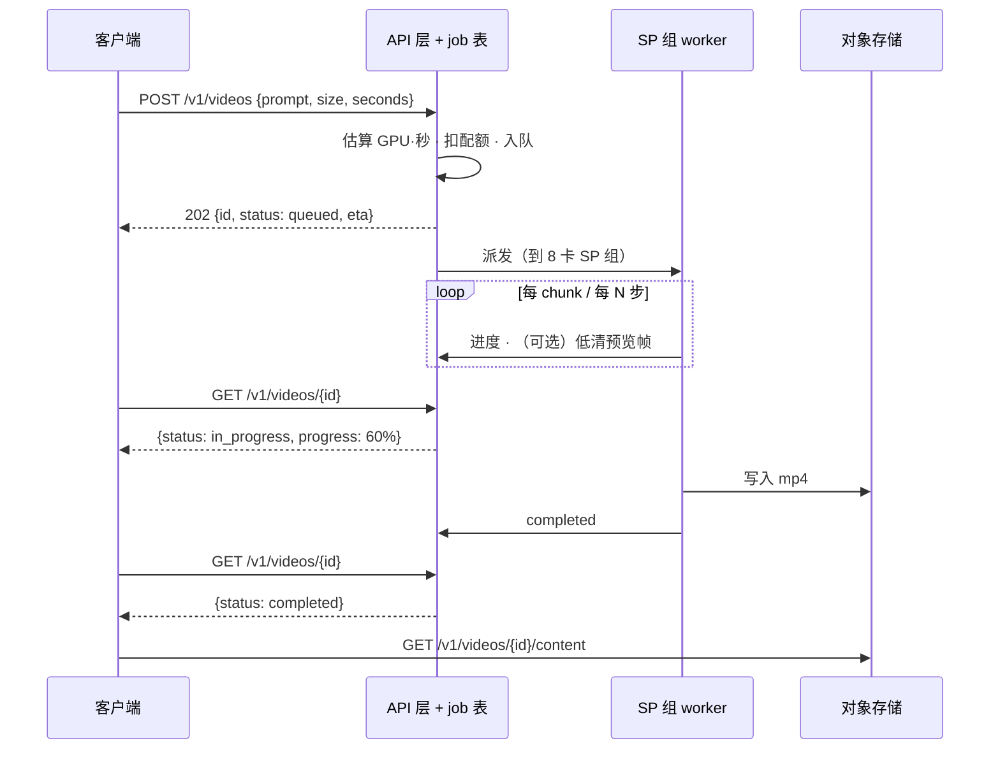

前六篇的机制都在一个请求内部。这一篇把它们放进一个对外的服务：请求从 HTTP 进来、排队、被分到一组卡、跑三段、把图片或视频交回去、记一笔钱。LLM serving 的这一层（08 系列第三、四篇）围绕两件事组织——请求时长不可预测、memory-bound 下 batch 提吞吐——所以有连续批处理、抢占、KV 驻留。扩散的这一层围绕相反的两件事：**请求时长在收到它时就完全确定**（分辨率 × 步数 × CFG），**batch 几乎不提吞吐**（compute-bound）。于是调度像批处理系统而不像流处理系统：按时长排队、按形状分池、多实例横向扩，抢占只在步边界有意义。

另外三个 LLM serving 没有的问题：**三段的资源需求不同**（文本编码器小且一次、DiT 重、VAE 显存峰值大），可以分开部署；**附件**（LoRA、ControlNet、IP-Adapter）让同一个基座模型服务上千种变体，每个请求带不同的附件；**视频请求是分钟级**，同步 HTTP 不可能，必须是异步任务。

本篇要回答的核心问题是：

> **一个 100 QPS 的 FLUX 1024² 服务需要多少张 H100？[^q0] batch 有没有用？p99 怎样保证？[^q1] 为什么视频服务必须做成异步 job？[^q2]**

## 一、总览

### 1. 先说答案：一个生成服务的结构

100 QPS 的 FLUX.1-dev 1024² 服务（H100）：

| 配置 | 每卡吞吐 | 需要的 H100 | 每张图 GPU·秒 | 每张图成本（H100 按 \$2.5 / 小时） |
|---|---|---|---|---|
| bf16 eager | 0.15 张/s（6.7 s） | 670 | 6.7 | \$0.0047 |
| + compile + FA3 | 0.26（3.9 s） | 390 | 3.9 | \$0.0027 |
| + FP8 | 0.34（2.9 s） | 290 | 2.9 | \$0.0020 |
| + TeaCache 0.4 | 0.6（1.65 s） | 170 | 1.65 | \$0.0011 |
| 换 FLUX.1-schnell 4 步 | 1.25（0.8 s） | 80 | 0.8 | \$0.0006 |
| 4 卡 SP（延迟 1.6 s，吞吐不变） | 0.26 张/s/卡 | 390 | 3.9 | \$0.0027 |

三个结论：

- **卡数由吞吐决定、吞吐由单卡时间决定、batch 不参与**：需要的卡数 = QPS × 单张 GPU·秒。前六篇的每一项优化直接按比例减少卡数；多卡 SP 不减少卡数（只减延迟）。
- **成本按 GPU·秒计，与 LLM 的按 token 计不同**：一张图的 GPU·秒在收到请求时就能算出（分辨率、步数、CFG、模型），所以可以**事前定价、事前拒绝**——LLM 只能事后按 token 数结算。
- **视频是另一个量级**：Wan 14B 720p 5 秒在 8 卡 SP 加全部优化后约 40 s，320 GPU·秒、\$0.22；不优化单卡 24 分钟、\$1。商业视频 API 的定价（每秒视频 \$0.1–0.5）就是这张账的反映。

### 2. 本文的章节安排

| 章 | 主题 | 内容 |
|---|---|---|
| 二 | 请求形态 | T2I / I2I / T2V / I2V / 编辑 / 附件；参数决定时长；与 LLM 请求的对照 |
| 三 | 批处理 | 为什么几乎不提吞吐；何时有用；SGLang 与 vLLM-Omni 的兼容键与准入 |
| 四 | 调度 | 时长可预测 → SJF / 分池 / SLO 准入；抢占的价值与代价；公平性 |
| 五 | 三段分离 | 文本编码器 / DiT / VAE 各自的资源形态；vLLM-Omni 的 stage、SGLang 的 disaggregation；何时分 |
| 六 | 附件 | LoRA（merge / unmerged / 多 LoRA / 异步加载）、ControlNet-as-a-Service、IP-Adapter |
| 七 | 模型级联与路由 | DiffServe 的 query-aware 级联；多模型池 |
| 八 | 同步与异步 API | `/v1/images` vs `/v1/videos`；job 表、轮询、对象存储、进度与预览 |
| 九 | 成本、扩缩与平台 | GPU·秒定价；冷启动；扩缩容信号；对平台层的要求 |
| 十 | 实现对照与实践 | |
| 十一 | 本文小结 | |
| 十二 | 自测 | 5 道题 |

## 二、请求形态

### 1. 六种请求

| 形态 | 输入 | 比 T2I 多的段 | 时长 | 例 |
|---|---|---|---|---|
| **T2I** 文生图 | prompt、size、steps、cfg、seed | — | 秒级 | FLUX、Qwen-Image |
| **I2I / 编辑** | + 参考图 / 原图 + 掩码 | 一次 **VAE 编码**（参考图 → latent）；参考 token 进 DiT 序列（$$N$$ 变大：Qwen-Image-Edit、FLUX Kontext 把参考图的 token 与目标图拼在一起，$$N$$ 翻倍、attention 四倍） | 秒级，比 T2I 长 1.5–3× | Qwen-Image-Edit、FLUX.2 |
| **T2V** 文生视频 | + frames、fps | — | 分钟级 | Wan、HunyuanVideo |
| **I2V** 图生视频 | + 首帧图 | VAE 编码首帧；首帧 latent 作为条件拼进序列 | 分钟级 | Wan-I2V、LTX-2 |
| **+ 附件** | + LoRA id / ControlNet 条件图 / IP-Adapter 参考图 | LoRA：线性层多一个低秩分支（或 merge）；ControlNet：多一个网络的前向（U-Net 时代约 +50%，DiT 时代的 ControlNet 是几个 block 的副本 +15–30%）；IP-Adapter：多一个图像编码器一次前向 | +0–50% | 风格 / 姿态 / 参考 |
| **流式 / 会话**（第六篇） | 控制信号流 | KV cache、会话状态 | 不定 | 世界模型 |

### 2. 时长在收到请求时就确定

$$
t \approx t_\text{txt} + g \cdot T \cdot \frac{\text{FLOPs}_\text{fwd}(H, W, F)}{\text{峰值} \cdot \eta} \cdot \frac{1}{\text{speedup}_\text{cache}} + t_\text{VAE}(H, W, F)
$$

每一项在请求参数里：$$H, W, F$$ → $$N$$ → FLOPs；$$T$$、$$g$$ 是参数；$$\eta$$ 与 speedup 是这个实例的常数（可从历史请求校准）。**一个请求的 GPU·秒在排队之前就知道**——LLM serving 做不到这一点（不知道会生成几个 token），它是扩散调度与计费的基础。跨步缓存（TeaCache / FBCache）的命中率让时长有 ±20% 的不确定；MagCache 的离线曲线则完全确定（第三篇）。

### 3. 与 LLM 请求的对照

| | LLM | 扩散 |
|---|---|---|
| 请求的"长度" | 输入 token 数已知，输出 token 数未知 | 全部已知 |
| 时长 | 不可预测，长尾严重 | 可预测到 ±20% |
| 中间输出 | 逐 token 流式 | 无（或每步一张模糊预览） |
| 请求间的共享 | 前缀 KV | prompt embedding（4 MiB）；同 prompt 多 seed 共享文本编码 |
| 状态 | KV cache 随生成增长 | 无（自回归视频除外） |
| 抢占 | 任意 token 边界，KV 要换出 | 步边界，只需保存 latent（$$N \times c p^2$$，FLUX 0.6 MB） |
| 失败重试 | 从头或从 KV 恢复 | 从任意步的 latent 恢复（确定性 seed 下 bit-exact） |

最后两行是扩散独有的便利：**一个请求的全部状态就是当前的 latent**——0.6 MB，任何一步都可以 checkpoint、迁移到另一张卡继续、或抢占后恢复。

## 三、批处理

### 1. 为什么几乎不提吞吐

第一篇：FLUX 1024² 单请求的 GEMM 已经在算力屋顶上，batch 2 的每步时间 ≈ 2× 单请求，吞吐不变。更精确地说，batch 的收益 $$= \frac{\text{MFU}(b)}{\text{MFU}(1)}$$，当 MFU(1) 已经 0.5 以上时上限不到 2×、实际 1.0–1.2×。视频更极端：单请求激活 14 GiB，batch 2 就溢出，永远 batch 1。

### 2. 何时有用

- **小模型 × 低分辨率**（第六篇）：SD3-Turbo 512²、SANA 1.6B、Z-Image——GEMM 不饱和，batch 4–8 有 2–3× 吞吐；
- **同 prompt 多张**（`n = 4`）：文本编码一次、四份 latent 拼 batch——省的是文本编码器与固定开销，DiT 部分仍是线性；
- **CFG 的两个分支**：天然的 batch 2，所有引擎默认拼在一起（除非 CFG 并行）；
- **固定开销占比大的少步模型**：batch 摊 launch 与 Python 开销。

### 3. 兼容键与准入

能拼进一个 batch 的请求必须**每步的形状与执行策略完全相同**。vLLM-Omni 的 `StepBatchSamplingParamsKey` 列出了全部条件：height / width / num_frames / fps、CFG 是否开与 guidance scale、quality 模式、每 prompt 输出数、**LoRA 的 id 与 scale**（一个 batch 只能激活一个 adapter）；SGLang 的 `dynamic_batch_admission` 在此之上按模型 × 分辨率 × 显存给 `max_batch_size` 与"cost 预算"的上限（`--batching-max-size` 是公共上限，`--batching-config` 按形状收紧），并要求同一批的 steps 相同。这与 LLM 的连续批处理（任何请求可以随时进出 batch）完全不同：扩散的 batch 是**同构、静态、整批开始整批结束**的——本质上是把几个相同形状的请求并成一个更大的请求。

## 四、调度

### 1. 时长可预测带来的选择

| 策略 | 做法 | 好处 | 代价 |
|---|---|---|---|
| **按形状分池** | 1024² / 768×1344 / 视频各一组实例 | 每池编译一次形状、无重编译；batch 兼容；容量可按形状规划 | 池间负载不均时要重分配实例（冷启动） |
| **最短作业优先（SJF）** | 队列按估算的 GPU·秒排序 | 平均等待最小；小图不被大图堵 | 大图饥饿——加老化（等待时间加权） |
| **SLO 准入** | 估算 $$t_\text{排队} + t_\text{执行}$$ 超过 SLO 就拒绝 / 降级（减步数、换 schnell、开缓存） | p99 可控 | 需要准确的时长模型 |
| **预付费 / 配额** | 按估算 GPU·秒扣配额 | 事前计费 | — |

这些在 LLM serving 里都做不好（不知道时长），在扩散上都是直接的。

### 2. 抢占

在步边界抢占一个请求只需保存它的 latent（0.6 MB）与步号，恢复时从那一步继续（同 seed 下 bit-exact）。它的价值：让一个高优先级的小请求插到一个 24 分钟的视频前面。代价：被抢占的视频请求的 SP 组要空出来、恢复时 KV（自回归视频）或文本 K / V 缓存要重建、编译状态要热。多数生产系统不做步级抢占，而是**分池**——把长任务与短任务隔离在不同的实例组，用队列而不是抢占保证短任务的延迟。

### 3. 公平与多租户

按租户的 GPU·秒配额与队列——因为时长可预测，配额可以在准入时精确扣减，不像 LLM 要在生成中途截断。第 11 系列（平台）的模型网关在这一层之上。

## 五、三段分离

### 1. 三段的资源形态

| 段 | 算力 | 显存 | 时间 | 频次 | 适合 |
|---|---|---|---|---|---|
| 文本编码器 | 小（5 T） | 9–14 GiB 权重 | 20–70 ms | 每请求一次；同 prompt 可缓存 | 独立小实例 / CPU / 与 DiT 同卡但 offload |
| DiT | 大（2 P） | 22–38 GiB 权重 + 激活 | 秒到分钟 | 每请求 $$T$$ 次 | 主体；SP 组 |
| VAE 解码 | 小（5 T） | **2–8 GiB 峰值**（视频百 GiB） | 100 ms（视频秒级） | 每请求一次 | 独立实例 / Parallel VAE / 与 DiT 同卡但 tiling |

同卡部署时 DiT 的 22 GiB 权重旁边要留 VAE 的 8 GiB 峰值（2048²），文本编码器的 9 GiB 要 offload；分离后 DiT 卡只放 DiT，密度更高。

### 2. 两种分离

- **vLLM-Omni 的 stage-based 部署**：为全模态模型设计（一个请求可能经过 LLM → DiT → TTS 三个不同的模型），扩散是其中一种 stage；`vllm serve MODEL --omni` 默认加载 `vllm_omni/deploy/` 里该模型的 stage 配置，stage 0 是 API server + orchestrator，其余 stage 可以用 `--stage-overrides` 放到不同 GPU 甚至不同主机，stage 间用 OmniConnector 传张量（embedding、latent）。
- **SGLang Diffusion 的 disaggregation**：`runtime/disaggregation/` 定义 `RoleType`——encoder / denoiser / decoder / server（无 GPU 的头节点）——每个角色一组进程，`transport/` 负责 stage 间的张量传输与缓冲，`dispatch_policy` 决定请求怎样在角色间流动。

### 3. 何时分

分离的收益：DiT 卡的显存密度、文本编码器与 VAE 可以按各自的负载独立扩缩（一个文本编码器实例服务几十个 DiT 实例）、VAE 的显存峰值不再限制 DiT 的分辨率上限。代价：stage 间传输（embedding 4 MiB、latent 0.6 MB——很小，但多一跳延迟）、三套进程的运维、单请求延迟多几十毫秒。**图像服务在 1024² 以下通常不分**（三段同卡 + offload 够用）；**视频服务几乎总是分 VAE**（百 GiB 的峰值不能与 DiT 抢显存）；**全模态服务必须分**（不同模型）。这与 08 系列的 PD 分离形式相似、动机不同：PD 分离是因为 prefill 与 decode 的算力 / 带宽形态相反，这里是因为三段的显存与频次形态不同。

## 六、附件：LoRA、ControlNet、IP-Adapter

### 1. LoRA

一个基座模型（FLUX）配上千个 LoRA（风格、角色、产品）是图像服务最常见的形态。三种服务方式：

| 方式 | 做法 | 切换成本 | 每步开销 | 适合 |
|---|---|---|---|---|
| **merge** | $$W' = W + BA$$ 合并进权重 | 合并 / 卸载各一次全权重的读写（FLUX 22 GiB，几百 ms） | 0 | 一个实例长期服务一个 LoRA |
| **unmerged** | 每个线性层多算 $$x B A$$ | 加载 $$BA$$（几十到几百 MB） | 低秩分支的 GEMM（rank 32：约 +2–5%） | 按请求切换 |
| **多 LoRA batch** | batch 里不同请求用不同 LoRA，按请求索引选 adapter（LLM 的 S-LoRA / Punica 思路） | — | 分组 GEMM 的开销 | 高并发多 LoRA |

扩散上多 LoRA batch 的价值比 LLM 小（batch 本来就不提吞吐），所以 vLLM-Omni 的兼容键要求**一个 batch 一个 LoRA**、SGLang 同样按 LoRA id 分批。切换的瓶颈是**加载**：从磁盘 / 网络读几百 MB 的 adapter。SwiftDiffusion（Li 等 2024）的 **bounded async loading**：观察到去噪的前几步对 LoRA 不敏感（前几步在定构图，LoRA 影响的是风格与细节），所以**前 $$k$$ 步先用基座模型跑、同时异步加载 LoRA**，加载完再挂上，$$k \le 4$$ 时质量不变——把加载完全藏在生成里。Nunchaku 让 LoRA 直接挂在 SVDQuant 的低秩分支旁而不必重新量化。

### 2. ControlNet-as-a-Service

ControlNet 是一个与基座部分同构的网络（U-Net 时代是 encoder 的副本，DiT 时代是几个 block 的副本），输入条件图（边缘 / 深度 / 姿态），输出加到基座的中间特征上；每步一次前向，+15–50% 的算力，且每种条件一个 ControlNet（几 GB）。SwiftDiffusion 把它**从基座进程里拆出来作为独立服务**：ControlNet 在自己的 GPU 上跑、结果传给基座（每步传中间特征）、常用的 ControlNet 常驻显存、多个基座实例共享同一个 ControlNet 实例、ControlNet 与基座**并行**跑（它只依赖 $$x_t$$，不依赖基座本步的输出）。报告 SDXL 服务延迟降 7.8×（含 LoRA 与 latent 并行）、吞吐 1.6×。这是"分离"思想的另一个应用：**按组件的复用度与负载分离**。

### 3. IP-Adapter 与参考图

参考图经一个图像编码器（CLIP / SigLIP）一次前向得到 embedding，注入 DiT 的 attention——多一个几百 M 参数的编码器、一次前向、几十毫秒；embedding 同样可以按参考图哈希缓存。

## 七、模型级联与路由

DiffServe（Yang 等 2025，MLSys）的观察：不是每个请求都需要最好的模型。**query-aware 级联**：先用轻量模型（SD-Turbo / schnell）生成，一个判别器估计质量，过关就返回、不过关再送大模型；系统按负载动态调整两级的实例比例与判别器阈值——负载高时阈值放松（更多请求在小模型止步），负载低时收紧。报告质量提升 24%、SLO 违约率降 19–70%（相对固定单模型）。它的前提仍是时长可预测：两级的 GPU·秒都能事前算，调度器可以在准入时决定走哪一级。生产里更常见的简化版是**按请求参数路由**：预览用 schnell、正式出图用 dev；低分辨率走小池、高分辨率走 SP 池。

## 八、同步与异步 API

### 1. 图像：同步

`POST /v1/images/generations`（OpenAI DALL-E 兼容，SGLang 与 vLLM-Omni 都实现）：请求带 prompt / n / size / response_format，扩展字段 negative_prompt / num_inference_steps / guidance_scale / seed / lora；秒级完成，响应里直接带 b64 或文件 URL。SGLang 另有 `/v1/images/edits`（I2I）与 `/v1/images/{id}/content`（取文件）。同步的前提是时长在 HTTP 超时内（几秒到几十秒）。

### 2. 视频：异步 job

视频请求分钟级，HTTP 连接不可能挂着等；`POST /v1/videos` 立即返回 job id（SGLang 实现了 OpenAI Videos API 的子集：创建、列表、查询、取内容），客户端轮询或收 webhook。系统上多了三样东西：**job 表**（持久化状态、支持重启后恢复——扩散的状态就是 latent + 步号，可以 checkpoint）、**对象存储**（视频文件几十 MB，不走 API 层）、**进度与预览**（每几步用 tiny VAE 解一张低清图 / 帧）。自回归视频（第六篇）的流式会话是第三种形态：长连接、逐 chunk 推送。

### 3. 幂等与确定性

同 seed、同参数、同实例配置下扩散是确定性的（第九篇讨论并行度 / 编译带来的漂移），所以重试是安全的、结果可缓存（同请求哈希 → 同图）。

## 九、成本、扩缩与平台

### 1. GPU·秒定价

每张图的成本 = GPU·秒 × 卡的每秒价格。FLUX 1024² 在 H100（\$2.5 / 小时 = \$0.0007 / 秒）：eager 6.7 s \$0.0047、优化后 1.65 s \$0.0011、schnell 0.8 s \$0.0006；商业 API 对 FLUX.1-dev 级别的定价在 \$0.02–0.03 / 张——毛利空间来自优化程度。视频：Wan 14B 720p 5 秒，8 卡 40 s = 320 GPU·秒 = \$0.22；不优化 \$1；商业定价 \$0.1–0.5 / 秒视频。**前六篇的每一项优化直接是毛利**，这与 LLM serving 的"每百万 token 成本"是同一件事，只是这里的单位是可以事前算出的 GPU·秒。

### 2. 冷启动与扩缩

一个 DiT 实例的冷启动：拉 30–50 GB 权重（本地 NVMe 3 GB/s 十几秒，对象存储 1 GB/s 半分钟到几分钟）+ 加载 + `torch.compile` warmup（1–3 分钟）+ 每个分辨率的 CUDA graph 捕获。**分钟级**——扩容必须提前于负载：队列长度 × 平均 GPU·秒 / 实例数 = 预计等待，超过 SLO 的一半就扩；缩容要等实例空闲且队列见底。权重预热到节点本地盘、编译缓存（Inductor 的 cache 目录）持久化、镜像里带 warmup 产物，能把冷启动压到一分钟内。这些是第 11 系列（平台）serving 层的通用问题，扩散实例的特点是**权重大、编译长、每实例吞吐低（0.2–1 张/s）**——实例数多、单实例贵。

### 3. 对平台层的要求

一个扩散服务向平台要的：按形状分池的实例组、gang 调度的 SP 组（8 卡同机 NVLink）、快速的权重分发、编译缓存的持久化、GPU·秒级的计量、对象存储与 job 表。与 LLM 服务相比少了 KV 相关的一切（分页、前缀路由）、多了形状分池与 job 系统。

## 十、实现对照与实践

### 1. 实现对照

| 机制 | SGLang Diffusion v0.5.19 | vLLM-Omni v0.28 | xDiT | diffusers |
|---|---|---|---|---|
| API | `runtime/entrypoints/openai/`：`image_api.py`（`/v1/images/generations`、`/edits`、`/{id}/content`）、`video_api.py`（`/v1/videos` 创建 / 列表 / 查询 / 内容）、`mesh_api.py`、`realtime/` | OpenAI 兼容 `/v1/images/generations`（DALL-E 参数 + 扩展）、`/v1/chat/completions` 的 extra_body 路径；`vllm serve --omni` | Ray Serve 示例（`xfuser/ray/`） | 无服务层 |
| 调度器 | `runtime/managers/scheduler.py`；`scheduler_client.py` | `diffusion/sched/`：`request_scheduler.py`、`step_scheduler.py`、`base_scheduler.py` | — | — |
| 批处理 | `dynamic_batch_admission.py`（`--batching-max-size`、`--batching-config`） | `StepBatchSamplingParamsKey` / `RequestBatchSamplingParamsKey`（`sched/interface.py`） | `--data_parallel_degree` | `num_images_per_prompt` |
| 三段分离 | `runtime/disaggregation/`：`roles.py`、`orchestrator.py`、`dispatch_policy.py`、`transport/` | stage-based：`vllm serve --omni`、`--stage-overrides`、`vllm_omni/deploy/`、OmniConnector；`stage_diffusion_proc.py` | — | — |
| LoRA | `runtime/pipelines_core/lora/`、`runtime/layers/lora/`；`--lora-path`、按请求 lora | `diffusion/lora/`：`manager.py`、`loader.py`；`--lora-path`、`--lora-backend`；请求体 `lora` 字段 | — | `load_lora_weights` / `fuse_lora` |
| ControlNet | 按模型 pipeline | 按模型 | `pipeline_flux_control.py` | ControlNet pipelines |
| embedding 缓存 | — | `cache/prompt_embed_cache.py` | — | — |
| warmup | `--warmup-mode`、`--warmup-resolutions`；`server_warmup.py` | — | — | — |
| 存储 / job | `openai/storage.py`、`stores.py` | `outputs/` | — | — |

### 2. 实践建议

一张卡、SGLang Diffusion 或 vLLM-Omni、FLUX.1-dev 或 SD3-medium：起服务，用一个压测脚本以并发 1 / 2 / 4 / 8 / 16 打 `/v1/images/generations`（同分辨率、同步数），记录吞吐（张/s）与 p50 / p99；再换 SD3-Turbo 512² 重复。该看到：FLUX 的吞吐在并发 > 1 后不再增长、p99 随并发线性恶化（排队）；SD3-Turbo 512² 的吞吐在并发 4 时约 2–3×（batch 有效）。然后开 `--batching-max-size` 与不开各测一次，验证兼容键的行为（混入一个不同分辨率的请求看它是否单独成批）。

## 十一、本文小结

| 项 | 规则 | 数字 |
|---|---|---|
| 卡数 | QPS × 单张 GPU·秒；batch 不参与；SP 只减延迟 | FLUX 100 QPS：eager 670 张 → 优化后 170 → schnell 80 |
| 时长 | 收到请求即确定（$$H, W, F, T, g$$，实例的 $$\eta$$）；缓存 ±20% | LLM 不可预测 |
| 批处理 | compute-bound 下不提吞吐；小模型 × 低分辨率有效；同构静态整批 | 兼容键：形状、CFG、quality、LoRA id |
| 调度 | 分池、SJF + 老化、SLO 准入、事前配额；抢占在步边界（状态 = latent 0.6 MB） | 生产多用分池而非抢占 |
| 三段分离 | 文本编码器小且一次、DiT 重、VAE 峰值大；视频几乎总分 VAE；全模态必分 | stage 间传 4 MiB / 0.6 MB |
| LoRA | merge / unmerged / 多 LoRA；瓶颈是加载；bounded async loading 前 $$k \le 4$$ 步不挂 | rank 32 +2–5% |
| ControlNet | 独立服务、常驻、共享、与基座并行 | SwiftDiffusion 7.8× 延迟 |
| 级联 | 小模型先试、判别器决定是否升级；按负载调阈值 | DiffServe SLO 违约 −19–70% |
| API | 图像同步 `/v1/images/generations`；视频异步 `/v1/videos` job + 轮询 + 对象存储；会话流式 | 状态可 checkpoint |
| 成本 | GPU·秒 × 单价，事前可算 | FLUX \$0.0006–0.005 / 张；Wan 720p 5 s \$0.22–1 |
| 冷启动 | 权重 30–50 GB + 编译 1–3 min → 分钟级，提前扩 | 编译缓存持久化 |

### 下一篇

前七篇每篇末尾的对照表指向三个引擎的文件与类。下一篇把它们串起来：同一个 `/v1/images/generations` 请求在 SGLang Diffusion、vLLM-Omni、xDiT 里各经过哪些进程、哪些类、哪些函数——进程模型、pipeline 抽象、并行组、attention 后端、缓存 hook、调度器、API 层，以及三者在哪一段做了不同的选择、为什么。

## 十二、自测

1. 一个 FLUX 1024² 服务当前 200 张 H100、单张 3.9 s，要把卡数减半。列出三条路，各说明它在账上改的是什么。

   

   
答案

   卡数 = QPS × 单张 GPU·秒，减半即单张 GPU·秒减半。（1）FP8 线性层（第二篇）：改 $$\eta$$ 与 Tensor Core 峰值，3.9 → 2.9 s，不够；再叠 TeaCache 0.4（第三篇）：改有效步数 $$T_\text{full}$$，→ 1.65 s，够。（2）换 FLUX.1-schnell（第六篇）：改 $$T$$，0.8 s，够但风格 / 多样性变。（3）SP 多卡**不行**：只减延迟不减 GPU·秒。详见[第一章](#一总览)。
   

2. 为什么 vLLM-Omni 的批处理兼容键要求同一个 batch 的请求 LoRA id 与 scale 相同？在 LLM serving 里多 LoRA batch 是常规做法，为什么扩散上不值得？

   

   
答案

   同一 batch 的每一步是一次前向，worker 只激活一个 adapter；不同 LoRA 要么分组 GEMM 要么拆批。LLM 上多 LoRA batch 值得是因为 batch 本身提吞吐（memory-bound，摊权重读取），分组 GEMM 的开销小于收益；扩散 compute-bound、batch 不提吞吐，为多 LoRA 付分组 GEMM 的开销没有回报——不如按 LoRA 分批串行跑。详见[第三章](#三批处理)、[第六章](#六附件loracontrolnetip-adapter)。
   

3. 扩散请求在步边界抢占只需保存什么？大小多少？为什么生产系统仍然多用分池而不是抢占？

   

   
答案

   当前 latent（$$N \times c p^2$$，FLUX 1024² 为 $$4608 \times 64 \times 2$$ 字节 ≈ 0.6 MB）与步号、seed；同配置下恢复是 bit-exact 的。仍不常用是因为被抢占的长任务（视频）占的 SP 组要整组让出、恢复时缓存（文本 K/V、自回归 KV）与编译状态要重建、实现复杂；分池（长短任务隔离到不同实例组）用队列就能保证短任务延迟，且时长可预测让分池的容量规划可行。详见[第二章](#二请求形态)、[第四章](#四调度)。
   

4. SwiftDiffusion 的 bounded async loading 为什么能在前 $$k$$ 步不挂 LoRA 而不改变输出质量？$$k$$ 的上限来自什么？

   

   
答案

   去噪的前几步在决定低频的构图（第三篇：开头步变化大、决定"画什么放哪"），LoRA 影响的是风格与细节，主要作用在中后段；前 $$k$$ 步用基座模型跑、同时异步加载 LoRA，$$k \le 4$$ 时最终图与全程挂 LoRA 几乎相同。$$k$$ 的上限来自 LoRA 开始显著改变中间 latent 的那一步——再晚挂，风格就来不及施加。详见[第六章](#六附件loracontrolnetip-adapter)。
   

5. 视频服务为什么必须做成异步 job？列出它比同步图像 API 多出的三个系统组件。

   

   
答案

   单请求分钟级（Wan 720p 5 秒在 8 卡上约 40 s，不优化 24 分钟），超过 HTTP 连接的合理超时，且客户端不应挂着等；多出：（1）持久化的 job 表（状态、进度、重启恢复——状态就是 latent + 步号）；（2）对象存储（几十 MB 的视频文件不走 API 层）；（3）进度 / 预览通道（每几步用 tiny VAE 解低清帧）加轮询或 webhook。详见[第八章](#八同步与异步-api)。
   

## 下一篇

[三个引擎的对照导读：同一张图的请求在 SGLang Diffusion、vLLM-Omni 与 xDiT 里各走过什么](/diffusion-engines-compared-sglang-diffusion-vllm-omni-xdit.html)

[^q0]: 卡数 = QPS × 单张 GPU·秒（batch 不提吞吐，SP 不减 GPU·秒）。FLUX.1-dev 1024² 28 步在 H100 上：bf16 eager 6.7 s → 670 张；compile + FA3 3.9 s → 390；+ FP8 2.9 s → 290；+ TeaCache 0.4 约 1.65 s → 170；换 FLUX.1-schnell 4 步 0.8 s → 80。每张成本（\$2.5 / 小时）从 \$0.0047 到 \$0.0006。详见[第一章](#一总览)、[第九章](#九成本扩缩与平台)。

[^q1]: batch：FLUX 1024² 单请求已在算力屋顶，batch 2 ≈ 2× 时间、吞吐不变，没用；只在小模型 × 低分辩率（SD3-Turbo 512²）或同 prompt 多张 / CFG 两分支 / 摊固定开销时有用；能合批的请求必须形状、CFG、quality、LoRA 全同。p99：时长在收到请求时可算，所以按形状分池（无重编译、容量可规划）、队列按估算 GPU·秒排序加老化、SLO 准入（预计等待 + 执行超过 SLO 就拒绝或降级到更少步 / schnell）、提前扩容（冷启动分钟级）；抢占只在步边界、多数系统用分池代替。详见[第三章](#三批处理)、[第四章](#四调度)。

[^q2]: 单请求分钟级（8 卡 SP 全优化约 40 s，单卡 24 分钟），HTTP 连接不能挂着等；所以 `POST /v1/videos` 立即返回 job id，客户端轮询 `GET /v1/videos/{id}` 或收 webhook，完成后从对象存储取 `/{id}/content`。多出的组件：持久化 job 表（扩散的状态只是 latent + 步号，可 checkpoint 与重启恢复）、对象存储、进度与预览通道。自回归视频的流式会话是第三种形态（长连接逐 chunk 推送）。详见[第八章](#八同步与异步-api)。
