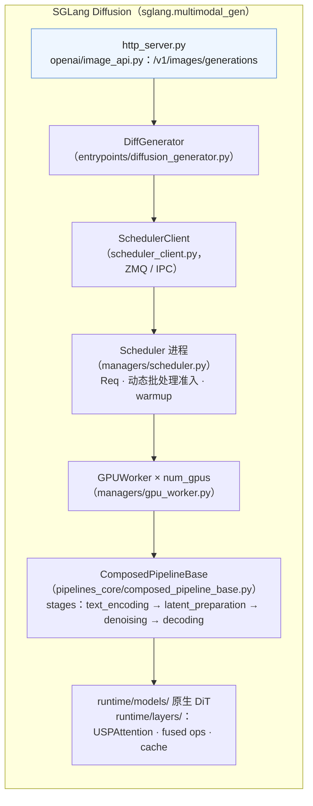
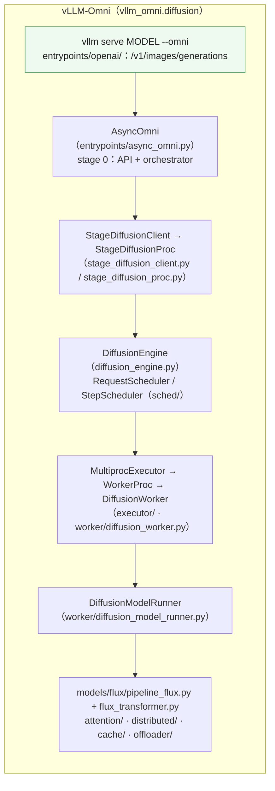
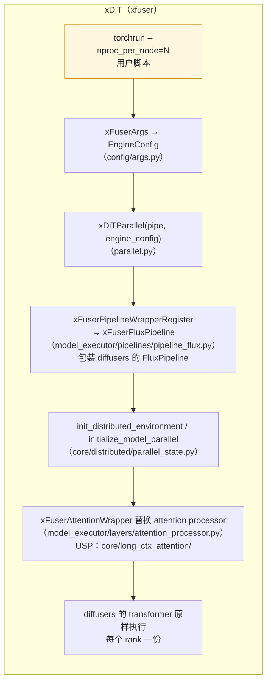

前七篇每篇末尾有一张对照表，指向三个引擎里实现同一机制的文件与类。这一篇把这些点连成线：一个"生成一张 FLUX 1024² 的图"的请求，在 SGLang Diffusion、vLLM-Omni 与 xDiT 里各自从哪里进来、经过哪些进程、哪些类、哪些函数，到哪里出去。三条线走完，三个引擎的取向就清楚了：**SGLang Diffusion 把扩散塞进了 LLM serving 的结构**（scheduler、worker、kernel 栈、warmup、CUDA graph 都复用），**vLLM-Omni 为全模态模型设计了 stage 流水线**（一个请求可以经过 LLM → DiT → TTS，扩散是其中一种 stage），**xDiT 只做并行**（把 diffusers 的 pipeline 包一层、换掉 attention、建好并行组，没有服务层）。而 **diffusers** 是三者共同的底座——模型定义、调度器、pipeline 的接口都从它来，三个引擎要么直接复用它的 pipeline、要么按它的接口重写"原生"版本。

本文只讨论**结构**——每个组件在哪、谁调谁；每个机制的原理在前七篇。版本：diffusers v0.40.0、SGLang v0.5.19（`sglang.multimodal_gen`）、vLLM-Omni v0.28.0（`vllm_omni.diffusion`）、xDiT 2026-09-02 的主线 commit `07572e7`（`xfuser`）。引用只到目录与类 / 函数名，不引行号。

本篇要回答的核心问题是：

> **一个 `/v1/images/generations` 请求从进 HTTP 到返回 base64，在三个引擎里各经过哪些函数？[^q0] 它们在进程模型、pipeline 抽象、并行组、调度上各做了什么不同的选择？[^q1] 为什么会这样选？[^q2]**

## 一、总览

### 1. 先说答案：三条路径







| 维度 | SGLang Diffusion | vLLM-Omni | xDiT |
|---|---|---|---|
| **定位** | 图像 / 视频生成的 serving 框架，SGLang 的一个子包 | 全模态（LLM + 扩散 + 语音 + 动作）serving，vLLM 的扩展 | 扩散 Transformer 的**并行推理引擎**（库），无服务层 |
| **进程模型** | HTTP server → Scheduler 进程 → GPU worker 进程组（ZMQ / IPC），与 SGLang LLM 同构 | stage 进程：stage 0（API + orchestrator）、stage N（worker），可跨 GPU / 主机；stage 内 MultiprocExecutor | `torchrun` SPMD：每个 rank 跑同一段脚本、同一个 pipeline |
| **pipeline 抽象** | 原生 `ComposedPipelineBase` = stage 列表（文本编码、latent 准备、去噪、解码…）；`--backend diffusers` 回退到 diffusers pipeline | 按模型的原生 pipeline（`models/<model>/pipeline_*.py`）+ `diffusers_adapter`；`--diffusion-load-format diffusers` 回退 | `xFuserPipelineBaseWrapper` **包装** diffusers pipeline，替换 attention 与部分层 |
| **模型定义** | `runtime/models/` 原生重写（用自己的 `layers/`） | `models/<model>/*_transformer.py` 原生重写 | 直接用 diffusers 的模型 |
| **并行** | USP（`UlyssesAttention` / `USPAttention`）、CFG 并行、TP、FSDP 推理、跨节点 SP | USP / Ring、CFG 并行、TP、HSDP、PP、VAE patch 并行 | USP、CFG 并行、PipeFusion、DP、Parallel VAE——**源头** |
| **调度 / 批处理** | `Scheduler` + `dynamic_batch_admission`（形状兼容的同构批） | `RequestScheduler` / `StepScheduler`（step 级批，兼容键） | 无（一个进程组一个请求） |
| **缓存 / 加速** | Cache-DiT、TeaCache、Spectrum、CFG gating、breakable CUDA graph、fused ops、`--quality` | TeaCache / MagCache / Cache-DiT 后端（hook）、prompt embedding 缓存、compile | TeaCache / FBCache adapter、DiTFastAttn、compile |
| **API** | OpenAI 兼容 `/v1/images`、`/v1/videos`、`/v1/meshes`、realtime | OpenAI 兼容 `/v1/images/generations`、`/v1/chat/completions` 扩展 | 无（Ray 示例） |
| **分离** | disaggregation：encoder / denoiser / decoder / server 角色 | stage-based：天然分离 | 无 |
| **自回归 / 实时** | causal DMD pipelines、KV cache、`realtime/` 会话、KV 量化 | `diffusion_kv/`（分页 KV） | `pipeline_causal_wan.py` |
| **硬件** | NVIDIA / AMD / Intel XPU / Ascend / MPS / MUSA | NVIDIA / Ascend（NPU） | NVIDIA 为主 |

### 2. 本文的章节安排

| 章 | 主题 | 内容 |
|---|---|---|
| 二 | diffusers：共同的底座 | pipeline / 模型 / 调度器 / hook 的接口；三个引擎各拿了什么 |
| 三 | SGLang Diffusion 的一条路 | 从 `image_api.py` 到 `GPUWorker` 到 stage 到 `USPAttention` |
| 四 | vLLM-Omni 的一条路 | 从 `--omni` 到 stage 进程到 `DiffusionEngine` 到 `DiffusionModelRunner` |
| 五 | xDiT 的一条路 | 从 `torchrun` 到 `xDiTParallel` 到 attention processor 替换 |
| 六 | 逐机制对照 | 并行组、attention 后端、缓存 hook、offload、量化、LoRA、warmup 在三者里的位置 |
| 七 | 分歧点 | 三种取向各来自什么、各付了什么代价；该选哪个 |
| 八 | 本文小结 | |
| 九 | 自测 | 5 道题 |

## 二、diffusers：共同的底座

### 1. 四个接口

diffusers 给扩散推理定义了四层可替换的接口，三个引擎都在这四层上工作：

| 层 | diffusers 里 | 内容 | 引擎怎么用 |
|---|---|---|---|
| **pipeline** | `pipelines/flux/pipeline_flux.py` 的 `FluxPipeline.__call__` | 编码 prompt → 准备 latent 与时间步 → 去噪循环 → VAE 解码 → 后处理 | xDiT 包装它；SGLang / vLLM-Omni 按同样的段落重写成 stage 或原生 pipeline，并保留 `--backend diffusers` 回退 |
| **模型** | `models/transformers/transformer_flux.py`（`FluxTransformer2DModel`）、`models/autoencoders/`、文本编码器来自 transformers | block 结构、attention、adaLN、RoPE | xDiT 原样用、只换 attention processor；SGLang / vLLM-Omni 用自己的 `layers/` 重写（为了 fused ops、USP、量化、CUDA graph） |
| **attention 分派** | `models/attention_dispatch.py`：`set_attention_backend("flash" / "_flash_3_hub" / "sage" / "flex" / "native" / …)` | 后端枚举与分派 | 各引擎有自己的 selector，语义相同 |
| **hook** | `hooks/`：`HookRegistry`、`ModelHook`、`StateManager`；`group_offloading.py`、`layerwise_casting.py`、`first_block_cache.py`、`taylorseer_cache.py`、`mag_cache.py`、`context_parallel.py`、`tensor_parallel.py` | 不改模型代码的 forward 拦截 | 缓存与 offload 的形态被三者沿用；xDiT 直接用 hook 接 TeaCache / FBCache |

### 2. 权重格式

Hugging Face Hub 上的 diffusers 格式 checkpoint（`transformer/`、`vae/`、`text_encoder/` 子目录 + `model_index.json`）是三个引擎的输入。SGLang 的 `runtime/loader/`（`weight_load_plan.py`、`component_loaders/`、`transformer_load_utils.py`）与 vLLM-Omni 的 `model_loader/`（`diffusers_loader.py`、`checkpoint_adapters/`、`host_weight_loader.py`）都是"读 diffusers 格式、映射到自己的模块名"——与 09 系列第四篇的"HF 名 ↔ Megatron 名"是同一类工作。原生重写模型的代价之一就是要维护这层映射（SGLang 的 add-model 指南里大半篇幅在讲它）。

## 三、SGLang Diffusion 的一条路

### 1. 进程

```text
sglang serve --model-path black-forest-labs/FLUX.1-dev --port 30010
  │
  ├─ HTTP 进程：runtime/entrypoints/http_server.py（FastAPI）
  │     └─ openai/image_api.py  @router.post("/generations")
  │           → 构造 Req（pipelines_core/schedule_batch.py：prompt、size、steps、seed、lora、cache 参数…）
  │           → DiffGenerator（entrypoints/diffusion_generator.py）.generate()
  │                 → SchedulerClient / AsyncSchedulerClient（scheduler_client.py）：ZMQ 发到 scheduler
  │
  ├─ Scheduler 进程：runtime/managers/scheduler.py  class Scheduler(SchedulerWarmupMixin, SchedulerPostTrainingMixin, SchedulerDisaggMixin)
  │     · 收 Req，dynamic_batch_admission 决定能否与队列里形状兼容的 Req 合批（--batching-max-size / --batching-config）
  │     · server_warmup.py：启动时按 --warmup-resolutions 跑 dummy 请求（编译 / CUDA graph 捕获）
  │     · 把批派给 GPU worker 组，收回 OutputBatch
  │
  └─ GPU worker 进程 × num_gpus：runtime/managers/gpu_worker.py  class GPUWorker
        · 每个 worker 持有一个 ComposedPipelineBase 实例 + 并行组的一个 rank
        · forward_context.py 传 per-step 状态（缓存决策、CFG 分支、SP 分片信息）
        · memory_managers/：component_residency（三段的 offload）、layerwise_offload、memory_occupation_controller
```

与 SGLang 的 LLM 路径（tokenizer manager → scheduler → TP worker）同构：HTTP 与调度分进程、worker 组 SPMD、ZMQ 传消息。扩散没有 tokenizer manager（文本编码在 GPU 上作为 stage），多了 warmup 与 batching 准入。

### 2. pipeline = stage 列表

`ComposedPipelineBase`（`pipelines_core/composed_pipeline_base.py`）把一次生成拆成 `pipelines_core/stages/` 里的 stage 对象顺序执行：

```text
InputValidationStage → TextEncodingStage（+ 可选 ImageEncodingStage / ConditionEncodingStage）
  → TimestepPreparationStage → LatentPreparationStage
  → DenoisingStage（或 DenoisingDMDStage / CausalDenoisingStage）
  → DecodingStage → 后处理
```

`runtime/pipelines/flux.py` 就是"FLUX 用哪些 stage、每个 stage 用哪个模块"的声明；`comfyui_*_pipeline.py` 是接 ComfyUI 格式 checkpoint 的变体；`diffusers_pipeline.py` 是 `--backend diffusers` 的回退——把整个 diffusers pipeline 当一个 stage。`pipelines_core/executors/`（`sync_executor`、`parallel_executor`、`pipeline_executor`）决定 stage 怎样在 worker 上执行；disaggregation 模式下 stage 按 `RoleType`（encoder / denoiser / decoder）落到不同的 worker 组，`disaggregation/transport/` 传中间张量。

DenoisingStage 里的循环：每步 → 取 CFG 分支（`distributed/cfg_policy.py`）→ 缓存决策（`cache/teacache.py` 的 `TeaCacheMixin` 或 `cache_dit_integration.py`）→ 调 `runtime/models/` 里的原生 DiT forward → 采样器（`pipelines_core/diffusion_scheduler_utils.py`）。

### 3. 模型与层

`runtime/models/` 是原生重写的 DiT（FLUX、Wan、Qwen-Image…），用 `runtime/layers/` 的部件：`attention/layer.py` 的 `UlyssesAttention` / `USPAttention` / `LocalAttention`（后端由 `attention/selector.py` 按 `--attention-backend` 选，`attention/backends/` 是 FA / SDPA / Sage / STA / VSA 的实现）、`fused_scale_shift_gate.py`（adaLN 融合）、`rotary_embedding/`、`layernorm.py`、`linear.py`（含量化）、`lora/`、`kvcache/`（因果模型）。并行组在 `distributed/parallel_state.py` / `group_coordinator.py` / `parallel_groups.py`（SP 组、CFG 组、TP 组），`usp.py` 与 `sp_shard_utils.py` 负责按 token 切分与 all-to-all 重排。`breakable_cuda_graph/runner.py` 把 DiT 前向分段捕获。

### 4. 出口

DecodingStage 调 VAE（tiling 配置来自 `--vae-config`），`postprocess/` 编码成 PNG / MP4，`OutputBatch` 回 scheduler → HTTP → `openai/storage.py` 存文件或直接 b64 返回。`/v1/videos` 的 job 状态在 `openai/stores.py`。

## 四、vLLM-Omni 的一条路

### 1. 进程：stage

```text
vllm serve black-forest-labs/FLUX.1-dev --omni --port 8091
  │
  ├─ stage 0 进程：entrypoints/openai/（FastAPI，/v1/images/generations、/v1/chat/completions 扩展）
  │     → AsyncOmni（entrypoints/async_omni.py，实现 vLLM 的 EngineClient 接口）
  │     → 按 vllm_omni/deploy/<model>.yaml 的 stage 配置编排：扩散模型通常只有一个 diffusion stage
  │     → StageDiffusionClient（diffusion/stage_diffusion_client.py）把请求发给 diffusion stage
  │
  └─ diffusion stage 进程：StageDiffusionProc（diffusion/stage_diffusion_proc.py）
        · 可用 --stage-overrides 指定 GPU 甚至主机（stage-based CLI：每个 stage 单独启动，--omni-master-addr 汇合）
        · 持有一个 DiffusionEngine（diffusion/diffusion_engine.py）
              · RequestScheduler / StepScheduler（sched/）：请求级或 step 级的批，兼容键 StepBatchSamplingParamsKey
              · MultiprocExecutor（executor/multiproc_executor.py）→ WorkerProc × N（worker/diffusion_worker.py）
                    · DiffusionWorker → DiffusionModelRunner（worker/diffusion_model_runner.py）
                          · 持有原生 pipeline（models/flux/pipeline_flux.py）与 transformer（flux_transformer.py）
                          · 并行组：distributed/parallel_state.py（USP / Ring / CFG / TP / HSDP / PP / VAE patch）
                          · 缓存：cache/selector.py 选 teacache / magcache / cachedit 后端，包成 CachedTransformer
                          · offload：offloader/（sequential / layerwise / distributed layerwise）
                          · 因果模型：diffusion_kv/（KV manager、PagedAttention 适配）
```

stage 是 vLLM-Omni 的核心抽象：一个全模态请求（比如 Qwen3-Omni：文本 + 图 → LLM → 语音）经过多个 stage，每个 stage 是一个独立的引擎（AR 的用 vLLM 本体，扩散的用 `DiffusionEngine`），stage 间用 OmniConnector 传张量、可以放在不同的 GPU 上独立扩缩。对纯扩散模型这套结构看起来"过重"（只有一个 stage），但它让第七篇的三段分离几乎免费：把文本编码器或 VAE 做成另一个 stage 就是加一段 yaml。

### 2. 引擎

`DiffusionEngine` 与 vLLM 的 `EngineCore` 同构：一个调度循环，每轮从 `RequestScheduler`（请求级）或 `StepScheduler`（step 级——把不同请求的同一步拼批，`_StepProgress` 跟踪每个请求走到第几步）取一批，交给 executor 执行一步或整个请求，收回 `RunnerOutput` / `BatchRunnerOutput`（`worker/utils.py`）。`DiffusionExecutionMode` 决定同步 / 异步。`sched/sigma_schedule.py` 的 `DMD2SigmaSchedule` 是少步蒸馏模型的时间步表。

### 3. 模型

`models/<model>/` 每个模型一个目录：`pipeline_*.py`（生成流程）、`*_transformer.py`（原生 DiT，用 `diffusion/layers/` 与 `attention/`）、`*_mixin.py`（并行与缓存的模型特定钩子）。`models/diffusers_adapter/` 是通用回退（`--diffusion-load-format diffusers`）。`models/dmd2/` 是少步蒸馏模型的共享逻辑。`quantization/`、`lora/`（`manager.py`、`loader.py`、`layers/`）、`host_weight_runtime/`（权重留在主机内存、按需上卡）挂在模型加载路径上。

### 4. 出口

`DiffusionModelRunner` 的输出经 `postprocess/` 与 `output_formatter.py`（`io_support.py` 处理图 / 视频编码）回到 stage 0，OpenAI 层按 `response_format` 返回 b64 或文件。

## 五、xDiT 的一条路

### 1. 进程：torchrun

```text
torchrun --nproc_per_node=8 examples/flux_example.py --model FLUX.1-dev --ulysses_degree 4 --pipefusion_parallel_degree 2 --height 1024 --width 1024 --num_inference_steps 28
  │  8 个 rank 各跑一遍脚本：
  ├─ xFuserArgs.from_cli_args → EngineConfig（config/args.py、config/config.py）
  │     · ParallelConfig：dp / cfg / ulysses / ring / pipefusion 度数 + num_pipeline_patch；RuntimeConfig：compile、parallel_vae、cache
  ├─ pipe = FluxPipeline.from_pretrained(...)             ← diffusers 原生 pipeline
  ├─ xDiTParallel(pipe, engine_config, input_config)     （parallel.py）
  │     · xFuserPipelineWrapperRegister.get_class(pipe) → xFuserFluxPipeline（model_executor/pipelines/pipeline_flux.py）
  │     · 包装：xFuserPipelineBaseWrapper.__init__（model_executor/pipelines/base_pipeline.py）
  │           · init_distributed_environment / initialize_model_parallel（core/distributed/parallel_state.py）建 dp / cfg / sp / pp 组
  │           · 把 transformer 的每个 attention 的 processor 换成 xFuserAttentionWrapper / xFuserJointAttnProcessor2_0（model_executor/layers/attention_processor.py）
  │           · USP 的 attention 实现在 core/long_ctx_attention/（ring / hybrid）；PipeFusion 的 patch 循环在 pipeline wrapper 里
  │           · use_parallel_vae → xFuserVAEWrapper
  │           · prepare_run(input_config)：按形状做一次 warmup（含 compile）
  ├─ xDiTParallel(prompt=...)  → 每个 rank 跑 pipeline，attention 处发生 all-to-all / P2P
  └─ save()：is_dp_last_group() 的 rank 存图
```

没有服务层、没有调度器：一个进程组就是一个请求（或 DP 度数个请求）。要做服务，用 `xfuser/ray/` 的 Ray 示例或自己包一层。

### 2. 包装而不是重写

xDiT 的核心设计是**包装 diffusers**：模型定义、pipeline 流程、调度器都原样用，只在两处介入——（1）替换 attention processor：diffusers 的 `Attention` 模块允许注入 processor，xDiT 的 processor 在调 attention 之前做 USP 的 all-to-all（或 Ring）、在 PipeFusion 模式下用 stale K / V；（2）pipeline wrapper 重写去噪循环：CFG 并行的分支分派、PipeFusion 的 patch 流水线、Parallel VAE 的切分。`model_executor/layers/` 里另有 `usp.py`、`fp8_linear.py`、`mxfp4_linear.py`、`fused_qk_rope_*` 等可选替换层，`core/cache_manager/` 是 PipeFusion 的 stale 激活缓存，`model_executor/cache/` 接 TeaCache / FBCache。

好处：新模型只要 diffusers 有 pipeline，写一个 wrapper 就能并行；代价：diffusers 的 eager 实现本身不快（第二篇：MFU 0.31），xDiT 的绝对性能依赖 `torch.compile`，且 diffusers 的接口变化会打断 wrapper（`compat.py` 的存在就是为此）。

## 六、逐机制对照

前七篇末尾各表的汇总，按请求路径的顺序：

| 环节 | SGLang Diffusion | vLLM-Omni | xDiT | 备注 |
|---|---|---|---|---|
| **入口** | `openai/image_api.py`、`video_api.py`、`realtime/` | `entrypoints/openai/`；`AsyncOmni` | 用户脚本 / `xfuser/ray/` | |
| **请求对象** | `pipelines_core/schedule_batch.py` 的 `Req` / `OutputBatch` | `diffusion/request.py`；`sched/interface.py` 的 `NewRequestData` / `CachedRequestData` | `InputConfig` | |
| **调度与合批** | `managers/scheduler.py` + `dynamic_batch_admission.py` | `sched/request_scheduler.py` / `step_scheduler.py`；`StepBatchSamplingParamsKey` | — | 都是同构批 |
| **进程 / 执行器** | `GPUWorker` 进程组，ZMQ | `MultiprocExecutor` → `WorkerProc` → `DiffusionWorker` | torchrun rank | |
| **并行组** | `distributed/parallel_state.py`、`group_coordinator.py`、`parallel_groups.py` | `distributed/parallel_state.py`、`group_coordinator.py`、`sp_plan.py` | `core/distributed/parallel_state.py`、`group_coordinator.py`、`runtime_state.py` | 三者的 `GroupCoordinator` 都从 vLLM 的 `GroupCoordinator` 演化 |
| **序列并行** | `layers/attention/layer.py`：`UlyssesAttention`、`USPAttention`；`layers/usp.py`、`distributed/sp_shard_utils.py` | `distributed/a2a_permute.py`、`sp_sharding.py`；`hooks/sequence_parallel.py`；`attention/parallel/` | `core/long_ctx_attention/{ring,hybrid}/`；`model_executor/layers/usp.py` | |
| **CFG 并行** | `distributed/cfg_parallel_utils.py`、`cfg_policy.py` | `distributed/cfg_parallel.py` | pipeline wrapper 内 | |
| **PipeFusion** | — | `distributed/pipeline_parallel.py`（PP） | `core/cache_manager/` + pipeline wrapper | xDiT 独有 |
| **TP / FSDP** | `--tp-size`；`loader/fsdp_load.py` | `--tensor-parallel-size`；`distributed/hsdp.py` | — | |
| **attention 后端** | `layers/attention/selector.py`、`backends/` | `attention/selector.py`、`backends/`、`ops/` | `core/distributed/attention_backend.py`；`core/fast_attention/`、`sparge_attention/`、`vsa_attention.py` | |
| **跨步缓存** | `runtime/cache/teacache.py`、`cache_dit_integration.py`、`spectrum.py` | `cache/base.py`（`CacheBackend`、`CachedTransformer`）、`teacache/`、`magcache/`、`cachedit/`、`selector.py` | `core/cache_manager/`、`model_executor/cache/adapters/` | |
| **offload** | `managers/memory_managers/`：`component_residency*.py`、`layerwise_offload*.py`、`host_memory_budget.py` | `offloader/`：`sequential_backend.py`、`layerwise_backend.py`、`distributed_layerwise_backend.py`、`module_residency.py` | 沿用 diffusers | |
| **编译 / CUDA graph** | `--enable-torch-compile`；`breakable_cuda_graph/runner.py` | `compile.py`；worker 内 CUDA graph | `xfuser/compile/` | |
| **量化** | `layers/quantization/`；`--enable-svdquant`；ModelOpt checkpoint；GGUF（`loader/gguf_weights.py`） | `quantization/`（含 `hsdp_fp8.py`）；`--quantization` | `layers/fp8_linear.py`、`mxfp4_linear.py`；`core/distributed/fp4_quantize.py` | |
| **LoRA** | `pipelines_core/lora/`、`layers/lora/` | `lora/manager.py`、`loader.py`、`layers/` | diffusers 的 `load_lora_weights` | |
| **VAE** | `stages/decoding.py`；`--vae-config`；parallel decode | `distributed/vae_patch_parallel.py`、`distributed/autoencoders/`；`--vae-use-tiling` | `xFuserVAEWrapper`（Parallel VAE） | |
| **warmup** | `server_warmup.py`、`warmup_request_builder.py`；`--warmup-mode`、`--warmup-resolutions` | — | `prepare_run` | |
| **分离** | `disaggregation/`：`roles.py`、`orchestrator.py`、`dispatch_policy.py`、`transport/` | stage 本身 | — | |
| **因果 / KV** | `layers/kvcache/`、`stages/causal_denoising.py`、`realtime/` | `diffusion_kv/`（`manager.py`、`paged_attention_adapter.py`）；调度器的 `KVPrefetchJob` | `pipeline_causal_wan.py` | |
| **权重加载** | `loader/`：`weight_load_plan.py`、`component_loaders/`、`weight_readers/`、`rank_local_checkpoint.py` | `model_loader/`：`diffusers_loader.py`、`checkpoint_adapters/`、`host_weight_loader.py`、`hub_prefetch.py` | diffusers `from_pretrained` | |
| **profiling** | `profiler.py`、`benchmarks/`（`--perf-dump-path`） | `profiler/`；`--log-stats`、pipeline profiler | benchmark 脚本 | |

## 七、分歧点

### 1. 三种取向来自三种出发点

| | SGLang Diffusion | vLLM-Omni | xDiT |
|---|---|---|---|
| **出发点** | 把 SGLang 成熟的 serving 结构（scheduler、worker、kernel、warmup、CUDA graph、多平台）复用到扩散上 | 服务全模态模型：一个请求经过多种模型，需要 stage 流水线；扩散是必须支持的一种 stage | 研究并行方法（USP、PipeFusion）并给出参考实现 |
| **模型来源** | 原生重写（为了 fused ops、量化、CUDA graph、多平台） | 原生重写（为了与 vLLM 的 worker / KV / 量化栈一致） | 直接用 diffusers |
| **支持新模型的成本** | 高：重写模型 + 权重映射 + stage 声明（有 add-model 指南与 diffusers 回退） | 高：同上（有 add-diffusion-model 指南与 adapter 回退） | 低：写一个 pipeline wrapper |
| **单卡性能** | 高（fused ops、`--quality high`、BCG） | 高 | 依赖 diffusers + compile |
| **多卡** | USP / CFG / TP / FSDP，跨节点 | USP / Ring / CFG / TP / HSDP / PP / VAE patch | 最全：+ PipeFusion、Parallel VAE，弱互联 |
| **serving** | 完整：API、批处理、warmup、分离、job、realtime | 完整：API、stage 分离、批处理 | 无 |
| **分离** | 角色制 disaggregation | stage 制，天然 | — |
| **付出的代价** | 与 SGLang 主线耦合（版本、依赖）；模型覆盖靠社区重写 | stage 结构对纯扩散模型偏重；模型覆盖同样靠重写 | 无服务层；绝对性能受 diffusers 限制；接口易碎 |

### 2. 三个共同点

- **并行组的写法趋同**：三者的 `parallel_state.py` / `GroupCoordinator` 几乎可以互换——都是 vLLM 那套"按维度建 NCCL 组、rank 映射、collective 封装"的写法。序列并行的实现也趋同（Ulysses 的 all-to-all + FlashAttention、Ring 的 P2P 环），xDiT 的 USP 论文与实现是共同来源。
- **缓存与 offload 都是 hook**：不改模型 forward，包一层——diffusers 的 `hooks/` 定义的形态。
- **同构批**：没有一个引擎做 LLM 式的连续批处理；有调度器的两个都是"形状兼容才合批、整批开始整批结束"。这是负载性质决定的（第七篇）。

### 3. 该选哪个

| 场景 | 选择 |
|---|---|
| 对外的图像 / 视频生成服务，NVIDIA 单节点或多节点 | SGLang Diffusion 或 vLLM-Omni；两者的模型覆盖与性能互有胜负，按目标模型是否有原生实现选 |
| 全模态服务（LLM + 生成 + 语音在一个请求里） | vLLM-Omni（stage 流水线为此设计） |
| 已有 vLLM 基础设施、想复用运维 | vLLM-Omni |
| 已有 SGLang 基础设施；AMD / Ascend / Apple 等非 NVIDIA 平台 | SGLang Diffusion |
| 新模型 diffusers 刚出、两个引擎还没原生支持 | 两者的 diffusers 回退（性能打折）或 xDiT 包装 |
| PCIe / 以太网集群上的多卡 | xDiT（PipeFusion）或等 SGLang / vLLM-Omni 的 PP |
| 研究并行方法 / 做 benchmark | xDiT |
| 只是单卡跑图 | diffusers 本身 + compile + hook 缓存 |

## 八、本文小结

| 项 | SGLang Diffusion | vLLM-Omni | xDiT |
|---|---|---|---|
| 一句话 | 扩散进 LLM serving 的结构 | 扩散作为全模态流水线的一个 stage | diffusers 之上的并行包装 |
| 路径 | `image_api` → `DiffGenerator` → `SchedulerClient` → `Scheduler` → `GPUWorker` → `ComposedPipelineBase` 的 stage → `runtime/models` + `layers/attention/USPAttention` | `AsyncOmni` → `StageDiffusionClient` → `StageDiffusionProc` → `DiffusionEngine` + `Step/RequestScheduler` → `MultiprocExecutor` → `DiffusionWorker` → `DiffusionModelRunner` → `models/flux` | `xFuserArgs` → `xDiTParallel` → `xFuserFluxPipeline` 包装 → `initialize_model_parallel` → attention processor 替换 → diffusers transformer |
| 进程 | HTTP / scheduler / worker 组 | stage 进程 + 执行器 | torchrun SPMD |
| 模型 | 原生重写 | 原生重写 | diffusers 原样 |
| 独有 | 动态批处理准入、breakable CUDA graph、`--quality`、realtime 会话、KV 量化、多平台 | stage 分离、HSDP、VAE patch 并行、分页 diffusion KV | PipeFusion、Parallel VAE、弱互联 |
| 共有 | USP / CFG 并行、hook 式缓存与 offload、同构批、vLLM 式并行组、diffusers 权重格式 | | |

### 下一篇

最后一篇把前八篇变成决策与运维：给定模型、分辨率、步数、GPU 与 SLO，按什么顺序推出配置；性能与质量各怎么评；确定性从哪里丢；常见故障（VAE OOM、FP8 NaN、缓存伪影、重编译风暴、SP hang）各先查什么；以及系列总结。

## 九、自测

1. 一个新的 DiT 模型刚在 diffusers 里合入 pipeline，三个引擎里哪个能最快跑起多卡并行？为什么？代价是什么？

   <details markdown="1">
   <summary>答案</summary>
   xDiT：它包装 diffusers pipeline、只替换 attention processor 与去噪循环，写一个 `xFuserXxxPipeline` wrapper 即可获得 USP / CFG / PipeFusion；SGLang 与 vLLM-Omni 要原生重写模型（`runtime/models/` / `models/<model>/`）加权重映射，或走性能打折的 diffusers 回退。代价：xDiT 的单卡性能受 diffusers eager 实现限制、没有服务层。详见[第五章](#五xdit-的一条路)、[第七章](#七分歧点)。
   </details>

2. SGLang Diffusion 与 vLLM-Omni 都有调度器，为什么没有一个做 LLM 式的连续批处理（请求随时进出 batch）？它们的批在什么条件下形成？

   <details markdown="1">
   <summary>答案</summary>
   扩散每步是整段序列的完整前向，batch 里的请求必须每步形状与执行策略相同才能拼成一个张量；且 compute-bound 下 batch 不提吞吐，动态进出的收益为零。所以两者都是同构批：SGLang 的 `dynamic_batch_admission` 与 vLLM-Omni 的 `StepBatchSamplingParamsKey` 要求 height / width / frames / CFG / quality / LoRA 等全同，整批开始整批结束（vLLM-Omni 的 StepScheduler 可把不同请求的同一步拼批，但仍要求形状相同）。详见[第六章](#六逐机制对照)、[第七章](#七分歧点)。
   </details>

3. vLLM-Omni 对一个纯扩散模型也用 stage 结构（stage 0 + 一个 diffusion stage），看起来多了一层。这层在什么时候变成优势？

   <details markdown="1">
   <summary>答案</summary>
   （1）第七篇的三段分离：把文本编码器或 VAE 做成独立 stage 只是改 `deploy/` 的 yaml，stage 间用 OmniConnector 传 embedding / latent，可以放到不同 GPU / 主机独立扩缩；（2）全模态请求：LLM → DiT → TTS 串成一条流水线，每个 stage 用各自的引擎（AR 用 vLLM 本体，扩散用 DiffusionEngine）。纯单模型单卡时它确实只是开销。详见[第四章](#四vllm-omni-的一条路)、[第七章](#七分歧点)。
   </details>

4. 三个引擎的序列并行实现为什么高度相似？相似的部分具体是哪几块？

   <details markdown="1">
   <summary>答案</summary>
   共同来源：xDiT 的 USP 论文与实现（Ulysses all-to-all 换 head + Ring P2P 传 K/V 的二维组合），以及 vLLM 的 `GroupCoordinator` / `parallel_state` 写法（按维度建 NCCL 组、rank 映射、collective 封装）。相似的块：`parallel_state.py` + `group_coordinator.py`（三者几乎同名同构）、按 token 切分与 all-to-all 重排（SGLang `usp.py` / `sp_shard_utils.py`，vLLM-Omni `a2a_permute.py` / `sp_sharding.py`，xDiT `long_ctx_attention/`）、attention 层的 USP 包装。详见[第六章](#六逐机制对照)、[第七章](#七分歧点)。
   </details>

5. 你要在两台以太网互联的 8×L40 上部署 FLUX 服务。三个引擎各能提供什么、缺什么？

   <details markdown="1">
   <summary>答案</summary>
   以太网跨节点只有 PipeFusion 可行（第五篇）。xDiT 有 PipeFusion + Ulysses 的混合并行，但没有服务层（要自己包 API、队列、job）。SGLang Diffusion 有完整服务层与跨节点 SP（Ring），但没有 PipeFusion——跨节点 Ring 在以太网上每步 1.6 GB 不可行，只能节点内 8 卡 USP、两节点各自独立成实例（DP）。vLLM-Omni 有 PP（`pipeline_parallel.py`）与服务层，PP 是否达到 PipeFusion 的 patch 流水线效果要实测。实际最常见的选择：放弃跨节点切请求，两节点各 8 卡 USP 独立服务，吞吐反而更高（第五篇：DP 是吞吐最优）。详见[第七章](#七分歧点)。
   </details>

## 下一篇

[配置、评测与排障：从一张卡的推导到一条伪影的排查（附系列总结）](/diffusion-inference-configuration-evaluation-and-troubleshooting.html)

[^q0]: SGLang Diffusion：`openai/image_api.py` 的 `/generations` 路由构造 `Req` → `DiffGenerator.generate` → `SchedulerClient`（ZMQ）→ `Scheduler`（合批准入、warmup）→ `GPUWorker` 组 → `ComposedPipelineBase` 顺序执行 `TextEncodingStage` / `LatentPreparationStage` / `DenoisingStage`（每步经 CFG policy、缓存决策、`runtime/models` 的原生 DiT、`USPAttention`）/ `DecodingStage` → `postprocess` → `OutputBatch` 回 HTTP → b64 或 `storage.py`。vLLM-Omni：OpenAI 层 → `AsyncOmni` → `StageDiffusionClient` → `StageDiffusionProc` → `DiffusionEngine`（`RequestScheduler` / `StepScheduler`）→ `MultiprocExecutor` → `WorkerProc` / `DiffusionWorker` → `DiffusionModelRunner` → `models/flux/pipeline_flux.py` + `flux_transformer.py`（并行组、`CachedTransformer`、offloader）→ `output_formatter` → stage 0 返回。xDiT：无 HTTP；`torchrun` 每个 rank 跑脚本 → `xFuserArgs` → `xDiTParallel` → `xFuserFluxPipeline` 包装 diffusers 的 `FluxPipeline`（`initialize_model_parallel`、替换 attention processor 为 `xFuserJointAttnProcessor2_0`、`prepare_run` warmup）→ 调用 → `save`。详见[第三章](#三sglang-diffusion-的一条路)、[第四章](#四vllm-omni-的一条路)、[第五章](#五xdit-的一条路)。

[^q1]: 进程模型：SGLang 是 HTTP / scheduler / GPU worker 组三类进程（与 SGLang LLM 同构），vLLM-Omni 是 stage 进程（stage 0 API + orchestrator，diffusion stage 内再有执行器与 worker，stage 可跨 GPU / 主机），xDiT 是 torchrun 的 SPMD rank。pipeline 抽象：SGLang 的 `ComposedPipelineBase` = stage 列表 + 原生模型（diffusers 回退），vLLM-Omni 的 `models/<model>/pipeline_*.py` 原生 pipeline（diffusers adapter 回退），xDiT 包装 diffusers pipeline 只换 attention processor 与去噪循环。并行组：三者的 `parallel_state` / `GroupCoordinator` 同源，xDiT 多 PipeFusion 与 Parallel VAE，vLLM-Omni 多 HSDP / PP / VAE patch，SGLang 多 FSDP 推理与跨节点 SP。调度：SGLang `Scheduler` + `dynamic_batch_admission`，vLLM-Omni `RequestScheduler` / `StepScheduler` + 兼容键，xDiT 无——两个有调度器的都是同构静态批。详见[第一章](#一总览)、[第六章](#六逐机制对照)。

[^q2]: 出发点不同：SGLang 想把已有的 serving 结构（scheduler、kernel 栈、warmup、CUDA graph、多平台）复用到新负载上，所以原生重写模型以接入自己的 layers；vLLM-Omni 要服务全模态模型（一个请求经过 LLM、DiT、TTS 多种模型），stage 流水线是必需的抽象，扩散只是一种 stage，原生重写是为了与 vLLM 的 worker / 量化 / KV 栈一致；xDiT 的目标是研究并验证并行方法（USP、PipeFusion），包装 diffusers 让它以最低成本覆盖最多模型、专注并行本身。代价对应：SGLang / vLLM-Omni 支持新模型成本高（重写 + 权重映射），xDiT 没有服务层且性能受 diffusers 限制。详见[第七章](#七分歧点)。
