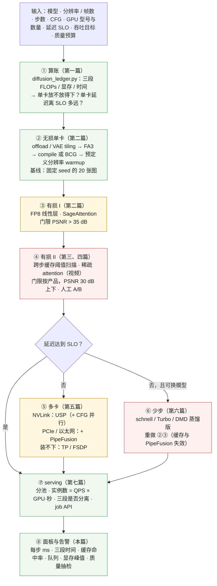

前八篇给出了机制与它们在账上的位置。最后一篇把它们变成两件日常工作：**上线前**——给定模型、分辨率、步数、GPU 与 SLO，按什么顺序推出配置，怎样证明每一项优化的性能收益是真的、质量代价是可接受的；**上线后**——看什么指标，p99 抬升、图片出伪影、半夜 OOM 各先查什么。

扩散推理的评测有一个 LLM serving 没有的维度：**多数优化是有损的**（第二篇的 FP8 / INT4 / 8-bit attention、第三篇的跨步缓存、第四篇的稀疏 attention、第六篇的少步），而"损了多少"没有困惑度那样的单一数字——要对基线图算 PSNR / LPIPS、要在 prompt 集上算 ImageReward / GenEval、要人看。所以配置推导的每一步都带着一个质量预算，评测方法是配置方法的一半。

本篇要回答的核心问题是：

> **一个 FLUX 服务上线后 p99 抬升 / 图片出现伪影 / 半夜 OOM，各先查什么？[^q0] 开训前该采集哪些信号才能十分钟内定位？[^q1] 给定模型、GPU 与 SLO，配置该按什么顺序推？[^q2]**

## 一、总览

### 1. 先说答案：推导顺序与信号清单



三条原则：

- **无损在有损之前，有损按可见度排序**：每一步对着固定 seed 的基线图测，PSNR 不达门限就停在上一步。
- **延迟不够先切卡、再换模型**：多卡不改图（SP 是无损的，除了 reduce 顺序的漂移），换少步模型改风格与多样性。
- **实例数由 GPU·秒决定**：单卡优化的每一项直接乘进卡数；多卡 SP 不减卡数。

### 2. 本文的章节安排

| 章 | 主题 | 内容 |
|---|---|---|
| 二 | 配置推导 | 八步各要什么输入、给什么输出；三个算例（FLUX 服务、Wan 服务、24 GB 卡） |
| 三 | 性能评测 | 排除 warmup；步级计时；三段分开；ABBA；吞吐与延迟分开报；GPU 利用率的陷阱 |
| 四 | 质量评测 | 对基线图的度量；prompt 集上的度量；视频的度量；人工 A/B；阈值扫描曲线；FID 为什么不够 |
| 五 | 确定性 | 从哪里丢：seed、算子、并行度、编译、缓存、批 |
| 六 | 常见故障 | 十类：信号、原因、排查路径 |
| 七 | 可观测 | 面板上放什么、哪些告警 |
| 八 | 系列总结 | 九篇的账与一张总表 |
| 九 | 自测 | 5 道题 |

## 二、配置推导

### 1. 八步

| 步 | 输入 | 做什么 | 输出 |
|---|---|---|---|
| ① 算账 | 模型规格、形状、步数、CFG、GPU | `diffusion_ledger.py`；对照 xDiT / SGLang 的公开实测校准 $$\eta$$ | 三段权重与峰值是否放得下；单卡每步 ms、总秒；attention 占比（决定第④步的重点） |
| ② 无损单卡 | ① 的结果 | 放不下 → 三段 offload / 视频逐层 offload；VAE tiling；FA3；`torch.compile` 或 breakable CUDA graph；`--warmup-resolutions` 列出全部服务形状 | **基线**：固定 20 个 prompt × seed 的图、每步 ms、峰值显存 |
| ③ 有损 I | 基线 | FP8 线性层（Hopper）；SageAttention；对基线测 PSNR / SSIM / LPIPS | 门限 PSNR > 35 dB 通过则采用 |
| ④ 有损 II | ③ 的结果、质量预算 | 图像：跨步缓存阈值扫描；视频：稀疏 attention 后端 + 缓存；每档测 PSNR 分布 p10 与人工 A/B 通过率 | 质量预算内最大加速的档位；**蒸馏模型跳过缓存** |
| ⑤ 多卡 | 延迟 SLO、互联 | NVLink：USP $$p$$ 与 CFG 2 × USP $$p/2$$ 实测；PCIe / 以太网：Ulysses × PipeFusion；装不下：TP / FSDP；视频加 VAE patch 并行 | 并行度与每步 ms；SP 度整除 head 数与 $$N$$ |
| ⑥ 少步 | 允许换模型 | schnell / Turbo / DMD 版；重做 ②③（缓存与 PipeFusion 失效、CUDA graph 变必需、VAE 占比升） | 新基线 |
| ⑦ serving | QPS、SLO、形状分布 | 按形状分池；每池实例数 = QPS × GPU·秒 × 余量；三段是否分离（视频分 VAE）；同步 / job API；LoRA 策略 | 部署拓扑 |
| ⑧ 面板 | — | 第七章的指标与告警；质量抽检 | 值班手册 |

### 2. 算例一：FLUX.1-dev 1024² 图像服务，8×H100 一台，SLO p99 3 s，100 QPS

① 单卡放得下（31.5 GiB），eager 6.7 s。② compile + FA3 → 3.9 s，基线。③ FP8 → 2.9 s，PSNR 36 dB，采用。④ TeaCache 扫 0.2 / 0.3 / 0.4：0.3 时 1.6×、PSNR p10 31 dB、A/B 通过 → 1.8 s。⑤ 单卡 1.8 s 在 SLO 内（排队另算），不切卡——DP 8。⑦ 实例数 = 100 × 1.8 × 1.3（余量）≈ 230 张卡，即 29 台；按形状分池（1024² 主池、其余形状小池）；同步 API；LoRA 按请求 unmerged。⑧ 面板。若 SLO 是 1 s：⑤ USP 4 → 0.7 s，但卡数不变（GPU·秒不变），或 ⑥ 换 schnell 0.8 s、卡数降到 100 × 0.8 × 1.3 ≈ 105。

### 3. 算例二：Wan2.1-14B 720p 5 秒视频服务，8×H100 若干台，SLO 2 分钟

① 单卡 24 分钟、激活 14 GiB，attention 72%。② 逐层 offload（免费）、FA3 → 17 分钟。③ FP8 只作用 28% → 15 分钟；SageAttention → 10 分钟。④ STA / SVG 稀疏 80% → 6.6 分钟；TeaCache 视频档 → 4 分钟。⑤ 8 卡 CFG 2 × Ulysses 4 vs Ulysses 8 实测，取快者 → 约 40 s；VAE patch 并行 8。⑦ 每台一个实例，实例数 = QPS × 320 GPU·秒 / 8；异步 `/v1/videos`；VAE 分 stage 或 patch 并行。若允许 ⑥：FastWan（VSA + DMD 3 步）→ 单卡几十秒，改为 DP。

### 4. 算例三：一张 RTX 4090 跑 FLUX.1-dev

① 放不下（31.5 > 24），eager 需 offload 约 40 s。② 模型级 offload + VAE tiling → 跑起来；compile → 33 s。③ 4090 无 FP8 优势（Ada 有 FP8 Tensor Core，但 SGLang / diffusers 的 FP8 路径主要针对 Hopper），跳过。④ SVDQuant INT4（Nunchaku）→ 6.5 GiB 常驻、约 12 s、PSNR 30 dB；TeaCache 0.4 → 7 s。⑥ schnell + INT4 → 2 s。

## 三、性能评测

### 1. 规则

| 规则 | 原因 | 做法 |
|---|---|---|
| **排除 warmup** | 第一次请求含编译（1–3 分钟）、CUDA graph 捕获、cuDNN 自动调优、allocator 增长 | 先跑 2–3 个同形状请求再计时；SGLang 的 `--warmup-mode request`，看日志里 "(with warmup excluded)" |
| **步级计时** | 端到端里混着文本编码、VAE、IO；优化多数作用在步上 | `torch.cuda.Event` 夹每步的 transformer forward；报"每步 ms"与"总秒"两个数 |
| **三段分开** | 少步模型上 VAE 占 15%，优化对象不同 | 分别计时 text / denoise / decode（vLLM-Omni 的 `--log-stats` 与 pipeline profiler、SGLang 的 `--perf-dump-path` 都给分段） |
| **同一形状** | 不同分辨率的 $$N$$ 不同，不可比 | 固定 $$H, W, F, T, g$$、prompt 长度（T5 pad 到 512 时无关；不 pad 的模型有关） |
| **ABBA 交替** | GPU 频率、温度、其他进程的漂移 | 基线 / 候选 / 候选 / 基线交替各 ≥ 3 次，取中位数 |
| **吞吐与延迟分开报** | batch 与 SP 对两者的影响相反 | 吞吐用并发压测（张/s/卡），延迟用单请求 p50 / p99 |
| **同一后端** | `--backend diffusers` 回退时的数字不代表原生性能 | 确认日志没有 "Falling back to diffusers" |
| **profiler 只做诊断** | torch.profiler 有开销、扭曲时间 | 基线不开 profiler；定位瓶颈时对 1–2 个请求开，operator / shape 与 host stack 两种 trace 分开采 |

### 2. GPU 利用率的陷阱

`nvidia-smi` 的 GPU-Util 是"有 kernel 在跑的时间比例"，eager 下几百个小 kernel 也能把它打到 95%——**它不度量 MFU**。看 MFU 要用账：每步 FLOPs / (每步秒 × 峰值)。FLUX eager 的 GPU-Util 接近 100%、MFU 0.31；compile 后 GPU-Util 差不多、MFU 0.49。同样，SP 多卡下每卡 GPU-Util 高不代表没有在等 all-to-all——NCCL kernel 也算"在跑"。诊断用 profiler 里的 kernel 分类（GEMM / attention / NCCL / 其他）与 GPU idle gap。

### 3. 报告的最小格式

```text
模型 · 形状 · 步数 · CFG · 引擎与版本 · 后端 · 并行度 · 精度 · 缓存参数 · GPU 型号与数量 · 驱动 / CUDA
每步 ms（中位数，n=…）· 三段 ms · 端到端 s · 峰值显存 GiB · 吞吐 张/s/卡（并发 k）
对基线：PSNR / SSIM / LPIPS（20 张，p50 / p10）· 抽检图链接
```

## 四、质量评测

### 1. 三个层次

| 层次 | 问什么 | 度量 | 用在 |
|---|---|---|---|
| **对基线图** | 同 seed、同 prompt 下这张图变了多少 | PSNR、SSIM、LPIPS（感知距离）；视频加逐帧 PSNR 与帧间一致性 | 每一项优化的门禁；> 35 dB 不可见、30–35 细看可见、< 28 明显 |
| **prompt 集上** | 整体质量有没有掉 | ImageReward、HPSv2、PickScore（人类偏好模型）；GenEval / T2I-CompBench（物体、数量、属性、位置的组合正确性）；文字渲染准确率 | 少步模型、量化、大幅缓存——改变了"分布"而不只是单图 |
| **人工 A/B** | 用户会不会察觉、介意 | 成对比较的胜率与"无差别"率 | 上线前的最终门禁；每次质量预算的重新校准 |

### 2. FID 为什么不够

FID 比较两组图的 Inception 特征分布，对**单张图的细节变化**（缓存伪影、量化的纹理、文字笔画粘连）几乎不敏感，对**模式坍缩**（少步模型多样性下降）也不敏感；它需要几千张图才稳定。它适合评"模型 A vs 模型 B"，不适合评"同一个模型开不开某项优化"。本系列的有损优化全部用对基线图的度量 + prompt 集上的偏好模型 + 人工。

### 3. 视频

逐帧 PSNR / LPIPS 之外要看**时间一致性**：帧间光流一致性、闪烁指标（VBench 的 temporal flickering、motion smoothness 分项），以及**运动幅度**（稀疏 attention 与缓存都倾向于让运动变小——静态帧看不出、动态片段明显）。SGLang 的 `--quality high` 门限对视频是 SSIM 0.92 / 24 dB（图像 0.95 / 28 dB），且要求报**最差帧**而不只是平均。

### 4. 阈值扫描曲线

每个有损选项都有一个连续参数（缓存阈值、稀疏度、量化位宽 / rank），评测的产出是一条"加速比—质量"曲线（第三篇第五章的形状）与在质量预算处的工作点。曲线要**按模型 × 形状 × 步数**各测：同一阈值在 50 步与 20 步下命中率不同、在 512² 与 2048² 下伪影不同。工作点存进配置（SGLang 的 `--batching-config` 式的按形状规则、vLLM-Omni 的 cache config），面板上抽检（第七章）。

## 五、确定性

同 seed 应当同图——扩散推理是确定性的，除了下面这些会让它漂移的地方：

| 来源 | 漂移程度 | 对策 |
|---|---|---|
| 采样噪声的生成器 | 若在不同设备 / 不同 batch 位置生成，噪声不同 | 用 CPU generator 或固定设备；`n > 1` 时每张独立 seed |
| 非确定性算子 | atomics 的累加顺序（某些 scatter / 反向）；推理里少见 | `torch.use_deterministic_algorithms(True)` 检查 |
| **`torch.compile` / CUDA graph** | 融合改变浮点顺序：SSIM 0.98 级，不 bit-exact | 接受；A/B 时以 compile 后为基线 |
| **并行度** | SP 的 all-to-all / reduce 顺序、TP 的 all-reduce 顺序随 $$p$$ 变 | 同 $$p$$ 内确定；换 $$p$$ 后重建基线 |
| **跨步缓存** | 阈值决策对输入敏感；SP 下若决策不一致则各卡不同 | 决策全局一致；固定阈值下同输入同决策 |
| **动态批** | batch 里的位置影响某些 kernel 的分块 | 通常 bit-exact；不放心就单请求验证 |
| 量化的动态 scale | per-token 的激活 scale 随 batch 内容变 | FP8 下同 batch 组成才 bit-exact |
| 硬件 / 版本 | 不同 GPU、cuBLAS / FA 版本的算法选择 | 固定镜像；升级后重建基线 |

结论：**同一部署内确定、跨部署不保证**。基线图要与部署配置一起存；每次改配置（并行度、编译、版本）重建基线再做 A/B，否则会把配置漂移当成优化的质量损失。

## 六、常见故障

| # | 信号 | 最可能的原因 | 先查 | 修 |
|---|---|---|---|---|
| 1 | **VAE 解码 OOM**：DiT 28 步跑完、最后一刻 OOM；高分辨率 / 长视频才出 | 解码器全分辩率 fp32 特征图（第一篇：2048² 8 GiB、视频百 GiB）；DiT 释放前解码 | 报错栈在 `vae.decode`；峰值显存曲线的最后一个尖峰 | VAE tiling / 时间分块；DiT 权重先 offload 再解码；Parallel VAE；限制最大分辨率 |
| 2 | **FP8 后 NaN / 全黑图 / 色偏** | 激活离群值让 per-tensor scale 饱和；某些层（首末层、adaLN）不该量化；VAE 被一起量化了 | 逐层开关 FP8 二分；检查 VAE 精度 | 敏感层留 bf16；per-token / per-block scale；VAE 保持 fp32 |
| 3 | **缓存伪影**：细节模糊、文字粘连、颜色偏移；关掉缓存正常 | 阈值过高；末尾步保护不足；蒸馏模型开了缓存 | 命中步的位置分布（末尾命中太多）；模型是否少步 | 降阈值；`B_n` 尾块全算；蒸馏模型禁用 |
| 4 | **CFG 模型开缓存后饱和 / 发灰** | 条件 / 无条件分支共用缓存状态 | 单独跑 CFG 关闭对比 | 按 CFG 上下文分状态（第三篇） |
| 5 | **视频闪烁** | 稀疏 attention 的静态窗口截掉运动；缓存在帧间决策不一致；3D VAE 时间分块接缝 | 逐帧 PSNR 曲线的周期性凹陷（分块接缝周期 = chunk 长度）vs 随机凹陷（缓存 / 稀疏） | 换在线稀疏（SVG）或降稀疏度；VAE 分块加重叠；缓存整段一致决策 |
| 6 | **p99 抬升、p50 不变**：开 compile 后出现 | 重编译风暴——用户请求了未 warmup 的分辨率 / 帧数 / prompt 长度组合 | 日志里 recompile 次数；请求形状的分布 | 限制服务形状 + `--warmup-resolutions` 全列；或 `dynamic=True`；按形状分池 |
| 7 | **SP 启动报错或 hang** | SP 度不整除 head 数（Ulysses）或 $$N$$（padding 路径 bug）；跨步缓存各卡决策不一致；某 rank 走了不同分支 | `nccl` 超时的 rank；各 rank 的缓存决策日志 | 合法的度数；决策 all-reduce；`NCCL_DEBUG=INFO` 定位缺席的 collective |
| 8 | **LoRA 未生效 / 效果过强** | 权重名映射失败静默跳过；scale 传错（0 或 2）；量化路径不支持 LoRA（GGUF） | 加载日志的 "unexpected / missing keys"；请求里的 scale | 修映射；SVDQuant 用 Nunchaku 的 LoRA 路径；GGUF 与 LoRA 互斥（SGLang 会在启动时拒绝） |
| 9 | **长 prompt 被截断**：后半段描述不生效 | T5 / CLIP 的 token 上限（77 / 256 / 512） | tokenizer 的截断警告 | 用 T5 / LLM 编码器的模型；prompt 改写压缩 |
| 10 | **吞吐随并发不增、GPU-Util 100%** | 正常：compute-bound 下 batch 不提吞吐（第七篇）——不是故障 | 单请求 MFU 已 > 0.5 | 加实例（DP）；换少步模型；不要调 batch |
| 11 | **`--backend diffusers` 回退**：性能远低于文档 | 原生 pipeline 注册失败 / 模型路径不匹配 | 启动日志 "Falling back to diffusers backend" | 修注册 / 路径；或接受回退性能 |
| 12 | **BCG 捕获后结果不同 / 偶发错图** | 未捕获形状走 eager（正常）；捕获签名 miss；与 compile / Cache-DiT 互斥被同时开了 | 日志 "captured" / "signature MISSED" | 列全形状；关掉互斥项 |

## 七、可观测

### 1. 面板

| 面板 | 指标 | 为什么 |
|---|---|---|
| **每步** | 每步 ms（按形状分位）、MFU（由账算出）、三段 ms | 优化收益的直接读数；漂移即回归 |
| **缓存** | 命中率、命中步的位置直方图 | 命中率突降 = prompt 分布变了或配置回滚；末尾命中多 = 质量风险 |
| **队列** | 队列深度、估算等待、按形状分池的负载、准入拒绝率 | 扩容信号；分池失衡 |
| **显存** | 每卡峰值、VAE 解码尖峰、碎片 | OOM 前兆 |
| **并行** | 每步 NCCL 时间占比、各 rank 每步时间的差 | 通信或 straggler |
| **质量抽检** | 每小时对固定 prompt × seed 生成一张与基线比 PSNR；人工抽样 | 配置漂移、版本升级、硬件差异的质量回归——**性能面板看不出质量掉了** |
| **成本** | 每张 GPU·秒、每张成本、按形状 / 租户 | 计费与容量 |
| **API** | p50 / p99、错误率、job 积压与超时 | SLO |

### 2. 告警

- 每步 ms 相对基线 +20%（同形状）；
- 缓存命中率相对基线 ±30%；
- 队列估算等待 > SLO 的一半（扩容）；
- 任一卡峰值显存 > 90%；
- 质量抽检 PSNR < 门限 − 3 dB；
- 重编译次数 > 0（服务形状被突破）；
- rank 间每步时间差 > 10%。

### 3. 故障注入

上线前对练手服务做三次：（1）把缓存阈值调到质量门限之外，看质量抽检是否报警；（2）发一批非预定义分辨率，看重编译告警与 p99；（3）关掉 VAE tiling 发 2048²，看显存告警与 OOM 处理（请求失败而不是实例崩）。三次都能在面板上十分钟内定位，值班手册才算写完。

## 八、系列总结

### 1. 九篇的账

全系列围绕第一篇的一张账：

$$
t = t_\text{txt} + \underbrace{g}_{06} \cdot \underbrace{T_\text{eff}}_{03,\,06} \cdot \frac{\overbrace{2 P_\text{tok} N}^{02} + \overbrace{4 L N^2 d \cdot s^{-1}}^{04}}{\text{峰值} \cdot \underbrace{\eta}_{02} \cdot \underbrace{p \cdot e(p)}_{05}} + t_\text{VAE}, \qquad \text{卡数} = \text{QPS} \times \text{GPU·秒} \ (07)
$$

| 篇 | 改账上的什么 | FLUX 1024² 的数字 | Wan 720p 81f 的数字 |
|---|---|---|---|
| 01 负载画像 | 建账：三段、$$N$$、$$2P_\text{tok}N + 4LN^2d$$、roofline | 74 T / 步、2.1 P、eager 6.7 s、attention 20% | 6.5 P / 步、650 P、24 min、attention 72% |
| 02 单卡 | $$\eta$$：0.31 → 0.5+；Tensor Core 峰值；权重字节 | compile 4.3 s、FP8 ~2.9 s、INT4 在 4090 上 3× | FA3 / Sage 主项：24 → 10 min |
| 03 跨步缓存 | $$T \to T_\text{full} + T_\text{hit}\epsilon$$ | 1.5–2× | 2–4× |
| 04 视频与稀疏 | attention 项的系数 $$s^{-1}$$；Amdahl | 无关（20%） | 稀疏 80% → 2×；叠加到 6.6 min |
| 05 多卡 | $$p \cdot e(p)$$，通信换墙钟；PipeFusion 的 $$1/L$$ 通信 | 4 卡 2.63×；以太网用 PipeFusion | 8 卡 USP 必需 → 40 s |
| 06 少步与自回归 | $$T$$ 与 $$g$$ 直接改；缓存 / PipeFusion / CFG 并行失效；KV cache 回归 | schnell 0.8 s；缓存零收益 | FastWan 3 步；Self-Forcing 实时、chunk KV 0.86 GB |
| 07 serving | 卡数 = QPS × GPU·秒；batch 不参与；时长可预测；三段分离；job API | 100 QPS：670 → 80 张卡 | \$0.22–1 / 段；异步 job |
| 08 引擎 | 机制在三个引擎的位置与取向 | SGLang：serving 结构；vLLM-Omni：stage；xDiT：并行包装 | |
| 09 配置与运维 | 推导顺序、评测、确定性、故障、面板 | | |

### 2. 与 LLM serving 的对照（全系列）

| | LLM serving（08 系列） | 扩散推理（本系列） |
|---|---|---|
| 瓶颈 | 带宽（decode） | 算力 |
| 单请求 | memory-bound，MFU 1% | compute-bound，MFU 30–50% |
| 跨步状态 | KV cache | 无（自回归视频除外） |
| batch | 提吞吐的主要手段 | 几乎无用 |
| 时长 | 不可预测 | 可预测 |
| 冗余 | 前缀共享 | 时间冗余（跨步）、空间冗余（稀疏 attention） |
| 多卡 | TP 切带宽 | SP 切 FLOPs；CFG 并行；PipeFusion |
| 加速的算法侧 | 投机解码 | 步数蒸馏（更大：7–25×） |
| 分离 | PD | 三段（编码器 / DiT / VAE） |
| 有损优化 | 量化（困惑度） | 量化、缓存、稀疏、少步（PSNR / 偏好 / 人工） |
| 收敛点 | — | 自回归视频：KV、流式、会话——向 LLM 形态回归 |

### 3. 三种能力

读完九篇，面对一个生成模型的推理任务应当能：**算账**——给定模型、形状、步数、硬件，算出三段的 FLOPs / 显存 / 时间，判断瓶颈，预估每类优化能换回多少；**选型与配置**——为服务选引擎、定并行度、决定开哪些加速与它们的质量预算，并说出每个选择在账上的依据；**运维**——设计评测、确定性、监控与告警，让每张图的成本与质量都可解释。

这是 AI-Infra 推理主线的另一半。同一套 kernel、同一套并行组的写法、同两个 serving 框架，因为负载从 memory-bound 换成了 compute-bound，几乎每一个系统答案都换了——而当视频走向自回归，答案又开始换回来。

## 九、自测

1. FLUX 服务的质量抽检 PSNR 从 36 dB 掉到 31 dB，性能面板一切正常，没有改过配置。列出三个可能原因与各自的第一个检查。

   <details markdown="1">
   <summary>答案</summary>
   （1）依赖 / 镜像升级改变了算子实现（cuBLAS、FA 版本）——查部署版本与基线是否同一镜像；（2）跨步缓存的命中率随 prompt 分布变化上升（自适应阈值下更多步被跳）——查缓存命中率面板；（3）某个 rank 或某个实例的 FP8 scale / 量化权重损坏、或并行度变了（自动扩缩到不同卡数的实例）——按实例分组看抽检 PSNR。性能面板看不出质量回归，所以抽检是独立的面板。详见[第五章](#五确定性)、[第七章](#七可观测)。
   </details>

2. 为什么评"开不开 TeaCache"不能用 FID？该用什么？

   <details markdown="1">
   <summary>答案</summary>
   FID 比较两组图的 Inception 特征分布，对单图细节（缓存导致的纹理模糊、文字粘连、颜色偏移）不敏感，需要几千张才稳定，且不反映模式坍缩。应对同 seed 基线图算 PSNR / SSIM / LPIPS（p50 与 p10），在 prompt 集上算偏好模型分（ImageReward / HPSv2）与 GenEval 组合正确性，最后人工 A/B；产出一条阈值—质量曲线并取质量预算内的工作点。详见[第四章](#四质量评测)。
   </details>

3. 一个 8 卡 USP 的 Wan 服务，每步时间正常，但 rank 3 的每步时间比其他 rank 多 15%，整体每步被它拖慢。可能原因？

   <details markdown="1">
   <summary>答案</summary>
   straggler：rank 3 的卡降频 / 温度高 / 有其他进程；SP 切分不均（$$N$$ 不整除 $$p$$，rank 3 多拿了 padding 或多一块）；rank 3 的 NCCL 链路（NVLink 拓扑上离得远、或落到 PCIe）；缓存决策不一致导致 rank 3 走了全算路径而其他 rank 复用（若决策未全局同步——这会更严重地表现为 hang 或错图）。先看 `nvidia-smi` 的频率与进程、再看 profiler 里该 rank 的 NCCL 等待时间。详见[第六章](#六常见故障)、[第七章](#七可观测)。
   </details>

4. 给定：Qwen-Image（20B，CFG，50 步），4×H100，SLO p99 5 s，允许有损但 PSNR ≥ 33 dB。按推导顺序给出配置与预期。

   <details markdown="1">
   <summary>答案</summary>
   ① 账：单卡 52.5 GiB 放得下，eager 每步 352 ms × 50 = 17.6 s（$$\eta$$ 0.45）。② compile（或 BCG，Qwen-Image 60 层小算子多）+ FA3 → 约 12 s。③ FP8 → 约 9 s，PSNR ~36 通过。④ 缓存扫描：阈值到 PSNR 33 dB 处约 1.5× → 6 s。⑤ 仍超 SLO：4 卡 CFG 2 × Ulysses 2 vs Ulysses 4 实测，约 2.6× → 2.3 s，达到。⑦ 卡数 = QPS × 9 GPU·秒（多卡不减 GPU·秒）。若允许 ⑥ 换蒸馏版则单卡可达 SLO、改 DP。详见[第二章](#二配置推导)。
   </details>

5. 上线前的三次故障注入各验证什么？

   <details markdown="1">
   <summary>答案</summary>
   （1）缓存阈值调出门限 → 验证质量抽检面板能独立于性能面板发现质量回归；（2）发非预定义分辨率 → 验证重编译告警与 p99 面板，以及形状限制 / warmup 列表是否完整；（3）关 VAE tiling 发 2048² → 验证显存告警、OOM 时请求失败而实例不崩、VAE 解码尖峰在显存面板可见。三次都能十分钟内定位，值班手册才完整。详见[第七章](#七可观测)。
   </details>

[^q0]: p99 抬升而 p50 不变：先查重编译次数与请求形状分布（未 warmup 的分辨率触发 `torch.compile` 重编译），其次队列深度与分池负载（排队而非执行变慢）。伪影：先看是否开了跨步缓存以及命中步的位置直方图（末尾命中过多 → 细节模糊；CFG 分支共享状态 → 饱和发灰；蒸馏模型误开缓存），再看量化（FP8 色偏 / NaN、INT4 纹理）与稀疏 attention（视频闪烁），逐项关闭二分。OOM：看报错栈在不在 `vae.decode`、峰值显存曲线的最后一个尖峰——高分辩率 / 长视频的 VAE 解码峰值（2048² 8 GiB、视频百 GiB）是最常见原因，修法是 tiling / 时间分块 / Parallel VAE / 先 offload DiT。详见[第六章](#六常见故障)。

[^q1]: 每步 ms（按形状分位）与由账算出的 MFU、三段各自的 ms、缓存命中率与命中步位置直方图、队列深度与估算等待、每卡峰值显存（含 VAE 解码尖峰）、每步 NCCL 时间占比与 rank 间每步时间差、重编译次数、API 的 p50 / p99 与错误率、job 积压；以及一条性能面板看不出的：定期对固定 prompt × seed 生成并与基线比 PSNR 的质量抽检。告警线：每步 +20%、命中率 ±30%、等待 > SLO/2、显存 > 90%、抽检 PSNR 低于门限 3 dB、重编译 > 0、rank 差 > 10%。详见[第七章](#七可观测)。

[^q2]: ① 用 `diffusion_ledger.py` 算三段 FLOPs / 显存 / 时间，判断放不放得下、离 SLO 多远、attention 占比；② 无损单卡：offload / VAE tiling → FA3 → compile 或 BCG → warmup 全部服务形状，建立固定 seed 的基线；③ 有损 I：FP8、SageAttention，门限 PSNR > 35 dB；④ 有损 II：缓存阈值扫描（视频加稀疏 attention），取质量预算内最大档，蒸馏模型跳过；⑤ 延迟仍不够：多卡——NVLink 上 USP（CFG 模型比较 CFG 2 × USP $$p/2$$），PCIe / 以太网加 PipeFusion，装不下用 TP / FSDP，视频加 VAE patch 并行；⑥ 可换模型则用少步版并重做 ②③；⑦ serving：按形状分池，实例数 = QPS × GPU·秒 × 余量，视频分 VAE 与异步 job；⑧ 面板与告警。原则：无损先于有损、切卡先于换模型、卡数由 GPU·秒决定。详见[第二章](#二配置推导)。
