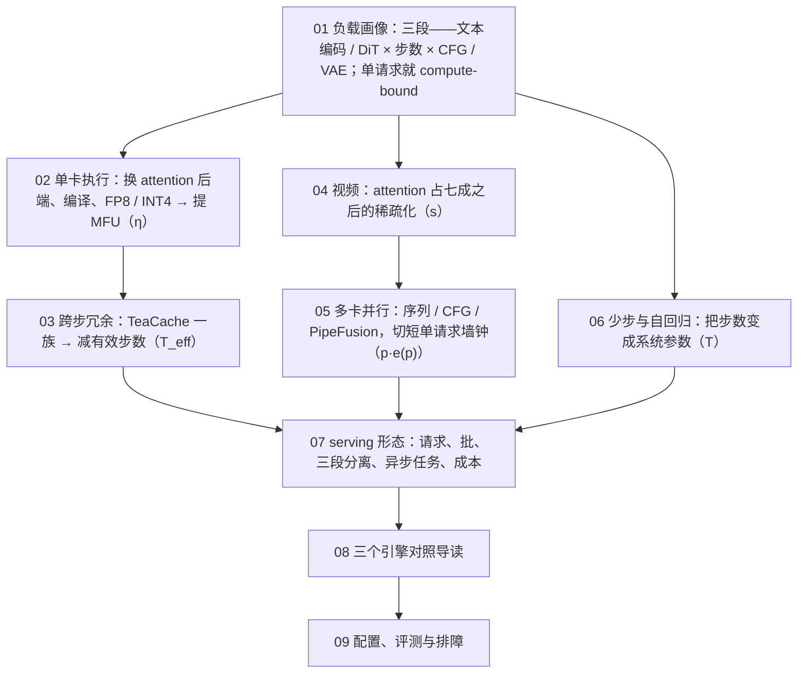
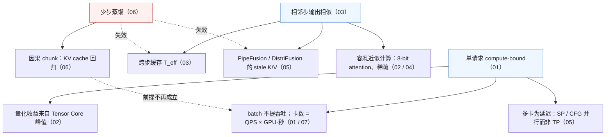

九篇正文回答了一个问题：**图像与视频生成这种 compute-bound 的负载，推理系统该长什么样，为什么 vLLM 的那一套在它身上大半用不上**。第一篇算清一次生成三段的 FLOPs、字节与秒，第二篇在单卡上换 MFU，第三篇利用相邻步的冗余改有效步数，第四篇算视频的 $$N^2$$ 与稀疏化，第五篇用通信换墙钟，第六篇看步数被蒸馏掉之后系统怎样变、KV cache 怎样回来，第七篇把这些放进一个服务，第八篇走一遍三个引擎，第九篇变成配置、评测与排障。九篇合起来，是[《大模型推理系统揭秘》](/deep-dive-into-vllm.html)那条推理主线的另一半。

本文不讲新内容，做三件事：把九篇压成一张表与九段回顾，把贯穿九篇的几条线拎出来，然后给一套三段式的通关自测——判断与计算、跨篇综合、面试题。各篇末尾的自测检验的是"这一篇读懂了没有"，这里检验的是"九篇能不能连起来用"。第九篇末尾的"系列总结"一节（九篇的账、与 LLM serving 的对照、三种能力）也并入本文。

> **读完这九篇，你应该能回答哪些问题？[^q0] 哪些数字与结论必须能脱口而出？[^q1] 怎么判断自己是"读过"还是"掌握"了？[^q2]**

先把整个系列放在一张图上——箭头是**推导或前置上的依赖**（箭头尾端的结论被箭头头端当作前提），不是阅读顺序：

## 一、总览：系列回答的问题与主线

系列的一句话主张是：**先算清一次生成的三本账（FLOPs、字节、秒），再看每一类优化在账上的哪一项做交换**。一切从一个数字出发——一次 DiT 前向的算术强度是 3,100 FLOP/字节，LLM decode 是 2：前者单请求就在算力屋顶上，所以优化的是 FLOPs 与 MFU 而不是字节，多卡是为了切短一个请求的墙钟而不是装下权重，调度面对的是时长完全可预测的批任务而不是不可预测的流。九篇的每一篇把新引入的机制记回第一篇的那张账：

$$
t = t_\text{txt} + g \cdot T_\text{eff} \cdot \frac{2 P_\text{tok} N + 4 L N^2 d \cdot s^{-1}}{\text{峰值} \cdot \eta \cdot p \cdot e(p)} + t_\text{VAE}, \qquad \text{卡数} = \text{QPS} \times \text{GPU·秒}
$$

$$\eta$$ 是第二篇，$$T_\text{eff}$$ 是第三篇与第六篇，$$s^{-1}$$ 是第四篇，$$p \cdot e(p)$$ 是第五篇，$$g$$ 是第六篇，卡数公式是第七篇。

| 篇 | 回答的问题 | 一句话结论 | 必记的数字 / 公式 |
|---|---|---|---|
| [第一篇：负载画像](/diffusion-inference-workload-anatomy-and-cost-ledger.html) | FLUX.1-dev 1024² 28 步在 H100 上每步多少 FLOPs、几秒、三段各占多少？换成 Wan 5 秒 720p 哪一项变了几个量级？ | 三段里算力全在 DiT；一次前向就是 compute-bound；图像模型是 GEMM 负载，视频模型是 attention 负载 | $$N = \frac{H}{fp}\frac{W}{fp}\frac{F_\text{lat}}{p_t} + N_\text{txt}$$；每步 $$2 P_\text{tok} N + 4 L N^2 d$$；FLUX 74.3 T / 步、attention 20%、2.1 P、$$\eta$$ 0.45 时 4.8 s；强度 3,100 vs 拐点 295；150× FLOPs、0.8× 时间；Wan 75,600 token、attention 72%、650 P、24 min |
| [第二篇：单卡执行](/single-gpu-diffusion-execution-attention-compile-quantization-offload.html) | 24 GB 的 4090 放不放得下 FLUX？FA3、compile、FP8、SVDQuant 依次加上每步降到多少、哪一步图片可见地变了？ | 无损先有损后；编译是最大的无损收益；量化的收益来自 Tensor Core 峰值而不来自字节；逐层 offload 的判据是每层计算 / 搬运 | eager 6.71 s → compile 4.30 s（1.56×，$$\eta$$ 0.31 → 0.49）；FP8 GEMM 2× → 端到端 1.3–1.5×；SVDQuant 22 → 6.5 GiB、4090 上 3×、Hopper 无 INT4；PSNR > 35 dB 不可见、30–35 细看可见；Wan 逐层 offload 免费（0.7 s vs 27 ms）、FLUX 慢 6×（2.7 ms vs 16 ms） |
| [第三篇：跨步冗余](/timestep-redundancy-caching-and-step-skipping.html) | FLUX 28 步 TeaCache 阈值 0.4 命中多少步、加速多少、PSNR 掉到多少？为什么在 schnell 的 4 步上一步都省不下来？ | 便宜信号 → 阈值 → 复用缓存残差，首末步强制全算；本质是自适应的少步采样，上限约 2×，与步数蒸馏互斥 | $$T \to T_\text{full} + T_\text{hit}\,\epsilon$$、speedup $$\approx T / T_\text{full}$$；0.25 / 0.4 / 0.6 → 1.5 / 1.8 / 2.0×；0.4 时约 16 全算 12 复用、约 30 dB；视频到 4.4×；CFG 两份状态；SP 下决策全局一致 |
| [第四篇：视频与稀疏化](/video-diffusion-long-sequence-attention-and-sparsity.html) | Wan 一步的 attention 多少 PFLOPs、占几成？稀疏 80% 端到端加速多少？帧数 4 倍哪一项 16 倍？ | $$N$$ 到十万后 $$4LN^2d$$ 压过 $$2P_\text{tok}N$$；稀疏必须落到 FlashAttention 的 block 粒度；收益受 Amdahl 约束 | 交叉点 $$N \approx 6d$$；Wan 4.7 P attention / 6.5 P 每步、72%；分数矩阵 425 GiB 不可物化；Amdahl $$1/((1-a) + a/s)$$：$$a$$ 0.72、$$s$$ 3.5 → 2.06×、上限 3.57×；17 → 129 帧每步 21×；叠加 24 min → 40 s |
| [第五篇：多卡并行](/multi-gpu-diffusion-parallelism-usp-cfg-pipefusion.html) | 8 张 H100 生成 FLUX，CFG 2 × Ulysses 4 与 TP 8 各通信多少？以太网互联的两台 8×L40 为什么 PipeFusion 赢？视频为什么 SP 必需？ | 扩散多卡为延迟（切一个请求），吞吐永远是 DP 最优；SP 通信是 TP 的 $$1/p$$，PipeFusion 是 TP 的 $$1/L$$；NVLink 用 USP、弱互联加 PipeFusion | TP $$4\frac{p-1}{p}Nd$$、Ulysses $$4\frac{p-1}{p^2}Nd$$；FLUX $$p$$ = 4：4.8 GB vs 1.2 GB / 步；CFG 并行每步 0.6 MB；PipeFusion 28 MB / 步；4×H100 1.63 s（2.63×）；Wan 8 卡一步 29 → 4 s；乘积 = 卡数 |
| [第六篇：少步与自回归](/few-step-and-autoregressive-video-generation-systems.html) | schnell 4 步 vs dev 28 步每张 FLOPs、QPS、哪些优化还有用？自回归视频每 chunk 的 KV 多大？为什么"没有 KV cache"的负载又需要它了？ | 蒸馏拿走了"几十步里大半是保守余量"，依赖相邻步相似的优化全部失效；因果化让视频生成向 LLM serving 收敛 | DiT 2.08 P → 0.30 P（1/7）、0.80 s、1.25 张/s；另两段 2.6% → 15.6%；KV 每 token $$2dL \times 2$$ 字节：Wan 1.3B 184 KB、chunk 0.86 GB、窗口 21 帧 6 GB；SD-Turbo 4090 约 90 fps |
| [第七篇：serving 形态](/diffusion-serving-shapes-batching-disaggregation-and-cost.html) | 100 QPS 的 FLUX 1024² 服务需要多少张 H100？batch 有没有用？p99 怎样保证？视频为什么必须异步 job？ | 卡数 = QPS × 单张 GPU·秒，batch 不参与、SP 只减延迟；时长收到请求时即确定 → 分池、SJF、SLO 准入、事前定价 | 100 QPS：eager 670 → compile + FA3 390 → FP8 290 → TeaCache 170 → schnell 80 张；每张 \$0.0047 → \$0.0006；抢占状态 = latent 0.6 MB；Wan 5 秒 8 卡 40 s = 320 GPU·秒 ≈ \$0.22；LoRA 前 $$k \le 4$$ 步不挂 |
| [第八篇：三个引擎](/diffusion-engines-compared-sglang-diffusion-vllm-omni-xdit.html) | 一个 `/v1/images/generations` 请求在三个引擎里各经过哪些进程与类？它们在进程模型、pipeline 抽象、并行组、调度上各怎么选、为什么？ | SGLang 把扩散塞进 LLM serving 的结构；vLLM-Omni 把扩散做成全模态流水线的一个 stage；xDiT 只做并行、包装 diffusers；三者共用 diffusers 底座与 vLLM 式并行组 | SGLang：HTTP / Scheduler / GPUWorker 三类进程、`ComposedPipelineBase`；vLLM-Omni：stage 0 + stage N、`DiffusionEngine`；xDiT：torchrun SPMD、`xFuserPipelineBaseWrapper`；有调度器的两个都是同构静态批 |
| [第九篇：配置、评测与排障](/diffusion-inference-configuration-evaluation-and-troubleshooting.html) | p99 抬升 / 伪影 / 半夜 OOM 各先查什么？该采集哪些信号？配置按什么顺序推？ | 八步推导：算账 → 无损单卡 → 有损 I → 有损 II → 多卡 → 少步 → serving → 面板；无损先于有损、切卡先于换模型、卡数由 GPU·秒决定 | 门限 PSNR > 35 / 30 dB；FID 不能评"开不开某项优化"；同一部署内确定、跨部署不保证；OOM 先看 `vae.decode`；p99 抬升先看重编译；告警：每步 +20%、命中率 ±30%、抽检 −3 dB |

### 1. 本文的章节安排

| 章 | 内容 |
|---|---|
| 二 | 逐篇回顾：核心问题、结论、必记、常见误解 |
| 三 | 贯穿九篇的五条线：一张账、compute-bound、相邻步相似、attention 占比、有损与质量预算 |
| 四 | 常见误区表 |
| 五 | 通关自测：A 判断与计算 10 题、B 跨篇综合 5 题、C 面试题 7 题、D 掌握判据 |
| 六 | 下一步 |

## 二、逐篇回顾

### 1. 第一篇：负载画像——一次生成在 GPU 上发生什么

**核心问题**：FLUX.1-dev 生成一张 1024² 的图、28 步，在一张 H100 上每步多少 FLOPs、attention 占几成、MFU 多少时是几秒、三段各占多少？换成 Wan2.1-14B 的 5 秒 720p，哪一项变了几个量级？

**结论**：一次生成是三段：文本编码器一次前向（几百 token、22 ms）、DiT 对整张 latent 一次完整前向 × 步数 × CFG 分支（占 97% 的时间）、VAE 解码一次（FLOPs 只有 0.2%，但全分辨率 fp32 特征图让它是显存峰值最容易出问题的一段）。token 数由两次压缩决定（VAE 8×、patch 2×），每步 FLOPs 是线性项 $$2 P_\text{tok} N$$ 加 attention 项 $$4 L N^2 d$$，其中 $$P_\text{tok}$$ 是一个 token 真正经过的参数量——FLUX 是 6.45B 而不是 11.9B，用 $$P$$ 算会高估 85%。一次前向读一遍 22 GiB 权重、做 74 TFLOPs，算术强度 3,100，在 H100 拐点 295 的右边十倍：单请求就 compute-bound，batch 不提吞吐，量化的收益不来自字节，多卡为延迟。与 7B LLM 生成 1000 token 对照：150 倍的 FLOPs、0.8 倍的时间。四个放大器——分辨率与帧数进 $$N^2$$、步数线性、CFG ×2——决定了后面八篇各改哪一个。

**必记**：

- $$N = \frac{H}{fp}\cdot\frac{W}{fp}\cdot\frac{F_\text{lat}}{p_t} + N_\text{txt}$$，$$F_\text{lat} = \frac{F-1}{f_t} + 1$$：FLUX 4096 + 512 = 4608；Wan 720p 81 帧 $$45 \times 80 \times 21 = 75{,}600$$。
- 每步 $$2 P_\text{tok} N + 4 L N^2 d$$：FLUX 59.4 T + 14.9 T = 74.3 T，attention 20%；Wan 1.8 P + 4.7 P = 6.5 P，attention 72%；HunyuanVideo 129 帧 87%。
- 每步 $$= g \cdot \text{FLOPs}_\text{fwd} / (\text{峰值} \cdot \eta)$$：$$\eta$$ 0.45 时 167 ms、28 步 4.68 s；xDiT 实测 eager 6.71 s（$$\eta$$ 0.31）、compile 4.30 s（0.49）。
- 显存：三段权重 31.5 GiB（DiT 22.2 + T5 9.0 + VAE 0.3），DiT 激活 270 MiB（随 $$N$$ 线性、无 KV cache），VAE 解码峰值 2 GiB；Wan 激活 14.4 GiB、VAE 107 GiB。
- 强度 $$\approx \frac{P_\text{tok}}{P} N \approx 3{,}100$$ vs 拐点 295；LLM decode 是 2。
- 放大器：2048² 每步是 1024² 的 5.6×、attention 占比 20% → 48%；17 → 129 帧每步 21×；4 步是 28 步的 1/7。

**常见误解**："FLOPs 用参数量算"——FLUX 12B 与 Qwen-Image 20B 一次前向的 FLOPs 几乎相同（74 T vs 78 T），因为 $$P_\text{tok}$$ 都在 6.5B 上下，参数量决定的是显存不是算力。另一个："VAE 只占 0.1% 的 FLOPs 所以不用管"——它是三段里 OOM 最常发生的一段，720p 129 帧不分块 227 GiB。

### 2. 第二篇：单卡执行——attention 后端、编译、FP8 / INT4 与 offload

**核心问题**：一张 24 GB 的 RTX 4090 上 12B 的 FLUX.1-dev 放不放得下？放下之后 28 步几秒？把 FA3、compile、FP8、SVDQuant 依次加上，每步降到多少，哪一步开始图片可见地变了？

**结论**：单卡的六种手段各改账上的一项——attention 后端、编译、融合 kernel 改 $$\eta$$，量化改 Tensor Core 峰值与权重字节，offload 改权重常驻量，VAE tiling 改解码峰值。顺序是无损先（装下 → 算快）、有损后（FP8 / SageAttention → INT4），每一步对着固定 seed 的基线图测 PSNR。编译是最大的一项无损收益：扩散形状固定、每步相同，是 `torch.compile` 的理想负载，eager 下 GEMM 之外的几十个小算子占了近一半时间；代价是编译时间与动态分辨率的重编译。量化的收益不来自字节而来自 Tensor Core 峰值翻倍，只对线性层生效，所以 FP8 是 1.3–1.5× 而不是 2×；SVDQuant 用低秩分支吸收离群值、Nunchaku 把它融进 INT4 kernel，在 4090 上 3×，在没有 INT4 Tensor Core 的 Hopper 上不提速。24 GB 卡上的问题首先是装下：三段不必同时在卡上，DiT 段只需 22.5 GiB；逐层 offload 的收益取决于每层计算 / 搬运之比，视频模型上免费、图像模型上慢 6 倍。

**必记**：

- H100 叠加：eager 240 ms → compile 154 ms（1.56×）→ FA3 约 140 → FP8 约 105 → SageAttention 约 95 ms（后三项为估算）；4090：bf16 + offload 约 40 s，SVDQuant INT4 + compile 约 12 s。
- 逐层 offload 判据：Wan 一层 0.67 GB / 27 ms 搬运 vs 0.73 s 计算（免费）；FLUX 一层 0.39 GB / 16 ms vs 2.7 ms（每步退化为搬 22 GiB 的 0.9 s）。
- Tensor Core 峰值：BF16 989 T、FP8 / INT8 1979 T；4090 INT4 660 T vs bf16 165 T；Hopper 无 INT4。
- 质量门限：> 35 dB 不可见、30–35 细看可见、< 28 明显；compile 漂移 SSIM 0.98 / PSNR > 40 dB，FP8 约 36 dB，SageAttention 30–35 dB，SVDQuant INT4 约 30 dB。
- FA3 比 FA2 快 1.5–2×，图像上端到端只有 5–10%（attention 占 20%），视频上是主项。
- breakable CUDA graph：Qwen-Image 2×H200 每步 124.7 → 83.1 ms，与 compile、Cache-DiT 互斥。

**常见误解**："权重从 22 GiB 量化到 11 GiB，时间应该减半"——这是 LLM decode 的 memory-bound 逻辑；FLUX 在算力屋顶上，字节不是瓶颈。另一个："SageAttention 在 LLM 上会改变 token，在扩散上也不能用"——每步的误差被后续去噪步吸收、输出是连续像素，扩散对近似计算普遍鲁棒，这也是跨步缓存与稀疏 attention 成立的前提。

### 3. 第三篇：跨步冗余——TeaCache、First-Block Cache 一族的缓存与跳步

**核心问题**：FLUX 28 步，TeaCache 阈值取 0.4：命中多少步、端到端加速多少、对原图的 PSNR 掉到多少、哪些地方先坏？同样的方法为什么在 FLUX.1-schnell 的 4 步上一步都省不下来？

**结论**：采样沿一条平滑轨迹数值积分，相邻步的网络输出在中段只差 5–10%，开头（决定构图）与结尾（补细节）差 20–40%。这一族方法结构相同：一个便宜的信号预测这一步的输出变化（TeaCache 用调制后输入的相对 L1 差加多项式，FBCache 算完第一个 block 看残差差，MagCache 离线校准幅度曲线），一个阈值决定算还是复用，一份缓存保存上一次全算的残差；首末步强制全算，命中天然集中在中段。账上 $$T$$ 变成 $$T_\text{full} + T_\text{hit}\,\epsilon$$，加速比 $$\approx T / T_\text{full}$$，图像上限约 2×（要 3× 就要跳掉三分之二，中段撑不住），视频更相似、步数更多，到 4.4×。它本质是自适应的少步采样，所以与高阶采样器部分重叠、与步数蒸馏互斥：4 步模型每步都在轨迹转折点，相对差 50% 以上，任何阈值都不命中。实现全是 hook，交互三条：CFG 两份状态、序列并行下决策全局一致、蒸馏模型不开。

**必记**：

- FLUX TeaCache 0.25 / 0.4 / 0.6 → 约 1.5 / 1.8 / 2.0×；0.4 时约 16 步全算、12 步复用，compile 基线 4.30 s → 约 2.4 s，PSNR 约 30 dB、LPIPS 约 0.1。
- $$\text{speedup} = T / (T_\text{full} + T_\text{hit}\,\epsilon)$$；$$\epsilon$$：TeaCache / MagCache ≈ 0，FBCache $$1/L$$，DBCache $$(F_n + B_n)/L$$。
- 命中 12 步：TeaCache 1.75×、FBCache $$28 / (16 + 12/57) = 1.73\times$$。
- 伪影顺序：细纹理模糊、文字笔画粘连（结尾步被跳）→ 颜色 / 亮度偏移（中段累积）→ 构图变（开头步被跳）；CFG 状态混用 → 饱和发灰。
- FID 对单图细节变化不敏感，不能用；用对同 seed 基线图的 PSNR / LPIPS。
- MagCache 的决策与 prompt 无关、可预知——请求时长可精确预知，服务调度用得上。

**常见误解**："缓存是无损优化"——它是有损、可调的，每个模型 × 分辨率 × 步数要各扫一条阈值曲线。另一个："视频闪烁是缓存 bug"——多数是相邻帧或 CFG 分支的决策不一致，整段视频用同一决策、两支各自存状态即可。

### 4. 第四篇：视频——长序列 attention 的账与稀疏化

**核心问题**：Wan2.1-14B 生成 5 秒 720p，一步的 attention 是多少 PFLOPs、占几成？把 attention 稀疏掉 80%，端到端加速多少？帧数加到 4 倍，账上哪一项变了 16 倍？

**结论**：3D VAE 时间 4×、空间 8×，因果卷积让 81 帧得到 21 个 latent 帧；patch 1×2×2 后 720p 一帧 3600 个 token，75,600 个 token 是一张 1024² 图的 18 倍、attention 是 340 倍。attention 与线性项的比值 $$\approx N / 6d$$，交叉点在 $$N \approx 6d$$——$$d$$ 越大越"GEMM 化"，这是模型设计对系统的直接影响。视频 DiT 的推理在 FlashAttention 之前不可能：分数矩阵 425 GiB 一层就放不下；所以稀疏只有在 FlashAttention 的 128 块粒度上跳过整块才换回时间，稀疏模式的设计与 token 的排布是同一个问题（SVG 对 temporal head 先置换再调 kernel）。四条路：SVG 在线把 head 分成 spatial / temporal、SVG2 语义聚类置换、Radial 静态 $$O(n \log n)$$ 掩码并可配 LoRA 扩长度、STA / VSA tile 滑窗（VSA 可训练，是稀疏化的终局形态）。稀疏度都在 70–90%，attention 加速 3–5×，端到端按 Amdahl 打折到 2× 上下。

**必记**：

- $$N = \frac{H}{16}\frac{W}{16}\left(\frac{F-1}{4}+1\right)$$；Wan 720p 81 帧 75,600、129 帧 118,800；HunyuanVideo 129 帧 119,056。
- 交叉点 $$N \approx 6d$$：$$d$$ 3072 → 18K、5120 → 31K、1536 → 9K；Wan 480p 53%、720p 72%、1080p 85%。
- Amdahl $$1/((1-a) + a/s)$$：$$a$$ 0.72，$$s$$ 2 → 1.56×、3.5 → 2.06×、5 → 2.36×、∞ → 3.57×。
- 分数矩阵 $$40 \times 75600^2 \times 2$$ 字节 = 425 GiB；FlashAttention 下激活 7.2 GiB、CFG batch 2 → 14.4 GiB；129 帧 22.7 + 26.6 = 49 GiB。
- 17 → 129 帧：latent 帧 5 → 33（6.6 倍），线性 6.6×、attention 44×、每步 21×。
- 叠加：FA3 + compile + FP8 + Sage + 稀疏 80% + TeaCache ≈ 6×（24 → 3.9 min），8 卡 USP 再 6× → 37 s + VAE 7 s。

**常见误解**："算出注意力分数再把小的置零就是稀疏 attention"——在 $$N = 10^5$$ 上分数矩阵根本不能物化，稀疏必须是 kernel 跳块。另一个："attention 稀疏 80% 就快 5 倍"——Amdahl：28% 的线性项不动，端到端 2.06×，上限 3.57×。

### 5. 第五篇：多卡并行——序列并行、CFG 并行与 PipeFusion，为什么不是张量并行

**核心问题**：8 张 H100 生成一张 FLUX 1024²，CFG 2 × Ulysses 4 与 TP 8 各通信多少字节、几秒？两台以太网互联的 8×L40 该选什么组合，为什么 PipeFusion 在这里赢？为什么视频模型上序列并行是必需而不是可选？

**结论**：扩散多卡的目的与 LLM 不同：权重放得下、单请求已 compute-bound，切一个请求是为了延迟；只要吞吐，DP 永远最优（4 卡各跑一个请求 4× vs 切一个请求 2.63×）。四种刀法：切序列（Ulysses all-to-all 换 head、Ring P2P 传 K/V、USP 二维组合——节点内 Ulysses、跨节点 Ring）、切 CFG 分支（两组卡，每步末交换一次 0.6 MB 的预测，恒为 2、几乎零通信）、切层加 patch（PipeFusion：层切 stage、latent 切 patch、用上一步的 stale K/V 让流水线不等，通信与层数无关）、切权重（TP / FSDP，只在装不下时是首选）。通信量：TP $$4\frac{p-1}{p}Nd$$、Ulysses 是它的 $$1/p$$、PipeFusion 是它的 $$1/L$$。NVLink 上用 USP，PCIe / 以太网加 PipeFusion；Ring 跨以太网每步 1.6 GB → 0.5 s 不可行，PipeFusion 28 MB → 10 ms。scaling 不到线性（GEMM 变小、通信不全重叠、固定开销），视频上接近线性。视频上 SP 是必需：激活 14–49 GiB 与单卡 24 分钟都是硬约束。

**必记**：

- FLUX $$p$$ = 4 每步每卡：TP 4.8 GB（16 ms，关键路径）、Ulysses 1.2 GB（4 ms）、Ring 2.4 GB（可重叠）、CFG 并行 0.6 MB、PipeFusion 28 MB。
- xDiT 实测 FLUX compile：Ulysses-2 2.68 s、Ring-2 2.60、Ulysses-2 × Ring-2 1.80、Ulysses-4 1.63（2.63×）、Ring-4 1.98。
- 约束：Ulysses 度整除 head 数（FLUX 24、Wan 40）；SP 度整除 $$N$$；乘积 $$p_\text{data} \times p_\text{cfg} \times p_\text{ulysses} \times p_\text{ring} \times p_\text{pipefusion}$$ = 卡数。
- PipeFusion 气泡 $$\frac{p-1}{M+p-1}$$，跨步连续流水填掉大半；16×L40 比 8 卡再快 1.16×；少步模型不用（stale K/V 误差大）。
- DistriFusion 每卡存全部层 K/V：FLUX 3.2 GB、Wan 62 GB（视频不可行）；PipeFusion 只存 $$L/p$$ 层：0.8 GB。
- Wan 8 卡 USP 一步 29 → 约 4 s；CFG 模型先比较 CFG 2 × USP $$p/2$$ 与 USP $$p$$。

**常见误解**："多卡 SP 能减少服务的卡数"——它只减单请求延迟，GPU·秒不变甚至更多；卡数由吞吐定。另一个："TP 是多卡的默认"——TP 通信是 SP 的 $$p$$ 倍且在关键路径上，只在装不下（24 GB 卡跑 20B）或图像 + NVLink + 小 $$p$$ 时仍是选项。

### 6. 第六篇：少步与自回归——把步数变成系统参数

**核心问题**：FLUX.1-schnell 4 步 vs dev 28 步：每张 FLOPs、单卡 QPS、哪些优化还有用？自回归视频模型每个 chunk 的 KV cache 多大、滑动窗口留几帧？为什么一个"没有 KV cache"的负载又需要 KV cache 了？

**结论**：步数蒸馏是本系列最大的一项加速（7×），但不是系统做的；系统要知道的是它之后账的结构变了。失效的三项——跨步缓存、PipeFusion / DistriFusion、CFG 并行与 CFG gating——有同一个根：都在利用"几十步里大部分步是保守余量"，蒸馏把余量拿走了；不变的是对"一次前向"本身的优化（后端、编译、量化、稀疏、SP）。浮出来的是另两段与固定开销：文本编码器 + VAE 从 2.6% 到 15.6%（SD3-Turbo 47%），CUDA graph 从可选变必需；batch 在小模型 × 低分辨率的 GEMM 不饱和时开始有意义，多卡的默认变成 DP。StreamDiffusion 的 stream batch 把处于不同步的帧拼成一个 batch，吞吐从 $$1/T$$ 到 1。自回归视频（CausVid → Self-Forcing → Causal Forcing）把双向 DiT 改成因果、按 chunk 生成、4 步 DMD：已生成 chunk 的 K/V 不再变，缓存它就省掉重算——KV cache 回来了，随之回来的还有滑动窗口、分页驻留、流式输出、会话状态与不可预测的时长，视频生成在系统形态上向 LLM serving 收敛。

**必记**：

- dev → schnell：DiT 2.08 P → 0.30 P、4.68 → 0.67 s、合计 0.80 s、0.21 → 1.25 张/s；Wan 50 步 CFG → FastWan 3 步无 CFG 是 1/33。
- 失效：跨步缓存（schnell 零命中）、PipeFusion / DistriFusion、CFG 并行、CFG gating；不变：后端、compile（更重要）、CUDA graph（必需）、FP8 / INT4、稀疏、SP、Parallel VAE。
- batch 有意义的条件：SD3-Turbo 512²（$$N$$ = 1357、$$d$$ = 1536）MFU 不到 30%，batch 4 近 3×；FLUX-schnell 1024² 仍无意义。
- KV 每 token $$2 d L \times 2$$ 字节（无 GQA）：Wan 1.3B 184 KB（Llama-3-8B 128 KB）；chunk 3 帧 4,680 token 0.86 GB；窗口 21 帧 6.0 GB；14B 底座每 token 819 KB。
- 每 chunk 完成后再算一次 clean 版本的 K/V 写入缓存；窗口 $$W$$ 同时决定显存与每 chunk 的 attention 成本。
- KV 量化只量化已完成的 chunk，当前与最近的留 bf16。

**常见误解**："第一篇说 batch 没用，StreamDiffusion 又说 batch 提吞吐，矛盾"——前提不同：FLUX 1024² 的 GEMM 已填满 GPU，SD-Turbo 512² 没有；batch 的收益来自填满未饱和的 GPU。另一个："自回归视频的漂移靠加大窗口解决"——漂移来自以自己有误差的输出为条件，与窗口无关，靠训练方法推后。

### 7. 第七篇：serving 形态——请求、批、三段分离、附件、异步任务与成本

**核心问题**：一个 100 QPS 的 FLUX 1024² 服务需要多少张 H100？batch 有没有用？p99 怎样保证？为什么视频服务必须做成异步 job？

**结论**：扩散的服务层围绕与 LLM 相反的两件事组织：请求时长在收到它时就完全确定（$$H, W, F, T, g$$ 加实例的 $$\eta$$），batch 几乎不提吞吐。于是卡数 = QPS × 单张 GPU·秒，前六篇的每一项优化直接按比例减卡数、直接是毛利，多卡 SP 不减卡数；调度像批处理系统：按形状分池（无重编译、容量可规划）、按估算 GPU·秒 SJF 加老化、SLO 准入与事前定价，抢占只在步边界有意义（状态就是 0.6 MB 的 latent），生产多用分池代替抢占。能合批的请求必须形状、CFG、quality、LoRA 全同——同构、静态、整批开始整批结束。三段的资源形态不同可以分开部署：图像 1024² 以下通常不分，视频几乎总分 VAE，全模态必分。附件：LoRA 的瓶颈是加载，SwiftDiffusion 前 $$k \le 4$$ 步先不挂、边算边加载；ControlNet 做成独立服务与基座并行。视频请求分钟级，`POST /v1/videos` 立即返回 job id、轮询、对象存储；自回归视频的流式会话是第三种形态。

**必记**：

- 100 QPS FLUX：eager 6.7 s → 670 张；compile + FA3 3.9 s → 390；+ FP8 2.9 s → 290；+ TeaCache 0.4 1.65 s → 170；schnell 0.8 s → 80。
- 成本（H100 \$2.5 / 小时）：每张 \$0.0047 → \$0.0011 → \$0.0006；商业 API \$0.02–0.03 / 张；Wan 5 秒 8 卡 40 s = 320 GPU·秒 ≈ \$0.22，不优化约 \$1。
- batch 收益 $$= \text{MFU}(b) / \text{MFU}(1)$$，MFU(1) 已 0.5 以上时实际 1.0–1.2×；视频永远 batch 1。
- 抢占状态：latent $$N \times c p^2$$，FLUX $$4608 \times 64 \times 2$$ 字节 ≈ 0.6 MB；同 seed 恢复 bit-exact。
- stage 间传输：embedding 4 MiB、latent 0.6 MB；冷启动 = 权重 30–50 GB + 编译 1–3 min，分钟级，提前扩。
- 兼容键：height / width / frames / CFG / guidance / quality / LoRA id 与 scale；同批 steps 相同。

**常见误解**："提高吞吐就调大 batch"——compute-bound 下吞吐随并发不增、p99 线性恶化，这不是故障，是负载性质；加实例或换少步模型。另一个："多 LoRA batch 像 LLM 一样值得做"——LLM 上值得是因为 batch 本身提吞吐，扩散上为它付分组 GEMM 的开销没有回报，按 LoRA 分批串行跑。

### 8. 第八篇：三个引擎的对照导读

**核心问题**：一个 `/v1/images/generations` 请求从进 HTTP 到返回 base64，在 SGLang Diffusion、vLLM-Omni、xDiT 里各经过哪些函数？它们在进程模型、pipeline 抽象、并行组、调度上各做了什么不同的选择，为什么？

**结论**：三条路径走完，三种取向就清楚了。SGLang Diffusion 把扩散塞进 LLM serving 的结构：HTTP server → `Scheduler` 进程（合批准入、warmup）→ `GPUWorker` 组 → `ComposedPipelineBase` 的 stage 列表 → `runtime/models` 原生重写的 DiT 与 `USPAttention`，scheduler、kernel 栈、CUDA graph、多平台全部复用。vLLM-Omni 为全模态模型设计 stage 流水线：stage 0 是 API + orchestrator，diffusion stage 里 `DiffusionEngine` 带 `RequestScheduler` / `StepScheduler`，经 `MultiprocExecutor` → `DiffusionWorker` → `DiffusionModelRunner` → 原生 pipeline；扩散只是一种 stage，三段分离只是改 yaml。xDiT 只做并行：torchrun SPMD、`xFuserPipelineBaseWrapper` 包装 diffusers pipeline、替换 attention processor、建并行组，没有服务层，是 USP / PipeFusion / CFG 并行 / Parallel VAE 的源头。三个共同点：并行组的 `parallel_state` / `GroupCoordinator` 都从 vLLM 演化、几乎可互换；缓存与 offload 都是 diffusers 定义的 hook 形态；有调度器的两个都是同构静态批。diffusers 是共同底座——模型、pipeline、调度器、hook 的接口都从它来，原生重写的代价是维护权重名映射。

**必记**：

- 进程模型：SGLang 三类进程（与 SGLang LLM 同构，ZMQ）；vLLM-Omni stage 进程（可跨 GPU / 主机）；xDiT torchrun 每 rank 同一段脚本。
- pipeline 抽象：SGLang `ComposedPipelineBase` = stage 列表 + `--backend diffusers` 回退；vLLM-Omni `models/<model>/pipeline_*.py` + diffusers adapter；xDiT 包装 diffusers 只换 attention 与去噪循环。
- 独有：SGLang——动态批处理准入、breakable CUDA graph、`--quality`、realtime 会话、KV 量化；vLLM-Omni——stage 分离、HSDP、VAE patch 并行、分页 diffusion KV；xDiT——PipeFusion、Parallel VAE、弱互联。
- 支持新模型的成本：SGLang / vLLM-Omni 高（重写 + 权重映射），xDiT 低（一个 wrapper）；xDiT 的绝对性能受 diffusers 限制。
- 选型：对外服务选 SGLang 或 vLLM-Omni（按目标模型是否有原生实现）；全模态选 vLLM-Omni；非 NVIDIA 平台选 SGLang；PCIe / 以太网多卡或研究并行选 xDiT；单卡跑图用 diffusers + compile + hook 缓存。

**常见误解**："三个引擎是同一类东西、选性能最高的"——xDiT 没有服务层，vLLM-Omni 的 stage 结构对纯扩散偏重，SGLang 与主线耦合；取向来自出发点。另一个："它们都会做连续批处理"——没有一个做，负载性质决定只能同构批。

### 9. 第九篇：配置、评测与排障——从一张卡的推导到一条伪影的排查

**核心问题**：一个 FLUX 服务上线后 p99 抬升 / 图片出现伪影 / 半夜 OOM，各先查什么？开训前该采集哪些信号才能十分钟内定位？给定模型、GPU 与 SLO，配置该按什么顺序推？

**结论**：配置推导八步：① 用账本算三段 FLOPs / 显存 / 时间、attention 占比；② 无损单卡（offload / tiling → FA3 → compile 或 BCG → warmup 全部服务形状）建立固定 seed 的基线；③ 有损 I（FP8、SageAttention）门限 PSNR > 35 dB；④ 有损 II（缓存阈值扫描、视频加稀疏）取质量预算内最大档，蒸馏模型跳过；⑤ 延迟不够再多卡；⑥ 可换模型则少步并重做 ②③；⑦ serving 分池、实例数 = QPS × GPU·秒 × 余量；⑧ 面板与告警。三条原则：无损在有损之前、切卡先于换模型、实例数由 GPU·秒决定。评测有 LLM 没有的维度——多数优化有损，而"损了多少"没有困惑度那样的单一数字：对基线图的 PSNR / SSIM / LPIPS、prompt 集上的偏好模型与 GenEval、人工 A/B 三层，FID 对单图细节与模式坍缩都不敏感。确定性"同一部署内确定、跨部署不保证"，改并行度 / 编译 / 版本要重建基线。故障表十二类各有信号与先查项；面板要有性能看不出的质量抽检。

**必记**：

- 算例一：FLUX 8×H100、SLO 3 s、100 QPS：6.7 → 3.9 → 2.9（36 dB）→ TeaCache 0.3 1.8 s；DP 8；实例数 100 × 1.8 × 1.3 ≈ 230 张卡；SLO 1 s 时 USP 4 → 0.7 s 但卡数不变，或 schnell → 105 张。
- 算例二：Wan 720p 8×H100、SLO 2 分钟：24 → 17 → 15 → 10 → 6.6 → 4 min → 8 卡约 40 s，VAE patch 并行 8；异步 `/v1/videos`。
- 算例三：4090 FLUX：offload 40 s → compile 33 s → SVDQuant INT4 约 12 s（30 dB）→ TeaCache 0.4 约 7 s → schnell + INT4 约 2 s。
- GPU-Util 不度量 MFU：eager 接近 100% 而 MFU 0.31；MFU 要用账算。
- 告警：每步 ms +20%、命中率 ±30%、估算等待 > SLO/2、显存 > 90%、抽检 PSNR 低于门限 3 dB、重编译 > 0、rank 差 > 10%。
- 三次故障注入：缓存阈值调出门限、发非预定义分辨率、关 VAE tiling 发 2048²。

**常见误解**："GPU 利用率 100% 说明跑满了"——eager 的几百个小 kernel 也能把 GPU-Util 打满，MFU 只有 0.31。另一个："同 seed 一定同图"——compile 的浮点顺序、SP 的 reduce 顺序、FP8 的动态 scale 都会漂移，A/B 要与部署配置一起建基线。

## 三、贯穿全系列的几条线

### 1. 一张账，九次记账

第一篇建立的三本账（FLOPs、字节、秒）是全系列的坐标系，之后每一篇只做一件事：把新机制写成账上的一项修正。第二篇改 $$\eta$$（0.31 → 0.5 以上）、Tensor Core 峰值与权重字节；第三篇把 $$T$$ 换成 $$T_\text{full} + T_\text{hit}\,\epsilon$$；第四篇给 attention 项乘一个 $$s^{-1}$$ 并用 Amdahl 算它的上限；第五篇把分母乘 $$p \cdot e(p)$$ 并给每步加一项通信时间；第六篇直接改 $$T$$ 与 $$g$$ 这两个乘数；第七篇在多请求上摊——卡数 = QPS × GPU·秒；第九篇把这条公式写成推导顺序。

这条线的价值在于它给每个优化一个可比的位置：编译 1.56×、缓存 1.8×、稀疏 2×、4 卡 2.63×、蒸馏 7×——系统侧全部工作加起来与算法侧的一次蒸馏同量级，这是第六篇的判断，只有在同一张账上才看得出。它也给出了什么时候一项优化"无关"：稀疏 attention 对 FLUX 的 20% 只有 1.17×，FP8 对 Wan 的 28% 线性项从 17 分钟只到 15 分钟。

### 2. compute-bound 决定一切，直到它不成立

第一篇的一个数字——算术强度 3,100 对 2——是全系列每个"与 LLM 相反"的根。第二篇：量化的收益来自峰值不来自字节，权重减半不减时间。第五篇：多卡为延迟不为装下，切序列不切权重，吞吐永远 DP 最优。第七篇：batch 不提吞吐，卡数由单张 GPU·秒决定，时长可预测让调度像批处理系统。第九篇：GPU-Util 100% 不说明任何事。

第六篇给出了这条线的两个边界。一是 batch 在小模型 × 低分辨率 × 少步下重新有意义——不是 compute-bound 的结论错了，而是那个前提（一个请求的 GEMM 填满 GPU）不再成立，StreamDiffusion 的 stream batch 与 SGLang 的动态批处理都在这个区间。二是自回归视频：因果化之后"历史"出现了，KV cache、分页、流式、会话、不可预测时长全部回来，第一篇那张"08 的机制大半用不上"的表要重新画。第八篇把这一点解释成 SGLang 与 vLLM 恰好适合承载它的原因。

### 3. 相邻步相似：一种冗余、四处利用、一处失效

扩散采样沿平滑轨迹走，相邻步的输出在中段只差 5–10%。第三篇用它做跨步缓存；第五篇用它做 PipeFusion 与 DistriFusion——attention 需要的其他卡的 K/V 用上一步的 stale 值代替，让流水线不等、让 all-gather 不在关键路径上；第二篇用它的另一面——每步的误差被后续去噪吸收——解释扩散为什么容忍 8-bit attention，第四篇的稀疏 attention 同理；第七篇用"前几步在定构图、LoRA 影响的是风格与细节"做 bounded async loading。

第六篇是这条线的终点：步数蒸馏把"几十步里大半是保守余量"拿走，4 步的每一步都在转折点，相邻步相对差 50% 以上——跨步缓存零命中、PipeFusion 的 stale 误差大到不可用、CFG 并行随 guidance 蒸馏一起消失。第九篇因此有一条规则：蒸馏模型跳过缓存。判断一项优化在少步模型上是否失效，只要问它依赖的是不是这条性质。

### 4. attention 占比 $$a$$ 决定优化重心

第一篇的翻转——FLUX 20%、Wan 72%、HunyuanVideo 87%——把系列分成图像与视频两条路。第四篇给出翻转点 $$N \approx 6d$$ 与它对模型设计的含义（宽而浅更"GEMM 化"）。第二篇的同一组手段在两边的排序相反：图像上编译与量化是主项、FA3 只有 5–10%；视频上 attention 后端与 SageAttention 是主项、FP8 只作用于 28%。第三篇的缓存跳的是整步，与 $$a$$ 无关；第四篇的稀疏化只对视频有意义，其收益由 Amdahl 定律与 $$a$$ 一起决定。第五篇：视频上 SP 是必需（激活 14–49 GiB、单卡分钟级），图像上是延迟的可选项。第六篇的自回归 chunk 把 attention 从 $$N^2$$ 变成 $$N_q N_{kv}$$，让时长回到线性。第九篇的第一步就是用账算出 $$a$$，它决定第④步的重点是缓存还是稀疏。

### 5. 有损优化与质量预算

LLM 的量化用困惑度一个数字度量损失；扩散的有损优化——FP8 / INT4 / 8-bit attention（第二篇）、跨步缓存（第三篇）、稀疏 attention（第四篇）、少步蒸馏（第六篇）——每一项都有一个连续参数与一条"加速比—质量"曲线，评测方法是配置方法的一半。第二篇给出门限（> 35 dB 不可见、30–35 细看可见）与"文字与手指最先坏"；第三篇给出阈值曲线的形状（加速先快后饱和、质量先平后陡）与伪影的顺序；第四篇加上视频的时间一致性与运动幅度；第九篇把它们收成三层评测（对基线图、prompt 集、人工 A/B）、一条确定性规则（同一部署内确定、跨部署重建基线）与一个性能面板看不出的质量抽检。无损先于有损、有损按可见度排序，是第九篇推导顺序的第一原则。

| 概念 | 出现的篇 | 关系 |
|---|---|---|
| 三本账、$$2P_\text{tok}N + 4LN^2d$$ | 一至七、九 | 一建账；二至七各改一项；九写成推导顺序 |
| 算术强度、compute-bound | 一、二、五、七、九 | 一给出 3,100 vs 2；二解释量化；五解释多卡目的；七解释 batch 与卡数；九解释 GPU-Util |
| 相邻步相似 | 二、三、五、六、七 | 二（误差被吸收）；三（缓存）；五（stale K/V）；七（LoRA 前 $$k$$ 步）；六（蒸馏后失效） |
| attention 占比 $$a$$ | 一、二、四、五、六、九 | 一给翻转；二排序手段；四给 $$N \approx 6d$$ 与 Amdahl；五给 SP 必需；六给 chunk 化；九用它定重点 |
| 步数 $$T$$ 与 $$g$$ | 一、三、五、六、七 | 一说是最大乘数；三改有效值；五的 CFG 并行依赖 $$g$$ = 2；六直接改；七进时长公式 |
| KV cache | 一、六、七、八 | 一说没有（只有文本 K/V）；六说回来了；七的会话形态；八的 `diffusion_kv/` 与 `realtime/` |
| VAE 解码峰值 | 一、二、五、七、九 | 一给 2 / 107 / 227 GiB；二 tiling；五 Parallel VAE；七 VAE stage 分离；九 OOM 先查 |
| PSNR 门限与基线图 | 二、三、四、九 | 二给门限；三给阈值曲线；四加视频指标；九给三层评测与确定性 |
| 三个引擎的对照表 | 二至七、八 | 各篇末尾一张；八按请求路径串成一篇 |

## 四、常见误区

| 误区 | 为什么错 | 正确的说法 | 出处 |
|---|---|---|---|
| 一次前向的 FLOPs 按参数量算 | 双流块每个 token 只走一条流，adaLN 只处理一个条件向量 | 用 $$P_\text{tok}$$：FLUX 6.45B 而非 11.9B，用 $$P$$ 高估 85% | [第一篇](/diffusion-inference-workload-anatomy-and-cost-ledger.html) |
| 扩散推理与 LLM 一样有 KV cache | 每步的 K/V 由本步的带噪输入算出、用完即弃，没有"历史 token" | 双向多步模型无 KV；只有 cross-attn 的文本 K/V 可缓存；自回归视频除外 | [第一篇](/diffusion-inference-workload-anatomy-and-cost-ledger.html) |
| 权重量化减半，每步时间减半 | 单请求在算力屋顶上，字节不是瓶颈 | 收益来自 Tensor Core 峰值，只对线性层：FP8 1.3–1.5× | [第二篇](/single-gpu-diffusion-execution-attention-compile-quantization-offload.html) |
| 逐层 offload 是免费的 | 收益取决于每层计算 / 搬运之比 | Wan 免费（0.7 s vs 27 ms）、FLUX 慢 6×（2.7 ms vs 16 ms） | [第二篇](/single-gpu-diffusion-execution-attention-compile-quantization-offload.html) |
| SVDQuant 在 H100 上也能提速 | Hopper 没有 INT4 Tensor Core | 只在 Ada / Ampere / Blackwell 上有加速（4090 3×）；H100 只省显存 | [第二篇](/single-gpu-diffusion-execution-attention-compile-quantization-offload.html) |
| 跨步缓存是无损的、蒸馏模型也能开 | 它是自适应的少步采样；4 步模型每步都在转折点 | 图像上限约 2×、PSNR 约 30 dB；schnell 上零命中或图坏 | [第三篇](/timestep-redundancy-caching-and-step-skipping.html) |
| attention 稀疏 80% 端到端快 5× | 28% 的线性项不动 | Amdahl：$$a$$ 0.72、$$s$$ 3.5 → 2.06×，上限 3.57× | [第四篇](/video-diffusion-long-sequence-attention-and-sparsity.html) |
| 稀疏 attention 就是把小分数置零 | $$N = 10^5$$ 上分数矩阵 425 GiB 不能物化 | 稀疏必须在 FlashAttention 的 128 块粒度跳整块，模式要与 layout 对齐 | [第四篇](/video-diffusion-long-sequence-attention-and-sparsity.html) |
| 多卡默认用张量并行 | 通信 $$4\frac{p-1}{p}Nd$$ 在关键路径上，是 SP 的 $$p$$ 倍 | NVLink 用 USP、弱互联加 PipeFusion；TP 只在装不下时首选 | [第五篇](/multi-gpu-diffusion-parallelism-usp-cfg-pipefusion.html) |
| 用 SP 切请求能减少服务的卡数 | SP 只减延迟，GPU·秒不变、效率不到线性 | 卡数 = QPS × GPU·秒；只要吞吐就 DP | [第五篇](/multi-gpu-diffusion-parallelism-usp-cfg-pipefusion.html)、[第七篇](/diffusion-serving-shapes-batching-disaggregation-and-cost.html) |
| 少步模型上前几篇的优化全部照搬 | 依赖相邻步相似与 CFG 的优化失效 | 缓存、PipeFusion、CFG 并行失效；CUDA graph 变必需；VAE 占比升到 15% | [第六篇](/few-step-and-autoregressive-video-generation-systems.html) |
| 吞吐不随并发增长是引擎的 bug | compute-bound 下 batch 2 ≈ 2× 时间 | 正常现象；加实例或换少步模型，不要调 batch | [第七篇](/diffusion-serving-shapes-batching-disaggregation-and-cost.html)、[第九篇](/diffusion-inference-configuration-evaluation-and-troubleshooting.html) |
| 评"开不开某项优化"用 FID | FID 对单图细节与模式坍缩不敏感、需几千张 | 对基线图 PSNR / SSIM / LPIPS + 偏好模型 + 人工 A/B | [第九篇](/diffusion-inference-configuration-evaluation-and-troubleshooting.html) |

## 五、通关自测

### A. 判断与计算（10 题）

1. Qwen-Image 1024²：$$N = 4608$$、$$d = 3072$$、60 层、$$P_\text{tok} = 6.8$$B、CFG、50 步。一次前向的线性项、attention 项、attention 占比各多少？DiT 段合计多少？

   

答案

   线性 $$2 \times 6.8\text{B} \times 4608 = 62.7$$ T；attention $$4 \times 60 \times 4608^2 \times 3072 = 15.7$$ T；占 20%；每前向 78.3 T。DiT 段 $$g T = 2 \times 50 = 100$$ 次前向 → 7.8 P，是 FLUX（28 步、$$g$$ = 1）2.1 P 的 3.7 倍——参数量 20B vs 12B 对 FLOPs 几乎没影响，差别全在 $$g$$ 与 $$T$$。

   

2. FLUX 1536²：$$N = 9728$$。一次前向多少 FLOPs、attention 占比多少？每步是 1024² 的几倍？

   

答案

   线性 $$2 \times 6.45\text{B} \times 9728 = 125.5$$ T；attention $$4 \times 57 \times 9728^2 \times 3072 = 66.3$$ T；合计 191.8 T，attention 35%。$$191.8 / 74.3 = 2.58$$ 倍（像素 2.25 倍，attention 项 5.1 倍）；$$\eta$$ 0.45 下每步 431 ms、28 步 12.1 s。

   

3. Wan2.1-14B 480×832×81 帧：$$N = 32{,}760$$。attention 占比约多少？与第四篇的交叉点 $$N \approx 6d$$ 对得上吗？

   

答案

   线性 $$2 \times 12\text{B} \times 32760 = 0.79$$ P，attention $$4 \times 40 \times 32760^2 \times 5120 = 0.88$$ P，占 53%。$$6d = 30{,}720$$，$$N$$ 刚过交叉点，所以两项接近相等——720p 的 75,600 是它的 2.3 倍，attention 项 5.3 倍，占比升到 72%。

   

4. HunyuanVideo 720p 129 帧，attention 占 87%。把 attention 稀疏到 kernel 上 3.5× 加速，端到端多少？attention 时间趋零的上限多少？与 Wan 81 帧（72%）比哪个更值得做稀疏？

   

答案

   $$1 / (0.13 + 0.87 / 3.5) = 2.64\times$$；上限 $$1 / 0.13 = 7.7\times$$。Wan 72% 下同样 3.5× 只有 2.06×、上限 3.57×。$$a$$ 越大稀疏越值：HunyuanVideo 的 $$d$$ 小（3072）、层数多（60），同样的 $$N$$ 下更"attention 化"。

   

5. 视频模型 50 步、40 层，TeaCache 命中 35 步；换 FBCache 同样命中 35 步。端到端加速各多少？

   

答案

   TeaCache $$\epsilon \approx 0$$：$$50 / 15 = 3.33\times$$。FBCache 每命中步算 1 个 block（$$1/40$$）：$$50 / (15 + 35/40) = 3.15\times$$。视频上跳三分之二以上可行（中段长、步与步更相似），图像 28 步上跳到 9 步全算通常撑不住。

   

6. Wan 720p 81 帧在 8 卡 Ulysses 下，每步每卡 all-to-all 的通信量多少？一个 $$[N, d]$$ bf16 张量 774 MB、40 层。按 NVLink 有效 300 GB/s 估时间，与 8 卡每步约 3.6 s 的计算比。

   

答案

   每层 $$4 \times \frac{7}{64} \times 774 \text{ MB} = 339$$ MB，40 层 13.5 GB；300 GB/s 下约 45 ms，占 3.6 s 的 1% 左右——视频上 SP 接近线性的原因。对比 TP 8：$$4 \times \frac{7}{8} \times 774 = 2.7$$ GB / 层，108 GB / 步，0.4–0.6 s，10–15% 且在关键路径。

   

7. Qwen-Image DiT 38 GiB、60 层，在 H100 上 CFG 每步 352 ms（$$\eta$$ 0.45）。开逐层 offload（PCIe 25 GB/s）每步会怎样？判据是什么？

   

答案

   一层权重 $$38 / 60 \approx 0.63$$ GiB → 搬运约 27 ms；一层计算 $$352 / 60 \approx 5.9$$ ms。搬运是计算的 4–5 倍，每步退化为搬 38 GiB 的约 1.6 s——与 FLUX 一样"图像模型上会慢"。判据：每层计算时间 ≥ 该层权重的 H2D 时间才接近免费，只有视频模型（Wan 一层 0.73 s vs 27 ms）满足。

   

8. 自回归视频用 14B 底座（$$d = 5120$$、40 层、无 GQA），720p 一帧 3,600 token，chunk 3 帧，窗口 21 帧。每 token 的 KV 多大？一个 chunk、满窗口各多大？

   

答案

   每 token $$2 \times 5120 \times 2 \text{ B} \times 40 = 819$$ KB。chunk 10,800 token → 8.8 GB；窗口 75,600 token → 62 GB——一张 80 GB 卡放不下权重加窗口。这是第六篇"480p 窗口 27 GB、720p 乘 2.3"的展开；14B 的实时流式要么降分辨率、缩窗口，要么 KV 量化到 INT4 / INT2。

   

9. 一个 Wan 720p 5 秒视频服务，稳定 6 个请求 / 分钟，8 卡 SP 全优化后单段 40 s。需要多少张 H100、几台？每段成本多少（H100 \$2.5 / 小时）？

   

答案

   每段 320 GPU·秒；QPS 0.1 → $$0.1 \times 320 = 32$$ 张卡 = 4 台 8 卡机（不含余量；按 1.3 余量约 42 张、6 台）。每段 $$320 \times \$2.5 / 3600 \approx \$0.22$$。若不优化单卡 24 分钟：1440 GPU·秒、144 张卡、每段约 \$1。

   

10. FLUX 输出 1536²，VAE 不分块解码的峰值多少？切成 512² 的 tile 后峰值多少？这一步在 4090 的 24 GB 上是否是问题？

    

答案

    峰值随像素线性：$$2.0 \times (1536/1024)^2 = 4.5$$ GiB。tiling 成 9 个 512² tile，每块 0.5 GiB。4090 上 DiT 常驻 22.5 GiB 时余 1.5 GB，不分块的 4.5 GiB 一定 OOM（第二篇说 2048² 就溢）；要么 tiling、要么 DiT 权重先 offload 再解码——第九篇故障表第一条。

    

### B. 跨篇综合（5 题）

1. Wan2.1-14B 720p 5 秒从单卡 24 分钟到 8 卡 40 秒，把这 36 倍拆成各篇贡献的因子，并说明每个因子改的是账上的哪一项。

   

答案

   第二篇：FA3（attention 1.7×）、compile + FP8（只作用于 28% 的线性项）、SageAttention（attention 再 2×）——改 $$\eta$$ 与峰值，24 → 9.8 min；第四篇：稀疏 80%（kernel 效率 70%）——改 attention 项的 $$s^{-1}$$，→ 6.6 min；第三篇：TeaCache 跳 40%——改 $$T_\text{eff}$$，→ 3.9 min；单卡合计约 6×。第五篇：8 卡 USP（效率 80%）——分母乘 $$p \cdot e(p)$$，→ 37 s，加 VAE 解码 7 s（第一篇的 VAE 时间）。第六篇若可换模型：FastWan 3 步无 CFG 再 1/33。

   

2. 一张 RTX 4090 要把 FLUX.1-dev 从"跑不起来"做到"2 秒一张"，按顺序给出路径与每步的数字，标出各来自哪篇。

   

答案

   第一篇：三段 31.5 GiB 放不下，但 DiT 段 22.5 GiB 放得下。第二篇：模型级 offload + VAE tiling 跑起来，约 40 s（每次多搬 31 GiB）；compile → 33 s；SVDQuant INT4（Nunchaku，4090 有 INT4 Tensor Core）→ 6.5 GiB 常驻、三段不再搬运、约 12 s、PSNR 约 30 dB。第三篇：TeaCache 0.4 → 约 7 s。第六篇：换 schnell 4 步 + INT4 → 约 2 s，此时缓存失效、CUDA graph 重要、VAE 占比升。第九篇算例三就是这条路径。

   

3. Qwen-Image（CFG、50 步）在 8×H100 上部署，同时开 CFG 并行、Ulysses 4 与 TeaCache。列出三处必须注意的交互与出处。

   

答案

   第五篇：CFG 并行恒为 2，8 卡 = CFG 2 × Ulysses 4，组间每步只传 0.6 MB，组内 Ulysses 4 每层 4 次 all-to-all；要与 Ulysses 8（一个 batch 2 前向、GEMM 更大）实测比较。第三篇 × 第五篇：4 卡 SP 下各卡只持 $$N/4$$ 个 token，缓存决策必须全局一致（all-reduce 信号或 rank 0 广播），否则 hang 或错图。第三篇 × 第一篇：$$g$$ = 2 的两个分支残差不同，缓存状态必须两份，混用则饱和发灰。另：SGLang 的 CFG gating 与缓存正交可叠加，但误差叠加、质量预算一起算。

   

4. 把一个 FLUX.1-dev 服务整体换成 FLUX.1-schnell，服务层要改哪些配置？用第一、二、五、六、七篇各一条回答。

   

答案

   第七篇：卡数 = QPS × GPU·秒，0.8 s 对 1.65 s（dev 全优化），100 QPS 从 170 张到 80 张；批处理对 1024² 仍无意义。第六篇：关掉跨步缓存与 CFG 相关项（零命中或图坏），量化评测重做（少步对量化更敏感）。第二篇：CUDA graph（BCG）从可选变必需，warmup 列全形状。第一篇：VAE 102 ms 与文本编码器 22 ms 从 2.6% 到 15.6%，优化对象转向 VAE（bf16 / 融合 / TAESD 预览）与 prompt embedding 缓存。第五篇：多卡默认 DP，SP 只留给 2048²（单卡 4 步约 3.8 s）。

   

5. 双向视频服务与自回归流式视频服务，在请求形态、状态、调度、API 上各差在哪？分别对应第一、六、七、八篇的什么？

   

答案

   第一篇：双向多步无 KV、每步整段前向、时长收到请求即确定；第六篇：自回归有 chunk 级 KV（0.86 GB / chunk、窗口 6 GB）、滑动窗口、每 chunk 完成即输出、时长由用户决定——不可预测；第七篇：双向是异步 job（`POST /v1/videos` + 轮询 + 对象存储，状态 = latent 0.6 MB 可 checkpoint），自回归是长连接会话（服务端持有 KV 与控制信号，抢占在 chunk 边界要换出 KV，多会话的当前 chunk 可拼 batch）；第八篇：SGLang 的 `realtime/` 会话与 `layers/kvcache/`、vLLM-Omni 的 `diffusion_kv/` 复用分页 KV 管理器——LLM 引擎恰好适合承载它。

   

### C. 面试题（7 题）

1. 为什么 vLLM 的那一套——KV cache、连续批处理、投机解码、PD 分离、TP——在扩散模型推理上大半用不上？各被什么替代？

   

答案

   **答案要点**：(1) 根源是一个数字：DiT 一次前向算术强度 3,100 对 LLM decode 的 2，单请求就 compute-bound；(2) 没有 KV cache——每步对全部 token 完整前向，K/V 用完即弃，只有 cross-attn 的文本 K/V 可缓存；(3) 连续批处理收益小——batch 2 ≈ 2× 时间，替代物是同形状的同构静态批与按时长的队列调度；(4) 投机解码无对象——没有串行 token 链，替代物是步数蒸馏与跨步缓存；(5) TP 通信 $$\propto Nd$$ 在关键路径且权重放得下，替代物是 SP / CFG 并行 / PipeFusion；(6) PD 分离变成三段分离——编码器小、DiT 重、VAE 显存峰值大；(7) 两边共有的只有 GEMM 与 attention 的 kernel。
   **追问方向**：什么情况下这些又回来了（自回归视频：KV、流式、会话）；batch 何时重新有意义（小模型 × 少步）。
   **好答案与一般答案的区别**：一般答案逐项说"不适用"；好答案从算术强度一个根出发推出全部分歧，并说出每一项的替代物与例外。

   

2. 一个 FLUX 1024² 服务当前 200 张 H100，要把成本减半、图片不能明显变。你怎么做？给出顺序、数字与质量预算。

   

答案

   **答案要点**：(1) 卡数 = QPS × 单张 GPU·秒，减半即 GPU·秒减半，SP 多卡不行；(2) 先无损：确认 compile + FA3 已开（6.7 → 3.9 s）、warmup 全部服务形状；(3) 有损 I：FP8 线性层 3.9 → 2.9 s，PSNR 约 36 dB 通过；(4) 有损 II：TeaCache 阈值扫描，0.3–0.4 档 1.6–1.8×，→ 1.65–1.8 s、PSNR p10 约 30–31 dB，人工 A/B；到此 GPU·秒已减半以上；(5) 若允许换风格，schnell 0.8 s 再减半，但缓存失效、多样性变；(6) 按形状分池、LoRA 按请求 unmerged、质量抽检面板。
   **追问方向**：FID 为什么不能当门禁；4 卡 SP 为什么不减卡数；缓存在 CFG 模型上的两份状态。
   **好答案与一般答案的区别**：一般答案说"量化、缓存、换小模型"；好答案按无损 → 有损 I → 有损 II 排序，每一步给 GPU·秒与 PSNR 两个数，并指出 SP 是延迟手段不是成本手段。

   

3. 视频生成为什么必须多卡？该怎么切？NVLink 与以太网上答案为什么不同？

   

答案

   **答案要点**：(1) 两个硬约束：显存——Wan 720p 81 帧激活 14.4 GiB + 权重 26.6 GiB，129 帧 49 GiB，1080p 激活 32 GiB；时间——单卡每步 29 s、50 步 24 分钟；(2) 切序列：Ulysses 换 head（all-to-all，$$p$$ 整除 head 数）、Ring 传 K/V（P2P、可重叠）、USP 节点内 Ulysses 跨节点 Ring；视频上每卡 attention 块仍大，效率接近线性；(3) CFG 模型加 CFG 并行（每步 0.6–5 MB），先比较 CFG 2 × USP $$p/2$$ 与 USP $$p$$；(4) VAE 解码 107 GiB 必须时间分块 + Parallel VAE；(5) 以太网上 Ring 每步 1.6 GB 不可行，PipeFusion 每步每 stage 只传 $$Nd$$、与层数无关，但有气泡与 stale 误差，NVLink 上不用它；(6) 不是 TP：通信是 SP 的 $$p$$ 倍。
   **追问方向**：scaling 为什么不到线性（4 卡 2.63×）；DP 与 SP 在吞吐上的关系；少步模型上 PipeFusion 为什么失效。
   **好答案与一般答案的区别**：一般答案说"视频大所以多卡、用序列并行"；好答案给出显存与时间两个硬约束的数字、三种刀法的通信量公式，并解释互联怎样决定选择。

   

4. 讲讲跨步缓存：怎么做、收益上限多少、质量怎么评、什么时候不能开？

   

答案

   **答案要点**：(1) 相邻步输出中段只差 5–10%，首末 20–40%；(2) 结构：便宜信号（TeaCache 调制后输入的 L1 差 + 多项式、FBCache 首块残差差、MagCache 离线幅度曲线）→ 阈值 → 复用缓存残差，首末步强制全算；(3) 账 $$T \to T_\text{full} + T_\text{hit}\epsilon$$，加速 $$\approx T / T_\text{full}$$，图像上限约 2×（FLUX 0.4 → 1.8×），视频到 4.4×；(4) 质量：对同 seed 基线图 PSNR 约 30 dB、LPIPS 约 0.1，细节与文字先坏，FID 无用，每个模型 × 形状 × 步数扫一条曲线；(5) 不能开：蒸馏模型（4 步无冗余）；要注意：CFG 两份状态、SP 下决策全局一致、请求间 reset；(6) 实现全是 hook，Cache-DiT 正成为事实标准接口。
   **追问方向**：TaylorSeer 外推为什么能跳更多步；MagCache 对调度的价值；与高阶采样器的重叠。
   **好答案与一般答案的区别**：一般答案描述 TeaCache 的流程；好答案把它定位为"自适应的少步采样"，由此自然推出上限、与蒸馏互斥、伪影顺序。

   

5. 量化在扩散推理与 LLM 推理上的收益逻辑有什么不同？质量怎么评？4-bit 为什么在消费卡上比在 H100 上更有价值？

   

答案

   **答案要点**：(1) LLM decode memory-bound，权重减半 → 时间减半；扩散 compute-bound，收益来自 Tensor Core 峰值（FP8 2×），只对线性层，端到端 1.3–1.5×，字节只省显存；(2) 视频上线性项只占 28%，FP8 收益更小，attention 的 8-bit（SageAttention）才是主项；(3) 图像对 W4 更敏感——输出连续、误差在几十步里累积、adaLN 放大离群值，需要 SVDQuant 的低秩分支吸收离群值 + Nunchaku 融合 kernel；(4) Hopper 没有 INT4 Tensor Core，SVDQuant 在 H100 上只省显存不提速，4090 上 3×——这是 4-bit 在消费卡上更值的硬件原因；(5) 评测用对同 seed 基线图的 PSNR / SSIM / LPIPS（FP8 约 36 dB、INT4 约 30 dB）加 prompt 集偏好模型，不是困惑度；(6) FP8 NaN 是最常见故障：离群值让 per-tensor scale 饱和，敏感层留 bf16、VAE 保持 fp32。
   **追问方向**：少步模型对量化更敏感的原因；NVFP4；FP8 的动态 scale 对确定性的影响。
   **好答案与一般答案的区别**：一般答案说"扩散也能 FP8、INT4 要小心"；好答案从 roofline 说清收益来源，再把硬件（有无 INT4 Tensor Core）与评测方法一起放进答案。

   

6. SGLang Diffusion、vLLM-Omni、xDiT 该怎么选？它们各自的取向来自什么？

   

答案

   **答案要点**：(1) SGLang 把扩散塞进 LLM serving 的结构——scheduler / worker / kernel / warmup / CUDA graph / 多平台全部复用，原生重写模型，独有动态批处理准入、BCG、`--quality`、realtime 会话、KV 量化；(2) vLLM-Omni 为全模态设计 stage 流水线，扩散只是一种 stage，三段分离只是改 yaml，独有 HSDP、VAE patch 并行、分页 diffusion KV；(3) xDiT 只做并行、包装 diffusers、无服务层，是 USP / PipeFusion / CFG 并行 / Parallel VAE 的源头，弱互联最全；(4) 共同点：并行组从 vLLM 演化几乎可互换、缓存与 offload 都是 hook、同构静态批；(5) 选型：对外服务按目标模型是否有原生实现选 SGLang 或 vLLM-Omni；全模态选 vLLM-Omni；非 NVIDIA 选 SGLang；PCIe / 以太网或研究并行选 xDiT；新模型刚出用 diffusers 回退或 xDiT 包装；(6) 代价：原生重写的模型覆盖成本高（权重名映射），xDiT 性能受 diffusers 限制。
   **追问方向**：为什么没有一个做连续批处理；一个请求在 SGLang 里经过哪几个进程；两台以太网 8×L40 各能提供什么。
   **好答案与一般答案的区别**：一般答案比 feature 表；好答案说出三种出发点如何决定结构与代价，并给出场景到选择的映射。

   

7. 一个 FLUX 服务上线后 p99 抬升、图片出现伪影、半夜 OOM，各先查什么？开服前应该采集哪些信号？

   

答案

   **答案要点**：(1) p99 抬升 p50 不变：先查重编译次数与请求形状分布（未 warmup 的分辨率触发 `torch.compile` 重编译），其次队列深度与分池负载；对策限制服务形状 + `--warmup-resolutions` 全列或分池；(2) 伪影：先看是否开缓存与命中步位置直方图（末尾命中多 → 细节模糊；CFG 分支共享状态 → 饱和发灰；蒸馏模型误开），再看量化（FP8 色偏 / NaN、INT4 纹理）与稀疏 attention（视频闪烁），逐项关闭二分；(3) OOM：报错栈在不在 `vae.decode`、峰值显存曲线最后一个尖峰——高分辨率 / 长视频的 VAE 解码峰值（2048² 8 GiB、视频百 GiB），修法 tiling / 时间分块 / Parallel VAE / 先 offload DiT；(4) 信号：每步 ms（按形状）与由账算出的 MFU、三段 ms、缓存命中率与位置直方图、队列深度与估算等待、每卡峰值显存、NCCL 占比与 rank 差、重编译次数、p50 / p99、job 积压，加一条性能面板看不出的固定 prompt × seed 质量抽检；(5) 告警线：每步 +20%、命中率 ±30%、等待 > SLO/2、显存 > 90%、抽检 −3 dB、重编译 > 0、rank 差 > 10%；(6) 上线前三次故障注入验证面板。
   **追问方向**：GPU-Util 100% 为什么不说明跑满；同 seed 不同图的来源（compile、SP 的 reduce 顺序、FP8 scale）；rank 3 慢 15% 的原因。
   **好答案与一般答案的区别**：一般答案说"看日志、看显存"；好答案对三类症状各给出第一个检查与最可能的原因，并指出质量回归需要独立于性能面板的抽检。

   

### D. 掌握判据

| 水平 | 表现 |
|---|---|
| 读过 | 能说出九篇各讲什么；知道 $$2P_\text{tok}N + 4LN^2d$$、compute-bound、TeaCache、USP、PipeFusion、Self-Forcing 这些名词；知道"扩散没有 KV cache" |
| 掌握 | A 组能不翻书算出 8 题以上；B 组能说出每题用了哪几篇的什么；拿到一个模型 × 形状 × GPU 能算出三段的 FLOPs / 显存 / 时间并判断 attention 占比、放不放得下、离 SLO 多远；能按第九篇的八步推出配置 |
| 能教人 | C 组每题能给出全部要点并预判追问；能解释九篇里每个反直觉结论为什么成立（150× FLOPs 却 0.8× 时间、量化不减时间、SP 不减卡数、缓存在 4 步上零收益、"没有 KV cache"的负载又需要 KV cache）；能在三个引擎里定位每个机制 |

通关标准：A 组至少 8 题、B 组至少 4 题、C 组每题能说出一半以上要点。没过的部分回到第二章对应篇的"必记"，再回该篇正文。

## 六、下一步

九篇算的是扩散模型推理的账，四个方向紧邻但不在范围内：

- **扩散模型的数学、结构与训练**（DDPM / flow matching、DiT 与 MMDiT、VAE、文生图与视频配方、步数蒸馏的方法）在算法地图的[《多模态：从视觉编码器到扩散模型》](/multimodal-from-vision-encoders-to-diffusion.html)第五至七篇——本系列只用了"一步是一次对 $$N$$ 个 token 的前向、有没有 CFG、蒸馏到几步"这些结论。
- **LLM 推理系统**（KV cache、连续批处理、PagedAttention、投机解码、PD 分离）在[《大模型推理系统揭秘》](/deep-dive-into-vllm.html)——本系列在每处对照说明"扩散为什么不同"，第六篇的自回归视频是两条线重新交汇的地方。
- **Transformer 一层的 FLOPs 与字节从哪来**、多模态理解模型的推理，在[《Transformer 与 LLM》](/transformer-and-llm-for-infra-engineers.html)——第一篇的 $$2PN$$ 与 $$4N^2d$$ 直接用了它的结论。
- **kernel 的实现**（FlashAttention、SageAttention、block-sparse attention、量化 GEMM 的内部）在[《GPU Kernel 工程》](/gpu-kernel-engineering.html)——本系列只用了它们的接口与加速比。

回到总纲：[《扩散模型推理基础设施：图像与视频生成的 serving》](/diffusion-model-inference-infrastructure.html)。

## 七、延伸阅读

本系列只讨论扩散模型（含 flow matching 模型，系统上无区别）**推理**的系统。以下内容与它紧邻，但不在范围内：

- **扩散模型的数学、结构与训练**：DDPM / score matching / flow matching、DiT 与 MMDiT、VAE 的设计、文生图与视频的配方、步数蒸馏的方法。它们是算法地图 L7 的[《多模态：从视觉编码器到扩散模型》](/multimodal-from-vision-encoders-to-diffusion.html)第五至七篇；本系列只使用"一步是一次对 $$N$$ 个 token 的前向、有没有 CFG、蒸馏到几步"这些结论。
- **LLM 推理系统**：KV cache、连续批处理、PagedAttention、投机解码、PD 分离。它们在[《大模型推理系统揭秘》](/deep-dive-into-vllm.html)；本系列在每个对应位置说明"扩散为什么不同"，不重讲 LLM 侧。
- **多模态理解模型**（把图片送进 LLM）的推理：vision encoder 的调度、image token 的 KV、请求形态。它们在[《Transformer 与 LLM》](/transformer-and-llm-for-infra-engineers.html)第八篇与 08 系列第十一篇；生成模型与它们除了"都有一个 vision 部件"之外没有共同的系统问题。
- **kernel 的实现**：FlashAttention、SageAttention、block-sparse attention、量化 GEMM 的内部。它们在[《GPU Kernel 工程》](/gpu-kernel-engineering.html)；本系列只用它们的接口与加速比。
- **集合通信的实现**：all-to-all、P2P、all-gather 的算法与调优。本系列只用它们的语义与带宽。
- **扩散模型的后训练与 RL**：Diffusion-DPO、奖励微调、Flow-GRPO 的系统。它们的 rollout 就是本系列讲的推理，训练侧属于 09 系列的形态。
- **训练侧的并行**：DiT 的 FSDP + SP 训练。第五篇只在对照处提及。

[^q0]: 九个：一次生成要多少 FLOPs、显存、几秒，瓶颈在哪（三段的账、$$P_\text{tok}$$、roofline）；单卡还能快多少、哪些优化不改图（$$\eta$$、Tensor Core 峰值、offload 判据、PSNR 门限）；几十步里多少步可以不算、代价是什么（$$T_\text{full} + T_\text{hit}\epsilon$$、阈值曲线、与蒸馏互斥）；视频为什么是 attention 负载、稀疏化能换回多少（$$N \approx 6d$$、block 粒度、Amdahl）；该切序列、切 CFG 还是切流水线，NVLink 与以太网为什么答案不同（通信量公式、USP、PipeFusion）；蒸馏到 4 步之后系统怎么变、自回归视频为什么又要 KV cache（失效三项、chunk KV、会话）；服务怎么排队、分卡、算钱，视频为什么是异步 job（卡数 = QPS × GPU·秒、分池、三段分离）；三个引擎各把这些放在哪、该选哪个；配置怎么推、质量怎么测、坏了从哪查。详见[第二章](#二逐篇回顾)。
[^q1]: 每步 $$2P_\text{tok}N + 4LN^2d$$，FLUX 74.3 T、attention 20%、2.1 P、4.8 s；Wan 75,600 token、6.5 P / 步、attention 72%、650 P、24 min；算术强度 3,100 vs 拐点 295 vs LLM decode 的 2；150× FLOPs、0.8× 时间；eager 6.71 → compile 4.30 s（$$\eta$$ 0.31 → 0.49）；FP8 1.3–1.5×、PSNR > 35 dB 不可见、30–35 细看可见；TeaCache 0.4 → 1.8×、约 30 dB，上限约 2×、视频 4.4×；交叉点 $$N \approx 6d$$、Amdahl $$a$$ 0.72 $$s$$ 3.5 → 2.06×、上限 3.57×；TP $$4\frac{p-1}{p}Nd$$、Ulysses 是它的 $$1/p$$、PipeFusion 是它的 $$1/L$$，4×H100 1.63 s（2.63×）；schnell 0.30 P、0.8 s、1/7；KV 每 token 184 KB、chunk 0.86 GB、窗口 6 GB；100 QPS 670 → 80 张、每张 \$0.0047 → \$0.0006、Wan 一段 \$0.22；VAE 峰值 2 / 8 / 107 / 227 GiB。详见[第一章](#一总览系列回答的问题与主线)、[第三章](#三贯穿全系列的几条线)。
[^q2]: 用第五章的三段自测：A 组 10 题判断与计算（至少 8 题）、B 组 5 题跨篇综合（至少 4 题）、C 组 7 道面试题（每题说出一半以上要点）；D 组的表给出"读过 / 掌握 / 能教人"三级的表现。详见[第五章](#五通关自测)。
