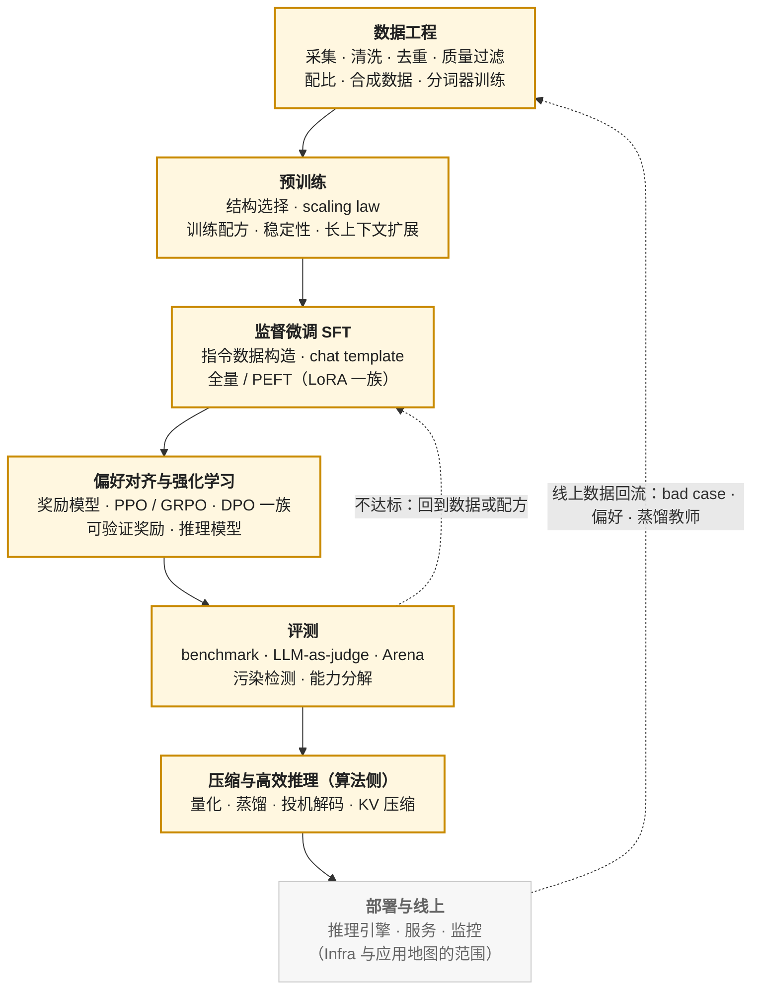

## 内容简介

这是三张 AI 学习地图中的第二张。第一张[《AI-Infra 学习地图》](/ai-infra-learning-roadmap.html)面向为模型搭建训练与推理系统的工程师；这一张面向**做模型的人**——AI 算法工程师；[《AI 应用工程师学习地图》](/ai-application-engineer-learning-roadmap.html)面向在模型之上做产品的 AI 应用工程师。三张地图各自独立，边界与重叠部分在每张地图的末尾说明。

"算法工程师"这个词在大模型时代的含义已经变了。十年前它指的是会推导 SVM 对偶、会调 XGBoost 参数的人；今天它指的是能读懂一篇模型论文并复现它、能为一个基座模型设计后训练配方并把它评测清楚、能判断一个结构改动值不值得付出硬件代价的人。这张地图按今天的含义组织，但不跳过昨天的基础——因为奖励模型本质上是一个分类器，数据过滤靠的是小模型打分，评测方法论来自经典机器学习。

地图回答三个问题：

> **一个模型从数据到上线经过哪些阶段？每个阶段需要掌握什么？按什么顺序学？**

这张地图描述的是**知识结构**，它把知识组织成八层加一个横切，每层说明回答什么问题、包含哪些概念、为什么放在那个位置。其中有一篇：[《Transformer 与 LLM：结构、算量与数值》](/transformer-and-llm-for-infra-engineers.html)系列是两张地图的交点，在第四层会直接引用。

| 需要什么 | 具体是什么 |
|---|---|
| 一套数学 | 线性代数、概率统计、信息论、微积分与优化——读懂公式、推导 loss 的程度 |
| 一套工具 | Python 与科学计算栈、PyTorch 的使用、Hugging Face 生态、实验跟踪 |
| 两代基础 | 经典机器学习的概念与评估方法；深度学习的反向传播、正则化与优化器 |
| 一类模型 | Transformer / LLM：结构、tokenization、scaling law、预训练与数据工程 |
| 一套配方 | 后训练：SFT、偏好对齐、可验证奖励的强化学习、蒸馏、评测 |
| 一层效率 | 推理侧的算法：解码策略、投机解码、量化、KV 压缩 |
| 一个扩展 | 多模态：视觉语言模型、扩散模型、语音 |
| 一种方法 | 实验方法论：假设、消融、可复现、读论文与复现 |

## 两张图：模型生命周期与学习路径

与 Infra 地图一样，理解这个领域需要两张图：一张描述**模型怎么被造出来**，一张描述**人怎么学会造它**。两者的顺序不同。

### 第一张图：模型生命周期视图

一个大模型从数据到上线的流程，以及每个阶段产出什么、算法工程师在其中做什么决定：

两个回边是这张图的重点：**评测不达标回到数据或配方**，是算法工程师日常工作的主循环；**线上数据回流到数据工程**，是模型迭代的外循环。一个只会"跑一次训练"的人不是算法工程师；算法工程师的能力体现在这两个循环里——知道评测结果差在哪一类能力、该改数据还是改配方、改了之后怎么用最小的实验验证。

这张图是生产流程，不是学习顺序。按它从"数据工程"开始学，第一天就要面对"什么数据对模型好"这个整个领域最难的问题。

### 第二张图：学习路径

学习路径分八层加一个横切。前四层是基础（L0–L3），任何方向都要；L4 是核心；L5–L7 是三个可以并行的方向。层的顺序就是推荐的学习顺序。

| 层 | 主题 | 回答的问题 |
|---|---|---|
| L0 | 数学基础 | 公式里的每个符号是什么意思？loss 为什么这样写？ |
| L1 | 编程与工具 | 怎么把一个想法变成一次能跑的实验？ |
| L2 | 机器学习基础 | 什么是学习？怎么知道模型学会了而不是背下来了？ |
| L3 | 深度学习基础 | 梯度怎么流？为什么深了就难训？CNN 与 RNN 各解决了什么、留下了什么？ |
| L4 | LLM 核心 | Transformer 为什么赢？tokenizer、scaling law 与预训练数据各决定了什么？ |
| L5 | 后训练 | 一个基座模型怎么变成一个能对话、会推理、符合偏好的模型？怎么证明它变好了？ |
| L6 | 高效推理与压缩（算法侧） | 不改硬件，怎么让同一个模型更快、更小、更便宜？ |
| L7 | 多模态 | 图片、视频、语音怎么进入语言模型？图像生成为什么是另一套数学？ |
| 横切 | 实验方法论 | 怎么用有限的算力得出可信的结论？ |
| 选修 | 系统内部 ｜ 应用层 | 推理引擎与训练框架怎么实现（→ Infra 地图）｜ Agent、RAG 怎么搭（→ 应用地图） |

### 两张图的叠加

| 生命周期阶段 | 主要用到的层 |
|---|---|
| 数据工程 | L4（tokenization、数据配比）· L2（用分类器过滤数据）· 横切 |
| 预训练 | L4 · L3（优化器、稳定性）· L0（scaling law 的拟合） |
| SFT | L5 · L1（Hugging Face 生态） |
| 偏好对齐与 RL | L5 · L0（概率、KL、策略梯度）· L2（奖励模型是分类器） |
| 评测 | L5 · L2（评估方法论）· 横切 |
| 压缩与高效推理 | L6 · L0（量化误差、投机解码的分布等式） |
| 多模态 | L7 · L3（CNN、ViT）· L4 |

## 逐层说明

### L0 数学基础

> **公式里的每个符号是什么意思？loss 为什么这样写？**

目标不是学完数学系的课程，而是**读公式不卡壳、推导 loss 不出错**。四个分支各自在后面哪里用到，决定了该学到什么深度：

| 分支 | 概念 | 在哪里用到 |
|---|---|---|
| 线性代数 | 矩阵乘法与形状规则、向量空间与内积、范数（L1 / L2 / Frobenius）与余弦相似度、特征值与 SVD、张量 | 一切；SVD 是 LoRA 的初始化与低秩直觉；范数是权重衰减与量化误差；余弦相似度是 embedding 检索 |
| 概率与统计 | 随机变量、条件概率、贝叶斯公式、联合与边缘分布、伯努利 / 二项 / 高斯 / 均匀分布、最大似然 MLE 与最大后验 MAP、置信区间、概率图模型的基本记号 | 语言模型就是 $$p(x_t \mid x_{<t})$$；交叉熵是 MLE；DPO 的推导从 Bradley-Terry 模型开始；评测要给置信区间 |
| 信息论 | 熵、交叉熵、KL 散度、互信息 | 训练 loss 是交叉熵；RLHF 与 DPO 的约束项是 KL；蒸馏的目标是 KL；投机解码的接受率是分布之差 |
| 微积分与优化 | 导数、偏导、梯度、链式法则、Jacobian；凸性、梯度下降、随机梯度下降、学习率、鞍点 | 反向传播是链式法则；优化器（L3）建立在 SGD 之上；策略梯度定理需要对期望求导 |

优化算法里的 Momentum、Adam / AdamW 放在 L3 深度学习里讲，因为它们的设计动机（梯度噪声、稀疏梯度、权重衰减与 L2 的区别）要到训练神经网络时才看得见。

### L1 编程与工具

> **怎么把一个想法变成一次能跑的实验？**

| 工具 | 掌握到什么程度 | 说明 |
|---|---|---|
| Python | 语法、面向对象、类型标注、装饰器、生成器、异常、多进程 / 多线程、asyncio 的基本用法 | 会写、会读别人的训练代码即可；语言机制与运行时内部（GIL、内存、C 扩展）属于 Infra 地图 01 |
| NumPy | ndarray、broadcasting、矩阵运算、轴与 reshape | PyTorch Tensor 的语义与它一致，先在 NumPy 上建立"形状直觉" |
| Pandas / Polars | DataFrame、清洗、聚合、join | 数据工程与评测结果分析的日常工具 |
| Matplotlib / Seaborn | 画 loss 曲线、分布、消融对比图 | 看曲线是判断训练是否正常的第一手段 |
| PyTorch（使用层） | Tensor、Autograd、`nn.Module`、Dataset / DataLoader、Optimizer、AMP 混合精度、DDP / FSDP 的启用方式 | 会用、知道每个 API 在做什么；内部实现（Dispatcher、Autograd 引擎、分布式通信）属于 Infra 地图 03 |
| Hugging Face 生态 | `transformers`、`datasets`、`tokenizers`、`peft`、`trl`、`accelerate` | 当前算法工作的事实标准工具链；读它们的源码是学后训练最快的路 |
| GPU 直觉 | GPU 有算力与带宽两个上限、显存分几块（权重 / 激活 / 优化器状态 / KV）、为什么 batch 大才快、CUDA kernel 与 stream 是什么 | 能看懂 profiler 输出、能解释 OOM 的来源即可；写 kernel 属于 Infra 地图 05 |
| 实验工具 | W&B / MLflow / TensorBoard 记录实验；Hydra / 配置文件管理超参数；git 管代码与配置 | 实验方法论（横切）的物质基础 |

### L2 机器学习基础

> **什么是学习？怎么知道模型学会了而不是背下来了？**

这一层在大模型时代常被跳过，但它提供的是**方法论**而不是具体模型。训练集 / 验证集 / 测试集的划分、过拟合与欠拟合、偏差-方差权衡、正则化、评估指标——这些概念在 LLM 上一个不少地重现：benchmark 污染就是测试集泄漏，奖励模型过拟合就是 reward hacking 的一种来源。

| 主题 | 概念 | LLM 时代为什么还需要 |
|---|---|---|
| 基础概念 | 训练 / 验证 / 测试集、过拟合与欠拟合、偏差-方差、正则化、标准化 | 所有评测与配方决策的方法论来源 |
| 监督学习 | 线性回归、Ridge / Lasso、逻辑回归、朴素贝叶斯、SVM、KNN、决策树、随机森林、梯度提升、XGBoost / LightGBM | 逻辑回归是奖励模型与 DPO 的数学骨架；梯度提升树仍是表格数据与数据质量打分的首选 |
| 无监督学习 | K-Means、DBSCAN、PCA、embedding 聚类 | 数据去重与多样性分析、embedding 空间的可视化 |
| 特征工程 | 特征选择与抽取、缩放、编码 | 在深度学习里被"表示学习"取代，但数据工程里的质量特征仍靠它 |
| 评估 | 分类：Accuracy、Precision / Recall、F1、AUC；回归：MSE、RMSE、MAE；交叉验证、统计显著性 | 评测集怎么划、怎么给置信区间、A/B 差异是否显著 |
| 工具 | scikit-learn | 快速训练一个数据过滤器、一个质量分类器 |

学到"能解释每个概念、能用 scikit-learn 跑通一个分类任务"即可，不需要手推 SVM 对偶。

### L3 深度学习基础

> **梯度怎么流？为什么深了就难训？CNN 与 RNN 各解决了什么、留下了什么？**

| 主题 | 概念 | 说明 |
|---|---|---|
| 基本单元 | 感知机、MLP、激活函数（ReLU、GELU、SiLU / Swish）、前向传播、反向传播 | 反向传播要能手推一个两层网络；这是理解一切训练现象的前提 |
| 正则化与归一化 | Dropout、weight decay、BatchNorm、LayerNorm、RMSNorm、Pre-Norm 与 Post-Norm | LayerNorm / RMSNorm 与 Pre-Norm 是 Transformer 的标准件；BatchNorm 为什么在序列模型里不好用 |
| 优化器 | SGD、Momentum、Adam / AdamW、学习率调度（warmup、cosine、WSD）、梯度裁剪、梯度累积 | AdamW 的两个矩是每参数 8 字节状态的来源；warmup 是训练稳定性的第一道防线 |
| 初始化与稳定性 | Xavier / Kaiming 初始化、梯度消失与爆炸、残差连接 | 残差连接是"深了也能训"的答案，Transformer 的每一层都靠它 |
| CNN | 卷积、池化、感受野、feature map；LeNet → AlexNet → VGG → ResNet | 学到 ResNet 为止：残差是关键遗产；ViT 把卷积换成了 patch embedding，但 CNN 的直觉仍在多模态里有用 |
| RNN | 序列建模、长距离依赖、梯度在时间上的消失；RNN → LSTM → GRU；seq2seq 与 attention 的起源 | 理解 RNN 的失败才理解 attention 为什么赢：并行性与长依赖 |
| 训练实践 | 混合精度（AMP）的用法、显存的四个去向、checkpoint 的保存与恢复、多卡 DDP 的启用 | 会用即可；原理与大规模实现属于 Infra 地图 03、07 |

### L4 LLM 核心

> **Transformer 为什么赢？tokenizer、scaling law 与预训练数据各决定了什么？**

这一层是地图的中心，也是与 Infra 地图的交点。Transformer 的结构、attention 变体、位置编码、MoE、数值格式、量化与投机解码的**数学**，在[《Transformer 与 LLM：结构、算量与数值》](/transformer-and-llm-for-infra-engineers.html)（八篇）里已经写完——那个系列从"每一步算多少、读多少、存多少"的角度讲结构，正是算法工程师判断"这个结构改动值不值"所需要的账。这里列出本层的全部内容，并标出哪些在那个系列里：

| 主题 | 概念 | 在 04 系列 |
|---|---|---|
| NLP 基础 | 分词：BPE / WordPiece / SentencePiece / byte-level BPE，词表大小的取舍，多语言与代码的分词；传统表示：one-hot、词袋、TF-IDF；n-gram 语言模型与困惑度；词向量：Word2Vec（CBOW / Skip-gram）、GloVe → 上下文相关表示（ELMo、BERT） | 词表大小对参数量与 token 效率的影响在第一篇 |
| Transformer 结构 | encoder / decoder / decoder-only 三种形态；self-attention 与 cross-attention；MHA → MQA → GQA → MLA；位置编码：绝对、相对、RoPE、ALiBi、长上下文外推（PI、YaRN、NTK）；FFN 与 SwiGLU；Add & Norm 与 Pre-Norm；MoE 的路由、专家粒度、负载均衡、共享专家；FlashAttention 作为 attention 的**精确等价实现**（不是新算法） | 第一、三、四、五篇 |
| Scaling law | Kaplan 等 2020 与 Chinchilla（Hoffmann 等 2022）：loss 随参数量、数据量、算力的幂律；计算最优的 $$D / N \approx 20$$；数据受限时的多 epoch；推理成本纳入后的"过训练"（Llama 3 的 15T token）；用小模型外推大模型 | 第二篇给出 $$6ND$$ 与 FLOPs 的算法 |
| 预训练 | 目标函数（next-token prediction、MTP）；数据工程：采集、清洗、去重（MinHash / 精确）、质量过滤（分类器、困惑度）、配比与多阶段课程、合成数据、退火阶段；训练配方：batch 与学习率的 scaling、warmup、WSD；训练稳定性的算法侧：loss spike 的归因、z-loss、QK-norm、初始化；长上下文的继续预训练 | 数值与混合精度在第六篇；工程侧（checkpoint、容错、MFU）属于 Infra 地图 07 |
| 经典模型 | GPT-2 / GPT-3 / GPT-4 系列的公开信息；Llama 1–4；Qwen 2 / 2.5 / 3；Mistral 与 Mixtral；DeepSeek-V2 / V3 / R1；Kimi K2；Gemma。读技术报告时关注：结构选择、数据规模与配比、训练配方、评测方法 | 第一、三、五篇以 Llama-3 与 DeepSeek-V3 为基线 |

读 04 系列时，算法工程师的收获与 Infra 工程师相反：Infra 工程师从中知道要优化什么，算法工程师从中知道自己的每个结构决定在硬件上花多少钱——GQA 的组数、MLA 的压缩维、专家的粒度、上下文长度，每一个都对应成本表上的一格。

### L5 后训练

> **一个基座模型怎么变成一个能对话、会推理、符合偏好的模型？怎么证明它变好了？**

这是当前算法工程师工作量最集中的一层，也是变化最快的一层。按流程分五段：

| 段 | 概念 | 说明 |
|---|---|---|
| SFT | 指令数据的构造（人工、self-instruct、蒸馏自强模型）、多轮对话格式与 chat template、loss mask（只算回复部分）、packing；全量微调 vs 参数高效微调：LoRA、QLoRA、DoRA、Prefix-Tuning / P-Tuning、Adapter、OFT；灾难性遗忘与数据回放 | LoRA 的参数量与计算形态在 04 系列第七篇；多 LoRA 服务属于 Infra 地图 08 |
| 偏好对齐 | 偏好数据（成对比较、打分、AI 反馈 RLAIF）；奖励模型：Bradley-Terry、pairwise loss、过拟合与 reward hacking；在线 RL：PPO（策略、价值、参考模型、KL 惩罚、GAE）、GRPO（组内相对优势，去掉价值模型）、RLOO、REINFORCE++；离线 / 直接偏好优化：DPO、IPO、KTO、ORPO、SimPO；拒绝采样 + SFT（Llama 2 / 3 的做法，与投机解码里的拒绝采样同名不同物） | 每种方法各改了 RLHF 三件套（策略、奖励、参考）中的哪一件，是理解这一族的钥匙 |
| 推理模型 | 可验证奖励的强化学习（RLVR：数学答案、代码测试）；DeepSeek-R1 的 GRPO 配方与"aha moment"；长思维链、test-time compute scaling；过程奖励模型 PRM 与结果奖励 ORM；推理长度的控制 | 2025 年后训练的主线；RL 训练的 rollout 与训练如何共享 GPU 属于 Infra 地图的选修 |
| 蒸馏 | logits 级蒸馏（KL 到教师分布）、序列级 / 数据蒸馏（用教师生成 SFT 数据，R1 蒸馏小模型的做法）、on-policy 蒸馏；蒸馏与量化的组合 | 蒸馏是把大模型能力搬进小模型的主要手段，也是"线上回流"回边上的一站 |
| 评测 | 通用 benchmark（MMLU、GSM8K、MATH、HumanEval、IFEval、MT-Bench 等）与它们各自测什么；LLM-as-judge 的偏差（位置、长度、自我偏好）；人类偏好 Arena；污染检测；能力分解与错误分析；评测集自建 | 评测是"回到数据或配方"那条回边的起点；不会评测就不知道改什么 |

工具层：`trl`、OpenRLHF、verl 的使用；知道它们把 rollout（推理）与训练（反向）怎么拼起来，但实现内部属于 Infra。

### L6 高效推理与压缩（算法侧）

> **不改硬件，怎么让同一个模型更快、更小、更便宜？**

推理优化分两半：**算法侧**改变模型或解码过程，**系统侧**改变调度与内存管理。这张地图只放前者；后者（PagedAttention、continuous batching、chunked prefill、PD 分离）是 Infra 地图 08 的主体，算法工程师只需知道它们存在、知道自己的模型结构对它们意味着什么（比如 MLA 让 KV 变小、MoE 让 batch 内的 GEMM 变碎）。

| 主题 | 概念 | 在 04 系列 |
|---|---|---|
| 解码策略 | greedy、beam search、temperature、top-k / top-p / min-p、重复惩罚、结构化输出（约束解码）；采样对评测结果的影响 | — |
| 投机解码 | 小模型起草、大模型验证、拒绝采样保证分布一致；期望接受长度；草稿来源：独立小模型、Medusa、EAGLE、MTP、n-gram | 第七篇给出数学与收益区间 |
| 量化 | PTQ：GPTQ、AWQ、SmoothQuant、FP8、W4A16 vs W8A8；QAT；KV cache 量化；格式与工具：GGUF（llama.cpp）、bitsandbytes、AutoGPTQ / AutoAWQ——它们是**格式与实现**，不是新算法 | 第七篇给出原理与字节数；kernel 实现属于 Infra 地图 05 |
| 结构级压缩 | 剪枝与结构化稀疏（2:4）、层裁剪与深度缩放、MLA 一类 KV 压缩结构、KV eviction（H2O、StreamingLLM） | 第三篇给出 KV 的账 |
| 长上下文推理 | 位置外推方法的推理侧、稀疏 attention（NSA、MoBA）、上下文压缩 | 第四篇 |

### L7 多模态

> **图片、视频、语音怎么进入语言模型？图像生成为什么是另一套数学？**

多模态有两条几乎独立的线：**理解**（把其他模态送进 LLM）与**生成**（扩散模型）。前者是 LLM 的扩展，后者是另一套数学。

| 线 | 主题 | 概念 |
|---|---|---|
| CV 基础 | 任务与骨干 | 图像分类、目标检测、分割；CNN → ViT（patch embedding、位置编码）；对比学习：CLIP、SigLIP——视觉编码器的来源 |
| 理解 | 视觉语言模型 VLM | vision encoder（ViT）、connector（MLP projector、2×2 merge / pixel-shuffle、Perceiver resampler / Q-Former）、LLM decoder；decoder-only 注入 vs cross-attention 注入；固定分辨率、tile、原生动态分辨率；多模态位置编码（M-RoPE）；视频（帧采样、时间合并）；对齐训练的阶段（先训 connector、再全量）；代表模型：LLaVA、Qwen-VL 系列、InternVL、Llama 3.2 Vision |
| 理解 | 语音与全模态 | ASR（Whisper 的 encoder-decoder）、TTS、语音 LLM（音频 encoder + LLM）、全模态模型（Qwen2.5-Omni、GPT-4o 一类）的统一输入输出 |
| 生成 | 扩散模型 | 前向加噪与反向去噪、DDPM、DDIM 与采样加速、score matching 与 flow matching 的统一视角、classifier-free guidance；U-Net → DiT（扩散 Transformer）；VAE 与 latent diffusion；文本条件（CLIP / T5 文本编码器）；代表模型：Stable Diffusion 1.x / SDXL / SD3、FLUX；视频生成（Sora 一类，时空 patch） |
| 生成 | 自回归生成与统一模型 | 图像 token 化（VQ-VAE）、自回归图像生成、理解与生成统一的模型 |

VLM 的成本结构——一张图等于多少 token、encoder 与 decoder 各花多少、image token 的 KV——在 04 系列第八篇里算过。扩散模型的成本结构（无 KV cache、compute-bound、多步迭代）与 LLM 完全不同，两张地图都还没有为它单独写系列。

### 横切：实验方法论

> **怎么用有限的算力得出可信的结论？**

这是算法工程师区别于"会调 API 的人"的核心能力，不属于任何一层，对每一层都适用：

| 能力 | 内容 |
|---|---|
| 提假设 | 把"我觉得这样会好"变成一个可以被证伪的陈述：改什么、预期哪个指标变、变多少 |
| 小规模先行 | 用小模型、小数据做消融（ablation），一次只改一个变量；知道哪些结论能随规模外推、哪些不能（scaling law 的实验设计） |
| 控制随机性 | 随机种子、数据顺序、非确定性 kernel；多 seed 报告均值与方差；知道差异多大才算显著 |
| 记录与复现 | 每次实验的代码版本、配置、数据版本、环境全部可追溯；实验跟踪工具；能复现三个月前的结果 |
| 读论文与复现 | 从论文里提取"改了什么、和谁比、用什么评"；先复现 baseline 再复现方法；对报告数字保持怀疑（评测设置、污染、挑选） |
| 看曲线 | loss、梯度范数、学习率、评测指标随步数的曲线；能从曲线形状判断学习率过大、数据有问题、过拟合开始 |

### 选修

- **系统内部**：推理引擎（调度、KV cache 管理、PD 分离）、训练框架（并行策略、checkpoint、容错）、GPU kernel、集合通信的实现。算法工程师用它们、不改它们；需要改的时候，走 [Infra 地图](/ai-infra-learning-roadmap.html)。
- **应用层**：Prompt 工程、RAG、工具调用、Agent 框架、评测应用效果。它们在模型之上，属于[第三张地图](/ai-application-engineer-learning-roadmap.html)。
- **经典 NLP 任务与其他方向**：命名实体识别、句法分析等传统 NLP 任务，以及搜索、推荐、广告等有自己一套模型与评测体系的方向，不在这张地图上。

## 与 AI-Infra 地图的关系

两张地图有大量重叠的名词——Python、PyTorch、CUDA、Transformer、LoRA、量化、混合精度、DDP / FSDP。重叠是正常的：两类工程师面对同一个系统。分工用一条规则说清：

> **同一个主题，算法地图回答"为什么这样建模、效果如何"，Infra 地图回答"在硬件上花多少钱、系统怎么实现"。**

| 重叠主题 | 算法地图负责 | Infra 地图负责 | Infra 系列 |
|---|---|---|---|
| Python | 会写、会读训练代码 | 语言机制、运行时、内存、C 扩展、交付 | 01 |
| PyTorch | Tensor / Autograd / Module / DataLoader / AMP / DDP 的用法 | Dispatcher、Autograd 引擎、编译、分布式通信栈的实现 | 03 |
| GPU / CUDA | 算力与带宽两个上限、显存去向、为什么 batch 大才快 | CUDA 编程模型、访存、Tensor Core、Triton、FlashAttention 的实现 | 05 |
| Transformer 结构 | 各结构的建模动机与效果 | 各结构的参数量、FLOPs、KV、通信量 | 04（共享） |
| 量化 | 选哪种方法、精度损失多大 | 字节数与收益区间、量化 kernel | 04 · 05 |
| LoRA | 微调配方、秩与目标矩阵的选择 | 参数与状态的账、多 LoRA 服务的 kernel 与调度 | 04 · 08 |
| 投机解码 | 草稿模型的训练、接受率 | 加速比的数学、引擎中的实现 | 04 · 08 |
| 混合精度 / FP8 | 用法、对训练稳定性的影响 | 格式、累加精度、数值丢失的位置 | 04 |
| 分布式训练 | DDP / FSDP 的启用、并行度对配方的影响 | 并行策略、checkpoint、容错、MFU | 03 · 07 |
| 推理系统机制 | 知道存在；自己的结构对它们意味着什么 | PagedAttention、continuous batching、chunked prefill、PD 分离 | 08 |
| RL 后训练 | 算法：奖励、目标函数、配方 | rollout 引擎与训练器的共置、权重同步 | 选修 |
| 数据管线 | 数据配比、质量、去重的**决策** | tokenization 离线化、流式加载、打包的**实现** | 07 |

一个常见的误分类：把 PagedAttention、continuous batching、chunked prefill、PD 分离归入"推理算法"。它们不是算法，是推理引擎的调度与内存管理机制，模型不知道它们的存在，输出分布也不因它们改变。算法侧的推理优化只有 L6 列出的那些——改变模型或改变解码过程的方法。

04 系列是两张地图共享的唯一系列，因为它讨论的对象——模型作为一个计算对象的成本——恰好是两类工程师对话的语言。

## 按目标选择路径

| 目标 | 路径 | 说明 |
|---|---|---|
| 后训练（SFT / RLHF / 推理模型） | L0 → L1 → L3 → L4 → L5 → 横切 | 当前需求最大的方向；L2 只补评估方法论 |
| 预训练与数据 | L0 → L1 → L2 → L3 → L4（重 scaling law 与数据工程）→ 横切 | 门槛最高，算力决定一切；小规模实验设计是核心能力 |
| 多模态 | L3（CNN、ViT）→ L4 → L7 → L5（多模态后训练） | 理解线与生成线可以只走一条 |
| 推理效率（算法侧） | L0 → L4 → L6 → Infra 地图 08 | 与 Infra 交界最深的方向，通常需要读两张地图 |
| 后端工程师转算法 | L1（已有编程基础，补科学计算栈）→ L0 → L2 → L3 → L4 → 任选一个方向 | 数学是最大缺口，但按需补：先读 L4 遇到不懂的公式再回 L0 |

## 边界与说明

### 不在地图上的内容

- **系统实现**：推理引擎、训练框架、kernel、通信、集群调度。属于 Infra 地图。
- **应用层**：Prompt、RAG、Agent、编排框架、产品评测。属于[应用地图](/ai-application-engineer-learning-roadmap.html)。
- **搜索、推荐、广告、传统 NLP 任务**：各自有独立的模型体系与评测体系，值得单独的地图。
- **理论机器学习**：泛化理论、优化理论、统计学习理论的系统课程。算法工程师用它们的结论，不做它们的研究。
- **数学的系统课程**：L0 只列出后面用到的部分，学到能读公式为止。

### 版本与时效

具体模型、benchmark 与后训练方法是这张地图上变化最快的部分：2023 年的主线是 SFT + PPO，2024 年是 DPO 一族，2025 年是可验证奖励的 RL。地图列出的是当前的主线，并会随之更新；不变的是结构——数据、预训练、后训练、评测、压缩这五段，以及"评测不达标回到数据或配方"这个循环。

### 关于"AI 算法工程师"

这张地图的目标是能**读懂论文并复现、设计并验证一个训练配方、把结果评测清楚**的工程师。研究员（提出新方法）与这条路径在 L4、L5 之后分叉：研究需要更深的数学与更多的失败实验，地图只送到分叉口。

## 最终目标

读完这张地图上的内容之后，面对一个基座模型和一个业务目标，读者应该能够沿着整条流水线追问下去：

| 追问 | 答案来自 |
|---|---|
| 这个模型的结构选择（GQA、MoE、上下文长度）各是为了什么？代价是什么？ | L4 · 04 系列 |
| 给它 1000 条业务数据，该 SFT 还是 DPO？全量还是 LoRA？ | L5 |
| 它在这个任务上"变好了"是真的吗？评测集有没有泄漏？差异显著吗？ | L5 · L2 · 横切 |
| 想让它会推理，奖励从哪里来？GRPO 还是 DPO？ | L5 |
| 部署时想快一倍、小一半，量化到多少位？投机解码有用吗？ | L6 · 04 系列 |
| 要让它看图，encoder 选什么？一张图占多少 token？ | L7 · 04 系列第八篇 |
| 这个结论在 1B 上成立，在 70B 上还成立吗？ | 横切 · L4 scaling law |

三张地图不是为了覆盖更多名词，而是为了让 AI 系统里的三类人——造模型的、跑模型的、用模型的——知道自己站在哪里、隔壁在做什么。
