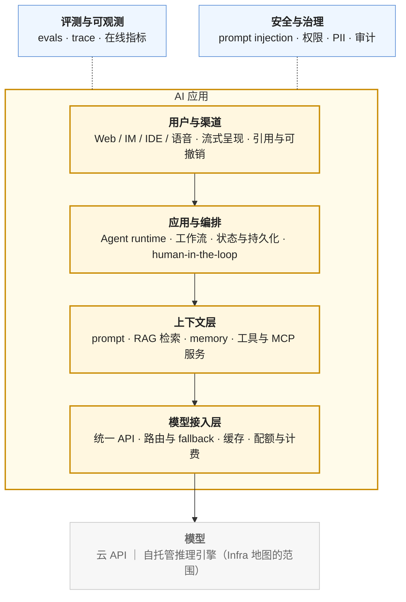
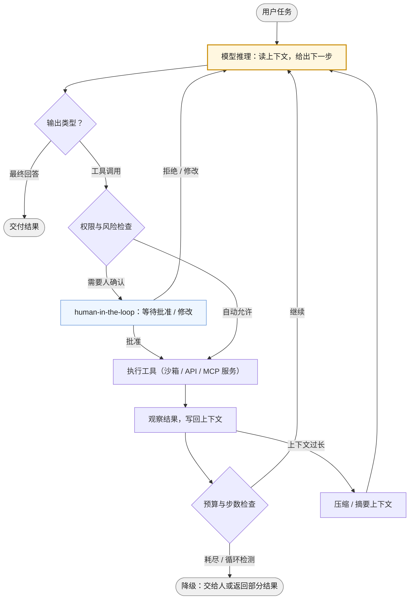

## 内容简介

这是三张 AI 学习地图中的第三张。[《AI-Infra 学习地图》](/ai-infra-learning-roadmap.html)面向**跑模型的人**，[《AI 算法工程师学习地图》](/ai-algorithm-engineer-learning-roadmap.html)面向**造模型的人**，这一张面向**用模型做产品的人**——AI 应用工程师。它假设读者有后端工程的基础（服务、数据库、API、部署），同时关心产品：什么场景值得做、用户怎么用、效果怎么衡量。

调用一个模型 API 只要五行代码，这让"AI 应用开发"看起来门槛很低。真正的门槛在第六行之后：模型是一个**非确定性、会出错、按 token 计费、有上下文上限**的组件，而产品要求的是可靠、可控、可衡量、可负担。AI 应用工程师的全部工作，是在这样一个组件之上，用检索、工具、编排、评测、运营把它变成一个可以交付的产品。

地图回答三个问题：

> **一个 AI 应用由哪些层组成？每一层需要掌握什么？按什么顺序学？**

| 需要什么 | 具体是什么 |
|---|---|
| 一种组件观 | 把模型当作一个有明确契约与失效模式的组件：API、token、上下文、延迟、幻觉 |
| 一套上下文工程 | 决定模型在每一步看到什么：prompt、检索结果、记忆、工具输出，以及它们的预算 |
| 一层检索 | RAG：把私有知识可靠地送进上下文 |
| 一层 Agent | 工具调用、循环、状态、多 agent、人机协作——让模型从"回答"变成"做事" |
| 一套评测 | AI 应用的单元测试：没有评测就没有迭代 |
| 一层运营 | 成本、延迟、安全、发布与回滚、数据飞轮 |
| 一种产品观 | 什么场景值得做、人和模型怎么分工、不确定性怎么呈现给用户 |

与前两张地图不同，这一层几乎没有 PyTorch 那样的事实标准框架。稳定的是**协议与模式**——OpenAI 兼容的模型 API、MCP、ReAct 循环、RAG 管线、evals；框架（LangChain / LangGraph、LlamaIndex、Dify、各家 Agent SDK）迭代很快。地图以协议与模式为主线，框架只作为抓手或代表点名。

## 两张图：架构视图与学习路径

### 第一张图：架构视图

一个 AI 应用从用户到模型的分层，以及贯穿所有层的两条横切：

四层各有一个核心问题：用户层——不确定的输出怎么呈现；编排层——多步任务的状态放在哪、失败了怎么继续；上下文层——模型这一步该看到什么、看多少；接入层——用哪个模型、坏了换谁、花了多少钱。两条横切的地位与后端系统里的测试与安全相同：不是某一层的事，是每一层的事。

### 场景轴：AI4业务与 AI4IT

架构视图是能力轴。AI 应用还有一根**场景轴**，按服务对象分两类：

| | AI4业务 | AI4IT |
|---|---|---|
| 服务谁 | 业务用户与客户 | 工程师与 IT 系统 |
| 代表场景 | 智能客服、业务助手、内容生成、智能搜索、行业流程自动化（审核、报告、合同） | coding agent、AIOps（告警归因、变更审查）、数据分析 agent（text-to-SQL）、内部知识库、运维与工单 |
| 工具集 | 业务系统 API、CRM / ERP、知识库 | 代码库、终端、CI、监控与日志、数据库 |
| 验证方式 | 人工评审、用户反馈、业务指标，**难以自动验证** | 编译、测试、lint、查询结果，**大部分可自动验证** |
| 错误代价 | 面向客户，错误直接外露 | 面向内部，有人审核与回滚 |
| 当前成熟度 | copilot 形态为主，agent 形态在推进 | coding agent 已是最成熟的 agent 产品 |

两类场景**共用全部能力层**——同一套上下文工程、工具调用、评测、运营。差别在工具集与验证方式，而验证方式决定了 agent 能走多远：能自动验证的场景（代码能跑测试、SQL 能看结果）允许 agent 自主循环几十步再交给人，这是 coding agent 最先成熟的原因；不能自动验证的场景只能把循环收短、把人放在环内。理解这一点，比记住哪个场景"火"更重要：它告诉你一个新场景的 agent 化上限在哪。

本图的分层按能力轴走；coding agent 作为最成熟的 agent 形态，在第四层作为案例解剖。

### 第二张图：学习路径

| 层 | 主题 | 回答的问题 |
|---|---|---|
| L1 | 模型作为组件 | 模型这个组件的契约是什么？它怎么失效？怎么选？ |
| L2 | Prompt 与上下文工程 | 模型这一步该看到什么？怎么让输出可解析、可稳定？ |
| L3 | 检索增强（RAG） | 私有知识怎么可靠地进入上下文？怎么知道检索对了？ |
| L4 | 工具与 Agent | 模型怎么从"回答"变成"做事"？多步任务的状态、失败与人机协作怎么处理？ |
| L5 | 评测与可靠性 | 怎么知道改了之后更好了？上线后怎么发现它变坏了？ |
| L6 | 生产化与运营 | 成本、延迟、安全、发布、回滚，以及数据怎么回流 |
| L7 | 产品与体验 | 什么场景值得做？人和模型怎么分工？不确定性怎么呈现？ |
| 横切 | 评测驱动开发 | 没有评测集的改动只是猜 |
| 选修 | 微调 ｜ 自托管 ｜ 多模态交互 ｜ 端侧 | 何时从"用模型"走向"改模型"或"跑模型" |

顺序的理由：先把模型当组件理解透（L1），再学控制它的输入（L2、L3）、扩展它的能力（L4），然后才是衡量（L5）与运营（L6）——但**评测（L5）应该在做第一个原型时就开始**，这是横切一节的主题。产品（L7）放最后不是因为不重要，而是因为它的每个判断都需要前六层的知识做支撑。

### 两张图的叠加

| 架构视图中的位置 | 学习层 |
|---|---|
| 用户与渠道 | L7 · L6（流式与延迟） |
| 应用与编排 | L4 |
| 上下文层 | L2 · L3 · L4（工具与 memory） |
| 模型接入层 | L1 · L6 |
| 模型 | L1（选型）；实现属于 Infra 地图 |
| 评测与可观测 | L5 · 横切 |
| 安全与治理 | L6 |
| 场景轴 | L7 · L4（验证方式决定 agent 化程度） |

## 逐层说明

### L1 模型作为组件

> **模型这个组件的契约是什么？它怎么失效？怎么选？**

后端工程师习惯的组件（数据库、消息队列）有确定的语义；模型没有。这一层的目标是建立一个准确的组件模型——它能做什么、怎么坏、花多少钱、多慢：

| 主题 | 概念 | 说明 |
|---|---|---|
| 失效模式 | 非确定性（同一输入不同输出）、幻觉（自信地编造）、指令遵循不稳、上下文窗口上限与"中间遗忘"、知识截止、对 prompt 微小改动的敏感 | 每一条都对应后面某一层的应对手段；先知道病，再学药 |
| API 契约 | 消息与角色（system / user / assistant / tool）、tool calling、structured output（JSON schema）、多模态输入（图片 / 音频 / 文件）、流式输出、prompt caching、批处理接口、推理模型的 reasoning 参数 | OpenAI 兼容格式已是事实标准，自托管引擎（vLLM 等）也提供同一接口；学一次，处处可用 |
| 成本与延迟形态 | 按输入 / 输出 token 计费，输出贵数倍；缓存命中的输入折价；首 token 延迟（TTFT）与逐 token 速度；长上下文让 TTFT 线性增长；推理模型的"思考"token 既花钱又花时间 | 这是 L6 成本与延迟优化的账本；理解 prefill / decode 的差别只需要 Infra 地图 08 前两篇的结论 |
| 模型选型 | 闭源 API vs 开源自托管；推理模型 vs 非推理模型；大模型 vs 小模型分流；embedding 模型与 rerank 模型；多模态能力；上下文长度；排行榜的局限（污染、与自己任务的相关性） | 选型的正确方法是用自己的评测集（L5）跑一遍，不是看榜 |
| 客户端工程 | 重试与退避、超时、幂等、速率限制、SDK 与直接 HTTP、流式解析（SSE）、tokenizer 计数 | 与调用任何不稳定的第三方服务相同，但失败类型更多（内容过滤、上下文超限、工具调用格式错） |

### L2 Prompt 与上下文工程

> **模型这一步该看到什么？怎么让输出可解析、可稳定？**

"prompt 工程"这个词已经不够用：生产系统里模型每一步看到的东西，是 system prompt、对话历史、检索结果、工具返回、记忆片段拼成的一个**上下文**，它的组装、预算与压缩是一门工程。

| 主题 | 概念 | 说明 |
|---|---|---|
| prompt 设计 | 角色与任务说明、few-shot 示例、思维链与"先想再答"、分步与分解、输出格式约束、负面指令的低效、模型差异（同一 prompt 换模型要重调） | 模式是稳定的，措辞是不稳定的；把 prompt 当代码管，不当文案管 |
| 结构化输出 | JSON schema 约束解码、枚举与类型校验、解析失败的重试与修复、结构化输出对推理质量的影响 | 让下游代码能消费模型输出的前提 |
| 上下文预算 | 各部分（system、历史、检索、工具输出）的 token 配额；历史的截断与摘要；检索结果的数量与排序；工具输出的裁剪 | 上下文不是越多越好：无关内容降低准确率、拉长延迟、增加成本 |
| prompt caching | 前缀稳定才能命中：system prompt 与工具定义放前面、动态内容放后面；缓存对成本与 TTFT 的影响 | 一个排序决定能省一半成本 |
| 版本与迭代 | prompt 放版本库、与模型版本绑定、每次改动跑评测集（L5）、A/B | prompt 改一个词就是一次发布 |
| 长上下文 vs 检索 | 什么时候把全部资料塞进上下文、什么时候检索；成本、延迟、准确率三者的权衡 | 引出 L3 |

### L3 检索增强（RAG）

> **私有知识怎么可靠地进入上下文？怎么知道检索对了？**

RAG 是 AI 应用最常见的形态，也是最容易"demo 很好、上线很差"的形态。它的每一步都有工程决定，而效果差通常出在检索而不是生成。

| 阶段 | 概念 | 说明 |
|---|---|---|
| 文档处理 | 解析（PDF、Office、HTML、扫描件 OCR、表格与图片）、清洗、元数据（来源、时间、权限）、分块策略（固定 / 递归 / 语义 / 按结构）、块大小与重叠 | 分块是 RAG 效果的第一决定因素，且没有通用答案 |
| 索引 | embedding 模型选择与维度、向量索引（HNSW、IVF）与近似检索的召回-延迟权衡、向量库（pgvector、Qdrant、Milvus、Elasticsearch 一类，点名不展开）、全文索引与 BM25、增量更新与删除 | 数据量小时 pgvector 足够；先用现有基础设施 |
| 检索 | 混合检索（向量 + 关键词）与融合（RRF）、rerank（cross-encoder）、query 改写与扩展、多跳检索、HyDE、元数据过滤、权限过滤（谁能看什么必须在检索时做） | rerank 是性价比最高的一步 |
| 生成 | 引用与溯源（让答案指回原文）、"不知道"的处理、上下文排序对生成的影响 | 引用是 RAG 产品可信度的来源（L7） |
| 进阶形态 | GraphRAG（实体关系图辅助检索）、多模态 RAG（图表、图片）、Agentic RAG（让 agent 决定检索什么、检索几次）、长上下文模型对 RAG 的替代与互补 | 先把基础 RAG 做好再考虑 |
| 评测 | 检索侧：recall@k、MRR；生成侧：faithfulness（忠于上下文）、answer relevance、context precision；评测集的构造（从真实问题采样、人工标注标准答案） | 检索与生成要分开评，否则不知道该改哪一半 |

### L4 工具与 Agent

> **模型怎么从"回答"变成"做事"？多步任务的状态、失败与人机协作怎么处理？**

Agent 是当前变化最快、也最容易被过度设计的一层。它的核心机制并不复杂——一个循环：模型看上下文、决定调用什么工具、执行、把结果放回上下文、再决定。复杂的是把这个循环做**可靠**：

图里每一个菱形都是一个工程决定：权限检查决定哪些工具能自动执行、哪些要人批准；预算检查防止无限循环与失控的成本；上下文压缩决定长任务能走多远。一个 agent 框架提供的，本质上就是这张图的运行时。

| 主题 | 概念 | 说明 |
|---|---|---|
| 工具调用 | function calling 的契约（schema、参数校验、返回格式）；工具描述的写法决定模型用不用对；工具数量与选择准确率的关系；并行工具调用 | 工具是 agent 的手；描述写不好，手就不听话 |
| MCP | Model Context Protocol：把工具、资源、prompt 模板以统一协议暴露给任何模型客户端；server / client 架构、传输方式、鉴权 | 工具生态的"USB 接口"，是这一层最值得学的协议 |
| 循环与规划 | ReAct（思考-行动-观察）、plan-and-execute、反思与自我修正；推理模型对显式规划的替代 | 大多数任务一个 ReAct 循环就够 |
| 状态与持久化 | 多步任务的状态放在哪；中断与恢复；durable execution（每步持久化、崩溃后继续）；状态机建模。**LangGraph 在这里作为抓手**：它把 agent 显式建成有状态的图，checkpoint 每一步，是理解"agent 运行时"最直接的参考实现——不是因为它是标准，而是这个概念没有具体实现很难讲清 | 后端工程师的老朋友：工作流引擎与状态机 |
| memory | 会话内记忆（上下文本身）、跨会话记忆（用户偏好、历史事实）的存储与检索、记忆的写入策略与遗忘 | 本质是一个特殊的 RAG |
| 多 agent | 什么时候需要（上下文隔离、并行、专业化）；orchestrator-workers、handoff、层级；agent 间协议（A2A 一类）；多 agent 的成本与调试代价 | 多 agent 不是默认选项：先用一个 agent 加更好的工具 |
| 沙箱与安全 | 代码执行沙箱（容器、microVM）、文件系统与网络隔离、工具的最小权限、prompt injection 通过工具返回进入上下文的风险 | agent 的每一个工具都是攻击面 |
| 人机协作 | 哪些动作需要确认（不可逆、高成本、对外）、确认的粒度、人在环内的交互设计、审批的持久化 | 人机分工是 L7 的产品问题，也是这里的运行时问题 |
| 可靠性 | 幂等的工具设计、失败重试与回退、循环检测、步数与 token 预算、超时、部分结果的交付 | agent 的失败是常态，设计要假设失败 |

**案例：coding agent 的 Harness 解剖。** Claude Code、Cursor Agent、Codex 一类 coding agent 是当前最成熟的 agent 产品，也是学习 agent 工程最好的解剖对象——因为代码场景可自动验证，它们把循环做到了几十步。模型之外的一切，业内叫 **harness**（马具）：

| Harness 组件 | coding agent 里的做法 | 通用意义 |
|---|---|---|
| 工具集 | 读文件、搜索（grep / glob）、编辑、执行命令、浏览器；工具少而正交 | 工具集设计：给模型"手"而不是"按钮" |
| 上下文管理 | 项目说明文件（如 `AGENTS.md`）作为常驻上下文；按需读文件而不是全量塞入；长会话自动压缩；子 agent 隔离探索性搜索的上下文 | 上下文预算（L2）在长任务里的实践 |
| 权限模型 | 只读工具自动执行、写与执行需确认、可配置白名单、危险操作二次确认 | 图中"权限与风险检查"的实例 |
| 验证循环 | 改完跑测试、lint、类型检查，结果回到上下文，模型自己修 | 自动验证是 agent 自主性的来源；业务场景要找自己的"测试" |
| 沙箱 | 工作目录隔离、命令执行的限制、网络访问控制 | 安全边界 |
| 可观测 | 每一步的工具调用、token 消耗、耗时可见；trace 可回放 | L5 的 trace 在 agent 上的形态 |

建设 harness 的人——给 agent 配工具、定权限、管上下文、搭验证——是 AI4IT 方向上平台工程师的新角色。把这张表套到任何一个业务场景上，缺哪一格，agent 就在哪一格失控。

### L5 评测与可靠性

> **怎么知道改了之后更好了？上线后怎么发现它变坏了？**

evals 之于 AI 应用，如同单元测试之于软件——区别是 AI 应用没有 evals 连"能跑"都不能确认。这是应用工程师与"会调 API 的人"的分水岭。

| 主题 | 概念 | 说明 |
|---|---|---|
| 评测集 | golden set 的构造（从真实流量采样、覆盖边界与失败案例、人工标注期望）、规模（几十条就能开始，几百条能看趋势）、持续补充（线上 bad case 回流） | 评测集是 AI 应用最重要的资产，比 prompt 重要 |
| 评分方式 | 精确匹配与规则（能自动验证的优先）、LLM-as-judge（评分标准、参考答案、pairwise 对比）及其偏差（位置、长度、自我偏好、宽容度）、人工评审的抽样与一致性 | judge 也要被评测：与人工标注的一致率 |
| 评什么 | 单步：准确率、格式正确率、faithfulness；RAG：检索与生成分开（L3）；agent：任务完成率、步数与成本、工具调用正确率、轨迹评测（过程对不对，不只结果） | agent 的评测最难，也最缺 |
| 回归与门禁 | 每次改 prompt / 模型 / 检索参数跑全量评测集；CI 里的评测门禁；模型供应商静默升级带来的回归 | "换了个模型版本效果变差"是常态 |
| 在线评测 | A/B 与灰度、隐式反馈（采纳、重试、放弃）、显式反馈（点赞点踩、纠正）、在线指标与离线评测集的校准 | 离线好不等于在线好 |
| trace 与可观测 | 每次请求的完整链路（prompt、检索结果、工具调用、模型输出、token、耗时、成本）；OpenTelemetry 的 GenAI 语义约定；Langfuse / LangSmith / Arize Phoenix 一类工具（点名）；trace 回放与调试 | 没有 trace 的 agent 无法调试 |
| 运行时可靠性 | guardrails（输入输出检查、话题与格式约束）、fallback（换模型、降级到规则）、幻觉检测（引用校验、一致性检查）、置信度与"拒答" | 在评测发现之前，先在运行时兜底 |

### L6 生产化与运营

> **成本、延迟、安全、发布、回滚，以及数据怎么回流？**

| 主题 | 概念 | 说明 |
|---|---|---|
| 模型接入 | 通过模型网关接多供应商（统一 API、路由、fallback、配额、计费）；应用侧使用网关，网关的**建设**属于 Infra 地图 09 | 不要在每个应用里各写一遍供应商适配 |
| 成本 | token 账：输入 / 输出 / 缓存 / 思考 token 分别多少；prompt caching 的前缀设计；小模型分流（路由简单请求）；批处理接口；上下文裁剪；缓存语义相同的请求；按用户 / 功能的 token 预算与告警 | 成本是 AI 应用最容易失控的指标 |
| 延迟 | 流式输出（感知延迟）、TTFT 的来源（上下文长度、排队）、并行工具调用、预取与投机（提前检索）、模型选择（小模型快）、超时与降级 | 用户感知的是 TTFT，不是总时长 |
| 安全 | prompt injection（直接与间接——通过网页、文档、工具返回注入）、越狱、系统 prompt 泄漏、数据泄漏（把私有数据发给模型、模型输出中的 PII）、工具的最小权限与沙箱、输出内容安全；防御的分层（输入过滤、权限、输出检查、人工确认）而不是指望一个过滤器 | 间接注入是 agent 时代最重要的新攻击面 |
| 治理与合规 | 审计日志（谁在什么时候让模型做了什么）、数据驻留与供应商条款、用户数据是否用于训练、模型版本的记录、AI 生成内容的标识 | 面向企业客户的必答题 |
| 发布 | prompt / 模型 / 检索配置的版本化与灰度、评测门禁、回滚；供应商模型的弃用周期 | 把 prompt 当代码发布 |
| 数据飞轮 | 线上反馈 → bad case → 评测集补充 → prompt / 检索迭代；积累到一定规模 → 微调数据（选修）；用户纠正作为标注 | 这是 AI 应用长期护城河的来源 |

### L7 产品与体验

> **什么场景值得做？人和模型怎么分工？不确定性怎么呈现？**

| 主题 | 概念 | 说明 |
|---|---|---|
| 场景选择 | 模型擅长什么（生成、总结、分类、抽取、对话、代码）；错误代价与验证成本决定形态；"demo 到产品的鸿沟"——demo 展示的是上限，产品交付的是下限；ROI：省了谁的时间、值多少 | 好场景的特征：错误可容忍或可验证、有明确的人工基线 |
| 形态选择 | copilot（人主导，模型建议）→ agent（模型主导，人审批）→ 自动化（无人在环）；同一场景随可靠性提升逐步升级 | 与场景轴一节的验证方式对应 |
| 人机分工 | 信任的建立与校准：过度信任与不信任都是失败；让用户知道模型在做什么、做到哪；可撤销、可修改、可接管 | 人机协作设计是 AI 产品区别于传统产品的核心 |
| 不确定性的呈现 | 流式输出、引用与溯源、置信度与"我不确定"、多候选、生成过程可见（agent 的步骤） | 让用户能判断，而不是让用户相信 |
| 交互形态 | 对话不是唯一形态：内嵌到工作流、批处理、后台 agent、语音；对话式界面的局限（发现性差、不可预测） | "加个聊天框"往往是最差的集成方式 |
| 产品指标 | 任务完成率、采纳率（建议被接受）、人工介入率、纠正率、用户留存；成本 / 任务；与 L5 在线评测打通 | 用产品指标而不是模型指标判断成败 |

### 横切：评测驱动开发

> **没有评测集的改动只是猜。**

对应算法地图的"实验方法论"，这一层的核心纪律是：

| 纪律 | 内容 |
|---|---|
| 先有评测再有 prompt | 第一个原型就配几十条评测样例；改任何东西先跑评测 |
| 看 trace 不看感觉 | 效果差先看 trace：是检索没找到、prompt 没说清、工具返回被截断，还是模型本身不行 |
| 一次改一处 | prompt、模型、检索参数、工具描述同时改，就不知道哪个起了作用 |
| 从 bad case 出发 | 线上失败案例进评测集，比凭空设计样例有效十倍 |
| 校准 judge | LLM 评分要定期与人工抽检对齐 |
| 记录一切 | 每次评测的配置、模型版本、结果可追溯；三个月后能解释为什么当时选了这个方案 |

### 选修

- **微调作为应用手段**：什么时候从 prompt / RAG 走向微调——需要稳定的风格或格式、延迟与成本要求小模型、领域术语 prompt 教不会、有了几千条高质量数据。决策顺序通常是 prompt → few-shot → RAG → 微调，越靠后越贵、越不灵活。微调的**方法**（SFT、LoRA、DPO、蒸馏）属于[算法地图](/ai-algorithm-engineer-learning-roadmap.html) L5；应用工程师要会的是判断、准备数据与评测。
- **自托管推理**：数据不能出域、成本到了自托管更便宜的规模、需要开源模型的特定能力。部署与优化属于 [Infra 地图](/ai-infra-learning-roadmap.html) 08、09；应用工程师要会的是判断何时值得、以及自托管带来的接口与能力差异。
- **语音与多模态交互**：语音输入输出（ASR / TTS / 实时语音 API）、图片与文档理解在产品里的用法、多模态对上下文成本的影响（一张图几百到几千 token）。
- **端侧模型**：小模型在设备上运行的场景（隐私、离线、延迟）、能力边界、与云端模型的分工。

## 与另两张地图的关系

三张地图用一条规则分工：

> **应用地图回答"用什么、怎么组合、效果好不好"；算法地图回答"模型怎么造"；Infra 地图回答"模型怎么跑"。**

| 重叠主题 | 应用地图负责（本图） | 算法地图负责 | Infra 地图负责 |
|---|---|---|---|
| 模型 | 作为组件的契约、失效模式、选型 | 结构、训练、能力 | serving：调度、KV、多卡 |
| 模型网关 | 使用：接入、路由、fallback | — | 建设：多租户、配额、可观测（09） |
| 微调 | 何时需要、数据准备、效果评测 | 配方：SFT / LoRA / DPO | 训练基础设施（07） |
| 评测 | 应用效果：任务完成率、faithfulness、在线指标 | 模型能力：benchmark、LLM-as-judge 方法论 | 性能：吞吐、延迟、MFU |
| embedding / rerank | 选用与调参 | 训练与对比学习 | 向量检索的算力 |
| 上下文与 token | 预算、缓存前缀、成本 | 上下文窗口与位置编码 | KV cache 与 prefill 成本（04、08） |
| 安全 | prompt injection、工具权限、PII | 对齐与拒答训练 | 平台层的隔离与审计 |
| 可观测 | trace：prompt、工具、token、成本 | 训练曲线 | GPU 指标、请求级指标 |
| 成本 | 按 token 的账 | 按训练算力的账 | 按 GPU 小时的账 |
| Agent | 编排、工具、harness | agent 能力的训练（RL、工具使用数据） | RL 后训练的 rollout 基础设施（选修） |

三张地图的交点：应用工程师读 [Infra 地图 08 前两篇](/deep-dive-into-vllm.html)能理解 token 计费与延迟形态的来源；读 [04 系列](/transformer-and-llm-for-infra-engineers.html)的 KV cache 与多模态两篇能理解长上下文与图片为什么贵。反过来，Infra 与算法工程师读本图能知道自己的产出被怎样使用、评测与反馈从哪里来。

## 按目标选择路径

| 目标 | 路径 | 说明 |
|---|---|---|
| 做业务 AI 应用（客服、助手、知识库） | L1 → L2 → L3 → L5 → L6 → L7 | RAG 是主战场；L4 在需要动作时补 |
| 做 AI4IT / coding agent / harness 建设 | L1 → L2 → L4（重 harness 案例）→ L5 → L6 | 平台工程师的新方向；验证循环与权限模型是核心 |
| 产品经理 / 技术负责人 | L1 → L7 → L5 → 场景轴 → L4（概念层） | 判断场景与形态、看懂评测结果、知道 agent 化的上限在哪 |
| 后端工程师转 AI 应用 | L1 → L2 → L5 → L3 → L4 → L6 | 已有的服务、数据库、API 经验直接复用；新东西是组件观与评测 |

## 边界与说明

### 不在地图上的内容

- **模型训练与微调方法**：属于算法地图。本图只讲何时需要微调与怎么准备数据。
- **推理引擎与平台内部**：serving、网关建设、GPU 集群。属于 Infra 地图。本图只讲如何使用。
- **通用后端与前端知识**：Web 框架、数据库、消息队列、前端框架。假设已具备；本图只讲 AI 组件带来的差异。
- **行业知识**：金融、医疗、法律等领域的业务逻辑与合规。它们决定场景，但不属于这张地图。

### 版本与时效

这一层变化最快的是框架与产品，最稳定的是协议与模式：OpenAI 兼容 API、MCP、ReAct 循环、RAG 管线、evals 的方法论。地图以后者为骨架；框架只作代表点名，其中 LangGraph 因为"有状态的 agent 运行时"这个概念需要一个具体实现来讲清而被用作抓手，不代表它是标准。模型能力的提升会不断把某些工程手段变得不必要（更长的上下文、更好的指令遵循、内置的工具使用），地图会随之更新，但"在非确定性组件之上做可靠产品"这个问题不会消失。

### 关于"AI 应用工程师"

这张地图的目标是能**判断一个场景值不值得做、把它做成可交付的产品、并用评测证明它有效**的工程师。它同时要求产品判断与工程实现，因为在这个领域两者分不开：形态选择（copilot 还是 agent）既是产品决定也是可靠性决定，评测集既是工程资产也是对"效果好"的产品定义。

## 最终目标

读完这张地图上的内容之后，面对一个业务需求，读者应该能够沿着整个链路追问下去：

| 追问 | 答案来自 |
|---|---|
| 这个场景模型能做吗？错误代价与验证成本允许什么形态？ | L7 · 场景轴 |
| 该用 prompt、RAG 还是微调？长上下文能不能替代检索？ | L2 · L3 · 选修 |
| 检索没找到还是生成没说对？ | L3 · L5（分开评） |
| agent 在第几步失控了？哪个工具该要人确认？ | L4 · trace |
| 改了 prompt 之后是变好了还是变差了？ | L5 · 横切 |
| 一个请求花了多少钱、慢在哪一段？ | L1 · L6 |
| 用户为什么不信它 / 过度信它？ | L7 |
| 供应商换了模型版本，怎么第一时间知道？ | L5 回归 · L6 发布 |

三张地图到这里闭合：造模型的人、跑模型的人、用模型的人，各自知道自己站在哪里、隔壁在做什么、边界上的事该谁负责。
