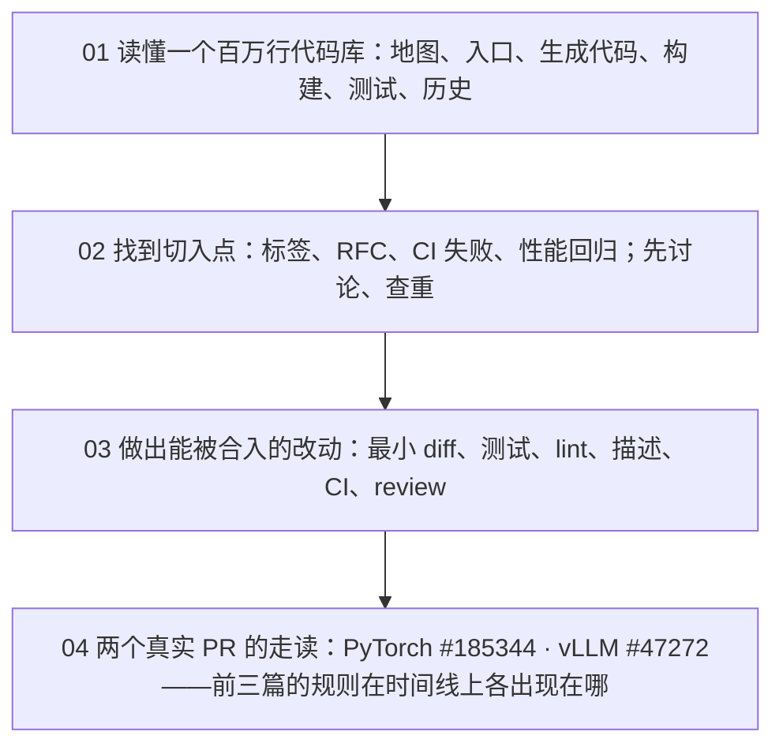

四篇正文回答了一个问题：**面对一个百万行的开源项目，如何找到切入点、做出一个能被合入的改动**。第一篇讲怎么读——从符号、报错、issue 出发有目标地检索；第二篇讲怎么选——maintainer 已经写出了"我们想要什么"，选题是去读它们再查一次重；第三篇讲怎么交——每条规则都还原成"reviewer 的十分钟"的一个侧面；第四篇把前三篇放到两个真实 PR 的时间线上，量出时间花在哪里。样本始终是 PyTorch v2.14.0 与 vLLM v0.28.0，GitHub 上的动态信息截至 2026-09 用 `gh` 查询。

本文不讲新内容，做三件事：把四篇压成一张表与四段回顾，把贯穿四篇的几条线拎出来，然后给一套三段式的通关自测——判断与计算、跨篇综合、面试题。各篇末尾的自测检验的是"这一篇读懂了没有"，这里检验的是"四篇能不能连起来用"。第四篇末尾「系列总结」讲的三样东西（贡献日志、两套流程的对照、看 PR 的眼光）与三种能力，本文第三章完整覆盖。

> **读完这四篇，你应该能回答哪些问题？[^q0] 哪些数字与结论必须能脱口而出？[^q1] 怎么判断自己是"读过"还是"掌握"了？[^q2]**

先把整个系列放在一张图上——箭头是**推导或前置上的依赖**（箭头尾端的结论被箭头头端当作前提），不是阅读顺序：

## 一、总览：系列回答的问题与主线

系列的一句话主张是：**maintainer 的 review 时间是项目最稀缺的资源，所有规则都是为了保护它；细节会变，这条逻辑不变，理解了它就能在规则变化后自己推导出新的做法**。四篇按一次贡献的自然顺序推进——先读懂、再找到、再做出、最后看两个完整的实例——每篇同时用 PyTorch 与 vLLM 做例子：一个是十年历史、治理成熟、流程厚重、CI 全跑、bot 合入的框架；一个是两周一版、按需跑 CI、maintainer 手动合入、规则还在快速演化的引擎。

| 篇 | 回答的问题 | 一句话结论 | 必记的数字 / 判据 |
|---|---|---|---|
| [第一篇：读懂一个百万行的代码库](/reading-a-million-line-codebase.html) | 给你一个从未见过的百万行仓库和一个报错，两小时之内能定位到一个文件的一个函数吗？靠什么？ | 能。靠有目标的检索：提取符号 → 画地图 → `rg` → 找登记表 → 沿链追 → 识别生成代码 → 读测试 → 读历史；构建是为了工具链，可选、放最后 | PyTorch `c10/` → `aten/` → `torch/csrc/` → `torch/`，登记表 `native_functions.yaml`；vLLM `csrc/` → `vllm/`，登记表 `pyproject.toml` / `torch_bindings.cpp`；发布约 2 个月 vs 约 2 周；引言案例四十分钟得出"已在 v2.11.0 修复" |
| [第二篇：找到切入点](/finding-your-entry-point-in-open-source.html) | 每天几十个 issue、几十个 PR，maintainer 最希望有人来做的是哪一类？怎么判断自己选的题不会一周后被关？ | 他们已决定要做、写清了要什么、自己没时间做的事；预测器是标签状态、maintainer 最后一条评论、open PR 数、规模与 RFC 门槛、硬件、项目政策 | PyTorch 682 个标签、`actionable` 396 占不到 3%、状态链四态；vLLM 63 个标签、`closed-as-slop` 97；RFC 门槛 >500 LOC（不含 kernel / data / config / test）；stale 90 + 30 天；#191394 下 5 个 open PR |
| [第三篇：做出一个能被合入的改动](/landing-a-mergeable-change.html) | reviewer 打开你的 PR 只有十分钟，他要确认什么？diff、描述、测试、CI 状态分别替他回答了哪个问题？ | 四件事：改了什么且只改了这一件、为什么改怎么验证、怎么证明对怎么防回归、有没有弄坏别的；diff、描述、测试、CI 各答一个 | PyTorch 2000 行硬上限、61 个 linter、148 个 workflow、49 个 `ciflow/*`、33 条 merge rule、4 个工作日可催；vLLM 6 个 open PR 上限、35 个 test_area、pre-commit 需 `verified` / `ready` 或 ≥4 个合入 PR、2–3 天 / 7 天、DCO 每个 commit |
| [第四篇：两个真实 PR 的完整走读](/two-real-prs-pytorch-and-vllm.html) | 两个都是"小"PR，却各花了作者一到几周。时间花在哪里？哪些可省，哪些是正常成本？ | 小 PR 的时间不在写代码：PyTorch 那个在数据（正常成本），vLLM 那个在等待（大半可省） | #185344：+104 −0、27 天采 3792 个点、PR 5 天、3 小时 42 分收到 review、`merge -i`、进 v2.13.0；#47272：+109 −16、47 天无 review 未 ping、6 个自己引入的 CI 失败、合入 08-20 不在 v0.28.0（分支 08-17 切出） |

### 1. 本文的章节安排

| 章 | 内容 |
|---|---|
| 二 | 逐篇回顾：核心问题、结论、必记、常见误解 |
| 三 | 贯穿四篇的四条线：reviewer 的时间、每个结论一条命令、两种项目风格、贡献日志的四页 |
| 四 | 常见误区表 |
| 五 | 通关自测：A 判断与计算 10 题、B 跨篇综合 5 题、C 面试题 7 题、D 掌握判据 |
| 六 | 下一步 |

## 二、逐篇回顾

### 1. 第一篇：读懂一个百万行的代码库

**核心问题**：给你一个从未见过的百万行仓库和一个报错信息，两小时之内你能把它定位到一个文件的一个函数吗？靠什么？

**结论**：能，靠有目标的检索而不是阅读——四种典型失败（从头读、随便读、被生成代码卡住、只读代码不读测试与历史）都是把阅读当成了线性活动。六步方法与项目无关：画地图、找入口、识别生成代码、构建一次、读测试、读历史。关键是找到把"名字"映射到"实现"的登记表：PyTorch 是 `native_functions.yaml`，`dispatch:` 指向 `native/*.cpp`，再经 `DEFINE_DISPATCH` 桩到 `cpu/`、`cuda/` 下的 kernel；vLLM 是 `pyproject.toml` 的 `[project.scripts]` 与 `csrc/libtorch_stable/torch_bindings.cpp`。"找不到定义"的主因是 `torchgen` 生成的代码，处理办法是回 yaml、改 `.pyi.in`、C++ 侧构建后用 clangd；构建是为了工具链，第一次追踪不需要，第一个 PR 之前必需。测试是最准确的规格，历史是注释——PyTorch 的 commit 正文含 PR 描述，vLLM 的"为什么"要 `gh pr view`。

**必记**：

- 规模与分层：PyTorch 21663 个文件约 475 万行，`c10/` → `aten/` → `torch/csrc/` → `torch/`；vLLM 6596 个文件约 202 万行，`csrc/` → `vllm/`，`tests/` 40 个子目录对应 `vllm/` 子系统。
- 构建：PyTorch `pip install -e . -v --no-build-isolation`（纯 Python 用 `tools/nightly.py`）；vLLM `VLLM_USE_PRECOMPILED=1 uv pip install -e .` 跳过 CUDA 编译，改 kernel 用 `cmake --preset release` 增量。
- 测试框架三件套：`TestCase` / `run_tests`、`instantiate_device_type_tests`（CI 里的 `TestBinaryUfuncsDeviceCUDA.test_logaddexp_cuda_complex128` 要去掉后缀找源码）、OpInfo。
- 发布节奏：PyTorch 约 2 个月一个 minor、cut 到发布 3–4 周、`@pytorchbot cherry-pick -c regression` 等五种理由；vLLM 约 2 周一版、cut 到发布 1–2 天。

**常见误解**："仓库不完整、头文件丢了"——`ATen/ops/logaddexp_native.h` 在源码树里确实不存在，它由 `torchgen` 构建时生成，回 yaml 读比读生成物快。另一个："构建好了才能开始读"——两条追踪四五条 `rg` 就走完，引言的案例四十分钟得出"已在 v2.11.0 修复"的结论。

### 2. 第二篇：找到切入点——从 issue、RFC 到性能回归

**核心问题**：一个项目每天新增几十个 issue、几十个 PR。maintainer 最希望有人来做的是哪一类工作？你怎么判断自己选的题不会在一周后被关闭？

**结论**：大多数失败的贡献不是做错了而是选错了——撞车、越级、选了项目不要的、选了做不完的。选题是去读 maintainer 已写出的"想要什么"，再在动手前查一次重。PyTorch 真正决定选题的是状态标签链 needs reproduction → needs research → needs design → actionable，只有 `actionable` 该动手，因为打标的 maintainer 已承诺 review；vLLM 没有状态机，`help wanted` 加分步骤正文是"欢迎"的信号。RFC 的载体不同（`pytorch/rfcs` 仓库 vs `750-RFC.yml` issue 模板），判断标准相同——有没有需要 maintainer 拍板的设计决策，而不是行数。issue 之外的信号源：CI 失败、性能回归、成体系的文档与类型批次、补测试、deprecation 流水线、复现、测量——产出是信息而不是 diff，几乎不会撞车。查重是三条 `gh` 命令，第三条按关键词搜最能抓到没链 issue 的重复 PR。

**必记**：

- PyTorch：682 个标签（`module:` 257、`ciflow/` 68、`release notes:` 65）；`actionable` 396 open、占 13,985 个 open issue 的不到 3%；`needs reproduction` 535、`skipped` 200。
- vLLM：63 个标签；`good first issue` 21、`help wanted` 32、`closed-as-slop` 97 个已关闭 PR；`600-new-model.yml` 写的 "new model" 与实际标签 `new-model` 不一致，按标题前缀搜。
- RFC 门槛：vLLM >500 LOC 架构改动，不含 kernel / data / config / test，无 RFC 标 `rfc-required`（该标签截至 2026-09 不在列表中）；Feedback Period 通常至少一周。
- 三条查重命令：`gh issue view <n> --comments`、`gh pr list --state open --search "<n> in:body"`、`--search "<keywords>"`；Fail-closed。

**常见误解**："issue 还 open 就是没人在做"——#191394 挂着 5 个 open PR，第六个没有价值；要看 open PR 数与最后一条评论日期。另一个："typo PR 是最安全的第一个 PR"——vLLM 明文 "No low-value busywork PRs"，PyTorch 的 `AI_POLICY.md` 划了"meaningful human involvement"的底线；替代方案是 systematic 的批次，#183036 里 maintainer 要的正是"不让其他 optimizer 出同样问题"的修法。

### 3. 第三篇：做出一个能被合入的改动

**核心问题**：reviewer 打开你的 PR，只有十分钟。这十分钟里他要确认什么？你的 diff、描述、测试、CI 状态分别替他回答了哪个问题？

**结论**：从改动到合入的十几道关卡都能还原成同一句话——review 时间最稀缺，规则让这十分钟效率最大化并把不值得的 PR 提前挡掉。六条通用做法：一个 PR 只做一件事、改动必须带测试、性能改动必须带数字、先过本地 lint 再推、按模板写描述、把 CI 变绿是作者的责任。PyTorch 把体积写进了 CI（超 2000 行直接失败），大改动用 ghstack 叠 PR；vLLM 有 500 行 RFC 线与 6 个 open PR 上限，拆分靠顺序开 PR。描述上 PyTorch 元数据化（三个模板、`Fixes #`），vLLM 正文化（Purpose / Test Plan / Test Result 加标题前缀）。CI 是两种哲学：PyTorch 推送即跑、分层触发；vLLM 默认不跑、按需 `/ci run`。CI 红了先问 main 是否也红。合入 PyTorch 由 `@pytorchbot merge` 按 `merge_rules.yaml` 校验，vLLM 由 maintainer 打 `ready` 后手动合入。被拒分方向 / 时机 / 做法三类，只有第三类值得"改了再提"。AI 政策两家都不禁止用 AI，要求提交的人读懂每一行、能为每一行辩护、在描述里声明。

**必记**：

- PyTorch：2000 行硬上限；61 个 linter；148 个 workflow；49 个 `ciflow/*`（需写权限）；`merge_rules.yaml` 33 条，每条 `patterns` / `approved_by` / `mandatory_checks_name`（几乎都是 `EasyCLA`、`Lint`、`pull`），`Core Maintainers` 兜底；合入还需 `release notes:` 或 `topic: not user facing` 标签。
- vLLM：500 行 RFC 线、6 个 open PR 上限；35 个 test_area；pre-commit 需 `verified` / `ready` 或作者 ≥4 个合入 PR；`/ci run` 授权链：写权限 → 受信名单 → 非作者拒绝 → draft 拒绝 → `ready` 标签 → 受信 reviewer 的 approval；`run_all_patterns`（`csrc/`、`CMakeLists.txt`、`setup.py` 等）改了就全跑。
- benchmark 六要素：基线、对比、硬件、shape、方法与命令、不利 case；vLLM kernel 脚本放 `benchmarks/kernels/`，端到端用 `vllm bench`（`benchmarks/benchmark_*.py` 在 v0.28.0 只是弃用桩）。
- 签名与 review：CLA 签一次 vs DCO 每个 commit `-s`（漏签要 rebase 重写）；PyTorch 4 个工作日无回应留言、再去每周五 Office Hours；vLLM 7 天可 ping、`pr-review-request@vllm.ai` 加急。

**常见误解**："我的 PR 被 approve 了为什么合不进"——approve 的人不在改动文件对应规则的 `approved_by` 里，或缺 `release notes:` 标签，或 `pull` 里有失败项；拒绝信息会告诉你差哪条。另一个："CI 是绿的"在两边含义不同——vLLM 新贡献者的 PR 默认连 pre-commit 都不跑，一片灰色不等于绿。

### 4. 第四篇：两个真实 PR 的完整走读——PyTorch 与 vLLM

**核心问题**：两个都是"小"PR，却各花了作者一到几周。这些时间花在哪里了？哪些是可以省的，哪些是这个项目的正常成本？

**结论**：走读分七个阶段——起点、阅读、diff、测试与数据、CI、review、合入之后——每阶段一条 `gh` / `git` 命令作为出处，时间戳排成时间线，每段空白归到"谁在等谁"。PyTorch #185344（`torch.linalg.lu` 的后端切换启发式）：issue 由 linalg maintainer 开、长期贡献者接，没有 `actionable` 也合入了——那条规则针对新贡献者；diff 一个文件 +104 −0；没有新增测试，用 4 种 GPU、3792 个采样点的命中率表（97.5%）代替；3 小时 42 分后收到三条行内意见，全部关于注释——数字与描述对齐、"Blackwell" 指哪块卡、删掉代码注释里的 "Authored with Claude"；`@pytorchbot merge` 被两个无关的 docs 任务挡住，`merge -i` 合入；进 v2.13.0。vLLM #47272（启动检查预留 KV null block）：issue 被部分修复过又被 stale bot 关闭，PR 开出后 47 天无 review、作者未 ping；社区成员开配套 PR #52530 并主动划界；maintainer 一条带代码的意见把范围扩到 auto-fit；`ready` → `/ci run` → 6 个失败全是自己引入的边界测试 → 修测试 → 88 项全绿 → 合入；08-20 合入 main，但 v0.28.0 的分支 08-17 已切出。

**必记**：

- #185344：+104 −0；issue 到 PR 27 天（推断为采数据）；PR 5 天 6 小时，等 review 约 1 天 6 小时、往返约 1.5 小时、CI 约 20 分钟、作者工作约 4 天；219 项检查 2 失败；v2.13.0 release 07-08，issue 到用户可装 69 天。
- #47272：+109 −16；PR 49 天 18 小时，等 review 约 49 天（一段 47 天 13 小时）、往返约 8 小时、CI 约 4 小时、作者工作不到 1 天；Buildkite #84702 6 失败 → #84725 88 项全绿；可省估计 30–40 天加一轮 CI。
- 查已合入 PR：PyTorch 的合入是 pytorchbot 关闭 PR 并推 commit，要搜 `label:Merged` 而不是 `is:merged`；vLLM 是 GitHub 原生 merged。
- 两条经验：注释与描述的数字对齐、署名放描述不放代码；第 8 天 ping、提交前 `rg` 边界测试、查重要重复做（#48724 的"不重复"声明在 08-18 之后过期）。

**常见误解**："review 意见是在检查算法对不对"——三条意见没有一条关于算法，reviewer 守的是可维护性、数据来源可追溯、项目政策。另一个："合入了就在最新版里"——#47272 合入六天后 v0.28.0 发布，却不在里面；不查 tag 就回答"在最新版里"是错的。

## 三、贯穿全系列的几条线

### 1. reviewer 的时间是最稀缺的资源

这是总纲提出、四篇各自展开的那条逻辑。第一篇里它还是隐含的："四十分钟得出已在 v2.11.0 修复"避免的是白做一周再让 reviewer 关掉一个重复 PR。第二篇把它变成选题判据：已有 5 个 PR 的 issue 第 6 个几乎不增加价值，没有 RFC 的千行 PR 让 reviewer 在 PR 里补设计讨论，typo PR 走完 CI、review、merge 的全部开销换一个字母——`actionable`、`help wanted`、`closed-as-slop`、"No low-value busywork PRs" 是同一件事的正反面。

第三篇把它写成六条通用做法与一张十分钟的表：标题标签 → 目的 → CI → diff → 测试 → 数据 → 风险，任何一格空着，reviewer 就在那一分钟停下来写 "how did you test this?"。第四篇量出了价格：PyTorch 那个 PR 三条意见合计 42 分钟往返，全是提交前自查就能避免的；vLLM 那个 PR 47 天沉默里作者一次没 ping。承诺是平均值，个案要靠自己推进。

### 2. 每个结论一条命令：从 rg 到 gh api

工具线是递进的：第一篇 `rg` / clangd / `git log -S` / `git blame -w -C`，第二篇 `gh label list` / `gh issue view --comments` / `gh pr list --search`，第三篇 `spin lint` / `pre-commit run` / `gh pr checks --json` / `ci-fetch-log.sh`，第四篇 `gh pr view` / `gh pr diff` / `gh api …/reviews /comments /commits /events /actions/runs` / `git tag --contains`。工具在变，原则不变：每个结论都要有一条能重复执行的命令作为出处，没有一条引用来自记忆。

这条线在第四篇收束为"走读七阶段"，也就是总纲说的"一种看 PR 的眼光"：打开任何一个已合入的 PR，用同样的七条命令走一遍，一小时内就能学到这个项目的 reviewer 在守什么、CI 在拦什么、时间通常花在哪。第一篇的"两小时定位流程"与第四篇的"七阶段走读"是同一种方法的两个方向：一个从报错追到代码，一个从 PR 追到时间线。

### 3. 两种项目风格：厚重而自动 vs 轻快而按需

PyTorch 与 vLLM 在每篇并排出现，四张对照表叠起来是两种一致的风格。第一篇：PyTorch 分四层、`torchgen` 生成代码、commit 正文含 PR 描述、约两个月一版；vLLM 两层、无源码生成、commit 只有 trailer、约两周一版。第二篇：PyTorch 682 个标签五层前缀加四态状态机、RFC 在独立仓库、flaky test 由 bot 自动开 issue；vLLM 63 个标签平铺、RFC 是 issue 模板、CI 失败由人开 issue。第三篇：PyTorch 推送即跑几百项检查、`@pytorchbot merge` 按 `merge_rules.yaml` 校验、CLA 一次；vLLM 默认只跑 pre-commit、`/ci run` 按需、maintainer 打 `ready` 手动合入、DCO 每个 commit。第四篇落到编号：#185344 的 219 项检查、3 小时 42 分收到 review；#47272 的 88 项检查、47 天沉默。

两种风格各有代价：PyTorch 把信息放进结构化元数据，机器先替 reviewer 回答很多问题，但外部贡献者打不了 `ciflow/*`；vLLM 把信息放进描述正文，描述写得好坏影响更大，且新贡献者连 lint 都要等人打 `verified`。总纲说学会这两套再读 NCCL、Megatron-LM、FlashAttention、Triton、SGLang 的 `CONTRIBUTING.md`，半小时就能定位差别——先问"它更像哪一个、差在哪几格"。

### 4. 贡献日志：四页证据链

系列的练手项目不是代码，是一份 Markdown 日志，每篇新增一页：第一篇"项目地图"（目录职责、构建命令、测试入口、`rg` 模式、追过的符号路径）；第二篇"切入点清单"（六个候选的来源、open PR 编号与最后活动日期、规模与硬件、是否需先讨论、结论，允许写"放弃"）；第三篇"PR 草稿与往返记录"（diff 摘要、测试、benchmark、描述初稿、每次 push 的 CI 归因、每轮 review 的改 / 争 / 问——"争"占多数通常说明选题阶段就有问题）；第四篇"复盘"（按七阶段重述自己的 PR、时间去了哪、下次省什么）。

四页有同一条要求：每一项都有出处——一条命令、一个链接、一段日志。第四篇解释了为什么：走读只能算出 GitHub 上留下痕迹的时间，vLLM 作者 PR 开出前那 63 天从外面看不到；只有作者自己记，才知道时间真正去了哪里。这四页填完，就是总纲说的三种能力——阅读、判断、交付——的全部证据。

| 概念 | 出现的篇 | 关系 |
|---|---|---|
| reviewer 的时间最稀缺 | 二、三、四 | 二用它定选题判据；三推出六条做法与十分钟表；四量出价格（42 分钟 vs 47 天） |
| `actionable` 与 RFC 门槛 | 二、三、四 | 二定义状态链与 >500 LOC；三讲被要求先开 issue / RFC 后怎么办；四解释 #181999 无 `actionable` 却合入（规则针对新贡献者） |
| 查重 | 二、三、四 | 二给三条 `gh` 命令与 Fail-closed；三把 "Not a duplicate" 列入 AI 辅助 PR 的四项必填；四展示 #52530 主动划界、#48724 的声明过期——查重不是一次性的 |
| 测试是规格 / 改动带测试 | 一、三、四 | 一教怎么找与读（OpInfo、`tests/<subsystem>/`）；三讲怎么写（`instantiate_device_type_tests`、`AGENTS.md` 四问、`opcheck`）；四看既有测试加数据表 vs 三个新用例与三个被修正的边界测试 |
| CI：谁触发、红了是谁的 | 二、三、四 | 二把 CI 失败当切入点；三讲两种哲学与判断表；四对照退出码 127（无关，`merge -i`）与 6 个自己引入的失败（修测试） |
| AI 辅助政策 | 二、三、四 | 二从"不要 typo PR"引出 `AI_POLICY.md` / `AGENTS.md`；三逐条对照；四看 "Authored with Claude" 该放哪、`Co-authored-by` trailer |

## 四、常见误区

| 误区 | 为什么错 | 正确的说法 | 出处 |
|---|---|---|---|
| `rg` 找不到 `def`、头文件不存在，说明仓库不完整 | `torch.<op>` 是 C++ 绑定，`ATen/ops/*.h` 与 `.pyi` 由 `torchgen` 生成；vLLM 的 `torch.ops._C.<op>` 在 `.so` 里 | 回 `native_functions.yaml`、改 `.pyi.in`、回 `torch_bindings.cpp` | [第一篇](/reading-a-million-line-codebase.html) |
| issue 还 open 就是没人在做 | #191394 挂着 5 个 open PR；`good first issue` 是最挤的池子 | 三条查重命令看 open PR 数与最后一条评论 | [第二篇](/finding-your-entry-point-in-open-source.html) |
| 代码写得多就需要 RFC，写得少就不需要 | 标准是有没有需要 maintainer 拍板的设计决策；500 行不含 kernel / data / config / test | 800 行纯 kernel 优化可不走 RFC，200 行引入新公开接口的改动应该走 | [第二篇](/finding-your-entry-point-in-open-source.html) |
| typo PR 是最安全的第一个 PR | vLLM 明文不接受 busywork；PyTorch 受 `AI_POLICY.md` 约束；`closed-as-slop` 已打在 97 个 PR 上 | 做成有范围、有依据、能说出"怎么找全"的 systematic 批次 | [第二篇](/finding-your-entry-point-in-open-source.html) |
| vLLM 的 PR 开出来 CI 是灰的，等它自己跑 | 默认只跑 pre-commit 且有门槛；测试任务要 `/ci run`；新 commit 不自动重跑 | 本地 `pre-commit run --all-files`；等 reviewer 敲 `/ci run` 或打 `ready`；每次 push 后重新敲 | [第三篇](/landing-a-mergeable-change.html) |
| review 意见是在检查算法对不对 | #185344 的三条意见全是注释与来源 | 提交前用描述里的数字校对代码注释；署名放描述不放代码 | [第四篇](/two-real-prs-pytorch-and-vllm.html) |
| 合入了就在最新版里 | #47272 合入六天后 v0.28.0 发布却不含它——分支已于 08-17 切出 | `git tag --contains <sha>`；`merge-base --is-ancestor` 核对 | [第四篇](/two-real-prs-pytorch-and-vllm.html) |

## 五、通关自测

### A. 判断与计算（10 题）

1. 一个 PyTorch PR 的 `git diff --stat` 共 2300 行，其中 500 行来自 `.gitattributes` 标为 `linguist-generated=true` 的文件。`pr-sanity-checks` 会不会拦下它？

   

答案

   不会。`pr-sanity-check.sh` 统计的是非生成文件的增删行数之和，2300 − 500 = 1800 ≤ 2000。但 1800 行 reviewer 十分钟读不完，仍应拆成 ghstack 的一叠。

   

2. 一个 vLLM PR 改了 900 行 CUDA kernel、300 行测试、120 行 `vllm/v1/core/sched/` 的调度器代码。按 `docs/contributing/README.md` 的规则，需要先开 RFC 吗？

   

答案

   不需要。500 LOC 的门槛不计 kernel / data / config / test，计入的只有 120 行调度器代码。但真正的标准是"有没有需要 maintainer 拍板的决策"，引入新设计的话仍应先在 issue 里说一句。

   

3. 一位 vLLM 贡献者已有 3 个合入的 PR，新开的 PR 没有任何标签。pre-commit 会在 CI 上跑吗？要让它跑，最轻的标签是哪个？

   

答案

   不会。`pre-run-check` 要求 `verified` / `ready` / `ready-run-all-tests` 之一，或作者至少 4 个合入 PR；3 个不够。最轻的是 `verified`——"Run pre-commit for new contributors without triggering other tests"。

   

4. vLLM PR 的作者在自己的 PR 下评论 `/ci run`。PR 已被打上 `ready` 标签，但仍是 draft。CI 会跑吗？

   

答案

   不会。`authorize` 按顺序判断，第 4 步 "PR authors cannot run CI while the PR is a draft" 先于第 5 步的 `ready` 检查。转正式 PR 后再敲。

   

5. 一个 PyTorch PR 只改了 `torch/distributed/checkpoint/` 下的文件，`labeler.yml` 自动打上了 `release notes: distributed (checkpoint)`，一位 linalg 模块的 maintainer approve 了它，`pull`、`Lint`、`EasyCLA` 全绿。`@pytorchbot merge` 会成功吗？

   

答案

   大概率失败。`find_matching_merge_rule` 要找一条"改动的每个文件都匹配 `patterns`、且至少一个 approver 在 `approved_by` 里"的规则；linalg maintainer 不在 distributed checkpoint 规则的名单里，除非他同时在兜底规则 `Core Maintainers` 里。标签与 checks 已满足，拒绝信息会指出差的是哪条规则。

   

6. 一个新功能 PR 于 2026-08-15 合入 PyTorch main。按 v2.14.0 `RELEASE.md` 的日程表，用户最早在哪个正式版本拿到它？如果它是一个 regression fix 呢？

   

答案

   2.14 的 branch cut 是 2026-08-10，cut 之后 "new features are not added to the release branch"，所以进 2.15（cut 09-28、发布 10-28）。regression fix 可以在 release tracker issue 里提名 `@pytorchbot cherry-pick -c regression` 进 2.14 的 patch 版本。

   

7. vLLM issue #35541 于 2026-02-27 开出，最后一次活动是 2026-03-31。按 `.github/workflows/stale.yml` 的规则，它会在哪天被标 `stale`、哪天被关闭？

   

答案

   90 天无活动标 `stale`：03-31 + 90 天 = 06-29；再 30 天关闭：07-30。与第四篇查到的事实一致（06-29 被标记、07-30 自动关闭）——那时 #47272 已经开了一个月。

   

8. CI 日志里失败的测试名是 `TestLinalgCUDA.test_lu_family_cuda_float64`。去源码里找时应该搜哪个类名、哪个方法名？为什么？

   

答案

   类 `TestLinalg`、方法 `test_lu_family`。`instantiate_device_type_tests` 把一个测试类按设备实例化成 `<Class>CPU`、`<Class>CUDA`，并给方法名加设备与 dtype 后缀；源码里没有带后缀的名字。

   

9. 一个 PyTorch issue 被打上 `module: inductor`，一个 PR 被打上 `release notes: distributed (fsdp)`。按 `.github/label_to_label.yml`，它们各自会自动多出什么标签？对贡献者意味着什么？

   

答案

   issue 进 `oncall: pt2` 队列；PR 触发 `ciflow/h100-distributed`。前者告诉你 issue 会被哪个 oncall 看到——没人理先查它有没有落进任何 `oncall:`；后者意味着改 FSDP 的 PR 会自动在 H100 上跑分布式任务。

   

10. 一个 vLLM PR 有 5 个 commit，第 3 个漏了 `-s`。DCO check 会怎样？最少要重写几个 commit？PyTorch 的 CLA 遇到同样情况呢？

    

答案

    DCO 红，mergify 的 `comment-dco-failure` 留言。要用 `git rebase --exec 'git commit --amend --no-edit -s' main` 重写第 3 个及其后的 commit（至少 3 个，rebase 会改写后续 sha）；装了 `signoff-commit` 钩子以后不会再漏。PyTorch 的 CLA 签一次即可，历史 commit 不用改。

    

### B. 跨篇综合（5 题）

1. 你在 PyTorch 看到一个 issue："`torch.X` 在 complex64 上 CPU 与 CUDA 结果不一致"，标签是 `needs reproduction`、`module: linear algebra`。从看到它到决定下一步，你会做哪几件事？各用哪一篇的方法？

   

答案

   第一篇：`rg '^- func: X' native_functions.yaml` → `dispatch:` → `cuda/` 下的 kernel，`rg -l X test/*.py` 找测试与 OpInfo，`git log -- <kernel 文件>` 看是否已有人修（引言案例正是这样发现 #163509 已修、在 v2.11.0）。第二篇：`needs reproduction` 不是 `actionable`，发 PR 会被关；能做的是复现并把复现写成 `TestCase` 风格的最小测试草稿贴在评论里，推动它走向 `actionable`。第三篇：真要修时测试用 `instantiate_device_type_tests` 写成设备无关；一个 kernel 修复通常是 kernel 文件 + 测试 + OpInfo 的 dtype 更新。

   

2. 你打算优化 vLLM `csrc/` 下的一个 kernel。从读代码到 PR 合入，哪些步骤分别由第一、二、三篇决定？哪一步会让 CI 周期比改 Python 长得多？

   

答案

   第一篇：登记表在 `csrc/libtorch_stable/torch_bindings.cpp`，实现在同目录的 `.cu`；用 `cmake --preset release` 增量编译并打开 `CMAKE_EXPORT_COMPILE_COMMANDS`。第二篇：先查重（三条命令）、确认手上的卡能复现。第三篇：kernel 不计入 500 行 RFC 线；正确性用 `torch.library.opcheck` 加现有 pytest，性能脚本放 `benchmarks/kernels/` 而不是 `tests/`；Test Result 放六要素的表。周期长在 CI：`ci_config.yaml` 的 `run_all_patterns` 含 `csrc/`，改一行 kernel 就触发全量 CI，且要等 reviewer `/ci run`。

   

3. 用户问你："我的修复合进 vLLM main 了，什么时候能 `pip install` 到？"第一篇与第四篇各给了你什么工具回答这个问题？如果是 PyTorch 呢？

   

答案

   第一篇：`RELEASE.md`——vLLM 约两周一版、branch cut 在发布前 1–2 天、cut 后只收符合准则的 cherry-pick；PyTorch 约两个月一版、cut 到发布 3–4 周。第四篇：不要凭节奏猜，用 `git tag --contains <sha>` 与 `git merge-base --is-ancestor` 核对——#47272 08-20 合入、v0.28.0 08-26 发布却不含它，因为分支 08-17 已切出；#185344 06-01 合入，进了 07-08 发布的 v2.13.0。

   

4. PyTorch #185344 的 issue 没有 `actionable` 标签却顺利合入，而第二篇说新贡献者的 PR 必须对应 `actionable` issue。两者矛盾吗？第三篇的哪条机制解释了这个 PR 合入时真正被检查的是什么？

   

答案

   不矛盾。`CONTRIBUTING.md` 原文是 "as a new contributor"——规则针对新贡献者；#181999 由 linalg maintainer @IvanYashchuk 开，作者 @nikitaved 是长期贡献者，第四篇的判断是这类题通常被熟人接走，反而不是新人的好切入点。合入时 `trymerge.py` 检查的是第三篇讲的：`merge_rules.yaml` "Linear Algebra" 规则的 `approved_by`（IvanYashchuk 在名单里）与 `mandatory_checks_name`（`EasyCLA`、`Lint`、`pull`）、`release notes: linalg_frontend` 标签——`pull` 里两个 docs 失败让第一次 merge 被拒，`-i` 忽略后合入。

   

5. 两个 PR 都遇到了 CI 失败：#185344 的 `pull` 里两个 docs 任务退出码 127，#47272 的 Buildkite 六个测试任务失败。用第三篇的判断表分别归类，再说说第二篇里 CI 失败作为"切入点"与这里的关系。

   

答案

   第三篇判断表：docs 任务与一个只改 `.cpp` 的 PR 无关、Dr. CI 归为脚本错误 → "与改动无关"，处理是 `@pytorchbot merge -i` 忽略；六个 Buildkite 失败成对出现（`mirror: amd`）、失败测试都把 KV 池开在新边界上 → "main 绿我红且在改动附近 → 我的问题"，处理是修三个测试并再 `/ci run`。第二篇：如果 docs 任务在 main 上也持续红，它本身就是一个 CI 失败切入点（HUD 与 `DISABLED` issue；Project 20 看板与 `450-ci-failure.yml`）——分辨"我的"与"main 的"是同一套动作的两个用途。

   

### C. 面试题（7 题）

1. 给你一个从未接触过的百万行仓库和一个报错，两小时内怎么定位到要改的函数？以 PyTorch 为例说一遍。

   

答案

   **答案要点**：(1) 从报错提取 2–3 个最具体的符号，字符串字面量优先，`rg -F`；(2) 画顶层地图判断在哪一层——`c10/` → `aten/` → `torch/csrc/` → `torch/`，`CONTRIBUTING.md` "Codebase structure" 是自带地图；(3) 找登记表 `native_functions.yaml`，沿 `dispatch:` 到 `native/*.cpp`，再 `rg -l` 到 `cpu/`、`cuda/` 下的 kernel；(4) 头文件找不到、`.pyi` 跳转断掉，知道是 `torchgen` 生成的，回 yaml；(5) 读测试与 OpInfo 当规格，`git log -S` 看有没有人已经修了；(6) 构建放最后、可选。
   **追问方向**：vLLM 怎么追（`pyproject.toml` → `cli/main.py` → `api_server.py` → `v1/engine/`）；`git blame` 为什么要 `-w -C`；什么时候必须构建。
   **好答案与一般答案的区别**：一般答案说"用 grep 和 IDE 跳转"；好答案先找登记表、知道哪些文件是生成的、把测试与历史也当阅读对象，并给出时间预算。

   

2. 你要在 PyTorch 或 vLLM 做第一次贡献，怎么挑 issue？怎么判断它一周后不会被关？

   

答案

   **答案要点**：(1) 读"想要什么"——PyTorch 只盯 `actionable` 加 maintainer 的 "I'd review a PR that …"，vLLM 看 `help wanted` 加分步骤正文与 Job Board；(2) 读"不要什么"——单个 typo、纯格式、没 RFC 的大改、`needs research` 的 issue；(3) 三条 `gh` 查重命令，看 open PR 数与最后一条评论日期，`good first issue` 是最挤的池子（#191394 有 5 个 PR）；(4) 估规模与 RFC 门槛（>500 LOC）、硬件；(5) 真正空着的位置在 `needs reproduction`（535 个）复现成测试、`skipped` 的 flaky test、测量类任务；(6) 留一条带信息的认领留言然后等。
   **追问方向**：PyTorch 四态各能做什么；vLLM 标签谁打；什么改动要 RFC。
   **好答案与一般答案的区别**：一般答案说"找 good first issue"；好答案说出 maintainer 承诺 review 的信号、查重的具体命令，并知道最挤的池子在哪。

   

3. reviewer 打开你的 PR 只有十分钟，他会看什么？你的 PR 每一部分替他回答了什么？

   

答案

   **答案要点**：(1) 标题与标签——这是什么、该我看吗；(2) 描述——为什么改、讨论过吗（`Fixes #` / Purpose）；(3) CI——会不会弄坏别的；(4) diff——改动对不对，一个 PR 一件事、≤2000 行、无顺手重构；(5) 测试——怎么证明对、怎么防回归（`instantiate_device_type_tests`；`AGENTS.md` 四问；`opcheck`）；(6) benchmark——值不值（六要素）；(7) 风险与签名——BC-breaking?、EasyCLA / DCO、AI 声明。任何一格空着，PR 就回到队列末尾。
   **追问方向**：PyTorch 把信息放元数据、vLLM 放正文，各自的后果；review 意见怎么回（改 / 争 / 问）。
   **好答案与一般答案的区别**：一般答案列"写清描述、加测试"；好答案按分钟对应到 reviewer 的问题，并说出两个项目各用什么机制保证每一格有东西。

   

4. PyTorch 与 vLLM 的 CI 有什么本质差别？"CI 是绿的"在两边分别意味着什么？

   

答案

   **答案要点**：(1) PyTorch 推送即跑、分层触发：`pull` + `Lint` 必跑，其余靠 `ciflow/*` 标签（49 个，需写权限）；(2) vLLM 默认不跑、按需触发：PR 上只有 pre-commit 且需 `verified` / `ready` 或 ≥4 合入 PR，测试任务要 `/ci run`，新 commit 不自动重跑；(3) vLLM 按 `source_file_dependencies` 选任务，`run_all_patterns`（`csrc/` 等）例外全跑；(4) 所以 PyTorch 的绿可能还没跑 trunk，vLLM 的灰不是绿；(5) 红了先看 main。
   **追问方向**：`ciflow/trunk` 的实现（bot 打 git tag）；"Which commit is used in CI?"；`mirror: amd` 为什么失败成对。
   **好答案与一般答案的区别**：一般答案说"一个用 GitHub Actions 一个用 Buildkite"；好答案说出两种哲学（机器换时间 vs 人的判断换机器）与对新贡献者的具体后果。

   

5. 你用 AI 助手写了一个 PR，两个项目分别要求你怎么做？政策的边界在哪里？

   

答案

   **答案要点**：(1) 两家都不禁止用 AI，都要求人读懂每一行、能为每一行辩护；(2) PyTorch `AI_POLICY.md` 五条：AI 内容包起来并加人的评注、不贴未审阅的 AI 文本、读懂再提、未完成用 draft、不接受全自主 agent；`CONTRIBUTING.md` 加新贡献者需 `actionable` issue、新功能 issue 里不放 AI 方案；(3) vLLM `AGENTS.md`：查重三命令、无 busywork、"Pure code-agent PRs are not allowed"、描述四项必填、`Co-authored-by` trailer、违规封禁；(4) 边界的例子：#185344 reviewer 要求删掉代码注释里的 "Authored with Claude"，描述里的同一句保留进了 commit——声明放描述，代码里只放对维护者有用的东西；#47272 是合规样本。
   **追问方向**：为什么 PyTorch 更在意讨论质量、vLLM 更在意 PR 数量；`closed-as-slop` 97 个说明什么。
   **好答案与一般答案的区别**：一般答案说"声明一下用了 AI"；好答案分清两家各自的痛点与条目，并能用真实 PR 说出边界在哪一行。

   

6. 你的 PR 三周没人理，或者被拒了，怎么办？

   

答案

   **答案要点**：(1) 对照承诺：PyTorch 4 个工作日无回应留言 @ reviewer、再去 Office Hours；vLLM 7 天可 ping、`pr-review-request@vllm.ai` 加急；#47272 的 47 天沉默是可省的大半；(2) 自查：标题前缀、只请求一两位路径匹配的 reviewer、`needs-rebase`、lint / DCO；(3) 很多"没人理"根源在选题——回第二篇看 issue 是否 `actionable`、是否已有人在做；(4) 被拒分三类：方向不对（拒绝里没有关于代码的具体意见）→ 放弃回 issue / RFC；时机不对 → 保留分支等；做法不对 → 改，这是唯一该"改了再提"的；(5) 放弃时把 maintainer 在意什么记进日志。
   **追问方向**：怎么回应 nit 与设计异议；force-push 与 ghstack；同一件事别人先合了怎么办。
   **好答案与一般答案的区别**：一般答案说"礼貌地催一下"；好答案给出两个项目的时点与升级通道、先自查 PR 与选题、并能分类拒绝。

   

7. 你的团队维护一份 vLLM 内部 fork，每次升级都重新打补丁。怎么规划把改动推回上游？

   

答案

   **答案要点**：(1) 先建项目地图（第一篇）：`csrc/` → `vllm/`、`tests/` 与子系统的对应、`VLLM_USE_PRECOMPILED=1` 免编译；(2) 把补丁按"一件事"切开，逐个查重，>500 行架构改动先开 `[RFC]:` issue；每人 6 个 open PR 上限决定并行度（第二、三篇）；(3) 每个 PR 按 Purpose / Test Plan / Test Result 写、带前缀、每个 commit `-s`、本地 `pre-commit run --all-files`；改 `csrc/` 触发全量 CI；(4) 时间线用第四篇校准：CI 等 `ready` + `/ci run`，7 天没 review 就 ping，合入后看 `git tag --contains`；(5) 每个 PR 按复盘模板记时间去了哪；(6) 与 maintainer 预期一致的改动（roadmap 未勾选项、`help wanted`）优先，纯内部需求考虑 plugin 而不是硬推。
   **追问方向**：怎么判断某个补丁上游不会要；deprecation 三阶段怎么走。
   **好答案与一般答案的区别**：一般答案说"一个个提 PR"；好答案把四篇的方法排成有顺序、有数字预期的计划，并知道哪些补丁不该推。

   

### D. 掌握判据

| 水平 | 表现 |
|---|---|
| 读过 | 能说出四篇各讲什么；知道 `native_functions.yaml`、`actionable`、ghstack、`/ci run`、`ready`、DCO 这些名词 |
| 掌握 | A 组能不翻书答出 8 题以上；B 组能说出每题用了哪几篇的什么；拿到一个陌生项目的 `CONTRIBUTING.md` 能在半小时内说出它更像 PyTorch 还是 vLLM、差在哪几格；能用七阶段走读一个自己没参与的 PR |
| 能教人 | C 组每题能给出全部要点并预判追问；能解释四篇里每个反直觉结论为什么成立（构建放最后、`good first issue` 最挤、vLLM 的灰不是绿、合入了不一定在最新版、review 意见全是注释） |

通关标准：A 组至少 8 题、B 组至少 4 题、C 组每题能说出一半以上要点。没过的部分回到第二章对应篇的"必记"，再回该篇正文；如果卡在 B 组，说明各篇读懂了但没连起来，重读第三章的四条线。

## 六、下一步

四篇讨论的只是**如何参与**一个 AI-Infra 开源项目：阅读方法、选题方法、提交规范、协作规则。总纲划出的边界之外，几个方向紧邻但不在范围内：

- **任何一层的技术原理**——算子怎么分发、kernel 怎么写、调度器怎么工作、通信怎么走。这些内容在 AI-Infra 各层的技术系列里，入口是[《AI-Infra 工程师学习地图》](/ai-infra-learning-roadmap.html)——本系列在那张地图上是横切的第 12 个系列，"任何阶段，贡献者路径"。
- **PyTorch 与 vLLM 之外项目的具体流程**——NCCL、Megatron-LM、FlashAttention、Triton、SGLang 在正文中只做定性对照；它们的规则以各自仓库的 `CONTRIBUTING.md` 为准，本系列教的是如何在半小时内读懂它们。

还没决定走哪条线的读者，先看[《AI 全栈学习地图》](/ai-fullstack-learning-roadmap.html)，它把本系列放在"跑模型"一段的末尾，作为贡献者路径的收尾。

回到总纲：[《AI-Infra 开源贡献指南（总纲）》](/contributing-to-ai-infra-open-source.html)。

## 七、延伸阅读

本系列只讨论**如何参与**一个 AI-Infra 开源项目：阅读方法、选题方法、提交规范、协作规则。以下内容与它紧邻，但不在范围内：

- **任何一层的技术原理**：算子怎么分发、kernel 怎么写、调度器怎么工作、通信怎么走。第四篇走读 PR 时会解释那两个改动本身在做什么，但只到读懂这个 diff 所需的程度，不展开背后的机制。
- **git 与 GitHub 的基本操作**：fork、branch、rebase、解决冲突、开 PR。假设读者作为工程师已经熟练；本系列只讲这些操作在两个项目里的特殊约定（如 `ghstack`、`Signed-off-by`）。
- **开源许可、CLA/DCO 的法律含义**：只说明两个项目各自要求什么，不讨论为什么。
- **成为 maintainer 之后的工作**：triage、release management、governance。PyTorch 的 `docs/source/community/governance.md` 描述了 module maintainer 与 core maintainer 的机制，本系列只把它作为"谁有权批准我的 PR"的背景来读。
- **PyTorch 与 vLLM 之外项目的具体流程**：NCCL、Megatron-LM、FlashAttention、Triton、SGLang 在正文中只做定性提及；它们的贡献规则请以各自仓库的文档为准。

[^q0]: 四个：给一个报错能不能两小时定位到函数、靠什么（登记表、生成代码、测试即规格、历史即注释）；maintainer 最想要哪类工作、怎么判断题一周后不被关（`actionable` / `help wanted`、maintainer 最后一条评论、open PR 数、RFC 门槛、硬件、政策）；reviewer 的十分钟要确认什么、diff / 描述 / 测试 / CI 各答哪个问题；小 PR 的时间花在哪、哪些可省哪些是正常成本（数据是正常成本，等待大半可省）。详见[第二章](#二逐篇回顾)。
[^q1]: PyTorch 分层 `c10/` → `aten/` → `torch/csrc/` → `torch/` 与登记表 `native_functions.yaml`；vLLM `csrc/` → `vllm/` 与 `pyproject.toml` / `torch_bindings.cpp`；发布约 2 个月 vs 约 2 周；PyTorch 682 个标签、`actionable` 396 占不到 3%、状态链四态；vLLM 63 个标签、RFC 门槛 >500 LOC 不含 kernel / data / config / test、stale 90 + 30 天；三条查重命令；PyTorch 2000 行硬上限、61 个 linter、148 个 workflow、49 个 `ciflow/*`、33 条 merge rule、4 个工作日可催；vLLM 6 个 open PR 上限、35 个 test_area、pre-commit 需 `verified` / `ready` 或 ≥4 合入 PR、`/ci run` 七步授权、2–3 天 / 7 天、DCO 每个 commit；#185344 +104 −0、27 天 3792 个点、3 小时 42 分收到 review、`merge -i`、进 v2.13.0；#47272 47 天无 review、6 个自己引入的失败、不在 v0.28.0。详见[第一章](#一总览系列回答的问题与主线)、[第三章](#三贯穿全系列的几条线)。
[^q2]: 用第五章的三段自测：A 组 10 题判断与计算（至少 8 题）、B 组 5 题跨篇综合（至少 4 题）、C 组 7 道面试题（每题说出一半以上要点）；D 组的表给出"读过 / 掌握 / 能教人"三级的表现。详见[第五章](#五通关自测)。
