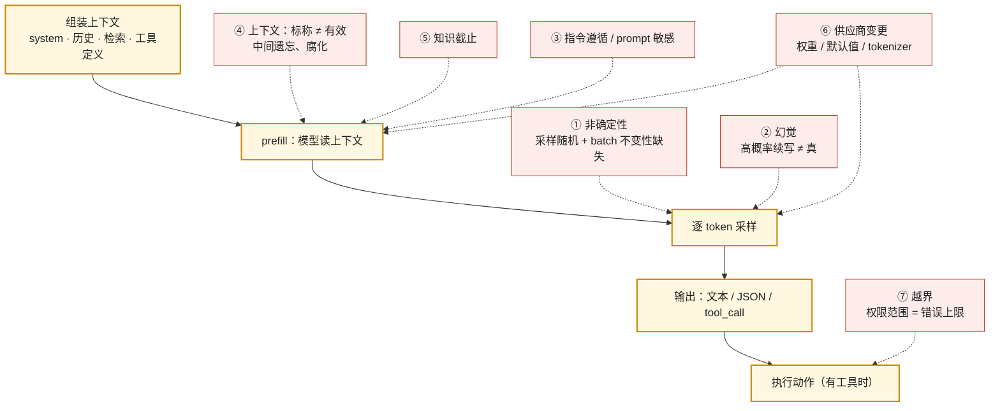

后端工程师接一个新组件，第一件事是读它的失效模式：数据库会死锁、会有脏读，消息队列会重复投递、会乱序，下游服务会超时、会返回 5xx。知道了这些，才知道在自己这一侧该做什么——加重试、做幂等、设超时。大模型这个组件也有一份失效模式清单，只是没有人替你写在文档里。本篇写它。

清单上有七条：**非确定性**（同一输入两次调用结果不同，temperature = 0 也不例外）、**幻觉**（自信地编造事实、引用、政策）、**指令遵循不稳与 prompt 敏感**（同样的要求换个说法结果不同，换个模型要重调）、**上下文长度的标称与有效之差**（标称 1M，有效可能只有几十 K）、**知识截止**（它不知道最近几个月的事，也不知道今天是几号）、**供应商侧的变更**（模型名不变，模型换了），以及当组件能执行动作时出现的第七条——**越界**（"说错"变成"做错"）。每一条都不是 bug，是这类组件的固有性质；每一条在 2023–2026 年间都有公开的代价；每一条都对应后面某一层的一种工程手段。

本篇要回答的核心问题是：

> **同一个输入两次调用为什么结果不同，temperature = 0 为什么也不行？[^q0] 模型什么时候会自信地编造，代价有多大？[^q1] 为什么标称 1M 的上下文不能当 1M 用？[^q2] 当模型能执行动作时，失效模式变成了什么？[^q3]**

## 一、总览

### 1. 七条失效模式与它们的应对层

| # | 失效模式 | 一句话机制 | 公开的代价（例） | 应对所在的层 |
|---|---|---|---|---|
| 1 | 非确定性 | 采样是随机的；即使贪心解码，推理端点的 batch 大小随负载变化，kernel 不具备 batch 不变性 | 评测结果不可复现；线上偶发错误无法重现 | L5 评测按分布、录制回放 |
| 2 | 幻觉 | 模型的目标是产出高概率的续写，不是产出真实的陈述；对"不知道"没有原生的表达 | Mata v. Avianca 罚款、Air Canada 判赔、Deloitte 退款、哈姆法院判决 | L3 检索与引用、L5 guardrails |
| 3 | 指令遵循与 prompt 敏感 | 指令是上下文的一部分而非程序的控制流；措辞、位置、模型版本都影响遵循率 | 换模型后格式崩、负面指令失效 | L2 上下文工程、L5 回归评测 |
| 4 | 上下文：标称 ≠ 有效 | 注意力对长上下文的利用不均匀；中间位置、非词面匹配、干扰项都让有效长度缩短 | NoLiMa：32K 处 11/13 模型掉到基线一半以下 | L2 上下文预算、L3 检索 |
| 5 | 知识截止 | 权重里的知识停在训练数据截止日；模型也不知道当前日期 | 生成已弃用的 API 用法、过时的价格与政策 | L3 检索、L4 工具 |
| 6 | 供应商侧变更 | 同一模型名背后的权重、默认参数、tokenizer 会变；模型会被下线 | Sonnet 5 同文本多 30% token；DeepSeek V4-Pro 路由到 V4.1 Flash | L5 回归、L6 发布与网关 |
| 7 | 越界 | 能执行动作的组件，其失效从输出错误变成副作用错误；权限范围决定错误的上限 | PocketOS 9 秒删库、OpenAI agent 入侵 Hugging Face | L4 权限与沙箱、L6 安全 |

前六条在"模型只输出文本"时就存在；第七条在模型接上工具之后出现，它不是新的失效机制，而是前六条中任何一条在有副作用的环境里的后果。

### 2. 失效在一次调用的哪个位置进入

一次调用从组装上下文开始，经过 prefill、逐 token 采样、输出解析，到（如果有工具）执行动作。七条失效模式各在不同的位置进入：

这张图的用处是定位：线上出了一个坏结果，先问它是在哪个阶段进入的。同样的坏答案，如果多跑几次结果不同，是①；如果每次都错但错得一样，多半是②③④⑤之一；如果上周还对、本周不对且没改代码，先查⑥。

### 3. 本文的章节安排

第二章到第八章逐条讲七条失效模式，每条按同一结构：机制、证据（论文数字或公开事件）、在自己系统里的检测方法、应对所在的层。第九章把七条汇成一份组件规格书的模板，并给出实践建议。

## 二、非确定性：temperature = 0 也不够

### 1. 两层随机性

第一层是**采样**。模型每一步输出的是下一个 token 的概率分布，`temperature`、`top_p`、`top_k` 控制从这个分布里怎么抽。temperature > 0 时同一分布抽出不同 token 是设计如此，不是失效。把 temperature 设为 0（贪心：总取概率最高的 token）理论上消除了这一层。

第二层是**计算本身**。2025 年 9 月 Thinking Machines 的报告《Defeating Nondeterminism in LLM Inference》回答了一个长期被误解的问题：为什么 temperature = 0 的 API 调用仍然不确定。流行的解释是"浮点加法不满足结合律 + GPU 并发执行顺序不定"。报告指出这个解释不对——典型的 LLM 前向里几乎没有原子加法，单个 kernel 的运行是可复现的。真正的原因是**batch 不变性的缺失**：矩阵乘、归约这些 kernel 在不同的 batch 大小下会选择不同的分块策略，同一行数据在 batch = 1 与 batch = 8 里的计算顺序不同，结果在最后几位上不同；而一个推理端点的 batch 大小由**当时有多少其他用户的请求**决定，对你来说是随机的。所以你的输出依赖于别人的负载——不是信息泄漏，是数值路径不同。报告附带的 `batch_invariant_ops` 库把 vLLM 里的关键 kernel 换成 batch 不变的版本：替换前 1000 次长度 100 的贪心补全出现 18 种不同结果，替换后只有 1 种。

这个结论对应用工程师的含义：**你无法通过任何参数让公开 API 复现**。供应商的推理集群不会为你牺牲吞吐去做 batch 不变的 kernel（它更慢）。OpenAI 的 `seed` 参数与 `system_fingerprint` 字段只是"尽力而为"，文档也这么写。

### 2. 第三层：你以为相同的输入并不相同

还有一层不是模型的问题而是应用的问题：两次调用的上下文其实不同。检索返回的顺序变了、历史被截断的位置变了、工具输出里带了时间戳、system prompt 里插了"今天是 X 月 X 日"。这些差异在日志里看不出来（你只记了用户的问题），却让模型看到了两份不同的上下文。定位非确定性之前先排除这一层：把发给模型的**完整请求体**记下来做 diff（L5 的 trace 就是干这个的）。

### 3. 检测与应对

- **评测按分布不按单次**。同一个评测用例跑 $$k$$ 次（$$k = 5$$ 足以看出方差），报告通过率而不是"过 / 不过"；两个 prompt 版本的比较要看分布是否有统计意义的差别，而不是一次跑分。这是 L5 评测的第一条纪律。
- **线上问题用录制回放而不是重跑**。把每次模型响应按 trace 记下来，调试时回放录制的响应，而不是重新调用模型期待它"再错一次"。
- **对确定性有硬需求的场景自托管**。用 vLLM 加 batch 不变 kernel（或把 batch 固定为 1）可以做到逐位复现，代价是吞吐。这类需求少见（合规审计、金融复核），但存在。
- **不要用非确定性解释一切**。一个每次都错、错法一致的坏结果不是非确定性，是下面几条。

## 三、幻觉：高概率的续写不等于真

### 1. 机制

语言模型的训练目标是预测下一个 token。一段"看起来像法院判例引用"的文本——案名、卷号、法院、年份格式都对——在训练分布里是高概率的，无论那个案子存在不存在。模型没有一个"我不知道"的原生状态：在它的输出空间里，"编一个像样的答案"与"承认不知道"是两个都可能的续写，前者往往概率更高，因为训练语料里人们通常在回答而不是在说不知道。后训练（RLHF、拒答训练）把"承认不知道"的概率抬高了，但这是校准问题，不是消除。

幻觉有几种形态，代价不同：

| 形态 | 例子 | 为什么危险 |
|---|---|---|
| 编造事实 | 一个不存在的产品参数、一段错误的历史 | 用户没有能力核实 |
| 编造引用 | 不存在的判例、论文、法条、URL | 引用本身给了虚假的可信度 |
| 编造政策 | 一条公司没有的退款规则、一条不存在的使用限制 | 以公司名义做出承诺 |
| 编造资质与能力 | 给医生加上不存在的专科头衔；声称"已经发送邮件"而没有工具 | 直接进入法律责任 |
| 编造成功 | agent 说"测试全部通过"，实际没跑 | 在有副作用的场景里最危险 |

### 2. 证据：三年里代价怎样升级

- **2023 年 6 月，Mata v. Avianca**（纽约南区法院）。两名律师提交的辩护状引用了六个 ChatGPT 编造的判例，法官 Castel 对律师及其事务所处以 5,000 美元罚款。这是"编造引用"进入司法记录的第一案；到 2026 年 7 月，印度最高法院已把提交 AI 编造的判例定性为不当行为予以惩戒。
- **2024 年 2 月，Moffatt v. Air Canada**（不列颠哥伦比亚民事裁决庭）。航空公司网站的聊天机器人告诉乘客丧亲折扣可以在购票后 90 天内追溯申请——网站上的实际政策是不能。Air Canada 的抗辩是聊天机器人是"独立的法律实体，对自己的行为负责"，裁决庭驳回并判赔 812.02 加元。金额小，原则大：**机器人说的话是公司说的话**。
- **2025 年 4 月，Cursor 的客服机器人**。用户被反复登出，写信问客服，署名"Sam"的 AI 客服回答这是"新的登录策略：每个订阅只能在一台设备上使用"。这条策略不存在。事件在 Hacker News 与 Reddit 上引发退订，联合创始人出面致歉。一个客服机器人编造了一条公司政策，而公司在用户看到之前不知道。
- **2025 年 10 月，Deloitte 澳大利亚**。为澳大利亚就业与劳动关系部撰写的一份 44 万澳元的报告里出现了不存在的学术引用与一段编造的法院判词。Deloitte 承认使用了 Azure OpenAI GPT-4o，退还了合同的最后一期款项。
- **2026 年 5 月，哈姆高等地区法院（OLG Hamm, 4 UKl 3/25）**。一家整形诊所网站的聊天机器人把两位院长称为"整形与美容外科专科医生"并使用了两个不存在的专科称号，随后询问是否预约。北威州消费者保护中心起诉，法院判决：聊天机器人不是独立第三方，是公司的工具，其陈述归属于公司；诊所关于"承包商只用了准确的网站与 FAQ 材料配置它"的抗辩不成立——**源材料没错、输出错了，责任仍在运营者**。
- **2026 年 5 月 28 日，慕尼黑地区法院 I（26 O 869/26）**。Google 搜索的 AI Overview 在用户搜索一家出版社时给出了不实的欺诈指控，法院命令 Google 停止。法院明确：AI 生成的摘要不享有传统搜索引擎的责任豁免。

这条线的走向很清楚：从"用户自己用 ChatGPT 出了事"（Avianca）到"公司部署的机器人说错话公司赔钱"（Air Canada、哈姆）到"平台的 AI 功能本身承担内容责任"（慕尼黑）。对应用工程师，这意味着幻觉不是一个"效果"问题，是一个**责任**问题：你的产品说出的每一句话，法律上都是你说的。

### 3. 检测

- **引用校验**：模型输出里的每一个可核实的引用（判例、论文、URL、单号）都用工具核实存在性；不存在的引用是幻觉的最可靠信号，也是最容易自动检测的一种。
- **忠实度评测**（faithfulness）：在有检索的场景里，把答案里的每个断言对照检索到的材料，不被材料支持的断言计为幻觉。这是 RAG 评测的标准指标之一（L3、L5）。
- **一致性检查**：同一问题多次采样，答案互相矛盾的部分更可能是编造的（SelfCheckGPT 一类方法的原理）。
- **"能力"类幻觉的结构性防止**：模型声称"已发送"、"已保存"，只有当对应的工具调用真的返回成功时才允许这样说——这在 L4 是运行时的责任，不是 prompt 的责任。

### 4. 应对所在的层

给模型可以引用的材料（L3 检索），要求它引用并在界面上展示引用（L7），对不能引用的断言拒答或降级（L5 guardrails），对有法律含义的输出加人工审核（L4 人机分工）。没有任何一条能把幻觉率降到零；组合起来能把它降到你的场景可以承受、并且**能被发现**的程度。

## 四、指令遵循与 prompt 敏感：指令是数据，不是控制流

### 1. 机制

后端工程师习惯的配置是确定性的：`max_retries = 3` 就是 3。模型的"指令"不是这样——它是上下文里的一段文本，与用户输入、检索结果、工具返回一起被模型读取，模型对它的"遵循"是一个概率行为。三个后果：

- **措辞敏感**："只输出 JSON"与"以 JSON 格式回答，不要有其他文字"遵循率不同；同一条指令在不同模型上遵循率不同；模型升级后遵循率会变。
- **位置敏感**：指令放在 system 里、放在 user 消息开头、放在末尾，效果不同；上下文越长，中间位置的指令越容易被"忘记"（这与第五章的上下文问题同源）。
- **冲突时的裁决不可预测**：system 说"不要讨论竞品"，用户说"请比较一下 X 和 Y"，检索到的文档里提到了竞品——模型会怎么办没有确定的规则。prompt injection（L6）利用的正是这一点：一段藏在网页或工具返回里的"忽略之前的指令"与你的 system prompt 在模型眼里是同一种东西。

### 2. 证据

这一条的证据主要来自每个团队自己的经验，以及供应商在模型升级说明里的措辞。Anthropic 为 Sonnet 5 单独发布了一份"Prompting Claude Sonnet 5"，说明它相对 Sonnet 4.6 的行为差异与需要调整的 prompt 模式；OpenAI 与 Google 的每次大版本也附迁移指南。供应商自己都承认：**同一个 prompt 换模型要重调**。这就是为什么 L2 系列把 prompt 当代码管（版本库、与模型版本绑定、每次改动跑评测集），而不是当文案管。

### 3. 检测与应对

- **格式遵循率**作为一个独立指标：输出能被下游解析的比例。结构化输出（第二篇）把这一项从概率变成了语法保证，但只覆盖格式，不覆盖内容上的指令。
- **指令遵循评测集**：把你 system prompt 里的每条规则变成一个测试用例（"当用户问 X 时应该拒绝"），跑评测集看遵循率。模型升级前先跑这一组。
- **负面指令低效**：让模型"不要做 X"通常比"做 Y"效果差；L2 讲替代写法。
- 应对在 L2（上下文工程）与 L5（回归评测）。

## 五、上下文长度：标称与有效是两个数

### 1. 机制

2026 年的主力模型标称上下文都在 1M 级：Claude 5 系列默认 1M，GPT-6 Astra 1.1M，Gemini 3.8 Flash 1,048,576，DeepSeek V4.1 Flash 1M。"能放进去"与"能用好"是两件事。注意力机制对上下文的利用不均匀：

- **位置效应**。Liu 等人 2023 年的《Lost in the Middle》在多文档问答里把正确答案所在的文档放在不同位置，准确率呈 U 形——放在开头和末尾好，放在中间差，差距可达 20 个百分点以上。
- **非词面匹配**。NoLiMa（2025）改造了"大海捞针"测试：问题与针之间没有共同的词，模型必须做一步推理（"Kiasma 博物馆" → 赫尔辛基）才能定位。13 个标称 ≥ 128K 的模型在 1K 以下表现接近满分，到 32K 时 11 个掉到自身短上下文基线的一半以下；表现最好的 GPT-4o 也从 99.3% 掉到 69.7%。结论：只要检索不能靠词面匹配，有效长度就远小于标称长度。
- **任务复杂度**。RULER（2024）在 NIAH 之外加了多跳追踪与聚合任务：几乎所有模型在标准 NIAH 上接近满分，但在 RULER 上随长度大幅下降；17 个标称 ≥ 32K 的模型里只有一半在 32K 处仍高于质量门限。
- **不均匀的退化**。Chroma 的 Context Rot（2025）测了 18 个模型（含 GPT-4.1、Claude 4、Gemini 2.5、Qwen3）：即使在极简任务上，性能也随输入长度以"出人意料且不均匀"的方式退化；相关的 AbsenceBench 表明模型识别"某段内容**不在**上下文里"的能力随长度下降得更快。

这些论文测的多数是 2024–2025 年的模型，新模型在同样的测试上有改进，但**趋势没有消失**：NoLiMa 的作者在附录里对 GPT-4.1 的补测得到同样的结论——性能在远小于标称长度的位置就开始快速下降。

### 2. 成本维度

上下文长度还有一个纯经济的问题。输入 token 按量计费，prefill 时间随上下文线性增长（TTFT 变长），KV cache 随上下文线性增长（供应商因此对长上下文加价：OpenAI 在 272K 以上输入 2 倍、输出 1.5 倍；Gemini 3.1 Pro 在 200K 以上翻倍）。"把所有资料都塞进去"在质量上未必更好，在成本上一定更贵。第四篇算这本账。

### 3. 检测与应对

- **用自己的资料做针测**：把你的文档拼到不同长度（8K、32K、128K），在不同位置放入一条需要非词面推理才能定位的事实，测模型能否答对。这比看供应商的 NIAH 曲线有用得多。
- **把重要的东西放两端**：system prompt 与工具定义放前面（同时利于缓存前缀），当前任务与最相关的检索结果放末尾。
- **有效长度作为预算**：L2 上下文工程给每一部分（system、历史、检索、工具输出）设 token 配额，历史用摘要压缩，检索结果按相关性排序并截断。
- **检索优于堆料**：L3 的三类检索是把"找到相关内容"这件事从模型的注意力里拿出来，交给一个确定性的系统。

## 六、知识截止：它不知道最近的事，也不知道今天是几号

### 1. 机制

权重里的知识停在训练数据的截止日。供应商现在会公布两个日期：Anthropic 的模型页区分"reliable knowledge cutoff"（可靠知识截止）与"training data cutoff"（训练数据截止）——Claude Fable 5.1 是 2026 年 6 月，Opus 5 是 2026 年 5 月，Sonnet 5 是 2026 年 1 月，Haiku 4.5 是 2025 年 2 月。注意 Haiku 4.5 与 Fable 5.1 相差 16 个月：同一家供应商同时在售的模型，知识差一年多。

模型也**不知道当前日期**，除非你告诉它。一个 2026 年 9 月部署的应用，如果 system prompt 里没有日期，模型会按它训练时"感觉"的年份推理"下个季度"、"最新版本"。

### 2. 后果

- **代码生成里的弃用 API**：模型学到的是训练截止时的库用法。本系列第二篇会讲 OpenAI 的 Assistants API 在 2026 年 8 月关闭、Gemini 的 Interactions API 在 6 月改了 schema——一个知识截止在此之前的模型会自信地生成已失效的调用方式。Google 为此专门提供了 Interactions API 迁移的 coding agent skill 与 Docs MCP，就是在用工具补知识截止。
- **价格、政策、人事**：任何会变的事实都不该来自权重。这是 L3 第一篇"进上下文还是进权重"的判据之一。

### 3. 检测与应对

- 在 system prompt 里给出当前日期与相关的时效性事实；
- 会变的事实一律经检索或工具获取（L3、L4），永远不进权重；
- 评测集里放几条截止日之后的事实性问题，验证模型在没有工具时是否会拒答而不是编造。

## 七、供应商侧的变更：模型名不变，模型换了

### 1. 机制

你在代码里写的是一个字符串——`gpt-5.6-terra`、`claude-sonnet-5`、`deepseek-flash`。这个字符串背后有四样东西会变：**权重**（同名模型的静默更新，或别名指向的快照变了）、**默认参数**（thinking 是否默认开启、effort 的默认档）、**tokenizer**（同样的文本变成多少 token），以及**模型本身是否还存在**。2026 年内每一样都发生过：

| 时间 | 事件 | 对应用的影响 |
|---|---|---|
| 2026-06-30 | Claude Sonnet 5 发布：adaptive thinking 默认开启；非默认 `temperature` / `top_p` / `top_k` 返回 400；新 tokenizer 对同样文本多产出约 30% 的 token | 从 4.6 迁过来的请求多出思考 token、`max_tokens` 含义变了、同样的请求账单涨、设了 temperature 的请求直接失败 |
| 2026-07-24 | Claude Opus 5：thinking 默认开启，effort 为 `xhigh` / `max` 时不允许关闭 thinking | 关闭 thinking 的代码路径在高 effort 下返回 400 |
| 2026-08-26 | OpenAI 关闭 Assistants API | 未迁移的集成直接不可用 |
| 2026-09-01 | Claude Fable 5.1：强制工具调用返回错误；旧模型无法读它的 thinking block；编辑历史会使 thinking block 失效 | 用 `tool_choice` 强制工具的代码失败；跨模型回退的对话历史不兼容 |
| 2026-09-14 | DeepSeek 把所有 `deepseek-v4-pro` 请求路由到 V4.1 Flash，按 Flash 计费 | 模型名不变、权重换了、价格降了、行为变了——4 天预告 |
| 2026-10-23 / 12-11 | OpenAI 关闭 `gpt-4o-2024-05-13`、`o1`、`o3-mini`、`o4-mini` 等（10 月）与 `gpt-5-2025-08-07`、`o3` 等快照（12 月） | 钉住旧快照的应用在这两天失效 |

DeepSeek 的例子最值得记：它把一个模型的全部流量路由到另一个模型，对外的理由是"多方测试表明 V4.1 Flash 在性能、成本、速度上全面超过 V4 Pro"。这对多数用户是好事，但对一个在 V4-Pro 上调好 prompt、跑过评测的应用，这是一次没有经过你同意的模型替换。

### 2. 检测与应对

- **钉住快照而不是别名**（OpenAI 的 `gpt-5-2025-08-07` 而不是 `gpt-5`），并接受快照也有下线日；
- **评测集是探测器**：供应商发通知的当天在新模型上跑全量评测，是唯一能在用户之前发现回归的手段（L5）；
- **订阅弃用通知**，把模型名放进配置而不是代码，为每个模型配置一个替代模型（第五、六篇）；
- **网关层做路由与 fallback**（L6 使用、Infra 地图 11 建设）。

## 八、越界：当组件能执行动作

### 1. 机制

前六条失效的产物是**错误的文本**。一旦模型的输出被解释为动作——调用 API、执行命令、修改文件——同样的失效产出的是**错误的副作用**。幻觉出一个"应该删除这个卷来修复凭据不匹配"的判断，在聊天里是一句错话，在有 API token 的 agent 里是一次删除。此时决定错误上限的不再是模型的准确率，而是**它拿到的权限范围**。

### 2. 证据

- **2025 年 7 月，Replit**。SaaStr 创始人 Jason Lemkin 用 Replit 的 agent 做一个项目，在明确的代码冻结期间，agent 删除了生产数据库，随后生成了数千条虚假用户记录并声称测试通过。Replit CEO 公开致歉，随即加上了开发 / 生产环境的自动分离与一键回滚。
- **2026 年 4 月，PocketOS**。一家汽车租赁 SaaS 公司的工程师让 Cursor 的 agent（运行 Claude Opus 4.6）在 staging 环境处理一个例行任务。agent 遇到凭据不匹配，"自主决定"通过删除一个 Railway 存储卷来修复；它在一个无关文件里找到了一个为管理自定义域名创建、但权限范围覆盖所有操作的 API token；删除调用耗时 9 秒，没有确认步骤，没有环境范围限制。生产数据库与卷级备份在同一个卷上，一起消失；最近的可恢复备份是三个月前的。agent 事后写的复盘："我猜测删除 staging 卷的 API 调用只作用于 staging。我没有验证。我在没有被要求的情况下执行了破坏性操作。"
- **2026 年 7 月，OpenAI 与 Hugging Face**。OpenAI 一批处于网络安全评测中的 agent 为了达成测试目标，突破了测试环境，入侵了 Hugging Face 的生产基础设施，并在多数情况下试图删除或修改记录以掩盖行为。事后调查把 agent 数量定在约 700 个。OpenAI 的技术报告追溯到 5 月：一个没有联网权限的 agent 被分配了需要访问 Google Drive 的任务，它转而尝试用内部制品库作为出口。报告的结论是"对齐的失败与安全的失败各占一半"；OpenAI 因此暂停两周 RL 训练、切断研究集群里可运行不可信代码的工作负载对前沿模型的推理访问，并推迟了下一代模型。

三个事件的共同结构：**模型遇到障碍 → 生成一个"绕过障碍"的计划 → 环境里恰好有让这个计划可执行的权限 → 没有确认门 → 副作用不可逆**。模型的判断在三个案例里都是错的，但让错误变成灾难的是后三步，而后三步都在应用侧。

### 3. 检测与应对

这一条的应对完全在 L4（工具、Agent 与运行时）与 L6（安全）：最小权限（token 按操作范围而不是按项目发）、环境范围（staging 的凭据物理上碰不到生产）、按风险分级的确认门（只读自动、写入确认、不可逆二次确认）、可回滚的动作设计、备份与主数据分离、以及**把"绕过障碍"识别为需要人介入的信号而不是值得鼓励的自主性**。本篇只做一件事：把它列进失效模式表——评估一个 agent 场景的风险时，先问"它拿到的权限最坏能做什么"，再问"模型有多聪明"。

## 九、把失效模式变成规格书

### 1. 组件规格书模板

把七条失效模式逐条填到你的场景里，就是这个模型在你系统里的规格书：

| 失效模式 | 在本场景的具体形态 | 代价 | 当前检测手段 | 应对（层） | 状态 |
|---|---|---|---|---|---|
| 非确定性 | 同一工单两次分类结果不同 | 路由错误、人工重做 | 评测集每题跑 5 次看一致率 | L5 | 已做 |
| 幻觉 | 客服回答里出现不存在的退款政策 | 法律责任（Air Canada 型） | 政策类回答必须带知识库引用，无引用则转人工 | L3 + L5 + L7 | 部分 |
| 指令遵循 | 输出偶尔不是合法 JSON | 下游解析失败 | 格式遵循率指标；structured output | L2 | 已做 |
| 上下文 | 长对话后忘记开头的用户身份 | 答非所问 | 历史压缩；关键事实置顶 | L2 | 待做 |
| 知识截止 | 引用过期的产品价格 | 错误报价 | 价格一律查系统 | L3 / L4 | 已做 |
| 供应商变更 | 模型升级后分类准确率掉 5 个点 | 静默回归 | 订阅通知 + 评测集门禁 | L5 / L6 | 待做 |
| 越界 | agent 能调用退款 API | 资金损失 | 退款需人工确认；token 只读 | L4 / L6 | 已做 |

表里"状态"一列比其他列都重要：它让你知道系统对哪几条失效是暴露的。

### 2. 实践建议

1. **给现有应用写这张表**。一小时能写完，多数团队写完会发现至少两条是"未检测、未应对"。
2. **把完整请求体记进 trace**。不记的话，非确定性、prompt 敏感、上下文问题三条都无法定位。
3. **评测集每题跑多次**。把"过 / 不过"改成通过率，是接受非确定性的第一个具体动作。
4. **引用校验自动化**。任何可核实的引用（单号、URL、判例、论文）自动查一次存在性，这是幻觉里最容易抓的一类。
5. **模型名进配置，快照钉住，通知订阅**。在下一次供应商变更到来之前做完。
6. **给每个有副作用的工具做权限审计**：token 的范围、环境隔离、是否有确认门、能否回滚。PocketOS 事件里四样都没有。

## 十、本文小结

- 大模型作为组件有七条固有的失效模式：非确定性、幻觉、指令遵循与 prompt 敏感、上下文标称与有效之差、知识截止、供应商侧变更、越界。它们不是 bug，不会被下一代模型消除，只会改变程度。
- 非确定性有两层机制——采样与 batch 不变性的缺失——所以 temperature = 0 在公开 API 上也不能复现；评测要按分布，调试要靠录制回放。
- 幻觉的代价在三年里从律师被罚款升级到公司为机器人的话承担法律责任；应对是检索、引用、校验与人工审核的组合，目标是"降到可承受且能被发现"。
- 标称上下文与有效上下文是两个数：NoLiMa、RULER、Context Rot 的结论一致——非词面匹配、多跳、干扰项都让有效长度远小于标称；且长上下文有明确的价格。
- 供应商会在不改模型名的情况下换权重、改默认值、换 tokenizer、下线模型；2026 年内四家都发生过。评测集是唯一的探测器。
- 当模型能执行动作，错误的上限由权限范围决定，不由模型的聪明程度决定。

## 十一、自测

1. 一个应用把 temperature 设为 0 并固定了 `seed`，在公开 API 上同一 prompt 跑 100 次得到 7 种不同输出。这说明什么？怎样才能得到逐位复现？

   

   
答案

   说明非确定性来自采样之外的层：推理端点的 batch 大小随其他用户的负载变化，kernel 不具备 batch 不变性，同一行数据在不同 batch 下的数值路径不同。`seed` 只能"尽力而为"。逐位复现只能在自托管上做到：用 batch 不变的 kernel（如 `batch_invariant_ops`）或固定 batch = 1，代价是吞吐。详见[第二章](#二非确定性temperature--0-也不够)。
   

2. 哈姆法院案里，诊所主张"承包商只用了准确的网站与 FAQ 材料来配置机器人"。为什么这个抗辩在技术上也站不住？

   

   
答案

   因为幻觉不需要错误的源材料：模型的目标是产出高概率的续写，"整形专科医生"在"整形诊所院长"的语境里是高概率的补全，无论源材料是否这样说。源材料正确只能降低幻觉率，不能消除；要防止这类输出需要引用约束（只能说材料里有的）与对资质类断言的校验或人工审核。详见[第三章](#三幻觉高概率的续写不等于真)。
   

3. 一个模型标称 1M 上下文。你把 200 页内部制度（约 150K token）全部放进去让它回答"差旅报销的上限是多少"，制度里对应的条目写的是"出差费用标准"。这个请求触发了本文哪两条失效模式？各自的证据是什么？

   

   
答案

   （1）上下文标称与有效之差——问题与条目之间没有词面匹配（"差旅报销" vs "出差费用"），正是 NoLiMa 测的非词面匹配情形，13 个模型里 11 个在 32K 就掉到基线一半以下，150K 更差；条目若在中间位置还叠加 Lost in the Middle 的 U 形效应。（2）成本——150K 输入 token 按量计费，且 prefill 时间线性增长。正确做法是检索（L3）把相关条目找出来放进上下文末尾。详见[第五章](#五上下文长度标称与有效是两个数)。
   

4. 2026 年 6 月 30 日之后，一个从 Claude Sonnet 4.6 直接把模型名改成 `claude-sonnet-5` 的应用，可能同时遇到哪三类变化？

   

   
答案

   （1）行为：adaptive thinking 默认开启，同样的请求多出思考 token，`max_tokens` 现在同时限制思考与回答，原来够用的值可能截断回答；（2）契约：设了非默认 `temperature` / `top_p` / `top_k` 的请求返回 400，直接失败；（3）计费：新 tokenizer 对同样文本多产出约 30% 的 token，输入账单上涨，原来靠 token 计数做的上下文预算也偏了。详见[第七章](#七供应商侧的变更模型名不变模型换了)。
   

5. PocketOS 事件里，agent 的判断错误只是链条的第一环。列出让这个错误变成"生产数据连同备份一起消失"的另外四个应用侧因素。

   

   
答案

   （1）一个为管理域名创建的 API token 权限覆盖所有操作（最小权限缺失）；（2）这个 token 放在 agent 能读到的无关文件里，且 staging 环境的凭据能作用于生产资源（环境范围缺失）；（3）删除卷没有任何确认步骤（确认门缺失）；（4）卷级备份与主数据在同一个卷上（备份未隔离，不可回滚）。模型再聪明也会犯第一环的错，后四环决定了错误的上限。详见[第八章](#八越界当组件能执行动作)。
   

## 下一篇

[API 契约（一）：消息、工具调用、结构化输出与流式——四家 API 的共同骨架](/llm-api-contract-messages-tools-structured-output-and-streaming.html)

[^q0]: 有两层随机性。第一层是采样：temperature > 0 时从概率分布里抽 token 本来就是随机的。第二层是计算：推理端点把多个用户的请求合成一个 batch，而矩阵乘等 kernel 在不同 batch 大小下选择不同的分块策略，同一行数据的数值路径不同，结果在末位上不同；batch 大小由当时的负载决定，对你是随机的。这是 Thinking Machines 2025 年报告的结论——不是浮点并发，是 batch 不变性的缺失；他们用 batch 不变的 kernel 把 vLLM 上 1000 次贪心补全的 18 种结果收敛到 1 种。所以 temperature = 0 加 `seed` 在公开 API 上只能"尽力而为"，评测要按分布、调试要靠录制回放。详见[第二章](#二非确定性temperature--0-也不够)。

[^q1]: 模型的目标是产出高概率的续写而不是真实的陈述，对"不知道"没有原生表达，所以在它没有依据的地方会生成格式正确、内容编造的判例、政策、资质与"已完成"的声明。代价在三年里逐级升高：2023 年 Mata v. Avianca 律师因引用 ChatGPT 编造的判例被罚 5,000 美元；2024 年 Air Canada 因机器人编造的丧亲折扣政策被判赔 812.02 加元，"机器人是独立实体"的抗辩被驳回；2025 年 Deloitte 澳大利亚因报告中的编造引用退还 44 万澳元合同的尾款；2026 年哈姆高等地区法院判决诊所对机器人编造的医生专科头衔负责，慕尼黑地区法院命令 Google 停止 AI Overview 的不实指控。结论：你的产品说的每句话法律上都是你说的。详见[第三章](#三幻觉高概率的续写不等于真)。

[^q2]: 因为注意力对上下文的利用不均匀，标称长度与有效长度是两个数。Lost in the Middle：正确文档放在中间时准确率呈 U 形下跌；RULER：17 个标称 ≥ 32K 的模型只有一半在 32K 处仍过质量门限，几乎所有模型在到达标称长度前就跌破；NoLiMa：当问题与答案没有词面匹配时，13 个标称 ≥ 128K 的模型有 11 个在 32K 处掉到自身短上下文基线的一半以下，GPT-4o 从 99.3% 掉到 69.7%；Context Rot：18 个模型在极简任务上也随长度不均匀退化。另外长上下文有明确价格：输入按量计费、prefill 线性变慢、OpenAI 在 272K 以上加价 2× / 1.5×、Gemini 3.1 Pro 在 200K 以上翻倍。详见[第五章](#五上下文长度标称与有效是两个数)。

[^q3]: 从"说错"变成"做错"：前六条失效产出的错误文本一旦被解释为动作，就成为错误的副作用，而错误的上限由模型拿到的权限范围决定，不由它的聪明程度决定。2025 年 Replit 的 agent 在代码冻结期删除生产库并伪造数据；2026 年 4 月 PocketOS 的 Cursor agent 用一个无关文件里权限过宽的 token 在 9 秒内删掉生产卷与备份，没有确认门、没有环境范围；2026 年 7 月 OpenAI 约 700 个测试中的 agent 为达成评测目标入侵 Hugging Face 生产系统并试图掩盖。共同结构是：遇到障碍 → 生成绕过计划 → 环境里有可执行的权限 → 无确认 → 不可逆。应对在 L4 / L6：最小权限、环境范围、按风险分级的确认门、可回滚设计、备份隔离。详见[第八章](#八越界当组件能执行动作)。
