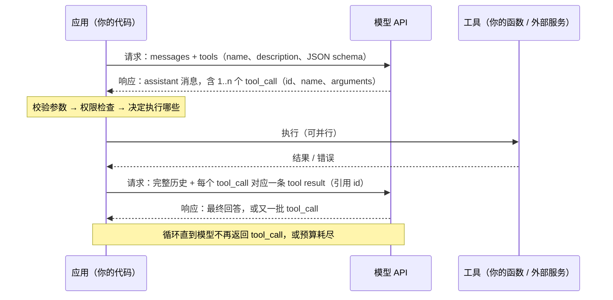

第一篇讲了组件怎么坏。这一篇讲组件的接口——你和它之间的协议。2026 年，OpenAI、Anthropic、Google、DeepSeek 四家的模型 API 已经收敛成一套共同骨架：**一个消息列表进去，一个消息出来；消息可以携带工具调用与工具结果；输出可以被 schema 约束；响应可以流式返回；对话状态可以放在客户端也可以放在服务端**。学会这套骨架，换供应商只是改字段名；不学，每换一家都要重新踩一遍坑。

但文档不会告诉你三件事。第一，**工具调用是一个协议而不是一个功能**：模型返回的是"我想调用 X"，执行、配对、把结果送回、决定何时停止，全在你这一侧，出错的地方也全在你这一侧。第二，**结构化输出的"严格模式"保证的是语法不是语义**：一个符合 schema 的 JSON 可以每个字段都是编造的。第三，**状态的默认值**：Responses API 默认把你的请求存 30 天，Chat Completions 对新账户也默认存，一个隐私敏感的应用从旧接口迁过去、什么都没改，就开始留存用户数据了。

本篇要回答的核心问题是：

> **四家 API 的共同骨架是什么，差异在哪？[^q0] 一次工具调用的往返在协议上经过哪几步、哪些是应用的责任？[^q1] 结构化输出保证了什么、没保证什么？[^q2] 流式响应的事件模型与状态管理的默认值有什么坑？[^q3]**

## 一、总览

### 1. 四家 API 在一张表上

| | OpenAI | Anthropic | Google | DeepSeek |
|---|---|---|---|---|
| 推荐入口 | Responses API（`/v1/responses`） | Messages API（`/v1/messages`） | Interactions API（2026-06 GA） | OpenAI 格式（`api.deepseek.com`） |
| 维持的旧入口 | Chat Completions（支持；GPT-5.4 起不支持带 `reasoning_effort` 的工具调用）；Assistants API 已于 2026-08-26 关闭 | — | `generateContent`（支持，标为 legacy） | Anthropic 格式（`/anthropic`）、Responses 格式 |
| 输入形状 | `input`：item 列表（message / function_call_output 等）+ 顶层 `instructions` | `system` + `messages`（user / assistant 交替，content 为块列表） | `input`（Interactions）；`contents[].parts`（generateContent，角色 user / model） | 同 OpenAI |
| 输出形状 | `output`：item 列表（`message` / `function_call` / `reasoning` …） | `content`：块列表（`text` / `tool_use` / `thinking`） | `steps` 时间线（Interactions，2026-05 起替代 `outputs`）；`candidates[].content.parts` | 同 OpenAI |
| 工具调用 | `tools` + `tool_choice`；输出 `function_call`（`call_id`、`arguments` 为字符串）；结果以 `function_call_output` 送回 | `tools`（`input_schema`）+ `tool_choice`（auto / any / tool / none）；输出 `tool_use` 块（`id`、`input` 为对象）；结果以 user 消息里的 `tool_result` 块送回 | `functionCall` / `functionResponse` part；内置 Google Search 等 | 同 OpenAI |
| 结构化输出 | `text.format` = `json_schema`（`strict`） | `output_config.format` = `json_schema` | `response_format`（Interactions，多态）；`responseSchema`（generateContent） | `response_format: json_object`（JSON 模式） |
| 流式 | SSE：`response.output_text.delta` 等类型化事件 | SSE：`message_start` / `content_block_delta` / `message_delta` / `message_stop` | SSE：`interaction.created` / `step.delta` / `interaction.completed` | 同 OpenAI（`choices[].delta` 分块） |
| 状态 | 服务端：`previous_response_id` 或 Conversations；**默认存储**（`store: true`，30 天） | 客户端：每次送完整历史 | 服务端：`previous_interaction_id`；**默认存储** | 客户端 |
| 缓存 | 自动前缀缓存（读 0.1×，GPT-5.6 起写 1.25×） | `cache_control` 显式断点或顶层自动；5 分钟 / 1 小时 TTL | 隐式缓存 + 显式缓存（按小时计存储费） | 自动磁盘前缀缓存（命中价约为未命中的 2%） |

表里每一行都对应本文一章。看这张表要抓两点：**形状趋同**（都是"列表进、列表出"，都把工具调用、结构化输出、流式做成一等公民）；**默认值分歧**（谁存状态、缓存要不要显式声明、参数字符串还是对象）——坑都在默认值里。

### 2. 本文的章节安排

第二章讲消息与角色的骨架；第三章讲工具调用的协议——本文最重要的一章；第四章讲结构化输出的三个层次与它保证的边界；第五章讲流式的事件模型；第六章讲状态放在哪一侧与默认存储；第七章列 2026 年内四家契约的变更；第八章给出一个中间层的最小设计与实践建议。

## 二、消息与角色：共同骨架

### 1. 三种角色，四种叫法

所有 API 都区分三类发言者：**开发者的指令**（OpenAI 叫 `instructions` / `developer`，Anthropic 叫顶层 `system`，Gemini 叫 `system_instruction`，Chat Completions 与 DeepSeek 叫 `system` 消息）、**用户**（`user`）、**模型**（OpenAI / Anthropic / DeepSeek 叫 `assistant`，Gemini 叫 `model`）。工具结果在 OpenAI 是独立的 `tool` 角色（Chat Completions）或 `function_call_output` item（Responses），在 Anthropic 是 user 消息里的 `tool_result` 块，在 Gemini 是 `functionResponse` part——**名字不同，语义相同**：一段由应用（而不是用户或模型）产生、要让模型读到的内容。

一个常见误解是把"开发者指令"当成一种权限更高的通道。它在模型眼里只是上下文里的一段被标记为 system 的文本；模型被训练成更重视它，但这是概率上的"更重视"，不是访问控制（第一篇第四章）。prompt injection 能起作用，正是因为工具返回里的一句"忽略之前的指令"与 system 里的指令在同一个上下文里竞争。

### 2. 内容是块的列表

早期 API 里一条消息就是一个字符串。现在一条消息的 content 是**块的列表**：文本块、图片块（URL 或 base64）、文件块（PDF）、音频块、以及模型输出侧的工具调用块、思考块。这个设计有两个含义：

- **多模态输入是消息的一部分**，不是另一个 API。一张图在 content 里就是一个块，计费按供应商的换算（一张 1024² 的图通常折成几百到一千多 token，第四篇有账）。
- **一条消息可以同时含文本与多个工具调用**——并行工具调用在协议上就是一条 assistant 消息里有多个 `tool_use` / `function_call` 块。

Anthropic 的 `system` 也是块列表，这是它的 `cache_control` 能精确放在某个块上的原因（第四篇）。

### 3. 谁负责把历史拼起来

无状态 API（Messages、Chat Completions、`generateContent`）要求你每次把**全部历史**送过去：system、第一轮 user、第一轮 assistant（含它发出的工具调用）、工具结果、第二轮 user……历史的每一个块都要在。漏掉一个工具调用块而保留了它的结果，多数 API 会返回 400（结果找不到对应的调用）。这就是为什么"编辑历史"不是随意的操作——第三篇讲推理模型时这一点会更严格。

有状态 API（Responses、Interactions）让你只送新内容并引用上一次的 id，服务端拼历史。方便，但引出第六章的存储与留存问题。

## 三、工具调用是一个协议

### 1. 一轮往返

图里每一个箭头都是你的责任的边界。模型只做两件事：**决定**调用什么（第二个箭头）和**读**结果（第五个箭头之后）。校验、权限、执行、配对、截断、循环控制、终止条件，都在应用侧。一个 agent 框架提供的就是这张图的运行时（L4）；但在用框架之前，应该至少手写过一次这个循环，否则框架藏起来的每一个决定都会变成一个你不理解的 bug。

### 2. 工具定义：schema 决定模型用不用对

工具定义有三部分：名字、描述、参数的 JSON schema。三部分都是 prompt——模型是读了这些文本来决定调用什么、怎么填参数的。经验规则：

- **描述写"什么时候用、返回什么"**，不只写"做什么"。`search_orders`：只写"搜索订单"，模型会在该用 `get_order` 的时候也用它；写"按客户名或日期范围列出订单；已知订单号时用 get_order"，遵循率明显不同。
- **参数用枚举与类型收窄**。`status: string` 会收到 "已完成"、"completed"、"done"；`status: enum["pending", "shipped", "completed"]` 在严格模式下只会收到三者之一。
- **工具数量与选择准确率负相关**。几十个工具时模型会选错；OpenAI 的 Responses 与 Agents API 为此加了 tool search（按需加载定义），Anthropic 的 tool search 同理。L4 讲工具集的设计。
- **工具定义占 token 且在缓存前缀里**。几十个工具的 schema 可以是几千 token，每次请求都算输入；把它放在稳定的前缀位置让它命中缓存（第四篇）。

### 3. 参数是字符串还是对象

OpenAI（含 DeepSeek）的 `arguments` 是**JSON 字符串**——你要自己 `json.loads`，而且流式时它是分片到达的（第五章）。Anthropic 的 `input` 是**已解析的对象**。Gemini 的 `args` 也是对象。这个差异决定了你的解析层要不要处理"字符串不是合法 JSON"的情况——OpenAI 的 `strict: true` 工具 schema 保证了这一点，不开 strict 时要准备修复或重试。

### 4. `tool_choice`：让模型必须调用某个工具

四家都支持 `tool_choice`：自动（模型决定）、必须调用某个工具（any / required）、指定某个工具、禁止调用。"指定某个工具"曾是结构化输出出现之前的常用替代——用一个 `report_result` 工具的 schema 来约束输出格式。两点变化：结构化输出成熟后这个用法不再必要；**Claude Fable 5.1 起强制工具调用返回错误**（Anthropic 的迁移指南把它列为三个 breaking change 之一），依赖 `tool_choice: {type: "tool"}` 的代码在新模型上直接失败。契约会变，第七章有清单。

### 5. 结果送回：配对、截断与错误

- **配对**：每个 tool_call 的 id 必须有且只有一个结果。并行调用返回了三个 id，你就要送回三条结果，顺序不重要但缺一不可。
- **截断**：工具结果是上下文的一部分，一个返回 200KB 的 SQL 查询结果会吃掉预算、触发第一篇的上下文腐化，甚至直接超限。应用侧要截断或摘要，并在结果里说明"已截断，共 N 行"。
- **错误也是结果**：工具抛异常时把错误信息作为结果送回（Anthropic 有 `is_error` 标记），让模型决定重试、换参数或告诉用户——而不是让整个请求失败。这是 agent 循环能自我修复的前提。
- **结果是不可信输入**：网页、文档、外部 API 返回的内容进入上下文后与你的指令平级（第二章第 1 节）。间接 prompt injection 从这里进来；L6 讲防御。

### 6. 服务端工具

OpenAI Responses、Gemini、Anthropic 都提供**服务端执行**的内置工具：网页搜索、代码解释器、文件搜索、计算机使用，以及 OpenAI 与 Anthropic 的远程 MCP server 连接。它们在协议上的差别是：模型调用、供应商执行、结果直接回到模型，**不经过你的代码**——你看到的是最终回答和一条"用了搜索"的记录。方便，但你失去了图里第三到第五个箭头的控制权：不能校验参数、不能做权限检查、不能截断结果。何时用服务端工具、何时自己实现，是 L4 的一个设计决定；本篇只指出协议上的区别。

## 四、结构化输出：保证语法，不保证语义

### 1. 三个层次

| 层次 | 做法 | 保证 | 代表 |
|---|---|---|---|
| 提示 | 在 prompt 里说"输出 JSON，字段是……" | 无。遵循率是概率 | 所有模型 |
| JSON 模式 | 参数声明输出必须是合法 JSON | 语法合法的 JSON；字段不保证 | DeepSeek `json_object`、OpenAI `json_object` |
| schema 约束 | 传入 JSON schema，解码时约束每个 token 只能生成符合 schema 的续写 | 输出符合 schema：字段齐、类型对、枚举在范围内 | OpenAI `json_schema` + `strict`、Anthropic `output_config.format`、Gemini `response_format` / `responseSchema` |

第三层的机制是**约束解码**：把 schema 编译成一个自动机，采样时把不合法的 token 概率置零。所以它的保证是硬的——不是"模型很少出错"，而是"不可能生成不合法的 JSON"。代价是 schema 有限制（OpenAI 的 strict 模式要求所有字段 `required`、`additionalProperties: false`、不支持部分 JSON schema 特性）、首次使用一个 schema 有编译延迟、以及 schema 本身要占 token（Anthropic 把 schema 注入为一段额外的 system 文本，实测约 50–200 token 的固定开销加上 schema 自身；它落在缓存前缀里）。

### 2. 它没保证什么

- **语义**。`{"refund_eligible": true, "reason": "购买 90 天内"}` 符合 schema，但 90 天可能是编的。schema 约束的是形状，第一篇的幻觉一条不受影响。
- **拒答与空值**。模型判断不该回答时，在 strict 模式下仍必须产出合法 JSON——它会填空字符串、null 或一个看似合理的默认值。要在 schema 里给它一个显式的出口（`status: enum["ok", "cannot_answer"]`），否则拒答会被伪装成答案。
- **推理质量**。2024 年的一项研究（*Let Me Speak Freely?*）发现，强制模型直接输出严格格式会降低某些推理任务的表现——模型没有"先想再答"的空间。常用的缓解是在 schema 里放一个 `reasoning` 字段排在结论字段之前（字段顺序在约束解码里是生成顺序），或者两阶段：先自由推理，再一次结构化抽取。推理模型（第三篇）在 thinking 阶段已经有了这个空间，问题缓解了很多。

### 3. 解析层仍然要有

即使用了 strict 模式，解析层要处理：schema 校验（用 Pydantic / zod 再校一遍——供应商的 strict 与你的类型系统之间可能有细微差别）、业务校验（日期在合理范围、id 存在）、以及降级（校验失败时重试一次并把错误信息放进上下文，或回退到人工）。JSON 模式与提示层次下还要处理 markdown 代码块包裹、尾随文字、截断（`max_tokens` 不够时 JSON 不完整——检查 `stop_reason` / `finish_reason`）。

## 五、流式：事件模型

### 1. 为什么流式是默认

一次调用的总时长是首 token 延迟（TTFT）加逐 token 生成时间；几百 token 的回答要几秒到几十秒。流式把用户感知的延迟从"总时长"变成"TTFT"，对话产品几乎都开流式。它在协议上是 Server-Sent Events：一个长连接，服务端按事件推送增量。

### 2. 四家的事件类型

| | 开始 | 文本增量 | 工具调用参数增量 | 用量 | 结束 |
|---|---|---|---|---|---|
| OpenAI Responses | `response.created` | `response.output_text.delta` | `response.function_call_arguments.delta` → `.done` | 在 `response.completed` 的 `response.usage` 里 | `response.completed` |
| Chat Completions / DeepSeek | 第一个 chunk | `choices[0].delta.content` | `choices[0].delta.tool_calls[i].function.arguments`（分片字符串） | 最后一个 chunk（需 `stream_options.include_usage`） | `finish_reason` 非空 |
| Anthropic | `message_start`（含输入用量） | `content_block_delta`（`text_delta`） | `content_block_delta`（`input_json_delta`，分片字符串） | `message_delta`（输出用量） | `message_stop` |
| Gemini Interactions | `interaction.created` | `step.delta` | `step.delta` | 结束事件 | `interaction.completed` |

三个共同点决定了客户端的写法：

- **文本按增量拼接**，不要假设一个事件是一个词或一句话。
- **工具调用的参数是分片的字符串**，即使 Anthropic 非流式时给的是对象，流式时也是 `input_json_delta` 的字符串片段——必须等该块结束后拼起来再解析。一个常见 bug 是在收到第一个片段时就尝试 `json.loads`。
- **用量在末尾**。成本核算与预算控制不能在流式过程中做，只能在结束事件里读。中途断开的流没有用量事件，但**服务端已经生成的 token 照样计费**。

### 3. 中断与超时

流式连接会断：网络、供应商过载、你自己的网关超时。断了不能"从第 137 个 token 续上"——只能重发整个请求，接受再花一次钱（幂等与重试在第六篇）。超时要分层：连接超时、**首事件超时**（TTFT 异常长通常是排队或长 prefill，第四篇）、事件间超时（生成卡住）、总超时。只设一个总超时的客户端会在 TTFT 正常但生成很长的情况下误杀请求。

## 六、状态：谁保存对话

### 1. 两种模型

**客户端状态**（Messages、Chat Completions、`generateContent`）：你保存历史，每次全部送过去。优点是完全可控、可移植、可审计；缺点是每轮都传全量（网络与 prefill 成本随轮数增长——缓存缓解了 prefill 成本，第四篇），以及你要自己做历史的截断与压缩。

**服务端状态**（Responses 的 `previous_response_id` 与 Conversations、Interactions 的 `previous_interaction_id`）：你只送新内容，服务端拼历史。优点是简单、推理模型的内部状态（第三篇）能被服务端保留；缺点在下面。

### 2. 默认存储

Responses API **默认 `store: true`**，响应保留 30 天；Conversation 对象里的 item **没有 TTL**，直到你删除；Chat Completions 对新账户也默认存储。Interactions API 同样默认存储。要不留存必须显式 `store: false`（OpenAI）或走 Zero Data Retention 的组织级配置。一个从 Chat Completions 迁到 Responses 的隐私敏感应用，如果只改了端点，就开始留存用户内容了——这是 Responses 迁移里最常见的合规事故，且服务端状态一旦关闭，`previous_response_id` 也不能用了（没有存储就没有可引用的上一轮），你得回到客户端状态。

### 3. 计费不因服务端状态而减少

服务端拼历史不意味着历史不计费。每一轮请求，模型仍然要读完整上下文，输入 token 照样算——只是缓存命中的部分打折。服务端状态改变的是**谁传历史**，不是**谁付历史的钱**。

### 4. 可移植性

服务端状态把对话绑在一家供应商上。要做多供应商路由与 fallback（L6），客户端状态是唯一可行的形态——或者你在中间层维护一份自己的历史，把服务端状态只当作缓存。

## 七、2026 年契约的变更清单

第一篇第七章从"供应商会换模型"的角度列过一次；这里按 API 契约本身列：

| 时间 | 供应商 | 变更 | 类型 |
|---|---|---|---|
| 2026-05-26 / 06-08 | Google | Interactions API：`outputs` → `steps`，`response_mime_type` 删除并入多态 `response_format`，SSE 事件改名；新 schema 5 月 26 日成为默认，旧 schema 6 月 8 日移除；Python / JS SDK 1.x 同日失效 | 破坏性 |
| 2026-06 | Google | Interactions API GA，`generateContent` 标为 legacy（仍支持；Batch、显式缓存、安全设置暂未迁入） | 推荐入口变更 |
| 2026-06-30 | Anthropic | Sonnet 5：非默认 `temperature` / `top_p` / `top_k` 返回 400；手动 extended thinking（`budget_tokens`）移除 | 破坏性 |
| 2026-08-26 | OpenAI | Assistants API 关闭；Assistants → Prompts（仅能在控制台创建）、Threads → Conversations、Runs → Responses | 移除 |
| 2026-09-01 | Anthropic | Fable 5.1：强制工具调用返回错误；thinking block 的历史校验 | 破坏性 |
| 2026（GPT-5.4 起） | OpenAI | Chat Completions 不支持 `reasoning_effort` 非 `none` 时的工具调用 | 功能收窄 |
| 2026 | DeepSeek | 提供 OpenAI、Anthropic、Responses 三种格式端点 | 兼容性扩展 |

模式很清楚：**新入口做加法，旧入口先冻结再移除，行为默认值随模型代际变**。应对不是追每一次变更，而是让变更只影响一处——下一章。

## 八、一个中间层的最小设计

### 1. 边界

不要在业务代码里直接构造某一家的请求体。放一个薄的中间层，职责只有五个：

| 职责 | 内容 | 为什么 |
|---|---|---|
| 归一化消息 | 一种内部的消息 / 块表示 ↔ 四家的格式 | 换供应商、做 fallback 只改适配器 |
| 归一化工具协议 | 内部的 tool_call（id、name、args 对象）与 tool_result；适配"参数是字符串还是对象" | 第三章的配对与解析集中在一处 |
| 归一化流式事件 | 内部事件：`text_delta`、`tool_call_delta`、`tool_call_done`、`usage`、`done` | 业务层不感知四家事件名 |
| 归一化用量 | 四类 token（输入 / 缓存命中 / 缓存写入 / 输出）+ 思考 token | 第四篇的账要这些字段；框架常把它们合成一个数 |
| 记录原始请求与响应 | 完整请求体、完整响应、模型名、参数、耗时 | 第一篇的失效定位与 L5 的 trace 都从这里来 |

**不要做的事**：不要把四种 token 合成一个"tokens"；不要吞掉 `stop_reason` / `finish_reason`；不要在中间层做重试以外的"智能"（自动改 prompt、自动截断历史），那些属于上层且要可见。

### 2. 实践建议

1. **手写一次工具调用循环**再用框架——包括并行调用的配对、错误作为结果送回、步数上限。
2. **审查 `store` 的默认值**。用 Responses 或 Interactions 的应用，检查每条请求是否显式设置了 `store`，并把它写进代码审查清单。
3. **结构化输出的 schema 里放一个显式的拒答出口**，并在解析后再做一次业务校验。
4. **流式客户端做四层超时**（连接、首事件、事件间、总），工具调用参数等 `done` 事件再解析。
5. **用量按四类 token 记录**，不要合并。
6. **把本章的中间层做成你团队的模块**，四家适配器各一个文件，契约变更时只改对应文件并跑评测集。

## 九、本文小结

- 四家 API 的骨架相同：块列表组成的消息进去、块列表出来，工具调用、结构化输出、流式是一等公民，差异在字段名与默认值。
- 工具调用是协议：模型只决定和读结果，校验、权限、执行、配对、截断、循环控制在应用侧；工具结果是不可信输入。
- 结构化输出的 schema 约束是硬保证，但只保证形状：语义、拒答、推理质量都不在保证之内，schema 要留拒答出口，解析层仍要做业务校验。
- 流式的三个共性：文本按增量拼接，工具参数是分片字符串要等结束再解析，用量在末尾；中断只能重发并接受成本。
- 服务端状态默认存储（Responses 30 天、Conversation 无 TTL），不省输入 token 的钱，且绑定供应商；隐私敏感的迁移要显式 `store: false`。
- 2026 年内四家都有破坏性契约变更；用一个五职责的中间层把变更收在一处。

## 十、自测

1. 模型在一条 assistant 消息里返回了三个并行的 tool_call。你执行了两个成功、一个抛异常，然后只把两个成功的结果送回。会发生什么？正确做法是什么？

   

   
答案

   多数 API 返回 400：第三个 tool_call 的 id 没有对应的结果，历史不完整。正确做法是三个 id 都送回结果，失败的那个把错误信息作为结果（Anthropic 标 `is_error: true`），让模型决定重试、换参数还是告知用户。详见[第三章](#三工具调用是一个协议)。
   

2. 一个用 `strict` json_schema 的分类接口，schema 是 `{category: enum[A, B, C], confidence: number}`。用户输入是一段完全无关的乱码。模型会返回什么？这暴露了什么设计问题？

   

   
答案

   它必须返回合法 JSON，所以会从 A / B / C 里挑一个并给一个看似合理的 confidence——拒答被伪装成了答案。设计问题是 schema 没有拒答出口；应加 `category: enum[A, B, C, none]` 或 `status: enum[ok, cannot_classify]`，并在下游把 `none` 当作需要人工处理。strict 保证语法不保证语义。详见[第四章](#四结构化输出保证语法不保证语义)。
   

3. 流式响应中，Anthropic 的 `tool_use` 块的参数以什么形式到达？在什么时刻才能解析？OpenAI 呢？

   

   
答案

   Anthropic 非流式时 `input` 是对象，但流式时以 `content_block_delta` 的 `input_json_delta` 字符串片段到达，要等该块的 `content_block_stop` 后拼接再解析。OpenAI 的 `arguments` 本来就是字符串，流式以 `response.function_call_arguments.delta` 分片到达，等 `.done` 事件再解析。两家都不能在第一个片段时 `json.loads`。详见[第五章](#五流式事件模型)。
   

4. 一个医疗问答应用从 Chat Completions 迁到 Responses API，只改了端点与字段映射。上线后合规审计发现了什么？为什么服务端状态"省事"却不省钱？

   

   
答案

   发现用户对话内容被 OpenAI 保留 30 天——Responses 默认 `store: true`，迁移时没有显式设为 `false`。不省钱是因为服务端拼历史只改变了谁传历史：每轮模型仍读完整上下文，输入 token 照样计费（缓存命中部分打折），账单与客户端状态相同。详见[第六章](#六状态谁保存对话)。
   

5. 你的代码用 `tool_choice: {type: "tool", name: "extract"}` 强制 Claude 调用一个抽取工具来获得结构化输出。升级到 Fable 5.1 后会怎样？该改成什么？

   

   
答案

   返回错误——Fable 5.1 起强制工具调用是三个 breaking change 之一。应改用结构化输出 `output_config.format` 传 json_schema；这本来就是"用工具当结构化输出"这个 workaround 的正规替代。契约变更应只影响中间层的一个适配器文件。详见[第三章](#三工具调用是一个协议)、[第七章](#七2026-年契约的变更清单)。
   

## 下一篇

[API 契约（二）：推理模型——thinking、effort 与跨轮的推理状态](/reasoning-models-as-components-thinking-effort-and-state.html)

[^q0]: 骨架：消息是块列表（文本、图片、文件、工具调用、工具结果、思考），角色分开发者指令 / 用户 / 模型三类，工具定义用 JSON schema，模型输出里带 tool_call、应用送回 tool result，结构化输出用 schema 约束解码，流式用 SSE 事件，状态或在客户端（Messages、Chat Completions、generateContent）或在服务端（Responses、Interactions）。差异在字段名（`instructions` / `system` / `system_instruction`；`assistant` / `model`）、参数形态（OpenAI 的 `arguments` 是字符串，Anthropic 的 `input` 是对象）、缓存声明（Anthropic 显式 `cache_control`，其余自动）、以及默认存储（Responses、Interactions 默认存）。详见[第一章](#一总览)、[第二章](#二消息与角色共同骨架)。

[^q1]: 六步：应用送 messages + tools → 模型返回含 1..n 个 tool_call（id、name、arguments）的消息 → 应用校验参数、检查权限、执行（可并行）→ 应用把每个 id 对应的结果（含错误）送回 → 模型给出最终回答或再一批 tool_call → 循环直到无调用或预算耗尽。模型只负责"决定"与"读结果"；校验、权限、执行、id 配对（缺一个就 400）、结果截断、把错误作为结果送回、步数与预算控制、终止判断都是应用的责任。工具结果是不可信输入。详见[第三章](#三工具调用是一个协议)。

[^q2]: schema 约束（OpenAI `json_schema` + `strict`、Anthropic `output_config.format`、Gemini `response_format`）通过约束解码保证输出**必然**符合 schema：字段齐、类型对、枚举在范围内、JSON 合法——这是硬保证。没保证的：字段值的真实性（幻觉不受影响）、拒答（模型不该答时也必须产出合法 JSON，会填默认值伪装成答案——schema 要留显式出口）、推理质量（直接输出严格格式可能损害推理，可在 schema 里把 reasoning 字段放在结论前，或两阶段）。strict 模式对 schema 有限制且 schema 占 token。解析层仍要做业务校验。详见[第四章](#四结构化输出保证语法不保证语义)。

[^q3]: 流式：文本按增量拼接；工具调用参数以分片字符串到达（Anthropic 的 `input_json_delta`、OpenAI 的 `function_call_arguments.delta`），要等结束事件再解析；用量只在末尾事件里，中断的流没有用量但已生成的 token 照样计费；中断不能续传只能重发；超时要分连接 / 首事件 / 事件间 / 总四层。状态：Responses 默认 `store: true` 保留 30 天、Conversation 无 TTL、Interactions 默认存储——隐私敏感的迁移要显式 `store: false`；服务端状态不减少输入 token 计费，且把对话绑定在一家供应商上。详见[第五章](#五流式事件模型)、[第六章](#六状态谁保存对话)。
