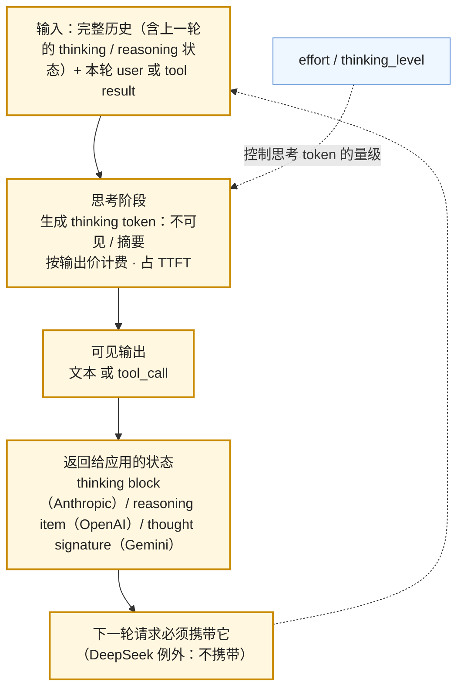

到 2026 年，四家的主力模型都是推理模型：GPT-6 Astra 与 GPT-5.6 有 `reasoning.effort`，Claude 5 系列默认开启 adaptive thinking，Gemini 3.x 有 `thinking_level`，DeepSeek V4.1 Flash 默认 thinking mode。"推理模型"不再是一个选项，是默认。这给上一篇的契约加了一个维度：模型在给出可见输出之前会先生成一段**不可见或半可见的思考**，这段思考**要花钱**（按输出价计费）、**要花时间**（发生在首 token 之前）、**是状态**（下一轮要原样送回，否则模型"忘了自己刚才怎么想的"），并且它的多少由一个叫 effort 的参数控制。

这一维度带来四个后果，每个都能让一个从非推理模型迁过来的应用出问题：同样的请求账单翻倍（思考 token）；TTFT 从一秒变成十秒（思考在前）；编辑历史消息返回 400（thinking block 的校验）；在两个模型之间做 fallback 时对话历史不兼容（新模型的 thinking block 旧模型读不了）。本篇把这四个后果讲清楚。

本篇要回答的核心问题是：

> **推理模型的"思考"在 API 上是什么，怎么计费？[^q0] effort 参数控制什么，怎样决定用哪一档？[^q1] thinking block 为什么要原样送回，编辑历史会怎样？[^q2] 推理状态对 prompt caching 与多轮成本有什么影响？[^q3]**

## 一、总览

### 1. 四家的推理维度

| | OpenAI（GPT-5.6 / GPT-6） | Anthropic（Claude 5 系列） | Google（Gemini 3.x） | DeepSeek（V4.1 Flash） |
|---|---|---|---|---|
| 控制参数 | `reasoning.effort`：`none` / `low` / `medium` / `high` / `xhigh` / `max`；`reasoning.mode: pro` | `effort`：`low` / `medium` / `high` / `xhigh` / `max`，默认 `high`；`thinking: adaptive`（默认）/ `disabled` | `thinking_level`：`low` / `medium` / `high`；3.8 Flash 默认 `medium`，3.1 Pro 默认 `high` | thinking mode 默认开启；effort `low` / `high` / `max` |
| 思考的可见性 | 默认不返回；可要求摘要（`reasoning.summary`） | 返回 thinking block（部分场景为摘要 / 加密的 redacted 块） | 返回 thought summary；thought signature 用于状态 | 返回完整 `reasoning_content` |
| 计费 | 思考 token 按输出价计入 `output_tokens_details.reasoning_tokens` | 思考 token 按输出价计入 `output_tokens` | 价目表明写"output（including thinking tokens）" | 按输出价 |
| `max_tokens` 的含义 | `max_output_tokens` 含思考 | `max_tokens` 是思考 + 回答的硬上限 | `max_output_tokens` 含思考 | 含思考 |
| 跨轮状态 | Responses：`reasoning` item 由服务端保留（`previous_response_id`）或以加密 item 随请求往返；Chat Completions 不保留 | 上一轮的 thinking block 必须原样送回；Fable 5.1 起校验其之前的历史未被改动 | thought signature 随 function call 往返 | `reasoning_content` **不要**送回（送回会 400） |
| 关闭思考 | `effort: none`（支持的模型） | `thinking: disabled`，仅在 effort ≤ `high` 时允许（Opus 5）；Sonnet 5 上手动 `budget_tokens` 返回 400 | `thinking_level: low`（不能完全关） | 切非 thinking 模式 |

### 2. 一轮推理调用的解剖

三条箭头对应本文三个核心问题：effort 控制思考阶段的大小（第三章）；思考阶段的产物要作为状态回流（第四章）；思考阶段的 token 进账单、进 TTFT（第二、五章）。

### 3. 本文的章节安排

第二章讲思考在协议上是什么、怎么计费；第三章讲 effort 这个旋钮与怎样为一个任务选档；第四章讲跨轮的推理状态——四家的机制与它对"编辑历史"、"跨模型 fallback"的约束；第五章讲它对缓存与多轮成本的影响；第六章讲从非推理模型迁移时默认值带来的风险；第七章实践建议。

## 二、思考在协议上是什么

### 1. 三种可见性

模型在思考阶段生成的 token 与最终回答的 token 在计算上没有区别——都是自回归地一个个生成，都读一遍上下文，都占 decode 时间。区别只在**是否返回给你**：

- **完整返回**：DeepSeek 的 `reasoning_content` 字段给出全部思考文本。你可以展示、可以记日志、可以用它调试——但**不能送回**：DeepSeek 的多轮对话文档明确要求下一轮输入里不包含 `reasoning_content`，否则返回 400。它的思考是无状态的，每轮重新想。
- **原样返回但可能加密或摘要**：Anthropic 返回 `thinking` 块；在某些情况下返回 `redacted_thinking`（加密的思考内容，你看不到但要原样送回）。Claude 4 系列起长思考默认返回摘要而按完整思考计费。
- **默认不返回**：OpenAI 的 Responses 默认不返回思考内容，可以用 `reasoning.summary` 要一份摘要；思考的完整状态作为 `reasoning` item 由服务端保留，或在无状态 / ZDR 模式下以加密形式随请求往返。Gemini 返回 thought summary。

对应用的含义：**不要把思考内容当作可靠的可解释性**。摘要是模型对自己思考的再描述，加密块你看不到，完整返回的也可能与最终答案不一致。它对调试有用（"它为什么调用了这个工具"），不适合作为向用户展示的"推理过程"，更不适合作为审计依据。

### 2. 计费

四家都按**输出价**计思考 token。这是本篇最重要的账：输出价通常是输入价的 4–5 倍（第四篇），而一次高 effort 的调用，思考 token 可以是回答 token 的十倍以上。一个数字例子（2026 年 9 月价目）：

| 请求 | 输入 | 思考 | 回答 | 单价（输入 / 输出，每百万） | 成本 |
|---|---|---|---|---|---|
| Sonnet 5，effort `low`，分类任务 | 2,000 | 300 | 50 | \$2 / \$10 | 2,000 × 2 + 350 × 10 = \$0.0075 |
| Sonnet 5，effort `high`，同一任务 | 2,000 | 4,000 | 50 | \$2 / \$10 | 2,000 × 2 + 4,050 × 10 = \$0.0445 |
| GPT-5.6 Sol，effort `xhigh`，agent 一步 | 30,000 | 12,000 | 400 | \$4 / \$20 | 30,000 × 4 + 12,400 × 20 = \$0.368 |

（成本 = token 数 × 单价 ÷ 10⁶。）第一行到第二行，输入没变、回答没变，账单涨了 6 倍——全部是思考。对一个每天百万次的分类接口，这是每天几百美元与几千美元的差别。

`max_tokens` 的含义随之变化：它是思考加回答的**总**上限。一个在非推理模型上设 `max_tokens = 1024` 刚好够输出一段 JSON 的应用，迁到推理模型后，思考用掉 900 个，回答被截断，JSON 不完整——`stop_reason` 是 `max_tokens`。Anthropic 的 Sonnet 5 迁移指南把这一条单列出来提醒。

### 3. 用量字段

要把思考 token 单独记下来。OpenAI 在 `usage.output_tokens_details.reasoning_tokens`；Anthropic 把它算进 `output_tokens`（思考块的 token 数可以从返回的块估算）；Gemini 在 `usage_metadata.thoughts_token_count`；DeepSeek 在 `completion_tokens_details.reasoning_tokens`。上一篇中间层的"归一化用量"要把这第五类 token 加进去——否则你只看到"输出 token 涨了"，不知道是模型话多了还是想多了。

## 三、effort：一个旋钮，三条曲线

### 1. 它控制什么

effort 不是一个精确的 token 预算（那是 Anthropic 已经移除的 `budget_tokens` 的语义），而是一个**倾向**：模型自己决定想多久，effort 告诉它"这个任务值得想多少"。Anthropic 的 adaptive thinking 文档说得直接："模型决定何时以及想多少，effort 是控制思考深度的参数。"同一档 effort 下，简单问题思考少、复杂问题思考多；不同档之间是量级的差别。

四家的档位不完全对齐，但都有一条从"几乎不想"到"不限制"的梯子。Anthropic 对 Sonnet 5 各档的说明可以作为通用理解：

| 档 | 用途 |
|---|---|
| `low` | 短小、范围明确、延迟敏感、对智力不敏感的任务 |
| `medium` | 成本敏感、愿意用一点质量换 token 的场景 |
| `high` | 默认；多数场景的平衡点 |
| `xhigh` | 最难的编码与 agent 任务的推荐档 |
| `max` | 不限制思考 token 的最高档 |

OpenAI 的 GPT-6 Astra 也是 `low` 到 `max` 五档，另有 `reasoning.mode: pro` 对应原 o3-pro / GPT-5 Pro 一类"多次采样再综合"的更贵形态。Gemini 只有三档，`low` 也不能完全关闭思考。

### 2. 三条曲线

选档的方法只有一个：在你自己的评测集上（第五篇）把每一档跑一遍，画三条曲线——**质量**（任务指标）、**成本**（每任务美元）、**延迟**（TTFT 与总时长）随 effort 的变化。典型形状：

- 质量曲线在某一档之后**饱和**：简单任务在 `low` 就饱和，复杂 agent 任务到 `xhigh` 还在涨。Anthropic 发布 Opus 5 时给出的正是这种"性能随 effort 变化"的图，并建议"从默认 `high` 开始，质量不掉就往下调省 token，最难的任务往上调"。
- 成本曲线**单调上升**且在高档陡增——思考 token 随难度非线性增长。
- 延迟曲线跟随成本：思考在首 token 之前，effort 直接决定 TTFT。

三条曲线的交点就是这个任务的档。**不同任务用不同的档**：一个应用里的意图分类用 `low`，复杂的多步 agent 用 `xhigh`，两者可以是同一个模型。这是"按任务计价"（price per task）而不是"按 token 计价"的思路——OpenAI 在发布 GPT-6 Astra 时的说法是市场正在"意识到你真正要买的是每任务的价格"。effort 就是把这个价格调到合适位置的旋钮。

### 3. 过度思考

推理模型有一个已被广泛观察到的现象：在简单任务上，高 effort 不仅浪费 token，有时还**降低**准确率——模型想出了本不存在的复杂性，或在长思考里改变了本来正确的初判。这不是普遍规律，但足以说明"effort 越高越好"不成立。评测集里放一批简单用例，专门看高档是否比低档差。

### 4. 逐消息调整 effort

一个 agent 任务里，规划那一步值得 `xhigh`，读文件那几步 `low` 就够。Anthropic 在 Fable 5.1、Mythos 5.1 与 Opus 5 上提供了逐消息 effort（beta，请求头 `mid-conversation-output-config-2026-07-01`）：在 `messages` 里插入一条 `role: system` 的消息携带 `output_config.effort`，改变后续轮的 effort **而不使 prompt cache 失效**——最后一点是关键，改顶层参数通常会让前缀缓存失效（第五章）。OpenAI 在 Responses 里每次请求可以独立设置 `reasoning.effort`，服务端状态让这件事天然可行。

## 四、跨轮的推理状态

### 1. 为什么思考要跨轮保留

一个 agent 循环里，模型思考 → 决定调用工具 → 你执行 → 送回结果 → 模型继续。如果第二轮请求里没有第一轮的思考，模型面对的是"我刚才不知为何调用了这个工具，现在拿到了结果"，它要么重新想一遍（多花钱、多花时间），要么在缺少上下文的情况下继续（质量下降）。Anthropic 把这叫 **interleaved thinking**——思考与工具调用交错，思考块是这条链的一部分；OpenAI 说 Responses 让"推理 token 在轮次之间保留"，并以此解释为什么 Chat Completions（不保留）从 GPT-5.4 起不再支持带 effort 的工具调用——那条路径上的 agent 效果太差。

### 2. 四种机制

| 供应商 | 状态载体 | 应用要做什么 | 校验 |
|---|---|---|---|
| Anthropic | 上一轮 assistant 消息里的 `thinking` / `redacted_thinking` 块 | 原样送回，位置与内容不能动 | 块带签名；Fable 5.1 起还校验**块之前的历史**未变：新账户（2026-08-31 后创建）下把它放到 system / tools / 更早 assistant 消息之后返回 400；带 `thinking … 2026-08-01` 相关 beta 头时可选"拒绝"或"丢弃"（`mismatch_behavior`），被丢弃的块在 `input_transformations` 里报告 |
| OpenAI（Responses） | `reasoning` item | 服务端状态：用 `previous_response_id` 自动带上；无状态 / ZDR：用 `include` 要回加密的 reasoning 内容并随下一次请求送回 | 加密内容只有服务端能读 |
| Google（Gemini 3） | thought signature | 在多轮 function calling 中随 `functionCall` 部分原样送回 | 缺失会降低后续轮的质量或报错 |
| DeepSeek | 无 | **不要**送回 `reasoning_content`，送回返回 400 | — |

前三家的设计是同一个思想的三种实现：**思考是模型的内部状态，应用只负责搬运，不负责读写**。加密（OpenAI）、签名（Anthropic、Gemini）都是为了保证你搬运的是原件。DeepSeek 选择了无状态——简单，但每轮重新推理。

### 3. 编辑历史的约束

在 Chat Completions 时代，应用随意编辑历史：删掉几轮省 token、把长工具结果换成摘要、合并两条消息。推理状态让这些操作有了约束：

- **不能只删思考块保留其他**：Anthropic 会拒绝或（配置为丢弃时）丢掉与历史不一致的块，模型退化为"忘了刚才怎么想"。
- **不能改动思考块之前的内容**：Fable 5.1 的历史校验意味着替换更早一轮的工具结果为摘要，会让后面所有 thinking block 失效。要压缩历史，只能在一个**新的**思考链开始处做——例如在一次工具循环完全结束、模型给出最终回答之后，再对整段历史做摘要（L2 上下文工程的"压缩"要在这些边界上做，L4 的 compaction 也是）。
- **旧模型读不了新模型的思考块**：Fable 5.1 的 thinking block 只有它自己或更新的模型能读；早期模型收到会被 API 丢弃。做跨模型 fallback（Fable 5.1 超时切到 Opus 5）时，携带 Fable 5.1 思考块的历史在 Opus 5 上会失去推理状态；反向（Opus 5 → Fable 5.1）可以。fallback 策略要考虑方向。

### 4. 服务端状态与 ZDR 的两难

OpenAI 的 `previous_response_id` 让推理状态的搬运完全透明，但依赖服务端存储（上一篇第六章：默认 30 天）。合规要求 Zero Data Retention 的组织不能用它，要改成无状态模式：每次请求带完整历史，并用 `include` 要回加密的 reasoning item 随请求往返。请求体变大，但推理状态不丢。**两种模式的成本相同**（输入 token 都是全量计费），差别在谁传、谁存。

## 五、对缓存与多轮成本的影响

### 1. 思考 token 不在缓存里

prompt caching 缓存的是**输入前缀**（第四篇）。思考 token 是输出，每轮新生成、每轮全价。一个 20 步的 agent 任务，每步思考 3,000 token，光思考就是 60,000 个输出价 token——这部分不因任何缓存策略而减少，只能靠 effort 调低。

上一轮的思考块在下一轮变成了**输入**的一部分（Anthropic 原样送回、OpenAI 服务端拼接），这部分按输入价计费，并且能进缓存前缀。所以多轮 agent 的账是：每轮新思考按输出价、历史思考按输入价（缓存命中时打折）。

### 2. 什么会让缓存失效

缓存前缀要求**逐字节相同**。以下操作会让前缀从改动处起失效：改 system prompt（哪怕一个字）、改工具定义、改顶层参数（多数 API 把 effort、thinking 配置算在缓存键里——这就是 Anthropic 逐消息 effort 特意做成"不失效"的原因）、替换或删除历史中间的任何块。推理模型的历史里多了思考块，块的数量与位置更多，被无意改动的机会也更多。

### 3. Responses 与 Chat Completions 的缓存差别

OpenAI 声称 Responses 在 agent 场景下比 Chat Completions 有更好的缓存利用（第三方引用的数字是 40–80% 的改善）。原因不神秘：服务端状态保证了历史逐字节一致（应用没有机会"顺手"改一下），reasoning item 也留在前缀里。用客户端状态的应用要靠自己保证这一点：历史只追加、不修改。

## 六、迁移时的默认值风险

从非推理模型或早期推理模型迁到 2026 年的模型，默认值的变化足以让应用出问题。按供应商列：

**Anthropic**：Sonnet 5（2026-06-30）与 Opus 5（2026-07-24）把 adaptive thinking 改为**默认开启**——不带 `thinking` 字段的请求在 4.6 / 4.8 上不思考，在 5 上思考。后果：思考 token 出现在账单里；`max_tokens` 不够；TTFT 变长。同时，手动 `budget_tokens` 在 Sonnet 5 上返回 400（Sonnet 4.6 已弃用），Opus 5 上 `thinking: disabled` 只在 effort ≤ `high` 时被接受，`xhigh` / `max` 配 disabled 返回 400。Sonnet 5 还拒绝非默认的采样参数——推理模型的输出分布不再由你调 temperature。

**OpenAI**：Chat Completions 在 GPT-5.4 起不支持 `reasoning_effort` 非 `none` 的工具调用；用 Chat Completions 做 agent 的应用要迁到 Responses。`gpt-5-2025-08-07` 等快照 2026-12-11 关闭，推荐替代是 GPT-5.6 Sol / Terra / Luna——不同的默认 effort 与不同的价格。

**Google**：Gemini 3.8 Flash 默认 `medium`，3.1 Pro 默认 `high`；文档提醒 3.8 Flash "在长任务上会按设计用更多 token——更小的推理步、迭代调用工具、验证自己的工作"，并建议日常任务把 effort 调低。Interactions API 的 `steps` 时间线把思考作为独立的 step 类型暴露。

**DeepSeek**：V4.1 Flash 默认 thinking 开启；`deepseek-v4-pro` 自 9 月 14 日路由到 V4.1 Flash，调好的 effort 档在新模型上要重测。

共同的教训：**迁移不是改模型名**。至少要做三件事——在评测集上重跑 effort 各档；检查 `max_tokens`；检查历史编辑逻辑是否触碰思考块。

## 七、实践建议

1. **把思考 token 单独记账**：中间层的用量归一化加上 `reasoning_tokens`，仪表盘上把"思考 / 回答"分开画。多数团队第一次看到这张图会发现思考占输出的 70% 以上。
2. **每类任务跑一次 effort 扫描**：评测集 × 各档 → 质量 / 成本 / TTFT 三条曲线，取质量饱和的最低档。简单任务放一组用例专测过度思考。
3. **历史只追加**：把"修改历史中间内容"列为禁止操作；压缩只在一个思考链结束后对整段做。
4. **fallback 考虑方向**：新 → 旧模型会丢推理状态；在中间层记录每条历史是哪个模型生成的。
5. **`max_tokens` 按"思考 + 回答"重设**，并监控 `stop_reason == max_tokens` 的比例。
6. **ZDR 组织用无状态模式并携带加密推理状态**，不要为了省事关掉推理状态的往返。

## 八、本文小结

- 推理模型在可见输出前生成思考 token：按输出价计费、占 TTFT、`max_tokens` 含它；四家的可见性不同（DeepSeek 完整返回、Anthropic 原样 / 加密块、OpenAI 默认不返回、Gemini 摘要），但都不适合作为可解释性或审计依据。
- effort 是一个倾向而非预算，控制思考 token 的量级；同一任务 `low` 与 `high` 的账单可以差 6 倍。选档靠评测集上的质量 / 成本 / 延迟三条曲线，不同任务用不同档，"越高越好"不成立。
- 思考是跨轮的内部状态：Anthropic 的签名块、OpenAI 的（加密）reasoning item、Gemini 的 thought signature 都要原样搬运；DeepSeek 无状态、不能送回。它约束了编辑历史与跨模型 fallback。
- 思考 token 不进缓存；历史里的思考块进缓存前缀；改顶层参数会让缓存失效，Anthropic 的逐消息 effort 是例外。
- 2026 年迁移的最大风险是默认值：thinking 默认开启、`budget_tokens` 移除、采样参数被拒、Chat Completions 的功能收窄。迁移要重跑 effort 扫描、重设 `max_tokens`、检查历史编辑逻辑。

## 九、自测

1. 一个意图分类接口从 Claude Sonnet 4.6 迁到 Sonnet 5，请求体没变（无 `thinking` 字段，`max_tokens: 200`）。上线后出现两类问题，各是什么原因？

   

   
答案

   （1）账单上涨、TTFT 变长：Sonnet 5 默认开启 adaptive thinking，不带 `thinking` 字段的请求现在会思考，思考 token 按输出价计费且发生在首 token 之前。（2）输出被截断（`stop_reason: max_tokens`）：`max_tokens` 是思考 + 回答的总上限，200 被思考占掉。修法：对分类任务设 effort `low`（或 `thinking: disabled`，此时 effort 必须 ≤ `high`），`max_tokens` 按思考 + 回答重设。详见[第二章](#二思考在协议上是什么)、[第六章](#六迁移时的默认值风险)。
   

2. 用 2026 年 9 月价目计算：GPT-5.6 Terra（\$2 / \$12）上一个请求输入 8,000 token、思考 5,000、回答 300。成本多少？思考占成本的百分之几？

   

   
答案

   输入 8,000 × 2 = 16,000；输出 (5,000 + 300) × 12 = 63,600；合计 79,600 微美元 ≈ \$0.0796。思考 5,000 × 12 = 60,000，占 75.4%。详见[第二章](#二思考在协议上是什么)。
   

3. 一个 agent 应用为了省 token，在每轮请求前把三轮之前的工具结果替换成一句摘要。在 Claude Fable 5.1 上会发生什么？为什么在 Opus 4.8 上没事？

   

   
答案

   Fable 5.1 校验 thinking block **之前的历史**未被改动：替换更早的工具结果让其后所有思考块的校验失败，新账户下返回 400，或在配置为丢弃时丢掉这些块（`input_transformations` 报告），模型失去推理状态。Opus 4.8 只校验块本身的签名，不校验之前的历史。修法：压缩只在一个思考链结束（模型给出最终回答）之后对整段历史做。详见[第四章](#四跨轮的推理状态)。
   

4. 为什么 OpenAI 从 GPT-5.4 起让 Chat Completions 不再支持带 `reasoning_effort` 的工具调用？这与 Responses 的哪个特性有关？

   

   
答案

   Chat Completions 不在轮次之间保留推理状态：每次工具调用返回后模型面对的是"不知为何调用了这个工具"的历史，要重新推理或在缺少上下文下继续，agent 效果差。Responses 用 `reasoning` item（服务端保留或加密往返）把推理状态跨轮保留，interleaved 的思考与工具调用形成一条完整的链。OpenAI 因此把带 effort 的工具调用只留在 Responses。详见[第四章](#四跨轮的推理状态)。
   

5. 一个 20 步的 agent 任务，每步思考 3,000 token、可见输出 200 token、每步新增输入（工具结果）2,000 token，system + 工具定义 10,000 token。哪些 token 能被 prompt caching 打折，哪些不能？

   

   
答案

   不能打折的：每步新生成的 3,000 思考 + 200 输出（输出价，共 20 × 3,200 = 64,000）；每步新增的 2,000 工具结果在**它首次出现的那一轮**是未缓存输入。能打折的：10,000 的 system + 工具定义在第 2 步起命中缓存；历史里已出现的思考块、输出与工具结果在后续轮作为输入前缀命中缓存（前提是历史只追加、不修改，且顶层参数不变）。详见[第五章](#五对缓存与多轮成本的影响)。
   

## 下一篇

[成本与延迟的账：一次调用花多少钱、慢在哪一段](/token-cost-and-latency-ledger-for-llm-applications.html)

[^q0]: 思考是模型在可见输出之前自回归生成的一段 token，计算上与回答无异，只是可见性不同：DeepSeek 完整返回 `reasoning_content`，Anthropic 返回 `thinking` 块（部分为加密的 `redacted_thinking` 或摘要），OpenAI 默认不返回、可要摘要，Gemini 返回 thought summary。四家都按**输出价**计费（OpenAI 记在 `output_tokens_details.reasoning_tokens`，Gemini 价目表明写"output including thinking tokens"），且 `max_tokens` 是思考 + 回答的总上限。同一任务 Sonnet 5 从 effort `low` 到 `high`，思考从 300 涨到 4,000 token，账单从 \$0.0075 涨到 \$0.0445。详见[第二章](#二思考在协议上是什么)。

[^q1]: effort 是一个倾向而非 token 预算：模型自己决定想多久，effort 告诉它任务值得想多少。四家都有从"几乎不想"到"不限"的梯子（OpenAI `none` … `max`，Anthropic `low` … `max` 默认 `high`，Gemini 三档，DeepSeek 三档）。选档的方法是在自己的评测集上跑每一档，画质量 / 成本 / TTFT 三条曲线，取质量饱和的最低档；简单任务通常 `low` 就饱和，复杂 agent 任务到 `xhigh` 还在涨；高档在简单任务上可能反而降准确率（过度思考）。不同任务用不同档，Anthropic 支持逐消息改 effort 且不失效缓存。详见[第三章](#三effort一个旋钮三条曲线)。

[^q2]: 因为思考是模型的内部状态：agent 循环里下一轮要接着上一轮的思考继续（interleaved thinking），丢了就要重想或在缺少上下文下继续，效果差——这也是 OpenAI 让 Chat Completions 从 GPT-5.4 起不支持带 effort 的工具调用的原因。Anthropic 用带签名的 thinking 块、OpenAI 用（加密的）reasoning item、Gemini 用 thought signature 让应用只搬运不读写；DeepSeek 无状态、不能送回。编辑历史的后果：删思考块 → 被拒或丢弃；改思考块之前的内容 → Fable 5.1 起校验失败（新账户 400，或配置为丢弃）；新模型的思考块旧模型读不了 → fallback 有方向性。压缩历史只能在一个思考链结束后对整段做。详见[第四章](#四跨轮的推理状态)。

[^q3]: 思考 token 是输出，每轮新生成、全价、不进任何缓存，只能靠 effort 调低；上一轮的思考块在下一轮成为输入前缀的一部分，按输入价计费并可命中缓存。改 system、工具定义、顶层参数或历史中间任何块都会让前缀从改动处失效——Anthropic 的逐消息 effort（beta）是特意做成不失效的例外。OpenAI 称 Responses 比 Chat Completions 缓存利用更好，原因是服务端状态保证历史逐字节一致；客户端状态的应用要自己保证"历史只追加"。20 步 agent 每步思考 3,000 token 就是 60,000 个输出价 token，这部分与缓存无关。详见[第五章](#五对缓存与多轮成本的影响)。
