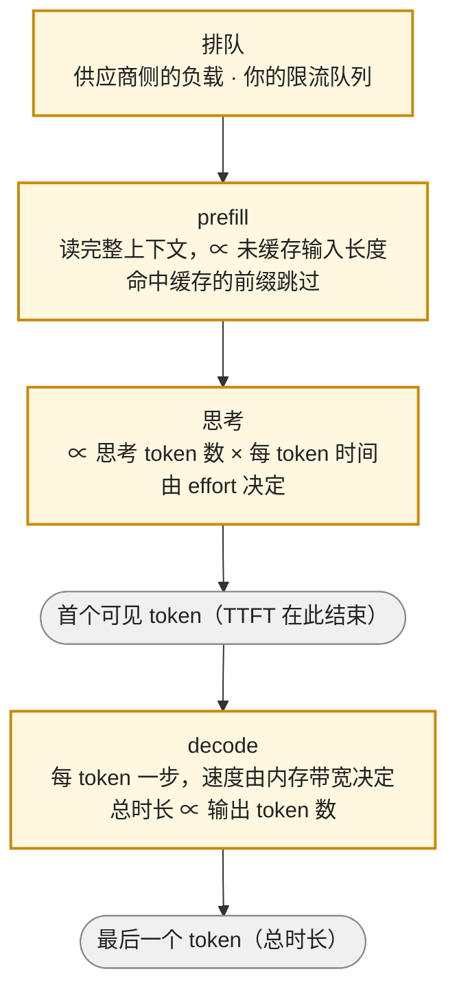

前三篇讲了组件怎么坏、接口长什么样。这一篇算账：一次调用花多少钱、慢在哪一段。这是应用工程师最容易忽略、又最先被账单教育的一层——demo 阶段每天几美元，上线后每天几千美元，而且账单上只有一个数字，看不出钱花在了 system prompt 的重复传输、还是推理模型的思考、还是那个把整份 PDF 塞进上下文的功能。

账有两本。**成本**：四种输入价（未缓存、缓存命中、缓存写入、长上下文加价）加一种输出价（含思考 token），批处理与峰谷的折价，多轮对话不做缓存时的二次增长。**延迟**：首 token 延迟分解为排队、prefill、思考三段，逐 token 速度由 decode 的内存带宽决定，总时长由输出长度主导——这些只需要 Infra 地图 08 系列前两篇的结论，本篇引用而不推导。两本账放在一起，才能回答"这个功能能不能做、该用哪个模型、缓存值不值"。

本篇要回答的核心问题是：

> **一次调用的成本公式是什么，四家 2026 年 9 月的价目差多少？[^q0] 缓存写入为什么额外收费、什么时候划算？[^q1] 为什么多轮对话的成本是二次增长，缓存能把它降到多少？[^q2] TTFT 与逐 token 速度各由什么决定？[^q3]**

## 一、总览

### 1. 成本公式

一次调用的成本：

$$
C = n_{\text{in}} \, p_{\text{in}} + n_{\text{hit}} \, p_{\text{hit}} + n_{\text{write}} \, p_{\text{write}} + \left(n_{\text{out}} + n_{\text{think}}\right) p_{\text{out}}
$$

五个量：$$n_{\text{in}}$$ 是未缓存的输入 token，$$n_{\text{hit}}$$ 是命中缓存的输入 token，$$n_{\text{write}}$$ 是本次写入缓存的输入 token（只有 OpenAI GPT-5.6 起与 Anthropic 对写入加价；Gemini 与 DeepSeek 的写入按普通输入价），$$n_{\text{out}}$$ 是可见输出，$$n_{\text{think}}$$ 是思考 token（第三篇）。三者的关系：$$n_{\text{in}} + n_{\text{hit}} + n_{\text{write}}$$ 等于请求的总输入 token 数。长上下文加价是对整个请求乘一个系数（OpenAI 272K 以上、Gemini 3.1 Pro 200K 以上）。

这个公式的每一项都能在响应的 `usage` 字段里找到对应的数：OpenAI 的 `input_tokens` / `input_tokens_details.cached_tokens` / `output_tokens` / `output_tokens_details.reasoning_tokens`，Anthropic 的 `input_tokens` / `cache_read_input_tokens` / `cache_creation_input_tokens` / `output_tokens`，DeepSeek 的 `prompt_cache_hit_tokens` / `prompt_cache_miss_tokens`。**用 usage 核对账单**是这一层的基本纪律。

### 2. 四家的价目（2026 年 9 月）

每百万 token，美元。"读"是缓存命中价，"写"是缓存写入价。

| 供应商 | 模型 | 输入 | 读 | 写 | 输出 | 备注 |
|---|---|---|---|---|---|---|
| OpenAI | GPT-6 Astra | 10.00 | 1.00 | 12.50 | 50.00 | >272K：输入与缓存 2×、输出 1.5×；Fast mode 2× |
| | GPT-5.6 Sol | 4.00 | 0.40 | 5.00 | 20.00 | 8 月 21 日起三个月的促销价（降 20% 以上）；>272K 同上 |
| | GPT-5.6 Terra | 2.00 | 0.20 | 2.50 | 12.00 | |
| | GPT-5.6 Luna | 0.20 | 0.02 | 0.25 | 1.20 | |
| Anthropic | Claude Fable 5.1 | 10.00 | 0.25 | 12.50（5 分钟）/ 20.00（1 小时） | 50.00 | 读价是 Fable 5 的四分之一 |
| | Claude Opus 5 | 5.00 | 0.50 | 6.25 / 10.00 | 25.00 | |
| | Claude Sonnet 5 | 2.00 | 0.20 | 2.50 / 4.00 | 10.00 | 引入价于 8 月 10 日转为永久 |
| | Claude Haiku 4.5 | 1.00 | 0.10 | 1.25 / 2.00 | 5.00 | |
| Google | Gemini 3.8 Flash | 0.75 | 0.075 | — | 3.75 | 引入价至 2026-12-31，2027 年起 1.50 / 7.50；显式缓存另收存储费 0.50 / 百万 token·小时 |
| | Gemini 3.1 Pro（preview） | 2.00 | 0.20 | — | 12.00 | >200K：4.00 / 0.40 / 18.00 |
| | Gemini 3.5 Flash-Lite | 0.30 | 0.03 | — | 2.50 | |
| DeepSeek | V4.1 Flash（闲时） | 0.15 | 0.003 | — | 0.60 | 峰时 ×2（工作日 UTC 01–04、06–10）；周末全闲时 |

三个观察：

- **跨度三个量级**。同样一百万输入 token，GPT-6 Astra 与 Fable 5.1 是 10 美元，DeepSeek 闲时是 0.15 美元，命中缓存是 0.003 美元。选型（第五篇）的第一问不是"哪个最好"，是"这个任务值多少钱"。
- **输出价是输入价的 4–6 倍**。Sonnet 5 是 5 倍，GPT-5.6 Sol 是 5 倍，Gemini 3.8 Flash 是 5 倍，DeepSeek 是 4 倍，Astra 是 5 倍。思考 token 按输出价，所以推理模型让这个比例更致命。
- **缓存读价是输入价的 1/10 到 1/50**。OpenAI 与 Anthropic 多数模型 0.1×，Fable 5.1 0.025×，DeepSeek 0.02×。Anthropic 说 Fable 5.1 降读价的动机是 agent 场景里"缓存命中的费用往往占比最高"——DeepSeek 发布 V4.1 时说了同一句话，并把 KV cache 的压缩（HBM 需求减到 1/4、SSD 减到 1/8）作为降价的技术原因。

### 3. 本文的章节安排

第二章逐项讲账上的输入侧：缓存的机制、门限、TTL 与收支平衡；第三章讲输出侧与思考；第四章讲折价——批处理、Flex、峰谷——与加价——长上下文、Fast mode、区域；第五章推导多轮对话的二次增长与缓存的效果；第六章讲延迟的分解；第七章把两本账合成"每任务成本"与预算；第八章实践建议。

## 二、输入侧：缓存的账

### 1. 缓存的是什么

prompt caching 缓存的是**前缀的 KV cache**：模型读过一段上下文之后的内部状态。下一次请求如果以逐字节相同的前缀开头，供应商跳过这段的 prefill，直接从缓存的状态继续。所以它同时省两样东西：**钱**（命中部分按读价）与**时间**（TTFT 里的 prefill 段消失）。它不缓存输出，不缓存"语义相同"的请求（那是应用层的语义缓存，L6）。

前缀必须逐字节相同的含义：system prompt、工具定义、few-shot 示例放在最前面且不变；动态内容（当前日期、用户名、检索结果）放在后面。一个把"今天是 2026-10-02 14:23"写在 system 开头的应用，每分钟都在让全部缓存失效。

### 2. 四家的机制

| | 声明方式 | 最小长度 | TTL | 写入价 | 读价 |
|---|---|---|---|---|---|
| OpenAI | 自动；GPT-5.6 起断点在"最近一条可缓存消息的末尾"，早期模型按固定间隔 | 1,024 token，按 128 的倍数向下取整 | 默认分钟级，部分模型支持延长保留 | GPT-5.6 起 1.25×；GPT-5.5 及更早无写入费 | 0.1× |
| Anthropic | 显式：`cache_control` 放在具体的块上（最多 4 个断点，20 块回看窗口）；或顶层一个 `cache_control` 自动放到最后一个可缓存块 | 按模型 1,024 token 起（部分模型 2,048 或更高），不足则**静默不缓存** | 5 分钟（每次命中免费刷新）；可选 1 小时 | 5 分钟 1.25×；1 小时 2× | 0.1×（Fable 5.1 为 0.025×） |
| Google | 隐式（自动）+ 显式（创建缓存对象，按小时收存储费） | 模型相关 | 隐式短；显式按你设的 TTL | 普通输入价 + 存储费 | 0.1× |
| DeepSeek | 自动，磁盘级前缀缓存 | 64 token 粒度 | 数小时到数天 | 普通输入价 | 约 0.02× |

缓存的顺序是 `tools → system → messages`（Anthropic 明写，其余同理）：改工具定义会让 system 与消息全部失效，改 system 会让消息失效。这就是第二篇说"工具定义放在稳定的前缀位置"的原因。

### 3. 写入为什么收费，什么时候划算

OpenAI（GPT-5.6 起）与 Anthropic 对**写入**收 1.25× 的价：把 KV 存下来有存储与管理成本，供应商要你为"可能用不上"的缓存付一点保证金。收支平衡的算术（以 1.25× 写、0.1× 读为例）：

- 写一次 + 读一次 = 1.25 + 0.1 = 1.35×，对比不缓存处理两次 = 2×。**读一次就回本。**
- 写一次 + 读九次 = 1.25 + 0.9 = 2.15×，对比 10×。
- Anthropic 的 1 小时缓存写 2×：写一次 + 读一次 = 2.1×，对比 2×，**不回本**；读两次 = 2.2× 对比 3×，回本。所以 1 小时 TTL 适合"确定会被反复读、但间隔可能超过 5 分钟"的前缀（低频用户的会话、后台任务的 system）。

不划算的情况只有一种：前缀只用一次。典型是单次批处理任务里每条请求都带不同的长文档——那不是缓存的场景，是批处理（第四章）的场景。

### 4. 命中率是一个要监控的指标

命中率 = $$n_{\text{hit}} / (n_{\text{in}} + n_{\text{hit}} + n_{\text{write}})$$。多轮对话与 agent 场景下正常值在 70–90%；掉到 30% 以下通常是三件事之一：前缀里混进了动态内容、历史被修改（第三篇第五章）、请求间隔超过 TTL。Anthropic 静默不缓存不足门限的块，OpenAI 也只在达到 1,024 token 后开始——一个 800 token 的 system prompt 永远不会被缓存，这不是 bug。

## 三、输出侧：可见输出与思考

输出价是输入价的 4–6 倍，且不能缓存。控制输出成本只有三个手段：

- **控制思考**：effort 选档（第三篇）。这是推理模型上最大的一项。
- **控制回答长度**：在 prompt 里要求简洁、用结构化输出去掉寒暄、`max_tokens` 兜底（但截断有代价，第二篇）。
- **别让模型输出可以由代码产出的东西**：让它返回一个 id 而不是复述整条记录，返回 diff 而不是整个文件。

一个反直觉的账：**一次 agent 任务里，输出侧的成本常常小于输入侧**。20 步的循环，每步输入是累积的历史（几万 token），输出是几千 token 的思考加几百 token 的调用——输入 token 总量是输出的 5–10 倍，但输入大半命中缓存打一折，两边最后差不多。所以两边都要看。

## 四、折价与加价

### 1. 批处理：50%，24 小时

四家都有批处理接口（OpenAI Batch、Anthropic Batch、Gemini Batch、DeepSeek 无独立批处理但有峰谷），价格 **50%**，代价是**异步**——提交一批请求，供应商在 24 小时内（通常几小时）返回结果。适合的场景：离线评测（第五篇的评测集跑分）、数据回填、每日报告生成、embedding 全量重算。不适合任何用户在等的场景。Anthropic 在 Opus 5 的批处理上还提供了 300K 的最大输出（beta），比在线的 128K 高。

### 2. Flex 与 Priority：用延迟换价格，或反过来

OpenAI 的 Flex processing 与 Gemini 的 Flex inference 是"同步但可能排队"的折价档（OpenAI 50%）：请求走低优先级队列，高峰时可能返回资源不可用要你重试。反方向是 Priority / Fast mode：GPT-6 Astra 的 Fast mode 2× 价格换最多 2× 速度；Anthropic 的 Opus 4.6 Fast mode 是标准价的 6 倍（\$30 / \$150）；Gemini 有 Priority inference。这三档加上标准档，是同一个模型的四个价格，按**延迟要求**选：用户在等 → 标准或 Priority；后台 → Flex；离线 → Batch。

### 3. 峰谷：DeepSeek 的定价

DeepSeek 自 2026 年 8 月起按时段计价：工作日 UTC 01:00–04:00 与 06:00–10:00（北京时间 09–12、14–18，正是中国的工作时间）为峰时，价格是闲时的 2 倍；周末全部闲时。V4.1 Flash 闲时 \$0.15 / \$0.60、峰时 \$0.30 / \$1.20。这是把 GPU 集群的负载曲线直接写进价目：应用侧可做的事是把批处理与非紧急任务调度到闲时——DeepSeek 自己的说法是"鼓励用户根据实际使用情况调整任务时间"。

### 4. 长上下文加价

KV cache 随上下文线性增长、注意力计算随上下文平方增长（Infra 地图 04 系列的 KV 篇），供应商把这个成本写成阶梯价：OpenAI 对超过 272K 输入 token 的请求，输入与缓存价 2×、输出价 1.5×，**对整个请求生效**（不是超出部分）；Gemini 3.1 Pro 在 200K 以上输入价 2×、输出 1.5×。Anthropic 的 5 系列 1M 上下文是默认且唯一的档，没有阶梯。所以"把 300K 的资料塞进 GPT-6 Astra"不只是 300K × \$10，是 300K × \$20 加输出 × \$75；第一篇讲的有效上下文问题在这里有了价格。

### 5. 区域与推理位置

Anthropic 的价目表区分 Global 与 US-only inference（后者 +10%）；Gemini 的 Vertex 价目区分 Global 与非 Global 区域（后者约 +10%）。数据驻留要求（L6 治理）直接体现为 10% 的加价。

### 6. 多模态输入

图片按面积折算 token。Anthropic 的公式约为宽 × 高 ÷ 750，一张 1024 × 1024 的图约 1,400 token；OpenAI 按 512 像素的 tile 计，一张 1024² 高清图几百到上千 token；Gemini 按固定 token 每图（历史上 258）或按 tile。音频按秒折算。这些数字都在各家的 token 计数文档里；账上的含义是**一张图 ≈ 一页文字**，一个上传十张截图的请求就是一万 token 的输入。视频按帧采样后累加，一分钟视频可以是几万 token。共享《Transformer 与 LLM》系列第八篇讲多模态成本的来源。

## 五、多轮对话：二次增长与缓存

### 1. 不做缓存时

设 system + 工具定义为 $$S$$ token，每轮新增（用户消息 + 模型回答）平均 $$m$$ token。第 $$k$$ 轮请求的输入是 $$S + (k-1) m$$。$$N$$ 轮的输入总量：

$$
\sum_{k=1}^{N} \left[ S + (k-1) m \right] = N S + \frac{N(N-1)}{2} m
$$

**二次项**来自历史被反复传输与 prefill。取 $$S = 5{,}000$$、$$m = 500$$、$$N = 40$$：$$40 \times 5{,}000 + 780 \times 500 = 200{,}000 + 390{,}000 = 590{,}000$$ 输入 token。用 Sonnet 5 的 \$2 算是 \$1.18，其中历史部分 \$0.78 占三分之二。第 40 轮单次请求 24,500 token 是第 1 轮的近 5 倍。

### 2. 做缓存时

缓存命中后，每轮只有**新增**的部分是未缓存输入，之前的全部按读价。第 $$k$$ 轮：新增 $$m$$（上一轮的用户消息与回答；首轮是 $$S$$ + 首条用户消息）按写入价（若有）计一次，其余 $$S + (k-2) m$$ 按读价。以 0.1× 读、1.25× 写计，$$N$$ 轮输入的等效全价 token：

$$
\approx 1.25 \left( S + N m \right) + 0.1 \left[ (N-1) S + \frac{(N-1)(N-2)}{2} m \right]
$$

代入同样的数：$$1.25 \times 25{,}000 + 0.1 \times (195{,}000 + 741 \times 500) = 31{,}250 + 0.1 \times 565{,}500 = 87{,}800$$ 等效 token，是不缓存的 **15%**。二次项没有消失，但系数乘了 0.1；对 Fable 5.1（0.025×）或 DeepSeek（0.02×）系数更小，二次项几乎被抹平——这就是两家降读价时说的"agent 场景缓存费用占比最高"。

```text
轮次 k 的输入构成（客户端状态，历史只追加）：

k=1  [ S ─────────────][u1]                            全部写入（1.25×）
k=2  [ S ─────────────][u1][a1][u2]                    S,u1 命中（0.1×）  a1,u2 写入
k=3  [ S ─────────────][u1][a1][u2][a2][u3]            S..u2 命中          a2,u3 写入
 ...
k=N  [ S ─────────────][u1][a1] ... [a(N-1)][uN]       前缀全部命中        最后两块写入

任何一处修改（改 S、删中间一轮、换工具定义）→ 从改动处起全部变成未缓存 + 写入
```

### 3. 前提

这个 15% 依赖三个前提，破坏任何一个都退回二次增长：**历史只追加不修改**（第三篇第五章）；**请求间隔小于 TTL**（5 分钟内下一轮；用户离开十分钟再回来，第一次请求要重写整个前缀）；**前缀里没有动态内容**。多轮对话的成本优化，一半是缓存机制，一半是不要破坏它。

### 4. 历史压缩是另一半

缓存把系数压到 0.1，但第 $$k$$ 轮的输入长度仍是 $$S + (k-1) m$$——第一篇的有效上下文问题与本章的长上下文加价门限都在逼近。所以长对话还要做历史压缩：到某个长度把早期轮次摘要成一段（L2 上下文工程、L4 的 compaction）。压缩会让缓存失效一次（前缀变了），之后以更短的前缀重新累积。两者是配合关系：缓存管每轮的价，压缩管每轮的量。

## 六、延迟的分解

### 1. 一次调用的时间线



**TTFT** = 排队 + prefill + 思考。**总时长** = TTFT + 输出 token 数 × 每 token 时间（TPOT）。用户在流式界面里感知的是 TTFT 与 TPOT（字出来得快不快），非流式界面感知的是总时长。

### 2. 每一段由什么决定

| 段 | 决定因素 | 你能做的 |
|---|---|---|
| 排队 | 供应商当时的负载；你自己客户端的并发限制与限流重试 | 选 Priority / Fast 档；控制自己的并发；避开峰时 |
| prefill | 未缓存输入的长度（compute-bound：算力决定，长上下文线性变慢）；缓存命中的前缀直接跳过 | 缓存前缀；缩短上下文；检索代替堆料 |
| 思考 | 思考 token 数 × TPOT | effort 选档 |
| decode | 每 token 一次前向，读一遍权重与 KV——memory-bound，速度由 GPU 内存带宽与模型大小决定，与你的输入几乎无关 | 小模型更快；要求简洁；Fast mode |

prefill 为什么是 compute-bound 而 decode 是 memory-bound，Infra 地图 08 系列的前两篇讲透了；应用工程师只需要记结论：**输入长度影响 TTFT，输出长度影响总时长，模型大小影响 TPOT**。一个 TTFT 异常长的请求，先查这三样：输入是不是很长且没命中缓存、effort 是不是高、供应商是不是在排队（看状态页与 429 / 529 比例）。

### 3. 量级

2026 年公开 API 的典型量级（因模型、负载而异，只作为判断异常的参照）：命中缓存的短请求 TTFT 几百毫秒；50K 未缓存输入的 prefill 秒级；`high` effort 的思考几秒到几十秒；TPOT 从小模型的十几毫秒到大模型的几十毫秒——也就是每秒 20–80 个 token。一个 800 token 的回答在 30 ms/token 下要 24 秒，用户不开流式会认为它卡死了。这是第二篇说"流式是默认"的原因。

### 4. 尾延迟

p50 与 p99 的差通常来自排队与重试，不来自模型。一个 p50 = 2 s、p99 = 20 s 的接口，p99 那些请求多半是被限流后退避重试的（第六篇），或者赶上了供应商的过载。延迟 SLO 要按分位数定，并把重试的时间算进去。

## 七、每任务成本与预算

### 1. 从每 token 到每任务

价目是每 token 的，产品关心的是每任务的：一次客服会话、一次代码修改、一份报告。每任务成本 = 调用次数 × 每次调用成本，而调用次数在 agent 场景里是不确定的（模型决定循环几步）。所以要在 trace（L5）里按任务聚合四类 token 与思考 token，得到每任务成本的**分布**——p50 与 p95 都要看，agent 任务的 p95 常常是 p50 的 5–10 倍（那些走了弯路的轨迹）。

一个便宜的模型不一定便宜：如果它需要更多步才完成任务、或者完成率低要人工兜底，每任务成本可能更高。OpenAI 为 GPT-6 Astra 的定价辩护时说的正是这个——"训练它用更少的 token、更少的重试完成任务"，所以"每任务价格"才是该比的。这个论点是否成立要用你的评测集验证（第五篇），但比较的单位是对的。

### 2. 预算与告警

- 按功能 / 按用户 / 按租户设 token 预算（L6），超出告警或降级到便宜的模型；
- 每天用 usage 字段汇总与账单核对，差异超过 5% 要查（常见原因：漏记了思考 token、漏记了服务端工具的调用费、Batch 与在线混在一起）；
- 缓存命中率、思考占比、平均轮次、p95 每任务成本四个指标上仪表盘。

## 八、实践建议

1. **把公式写成代码**：一个 `cost(usage, model, region, tier)` 函数，价目表放配置，用每天的 usage 汇总核对账单。
2. **审计前缀**：打印你的请求体，检查 system 与工具定义之前有没有任何动态内容；测量命中率，目标 > 70%。
3. **算一次多轮的账**：用你的 $$S$$、$$m$$、典型 $$N$$ 代入第五章的两个公式，看缓存给你省了多少、还剩多少要靠压缩。
4. **给每类请求选延迟档**：用户在等 → 标准；后台 → Flex；离线 → Batch（评测集跑分一律走 Batch，省一半）。中国时区的 DeepSeek 用户把批任务放到北京时间 18 点后。
5. **TTFT 异常时按三段排查**：输入长度与命中率 → effort → 供应商状态。
6. **按任务而不是按 token 报成本**，看分布不看均值。

## 九、本文小结

- 成本公式有五项：未缓存输入、缓存命中、缓存写入、可见输出、思考；每一项都在 `usage` 里有对应字段，用它核对账单。
- 2026 年 9 月四家价目跨三个量级；输出价是输入价的 4–6 倍；缓存读价是输入价的 1/10 到 1/50。
- 缓存的是逐字节相同前缀的 KV；顺序 tools → system → messages；OpenAI 与 Anthropic 对写入收 1.25×（1 小时 TTL 2×），读一次就回本；不足最小长度（按模型 1,024 token 起）的块静默不缓存。
- 折价：Batch 50% 异步、Flex 50% 可能排队、峰谷（DeepSeek 峰时 2×）；加价：长上下文（OpenAI >272K 输入 2× 输出 1.5×，Gemini 3.1 Pro >200K）、Fast mode（2× 到 6×）、区域（+10%）。
- 多轮对话不缓存时输入总量是 $$NS + N(N-1)m/2$$，二次增长；缓存把二次项系数乘 0.1，总量降到约 15%，前提是历史只追加、间隔小于 TTL、前缀无动态内容；长度本身要靠压缩。
- TTFT = 排队 + prefill（∝ 未缓存输入）+ 思考（∝ effort）；总时长由输出 token 数 × TPOT 主导，TPOT 由模型大小决定；p99 多来自排队与重试。
- 比较模型要用每任务成本的分布，不用每 token 价。

## 十、自测

1. 一个请求在 Claude Opus 5 上：system 3,000 token（已缓存，5 分钟 TTL 内）、新增用户消息 500 token、思考 2,000、回答 400。用 2026 年 9 月价目算成本，并算出如果 system 没有命中缓存要多花多少。

   <details markdown="1">
   <summary>答案</summary>
   命中：3,000 × 0.50 + 500 × 5 + 2,400 × 25 = 1,500 + 2,500 + 60,000 = 64,000 微美元 = \$0.064。未命中（且本次写入，1.25×）：3,000 × 6.25 = 18,750 替代 1,500，多花 17,250 微美元 ≈ \$0.017，总 \$0.081。注意即使命中，输出侧（\$0.060）仍占 94%——这个请求的成本主要在思考。详见[第一章](#一总览)、[第三章](#三输出侧可见输出与思考)。
   </details>

2. Anthropic 的 1 小时缓存写入价是 2×。一个前缀在写入后被读了一次就不再使用，与不缓存相比是省了还是亏了？至少读几次才回本？5 分钟 TTL 呢？

   <details markdown="1">
   <summary>答案</summary>
   1 小时：写 2× + 读 0.1× = 2.1×，不缓存两次 = 2×，亏 0.1×；读两次 2.2× 对比 3×，回本——至少读 2 次。5 分钟：写 1.25× + 读 0.1× = 1.35× 对比 2×，读 1 次就回本。详见[第二章](#二输入侧缓存的账)。
   </details>

3. 一个客服应用 system + 工具定义 8,000 token，每轮新增 400 token，平均 25 轮。不做缓存与做缓存（0.1× 读、1.25× 写）各是多少等效全价输入 token？

   <details markdown="1">
   <summary>答案</summary>
   不缓存：$$25 \times 8{,}000 + \frac{25 \times 24}{2} \times 400 = 200{,}000 + 120{,}000 = 320{,}000$$。缓存：$$1.25 \times (8{,}000 + 25 \times 400) + 0.1 \times (24 \times 8{,}000 + \frac{24 \times 23}{2} \times 400) = 1.25 \times 18{,}000 + 0.1 \times (192{,}000 + 110{,}400) = 22{,}500 + 30{,}240 = 52{,}740$$，约为不缓存的 16.5%。详见[第五章](#五多轮对话二次增长与缓存)。
   </details>

4. 某接口 p50 TTFT 为 0.8 s，某天起 p50 变成 6 s，输出速度不变。按本文的分解列出三个最可能的原因与各自的检查方法。

   <details markdown="1">
   <summary>答案</summary>
   （1）缓存失效：有人在 system 前缀里加了动态内容或改了工具定义——看命中率是否骤降；（2）effort 变了：模型升级把 thinking 默认开启（如迁到 Sonnet 5）或有人调高了 effort——看思考 token 数；（3）供应商排队：负载高或过载——看状态页与 429 / 529 比例，以及是否只在特定时段。输出速度不变排除了 decode 侧与模型大小的变化。详见[第六章](#六延迟的分解)。
   </details>

5. 把 300K token 的资料一次放进 GPT-6 Astra，输出 2,000 token（含思考）。成本多少？如果先检索出最相关的 20K 再放进去呢？

   <details markdown="1">
   <summary>答案</summary>
   300K 超过 272K 门限，整个请求输入 2×、输出 1.5×：300,000 × 20 + 2,000 × 75 = 6,000,000 + 150,000 = \$6.15。20K：20,000 × 10 + 2,000 × 50 = 200,000 + 100,000 = \$0.30，约 1/20；同时避开了第一篇的有效上下文问题与 prefill 的秒级 TTFT。详见[第四章](#四折价与加价)。
   </details>

## 下一篇

[选型：榜单的失真、自己的评测集与供应商的弃用周期](/model-selection-beyond-leaderboards.html)

[^q0]: $$C = n_{\text{in}} p_{\text{in}} + n_{\text{hit}} p_{\text{hit}} + n_{\text{write}} p_{\text{write}} + (n_{\text{out}} + n_{\text{think}}) p_{\text{out}}$$，五项都在 `usage` 里有字段；长上下文加价对整个请求乘系数。2026 年 9 月每百万 token：GPT-6 Astra \$10 / \$50（读 \$1、写 \$12.5），GPT-5.6 Sol \$4 / \$20、Terra \$2 / \$12、Luna \$0.20 / \$1.20；Claude Fable 5.1 \$10 / \$50（读 \$0.25）、Opus 5 \$5 / \$25、Sonnet 5 \$2 / \$10、Haiku 4.5 \$1 / \$5；Gemini 3.8 Flash \$0.75 / \$3.75（引入价，2027 年翻倍）、3.1 Pro \$2 / \$12（>200K 翻倍）；DeepSeek V4.1 Flash 闲时 \$0.15 / \$0.60、读 \$0.003、峰时 ×2。跨度三个量级，输出价是输入价的 4–6 倍，读价是输入价的 1/10–1/50。详见[第一章](#一总览)。

[^q1]: 缓存存的是前缀的 KV cache，供应商要为存储与管理付成本，所以 OpenAI（GPT-5.6 起）与 Anthropic 对写入收 1.25×（Anthropic 1 小时 TTL 收 2×）作为"可能用不上"的保证金；Gemini 收按小时的存储费，DeepSeek 不收。收支平衡：写 1.25× + 读 0.1× = 1.35× 对比不缓存两次 2×，读一次就回本；1 小时 TTL 写 2× 要读两次才回本。不划算的只有前缀只用一次的场景（那是批处理的场景）。前提是前缀逐字节相同、达到最小长度（按模型 1,024 token 起，不足静默不缓存）、间隔在 TTL 内。详见[第二章](#二输入侧缓存的账)。

[^q2]: 第 $$k$$ 轮请求的输入是 $$S + (k-1)m$$（system 加累积历史），$$N$$ 轮的总输入是 $$NS + N(N-1)m/2$$——历史被反复传输与 prefill 产生二次项。$$S = 5{,}000$$、$$m = 500$$、$$N = 40$$ 时 590,000 token，历史占三分之二。做缓存后每轮只有新增部分是未缓存（写入 1.25×），其余按读价 0.1×，等效 87,800 token，约为不缓存的 15%——二次项没消失但系数乘了 0.1，Fable 5.1（0.025×）与 DeepSeek（0.02×）更小。前提：历史只追加不修改、请求间隔小于 TTL、前缀无动态内容。长度本身仍要靠历史压缩控制。详见[第五章](#五多轮对话二次增长与缓存)。

[^q3]: TTFT = 排队（供应商负载 + 你的限流队列）+ prefill（∝ 未缓存输入长度，compute-bound，命中缓存的前缀跳过）+ 思考（∝ 思考 token 数，由 effort 决定）。总时长 = TTFT + 输出 token 数 × TPOT；TPOT 由 decode 的 memory-bound 性质决定——每 token 读一遍权重与 KV，速度取决于 GPU 带宽与模型大小，与输入几乎无关，2026 年典型每秒 20–80 token。所以输入长度影响 TTFT、输出长度影响总时长、模型大小影响 TPOT；p99 多来自排队与重试。TTFT 异常先查输入长度与命中率、effort、供应商状态。详见[第六章](#六延迟的分解)。
