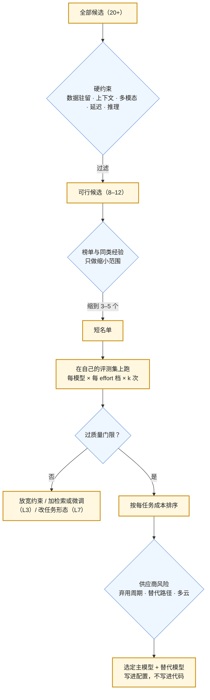

2026 年 9 月，一个应用工程师面对的候选清单大致是：OpenAI 四个在售的主力模型（GPT-6 Astra、GPT-5.6 Sol / Terra / Luna），Anthropic 四个（Fable 5.1、Opus 5、Sonnet 5、Haiku 4.5），Google 三到四个（3.8 Flash、3.1 Pro、3.5 Flash-Lite），DeepSeek 一个（V4.1 Flash，开放权重），加上 Qwen、Llama、gpt-oss 等开源系列与它们在各云上的托管版本。二十几个模型，价格跨三个量级（第四篇），能力在不同任务上排序不同，每个季度换一代。

多数团队的选法是看榜单：Chatbot Arena 第几、某个 benchmark 多少分。本篇的第一个结论是**榜单只能用来缩小候选范围，不能用来做决定**——不是因为榜单不认真，而是它测量的东西与你的任务不同，并且它的排名机制已被证明可以被供应商系统性地影响。第二个结论是**选型是一个用自己的评测集回答的工程问题**：几十条从真实流量里采出来的用例，在候选模型上跑一遍，看质量、成本、延迟三列，答案通常很清楚。第三个结论是**选型要包含供应商风险**：一个模型的价格与能力在它被下线的那天都归零，而 2026 年内四家都下线过模型——OpenAI 分三批关闭二十多个快照，DeepSeek 用四天预告把一个模型的全部流量路由到另一个。

本篇要回答的核心问题是：

> **为什么不能按榜单选模型？[^q0] 自己的评测集要多大、怎么建、怎么用它选？[^q1] 闭源 API 与开源自托管怎么判断，大小模型分流的账怎么算？[^q2] 供应商的弃用周期怎样进入选型决策？[^q3]**

## 一、总览

### 1. 选型是四个问题

| 问题 | 内容 | 本文章节 |
|---|---|---|
| 这个任务值多少钱？ | 每任务可接受的成本上限；由业务价值倒推，不由模型价格正推 | 第五章 |
| 哪些候选能过质量门限？ | 在自己的评测集上跑；榜单只用来定候选范围 | 第二、三章 |
| 哪些硬约束先过滤？ | 数据驻留、上下文长度、多模态、知识截止、延迟 SLO、是否需要推理 | 第四、六章 |
| 供应商风险多大？ | 弃用周期、通知期、快照能否钉住、替代路径、多云可用性 | 第八章 |

四个问题的顺序：先用硬约束过滤（省掉不可能的候选），再用榜单缩到三五个，然后在评测集上跑，最后按每任务成本与供应商风险决定。

图里只有一个环节用到榜单，而且是最不重要的环节。决定在 F 与 I 两步做出。

### 2. 本文的章节安排

第二章讲榜单为什么失真——动态榜单与静态 benchmark 各自的机制；第三章讲自己的评测集怎么建、怎么用；第四章讲闭源 API 与开源自托管的判据；第五章讲大小模型分流；第六章讲推理与否、上下文、多模态、知识截止四个过滤条件；第七章讲 embedding 与 rerank 模型的选法；第八章讲弃用周期与供应商风险；第九章实践建议。

## 二、榜单为什么失真

### 2.1 动态榜单：Chatbot Arena 的审计

Chatbot Arena（LMArena）让用户对两个匿名模型的回答投票，用 Bradley-Terry 模型算分。它一度是"哪个模型最好"的默认答案。2025 年发表于 NeurIPS 的《The Leaderboard Illusion》审计了它的数据，发现三件事：

- **私测与选择性披露**。少数供应商可以在发布前把多个私有变体放进 Arena 测试，只公布分数最好的那个，撤回其余。审计在 2025 年 1–3 月的抓样里识别出 Meta 在 Llama 4 发布前测试了 **27 个私有变体**。论文用模拟与真实实验证明：即使这些变体是同一个 checkpoint，"多测几个、选最好"也能系统性抬高分数——这是统计学里的选择偏差，不需要任何作弊。
- **采样不对称**。闭源模型被抽中对战的次数远高于开源模型，被下架的也少。估计 Google 与 OpenAI 各拿到了全部对战数据的 19.2% 与 20.4%，而 83 个开源模型合计只有 29.7%。
- **数据访问带来的收益**。拿到 Arena 数据的供应商可以针对 Arena 的提问分布调优；论文的保守估计是，少量额外数据就能在 ArenaHard（Arena 分布的测试集）上带来最多 112% 的相对提升。结论：Arena 分数在相当程度上测量的是**对 Arena 分布的过拟合**，而不是通用能力。

这不是说 Arena 无用——它是唯一大规模的人类偏好数据。它说的是：Arena 分数是**供应商在一个特定分布上、经过选择性披露后的偏好得分**，与你的任务（内部知识库问答、工单分类、代码修改）的相关性未知。

### 2.2 静态 benchmark：污染与饱和

MMLU、GSM8K、HumanEval 一类的静态题库有两个结构性问题：

- **污染**。题目在网上，训练数据来自网上。2024 年 Scale AI 用重新编写的 GSM1k 复测 GSM8K，发现部分模型族在新题上的准确率比原题低近十个百分点——它们部分记住了题。之后的做法是用"活"的题库（LiveBench、LiveCodeBench 定期换题）、私有题库（供应商看不到题），或者只信任发布日期晚于模型训练截止的题。
- **饱和**。当前沿模型在一个 benchmark 上都到 90% 以上，它就不再能区分它们；benchmark 于是被更难的替代（MMLU → MMLU-Pro → GPQA Diamond → Humanity's Last Exam），每一代新 benchmark 都有几年寿命。DeepSeek V4.1 Flash 的发布说明里列了 Terminal-Bench 2.1、3.0、4.0 三个版本的分数（90.6、30.0、31.2），同一个 benchmark 的相邻版本分数差三倍，正是饱和后加难的痕迹。

### 2.3 供应商自报的分数不可横比

每家的发布博客都有一张与竞品的对比表。它们不可横比的原因是**条件不同**：effort 档（`max` 与 `high` 差很多，第三篇）、是否允许工具、脚手架（agent 框架）、采样次数（pass@1 还是多次采样取最好）、题库版本。Anthropic 发布 Opus 5 时给的是"性能随 effort 变化"的曲线并注明"在 `max` 档"；OpenAI 强调"每任务成本"而不是分数。读这些表要先读脚注。

### 2.4 聚合指数与使用量

Artificial Analysis 一类的聚合指数把多个 benchmark 合成一个数，缓解了单一题库的问题，但仍是公开题库。OpenRouter 一类聚合网关公布的**按 token 用量的排名**是另一类信号——"显示性偏好"：开发者用钱投票的结果。它反映的是性价比与可用性的综合，不是能力。

### 2.5 榜单的正确用法

用榜单做三件事：**定候选范围**（Arena 前 15 与你预算内的模型的交集）、**发现新模型**（一个新名字进了前十，值得放进评测集跑一次）、**识别明显不合适的**（在与你任务最接近的 benchmark 上垫底的可以先排除）。不用榜单做的事：在两个分数相差 3 分的模型之间做选择——那点差距在你的任务上可能反向。

## 三、自己的评测集

### 3.1 从多小开始

评测集的规模常被高估。选型阶段：**30–50 条**就能把明显不合格的模型筛掉、把明显更好的选出来；**几百条**能看出趋势与回归；上千条是持续运营后自然积累的结果，不是开始的门槛。2026 年的模型在任务内的方差已经不大，几十条上的差距如果稳定（每条跑 3–5 次，第一篇），基本就是真的。

### 3.2 从哪里来

**真实流量**。从日志里采样用户真正问过的问题——不是产品经理想象的问题。覆盖三类：常见的（占流量大头，决定平均质量）、边界的（长输入、多轮、含表格、含图）、失败过的（线上 bad case，最有信息量）。选型之前没有流量的，从内部试用与竞品的公开案例里采；上线后第一件事是换成真实流量。

每条用例三部分：输入（完整的上下文，不只是用户那句话）、期望输出（人工标注，或一组可接受的答案，或一个判定规则）、评分方式。

### 3.3 怎么评分

按可自动化程度排：**精确匹配与规则**（分类标签、抽取字段、数值、代码能否通过测试）优先——确定、便宜、无偏；**LLM-as-judge**（用一个模型按评分标准给另一个模型的输出打分）用于自由文本，但 judge 有位置偏差、长度偏差、自我偏好，要与人工抽检对齐；**人工**用于最终把关与 judge 的校准。L5 系列讲评测方法本身，这里只说选型阶段的原则：能用规则的不用 judge，用 judge 的要抽 20 条人工核对一致率。

### 3.4 怎么用它选

对短名单里的每个模型，在每一档 effort 上跑评测集 $$k$$ 次，得到一张表：

| 模型 · effort | 质量（通过率，均值 ± 方差） | 每任务成本（p50 / p95） | TTFT p50 | 总时长 p95 |
|---|---|---|---|---|
| Sonnet 5 · low | 0.91 ± 0.02 | \$0.004 / \$0.009 | 0.6 s | 3.1 s |
| Sonnet 5 · high | 0.94 ± 0.01 | \$0.021 / \$0.060 | 2.8 s | 9.4 s |
| GPT-5.6 Terra · medium | 0.93 ± 0.02 | \$0.012 / \$0.031 | 1.9 s | 6.0 s |
| Gemini 3.8 Flash · medium | 0.92 ± 0.02 | \$0.005 / \$0.014 | 1.1 s | 4.2 s |
| DeepSeek V4.1 Flash · high（闲时） | 0.90 ± 0.03 | \$0.001 / \$0.004 | 1.5 s | 7.8 s |

（数字是示意，说明表的形状。）读法：先划质量门限（比如 0.92），门限以上的按每任务成本排，再看延迟是否满足 SLO。这张表通常会给出一个榜单给不出的答案——一个 Arena 排名靠后的模型在你的任务上过了门限而且便宜三倍。它也会给出"没有模型过门限"这个答案，那时该做的不是换模型，是加检索（L3）、改 prompt（L2）或改任务形态（L7）。

### 3.5 评测集也会过拟合

用同一组用例既调 prompt 又选模型，几轮之后 prompt 就"记住"了这些用例。留一部分用例只用于最终比较，不用于迭代；定期从新的 bad case 补充。评测集是资产，也要防止它退化——L5 的横切纪律。

## 四、闭源 API 还是开源自托管

### 4.1 2026 年的开源前沿

开放权重的模型在 2026 年不再是"能力差一代的替代品"：DeepSeek V4.1 Flash 以 MIT 许可开放了 552B 参数的 MoE 权重（输入激活 8B、输出激活 16B，1M 上下文），发布说明称其在多项 benchmark 上超过自家的 V4 Pro；Qwen、gpt-oss、Llama 系列各有多个尺寸。所以"闭源 vs 开源"不再主要是能力问题，是**运营**问题。

### 4.2 判据

| 判据 | 倾向自托管 | 倾向 API |
|---|---|---|
| 数据 | 数据不能出域（合规、客户合同）；API 的区域版本（US-only、非 Global 区域）不满足要求 | 无出域限制，或供应商的数据处理协议与 ZDR 已满足要求 |
| 规模 | 稳定的高吞吐（每天数十亿 token 以上）；自托管的每 token 成本已低于 API | 流量小、波动大、不可预测 |
| 控制 | 需要固定权重（第一篇的非确定性硬需求、审计复现）、需要微调、需要特殊解码（结构化输出之外的约束） | 接受供应商的模型更新节奏 |
| 能力 | 开源模型在你的评测集上过门限 | 只有闭源前沿模型过门限 |
| 团队 | 有 Infra 能力（GPU 采购或租用、serving 引擎、监控、容量规划——Infra 地图 08 / 11 的全部内容） | 没有，或不想建 |

规模那一行的账粗略是这样：一张 H100 级 GPU 每小时租金几美元，用 vLLM 一类引擎跑一个 30B 级模型每秒可以服务上千 token，折成每百万 token 不到一美元；但这是**满载**的数字——利用率 20% 时成本翻五倍，而 API 按用量计费没有闲置成本。所以自托管划算的前提是流量稳定且高。中间路线是在云上用托管的开源模型（Bedrock、Vertex、各推理服务商）：模型开放、运营外包、按 token 计费——它把"开源"的控制权部分保留（可以固定版本）而不承担 Infra。

### 4.3 应用工程师要会的是判断

自托管的**实现**属于 Infra 地图（08 推理系统、11 平台）；应用工程师要会的是上面这张表的判断，以及自托管带来的接口差异——vLLM 提供 OpenAI 兼容接口，但结构化输出、缓存、工具调用的支持程度与四家不同，中间层（第二篇）的适配器要多一个。

## 五、大小模型分流

### 5.1 价格比

同一家的大小模型价差在 5–20 倍：GPT-5.6 Luna 与 Sol 是 20 倍（\$0.20 vs \$4），Haiku 4.5 与 Fable 5.1 是 10 倍，Gemini 3.5 Flash-Lite 与 3.1 Pro 是 6.7 倍。而多数应用的请求里有一大半是简单的——问候、分类、抽取、格式化。把简单请求路由到小模型，是成本优化里收益最大、风险可控的一项。

### 5.2 两种形态

**路由**：一个分类器（规则、小模型或专门的 router 模型）在请求进来时判断难度，直接分发。成本 = $$f \cdot c_s + (1-f) \cdot c_l$$，$$f$$ 是走小模型的比例。风险是路由错误：难题被送到小模型，质量下降且不被发现。

**级联**：先用小模型，输出附带置信信号（结构化输出里的 confidence 字段、是否触发拒答出口、judge 打分），不够则升级到大模型。成本 = $$c_s + (1-f) \cdot c_l$$——每个请求都先花一次小模型的钱，但难题不会漏。适合质量优先的场景。

两种都要在评测集上验证两件事：**路由准确率**（简单请求被正确识别的比例）与**分流后的整体质量**（不能比全用大模型掉超过门限）。评测集要能按难度分层，否则"整体 0.93"可能是简单题 0.99、难题 0.70 的平均。

### 5.3 一个数字

假设 70% 的请求可以走小模型，小模型每任务 \$0.002、大模型 \$0.03。全用大模型：\$0.03。路由：$$0.7 \times 0.002 + 0.3 \times 0.03 = 0.0104$$，省 65%。级联：$$0.002 + 0.3 \times 0.03 = 0.011$$，省 63%——级联只比路由贵一点，却不漏难题。这是级联在多数场景下更受欢迎的原因。

## 六、四个过滤条件

### 6.1 推理还是非推理

2026 年"非推理模型"几乎只剩下 effort `none` / `low` 或关闭 thinking 的档位。判断标准不是"任务难不难"，是评测集上 effort 曲线（第三篇）在哪一档饱和。分类、抽取、改写通常 `low` 饱和；多步 agent、代码修改、复杂分析到 `high` 以上还在涨。

### 6.2 上下文长度

标称都是 1M 级了，过滤条件变成两个：**有效长度**（第一篇：在你的资料上做针测）与**加价门限**（第四篇：OpenAI 272K、Gemini 3.1 Pro 200K）。一个经常要处理 300K 输入的任务，Anthropic 的无阶梯定价可能比标称更便宜的模型实际更便宜。

### 6.3 多模态

需要读图、读 PDF、听音频的任务过滤掉纯文本模型；DeepSeek V4.1 Flash 原生支持视觉而 V4 Pro 不支持，是一个反例（小模型有、大模型没有）。图片的 token 成本（第四篇）要算进每任务成本。

### 6.4 知识截止

第一篇第六章：同一家在售模型的截止日可以差一年多（Haiku 4.5 是 2025 年 2 月，Fable 5.1 是 2026 年 6 月）。任务依赖近期知识（新框架的 API、近期事件）且没有检索时，截止日是硬过滤条件；有检索时它不重要。

## 七、embedding 与 rerank

### 7.1 embedding

检索（L3）用的 embedding 模型是另一类选型，同样不能只看榜单：MTEB 是标准榜单，但它的任务分布与你的语料无关，且同样有针对榜单调优的问题。判据：

- **语言与领域**：中文、代码、法律、医学各有专门模型或专门评测；通用榜单第一的模型在中文法律文书上未必好。
- **维度与延迟**：维度越高存储与检索越贵；支持 Matryoshka（截断维度仍可用）的模型让你事后调整。
- **上下文长度**：一个块（chunk）能有多长。
- **版本稳定性**：**换 embedding 模型意味着全量重建索引**——所有文档重新向量化。这是 embedding 选型最大的隐藏成本，选一个供应商承诺长期维护的版本比选榜单第一重要。

评测方法与主模型相同：从真实查询里采几十条，标注相关文档，算 recall@k 与 MRR（L3 第七篇讲检索评测）。

### 7.2 rerank

cross-encoder 重排器对（查询，候选）对打分，比 embedding 的双塔结构精确，但要对每个候选算一次，只用于 top-k 之后的精排。它是 RAG 里性价比最高的一步（L3），选型判据是精排后的 recall 提升与延迟增加；候选有 Cohere、Voyage、BGE、Qwen3-Reranker 一类，同样在自己的查询上评。

## 八、供应商风险与弃用周期

### 8.1 2026 年的下线记录

| 供应商 | 事件 | 通知期 |
|---|---|---|
| OpenAI | 2026-07-23 关闭 `gpt-5-codex`、`gpt-5.1-codex` 系列、`gpt-4o-*-preview` 系列、`o3-deep-research` 等；2026-10-23 关闭 `gpt-3.5-turbo-0125`、`gpt-4-0613`、`gpt-4-turbo`、`gpt-4.1-nano`、`gpt-4o-2024-05-13`、`o1`、`o3-mini`、`o4-mini` 等；2026-12-11 关闭 `gpt-5-2025-08-07`、`gpt-5-mini`、`gpt-5-nano`、`gpt-5-pro`、`o3`、`o3-pro` 快照 | 3–6 个月（4 月 22 日与 6 月 11 日两轮通知） |
| OpenAI | 2026-08-26 关闭 Assistants API | 12 个月（2025-08-26 通知） |
| Anthropic | 模型页写明"Retirement: not sooner than <发布日 + 1 年>"（Fable 5.1 不早于 2027-09-01，Opus 5 不早于 2027-07-24）；Opus 4 / 4.1、Sonnet 4 已退役（Bedrock / Google Cloud 上仍有） | 承诺至少 1 年在售；退役前另发通知 |
| Google | Interactions API 旧 schema 2026-06-08 移除（5 月通知）；模型按 deprecations 页给出的日期退役 | schema 变更约 1 个月；模型通常 1 年 |
| DeepSeek | 2026-09-10 宣布，09-14 起 `deepseek-v4-pro` 全部路由到 V4.1 Flash；`deepseek-v4-flash` 与 `deepseek-v4-flash-vision-exp` 同日退役并"临时路由"到 V4.1 Flash | **4 天** |

OpenAI 在 ChatGPT 侧退役 GPT-4o 时给出的理由是"只有 0.1% 的用户每天仍在选它"——供应商的视角是使用量，你的视角是"我的应用在那 0.1% 里"。

### 8.2 把弃用周期写进选型

| 维度 | 问什么 | 好的答案 |
|---|---|---|
| 通知期 | 从通知到关闭多久？ | ≥ 6 个月；DeepSeek 的 4 天意味着你要有自动化的回归与切换 |
| 快照 | 能否钉住一个不变的快照？别名（`gpt-5.6-sol`、`deepseek-flash`）背后会换 | OpenAI 有日期快照；Anthropic 的模型 id 本身是版本；DeepSeek 只有别名 |
| 替代路径 | 供应商给出的替代模型是否行为兼容？ | OpenAI 的弃用表列出推荐替代；但第三篇讲过替代模型的默认值不同，要重跑评测 |
| 多云 | 同一模型在几个云上有？ | Claude 在 AWS / GCP / Azure 都有；一家云的区域故障不等于模型不可用 |
| 服务端状态 | 用了 Responses / Interactions 的服务端状态吗？ | 用了就多一层锁定；中间层保留自己的历史副本 |

### 8.3 变更管理的最小流程

1. **订阅**四家的弃用 / 变更通知（邮件、RSS、changelog）。
2. **模型名进配置**，每个用途配一个主模型与一个替代模型，替代模型定期（每月）在评测集上跑一次保持"热"。
3. **收到通知当天**在替代模型上跑全量评测集，比较三列，决定是否需要调 prompt 或 effort。
4. **切换用灰度**（L6）：1% → 10% → 100%，每一步看在线指标。
5. **关闭日之前一周**完成切换，不要等到当天。

## 九、实践建议

1. **今天就建评测集**：从日志采 50 条（或从试用记录、竞品案例），标注期望，写一个跑分脚本。这是本系列最有长期价值的一个动作。
2. **短名单跑一次全表**：3–5 个模型 × 2–3 档 effort × 3 次，得到第三章的表。多数团队第一次做会推翻自己原来的选择。
3. **算一次分流的账**：看评测集里多大比例是"简单"用例，用第五章的公式估收益；先做级联。
4. **过滤条件写成清单**：数据驻留、有效上下文、多模态、知识截止、延迟 SLO，新模型出来先过清单再进评测。
5. **模型名与替代模型进配置**，订阅通知，替代模型每月热身。
6. **embedding 模型选版本稳定的**，并把"换模型 = 重建索引"的成本写进文档。

## 十、本文小结

- 榜单失真有机制：Arena 的私测与选择性披露（Llama 4 前 27 个变体）、采样不对称（两家各约 20% 的数据 vs 83 个开源模型共 29.7%）、对 Arena 分布的过拟合；静态 benchmark 有污染与饱和；供应商自报分数条件不一。榜单只用来缩小候选范围。
- 选型用自己的评测集：30–50 条从真实流量采样的用例就能开始，每个模型 × effort 档跑多次，看质量 / 每任务成本 / 延迟三列，划门限后按成本排。
- 闭源 vs 开源自托管在 2026 年是运营问题不是能力问题：数据出域、规模（自托管只在高且稳定的流量下划算）、控制需求、团队 Infra 能力四个判据；中间路线是云上托管的开源模型。
- 大小模型分流价差 5–20 倍；级联（先小后大）只比路由贵一点却不漏难题；要按难度分层验证。
- 四个过滤条件：effort 曲线饱和档、有效上下文与加价门限、多模态、知识截止。
- embedding 选型最大的隐藏成本是换模型要重建索引；rerank 在自己的查询上评。
- 弃用周期是选型维度：OpenAI 3–6 个月通知分三批关闭二十多个快照，Anthropic 承诺至少一年，DeepSeek 4 天。模型名进配置、替代模型每月热身、收到通知当天跑评测、灰度切换。

## 十一、自测

1. 《The Leaderboard Illusion》发现即使多个私有变体是**同一个 checkpoint**，"多测几个、公布最好的"也能抬高 Arena 分数。为什么？这对你读任何榜单有什么含义？

   

   
答案

   Arena 分数是有噪声的估计（对战抽样、投票者差异）；同一模型测 $$n$$ 次得到 $$n$$ 个带噪声的分数，取最大值是有偏的——这是选择偏差，$$n$$ 越大偏差越大，不需要作弊。含义：任何允许提交者选择性披露的榜单，头部分数都系统性偏高；分差在噪声量级内的排名不可信；只用榜单缩范围。详见[第二章](#二榜单为什么失真)。
   

2. 你的评测集 40 条，模型 A 通过率 0.90、模型 B 0.85，各只跑了一次。能得出 A 更好的结论吗？该怎么做？

   

   
答案

   不能。40 条上 2 条的差距（0.05）完全可能来自第一篇的非确定性。每条跑 3–5 次得到通过率的均值与方差，看差距是否稳定超过方差；同时看每任务成本与延迟两列——如果 B 便宜三倍且差距不稳定，答案可能是 B。详见[第三章](#三自己的评测集)。
   

3. 一个应用每天 2 亿 token，流量白天高、夜间接近零。团队算出自托管满载时每百万 token \$0.8，API 是 \$2。该自托管吗？

   

   
答案

   不一定。\$0.8 是满载数字；流量白天高夜间为零意味着平均利用率可能只有 30–40%，每 token 成本变成 \$2–2.7，与 API 持平或更贵，且要承担 Infra 团队与容量规划成本。除非有数据出域或固定权重的硬需求，否则 API 或云上托管的开源模型更合适；或者只把可预测的白天基线自托管、峰值走 API。详见[第四章](#四闭源-api-还是开源自托管)。
   

4. 小模型每任务 \$0.003、大模型 \$0.04，评测显示 60% 的请求小模型能做对。路由与级联各省多少？如果路由器有 10% 的错误率（把难题判为简单），会发生什么？

   

   
答案

   全大模型 \$0.04。路由：$$0.6 \times 0.003 + 0.4 \times 0.04 = 0.0178$$，省 55.5%。级联：$$0.003 + 0.4 \times 0.04 = 0.019$$，省 52.5%。路由器 10% 错误：约 4% 的总请求（难题的 10%）被小模型处理而质量下降且不被发现；级联没有这个问题（难题在小模型上会触发升级），代价只是每请求多 \$0.003。详见[第五章](#五大小模型分流)。
   

5. 2026 年 9 月 10 日，一个在 `deepseek-v4-pro` 上调好 prompt 的应用收到 DeepSeek 的公告。按第八章的流程，它在 9 月 14 日之前该做完哪几件事？如果它只有别名没有快照，什么风险无法消除？

   

   
答案

   四天内：在 V4.1 Flash 上跑全量评测集（含 effort 各档，V4.1 的 `low` / `high` / `max` 与 V4 Pro 的行为不同），比较质量 / 成本 / 延迟；必要时调 prompt 或 effort；把配置里的模型名与替代模型更新；灰度切换。无法消除的风险：DeepSeek 只有别名，`deepseek-flash` 背后的权重未来还会换，且通知期可能仍是几天——只能靠自动化的回归评测与替代模型（如另一家的同价位模型）保持热备。详见[第八章](#八供应商风险与弃用周期)。
   

## 下一篇

[客户端工程：重试、超时、幂等、限流与流式解析](/llm-client-engineering-retries-timeouts-streaming-and-rate-limits.html)

[^q0]: 因为榜单测的不是你的任务，且排名机制可被影响。《The Leaderboard Illusion》（NeurIPS 2025）审计 Chatbot Arena：少数供应商可以私测多个变体只公布最好的（Meta 在 Llama 4 前测了 27 个），这是选择偏差，同一 checkpoint 多测也能抬分；闭源模型拿到的对战数据远多于开源（Google、OpenAI 各约 19–20%，83 个开源模型共 29.7%），少量 Arena 数据就能在 ArenaHard 上带来最多 112% 的相对提升——分数部分测的是对 Arena 分布的过拟合。静态 benchmark 有污染（GSM1k 复测部分模型掉近十个点）与饱和（Terminal-Bench 2.1 → 4.0 分数从 90 掉到 31）；供应商自报分数的 effort、工具、脚手架、采样次数不一。榜单只用来缩小候选范围。详见[第二章](#二榜单为什么失真)。

[^q1]: 30–50 条就能选型，几百条看趋势；从真实流量采样，覆盖常见、边界、失败过的三类；每条含完整输入、期望输出、评分方式；评分优先规则与精确匹配，自由文本用 LLM-as-judge 并抽 20 条人工核对。用法：对短名单每个模型 × 每档 effort 跑 $$k$$ 次（3–5），得到质量（均值 ± 方差）/ 每任务成本（p50 / p95）/ TTFT / 总时长的表，划质量门限后按成本排、再看延迟 SLO；"没有模型过门限"时该加检索或改任务形态而不是换模型。留一部分用例不参与迭代防过拟合，定期从 bad case 补充。详见[第三章](#三自己的评测集)。

[^q2]: 闭源 vs 自托管在 2026 年是运营问题（DeepSeek V4.1 Flash 以 MIT 开放 552B 权重）：判据是数据能否出域、流量是否高且稳定（自托管的低价是满载数字，利用率 20% 时翻五倍）、是否需要固定权重 / 微调 / 特殊解码、团队有没有 Infra 能力；中间路线是云上托管的开源模型。大小分流：同家大小模型价差 5–20 倍（Luna / Sol 20×，Haiku / Fable 10×）；路由成本 $$f c_s + (1-f) c_l$$，级联 $$c_s + (1-f) c_l$$——70% 简单请求、\$0.002 / \$0.03 时路由省 65%、级联省 63%，级联不漏难题；要按难度分层验证整体质量与路由准确率。详见[第四章](#四闭源-api-还是开源自托管)、[第五章](#五大小模型分流)。

[^q3]: 作为一个维度进入短名单的比较：通知期（OpenAI 2026 年两轮通知、3–6 个月、分 7 月 / 10 月 / 12 月三批关闭二十多个快照；Assistants API 12 个月；Anthropic 承诺每个模型发布后至少一年在售；DeepSeek 4 天把 V4-Pro 全部流量路由到 V4.1 Flash）、能否钉住快照（OpenAI 有日期快照，DeepSeek 只有别名）、替代路径是否行为兼容（要重跑评测——默认值不同）、多云可用性、是否用了服务端状态。流程：订阅通知；模型名与替代模型进配置，替代模型每月在评测集上热身；收到通知当天跑全量评测；灰度切换；关闭日前一周完成。详见[第八章](#八供应商风险与弃用周期)。
