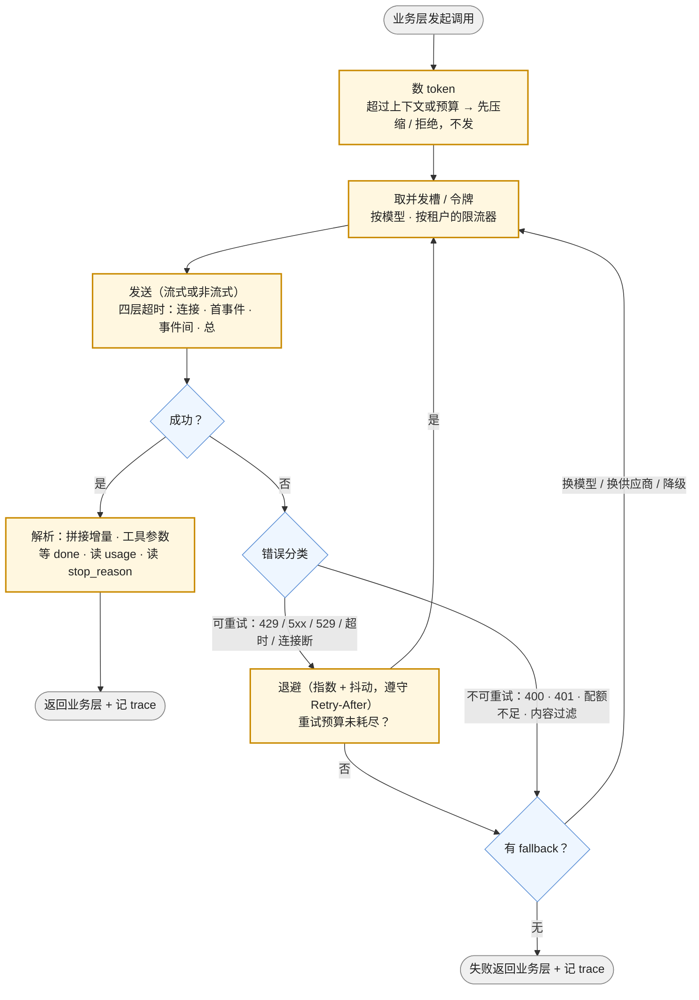

前五篇讲的是组件本身：它怎么坏、接口是什么、花多少钱、怎么选。这一篇讲你这一侧——调用它的客户端。调用模型 API 与调用任何不稳定的第三方服务有大半是相同的：会超时、会 429、会 5xx，要重试、要退避、要熔断。不同的是失败的种类更多——上下文超限、内容过滤、工具调用格式错、推理超预算、流式中途断开——而且**每一次重试都要再花一次钱**，一次重试可能是几美分也可能是几美元（一个 300K 输入的请求）。

后端工程师写过的每一个 HTTP 客户端的经验在这里都有效，但要加三条模型 API 特有的纪律：**发请求之前数 token**（超限的 400 是可以避免的失败）；**流式响应的失败只能重发不能续传**（并接受已生成 token 的费用）；**重试策略要区分"再试一次可能成功"与"再试一次只是再花一次钱"**（幻觉不会因为重试消失，格式错误可能会）。

本篇要回答的核心问题是：

> **模型 API 的错误有哪几类，哪些该重试、哪些不该？[^q0] 超时为什么要分四层，流式中断怎么处理？[^q1] 限流的维度与使用层级对容量规划意味着什么？[^q2] 为什么要在发请求前数 token，token 计数会怎样变？[^q3]**

## 一、总览

### 1. 一次调用在客户端经过的检查点

图里每个方框对应本文一章。多数 SDK 替你做了"发送"与部分"重试"（默认重试 2 次）；数 token、限流、错误分类的细节、fallback、trace 都是你的。

### 2. 本文的章节安排

第二章给错误分类表；第三章讲重试与退避；第四章讲四层超时与流式中断；第五章讲幂等与副作用；第六章讲限流的维度、使用层级与容量规划；第七章讲流式解析的工程细节；第八章讲 token 计数；第九章讲降级与 fallback；第十章实践建议。

## 二、错误分类

### 1. 一张表

| 类别 | 信号 | 含义 | 重试？ | 该做什么 |
|---|---|---|---|---|
| 限流 | HTTP 429；OpenAI `rate_limit_exceeded`；Anthropic `rate_limit_error`；`Retry-After` 头 | 超过 RPM / TPM | **是**，遵守 `Retry-After`，退避 | 检查限流器配置；长期看容量（第六章） |
| 配额 / 余额 | 429 但 `insufficient_quota`（OpenAI）；402 / 余额不足 | 钱用完了 | **否** | 告警；这是账务不是流控 |
| 过载 | Anthropic 529 `overloaded_error`；OpenAI 503 / 500 `server_error`；Gemini 503 | 供应商侧容量 | **是**，退避更长 | 看状态页；触发 fallback 到另一模型 / 供应商 |
| 网络 | 连接超时、连接重置、DNS | 到达前失败 | **是** | 幂等无忧（请求没到） |
| 读超时 | 首事件 / 事件间 / 总超时 | 请求到了，可能已在生成 | **是**（但已生成的 token 可能计费） | 缩短输入、调低 effort、改流式 |
| 请求非法 | 400 `invalid_request_error`：参数错、消息结构错（工具结果缺配对）、thinking block 校验失败 | 你的 bug 或契约变更 | **否** | 修代码；第二、三篇的清单 |
| 上下文超限 | 400，OpenAI `context_length_exceeded`；Anthropic "prompt is too long" | 输入 + `max_tokens` 超过窗口 | **否**（重发同样超） | 发前数 token（第八章）；压缩历史 |
| 输出截断 | 200 但 `stop_reason` / `finish_reason` = `max_tokens` / `length` | 回答不完整 | 视情况：提高 `max_tokens` 或调低 effort 后重试 | 监控比例 |
| 内容过滤 / 拒答 | Anthropic `stop_reason: refusal`；OpenAI `finish_reason: content_filter`（Azure 更常见）；Gemini `finishReason: SAFETY` | 模型或供应商侧拒绝 | **否**（同样的输入同样拒） | 按产品逻辑处理；记录；不要静默重试绕过 |
| 工具调用格式错 | 200 但 `arguments` 不是合法 JSON、参数不符 schema、调用了不存在的工具 | 模型输出错误 | **可**，一次：把错误作为 tool result 送回让模型改 | 开 strict 工具 schema |
| 结构化输出校验失败 | 200 但业务校验不过 | 语义错误 | **可**，一次，带错误信息 | 第二篇第四章 |
| 认证 / 权限 | 401 / 403 | key 错、无权用该模型 | **否** | 配置问题 |
| 模型不存在 | 404 `model_not_found` | 模型名错或已下线 | **否** | 第五篇的弃用流程；fallback |

三个原则。**只重试"再试可能不同"的错误**：限流、过载、网络、超时——它们的原因在外部且会变；400 类的原因在你的请求里，重发只是再花一次钱（超限的 400 不计费，但 200 的截断与格式错是计费的）。**内容过滤不要用重试绕**：它是供应商的政策，反复重试会触发更严的限制，且在合规上说不清。**200 也可能是失败**：截断、格式错、拒答都是 200，错误分类要读响应体，不只读状态码。

### 2. 请求 id

每次响应都带请求 id（OpenAI `x-request-id`，Anthropic `request-id`）。把它记进 trace——向供应商报问题时这是唯一的凭据，也是核对账单争议的依据。

## 三、重试与退避

### 1. 指数退避加抖动

第 $$n$$ 次重试前等待：

$$
t_n = \min\left(t_{\max},\ \text{random}\left(0,\ t_0 \cdot 2^{n}\right)\right)
$$

"full jitter"——在 0 到指数上限之间均匀取随机值。为什么要抖动：一次 429 或 529 通常是**很多客户端同时**撞上限流或过载，无抖动的退避让它们在同一时刻重试，形成第二波。$$t_0$$ 取 0.5–1 s，$$t_{\max}$$ 取 30–60 s，重试次数 3–5。

**`Retry-After` 优先**：供应商在 429 里给了等待秒数就用它，不要自己算——它知道你的窗口何时重置。Anthropic 与 OpenAI 的 429 都带。

### 2. 重试预算

单个请求的重试次数上限是必要的，但不够：一个过载事件里，如果每个请求都重试 5 次，供应商收到的流量是平时的 5 倍，过载更久。用**重试预算**——单位时间内重试次数不超过总请求的某个比例（比如 10%）——超过预算就直接失败或走 fallback。这是 SRE 的老做法，在按 token 计费的场景里多了一个理由：重试预算也是钱的预算。

### 3. 重试的层次

- **请求级**：同一请求体重发。适用于限流、过载、网络。
- **修正级**：改一下再发——工具调用格式错时把错误信息作为结果送回、结构化输出校验失败时附上错误让模型重试一次、截断时提高 `max_tokens`。这是模型 API 特有的重试形态，每次都是一次新的付费调用，限一次。
- **任务级**：整个 agent 任务失败后从头或从 checkpoint 重来。属于 L4 运行时；客户端不做。

SDK 的默认重试（OpenAI 与 Anthropic 的官方 SDK 默认 2 次，指数退避）只覆盖请求级、只针对 429 / 5xx / 连接错误。修正级要自己写。

### 4. 流式中的重试

流式请求在**收到第一个事件之前**失败，与非流式一样重试。在**生成中途**断开——供应商已经生成了一部分并会为此计费——重试意味着从头再生成一遍，双倍成本。策略：中途断开只对短回答自动重试；长回答（agent 的长输出、大段代码）要么在 UI 上提示用户重试，要么接受部分结果。没有"从第 137 个 token 续上"的机制。

## 四、超时

### 1. 四层

| 层 | 含义 | 典型值 | 超过意味着 |
|---|---|---|---|
| 连接 | TCP / TLS 建立 | 5–10 s | 网络或供应商入口问题；可重试 |
| 首事件（TTFT） | 从发送到第一个字节 / 第一个 SSE 事件 | 按输入长度与 effort：短请求 10–30 s，长 prefill 或 `xhigh` 思考 60–120 s | 排队、长 prefill、长思考；第四篇的三段排查 |
| 事件间 | 两个 SSE 事件之间 | 15–30 s | 生成卡住或连接半死 |
| 总 | 整个请求 | 按预期输出长度：$$\text{TTFT} + n_{\text{out}} \times \text{TPOT}$$ 再乘 2–3 | 兜底 |

只设一个总超时的客户端有两个毛病：设短了会误杀正常的长回答（800 token 在 30 ms/token 下要 24 秒），设长了对一个卡死的连接要等很久才发现。四层各管一段。

### 2. SDK 的默认值

官方 SDK 的默认总超时通常是 10 分钟。Anthropic 的 SDK 对非流式请求有一个额外的规则：如果按 `max_tokens` 估算生成时间可能超过 10 分钟，它会**拒绝以非流式发送**，要求改用流式——因为长连接空等 10 分钟在网络上不可靠。这条规则说明了一件事：**超过一分钟的生成应该流式**，不是为了 UI，是为了连接的健康。

### 3. 更长的任务

深度研究、长文档处理、几十步的 agent 任务，几分钟到几小时。它们不该占着一个 HTTP 连接：OpenAI 的 Responses 有 `background: true`（提交后轮询或 webhook 通知），Anthropic 与 Gemini 有 Batch，Agents API 一类的托管运行时把任务变成异步 job。客户端的对应设计是"提交 → 轮询 / 回调"，超时策略变成 job 级的 SLA。L4 讲运行时，这里只说：**HTTP 请求的超时不该超过几分钟，更长的任务换形态**。

## 五、幂等与副作用

### 1. 模型调用本身

一次纯生成调用的重复执行没有业务副作用——只有两个后果：**再花一次钱**，以及在服务端状态开启时（Responses 默认 `store: true`）**多存一条**。所以模型调用的"幂等"主要是成本问题，而不是正确性问题；四家的生成接口都没有通用的幂等键（Batch 接口有 `custom_id` 用于配对）。控制手段是重试预算与"中途断开只重试短回答"。

### 2. 工具的副作用

真正的幂等问题在**工具**上。agent 循环里模型返回 `tool_call: create_order(...)`，你执行了，然后送回结果的那次请求超时了——你重试，模型没收到结果又返回同一个 `tool_call`，你再执行，订单重复。防止的办法与任何分布式系统相同：

- 工具本身幂等（用 `tool_call_id` 或业务键做幂等键，第二次调用返回第一次的结果）；
- 在应用侧记录"哪些 `tool_call_id` 已执行"，重复的直接返回缓存结果而不再执行；
- 有副作用且不幂等的工具（发邮件、付款）走确认门（L4）。

这是第一篇"越界"一条的客户端版本：重试是无害的，直到它触发了一个不幂等的动作。

### 3. 服务端状态下的重复

用 `previous_response_id` 链式调用时，一次超时后重试会在服务端产生两条分叉的响应。要么用返回的 id 去重（以第一条成功的为准），要么把状态放在客户端（第二篇第六章）。

## 六、限流与容量

### 1. 维度

限流至少两个维度：**每分钟请求数**（RPM）与**每分钟 token 数**（TPM）；Anthropic 进一步分输入 TPM 与输出 TPM。每一维都可能先触顶：一个每请求 50K token 的应用，RPM 远没用完 TPM 就满了；一个高频短请求的应用反过来。响应头告诉你剩余：OpenAI 的 `x-ratelimit-limit-requests` / `x-ratelimit-remaining-requests` / `x-ratelimit-reset-requests` 与对应的 `-tokens` 三个；Anthropic 的 `anthropic-ratelimit-requests-*`、`anthropic-ratelimit-input-tokens-*`、`anthropic-ratelimit-output-tokens-*`。DeepSeek 不限 RPM / TPM，限**并发**（V4.1 Flash 2,500、V4-Pro 500），超过时请求排队或返回忙。

### 2. 使用层级

额度按账户的历史消费分层：OpenAI 的 Tier 1–5，Anthropic 在 Sonnet 5 发布时把层级简化为 Start / Build / Scale 三级。新账户的额度低，一个上线即有流量的产品会在第一天撞墙。容量规划要提前：估算峰值 TPM（峰值 QPS × 每请求平均 token，输入输出分开算），对照当前层级，提前升级或申请提额；多供应商分摊（L6 网关）也是一种扩容。

### 3. 客户端限流器

不要等供应商 429 再退避——那已经浪费了一次往返，而且多个实例同时撞限会放大。在客户端放一个**按模型的令牌桶**（容量 = 你的 TPM 额度打九折，按 token 而不只按请求扣），请求前扣 token（用第八章的计数），响应后按 usage 校正。多租户的应用再加一层**按租户的公平队列**，防止一个租户吃光额度。这是 L6 网关的核心功能之一，在没有网关的时候客户端要自己做。

### 4. 从限流头调整

限流头是动态信息：接近 `remaining = 0` 时主动降速，`reset` 告诉你何时恢复。一个好的客户端把这两个数喂给自己的令牌桶。

## 七、流式解析的工程

第二篇第五章讲了事件模型；这里是实现层的坑：

- **SSE 的行协议**。事件以 `data:` 行开头、空行分隔；有的供应商发注释行（`: keep-alive`）或空事件作为心跳——DeepSeek 在排队时会发空行保持连接。解析器要忽略它们而不是报错，事件间超时的计时器要在收到心跳时重置。
- **增量拼接**。文本增量直接追加；工具调用参数按 `index` / `id` 分桶拼接字符串，等该调用的 `done` 事件（或 Anthropic 的 `content_block_stop`）再解析 JSON。并行工具调用的增量会交错到达。
- **`usage` 在末尾**。预算控制与成本记账在结束事件里做；流式过程中的"已用 token"只能估算。
- **客户端断开**。用户关了页面，你的服务器与供应商之间的流还在——**供应商继续生成并计费**直到你主动关闭连接。前端断开要传播到后端并取消上游请求。
- **背压**。模型每秒几十个 token，UI 每个 token 重绘一次会卡；按时间（每 50–100 ms）或按块合并后再推给前端。
- **中断后的状态**。中断时已收到的增量可以展示为部分结果并标注"已中断"，但不要把它当作完整回答存入历史——下一轮模型会以为自己说完了。

## 八、token 计数

### 1. 为什么在发之前数

上下文超限的 400 是**唯一一类可以在发送前完全避免**的失败：窗口大小已知、`max_tokens` 已知、输入长度可以算。发送前算：$$n_{\text{in}} + \text{max\_tokens} \le \text{窗口}$$，不满足就先压缩历史（L2）或拒绝。此外，第六章的令牌桶要按 token 扣、第四篇的成本预估要 token 数——都要在发送前知道。

### 2. 怎么数

| 供应商 | 本地 | 远程 |
|---|---|---|
| OpenAI | `tiktoken`（按模型选编码） | — |
| Anthropic | 无官方本地 tokenizer | `count_tokens` 端点（免费，接受完整请求体含 tools 与 system） |
| Google | — | `countTokens` |
| DeepSeek | 官方提供离线 tokenizer 包 | — |

本地计数快但要跟模型的 tokenizer 版本；远程计数准但多一次往返（Anthropic 的端点接受与真实请求相同的结构，所以工具定义、system、图片都算进去了）。折中做法：本地估算用于限流与预算（允许 5–10% 误差），远程精确计数只在接近窗口上限时做。

### 3. 计数会变

**Claude Sonnet 5 换了 tokenizer，同样的文本比 Sonnet 4.6 多产出约 30% 的 token**（Anthropic 的发布说明原话，"具体增幅取决于内容与负载形态"）。含义：（1）账单上涨 30%，即使价格不变；（2）原来按 4.6 算好的"历史保留 N 轮"在 5 上会超窗口；（3）基于字符数的粗估（"1 token ≈ 4 字符"）失效。换模型时 token 计数要重新校准。

另外，**中文比英文贵**：多数 tokenizer 下一个汉字 1–2 个 token，英文约 0.75 个 token 一个词；同样信息量的中文 prompt 比英文长 30–50%。这是中文应用做成本估算时的一个常数。

## 九、降级与 fallback

### 1. 熔断

对一个模型 / 供应商的错误率或超时率在滑动窗口内超过阈值（比如 30 秒内 20%），熔断器打开：后续请求不再发给它，直接走 fallback；隔一段时间放一个探测请求，成功则半开、逐步恢复。这防止了过载事件里你的重试雪崩到已经不健康的端点。

### 2. fallback 的层次

| 层 | 做法 | 代价 |
|---|---|---|
| 同模型换区域 / 云 | Claude 在 Anthropic API、Bedrock、Vertex、Foundry 都有 | 最小；价格略有差别（第四篇的区域加价） |
| 同供应商换模型 | Fable 5.1 → Opus 5；Sol → Terra | 质量可能下降；推理状态的方向性（第三篇：新模型的 thinking block 旧模型读不了） |
| 换供应商 | Sonnet 5 → GPT-5.6 Terra | 中间层的消息归一化要成熟（第二篇）；历史里的 thinking 块要剥掉；prompt 可能要调 |
| 降级到非模型 | 规则、缓存的答案、"稍后再试" | 功能降级，但服务不挂 |

fallback 的选择要**提前在评测集上验证**（第五篇：替代模型每月热身），不能在故障当天第一次试。

### 3. 对用户说什么

降级发生时告诉用户（"当前使用备用模型，回答可能略有差异"）比静默好——L7 讲不确定性的呈现。静默降级的问题是用户把质量下降归因于产品本身。

## 十、实践建议

一份客户端检查清单，按本文顺序：

1. **错误分类器**：按第二章的表把响应映射到"可重试 / 修正后重试一次 / 不可重试 / 需人工"，读响应体不只读状态码；记请求 id。
2. **重试**：指数退避 + full jitter，遵守 `Retry-After`，单请求 3–5 次，全局重试预算 10%；修正级重试限一次。
3. **超时四层**：连接 5–10 s、首事件按输入与 effort、事件间 15–30 s、总按预期输出；超过一分钟的生成一律流式；更长的任务换后台形态。
4. **工具幂等**：按 `tool_call_id` 去重，不幂等的工具走确认门。
5. **限流器**：按模型的令牌桶按 token 扣，多租户加公平队列，用限流头校正；提前估峰值 TPM 对照层级。
6. **流式解析**：忽略心跳、按 id 分桶拼工具参数、等 done 再解析、前端断开传播到上游、合并增量减少重绘。
7. **发前数 token**：本地估算 + 接近上限时远程精确计数；换模型重新校准；中文按 1–2 token / 字估。
8. **熔断与 fallback**：错误率阈值熔断，fallback 链提前在评测集上验证，降级时告知用户。

## 十一、本文小结

- 错误分四类：可重试（429、5xx、529、网络、超时）、修正后重试一次（工具格式错、结构化输出校验失败、截断）、不可重试（400、401、配额不足、内容过滤、模型不存在）、需人工。200 也可能是失败——读 `stop_reason`。
- 重试用指数退避 + full jitter，`Retry-After` 优先，加全局重试预算；每次重试都是一次付费调用，流式中途断开只能重发。
- 超时分连接 / 首事件 / 事件间 / 总四层；超过一分钟的生成用流式（Anthropic SDK 会强制），更长的任务用后台或批处理形态。
- 模型调用本身的重复只多花钱；幂等问题在工具上——按 `tool_call_id` 去重，不幂等的走确认门。
- 限流按 RPM 与 TPM（Anthropic 分输入 / 输出 TPM，DeepSeek 限并发），额度按层级（OpenAI Tier 1–5，Anthropic Start / Build / Scale）；客户端放令牌桶按 token 扣，用限流头校正，提前规划容量。
- 流式解析要忽略心跳、分桶拼接工具参数、等 done 再解析、传播客户端断开（否则供应商继续计费）、合并增量。
- 发前数 token 能完全避免超限的 400；计数会随模型变（Sonnet 5 多 30%），中文比英文贵 30–50%。
- 熔断 + 分层 fallback（换区域 → 换模型 → 换供应商 → 降级到非模型），fallback 链提前验证，降级时告知用户。

## 十二、自测

1. 一个请求返回 HTTP 200，`stop_reason` 是 `max_tokens`，输出的 JSON 不完整。该重试吗？怎么重试？与 `stop_reason: refusal` 的处理有何不同？

   

   
答案

   这是"修正后重试一次"：提高 `max_tokens`（推理模型上它含思考 token，第三篇）或调低 effort 后重发一次；原样重发大概率同样截断。`refusal` 是不可重试的：模型 / 供应商按政策拒绝，同样输入同样拒，反复重试可能触发更严的限制，应按产品逻辑处理并记录。两者都是 200，错误分类必须读响应体。详见[第二章](#二错误分类)。
   

2. 供应商过载，1,000 个客户端实例同时收到 529。对比"固定 2 秒后重试"、"指数退避无抖动"、"指数退避 + full jitter"三种策略在接下来 10 秒内对供应商的流量形状。

   

   
答案

   固定 2 秒：1,000 个请求在第 2 秒同时到达，第二波过载，之后每 2 秒一波。指数退避无抖动：第 1、2、4、8 秒各一波，波峰仍是 1,000。full jitter：第一次重试均匀散在 0–1 s，第二次散在 0–2 s，第三次 0–4 s……流量被摊平，峰值降到原来的几分之一，供应商更快恢复。再加全局重试预算（重试不超过总量 10%）可进一步限制总流量。详见[第三章](#三重试与退避)。
   

3. agent 循环里模型返回 `tool_call: send_invoice(order=123)`，你执行成功，但送回结果的请求超时。SDK 自动重试了那次请求。可能发生什么？怎么防？

   

   
答案

   重试的请求带的是同样的历史（含工具结果），通常没问题；但如果超时发生在你**尚未**送回结果、模型再次返回同一个 `tool_call` 时，你会再执行一次，发票重复发送。防：工具按 `tool_call_id` 或业务键幂等（第二次返回第一次的结果）；应用侧记录已执行的 `tool_call_id`；发票、付款这类不幂等且对外的动作走确认门。模型调用本身重复只多花钱，副作用在工具上。详见[第五章](#五幂等与副作用)。
   

4. 一个应用峰值 20 QPS，每请求平均输入 6,000 token、输出 800 token。它需要多少输入 TPM 与输出 TPM？如果账户当前层级的 TPM 是 400K，会怎样？

   

   
答案

   输入 TPM = 20 × 60 × 6,000 = 7,200,000；输出 TPM = 20 × 60 × 800 = 960,000。400K 的 TPM 只够峰值的 5.5%（输入），上线即大面积 429。要提前升级层级 / 申请提额、用 prompt caching（部分供应商对缓存命中的 token 不计入或减计 TPM，需查文档）、或多供应商分摊；客户端令牌桶应按 400K × 0.9 扣，超出的请求排队而不是打出去挨 429。详见[第六章](#六限流与容量)。
   

5. 从 Claude Sonnet 4.6 迁到 Sonnet 5 后，一个"保留最近 30 轮历史"的对话应用开始偶发上下文超限的 400，而窗口大小没变。原因是什么？该怎么改？

   

   
答案

   Sonnet 5 的新 tokenizer 对同样文本多产出约 30% 的 token，30 轮历史在 4.6 上够放、在 5 上超了；且 Sonnet 5 默认开启 thinking，`max_tokens` 通常也被调高，占用了更多窗口。改法：不按轮数而按 token 数保留历史，发送前用 `count_tokens` 端点（或校准过的本地估算）检查 $$n_{\text{in}} + \text{max\_tokens} \le \text{窗口}$$，超过则压缩；换模型时重新校准计数。详见[第八章](#八token-计数)。
   

## 下一篇

[系列总结与通关自测](/model-as-component-series-recap-and-self-test.html)

[^q0]: 四类。可重试（原因在外部且会变）：429 限流（遵守 `Retry-After`）、5xx / Anthropic 529 过载、网络错误、读超时。修正后重试一次（每次都是新的付费调用）：工具调用参数不是合法 JSON 或不符 schema（把错误作为 tool result 送回）、结构化输出业务校验失败（附错误信息）、`stop_reason: max_tokens` 截断（提高 `max_tokens` 或调低 effort）。不可重试（原因在你的请求或供应商政策里）：400 参数 / 结构错、上下文超限、401 / 403、`insufficient_quota`、内容过滤 / `refusal`、404 模型不存在。需人工：配额与账务。注意 200 也可能是失败，要读响应体的 `stop_reason` / `finish_reason`。详见[第二章](#二错误分类)。

[^q1]: 单一总超时设短会误杀正常的长回答（800 token × 30 ms = 24 s），设长则对卡死的连接要等很久。四层各管一段：连接（5–10 s，网络）、首事件（按输入长度与 effort，10–120 s，排队 / prefill / 思考）、事件间（15–30 s，生成卡住；收到心跳要重置）、总（TTFT + 输出 × TPOT 的 2–3 倍）。超过一分钟的生成一律流式（Anthropic SDK 对可能超 10 分钟的非流式请求会拒绝），更长的任务换后台 / Batch 形态。流式中断：首事件前失败按普通重试；中途断开没有续传机制，只能重发且已生成的 token 已计费——短回答自动重试、长回答提示用户；已收到的部分可展示但不能当完整回答存入历史；客户端断开要传播到上游否则供应商继续生成计费。详见[第三章](#三重试与退避)、[第四章](#四超时)、[第七章](#七流式解析的工程)。

[^q2]: 维度：RPM 与 TPM（Anthropic 分输入 / 输出 TPM；DeepSeek 不限速率限并发 2,500 / 500），每一维都可能先触顶——长输入应用先满 TPM，高频短请求先满 RPM。响应头给出限额 / 剩余 / 重置（OpenAI `x-ratelimit-*`，Anthropic `anthropic-ratelimit-*`）。额度按账户历史消费分层（OpenAI Tier 1–5，Anthropic Start / Build / Scale），新账户额度低。容量规划：峰值 QPS × 每请求 token 分别算输入 / 输出 TPM，对照层级提前升级或多供应商分摊；客户端放按模型的令牌桶按 token 扣（额度打九折）、多租户加公平队列、用限流头动态校正，而不是等 429 再退避。详见[第六章](#六限流与容量)。

[^q3]: 上下文超限的 400 是唯一可以在发送前完全避免的失败：窗口、`max_tokens`、输入长度都已知，发前检查 $$n_{\text{in}} + \text{max\_tokens} \le \text{窗口}$$，超了先压缩；限流器按 token 扣与成本预估也需要发前的计数。工具：OpenAI 本地 `tiktoken`，Anthropic 远程 `count_tokens`（免费，接受完整请求体），Google `countTokens`，DeepSeek 离线 tokenizer；本地估算用于限流，接近上限时远程精确计数。计数会变：Claude Sonnet 5 的新 tokenizer 让同样文本多约 30% token——账单涨、按轮数保留的历史超窗、字符数粗估失效，换模型要重新校准；中文每字 1–2 token，比同等信息量的英文长 30–50%。详见[第八章](#八token-计数)。
