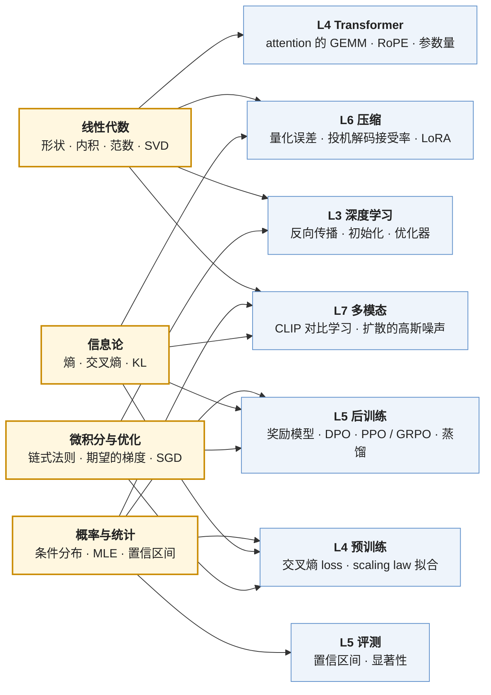

> 本文是[《AI 算法工程师学习地图》](/ai-algorithm-engineer-learning-roadmap.html)第 L0 层（数学基础）的导读。它不是数学教程，而是一张"学到哪里为止、在哪里用到、怎么检验自己学会了"的清单。

问算法工程师"需要多少数学"，得到的答案通常在两个极端之间摇摆：要么"不需要，调库就行"，要么"先把数学分析、矩阵论、测度论学完"。两个答案都不对。前者的问题是：读 DPO 论文卡在第一个公式、看到 loss 曲线不知道 1.8 是好是坏、把 A/B 差 1 个点当成结论；后者的问题是：学了两年还没有摸到模型。

正确的答案是一个**最小集**：把后面所有层——深度学习、Transformer、后训练、压缩、多模态——要用到的数学列出来，只学这些，学到两个标准：**读公式不卡壳**（每个符号知道是什么、每个等号知道为什么成立），**推导 loss 不出错**（从建模假设出发，自己写出交叉熵、DPO、策略梯度的表达式）。本文按这个标准，把数学分成四个分支，每个分支只列后面用到的概念，每个概念说明它在哪一层、哪个公式里出现，并尽可能把它**算成一个数字**——因为算法工程师的数学最终要落到"这个决定花多少钱、这个差异是不是噪声"。

全篇的核心问题是：

> **拿到一篇 LLM 论文，能不能读懂它的每一个公式；给一个建模假设，能不能推出它的训练 loss；给一个评测结果，能不能判断差异是真的还是噪声？**


## 一、总览：四个分支与它们的去向

### 1. 学到什么深度

四个分支——线性代数、概率统计、信息论、微积分与优化——各有一个明确的终点。终点不是"学完这门课"，而是能独立完成一件后面要反复做的事：

| 分支 | 终点：能独立做的事 | 对应的检验 |
|---|---|---|
| 线性代数 | 看到任何矩阵乘法能写出形状与 FLOPs；理解"低秩"为什么能省参数 | 算出 LoRA 秩 16 在 Llama-3-8B 上加了多少参数 |
| 概率与统计 | 从"语言模型是条件分布"出发推出交叉熵 loss；给评测结果算置信区间 | 判断 HumanEval 上差 3 个点是否显著 |
| 信息论 | 分清熵、交叉熵、KL 各是什么；解释 RLHF 的 KL 惩罚项在约束什么 | 从 KL 约束的最优策略推出 DPO 的 loss |
| 微积分与优化 | 用链式法则推一层的梯度；对期望求导得到策略梯度 | 写出 softmax + 交叉熵的梯度 $$p - y$$ |

深度以此为界。SVD 要懂到"任何矩阵可以分解成正交基与奇异值、截断即低秩近似"，不需要会证明存在性；测度论、泛函分析、随机过程整门课都不在最小集里——用到时（比如扩散模型的 SDE 视角）再按需补一节。

### 2. 每个分支在后面哪里用到

后面各层对四个分支的依赖是多对多的，一张图比表格看得清楚：



两个分支的去向值得先说明。**信息论**看起来最"理论"，却是后训练的主语言：SFT 的 loss 是交叉熵，RLHF 与 DPO 的约束是 KL，蒸馏的目标是 KL，投机解码的接受率是两个分布的总变差。**概率统计**里最容易被跳过的是统计推断那一半（置信区间、显著性），但它决定了 L5 评测的结论是否成立——没有它，"提升了 2 个点"只是一个没有含义的数字。

### 3. 本文的章节安排

```text
第二章   线性代数              形状规则与 FLOPs、内积与范数、SVD 与低秩、旋转矩阵；算 LoRA 的参数量
第三章   概率与统计            语言模型是条件分布、MLE 到交叉熵、softmax 与温度、Bradley-Terry；算评测的置信区间
第四章   信息论                熵与困惑度、交叉熵 = 熵 + KL、KL 的方向、KL 约束下的最优策略；推出 DPO
第五章   微积分与优化          链式法则与 softmax 梯度、期望的梯度与策略梯度、SGD 与学习率；Adam 留给 L3
第六章   自测清单              八个公式，读懂算过关
第七章   怎么学                材料、顺序、按需回补的方法
第八章   本文小结
```


## 二、线性代数：形状、内积与低秩

> **能不能看到任何一个矩阵乘法就写出形状和 FLOPs？能不能解释"低秩"为什么省参数？**

### 1. 形状规则与 FLOPs：一切成本的起点

神经网络的绝大部分计算是矩阵乘法。$$A \in \mathbb{R}^{m \times k}$$ 乘 $$B \in \mathbb{R}^{k \times n}$$ 得 $$C \in \mathbb{R}^{m \times n}$$，内维 $$k$$ 必须相同，这是形状规则；每个输出元素是 $$k$$ 次乘加，共 $$m \cdot n \cdot k$$ 次乘加，即 $$2mnk$$ FLOPs，这是成本规则。两条规则加起来，就是读任何模型结构时的第一反应：**这一步的 $$m, k, n$$ 是多少**。

代一个数字：Llama-3-8B 的 $$d = 4096$$，attention 的 $$W_Q \in \mathbb{R}^{4096 \times 4096}$$，一个 token 经过它是 $$[1, 4096] \times [4096, 4096]$$，$$2 \times 4096 \times 4096 \approx 33.5$$ MFLOPs；4096 个 token 的 prefill 就是 $$m = 4096$$，137 GFLOPs。[《Transformer 与 LLM》第二篇](/transformer-flops-bytes-and-roofline.html)把整个模型的账算完了，那篇的每一行都是这两条规则的应用。

由此需要熟悉的相关概念：**转置**（$$(AB)^T = B^T A^T$$，PyTorch 里 `nn.Linear` 的权重存成 `[out, in]`，做的是 $$xW^T$$）；**张量**（多于两维的数组，$$[\text{batch}, \text{seq}, d]$$ 这样的形状；矩阵乘法只作用于最后两维，其余维度是批）；**广播**（形状不同的张量按规则对齐相加，NumPy 与 PyTorch 同一套规则）。这三样东西是 L1 里 NumPy 要建立的"形状直觉"的数学版。

### 2. 内积、范数与余弦相似度

两个向量的内积 $$\langle a, b \rangle = a^T b = \sum_i a_i b_i$$ 是 attention score 的定义：$$q^T k$$ 越大，注意力越集中。$$L_2$$ 范数 $$\|a\|_2 = \sqrt{a^T a}$$ 是向量长度；把内积除以两个长度就是余弦相似度 $$\cos\theta = a^T b / (\|a\| \|b\|)$$，取值 $$[-1, 1]$$，与向量长度无关——embedding 检索、CLIP 的图文匹配用的都是它，因为想比的是"方向"而不是"大小"。

范数还有另一个身份：**正则化项**。weight decay 在 loss 上加 $$\frac{\lambda}{2}\|W\|_F^2$$（Frobenius 范数，把矩阵拉直成向量的 $$L_2$$ 范数），$$L_1$$ 范数 $$\sum |w_i|$$ 产生稀疏解（Lasso）。量化误差也用范数度量：把 $$W$$ 量化成 $$\hat W$$，$$\|W - \hat W\|_F$$ 或 $$\|WX - \hat W X\|_F$$ 是 GPTQ 一类方法最小化的目标——后者说明量化不是逼近权重本身，而是逼近权重**作用在输入上的结果**。

### 3. 特征值、SVD 与低秩

矩阵的**秩**是它的列向量中线性无关的个数，也是它"真正携带的自由度"。任何 $$W \in \mathbb{R}^{m \times n}$$ 都能做奇异值分解 $$W = U \Sigma V^T$$：$$U, V$$ 是正交矩阵（列向量互相垂直、长度为 1），$$\Sigma$$ 是对角阵，对角线上是从大到小排列的奇异值 $$\sigma_1 \ge \sigma_2 \ge \dots$$。只保留前 $$r$$ 个奇异值，得到的 $$W_r = U_r \Sigma_r V_r^T$$ 是所有秩为 $$r$$ 的矩阵中离 $$W$$ 最近的一个（Eckart–Young 定理）——这是"低秩近似"的全部数学。

LoRA 用的正是这个直觉：微调对权重的改动 $$\Delta W$$ 假设是低秩的，于是不存 $$\Delta W \in \mathbb{R}^{m \times n}$$，而存 $$B \in \mathbb{R}^{m \times r}$$ 与 $$A \in \mathbb{R}^{r \times n}$$，$$\Delta W = BA$$。参数量从 $$mn$$ 降到 $$r(m + n)$$。代数字：Llama-3-8B 的 $$W_Q$$ 是 $$4096 \times 4096 = 16.8$$M 参数，$$r = 16$$ 的 LoRA 是 $$16 \times (4096 + 4096) = 131$$K，只有 0.78%。对一层里全部七个线性层（Q、K、V、O、gate、up、down）都加 $$r = 16$$，一层是 1.31M，32 层共 41.9M，占 8.03B 的 0.52%。这就是"用半个百分点的参数微调一个模型"的算法。它管用的前提——$$\Delta W$$ 确实低秩——是一个经验假设，L5 讨论它何时成立、秩取多少。

特征值是 SVD 在方阵上的特例（对称矩阵 $$A = Q \Lambda Q^T$$）。用到它的地方：PCA（协方差矩阵的特征向量是方差最大的方向）、理解优化景观（Hessian 的特征值决定曲率，负特征值意味着鞍点）。两处都只需要概念，不需要手算。

### 4. 正交矩阵与旋转：RoPE

正交矩阵 $$R$$（$$R^T R = I$$）保持内积：$$(Ra)^T (Rb) = a^T b$$。二维旋转矩阵 $$R_\theta = \begin{pmatrix} \cos\theta & -\sin\theta \\ \sin\theta & \cos\theta \end{pmatrix}$$ 是最简单的正交矩阵，两次旋转相乘等于角度相加：$$R_\alpha R_\beta = R_{\alpha + \beta}$$，$$R_\alpha^T = R_{-\alpha}$$。

RoPE 把 query 与 key 的每一对维度按位置 $$m$$ 旋转 $$m\theta$$，于是 $$(R_{m\theta} q)^T (R_{n\theta} k) = q^T R_{(n-m)\theta} k$$——内积只依赖相对位置 $$n - m$$。读懂这一行，[《Transformer 与 LLM》第四篇](/positional-encoding-and-long-context.html)的位置编码与长上下文外推就没有数学障碍了：外推方法（PI、NTK、YaRN）全是在改 $$\theta$$ 随维度的分布。把二维向量看成复数，旋转就是乘 $$e^{i m\theta}$$，这是 RoPE 论文的写法，两种记号等价。


## 三、概率与统计：语言模型是一个条件分布

> **能不能从"语言模型是条件分布"出发推出交叉熵 loss？能不能给评测结果算置信区间？**

### 1. 条件概率与链式法则

一个序列 $$x = (x_1, \dots, x_T)$$ 的联合概率可以按链式法则分解为 $$p(x) = \prod_{t=1}^{T} p(x_t \mid x_{<t})$$。语言模型就是这个分解里每一项 $$p(x_t \mid x_{<t})$$ 的参数化：给定前文，输出下一个 token 在词表上的分布。这一句话决定了后面的一切——为什么训练目标是 next-token prediction、为什么推理是逐个 token 生成、为什么 KV cache 能增量追加（前文不变，条件不变）。

需要熟悉的相关概念：**随机变量**与**分布**；**联合、边缘、条件**三种概率与它们的关系 $$p(a, b) = p(a \mid b)\,p(b)$$；**贝叶斯公式** $$p(a \mid b) = p(b \mid a)\,p(a) / p(b)$$（在最大后验估计、朴素贝叶斯与扩散模型的反向过程里出现）；**独立性**与**期望、方差**。

### 2. 从最大似然到交叉熵：第一个要会推的 loss

模型有参数 $$\theta$$，训练集是 $$N$$ 条序列。**最大似然估计**（MLE）说：选让训练集出现概率最大的 $$\theta$$。概率是乘积，取对数变成求和，取负变成最小化：

$$
\hat\theta = \arg\max_\theta \prod_{i} p_\theta(x^{(i)}) = \arg\min_\theta \left[ -\sum_i \sum_t \log p_\theta\!\left(x^{(i)}_t \mid x^{(i)}_{<t}\right) \right]
$$

括号里除以总 token 数，就是训练日志里的 loss——**每个 token 的负对数似然**，也就是交叉熵（第四章解释这两个名字为什么是同一个东西）。这三行推导是后面所有 loss 的模板：SFT 是同一个式子只对回复部分求和（loss mask）；奖励模型是把 $$p_\theta$$ 换成"哪个回答更好"的概率；DPO 是把奖励模型的概率再换一次。

顺带一个立刻能用的数字：训练刚开始时模型接近均匀分布，每个 token 的 loss 约为 $$\ln V$$；Llama-3 的词表 $$V = 128256$$，$$\ln V \approx 11.8$$。如果第一步的 loss 远大于这个数，初始化有问题；如果远小于，数据泄漏或者 loss 算错了。

### 3. softmax、温度与采样

模型最后一层输出的是 $$V$$ 个实数（logits）$$z$$，不是概率。softmax 把它们变成分布：$$p_j = e^{z_j} / \sum_k e^{z_k}$$。加温度 $$\tau$$ 就是 $$p_j \propto e^{z_j / \tau}$$：$$\tau \to 0$$ 趋向 argmax（greedy），$$\tau = 1$$ 是模型原始分布，$$\tau > 1$$ 更平。top-k、top-p 是在这个分布上截断后重新归一化。这些是 L6 解码策略的全部数学；同时也解释了为什么评测结果依赖采样设置——同一个模型 $$\tau = 0$$ 与 $$\tau = 0.7$$ 是两个不同的分布。

softmax 里的 $$e^{z_j}$$ 会溢出，实现上先减去 $$\max_k z_k$$，结果不变（分子分母同乘一个常数）。这个技巧在 FlashAttention 的在线 softmax 里变成核心：分块计算时每块维护自己的 max，合并时再修正。

### 4. 常见分布与它们的出场

| 分布 | 参数 | 在哪里出现 |
|---|---|---|
| 伯努利 / 二项 | $$p$$ | 二分类；奖励模型"A 比 B 好"的概率；评测每道题对错，$$n$$ 题的正确数是二项分布 |
| 类别分布（categorical） | $$p_1, \dots, p_V$$ | next-token 的分布；softmax 的输出 |
| 高斯 | $$\mu, \sigma^2$$ | 权重初始化；梯度噪声的建模；扩散模型的加噪过程与 VAE 的隐变量 |
| 均匀 | $$[a, b]$$ | 初始化的另一选择；随机采样 |

高斯的两条性质在后面反复用：独立高斯之和仍是高斯，方差相加（初始化时"每层方差不变"的推导、扩散模型 $$T$$ 步加噪等价于一步加噪的推导都靠它）；$$D$$ 个方差为 $$\sigma^2$$ 的独立分量的内积，方差是 $$D\sigma^2$$——这是 attention 的 $$q^T k$$ 要除以 $$\sqrt{d_k}$$ 的原因。

### 5. Bradley-Terry：偏好如何变成概率

奖励模型要从"标注员觉得回答 $$y_w$$ 比 $$y_l$$ 好"学出一个标量分 $$r(x, y)$$。Bradley-Terry 模型假设：

$$
P(y_w \succ y_l \mid x) = \sigma\big(r(x, y_w) - r(x, y_l)\big), \qquad \sigma(z) = \frac{1}{1 + e^{-z}}
$$

分差过一个 sigmoid 就是胜率。套用第 2 节的 MLE 模板，奖励模型的 loss 是 $$-\log \sigma(r_w - r_l)$$——这正是逻辑回归的 loss，只是输入从特征变成了两个回答的分差。L2 说"逻辑回归是奖励模型的数学骨架"，指的就是这一行。第四章会把 $$r$$ 再替换掉，得到 DPO。

### 6. 统计推断：评测的置信区间

评测集 $$n$$ 道题，模型答对比例 $$\hat p$$。每道题对错是一次伯努利试验，$$\hat p$$ 的标准误是 $$\sqrt{\hat p(1 - \hat p)/n}$$，95% 置信区间约为 $$\hat p \pm 1.96 \times$$ 标准误。算几个常用 benchmark：

| Benchmark | $$n$$ | 假设 $$\hat p$$ | 标准误 | 95% 区间半宽 | 两个模型独立比较时的显著差异 |
|---|---|---|---|---|---|
| HumanEval | 164 | 0.80 | 3.1% | ±6.1% | 约 8.7 个点 |
| GSM8K | 1319 | 0.90 | 0.8% | ±1.6% | 约 2.3 个点 |
| MMLU | 14042 | 0.70 | 0.4% | ±0.8% | 约 1.1 个点 |

结论直接而残酷：HumanEval 上差 3 个点在噪声范围内；GSM8K 上差 2 个点勉强；只有 MMLU 这种规模才能分辨 1 个点。两个模型在**同一套题**上比较可以用配对检验（看每道题谁对谁错），比表中的独立估计更灵敏，但结论的量级不变。这张表是 L5 评测与横切"实验方法论"里"差异多大才算显著"的数学来源，也是读论文时对"提升 1.5 个点"保持怀疑的依据。

同一套工具还用在别处：多个随机种子的结果报均值与标准差；A/B 测试的显著性；scaling law 拟合时参数的置信区间。需要掌握的概念是：样本均值与标准误、中心极限定理（为什么 $$n$$ 大时可以用正态近似）、置信区间、假设检验与 p 值的含义（以及它们不是什么）。到能算上面那张表的程度即可。


## 四、信息论：熵、交叉熵与 KL

> **能不能分清熵、交叉熵、KL 各是什么？能不能从 KL 约束的最优策略推出 DPO 的 loss？**

### 1. 熵与困惑度

分布 $$p$$ 的熵 $$H(p) = -\sum_x p(x) \log p(x)$$ 是它的"不确定程度"：均匀分布最大（$$\log V$$），确定性分布为 0。以 $$e$$ 为底单位是 nat，以 2 为底是 bit，1 nat $$= 1/\ln 2 \approx 1.44$$ bit。训练日志里的 loss 是 nat；论文里的 "bits per byte" 是 bit 除以字节数。

困惑度 $$\text{PPL} = e^{\text{loss}}$$ 是 loss 的另一种读法：loss 1.8 nat 对应 PPL 6.05，直觉是"模型每一步平均在 6 个 token 里犹豫"。同一个 loss 换算成 bit 是 2.6 bit/token。这两个换算要熟到不用计算器。

### 2. 交叉熵 = 熵 + KL

用分布 $$q$$ 去编码来自 $$p$$ 的数据，平均码长是交叉熵 $$H(p, q) = -\sum_x p(x) \log q(x)$$。它比 $$p$$ 自己的熵多出来的部分就是 KL 散度：

$$
H(p, q) = H(p) + D_{\mathrm{KL}}(p \,\Vert\, q), \qquad D_{\mathrm{KL}}(p \,\Vert\, q) = \sum_x p(x) \log \frac{p(x)}{q(x)} \ge 0
$$

训练时 $$p$$ 是数据分布（one-hot：真实的下一个 token 概率为 1），$$q$$ 是模型分布，$$H(p) = 0$$，于是交叉熵 $$= -\log q(x_t)$$——正是第三章推出的负对数似然。这就是"交叉熵 loss"与"MLE"是同一个东西的原因。而当 $$p$$ 不是 one-hot 时（蒸馏：$$p$$ 是教师的软分布），交叉熵与 KL 只差一个不依赖模型的常数 $$H(p)$$，最小化两者等价。

顺带说明：数据本身有熵，所以 loss 不可能降到 0。scaling law 里的常数项 $$E$$（Chinchilla 拟合为 1.69 nat）就是对"自然语言不可约的熵"的估计——无论模型多大、数据多多，loss 都不会低于它。

### 3. KL 的方向

KL 不对称，$$D_{\mathrm{KL}}(p \| q) \ne D_{\mathrm{KL}}(q \| p)$$，两个方向的行为完全不同：

| | $$D_{\mathrm{KL}}(p \,\Vert\, q)$$，最小化 $$q$$ | $$D_{\mathrm{KL}}(q \,\Vert\, p)$$，最小化 $$q$$ |
|---|---|---|
| 名字 | forward KL | reverse KL |
| 期望在谁上 | 在 $$p$$ 上采样 | 在 $$q$$ 上采样 |
| 行为 | $$p$$ 有概率的地方 $$q$$ 必须覆盖（mode-covering，$$q$$ 变宽） | $$q$$ 有概率的地方 $$p$$ 必须有（mode-seeking，$$q$$ 收窄到 $$p$$ 的某个峰） |
| 出现 | MLE / 交叉熵训练；标准蒸馏 | RLHF 的 KL 惩罚（策略 $$\pi$$ 对参考 $$\pi_{\text{ref}}$$）；on-policy 蒸馏 |

RLHF 的目标是最大化奖励同时不偏离参考模型：$$\max_\pi \mathbb{E}_{y \sim \pi}[r(x, y)] - \beta\, D_{\mathrm{KL}}(\pi \| \pi_{\text{ref}})$$。KL 在 $$\pi$$ 上取期望，是 reverse 方向——它允许策略放弃参考模型的一部分模式（只要不去参考模型认为不可能的地方），这正是"对齐会降低多样性"的数学根源。$$\beta$$ 是拉力：越大越保守。

### 4. 从 KL 约束的最优策略到 DPO

上面那个目标有闭式解。对每个 $$x$$，最优策略是

$$
\pi^*(y \mid x) = \frac{1}{Z(x)}\, \pi_{\text{ref}}(y \mid x)\, \exp\!\left(\frac{r(x, y)}{\beta}\right)
$$

其中 $$Z(x)$$ 是归一化常数。推导只用到拉格朗日乘子与 $$\log$$ 的性质，几行可以完成，建议自己推一次。把它反解出奖励：$$r(x, y) = \beta \log \frac{\pi^*(y \mid x)}{\pi_{\text{ref}}(y \mid x)} + \beta \log Z(x)$$。代入第三章第 5 节的 Bradley-Terry，$$Z(x)$$ 在分差里抵消：

$$
\mathcal{L}_{\text{DPO}} = -\log \sigma\!\left( \beta \log \frac{\pi_\theta(y_w \mid x)}{\pi_{\text{ref}}(y_w \mid x)} - \beta \log \frac{\pi_\theta(y_l \mid x)}{\pi_{\text{ref}}(y_l \mid x)} \right)
$$

这就是 DPO：不训奖励模型、不做 RL，直接用偏好对优化策略。整条推导链——MLE → Bradley-Terry → KL 约束最优策略 → 代入消去 → DPO——用到的全是本文列出的概念，没有一步超出最小集。能独立走完它，L5 的"DPO 一族"（IPO、KTO、SimPO 等）就只是在改其中某一步的假设。

### 5. 其他两处 KL

**蒸馏**的目标是 $$D_{\mathrm{KL}}(p_{\text{teacher}} \| p_{\text{student}})$$ 逐 token 求和，student 学 teacher 的整个分布而不只是 argmax——软标签比硬标签多出的信息就是 teacher 分布里的"第二名、第三名是谁"。

**投机解码**用小模型的分布 $$q$$ 起草、大模型的分布 $$p$$ 验证，一个草稿 token 被接受的概率是 $$\sum_x \min(p(x), q(x)) = 1 - \tfrac{1}{2}\sum_x |p(x) - q(x)|$$，即 1 减去总变差距离。两个分布越近接受率越高，而拒绝采样保证最终输出严格服从 $$p$$。[《Transformer 与 LLM》第七篇](/quantization-speculative-decoding-and-lora.html)从这一行推出加速比。

**互信息** $$I(X; Y) = D_{\mathrm{KL}}(p(x, y) \| p(x) p(y))$$ 度量两个变量的相关程度，在对比学习（CLIP 的 InfoNCE 是互信息的下界）与表示学习理论里出现，知道定义即可。


## 五、微积分与优化：梯度从哪里来

> **能不能用链式法则推一层的梯度？能不能对一个期望求导，得到策略梯度？**

### 1. 导数、梯度、链式法则

标量函数对向量的导数是**梯度** $$\nabla_\theta L \in \mathbb{R}^{|\theta|}$$，指向 $$L$$ 增长最快的方向；向量函数对向量的导数是 **Jacobian** 矩阵。复合函数 $$L = f(g(\theta))$$ 的导数是 $$\frac{\partial L}{\partial \theta} = \frac{\partial f}{\partial g} \frac{\partial g}{\partial \theta}$$，这是链式法则；反向传播就是从输出往输入方向逐层套用它，每层把上游传来的梯度乘上自己的局部 Jacobian。L3 会手推一个两层网络；这里只要求会一个最重要的局部导数。

**softmax + 交叉熵的梯度。** 设 logits $$z$$，$$p = \text{softmax}(z)$$，真实标签 one-hot $$y$$，$$L = -\sum_j y_j \log p_j$$。对 $$z_j$$ 求导：

$$
\frac{\partial L}{\partial z_j} = p_j - y_j
$$

推导两步：$$\partial \log p_j / \partial z_k = \delta_{jk} - p_k$$，再对 $$y$$ 加权求和。结果极简：梯度就是"预测概率减去真实概率"。它说明三件事——loss 对 logits 的梯度有界（在 $$[-1, 1]$$ 之间），这是交叉熵比 MSE 更适合分类的原因之一；预测越准梯度越小；所有 $$V$$ 个 logits 都收到梯度，不只是正确答案那一个。这个式子还是理解 logits 级蒸馏的入口：把 one-hot $$y$$ 换成 teacher 的软分布，梯度变成 $$p_{\text{student}} - p_{\text{teacher}}$$。

### 2. 期望的梯度：策略梯度

RL 的目标是 $$J(\theta) = \mathbb{E}_{y \sim \pi_\theta}[R(y)]$$——期望里的分布依赖 $$\theta$$，不能直接把梯度移进期望。**log-derivative trick** 解决它：$$\nabla_\theta \pi_\theta(y) = \pi_\theta(y) \nabla_\theta \log \pi_\theta(y)$$，于是

$$
\nabla_\theta J = \sum_y R(y)\, \nabla_\theta \pi_\theta(y) = \mathbb{E}_{y \sim \pi_\theta}\big[ R(y)\, \nabla_\theta \log \pi_\theta(y) \big]
$$

右边可以用采样估计：从当前策略采 $$n$$ 条回答，各算奖励，用 $$R \cdot \nabla \log \pi$$ 的均值当梯度。这是 REINFORCE。L5 里的每一种在线 RL 算法都是在这个式子上做减方差与稳定化：给 $$R$$ 减一个 baseline 得到优势 $$A$$（方差降低、期望不变——这一步的证明也只需要 $$\mathbb{E}[\nabla \log \pi] = 0$$）；PPO 用价值网络估 baseline 并裁剪更新幅度；GRPO 用同一个 prompt 的一组采样的均值当 baseline，去掉价值网络。读懂本节，那些算法之间的差别就只剩"baseline 从哪来、更新怎么限"两个问题。

推导里要用到的**期望的性质**（线性、$$\mathbb{E}[\nabla \log \pi] = 0$$）与**对参数求导和对样本求期望的交换条件**，知道结论、能跟着推即可。

### 3. 梯度下降、随机性与学习率

有了梯度，最简单的优化是 $$\theta \leftarrow \theta - \eta \nabla L$$。三个概念够用：

**凸与非凸。** 凸函数任何局部极小都是全局极小，梯度下降一定收敛；神经网络的 loss 非凸，有鞍点（梯度为零但不是极小，Hessian 有负特征值）与无数局部极小。实践发现高维空间里鞍点远多于坏的局部极小，随机性足以逃离——所以不必对非凸过度担心，但要理解"收敛到哪"依赖初始化与学习率。

**随机梯度。** 用一个 batch 估计全量梯度，估计有噪声，方差与 batch 大小 $$B$$ 成反比。噪声不全是坏事（帮助逃离鞍点、有正则效果），但决定了学习率的上限；这是"batch 变大学习率要跟着调"这类 scaling 规则的来源，L4 预训练配方里会碰到。

**学习率与调度。** 太大发散、太小不动；warmup 在开始阶段用小学习率让 Adam 的二阶矩估计先稳定，之后衰减。看 loss 曲线判断学习率对不对，是横切"实验方法论"的基本功。

Momentum、Adam / AdamW、weight decay 与 $$L_2$$ 正则的区别、梯度裁剪——这些都建立在 SGD 之上，但它们的设计动机要到训练神经网络时才看得见，放在 L3。

### 4. 一个拟合的例子：scaling law

L4 的 scaling law 是数学在"算账"上最直接的应用。Chinchilla 拟合的形式是 $$L(N, D) = E + A / N^\alpha + B / D^\beta$$，五个常数由若干组 $$(N, D, L)$$ 实验数据最小二乘拟合而来（论文给出 $$E = 1.69, A = 406.4, B = 410.7, \alpha = 0.34, \beta = 0.28$$）。把这个式子当成一个例子看，它用到：幂律（取对数后是直线，这是为什么 scaling law 的图都是双对数坐标）、多元函数求极值（在算力约束 $$C \approx 6ND$$ 下最小化 $$L$$，用拉格朗日乘子得到最优的 $$N, D$$ 比例——Chinchilla 的 $$D/N \approx 20$$ 就是这么来的）、非线性最小二乘与拟合参数的不确定性。

代入两组数字感受一下（只是用公式做算术，这组常数拟合自 Chinchilla 自己的数据与分词器，对其他模型只有量级上的参考价值）：$$N = 8\text{B}$$ 在 Chinchilla 最优的 $$D = 160\text{B}$$ token 上，$$L \approx 2.16$$；同样的 $$N$$ 训到 Llama-3 的 15T token，$$L \approx 1.95$$。多花 94 倍的训练数据换 0.21 nat——值不值，取决于推理成本：8B 模型每次推理比"同 loss 的更大模型"便宜得多，所以 Llama-3 选择过训练。这就是 L4 说的"推理成本纳入后的过训练"，判断它需要的数学在本节全部列出了。


## 六、自测清单：八个公式

学完四个分支后，用后面各层的公式检验。标准是：每个符号知道是什么、每一步等号知道为什么、能说出它在算什么。

| # | 公式 | 出处 | 用到的分支 |
|---|---|---|---|
| 1 | $$\mathcal{L} = -\frac{1}{T}\sum_t \log p_\theta(x_t \mid x_{<t})$$ | 预训练 / SFT 的 loss | 概率（MLE）· 信息论（交叉熵） |
| 2 | $$\partial \mathcal{L} / \partial z = p - y$$ | softmax 与交叉熵的梯度 | 微积分（链式法则） |
| 3 | $$\text{Attention}(Q, K, V) = \text{softmax}(QK^T / \sqrt{d_k})\, V$$ | Transformer | 线性代数（形状）· 概率（为什么除 $$\sqrt{d_k}$$） |
| 4 | $$(R_{m\theta} q)^T (R_{n\theta} k) = q^T R_{(n-m)\theta} k$$ | RoPE | 线性代数（旋转矩阵） |
| 5 | $$L(N, D) = E + A/N^\alpha + B/D^\beta$$，$$C \approx 6ND$$ | Chinchilla scaling law | 优化（约束极值）· 统计（拟合） |
| 6 | $$-\log \sigma(\beta \log \frac{\pi_\theta(y_w)}{\pi_{\text{ref}}(y_w)} - \beta \log \frac{\pi_\theta(y_l)}{\pi_{\text{ref}}(y_l)})$$ | DPO | 概率（Bradley-Terry）· 信息论（KL 约束） |
| 7 | $$\nabla_\theta J = \mathbb{E}_{\pi_\theta}[A(y)\, \nabla_\theta \log \pi_\theta(y)]$$ | 策略梯度 / PPO / GRPO | 微积分（期望的梯度） |
| 8 | $$\alpha = \sum_x \min(p(x), q(x))$$ | 投机解码接受率 | 信息论（总变差） |

八个都能读懂，L0 就够了，可以进入 L3；卡在哪一个，就回到对应分支补那一节。不需要"学完再走"——L4 的 04 系列与 L5 的论文本身就是最好的练习题。


## 七、怎么学

### 1. 材料

每个分支一到两份材料，读列出的章节即可，其余按需：

| 分支 | 材料 | 读什么 |
|---|---|---|
| 总览 | Deisenroth, Faisal, Ong,《Mathematics for Machine Learning》（免费 PDF） | 第一部分（第 2–7 章）：线性代数、解析几何、矩阵分解、向量微积分、概率、优化。为 ML 写的，深度恰好是本文的标准 |
| 线性代数 | Gilbert Strang, MIT 18.06 公开课；3Blue1Brown《线性代数的本质》 | 后者建立几何直觉（两小时）；前者补严格性，重点是矩阵乘法的四种看法、四个基本子空间、SVD |
| 概率与统计 | Blitzstein & Hwang,《Introduction to Probability》（Stat 110） | 前 5 章与第 9–10 章（条件期望、大数定律与中心极限定理）；统计推断部分任何一本入门教材的"置信区间与假设检验"一章 |
| 信息论 | Cover & Thomas,《Elements of Information Theory》 | 只读第 2 章：熵、相对熵、互信息。够用 |
| 微积分与优化 | 《Deep Learning》(Goodfellow 等) 第 4 章"数值计算"；Boyd & Vandenberghe《Convex Optimization》 | 后者第 1–3 章（凸集、凸函数）与第 9 章（无约束优化）；不读对偶与内点法 |
| 工具书 | Petersen & Pedersen,《The Matrix Cookbook》 | 不是读物，是查矩阵求导公式的手册 |

### 2. 顺序与方法

**不要从头到尾读完再开始。** 推荐的做法是：先用一到两周过一遍 MML 第一部分建立框架，然后直接进 L3、L4。遇到读不懂的公式，回到本文第六章的清单找它对应的分支，补那一节。数学只有在被用到时才记得住；"先学两年数学再碰模型"的路径大部分人走不完。

**推导要动笔。** 本文第三章的 MLE → 交叉熵、第四章的 KL 约束最优策略 → DPO、第五章的 softmax 梯度与策略梯度，四条推导都在一页纸以内，各自手推一遍。推过一次，读论文时的公式就从"要看懂的东西"变成"知道它在说什么的东西"。

**算成数字。** 每个概念都找一个真实模型代入：形状代 Llama-3-8B 的 `config.json`，置信区间代真实 benchmark 的题数，scaling law 代真实的 $$N, D$$。这是本文反复做的事，也是这张地图上"算法工程师"与"研究者"的分界——前者的数学最终要回答"值不值、是不是真的"。


## 八、本文小结

- 算法工程师的数学是一个**最小集**：线性代数、概率统计、信息论、微积分与优化四个分支，只学后面各层用到的部分，学到"读公式不卡壳、推导 loss 不出错"为止。
- **线性代数**的核心是形状规则与 FLOPs（一切成本的起点）、内积与范数（attention score、相似度、正则化、量化误差）、SVD 与低秩（LoRA：$$r = 16$$ 在 Llama-3-8B 上加 0.52% 参数）、旋转矩阵（RoPE 的相对位置性质）。
- **概率统计**的核心是"语言模型是条件分布"——由此 MLE 推出交叉熵 loss（初始 loss $$\approx \ln V \approx 11.8$$）；Bradley-Terry 把偏好变成概率；置信区间决定评测结论是否成立（HumanEval 差 3 个点是噪声，MMLU 才能分辨 1 个点）。
- **信息论**是后训练的语言：交叉熵 $$=$$ 熵 $$+$$ KL；KL 有方向，RLHF 用 reverse KL 约束策略；从 KL 约束的最优策略代入 Bradley-Terry 得到 DPO；蒸馏是 KL，投机解码的接受率是 $$1 -$$ 总变差。
- **微积分与优化**的核心是链式法则（softmax + 交叉熵的梯度是 $$p - y$$）、期望的梯度（log-derivative trick 给出策略梯度，PPO / GRPO 只是 baseline 与更新限制的不同选择）、SGD 与学习率；Adam 一族留到 L3。
- 用第六章的八个公式自测；卡在哪个就补哪一节。不要学完再走——先进 L3、L4，按需回补。
