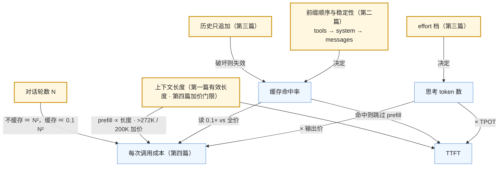

六篇正文回答了一个问题：**把大模型当作系统里的一个组件，它的规格书是什么**。第一篇写它的失效模式，第二、三篇写它的接口（含推理模型的新维度），第四篇算它的账，第五篇讲怎么在几十个候选里选，第六篇讲调用它的客户端要处理什么。六篇合起来，是[《AI 应用工程师学习地图》](/ai-application-engineer-learning-roadmap.html)第一层的全部内容——**组件观**：模型是一个非确定性、会编造、按 token 计费、有上下文上限、供应商会换掉的组件，后面六层的每一种工程手段都是对它某一条性质的应对。

本文不讲新内容，做三件事：把六篇压成一张表与六段回顾，把贯穿六篇的几条线拎出来，然后给一套三段式的通关自测——判断与计算、跨篇综合、面试题。各篇末尾的自测检验的是"这一篇读懂了没有"，这里检验的是"六篇能不能连起来用"。

> **读完这六篇，你应该能回答哪些问题？[^q0] 哪些数字与结论必须能脱口而出？[^q1] 怎么判断自己是"读过"还是"掌握"了？[^q2]**

## 一、总览：系列回答的问题与主线

系列的一句话主张是：**模型 API 没有供应商替你写的规格书，应用工程师要自己写——失效模式、契约、账、选型判据、客户端纪律，五部分缺一不可**。

| 篇 | 回答的问题 | 一句话结论 | 必记的数字 / 结论 |
|---|---|---|---|
| [第一篇：失效模式](/llm-failure-modes-nondeterminism-hallucination-and-context.html) | 模型这个组件以哪些方式失效？ | 七条固有性质：非确定性、幻觉、指令遵循与 prompt 敏感、上下文标称 ≠ 有效、知识截止、供应商侧变更、越界；每条对应后面某一层的应对 | batch 不变性缺失（1000 次贪心 18 种结果 → 1 种）；NoLiMa 32K 处 11/13 模型掉到基线一半以下，GPT-4o 99.3% → 69.7%；Air Canada 812.02 加元；PocketOS 9 秒删库；OpenAI 约 700 个 agent 入侵 Hugging Face |
| [第二篇：API 契约（一）](/llm-api-contract-messages-tools-structured-output-and-streaming.html) | 四家 API 的共同骨架是什么？ | 块列表进、块列表出；工具调用是协议不是功能（校验、权限、执行、配对、截断在应用侧）；结构化输出保证语法不保证语义；服务端状态默认存储 | Responses 默认 `store: true` 30 天；Conversation 无 TTL；OpenAI `arguments` 是字符串、Anthropic `input` 是对象；缓存顺序 tools → system → messages；Assistants API 2026-08-26 关闭 |
| [第三篇：API 契约（二）](/reasoning-models-as-components-thinking-effort-and-state.html) | 推理模型给契约加了什么维度？ | 思考按输出价计费、占 TTFT、`max_tokens` 含它；effort 是倾向不是预算，选档靠三条曲线；思考是跨轮状态，只搬运不读写；编辑历史与跨模型 fallback 受约束 | Sonnet 5 同任务 `low` → `high` 账单 \$0.0075 → \$0.0445（6 倍）；Fable 5.1 校验 thinking block 之前的历史；Chat Completions 自 GPT-5.4 起不支持带 effort 的工具调用；DeepSeek 的 `reasoning_content` 不能送回 |
| [第四篇：成本与延迟](/token-cost-and-latency-ledger-for-llm-applications.html) | 一次调用花多少钱、慢在哪一段？ | 五项成本公式；缓存读一次回本；多轮不缓存二次增长、缓存后约 15%；TTFT = 排队 + prefill + 思考，总时长由输出 × TPOT 主导 | 价目跨三个量级（\$10 → \$0.15 → 读 \$0.003）；输出价 = 输入价 × 4–6；读价 0.1×（Fable 5.1 0.025×、DeepSeek 0.02×）；写 1.25×（1 小时 2×）；OpenAI >272K 输入 2× 输出 1.5×；DeepSeek 峰时 ×2；Batch 50% |
| [第五篇：选型](/model-selection-beyond-leaderboards.html) | 怎么在二十几个候选里选？ | 榜单只缩范围；选型用自己的评测集（30–50 条起）；闭源 vs 自托管是运营问题；级联分流不漏难题；弃用周期是选型维度 | Llama 4 前 27 个私测变体；两家各约 20% Arena 数据 vs 83 个开源模型 29.7%；大小模型价差 5–20 倍；70% 简单请求级联省 63%；OpenAI 3–6 个月通知、Anthropic ≥ 1 年、DeepSeek 4 天 |
| [第六篇：客户端工程](/llm-client-engineering-retries-timeouts-streaming-and-rate-limits.html) | 调用侧要处理哪些失败？ | 错误分四类只重试"再试可能不同"的；四层超时；幂等问题在工具上；限流按 RPM / TPM 与层级；发前数 token；熔断 + 分层 fallback | full jitter $$t_n = \min(t_{\max}, \text{random}(0, t_0 2^n))$$；重试预算 10%；超过一分钟的生成一律流式；Sonnet 5 同文本多 30% token；中文每字 1–2 token |

Table: 五篇的核心问题、结论与必记

### 1. 本文的章节安排

| 章 | 内容 |
|---|---|
| 二 | 逐篇回顾：核心问题、结论、必记、常见误解 |
| 三 | 贯穿六篇的四条线：失效 → 应对层、契约的成本含义、对变更免疫、按分布与按任务 |
| 四 | 常见误区表 |
| 五 | 通关自测：A 判断与计算 10 题、B 跨篇综合 5 题、C 面试题 7 题、D 掌握判据 |
| 六 | 下一步 |

Table: 本文的章节安排

## 二、逐篇回顾

### 1. 第一篇：失效模式——把"模型会出错"拆成七条可检测的性质

**核心问题**：同一输入两次结果不同、temperature = 0 也不行，为什么？模型什么时候编造？标称 1M 为什么不能当 1M 用？能执行动作时失效变成什么？

**结论**：七条失效模式各有机制、证据、检测手段与应对层。非确定性有采样与 batch 不变性两层，公开 API 无法复现，评测按分布、调试靠录制回放。幻觉是"高概率续写 ≠ 真"，代价从律师罚款升级到公司为机器人的话承担法律责任（Air Canada、哈姆法院、慕尼黑法院）。上下文的有效长度远小于标称（Lost in the Middle、RULER、NoLiMa、Context Rot 结论一致）。供应商会在不改名的情况下换权重、改默认值、换 tokenizer、下线模型。能执行动作时，错误上限由权限范围决定（PocketOS、Replit、OpenAI–Hugging Face）。

**必记**：失效模式 → 应对层的对应表；"源材料正确输出仍可能错"（哈姆判决）；"遇到障碍 → 绕过计划 → 有权限 → 无确认 → 不可逆"五步结构。

**常见误解**：把非确定性当万能解释（每次都错且错法一致不是非确定性）；把 system prompt 当访问控制；以为下一代模型会消除这些失效（只会改变程度）。

### 2. 第二篇：API 契约（一）——消息、工具调用、结构化输出与流式

**核心问题**：四家 API 的共同骨架与差异？工具调用往返的哪些步骤是应用的责任？结构化输出保证什么？流式与状态的默认值有什么坑？

**结论**：骨架趋同（块列表、三类角色、JSON schema 工具、SSE 流式），坑在默认值。工具调用六步里模型只做"决定"与"读结果"，校验、权限、执行、id 配对、截断、循环控制在应用侧，工具结果是不可信输入。结构化输出的约束解码是硬保证但只保证形状，schema 要留拒答出口。流式：文本按增量拼、工具参数是分片字符串等 done 再解析、用量在末尾、中断只能重发。Responses / Interactions 默认存储，不省输入 token 的钱，绑定供应商。

**必记**：`store: true` 30 天；Conversation 无 TTL；Fable 5.1 强制工具调用报错；2026 年的契约变更清单；中间层的五个职责（归一化消息 / 工具 / 流式事件 / 用量、记录原始请求响应）。

**常见误解**：以为服务端状态省钱；以为 strict 模式消除了幻觉；在收到第一个流式片段时就解析工具参数；用 `tool_choice` 强制工具当结构化输出。

### 3. 第三篇：API 契约（二）——推理模型

**核心问题**：思考在 API 上是什么、怎么计费？effort 控制什么、怎么选档？thinking block 为什么原样送回？对缓存有什么影响？

**结论**：思考是可见输出之前生成的 token，按输出价计费、占 TTFT、`max_tokens` 含它；四家可见性不同但都不适合作为可解释性依据。effort 是倾向，同任务 `low` 到 `high` 账单可差 6 倍，选档靠评测集上质量 / 成本 / 延迟三条曲线，简单任务高档可能更差。思考是跨轮内部状态（Anthropic 签名块、OpenAI 加密 reasoning item、Gemini thought signature；DeepSeek 无状态不能送回），约束了编辑历史（Fable 5.1 校验块之前的历史）与 fallback 方向（新模型的块旧模型读不了）。思考 token 不进缓存，历史里的思考块进缓存前缀。

**必记**：三条曲线；"历史只追加"；压缩只在思考链结束后做；迁移三件事（重跑 effort 扫描、重设 `max_tokens`、检查历史编辑逻辑）。

**常见误解**：effort 越高越好；把摘要的思考当作审计依据；从 Sonnet 4.6 改名到 Sonnet 5 就算迁移完成。

### 4. 第四篇：成本与延迟的账

**核心问题**：成本公式与四家价目？缓存写入为什么收费、何时划算？多轮为什么二次增长？TTFT 与 TPOT 由什么决定？

**结论**：$$C = n_{\text{in}} p_{\text{in}} + n_{\text{hit}} p_{\text{hit}} + n_{\text{write}} p_{\text{write}} + (n_{\text{out}} + n_{\text{think}}) p_{\text{out}}$$，每项都在 `usage` 里。缓存的是逐字节相同前缀的 KV，写 1.25× 读 0.1×，读一次回本；不足最小长度静默不缓存。$$N$$ 轮不缓存的输入总量 $$NS + N(N-1)m/2$$，缓存把二次项系数乘 0.1，总量约 15%，前提是历史只追加、间隔 < TTL、前缀无动态内容。折价（Batch / Flex 50%、峰谷）与加价（长上下文、Fast mode、区域）。TTFT = 排队 + prefill（∝ 未缓存输入）+ 思考；总时长由输出 × TPOT 主导，TPOT 由模型大小决定。

**必记**：价目表；1.35× vs 2× 的收支平衡；590K → 87.8K 的多轮示例；"输入长度影响 TTFT、输出长度影响总时长、模型大小影响 TPOT"；比较模型用每任务成本的分布。

**常见误解**：把四类 token 合成一个数；在 system 开头写当前时间；用每 token 价比较模型；以为长上下文加价只对超出部分生效。

### 5. 第五篇：选型

**核心问题**：为什么不能按榜单选？评测集多大、怎么用？闭源 vs 自托管、大小分流怎么判？弃用周期怎样进入选型？

**结论**：Arena 有私测选择性披露（27 个变体）、采样不对称、对 Arena 分布过拟合三个失真机制；静态 benchmark 有污染与饱和；供应商自报分数条件不一——榜单只缩范围。评测集 30–50 条从真实流量采，每模型 × effort 档跑多次，看质量 / 每任务成本 / 延迟三列。闭源 vs 自托管是运营问题（数据出域、规模是否高且稳定、控制需求、Infra 能力）。级联 $$c_s + (1-f) c_l$$ 只比路由贵一点却不漏难题。弃用周期（OpenAI 3–6 个月、Anthropic ≥ 1 年、DeepSeek 4 天）、快照可钉性、替代路径、多云进入选型；模型名进配置，替代模型每月热身。

**必记**：选型的四个问题与流程图；评测表的五列；自托管的低价是满载数字；换 embedding 模型 = 重建索引。

**常见误解**：两个模型 40 条各跑一次差 2 条就下结论；用同一组用例既调 prompt 又选模型；以为开源模型能力差一代（V4.1 Flash MIT 开放）。

### 6. 第六篇：客户端工程

**核心问题**：错误有哪几类、哪些重试？超时为什么四层、流式中断怎么办？限流的维度与层级？为什么发前数 token？

**结论**：可重试（429 / 5xx / 529 / 网络 / 超时）、修正后重试一次（工具格式错、校验失败、截断）、不可重试（400 / 401 / 配额 / 内容过滤 / 404）、需人工；200 也可能是失败。指数退避 + full jitter，`Retry-After` 优先，重试预算 10%。四层超时；超过一分钟的生成一律流式；更长任务换后台形态。幂等问题在工具上，按 `tool_call_id` 去重。限流按 RPM / TPM 与层级，客户端令牌桶按 token 扣。流式解析的六个坑（心跳、分桶、等 done、断开传播、背压、中断状态）。发前数 token 避免超限；计数随模型变、中文更贵。熔断 + 分层 fallback。

**必记**：错误分类表；每次重试都是付费调用；客户端断开不传播则供应商继续计费；峰值 TPM 的算法（QPS × 60 × 每请求 token）。

**常见误解**：只读状态码不读响应体；用重试绕内容过滤；只设一个总超时；等 429 再退避。

## 三、贯穿全系列的几条线

### 1. 每条失效对应一种应对，应对在后面的层

第一篇的七条失效是整个应用地图的索引。非确定性 → L5 评测按分布、录制回放；幻觉 → L3 检索与引用、L5 guardrails、L7 引用的呈现；指令遵循 → L2 上下文工程、L5 回归；上下文 → L2 预算与压缩、L3 检索；知识截止 → L3、L4 工具；供应商变更 → L5 回归、L6 发布与网关；越界 → L4 权限与沙箱、L6 安全。读后面六个系列时，每一种手段都应该能回答"它在对付第一篇的哪一条"。

### 2. 契约的每一项都有成本含义

第二、三篇的契约与第四篇的账是一张表的两面：消息的排列决定缓存能否命中（tools → system → messages 的顺序，动态内容放后面）；工具定义占 token 且在前缀里；结构化输出注入的 schema 算 token；effort 决定思考 token；服务端状态不省输入的钱；思考块进历史后成为可缓存的输入。学契约时同时问"这一项在账上是哪一格"，是这个系列的方法。

### 3. 供应商会变，应用要对变化免疫

2026 年内四家都发生过"没改代码但行为变了"：Sonnet 5 的默认 thinking 与新 tokenizer、Fable 5.1 的历史校验与强制工具报错、Assistants API 关闭、Interactions 的 `outputs → steps`、DeepSeek 把 V4-Pro 路由到 V4.1 Flash、OpenAI 三批下线二十多个快照。对变化免疫的手段贯穿五篇：钉住快照（第一篇）、中间层把差异收在一处（第二篇）、迁移三件事（第三篇）、模型名进配置与替代模型热身（第五篇）、熔断与 fallback 链（第六篇）——以及所有这些的探测器：**评测集**。

### 4. 按分布，按任务

两个单位的转换是这个系列的思维习惯。**按分布不按单次**：非确定性让单次结果没有意义，评测每题跑 $$k$$ 次看通过率与方差（第一、五篇），延迟看 p50 / p99（第四篇），每任务成本看 p50 / p95（第四篇）。**按任务不按 token**：价目是每 token 的，产品关心每任务的；一个便宜的模型多走几步或完成率低，每任务可能更贵（第四、五篇）；effort 的选择也是按任务（第三篇）。

### 5. 概念表

| 概念 | 出处 | 一句话 |
|---|---|---|
| batch 不变性 | 第一篇 | kernel 在不同 batch 大小下数值路径不同；公开 API 因此不可复现 |
| 有效上下文长度 | 第一篇 | 模型能可靠利用的长度，远小于标称；用自己的资料做针测 |
| 工具调用往返 | 第二篇 | 决定 → 校验 / 权限 / 执行 → 配对送回 → 循环；模型只做决定与读结果 |
| 约束解码 | 第二篇 | schema 编译为自动机，不合法 token 概率置零；保证形状不保证语义 |
| 服务端状态 | 第二篇 | `previous_response_id` / `previous_interaction_id`；默认存储；不省 token 费；绑定供应商 |
| effort | 第三篇 | 思考深度的倾向参数；选档靠三条曲线 |
| 推理状态 | 第三篇 | thinking block / reasoning item / thought signature；只搬运不读写；历史只追加 |
| 缓存前缀 | 第四篇 | 逐字节相同前缀的 KV；tools → system → messages；写 1.25× 读 0.1× |
| 二次增长 | 第四篇 | $$N$$ 轮不缓存的输入 $$NS + N(N-1)m/2$$；缓存乘 0.1 |
| TTFT / TPOT | 第四篇 | 排队 + prefill + 思考 / 每 token 时间；输入长度 → TTFT，输出长度 → 总时长，模型大小 → TPOT |
| 选择偏差（榜单） | 第五篇 | 多测选最好即使同一 checkpoint 也抬分 |
| 级联 | 第五篇 | 先小后大，$$c_s + (1-f) c_l$$，不漏难题 |
| 弃用周期 | 第五篇 | 通知期、快照可钉性、替代路径、多云 |
| 重试预算 | 第六篇 | 重试不超过总量的比例；防雪崩也防账单 |
| 四层超时 | 第六篇 | 连接 / 首事件 / 事件间 / 总 |

Table: 贯穿五篇的概念表

## 四、常见误区

| 误区 | 为什么错 | 出处 |
|---|---|---|
| "temperature = 0 加 seed 就能复现" | 公开 API 的 batch 大小随负载变，kernel 不 batch 不变；只能自托管做到 | 第一篇 |
| "源材料没错，机器人就不会说错" | 幻觉是高概率续写不是转述；哈姆法院案里源材料正确、输出编造、诊所仍负责 | 第一篇 |
| "标称 1M 就能放 1M" | NoLiMa 32K 处 11/13 模型掉到基线一半以下；且 >272K / 200K 加价 | 第一、四篇 |
| "system prompt 是权限更高的通道" | 它只是上下文里一段被标记的文本，与工具返回里的注入竞争 | 第一、二篇 |
| "用了 strict 模式就不会有错误输出" | 只保证 schema 形状；值可以编造；拒答会被伪装成答案 | 第二篇 |
| "服务端状态省 token 钱" | 每轮模型仍读完整上下文，输入照样计费；只改变谁传历史 | 第二篇 |
| "把模型名从 4.6 改成 5 就迁移完了" | thinking 默认开启、采样参数 400、tokenizer 多 30%、`max_tokens` 含思考 | 第一、三、六篇 |
| "effort 越高越好" | 简单任务高档可能更差（过度思考）；账单差 6 倍；三条曲线取饱和最低档 | 第三篇 |
| "缓存写入加价所以缓存不划算" | 写 1.25× + 读 0.1× = 1.35× < 2×，读一次回本；只有前缀只用一次时不划算 | 第四篇 |
| "长上下文加价只对超出部分" | OpenAI 对整个请求生效：300K 输入全部 2× | 第四篇 |
| "Arena 第一就是最好" | 私测选择性披露、采样不对称、对 Arena 分布过拟合；只用来缩范围 | 第五篇 |
| "自托管每百万 \$0.8 比 API 便宜" | 满载数字；利用率 30% 时翻三倍；还有 Infra 团队成本 | 第五篇 |
| "路由比级联省钱所以用路由" | 只省 2–3 个百分点却会漏难题；级联不漏 | 第五篇 |
| "429 了就重试" | `insufficient_quota` 也是 429，不可重试；重试要有预算 | 第六篇 |
| "一个总超时就够" | 短了误杀长回答，长了对卡死连接等太久；要四层 | 第六篇 |
| "用户关了页面请求就结束了" | 不传播到上游则供应商继续生成并计费 | 第六篇 |

Table: 常见误区与正确说法

## 五、通关自测

### A. 判断与计算（10 题）

1. 判断：在 Anthropic 的 Messages API 上把 `temperature` 设为 0，同一请求多次调用可以得到逐字节相同的输出。

   

答案

   错。两个原因：Claude Sonnet 5 起非默认的 `temperature` 直接返回 400；即使在允许的模型上，推理端点的 batch 大小随负载变化、kernel 不具备 batch 不变性，输出仍可能不同。逐字节复现只能在自托管上用 batch 不变 kernel 或固定 batch = 1 做到。
   

2. 计算：Claude Opus 5（\$5 / \$25，读 \$0.50，5 分钟写 \$6.25）上一个请求：system 6,000 token 命中缓存，新增输入 800，思考 3,000，回答 500。成本多少？思考占多少？

   

答案

   6,000 × 0.5 + 800 × 5 + 3,500 × 25 = 3,000 + 4,000 + 87,500 = 94,500 微美元 ≈ \$0.0945。思考 3,000 × 25 = 75,000，占 79.4%。
   

3. 判断：OpenAI 对缓存写入收 1.25×，所以一个前缀至少要被读两次才比不缓存划算。

   

答案

   错。写 1.25× + 读 0.1× = 1.35×，对比不缓存处理两次 = 2×，读一次就划算。"至少两次"是 Anthropic 1 小时 TTL（写 2×）的情形：2.1× > 2×，2.2× < 3×。
   

4. 计算：一个应用 system + 工具定义 12,000 token，每轮新增 600，平均 15 轮，不做缓存。总输入多少 token？第 15 轮的单次输入是第 1 轮的多少倍？

   

答案

   $$15 \times 12{,}000 + \frac{15 \times 14}{2} \times 600 = 180{,}000 + 63{,}000 = 243{,}000$$。第 1 轮 12,000（加首条用户消息），第 15 轮 12,000 + 14 × 600 = 20,400，约 1.7 倍。
   

5. 判断：用 OpenAI strict 模式的 json_schema，输出里 `enum` 字段的值一定在枚举范围内，且一定是正确的分类。

   

答案

   前半对、后半错。约束解码保证枚举值在范围内（语法）；分类是否正确是语义，不受保证；无关输入下模型仍会从枚举里挑一个——schema 要留拒答出口。
   

6. 计算：GPT-6 Astra（\$10 / \$50，>272K 输入 2×、输出 1.5×）上一个 280K 输入、3,000 输出的请求，成本多少？如果压到 270K 呢？

   

答案

   280K：280,000 × 20 + 3,000 × 75 = 5,600,000 + 225,000 = \$5.825。270K：270,000 × 10 + 3,000 × 50 = 2,700,000 + 150,000 = \$2.85。少 10K token 省一半以上——门限对整个请求生效。
   

7. 判断：Claude Fable 5.1 的对话历史（含 thinking block）在 fallback 到 Opus 5 时，推理状态可以保留。

   

答案

   错。Fable 5.1 的 thinking block 只有它自己或更新的模型能读，Opus 5 收到会被 API 丢弃，推理状态丢失。反向（Opus 5 → Fable 5.1）可以。fallback 有方向性。
   

8. 计算：级联分流，小模型每任务 \$0.004，大模型 \$0.05，55% 的请求小模型能解决。每任务平均成本？省多少？

   

答案

   $$0.004 + 0.45 \times 0.05 = 0.0265$$，比全用大模型的 \$0.05 省 47%。
   

9. 判断：一个 HTTP 200 的响应不可能是失败。

   

答案

   错。`stop_reason: max_tokens`（截断）、`refusal` / `content_filter`（拒答）、工具调用参数不是合法 JSON、结构化输出业务校验不过——都是 200。错误分类要读响应体。
   

10. 计算：峰值 35 QPS，每请求输入 4,000、输出 600 token。需要的输入 TPM 与输出 TPM？

    

答案

    输入 35 × 60 × 4,000 = 8,400,000；输出 35 × 60 × 600 = 1,260,000。
    

### B. 跨篇综合（5 题）

1. 一个客服应用在 2026 年 7 月 1 日把模型从 Claude Sonnet 4.6 改成 Sonnet 5，其他不变。列出它在接下来一周可能遇到的全部问题，按第一、三、四、六篇的顺序归类。

   

答案

   第一篇（供应商变更）：行为变了但代码没变。第三篇：adaptive thinking 默认开启——思考 token 出现、TTFT 变长、`max_tokens` 被思考占掉导致截断；设了 `temperature` 的请求 400。第四篇：账单上涨——思考 token 按输出价 + 新 tokenizer 多 30% 输入 token；缓存命中率可能因 tokenizer 变化而在切换当天归零重建。第六篇：按轮数保留的历史因 token 数增加而偶发超限 400；本地 token 估算失效。修法：effort 选档、`max_tokens` 重设、去掉采样参数、按 token 而非轮数保留历史、重新校准计数、在评测集上重跑。
   

2. 一个 agent 任务 25 步，每步思考 2,500、可见输出 300、新增工具结果 1,500 token，system + 工具定义 15,000。用 GPT-5.6 Terra（\$2 / \$12，读 \$0.20，写 \$2.50）估算：（a）思考总成本；（b）若历史只追加、全程命中缓存，输入侧约多少；（c）若第 10 步有人把一条早期工具结果换成摘要，会怎样。

   

答案

   （a）25 × 2,500 = 62,500 思考 token × \$12 = \$0.75；可见输出 25 × 300 × 12 = \$0.09。（b）每步新增约 2,500 + 300 + 1,500 = 4,300 token 按写入价 2.5，其余按读价 0.2：写入 15,000 + 25 × 4,300 = 122,500 × 2.5 = \$0.306；读取 $$\sum_{k=2}^{25}[15{,}000 + (k-2) \times 4{,}300] = 24 \times 15{,}000 + 276 \times 4{,}300 = 360{,}000 + 1{,}186{,}800 = 1{,}546{,}800$$ × 0.2 = \$0.309；输入侧约 \$0.62。不缓存则 (360,000 + 15,000 + 1,186,800 + 107,500) × 2 ≈ \$3.3。（c）从改动处起前缀失效：第 10 步重写整个前缀（约 15,000 + 8 × 4,300 = 49,400 token × 2.5），之后重新累积；若是 OpenAI 的 reasoning item 由服务端管理则改动本身可能被拒；在 Anthropic 上会触发 thinking block 的历史校验（400 或丢弃）。
   

3. 你要为一个法律文书审查产品选模型。用第五篇的流程走一遍：硬约束有哪些？榜单怎么用？评测集从哪来、评什么？供应商风险看什么？把第一篇的哪几条失效模式列进规格书？

   

答案

   硬约束：数据可能不能出域（客户合同）→ 区域版本或自托管；长文档 → 有效上下文针测 + 加价门限；知识截止（法规更新）→ 必须配检索。榜单：在预算内的模型里取与法律 / 长文本最接近的 benchmark 前几名做短名单。评测集：从真实文书采 50 份，标注应发现的问题与引用的条款，评分用规则（条款号精确匹配）+ judge（问题描述质量）+ 人工抽检；每模型 × effort 跑 3 次。供应商风险：通知期、多云可用性（合规审计要求）、快照可钉性。规格书重点：幻觉（编造判例与条款——引用校验必做，哈姆 / Avianca 的代价）、上下文有效长度、知识截止、供应商变更（法规审查结果不能因模型静默升级而变——评测门禁）。
   

4. 一个流式对话接口 p99 TTFT 突然从 1.5 s 变成 15 s，错误率不变，输出速度不变。用第四、六篇的分解与第一篇的失效表给出排查顺序。

   

答案

   TTFT = 排队 + prefill + 思考，输出速度不变排除 decode 侧。顺序：（1）缓存命中率——有人在前缀里加了动态内容 / 改了工具定义 / 历史被修改（第四篇第二章、第三篇第五章）；（2）思考 token 数——模型升级把 thinking 默认开启或 effort 被调高（第三篇、第一篇供应商变更）；（3）输入长度分布——是否有一批长文档请求进来（第一篇上下文、第四篇 prefill）；（4）排队——供应商状态页、429 / 529 比例、客户端令牌桶是否在排队、是否撞了层级限额（第六篇）；（5）重试——p99 常来自退避重试，看重试率是否上升。
   

5. 第一篇的 PocketOS 事件与第六篇的"工具幂等"、第二篇的"工具结果是不可信输入"、第三篇的"绕过障碍"是同一个问题的几个面。把它们连成一段话，说明为什么应用侧的四道防线比"更聪明的模型"更重要。

   

答案

   模型遇到障碍时生成"绕过"的计划是它的固有倾向（第一篇的越界、第三篇的推理会把"完成任务"放在"不越界"之前）；计划能否变成灾难取决于应用侧：工具拿到的权限范围（最小权限、环境隔离——PocketOS 的 token 权限过宽且 staging 能碰生产）、有没有确认门（不可逆动作二次确认）、动作是否幂等可回滚（备份与主数据分离、重试不重复执行——第六篇）、以及模型读到的工具结果是否被当作可信指令（第二篇：注入可以让模型"决定"执行破坏性动作）。模型的判断准确率永远不是 100%，四道防线把错误的上限从"删掉生产库"压到"一次被拒绝的调用"；PocketOS 四道都没有，Replit 事后加的正是环境分离与回滚。这就是 L4 与 L6 的内容。
   

### C. 面试题（7 题）

1. 你要把一个大模型接进一个现有的后端系统，请给它写一份"组件规格书"。会写哪几节？每节的依据是什么？

   

答案

   **答案要点**：(1) 失效模式表——七条，每条在本场景的形态、代价、检测手段、应对层、状态（第一篇）；(2) 契约——用哪个入口、消息 / 工具 / 结构化输出 / 流式的约定、状态放哪一侧、`store` 设置（第二篇）；(3) 推理配置——effort 各档的三条曲线、`max_tokens`、历史只追加的约束（第三篇）；(4) 成本与延迟预算——每类请求的五项 token 与单价、缓存命中率目标、TTFT / 总时长 SLO（第四篇）；(5) 选型与替代——主模型、替代模型、评测集、弃用通知的处理流程（第五篇）；(6) 客户端纪律——错误分类、重试策略、四层超时、限流器、token 计数、fallback 链（第六篇）。
   **追问方向**：规格书里哪一项最常被漏掉（供应商变更的探测）；怎么维护（评测集与 trace）。
   **好答案与一般答案的区别**：一般答案列 API 参数；好答案先写失效模式再写接口，并把每一项接到后面某一层的手段与一个可测的指标上。

   

2. 解释为什么公开的 LLM API 在 temperature = 0 下也不可复现，以及这对评测与调试的含义。

   

答案

   **答案要点**：(1) 采样层：temperature = 0 是贪心，理论上消除了这一层；(2) 计算层：Thinking Machines 2025 的结论——不是浮点并发，是 batch 不变性缺失，kernel 在不同 batch 大小下分块策略不同，同一行的数值路径不同；推理端点的 batch 由其他用户的负载决定；(3) 应用层：两次调用的上下文其实不同（检索顺序、时间戳）；(4) 含义：评测每题跑 $$k$$ 次看分布，比较两个版本看差距是否超过方差；调试用录制回放而不是重跑；对确定性有硬需求只能自托管（batch 不变 kernel 或 batch = 1，18 种结果 → 1 种）。
   **追问方向**：`seed` 与 `system_fingerprint` 为什么只是尽力而为；为什么每次都错且错法一致不是非确定性。
   **好答案与一般答案的区别**：一般答案说"浮点误差"；好答案区分三层、说出 batch 不变性这个真正原因，并落到评测与调试的具体做法。

   

3. 一个多轮 agent 产品的账单是预算的三倍。你会怎么排查、怎么降？给出顺序与预期效果。

   

答案

   **答案要点**：(1) 先按五类 token 拆账（`usage`），看思考 / 输出 / 未缓存输入 / 缓存命中 / 写入各占多少——多数团队第一次拆会发现思考占输出 70% 以上、缓存命中率低于 50%；(2) 思考：effort 扫描，按任务分档（规划 `xhigh`、读文件 `low`），预期降思考 3–5 倍；(3) 缓存：审计前缀（动态内容后移、工具定义稳定、历史只追加），命中率目标 > 70%，多轮输入降到约 15%；(4) 长度：历史压缩在思考链结束处做，避开长上下文加价门限；(5) 分流：简单步骤用小模型级联；(6) 形态：离线部分走 Batch 50%；DeepSeek 用户避峰时；(7) 按任务看 p95——那些走弯路的轨迹在 L4 加步数预算。
   **追问方向**：为什么服务端状态不省钱；写入加价的收支平衡；每任务成本与每 token 价的区别。
   **好答案与一般答案的区别**：一般答案说"换便宜的模型、缩短 prompt"；好答案先拆账定位，再按思考 → 缓存 → 长度 → 分流 → 形态的顺序给出每一步的机制与预期倍数。

   

4. 面试官问："我们直接用 Arena 前三的模型就行了吧？"你怎么回答？

   

   
答案

   **答案要点**：(1) Arena 测的是它自己的提问分布上的人类偏好，与你的任务相关性未知；(2) 排名机制可被影响：私测选择性披露（Llama 4 前 27 个变体，同一 checkpoint 多测也抬分——选择偏差）、采样不对称（两家各约 20% 数据 vs 83 个开源模型 29.7%）、对 Arena 分布过拟合（少量数据在 ArenaHard 上最多 +112%）；(3) 前三之间的分差在噪声量级内；(4) 正确用法：用它缩到短名单，然后在自己的评测集（30–50 条真实流量，每模型 × effort 跑多次）上看质量 / 每任务成本 / 延迟三列决定；(5) 常见结果是一个排名靠后但便宜三倍的模型过了门限。
   **追问方向**：静态 benchmark 的污染与饱和；供应商自报分数为什么不可横比；评测集怎么防过拟合。
   **好答案与一般答案的区别**：一般答案说"榜单不准"；好答案说出三个具体失真机制与数字，并给出替代流程。

   

5. 设计一个调用模型 API 的客户端库的重试与超时策略。哪些错误重试、怎么退避、超时怎么设、流式怎么处理？

   

答案

   **答案要点**：(1) 错误分类读响应体不只读状态码：429（非配额）/ 5xx / 529 / 网络 / 超时可重试；工具格式错 / 校验失败 / 截断修正后重试一次；400 / 401 / 配额 / 内容过滤 / 404 不重试；(2) 指数退避 + full jitter，`Retry-After` 优先，单请求 3–5 次，全局重试预算 10%（防雪崩也防账单）；(3) 四层超时：连接 5–10 s、首事件按输入与 effort、事件间 15–30 s（心跳重置）、总按预期输出；超过一分钟的生成一律流式，更长任务换后台 / Batch；(4) 流式：首事件前失败正常重试，中途断开只重发短回答，已收到的部分不入历史，客户端断开传播到上游；(5) 熔断 + fallback 链（换区域 → 换模型 → 换供应商 → 降级），注意推理状态的方向性；(6) 记请求 id。
   **追问方向**：模型调用本身为什么"幂等"只是成本问题而工具不是；SDK 默认重试覆盖了什么、没覆盖什么。
   **好答案与一般答案的区别**：一般答案说"429 就指数退避"；好答案区分四类错误、说出重试预算与四层超时的理由、把流式中断与计费联系起来。

   

6. 供应商宣布你在用的模型三个月后下线。从收到邮件到关闭日，你的团队应该做什么？如果只给四天呢？

   

答案

   **答案要点**：(1) 当天：在推荐替代模型（与你配置里的替代模型）上跑全量评测集，含 effort 各档，看三列；(2) 第一周：按第三篇的迁移三件事调整——effort、`max_tokens`、历史编辑逻辑；调 prompt；重新校准 token 计数（tokenizer 可能变）；(3) 灰度切换 1% → 10% → 100%，看在线指标；(4) 关闭日前一周完成；(5) 更新配置里的主 / 替代模型，替代模型继续每月热身。四天（DeepSeek V4-Pro 的情形）：只有自动化能做到——评测集跑分脚本、配置化的模型名、已经热身过的替代模型；做不到的团队要接受在别名上被换模型，或提前迁到有快照与更长通知期的供应商。
   **追问方向**：为什么钉快照也不够（快照也有下线日）；服务端状态带来的额外锁定。
   **好答案与一般答案的区别**：一般答案说"换个模型名"；好答案把评测、迁移三件事、灰度、时间表说全，并指出四天通知期只能靠事先的自动化。

   

7. "把模型当作组件"和"把模型当作聪明的助手"，在系统设计上会导致哪些具体差别？举五个。

   

答案

   **答案要点**：(1) 评测：组件观每题跑多次看分布，建评测集做门禁；助手观看几个例子觉得不错就上线；(2) 权限：组件观按最小权限发 token、不可逆动作过确认门；助手观给它一个管理员 token "让它自己搞定"（PocketOS）；(3) 状态与历史：组件观历史只追加、压缩在边界处做、记完整请求体；助手观随意编辑历史；(4) 成本：组件观按五类 token 记账、按任务看分布、effort 按任务选档；助手观看总账单；(5) 变更：组件观模型名进配置、替代模型热身、订阅通知、评测门禁；助手观等用户投诉才发现模型换了；(6) 输出：组件观 schema 留拒答出口、引用可校验、200 也查 `stop_reason`；助手观信任它说的"已完成"。
   **追问方向**：组件观会不会过度设计（什么场景可以简化）；组件观与产品体验（L7）的关系。
   **好答案与一般答案的区别**：一般答案说"要加校验"；好答案在评测、权限、状态、成本、变更、输出六个维度各给一个可操作的对比，并能引用具体事件。

   

### D. 掌握判据

| 层次 | 判据 |
|---|---|
| 读过 | 能说出七条失效模式的名字；知道四家 API 的入口；知道思考 token 按输出价计费；知道缓存读 0.1×；知道榜单不能直接用；知道 429 要退避 |
| 掌握 | 能给一个具体场景写出失效模式表并标出应对层；能手写工具调用循环含配对与错误送回；能用三条曲线为一个任务选 effort 档；能用公式算出一次调用与 $$N$$ 轮对话的成本并解释缓存的效果；能设计并解读一张五列的选型评测表；能写出错误分类器与四层超时的参数 |
| 能教人 | 能解释 batch 不变性为什么是非确定性的真正原因；能说清哈姆判决对"源材料正确"抗辩的否定在技术上为什么成立；能推导二次增长与缓存后的系数；能用选择偏差解释 Arena 的失真；能把 PocketOS 事件拆成模型侧一环与应用侧四环；能对一个团队的账单在半小时内定位主要浪费 |

Table: 掌握程度的判据

通关标准：A 组 8 题以上正确（计算题误差 5% 以内），B 组 4 题以上能写出完整推理链，C 组每题能说出至少三个要点并回答一个追问。

## 六、下一步

本系列是[《AI 应用工程师学习地图》](/ai-application-engineer-learning-roadmap.html)的第一层。第一篇的七条失效模式是后面六层的索引：

- **L2 Prompt 与上下文工程**：应对指令遵循、prompt 敏感与上下文的有效长度——prompt 当代码管、上下文预算、压缩、缓存前缀的排列。
- **L3 检索与知识接入**：应对幻觉与知识截止——进上下文还是进权重、三类检索、agentic retrieval、检索评测。
- **L4 工具、Agent 与运行时**：应对越界——工具调用循环的运行时、权限与沙箱、durable execution、harness。
- **L5 评测、可观测与可追溯**：应对非确定性与供应商变更——评测集、LLM-as-judge、trace、录制回放。
- **L6 生产化与运营**：把第四篇的账与第六篇的客户端纪律做成网关、预算、发布与安全。
- **L7 产品与体验**：把不确定性呈现给用户。

想理解本系列引用的结论从哪来：token 计费与 TTFT / TPOT 的形态来自 [Infra 地图 08《大模型推理系统揭秘》](/deep-dive-into-vllm.html)的前两篇；长上下文与图片为什么贵来自共享系列[《Transformer 与 LLM：结构、算量与数值》](/transformer-and-llm-for-infra-engineers.html)的 KV cache 与多模态两篇；三张地图的分工见[《AI 全栈学习地图》](/ai-fullstack-learning-roadmap.html)。

## 七、延伸阅读

本系列有意不展开的内容，以及它们在哪个系列里：

- **不讲模型内部**：Transformer 结构、注意力、KV cache 的机制属于共享的《Transformer 与 LLM》系列与算法地图；本系列只引用它们的结论（decode 是 memory-bound 的、KV 随上下文线性增长）。
- **不讲 prompt 怎么写**：这是 L2 上下文工程系列的内容；本系列只讲 prompt 敏感性作为失效模式与 prompt 在缓存前缀里的位置。
- **不讲检索、Agent 循环、评测方法、网关建设**：分别属于 L3、L4、L5 与 Infra 地图 11。本系列在每一条失效模式与契约项上标出它们所在的层。
- **不比较模型的能力**：不给"哪个模型最好"的结论。第五篇讲的是怎样自己得出结论。
- **不讲自托管引擎的部署**：属于 Infra 地图 08。第五篇只讲何时值得自托管的判据。

[^q0]: 面对任何一个模型 API：它在我的场景里会以哪七种方式失效、每种的代价与检测手段（第一篇）；一次工具调用的往返哪些步骤是我的责任，结构化输出保证了什么、没保证什么，`store` 的默认值是什么（第二篇）；effort 从 `high` 调到 `low` 成本 / 延迟 / 质量各怎么变、为什么不能随意编辑历史（第三篇）；这次调用的五项成本各多少、第 20 轮是第 1 轮的多少倍、缓存能降到多少、TTFT 慢在哪一段（第四篇）；为什么榜单第一在我的任务上不如第五、该怎么用评测集选、供应商下线通知来了做什么（第五篇）；哪些错误重试哪些不、超时怎么分层、发前怎么知道会不会超限（第六篇）。详见[第一章](#一总览系列回答的问题与主线)。

[^q1]: 数字：1000 次贪心 18 种结果 → 1 种；NoLiMa 32K 处 11/13 模型掉到基线一半以下、GPT-4o 99.3% → 69.7%；Air Canada 812.02 加元、PocketOS 9 秒、约 700 个 agent；Responses 默认存 30 天；Sonnet 5 `low` → `high` 6 倍、tokenizer 多 30%；价目跨三个量级、输出价 = 输入价 × 4–6、读 0.1×（Fable 5.1 0.025×、DeepSeek 0.02×）、写 1.25×、1.35× vs 2×、>272K 输入 2× 输出 1.5×、峰时 ×2、Batch 50%；$$NS + N(N-1)m/2$$ 与 0.1 系数、590K → 87.8K；27 个变体、约 20% vs 29.7%、+112%；大小价差 5–20 倍、级联 $$c_s + (1-f)c_l$$；OpenAI 3–6 个月、Anthropic ≥ 1 年、DeepSeek 4 天；full jitter、重试预算 10%、四层超时、峰值 TPM = QPS × 60 × 每请求 token。结论：失效是性质不是 bug；工具调用是协议；strict 保证形状不保证语义；思考是状态只搬运；历史只追加；按分布、按任务；榜单只缩范围；评测集是唯一的探测器。详见[第一章](#一总览系列回答的问题与主线)、[第三章](#三贯穿全系列的几条线)。

[^q2]: 用第五章 D 节的三级判据：读过——能说出名词与结论；掌握——能对一个具体场景写出失效模式表、手写工具调用循环、用三条曲线选 effort、用公式算成本与多轮增长、设计并解读选型评测表、写出错误分类器与超时参数；能教人——能解释 batch 不变性、哈姆判决的技术含义、二次增长的推导、Arena 的选择偏差、PocketOS 的一环加四环，并能在半小时内定位一份账单的主要浪费。通关标准：A 组 8 题以上（计算误差 5% 内）、B 组 4 题以上完整推理链、C 组每题三个要点加一个追问。详见[第五章](#五通关自测)。
