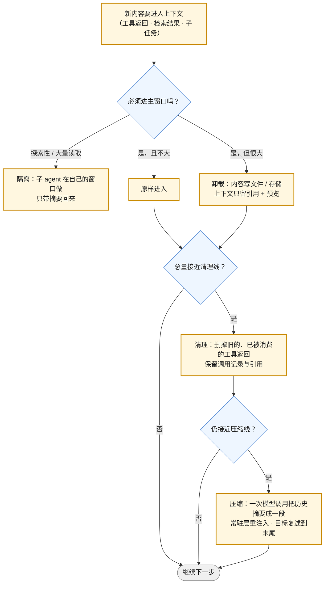

第一篇算过：一个 agent 会话的上下文按每步几千 token 增长，50 步就能填满 200K 窗口，原始目标漂到窗口中间。这一篇讲怎么办。答案不是一个开关，是一条**代价递增的处理顺序**：先不让无关内容进来（卸载、隔离），再清掉已经没用的（清理），最后才用一次模型调用把历史摘要成一段（压缩）——压缩最贵、最有损，放在最后。

这一篇的材料几乎全部来自公开的生产系统：Claude Code 在窗口约 83.5% 处 auto-compact、预留 33K、压缩后 CLAUDE.md 从磁盘重注入而按路径的规则丢失；Codex 先试"会话记忆压缩"不调模型、不够才调服务端的 `/responses/compact` 拿回一个加密 blob，触发点在轮前与循环边界两处；LangChain Deep Agents 的两个阈值——工具返回超过 20,000 token 就写文件留 10 行预览、上下文过 85% 就把旧的写入调用截成指针；Anthropic API 把 compaction（默认 150K 触发）、context editing、memory tool 做成三个一等功能；Manus 的"文件系统即上下文"与 todo.md 复述；DeepSeek Harness 的 SDK 把压缩策略做成显式配置的"语义检查点"。把它们放在一张表上，能看出一个共同的结构。

本篇要回答的核心问题是：

> **怎样给上下文的每一层定配额，超了先做什么、再做什么？[^q0] 五个公开系统的卸载、清理、压缩各在什么阈值触发、保留什么？[^q1] 压缩会丢什么，怎么评测它丢了什么？[^q2]**

## 一、总览

### 1. 处理顺序

四种手段的代价与损失：

| 手段 | 代价 | 损失 | 可恢复？ |
|---|---|---|---|
| 隔离（子 agent） | 一次额外的 agent 运行；摘要的质量 | 主窗口看不到过程细节 | 子 agent 的完整轨迹在 trace 里 |
| 卸载（外置） | 存储；模型要多一步"读回来" | 无（内容完整保留在外） | **是**——留了路径 / URL |
| 清理（删旧返回） | 几乎无 | 被删内容不可再见（除非也卸载了） | 若来源可再取（文件、URL）则是 |
| 压缩（摘要） | **一次模型调用**（几万 token 输入）；缓存前缀全部失效 | **有损**：摘要没写的都没了 | 否 |

顺序由这张表决定：免费且无损的在前，贵且有损的在后。

### 2. 本文的章节安排

第二章预算表；第三章隔离与卸载；第四章清理；第五章压缩——机制、五个系统的对照、压缩后什么存活；第六章复述与目标漂移；第七章怎么评测压缩；第八章实践建议。

## 二、预算表

### 1. 三档参考

以 200K 窗口为例，按第一篇的七层给三类任务的参考配额（比例，可按窗口缩放）：

| 层 | 单轮问答 / RAG | 多轮对话助手 | 长程 agent |
|---|---|---|---|
| ① 系统指令 | 2–4% | 2–4% | 3–5% |
| ② 工具与技能定义 | 0–2% | 2–5% | 5–8%（渐进披露后） |
| ③ 长期记忆 | 0–1% | 3–5% | 3–5%（Claude Code 上限 25 KB ≈ 6K token） |
| ④ 对话历史 | 0 | 30–40% | 30–40%（含思考块） |
| ⑤ 检索结果 | 30–50% | 10–15% | 5–10% |
| ⑥ 工具返回 | 0 | 5–10% | **20–30%**（最大、最该管） |
| ⑦ 当前输入 | 1–5% | 1–5% | 1% |
| 预留给输出（含思考） | 10–15% | 15% | **15–20%** |

最后一行是最常被忘的：Claude Code 预留约 33K（16.5%），因为压缩摘要本身要用模型生成、模型回答也要空间；推理模型的思考 token 也算输出（L1 第三篇）。**触发线 = 窗口 − 预留**，Claude Code 的 83.5% 就是 100% − 16.5%。

### 2. 三条线

为整体设三条线，从低到高：

- **清理线**（如 70%）：开始删旧的工具返回；
- **压缩线**（如 83.5%）：触发摘要；
- **硬线**（窗口 − 输出预留）：拒绝再加内容，否则请求会 400。

线之间要有距离：从清理到压缩之间应能再走几步，否则每步都在压缩。Deep Agents 的 85% 是清理 / 截断线，摘要在其后；Claude Code 的 83.5% 是压缩线，在它之前有对旧工具返回的"微压缩"。

## 三、隔离与卸载

### 1. 隔离：子 agent

最有效的预算手段，因为噪声**从未进入**主窗口。Claude Code 的时间线里，一个研究性子任务由子 agent 在自己的窗口读几十个文件，主窗口只收到一段摘要与一小段元数据。适用：探索性搜索（"找出所有调用这个函数的地方"）、大文档阅读、并行的独立子任务。代价：子 agent 的摘要质量决定主窗口拿到什么——摘要指令要明确（"返回文件路径列表与每处的一句话说明，不要贴代码"）；以及子 agent 自己也要预算。L4 讲子 agent 作为运行时机制，这里只讲它作为上下文隔离的那一面。

### 2. 卸载：可恢复的压缩

Manus 把它叫"文件系统即上下文"：上下文窗口是有限的，文件系统是无限的、持久的、模型可以自己读写的。原则是**压缩必须可恢复**——删掉网页的正文但保留 URL，删掉文件的内容但保留路径，模型需要时再读回来。Deep Agents 给了具体阈值：**工具返回超过 20,000 token → 写入文件系统，上下文里替换为文件路径加前 10 行预览**。10 行预览让模型知道里面是什么，路径让它能取回全部。

卸载的对象是第一篇的 ⑥（工具返回）与部分 ⑤（检索结果）。实现上要注意：卸载后模型多了一步"决定要不要读回来"，这一步的判断质量依赖预览的信息量；预览应包括结构性信息（行数、字段名、大小），不只是前几行。

### 3. 常驻层的渐进披露

对 ②（工具与技能）的"卸载"是设计时的：完整 schema 与技能正文不常驻，常驻的只有一行描述，用到时再加载（tool search、SKILL.md 的 description / 正文分离）。这是把第一篇的原则用在发布时而不是运行时。

## 四、清理

### 1. 清什么

工具返回的时效很短：模型读了一次文件、做了一个决定，之后这段内容对后续步骤价值急降。清理就是删掉这些**已被消费的**工具返回，保留工具调用的记录（模型仍能看到"我在第 7 步读过 foo.py"）与卸载时留下的引用。

### 2. 三个实现

- **Anthropic API 的 context editing**：请求里声明策略（如 `clear_tool_uses`），服务端在上下文超过触发阈值时自动清掉最旧的工具返回，可配保留最近几个、保留哪些工具的；清理后的 usage 反映在响应里。Anthropic 的 cookbook 里一个研究 agent 的例子：335K token 的上下文里 96% 是文件读取结果——清理对这种负载几乎是免费的十倍压缩。
- **Deep Agents 的截断**：上下文过 85% 时，旧的 write / edit 工具调用（其内容已在磁盘上）被截成指针——因为文件本身就是"可恢复"的存储。
- **Claude Code 的微压缩**：在大压缩之前对旧的工具返回做局部清理（第三方分析称之为 micro-compact / snip），把大压缩推后。

### 3. 清理与缓存

清理修改了历史中间的内容——缓存前缀从清理处起失效（第五篇）。所以清理不该每步做，应**批量做**（到清理线一次清一批），让前缀在两次清理之间稳定。服务端实现（Anthropic 的 context editing）在这一点上有优势：清理在服务端发生，客户端送的历史不变，供应商可以更聪明地处理缓存。

## 五、压缩

### 1. 机制

压缩（compaction）是用一次模型调用把对话历史摘要成一段结构化文本，替换原历史。它是**有损**的：摘要没写进去的信息就没了。所以压缩的核心不是"什么时候触发"，是**摘要 prompt 要求保留什么**：任务目标、已完成的步骤与结论、未完成的事项、关键的文件路径与 id、用户的偏好与约束、当前的阻塞。Anthropic 的服务端 compaction 允许替换默认的摘要 prompt，文档建议针对自己的负载写——研究 agent 要保留引用，coding agent 要保留改过的文件列表与测试状态。

### 2. 五个系统

| 系统 | 触发 | 第一步 | 第二步 | 摘要形态 | 之后 |
|---|---|---|---|---|---|
| Claude Code | 约 83.5% 窗口（预留 33K；新版本按窗口大小调整预留） | 微压缩旧工具返回 | auto-compact：模型生成结构化摘要 | 可读文本，替换历史 | system prompt 不变；根目录 CLAUDE.md 与自动记忆从磁盘重注入；路径规则、子目录 CLAUDE.md 丢失直到再触发 |
| Codex CLI | 轮前检查 + 长工具链的循环边界 | **会话记忆压缩**：用已结构化的任务状态（改过的文件、决定）替代摘要，多数情况不调模型 | `POST /v1/responses/compact`：服务端返回 `type=compaction` 的加密 item | **不可读**（AES 加密，只有 OpenAI 服务端能解），保留模型的内部状态 | 待处理的用户请求重放进压缩后的窗口 |
| Anthropic API | 可配阈值，默认 150K，最低 50K | context editing（可单独启用） | 服务端 compaction：返回 `compaction` 块 | 可读摘要块，客户端原样送回 | 可替换默认摘要 prompt |
| Deep Agents | 工具返回 > 20K → 卸载；85% → 截断 | 卸载到文件（路径 + 10 行预览） | 截断旧写入为指针 | 只有以上都不够时才摘要 | 文件系统是持久层 |
| Manus | 上下文增长中持续 | 可恢复压缩（留 URL / 路径） | todo.md 复述 | 不以摘要为主 | 保留失败记录不清除 |
| DeepSeek Harness | 由压缩插件配置 | JSONL 会话持久化 | "语义检查点"策略显式组合 | 压缩摘要有独立的 token 上限 | 一切是插件，可替换 |

三个观察。第一，**成熟系统都把压缩放在最后**，前面至少有一步更便宜的（Codex 的会话记忆、Claude Code 的微压缩、Deep Agents 的两级）。第二，**摘要有两种形态**：可读文本（Claude Code、Anthropic API）与不可读的加密状态（Codex）——后者保留了模型自己的"理解"（工具调用的恢复数据、内部状态标记），前者可审计、可替换 prompt、可跨供应商。第三，**常驻层的重注入是压缩的一部分**：Claude Code 把 CLAUDE.md 从磁盘重读，是因为它的真身在文件里——第一篇说的"可恢复"在这里再次出现。

### 3. 压缩后什么存活

以 Claude Code 为例，按第一篇的七层：

| 层 | 压缩后 |
|---|---|
| ① 系统指令 | 不变（不在消息历史里） |
| ② 工具与技能定义 | 不变 |
| ③ 长期记忆 | 根目录 CLAUDE.md、自动记忆：**重注入**；带 `paths:` 的规则、子目录 CLAUDE.md：**丢失**，直到再读匹配文件 |
| ④ 对话历史 | 替换为摘要 |
| ⑤ 检索结果 | 摘要里提到的保留为引用，其余丢失 |
| ⑥ 工具返回 | 丢失；卸载过的保留为路径 |
| ⑦ 当前输入 | Codex 把待处理请求重放；Claude Code 的下一条用户消息在摘要之后 |

给自己的系统写这张表，是压缩设计的验收标准。

### 4. 压缩与推理状态

L1 第三篇讲过：推理模型的思考块跨轮保留，编辑历史中间会让校验失败或丢失推理状态。压缩替换了整段历史，必然丢掉思考块——所以**压缩只能在一个思考链结束处做**（模型给出最终回答之后、下一个用户请求之前），不能在工具循环中间。Codex 的"循环边界"触发点正是这个约束的体现：它等所有工具结果收齐、循环闭合，再压缩，再重放待处理请求。

### 5. 压缩与缓存

压缩后前缀完全变了（历史被摘要替代），缓存全部失效一次，之后以短前缀重新累积（L1 第四篇第五章）。这是压缩的隐藏成本之一：紧接压缩的那一步是全价 prefill 加写入费。压缩频率因此不宜高——它与"压缩线离硬线要有距离"是同一个考虑。

## 六、复述：对抗目标漂移

压缩解决的是"放不下"，另一个问题是"放得下但忘了"：第一篇第四章的漂移——原始目标漂到窗口中间、注意力最差的位置。Manus 的解法是**复述**（recitation）：让 agent 维护一个 `todo.md`，每一步末尾重写它——已完成的打勾、当前在做的标出、剩下的列出。效果是把目标与进度从窗口中间搬到末尾，每一步都在注意力最好的位置。Claude Code 的 todo 工具、Codex 的会话记忆里的任务状态是同一个思路的实现。

复述有两个附带收益：它是压缩摘要的现成材料（任务状态已经结构化了——Codex 的会话记忆压缩正是靠它多数情况不调模型）；它让人在环上时能看到 agent 认为自己在做什么（L7）。

Manus 还有一条相关的经验：**保留失败**。agent 犯错后的错误信息、失败的工具返回不要清掉——它们是模型调整行为的证据，删了模型会重复同样的错。清理策略要区分"已消费的成功返回"（可清）与"失败记录"（保留到任务结束或压缩时写进摘要）。

## 七、怎么评测压缩

压缩是有损的，损了什么要测，不能凭感觉。方法与 L1 第五篇的评测集同源：

1. **探针问题**：为一类任务准备一组"任务进行到中途时应该知道的事"的问题（目标是什么、改过哪些文件、用户说过哪个约束、上一个失败的原因）。
2. **压缩前后各问一遍**：在同一个会话的压缩点之前与之后，分别把探针问题发给模型，比较回答的正确率——差值就是压缩的损失。Anthropic 的 cookbook 把这叫"探测摘要里什么存活了"。
3. **按类别统计**：目标类、状态类、约束类、引用类各自的存活率，告诉你摘要 prompt 该加强哪一类。
4. **端到端**：同一批任务在"不压缩（大窗口）"与"压缩"两种配置下的完成率与成本，压缩带来的完成率下降是否在成本节省能换回的范围内。

一个常见结果：默认摘要 prompt 对"用户的约束"（"不要改测试文件"）存活率最低——它们在对话里只出现一次、不像文件路径那样反复被引用。针对性地在摘要 prompt 里加一条"逐条列出用户提出的约束"，能把这一类的存活率从一半提到九成以上。

## 八、实践建议

1. **写预算表与三条线**：按第二章给你的应用各层定配额，设清理线、压缩线、硬线，把当前各层的实际占比上仪表盘。
2. **先做卸载**：给工具返回设一个阈值（Deep Agents 的 20K 是好起点），超过就写存储留引用与结构化预览；这一项通常把压缩触发点推后三到四倍（第一篇自测 3）。
3. **再做清理**：批量清已消费的成功返回，保留失败记录；用服务端实现（Anthropic 的 context editing）时确认它与你的缓存策略配合。
4. **压缩 prompt 按负载写**：列出你的任务必须存活的五类信息，写进摘要 prompt；在思考链结束处触发；写"压缩后什么存活"的表作为验收。
5. **加复述**：让 agent 维护任务状态文件并每步更新；它同时是压缩的材料。
6. **测**：探针问题压缩前后各问一遍，按类别看存活率；端到端比完成率与成本。

## 九、本文小结

- 处理顺序按代价递增：隔离（子 agent，噪声不进来）→ 卸载（写文件留引用 + 预览，可恢复）→ 清理（删已消费的工具返回，保留失败记录）→ 压缩（一次模型调用，有损，缓存全失效）。
- 预算：七层各有配额，长程 agent 里工具返回 20–30% 是最该管的一层，输出（含思考）预留 15–20%；三条线——清理、压缩、硬线——之间要有距离。触发线 = 窗口 − 预留，Claude Code 的 83.5% = 100% − 33K/200K。
- 五个系统：Claude Code 微压缩 → 83.5% auto-compact，CLAUDE.md 重注入、路径规则丢失；Codex 会话记忆压缩优先、不够才 `/responses/compact` 得加密 blob，轮前与循环边界触发；Anthropic API compaction 默认 150K、可换摘要 prompt，context editing 清工具返回（一个研究 agent 96% 是文件读取）；Deep Agents 20K 卸载、85% 截断；Manus 可恢复压缩 + todo.md 复述 + 保留失败；DeepSeek Harness 压缩策略为插件。
- 压缩只能在思考链结束处做；压缩后缓存全失效一次；摘要 prompt 决定什么存活，"用户约束"最容易丢。
- 复述把目标搬回窗口末尾，同时是压缩的材料；评测压缩用探针问题前后对比，按类别看存活率。

## 十、自测

1. 一个 agent 在 200K 窗口上运行，团队把压缩线设在 95%、输出预留 5K。会出什么问题？

   

   
答案

   两个：压缩摘要本身要模型生成，5K 的预留不够（Claude Code 预留 33K），压缩调用可能被截断或 400；推理模型的思考 token 也算输出，正常回答在 95% 之后几乎没有空间，会频繁 `max_tokens` 截断。压缩线应设在窗口 − 输出预留（含思考与摘要）之下，如 80–85%。详见[第二章](#二预算表)。
   

2. 工具返回 30K token（一份日志）。按处理顺序，该做什么？上下文里应留下什么？

   

   
答案

   卸载：超过 20K 阈值，写到文件 / 存储，上下文里只留路径、大小、行数、字段名与前 10 行预览（结构性预览让模型能判断要不要读回）。若这段日志只服务于当前一步的判断，下一步后可清理；可恢复（路径在）所以清理无损。不要原样进入再靠压缩处理——压缩有损且贵。详见[第三章](#三隔离与卸载)、[第四章](#四清理)。
   

3. 为什么 Codex 在"长工具链的循环边界"触发压缩，而不是在任意一步？

   

   
答案

   推理模型的思考块跨轮保留，压缩替换整段历史会丢掉思考链中间的状态；在循环中间压缩会让模型失去"为什么调用了这些工具"的上下文。等所有工具结果收齐、循环闭合（一个思考链结束）再压缩，损失最小；待处理的用户请求随后重放进压缩后的窗口。详见[第五章](#五压缩)。
   

4. 压缩后模型忘了用户说过"不要改测试文件"。用第七章的方法定位并修复。

   

   
答案

   准备探针问题（"用户提出过哪些约束？"）在压缩前后各问一遍，确认"约束类"存活率低；原因是默认摘要 prompt 不特别保留只出现一次的约束。修复：摘要 prompt 加"逐条列出用户提出的所有约束与偏好"，再测存活率；同时把约束写进复述的任务状态文件，让它每步都在末尾。详见[第六章](#六复述对抗目标漂移)、[第七章](#七怎么评测压缩)。
   

5. Codex 的加密压缩 blob 与 Claude Code 的可读摘要各有什么优劣？对做多供应商 fallback 的应用意味着什么？

   

   
答案

   加密 blob 保留模型自己的内部状态（工具调用恢复数据、状态标记），损失可能更小，但不可读、不可审计、不可替换 prompt，且只有 OpenAI 能解——绑定供应商。可读摘要可审计、可按负载定制 prompt、可跨供应商携带，但只保留摘要写出来的东西。做多供应商 fallback 的应用必须有一份自己可读的会话状态（复述文件、结构化任务状态），不能只依赖某家的服务端压缩。详见[第五章](#五压缩)。
   

## 下一篇

[prompt caching 与上下文的排列](/prompt-caching-and-context-layout.html)

[^q0]: 按七层给配额（长程 agent：系统 3–5%、工具定义 5–8%、记忆 3–5%、历史 30–40%、检索 5–10%、工具返回 20–30%、输入 1%、输出含思考预留 15–20%），设清理线、压缩线、硬线三条线且留距离（触发线 = 窗口 − 预留，Claude Code 83.5% = 100% − 33K/200K）。超了按代价递增处理：隔离（子 agent 在自己的窗口做探索，只带摘要回来）→ 卸载（大返回写文件，留路径 + 结构化预览，可恢复）→ 清理（批量删已消费的成功返回，保留失败记录与调用记录）→ 压缩（一次模型调用把历史摘要成一段，有损，缓存全失效，只在思考链结束处做）。详见[第一章](#一总览)、[第二章](#二预算表)。

[^q1]: Claude Code：微压缩旧工具返回 → 约 83.5% 处 auto-compact（预留 33K），system 不变、根目录 CLAUDE.md 与自动记忆重注入、路径规则与子目录 CLAUDE.md 丢失。Codex：轮前与循环边界两处触发，先用会话记忆的结构化任务状态替代摘要（多数不调模型），不够才调 `POST /v1/responses/compact` 拿回只有 OpenAI 能解的加密 `compaction` item，再重放待处理请求。Anthropic API：context editing 清旧工具返回（研究 agent 335K 里 96% 是文件读取）；服务端 compaction 默认 150K、最低 50K，返回可读 `compaction` 块，可换摘要 prompt。Deep Agents：工具返回 > 20K 写文件留 10 行预览；85% 把旧写入截成指针；最后才摘要。Manus：可恢复压缩（留 URL / 路径）、todo.md 复述、保留失败。DeepSeek Harness：压缩策略为可配置插件，摘要有独立 token 上限。详见[第五章](#五压缩)。

[^q2]: 压缩丢掉摘要没写的一切：历史细节、未卸载的工具返回、检索结果、思考块；常驻层里有磁盘真身的（CLAUDE.md、自动记忆）可重注入，按需加载的（路径规则、子目录 CLAUDE.md）丢失直到再触发；缓存前缀全部失效一次。最容易丢的是只出现一次的"用户约束"。评测：准备探针问题（目标、改过的文件、约束、上一个失败原因），在压缩点前后各问一遍比正确率，按类别统计存活率以定位摘要 prompt 要加强的类；端到端比"不压缩 vs 压缩"的完成率与成本。修复靶向：摘要 prompt 加"逐条列出用户约束"，并把约束写进复述文件。详见[第五章](#五压缩)、[第七章](#七怎么评测压缩)。
