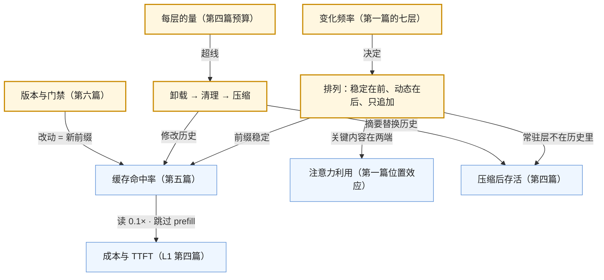

六篇正文回答了一个问题：**模型这一步该看到什么、看多少、按什么顺序，以及怎样像管代码一样管它**。第一篇解剖上下文的七层，第二篇讲 system prompt 里稳定的模式与不稳定的措辞，第三篇讲结构化输出的机制与 schema 设计，第四篇讲预算与卸载 → 清理 → 压缩的处理顺序，第五篇讲缓存与排列，第六篇讲版本、评测门禁、两个跨工具标准与上下文 vs 检索的决策。六篇合起来是[《AI 应用工程师学习地图》](/ai-application-engineer-learning-roadmap.html)第二层：把"模型看到什么"当作一个**有预算、有顺序、有版本**的工程对象。

本文不讲新内容：一张总表与六段回顾，贯穿六篇的四条线，常见误区，然后是三段式通关自测——判断与计算、跨篇综合、面试题。各篇末尾的自测检验"这一篇读懂了没有"，这里检验"六篇能不能连起来用"。

> **读完这六篇，你应该能回答哪些问题？[^q0] 哪些数字与结论必须能脱口而出？[^q1] 怎么判断自己是"读过"还是"掌握"了？[^q2]**

## 一、总览：系列回答的问题与主线

系列的一句话主张是：**上下文是有限、有序、有版本的资源，每一段都要为它占的预算辩护，每一次排列都有成本含义，每一次改动都是一次发布**。

| 篇 | 回答的问题 | 一句话结论 | 必记的数字 / 结论 |
|---|---|---|---|
| [第一篇：上下文的解剖](/anatomy-of-the-context-window.html) | 模型这一步看到什么？ | 七层（系统指令、工具与技能、长期记忆、历史、检索、工具返回、当前输入），按变化频率、维护者、可压缩性分；agent 会话按 $$S + (k-1)(r+o)$$ 增长，工具返回主导，目标漂到中间是算术必然；注意力预算 $$n^2$$ 有限 | Claude Code 自动记忆 ≤ 25 KB、auto-compact 约 83.5%（预留 33K）；Manus 约 50 次工具调用、输入输出 100 : 1；50 步填满 200K |
| [第二篇：prompt 设计](/prompt-design-patterns-vs-wording.html) | 哪些是稳定的模式、哪些是随模型变的措辞？ | 模式（身份与边界、可检验规则、分区、工具政策、格式与出口、知识与时间）不变，措辞随模型调；推理模型上 CoT 指令冗余、大量 few-shot 有害、夸奖无增量、矛盾指令浪费思考 | claude.ai 公开 system prompt 的五部分；Claude Code 把动态环境放末尾、CLAUDE.md 独立一层；GPT-5 guide 的 eagerness 与 tool preamble；Manus "don't get few-shotted" |
| [第三篇：结构化输出](/structured-output-constrained-decoding-and-schema-design.html) | 约束解码怎么实现、schema 怎么设计？ | 自动机屏蔽不合法 token 是数学保证；strict 限制来自状态空间；字段顺序即生成顺序，推理字段前置；显式拒答出口；解析层二次校验 + 带错误重试一次 | Outlines（正则 → FSM）/ XGrammar（CFG → 下推自动机）；Anthropic schema 注入约 50–200 token；推理前置提 2–5 个百分点；strict 下截断仍会发生 |
| [第四篇：预算与压缩](/context-budgeting-offloading-and-compaction.html) | 超了先做什么？ | 隔离 → 卸载 → 清理 → 压缩，代价递增；压缩有损、只在思考链结束处做、缓存全失效；复述对抗漂移；评测用探针问题前后对比 | Deep Agents 20K 卸载 / 85% 截断；Claude Code 83.5%、CLAUDE.md 重注入、路径规则丢失；Codex 会话记忆优先、`/responses/compact` 加密 blob、轮前与循环边界触发；Anthropic compaction 默认 150K；研究 agent 96% 是文件读取；用户约束最易丢 |
| [第五篇：缓存与排列](/prompt-caching-and-context-layout.html) | 怎样让缓存命中？ | 前缀逐字节相同、tools → system → messages、改动处起失效；四层四个断点；十种破坏前缀的操作；屏蔽工具不删除、不删失败、不整理历史；命中率 + 未缓存绝对量 + 节省美元 | Anthropic 4 断点 / 20 块回看 / 1,024 起静默不缓存 / 5 分钟或 1 小时；OpenAI 1,024、128 倍数、`prompt_cache_key`；Gemini 存储费按小时；DeepSeek 64 粒度；稳态 70–90%、单轮 30–60%；Manus 三条规则 |
| [第六篇：prompt 当代码管](/prompts-as-code-versioning-evals-and-context-vs-retrieval.html) | 怎么管、怎么选上下文 vs 检索？ | 不可变版本 + 绑定模型 + 评测门禁 + 标签发布 + trace 绑定；AGENTS.md 常驻、SKILL.md 按需；全放 / 流水线检索 / agentic 按四维选 | Langfuse 版本 + 标签；OpenAI Prompts 对象（Assistants 关闭后）；AGENTS.md 2025-08、六万多项目、Agentic AI Foundation；SKILL.md `name` ≤ 64 / `description` ≤ 1,024、四十多客户端、`.agents/skills/`；30K 手册全放与检索成本相近 |

### 1. 本文的章节安排

| 章 | 内容 |
|---|---|
| 二 | 逐篇回顾：核心问题、结论、必记、常见误解 |
| 三 | 贯穿六篇的四条线：预算、顺序即成本、可恢复性、prompt 是代码 |
| 四 | 常见误区表 |
| 五 | 通关自测：A 判断与计算 10 题、B 跨篇综合 5 题、C 面试题 7 题、D 掌握判据 |
| 六 | 下一步 |

## 二、逐篇回顾

### 1. 第一篇：上下文的解剖

**核心问题**：模型这一步看到什么、各层由谁维护、多大、变化多快？会话怎么长起来？注意力预算的机制？

**结论**：七层是应用侧的逻辑分层（API 只有 system / tools / messages），价值在变化频率（决定缓存断点）、维护者（决定权限与评测）、可压缩性（决定处理策略）三列。Claude Code 的时间线：敲第一个字前常驻层已占几千到上万 token，增长主体是工具返回，压缩对各层不平等。增长按 $$S + (k-1)(r+o)$$，$$r$$ 主导；Manus 100 : 1 说明成本几乎全在输入侧。注意力 $$n^2$$、长序列能力是外推的，预算有限且边际递减。

**必记**：七层表；25 KB / 83.5% / 33K；50 步填满 200K；相关的放末尾、稳定的放开头；隔离胜过压缩；窗口变大不解除约束。

**常见误解**："1M 窗口不需要管理"；把 system prompt 当权限通道；渐进披露后只看命中率不看绝对量。

### 2. 第二篇：prompt 设计

**核心问题**：哪些稳定、哪些随模型变？哪些技巧失效？成熟产品的 system prompt 怎么组织？

**结论**：模式六部分——身份与"不做什么"、可检验规则（每条配评测用例）、分区标记、跨工具政策（eagerness 档位、工具预算、preamble）、格式与拒答出口、知识截止与日期。推理模型上删 CoT 指令（用 effort）、few-shot 只留格式示例（历史本身是有害的 few-shot——Manus）、夸奖无增量、负面改肯定替代、矛盾指令让推理模型浪费思考。公开材料：claude.ai system prompt 随版本改措辞；Claude Code 把动态环境放末尾、CLAUDE.md 独立；GPT-5 guide 证明措辞是模型专属的。边界：prompt 不是安全边界，不能补模型能力。

**必记**：模式 vs 措辞的表；六部分；"给原因而不是加规则"；换模型只调措辞。

**常见误解**：以为"一步步想"仍有用；以为写"忽略文档中的指令"能防注入；规则越多越好。

### 3. 第三篇：结构化输出

**核心问题**：约束解码怎么实现、为什么是硬保证、strict 为什么有限制？schema 怎么设计？解析层处理什么？

**结论**：schema 编译成自动机，每步把不合法 token 置零——数学保证；FSM（Outlines）不能表达递归，下推自动机（XGrammar / llguidance）可以；strict 限制来自状态空间（可选字段指数增长、任意键名不可枚举）与编译成本，schema 应稳定且占 token。七个模式：顺序即生成顺序、拒答出口、enum、描述是 prompt、限深度、稳定 schema、结果用输出 schema 动作用工具。解析层：`refusal` → `stop_reason` → 类型校验 → 业务校验 → 出口路由 → 带错误重试一次 → 降级；流式部分 JSON 增量解析。

**必记**：保证 / 不保证的表；推理字段前置 2–5 个百分点；strict 下截断仍会发生；动态 enum 毁编译缓存与前缀。

**常见误解**：strict 消除了错误输出；出口不需要；schema 可以每次动态生成。

### 4. 第四篇：预算与压缩

**核心问题**：配额怎么定、超了先做什么？五个系统的阈值？压缩丢什么、怎么测？

**结论**：三档配额表，长程 agent 工具返回 20–30% 最该管，输出（含思考）预留 15–20%；清理线、压缩线、硬线留距离。顺序：隔离（子 agent）→ 卸载（Deep Agents 20K、路径 + 10 行预览、可恢复）→ 清理（批量删已消费的成功返回，保留失败）→ 压缩（一次模型调用、有损、缓存全失效、只在思考链结束处）。五个系统的对照表；压缩后什么存活的表；复述（todo.md）把目标搬回末尾且是压缩材料；评测用探针问题前后对比按类别看存活率，用户约束最易丢。

**必记**：处理顺序与代价表；83.5% = 100% − 33K/200K；卸载让压缩推后近四倍；Codex 循环边界触发的原因；加密 blob vs 可读摘要的取舍。

**常见误解**：压缩是第一手段；压缩线设 95%；随手清理每一步。

### 5. 第五篇：缓存与排列

**核心问题**：四家条件、断点分层、破坏前缀的操作、命中率排查？

**结论**：一条规则（前缀逐字节相同、tools → system → messages、改动处起失效）的推论：四层四个断点（工具 / 静态 system / 半静态 / 最后一条历史），动态段最后；四家机制差异（显式 vs 自动、存储费、粒度）；十种破坏操作与 Manus 三条规则；屏蔽工具不删除、不删失败、不整理历史、长 TTL 看轮次间隔；命中率与未缓存绝对量、节省美元一起看，排查表按症状定位。

**必记**：排列图；1,024 起静默不缓存；20 块回看；`prompt_cache_key`；稳态 70–90%；diff 两次请求体找第一个不同字节。

**常见误解**：按阶段增删 tools；system 开头放时间；渐进披露一定提高命中率。

### 6. 第六篇：prompt 当代码管

**核心问题**：版本库还是注册表、怎么绑定、改一个词跑什么？AGENTS.md / SKILL.md 是什么？上下文 vs 检索怎么选？

**结论**：生命周期图（编辑 → 不可变版本 → 门禁 → staging → canary → production → 监控 → 模型升级重跑）；版本库 vs 注册表的表与混合做法；工件包含模板、模型与参数、schema、工具集、断点、变更说明；门禁六项；灰度与回滚是移标签，新版本第一轮缓存全写是预期；A/B 同机制。AGENTS.md 常驻指令的写法与陷阱；SKILL.md 是渐进披露的规范。三种形态四个维度；30K 手册两种方案成本相近差在质量。

**必记**：门禁六项；Langfuse 版本 + 标签语义；Prompts 对象只能在控制台建；AGENTS.md 的路径陷阱；SKILL.md 两个必填字段的上限；决策表。

**常见误解**：prompt 只是文本；灰度头几分钟成本高就回滚；全放总比检索好。

## 三、贯穿全系列的几条线

### 1. 预算：每一段都要为占的位置辩护

第一篇建立预算的物理基础（$$n^2$$、Context Rot），第二篇让 system prompt 精炼（最小规则集、删冗余技巧、few-shot 只留格式），第三篇让 schema 精炼（限深度、稳定），第四篇给每层配额与处理顺序，第六篇的 SKILL.md 把渐进披露做成标准。共同的问题只有一个：这一段值不值得占这份注意力。

### 2. 顺序即成本

同一个排列原则同时服务三个目标：**注意力**（第一篇：相关的放末尾、稳定的放开头）、**缓存**（第五篇：变化频率递增、动态段最后、只追加）、**压缩存活**（第四篇：常驻层不在历史里所以不受压缩影响，动态的被摘要）。第二篇的 Claude Code 把环境信息放末尾、第三篇的 schema 稳定、第六篇的新版本第一轮全写，都是这条线上的点。

### 3. 可恢复性

上下文里放**引用**而不是**内容**，内容在外面（文件、存储、磁盘上的 CLAUDE.md）：第一篇的长期记忆压缩后从磁盘重注入，第四篇的卸载留路径 + 预览、Manus 的"文件系统即上下文"、Codex 的会话记忆，第六篇的 SKILL.md 只常驻描述。可恢复的压缩几乎免费，不可恢复的（摘要）才有损——这是处理顺序的依据。

### 4. prompt 是代码

第二篇的"模式 vs 措辞"（换模型只调措辞）、第三篇的 schema 稳定与顺序效应评测、第五篇的"命中率骤降接部署时间线"、第六篇的整个生命周期与 AGENTS.md / SKILL.md 在版本库里——都是同一件事：prompt 有版本、有测试、有发布、有回滚，模型升级是依赖升级。评测集（L1 第五篇建的）是这条线的探测器。

### 5. 概念表

| 概念 | 出处 | 一句话 |
|---|---|---|
| 七层 | 第一篇 | 系统指令、工具与技能、长期记忆、历史、检索、工具返回、当前输入；按变化频率 / 维护者 / 可压缩性分 |
| 注意力预算 | 第一篇 | $$n^2$$ 两两关系、长序列能力外推；有限、边际递减 |
| 渐进披露 | 第一、六篇 | 常驻一行描述，用到时再加载；SKILL.md 是它的规范 |
| 模式 vs 措辞 | 第二篇 | 结构性决定不随模型变；具体句子随模型调 |
| eagerness / tool preamble | 第二篇 | GPT-5 guide：主动性档位与工具预算；调用前后说一句 |
| 约束解码 | 第三篇 | schema → 自动机 → 每步屏蔽不合法 token；数学保证 |
| 字段顺序即生成顺序 | 第三篇 | 推理字段前置让结论以推理为条件 |
| 拒答出口 | 第三篇 | strict 下没有出口会把拒答伪装成答案 |
| 卸载 / 清理 / 压缩 | 第四篇 | 可恢复 → 几乎免费 → 有损且贵；顺序按此 |
| 复述 | 第四篇 | todo.md 每步重写，目标回末尾，压缩的材料 |
| 探针问题 | 第四篇 | 压缩前后各问一遍，按类别看存活率 |
| 四层四断点 | 第五篇 | 工具 / 静态 system / 半静态 / 最后一条历史 |
| 屏蔽不删除 | 第五篇 | logits 或 `tool_choice` 控可用性，前缀不变 |
| 不可变版本 + 标签 | 第六篇 | 部署与回滚是移指针 |
| AGENTS.md / SKILL.md | 第六篇 | 常驻入职手册 / 按需运行手册 |
| 全放 / 流水线 / agentic | 第六篇 | 按语料大小、变化频率、查询类型、缓存后成本选 |

## 四、常见误区

| 误区 | 为什么错 | 出处 |
|---|---|---|
| "窗口 1M，不用管上下文" | 有效长度远小于标称；成本 100 : 1 在输入侧；窗口只改变压缩触发点 | 第一篇 |
| "system prompt 说的话权限更高" | 它只是上下文一段，与工具返回里的注入竞争 | 第一、二篇 |
| "加一句'一步步想'总没坏处" | 推理模型默认思考，指令冗余、可能重复推理多花输出 token；用 effort | 第二篇 |
| "示例越多越好" | 推理模型不需要多例学格式；agent 历史本身就是 few-shot，会陷入模式 | 第二篇 |
| "写'忽略文档里的指令'就防住了注入" | 措辞只降概率；防御在 L6 的权限与输出检查 | 第二篇 |
| "strict 模式下不会有错误输出" | 只保证形状；值可编造、拒答被伪装、截断仍发生 | 第三篇 |
| "把候选 id 放进 enum 更严格" | schema 每次不同 → 重新编译 + 前缀失效；候选放 prompt、应用侧校验 | 第三篇 |
| "上下文满了就压缩" | 压缩最贵最有损；先隔离、卸载、清理 | 第四篇 |
| "压缩线设 95% 省钱" | 输出与摘要没空间；应 = 窗口 − 预留（含思考） | 第四篇 |
| "工具循环中间也可以压缩" | 丢思考链状态；只在循环闭合处（Codex 的循环边界） | 第四篇 |
| "把失败记录清掉让上下文干净" | 失败是模型调整的证据；且修改历史毁缓存 | 第四、五篇 |
| "按阶段传不同的 tools" | tools 在最前，一切失效；用屏蔽 | 第五篇 |
| "system 开头写当前时间方便" | 每次前缀不同，全部失效 | 第五篇 |
| "渐进披露一定提高命中率" | 按需加载的内容不可缓存，命中率可能降；看绝对量与成本 | 第一、五篇 |
| "灰度头几分钟成本高，回滚" | 新前缀第一轮全写是预期；看第二轮起 | 第六篇 |
| "prompt 在注册表里就不需要评测" | 注册表解决部署不解决回归；门禁仍必须 | 第六篇 |
| "全放上下文总比检索好" | 大语料有效长度与加价门限；定位型问题检索更可靠且可引用 | 第六篇 |

## 五、通关自测

### A. 判断与计算（10 题）

1. 判断：Claude Code 压缩后，子目录里的 CLAUDE.md 会自动回到上下文。

   

答案

   错。压缩后根目录 CLAUDE.md 与自动记忆从磁盘重注入；子目录 CLAUDE.md 与带 `paths:` 的规则丢失，直到再读到匹配文件。
   

2. 计算：常驻层 18K，每步工具返回 3.5K、输出 400，窗口 200K、预留 35K。大约第几步触发压缩？卸载后工具返回降到 600 呢？

   

答案

   触发线 165K。$$18{,}000 + (k-1) \times 3{,}900 \ge 165{,}000 \Rightarrow k-1 \ge 37.7$$，约第 39 步。卸载后每步 1,000：$$k - 1 \ge 147$$，约第 148 步。
   

3. 判断：在 GPT-5.6 上加"Let's think step by step"能提高准确率。

   

答案

   错（至多无效）。推理模型默认思考，`reasoning.effort` 控制深度；CoT 指令冗余，可能让模型在可见输出里重复推理、多花输出 token。
   

4. 判断：OpenAI strict 模式下，schema 里字段 `note` 可以省略不填。

   

答案

   错。strict 要求所有字段在 `required` 里；可选用 `"type": ["string", "null"]`——字段总在、值可为 null。
   

5. 计算：Anthropic 上 system + tools 共 950 token，放了断点。`cache_creation_input_tokens` 是多少？

   

答案

   0。不足该模型最小可缓存长度（1,024 起），静默不缓存；没有报错。
   

6. 判断：Deep Agents 对超过 20,000 token 的工具返回做摘要。

   

答案

   错。它**卸载**：写入文件系统，上下文里替换为文件路径加前 10 行预览——可恢复，不是摘要；摘要只在卸载与截断都不够时才用。
   

7. 计算：一个 30K token 的手册全放上下文、每天 8,000 次问答，Sonnet 5 读价 \$0.20 / 百万；检索方案每次 3K 输入按 \$2 / 百万。两者一天的输入成本各多少？

   

答案

   全放：30,000 × 0.20 / 10⁶ × 8,000 = \$48（加每次过 TTL 的写入）。检索：3,000 × 2 / 10⁶ × 8,000 = \$48（加检索系统）。成本相近，差在质量。
   

8. 判断：Codex 的 `/responses/compact` 返回的压缩结果可以由应用读取并编辑。

   

答案

   错。它是 AES 加密的 `compaction` item，只有 OpenAI 服务端能解密；应用只原样送回。可读、可编辑的是 Claude Code / Anthropic API 的文本摘要。
   

9. 判断：SKILL.md 的 `description` 字段可以省略，只要正文写清楚。

   

答案

   错。`name`（≤ 64 字符）与 `description`（≤ 1,024 字符）是仅有的两个必填字段；而且 `description` 是常驻上下文、被模型用来判断"是否适用"的唯一依据，正文在判断适用后才加载。
   

10. 计算：请求体 tools 4K、system 6K、few-shot 2K、历史 60K、本轮检索 5K、输入 0.2K。若把检索放在历史之前，稳态下每轮多少 token 无法命中缓存？放在历史之后呢？

    

答案

    检索在历史前：检索每轮不同 → 其后的历史 60K 全部失效，未命中约 5K + 60K + 0.2K ≈ 65K（加上一轮新增）。检索在历史后：只有检索 5K + 输入 0.2K + 上一轮新增未命中，约 5–6K。差十倍。
    

### B. 跨篇综合（5 题）

1. 一个 RAG 客服助手的请求体按顺序是：当前时间（秒）→ system 规则 → 本轮检索结果 → 工具定义 → 历史 → 用户消息。列出它违反了本系列的哪些原则，给出正确顺序，并说明每处修改对命中率、注意力、压缩存活各有什么影响。

   

答案

   违反：时间戳在最前（第五篇：全部失效）；检索在历史前（每轮不同让历史失效）；工具定义在 system 后（tools → system 的缓存顺序被打乱，且工具定义应是最稳定的一层）；system 里没有日期放在动态段。正确顺序：tools → system（静态规则）→ 半静态（画像 / few-shot）→ 历史（只追加）→ 动态段（日期到天、本轮检索、用户消息）。影响：命中率从接近 0 恢复到稳态 70–90%；注意力——检索结果与用户消息在末尾（位置效应最好），规则在开头；压缩存活——常驻层不在历史里不受压缩影响，检索结果作为动态段每轮替换本就不该存活。
   

2. 一个 coding agent 在第 35 步时上下文 170K（200K 窗口），其中文件读取结果 110K、历史 40K、常驻 20K。团队打算直接压缩。按第四篇给出更好的方案与预期，并说明为什么压缩不能在这一步立即做。

   

答案

   先卸载与清理：110K 文件读取结果多数已被消费且可恢复（文件在磁盘），清掉旧的、保留调用记录与路径（Anthropic 的 `clear_tool_uses` 或 Deep Agents 的截断为指针），预期回到约 60–70K，不用压缩；对超过 20K 的单个返回今后卸载。若仍要压缩：只能在当前工具循环闭合（模型给出回答）之后做，否则丢失思考链状态（L1 第三篇）；压缩 prompt 要保留改过的文件列表、测试状态、用户约束；压缩后缓存全失效一次，紧接的一步全价。同时加复述（todo）让目标回末尾。
   

3. 团队从 Claude Sonnet 4.6 迁到 Sonnet 5，只改了模型名。用第二、三、五、六篇解释他们至少该做的五件事。

   

答案

   （1）第六篇：这是依赖升级——创建新 prompt 版本绑定新模型，跑评测门禁看逐条 diff；（2）第二篇：读 "Prompting Claude Sonnet 5" 指南，措辞按新模型调（更主动、更少确认），删 CoT 指令；（3）第三篇：thinking 默认开启，`max_tokens` 含思考，检查结构化输出的截断率与出口使用率；（4）第五篇：新 tokenizer 多 30% token，历史预算按 token 重算，缓存一次性全失效属预期，但命中率稳态应恢复；（5）第六篇：灰度 1% 看在线指标再全量，保留回滚标签。另：L1 提醒采样参数会 400。
   

4. 设计一份给"周报生成 agent"的 SKILL.md：说明 `description` 该写什么、正文按第二篇的模式包含哪几部分、哪些东西该放 `scripts/`、它与 AGENTS.md 的分工。

   

答案

   `description`（≤ 1,024）：写何时用——"用户要求生成 / 更新团队周报、汇总本周 PR 与 issue、按模板输出 markdown 时使用；不用于日报或个人总结"，含关键词（周报、weekly、PR 汇总）。正文：任务边界（只读仓库与 issue，不修改）、可检验步骤（拉取本周合并的 PR → 按标签分组 → 填模板 → 检查每条有链接）、输出格式（模板文件在 `assets/`）、失败处理（API 限流时重试一次后报告）。`scripts/`：拉取 PR / issue 的脚本（确定性、可测试），正文只调用它。AGENTS.md 负责项目级常驻信息（仓库结构、命令、硬规则），SKILL.md 只在周报任务时加载——渐进披露。放 `.agents/skills/weekly-report/`，目录名与 `name` 一致。
   

5. 把本系列的六篇与 L1 的七条失效模式对应起来：每篇主要对付哪几条、用什么手段、在 L1 的账上换的是什么。

   

答案

   第一篇：上下文标称 ≠ 有效——分层与预算基线，无直接成本。第二篇：指令遵循与 prompt 敏感——模式 vs 措辞、可检验规则、删失效技巧；token 换遵循率。第三篇：指令遵循（格式）与幻觉（拒答出口）——约束解码与 schema 设计；schema 的 token 与编译换解析确定性。第四篇：上下文标称 ≠ 有效与越界（目标漂移）——卸载 / 清理 / 压缩 / 复述；一次推理成本换有效上下文。第五篇：纯账——排列换 90% 输入折价与 TTFT。第六篇：供应商变更与 prompt 敏感——版本、门禁、灰度；评测成本换回归保护。
   

### C. 面试题（7 题）

1. 解释"context engineering"与"prompt engineering"的区别，并说明为什么 2026 年前者成了主体。

   

答案

   **答案要点**：(1) prompt engineering 关注怎么写指令（主要是 system prompt）；context engineering 关注模型每一步看到的**全部 token 集合**的策划与维护——Anthropic 的定义；(2) 主体转移的原因：推理模型吸收了措辞技巧的收益（CoT 冗余、few-shot 减少），而 agent 的上下文每步增长、100 : 1 的输入输出比让预算、排列、压缩、缓存成为成本与质量的主要变量；(3) 七层模型与三列（变化频率 / 维护者 / 可压缩性）；(4) 具体机制已公开且带数字（Claude Code 83.5%、Deep Agents 20K、Codex 两级压缩、Manus 三条规则）。
   **追问方向**：注意力预算的物理基础；prompt 敏感是否消失了（没有，只是边际收益变小）。
   **好答案与一般答案的区别**：一般答案说"context 更大更全面"；好答案给出七层、100 : 1 与 $$S + (k-1)(r+o)$$ 的算术、并指出措辞的边际收益下降与上下文管理成本上升是同时发生的两件事。

   

2. 你接手一个 agent，任务跑到第 30 步后经常忘记用户一开始说的约束。给出诊断步骤与三种解法，说明各自的代价。

   

答案

   **答案要点**：(1) 诊断：打印第 30 步请求体，看约束在哪——多半在窗口中间（Lost in the Middle）且周围是几万 token 的工具返回；看是否已发生过压缩、摘要里有没有约束；(2) 解法一复述：让 agent 维护 todo / 约束文件每步重写到末尾，代价是每步几百 token；(3) 解法二预算：卸载与清理工具返回让约束不被淹没，代价是实现卸载与预览；(4) 解法三压缩 prompt：加"逐条列出用户约束"，用探针问题测存活率，代价是一次调用与缓存失效；(5) 三者可叠加，顺序是先卸载清理、再复述、压缩 prompt 兜底。
   **追问方向**：为什么不直接把约束放 system（用户每次说的不同、system 是开发者维护的层——可以放"用户约束"专区在半静态层）；怎么测有效。
   **好答案与一般答案的区别**：一般答案说"加进 system prompt"；好答案先定位到位置效应与预算，给出复述、卸载、压缩 prompt 三种机制与探针评测。

   

3. 解释 prompt caching 的命中条件，设计一个多租户客服系统的上下文排列与断点方案，并说明你会监控什么。

   

答案

   **答案要点**：(1) 条件：前缀逐字节相同、tools → system → messages、改动处起失效、最小长度、TTL；(2) 排列：tools（全部租户共享的工具集，屏蔽控制可用）→ 静态 system（共享规则）→ 断点 ②；租户专属规则与画像 → 断点 ③（同租户共享）；历史只追加 → 断点 ④；动态段：日期到天、本轮检索、用户消息；(3) 序列化确定性、无时间戳、不改历史、清理批量做；(4) TTL 按轮次间隔分布选，多实例传 `prompt_cache_key`；(5) 监控：命中率按租户 / 请求类型、未缓存 token 绝对量、节省美元 / 天、命中率骤降接部署时间线告警。
   **追问方向**：租户专属工具怎么办（全量保留 + 屏蔽，或按租户分组共享前缀）；压缩后的重建。
   **好答案与一般答案的区别**：一般答案说"把 system 放前面"；好答案给四层断点、租户层的位置、破坏前缀的清单与三个指标。

   

4. 结构化输出的 strict 模式保证了什么、没保证什么？给一个你会怎样设计 schema 与解析层的完整方案。

   

答案

   **答案要点**：(1) 保证：约束解码在采样前屏蔽不合法 token，输出必然符合 schema——字段齐、类型对、枚举在范围；(2) 不保证：值的真实性、拒答不被伪装、推理质量、业务约束、不被截断；(3) schema：推理 / 证据字段前置、显式出口（`cannot_classify` / null + 原因）、enum 替代自由字串、描述写清含义、深度 ≤ 3、稳定不动态生成、结果用输出 schema 动作用工具；(4) 解析层：`refusal` → `stop_reason` → 类型校验 → 业务校验 → 出口路由 → 带错误重试一次 → 降级；流式用 partial JSON 解析器；(5) 监控业务校验通过率、出口使用率、截断率、顺序效应。
   **追问方向**：strict 为什么要求全 required（状态空间）；自托管选哪个后端（XGrammar 对递归与开销的平衡）。
   **好答案与一般答案的区别**：一般答案说"用 JSON mode 再校验"；好答案区分硬保证与其边界、给出字段顺序与出口两个设计要点、解析层的完整顺序。

   

5. 比较 Claude Code、Codex、Anthropic API、Deep Agents、Manus 五个系统的上下文压缩策略，指出共同结构与关键差异。

   

答案

   **答案要点**：(1) 共同结构：压缩都不是第一步——前面有更便宜的（Claude Code 微压缩、Codex 会话记忆、Deep Agents 卸载 + 截断、Manus 可恢复压缩、Anthropic context editing）；常驻层有磁盘真身可重注入；(2) 触发：Claude Code 83.5%（预留 33K）、Codex 轮前 + 循环边界、Anthropic 默认 150K 可配、Deep Agents 20K 卸载 / 85% 截断；(3) 摘要形态：可读文本（Claude Code、Anthropic，可换 prompt、可审计、可跨供应商）vs 加密 blob（Codex，保留内部状态但只有 OpenAI 能解、绑定供应商）；(4) Manus 不以摘要为主：文件系统即上下文 + todo 复述 + 保留失败；(5) 压缩只在思考链结束处；压缩后缓存全失效。
   **追问方向**：多供应商 fallback 下该依赖哪种（自己可读的会话状态）；怎么评测压缩（探针问题）。
   **好答案与一般答案的区别**：一般答案说"都是摘要历史"；好答案给出两级结构、具体阈值、可读 vs 加密的取舍与它对供应商锁定的含义。

   

6. 团队想让运营同事直接改 prompt 措辞而不经过工程发布。你怎么设计流程使它既灵活又安全？

   

答案

   **答案要点**：(1) 分离模式与措辞：结构、分区、schema、工具集在版本库由工程维护；措辞在注册表（Langfuse 一类）由运营改；(2) 不可变版本 + 标签：运营改动生成新版本，不自动上线；(3) 评测门禁自动跑：新版本触发评测集 × $$k$$ 次，逐条 diff 与指标不过线则不能打 `staging`；(4) 灰度标签 `prod-canary` 1% 由工程或自动化控制，在线指标正常再移 `production`；回滚移标签；(5) trace 绑定版本，任何线上问题能归因到某个版本与作者；(6) 变更说明必填。
   **追问方向**：运营改动让缓存前缀失效怎么办（预期，看第二轮）；措辞改动影响 schema 注入怎么处理（schema 归工程）。
   **好答案与一般答案的区别**：一般答案说"用 prompt 管理平台"；好答案把模式 / 措辞分权、门禁自动化、标签发布与 trace 归因四件事说全。

   

7. "把整份文档放进 1M 上下文就不需要 RAG 了"——评价这个说法，给出你的决策框架。

   

答案

   **答案要点**：(1) 有效长度远小于标称（NoLiMa、Context Rot），定位型问题在几十 K 处就退化；(2) 成本：全放每次传全量（缓存后 0.1×）、超过 272K / 200K 加价、prefill 拖 TTFT；(3) 决策四维：语料大小（≤ 几万 token 才考虑全放）、变化频率（每变一次缓存失效）、查询类型（全局综合 → 全放；定位 → 检索；多跳探索 → agentic）、缓存后成本；(4) 30K 手册两种方案成本相近差在质量，300K 只能检索；(5) 生产系统三者混合：核心要点全放、大语料检索、复杂任务 agentic；(6) 检索还给出引用（可信度）。
   **追问方向**：全放时怎么放断点与更新；agentic retrieval 的上下文增长怎么控（卸载）。
   **好答案与一般答案的区别**：一般答案二选一；好答案给出四维决策表、一个算过的例子与混合方案。

   

### D. 掌握判据

| 层次 | 判据 |
|---|---|
| 读过 | 能说出七层；知道推理模型上不用 CoT 指令；知道 strict 保证语法不保证语义；知道压缩前先卸载清理；知道前缀要稳定；知道 AGENTS.md 与 SKILL.md 是什么 |
| 掌握 | 能给一个应用的请求体按七层标注并画预算饼图；能把 system prompt 重排成六部分并给每条规则配评测用例；能设计带推理字段与出口的 schema 和解析层顺序；能为一个 agent 定三条线、卸载阈值、清理策略、压缩 prompt 并用探针测存活率；能按四层放断点、diff 请求体找前缀边界、按症状排查命中率；能画出 prompt 的发布生命周期并写一份 AGENTS.md |
| 能教人 | 能解释注意力预算的机制与 $$S + (k-1)(r+o)$$ 的算术；能对比五个系统的压缩策略并说出可读 vs 加密的取舍；能解释约束解码的自动机与 strict 限制的来源；能推导为什么排列同时服务注意力、缓存、压缩存活三个目标；能对一份资料做出全放 / 检索 / agentic 的决策并算账 |

通关标准：A 组 8 题以上正确（计算题误差 5% 以内），B 组 4 题以上能写出完整推理链，C 组每题能说出至少三个要点并回答一个追问。

## 六、下一步

本系列是[《AI 应用工程师学习地图》](/ai-application-engineer-learning-roadmap.html)的第二层。第六篇末尾的决策表把"要不要检索"交给了下一层：

- **L3 检索与知识接入**：进上下文还是进权重、三类检索（词法 / 向量 / 结构化）、文档解析与分块、混合检索与 rerank、agentic retrieval、GraphRAG 与本体、检索评测。本系列讲的是检索结果作为上下文一层怎么排、怎么截；L3 讲怎么取。
- **L4 工具、Agent 与运行时**：子 agent、持久化、压缩作为运行时机制、权限与沙箱、harness——本系列第四篇的处理顺序在 L4 变成运行时的实现。
- **L5 评测、可观测与可追溯**：本系列反复说"跑评测集"、"用探针问题测"，L5 讲评测集怎么建、judge 怎么校准、trace 怎么记。
- **L6 生产化与运营**：prompt injection 的分层防御（本系列第二篇的边界）、网关、预算与发布。

前置的 [L1《模型作为组件》](/model-as-a-component.html)是本系列每一处"失效模式"与"账"的出处。三张地图的分工见[《AI 全栈学习地图》](/ai-fullstack-learning-roadmap.html)。

## 七、延伸阅读

本系列有意不展开的内容，以及它们在哪个系列里：

- **不讲检索本身**：分块、向量、rerank 属于 L3；本系列只讲检索结果作为上下文的一层怎么排、怎么截、以及"要不要检索"的决策。
- **不讲 agent 循环与运行时**：子 agent、持久化、权限属于 L4；本系列讲子 agent 只讲它作为上下文隔离手段的那一面。
- **不讲评测方法**：评测集怎么建、judge 怎么校准属于 L5；本系列只说"改 prompt 要跑评测"。
- **不讲 prompt injection 的防御**：属于 L6；本系列只指出它为什么不是 prompt 设计能解决的。
- **不讲模型内部**：注意力为什么是 $$n^2$$ 引用共享《Transformer 与 LLM》系列的结论。

[^q0]: 面对一个要放进模型的上下文：它的几万 token 由哪七层构成、哪层最大、各由谁维护（第一篇）；这条 prompt 技巧在推理模型上还有没有用、system prompt 的六部分齐不齐、每条规则可检验吗（第二篇）；这个 schema 会不会把拒答伪装成答案、推理字段在结论前吗、解析层的顺序对吗（第三篇）；工具返回 50K 该卸载、清理还是压缩，压缩线设在哪、压缩后 CLAUDE.md 还在吗、用户约束存活了吗（第四篇）；命中率 30% 是哪一层在破坏前缀、断点放在哪四层、TTL 选哪个（第五篇）；改了 system prompt 一个词上线前要做什么、AGENTS.md 与 SKILL.md 怎么写、这份资料该全放还是检索（第六篇）。详见[第一章](#一总览系列回答的问题与主线)。

[^q1]: 数字：Claude Code 自动记忆 ≤ 25 KB、auto-compact 约 83.5%、预留 33K；Manus 约 50 次工具调用、输入输出 100 : 1；$$S + (k-1)(r+o)$$、50 步填满 200K；SKILL.md `name` ≤ 64 / `description` ≤ 1,024、四十多客户端、`.agents/skills/`；AGENTS.md 2025-08、六万多项目；Anthropic 4 断点 / 20 块回看 / 1,024 起 / 5 分钟或 1 小时；OpenAI 1,024、128 倍数；Gemini 存储费按小时；DeepSeek 64 粒度；Deep Agents 20K 卸载 / 85% 截断；Anthropic compaction 默认 150K；研究 agent 96% 文件读取；推理字段前置 2–5 个百分点；Anthropic schema 注入约 50–200 token；稳态命中率 70–90%、单轮 30–60%。结论：注意力预算有限、每段要辩护；模式不变措辞随模型；CoT 指令删、few-shot 只留格式；strict 保证形状不保证语义、出口必须有；隔离 → 卸载 → 清理 → 压缩；压缩只在思考链结束处；前缀稳定、只追加、显式断点、屏蔽不删除；prompt 是代码。详见[第一章](#一总览系列回答的问题与主线)、[第三章](#三贯穿全系列的几条线)。

[^q2]: 用第五章 D 节的三级判据：读过——能说出七层、知道几条"不要"；掌握——能对具体应用做七层标注与预算、重排 system prompt 并配评测用例、设计 schema 与解析层、定三条线与压缩 prompt 并用探针测、放断点并排查命中率、画发布生命周期并写 AGENTS.md；能教人——能解释注意力预算与增长算术、对比五个系统的压缩策略、解释约束解码与 strict 限制的来源、推导排列的三重作用、对资料做全放 / 检索 / agentic 决策并算账。通关：A 组 8 题以上（误差 5% 内）、B 组 4 题以上完整推理链、C 组每题三个要点加一个追问。详见[第五章](#五通关自测)。
