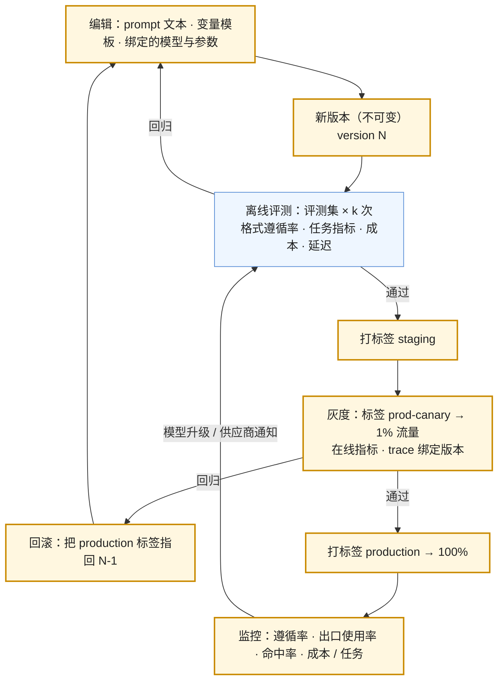

前五篇讲了上下文的每一层怎么写、怎么约束、怎么压、怎么排。这一篇讲怎么**管**：prompt 改一个词就是一次发布——它改变模型的行为，可能让评测集里三条用例由对变错，可能让缓存前缀全部失效；模型升级是一次依赖升级——同样的 prompt 在新模型上遵循率不同（第二篇）。把 prompt 当文案管的团队会在某个周五下午改一句话直接上线，周一从用户投诉里发现回归。把 prompt 当代码管的团队有版本、有测试、有灰度、有回滚。

本篇有三部分。**工件与流程**：prompt 放版本库还是注册表，怎么与模型版本绑定，改动要跑什么、怎么灰度、怎么回滚，A/B 怎么做。**两个跨工具的 prompt 标准**：AGENTS.md（2025 年 8 月发布的开放格式，六万多个开源项目采用，Linux 基金会下的 Agentic AI Foundation 管理）与 SKILL.md（Anthropic 2025 年 12 月开放的 Agent Skills 标准，四十多个客户端支持）——它们是"prompt 当代码管"在 coding agent 领域已经发生的事实。**上下文 vs 检索的决策**：小而稳定的资料全放进上下文配缓存、大语料走检索、复杂任务让 agent 自己查——按四个维度选，把话题交给 L3。

本篇要回答的核心问题是：

> **prompt 放版本库还是注册表，怎么与模型版本绑定，改一个词要跑什么？[^q0] AGENTS.md 与 SKILL.md 是什么、怎么写、有什么陷阱？[^q1] 什么时候全放上下文、什么时候检索、什么时候让 agent 自己查？[^q2]**

## 一、总览

### 1. prompt 的生命周期

这张图与任何软件的发布流程同构，只有两处不同：**评测门禁是对分布的**（每条用例跑 $$k$$ 次，L1 第一篇的非确定性），**模型升级会从右侧重新触发整个流程**（依赖变了，测试要重跑）。

### 2. 本文的章节安排

第二章工件：版本库 vs 注册表；第三章流程：绑定、门禁、灰度、回滚、A/B；第四章 AGENTS.md；第五章 SKILL.md；第六章上下文 vs 检索的决策；第七章实践建议。

## 二、工件：版本库还是注册表

### 1. 两种做法

| | 放版本库（与代码同仓） | 放注册表（Langfuse 一类、OpenAI Prompts 对象） |
|---|---|---|
| 版本 | git 提交 | 不可变的版本号（1、2、3…） |
| 发布 | 随代码部署 | 移动标签（`production` / `staging`），**不用重新部署** |
| 审查 | 代码审查、diff 可见 | UI 里对比版本 |
| 谁能改 | 有仓库权限的工程师 | 可以给产品 / 运营开权限 |
| 与模型绑定 | 配置文件里写死 | 版本对象里带 `config`（模型、参数） |
| 与 trace 的关联 | 要自己记提交哈希 | SDK 自动把版本绑到 generation |
| 风险 | 改 prompt 要走完整部署 | 绕过代码审查改线上行为 |

**Langfuse 的模型**是这一类工具的代表：每次修改生成一个不可变版本，标签是指向版本的可移动指针——`production` 是默认（不指定标签时 SDK 取它）、`latest` 自动指向最新、自定义标签用于环境（`staging`）、租户（`tenant-a`）、实验（`prod-a` / `prod-b`）；"部署"就是把 `production` 标签移到某个版本，"回滚"就是移回去。promptfoo 一类评测工具可以直接引用 `langfuse://prompt-name@production` 跑评测集。

**OpenAI 的 Prompts 对象**是 Assistants API 关闭（2026-08-26）后的替代：Assistants 曾把"指令 + 工具声明 + 模型"打成一个 API 对象；Prompts 保留了这个"配置束"的概念但**只能在控制台创建与版本化**，应用代码用 prompt id（与可选的版本号）引用，Responses 请求传 `prompt: {id, version, variables}`。迁移指南建议把 id 或导出的规格放进源码——这是把注册表与版本库混用的官方写法。

### 2. 混合

多数团队最后是混合：**模板与结构在版本库**（分区、变量、schema——第二篇的"模式"），**措辞与参数在注册表**（可以由非工程师在评测门禁保护下调）。判据是变化频率与谁改：工程师改、随代码变的放仓库；运营调、每周变的放注册表。无论放哪，两条底线：**不可变版本**（能精确指回任何历史状态）与**trace 绑定版本**（每条请求记录它用的 prompt 版本与模型版本，L5）。

### 3. prompt 里有什么

一个版本化的 prompt 工件不只是文本：

- 模板（带变量占位）与分区结构；
- 绑定的模型 id / 快照与参数（effort、`max_tokens`、temperature 若允许）；
- 关联的 schema（第三篇）与工具集版本；
- 缓存断点的位置（第五篇）；
- 变更说明：改了什么、为什么、评测结果。

把这些放在一起版本化，是因为它们**一起决定行为**：同一段文本换 effort 是不同的行为，同一个 schema 换字段顺序是不同的行为。

## 三、流程

### 1. 与模型版本绑定

prompt 版本 N 是在模型 M 上评测通过的；M 变了，N 的评测结果作废。绑定的做法：版本对象里记模型 id（钉快照，L1 第五篇），模型升级时创建新版本 N+1（文本可以不变、绑定变）并重跑门禁。这让"模型升级"在流程里与"改 prompt"是同一件事——都是新版本、都过门禁。供应商的弃用通知（L1 第五篇第八章）触发的正是这条路径。

### 2. 评测门禁

每个新版本在合并 / 打标签前跑评测集（L1 第五篇建的那一个，L5 讲方法）：

| 指标 | 门禁 |
|---|---|
| 任务指标（准确率 / 完成率 / judge 分） | 不低于当前 production 版本减去噪声阈值（每条跑 $$k$$ 次的方差） |
| 格式遵循率 / 出口使用率（第三篇） | 不退化 |
| 每任务成本 | 不高于阈值（或有意为之并记录） |
| TTFT / 总时长 | 不退化 |
| 缓存命中率（第五篇） | 新版本上线后的第二轮起应恢复；第一轮全量写入是预期 |
| 逐条 diff | 列出由对变错的用例（比总分更有信息量） |

promptfoo 一类工具把这一步做成 CI 任务：配置文件里列 prompt 版本、模型、评测用例与断言，`eval` 命令输出矩阵，可以设阈值让 CI 失败。

### 3. 灰度与回滚

标签让灰度与回滚成为指针操作：`prod-canary` 指向新版本、路由 1% 流量；在线指标（采纳率、重试率、投诉、成本）正常再把 `production` 指过去；回归就把 `production` 指回旧版本——秒级，不用部署。灰度期间 trace 里的每条请求带版本，才能分组比较。

一个 prompt 专属的注意：**新版本第一轮的缓存**是全量写入（前缀变了），TTFT 与成本在灰度的头几分钟会高——不要把它误判为回归。

### 4. A/B

与灰度同一套机制，目的不同：两个版本各打标签（`prod-a` / `prod-b`），应用随机分流并把选中的版本绑到 trace，按版本聚合在线指标（Langfuse 文档给的正是这个做法）。A/B 检验的是**在线**效果（真实用户、真实分布），离线评测检验的是**样本**上的效果——两者都要，离线便宜且可重复，在线才是真的。

## 四、AGENTS.md

### 1. 是什么

一个放在仓库根目录的 markdown 文件，给 coding agent 读的"项目说明"：怎么构建与测试、代码风格与硬规则、目录结构、哪些不能碰。2025 年 8 月作为开放格式发布，到 2026 年中被六万多个开源项目采用，2025 年 11 月起由 Linux 基金会下的 Agentic AI Foundation 管理（同一基金会管理 MCP）。它是第一篇七层里 ③ 长期记忆的"项目"部分，也是本篇"prompt 当代码管"最直接的实例——**它就在版本库里、随代码提交、有 diff、有审查**。

### 2. 怎么写

它是一份 system prompt 的延伸，第二篇的规则全部适用：

- **命令优先**：构建、测试、lint、运行的精确命令——agent 最常用的信息；
- **硬规则可检验**："不要修改 `migrations/` 下的文件"、"提交前必须通过 `make check`"；
- **结构性信息**：目录的职责、关键文件的位置、约定（命名、错误处理风格）；
- **不要写模型已经知道的**（语言的通用规范、框架的常识）——占预算无收益；
- **保持精炼**：它每轮都在上下文里；Claude Code 对自动记忆设 25 KB 上限、对 CLAUDE.md 没有硬限但同理；
- **分层**：根目录一份总的，子目录可以有各自的（Claude Code 的嵌套 CLAUDE.md 语义），按需加载。

### 3. 陷阱

- **路径与文件名不统一**：Claude Code 读 `CLAUDE.md`，到 2026 年中仍无原生的 AGENTS.md 自动加载（有 issue 在跟踪）；Codex、Cursor、Gemini CLI、Antigravity（2026-03 起）读 AGENTS.md；Cursor 另有 `.cursor/rules/*.mdc` 带 glob 作用域。跨工具的团队要么维护两份、要么用符号链接 / include。
- **写成文档而不是指令**：AGENTS.md 是给 agent 的运行指令，不是给人的 README；一段"项目背景介绍"对 agent 几乎无用。
- **过期**：命令改了、目录挪了、规则不再适用——它要与代码一起维护，代码审查时顺带看它。
- **压缩后的命运**（第四篇）：根目录的会被重注入，子目录的会丢失直到再读匹配文件；关键规则放根目录。

## 五、SKILL.md

### 1. 是什么

Agent Skills 是 Anthropic 2025 年 10 月发布、12 月 18 日开放为标准的格式（agentskills.io）：一个技能是一个目录，至少含一个 `SKILL.md`，可选 `scripts/`、`references/`、`assets/`。`SKILL.md` 有 YAML 前置元数据加 markdown 正文，必填两个字段：`name`（≤ 64 字符，小写字母数字与连字符，须与目录名一致）与 `description`（≤ 1,024 字符，说明**做什么与什么时候用**）。到 2026 年中官方列出四十多个支持的客户端——Claude Code、Codex、Cursor、VS Code / Copilot、Gemini CLI 等；`.agents/skills/` 成为跨工具的中立目录（各家还读自己的目录：`.claude/skills/`、`~/.gemini/antigravity/skills/`）。

### 2. 为什么它是上下文工程的实例

SKILL.md 把第一篇的**渐进披露**做成了规范：常驻上下文的只有每个技能的 `name` 与 `description`（几十到几百 token），正文与脚本在模型判断"这个技能适用"之后才读进来。所以 `description` 的写法决定一切——它要包含用户会用到的关键词、说明适用与不适用的情形；正文则是一份任务专属的 system prompt（步骤、检查清单、脚本用法）。AGENTS.md 是"每天都要读的入职手册"，SKILL.md 是"需要时从架上取的运行手册"。

### 3. 怎么写

- `description` 写"什么时候用"比"做什么"重要——它是被检索的对象；
- 正文按第二篇的模式写：任务边界、可检验的步骤、输出格式、失败时怎么办；
- 脚本放 `scripts/`、让正文调用它，而不是把代码贴进正文——脚本是确定性的，prompt 不是；
- 版本化：技能目录在仓库里，随代码提交；跨工具共享时放 `.agents/skills/`；
- `allowed-tools`、`context: fork` 一类字段是各客户端的扩展，不在核心规范里，跨工具时不要依赖。

## 六、上下文 vs 检索

### 1. 三种形态

| 形态 | 做法 | 成本结构 | 适合 |
|---|---|---|---|
| 全放上下文 | 把全部资料放进 system / 首条消息，配缓存断点 | 首次写入全量，之后读价 0.1×；每次请求仍传全量 | 小（几万 token 内）、稳定（不常变）、每次都可能用到任何部分 |
| 流水线检索 | query → 检索 top-k → 放进动态段 → 生成 | 检索系统的成本 + 每次几千 token 输入 | 大语料（放不进或放进也用不好）、高并发问答、需要引用 |
| agentic retrieval | 模型自己决定查什么、用哪类检索、查几轮 | 多次模型调用 + 工具调用；上下文随步增长（第四篇） | 复杂任务、问题需要多跳、语料结构化（代码、文件系统） |

### 2. 四个维度

| 维度 | 全放 | 流水线 | agentic |
|---|---|---|---|
| 语料大小 | ≤ 几万 token（在有效长度内且低于加价门限） | 任意 | 任意，但每次读的量要控制（卸载） |
| 变化频率 | 低（变一次缓存失效一次） | 任意（索引增量更新） | 任意 |
| 查询类型 | 需要全局视野（"总结这份合同"） | 定位型（"报销上限是多少"） | 多跳、探索型（"这个 bug 的根因"） |
| 缓存后的成本 | $$0.1 \times$$ 全量 / 请求，稳定 | 几千 token / 请求 | 不定，取决于步数 |

一个数字例子：一份 30K token 的产品手册，每天一万次问答。全放：每次 30K × 0.1× 读价（Sonnet 5：\$0.20 / 百万）= \$0.006，一天 \$60，加每次 5 分钟 TTL 内的写入；流水线检索：每次 3K 输入（\$2 / 百万）= \$0.006，一天 \$60 加检索系统——**成本相近**，差别在质量：全放让模型看到全部（适合需要跨章节综合的问题），检索让模型只看相关的（适合定位型问题，且不受有效长度影响）。手册涨到 300K 时全放不再可行（有效长度、加价门限），检索是唯一选择。

### 3. 混合是常态

生产系统通常三种都用：稀疏而稳定的核心资料全放（政策要点、术语表），大语料检索（文档库），复杂任务让 agent 用检索工具多轮查。L3 系列讲检索本身——三类检索、分块、rerank、agentic retrieval 的设计、检索评测。本篇的贡献只是决策的第一步：**先问这份资料属于哪一种**，再决定要不要建检索。

## 七、实践建议

1. **给 prompt 加版本**：先把 prompt 从代码里的字符串挪到独立文件（版本库）或注册表，每个版本记绑定的模型与参数；trace 里记版本。
2. **接评测门禁**：把 L1 第五篇的评测集接到 CI（promptfoo 或自写脚本），每个 prompt 版本跑一次，输出逐条 diff。
3. **用标签做发布**：`staging` → `prod-canary` → `production`，回滚是移标签。
4. **给项目写 AGENTS.md**：命令、硬规则、结构；跨工具的团队同时提供 CLAUDE.md（符号链接或 include）。
5. **把重复的任务流程写成 SKILL.md**：`description` 写清何时用，脚本进 `scripts/`，放 `.agents/skills/`。
6. **对每份资料做一次三选一**：全放（≤ 几万 token 且稳定）、检索、agentic——写进设计文档，再读 L3。

## 八、本文小结

- prompt 是代码：不可变版本、绑定模型与参数、评测门禁（对分布）、标签发布、灰度、回滚、A/B、trace 绑定版本；模型升级是依赖升级，从门禁重跑。
- 工件放版本库（随代码、可审查）或注册表（Langfuse 的版本 + 标签、OpenAI 的 Prompts 对象——Assistants API 关闭后只能在控制台创建、代码用 id 引用）；多数团队混合：结构在仓库、措辞在注册表。
- AGENTS.md（2025-08 开放格式，六万多项目，Agentic AI Foundation 管理）是项目常驻指令：命令优先、硬规则可检验、精炼、分层；陷阱是文件名不统一（Claude Code 读 CLAUDE.md）、写成文档、过期、压缩后子目录的丢失。
- SKILL.md（Agent Skills，2025-12 开放，`name` ≤ 64、`description` ≤ 1,024，四十多个客户端，`.agents/skills/`）是渐进披露的规范：常驻只有描述，正文按需加载；`description` 写何时用，脚本进 `scripts/`。
- 上下文 vs 检索：全放（小、稳定、需全局视野，配缓存）、流水线检索（大语料、定位型、高并发）、agentic（复杂多跳）；按语料大小、变化频率、查询类型、缓存后成本四维选；30K 手册两种方案成本相近、差在质量，300K 只能检索。

## 九、自测

1. 一个团队把 system prompt 写在代码常量里，改动随代码部署，没有评测。按本文，最少加哪三样东西才能算"当代码管"？

   

   
答案

   （1）不可变版本与绑定：prompt 独立成文件或注册表版本，记绑定的模型快照与参数；（2）评测门禁：每个版本在评测集上跑 $$k$$ 次，输出逐条 diff 与指标对比，作为合并 / 打标签的条件；（3）trace 绑定版本：每条请求记录用的 prompt 版本与模型版本，否则线上问题无法归因、灰度与 A/B 无法分组。详见[第二章](#二工件版本库还是注册表)、[第三章](#三流程)。
   

2. 灰度新 prompt 版本的前十分钟，TTFT 与每请求成本都比旧版本高 30%，任务指标持平。该回滚吗？

   

   
答案

   先不要。新版本的前缀变了，第一轮请求全部是缓存写入（1.25× 且无 prefill 跳过），TTFT 与成本在头几分钟偏高是预期行为；看灰度组第二轮起的命中率是否恢复到旧版本水平。若十分钟后仍高，再查新版本是否引入了动态内容破坏前缀（第五篇）。详见[第三章](#三流程)。
   

3. AGENTS.md 与 SKILL.md 各对应第一篇七层里的哪一层？为什么说 SKILL.md 是渐进披露的规范？

   

   
答案

   AGENTS.md 是 ③ 长期记忆的项目部分——常驻、每轮在上下文里、随项目变；SKILL.md 属于 ② 工具与技能定义——常驻的只有 `name` 与 `description`（≤ 1,024 字符），正文与脚本在模型判断适用后才读进来，这正是"只常驻一行描述、用到时再加载"的渐进披露。详见[第四章](#四agentsmd)、[第五章](#五skillmd)。
   

4. 一份 40K token、每月更新一次的内部制度文档，每天 3,000 次问答，问题多为"X 的标准是多少"。全放还是检索？给理由与账。

   

   
答案

   两者成本相近：全放每次 40K × 读价（Sonnet 5 \$0.20 / 百万）= \$0.008，一天 \$24，每月更新一次缓存失效一次可忽略；检索每次约 3K × \$2 / 百万 = \$0.006 加检索系统。决定因素是质量：问题是定位型（"X 的标准"），40K 已接近有效长度的风险区且制度文档词汇与用户问法常不匹配（L1 第一篇的 NoLiMa 情形），检索加引用更可靠且能给出条目编号（L7 的可信度）；若问题多为跨章节综合则全放更好。倾向检索。详见[第六章](#六上下文-vs-检索)。
   

5. 团队同时用 Claude Code 与 Codex，写了一份 AGENTS.md 但 Claude Code 没有读它。原因与做法？

   

   
答案

   Claude Code 原生读 `CLAUDE.md`，到 2026 年中仍无 AGENTS.md 的自动加载；Codex 读 AGENTS.md。做法：维护一份内容，用符号链接（`CLAUDE.md → AGENTS.md`）或在 CLAUDE.md 里 include；技能用 `.agents/skills/` 这个中立目录（两者都读）。详见[第四章](#四agentsmd)、[第五章](#五skillmd)。
   

## 下一篇

[系列总结与通关自测](/context-engineering-series-recap-and-self-test.html)

[^q0]: 版本库（随代码部署、可审查、diff 可见）或注册表（Langfuse 的不可变版本 + 可移动标签 `production` / `staging` / `prod-a`，改 prompt 不用重新部署；OpenAI 的 Prompts 对象在 Assistants API 2026-08-26 关闭后只能在控制台创建、代码用 id 引用），多数混合：结构在仓库、措辞在注册表。绑定：每个版本记模型快照与参数（effort、`max_tokens`、schema、工具集），模型升级 = 新版本重跑门禁。改一个词要跑：评测集 × $$k$$ 次的任务指标（不低于 production 减噪声阈值）、格式遵循率与出口使用率、每任务成本、TTFT、逐条由对变错的 diff；通过后打 `staging` → `prod-canary` 1% → `production`，回滚是移标签；trace 绑定版本；新版本第一轮的缓存全量写入是预期不是回归。详见[第二章](#二工件版本库还是注册表)、[第三章](#三流程)。

[^q1]: AGENTS.md：仓库根目录给 coding agent 的项目指令，2025-08 开放格式、六万多开源项目采用、2025-11 起由 Linux 基金会下的 Agentic AI Foundation 管理；写命令（构建 / 测试 / lint）、可检验的硬规则、目录结构与约定，不写模型已知的通用知识，保持精炼、可分层；陷阱：Claude Code 读 CLAUDE.md 不原生读 AGENTS.md（用符号链接 / include）、Cursor 另有 `.mdc`、写成文档而非指令、过期、压缩后子目录的丢失。SKILL.md：Agent Skills 标准（Anthropic 2025-10 发布、12-18 开放，agentskills.io），目录含 `SKILL.md` + 可选 `scripts/` `references/` `assets/`，必填 `name`（≤ 64，与目录同名）与 `description`（≤ 1,024，写做什么与何时用），四十多个客户端支持，`.agents/skills/` 是中立目录；它是渐进披露的规范——常驻只有描述、正文按需加载；`allowed-tools` 等是客户端扩展。详见[第四章](#四agentsmd)、[第五章](#五skillmd)。

[^q2]: 三种形态按四个维度选。全放上下文：语料 ≤ 几万 token（有效长度内、低于加价门限）、变化频率低、问题需要全局视野，配缓存后每次成本约 0.1× 全量。流水线检索：大语料、定位型问题、高并发、需要引用。agentic retrieval：复杂多跳或探索型任务、结构化语料（代码、文件系统），成本随步数不定且要做卸载。例：30K 手册每天一万次，全放（30K × \$0.20 / 百万 ≈ \$0.006）与检索（3K × \$2 / 百万 ≈ \$0.006）成本相近，差在质量——全放适合综合、检索适合定位且不受有效长度影响；300K 只能检索。生产系统通常三者混合；决策的第一步是问资料属于哪一种，再读 L3。详见[第六章](#六上下文-vs-检索)。
