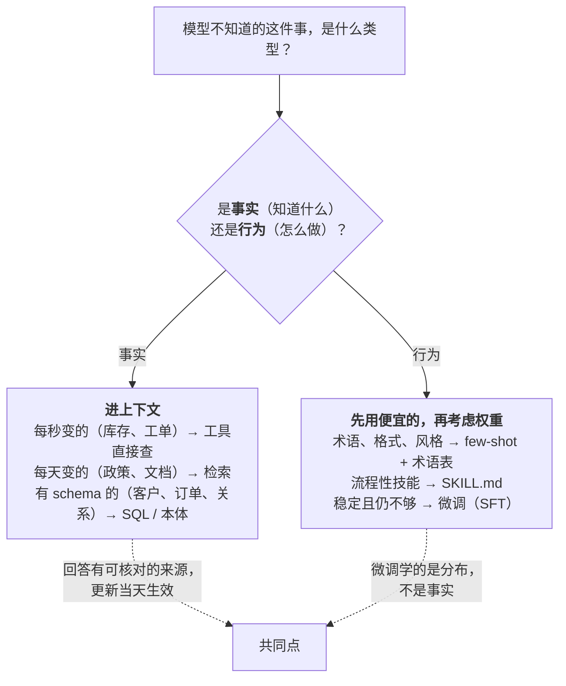

通用模型不知道你的业务：不知道你的退款政策、不知道你的产品型号、不知道你的代码库、不知道"活跃客户"在你们公司的定义。让它知道有两条路：**放进上下文**——每次请求时把相关内容检索出来放在 L2 讲的那一层里，或者让模型调工具去查；**放进权重**——用你的数据微调或继续预训练。两条路的成本、灵活性、可追溯性差一个量级，而多数团队第一次做决定时选错了方向：想让模型"学会"产品手册，于是拿手册做 SFT。

这一篇只做一件事：给出**知识类型 → 接入方式**的决策表，并解释每一格为什么这样填。它是整个系列的入口——后面六篇讲的检索、解析、索引、agentic、结构化、评测，只对走了"进上下文"这条路的知识有意义；而"该不该微调"这个问题，本篇给出应用工程师需要的全部判断，微调的**方法**留给算法地图 L5。

本篇要回答的核心问题是：

> **为什么微调不是灌知识的工具？[^q0] 哪些知识进上下文、哪些进权重，判据是什么？[^q1] 默认顺序 prompt → few-shot → 检索 / 工具 → 微调，每一步的代价是什么？[^q2]**

## 一、总览

### 1. 决策表




| 知识类型 | 例子 | 接入方式 | 为什么 |
|---|---|---|---|
| 会变的事实 | 价格、库存、政策、工单状态、日程 | 检索，或工具直接查系统；**永远不进权重** | 变了要能立刻反映；要能引用来源；要按权限过滤 |
| 结构化业务数据与关系 | 客户—订单—工单、组织架构、设备台账 | SQL / API / 本体 / 图谱（第六篇） | 有 schema 的数据用 schema 查最准；关系推理向量做不了 |
| 非结构化文档 | 制度、合同、技术文档、会议记录、聊天记录 | 检索（词法 + 向量 + rerank，第二到四篇） | 量大、会更新、要引用 |
| 领域术语与表达习惯 | 行业黑话、公司内部说法、产品名的写法 | few-shot 示例；量大且稳定时微调 | 这是**行为**不是事实——模型要学会"怎么说"，不是"是什么" |
| 流程性技能 | 怎么写这类报告、怎么审这类单、怎么用这套内部工具 | 示例 + 工具（L2 的 SKILL.md）；效果不够再 SFT | 先用便宜的手段，微调是最后一步 |
| 海量领域语料的整体适应 | 法律、医学、某种编程语言的整个生态 | 继续预训练（贵），**且仍要配检索**给事实与引用 | 权重里的知识不可引用、不可更新、会遗忘 |

Table: 知识类型与接入方式的决策表

表的右半边有一条清楚的分界：**事实进上下文，行为进权重**。检索与工具解决"知道什么"，微调解决"怎么做"。

### 2. 本文的章节安排

第二章讲为什么微调不是灌知识的工具——四个技术原因与一个公开实验；第三章逐行讲决策表；第四章讲默认顺序与每步的代价；第五章讲两条路的结合（RAFT 一类）与继续预训练的位置；第六章讲怎么在自己的知识源上做这个决策；第七章实践建议。

## 二、为什么微调不是灌知识的工具

### 1. 四个技术原因

**不可靠**。SFT 让模型学会在给定输入下产出给定输出的分布。用几千条"问：产品 X 的保修期？答：两年"训练，模型会在一部分问题上答对、在另一部分上产出**格式相同、内容编造**的答案——因为它学到的是"这类问题要用这种句式答一个年限"，而不是把每条事实存进了可查的表。L1 第一篇的幻觉机制在微调后不会消失，只是换了措辞。2023 年微软的对比实验（*Fine-Tuning or Retrieval?*）在同一批新知识上比较两条路：检索显著优于微调，即使把同一事实以多种改写重复出现在训练集里，微调的准确率仍远低于检索——模型对"见过一次的事实"的记忆非常弱。

**会遗忘**。继续训练会覆盖一部分原有能力（灾难性遗忘）；为了灌事实做的微调常常让模型在通用任务上变差，而且你不知道哪些变差了——除非有完整的回归评测。

**无法引用**。权重里的知识没有来源。用户问"这条政策出自哪里"，模型给不出条目编号——而 L1 第一篇讲的法律责任（Air Canada、哈姆法院）恰恰要求你能证明模型说的话有依据。检索天然带来源。

**无法更新与过滤**。政策改了一条，微调要重训（几小时到几天、几十到几千美元、再跑一遍回归）；不同用户能看到的文档不同，权重没有权限概念——它对所有人说同样的话。检索改一条文档就是重建一个块的索引，权限在检索时过滤（第四篇）。

### 2. 微调擅长什么

**行为**：输出的风格与格式（一致的报告结构）、术语的使用习惯（公司内部叫法）、工具调用的模式（什么情况下调哪个工具、参数怎么填——agent 场景下微调对工具调用准确率的提升是真实的）、拒答的边界、对特定 schema 的遵循。这些都是"分布"而不是"事实"，正是 SFT 学得好的东西。判断一件事该不该微调，问：**它是"知道什么"还是"怎么做"？** 前者不微调。

### 3. 一个对照

同一个客服场景，两个团队：A 团队把 3,000 条 FAQ 做成 SFT 数据训了模型，上线三周后政策更新，模型继续按旧政策答，且答不出出处；B 团队把 FAQ 建成检索库、让模型只能引用检索到的条目，政策更新当天重建索引，每条回答带条目号。A 团队花了两周训练与评测，B 团队花了两天。三个月后 B 团队把积累的"用户问法 → 正确条目"数据拿去微调一个小模型做**查询改写**（行为），检索召回率提高——这是微调正确的用法。

## 三、逐行讲决策表

### 1. 会变的事实：检索或工具

价格、库存、政策、工单状态。判据只有一条：**它会变**。变的频率决定检索还是工具——每天变的（政策）走文档检索，每秒变的（库存、工单状态）走工具直接查系统（L1 第二篇的工具调用）。两者的共同点是模型的回答有一个**可核对的来源**，且来源更新时回答同步更新。L1 第一篇的知识截止问题在这一行彻底解决：模型不需要"知道"，只需要"查到"。

### 2. 结构化业务数据：SQL / API / 本体

客户、订单、工单、设备之间的关系。把它们导出成文本切块塞进向量库是常见的错误：向量相似度不理解"这个客户的所有未完成订单"这种关系查询，会返回"看起来像订单的段落"。有 schema 的数据用 schema 查——text-to-SQL 加语义层、业务 API、或者把对象与关系建成本体（第六篇）。检索在这里的角色是**找到该查哪张表 / 哪个对象**，不是直接给答案。

### 3. 非结构化文档：检索

制度、合同、技术文档、会议记录。这是 RAG 的主场，也是本系列第二到五篇的内容。三个前提让它非走检索不可：**量大**（放不进上下文、或放进去也用不好——L1 第一篇的有效长度）、**会更新**、**要引用**。小而稳定的文档可以全放上下文配缓存（L2 第六篇的决策表），但一旦超过几万 token 或每周更新，检索是唯一选择。

### 4. 领域术语与表达习惯：few-shot，稳定时微调

公司把"退货"叫"逆向"、把某类客户叫"KA"、产品名有固定的大小写。这是行为：模型要学会用你们的词。第一步是 few-shot（L2 第二篇：格式与风格示例是 few-shot 仍然有效的场景）与术语表（一份几百 token 的对照表放在 system 的半静态层）；量大（几千条术语）且稳定（一年不变）时，微调一个小模型比每次带几千 token 的术语表便宜。判据是**稳定性**：术语表每月变就不要微调。

### 5. 流程性技能：示例 + 工具，再 SFT

"怎么写这类报告"、"怎么审这类单"。先用 L2 第六篇的 SKILL.md（步骤、检查清单、模板、脚本）——它是可版本化的、可审查的、改起来是改文件不是重训；效果不够（模型在几十步的流程里仍走偏）再考虑 SFT 强化这个流程的行为。多数团队停在第一步就够了。

### 6. 海量领域语料：继续预训练 + 检索

法律、医学、某种小众编程语言。通用模型在这些领域的**语言本身**（术语密度、推理模式）不熟，继续预训练（在几十亿 token 的领域语料上继续训练）能提高整体适应——这是算法地图 L5 的工作，成本以 GPU 周计。但它解决的仍是"怎么说"与"怎么推理"，事实与引用仍要配检索：一个法律模型也要检索具体的条文与判例，而不是"记得"它们。

## 四、默认顺序与代价

### 1. 顺序

```text
prompt  →  few-shot  →  检索 / 工具  →  微调（SFT / LoRA）  →  继续预训练
便宜 · 分钟级改动 · 可追溯 · 灵活                      贵 · 天级 · 不可追溯 · 僵硬
```

每往右一步，代价上一个量级，灵活性下一个量级：

| 步骤 | 改一次的成本 | 改一次的时间 | 可追溯 | 权限 | 回归风险 |
|---|---|---|---|---|---|
| prompt | 几乎为零 | 分钟（L2 第六篇的门禁） | 是（版本） | — | 低（评测集） |
| few-shot | token 成本（L1 第四篇） | 分钟 | 是 | — | 低 |
| 检索 / 工具 | 索引与检索系统的运营 | 分钟到小时（重建索引） | **是**（引用） | **是**（检索时过滤） | 低 |
| 微调 | 数据准备 + 训练（几十到几千美元）+ 全量回归评测 | 小时到天 | 否 | 否 | **高**（遗忘、行为漂移） |
| 继续预训练 | GPU 周 | 周 | 否 | 否 | 高 |

Table: 改知识的四步及其代价

### 2. 为什么不跳步

跳过便宜的步骤直接微调，常见的后果是：花了两周训练解决了一个 few-shot 十分钟能解决的问题；或者微调之后发现效果提升来自训练数据里的事实被"记住"了一部分——上线后事实一变全部作废。原则：**每一步都要在评测集（L1 第五篇）上证明前一步不够，再往右走**。多数应用停在第三步。

### 3. 微调的正确位置

微调在这条链上的正确位置是**末端的行为优化**：检索系统已经稳定、评测集已经积累了几千条真实的（输入，理想输出）对、prompt 与 few-shot 调到极限仍差几个百分点的遵循率或格式一致性——此时用这些数据 SFT 一个小模型，把 prompt 里几千 token 的规则与示例"编译"进权重，省 token、提一致性。这与"灌知识"是两件事。L6 会讲微调作为成本优化手段的账。

## 五、两条路的结合

### 1. RAFT：让模型更会用检索结果

RAFT（Retrieval-Augmented Fine-Tuning，2024）的思路是：微调的目标不是记住事实，而是学会**在检索结果里找答案、忽略干扰文档、引用正确的段落**——训练数据是（问题，一组含正确与干扰文档的检索结果，带引用的答案）。它把微调用在了行为上（怎么用检索），事实仍在检索库里。对检索质量已经不错但模型"不会用"（引用错段落、被干扰文档带偏）的场景有效。

### 2. 微调 embedding 与 rerank

另一个正确的微调对象是**检索系统本身**：用真实的（查询，相关文档）对微调 embedding 模型或 rerank 模型，让它们适应你的领域词汇（"逆向" = "退货"）。这是算法地图的内容，应用侧要做的是积累这些对（第七篇的评测集正是它们的来源）。

### 3. 继续预训练之后仍要检索

领域继续预训练让模型更会说这个领域的话；具体的条文、数据、案例仍然要检索——因为它们会变、要引用、要按权限过滤。两条路不是替代，是分工：权重管语言与推理，上下文管事实与依据。

## 六、在自己的知识源上做决策

### 1. 清单

把你的应用要用到的每一个知识源列出来，按四个问题分类：

| 问题 | 答"是"的含义 |
|---|---|
| 它会变吗？多久变一次？ | 会变 → 进上下文（检索或工具）；每秒变 → 工具 |
| 有 schema 吗？ | 有 → SQL / API / 本体，不进向量库 |
| 需要引用来源吗？ | 需要 → 进上下文 |
| 不同用户能看到的不同吗？ | 是 → 进上下文，检索时过滤 |

Table: 知识源分类的四个问题

四个问题任何一个答"是"，就不进权重。全部答"否"的知识源（稳定、无 schema、不需引用、对所有人相同）才考虑权重——通常只剩术语、风格与流程。

### 2. 一个例子

一个 B2B 客服助手的知识源：产品手册（每季度更新、需引用 → 检索）、价格表（每周更新、有 schema → 工具查系统）、客户合同（每客户不同、需引用、权限敏感 → 检索 + 权限过滤）、公司术语（稳定 → 术语表 few-shot，一年后考虑微调）、回复风格（稳定 → prompt，积累数据后微调小模型）。五个知识源，一个可能微调，且是最后才做。

## 七、实践建议

1. **列知识源清单**，按第六章四个问题分类，产出每个源的接入方式；这张表是后面六篇的输入。
2. **找出已被"微调进去"的事实**：如果你的应用已经微调过，检查训练数据里有多少是会变的事实，把它们迁到检索。
3. **每一步在评测集上证明前一步不够**再往右走；把这条写进设计评审。
4. **积累（查询，相关文档）对**：从第一天起记录用户查询与最终被采纳的文档——它们是评测集（第七篇）与将来微调 embedding / rerank 的数据。
5. **术语表先做成 few-shot**，一年后再看是否值得微调。

## 八、本文小结

- 两条路：进上下文（检索、工具）与进权重（微调、继续预训练）；分界是**事实进上下文，行为进权重**。
- 微调不是灌知识的工具：不可靠（*Fine-Tuning or Retrieval?* 的实验：检索显著优于微调）、会遗忘、无法引用、无法更新与按权限过滤；它擅长的是风格、格式、术语、工具调用模式这些"怎么做"。
- 决策表六行：会变的事实 → 检索 / 工具；结构化数据 → SQL / API / 本体；非结构化文档 → 检索；术语 → few-shot 再微调；流程 → 示例 + 工具再 SFT；海量领域语料 → 继续预训练 + 检索。
- 默认顺序 prompt → few-shot → 检索 / 工具 → 微调 → 继续预训练，每步代价上一个量级；每一步要在评测集上证明前一步不够；多数应用停在第三步；微调的正确位置是末端的行为优化。
- 结合：RAFT 微调"怎么用检索结果"，微调 embedding / rerank 适应领域词汇，继续预训练之后仍要检索。
- 四个问题（会变吗、有 schema 吗、要引用吗、按用户不同吗）任一答"是"就不进权重。

## 九、自测

1. 团队用 5,000 条"问题—答案"对 SFT 了一个客服模型，上线后发现它对训练集外的产品也自信地给出保修期。用本文解释原因，并给出修法。

   <details markdown="1">
   <summary>答案</summary>
   SFT 学到的是"这类问题用这种句式答一个年限"的分布，不是每条事实的可查记录；训练集外的产品触发同样的句式、内容编造——幻觉换了措辞没有消失。修法：保修期是会变的事实，迁到检索或工具查系统，模型只能引用检索到的条目；把 SFT 数据用于行为（回复风格、格式）而不是事实。详见[第二章](#二为什么微调不是灌知识的工具)。
   </details>

2. 以下知识源各该走哪条路：（a）每小时变化的航班状态；（b）一份 2,000 页、每年修订一次的操作规程；（c）公司对客户的分级叫法（S / A / B 级）；（d）客户—合同—发票的关联。

   <details markdown="1">
   <summary>答案</summary>
   （a）工具直接查系统——每秒级变化不适合文档检索；（b）检索——量大、会更新、要引用；（c）few-shot 术语表（稳定且量小），一年后可考虑微调进小模型；（d）结构化：SQL / API / 本体，不进向量库——关系查询向量做不了。详见[第一章](#一总览)、[第三章](#三逐行讲决策表)。
   </details>

3. 为什么检索能满足"按用户权限给出不同答案"而微调不能？这对合规场景意味着什么？

   <details markdown="1">
   <summary>答案</summary>
   检索在查询时按用户的权限过滤文档（元数据过滤进查询），模型只看到该用户能看的；权重里的知识没有权限概念，微调进去的事实对所有用户一样，无法区分。合规场景（客户合同、内部薪酬、分级信息）因此只能走检索 + 检索时过滤，且过滤要在检索阶段而不是生成后——模型已经看到了就可能泄漏。详见[第二章](#二为什么微调不是灌知识的工具)、[第六章](#六在自己的知识源上做决策)。
   </details>

4. RAFT 微调的训练数据长什么样？它微调的是"知道什么"还是"怎么做"？

   <details markdown="1">
   <summary>答案</summary>
   （问题，一组检索结果——含正确文档与干扰文档，带引用的答案）三元组。它微调的是"怎么做"：在检索结果里找答案、忽略干扰、引用正确段落；事实仍在检索库里，不进权重。适合检索质量已不错但模型不会用（引用错、被干扰带偏）的场景。详见[第五章](#五两条路的结合)。
   </details>

5. 一个团队 prompt 调了一周，遵循率 91%，想直接微调。按第四章，他们跳过了什么？该先做什么？

   <details markdown="1">
   <summary>答案</summary>
   跳过了 few-shot 与检索 / 工具两步，以及"在评测集上证明前一步不够"的原则。该先看 9% 的失败是什么：格式与风格问题加 few-shot 示例；缺事实的问题加检索或工具；指令冲突改 prompt 结构（L2 第二篇）。只有当这些都到极限、且已积累几千条真实数据、目标是把规则"编译"进权重省 token 时，才做 SFT——那是末端的行为优化，不是解决 9% 失败的第一手段。详见[第四章](#四默认顺序与代价)。
   </details>

## 下一篇

[三类检索：词法、向量、结构化——coding agent 为什么只用 grep](/three-kinds-of-retrieval-lexical-vector-structured.html)

[^q0]: 四个原因。不可靠：SFT 学的是输入到输出的分布，不是可查的事实表，模型对见过一次的事实记忆很弱，会用同样句式编造训练集外的答案——微软 2023 年的对比实验里检索显著优于微调，即使事实以多种改写重复出现；会遗忘：继续训练覆盖原有能力，且不知道哪些变差；无法引用：权重里的知识没有来源，而法律责任要求能证明依据；无法更新与过滤：改一条政策要重训与回归，且权重对所有用户说同样的话、没有权限概念。微调擅长的是行为——风格、格式、术语、工具调用模式、拒答边界。详见[第二章](#二为什么微调不是灌知识的工具)。

[^q1]: 分界是事实进上下文、行为进权重。会变的事实（价格、库存、政策、状态）→ 检索或工具查系统，永远不进权重；结构化业务数据与关系 → SQL / API / 本体 / 图谱，不进向量库；非结构化文档（量大、会更新、要引用）→ 检索；领域术语与表达习惯 → few-shot 术语表，量大且稳定时微调；流程性技能 → 示例 + 工具（SKILL.md），不够再 SFT；海量领域语料 → 继续预训练但仍配检索。判据四问：会变吗、有 schema 吗、要引用吗、按用户不同吗——任一答"是"就不进权重。详见[第一章](#一总览)、[第三章](#三逐行讲决策表)、[第六章](#六在自己的知识源上做决策)。

[^q2]: 每往右一步代价上一个量级、灵活性下一个量级：prompt 改一次几乎零成本、分钟级、有版本可追溯；few-shot 多花 token；检索 / 工具要运营索引与检索系统，改动是重建索引（分钟到小时），但可引用、可按权限过滤、回归风险低；微调要数据准备与训练（几十到几千美元）加全量回归，小时到天，不可追溯、无权限、回归风险高（遗忘、行为漂移）；继续预训练以 GPU 周计。原则是每一步在评测集上证明前一步不够再往右走；多数应用停在第三步；微调的正确位置是末端的行为优化——把调到极限的 prompt 与积累的数据编译进权重。详见[第四章](#四默认顺序与代价)。
