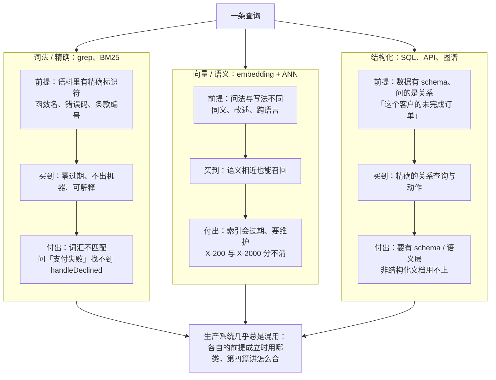

"RAG"这个词让很多人以为检索只有一种做法：切块、embedding、向量库、top-k。实际上检索有三类，各有前提条件，生产系统几乎总是混用：**词法 / 精确**（grep、glob、BM25、全文索引），**向量 / 语义**（embedding + 近似最近邻），**结构化**（SQL、API、图谱、本体）。三类不是新旧之分，是**适用条件**之分——同一份语料满足哪类的前提，就用哪类。

2025–2026 年最好的教材是 coding agent 的架构分歧。Claude Code 的团队公开说他们从 RAG 加本地向量库起步，然后放弃了它，因为 agent 拿着 grep 自己搜"通常效果更好"，还避开了索引带来的安全、隐私、过期与可靠性问题；Cline 从设计上不索引；Sourcegraph 在 Cody 5.3 里移除了 embedding。同时 Cursor 与 Windsurf 继续索引，并为保持索引新鲜建了一整套机器：Merkle 树同步文件哈希、按块哈希缓存 embedding、内容证明。两个最好的 coding agent 在架构层面不同意——分歧点不是语义与词法谁更准，是**谁付过期税**。理解这个分歧，就理解了三类检索的分工。

本篇要回答的核心问题是：

> **三类检索各适合什么、不适合什么？[^q0] Claude Code 为什么放弃向量库而 Cursor 没有，分歧的真正轴是什么？[^q1] 为什么把 coding agent 的 grep 经验搬到企业文档上会失败？[^q2]**

## 一、总览

### 1. 三类检索

| | 词法 / 精确 | 向量 / 语义 | 结构化 |
|---|---|---|---|
| 做法 | grep、glob、BM25、全文索引（Elasticsearch / Lucene） | embedding 模型把文本变向量，ANN 索引找最近邻；混合检索 + rerank | SQL、业务 API、知识图谱、本体（第六篇） |
| 匹配的是 | 字面（词、标识符、正则） | 语义相近（同义、改述、跨语言） | schema 定义的关系与属性 |
| 适合 | 有精确标识符的语料（代码、日志、配置、带编号的制度）；范围可枚举（一个仓库）；agent 能多轮迭代（没找到换词再搜） | 非结构化文档；用户问法与文档措辞不一致；大规模语料（百万到千万文档） | 有 schema 的业务数据；实体关系；"agent 该对什么对象做什么动作"；权限随对象走 |
| 不适合 | 词汇不匹配（"报销标准" vs "差旅费用规定"）；语义相近表述不同；千万级文档的单次查询 | 精确匹配（型号、编号、函数名）；关系推理（谁调用谁）；数据频繁变化（索引过期） | 自由文本 |
| 索引 | 无（grep）或倒排索引（BM25，构建便宜、增量容易） | 向量索引（构建要过一遍 embedding 模型，**内容变了要重算**） | 数据库 / 图本身 |
| 过期 | 无（grep 读当前文件）；倒排索引增量更新快 | **有**：文档变了 embedding 就旧了，要重算 | 无（查的是当前数据） |
| 透明度 | 高：为什么命中一眼可见 | 低：相似度分数不可解释 | 高：查询语句可读 |
| 代表 | Claude Code、Codex CLI、Cline 的代码搜索；ripgrep | Cursor / Windsurf 的代码索引；企业知识库；客服 FAQ | Palantir Ontology；text-to-SQL；LSP 的定义 / 引用 |

### 2. 本文的章节安排

第二章讲词法检索——它的前提与为什么在这些前提下它更好；第三章讲 coding agent 的分歧——两个阵营各换了什么；第四章讲向量检索——它解决词法解决不了的什么、代价是什么；第五章讲三类都缺的东西——关系——与结构化检索的位置；第六章讲混用的原则；第七章实践建议。

## 二、词法检索：前提满足时它更好

### 1. 三个前提

词法检索在三个前提同时成立时是最优选择：

- **语料有精确标识符**。代码里的函数名、变量名、错误码；日志里的请求 id；配置里的键名；制度里的条款编号。用户（或 agent）问的就是这些标识符，字面匹配就是正确匹配，语义相似反而是噪声（问 `chargeCard` 不想要 `billCustomer`）。
- **范围可枚举**。一个仓库、一个目录、一批日志文件——grep 能在秒级扫完；千万级文档不行。
- **能多轮迭代**。agent 第一次搜没找到，看到结果里的线索，换个词再搜——这是人查代码的方式。单次问答（用户问一次就要答案）没有这个机会。

代码同时满足三个前提，所以 coding agent 天然倾向词法。

### 2. 它买到的东西

- **零过期**。grep 读的是磁盘上当前的文件；你刚改的一行立刻可搜。向量索引在你重命名一个符号的瞬间就旧了。
- **不出机器**。没有内容被发到 embedding 服务；对代码这类敏感资产是硬需求。Anthropic 把安全与隐私列为放弃向量库的理由之一。
- **透明**。搜索结果为什么命中一眼可见，调试 agent 的行为时能复现它看到了什么。
- **无基础设施**。没有索引要建、要同步、要运维。

### 3. 它付的代价

- **每次查询的延迟与 token**。agent 要多轮搜索、读文件，每一轮是一次模型调用加工具返回进上下文——L2 第一篇的增长问题、第四篇的卸载与清理在这里最尖锐。
- **词汇不匹配**。问"处理支付失败的地方"，grep 不知道该搜 `payment`、`charge`、`billing` 还是 `transaction`；agent 会猜几次，通常能猜到，但这是多轮的代价。
- **大仓库的冷启动**。五万个文件的 monorepo 上，"找到所有实现了某接口的类"靠 grep 要很多轮；这是 Cursor 一类索引方案的强项。

## 三、coding agent 的分歧

### 1. 两个阵营

| | 阵营一：索引（Cursor、Windsurf、Devin Desktop） | 阵营二：agentic 搜索（Claude Code、Codex CLI、Cline、Cody 5.3+） |
|---|---|---|
| 做法 | 把仓库切成语法块、embedding、存向量库，查询时语义搜索 | 模型拿 grep / glob / read / LSP 实时导航，像开发者一样 |
| 保持新鲜的机器 | Merkle 树跟踪文件哈希，只重算变了的块；embedding 按块哈希缓存；"内容证明"保证不搜到自己没有的代码 | 无——读的就是当前文件 |
| 什么离开机器 | 代码块发去 embedding；向量与元数据（行号范围、混淆后的路径）存在远端（Cursor 用 turbopuffer） | 无 |
| 强项 | 超大仓库的快速冷搜索；词汇不匹配的查询（"处理重试逻辑的地方"） | 精确标识符；永远新鲜；无索引基础设施；透明 |
| 弱项 | 过期税；跨文件类型关系与间接依赖的召回下降；用户反映"不指定文件时 agent 很浅" | 每次查询多轮、多 token；大仓库冷启动慢 |
| 公开表态 | Cursor 文档详述索引机制 | Anthropic：从 RAG + 本地向量库起步后放弃，agentic 搜索"通常效果更好"；Cline 2025-05 声明不做 RAG；Sourcegraph Cody 5.3 移除 embedding 改用自家搜索 |

Anthropic 在 2025 年 9 月的 Agent SDK 文章里给了一句可以直接引用的判断："语义搜索通常比 agentic 搜索快，但更不准确、更难维护、更不透明。"以及建议："从 agentic 搜索开始，只在需要更快的结果或更多变化时再加语义搜索。"

### 2. 分歧的真正轴：过期税

两个阵营都能做到高准确率——这不是准确率之争。真正的轴是**新鲜度的成本由谁付**：

- 索引方案把成本付在**写路径**：每次文件变化触发重算，为此要 Merkle 树、块哈希缓存、增量同步、远端存储、一致性保证——Cursor 公开的机制说明这有多重。换来读路径的快：一次查询、毫秒级、覆盖全仓库。
- agentic 方案把成本付在**读路径**：每次查询多轮、多 token、秒级。换来写路径为零：没有任何东西要同步。

哪个便宜取决于**读写比**：一个代码库每天改几百次、agent 每天查几千次，索引方案的写成本被读次数摊薄；一个 agent 在一个任务里连续读写同一批文件几十次，索引每次都在过期与重算之间，agentic 更划算。这也是为什么两个阵营都在**混合**：Cursor 有自己的即时 grep 引擎加语义搜索，Claude Code 有 LSP（结构化）加 grep。

### 3. 一个数字

一份公开的对比称 Claude Code 在同等自主任务上比 Cursor 少用约 5.5 倍 token——这与"agentic 搜索每次查询更多 token"看似矛盾，其实不矛盾：索引方案的检索结果（一批语义相近的块）作为上下文进入每一轮请求，占的是 L2 第一篇里 ⑤ 检索结果那一层，且相关性不精确时噪声多；agentic 搜索读的是精确定位到的文件。谁更省 token 取决于检索的精确度，不取决于检索的形式。这个数字来自第三方对比，不同任务上会不同，但它提醒：**索引不等于省 token**。

## 四、向量检索：解决词汇不匹配

### 1. 它解决的问题

用户问"差旅报销上限是多少"，制度里写的是"出差费用标准"；用户问"怎么退货"，FAQ 写的是"逆向流程"；用户用中文问，文档是英文。词法检索在这些情形下召回为零，向量检索把语义相近的文本映射到相近的向量——这是它存在的理由。企业文档恰好不满足词法的三个前提：没有精确标识符、用户问法与文档措辞不一致、量大、且用户是一次问答不会迭代。

### 2. 它的代价

- **过期**：文档变了 embedding 要重算；embedding 模型换了**全量**重算（L1 第五篇的隐藏成本）。
- **精确匹配差**：型号 "X-200" 与 "X-2000" 在向量空间里很近；函数名、编号、日期这类精确信息向量抓不住——所以要配 BM25 做混合（第四篇）。
- **不透明**：相似度 0.83 不能解释为什么命中；调试靠看具体返回的块。
- **基础设施**：embedding 服务、向量库、增量更新、监控。
- **有效性依赖分块与解析**（第三篇）：切坏了的块 embedding 再准也没用。

### 3. 它的正确位置

非结构化文档的语义定位——找到"最可能包含答案的几段"。然后要么直接生成，要么作为 agentic 检索的一个工具（第五篇）。它不是检索的全部，是三类之一。

## 五、三类都缺的东西：关系

### 1. embedding 是点，不是边

一个 embedding 是向量空间里的一个点，"近"的含义是"语义相似"。它**不编码关系**：函数 A 调用 B、类 C 实现接口 I、字段 f 在这里写在那里读、客户 X 有订单 Y。问"谁调用了 `chargeCard`"，向量索引返回**长得像 `chargeCard` 的东西**，不是它的调用者；问"改这个签名会影响什么"，没有边可以遍历。grep 稍好——能搜到字面出现 `chargeCard(` 的地方——但分不清定义、调用、注释、字符串。

### 2. 结构化检索补上关系

代码里的关系由 LSP（语言服务器）提供：定义、引用、实现——Claude Code 的工具列表里有 LSP，正是为了这一类查询。业务数据里的关系由 schema 提供：SQL 的 join、本体的对象—关系、图谱的边（第六篇）。**关系查询是结构化检索的专属领地**，词法与向量都做不了。一个成熟的 coding agent 三类齐备：grep 找字面、LSP 找关系、（可选）向量找词汇不匹配的语义。

### 3. 对企业知识的含义

"这个客户去年的所有投诉涉及哪些产品"是关系查询，把工单文档切块 embedding 后问它，得到的是"提到这个客户与投诉的段落"，不是关系的答案。正确做法是先用结构化查询（客户 → 工单 → 产品）拿到对象集合，再对每个对象的非结构化内容做向量检索。第六篇讲本体与图谱怎样把这个模式做成系统。

## 六、混用的原则

### 1. 按语料的性质选主力

| 语料 | 主力 | 辅助 |
|---|---|---|
| 代码库 | 词法（grep）+ 结构化（LSP） | 向量（超大仓库的词汇不匹配查询；索引的过期税要付得起） |
| 日志 / 配置 / 带编号的制度 | 词法（BM25 / 全文索引） | 向量（用户用自然语言描述现象时） |
| 企业文档 / FAQ / 合同 | 向量 + BM25 混合 + rerank | 结构化（按部门、时间、权限的元数据过滤） |
| 业务数据库 | 结构化（SQL / API / 本体） | 向量（找到该查哪个对象、哪张表） |
| 混合语料（文档里引用工单号、工单里附文档） | 结构化定位对象 → 向量 / 词法在对象内检索 | — |

### 2. 让 agent 选

agentic retrieval（第五篇）的一个好处是三类检索可以都做成工具，让模型按问题选：精确标识符用 grep，自然语言描述用向量，关系用 SQL / LSP。工具描述（L1 第二篇）要写清各自适合什么，否则模型会用向量搜函数名。

### 3. 不要照搬

coding agent 的经验（只用 grep）不能照搬到企业文档——三个前提都不满足；企业知识库的经验（向量为主）也不能照搬到代码——过期税与精确匹配的需求让它成为次选。每次都回到第一章的表问三个前提。

## 七、实践建议

1. **对每个语料回答三个前提**（精确标识符？可枚举？能迭代？），三个都满足先用词法，一个不满足考虑向量，有 schema 走结构化。
2. **coding 场景从 agentic grep 开始**（Anthropic 的建议），只在超大仓库或明确的词汇不匹配问题上加索引，并算清过期税。
3. **企业文档默认混合**：向量 + BM25 + rerank（第四篇），不要只上向量。
4. **关系查询单列**：找出你的场景里"谁—什么—关系"类的问题，它们要走结构化，不要指望向量库。
5. **把三类做成工具给 agent**（第五篇），工具描述里写明各自适合什么。

## 八、本文小结

- 检索有三类：词法 / 精确、向量 / 语义、结构化；分工由适用条件决定，不是新旧。
- 词法的三个前提：精确标识符、可枚举范围、能多轮迭代；满足时它买到零过期、不出机器、透明、无基础设施，付的是每次查询的多轮与 token。
- coding agent 的分歧：Claude Code / Codex / Cline / Cody 5.3 走 agentic grep，Cursor / Windsurf 索引（Merkle 树、块哈希缓存、远端向量库）；真正的轴是过期税由写路径还是读路径付，取决于读写比；两个阵营都在混合；索引不等于省 token。
- 向量解决词汇不匹配与大规模语料，代价是过期、精确匹配差、不透明、基础设施、依赖分块；它的位置是非结构化文档的语义定位。
- 三类都缺关系——embedding 是点不是边；关系查询是结构化（LSP、SQL、本体、图谱）的专属领地。
- 混用按语料选主力、让 agent 选工具、不照搬。

## 九、自测

1. 一个团队为 20 万行的单体代码库建了向量索引，agent 问"`processRefund` 在哪里被调用"，返回了六个包含类似函数名的块，没有一个是调用点。用本文解释原因，并给出正确的工具组合。

   

   
答案

   embedding 编码的是语义相似不是关系，"调用"是一条边，向量空间里没有；返回的是"长得像 `processRefund` 的东西"。正确组合：grep 搜字面 `processRefund(` 找到出现位置（词法），LSP 的 find-references 给出精确的调用点（结构化）；向量索引在这个问题上是错误的工具。详见[第五章](#五三类都缺的东西关系)。
   

2. Cursor 为什么需要 Merkle 树与按块哈希的 embedding 缓存？Claude Code 为什么不需要？

   

   
答案

   Cursor 维护向量索引，代码一变 embedding 就旧，要知道哪些文件变了（Merkle 树比较哈希）、只重算变了的块（块哈希缓存）——这是索引方案在写路径付的过期税。Claude Code 用 grep 读当前文件，没有索引就没有过期，写路径成本为零，代价付在读路径（每次查询多轮）。详见[第三章](#三coding-agent-的分歧)。
   

3. 一个客服知识库团队看了 Claude Code 的做法，决定去掉向量库、让 agent 用全文搜索多轮查制度文档。预期会遇到什么问题？

   

   
答案

   三个前提都不满足：制度文档没有精确标识符（用户问"差旅报销上限"文档写"出差费用标准"，全文搜索召回为零）；语料大且用户是单次问答不迭代（客服场景要求一次给答案，多轮搜索的延迟不可接受）；agent 猜词的多轮会让成本与延迟上升。企业文档应走向量 + BM25 混合 + rerank。详见[第二章](#二词法检索前提满足时它更好)、[第四章](#四向量检索解决词汇不匹配)、[第六章](#六混用的原则)。
   

4. 用"读写比"解释什么情况下代码索引方案比 agentic grep 更划算，什么情况下相反。

   

   
答案

   索引把成本付在写路径（每次改动重算），读路径快；agentic 把成本付在读路径（每次查询多轮），写路径为零。代码改动少、查询多（大团队的共享 monorepo、大量只读的搜索）时索引的写成本被读次数摊薄，更划算；一个 agent 在一个任务里对同一批文件高频读写（每改一次索引就过期）时 agentic 更划算。两个阵营都在混合就是因为读写比因场景而异。详见[第三章](#三coding-agent-的分歧)。
   

5. "客户 X 去年所有投诉涉及的产品"这个问题该怎么检索？为什么直接对工单文档做向量检索不对？

   

   
答案

   这是关系查询：客户 → 工单（去年、投诉类）→ 产品，要走结构化（SQL / 本体）先拿到对象集合；如果之后要看每个工单的具体内容，再在这些对象的文本上做向量或词法检索。直接向量检索返回的是"提到客户 X 与投诉的段落"，不保证覆盖全部工单、也不能沿关系聚合到产品——embedding 是点不是边。详见[第五章](#五三类都缺的东西关系)、[第六章](#六混用的原则)。
   

## 下一篇

[文档解析与分块：检索失败的上游](/document-parsing-and-chunking-for-retrieval.html)

[^q0]: 词法 / 精确（grep、BM25、全文索引）：适合有精确标识符、范围可枚举、能多轮迭代的语料（代码、日志、配置、带编号的制度），零过期、不出机器、透明、无基础设施；不适合词汇不匹配、语义相近表述不同、千万级文档的单次查询。向量 / 语义（embedding + ANN，配混合与 rerank）：适合非结构化文档、用户问法与文档措辞不一致、大规模语料；不适合精确匹配（型号、函数名）、关系推理、频繁变化的数据（索引过期、换 embedding 模型要全量重算）、不透明。结构化（SQL、API、图谱、本体、LSP）：适合有 schema 的数据、实体关系、"对什么对象做什么动作"、权限随对象走；不适合自由文本。三类都不编码的东西只有结构化能答：关系。详见[第一章](#一总览)。

[^q1]: Claude Code 团队从 RAG + 本地向量库起步后放弃，因为对代码这类满足词法三前提的语料，agent 拿 grep 多轮搜"通常效果更好"，且避开索引的安全、隐私、过期、可靠性问题；Anthropic 的判断是"语义搜索通常更快但更不准确、更难维护、更不透明"，建议从 agentic 搜索开始；Cline、Cody 5.3 同向。Cursor 继续索引并为新鲜度建了 Merkle 树同步、块哈希缓存、远端向量库（turbopuffer）、内容证明。真正的轴是过期税由谁付：索引付在写路径（每次改动重算）换读路径快，agentic 付在读路径（多轮、多 token）换写路径为零；哪个划算取决于读写比，所以两个阵营都在混合（Cursor 加即时 grep，Claude Code 加 LSP）。索引不等于省 token——检索结果作为上下文进入每轮，相关性不精确时噪声更多。详见[第三章](#三coding-agent-的分歧)。

[^q2]: 因为企业文档不满足词法的三个前提：没有精确标识符（用户问"差旅报销上限"，文档写"出差费用标准"，字面匹配召回为零——词汇不匹配正是向量检索存在的理由）；语料大、范围不可枚举；用户是单次问答不会像 agent 那样多轮换词迭代，且客服场景要求一次给答案，多轮搜索的延迟与 token 不可接受。反过来，企业知识库的"向量为主"经验也不能照搬到代码——过期税与精确匹配需求让它成为次选。每次都回到三个前提判断，企业文档默认向量 + BM25 混合 + rerank，关系查询单走结构化。详见[第二章](#二词法检索前提满足时它更好)、[第四章](#四向量检索解决词汇不匹配)、[第六章](#六混用的原则)。
