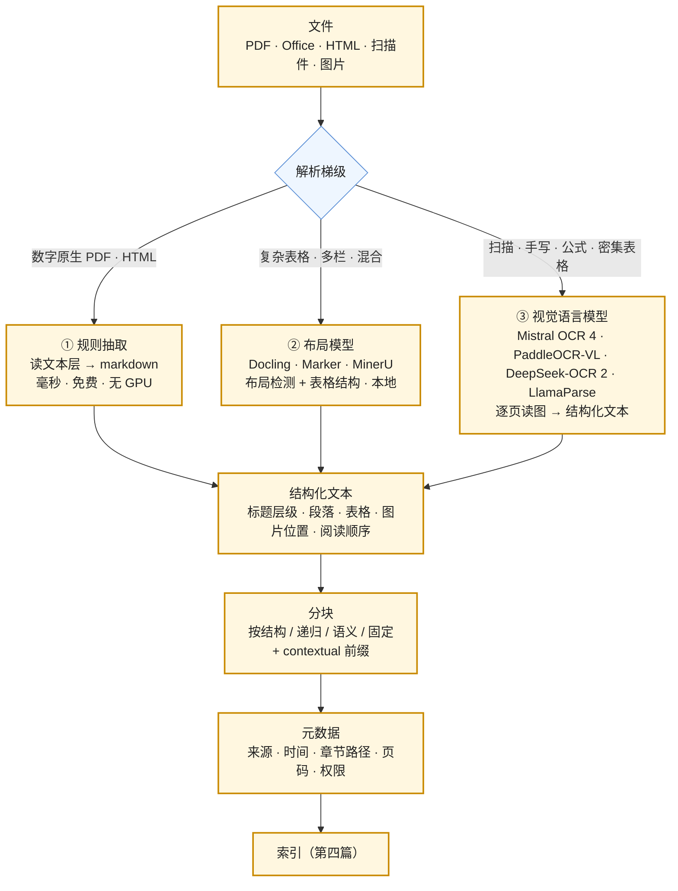

向量库里存的是什么，取决于文档被解析成了什么、又被切成了什么。一份两栏 PDF 被逐行交错成流畅的胡话、一张财务表格被压成一段丢掉了行列、每一页的页眉被注入到每一个块里——这些错误产出的 markdown 看起来干净，embedding 照常算，检索照常返回，只是返回的东西不对。一个开源解析器基准的作者把它叫作"RAG 流水线里最大的静默失败来源"。本篇讲检索的上游：**解析**（把文件变成结构化文本）与**分块**（把文本切成检索的单位），以及块上要带什么**元数据**。

2025 年这一层的格局换了一遍：Docling 1.0、Marker 1.0、MinerU、Mistral OCR、OlmoOCR、PaddleOCR-VL、DeepSeek-OCR 2 相继发布；一个 0.9B 参数的开放模型在文档理解基准 OmniDocBench 上拿到 96.34 分，高于 Gemini 3 Pro 的 92.91 与 GPT-5.2 的 86.59——读文档这件事，小而专的模型胜过前沿通用模型，且权重是 Apache 2.0。这改变了"直接调 OCR API"的默认。

本篇要回答的核心问题是：

> **解析有哪三个梯级、各在什么文档上够用？[^q0] 三个静默失败是什么、怎么发现？[^q1] 分块怎么选，contextual retrieval 为什么有效，元数据里为什么必须有权限？[^q2]**

## 一、总览

### 1. 从文件到块

### 2. 本文的章节安排

第二章解析的三个梯级与怎么选；第三章三个静默失败与检测；第四章分块策略；第五章 contextual retrieval 与 late chunking；第六章元数据与权限；第七章实践建议。

## 二、解析的三个梯级

### 1. 梯级一：规则抽取

PyMuPDF4LLM、pdfplumber、MarkItDown 一类读 PDF 自带的文本层（或 HTML 的 DOM、Office 的 XML），按坐标重排成 markdown。**毫秒级、免费、无 GPU**，比视觉模型便宜两个量级以上。够用的条件：**数字原生**（文本层存在且正确）、版式简单（单栏、少表格）。对扫描件无效（没有文本层），对复杂表格与多栏常出第三章的错。它是第一步：先用它跑全部文档，把它处理不好的挑出来给上一个梯级。

### 2. 梯级二：布局模型

Docling（IBM，2025 年捐给 LF AI & Data 基金会，MIT 许可）、Marker、MinerU：一个布局检测模型找出页面上的块（标题、段落、表格、图、页眉页脚），一个表格结构模型恢复行列，再按检测到的阅读顺序拼接。**本地运行**（GPU 加速但 CPU 可跑）、**免费、数据不出域**。强项是复杂表格与多栏版式——Docling 是混合语料的默认安全选项，Marker 在学术论文上快而准（GPU 下），MinerU 均衡。一个公开基准（4 个开源解析器 × 6 类 PDF）里 Docling 与 MinerU 在全部文档上可靠完成，Marker 结构分最高但在 17 MB 的大文件上超时。

### 3. 梯级三：视觉语言模型

把每页渲染成图，让一个多模态模型直接"读"出结构化文本。**唯一能可靠处理扫描件、手写、密集财务表格、数学公式**的梯级。两条路线：

- **托管 API**：Mistral OCR 4（每千页 4 美元、批处理 2 美元；170 种语言；输出带边界框、块分类、逐块置信度；可单容器自托管）、LlamaParse（按页计信用点，含 agentic 模式）、Reducto 一类。
- **开放权重的文档 VLM**：PaddleOCR-VL-1.6（0.9B 参数，Apache 2.0，OmniDocBench v1.6 上 96.34 分——1,651 页、10 类文档、5 种语言的基准，Gemini 3 Pro 92.91、GPT-5.2 86.59）、MinerU 的 VLM 后端、DeepSeek-OCR 2、OlmoOCR。**一张 GPU 上的小模型比前沿通用模型更会读文档**，且成本在规模上远低于 API。

这改变了默认：2024 年"调 OCR API"是合理的懒选择；2026 年托管 API 的优势只剩"不用管 GPU"，准确率与大规模成本都在开放模型一侧。

### 4. 怎么选

| 文档 | 梯级 | 理由 |
|---|---|---|
| 数字原生、单栏、少表格（多数内部文档、网页） | ① | 免费、毫秒，够用 |
| 数字原生但多栏 / 复杂表格（论文、财报、说明书） | ② | 表格结构与阅读顺序需要布局模型 |
| 扫描件、传真、手写、照片 | ③ | 没有文本层 |
| 公式、图表密集 | ③ | 布局模型对公式弱 |
| 混合语料、不确定 | ② 为默认，①③ 按文档类型路由 | 先用 ① 快速过一遍，检测到失败信号（第三章）再升级 |

成本量级：① 免费；② 本地 GPU，每页几十到几百毫秒；③ 托管每千页几美元，自托管 VLM 每页几百毫秒到秒级。一个百万页的语料，全部走 ③ 的托管 API 是几千美元、且数据出域；先 ① 再按需 ②③ 通常只有一两成文档要走 ③。

## 三、三个静默失败

### 1. 阅读顺序

两栏 PDF 的文本层按 y 坐标排序时，左右两栏逐行交错——每一行都是流畅的中文，拼起来是胡话。embedding 模型对"胡话"照常算向量，检索照常返回，用户看到的答案引用了一段读不通的文字。表格、脚注、图注插在正文中间也是同一类。**检测**：把解析结果抽样让模型判断"这段文字是否连贯"，或对比 ①② 两个梯级在同一页上的输出差异——差异大的页是可疑页。

### 2. 表格

表格被压成段落后，数字失去了行列：财报里"Q3 营收 1.2 亿"变成一串数字与标签的混合，模型会把 Q3 的数字归到 Q1。解析要**保留表格结构**（markdown 表或 HTML 表），分块要**不切断表格**（一张表一个块，太大的表按行组切并每块重复表头）。**检测**：统计解析结果里的表格数量与原文的对比；抽查大表。

### 3. 页眉、页脚与重复内容

每页的页眉（文档名、章节名）、页脚（页码、版权）被当成正文，切块后每个块里都有同一段噪声——它拉近了所有块的 embedding（都含同样的词），降低了区分度。**检测**：找在超过 N% 的块里重复出现的行。布局模型（②③）能识别并剔除页眉页脚，① 通常不能。

### 4. 其他常见的

图片里的文字丢失（① 完全丢，②③ 能 OCR）；脚注与正文错位；跨页的段落被切成两段；目录页被当成内容（大量短行与页码，检索时容易命中）；扫描件的 OCR 错字（"0" 与 "O"、"1" 与 "l"）——对精确匹配（型号、编号）致命，梯级 ③ 的置信度输出可以用来标记低置信块。

## 四、分块

### 1. 为什么要切

块是检索的单位、也是进入上下文的单位（L2 第一篇的 ⑤）。太大：一个块含多个主题，embedding 是它们的平均，检索精度降，放进上下文占预算；太小：失去上下文（"第 3 条"不知道属于哪一章），embedding 缺少语义。embedding 模型有输入长度上限（Gemini Embedding 001 是 2K token，多数 8K–32K，Cohere Embed v4 128K），块不能超过它。

### 2. 策略

| 策略 | 做法 | 适合 | 陷阱 |
|---|---|---|---|
| 固定长度 | 每 N 个 token 一块，相邻块重叠 M | 无结构的纯文本；baseline | 切断句子、段落、表格 |
| 递归 | 先按大分隔（章节）切，超长再按段落、再按句子 | 通用默认 | 分隔符要按文档类型配 |
| 按结构 | 按标题层级、条款编号、函数 / 类边界切 | 制度、合同、代码、手册 | 依赖解析保留了结构；结构单元长度差异大 |
| 语义 | 相邻句子的 embedding 相似度骤降处切 | 主题跳跃的长文 | 计算成本；边界不稳定 |
| 按页 / 按表 | 一页一块、一表一块 | 表格、幻灯片 | 页边界不是语义边界 |

**代码与法律条款要按结构切**：一个函数切成两半、一个条款与它的章节分开，是检索质量最常见的损失之一；解析梯级 ②③ 输出的标题层级与代码块边界让按结构切成为可能。块大小的经验范围是 200–800 token，按语料测（第七篇的评测集）。

### 3. 重叠与父块

相邻块重叠 10–20% 缓解边界切断。**父子块**（small-to-big）：用小块做检索（精确），返回它所属的大块（上下文完整）——检索用 200 token 的句子级块命中，给模型的是它所在的 1,000 token 的段落级父块。这是分块里性价比最高的技巧之一。

## 五、让块带上上下文

### 1. 问题

一个块"本季度营收增长 12%"单独看不知道是哪家公司、哪个季度；embedding 也不知道，检索时"ACME 2025 Q3 营收"匹配不到它。分块把块从文档里"摘"了出来，丢掉了它的位置信息。

### 2. Contextual retrieval

Anthropic 2024 年 9 月提出的做法：对每个块，让模型（读整篇文档与该块）生成一段 50–100 token 的"这块在文档里的位置与含义"（"本块来自 ACME 2025 年 Q3 财报的营收部分，比较了……"），**前置到块上**，再做 embedding 与 BM25 索引。他们的数字：contextual embedding + contextual BM25 让 top-20 检索失败率降低 49%，再加 rerank 降低 67%。成本：每个块一次模型调用（读整篇文档）——用 prompt caching 把文档放在缓存前缀（L1 第四篇、L2 第五篇），每块只付读价，一百万 token 的语料大约一美元量级。

### 3. Late chunking

Jina 2024 年提出的另一条路：先把整篇文档过 embedding 模型（长上下文模型），得到每个 token 的向量，**再**按块边界把 token 向量池化成块向量——每个块的向量已经"看过"全文。不需要额外的模型调用，但需要长上下文的 embedding 模型且文档要放得进它的窗口。

### 4. 结构路径作为前缀

最便宜的做法：把解析得到的标题层级（"第三章 差旅 > 3.2 报销标准 > 3.2.1 住宿"）作为前缀拼到块上。对制度、手册、代码（文件路径 + 类名 + 函数名）效果显著，零模型调用。它是 contextual retrieval 的确定性版本，两者可叠加。

## 六、元数据

### 1. 块上要带什么

| 字段 | 用途 |
|---|---|
| 来源（文档 id、URL、文件路径） | 引用与溯源（L7）；删除与更新时定位 |
| 位置（页码、章节路径、行号） | 引用到具体位置；父块查找 |
| 时间（文档日期、入库时间、版本） | 过滤过期内容；新旧版本并存时的选择 |
| 类型（正文 / 表格 / 图注 / 代码） | 按类型过滤或加权 |
| 语言 | 多语言语料的过滤 |
| **权限**（可见的用户 / 组 / 角色，或文档的 ACL id） | **检索时过滤**（第四篇） |
| 解析置信度 | 低置信块降权或标记 |

### 2. 权限为什么必须在元数据里

生成时过滤（模型看完所有检索结果再删掉用户无权看的）是错的：模型已经在上下文里看到了它不该看的内容，答案可能已经受它影响，注入攻击可以把它诱导出来。正确做法是**检索时过滤**：查询里带用户的权限，向量库只返回该用户可见的块——这要求每个块的元数据里有权限信息，且它与源系统的 ACL 同步（文档权限变了元数据要跟着变）。2024 年 Slack AI 被演示的数据抽取与 Microsoft 365 Copilot 的 SharePoint 过度共享问题（第七篇），根源都是"能搜到不该看的"。

### 3. 元数据从哪来

解析（章节路径、页码、类型、置信度）、源系统（来源、时间、权限）、入库流程（版本、入库时间）。权限最容易漏——它不在文档内容里，要从文件系统、SharePoint、Confluence、Git 的权限模型里取，并建立同步。

## 七、实践建议

1. **抽最难的 20 页**（表格最多、多栏、扫描）跑三个梯级的解析器，人工比对——多数团队会发现梯级 ① 在其中一半页面上有第三章的失败。
2. **建解析质量检测**：连贯性抽检、表格数量对比、重复行检测，作为入库流水线的一步；失败的文档路由到更高梯级。
3. **按结构切**：让解析保留标题层级与代码边界，分块按它们切，表格不切断；块 200–800 token，父子块。
4. **加前缀**：先做结构路径前缀（免费），再对高价值语料做 contextual retrieval（用缓存把成本压到每百万 token 一美元量级）。
5. **元数据表定下来**，权限字段必填，与源系统 ACL 同步；没有权限元数据的文档不入库。
6. **算解析的账**：百万页语料先 ① 后按需 ②③，估算走 ③ 的比例与成本，决定托管还是自托管 VLM。

## 八、本文小结

- 解析三个梯级：规则抽取（毫秒、免费、数字原生够用）→ 布局模型（Docling / Marker / MinerU，本地，复杂表格与多栏）→ 视觉语言模型（Mistral OCR 4 每千页 4 美元、170 语言；PaddleOCR-VL-1.6 0.9B 参数 OmniDocBench 96.34 高于 Gemini 3 Pro 92.91 与 GPT-5.2 86.59，Apache 2.0）——扫描、手写、公式、密集表格只有梯级 ③ 能处理；先 ① 再按需升级。
- 三个静默失败：阅读顺序（多栏交错）、表格（压成段落丢行列）、页眉页脚（每块注入同一噪声）；用连贯性抽检、表格计数、重复行检测发现。
- 分块：固定 / 递归 / 按结构 / 语义 / 按页表；代码与条款按结构切、表格不切断、200–800 token、重叠 10–20%、父子块。
- 让块带上下文：结构路径前缀（免费）、contextual retrieval（Anthropic：失败率 −49%，加 rerank −67%，用缓存控成本）、late chunking（长上下文 embedding 模型）。
- 元数据：来源、位置、时间、类型、语言、**权限**、置信度；权限必须在元数据里以便检索时过滤，生成后过滤已经晚了。

## 九、自测

1. 一份 300 页的年报，数字原生 PDF，有大量三栏表格与两栏正文。该用哪个梯级？用 ① 会出什么问题、怎么发现？

   

   
答案

   梯级 ②（Docling 一类布局模型）：数字原生不需要 OCR，但多栏与复杂表格需要布局检测与表格结构恢复。用 ① 的问题：两栏正文逐行交错成胡话、表格压成段落丢行列。发现：抽样让模型判断连贯性、对比 ①② 在同一页的输出差异、统计表格数量。详见[第二章](#二解析的三个梯级)、[第三章](#三三个静默失败)。
   

2. 为什么 2026 年"直接调 OCR API"不再是默认选择？给出数字。

   

   
答案

   开放权重的文档 VLM 在准确率与大规模成本上都超过了托管 API 与前沿通用模型：PaddleOCR-VL-1.6 只有 0.9B 参数、Apache 2.0，在 OmniDocBench v1.6（1,651 页、10 类、5 语言）上 96.34 分，高于 Gemini 3 Pro 的 92.91 与 GPT-5.2 的 86.59；一张 GPU 可跑。托管 API（Mistral OCR 4 每千页 4 美元）的优势只剩不用管 GPU 与数据出域可接受的场景。详见[第二章](#二解析的三个梯级)。
   

3. 块"本季度营收增长 12%，主要来自华东区"在检索"ACME 2025 Q3 华东营收"时召回不到。用第五章的三种方法各说一句怎么修，并比较成本。

   

   
答案

   结构路径前缀：把"ACME 2025 年 Q3 财报 > 经营分析 > 分区域营收"拼到块前，零模型调用。Contextual retrieval：让模型读全文为该块生成一段位置与含义说明前置，每块一次调用，文档放缓存前缀后每块只付读价，百万 token 约一美元量级，Anthropic 报告失败率 −49%（加 rerank −67%）。Late chunking：整篇过长上下文 embedding 模型后按块池化，无额外调用但需长上下文 embedding 模型。先做第一种，高价值语料叠加第二种。详见[第五章](#五让块带上上下文)。
   

4. 一个团队在生成阶段过滤权限：模型先看全部 top-10 检索结果，回答时只引用用户有权看的。这样够吗？

   

   
答案

   不够。模型已经在上下文里看到了无权文档，答案可能受其影响（即使不引用），注入攻击可诱导它复述；且 top-10 里被过滤掉的位置本可以给有权的文档。权限必须在检索时过滤：块的元数据带 ACL、查询带用户权限、向量库只返回可见块，并与源系统 ACL 同步。详见[第六章](#六元数据)。
   

5. 分块时一张 40 行的财务表格被固定长度策略切成三块。会怎样？该怎么切？

   

   
答案

   第二、三块没有表头，行里的数字失去列的含义，检索命中后模型无法解释数字；embedding 也失去表格的语义。该按表切：一张表一个块，太大则按行组切并在每块重复表头；解析要保留表格结构（markdown / HTML 表）而不是压成段落。详见[第三章](#三三个静默失败)、[第四章](#四分块)。
   

## 下一篇

[索引、混合检索与 rerank](/indexing-hybrid-search-and-reranking.html)

[^q0]: ① 规则抽取（PyMuPDF4LLM 一类读文本层 → markdown）：毫秒、免费、无 GPU，数字原生且版式简单的文档够用，对扫描件无效、对多栏与复杂表格易出错。② 布局模型（Docling——IBM 捐给 LF AI & Data、MIT；Marker；MinerU）：布局检测 + 表格结构模型，本地运行、数据不出域，复杂表格与多栏的最强开源选项。③ 视觉语言模型（托管：Mistral OCR 4 每千页 4 美元、170 语言、边界框与置信度、可自托管；LlamaParse。开放：PaddleOCR-VL-1.6 0.9B 参数、Apache 2.0、OmniDocBench 96.34 高于 Gemini 3 Pro 92.91 与 GPT-5.2 86.59；DeepSeek-OCR 2；OlmoOCR）：唯一能可靠处理扫描、手写、公式、密集表格的梯级。选法：先 ① 过一遍，检测到失败再按文档类型升级；混合语料以 ② 为默认。详见[第二章](#二解析的三个梯级)。

[^q1]: 阅读顺序——两栏 PDF 按坐标排序时左右逐行交错，每行流畅、拼起来是胡话，embedding 照常算、检索照常返回；发现：抽样让模型判断连贯性、对比两个梯级同页输出的差异。表格——压成段落后数字丢失行列，模型把 Q3 的数归到 Q1；发现：统计解析出的表格数与原文对比、抽查大表。页眉页脚——每页的文档名与页码被当正文，切块后每块注入同一噪声、拉近所有块的 embedding；发现：找在超过 N% 块里重复出现的行。另有图片文字丢失、跨页段落被切、目录页被当内容、OCR 错字对精确匹配致命（用梯级 ③ 的置信度标记）。详见[第三章](#三三个静默失败)。

[^q2]: 分块按语料选：制度、合同、代码、手册按结构（标题层级、条款、函数边界）切，表格一表一块或按行组重复表头，通用用递归，块 200–800 token、重叠 10–20%，用小块检索大块返回的父子块。Contextual retrieval 有效是因为分块把块从文档里摘出来丢了位置信息，给每块前置一段模型生成的"位置与含义"说明后 embedding 与 BM25 都能匹配到隐含的实体与时间——Anthropic 报告 top-20 失败率 −49%、加 rerank −67%，用缓存把成本压到百万 token 约一美元；结构路径前缀是它的免费确定性版本，late chunking 是用长上下文 embedding 模型的另一条路。权限必须在元数据里，因为过滤只能在检索时做——生成后过滤模型已经看到了无权内容，可能受影响或被注入诱导复述；元数据要与源系统 ACL 同步。详见[第四章](#四分块)、[第五章](#五让块带上上下文)、[第六章](#六元数据)。
